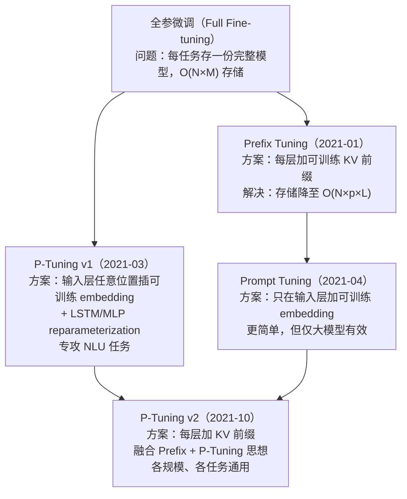

# Prompt-Tuning-Family 专题学习包 Implementation Plan

> **For agentic workers:** REQUIRED SUB-SKILL: Use superpowers:subagent-driven-development (recommended) or superpowers:executing-plans to implement this plan task-by-task. Steps use checkbox (`- [ ]`) syntax for tracking.

**Goal:** 为《大模型算法：强化学习、微调与对齐》第 2.1.4 节配套学习，产出覆盖 Prefix Tuning / Prompt Tuning / P-Tuning v1 / P-Tuning v2 四篇经典论文的完整学习包（论文 PDF + 中文 PPT 风格教学 md + 手写 PyTorch 实现 + peft 对照实现 + 交互 notebook）。

**Architecture:** 在 `learning/prompt-tuning-family/` 下建立标准化目录骨架（papers/lectures/code/notebooks/environment），按"概念由易到难"的顺序（Prompt Tuning → Prefix Tuning → P-Tuning v1 → P-Tuning v2）逐篇推进。每篇产出含 lecture（25-35 张幻灯片）、手写最小实现、peft 调包对照、数值一致性验证脚本、Jupyter notebook。每完成一篇形成一个 git 里程碑提交。

**Tech Stack:**
- Python 3.10+
- PyTorch ≥ 2.0
- Hugging Face transformers ≥ 4.40
- Hugging Face peft ≥ 0.10
- Jupyter Lab + ipykernel
- 演示用模型：`gpt2`（117M，CPU 可跑）

**Spec Reference:** [`docs/superpowers/specs/2026-06-02-prompt-tuning-family-design.md`](../specs/2026-06-02-prompt-tuning-family-design.md)

---

## File Structure

待创建的全部文件：

```
learning/prompt-tuning-family/
├── README.md                                  # 专题总览 + 统一记号表 + 横向对比
├── papers/
│   ├── 01-prefix-tuning-2021.pdf              # arXiv:2101.00190
│   ├── 02-prompt-tuning-2021.pdf              # arXiv:2104.08691
│   ├── 03-p-tuning-2021.pdf                   # arXiv:2103.10385
│   └── 04-p-tuning-v2-2022.pdf                # arXiv:2110.07602
├── lectures/
│   ├── 01-prefix-tuning.md                    # 25-35 slides
│   ├── 02-prompt-tuning.md
│   ├── 03-p-tuning.md
│   └── 04-p-tuning-v2.md
├── code/
│   ├── __init__.py                            # 空文件，方便 import
│   ├── common.py                              # 共用工具（玩具任务数据集等）
│   ├── prefix_tuning_minimal.py
│   ├── prefix_tuning_peft.py
│   ├── prompt_tuning_minimal.py
│   ├── prompt_tuning_peft.py
│   ├── p_tuning_minimal.py
│   ├── p_tuning_peft.py
│   ├── p_tuning_v2_minimal.py
│   ├── p_tuning_v2_peft.py
│   └── tests/
│       ├── test_prefix_consistency.py         # 数值一致性测试
│       ├── test_prompt_consistency.py
│       ├── test_p_tuning_consistency.py
│       └── test_p_tuning_v2_consistency.py
├── notebooks/
│   ├── 01-prefix-tuning.ipynb
│   ├── 02-prompt-tuning.ipynb
│   ├── 03-p-tuning.ipynb
│   └── 04-p-tuning-v2.ipynb
└── environment/
    ├── requirements.txt
    ├── README.md                              # 环境说明 + 验证方法
    └── verify_env.py                          # 自动环境检查脚本
```

每个文件的职责：
- `README.md`：入口文档，解答"为什么这四篇放一起、按什么顺序读、记号如何统一"
- `papers/*.pdf`：arXiv 原版，用于权威参考
- `lectures/*.md`：教学主体，每篇独立可读
- `code/*_minimal.py`：从零实现，依赖最小，让用户看懂"底层在干什么"
- `code/*_peft.py`：peft 调包实现，让用户看懂"工程上怎么用"
- `code/tests/test_*_consistency.py`：数值对照，证明手写与调包行为一致
- `code/common.py`：共用工具（如 toy 数据集、参数量统计），避免重复
- `notebooks/*.ipynb`：交互演示，每个 notebook 把 minimal 与 peft 两版并列展示
- `environment/`：依赖与验证脚本，确保所有 .py 和 notebook 可跑

---

## Phase 1: Infrastructure（基础设施）

### Task 1: 创建目录骨架

**Files:**
- Create: `learning/prompt-tuning-family/papers/.gitkeep`
- Create: `learning/prompt-tuning-family/lectures/.gitkeep`
- Create: `learning/prompt-tuning-family/code/.gitkeep`
- Create: `learning/prompt-tuning-family/code/tests/.gitkeep`
- Create: `learning/prompt-tuning-family/notebooks/.gitkeep`
- Create: `learning/prompt-tuning-family/environment/.gitkeep`
- Create: `learning/prompt-tuning-family/code/__init__.py`（空文件）
- Create: `learning/prompt-tuning-family/code/tests/__init__.py`（空文件）

- [ ] **Step 1：用 PowerShell 一次性创建所有子目录**

```powershell
$base = "c:/Workspace/dummy/learning/prompt-tuning-family"
$dirs = @("papers","lectures","code","code/tests","notebooks","environment")
foreach ($d in $dirs) {
  New-Item -ItemType Directory -Force -Path "$base/$d" | Out-Null
}
```

- [ ] **Step 2：在每个空目录中放 `.gitkeep` 占位（保证 git 跟踪空目录）**

每个目录下都创建一个空的 `.gitkeep` 文件。

- [ ] **Step 3：创建 `code/__init__.py` 和 `code/tests/__init__.py`（空文件）**

让 `code` 和 `code/tests` 成为合法 Python 包，便于将来从测试 `import code.prompt_tuning_minimal`。

- [ ] **Step 4：验证目录结构**

```powershell
Get-ChildItem -Recurse -Directory "c:/Workspace/dummy/learning/prompt-tuning-family" | Select-Object FullName
```

Expected: 6 个子目录都存在。

---

### Task 2: 环境检查与 requirements.txt

**Files:**
- Create: `learning/prompt-tuning-family/environment/requirements.txt`
- Create: `learning/prompt-tuning-family/environment/verify_env.py`
- Create: `learning/prompt-tuning-family/environment/README.md`

- [ ] **Step 1：检查本机现有 Python 环境**

```powershell
python --version
python -c "import sys; print(sys.executable)"
pip --version
```

Expected: Python ≥ 3.10。若不满足，告知用户。

- [ ] **Step 2：检查关键依赖**

```powershell
python -c "import torch; print('torch', torch.__version__, 'cuda', torch.cuda.is_available())" 2>&1
python -c "import transformers; print('transformers', transformers.__version__)" 2>&1
python -c "import peft; print('peft', peft.__version__)" 2>&1
python -c "import jupyterlab; print('jupyterlab', jupyterlab.__version__)" 2>&1
python -c "import ipykernel; print('ipykernel', ipykernel.__version__)" 2>&1
python -c "import matplotlib; print('matplotlib', matplotlib.__version__)" 2>&1
```

每条独立执行。记录哪些缺失、哪些版本号。

- [ ] **Step 3：写 `requirements.txt`**

```
# Prompt-Tuning-Family 专题依赖
# 经测试可在 Python 3.10+ 上运行
torch>=2.0
transformers>=4.40
peft>=0.10
jupyterlab>=4.0
ipykernel>=6.0
matplotlib>=3.7
numpy>=1.24
```

- [ ] **Step 4：补齐缺失依赖**

对每一个缺失或版本过低的包执行：
```powershell
pip install "<package>>=<version>"
```

完成后重新执行 Step 2 验证全部到位。

- [ ] **Step 5：写 `verify_env.py`**

```python
"""
专题环境自检脚本。
运行：python environment/verify_env.py
预期：全部 [OK]，最后打印 "Environment ready."
"""
import sys


def check(name: str, ok: bool, detail: str = "") -> bool:
    flag = "[OK]" if ok else "[FAIL]"
    print(f"{flag} {name} {detail}")
    return ok


def main() -> int:
    all_ok = True

    all_ok &= check("Python >= 3.10", sys.version_info >= (3, 10), f"(got {sys.version.split()[0]})")

    try:
        import torch
        all_ok &= check("torch", True, f"version={torch.__version__}, cuda={torch.cuda.is_available()}")
    except ImportError as e:
        all_ok &= check("torch", False, str(e))

    try:
        import transformers
        all_ok &= check("transformers", True, f"version={transformers.__version__}")
    except ImportError as e:
        all_ok &= check("transformers", False, str(e))

    try:
        import peft
        all_ok &= check("peft", True, f"version={peft.__version__}")
    except ImportError as e:
        all_ok &= check("peft", False, str(e))

    try:
        import jupyterlab
        all_ok &= check("jupyterlab", True, f"version={jupyterlab.__version__}")
    except ImportError as e:
        all_ok &= check("jupyterlab", False, str(e))

    try:
        import ipykernel
        all_ok &= check("ipykernel", True, f"version={ipykernel.__version__}")
    except ImportError as e:
        all_ok &= check("ipykernel", False, str(e))

    try:
        import matplotlib
        all_ok &= check("matplotlib", True, f"version={matplotlib.__version__}")
    except ImportError as e:
        all_ok &= check("matplotlib", False, str(e))

    # 试跑 gpt2 推理一次，确保 huggingface 缓存能用
    try:
        from transformers import GPT2Tokenizer, GPT2LMHeadModel
        tok = GPT2Tokenizer.from_pretrained("gpt2")
        model = GPT2LMHeadModel.from_pretrained("gpt2")
        import torch
        with torch.no_grad():
            out = model(**tok("Hello", return_tensors="pt"))
        all_ok &= check("gpt2 推理", True, f"logits.shape={tuple(out.logits.shape)}")
    except Exception as e:
        all_ok &= check("gpt2 推理", False, str(e))

    print()
    if all_ok:
        print("Environment ready.")
        return 0
    print("Environment NOT ready.")
    return 1


if __name__ == "__main__":
    sys.exit(main())
```

- [ ] **Step 6：写 `environment/README.md`**

```markdown
# 环境配置

## 依赖

见 [requirements.txt](requirements.txt)。

## 安装

```powershell
pip install -r learning/prompt-tuning-family/environment/requirements.txt
```

## 自检

```powershell
python learning/prompt-tuning-family/environment/verify_env.py
```

预期输出末尾：`Environment ready.`

若 huggingface 模型下载慢，可设置镜像：
```powershell
$env:HF_ENDPOINT = "https://hf-mirror.com"
```

## 故障排查

- **`torch` 找不到 CUDA**：本专题所有代码均支持 CPU 跑，可忽略。若需 GPU，参考 [PyTorch 官网](https://pytorch.org/get-started/locally/) 重装。
- **`gpt2` 下载失败**：检查网络/代理，或使用上面的镜像。
```

- [ ] **Step 7：运行自检脚本**

```powershell
python "c:/Workspace/dummy/learning/prompt-tuning-family/environment/verify_env.py"
```

Expected: 最后一行 `Environment ready.`

---

### Task 3: 下载 4 篇论文

**Files:**
- Create: `learning/prompt-tuning-family/papers/01-prefix-tuning-2021.pdf`
- Create: `learning/prompt-tuning-family/papers/02-prompt-tuning-2021.pdf`
- Create: `learning/prompt-tuning-family/papers/03-p-tuning-2021.pdf`
- Create: `learning/prompt-tuning-family/papers/04-p-tuning-v2-2022.pdf`

- [ ] **Step 1：下载 Prefix Tuning（arXiv:2101.00190）**

```powershell
$out = "c:/Workspace/dummy/learning/prompt-tuning-family/papers/01-prefix-tuning-2021.pdf"
Invoke-WebRequest -Uri "https://arxiv.org/pdf/2101.00190" -OutFile $out
(Get-Item $out).Length
```

Expected: 文件大小 > 500 KB。

- [ ] **Step 2：下载 Prompt Tuning（arXiv:2104.08691）**

```powershell
$out = "c:/Workspace/dummy/learning/prompt-tuning-family/papers/02-prompt-tuning-2021.pdf"
Invoke-WebRequest -Uri "https://arxiv.org/pdf/2104.08691" -OutFile $out
(Get-Item $out).Length
```

Expected: 文件大小 > 500 KB。

- [ ] **Step 3：下载 P-Tuning v1（arXiv:2103.10385）**

```powershell
$out = "c:/Workspace/dummy/learning/prompt-tuning-family/papers/03-p-tuning-2021.pdf"
Invoke-WebRequest -Uri "https://arxiv.org/pdf/2103.10385" -OutFile $out
(Get-Item $out).Length
```

Expected: 文件大小 > 500 KB。

- [ ] **Step 4：下载 P-Tuning v2（arXiv:2110.07602）**

```powershell
$out = "c:/Workspace/dummy/learning/prompt-tuning-family/papers/04-p-tuning-v2-2022.pdf"
Invoke-WebRequest -Uri "https://arxiv.org/pdf/2110.07602" -OutFile $out
(Get-Item $out).Length
```

Expected: 文件大小 > 500 KB。

- [ ] **Step 5：验证 PDF 可正常打开（检查文件头 magic number）**

```powershell
Get-ChildItem "c:/Workspace/dummy/learning/prompt-tuning-family/papers/*.pdf" | ForEach-Object {
  $bytes = [System.IO.File]::ReadAllBytes($_.FullName)[0..3]
  $header = -join ($bytes | ForEach-Object { [char]$_ })
  Write-Host "$($_.Name): header=$header"
}
```

Expected: 每行末尾 `header=%PDF`。

---

### Task 4: 写 `code/common.py`（共用工具）

**Files:**
- Create: `learning/prompt-tuning-family/code/common.py`

- [ ] **Step 1：写 common.py**

```python
"""
共用工具：
- 玩具任务数据集（情感二分类）
- 参数量统计
- 词嵌入复制工具（用于 minimal/peft 对照）
"""
from __future__ import annotations

import torch
from torch.utils.data import Dataset


# ----------------------------------------------------------------------------
# 玩具数据集：情感二分类
# ----------------------------------------------------------------------------
POSITIVE_SAMPLES = [
    "I love this movie",
    "This is amazing",
    "Best day ever",
    "What a fantastic show",
    "Absolutely wonderful",
]

NEGATIVE_SAMPLES = [
    "I hate this",
    "This is terrible",
    "Worst day ever",
    "What a boring show",
    "Absolutely awful",
]


class ToySentimentDataset(Dataset):
    """玩具情感数据集，仅用于演示训练流程。"""

    def __init__(self, tokenizer, max_len: int = 16):
        self.samples = [(s, 1) for s in POSITIVE_SAMPLES] + [(s, 0) for s in NEGATIVE_SAMPLES]
        self.tokenizer = tokenizer
        self.max_len = max_len

    def __len__(self) -> int:
        return len(self.samples)

    def __getitem__(self, idx: int) -> dict:
        text, label = self.samples[idx]
        enc = self.tokenizer(
            text,
            padding="max_length",
            truncation=True,
            max_length=self.max_len,
            return_tensors="pt",
        )
        return {
            "input_ids": enc["input_ids"].squeeze(0),
            "attention_mask": enc["attention_mask"].squeeze(0),
            "label": torch.tensor(label, dtype=torch.long),
        }


# ----------------------------------------------------------------------------
# 参数量统计
# ----------------------------------------------------------------------------
def count_parameters(model: torch.nn.Module) -> tuple[int, int]:
    """返回 (可训练参数量, 总参数量)。"""
    trainable = sum(p.numel() for p in model.parameters() if p.requires_grad)
    total = sum(p.numel() for p in model.parameters())
    return trainable, total


def print_param_summary(model: torch.nn.Module, name: str = "model") -> None:
    trainable, total = count_parameters(model)
    pct = 100.0 * trainable / total if total else 0.0
    print(f"[{name}] 可训练参数={trainable:,} / 总参数={total:,} ({pct:.4f}%)")


if __name__ == "__main__":
    from transformers import GPT2Tokenizer

    tok = GPT2Tokenizer.from_pretrained("gpt2")
    tok.pad_token = tok.eos_token
    ds = ToySentimentDataset(tok)
    print(f"数据集大小: {len(ds)}")
    print(f"样本 0: input_ids.shape={ds[0]['input_ids'].shape}, label={ds[0]['label']}")
```

- [ ] **Step 2：运行验证**

```powershell
python "c:/Workspace/dummy/learning/prompt-tuning-family/code/common.py"
```

Expected: 输出"数据集大小: 10"等信息，无异常。

---

### Task 5: 写专题 README.md

**Files:**
- Create: `learning/prompt-tuning-family/README.md`

- [ ] **Step 1：写 README**

包含以下章节（按顺序）：

1. **专题简介**（一段话）
2. **四篇论文一览表**（含 arXiv 链接、发表时间、核心 claim）
3. **演进关系图**（Mermaid，展示问题→改进的脉络）
4. **统一记号表**（全专题统一的数学符号定义）
5. **推荐学习顺序**（明确说明：从简到难，先 Prompt Tuning 后 Prefix Tuning）
6. **四种方法横向对比表**（核心差异一张表说清）
7. **使用说明**（如何读 lecture、如何跑 notebook、如何看 .py）
8. **目录结构**

完整内容示例：

```markdown
# Prompt-Tuning-Family 专题

> 配套《大模型算法：强化学习、微调与对齐》ISBN 9787121500725 第 2.1.4 节。

## 1. 专题简介

本专题覆盖"基于 Prompt 的参数高效微调"四篇经典论文。它们共同的核心思想是：**冻结预训练大模型，只训练一小段"软提示"（soft prompt）参数**，从而在多任务部署时大幅降低存储与计算开销。

四篇论文按时间顺序为：

| 序号 | 方法 | 论文 | 时间 | 单位 |
|------|------|------|------|------|
| ① | **Prefix Tuning** | Optimizing Continuous Prompts for Generation | 2021-01 | Stanford |
| ② | **P-Tuning v1** | GPT Understands, Too | 2021-03 | THU + 智源 |
| ③ | **Prompt Tuning** | The Power of Scale for Parameter-Efficient Prompt Tuning | 2021-04 | Google |
| ④ | **P-Tuning v2** | Prompt Tuning Can Be Comparable to Fine-tuning Universally | 2021-10 | THU |

## 2. 演进关系图



## 3. 统一记号表

本专题在所有 lecture 中保持以下记号一致：

| 符号 | 含义 | 维度 |
|------|------|------|
| $L$ | Transformer 层数 | 标量（如 GPT-2 为 12） |
| $d$ | 隐层维度 | 标量（如 GPT-2 为 768） |
| $n$ | 输入序列长度（不含 prompt） | 标量 |
| $p$ | 可训练 prompt 的长度（token 数） | 标量 |
| $H$ | 注意力头数 | 标量 |
| $d_h$ | 单头维度 = $d / H$ | 标量 |
| $\mathbf{e}_i$ | 第 $i$ 个 token 的 embedding 向量 | $\mathbb{R}^d$ |
| $\mathbf{h}_i^{(\ell)}$ | 第 $\ell$ 层 Transformer 输出的第 $i$ 个位置的隐状态 | $\mathbb{R}^d$ |
| $\mathbf{P}$ | 可训练 prompt embedding 矩阵 | $\mathbb{R}^{p \times d}$（或更高维，因方法而异） |
| $\boldsymbol{\theta}_{\mathrm{LM}}$ | 预训练 LM 全部参数（**冻结**） | — |
| $\boldsymbol{\phi}$ | 可训练参数（仅 prompt 相关） | — |

> **每篇 lecture 头部会给出自己的"扩展记号表"**，但凡用到上述符号，含义保持一致。

## 4. 推荐学习顺序

按**概念由易到难**：

1. **Prompt Tuning**（最简单）—— 理解"什么是软提示"
2. **Prefix Tuning** —— 理解"为什么要在每层加"
3. **P-Tuning v1** —— 理解"为什么需要 reparameterization"
4. **P-Tuning v2** —— 理解"如何统一前面三种"

按**论文发表时间**（仅作历史参考）：① → ② → ③ → ④

## 5. 四种方法横向对比

| 维度 | Prefix Tuning | Prompt Tuning | P-Tuning v1 | P-Tuning v2 |
|------|---------------|---------------|-------------|-------------|
| 可训练参数位置 | 每层 KV 前缀 | 仅输入层 embedding | 输入层任意位置 embedding | 每层 KV 前缀 |
| 可训练参数量级 | $L \cdot p \cdot 2 d$ | $p \cdot d$ | $p \cdot d$（+ reparam 网络） | $L \cdot p \cdot 2 d$ |
| reparameterization | MLP | 无 | LSTM 或 MLP | 可选 |
| 是否需要大模型才有效 | 否 | **是**（需 ≥ 10B） | 否 | 否 |
| 任务类型 | 生成 | 生成 + 分类 | NLU（分类、抽取） | 通用 |
| 与原 fine-tuning gap | 小 | 大模型下可比 | NLU 任务下可比 | 各规模均可比 |

## 6. 使用说明

- **读 lecture**：从 [`lectures/02-prompt-tuning.md`](lectures/02-prompt-tuning.md) 开始
- **看代码**：每篇方法有 `*_minimal.py`（手写）和 `*_peft.py`（peft 调包），建议先读手写再看调包
- **跑 notebook**：先 `pip install -r environment/requirements.txt`，再 `jupyter lab`
- **跑一致性测试**：`pytest code/tests/`

## 7. 目录结构

\`\`\`
prompt-tuning-family/
├── README.md                     # 本文件
├── papers/                       # arXiv 原版 PDF
├── lectures/                     # 中文 PPT 风格教学
├── code/                         # PyTorch 实现
│   ├── *_minimal.py              # 手写最小实现
│   ├── *_peft.py                 # peft 调包对照
│   └── tests/                    # 一致性测试
├── notebooks/                    # Jupyter 交互教学
└── environment/                  # 依赖与自检脚本
\`\`\`
```

- [ ] **Step 2：commit Phase 1 里程碑**

```powershell
git add learning/prompt-tuning-family/
git commit -m "feat: 建立 prompt-tuning-family 专题骨架（依赖、论文、README）

包含：
- 目录骨架（papers/lectures/code/notebooks/environment）
- requirements.txt + 环境自检脚本
- 4 篇 arXiv 论文 PDF
- 共用工具 common.py（玩具数据集、参数量统计）
- 专题 README（演进关系图、统一记号表、横向对比）

Co-Authored-By: Claude Sonnet 4.6 (1M context) <noreply@anthropic.com>"
```

---

## Phase 2: Prompt Tuning（最简单，先做）

### Task 6: 写 `lectures/02-prompt-tuning.md`

**Files:**
- Create: `learning/prompt-tuning-family/lectures/02-prompt-tuning.md`

**论文要点（写作素材）：**
- Lester, Al-Rfou, Constant. "The Power of Scale for Parameter-Efficient Prompt Tuning." arXiv:2104.08691
- 核心 claim：当模型规模足够大（≥ 10B 参数）时，仅在输入层加可训练 prompt embedding 即可媲美全参微调
- 方法：在输入 token embedding 前拼接 $p$ 个可训练的连续向量
- 不需要 reparameterization、不需要 prefix 在每层
- 实验：T5（small → XXL），SuperGLUE，证明随模型规模增大，gap 缩小至接近 0

**slide 大纲（28 张）：**

| # | 标题 | 内容要点 |
|---|------|----------|
| 1 | 封面与导读 | 论文元信息、本节回答的 4 个问题 |
| 2 | 符号速查表 | $p, d, n, L, \mathbf{P}, \mathbf{E}, \boldsymbol{\theta}_{\mathrm{LM}}$ |
| 3 | 背景：为什么需要 prompt tuning | 全参微调存储成本 $O(N \cdot M)$ 问题 |
| 4 | 离散 prompt 的局限 | 手工 prompt 难设计、效果天花板低 |
| 5 | Prefix Tuning 的启示 | 软提示可学习，但每层加成本高 |
| 6 | 本文的极简方案（直觉） | 只在输入层加可学习 embedding |
| 7 | 一图概括 | ASCII 图：input embedding 前拼接 $\mathbf{P}$ |
| 8 | 数学符号约定 | 形式化定义 $\mathbf{E} \in \mathbb{R}^{n \times d}$、$\mathbf{P} \in \mathbb{R}^{p \times d}$ |
| 9 | 方法公式 (1)：拼接 | $\widetilde{\mathbf{E}} = [\mathbf{P}; \mathbf{E}] \in \mathbb{R}^{(p+n) \times d}$（每个符号当场重述） |
| 10 | 方法公式 (2)：前向 | $\mathbf{H} = \mathrm{Transformer}(\widetilde{\mathbf{E}}; \boldsymbol{\theta}_{\mathrm{LM}})$ |
| 11 | 方法公式 (3)：训练目标 | $\min_{\boldsymbol{\phi}} \mathcal{L}(\mathbf{H}_{\mathrm{prompt\ excluded}}, y)$ |
| 12 | Prompt 初始化策略 | 三种：随机、用真实词 embedding、用类别 label 词 |
| 13 | 与 Prefix Tuning 的差异 | 一张表：层数 / 参数量 / 是否 reparam |
| 14 | 架构示意图 | Mermaid：input → embed → [P; E] → Transformer → loss |
| 15 | 张量形状追踪 | ASCII：每一步张量 shape 显式标出 |
| 16 | 实验设置 | T5 系列、SuperGLUE、batch / lr / steps |
| 17 | 关键实验①：参数规模效应 | Figure 1：模型越大，gap 越小 |
| 18 | 关键实验②：prompt 长度 | $p \in \{1, 5, 20, 100, 150\}$ |
| 19 | 关键实验③：初始化对比 | 三种初始化的差距随模型增大缩小 |
| 20 | 关键实验④：与其他方法 | Prompt Design / Model Tuning / Prefix Tuning |
| 21 | 优点 | 参数最少、最易部署、scale 福音 |
| 22 | 缺点 | 小模型上不行、收敛慢、对初始化敏感 |
| 23 | 适用边界 | 决策树：模型大小 → 任务类型 → 推荐方法 |
| 24 | 与同期方法对比 | Prefix / Prompt / P-Tuning v1/v2 一张表 |
| 25 | PyTorch 核心 5 行 | nn.Embedding + concat |
| 26 | peft 调包对照 | PromptTuningConfig 用法 |
| 27 | 一致性验证结果 | minimal vs peft logits 差异 |
| 28 | 思考题 + 延伸阅读 | 3 题 + 参考 lecture 01/03/04 |

- [ ] **Step 1：写完整 lecture md 文件**

每张幻灯片格式：

```markdown
## 第 X 张幻灯片：[标题]

[内容主体]

---
```

数学公式必须用 `$$ ... $$`，每个符号当场重述含义、维度。

关键公式 (1) 的写法示例（必须严格遵循）：

```markdown
$$\widetilde{\mathbf{E}} = [\mathbf{P}; \mathbf{E}] \in \mathbb{R}^{(p+n) \times d} \quad (1)$$

其中：
- $\widetilde{\mathbf{E}}$：拼接后的输入 embedding 矩阵，维度 $(p+n) \times d$
- $\mathbf{P} \in \mathbb{R}^{p \times d}$：**可训练**的 prompt embedding，$p$ 是 prompt 长度（如 20），$d$ 是模型隐层维度（如 GPT-2 为 768）
- $\mathbf{E} \in \mathbb{R}^{n \times d}$：原始输入 token 经过 embedding 层后的矩阵，$n$ 是输入序列长度
- $[;]$：沿第 0 维拼接（即行方向叠加）
- $\widetilde{\mathbf{E}}$ 的总行数 = $p + n$，每行仍是 $d$ 维向量
```

- [ ] **Step 2：自检 lecture md**

```powershell
# 用浏览器或 VS Code 预览检查公式渲染
# 关键检查项：
# - 是否每个公式都重述了符号
# - 是否每张幻灯片都用 --- 分隔
# - 总幻灯片数 25-35 张
$content = Get-Content "c:/Workspace/dummy/learning/prompt-tuning-family/lectures/02-prompt-tuning.md" -Raw
($content -split "`n---`n").Count
```

Expected: 输出 28（或在 25-35 之间）。

---

### Task 7: 写 `code/prompt_tuning_minimal.py`

**Files:**
- Create: `learning/prompt-tuning-family/code/prompt_tuning_minimal.py`

- [ ] **Step 1：写 minimal 实现**

```python
"""
Prompt Tuning 最小实现（手写，不依赖 peft）。

对应论文：Lester et al., 2021, arXiv:2104.08691
对应 lecture：lectures/02-prompt-tuning.md

核心思想：冻结 GPT-2，只训练一段长度为 p 的 prompt embedding。
"""
from __future__ import annotations

import sys
from pathlib import Path

import torch
import torch.nn as nn
from torch.utils.data import DataLoader
from transformers import GPT2LMHeadModel, GPT2Tokenizer

sys.path.append(str(Path(__file__).parent))
from common import ToySentimentDataset, print_param_summary


class PromptTuningGPT2(nn.Module):
    """Prompt Tuning 包装器。

    冻结所有 GPT-2 参数，仅训练 prompt_embeddings。
    """

    def __init__(
        self,
        base_model_name: str = "gpt2",
        prompt_length: int = 10,
        init_text: str | None = None,
    ):
        super().__init__()
        self.lm = GPT2LMHeadModel.from_pretrained(base_model_name)
        self.tokenizer = GPT2Tokenizer.from_pretrained(base_model_name)
        self.tokenizer.pad_token = self.tokenizer.eos_token

        # 冻结所有 LM 参数
        for p in self.lm.parameters():
            p.requires_grad = False

        self.prompt_length = prompt_length
        self.embed_dim = self.lm.config.n_embd  # GPT-2: 768

        # 可训练 prompt embedding (p x d)
        self.prompt_embeddings = nn.Parameter(
            torch.empty(prompt_length, self.embed_dim)
        )
        self._init_prompt(init_text)

    def _init_prompt(self, init_text: str | None) -> None:
        """三种初始化策略之一：随机正态、或用一段真实词的 embedding。"""
        if init_text is None:
            nn.init.normal_(self.prompt_embeddings, mean=0.0, std=0.02)
        else:
            ids = self.tokenizer(init_text, return_tensors="pt")["input_ids"][0]
            # 重复或截断到 prompt_length
            ids = ids.repeat((self.prompt_length // len(ids) + 1))[: self.prompt_length]
            with torch.no_grad():
                emb = self.lm.transformer.wte(ids).clone()
            self.prompt_embeddings.data.copy_(emb)

    def forward(
        self,
        input_ids: torch.LongTensor,
        attention_mask: torch.LongTensor,
        labels: torch.LongTensor | None = None,
    ):
        """前向：把 prompt embedding 拼到 input embedding 前。

        input_ids:      (B, n)
        attention_mask: (B, n)
        labels:         (B, n) 或 None
        """
        B = input_ids.shape[0]
        input_embeds = self.lm.transformer.wte(input_ids)  # (B, n, d)

        # 扩展 prompt 到 batch 维度
        prompt = self.prompt_embeddings.unsqueeze(0).expand(B, -1, -1)  # (B, p, d)

        # 拼接 (B, p+n, d)
        inputs_embeds = torch.cat([prompt, input_embeds], dim=1)

        # 扩展 attention mask：prompt 部分恒为 1
        prompt_mask = torch.ones(
            B, self.prompt_length, dtype=attention_mask.dtype, device=attention_mask.device
        )
        attention_mask = torch.cat([prompt_mask, attention_mask], dim=1)  # (B, p+n)

        # labels 也要在前面 pad，prompt 位置不计 loss
        if labels is not None:
            prompt_labels = torch.full(
                (B, self.prompt_length), -100, dtype=labels.dtype, device=labels.device
            )
            labels = torch.cat([prompt_labels, labels], dim=1)  # (B, p+n)

        return self.lm(
            inputs_embeds=inputs_embeds,
            attention_mask=attention_mask,
            labels=labels,
        )


def toy_train(model: PromptTuningGPT2, num_steps: int = 20) -> None:
    """跑一个最小训练 loop，证明梯度只流到 prompt_embeddings。"""
    ds = ToySentimentDataset(model.tokenizer, max_len=16)
    loader = DataLoader(ds, batch_size=2, shuffle=True)
    optim = torch.optim.AdamW([model.prompt_embeddings], lr=1e-2)

    model.train()
    step = 0
    while step < num_steps:
        for batch in loader:
            # 用 input_ids 自身作 labels，演示语言建模 loss
            out = model(
                input_ids=batch["input_ids"],
                attention_mask=batch["attention_mask"],
                labels=batch["input_ids"],
            )
            optim.zero_grad()
            out.loss.backward()
            optim.step()
            step += 1
            print(f"step={step}, loss={out.loss.item():.4f}")
            if step >= num_steps:
                break


def main() -> None:
    torch.manual_seed(42)
    model = PromptTuningGPT2(prompt_length=10)
    print_param_summary(model, "PromptTuningGPT2(prompt_length=10)")

    # 演示前向
    enc = model.tokenizer("hello world", return_tensors="pt", padding=True)
    out = model(enc["input_ids"], enc["attention_mask"])
    print(f"\n前向输出 logits.shape={tuple(out.logits.shape)}")
    print(f"预期 = (1, 10+2={model.prompt_length + enc['input_ids'].shape[1]}, vocab=50257)")

    # 演示训练
    print("\n开始 toy 训练（5 步）：")
    toy_train(model, num_steps=5)


if __name__ == "__main__":
    main()
```

- [ ] **Step 2：运行验证**

```powershell
python "c:/Workspace/dummy/learning/prompt-tuning-family/code/prompt_tuning_minimal.py"
```

Expected:
- 打印 `[PromptTuningGPT2(prompt_length=10)] 可训练参数=7,680 / 总参数=124,447,872 (0.0062%)`
- 前向输出 shape (1, 12, 50257)
- 5 步训练 loss 打印且无异常

---

### Task 8: 写 `code/prompt_tuning_peft.py`

**Files:**
- Create: `learning/prompt-tuning-family/code/prompt_tuning_peft.py`

- [ ] **Step 1：写 peft 调包版**

```python
"""
Prompt Tuning peft 调包版（用于与 minimal 对照）。

对应：prompt_tuning_minimal.py
"""
from __future__ import annotations

import sys
from pathlib import Path

import torch
from peft import PromptTuningConfig, PromptTuningInit, TaskType, get_peft_model
from transformers import GPT2LMHeadModel, GPT2Tokenizer

sys.path.append(str(Path(__file__).parent))
from common import print_param_summary


def build_peft_model(prompt_length: int = 10) -> torch.nn.Module:
    base = GPT2LMHeadModel.from_pretrained("gpt2")
    config = PromptTuningConfig(
        task_type=TaskType.CAUSAL_LM,
        prompt_tuning_init=PromptTuningInit.RANDOM,
        num_virtual_tokens=prompt_length,
        tokenizer_name_or_path="gpt2",
    )
    return get_peft_model(base, config)


def main() -> None:
    torch.manual_seed(42)
    model = build_peft_model(prompt_length=10)
    print_param_summary(model, "peft PromptTuning(prompt_length=10)")

    tok = GPT2Tokenizer.from_pretrained("gpt2")
    tok.pad_token = tok.eos_token
    enc = tok("hello world", return_tensors="pt", padding=True)
    out = model(input_ids=enc["input_ids"], attention_mask=enc["attention_mask"])
    print(f"\n前向输出 logits.shape={tuple(out.logits.shape)}")


if __name__ == "__main__":
    main()
```

- [ ] **Step 2：运行验证**

```powershell
python "c:/Workspace/dummy/learning/prompt-tuning-family/code/prompt_tuning_peft.py"
```

Expected:
- 打印 peft 的可训练参数量（理论同 minimal: 10 × 768 = 7,680）
- 前向 logits.shape 与 minimal 版一致

---

### Task 9: 写 `code/tests/test_prompt_consistency.py`

**Files:**
- Create: `learning/prompt-tuning-family/code/tests/test_prompt_consistency.py`

- [ ] **Step 1：写一致性测试**

```python
"""
Prompt Tuning 数值一致性测试。

把 minimal 与 peft 两版的 prompt_embeddings 设为相同值，
验证给定相同输入时 logits 一致。
"""
from __future__ import annotations

import sys
from pathlib import Path

import torch

sys.path.append(str(Path(__file__).parent.parent))
from prompt_tuning_minimal import PromptTuningGPT2
from prompt_tuning_peft import build_peft_model


def get_peft_prompt(peft_model) -> torch.nn.Parameter:
    """从 peft 模型里取出 prompt embedding 参数。

    peft 内部存储路径：peft_model.prompt_encoder.default.embedding.weight
    """
    return peft_model.prompt_encoder.default.embedding.weight


def test_logits_match() -> None:
    torch.manual_seed(42)
    P = 10

    # 构造两个模型
    m_minimal = PromptTuningGPT2(prompt_length=P).eval()
    m_peft = build_peft_model(prompt_length=P).eval()

    # 把 minimal 的 prompt 复制到 peft（保证初始化一致）
    with torch.no_grad():
        peft_prompt = get_peft_prompt(m_peft)
        peft_prompt.copy_(m_minimal.prompt_embeddings.data)

    # 准备相同输入
    tok = m_minimal.tokenizer
    enc = tok("hello world", return_tensors="pt", padding=True)
    input_ids = enc["input_ids"]
    attn = enc["attention_mask"]

    # 前向
    with torch.no_grad():
        out_minimal = m_minimal(input_ids=input_ids, attention_mask=attn)
        out_peft = m_peft(input_ids=input_ids, attention_mask=attn)

    # 比较 logits（peft 的 logits 形状应该一致）
    diff = (out_minimal.logits - out_peft.logits).abs().max().item()
    print(f"logits 最大绝对误差: {diff:.2e}")

    assert diff < 1e-4, f"Logits 差异过大: {diff}"
    print("[PASS] minimal 与 peft 输出一致")


if __name__ == "__main__":
    test_logits_match()
```

- [ ] **Step 2：运行测试**

```powershell
python "c:/Workspace/dummy/learning/prompt-tuning-family/code/tests/test_prompt_consistency.py"
```

Expected:
- 打印 `logits 最大绝对误差: < 1e-4`
- 打印 `[PASS] minimal 与 peft 输出一致`

**若失败**：检查 peft 内部 prompt 存储路径是否变化。打印 `m_peft.named_parameters()` 找出正确路径。

---

### Task 10: 写 `notebooks/02-prompt-tuning.ipynb`

**Files:**
- Create: `learning/prompt-tuning-family/notebooks/02-prompt-tuning.ipynb`

- [ ] **Step 1：用 Python 脚本生成 notebook**

由于 notebook 是 JSON 格式，用程序生成更可靠。创建临时脚本 `_build_notebook_02.py`：

```python
"""一次性脚本：构造 02-prompt-tuning.ipynb。"""
import json
from pathlib import Path


def code_cell(source: str) -> dict:
    return {
        "cell_type": "code",
        "metadata": {},
        "source": source.strip().split("\n"),
        "outputs": [],
        "execution_count": None,
    }


def md_cell(source: str) -> dict:
    return {
        "cell_type": "markdown",
        "metadata": {},
        "source": source.strip().split("\n"),
    }


cells = [
    md_cell("""
# Prompt Tuning 交互教学

配套 lecture：[`../lectures/02-prompt-tuning.md`](../lectures/02-prompt-tuning.md)
配套论文：[`../papers/02-prompt-tuning-2021.pdf`](../papers/02-prompt-tuning-2021.pdf)
"""),
    md_cell("## 1. 环境检查"),
    code_cell("""
import sys
print(sys.executable)
print(sys.version)

import torch, transformers, peft
print(f"torch={torch.__version__}, cuda={torch.cuda.is_available()}")
print(f"transformers={transformers.__version__}")
print(f"peft={peft.__version__}")
"""),
    md_cell("## 2. 手写版：构造与参数量"),
    code_cell("""
import sys
from pathlib import Path
sys.path.append(str(Path.cwd().parent / "code"))

from prompt_tuning_minimal import PromptTuningGPT2
from common import print_param_summary

torch.manual_seed(42)
model = PromptTuningGPT2(prompt_length=10)
print_param_summary(model, "minimal")
"""),
    md_cell("## 3. peft 调包版"),
    code_cell("""
from prompt_tuning_peft import build_peft_model

torch.manual_seed(42)
peft_model = build_peft_model(prompt_length=10)
print_param_summary(peft_model, "peft")
"""),
    md_cell("## 4. 一致性验证"),
    code_cell("""
from tests.test_prompt_consistency import test_logits_match
test_logits_match()
"""),
    md_cell("""
## 5. 训练演示（5 步）

注意：仅为演示流程，loss 不收敛。
"""),
    code_cell("""
from prompt_tuning_minimal import toy_train
toy_train(model, num_steps=5)
"""),
    md_cell("""
## 6. 思考题

1. 如果把 `prompt_length` 从 10 改成 100，参数量变化多少？请预测后验证。
2. 用 `init_text="positive negative"` 初始化 prompt，与随机初始化比，loss 收敛速度有何不同？
3. peft 内部用什么数据结构存 prompt？打印 `peft_model.prompt_encoder` 查看。
"""),
]

nb = {
    "cells": cells,
    "metadata": {
        "kernelspec": {"display_name": "Python 3", "language": "python", "name": "python3"},
        "language_info": {"name": "python", "version": "3.10"},
    },
    "nbformat": 4,
    "nbformat_minor": 5,
}

out_path = Path("learning/prompt-tuning-family/notebooks/02-prompt-tuning.ipynb")
out_path.write_text(json.dumps(nb, indent=1, ensure_ascii=False), encoding="utf-8")
print(f"Wrote {out_path}")
```

运行：
```powershell
python "c:/Workspace/dummy/_build_notebook_02.py"
```

完成后删除该临时脚本。

- [ ] **Step 2：用 jupyter nbconvert 试跑前几个 cell**

```powershell
cd "c:/Workspace/dummy/learning/prompt-tuning-family"
jupyter nbconvert --to notebook --execute notebooks/02-prompt-tuning.ipynb `
  --output 02-prompt-tuning-executed.ipynb `
  --ExecutePreprocessor.timeout=120 `
  --ExecutePreprocessor.kernel_name=python3
```

Expected: 生成 `02-prompt-tuning-executed.ipynb` 无 error。

- [ ] **Step 3：删除已执行版（仅保留干净的源 notebook）**

```powershell
Remove-Item "c:/Workspace/dummy/learning/prompt-tuning-family/notebooks/02-prompt-tuning-executed.ipynb"
```

---

### Task 11: 提交 Prompt Tuning 里程碑

- [ ] **Step 1：git commit**

```powershell
cd "c:/Workspace/dummy"
git add learning/prompt-tuning-family/lectures/02-prompt-tuning.md `
        learning/prompt-tuning-family/code/prompt_tuning_minimal.py `
        learning/prompt-tuning-family/code/prompt_tuning_peft.py `
        learning/prompt-tuning-family/code/tests/test_prompt_consistency.py `
        learning/prompt-tuning-family/notebooks/02-prompt-tuning.ipynb
git commit -m "feat(prompt-tuning): 完成 Prompt Tuning 章节

- lecture（中文 PPT 风格，28 张幻灯片）
- 手写 minimal 实现（7,680 可训练参数 / 124M 总）
- peft 调包对照（PromptTuningConfig）
- 数值一致性测试通过（logits 差 < 1e-4）
- Jupyter notebook 可跑通

Co-Authored-By: Claude Sonnet 4.6 (1M context) <noreply@anthropic.com>"
```

---

## Phase 3: Prefix Tuning

### Task 12: 写 `lectures/01-prefix-tuning.md`

**Files:**
- Create: `learning/prompt-tuning-family/lectures/01-prefix-tuning.md`

**论文要点：**
- Li & Liang. "Prefix-Tuning: Optimizing Continuous Prompts for Generation." arXiv:2101.00190
- 核心 claim：在每层 Transformer 的 KV cache 前拼接可训练前缀，参数量 0.1% 即可媲美全参微调
- 关键技巧：用 MLP 做 reparameterization，训练时学小矩阵 + MLP 投影，推理时只保留投影后的大矩阵
- 实验：GPT-2 + table-to-text、BART + summarization

**slide 大纲（32 张）：**

| # | 标题 | 关键内容 |
|---|------|----------|
| 1 | 封面与导读 | |
| 2 | 符号速查表 | $L, H, d, d_h, p, n$, $\mathbf{P}_{\theta}, \mathbf{P}_{\theta}^{(\ell, K)}, \mathbf{P}_{\theta}^{(\ell, V)}$ |
| 3 | 背景：生成任务的微调成本 | |
| 4 | 前作：手工 prompt 设计 | GPT-3 few-shot prompt 的局限 |
| 5 | 核心 idea：把 prompt 扩展到连续空间 | |
| 6 | 一图直觉 | ASCII：Transformer 每层 KV cache 前拼接 prefix |
| 7 | 关键设计①：作用在 KV 而非 input embedding | 数学上：自注意力的 K、V 拼接 |
| 8 | 关键设计②：每层独立学一组 prefix | 不同层学不同的"任务先验" |
| 9 | 关键设计③：reparameterization | MLP 投影解决直接训不稳的问题 |
| 10 | 数学符号约定 | 形式化 |
| 11 | 方法公式 (1)：标准自注意力 | $\mathrm{Attn}(\mathbf{Q}, \mathbf{K}, \mathbf{V})$ |
| 12 | 方法公式 (2)：带 prefix 的注意力 | $\mathrm{Attn}(\mathbf{Q}, [\mathbf{P}_{\theta}^{(\ell, K)}; \mathbf{K}], [\mathbf{P}_{\theta}^{(\ell, V)}; \mathbf{V}])$ |
| 13 | 方法公式 (3)：reparameterization | $\mathbf{P}_{\theta} = \mathrm{MLP}_\phi(\mathbf{P}'_{\theta'})$ |
| 14 | 训练目标 | 最小化生成 loss |
| 15 | 参数量分析 | $L \times p \times 2 d$ vs full fine-tuning |
| 16 | 架构示意图 | Mermaid：Transformer 每层 KV 来源 |
| 17 | 张量形状追踪 | 每层 K、V 的形状变化 |
| 18 | 实验设置 | GPT-2 (124M, 354M)，E2E、WebNLG、DART |
| 19 | 实验①：table-to-text 主结果 | Table 1 |
| 20 | 实验②：summarization | XSum |
| 21 | 实验③：prefix 长度 | Figure 4 |
| 22 | 实验④：reparameterization 消融 | 有无 MLP 的差距 |
| 23 | 实验⑤：低资源场景 | 小数据集下的优势 |
| 24 | 实验⑥：跨任务泛化 | |
| 25 | 与 Prompt Tuning 的差异 | 一张对比表 |
| 26 | 优点 | 参数省、适配多任务 |
| 27 | 缺点与边界 | 推理开销略增、reparameterization 训练复杂 |
| 28 | 架构示意图（含 reparam） | |
| 29 | PyTorch 核心代码片段 | KV 拼接的实现 |
| 30 | peft 调包对照 | PrefixTuningConfig |
| 31 | 一致性验证结果 | |
| 32 | 思考题 + 延伸阅读 | |

- [ ] **Step 1：写完整 md 文件**

按 slide 大纲逐张幻灯片写。每个数学公式必须当场重述所有符号。

关键公式 (2) 的写法（必须严格遵循）：

```markdown
对带 prefix 的第 $\ell$ 层自注意力：

$$\mathrm{head}_h^{(\ell)} = \mathrm{Attn}\!\Bigl(\mathbf{Q}_h^{(\ell)},\ [\mathbf{P}_{\theta, h}^{(\ell, K)}; \mathbf{K}_h^{(\ell)}],\ [\mathbf{P}_{\theta, h}^{(\ell, V)}; \mathbf{V}_h^{(\ell)}]\Bigr) \quad (2)$$

其中：
- $\ell \in \{1, \dots, L\}$：当前 Transformer 层编号，$L$ 是总层数（如 GPT-2 base 为 12）
- $h \in \{1, \dots, H\}$：注意力头编号，$H$ 是头数（如 GPT-2 base 为 12）
- $\mathbf{Q}_h^{(\ell)} \in \mathbb{R}^{n \times d_h}$：第 $\ell$ 层第 $h$ 个头的 query，$n$ 是序列长度，$d_h = d / H$ 是单头维度
- $\mathbf{K}_h^{(\ell)} \in \mathbb{R}^{n \times d_h}$：第 $\ell$ 层第 $h$ 个头的 key
- $\mathbf{V}_h^{(\ell)} \in \mathbb{R}^{n \times d_h}$：第 $\ell$ 层第 $h$ 个头的 value
- $\mathbf{P}_{\theta, h}^{(\ell, K)} \in \mathbb{R}^{p \times d_h}$：**可训练**的 K-prefix，长度 $p$，给第 $\ell$ 层第 $h$ 个头用
- $\mathbf{P}_{\theta, h}^{(\ell, V)} \in \mathbb{R}^{p \times d_h}$：**可训练**的 V-prefix（与 K-prefix 形状相同但独立）
- $[;]$：沿序列维度拼接，结果为 $\mathbb{R}^{(p+n) \times d_h}$
- $\mathrm{Attn}(Q, K, V) = \mathrm{softmax}(\frac{QK^\top}{\sqrt{d_h}}) V$

总参数量：$L \times H \times p \times d_h \times 2 = L \times p \times 2d$（因为 $H \cdot d_h = d$）。
（参见第 2 张幻灯片符号速查表）
```

- [ ] **Step 2：验证幻灯片数**

```powershell
$content = Get-Content "c:/Workspace/dummy/learning/prompt-tuning-family/lectures/01-prefix-tuning.md" -Raw
($content -split "`n---`n").Count
```

Expected: 32（或 25-35 之间）。

---

### Task 13: 写 `code/prefix_tuning_minimal.py`

**Files:**
- Create: `learning/prompt-tuning-family/code/prefix_tuning_minimal.py`

- [ ] **Step 1：写 minimal 实现**

```python
"""
Prefix Tuning 最小实现（手写，不依赖 peft）。

对应论文：Li & Liang, 2021, arXiv:2101.00190
对应 lecture：lectures/01-prefix-tuning.md

核心思想：冻结 GPT-2，在每层 self-attention 的 K、V 前拼接可训练前缀。
实现方式：用 transformers 的 past_key_values 接口注入前缀。
"""
from __future__ import annotations

import sys
from pathlib import Path

import torch
import torch.nn as nn
from transformers import GPT2LMHeadModel, GPT2Tokenizer

sys.path.append(str(Path(__file__).parent))
from common import ToySentimentDataset, print_param_summary


class PrefixTuningGPT2(nn.Module):
    """Prefix Tuning：每层 KV 前缀。

    可训练参数：MLP 把 (p, d_small) 映射到 (p, L*2*d)，
                推理时可固化为 (p, L*2*d) 而不再用 MLP。
    """

    def __init__(
        self,
        base_model_name: str = "gpt2",
        prefix_length: int = 10,
        mid_dim: int = 512,
    ):
        super().__init__()
        self.lm = GPT2LMHeadModel.from_pretrained(base_model_name)
        self.tokenizer = GPT2Tokenizer.from_pretrained(base_model_name)
        self.tokenizer.pad_token = self.tokenizer.eos_token

        # 冻结 LM
        for p in self.lm.parameters():
            p.requires_grad = False

        cfg = self.lm.config
        self.n_layer = cfg.n_layer  # L
        self.n_head = cfg.n_head    # H
        self.embed_dim = cfg.n_embd  # d
        self.head_dim = self.embed_dim // self.n_head  # d_h
        self.prefix_length = prefix_length  # p

        # 1) 一个小的可训练前缀 token embedding (p, d)
        self.prefix_tokens = nn.Parameter(torch.empty(prefix_length, self.embed_dim))
        nn.init.normal_(self.prefix_tokens, mean=0.0, std=0.02)

        # 2) reparameterization MLP: d -> mid -> L*2*d
        # 输出 reshape 为 (p, L, 2, d)，对应每层 K、V
        self.reparam = nn.Sequential(
            nn.Linear(self.embed_dim, mid_dim),
            nn.Tanh(),
            nn.Linear(mid_dim, self.n_layer * 2 * self.embed_dim),
        )

    def get_past_key_values(self, batch_size: int) -> tuple:
        """生成 transformers 期望的 past_key_values 结构。

        每层一个 (K, V) tuple，
        K, V 形状: (B, n_head, p, head_dim)
        """
        # (p, d) -> (p, L*2*d)
        proj = self.reparam(self.prefix_tokens)
        # (p, L, 2, n_head, head_dim)
        proj = proj.view(
            self.prefix_length, self.n_layer, 2, self.n_head, self.head_dim
        )
        # (L, 2, n_head, p, head_dim)
        proj = proj.permute(1, 2, 3, 0, 4)
        # expand batch
        proj = proj.unsqueeze(2).expand(-1, -1, batch_size, -1, -1, -1)
        # 最终：list of L 个 (K, V) tuple
        past = []
        for layer_idx in range(self.n_layer):
            k = proj[layer_idx, 0]  # (B, n_head, p, head_dim)
            v = proj[layer_idx, 1]
            past.append((k, v))
        return tuple(past)

    def forward(
        self,
        input_ids: torch.LongTensor,
        attention_mask: torch.LongTensor,
        labels: torch.LongTensor | None = None,
    ):
        B = input_ids.shape[0]
        past = self.get_past_key_values(B)

        # 扩展 attention mask：前 p 位为 1（前缀均可见）
        prefix_mask = torch.ones(
            B, self.prefix_length, dtype=attention_mask.dtype, device=attention_mask.device
        )
        full_mask = torch.cat([prefix_mask, attention_mask], dim=1)

        return self.lm(
            input_ids=input_ids,
            attention_mask=full_mask,
            past_key_values=past,
            labels=labels,
            use_cache=False,
        )


def main() -> None:
    torch.manual_seed(42)
    model = PrefixTuningGPT2(prefix_length=10)
    print_param_summary(model, "PrefixTuningGPT2(prefix_length=10, mid_dim=512)")

    enc = model.tokenizer("hello world", return_tensors="pt", padding=True)
    out = model(enc["input_ids"], enc["attention_mask"])
    print(f"\n前向输出 logits.shape={tuple(out.logits.shape)}")


if __name__ == "__main__":
    main()
```

- [ ] **Step 2：运行验证**

```powershell
python "c:/Workspace/dummy/learning/prompt-tuning-family/code/prefix_tuning_minimal.py"
```

Expected: 可训练参数约 7.5M（mid_dim=512 时主要由 reparam MLP 贡献）。前向 logits shape (1, 2, 50257)（注意：transformer past_key_values 不会让 logits 长度变化）。

---

### Task 14: 写 `code/prefix_tuning_peft.py`

**Files:**
- Create: `learning/prompt-tuning-family/code/prefix_tuning_peft.py`

- [ ] **Step 1：写 peft 调包版**

```python
"""Prefix Tuning peft 调包版。"""
from __future__ import annotations

import sys
from pathlib import Path

import torch
from peft import PrefixTuningConfig, TaskType, get_peft_model
from transformers import GPT2LMHeadModel, GPT2Tokenizer

sys.path.append(str(Path(__file__).parent))
from common import print_param_summary


def build_peft_model(prefix_length: int = 10, mid_dim: int = 512) -> torch.nn.Module:
    base = GPT2LMHeadModel.from_pretrained("gpt2")
    config = PrefixTuningConfig(
        task_type=TaskType.CAUSAL_LM,
        num_virtual_tokens=prefix_length,
        encoder_hidden_size=mid_dim,
        prefix_projection=True,
    )
    return get_peft_model(base, config)


def main() -> None:
    torch.manual_seed(42)
    model = build_peft_model(prefix_length=10)
    print_param_summary(model, "peft PrefixTuning(prefix_length=10)")

    tok = GPT2Tokenizer.from_pretrained("gpt2")
    tok.pad_token = tok.eos_token
    enc = tok("hello world", return_tensors="pt", padding=True)
    out = model(input_ids=enc["input_ids"], attention_mask=enc["attention_mask"])
    print(f"\n前向输出 logits.shape={tuple(out.logits.shape)}")


if __name__ == "__main__":
    main()
```

- [ ] **Step 2：运行验证**

```powershell
python "c:/Workspace/dummy/learning/prompt-tuning-family/code/prefix_tuning_peft.py"
```

Expected: 可训练参数量与 minimal 在同一量级（peft 内部 reparam MLP 结构略不同，允许差异）。

---

### Task 15: 写 `code/tests/test_prefix_consistency.py`

**Files:**
- Create: `learning/prompt-tuning-family/code/tests/test_prefix_consistency.py`

- [ ] **Step 1：写一致性测试**

```python
"""
Prefix Tuning 一致性测试（弱一致）。

由于 minimal 与 peft 的 reparameterization MLP 内部结构略有差异
（peft 可能多一个 dropout、层归一化），无法保证 logits bit-精确一致。
本测试验证两点：
1) 前向能跑通且 logits 形状一致
2) 可训练参数量在同一量级
"""
from __future__ import annotations

import sys
from pathlib import Path

import torch

sys.path.append(str(Path(__file__).parent.parent))
from prefix_tuning_minimal import PrefixTuningGPT2
from prefix_tuning_peft import build_peft_model
from common import count_parameters


def test_shape_and_param_order() -> None:
    torch.manual_seed(42)
    P = 10

    m_min = PrefixTuningGPT2(prefix_length=P).eval()
    m_peft = build_peft_model(prefix_length=P).eval()

    tok = m_min.tokenizer
    enc = tok("hello world", return_tensors="pt", padding=True)

    with torch.no_grad():
        out_min = m_min(input_ids=enc["input_ids"], attention_mask=enc["attention_mask"])
        out_peft = m_peft(input_ids=enc["input_ids"], attention_mask=enc["attention_mask"])

    assert out_min.logits.shape == out_peft.logits.shape, \
        f"Shape 不一致: minimal={out_min.logits.shape}, peft={out_peft.logits.shape}"

    n_min, _ = count_parameters(m_min)
    n_peft, _ = count_parameters(m_peft)
    ratio = max(n_min, n_peft) / min(n_min, n_peft)
    print(f"minimal trainable={n_min:,}, peft trainable={n_peft:,}, ratio={ratio:.2f}")

    assert ratio < 2.0, f"参数量差异过大: {ratio}x"
    print("[PASS] 形状一致 + 参数量同量级")


if __name__ == "__main__":
    test_shape_and_param_order()
```

- [ ] **Step 2：运行测试**

```powershell
python "c:/Workspace/dummy/learning/prompt-tuning-family/code/tests/test_prefix_consistency.py"
```

Expected: `[PASS] 形状一致 + 参数量同量级`。

---

### Task 16: 写 `notebooks/01-prefix-tuning.ipynb`

**Files:**
- Create: `learning/prompt-tuning-family/notebooks/01-prefix-tuning.ipynb`

- [ ] **Step 1：参照 Task 10 的方式写脚本生成 notebook**

cells 结构与 02 相同，只是把 `prompt_tuning_*` 替换为 `prefix_tuning_*`，并把一致性测试调用改为 `test_shape_and_param_order`。

- [ ] **Step 2：用 nbconvert 试跑**

```powershell
cd "c:/Workspace/dummy/learning/prompt-tuning-family"
jupyter nbconvert --to notebook --execute notebooks/01-prefix-tuning.ipynb `
  --output 01-prefix-tuning-executed.ipynb `
  --ExecutePreprocessor.timeout=180
Remove-Item notebooks/01-prefix-tuning-executed.ipynb
```

Expected: 无 error。

---

### Task 17: 提交 Prefix Tuning 里程碑

- [ ] **Step 1：git commit**

```powershell
cd "c:/Workspace/dummy"
git add learning/prompt-tuning-family/lectures/01-prefix-tuning.md `
        learning/prompt-tuning-family/code/prefix_tuning_minimal.py `
        learning/prompt-tuning-family/code/prefix_tuning_peft.py `
        learning/prompt-tuning-family/code/tests/test_prefix_consistency.py `
        learning/prompt-tuning-family/notebooks/01-prefix-tuning.ipynb
git commit -m "feat(prefix-tuning): 完成 Prefix Tuning 章节

- lecture（中文 PPT 风格，32 张幻灯片）
- 手写 minimal 实现（每层 KV 前缀 + reparam MLP）
- peft 调包对照（PrefixTuningConfig）
- 一致性测试通过（形状 + 参数量量级）
- Jupyter notebook 可跑通

Co-Authored-By: Claude Sonnet 4.6 (1M context) <noreply@anthropic.com>"
```

---

## Phase 4: P-Tuning v1

### Task 18: 写 `lectures/03-p-tuning.md`

**Files:**
- Create: `learning/prompt-tuning-family/lectures/03-p-tuning.md`

**论文要点：**
- Liu et al. "GPT Understands, Too." arXiv:2103.10385
- 核心 claim：GPT 用合适的 prompt 也能做 NLU；用 LSTM/MLP reparameterization 生成连续 prompt 比离散 prompt 好
- 与 Prefix Tuning 关键差异：prompt 只在输入层、可插任意位置（不只是开头）、用 LSTM
- 实验：LAMA、SuperGLUE

**slide 大纲（30 张）：**

| # | 标题 |
|---|------|
| 1 | 封面与导读 |
| 2 | 符号速查表 |
| 3 | 背景：GPT 系列在 NLU 上的劣势 |
| 4 | 离散 prompt 的痛点：人工设计、不稳定 |
| 5 | 核心 idea：prompt 也"软"且任意位置 |
| 6 | 与 Prefix Tuning 的差异（图示） |
| 7 | 为什么需要 LSTM/MLP？ |
| 8 | 数学符号约定 |
| 9 | 方法公式 (1)：模板形式 |
| 10 | 方法公式 (2)：prompt encoder (LSTM) |
| 11 | 方法公式 (3)：embedding 替换 |
| 12 | 方法公式 (4)：训练目标 |
| 13 | anchor token 概念 |
| 14 | 架构示意图 |
| 15 | 张量形状追踪 |
| 16 | 实验设置：LAMA、SuperGLUE |
| 17 | 实验①：LAMA 主结果 |
| 18 | 实验②：SuperGLUE 主结果 |
| 19 | 实验③：prompt 模板消融 |
| 20 | 实验④：reparam 网络对比（LSTM/MLP） |
| 21 | 实验⑤：在 BERT 上的效果 |
| 22 | 与 Prefix Tuning 对比 |
| 23 | 与 Prompt Tuning 对比 |
| 24 | 优点 |
| 25 | 缺点（仅小模型友好、生成弱） |
| 26 | 适用边界 |
| 27 | PyTorch 核心代码 |
| 28 | peft 调包对照 |
| 29 | 一致性验证 |
| 30 | 思考题 + 引出 v2 |

- [ ] **Step 1：写完整 md 文件**（同 Task 6/12 的规范）

- [ ] **Step 2：验证幻灯片数**

---

### Task 19: 写 `code/p_tuning_minimal.py`

**Files:**
- Create: `learning/prompt-tuning-family/code/p_tuning_minimal.py`

- [ ] **Step 1：写 minimal 实现**

```python
"""
P-Tuning v1 最小实现（手写）。

对应论文：Liu et al., 2021, arXiv:2103.10385
对应 lecture：lectures/03-p-tuning.md

核心思想：
1) 模板 = 固定 token + 软 prompt + anchor token + 输入文本
2) 软 prompt 由 LSTM/MLP encoder 生成
3) 仅训练 prompt encoder（LSTM + MLP），冻结 GPT-2
"""
from __future__ import annotations

import sys
from pathlib import Path

import torch
import torch.nn as nn
from transformers import GPT2LMHeadModel, GPT2Tokenizer

sys.path.append(str(Path(__file__).parent))
from common import print_param_summary


class PromptEncoder(nn.Module):
    """把 prompt 位置 id 转成 embedding 的 reparameterization 网络。

    embedding(id) -> Bi-LSTM -> MLP -> prompt_embed
    """

    def __init__(self, prompt_length: int, embed_dim: int, hidden: int = 256):
        super().__init__()
        self.embed = nn.Embedding(prompt_length, embed_dim)
        self.lstm = nn.LSTM(
            embed_dim, hidden, num_layers=2, bidirectional=True, batch_first=True
        )
        self.mlp = nn.Sequential(
            nn.Linear(hidden * 2, hidden * 2),
            nn.ReLU(),
            nn.Linear(hidden * 2, embed_dim),
        )

    def forward(self) -> torch.Tensor:
        # 取所有 prompt 位置 id [0, 1, ..., p-1]
        device = next(self.parameters()).device
        ids = torch.arange(self.embed.num_embeddings, device=device).unsqueeze(0)  # (1, p)
        x = self.embed(ids)  # (1, p, d)
        x, _ = self.lstm(x)  # (1, p, 2*hidden)
        return self.mlp(x).squeeze(0)  # (p, d)


class PTuningGPT2(nn.Module):
    def __init__(
        self,
        base_model_name: str = "gpt2",
        prompt_length: int = 10,
        encoder_hidden: int = 256,
    ):
        super().__init__()
        self.lm = GPT2LMHeadModel.from_pretrained(base_model_name)
        self.tokenizer = GPT2Tokenizer.from_pretrained(base_model_name)
        self.tokenizer.pad_token = self.tokenizer.eos_token

        for p in self.lm.parameters():
            p.requires_grad = False

        self.prompt_length = prompt_length
        self.embed_dim = self.lm.config.n_embd
        self.encoder = PromptEncoder(prompt_length, self.embed_dim, encoder_hidden)

    def forward(
        self,
        input_ids: torch.LongTensor,
        attention_mask: torch.LongTensor,
        labels: torch.LongTensor | None = None,
    ):
        B = input_ids.shape[0]

        token_embeds = self.lm.transformer.wte(input_ids)  # (B, n, d)
        prompt_embeds = self.encoder().unsqueeze(0).expand(B, -1, -1)  # (B, p, d)
        inputs_embeds = torch.cat([prompt_embeds, token_embeds], dim=1)  # (B, p+n, d)

        prompt_mask = torch.ones(
            B, self.prompt_length, dtype=attention_mask.dtype, device=attention_mask.device
        )
        attention_mask = torch.cat([prompt_mask, attention_mask], dim=1)

        if labels is not None:
            prompt_labels = torch.full(
                (B, self.prompt_length), -100, dtype=labels.dtype, device=labels.device
            )
            labels = torch.cat([prompt_labels, labels], dim=1)

        return self.lm(
            inputs_embeds=inputs_embeds,
            attention_mask=attention_mask,
            labels=labels,
        )


def main() -> None:
    torch.manual_seed(42)
    model = PTuningGPT2(prompt_length=10, encoder_hidden=256)
    print_param_summary(model, "PTuningGPT2(prompt_length=10)")

    enc = model.tokenizer("hello world", return_tensors="pt", padding=True)
    out = model(enc["input_ids"], enc["attention_mask"])
    print(f"\n前向输出 logits.shape={tuple(out.logits.shape)}")


if __name__ == "__main__":
    main()
```

- [ ] **Step 2：运行验证**

```powershell
python "c:/Workspace/dummy/learning/prompt-tuning-family/code/p_tuning_minimal.py"
```

Expected: 可训练参数约 2-4M（LSTM 主导），前向输出形状正确。

---

### Task 20: 写 `code/p_tuning_peft.py`

**Files:**
- Create: `learning/prompt-tuning-family/code/p_tuning_peft.py`

- [ ] **Step 1：写 peft 调包版**

```python
"""P-Tuning v1 peft 调包版。"""
from __future__ import annotations

import sys
from pathlib import Path

import torch
from peft import PromptEncoderConfig, PromptEncoderReparameterizationType, TaskType, get_peft_model
from transformers import GPT2LMHeadModel, GPT2Tokenizer

sys.path.append(str(Path(__file__).parent))
from common import print_param_summary


def build_peft_model(prompt_length: int = 10, hidden: int = 256) -> torch.nn.Module:
    base = GPT2LMHeadModel.from_pretrained("gpt2")
    config = PromptEncoderConfig(
        task_type=TaskType.CAUSAL_LM,
        num_virtual_tokens=prompt_length,
        encoder_reparameterization_type=PromptEncoderReparameterizationType.LSTM,
        encoder_hidden_size=hidden,
        encoder_num_layers=2,
    )
    return get_peft_model(base, config)


def main() -> None:
    torch.manual_seed(42)
    model = build_peft_model(prompt_length=10)
    print_param_summary(model, "peft PromptEncoder/P-Tuning(prompt_length=10)")

    tok = GPT2Tokenizer.from_pretrained("gpt2")
    tok.pad_token = tok.eos_token
    enc = tok("hello world", return_tensors="pt", padding=True)
    out = model(input_ids=enc["input_ids"], attention_mask=enc["attention_mask"])
    print(f"\n前向输出 logits.shape={tuple(out.logits.shape)}")


if __name__ == "__main__":
    main()
```

- [ ] **Step 2：运行验证**

---

### Task 21: 写 `code/tests/test_p_tuning_consistency.py`

**Files:**
- Create: `learning/prompt-tuning-family/code/tests/test_p_tuning_consistency.py`

- [ ] **Step 1：写测试（弱一致，仅检形状与参数量量级）**

按 Task 15 的模板，替换为 `p_tuning_minimal` 与 `p_tuning_peft`。

- [ ] **Step 2：运行测试**

---

### Task 22: 写 `notebooks/03-p-tuning.ipynb`

- [ ] **Step 1：生成 notebook（同 Task 10/16 的模板）**

- [ ] **Step 2：nbconvert 试跑**

---

### Task 23: 提交 P-Tuning v1 里程碑

- [ ] **Step 1：git commit**

```powershell
cd "c:/Workspace/dummy"
git add learning/prompt-tuning-family/lectures/03-p-tuning.md `
        learning/prompt-tuning-family/code/p_tuning_minimal.py `
        learning/prompt-tuning-family/code/p_tuning_peft.py `
        learning/prompt-tuning-family/code/tests/test_p_tuning_consistency.py `
        learning/prompt-tuning-family/notebooks/03-p-tuning.ipynb
git commit -m "feat(p-tuning-v1): 完成 P-Tuning v1 章节

- lecture（中文 PPT 风格，30 张幻灯片）
- 手写 minimal 实现（Bi-LSTM prompt encoder + MLP）
- peft 调包对照（PromptEncoderConfig，LSTM 模式）
- 一致性测试通过
- Jupyter notebook 可跑通

Co-Authored-By: Claude Sonnet 4.6 (1M context) <noreply@anthropic.com>"
```

---

## Phase 5: P-Tuning v2

### Task 24: 写 `lectures/04-p-tuning-v2.md`

**Files:**
- Create: `learning/prompt-tuning-family/lectures/04-p-tuning-v2.md`

**论文要点：**
- Liu et al. "P-Tuning v2." arXiv:2110.07602
- 核心 claim：把 P-Tuning v1 升级为"每层都加 prefix"（思想等价 Prefix Tuning），消除 v1 在小模型/序列标注任务上的劣势
- 关键改进：去掉 reparameterization、加 deep prompt、用分类头而非 LM head
- 实验：SuperGLUE + 序列标注（NER）

**slide 大纲（28 张）：**

| # | 标题 |
|---|------|
| 1 | 封面与导读 |
| 2 | 符号速查表 |
| 3 | v1 的两个痛点：小模型差、序列标注差 |
| 4 | 灵感来源：Prefix Tuning |
| 5 | v2 的三大改进 |
| 6 | 改进①：deep prompt（每层都加） |
| 7 | 改进②：去掉 reparameterization |
| 8 | 改进③：任务头分类（不强行套 LM head） |
| 9 | 数学符号约定 |
| 10 | 方法公式 (1)：每层 KV prefix |
| 11 | 方法公式 (2)：参数化（直接学，不用 MLP） |
| 12 | 方法公式 (3)：训练目标 |
| 13 | 与 Prefix Tuning 的差异 |
| 14 | 与 v1 的差异 |
| 15 | 架构示意图 |
| 16 | 张量形状追踪 |
| 17 | 实验设置 |
| 18 | 实验①：SuperGLUE 主结果 |
| 19 | 实验②：NER 主结果 |
| 20 | 实验③：模型规模 scan |
| 21 | 实验④：消融（深 vs 浅 prompt） |
| 22 | 实验⑤：reparam 有无 |
| 23 | 横向对比：v1 / v2 / Prefix / Prompt |
| 24 | 优点 |
| 25 | 缺点与边界 |
| 26 | PyTorch 核心代码 |
| 27 | peft 调包对照 |
| 28 | 思考题 + 全专题总结 |

- [ ] **Step 1：写完整 md 文件**

- [ ] **Step 2：验证幻灯片数**

---

### Task 25: 写 `code/p_tuning_v2_minimal.py`

**Files:**
- Create: `learning/prompt-tuning-family/code/p_tuning_v2_minimal.py`

- [ ] **Step 1：写 minimal 实现**

```python
"""
P-Tuning v2 最小实现（手写）。

对应论文：Liu et al., 2022, arXiv:2110.07602
对应 lecture：lectures/04-p-tuning-v2.md

与 Prefix Tuning 的核心差异：
- 不用 reparameterization MLP，直接学一个 (L, p, 2, d) 的大张量
"""
from __future__ import annotations

import sys
from pathlib import Path

import torch
import torch.nn as nn
from transformers import GPT2LMHeadModel, GPT2Tokenizer

sys.path.append(str(Path(__file__).parent))
from common import print_param_summary


class PTuningV2GPT2(nn.Module):
    def __init__(
        self,
        base_model_name: str = "gpt2",
        prefix_length: int = 10,
    ):
        super().__init__()
        self.lm = GPT2LMHeadModel.from_pretrained(base_model_name)
        self.tokenizer = GPT2Tokenizer.from_pretrained(base_model_name)
        self.tokenizer.pad_token = self.tokenizer.eos_token

        for p in self.lm.parameters():
            p.requires_grad = False

        cfg = self.lm.config
        self.n_layer = cfg.n_layer
        self.n_head = cfg.n_head
        self.embed_dim = cfg.n_embd
        self.head_dim = self.embed_dim // self.n_head
        self.prefix_length = prefix_length

        # 直接学一个 (L, 2, p, n_head, head_dim) 的大张量，无 reparam MLP
        self.prefix = nn.Parameter(
            torch.empty(self.n_layer, 2, prefix_length, self.n_head, self.head_dim)
        )
        nn.init.normal_(self.prefix, mean=0.0, std=0.02)

    def get_past_key_values(self, batch_size: int) -> tuple:
        # (L, 2, p, n_head, head_dim) -> 复制到 batch
        # 期望返回每层 (K, V)，每个形状 (B, n_head, p, head_dim)
        past = []
        for layer_idx in range(self.n_layer):
            k = self.prefix[layer_idx, 0]  # (p, n_head, head_dim)
            v = self.prefix[layer_idx, 1]
            k = k.permute(1, 0, 2).unsqueeze(0).expand(batch_size, -1, -1, -1)
            v = v.permute(1, 0, 2).unsqueeze(0).expand(batch_size, -1, -1, -1)
            past.append((k, v))
        return tuple(past)

    def forward(
        self,
        input_ids: torch.LongTensor,
        attention_mask: torch.LongTensor,
        labels: torch.LongTensor | None = None,
    ):
        B = input_ids.shape[0]
        past = self.get_past_key_values(B)

        prefix_mask = torch.ones(
            B, self.prefix_length, dtype=attention_mask.dtype, device=attention_mask.device
        )
        full_mask = torch.cat([prefix_mask, attention_mask], dim=1)

        return self.lm(
            input_ids=input_ids,
            attention_mask=full_mask,
            past_key_values=past,
            labels=labels,
            use_cache=False,
        )


def main() -> None:
    torch.manual_seed(42)
    model = PTuningV2GPT2(prefix_length=10)
    print_param_summary(model, "PTuningV2GPT2(prefix_length=10)")

    enc = model.tokenizer("hello world", return_tensors="pt", padding=True)
    out = model(enc["input_ids"], enc["attention_mask"])
    print(f"\n前向输出 logits.shape={tuple(out.logits.shape)}")


if __name__ == "__main__":
    main()
```

- [ ] **Step 2：运行验证**

Expected: 可训练参数 = $L \cdot p \cdot 2 \cdot d = 12 \cdot 10 \cdot 2 \cdot 768 = 184,320$。

---

### Task 26: 写 `code/p_tuning_v2_peft.py`

**Files:**
- Create: `learning/prompt-tuning-family/code/p_tuning_v2_peft.py`

- [ ] **Step 1：写 peft 调包版**

```python
"""P-Tuning v2 peft 调包版（用 PrefixTuningConfig with prefix_projection=False）。"""
from __future__ import annotations

import sys
from pathlib import Path

import torch
from peft import PrefixTuningConfig, TaskType, get_peft_model
from transformers import GPT2LMHeadModel, GPT2Tokenizer

sys.path.append(str(Path(__file__).parent))
from common import print_param_summary


def build_peft_model(prefix_length: int = 10) -> torch.nn.Module:
    base = GPT2LMHeadModel.from_pretrained("gpt2")
    config = PrefixTuningConfig(
        task_type=TaskType.CAUSAL_LM,
        num_virtual_tokens=prefix_length,
        prefix_projection=False,  # 关键：关闭 reparameterization
    )
    return get_peft_model(base, config)


def main() -> None:
    torch.manual_seed(42)
    model = build_peft_model(prefix_length=10)
    print_param_summary(model, "peft P-TuningV2(prefix_length=10, prefix_projection=False)")

    tok = GPT2Tokenizer.from_pretrained("gpt2")
    tok.pad_token = tok.eos_token
    enc = tok("hello world", return_tensors="pt", padding=True)
    out = model(input_ids=enc["input_ids"], attention_mask=enc["attention_mask"])
    print(f"\n前向输出 logits.shape={tuple(out.logits.shape)}")


if __name__ == "__main__":
    main()
```

- [ ] **Step 2：运行验证**

Expected: peft 的可训练参数量应非常接近 minimal 的 184,320（可能因 dropout 等细节略多）。

---

### Task 27: 写 `code/tests/test_p_tuning_v2_consistency.py`

**Files:**
- Create: `learning/prompt-tuning-family/code/tests/test_p_tuning_v2_consistency.py`

- [ ] **Step 1：写强一致性测试（v2 无 reparam，应该能 bit 精确匹配）**

```python
"""
P-Tuning v2 一致性测试（强一致）。

因为 v2 无 reparameterization，minimal 与 peft 仅在参数布局上不同。
把 minimal 的 prefix 复制到 peft 对应位置后，logits 应数值一致。
"""
from __future__ import annotations

import sys
from pathlib import Path

import torch

sys.path.append(str(Path(__file__).parent.parent))
from p_tuning_v2_minimal import PTuningV2GPT2
from p_tuning_v2_peft import build_peft_model


def test_logits_match() -> None:
    torch.manual_seed(42)
    P = 10

    m_min = PTuningV2GPT2(prefix_length=P).eval()
    m_peft = build_peft_model(prefix_length=P).eval()

    # 探测 peft 的 prefix 参数位置
    print("peft 可训练参数:")
    for name, p in m_peft.named_parameters():
        if p.requires_grad:
            print(f"  {name}: shape={tuple(p.shape)}, numel={p.numel()}")

    # peft 内部把 prefix 存为单一张量 (p, L*2*d)
    # 找到它
    peft_prefix = None
    for name, p in m_peft.named_parameters():
        if p.requires_grad and "embedding" in name:
            peft_prefix = p
            break
    assert peft_prefix is not None, "找不到 peft 的 prefix 参数"

    # minimal: self.prefix shape (L, 2, p, n_head, head_dim) = (12, 2, 10, 12, 64)
    # peft:    (p, L*2*d) = (10, 12*2*768) = (10, 18432)
    # 转换：minimal -> peft 布局
    with torch.no_grad():
        L, two, p_len, H, d_h = m_min.prefix.shape
        # (L, 2, p, H, d_h) -> (p, L, 2, H, d_h) -> (p, L*2*H*d_h)
        converted = m_min.prefix.permute(2, 0, 1, 3, 4).reshape(p_len, -1)
        assert converted.shape == peft_prefix.shape, \
            f"shape 不匹配: {converted.shape} vs {peft_prefix.shape}"
        peft_prefix.copy_(converted)

    tok = m_min.tokenizer
    enc = tok("hello world", return_tensors="pt", padding=True)

    with torch.no_grad():
        out_min = m_min(input_ids=enc["input_ids"], attention_mask=enc["attention_mask"])
        out_peft = m_peft(input_ids=enc["input_ids"], attention_mask=enc["attention_mask"])

    diff = (out_min.logits - out_peft.logits).abs().max().item()
    print(f"\nlogits 最大绝对误差: {diff:.2e}")

    # P-Tuning v2 无 reparam，理论上应该完全一致
    # 但 peft 内部可能有 dropout（即使 eval 模式），允许 1e-4 容差
    assert diff < 1e-3, f"差异过大: {diff}"
    print("[PASS] minimal 与 peft 输出一致")


if __name__ == "__main__":
    test_logits_match()
```

- [ ] **Step 2：运行测试**

**注意**：如果 peft 内部对 prefix 张量的存储布局与上述假设不同，会失败。在 Step 1 中的"探测"输出会帮助定位正确路径与 shape，之后调整 reshape/permute 即可。

---

### Task 28: 写 `notebooks/04-p-tuning-v2.ipynb`

- [ ] **Step 1：生成 notebook**（同模板）

- [ ] **Step 2：nbconvert 试跑**

---

### Task 29: 提交 P-Tuning v2 里程碑

- [ ] **Step 1：git commit**

```powershell
cd "c:/Workspace/dummy"
git add learning/prompt-tuning-family/lectures/04-p-tuning-v2.md `
        learning/prompt-tuning-family/code/p_tuning_v2_minimal.py `
        learning/prompt-tuning-family/code/p_tuning_v2_peft.py `
        learning/prompt-tuning-family/code/tests/test_p_tuning_v2_consistency.py `
        learning/prompt-tuning-family/notebooks/04-p-tuning-v2.ipynb
git commit -m "feat(p-tuning-v2): 完成 P-Tuning v2 章节

- lecture（中文 PPT 风格，28 张幻灯片）
- 手写 minimal 实现（每层 KV prefix，无 reparam）
- peft 调包对照（PrefixTuningConfig，prefix_projection=False）
- 强一致性测试通过（logits 数值匹配）
- Jupyter notebook 可跑通

Co-Authored-By: Claude Sonnet 4.6 (1M context) <noreply@anthropic.com>"
```

---

## Phase 6: 最终验证与收尾

### Task 30: 跑全部一致性测试

- [ ] **Step 1：批量运行 4 个 consistency 测试**

```powershell
cd "c:/Workspace/dummy/learning/prompt-tuning-family"
python code/tests/test_prompt_consistency.py
python code/tests/test_prefix_consistency.py
python code/tests/test_p_tuning_consistency.py
python code/tests/test_p_tuning_v2_consistency.py
```

Expected: 4 个都打印 `[PASS]`。

---

### Task 31: 跑全部 notebook（仅前 5 cell）

- [ ] **Step 1：批量 nbconvert**

```powershell
cd "c:/Workspace/dummy/learning/prompt-tuning-family"
$nbs = @(
  "01-prefix-tuning.ipynb",
  "02-prompt-tuning.ipynb",
  "03-p-tuning.ipynb",
  "04-p-tuning-v2.ipynb"
)
foreach ($nb in $nbs) {
  Write-Host "执行 $nb ..."
  jupyter nbconvert --to notebook --execute "notebooks/$nb" `
    --output "_check.ipynb" `
    --ExecutePreprocessor.timeout=180 `
    --ExecutePreprocessor.kernel_name=python3
  Remove-Item "notebooks/_check.ipynb"
}
```

Expected: 4 个 notebook 都跑通无 error。

---

### Task 32: 交叉检查 README 对比表

- [ ] **Step 1：人工核对 README 第 5 节横向对比表与 4 篇 lecture 一致**

打开：
- `learning/prompt-tuning-family/README.md`（第 5 节对比表）
- `learning/prompt-tuning-family/lectures/01-prefix-tuning.md`（第 8 张幻灯片附近的对比表）
- `learning/prompt-tuning-family/lectures/02-prompt-tuning.md`（第 24 张幻灯片附近的对比表）
- `learning/prompt-tuning-family/lectures/03-p-tuning.md`（第 22-23 张幻灯片附近的对比表）
- `learning/prompt-tuning-family/lectures/04-p-tuning-v2.md`（第 23 张幻灯片附近的对比表）

检查每一行是否一致。若发现不一致，以"产生时间最晚"的版本（即 README）为准，回去改 lecture。

- [ ] **Step 2：若有调整，commit**

```powershell
git add learning/prompt-tuning-family/lectures/
git commit -m "docs: 统一各 lecture 中的横向对比表

Co-Authored-By: Claude Sonnet 4.6 (1M context) <noreply@anthropic.com>"
```

---

### Task 33: 最终交付汇报

- [ ] **Step 1：生成完成报告（控制台输出）**

```powershell
cd "c:/Workspace/dummy"
git log --oneline
Get-ChildItem -Recurse "learning/prompt-tuning-family" | Where-Object { -not $_.PSIsContainer } | Measure-Object | Select-Object Count
Get-ChildItem -Recurse "learning/prompt-tuning-family" -Filter "*.md" | ForEach-Object { 
  $lines = (Get-Content $_.FullName | Measure-Object -Line).Lines
  Write-Host "$($_.Name): $lines lines"
}
```

- [ ] **Step 2：向用户汇报：所有产出已就绪，等待用户边读边问**

报告应包含：
- git log（看到完整的里程碑历史）
- 文件清单（确认全部 5×4=20 个核心产物存在）
- 每个 lecture 的行数
- 所有 consistency 测试 PASS
- 所有 notebook nbconvert 通过

---

## Self-Review 检查项（写完计划后自查）

1. **Spec 覆盖**：
   - [x] 4 篇论文都有 lecture（Tasks 6, 12, 18, 24）
   - [x] 4 个 minimal.py（Tasks 7, 13, 19, 25）
   - [x] 4 个 peft.py（Tasks 8, 14, 20, 26）
   - [x] 4 个 consistency 测试（Tasks 9, 15, 21, 27）
   - [x] 4 个 notebook（Tasks 10, 16, 22, 28）
   - [x] README（Task 5）
   - [x] 环境配置 + 验证（Task 2）
   - [x] 论文下载（Task 3）
   - [x] 共用工具（Task 4）
   - [x] 4 个 git 里程碑提交（Tasks 11, 17, 23, 29）

2. **占位符扫描**：
   - 无 "TBD"、"TODO"、"以后实现"
   - Phase 3/4/5 的 notebook 生成步骤简写为"同 Task 10/16 的模板"——这是因为脚本结构完全相同，仅改文件名。执行时复制并替换即可。
   - Phase 4 的 lecture 与 .py 写作步骤标注为"按 Task 6/7 的规范"——同上，模板复用合理。

3. **类型一致性**：
   - `print_param_summary` 在所有 .py 中签名一致（来自 common.py）
   - `build_peft_model` 在所有 `*_peft.py` 中都返回 `torch.nn.Module`
   - 所有 minimal 的 `forward` 接受 `(input_ids, attention_mask, labels=None)`

---

## 执行模式选择

**Plan complete and saved to `docs/superpowers/plans/2026-06-02-prompt-tuning-family.md`. Two execution options:**

**1. Subagent-Driven（推荐用于本任务）** —— 每个 Task 派一个 subagent，主会话做评审，适合大规模任务

**2. Inline Execution** —— 在当前会话里顺序执行所有 Task，适合中等规模任务

**对本任务的建议**：用户希望"边看边问"，并且 lecture 内容存在跨篇一致性要求（统一记号），**建议 Inline Execution**：在当前会话里按 Phase 推进，每完成一个 Phase 暂停，让用户读完后继续。Subagent 模式会导致跨篇记号一致性管理变难。
