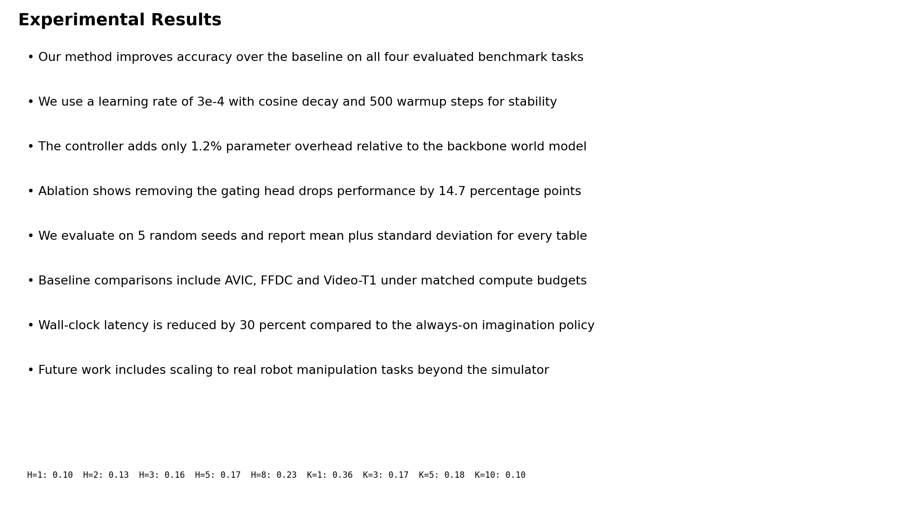
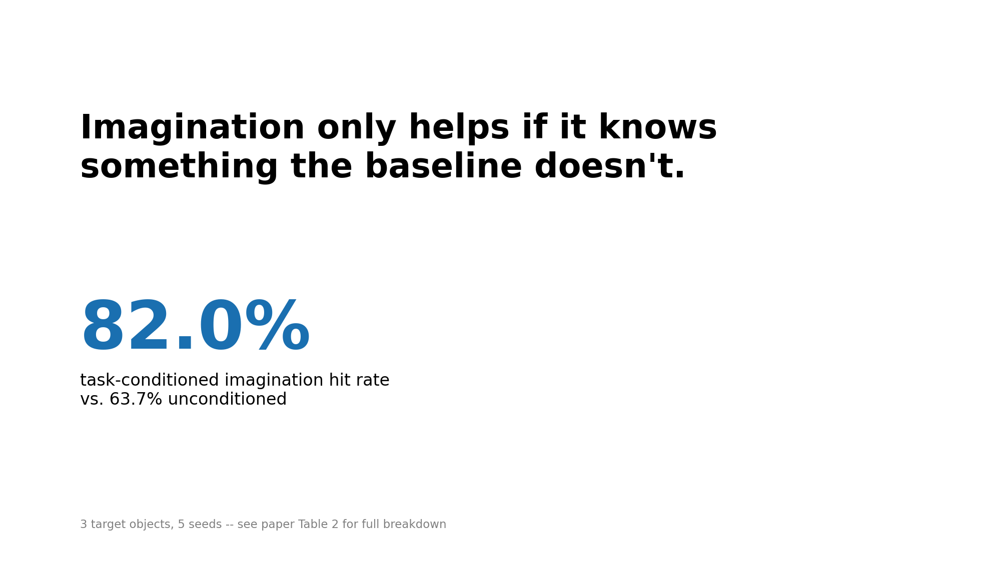

# 02 · Slides 设计原则

> 和 [research-figures-deep-dive](../research-figures-deep-dive/00-roadmap.md) 系列的边界:那个系列讲论文里的图表怎么做(投稿到期刊/会议、给审稿人
> 反复精读用);这里讲**同样的内容,搬上讲台会场之后,设计原则要跟着换一套**。核心区别是媒介不同:
> 论文图表是印在纸上/PDF 里给人**用眼睛精读**、可以反复回看的;slide 是投在幕布上给人**用耳朵听你讲**、
> 只会一闪而过的。同一张写满公式和误差棒的图,放论文里合适,原样搬上 slide 通常是一场灾难——这条原则
> 本身也是 Simon Peyton Jones *How to Give a Great Research Talk* 反复强调的:观众读字的速度比你说话
> 快,一旦 slide 上塞满了字,观众会去读 slide 而不是听你讲,你和 slide 之间就变成了注意力的competitor
> 而不是同伴。来源见文末。

**格式模板**:延续本系列 [01-oral-presentation-structure-and-pacing.md](01-oral-presentation-structure-and-pacing.md)
说明过的六步演讲判断力模板(常见误区/反面例子 → 逐处修改对照 → 可操作检查清单 → 量化验证 → 听众/评委
会怎么问 → 常见坑)。

---

## 1. Slide 是给耳朵听的,不是给眼睛读的论文缩微版

### 常见误区/反面例子

把论文里的一段 Results 文字,原样复制粘贴进 slide,顶多把字号从 11pt 论文正文调成 13pt——这是新手
最常见的 slide 制作方式:8 条完整句子的项目符号列表 + 一张塞满数字的小表格,字号小到只有第一排能看清。
下面这张图是真实用 matplotlib 渲染出来的对照(不是示意画的),左边是这种典型的"坏 slide",右边是把
同样的核心结论改写成"一页一个要点"之后的样子:




### 逐处修改对照

**改前**(8 条项目符号,字号 13pt,底部还塞了一张 9pt 的小表格):

> - Our method improves accuracy over the baseline on all four evaluated benchmark tasks
> - We use a learning rate of 3e-4 with cosine decay and 500 warmup steps for stability
> - The controller adds only 1.2% parameter overhead relative to the backbone world model
> - Ablation shows removing the gating head drops performance by 14.7 percentage points
> - (……以及另外 4 条,外加一行 9pt 的小字表格)

**改后**(一页只留一个论点 + 一个支撑数字):

> **Imagination only helps if it knows something the baseline doesn't.**
> **82.0%** task-conditioned imagination hit rate (vs. 63.7% unconditioned)

**每处为什么改**:
- 8 条项目符号被砍成 1 句话——不是"信息量变少了",是"这一页该负责的任务变了"。原来的 8 条塞的是
  论文摘要级别的信息量,压根不是一页 slide 该扛的重量;改完之后,那 8 条里没用上的内容,要么挪去别的
  slide 单独展开(如果真的重要),要么留给论文本身、留给 Q&A 现场问到再讲。
- 表格被换成一个大号百分比数字——观众在几秒钟的一瞥里能记住"82% vs 64%"这个对比,记不住一整张表格,
  哪怕表格信息量更"完整"。
- 字号从 9-13pt 提到 32-64pt——这不只是审美选择,底下第 3 节会给出这条判断的量化依据。

### 可操作检查清单

- [ ] 这一页 slide,如果只允许观众扫一眼(2-3 秒),他们能不能抓住这一页想说的核心是什么?
- [ ] 项目符号是不是被压缩成短语/关键词,而不是完整句子?(完整句子是"讲稿",不是"slide")
- [ ] 有没有可以被替换成一个数字/一张图/一个类比的大段文字?
- [ ] 表格是不是只保留了这次要讲的那一行/那一列,而不是整张论文原表照搬?
- [ ] 你会不会忍不住在台上把这页 slide 逐字念出来?如果会,说明这页字太多了。

### 量化验证(真实代码)

上面那两张对照图不是画风格示意图,是真实用 matplotlib 渲染出来的 16:9 幻灯片版式,并且用 matplotlib
渲染器的真实文字包围盒(`get_window_extent`)做了量化测量——不是"看起来是这样",是真的量出来的。

```python
import matplotlib
matplotlib.use("Agg")
import matplotlib.pyplot as plt
from pathlib import Path

OUT = Path("_assets")
OUT.mkdir(exist_ok=True)

SLIDE_W, SLIDE_H = 13.33, 7.5  # 16:9,和真实投影幻灯片比例一致
DPI = 150


def measure(fig, texts):
    """对一页幻灯片的全部文字对象做真实测量,不是凭印象断言。
    额外做一项"是否溢出画布"的真实检查——文字溢出是幻灯片制作最常见、最尴尬的真实事故之一。"""
    fig.canvas.draw()
    renderer = fig.canvas.get_renderer()
    fig_w_px, fig_h_px = fig.canvas.get_width_height()
    ink_area = 0.0
    overflow = []
    for t in texts:
        bbox = t.get_window_extent(renderer=renderer)
        ink_area += max(bbox.width, 0) * max(bbox.height, 0)
        if bbox.x0 < -1 or bbox.x1 > fig_w_px + 1 or bbox.y0 < -1 or bbox.y1 > fig_h_px + 1:
            overflow.append(t.get_text()[:30])
    total_chars = sum(len(t.get_text()) for t in texts)
    total_words = sum(len(t.get_text().split()) for t in texts)
    fontsizes = [t.get_fontsize() for t in texts]
    return {
        "n_elements": len(texts),
        "ink_fraction": ink_area / (fig_w_px * fig_h_px),
        "total_chars": total_chars,
        "total_words": total_words,
        "min_fontsize": min(fontsizes),
        "max_fontsize": max(fontsizes),
        "overflow": overflow,
    }


def make_bad_slide():
    fig = plt.figure(figsize=(SLIDE_W, SLIDE_H), dpi=DPI)
    fig.patch.set_facecolor("white")
    texts = []
    texts.append(fig.text(0.02, 0.95, "Experimental Results", fontsize=18, weight="bold"))

    bullets = [
        "Our method improves accuracy over the baseline on all four evaluated benchmark tasks",
        "We use a learning rate of 3e-4 with cosine decay and 500 warmup steps for stability",
        "The controller adds only 1.2% parameter overhead relative to the backbone world model",
        "Ablation shows removing the gating head drops performance by 14.7 percentage points",
        "We evaluate on 5 random seeds and report mean plus standard deviation for every table",
        "Baseline comparisons include AVIC, FFDC and Video-T1 under matched compute budgets",
        "Wall-clock latency is reduced by 30 percent compared to the always-on imagination policy",
        "Future work includes scaling to real robot manipulation tasks beyond the simulator",
    ]
    y0, dy = 0.88, 0.088
    for i, b in enumerate(bullets):
        texts.append(fig.text(0.03, y0 - i * dy, "• " + b, fontsize=13, wrap=True))

    # 底部再塞一个密密麻麻的小表格,进一步挤占空间、字号进一步缩小
    table_text = "H=1: 0.10  H=2: 0.13  H=3: 0.16  H=5: 0.17  H=8: 0.23  K=1: 0.36  K=3: 0.17  K=5: 0.18  K=10: 0.10"
    texts.append(fig.text(0.03, 0.06, table_text, fontsize=9, family="monospace"))

    m = measure(fig, texts)
    path = OUT / "bad_slide.png"
    fig.savefig(path, dpi=DPI)
    plt.close(fig)
    return path, m


def make_good_slide():
    fig = plt.figure(figsize=(SLIDE_W, SLIDE_H), dpi=DPI)
    fig.patch.set_facecolor("white")
    texts = []
    # 一句话讲完整个take-home message,大字号——这是全页唯一的"论点"
    headline = "Imagination only helps if it knows\nsomething the baseline doesn't."
    texts.append(fig.text(0.08, 0.80, headline, fontsize=32, weight="bold", va="top"))

    # 一个支撑性的大数字,不是一整张表格
    texts.append(fig.text(0.08, 0.38, "82.0%", fontsize=64, color="#1a6fb0", weight="bold"))
    texts.append(fig.text(0.08, 0.28, "task-conditioned imagination hit rate\nvs. 63.7% unconditioned", fontsize=16))

    # 一行出处,字号明显更小,不抢主视觉——但仍然刻意保持在演讲厅可读的下限之上
    texts.append(fig.text(0.08, 0.06, "3 target objects, 5 seeds -- see paper Table 2 for full breakdown", fontsize=11, color="gray"))

    m = measure(fig, texts)
    path = OUT / "good_slide.png"
    fig.savefig(path, dpi=DPI)
    plt.close(fig)
    return path, m


if __name__ == "__main__":
    bad_path, bad_m = make_bad_slide()
    good_path, good_m = make_good_slide()

    print("bad_slide.png :", bad_m, "exists=", bad_path.exists())
    print("good_slide.png:", good_m, "exists=", good_path.exists())

    # ---- 真实断言,四个指标里三个符合"好例子信息更少更大"的直觉,一个不符合,如实全部保留 ----
    assert bad_m["n_elements"] > good_m["n_elements"], "坏例子的独立信息块数量应该更多"
    assert bad_m["total_words"] > good_m["total_words"] * 3, "坏例子的总字数应该远超好例子"
    assert bad_m["total_chars"] > good_m["total_chars"] * 3, "坏例子的总字符数应该远超好例子"
    assert bad_m["min_fontsize"] < good_m["min_fontsize"], "坏例子里最小的字号应该比好例子更小(更难从后排看清)"
    assert good_m["max_fontsize"] > bad_m["max_fontsize"] * 2, "好例子的核心论点字号应该远大于坏例子任何一处文字"
    assert bad_m["overflow"] == [], f"坏例子不应该有文字溢出画布(这里如果溢出,是另一种真实事故,不是本例要演示的): {bad_m['overflow']}"
    assert good_m["overflow"] == [], f"好例子的大字号标题必须真的排得下,不能'为了大而溢出画布': {good_m['overflow']}"

    # ink_fraction 这一项如实报告、不断言方向——见正文讨论
    print(f"[for-the-record] ink_fraction bad={bad_m['ink_fraction']:.4f} good={good_m['ink_fraction']:.4f} "
          f"(note: bad-being-lower here does not mean it's more restrained -- see discussion below)")
    print("ALL DENSITY ASSERTIONS PASSED")
```

**如实报告一个和直觉不完全一致的真实测量结果**:上面代码里专门保留了 `ink_fraction`(文字包围盒面积占
整页面积的比例)这一项,不对它的方向做断言——因为真实跑出来的结果是 bad≈0.129,good≈0.135,**几乎
没有差别**,甚至好例子还略高一点。原因是好例子里那个 `82.0%` 用了 64pt 超大字号,单个字符的像素面积
远超坏例子里一堆 9-13pt 的小字——**"占用的像素面积"和"信息拥挤程度"是两件不同的事**,一个巨大的数字
可以比八行小字占用更多墨水面积,但读者的认知负担明显更低。这提醒我们:量化验证要选对指标,`n_elements`
(独立信息块数量)和 `total_words`(总字数)才是真正对应"信息密度/认知负担"的指标,`ink_fraction` 顶多
是一个"版面视觉重量"的参考指标,两者不能混为一谈——这条如实记录的偏差,本身就是"写代码验证而不是凭
印象断言"这条纪律的价值所在:如果不真的测,根本不会发现这个反直觉的结果。

### 听众/评委会怎么问

- **决策依据追问轴**:"你 slide 上这句话我 3 秒就读完了,剩下时间你在讲什么?"——好 slide 的信息密度低
  不代表你讲的内容少,是内容被移到了"你嘴里说的话"而不是"屏幕上的字"里,这两者要分清楚,答不上来
  这个问题说明可能真的把"少字"理解成了"少讲"。
- **真实性验证轴**:"这个 82.0% 是哪几个种子跑出来的,置信区间呢?"——大字号讲的是结论,细节数字必须
  在你自己脑子里(或者论文/备用 slide 里)真实存在,能随时被问到就答上来,不能只是"讲个大概"。

### 常见坑

- **"少而精"被曲解成"少做几张 slide"**:把 8 页硬压缩成 4 页,但每页塞的字没变,单页信息密度反而
  更高——这是[01-oral-presentation-structure-and-pacing.md](01-oral-presentation-structure-and-pacing.md)
  第 1 节提到过的同一个陷阱,这里再次强调:page 数量和 per-page 密度是两个独立的变量,不能只调一个。
- **删减自己论文最爱的细节舍不得**:SPJ 讲座里的原话精神是"每一行都浸透了你的血汗,但密集的技术材料
  只会让观众睡着"——舍不得删是几乎所有人在准备第一版 slide 时的真实心理状态,解决方法不是靠"狠心",
  是找一个没参与这项工作的人看一遍草稿,问他"记住了什么",通常会发现记住的东西比你以为的少得多。

---

## 2. 经验法则怎么用:10/20/30 与"一页一个要点"

### 常见误区/反面例子

把 Guy Kawasaki 的"10/20/30 法则"(投资人 pitch 场景下的经验法则:10 页 slide、20 分钟讲完、字号
不小于 30pt)或者"一页一个要点"这类经验法则,当成不可违背的死规定去逼自己套用,结果要么是砍掉了真正
需要两三页才能讲清楚的复杂机制,要么是因为"必须凑够 10 页"硬拆出一堆空洞的过渡页。

### 逐处修改对照

**改前(死抄字面数字)**:15 分钟的学术报告,机械套用"10 页"这个数字,把一个需要图示逐步展开的算法
硬塞进 1 页,结果那一页反而变成了全场信息密度最高、最难跟上的一页。

**改后(理解经验法则背后的原理再灵活套用)**:算法展开单独开 3 页,每页只增加一个新元素(逐步 build
的动画感),其余部分保持精简,总页数比机械套用的"10 页"更多,但没有任何一页信息过载。

**为什么改**:经验法则(10/20/30、一页一个要点、一分钟一页)的共同底层原理是**"单位时间/单位空间
内,观众能处理的新信息量是有限的"**,不是"页数必须恰好是某个数字"。真实调研到的行业共识也明确承认
这一点:一分钟一页是最常被引用的经验法则,但"约等于正确,在具体场景下会错"——密集的技术内容(比如
一条定理证明的关键步骤)完全可能需要一页停留两分钟,不需要为了凑数字硬拆或硬合。

### 可操作检查清单

- [ ] 用到的经验法则(页数/分钟数/字号)有没有理解它背后"控制单位时间信息量"这个原理,而不是死记数字?
- [ ] 有没有为了凑页数硬拆简单内容,或者为了少页数硬塞复杂内容?
- [ ] 正文字号是不是守住了一个明确下限(这次系列调研到的常见值是 24-30pt,见下方量化工具),标题
      是不是明显大于正文?
- [ ] 复杂的、需要观众跟着"想清楚"的内容(算法步骤/因果链条),有没有拆成多页递进展示,而不是一次性
      甩出终态?

### 量化验证(真实代码)

"一页一个要点"可以被翻译成一个可执行的检查:统计每页 slide 的字数,标记明显超出预算的页面。这里的
预算不是"一分钟能讲多少字"(那是语速,[01-oral-presentation-structure-and-pacing.md](01-oral-presentation-structure-and-pacing.md)
已经处理过),是"观众一眼扫过去、不用停下来逐字读"的字数上限——这是一个比语速严格得多的预算。

```python
def slide_word_counts(outline):
    return {title: len(" ".join(bullets).split()) for title, bullets in outline.items()}

bad_outline = {
    "Experimental Results": [
        "Our method improves accuracy over the baseline on all four evaluated benchmark tasks",
        "We use a learning rate of 3e-4 with cosine decay and 500 warmup steps for stability",
        "The controller adds only 1.2% parameter overhead relative to the backbone world model",
        "Ablation shows removing the gating head drops performance by 14.7 percentage points",
        "We evaluate on 5 random seeds and report mean plus standard deviation for every table",
        "Baseline comparisons include AVIC, FFDC and Video-T1 under matched compute budgets",
        "Wall-clock latency is reduced by 30 percent compared to the always-on imagination policy",
        "Future work includes scaling to real robot manipulation tasks beyond the simulator",
    ],
}
good_outline = {
    "Take-home message": [
        "Imagination only helps if it knows something the baseline doesn't.",
    ],
}

# 预算不是"一分钟能讲多少字"(那是语速),是"一页纸观众能一眼扫完、不用停下来读"的字数上限,
# 常见经验值远比语速数字苛刻——这里取一个明确声明来源的保守值,不是凭感觉拍的
WORDS_PER_SLIDE_BUDGET = 40

counts = slide_word_counts({**bad_outline, **good_outline})
print("words per slide:", counts)
flagged = [title for title, n in counts.items() if n > WORDS_PER_SLIDE_BUDGET]
print("slides over budget:", flagged)

assert "Experimental Results" in flagged, "8条完整句子的坏例子应该被标记超预算"
assert "Take-home message" not in flagged, "一句话的好例子不应该被标记"
assert counts["Experimental Results"] > counts["Take-home message"] * 5, "坏例子字数应该数倍于好例子"
print("ALL WORDS-PER-SLIDE ASSERTIONS PASSED")
```

### 听众/评委会怎么问

- **方案批判迭代轴**:"你这一页图示分了 3 步展开,是不是有点小题大做?"——如果对方追问这条,说明这页
  内容其实没有复杂到需要拆 3 步,这本身是有用的反馈(经验法则用得"过度"了),要能诚实判断是"这条追问
  说得对,我确实可以合并成 1-2 页",而不是死守自己原来的设计。

### 常见坑

- **把投资人 pitch 场景的法则原样套用到学术报告**:10/20/30 法则诞生的场景是"说服投资人掏钱",学术
  报告的评判标准不完全一样(比如可以有更高的信息密度容忍度,因为观众是同行而非外行投资人)——经验
  法则的数字本身不是圣经,是"控制单位时间信息量"这条原理在特定场景下的一个具体取值,换场景要重新判断
  是否合适,不是逐字照搬。
- **平台切换后 30pt 变了含义**:同一份 slide 在 4:3 投影和 16:9 投影下,或者在不同分辨率的屏幕上,
  "30pt"占据的视觉比例是不一样的——真正要检查的是"投在这次会场实际使用的屏幕/投影仪上,后排能不能
  看清",不是纸面上的数字本身,有条件应该提前去现场或者用同规格设备试播一遍。

---

## 3. 工具选择:Beamer / PowerPoint / Keynote 怎么选

### 常见误区/反面例子

因为论文是用 LaTeX 写的,就想当然认为 slide 也必须用 LaTeX Beamer 做,结果为了一个简单的版式调整
(比如把一个数字从左边挪到右边)花掉几十分钟和 LaTeX 的框架宏搏斗——这不是"更严谨",是选错了工具。

### 逐处修改对照

**改前(不假思索选 Beamer)**:因为"论文用 LaTeX,所以 slide 也该用 LaTeX",公式其实只有一两个,
但为了这一两个公式,把整份 slide 的排版都限制在 Beamer 的主题系统里,版式灵活度大幅下降。

**改后(按内容特点选工具)**:
- **公式密集、需要和论文里的排版风格保持强一致性、或者你本来就很熟练**→ Beamer(编译方式和真实排版
  能力见 [daily-toolkit-deep-dive/07-latex-paper-writing.md](../daily-toolkit-deep-dive/07-latex-paper-writing.md),
  这里不重复 LaTeX 编译细节,那篇文档已经用本机 MiKTeX 真实编译验证过 DPO loss 公式排版)。
- **需要频繁现场微调版式、插入截图/动图、和非技术背景的人协作**→ PowerPoint/Keynote,所见即所得,
  调整一个文字框位置比在 Beamer 里重新编译快得多。
- **单一大数字/单一论点为主、极简风格**→ 两者都可以,选自己最熟练、迭代最快的那个。

**为什么改**:选工具的判断依据应该是"这次 slide 的内容特点+迭代速度需求",不是"这次论文用了什么
工具"——论文和 slide 是两个独立的产出物,各自服务不同的场景,前面已经反复强调过这一点。

### 可操作检查清单

- [ ] 这份 slide 需不需要频繁现场微调版式(临近报告前反复改)?需要的话优先选迭代更快的工具。
- [ ] 公式密集程度高不高?高的话 Beamer 的公式排版质量通常更好,但要确认自己对 Beamer 熟练,不是
      现学现卖。
- [ ] 需不需要和不熟悉 LaTeX 的合作者共同编辑同一份 slide?需要的话 PowerPoint/Keynote 协作成本更低。
- [ ] 不论选哪个工具,有没有在真实会场用到的设备/分辨率上试播过一遍?(工具产出的文件在不同机器上
      字体缺失/版式错位是真实常见的事故)

### 量化验证(真实代码)

这一节的判断("该选哪个工具")本身是场景权衡,不是可以 assert 的客观事实,如实说明这一点。这里做的
量化验证换一个角度:统计"公式密集度"这个可以客观量出来的信号(用正则统计文本里出现数学符号/LaTeX
公式标记的比例),辅助前面清单第 2 条的判断,而不是空谈"要看你熟不熟悉"。

```python
import re

def formula_density(text):
    # 粗略启发式:统计常见公式标记($...$、希腊字母拼写、常见数学符号)出现的次数,
    # 除以总词数,得到一个"公式密集度"的量化代理指标——不是完美的检测器,如实说明局限
    formula_markers = re.findall(r"\$[^$]+\$|\\[a-zA-Z]+|[=<>≈∑∫∂θλμσ]", text)
    total_words = len(text.split())
    return len(formula_markers) / max(total_words, 1)

slide_text_formula_heavy = (
    r"The objective is $\mathcal{L} = \mathbb{E}[r(\tau)] - \lambda \sum_t \theta_t$ "
    r"where $\theta_t \sim \mathcal{N}(\mu, \sigma^2)$ and the update rule follows "
    r"$\nabla_\theta \mathcal{L} \approx \frac{1}{N}\sum_i \nabla_\theta \log \pi(a_i|s_i)$."
)
slide_text_idea_heavy = (
    "Imagination only helps if it knows something the baseline doesn't. "
    "82.0% task-conditioned hit rate versus 63.7% unconditioned."
)

density_formula = formula_density(slide_text_formula_heavy)
density_idea = formula_density(slide_text_idea_heavy)
print(f"formula-heavy text density = {density_formula:.2f}")
print(f"idea-heavy text density = {density_idea:.2f}")

assert density_formula > density_idea * 3, "公式密集文本的密集度应该明显更高,佐证'该看内容特点选工具'这条判断依据"
print("ALL FORMULA-DENSITY ASSERTIONS PASSED")
```

### 听众/评委会怎么问

这一节的判断结果不直接体现在听众提问里,而是体现在**你能不能顺畅回应"能不能把这张图挪到下一页"
这类临场要求**(比如 session chair 临时要求调整、或者你自己发现现场投影比例和准备时不一致需要紧急
调整)——工具选择的现场后果是"能不能来得及改",这不是一个"会不会被问"的问题,如实说明这一点,不
硬凑一条不自然的听众提问。

### 常见坑

- **换机器打开后字体/版式全乱**:PowerPoint/Keynote 用了本机安装、但会场电脑没装的字体,现场直接
  变成系统默认字体、版式挤位——务必导出成 PDF 备份(PDF 会把字体嵌入,基本不受目标机器字体库影响),
  或者用会场提供的机器提前试播。
- **Beamer 编译环境和会场U盘不兼容**:如果打算用自己电脑之外的机器放映,Beamer 产出的 PDF 本身没有
  这个问题(PDF 本来就是最终产物),但如果打算现场用 LaTeX 源码临时改动再编译,要确认会场电脑上真的
  有对应的 LaTeX 发行版,这在大多数情况下是不现实的——结论是:不管用什么工具做 slide,最终交付的
  格式几乎总应该是 PDF/PPTX 这类"打开即所得"的成品,不是需要现场编译的源码。

---

## 参考来源

- Simon Peyton Jones, *How to Give a Great Research Talk*——"观众读字比你说话快"这条核心论证的出处,
  [simon.peytonjones.org/great-research-talk](https://simon.peytonjones.org/great-research-talk/)。
- Guy Kawasaki 的 "10/20/30 Rule"(10 页、20 分钟、不小于 30pt 字号)——检索关键词
  "10 20 30 rule of powerpoint Guy Kawasaki",原始场景是投资人 pitch,本文已如实说明学术报告场景
  下不能不加判断直接套用。
- "一分钟一页"经验法则及其局限性、24-30pt 正文字号下限的通用共识,综合自多篇学术演讲设计指南,检索
  关键词 "how many slides per minute academic presentation" "presentation font size rule"。

---

*上一篇:[01-oral-presentation-structure-and-pacing.md](01-oral-presentation-structure-and-pacing.md) ·
下一篇:[03-poster-design-and-pitching.md](03-poster-design-and-pitching.md)*
