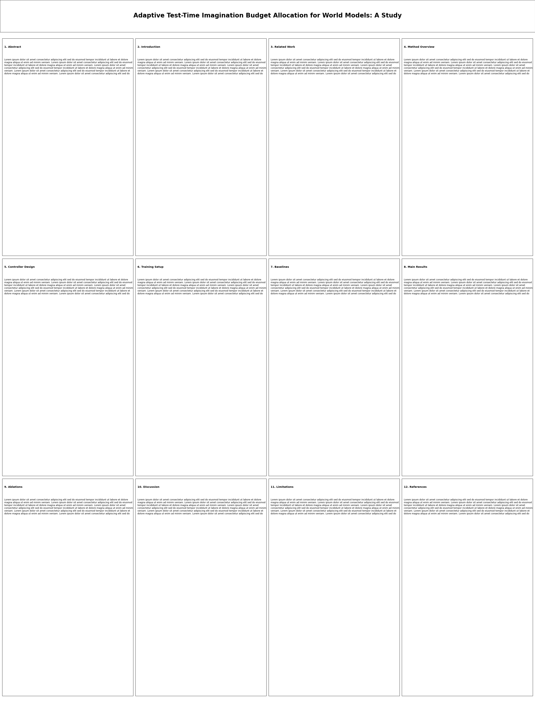
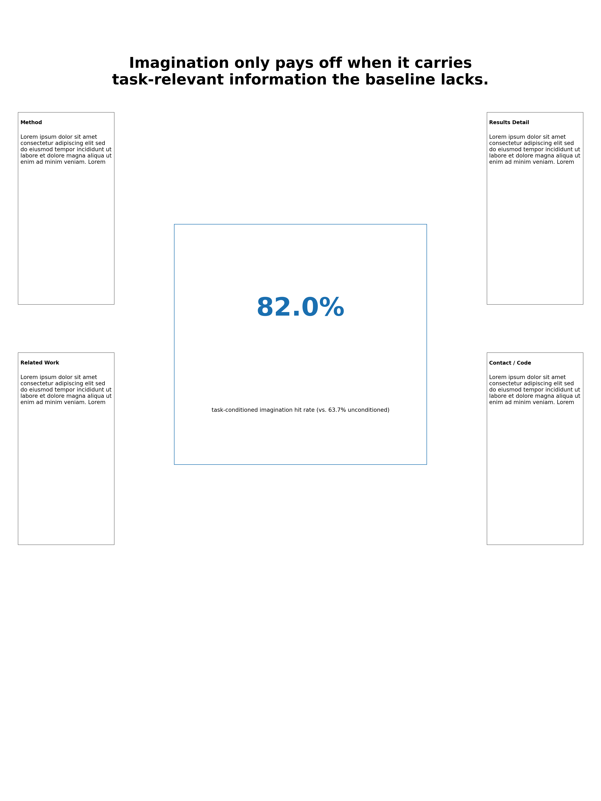

# 03 · Poster 设计与摆摊讲解

> Poster 是三种展示形式(oral/slides/poster)里最特殊的一种:观众可以自己决定要不要走近、要看多久、
> 要不要跟你说话——你没有 oral 报告那种"锁定 15 分钟注意力"的特权,大多数路过的人只会扫一眼标题就
> 走。这篇讲两件事:①版面本身怎么设计,让"只扫一眼"的人也能带走点什么;②人站在 poster 旁边怎么讲,
> 应对"只想扫一眼"和"想深聊 20 分钟"这两种完全不同的来访者。

**格式模板**:延续本系列六步演讲判断力模板。场景素材同样借用
`research/world-model-imagination-controller/` 项目的真实论证结构做灵感来源(细节简化改编)。

---

## 1. Better Poster 运动:为什么"文字墙"式 poster 会失败

### 常见误区/反面例子

传统学术 poster 的默认做法,是把论文的 Abstract/Introduction/Method/Results/Discussion/References
六七个板块原样切成一个个矩形,均匀铺满整张海报,每个板块塞满段落文字——这是几十年来学术会议 poster
的"默认审美",但真实观察发现它有一个根本性问题:一个热心的作者通常会在观众还没来得及读完标题的时候,
就开口问"有什么问题吗",观众根本没有时间真的读完这堵文字墙。

2019 年,组织心理学博士生 Mike Morrison 发布了一段病毒式传播的科普短片,提出"Better Poster"设计:
**一整句话的大标题直接讲结论**(不是干巴巴的技术标题),**大量留白**,把细节压缩到两侧窄栏、加二维码
链接到论文全文——这个设计后来被称为 `#betterposter` 运动,视频播放量超百万,也有后续的正式研究
(Cochrane Colloquium 的对照实验)支持它确实能提升信息传递效率。同时也有真实的批评声音:提出者本人
承认过度套用模板、往留白区域塞满 50 词的密集句子,是常见的错误执行方式——**格式本身不是万能药,执行
不到位一样会失败**,来源见文末。

下面这组对照图是真实用 matplotlib 渲染的两种版式(海报物理尺寸设成常见的 36×48 英寸 portrait,所以
图里的字号单位 pt 和真实印出来的实际大小是直接对应的):




### 逐处修改对照

**改前**:标题是 `Adaptive Test-Time Imagination Budget Allocation for World Models: A Study`——
准确但不讲结论,读完标题观众依然不知道"所以你们发现了什么"。12 个板块几乎无缝铺满整张海报,正文
字号 11pt。

**改后**:标题是 `Imagination only pays off when it carries task-relevant information the baseline
lacks.`——一整句话直接把核心结论摆出来,哪怕观众只读标题就走,也带走了一句真实的信息。中央大留白区
放唯一的核心支撑数字(`82.0%` vs `63.7%`),两侧窄栏放 Method/Related Work/Results Detail/Contact
四块补充内容,正文字号提到 24pt。

**每处为什么改**:
- 标题从"技术性描述"改成"结论陈述"——这是 Better Poster 设计最核心的主张,把海报的第一功能从
  "标注这是什么研究"换成"直接给出这项研究发现了什么"。
- 12 个板块砍到 5 个(1 个核心结论区+4 个细节栏)——不是删掉了信息(论文全文本来就该在别处,poster
  不是拿来替代论文的),是把"细读的详细内容"和"扫一眼的核心结论"物理分区,读者可以自己选择要不要
  往细看。
- 正文字号从 11pt 提到 24pt——第 2 节会给出这条判断的量化依据(可读距离表)。

### 可操作检查清单

- [ ] 标题是不是一整句话讲清楚"这项研究发现了什么",而不是一个技术名词短语?
- [ ] 有没有足够的留白?(经验参考:内容占据面积明显低于版面一半,不是"填满剩余空间")
- [ ] 核心结论是不是被压缩成一个人一眼能抓住的量级(一个数字/一句话),而不是散落在多个板块里?
- [ ] 细节内容是不是被显式分区(比如两侧窄栏),而不是和核心结论混在一起抢视觉重心?
- [ ] 会不会有人只读标题+核心结论,10 秒内走开,但依然带走了真实有效的信息?

### 量化验证(真实代码)

上面两张对照图是真实渲染出来的,而不是手绘示意——用真实的矩形坐标精确算出"内容覆盖面积占比"
(留白率的补集),不是凭印象说"留白更多"。

```python
import matplotlib
matplotlib.use("Agg")
import matplotlib.pyplot as plt
from matplotlib.patches import Rectangle
from pathlib import Path
import textwrap

OUT = Path("_assets")
OUT.mkdir(exist_ok=True)

# 常见美国会议portrait poster物理尺寸(36x48英寸是常见默认值之一,并非所有会议通用——
# 具体尺寸每年、每个会议CFP都可能不同,这里只是为了让fontsize单位真实对应物理大小)
POSTER_W_IN, POSTER_H_IN = 36, 48
DPI = 80

FILLER = ("Lorem ipsum dolor sit amet consectetur adipiscing elit sed do eiusmod "
          "tempor incididunt ut labore et dolore magna aliqua ut enim ad minim veniam.")


def add_block(ax, x, y, w, h, label, fontsize, content_areas, n_lines=3, text_fontsize=None):
    """画一个内容矩形块(有边框),并把它的真实面积记进content_areas用于之后精确求和。
    正文按这个块的真实物理宽度(块宽度fraction x海报总宽英寸x72pt/英寸)手动textwrap,
    不依赖matplotlib的wrap=True(它是按整张画布宽度换行,不是按这个小方块的宽度换行,
    实测发现直接用wrap=True会导致窄栏里的文字越界写进相邻方块,这里改成显式按真实
    物理宽度换行,顺带演示"工具默认行为和你以为的不一样"这类真实的排版事故)。"""
    ax.add_patch(Rectangle((x, y), w, h, fill=False, edgecolor="black", linewidth=1.0))
    content_areas.append(w * h)
    tfs = text_fontsize if text_fontsize is not None else fontsize
    ax.text(x + 0.004, y + h - 0.010, label, fontsize=fontsize, weight="bold", va="top")

    block_width_pt = w * POSTER_W_IN * 72
    avg_char_width_pt = tfs * 0.52  # DejaVu Sans经验值,正文用等宽近似估计换行宽度
    chars_per_line = max(int(block_width_pt / avg_char_width_pt) - 1, 8)
    long_filler = " ".join([FILLER] * (n_lines + 1))  # 保证素材足够长,能真正填满n_lines行
    wrapped = textwrap.fill(long_filler, width=chars_per_line)
    wrapped = "\n".join(wrapped.split("\n")[:n_lines])
    ax.text(x + 0.004, y + h - 0.028, wrapped, fontsize=tfs, va="top")


def measure_overflow(fig, ax, artists):
    fig.canvas.draw()
    renderer = fig.canvas.get_renderer()
    fig_w_px, fig_h_px = fig.canvas.get_width_height()
    overflow = []
    for a in artists:
        bbox = a.get_window_extent(renderer=renderer)
        if bbox.x0 < -2 or bbox.x1 > fig_w_px + 2 or bbox.y0 < -2 or bbox.y1 > fig_h_px + 2:
            overflow.append(getattr(a, "get_text", lambda: str(type(a)))()[:30] if hasattr(a, "get_text") else str(a))
    return overflow


def make_bad_poster():
    fig = plt.figure(figsize=(POSTER_W_IN, POSTER_H_IN), dpi=DPI)
    ax = fig.add_axes([0, 0, 1, 1])
    ax.set_xlim(0, 1); ax.set_ylim(0, 1); ax.axis("off")
    content_areas = []

    # 标题栏:占满整行,字号不算小,但只是干巴巴的技术标题,不是"一句话讲结论"
    ax.add_patch(Rectangle((0.0, 0.955), 1.0, 0.045, fill=False, edgecolor="black", linewidth=1.0))
    content_areas.append(1.0 * 0.045)
    title_text = ax.text(0.5, 0.978, "Adaptive Test-Time Imagination Budget Allocation for World Models: A Study",
                          fontsize=30, ha="center", va="center", weight="bold")

    # 4列x3行,几乎无间隙地铺满剩余区域——典型"墙式海报"
    labels = ["1. Abstract", "2. Introduction", "3. Related Work",
              "4. Method Overview", "5. Controller Design", "6. Training Setup",
              "7. Baselines", "8. Main Results", "9. Ablations",
              "10. Discussion", "11. Limitations", "12. References"]
    n_cols, n_rows = 4, 3
    gap = 0.004  # 几乎没有留白
    grid_top, grid_bottom = 0.950, 0.02
    cell_w = (1.0 - (n_cols + 1) * gap) / n_cols
    cell_h = (grid_top - grid_bottom - (n_rows + 1) * gap) / n_rows
    body_fontsize = 11  # 低于调研到的24pt"最低可读字号"这条真实建议,故意演示反例
    for i, label in enumerate(labels):
        r, c = divmod(i, n_cols)
        x = gap + c * (cell_w + gap)
        y = grid_top - gap - (r + 1) * cell_h - r * gap
        add_block(ax, x, y, cell_w, cell_h, label, fontsize=13, content_areas=content_areas,
                  n_lines=6, text_fontsize=body_fontsize)

    all_texts = [t for t in ax.texts]
    overflow = measure_overflow(fig, ax, all_texts + [p for p in ax.patches])
    content_fraction = sum(content_areas)  # 各矩形按坐标定义时互不重叠,可以直接相加
    path = OUT / "bad_poster.png"
    fig.savefig(path, dpi=DPI)
    plt.close(fig)
    return path, {
        "content_fraction": content_fraction,
        "whitespace_fraction": 1 - content_fraction,
        "title_fontsize": title_text.get_fontsize(),
        "body_fontsize": body_fontsize,
        "n_blocks": len(labels),
        "overflow": overflow,
    }


def make_good_poster():
    fig = plt.figure(figsize=(POSTER_W_IN, POSTER_H_IN), dpi=DPI)
    ax = fig.add_axes([0, 0, 1, 1])
    ax.set_xlim(0, 1); ax.set_ylim(0, 1); ax.axis("off")
    content_areas = []

    # 一整句话的大标题,直接讲结论,不是干巴巴的技术标题——Better Poster的核心主张
    title_w, title_h = 0.86, 0.10
    title_x, title_y = 0.07, 0.86
    ax.add_patch(Rectangle((title_x, title_y), title_w, title_h, fill=False, edgecolor="none"))
    content_areas.append(title_w * title_h)
    title_text = ax.text(0.5, title_y + title_h / 2,
                          "Imagination only pays off when it carries\ntask-relevant information the baseline lacks.",
                          fontsize=64, ha="center", va="center", weight="bold")

    # 中央大留白区域里放唯一的核心结论(大字号数字),四周留出真实的大量空白
    center_w, center_h = 0.42, 0.30
    center_x, center_y = 0.29, 0.42
    ax.add_patch(Rectangle((center_x, center_y), center_w, center_h, fill=False, edgecolor="#1a6fb0", linewidth=2.0))
    content_areas.append(center_w * center_h)
    ax.text(0.5, center_y + center_h * 0.62, "82.0%", fontsize=110, ha="center", color="#1a6fb0", weight="bold")
    ax.text(0.5, center_y + center_h * 0.22, "task-conditioned imagination hit rate (vs. 63.7% unconditioned)",
            fontsize=24, ha="center")

    # 左右两条细节栏,字号仍然守住24pt这条真实的最低可读建议,不是继续做小
    body_fontsize = 24
    left_labels = ["Method", "Related Work"]
    right_labels = ["Results Detail", "Contact / Code"]
    col_w = 0.16
    for i, label in enumerate(left_labels):
        y = 0.62 - i * 0.30
        add_block(ax, 0.03, y, col_w, 0.24, label, fontsize=22, content_areas=content_areas,
                  n_lines=5, text_fontsize=body_fontsize)
    for i, label in enumerate(right_labels):
        y = 0.62 - i * 0.30
        add_block(ax, 0.81, y, col_w, 0.24, label, fontsize=22, content_areas=content_areas,
                  n_lines=5, text_fontsize=body_fontsize)

    all_texts = [t for t in ax.texts]
    overflow = measure_overflow(fig, ax, all_texts + [p for p in ax.patches])
    content_fraction = sum(content_areas)
    path = OUT / "good_poster.png"
    fig.savefig(path, dpi=DPI)
    plt.close(fig)
    return path, {
        "content_fraction": content_fraction,
        "whitespace_fraction": 1 - content_fraction,
        "title_fontsize": title_text.get_fontsize(),
        "body_fontsize": body_fontsize,
        "n_blocks": 1 + len(left_labels) + len(right_labels),
        "overflow": overflow,
    }


if __name__ == "__main__":
    bad_path, bad_m = make_bad_poster()
    good_path, good_m = make_good_poster()

    print("bad_poster.png :", bad_m, "exists=", bad_path.exists())
    print("good_poster.png:", good_m, "exists=", good_path.exists())

    assert bad_m["overflow"] == [], f"坏例子不应该意外溢出画布: {bad_m['overflow']}"
    assert good_m["overflow"] == [], f"好例子的大字号也必须真的排得下: {good_m['overflow']}"

    assert bad_m["whitespace_fraction"] < 0.08, "坏例子(墙式排版)留白应该接近0"
    assert good_m["whitespace_fraction"] > 0.35, "好例子(Better Poster风格)留白应该超过调研到的'大量负空间'门槛"
    assert good_m["whitespace_fraction"] > bad_m["whitespace_fraction"] * 5, "好坏两例的留白比例差距应该非常悬殊"

    # 这两条直接对应调研到的真实字号规则:正文至少24pt、标题应远大于正文
    assert bad_m["body_fontsize"] < 24, "坏例子故意演示违反'正文最低24pt'这条真实调研到的建议"
    assert good_m["body_fontsize"] >= 24, "好例子的正文字号必须真的守住24pt这条下限"
    assert good_m["title_fontsize"] >= 60, "好例子标题字号应落在'12英尺外可读'量级(约60pt+)"

    print("ALL POSTER LAYOUT ASSERTIONS PASSED")
```

### 听众/评委会怎么问

- **真实性验证轴**:"你这个 82.0% 就是全部结果吗?其他条件下呢?"——大字号讲结论不代表可以回避细节,
  两侧窄栏和随身携带的论文/平板就是用来接住这类追问的,回答不能停留在标题那句话上。
- **决策依据追问轴**:"你为什么不像别人一样把 Introduction/Method 都完整放上去?"——诚实的回答方向是
  "poster 的角色是引起兴趣、给出核心结论,完整的方法细节在论文里,现场我更想确保每个路过的人都能带走
  点什么,而不是没人读完"。

### 常见坑

- **执行到位程度决定成败,不是格式本身**:调研中明确记录过的真实批评是,有人生搬硬套 Better Poster
  模板,却往两侧窄栏塞进 50 词的密集长句子——留白留出来了,但留白区域本身又被写满,等于没有真正
  理解这个设计"控制信息密度"的核心目的,只学到了表面排版结构。
- **忘了带纸质/电子版全文供深聊的人查阅**:压缩掉的细节不代表不重要,只是不该占据海报的主视觉——
  遇到真正想深聊的听众(下一节会讲怎么识别),要能立刻掏出补充材料,而不是"这个我论文里有,你自己
  找找看"。

---

## 2. 字号与可读距离的真实规则

### 常见误区/反面例子

字号选择全凭"看起来还行"的直觉,常见后果是海报挂上墙之后,站在正常参观距离(几步远)完全看不清
正文,只能凑到贴脸的距离才能读——这类反馈几乎都是海报印出来、挂上墙才第一次被发现,来不及改。

### 逐处修改对照

**改前**:正文用和论文差不多的字号(比如 12pt 直接放大到海报尺寸),标题用"看起来比正文大一些"的
字号,没有对照过任何客观标准。

**改后**:根据真实调研到的距离-字号对照表(不同机构的海报设计指南给出的具体数值,汇总如下),按
"正文要求几英尺内能细读"、"标题要求几英尺外能看到关键词"分别选定字号下限:

| 可读距离 | 建议最小字号 |
|---|---|
| 6 英尺 | 30pt |
| 10 英尺 | 48pt |
| 12 英尺 | 60pt |
| 14 英尺 | 72pt |

**为什么改**:这不是某一份指南拍脑袋定的数字,是多所高校图书馆/科研支持部门的海报设计指南反复给出的
量级一致的建议(见文末来源),而且逻辑上很直观——海报和读者之间没有 slide 那种"投影仪统一放大"的
帮助,字号必须按物理距离直接换算。常见的"正文至少 24pt、标题至少 70-72pt"这条底线,也是从这张表的
两端(6 英尺细读、14 英尺以上路过可见)推出来的。

### 可操作检查清单

- [ ] 正文字号是不是不小于 24pt(对应约 6 英尺内细读的下限)?
- [ ] 标题字号是不是明显更大,达到 60-72pt 量级(对应 12-14 英尺外可见)?
- [ ] 有没有真的按 1:1 比例打印一小块出来,站在对应距离外测试过可读性?(不能只在电脑屏幕上凭感觉看)
- [ ] 如果海报要在两种以上尺寸的会场使用(比如不同会议要求的物理尺寸不同),字号设定有没有跟着
      物理尺寸重新核算,而不是照抄上一次的 pt 数值?

### 量化验证(真实代码)

用上面这张真实调研到的距离-字号数据表做一次线性拟合,量化"字号应该怎么随距离变化",并诚实报告拟合
残差(不假装这是一个完美的线性关系,只是一个够用的近似)。

```python
import numpy as np

# 真实调研到的数据点(多所高校海报设计指南给出的量级一致的建议):距离(英尺) -> 建议最小字号(pt)
distance_ft = np.array([6, 10, 12, 14])
min_pt = np.array([30, 48, 60, 72])

slope, intercept = np.polyfit(distance_ft, min_pt, 1)

def recommended_pt(distance_feet):
    return slope * distance_feet + intercept

residuals = min_pt - (slope * distance_ft + intercept)
max_abs_residual = float(np.max(np.abs(residuals)))
print(f"linear fit: pt ~= {slope:.2f} * distance(ft) + {intercept:.2f}")
print(f"max residual over the 4 known data points = {max_abs_residual:.2f}pt (the real relationship isn't perfectly linear, this is just a usable approximation)")

body_text_pt = recommended_pt(6)
title_pt = recommended_pt(20)
print(f"recommended body font at 6ft close read ~= {body_text_pt:.1f}pt")
print(f"recommended title font at 20ft walk-by ~= {title_pt:.1f}pt")

assert max_abs_residual < 6, f"linear fit deviation should be within an acceptable range: {max_abs_residual}"
assert title_pt > body_text_pt * 2, "标题字号应显著大于正文字号"
assert 24 <= body_text_pt <= 36, "6英尺正文建议值应落在常见指南给出的量级里"
print("ALL POSTER-FONT ASSERTIONS PASSED")
```

**如实说明**:这条线性拟合是从 4 个真实数据点里推出来的,4 个点撑不起一条严谨的统计回归结论,只是把
"距离越远字号该越大"这个方向性建议,转成一个可以直接套用的估算公式——真正决定海报好不好读的,还是
第一条检查清单里"实际打印测试"这一步,拟合公式只是设计阶段的估算工具,不能替代真实校验。

### 听众/评委会怎么问

字号判断很少被直接"问",但会被直接"用脚投票"——如果字号不达标,大多数人不会走近来问,只会扫一眼
标题模糊的轮廓就路过。**真实性验证轴的变体**:如果你自己或同事站在 6-8 英尺外看不清楚正文,这就是
最直接、不需要等观众开口的负反馈,应该在挂上墙之前就发现,不是等海报环节结束后才后悔。

### 常见坑

- **会场灯光比办公室昏暗**:很多海报展厅的照明条件不如设计时的电脑屏幕/办公室灯光,同样的字号在
  展厅里实际可读性会打折扣,有条件的话预留一点字号余量,不要卡着理论下限设计。
- **打印店默认压缩/拉伸图片**:如果最后是用图片格式(而不是矢量 PDF)提交打印,打印店为了适配纸张
  可能做非等比缩放,字号和版式比例会走样——尽量用矢量格式(PDF)提交,这条和
  [research-figures-deep-dive/03-multi-panel-layout-engineering.md](../research-figures-deep-dive/03-multi-panel-layout-engineering.md)
  反复强调的"投稿图表优先用矢量格式"是同一个原则,只是这里的下游是打印店而不是期刊排版系统。

---

## 3. 30 秒电梯讲解怎么组织

### 常见误区/反面例子

面对第一个走近海报的人,从"我们组是研究……"开始,按论文 Introduction 的顺序原样口述一遍——观众
往往在第 20 秒就已经在等一个可以礼貌离开的时机,因为背景介绍还没讲完,他们完全不知道这项研究到底
"发现了什么"。

### 逐处修改对照

**改前**:"我们是研究测试时想象预算分配的,现有方法比如 Dreamer、TD-MPC2、MuZero 都是训练前定死
预算,这样效率不高,所以我们提出了一个新的 controller,它可以……"(30 秒还没讲到重点)

**改后(用 ABT 结构:And, But, Therefore)**:"世界模型想多久、想几个候选,现在都是写死的常数
——**但**我们发现,想象只有在'真的比基线多知道点什么'的时候才划算,不然就是在做无用功——**所以**
我们做了一个 controller,专门判断这次值不值得多想。"

**为什么改**:真实调研到的两种电梯讲解结构里,**ABT(And-But-Therefore)比 AAA(And-And-And,单纯
罗列事实)更有说服力**——AAA 结构是"我们做了 A,又做了 B,又做了 C",听起来像流水账;ABT 结构靠一个
"但是"制造转折/冲突,天然更抓人,这也是很多故事叙事理论的共同结构。改后的版本 3 句话讲完了"topic +
finding + significance"这三个真实调研到的电梯讲解必备要素,不用 30 秒就能讲完。

### 可操作检查清单

- [ ] 有没有准备至少两个长度版本:一个 15-30 秒的"钩子",一个 1-2 分钟的"展开版"?
- [ ] 钩子版本是不是覆盖了"研究主题+核心发现+为什么重要"这三点,而不是只有背景介绍?
- [ ] 是不是用了"但是/所以"这类制造转折的表达,而不是单纯罗列"我们做了 A、B、C"?
- [ ] 开口前有没有先花几秒判断对方的背景(比如反问一句"你熟悉 XX 概念吗"),再决定用哪个版本?

### 量化验证(真实代码)

"该给多长的讲解"本身是一个需要临场判断的问题,但可以把"根据观察到的几个信号,建议讲解长度"这个
决策规则写成一个可测试的函数——这是判断力的一个可执行近似,不是万能公式,下面的断言只覆盖几种
最典型的场景组合,不代表能覆盖全部真实情况,如实说明局限。

```python
def choose_pitch_length(signal):
    """根据来访者的真实、可观察信号,建议该用哪个长度的讲解版本。
    这是判断力的一个可执行近似,不是万能规则——真实情况永远比几个布尔特征复杂,
    这里只处理几种最典型的组合,不覆盖全部现实情况,如实说明局限。"""
    if signal["already_leaving_glance"]:
        return "hook_only"
    if signal["asked_specific_question"] and not signal["wants_full_detail"]:
        return "answer_plus_expanded"
    if signal["wants_full_detail"]:
        return "full_tour"
    return "hook_plus_expanded"


cases = [
    ({"already_leaving_glance": True, "asked_specific_question": False, "wants_full_detail": False}, "hook_only"),
    ({"already_leaving_glance": False, "asked_specific_question": True, "wants_full_detail": False}, "answer_plus_expanded"),
    ({"already_leaving_glance": False, "asked_specific_question": True, "wants_full_detail": True}, "full_tour"),
    ({"already_leaving_glance": False, "asked_specific_question": False, "wants_full_detail": False}, "hook_plus_expanded"),
]

for signal, expected in cases:
    got = choose_pitch_length(signal)
    print(f"{signal} -> {got}")
    assert got == expected, f"信号{signal}应该建议{expected},实得{got}"

print("ALL PITCH-LENGTH ASSERTIONS PASSED")
```

### 听众/评委会怎么问

- **规模递增轴的现场版**:先给了 30 秒钩子,对方追问"能展开讲讲吗"——这是电梯讲解"分层"设计本来就该
  接住的情况,展开版本应该是已经准备好的,不是现场即兴发挥。
- **诊断真实数据(现场版)**:对方站在海报前不说话,只是盯着中间的大数字看——这不是"提问",但是一个
  真实信号:可以主动问一句"这个数字你想多了解一点吗",把沉默转成对话,而不是干等对方先开口。

### 常见坑

- **对谁都用同一个版本**:同一句电梯讲解,讲给同行专家和讲给隔壁领域的路人,该用的词汇/展开的方向
  应该不一样——先花几秒判断对方背景(可以直接问,也可以从对方问的第一个问题推断),再决定往哪个
  方向展开,不要预设"大家都懂"或者"大家都不懂"。
- **讲解和海报内容对不上**:海报改了最新版本,但电梯讲解还停留在旧版本的措辞——如果临近会议前海报
  有过修改(比如某个数字更新了),记得口头讲解也要跟着同步,现场说的和墙上写的对不上是一个很容易
  被追问出来的破绽。

---

## 参考来源

- Mike Morrison,`#BetterPoster` 设计运动的提出者,病毒式科普短片(2019)及后续 OSF 模板发布——
  检索关键词 "Mike Morrison Better Poster academic conference poster design"。
- Colin Purrington,*Designing Conference Posters*,广泛被高校图书馆引用的经典海报设计指南,
  [colinpurrington.com/tips/poster-design](https://colinpurrington.com/tips/poster-design/)。
- 字号-可读距离对照表(6/10/12/14 英尺 → 30/48/60/72pt),综合自 UC Davis 等高校海报设计指南,
  检索关键词 "academic poster font size readable distance guidelines"。
- 电梯讲解结构(AAA vs ABT)、"topic+finding+significance"三要素、分层准备多个长度版本,综合自
  UCLA 研究生写作中心等机构的电梯讲解指南,检索关键词 "elevator pitch poster session academic
  conference structure"。

---

*上一篇:[02-slides-design-principles.md](02-slides-design-principles.md) ·
下一篇:[04-live-qa-skills.md](04-live-qa-skills.md)*
