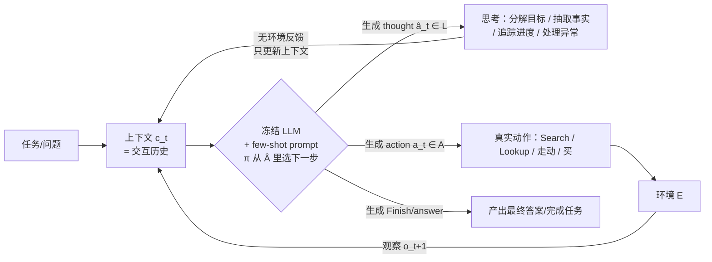

# ReAct：在语言模型中协同「推理」与「行动」

> **本篇是 agent-harness 库 B 组（控制循环）的 canon 起点**。它回答一个今天看来"理所当然"、当年却没人正经做过的问题：
> 一个 LLM agent 每一步到底该输出什么？ReAct 的答案是——**不是只输出动作（会瞎撞），也不是只输出推理（会幻觉、够不着环境），
> 而是让二者交错**：先想一句（thought），再做一个动作（act），看一眼环境反馈（obs），再想再做。
> 这个"想-做-看"的循环，就是后来所有 agent harness 的**控制循环骨架（L 层）**。写作对齐 v1/v2/Θ 全部硬规范。

---

## §1　TL;DR（一页讲清这篇在干嘛）

> 主讲提示：开场先立"它是祖先"这个定位——今天我们自己（Claude Code、m9.* agent）跑的循环，就是它的直系后代。别当普通 benchmark 讲。

一句话：**把"推理"变成 agent 动作空间里的一等公民**。传统上 LLM 的"推理（chain-of-thought, CoT）"和"行动（action generation）"是两条分开研究的线；ReAct 让模型在**同一条轨迹里交错生成**「推理轨迹 thought」与「任务动作 act」，动作再带回「环境观察 obs」。推理帮模型**分解目标、追踪进度、处理异常、更新计划**；动作帮模型**接触外部知识源/环境、纠正推理**（§Abstract、§1）。

- **属于 harness 的哪一层（Θ1）**：本篇打的是 **L（Loop / 控制循环）** 层——它不造工具、不管上下文压缩，而是**定义了循环里每一步的"动作词表"**：`{ 真实动作 } ∪ { 思考 }`。这是 agent 循环最底层的语法。对其它层的依赖很轻：只要一个能跑 few-shot 的强 LLM（本文 PaLM-540B）+ 一个最简单的工具接口（3 个 Wikipedia 动作）即可。
- **回扣全库论点（Θ2）**：ReAct 是 `Agent = Model + Harness` 里 **Harness 那一项最早的可复现实体**。同一个冻结模型 PaLM-540B，什么都不改，只把 prompt 里的"轨迹格式"从"只动作(Act)"换成"想+动作(ReAct)"，ALFWorld 成功率就从 45% → 71%（Table 3）、比模仿学习基线 BUTLER 高 34 个百分点（§Abstract）。**变的不是模型，是循环里输出什么**——这正是 harness 效应的鼻祖级证据。
- **够权威（Θ4）**：**ICLR 2023 正式接收**，Princeton NLP + Google Brain 出品，是 agent 领域被引最多的奠基论文之一。它把"LLM 当 policy 在闭环里边想边做"这件事**第一个系统化地做通并命名**（§Related Work 自述：据作者所知，是"first demonstration of combined reasoning and action using an LLM in a closed-loop system"）。

**三条带走的结论**：
1. **交错 > 单独**：ReAct 同时优于"纯推理(CoT)"和"纯行动(Act)"——CoT 会幻觉（HotpotQA 假阳性 14% vs ReAct 6%，Table 2），Act 不会分解任务（ALFWorld 45% vs 71%，Table 3）。
2. **推理让行动可纠错、可解释、可人工干预**：thought 把"模型为什么这么做"暴露成自然语言，人只要改一两句 thought 就能救回一条失败轨迹（§A.3，Figure 5）。
3. **格式约束是双刃剑**：交错格式提升了 grounding，却也**压低了推理灵活性**——ReAct 的"推理错误率"反而比 CoT 高（47% vs 16%，Table 2），这直接催生了后续 Reflexion/ToT 等"给推理更多自由度"的工作。

---

## §2　问题与动机：为什么"边想边做"值得单独提出来

> 主讲提示：这页讲清 2022 年的两条平行线各自的死角。用 Why 三连的"问题层"。

**Why（问题层）——不解决会卡住什么？**
2022 年，用 LLM 做两件事各自都很火，但**互不搭理**（§1、§2、§5）：

- **一条线：LLM 做推理**。CoT（Wei et al. 2022）让模型"写出思考步骤"，在算术/常识/符号推理上大涨。但作者一针见血地指出其死角（§1 原文）："chain-of-thought reasoning is a **static black box**, in that the model uses its own internal representations to generate thoughts and is **not grounded in the external world**"——纯 CoT 只在脑子里推，够不着外部世界，于是**会把事实幻觉出来、错误会沿推理链传播**（Figure 1(1b) 就是一个 CoT 把"Apple Remote 能控制的设备"想岔的例子）。
- **另一条线：LLM 做决策/行动**。SayCan、WebGPT、Inner Monologue 等让 LLM 在交互环境里预测动作。但这些方法（§1 原文）"do not employ language models to **reason abstractly about high-level goals** or maintain a working memory to support acting"——它们把 LLM 当"动作生成器"，**不会把目标分解、不会维护工作记忆**（Figure 1(2a) 里 Act-only 的 agent 反复去空水槽拿胡椒瓶，因为它没推理出"这个水槽里没有"）。

**后果**：两条线各缺对方那一半。没人系统研究过——**如果让同一个模型既产生推理、又产生行动，二者交错，会不会 1+1>2？**（§1 末原文："there have been no studies on how reasoning and acting can be combined in a synergistic manner for general task solving"）。

> **读出什么**：这篇的动机**不是"再刷个 SOTA"**，而是补一个**范式空缺**——把两种能力焊在一个循环里。这正是 L 层（控制循环）作为 harness 骨架的意义：它不改模型、不加工具，只改"每一步输出什么"，就能同时治好幻觉和不会分解两个病。

---

## §3　核心 intention：一句话形式化 + 一个极简改动

> 主讲提示：这是全篇最该讲透的"思想内核"。ReAct 的数学极其简单——简单到可以说它是一个"prompt 约定"而非"新模型"，但正是这个约定定义了 agent 循环。

**直觉**：想象一个标准的强化学习/决策 agent：每一步它看一个观察 $o_t$，从动作空间 $\mathcal{A}$ 里挑一个动作 $a_t$。ReAct 只做一件事——**把动作空间扩容，塞进"说话（思考）"这种动作**。

**先定义符号（公式前逐个给清）**（§2）：
- $t$：时间步（第几轮）；
- $o_t \in \mathcal{O}$：第 $t$ 步从环境收到的**观察 (observation)**（如搜索返回的文本、房间里看到的物品）；
- $a_t \in \mathcal{A}$：第 $t$ 步采取的**真实动作 (action)**，会改变环境或从环境取信息（如 `Search[Apple Remote]`）；
- $\mathcal{A}$：原始（真实）动作空间；
- $c_t = (o_1, a_1, \cdots, o_{t-1}, a_{t-1}, o_t)$：到第 $t$ 步为止的**上下文 (context)**，即完整的交互历史；
- $\pi(a_t \mid c_t)$：把上下文映射到动作的**策略 (policy)**（这里由冻结的 LLM + few-shot prompt 隐式实现）。

标准 agent 学的是 $c_t \mapsto a_t$。作者说（§2 原文），当这个映射"highly implicit and requires extensive computation"时，光靠动作学不出来（Figure 1(1c) 的 Act-only 生成不出正确的 Act 4，因为它需要在长上下文上做复杂推理）。

**ReAct 的唯一改动——扩容动作空间**（§2 的思想内核）：

先给直觉：让模型可以"说一句只给自己听、不惊动环境"的话。再给形式：

$$\hat{\mathcal{A}} = \mathcal{A} \cup \mathcal{L}$$

符号（先定义后用）：
- $\mathcal{L}$：**语言空间 (language space)**——所有可能的自然语言串；
- $\hat{\mathcal{A}}$：**扩容后的动作空间**；
- $\hat{a}_t \in \mathcal{L}$：一个语言空间里的动作，作者称之为**思考 (thought)** 或**推理轨迹 (reasoning trace)**。

关键性质（§2 原文）：一个 thought $\hat{a}_t$ **"does not affect the external environment, thus leading to no observation feedback"**——它不改环境、不产生 obs，只做一件事：**更新上下文**：

$$c_{t+1} = (c_t, \hat{a}_t)$$

**读出什么**：这两个式子就是整个 ReAct。它说明——
1. **thought 是"零外部副作用"的动作**：它唯一的作用是把"有用的信息"（分解后的子目标、从 obs 里抽取的关键事实、常识、计划调整）**写进上下文**，供后续推理或行动使用（§2 列了 thought 的几种用途：分解目标、注入常识、从观察抽取、追踪进度、处理异常）。
2. **循环的每一步现在是从 $\hat{\mathcal{A}}$ 里选**：模型自己决定"这一步是想（生成 thought）还是做（生成 action）"。作者让**模型自行决定 thought 与 action 的异步节奏**（§2 原文："we let the language model decide the asynchronous occurrence of thoughts and actions for itself"）。
3. 但有代价：$\mathcal{L}$ 是无限空间，"learning in this augmented action space is difficult and requires strong language priors"（§2）——所以必须用**很强的冻结大模型 + few-shot**，学不了小模型。

> **Why（设计层）——为什么是"扩容动作空间"而非"两个分开的模块"？**
> 朴素替代 ①：**先让一个 CoT 模块想完整个计划，再交给一个 action 模块执行**。→ 失败：计划是"离线"想好的，一旦环境反馈和预想不符（工具报错、搜不到），静态计划无法在线纠错——这正是纯 CoT 的 grounding 缺陷。
> 朴素替代 ②：**只输出动作，把推理"隐式"压进策略网络里**。→ 失败：复杂任务里 $c_t \mapsto a_t$ 太隐晦，模型学不出来，且不会显式分解目标（Act-only 在 ALFWorld 只有 45%）。
> ReAct 更优：把 thought 和 act 放进**同一个自回归序列**里交错生成，thought 能立刻用上刚到的 obs、act 能立刻执行刚想出的计划——**推理与行动在同一循环里互相咬合**（§2 原文的 "reason to act" 与 "act to reason" 双向）。这就是"协同 (synergy)"二字的技术含义。

---

## §4　方法总览（big picture）：一张图看懂"想-做-看"循环

> 主讲提示：先给循环的一图流，再强调"两种任务节奏不同"这个易被忽略的细节。

**两类任务，两种"想-做"节奏**（§2 末，这是个常被忽略但重要的设计）：
- **推理为主的任务**（HotpotQA、Fever，Figure 1(1)）：**稠密思考 (dense thought)**——每一个动作前后都要想，轨迹形如 `想→做→看→想→做→看…`（thought-action-observation 步交替）。
- **决策为主的任务**（ALFWorld、WebShop，Figure 1(2)）：动作数量可能很多，**思考只在最相关的少数位置稀疏出现 (sparse thought)**——模型自己决定何时插入一句 thought（例如"现在我该去哪找胡椒瓶"），其余步骤直接连续动作。

> **读出什么**：ReAct **不规定固定模板**（不是"每步必须先想后做"），而是把"何时想、何时做"的决定权交给模型。这份灵活性是它"general and flexible"的来源（§2 的四个特性 A/B/C/D），也是它区别于后来那些"强制固定 think-act-observe 三段式"框架的地方。

---

## §5　符号与术语速查表

> 主讲提示：这页当"字典"，后面 §6–§10 反复用。

| 记号 / 术语 | 含义 | 出处 |
|---|---|---|
| $o_t \in \mathcal{O}$ | 第 $t$ 步环境观察 | §2 |
| $a_t \in \mathcal{A}$ | 第 $t$ 步真实动作（改环境/取信息） | §2 |
| $\hat{a}_t \in \mathcal{L}$ | 思考 thought / 推理轨迹（不改环境） | §2 |
| $\hat{\mathcal{A}} = \mathcal{A} \cup \mathcal{L}$ | 扩容动作空间（真实动作 ∪ 语言） | §2 |
| $c_t$ | 上下文 = 到 $t$ 步的交互历史 | §2 |
| $\pi(a_t \mid c_t)$ | 策略（冻结 LLM + few-shot 实现） | §2 |
| **CoT** | Chain-of-Thought，纯推理基线（去掉所有动作/观察） | §3.3 |
| **CoT-SC** | CoT + Self-Consistency，采样 21 条 CoT 取多数投票 | §3.3 |
| **Act** | 纯行动基线（从 ReAct 轨迹里删掉所有 thought） | §3.3 |
| **ReAct** | 本文方法：thought 与 action 交错 | §2 |
| **Search[entity]** | Wikipedia API：返回该 entity 页前 5 句，或 top-5 相似实体 | §3.1 |
| **Lookup[string]** | 返回页面中包含 string 的下一句（模拟 Ctrl+F） | §3.1 |
| **Finish[answer]** | 结束任务并给出答案 | §3.1 |
| **EM** | Exact Match，答案与标准答案精确匹配率（HotpotQA 指标） | Table 1 |
| **Acc** | Accuracy，三分类正确率（Fever 指标） | Table 1 |
| **SR** | Success Rate，任务成功率（ALFWorld/WebShop 指标） | Table 3/4 |

---

## §6　知识密集型任务（一）：设置——Wikipedia 三动作 API

> 主讲提示：这页讲清"最弱的工具 + 最强的推理"这个刻意选择。

**任务**（§3.1）：两个需要"检索 + 推理"的数据集——
- **HotpotQA**（Yang et al. 2018）：多跳问答，答案需要在**两个及以上 Wikipedia 段落**上推理。
- **Fever**（Thorne et al. 2018）：事实核查，给一个 claim，判定 `SUPPORTS / REFUTES / NOT ENOUGH INFO`。
- 两者都用 **question-only 设置**：模型**不给**支撑段落，只能靠内部知识或**自己去检索**。

**动作空间——刻意做弱**（§3.1，三个动作）：
1. `search[entity]`：返回该实体 Wikipedia 页的**前 5 句**；若实体不存在，返回搜索引擎的 **top-5 相似实体**（模拟"搜不准"的情况）。
2. `lookup[string]`：返回当前页里包含 `string` 的**下一句**（模拟浏览器 Ctrl+F）。
3. `finish[answer]`：结束并给答案。

> **Why（设计层）——为什么故意用这么弱的检索？**
> 朴素替代：接一个强大的稠密检索器（DPR/神经检索），一把捞到最相关段落。→ 那样就变成"检索器强不强"的比拼，掩盖了"推理能不能引导检索"这个真问题。作者明说（§3.1 原文）：这个动作空间"mostly can only retrieve a small part of a passage based on **exact passage name**, which is significantly weaker than state-of-the-art retrievers"，目的是**模拟人怎么用 Wikipedia、逼模型靠"显式推理"去检索**——想不清楚就搜不到、就得改写查询。**弱工具反而放大了推理的价值**，这正是 L 层要证明的东西。

---

## §7　知识密集型任务（二）：ReAct 轨迹长什么样

> 主讲提示：拿论文 Figure 1(1d) 的真实轨迹逐句念，这是理解 ReAct 最快的方式。

**一条真实的 ReAct 轨迹**（Figure 1(1d)，问题："除了 Apple Remote，还有什么设备能控制它最初设计要交互的那个程序？"）：

| 步 | 内容 | 起的作用 |
|---|---|---|
| Thought 1 | "我需要搜 Apple Remote，找出它最初设计要交互的程序" | **分解目标** |
| Act 1 / Obs 1 | `Search[Apple Remote]` → "…设计用来控制 Front Row media center 程序…" | 取信息 |
| Thought 2 | "Apple Remote 控制 Front Row。我需要搜 Front Row，找还有什么设备能控制它" | **追踪进度 + 定下一步** |
| Act 2 / Obs 2 | `Search[Front Row]` → "Could not find [Front Row]. Similar: […]" | 工具失败 |
| Thought 3 | "Front Row 没找到。我需要搜 Front Row (software)" | **处理异常 + 改写查询** |
| Act 3 / Obs 3 | `Search[Front Row (software)]` → "…由 Apple Remote 或键盘功能键控制…" | 取信息 |
| Thought 4 | "Front Row (software) 由 Apple Remote 或键盘功能键控制。所以答案是键盘功能键" | **综合作答** |
| Act 4 | `Finish[keyboard function keys]` ✓ | 完成 |

对照**同一题**：CoT（Figure 1(1b)）把"Apple Remote 设计用来控制 Apple TV"**幻觉**出来，答成 iPhone/iPad/iPod（✗）；Act-only（Figure 1(1c)）搜到 Front Row 找不到后**卡住、直接 Finish[yes]**（✗）。

**Prompt 怎么构造**（§3.2）：HotpotQA 随机选 **6 个**、Fever 选 **3 个**训练样例，**人工把 thought 手写在 action 上方**，拼成 few-shot 示范（真实 prompt 见附录 C，本报告已读，如 Colorado orogeny 那条 5 步轨迹）。作者注："we find more examples do not improve performance"（脚注 2）——**示范不是越多越好**。

> **读出什么**：这张表把 §2 抽象的"thought 的用途"落到实处——**分解、追踪、处理异常、综合**四种推理，全都在一条轨迹里按需出现。ReAct 的"祖先"地位就体现在：今天任何一个 agent 的轨迹，剥开看都是这个 `Thought→Act→Obs` 的循环。

---

## §8　知识密集型任务（三）：结果——ReAct 与 CoT 是互补的，不是谁碾压谁

> 主讲提示：这是全篇最微妙、也最诚实的结果。别把它讲成"ReAct 全面胜"。停在 Table 1、Table 2 上。

**主结果（Table 1，PaLM-540B，HotpotQA 用 EM / Fever 用 Acc）**：

| Prompt 方法 | HotpotQA (EM) | Fever (Acc) |
|---|---:|---:|
| Standard（无推理无动作） | 28.7 | 57.1 |
| CoT（纯推理） | 29.4 | 56.3 |
| CoT-SC（纯推理 + 自一致，21 采样） | 33.4 | 60.4 |
| Act（纯行动） | 25.7 | 58.9 |
| **ReAct** | 27.4 | **60.9** |
| **CoT-SC → ReAct**（组合） | 34.2 | **64.6** |
| **ReAct → CoT-SC**（组合） | **35.1** | 62.0 |
| *Supervised SoTA（参照）* | *67.5* | *89.5* |

**怎么读这张表（Θ2 的诚实版）**：
1. **ReAct > Act**（27.4 vs 25.7；60.9 vs 58.9）：加了推理，动作更明智，尤其"综合最终答案"这一步（§3.3）。这是 L 层的直接收益。
2. **ReAct vs 纯 CoT 各有胜负**：Fever 上 ReAct 胜（60.9 vs 56.3），因为 SUPPORTS/REFUTES 常常只差一个可检索的事实；**HotpotQA 上 ReAct 反而略输 CoT**（27.4 vs 29.4）！——见下面 Table 2 的机制解释。
3. **组合最强**：`ReAct→CoT-SC`（HotpotQA 35.1）和 `CoT-SC→ReAct`（Fever 64.6）拿下各自最好成绩，都超过单用 CoT-SC。启发式很简单（§3.3）：ReAct 在规定步数内没给出答案 → 回退 CoT-SC（HotpotQA 设 7 步、Fever 设 5 步）；或 CoT-SC 的多数答案占比 < n/2（内部知识没把握）→ 回退 ReAct。
4. 与**监督 SoTA 仍有巨大差距**（67.5 / 89.5）——ReAct 是 **few-shot（1~6 例）**，作者诚实承认离领域专用监督模型还远。

**为什么 HotpotQA 上 ReAct 会输给 CoT？机制在 Table 2（人工标注 200 条轨迹的成败模式）**：

| 类型 | 定义 | ReAct | CoT |
|---|---|---:|---:|
| 成功·真阳性 | 推理与事实都对 | 94% | 86% |
| 成功·**假阳性** | **幻觉出的推理/事实** | **6%** | **14%** |
| 失败·推理错误 | 推理错（含在重复步骤里出不来） | **47%** | 16% |
| 失败·搜索结果错 | 搜索返回空/无用信息 | 23% | — |
| 失败·幻觉 | 幻觉出的推理/事实 | **0%** | **56%** |
| 失败·标签歧义 | 预测对但没精确匹配标签 | 29% | 28% |

**Why（结果层）——为什么是这几个数？**
- **A) CoT 的头号病是幻觉**：CoT 失败里 **56% 是幻觉**，假阳性率 14%（是 ReAct 的两倍多）。因为它够不着外部世界，只能"编"（§3.3 原文："Hallucination is a serious problem for CoT"）。
- **B) ReAct 几乎不幻觉（失败里 0%），但推理更死板**：接了真实检索，ReAct 更"factual and grounded, trustworthy"（§3.3）；代价是**交错格式约束了推理灵活性**——ReAct 的**推理错误率 47%**（CoT 只 16%）。有一个 ReAct 特有的失败：**模型反复生成之前的 thought/action，跳不出循环**（§3.3 脚注 4，作者归因于贪心解码次优，猜测 beam search 能缓解）。
- **C) 检索质量是命门**：**23% 的失败来自"搜到无用信息"**，直接把推理带偏、难以恢复（§3.3："successfully retrieving informative knowledge via search is critical"）。这解释了为什么要 CoT-SC 兜底。

> **读出什么（Θ2 + Θ5 埋线）**：这张表是 ReAct 最有判断力的地方——它**没吹"交错必胜"**，而是精确地说明：交错**消灭了幻觉、换来了 grounding，但牺牲了推理自由度**。这个 trade-off 就是后续 Reflexion（加反思/记忆）、Tree-of-Thoughts（给推理加分支搜索）、LATS（把 ReAct 塞进 MCTS）要解决的问题——它们都是在 ReAct 的循环骨架上"把推理那一半的自由度补回来"。

---

## §9　决策任务：ALFWorld 与 WebShop——推理让"会分解、会探索"

> 主讲提示：这页是 ReAct 的"高光"——在需要长程规划的任务上，加不加 thought 的差距被放到最大。

**ALFWorld**（Shridhar et al. 2020，文字版家务游戏）：agent 要在一个模拟房间里达成高层目标（如"把胡椒瓶放进抽屉"），一个任务实例可能 **>50 个位置、专家策略 >50 步**（§4）。挑战：得**系统探索**（挨个查抽屉）+ 用**常识**（台灯多半在桌上）。ReAct prompt 每类任务标 3 条轨迹，每条含四种稀疏思考：(1) 分解目标、(2) 追踪子目标完成、(3) 决定下一子目标、(4) 常识定位物品。

**WebShop**（Yao et al. 2022，真实电商噪声环境）：**118 万真实商品、1.2 万条人类指令**（§4）。agent 要按指令（"找一个带抽屉、镍质、<140 美元的床头柜"）通过 search/choose 买对商品。

**结果（Table 3 ALFWorld 成功率 % / Table 4 WebShop）**：

| ALFWorld (best of 6) | All (SR%) | | WebShop | Score | SR% |
|---|---:|---|---|---:|---:|
| Act | 45 | | Act | 62.3 | 30.1 |
| **ReAct** | **71** | | **ReAct** | **66.6** | **40.0** |
| ReAct-IM（消融） | 53 | | IL（模仿学习） | 59.9 | 29.1 |
| BUTLER（模仿学习基线） | 37 | | IL+RL | 62.4 | 28.7 |
| | | | *Human Expert* | *82.1* | *59.6* |

**Why（结果层）——为什么 ALFWorld 上 71 vs 45 差这么大？**
- **纯 Act 不会分解、会迷失**（§4 原文）："without any thoughts at all, Act fails to correctly decompose goals into smaller subgoals, or loses track of the current state of the environment"。它没有工作记忆，走着走着忘了自己在干嘛（Figure 1(2a) 反复去空水槽）。
- **ReAct 的优势跨 6 组对照一致**：相对提升 **33%~90%，平均 62%**（§4）。而且**连 ReAct 最差的一次（48%）都超过 Act 最好的一次（45%）**（§4 原文）——说明这不是运气，是范式差异。
- **WebShop 上 +10% 绝对成功率**（40.0 vs 30.1，超过 IL 与 IL+RL）：推理帮模型**在噪声观察和动作间架桥**——"这个商品有 39x18x18 寸、蓝色，看起来不错可以买"（§4）。但离人类专家（59.6）仍远——人会做更多探索和查询改写，这是 prompting 方法的短板（§4）。

**关键消融——ReAct-IM（§4 末，回应"是不是任何密集反馈都行？"）**：把 ReAct 的 thought 换成 **Inner-Monologue 式的密集外部反馈**（只描述"环境状态 + 还差什么"），ALFWorld 成功率从 **71 → 53**。原因（§4）：IM 式反馈**不判断子目标何时完成、不决定下一个子目标、不调用内部常识定位物品**——证明**"是自主的、灵活的推理"在起作用，而非"任何反馈填进循环"都行**。

> **读出什么（Θ2 铁证）**：ALFWorld 45%→71% 是 `Agent = Model + Harness` 的**鼻祖级实证**——模型（PaLM-540B）一字未改，只把循环里"每步输出什么"从 Act 换成 ReAct，成功率涨 26 个百分点、比训了 10⁵ 条专家轨迹的 BUTLER 高 34 个百分点。**这就是 harness（控制循环）压过训练量的最早证据。**

---

## §10　两个"软"贡献：可解释、可控、可人工干预

> 主讲提示：这页讲 ReAct 除了分数之外，对"人机协作"的意义——这是它被后续 agent 系统继承最多的东西之一。

**(1) 结合内外知识（§3.3 "Combining Internal and External Knowledge"）**：ReAct 更 grounded 但推理死板，CoT 更会构造推理但爱幻觉——把两者**按启发式切换**（见 §8 组合行），拿到最好成绩。这是一个"**用外部行动补内部推理的短板**"的通用配方。

**(2) 人在回路的行为纠正（§A.3，Figure 5，本报告已读附录）**：因为 thought 是自然语言、暴露在轨迹里，**人只要编辑一两句 thought 就能救回失败轨迹**。论文例子：一条 ALFWorld 轨迹在 Act 17 因一句幻觉 thought 走错，人把 Act 17、Act 23 两句 thought 一改，agent 立刻改变行为并成功（§A.3 原文："from typing tens of actions to only editing a couple of thoughts"）。作者点出这比改 Act/RL 方法容易得多——**你没法改模型参数，但你能改它的"想法"**。

**(3) 取到"过时标签"外的正确答案（§A.2，Figure 4）**：有些 HotpotQA 标签本身**过时**了（如问某酒店房间数，建库后扩建了）。Standard/CoT 因幻觉答错、Act 因无推理答错，**只有 ReAct 靠"真实检索 + 推理"拿到最新的正确答案**（§A.2）——顺带说明 ReAct 天然适配"需要时效信息"的任务。

> **Why（问题层）这些"软"贡献为什么重要**：agent 要落地，**光有分数不够，还要可诊断、可信、可干预**。ReAct 把"模型为什么这么做"从黑箱里掏出来变成自然语言，让人能 inspect、能纠错、能协作（§2 特性 D："Human aligned and controllable"）。这条"可解释性来自 thought"的思想，被后来几乎所有 agent 框架继承。

---

## §11　跨模型与微调：ReAct 不只属于 PaLM

> 主讲提示：这页回答两个追问——换个模型还灵吗？能不能不用 few-shot 而是微调？

**换成 GPT-3 更强（§A.1，Table 5，本报告已读附录）**：

| | PaLM-540B | GPT-3 (text-davinci-002) |
|---|---:|---:|
| HotpotQA (EM, 500 题子集) | 29.4 | **30.8** |
| ALFWorld (SR%, 134 题) | 70.9 | **78.4** |

GPT-3 **一致地超过 PaLM-540B**，作者猜是因为它做过**人类指令微调**（§A.1）。**读出什么**：ReAct 是**跨大模型稳健**的 prompt 范式，不是 PaLM 专属——这为它成为"通用循环骨架"提供了证据。

**微调（§3.3 "ReAct performs best for fine-tuning"，Figure 3）**：用 bootstrapping（类 STaR，Zelikman et al. 2022）生成 3000 条正确轨迹微调小模型（PaLM-8B/62B）。结论很有意思：
- **prompting 时，小模型上 ReAct 最差**（要同时学推理+行动，few-shot 学不动）；
- 但**微调后 ReAct/Act 反超**——**微调过的 PaLM-8B ReAct 就超过所有 PaLM-62B 的 prompting**，微调 PaLM-62B ReAct 超过所有 540B prompting（§3.3）。
- 而微调 Standard/CoT **反而很快退化**——因为它们"教模型死记（可能幻觉的）事实"，而 ReAct/Act "教模型如何访问 Wikipedia、是更可泛化的技能"（§3.3 原文）。

> **读出什么**：ReAct 的价值**随规模与微调放大**。作者判断（§3.3）："finetuning with more human-written data might be a better way to unleash the power of ReAct"——预示了后来"用 agent 轨迹微调专用 agent 模型"的整条路线。

---

## §12　实验设置一览（setting / params 汇总）

> 主讲提示：这页当"方法卡"，把散落各处的设置钉在一张表上。

| 项目 | 取值 | 出处 |
|---|---|---|
| 基座模型 | PaLM-540B（主）；GPT-3 text-davinci-002（附录验证）；PaLM-8B/62B（微调） | §2, §A.1, §3.3 |
| 解码 | **greedy decoding**（贪心；CoT-SC 用 temperature 0.7 采样 21 条） | §3.3, Table 3 |
| few-shot 数 | HotpotQA 6 例 / Fever 3 例 / ALFWorld 每类 3 例（构 6 prompt）/ WebShop 1 例 | §3.2, §4 |
| HotpotQA/Fever 指标 | EM（精确匹配）/ Acc（三分类正确率） | Table 1 |
| ALFWorld/WebShop 指标 | SR（成功率 %）；WebShop 另有 Score（属性覆盖百分比平均） | §4, Table 3/4 |
| ALFWorld 评测集 | 134 个 unseen 游戏；best of 6 prompt | §4, Table 3 |
| WebShop 评测集 | 500 条测试指令 | §4 |
| 组合回退阈值 | HotpotQA ReAct 7 步 / Fever 5 步内无答案则回退；CoT-SC 多数占比 < n/2 回退 ReAct | §3.3 |
| 微调 | batch 64；8B 训 4000 步、62B 训 4000 步（ReAct/Act）；3000 条 bootstrapped 轨迹 | §B.1 |
| baseline | Standard / CoT / CoT-SC / Act（QA）；BUTLER（ALFWorld，10⁵ 专家轨迹）；IL、IL+RL（WebShop） | §3.3, §4 |

**指标定义式（照 v1 要求给定义）**：
- **EM（Exact Match）** = $\frac{1}{N}\sum_{i=1}^{N} \mathbb{1}[\hat{y}_i = y_i]$，$\hat{y}_i$ 为预测答案、$y_i$ 为标准答案、$\mathbb{1}[\cdot]$ 为指示函数、$N$ 为样本数。读出：只有字符串完全匹配才算对，故对"标签歧义"很敏感（Table 2 里 ReAct/CoT 各有 ~29% 失败属此类）。
- **SR（Success Rate）** = $\frac{1}{N}\sum_{i=1}^{N}\mathbb{1}[\text{episode}_i \text{ 满足任务成功判据}]$。读出：ALFWorld 是"物品放对位置"、WebShop 是"买的商品满足全部要求"。

---

## §13　局限与批判（论文 §6 + 我的补充）

> 主讲提示：canon 也有边界。诚实标出，正好接后续论文怎么补。

**论文自陈的局限（§6 Conclusion + 各处）**：
1. **大动作空间需要更多示范，容易超上下文窗口**（§6 原文）："complex tasks with large action spaces require more demonstrations to learn well, which unfortunately can easily go beyond the input length limit of in-context learning"——few-shot 的天花板。
2. **推理灵活性被格式压低**（§3.3 Table 2）：ReAct 推理错误率 47% > CoT 16%，还有"卡在重复 thought/action 里出不来"的循环 bug（脚注 4 归因贪心解码）。
3. **检索质量是命门**：23% 失败来自无用检索（§3.3），ReAct 对工具质量高度敏感。
4. **离监督 SoTA 仍远**（Table 1：35.1 vs 67.5）——它是"few-shot 通用范式"，不是"单任务最强"。

**我的补充批判**：
- **它是"prompt 约定"，不是"算法"**：ReAct 的形式化极薄（就是 $\hat{\mathcal{A}}=\mathcal{A}\cup\mathcal{L}$ + 手写示范）。**thought 何时生成、生成什么，完全由 few-shot 的"演示风格"隐式决定**，没有任何机制保证 thought 是"好"的——这为后续"给推理加显式结构（ToT 的树、Reflexion 的记忆）"留了全部空间。
- **无自我纠错/回溯**：ReAct 是**单向前进**的贪心轨迹，一步走错（尤其那个"重复 thought"死循环）就难回头。它没有 Reflexion 的"失败后反思再试"，也没有 ToT/LATS 的"搜索多条分支"。这是它作为 canon 最明显的"未长肉"处。
- **评测规模偏小**：失败模式分析只人工标了 200 条轨迹（§3.3），ALFWorld best-of-6 的"best of"也引入了选择偏差（报告的是 6 个 prompt 里最好的）。
- **thought 的"可控"是双刃**：§A.3 说人能改 thought 救轨迹——但反过来，**thought 也可能被 prompt 注入操纵**，这条 attack surface 论文未讨论（与本库 O/V 层的安全关切相接）。

---

## ★ 对我们的启发（Inspires Us）

> 这一节是组会高潮，也是本篇独有的分量：**ReAct 不是"别人的方法"——我们（Claude Code / 本课 m9.* 的 agent）此刻跑的循环，字面上就是 ReAct**。
> 我们每一步生成的"我要先读文件→调工具→看返回→再决定"，剥开正是 `Thought → Act → Obs`。所以下面每条都直接"打到自己身上"。

➤ **a. 可直接借用的招（method/trick we can reuse）**：
- **"thought 是零副作用动作"这个抽象**（§2 的 $\hat{\mathcal{A}}=\mathcal{A}\cup\mathcal{L}$）可以直接用来**审计我们自己循环里的每一步**——把我们 agent 的每条输出打标为 `thought`（不碰环境）还是 `act`（碰工具/文件），就能量化"我们花了多少 token 在想 vs 在做"。
- **组合回退启发式**（§3.3 `ReAct→CoT-SC`）：当我们的 ReAct 循环在 N 步内没收敛，**回退到一次"纯推理 + 自一致投票"**再决策——这是一个几乎零成本、可立刻加到我们控制循环的兜底策略。

➤ **b. 可迁移到我们课题的思路（transfer）**：把 §9 的 **ReAct-IM 消融**迁移到我们 `m9.*` 的 agent 上——**验证"我们循环里的 thought 到底有没有用、还是只是好看"**。做法：造一个"ReAct-IM 版的我们"（把自主 thought 换成模板化的状态复述），在同一批任务上比成功率。若差距大（像 71 vs 53），证明我们的自由推理在做实事；若差距小，说明我们的 thought 是"仪式性废话"，该精简以省 token。**迁移前提**：我们要能结构化录下每一步是 thought 还是 act（正是 Harness-Bench 那篇 [2605.27922] 要求的 trace instrumentation）。

➤ **c. 它暴露的开放问题 = 我们的机会（open problems → our opportunity）**：ReAct 最大的未解 bug 是**"重复 thought/action 死循环"**（§3.3 脚注 4）——**我们自己的循环今天也会卡在这里**（反复读同一文件、反复试同一个失败命令）。机会：给我们的控制循环加一个**"循环检测器"**——检测"连续 K 步的 (thought, act) 与历史高度相似"就强制打断、触发一次"换策略"的 meta-thought。可下手的第一步：在我们 agent 循环里对最近 3 步的动作做去重哈希，命中就注入一句"你在重复，换个方法"。

➤ **d. 与本库其它论文/模块的连接（connect the dots）**：
- **向后长肉**：ReAct 是 B 组 canon 的**根**——**Reflexion**（在失败轨迹后加"反思记忆"，补 §13 说的"无自我纠错"）、**Tree-of-Thoughts / LATS**（给 ReAct 的单向轨迹加"分支搜索/回溯"，补 §8 的"推理死板 47% 错误率"）全都是"在 ReAct 循环上补推理自由度"。讲这些论文时都要回指本篇。
- **与 G 组 [Harness-Bench 2605.27922] 呼应**：那篇用 5194 条轨迹**统计地**证明"换 harness 分数摆 23.8 分"，ReAct 则是**最早给出这个现象的单点铁证**（ALFWorld 45%→71%，只换循环格式）。一个是"祖先的一个例子"，一个是"后代的系统性度量"。
- **与 auto-research 库 `m9.2` 呼应**：我们在 `m9.2` 验证过"无 critic 残 1、有 critic 残 0"——ReAct 的 thought 其实是**最原始的"自我 critic"**（在 act 前先想一句"这样对吗"），只是没独立成角色。

➤ **e. 如果我来做下一步（my next move）**：我会先在我们某个 `m9.*` agent 的控制循环里**加一个"循环检测 + 强制换策略"的开关**（§13 那个死循环 bug 的直接补丁），在 10 个已知会"卡循环"的任务上测：打断机制能否把"重复动作导致的失败"从当前比例压下去。如果有效，再加第二步——把 §3.3 的 `ReAct→CoT-SC` 回退接上，测收敛步数是否下降。**这是把这篇 canon 的两个已知短板，直接补到我们自己活着的 harness 上。**

---

## §14　版图定位（canon 坐标 + 在本库的位置）

> 主讲提示：这页立"祖先"的历史坐标——它定义了什么、谁在它上面长肉。

- **时间坐标（Θ4，canon）**：**ICLR 2023 接收**（arXiv 2022-10 起步），是 **agent 控制循环的开山之作**。它**第一个把"LLM 在闭环里边推理边行动"系统化、命名、并证明有效**（§5 自述是 first closed-loop reasoning+acting demonstration）。**它定义了什么**：`thought / act / obs 交错` 这个 agent 循环的**基本语法**，以及"thought = 零副作用、只更新上下文的动作"这个抽象。
- **谁在它上面长肉（canon 的后代）**：
  - **Reflexion**：在 ReAct 轨迹外套一层"失败→语言反思→写进记忆→重试"，补本篇 §13 的"无自我纠错"。
  - **Tree-of-Thoughts / LATS**：把 ReAct 的**单向贪心轨迹**升级成**树搜索 / MCTS**，补 §8 的"推理死板、会卡循环"。
  - **今天的生产级 agent（含我们 Claude Code）**：控制循环本体就是 ReAct 的"想-做-看"，外面再包工具层（C 组）、上下文压缩（D 组）、子代理编排。
- **E/T/C/L/O/V 归属（Θ1）**：本篇稳坐 **L 层（控制循环）**，是 L 层的**定义者**。对其它层依赖极轻——只要一个强 LLM + 一个最简工具接口。
- **回扣全库中心命题（Θ2）**：ReAct 是 `Agent = Model + Harness` 里 **"Harness 能顶过训练"最早的可复现证据**——同模型不动，只换循环里"输出什么"，ALFWorld 45%→71%、超过 10⁵ 轨迹训出的 BUTLER 34 个点。读完本篇再看后面任何 agent 论文，都可以问一句："它是在 ReAct 的循环上，把哪一半（推理自由度 / 记忆 / 搜索 / 工具）补强了？"

**regime 诚实（Θ5，不把"循环 > 模型"绝对化）**：
- **循环格式主导的 regime**：**决策/长程任务**（ALFWorld、WebShop）——需要分解、探索、保状态，加不加 thought 差 26 个点。这里"harness（循环）压过训练量"成立。
- **循环格式退居其次的 regime**：**纯推理任务**（HotpotQA）——ReAct 甚至略输纯 CoT（27.4 vs 29.4），因为格式约束反而压低了推理灵活性。这里"模型的内部推理"更重要，循环格式帮倒忙。
- **诚实表述**：**任务越需要"动手、探索、保状态"，ReAct 式循环收益越大；任务越是"纯脑内多跳推理"，交错格式的约束成本可能盖过收益**。这与本库 G 组"harness 是否主导分 regime"的结论同构，也预告了 ToT/CoT-SC 这类"给推理松绑"的后续路线为何必要。

---

## §15　组会讨论问题（留给大家吵）

1. ReAct 在 HotpotQA 上**输给纯 CoT**（27.4 vs 29.4，Table 1）。这是否说明"交错"在**纯推理**场景是负担？我们自己的 agent 在"只需想、不需动手"的子任务上，是不是也该**关掉工具、退化成纯 CoT**？
2. §3.3 脚注 4 的**"重复 thought/action 死循环"**——你在我们 Claude Code / m9.* 的日志里见过几次？最小的检测+打断方案是什么（对应 Inspires-Us e）？
3. ReAct-IM 消融（71 vs 53，§4）证明"自主推理"比"模板化状态反馈"强。那么**我们循环里的 thought 有多少是"自主的"、多少是"仪式性复述"**？怎么量化？
4. ReAct 的"可控性"来自"thought 是自然语言、可被人编辑"（§A.3）。但反过来，**thought 也可被 prompt 注入操纵**——这条 attack surface 该由哪一层（O/V）来守？
5. §11 显示**微调后 ReAct 反超 prompting**，且"教检索比教记事实更可泛化"。这是否意味着我们该**用自己的 agent 轨迹去微调一个专用 agent 模型**，而非一味堆 few-shot？
6. ReAct 把"推理"和"行动"焊进**同一个自回归序列**。今天有没有理由把它们**拆回两个模型**（一个 planner、一个 executor）？什么 regime 下拆分更好？

---

## §16　一页速记（takeaways）

- **是什么**：`thought / act / obs` **交错**——把"思考"当成**不改变环境、只更新上下文**的动作，塞进动作空间：$\hat{\mathcal{A}}=\mathcal{A}\cup\mathcal{L}$，$c_{t+1}=(c_t,\hat{a}_t)$（§2）。
- **地位**：**ICLR 2023 canon**，Princeton+Google，**agent 控制循环（L 层）的开山之作**、现代所有 agent 循环的祖先。
- **为什么要**：纯 CoT 不接环境 → **幻觉、不可纠错**；纯 Act 无推理 → **不会分解、会迷失**。交错让二者互补（reason to act + act to reason）。
- **推理任务**：ReAct > Act；与 CoT **互补非碾压**（Fever 胜、HotpotQA 略负）；**组合最强**（HotpotQA 35.1 / Fever 64.6，Table 1）。CoT 失败 56% 是幻觉，ReAct 失败 0% 幻觉但 47% 推理错（Table 2）。
- **决策任务（高光）**：ALFWorld **45%→71%**、比 BUTLER（10⁵ 轨迹）**高 34 点**；WebShop **+10% SR**（Table 3/4）。**模型没变，只换循环格式**——`Agent=Model+Harness` 的鼻祖级铁证。
- **消融**：ReAct-IM（换成模板化反馈）71→53 → 起作用的是**自主、灵活的推理**，不是"任何反馈"。
- **软收益**：thought 让轨迹**可解释、可人工编辑纠错**（改 1~2 句 thought 救回失败，§A.3）、能取**过时标签外的最新答案**（§A.2）。
- **跨模型/微调**：GPT-3 > PaLM（30.8/78.4）；微调后 ReAct 反超、且"教检索比教记事实更可泛化"（§A.1, §3.3）。
- **局限**：大动作空间超窗口、推理被格式压死（47% 错误、会卡循环）、检索质量是命门、离监督 SoTA 远。
- **后代**：Reflexion（补自我纠错）、ToT/LATS（补搜索/回溯）、我们自己的 agent 循环（本体就是 ReAct）。
- **对我们**：给控制循环加"死循环检测+强制换策略"补丁 + `ReAct→CoT-SC` 回退；用 ReAct-IM 式消融检验我们的 thought 是不是"仪式性废话"。
- **regime 诚实**：**动手/探索/保状态类任务** ReAct 循环收益大；**纯多跳推理**里交错格式可能帮倒忙——别把"循环 > 模型"绝对化。
