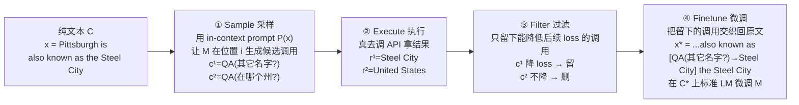

# Toolformer：语言模型可以自学使用工具

> **本篇是 agent-harness 库 C 组（T 层：工具接口）的 canon 奠基范文**。它回答的不是"agent 该配哪些工具"，
> 而是更底层的一问：**工具调用这件事，能不能不靠人工标注、让模型在自己的数据里自己学会？** Toolformer 给出的答案是
> "能"——靠一个极其简洁的自监督判据：*一次 API 调用有没有让后续 token 更好预测*。读这篇要盯死两件事：
> (1) 自监督地把工具调用**插入**训练数据；(2) 基于 **loss 降幅**的**自过滤**。其余（工具选型、实验数字）都是这两件事的注脚。

---

## §1　TL;DR（一页讲清这篇在干嘛）

> 主讲提示：开场先把"自监督"三个字锤实——没有人给模型标注"这里该调计算器"，标注是模型自己用 loss 打出来的。

一句话：**让语言模型 `M` 在自己的预训练语料上，自己生成候选 API 调用、自己执行、再用"这次调用是否降低了后续 token 的 loss"来自我筛选**，把留下来的有用调用交织回原文，得到增强数据集 `C*`，然后在 `C*` 上继续用标准语言建模目标微调 `M`。结果：基于 **GPT-J 6.7B**（Wang & Komatsuzaki 2021）微调出的 Toolformer，在一堆零样本下游任务上**大幅超过同尺寸基线、并常常追平甚至反超 175B 的 GPT-3**（§4.2；LAMA、数学、QA 多张表），而**不牺牲**核心语言建模能力（Table 8 困惑度基本不变）。

- **属于 harness 的哪一层（Θ1）**：本篇打的是 **T（Tools/工具接口）** 层——但它切的是 T 层里一个特别根本的角度：**不是"给 agent 提供什么工具接口"，而是"如何让模型习得使用工具接口的能力"**。它把"工具使用"从"运行时由 harness 外挂的 few-shot 提示"下沉成了"模型权重里学到的行为"。它对 **L（控制循环）** 有隐性依赖（推理时要在解码中断、调 API、续解码，§2 "Inference"），也对 **E（环境）** 有依赖（要能真的执行 API），但这两层它都只用最朴素的实现，火力全集中在 T。
- **回扣全库论点（Θ2）**：`Agent = Model + Harness`。Toolformer 是一个耐人寻味的**边界案例**——它把原本长在 harness 里的"工具使用逻辑"(何时调、怎么调、如何嵌回结果)**内化进了 Model**。换句话说，它在证明"harness 的一部分职责可以被模型自学吸收"。这对本库是一记有益的"反向压力测试"：如果模型能自学工具使用，那 harness 在 T 层的边际价值到底还剩多少？（详见 §14、§ Inspires-Us、§15）
- **够权威够奠基（Θ4）**：**NeurIPS 2023**，Meta FAIR 出品，作者含 Luke Zettlemoyer、Thomas Scialom 等。它是"工具增强语言模型"这条线上被引用最广的**少数奠基作之一**，Θ4 意义上的 **canon**——后续几乎所有谈"工具接口/ACI/tool learning"的工作都要提它。
- **一句话记住它的野心（摘要原话）**：Toolformer 想要"**兼得两个世界之长（best of both worlds）**"——既保住大 LM 的**通用语言能力**，又拿到小工具的**专精能力**（算得准、查得到、知道今天几号）。**它的名字本身就是主张**："Toolformer" = Tool + Transformer，即"一个把工具使用长在自己身上的 Transformer"。这与"外挂一个工具调度器"是两种哲学：**前者把工具能力'内化'，后者把工具能力'外接'**——这个对立贯穿全篇，也贯穿本库 T 层。

---

## §2　问题与动机：为什么"教模型用工具"值得做，而且要"自监督地"做

> 主讲提示：这一段用 Why 三连的"问题层"。先讲 LLM 的硬伤，再讲已有解法的两条死胡同。

**Why（问题层）——不解决会卡住什么？**
大模型零样本/少样本很强，但有一批**结构性硬伤**，靠单纯把模型做大**至多只能部分缓解**（§1 原文点名）：

1. **拿不到最新信息**（无法访问训练截止后的事件，Komeili et al. 2022）；
2. **爱幻觉事实**（Maynez et al. 2020；Ji et al. 2022）；
3. **低资源语言吃力**（Lin et al. 2021）；
4. **不会精确计算**（连基本算术都不稳，Patel et al. 2021）；
5. **对时间无感**（不知道"今天"是哪天，Dhingra et al. 2022）。

耐人寻味的是：这些恰恰是**更小、更简单的系统**（计算器、检索器、日历）**轻松搞定**的事（§1 摘要原句"paradoxically, struggle with basic functionality... where much simpler and smaller models excel"）。所以一个自然的想法是给 LM 配**外部工具**（搜索、计算器、日历）。

**Why（设计层）——为什么已有的工具增强做法不够，非得"自监督"？**
截至 2023，给 LM 配工具主要有两条路，都各有死穴（§1 原文）：

> **Why（设计层）**：朴素做法有两个——
> **① 大量人工标注**（如 Komeili et al. 2022；Thoppilan et al. 2022 的 LaMDA）：人来标"这里该调什么工具"。→ 失败在**贵且不通用**：不但标注成本高，而且**"人觉得有用" ≠ "模型觉得有用"**（§1 原文"what humans find useful may be different from what a model finds useful"）——人标的调用未必真的帮到模型预测。
> **② 任务特定的 few-shot 提示**（如 Gao et al. 2022 的 PAL；Parisi et al. 2022 的 TALM）：只在某个具体任务上、用针对性的示例教模型调工具。→ 失败在**绑死任务、丢掉通用性**：换个任务就得重配，且这种用法把模型钉在窄场景里，"不会自己决定何时该用工具"。
> **本文改用 Z = 自监督**，凭什么更优？因为它同时满足两条 desiderata（§1 列点）：
> - **(a) 自监督、无需大量人工标注**——标注信号来自模型自己的 loss，天然可扩展；
> - **(b) 不损通用性、由模型自己决定"何时/如何/用哪个"工具**——因为学习发生在与预训练**同一份**语料上（§2 "our approach is agnostic of the dataset"），微调后模型面对任意文本都能自主决定要不要调用。

**Why（问题层，收口）**：所以这篇的动机不是"造一个更会用工具的 agent"，而是**"发明一种让模型把'工具使用'当成语言建模的一部分自己学会的机制"**。这是 T 层最根本的问法。

**它站在哪两条思想脉络的交汇处（§6 Related Work，帮助定位其 canon 地位）**：
- **工具增强（tool use）这条线**：先前工作分两派——**靠人工监督**的（Komeili et al. 2022；Nakano et al. 2021 WebGPT；Thoppilan et al. 2022 LaMDA）和**靠任务特定 few-shot 提示**的（Gao et al. 2022 PAL；Lazaridou et al. 2022；Yao et al. 2022 ReAct）。作者点名 **TALM（Parisi et al. 2022）** 是"**与本文最接近**"的工作——它也用类似的自监督目标教模型用计算器和搜索，**但只在"模型已在下游任务上微调"的设定里探索**（即仍绑任务）。Toolformer 的增量正是**摆脱任务绑定、在通用预训练语料上自监督**。
- **自训练/自举（bootstrapping）这条线**：用模型自己的预测（经某种过滤后）回头训练自己的思想，此前用在词义消歧（Yarowsky 1995）、关系抽取（Brin 1999）、句法分析、few-shot 分类（Schick & Schütze 2021a）、推理（Zelikman et al. 2022 STaR）等场景。**Toolformer 把"自举"用到了"工具使用"上**，且过滤器换成了**基于困惑度的 loss 判据**（§6 原文"trained on its own predictions after applying a perplexity-based filtering step"）。

> **读出什么**：把这两条脉络接起来，就能一句话说清 Toolformer 的历史坐标——**"它把'自举/自训练'这套老方法，配上'loss 降幅'这个新过滤器，第一次用来在通用语料上无监督地学会工具使用。"** 它的新不在某个零件，而在**把这几个零件组合起来解决 T 层的根本问题**。

> **读出什么（对本库）**：把 §2 和本库标杆 Harness-Bench 对照——Harness-Bench 在**运行时**度量"harness 让工具用得对不对"（ToolUse 分项）；Toolformer 则更早一步，问"工具使用能不能被**训练**进模型"。前者是 V 层的度量，后者是 T 层的**能力来源**。二者接起来正好是一条"制造能力→度量能力"的闭环（详见 §11、Inspires-Us d）。

---

## §3　方法总览：Sample → Execute → Filter → Finetune（论文 §2，Figure 2）

> 主讲提示：这一页给全景，下一页开始钻公式。让听众先记住四个动词。

**核心表示（§2）**：把每次 API 调用记成二元组 $c = (a_c, i_c)$，其中 $a_c$ 是 API 名、$i_c$ 是输入。要求**每个 API 的输入与输出都能表示成文本序列**，这样调用就能**无缝插进**普通文本（用特殊 token 标记起止）。两种线性化写法：

$$\mathbf{e}(c) = \texttt{<API>}\, a_c(i_c)\, \texttt{</API>}$$
$$\mathbf{e}(c, r) = \texttt{<API>}\, a_c(i_c) \to r\, \texttt{</API>}$$

其中 $r$ 是调用结果，`<API>`、`</API>`、`→` 是特殊 token（脚注 1：实现上其实用 `[`、`]`、`→` 这些**已有** token 序列来表示，**不改词表**，写作时才用 `<API>` 等以便阅读）。

**四步流水线（Figure 2，以 QA 工具为例）**：给定纯文本数据集 $\mathcal{C} = \{\mathbf{x}^1, \dots, \mathbf{x}^{|\mathcal{C}|}\}$，把它变成带 API 调用的 $\mathcal{C}^*$——

**关键直觉（§2 首段）**：这套做法建立在"用大 LM 的 **in-context learning** 从零生成整个数据集"这一近期思路上（Schick & Schütze 2021b；Honovich et al. 2022；Wang et al. 2022）——给模型**少量**（a handful of）人写示例说明某 API 怎么用，就让它去把一大片语料标上潜在 API 调用；然后用**自监督 loss** 判断哪些调用真有用；最后在这些有用调用上微调。**因为 `C*` 除了插入的调用外，内容与 `C` 完全一致（§4 原文），微调既学到了工具使用、又不冲掉原有语言能力。**

> **读出什么**：整套设计的精髓是把"工具使用"**伪装成一个普通的语言建模问题**——数据还是那份数据，只是某些位置多了几个"能帮自己预测下文"的标注。模型学的不是"调用工具"这个外部动作，而是"在文本流里，何时插入 `<API>...</API>` 能让接下来的字更好预测"。这就是它能"不损通用性"的根因。

---

## §4　把"自过滤"讲透：基于 loss 降幅的筛选判据（论文 §2，核心公式）

> 主讲提示：这是**全篇最该停留的一页**，也是任务点名要讲透的地方。严格遵守"先定义符号 → 再给式 → 再读出什么"。别急，一个符号一个符号来。

这一节回答唯一真正重要的问题：**在成千上万个模型自己瞎猜出来的候选调用里，怎么自动挑出"真有用"的那些，全程不要人？** Toolformer 的答案只有一句直觉：**"一次调用有用" ⟺ "把这次调用（连同它的结果）摆在模型面前，能让它更容易预测接下来的词"。** 下面把它形式化。

### 4.1　先定义所有符号

给定一段文本 $\mathbf{x} = x_1, \dots, x_n$，某个候选 API 调用 $c_i$ 位于**位置 $i$**（即插在 $x_{i-1}$ 与 $x_i$ 之间），其执行结果为 $r_i$（单条文本序列）。再引入一列**权重** $(w_j \mid j \in \mathbb{N})$。定义"以 $\mathbf{z}$ 为前缀时，模型在位置 $i$ 及其后 token 上的**加权交叉熵损失**"：

$$L_i(\mathbf{z}) = -\sum_{j=i}^{n} w_{j-i}\cdot \log p_M\!\big(x_j \mid \mathbf{z},\, x_{1:j-1}\big)$$

- $\mathbf{z}$：塞在文本前面的**前缀**（可以是"空"、"只有调用"、或"调用+结果"三种之一，见下）；
- $p_M(x_j \mid \mathbf{z}, x_{1:j-1})$：模型在给定前缀 $\mathbf{z}$ 和已生成 $x_{1:j-1}$ 后，对真实下一 token $x_j$ 赋予的概率；
- $w_{j-i}$：距离位置 $i$ 越远的 token 权重越小（后面 §4.4 给具体形式）。**为什么加权**：因为一次 API 调用只可能帮到它**附近**的 token，越远越无关，所以给近处 token 更大话语权。

### 4.2　构造两种"对照前缀"，比一次"体检"

接着定义两个要对比的 loss（§2 原文并列给出）：

$$L_i^{+} = L_i\big(\mathbf{e}(c_i, r_i)\big)$$
$$L_i^{-} = \min\!\Big(L_i(\varepsilon),\ L_i\big(\mathbf{e}(c_i, \varepsilon)\big)\Big)$$

逐个读（这四个 loss 是全篇的心脏）：

- **$L_i^{+}$（"有调用有结果"）**：把**完整调用连同其结果** $\mathbf{e}(c_i, r_i) = \texttt{<API>}a_c(i_c)\to r\texttt{</API>}$ 作为前缀喂给模型，量它对后续 token 的 loss。→ 这是"模型**用上了**这次工具"时有多顺。
- **$L_i^{-}$（"没这次调用的帮助"）**：取两种"没帮到"情形里 loss **更小**（更有利）的那个作基准：
  - $L_i(\varepsilon)$：**根本不做任何调用**（前缀为空 $\varepsilon$）；
  - $L_i(\mathbf{e}(c_i, \varepsilon))$：**做了调用但不给结果**（前缀是 `<API>`调用`</API>` 但 $r$ 换成空）。
  - **为什么取两者的 min（这是个精妙处）**：$L_i^{-}$ 要代表"这次调用**没提供有用信息**时模型能达到的最好水平"。为什么要把"调了但没结果"也算进"没帮到"的候选？因为**光是"决定去调用"这个动作本身**（写出 `<API>QA(...)</API>`）就可能因为改变了文本分布而顺带降一点 loss——但那不是我们想奖励的，我们只想奖励**结果 $r$ 带来的信息增益**。取 min 就把"决定调用"这部分的白捡便宜**扣掉**了，逼得比较只反映"结果到底有没有用"。

### 4.3　判据：结果带来的信息增益必须超过阈值

给定**过滤阈值** $\tau_f$，**只保留满足下式的候选调用**：

$$\boxed{\,L_i^{-} - L_i^{+} \ \ge\ \tau_f\,}$$

**读出什么（这是全篇最该被记住的一行）**：$L_i^{-} - L_i^{+}$ 就是"**加上这次调用及其结果，比不加（或加了没结果），后续 loss 减少了多少**"。式子要求这个**降幅** $\ge \tau_f$，即：**这次调用得实打实地、超过一个门槛地让模型更会预测下文，才配留下**。$\tau_f$ 越大，筛得越狠、留下的调用越少但越"精"。**整个自监督的灵魂就在这一个不等式里——标注信号完全来自模型自己的困惑度变化，没有一个人参与"这次该不该调"的判断。**

> **Why（设计层）——为什么用 loss 降幅当判据，而不是别的？**
> 朴素替代：① 用**人工规则/标注**判"这里该调"→ 回到 §2 的"贵且不通用、人味≠模型味"死胡同；② 用**下游任务准确率**当信号 → 需要有标注的下游数据、且把学习绑死在特定任务、丢通用性；③ 只看**"结果字符串是否出现在下文"**（表面匹配）→ 太脆，很多有用调用不会字面复现。
> 本文改用"**后续 token 的 loss 是否下降**"，凭什么更优：(a) 它是**自监督**的——任何一段无标注文本都能产生信号，天然可扩展到百万级文档；(b) 它直接对齐**语言建模目标本身**，所以学到的工具使用与模型的原生能力**同源、不打架**；(c) 它度量的是"**对模型自己**有没有用"，绕开了"人以为有用"的偏差。这三点正好一一对应 §2 提出的两条 desiderata。

> **一个反直觉的诚实细节（§5 "Data Quality"）**：作者做数据质量分析（Table 10）时发现，**留下的调用里也有噪声**——比如一条 "Fast train success" 的 WikiSearch 调用其实没给相关信息，却因为**碰巧降了困惑度**而被留下（$L_i^--L_i^+=0.92$ 但人工判为"无用"✗）。作者的态度很克制：**"这种未被滤掉的噪声反而可能有益，因为它迫使在 `C*` 上微调的模型不要盲目照搬每次调用的结果"**（§5 原文）。→ 这说明 loss 判据是个**有偏但可用**的代理信号，不是完美 oracle。这一点非常重要，别把它讲成"完美自监督"。

### 4.4　权重 $w_{j-i}$ 的具体形式：为什么调用只该为"近处"负责

上面反复用到的权重 $w_{j-i}$，其具体定义是（附录 A 的加权函数，配合 §4.1 的归一化）：

$$w_t = \frac{\tilde{w}_t}{\sum_{s\in\mathbb{N}}\tilde{w}_s}, \qquad \tilde{w}_t = \max\big(0,\ 1 - 0.2\cdot t\big)$$

逐个读：$\tilde{w}_t$ 从 $t=0$（紧挨调用的那个 token）的 1 开始**线性衰减**，到 $t=5$ 时降到 0（$1-0.2\times5=0$），之后恒为 0；再除以总和归一化成一个概率分布。**读出什么**：这意味着**一次 API 调用的"功劳/过错"只结算到它后面约 5 个 token 以内**，更远的 token 完全不计。

> **Why（设计层）——为什么要衰减、且只管 5 个 token？**
> 朴素做法：对调用位置之后的**所有** token 等权计 loss。→ 会**稀释信号**：一段长文本里远处 token 的可预测性主要由别的因素决定，跟这次局部调用无关，等权算进来只会把"这次调用有没有用"的信号淹没在噪声里。本文改用"**近处高权、$\ge5$ token 后归零**"，因为作者明说其目的是"**确保 API 调用发生在它提供的信息真正有用的位置附近**（make sure that API calls happen close to where the information provided by the API is actually helpful，§4.1 原文）"。→ 这是个小但关键的设计：它把"信息增益"的度量**局部化**，让判据只对"调用真正影响到的那一小段"负责。

---

### 4.5　用 Figure 2 的原例把整条判据"跑一遍"

抽象公式讲完，用论文 Figure 2 给的真实例子**手动走一遍**，把符号落到字上（这是组会上最能让人"哦——"的一刻）：

- **原文**：`x = "Pittsburgh is also known as the Steel City"`（"匹兹堡也被称为钢铁之城"）。
- **采样阶段**：模型在某位置 $i$ 生成了**两个**候选 QA 调用：
  - $c_i^1 = $ `QA("What other name is Pittsburgh known by?")`（"匹兹堡还有什么别名？"）
  - $c_i^2 = $ `QA("Which country is Pittsburgh in?")`（"匹兹堡在哪个国家？"）
- **执行阶段**：真去调 QA，拿到 $r_i^1 = $ `Steel City`、$r_i^2 = $ `United States`。
- **过滤阶段**：分别算两个候选的"效用差"，和阈值 $\tau_f$ 比：
  - 对 $c_i^1$：因为原文接下来正是 "...the **Steel City**"，把 `QA(...)→Steel City` 放前缀能**大幅拉低**"Steel City"这几个 token 的 loss → $L_i(c_i^1\to\text{Steel City})$ 很小 → 判据 $L_i^--L_i^+$ **超过** $\tau_f$，**留下**（Figure 2 记作 $L_i(c^1\to\text{Steel City}) < \min(L_i(\varepsilon)+\tau_f,\ L_i(\varepsilon))$ 这一支成立）。
  - 对 $c_i^2$：原文下文根本没提"United States"，这个结果对预测下文**没帮助** → loss 几乎不降 → 判据**达不到** $\tau_f$，**删掉**。
- **微调阶段**：只把留下的 $c_i^1$ 交织回去，得到
  `x* = "Pittsburgh is also known as [QA("What other name is Pittsburgh known by?")→Steel City] the Steel City"`。

> **读出什么**：**同一个位置、同一个工具、两个候选，一个留一个删——差别只在"结果对预测下文有没有用"。** 这个例子把"自监督"三个字彻底讲活了：**没有人告诉模型"该问别名而不是问国家"，是"Steel City 帮到了预测、United States 没帮到"这件事自己把 $c_i^1$ 选了出来。** 把这个例子记牢，整篇的机制就懂了。

---

## §5　采样与执行的细节：候选从哪来、怎么控数量（论文 §2）

> 主讲提示：§4 讲了"怎么挑"，这页补"挑之前，候选是怎么冒出来的"。有两个小阈值容易被忽略，但它们是工程可行性的关键。

**① 采样候选位置（Sampling API Calls）**：对每个 API，人手写一个**提示** $P(\mathbf{x})$（Figure 3 给了 QA 的例子：几句说明 + 2 个"输入→带调用的输出"示范），鼓励模型给文本 $\mathbf{x}$ 标注调用。记 $p_M(z_{n+1}\mid z_{1:n})$ 为模型给续写 token 的概率。先算**每个位置 $i$ 起一次调用的概率**：

$$p_i = p_M\!\big(\texttt{<API>} \mid P(\mathbf{x}),\, x_{1:i-1}\big)$$

给定**采样阈值** $\tau_s$，保留位置集合 $I = \{i \mid p_i > \tau_s\}$；若超过 $k$ 个就只留概率最高的 top-$k$。→ **这一步是"在哪些地方值得尝试调用"的粗筛**，把算力集中在模型自己都觉得"这里像要调工具"的位置。

**② 为每个位置采样具体调用**：对每个入选位置 $i \in I$，以 $[P(\mathbf{x}), x_{1:i-1}, \texttt{<API>}]$ 为前缀、`</API>` 为终止符，从模型采样**至多 $m$ 个**候选调用 $c_i^1, \dots, c_i^m$（脚注 2：没生成 `</API>` 的样本丢弃）。

**③ 执行（Executing API Calls）**：把这些候选**真的调用**——具体怎么执行"entirely depends on the API itself"：可以是调另一个神经网络、跑 Python 脚本、或对大语料做检索（§2）。每个调用 $c_i$ 的结果 $r_i$ 必须是**单条文本序列**。

**④ 过滤**：即 §4 的判据，逐个候选算 $L_i^--L_i^+$，达标才留。

**⑤ 微调 & 交织（Model Finetuning）**：对每段文本 $\mathbf{x}=x_1,\dots,x_n$ 及其保留下来的调用 $(c_i, r_i)$，构造新序列
$$\mathbf{x}^* = x_{1:i-1},\, \mathbf{e}(c_i, r_i),\, x_{i:n}$$
（多个调用类推）。对全体 $\mathbf{x}$ 做完，得到 $\mathcal{C}^*$，在其上用**标准 LM 目标**微调 $M$。**关键（§4 反复强调）**：$\mathcal{C}^*$ 与 $\mathcal{C}$ **文本内容完全相同**，只多了插入的调用；且调用恰好插在"能帮预测下文"的位置、带着"能帮预测下文"的输入——所以微调**教会模型自己决定何时/如何用哪个工具，纯靠它自己的反馈**。

**⑥ 推理（Inference）**：微调后正常贪心解码，直到模型吐出 `→` token（表示它接下来想要一个调用结果）；此刻**中断解码**，去真的调 API 拿结果，把结果和 `</API>` 插回去，**再继续解码**。→ 注意这一步就是 harness 的 **L（控制循环）** 职责，但 Toolformer 把它做得极简（单次、无重试、无 refine）。

**为什么在 `→` 处中断（而不是别的信号）**：因为线性化格式 $\mathbf{e}(c,r)=\texttt{<API>}a_c(i_c)\to r\texttt{</API>}$ 里，`→` 正好是"调用名和输入写完、该填结果"的分界符。模型学会了这个格式后，**生成到 `→` 就等于它在说"我已经想好要调什么、现在需要外部结果"**——这是个天然的、由数据格式自带的"暂停点"。整个运行时循环因此**无需额外控制逻辑**，只要监听 `→` 即可。这是"把工具使用编码进语言建模格式"带来的一个优雅副产品：**控制流被折叠进了 token 流**。

**两个防呆约束（§4.2）**：推理时 Toolformer 还加了两条护栏——(i) **每段输入至多一次 API 调用**，防止模型陷入"狂调 API 却不产出实际内容"的死循环；(ii) 用 `<API>` 落进 top-$k$（$k{=}10$）就触发的**软触发**（而非"必须是最可能 token"），来**提高**调用积极性。→ 这两条其实已经是 harness **L 层**的雏形（循环终止条件 + 触发策略），只是极简。**读出什么**：连 Toolformer 这种"尽量把一切塞进模型"的设计，也**不得不**在运行时保留一点点 harness 逻辑（防循环、控触发）——这从侧面印证了 §13 的判断：**L 层的编排/防呆职责，是模型再强也很难完全内化的。**

> **Why（设计层）——为什么把 `e(c_i, r_i)` 当前缀放在开头算 loss，而不是把调用插在句中位置 $i$ 算？**
> 朴素做法：直接把 $\mathbf{e}(c_i,r_i)$ 插到文本第 $i$ 位再算 loss。→ 会**打断文本流、与预训练语料的模式不对齐，反而拉高困惑度**（脚注 3 原文明说）。本文改成把调用**作为前缀**提供给模型（因为 $M$ 此时还没在含调用的样本上微调过），从而干净地度量"信息增益"而不被"插入造成的分布扰动"污染。这是个很容易被忽略、但体现作者对"公平度量"下了功夫的设计。

---

## §6　五个工具：只要能"文本进、文本出"（论文 §3，Table 1）

> 主讲提示：这页快过，但要点出一个批判性事实——工具不是"任意即插即用"，每个都要人手写少量示例。

对工具的唯一硬约束（§3）：**(i) 输入输出都能表示成文本序列；(ii) 能拿到几条示范其用法的样例。** 在此之下选了 5 个，各治一种硬伤：

| 工具 | 底层实现 | 输入示例 | 输出示例 | 治哪个硬伤 |
|---|---|---|---|---|
| **QA 问答** | Atlas（检索增强 LM，在 NQ 上微调；§A.1） | Where was the Knights of Columbus founded? | New Haven, Connecticut | 事实/幻觉 |
| **计算器** | 简单 Python，只支持 `+ - * /`，结果保留两位小数 | 27 + 4 * 2 | 35 | 精确计算 |
| **Wikipedia 搜索** | BM25 检索器（Robertson 1995），索引 KILT 的 Wiki dump | Fishing Reel Types | Spin fishing > ... | 综合知识 |
| **机器翻译** | 600M 参数 NLLB（200 语言），源语言用 fastText 自动识别，目标恒为英语 | sûreté nucléaire | nuclear safety | 低资源语言 |
| **日历** | 查询即返回当前日期，无需输入 | ε | Today is Monday, January 30, 2023. | 时间无感 |

**注意 QA 与 Wiki 搜索的区别**（§3）：QA 工具直接给答案；Wiki 搜索给相关片段、需要模型**自己从中抽取**——后者信息更全但对模型要求更高。

> **读出什么（宣称 vs 批判，Θ 要求）**：论文**宣称**方法"agnostic of the dataset""不绑特定任务"，这是真的；但要**批判性地补一句原文没有大声说、却明明白白的限制**——**每个 API 都需要人手写一个 few-shot 提示 $P(\mathbf{x})$（Figure 3、附录 A.2 列了全部 5 个提示的原文）**，也就是说"自监督"省掉的是**"该在哪调、值不值得调"的逐样本标注**，但**并没有**省掉"**为一个新工具设计几条用法示范**"这件事。**所以它不是"任意工具即插即用（plug-and-play）"**——引入第 6 个工具，仍要人写提示、（有时）写启发式筛前置文本（§4.1 对计算器/翻译就写了"至少含 3 个数"之类的启发式来省算力）。这个区分很关键，别把 Toolformer 讲成"零人工"。

---

## §6.5　"少量人工"具体长什么样：拆解一个提示（论文 Figure 3 / 附录 A.2）

> 主讲提示：这页坐实 §6 的批判——"自监督"省掉的到底是什么、没省掉的又是什么。把 QA 的提示原文摆出来看。

论文附录 A.2 给了全部 5 个工具的提示原文。以 **QA 工具的提示 $P(\mathbf{x})$**（Figure 3）为例，它由三块拼成：

1. **指令**："Your task is to add calls to a Question Answering API to a piece of text. The questions should help you get information required to complete the text. You can call the API by writing '[QA(question)]'..."（说明任务、说明调用语法）。
2. **2 个人写的示范**（few-shot demonstrations）：
   - `Input: Joe Biden was born in Scranton, Pennsylvania.` → `Output: Joe Biden was born in [QA("Where was Joe Biden born?")] Scranton, [QA("In which state is Scranton?")] Pennsylvania.`
   - `Input: Coca-Cola... manufactured by the Coca-Cola Company.` → `Output: Coca-Cola, or [QA("What other name is Coca-Cola known by?")] Coke, is a carbonated soft drink manufactured by [QA("Who manufactures Coca-Cola?")] the Coca-Cola Company.`
3. **待标注占位**：`Input: x` / `Output:`（把真实语料 $\mathbf{x}$ 填进去，让模型续写出带调用的版本）。

**每个工具都要这样一份**——计算器、Wiki 搜索、翻译、日历的提示（附录 A.2 全给了）结构相同，只是示范换成对应工具的用法（如计算器的示范是 "The number in the next term is 18 + 12 x 3 = [Calculator(18 + 12 * 3)] 54."）。

> **读出什么（宣称 vs 批判，再钉一次）**：**这就是"少量人工"的全部实体**——**每个工具 ≈ 一段指令 + 2 个人写例子**（外加计算器/翻译那种"至少含 3 个数字/只保留 1% 纯数字文本"的启发式前置过滤，§4.1）。所以：
> - **省掉了什么**：逐样本的"这里该不该调、该调什么"——这是自监督真正的贡献，且这部分**量极大**（百万文档），省得值。
> - **没省掉什么**：**为一个新工具设计提示 + 示范 + （可能的）启发式**。引入第 6 个工具，这份人工跑不掉。
> **结论**：Toolformer 是"**逐样本标注免除**"，不是"**工具接入零成本**"。组会上若有人说"Toolformer 让工具即插即用"，这一页就是反驳依据。

---

## §7　实验设置：数据、基线、"k=10"这个小花招（论文 §4.1–4.2）

- **数据 $\mathcal{C}$**：CCNet 子集（Wenzek et al. 2020）；**模型 $M$**：GPT-J 6B（Wang & Komatsuzaki 2021）。
- **默认超参（附录 A / B，写作时点名要标的数字）**：采样阈值 $\tau_s=0.05$、过滤阈值 $\tau_f=1.0$（计算器/翻译因启发式筛过、样本少，额外用 $\tau_f=0.5$）、每位置 top-$k=5$、每位置采样 $m=5$ 个调用；每个 API 最多用 **25k** 个训练样本，最大序列长 1024，**有效 batch=128**，学习率 $1\times10^{-5}$、前 10% 线性 warmup；用 **8× NVIDIA A100 40GB** + DeepSpeed ZeRO-3、BF16，训到 2k 步、每 500 步在 1000 样本开发集上评困惑度选最优 checkpoint。
- **各 API 最终留下的样本量**（Table 2，$\tau_f$ 越大留得越少）：QA 在 $\tau_f=1.0$ 时 18,526 条、Wiki 搜索 60,974、计算器 994、日历 20,587、翻译 1,034。→ 印证 §14 会讲的"样本效率低"：**处理上百万文档，最后只沉淀出几千条有用的计算器调用**。
- **基线**：GPT-J（原始）｜ GPT-J+CC（在 $\mathcal{C}$ 上微调但**不带**任何调用）｜ **Toolformer**（在 $\mathcal{C}^*$ 上微调）｜ **Toolformer (disabled)**（同一模型，但解码时把 `<API>` 概率**手动设 0** 来禁用工具）。多数任务另比 **OPT 66B** 与 **GPT-3 175B**（约为其 10× 和 25×）。
- **零样本评测**：所有下游任务都用**提示式零样本**（不给 in-context 示例）——这比先前工具工作（PAL/TALM 给任务特定示例）**更难**，因为要测的正是"用户没说该用哪个工具时，模型自己会不会用"。

> **Why（评测设计层）——为什么坚持零样本，明明少样本分数会更好看？**
> 朴素做法：给每个任务配几个"这样用工具"的示例（少样本），分数肯定更漂亮。→ 但那样**测的就不再是"模型自主决定用不用工具"的能力**，而是"模型照抄示例"的能力——**恰好把 Toolformer 最想证明的东西（自主性）绕过去了**。作者选零样本，因为他们"**关心的正是那些用户事先不指定该用哪个工具的场景**"（§4.2 原文"interested in seeing whether Toolformer works in precisely those cases where a user does not specify... which tools should be used"）。→ 这是个**故意让自己难堪、以换取结论更硬**的选择，值得赞许。
- **解码小花招（§4.2）**：正常贪心是"`<API>` 是最可能 token 才生成它"；Toolformer 改成"**只要 `<API>` 落在 top-$k$（$k=10$）里就生成它**"，以**提高调用倾向**；同时限制**每段输入至多一次 API 调用**，防止陷入"狂调 API 不产出"的循环。$k$ 的影响见 §9。

---

## §8　主结果：6.7B 反超 175B（论文 §4.2，多张表）

> 主讲提示：这是全场最提气的一页。核心叙事就一句——"小模型 + 会用工具 > 大 25 倍的模型"。逐任务给数字，并解释机制。

**① LAMA 事实补全（Table 3，SQuAD/Google-RE/T-REx 子集）**：任务是补全缺失事实。为避免不公平，**禁用 Wiki 搜索**（因为 LAMA 就取自 Wikipedia）。

| Model | SQuAD | Google-RE | T-REx |
|---|---:|---:|---:|
| GPT-J | 17.8 | 4.9 | 31.9 |
| GPT-J + CC | 19.2 | 5.6 | 33.2 |
| Toolformer (disabled) | 22.1 | 6.3 | 34.9 |
| **Toolformer** | **33.8** | **11.5** | **53.5** |
| OPT (66B) | 21.6 | 2.9 | 30.1 |
| GPT-3 (175B) | 26.8 | 7.0 | 39.8 |

**机制（结果层 Why）**：Toolformer 比最好的同尺寸基线在三子集上分别高 **11.7 / 5.2 / 18.6** 分，且**明显超过 OPT 66B 和 GPT-3 175B**（T-REx 53.5 vs 39.8）——因为模型**几乎每次都独立地去问 QA 工具**要事实（98.1% 的样本调 QA，仅 0.7% 用别的工具、1.2% 不调）。事实不再靠"背在参数里"，而是**现查**，所以小模型也能赢大模型。

**② 数学推理（Table 4，ASDiv/SVAMP/MAWPS）**：

| Model | ASDiv | SVAMP | MAWPS |
|---|---:|---:|---:|
| GPT-J | 7.5 | 5.2 | 9.9 |
| GPT-J + CC | 9.6 | 5.0 | 9.3 |
| Toolformer (disabled) | 14.8 | 6.3 | 15.0 |
| **Toolformer** | **40.4** | **29.4** | **44.0** |
| OPT (66B) | 6.0 | 4.9 | 7.9 |
| GPT-3 (175B) | 14.0 | 10.0 | 19.8 |

**机制**：开启工具后**性能翻倍还多**，且**碾压** OPT/GPT-3。原因很直接——**97.9% 的样本模型都去求助计算器**（§4.2.2）。有意思的是 **Toolformer (disabled) 也比 GPT-J 强**（14.8 vs 7.5）：作者推测是"在大量'调用+结果'样本上微调，**顺带练强了模型自己的数学能力**"。

**③ 问答（Table 5，WebQS/NQ/TriviaQA）**：Toolformer（主要靠 Wiki 搜索，99.3% 命中）**稳超同尺寸基线**，但**仍不敌 GPT-3 175B**。作者诚实归因（§4.2.3）：搜索引擎太简单、且 Toolformer **不会与工具"交互"**——不会在结果不好时**改写查询**或**翻多页**。（这条限制 §14 会展开。）

**④ 多语言 QA（Table 6，MLQA，6 种语言）**：翻译工具**一致地**帮到所有语言（用到率 63.8%–94.9%，仅 Hindi 例外 7.3%）。但 Toolformer **没能一致超过原始 GPT-J**——因为**在 CCNet 上微调本身会因分布漂移损伤某些语言的表现**（§4.2.4 诚实说明）。OPT/GPT-3 在此**异常地差**（常因"被要求用英语作答却做不到"）。→ 这是全篇少见的**混合信号**，作者没有粉饰。

**⑤ 时间数据集（Table 7，TEMPLAMA + 自建 DATESET）**：Toolformer 均超基线。但**TEMPLAMA 的提升其实不来自日历工具**（日历只在 0.2% 样本被用），而来自 Wiki/QA；**DATESET 的提升则可全归功于日历**（用到率 54.8%）。作者点破一个**结构性缺陷**：TEMPLAMA 理想解法是"先查日历拿日期→再拿日期问 QA"，即**工具链式调用**，但这被"每段至多一次调用"的限制挡死了、也因训练时调用独立采样而难学到（§4.2.5、§7）。

**⑥ 一张"6.7B vs 175B"的总览（把 §8 各表压成一句话）**：为方便记忆，把"Toolformer(6.7B) 是否超过 GPT-3(175B)"逐任务汇总——

| 任务族 | 代表指标 | Toolformer(6.7B) | GPT-3(175B) | 6.7B 是否胜出 | 主用工具（用到率） |
|---|---|---:|---:|:---:|---|
| 事实补全 LAMA | T-REx | **53.5** | 39.8 | ✅ 胜 | QA（98.1%） |
| 数学推理 | MAWPS | **44.0** | 19.8 | ✅ 胜 | 计算器（97.9%） |
| 数学推理 | SVAMP | **29.4** | 10.0 | ✅ 胜 | 计算器 |
| 开放域 QA | TriviaQA | 48.8 | **65.9** | ❌ 负 | Wiki 搜索（99.3%） |
| 时间 | DATESET | **27.3** | 0.8 | ✅ 胜 | 日历（54.8%） |

> **读出什么**：**在"事实/计算/时间"这类'查一下就对'的任务上，6.7B 全面反超 175B**；**唯独在"开放域 QA"上败给 GPT-3**——原因很明确（§4.2.3）：Toolformer 只会**单次**调一个**简陋的 BM25 搜索**、**不会交互**（结果不好时不改写查询、不翻多页），而 TriviaQA 这类题恰恰需要"多轮检索+推理"。这条负结果**不是败笔，而是全篇最诚实、最有指导性的一笔**——它精确地划出了"训进权重"这条路的能力边界（见 §13、§14）。

> **读出什么（Θ2 回扣）**：把这些表并看，`Agent=Model+Harness` 在这里呈现为一个**反方向**的证据——通常我们说"换 harness 让分数摆动"，而 Toolformer 说的是"**把工具能力训进 Model，让 6.7B 的 Model 顶上 175B**"。它证明**T 层的能力可以从 harness 迁移进权重**。但它也划了边界：**凡是需要"交互/多轮/链式"的地方（TriviaQA 改写查询、TEMPLAMA 链式），训进权重的这套就吃力**——那正是 harness（L 层控制循环）仍不可替代的地方。

---

## §9　缩放律与解码：能力在 775M 处"涌现"，k 控制调用倾向（论文 §4.4、§5）

> 主讲提示：这页有两个"曲线级"的洞见，都值得记住。

**① 工具使用是"涌现能力"（Figure 4）**：把方法用到 GPT-2 家族（124M/355M/775M/1.6B）和 GPT-J（6B）上，看"带工具 vs 不带工具"的差距随规模怎么变——**用好工具的能力大约在 775M 参数处才涌现**：更小的模型带不带工具**差不多**（学不会有效使用）；到了足够大，"带工具"与"不带工具"的差距**持续拉大，即使最大的模型也没收窄**（§4.4 原文"large gap... remains"）。

> **结果层 Why**：为什么小模型学不会？作者解读——**小模型连"看懂 API 结果并把它用进预测"都难**，所以自监督信号对它无效；而模型越大，两件事同时变强（自己做题也变强、用工具也变强），但**用工具的收益增长更快**，故差距不闭合。这里还有个连锁效应值得点出：**自监督判据本身也依赖模型足够强**——因为候选调用是模型自己采样的、"有没有用"也是模型自己的 loss 判的，**如果模型太弱，它既生不出好候选、也判不准好坏**，于是"数据生成"和"能力学习"双双失效。所以 775M 这个门槛其实是**"能生成有用调用数据"与"能从中学会使用"两个条件同时被跨过**的点。这条对本库很关键：**T 层能力有"模型规模门槛"，且这个门槛对"自学工具"比对"被提示用工具"更高**（因为自学还额外要求模型能当好自己的标注员）。

> **一个例外（§4.4 诚实补充）**：Wikipedia 搜索工具是个例外——它**在更小的模型上就开始被有效使用**，作者推测是因为"**搜索 API 相对好用**（comparably easy to use）"，即门槛因工具而异。→ 提示我们：**"工具能否被自学"不只取决于模型规模，也取决于工具接口本身的易用性**——接口越简单，门槛越低。这直接呼应本库 T 层"ACI（Agent-Computer Interface）设计"的主题：**好的工具接口能降低"学会用它"的规模门槛**。

**② 解码阈值 $k$ 控制"调用积极性"（Table 9，T-REx / WebQS）**：$k$ 是"`<API>` 落在 top-$k$ 就生成它"里的那个 $k$。

| $k$ | T-REx (All) | 调用率% | WebQS (All) | 调用率% |
|---:|---:|---:|---:|---:|
| 0 | 34.9 | 0.0 | 18.9 | 0.0 |
| 1 | 47.8 | 40.3 | 19.3 | 8.5 |
| 3 | 52.9 | 82.8 | 26.3 | 99.3 |
| 10 | **53.5** | 98.1 | 26.3 | 100.0 |

**读出什么（这是全篇最微妙的一个发现，值得慢讲）**：$k$ 越大，模型越**主动**调 API（T-REx 调用率 $k{=}1$ 的 40.3% → $k{=}10$ 的 98.1%）。真正漂亮的是 **$k=1$（即标准贪心）时模型表现出"校准（calibration）"**——请看这条推理链：
- 在 $k=1$、T-REx 上，模型**选择不调用**的那批样本（NC 列）性能是 **44.3**；
- 而**全体都不调用**（$k=0$，All 列）时性能只有 **34.9**；
- **44.3 > 34.9** 说明什么？→ **模型"选择不调"的那些样本，本来就是它自己也能答好的**；反过来，**它主动去调 API 的，恰是那些"不调就会答很差"的样本**。也就是说，**模型对"自己哪里不行、哪里需要外援"是有自知之明的**。

但**这种校准在 $k$ 变大后丢失**（$k{=}10$ 时无脑多调，NC 那栏因为几乎没有"不调"样本而变得没意义）。

> **结果层 Why**：为什么 $k=1$ 有校准、$k$ 大就没了？因为 $k=1$ 时"是否调用"完全由模型**自己的概率判断**决定（`<API>` 得是最可能 token 才触发）——这直接反映了它学到的"这里需不需要工具"的**内在信念**；而调大 $k$ 是**人为强行提高调用倾向**，把模型自己"不想调"的地方也逼着调了，自然就抹掉了那份自知之明。→ **这个发现对我们 harness 极有价值**：它说明"调用倾向"不该是个粗暴的全局旋钮，**模型自己的置信度里藏着"该不该调"的信号**——我们完全可以据此做**按置信度自适应的工具触发**（见 Inspires-Us）。

**③ 语言建模无损（Table 8）**：在 WikiText 和 CCNet 上，Toolformer (disabled) 与 GPT-J+CC 困惑度基本持平（如 CCNet 10.5 vs 10.5）——**印证了核心卖点：学会用工具没有以牺牲语言能力为代价**（因为 $\mathcal{C}^*$ 文本内容与 $\mathcal{C}$ 相同）。

---

## §10　核心概念沉淀：把"工具使用"重构为"自监督语言建模"

这是全篇最有迁移价值的抽象（贯穿 §2–§5）：

- **自我标注（self-annotation）**：模型既当"标注员"（生成候选调用）又当"裁判"（用自己的 loss 判有用与否）。**监督信号是内生的**——来自模型对下文的困惑度，而非外部标签。
- **信息增益即奖励（loss-drop as reward）**：$L_i^--L_i^+$ 是一个**无需标签、可对任意文本计算**的稠密信号，把"工具有没有用"翻译成"困惑度降没降"。
- **能力内化（capability internalization）**：把原本长在 harness（运行时提示/编排）里的"工具使用逻辑"**烧进模型权重**，代价是失去了运行时的灵活性（不能交互、不能链式、不能改写查询）。

- **控制流折叠进 token 流（control-flow-as-tokens）**：因为调用的起止、输入、结果都用特殊 token 表示，**"何时暂停去调工具"这一控制决策，被编码成了"生成 `<API>`/`→` token"这一语言建模决策**。运行时循环因此退化成"监听特定 token"，无需独立的规划器/调度器。

> **Why（这个抽象为什么比"给模型接个工具"更本质）**：因为它把"工具使用"从"**外部动作**"重新定义成"**语言建模的一个内部子问题**"。一旦这样定义，(a) 训练它就和训练语言模型完全同构（同一目标、同一数据）；(b) 它就能被自监督、可扩展地学习；(c) 推理时的控制流也随之简化（§5 ⑥）。**这个"把外部能力重述为语言建模问题"的思路，是本篇留给后世最值钱的东西**——比它具体选了哪 5 个工具重要得多。

> **这个抽象怎么迁移到别的能力上**：一旦领会"把 X 重述为语言建模子问题、再用 loss 降幅自监督学 X"这个模板，就能看到它的普适性——**任何"能用文本表示、且其结果能被验证是否降低后续 loss"的外部能力，理论上都能用同样的配方学进模型**：检索、调 API、执行代码、甚至调用另一个 agent。后来的许多"tool learning / 自监督 agent 能力"工作，本质都在这个模板上做变体。**对本库的意义**：它给了我们一把尺子去看待任何 T 层新工作——"它是把工具留在 harness 运行时（ReAct 路线），还是把工具重述为语言建模问题训进权重（Toolformer 路线）？" 这个二分法本身，就是 Toolformer 沉淀下来的分析工具。

---

## §11　与本库坐标系的对照：它在 T 层的独特位置

- **相对"运行时工具接口"（多数 T 层工作）**：ReAct/TALM/PAL 等把工具使用放在**运行时**（few-shot 提示 + 循环）；Toolformer 把它放在**训练时**（自监督微调进权重）。二者正交、可叠加——你完全可以先用 Toolformer 训出"会调工具"的底座，再在其上套一个 ReAct 式的 L 层循环。
- **相对 Harness-Bench（本库标杆，V 层）**：Harness-Bench 度量的 **ToolUse 分项**（工具选没选对、用没用当）——Toolformer 恰恰在问"**这个能力能不能被训练出来**"。可以说 Toolformer 是在**制造** ToolUse 能力，Harness-Bench 在**度量**它。
- **相对 canon 邻居**：与 **ReAct（2210.03629）** 互补——ReAct 是"运行时推理+行动交织"，Toolformer 是"训练时把行动烧进权重"；与 **TALM/PAL** 的关键差异是 Toolformer **不绑任务、自监督**（§6 Related Work 原文把 TALM 列为"最接近但仅在下游任务微调设定下"的工作）。

---

## §12　数据质量的诚实剖面（论文 §5，Table 10）

作者专门做了"留下来的调用到底质量如何"的定性分析（Table 10 按效用差 $L_i^--L_i^+$ 从高到低排列了正反例）。摘录几条并读：

| 文本片段（含插入的调用） | $L_i^--L_i^+$ | 人工判定 |
|---|---:|:---:|
| ...`<API>` WikiSearch(War memorial Flodden)→Battle of Flodden > Commemoration... `</API>` Sir Richard Assheton... | 5.49 | ✓ 有用 |
| Note: The WL will be open on Friday, `<API>` Calendar()→Today is Thursday, March 9, 2017. `</API>` March 10... | 2.11 | ✓ 有用 |
| The Nile has an approximate length of `<API>` QA(What is the approximate length of the Nile?)→6,853 kilometers `</API>` ... | 2.08 | ✓ 有用 |
| If Venus had an atmosphere similar to Earth's... `<API>` Calculator(735 / 499)→1.47 `</API>` 1.47 times hotter... | 1.59 | ✓ 有用 |
| ...Catch this fast train to success! `<API>` WikiSearch(Fast train success)→Fast Train > It also peaked at #23... `</API>` | 0.92 | ✗ **无用** |
| Enjoy these pictures from the `<API>` Calendar()→Today is Friday, April 19, 2013. `</API>` Easter Egg Hunt. | 0.33 | ✓ 有用 |
| 85 patients (23%)... Of them, `<API>` Calculator(85 / 23)→3.70 `</API>` 65% had a cardiac aetiology... | −0.02 | ✗ 无用 |
| But hey, after the `<API>` Calendar()→Today is Saturday, June 25, 2011. `</API>` Disneyland fiasco... | −0.41 | ✗ 无用 |
| The last time I was with `<API>` QA(Who was last time I was with?)→The Last Time `</API>` him I asked... | −1.23 | ✗ 无用 |

逐类读：
- **高降幅通常=真有用**（表上半）：QA 查到尼罗河长度（降 2.08）、计算器算出温度比（降 1.59）——**结果直接是下文要说的内容**，所以强力降 loss。
- **但存在"假阳性"**（"Fast train"，降 0.92 却✗）：这条 WikiSearch **碰巧**返回了含"success/single/album"等词的片段，**顺带**拉低了后续文本的困惑度，但它对理解原文其实**无关**——判据被"表面词汇重合"骗了。
- **负降幅（有害）本应被滤**：像 "85 patients" 的 Calculator(85/23)=3.70 与下文的 65% 毫无关系（降 −0.02）、"The Last Time" 那条 QA 纯属答非所问（降 −1.23）——这些在 $\tau_f=1.0$ 卡关下**确实会被滤掉**（因为 $<\tau_f$），Table 10 把它们列出来只是为了展示"判据在光谱两端的行为"。
- **作者的诚实结论**：判据是**有偏代理**，留存集里**有噪声**；但作者认为**适度噪声反而有益**——它"迫使在 $\mathcal{C}^*$ 上微调的模型不要盲目照搬每次调用的结果"（§5 原文 "forces the model... to not always blindly follow the results of each call it makes"）。换句话说，**留一点假阳性，反而教会了模型对工具结果保持一丝怀疑**，这是个意外的正面副作用。

> **读出什么**：这一节是 Θ 要求的"区分宣称 vs 批判"的绝佳素材——**别把 loss 判据神化成完美 oracle**。它是一个**便宜、可扩展、但有系统偏差**的自监督信号。理解这一点，才能诚实地评估它可迁移到哪、迁移时会带什么噪声。

---

## §13　讨论：它对"harness 该不该管工具"意味着什么（regime 诚实，Θ5）

> 主讲提示：这页是判断力的高地。既不能说"有了 Toolformer，harness 的 T 层就没用了"，也不能说"训进权重毫无意义"。

把 Toolformer 的证据放到 `Agent = Model + Harness` 的天平上，诚实的结论是**分 regime**的：

- **当任务是"单次、无状态、工具结果直接可用"时**（查一个事实、算一个式子、翻一个词）——**把工具使用训进 Model 非常划算**：Toolformer 用 6.7B 顶 175B（§8）就是明证。此 regime 下，T 层的运行时脚手架**边际价值下降**（模型自己就会在对的地方调对的工具）。
- **当任务需要"交互 / 多轮 / 链式 / 改写查询 / 长期状态"时**——**训进权重的这套明显吃力**：Toolformer 自陈**不会 chain 工具**（一个工具的输出喂给另一个）、**不会 interactive 地用工具**（改写查询、翻多页）、**不考虑调用的计算成本**（§7 限制原文）。此 regime 下，**harness 的 L 层（控制循环、重试、编排）仍不可替代**——这正是后来 ReAct/Reflexion/agent 循环要补的。

**所以对本库的收口判断**：Toolformer 证明了"**T 层的能力可以部分下沉进 Model**"，但它**没有**、也**不宣称**能取代 harness 的**编排与交互**职责。**"工具何时该调、用哪个"可以自学；"工具之间怎么串、失败了怎么办、值不值得调"仍主要是 harness 的活。** 这就是 Θ5 要的"不把 harness>model 或 model>harness 绝对化"。

> **与本库 regime 之辩呼应**：这与 Harness-Bench §9"强模型更不挑 harness"是**同一枚硬币**——模型越强/任务越简单，越多 harness 职责能被模型吸收；任务越需要动手/保状态/多步，harness 越不可替代。

---

## §13.5　三种"教模型用工具"范式的对照（把 Why 三连的设计层做成一张表）

> 主讲提示：这页把全篇最核心的"设计层 why"收成一张表——为什么是自监督，而不是人工监督或强化学习。

任务点名要把这条设计层 Why 讲透："监督标注工具调用→贵且不通用；自监督用 loss 降幅自标→免人工、可扩展"。把三条路并排看最清楚：

| 维度 | ① 人工监督（LaMDA/WebGPT 式） | ② 任务特定 few-shot（PAL/TALM/ReAct 式） | ③ **自监督（Toolformer）** |
|---|---|---|---|
| **"何时/该不该调"的信号来自** | 人逐条标注 | 运行时提示里的示例 | **模型自己的 loss 降幅** $L_i^--L_i^+$ |
| **人工成本** | 高（逐样本标注） | 中（每任务写提示） | **低（每工具一次提示，逐样本免标）** |
| **可扩展性** | 差（标注不了百万文档） | 差（换任务重配） | **好（任意无标注文本都产信号）** |
| **通用性/是否绑任务** | 尚可但贵 | **绑死特定任务** | **不绑任务（同预训练语料学）** |
| **能力落在哪** | 部分进权重 | **留在运行时提示** | **进权重（内化）** |
| **代价** | 贵、"人味≠模型味" | 丢通用性、需运行时脚手架 | 静态（工具冻结）、样本效率低、不会链式/交互 |

> **读出什么（设计层 Why 收口）**：三条路是**"把人力花在哪"的三种取舍**——① 把人力花在**逐样本标注**（贵）；② 把人力花在**运行时提示**（绑任务）；③ 把人力花在**每工具一次的示范**、其余交给模型的 loss 自动判（免逐样本、可扩展）。**Toolformer 的赌注是"模型自己的困惑度是比人工标签更便宜、更对齐、更可扩展的监督信号"——这个赌注在"单步无状态"的任务上赢了（6.7B 顶 175B），但在"多步交互"的任务上暴露了 ③ 的固有代价（静态、不会链式）。** 对本库的启示是：**这三条路不是互斥的**——最强的 agent 很可能是"③ 训一个会调工具的底座 + ② 运行时用循环补交互/链式"的**叠加**。

---

## §14　局限与批判（论文 §7 + 我的补充）

**论文自陈的局限（§7，很诚实）**：
- **不能链式用工具（no chaining）**：因为训练时每个 API 的调用是**独立采样**的，数据里没有"一个工具输出喂给另一个"的样本 → TEMPLAMA 那种"先查日历再问 QA"就学不会（§4.2.5）。
- **不能交互式用工具（no interaction）**：对搜索这类可能返回上百条结果的工具，Toolformer **不会浏览、不会基于结果改写查询**（本可像 Nakano et al. 2021 WebGPT 那样做）。
- **对输入措辞敏感**：模型**决定要不要调用时，对输入的确切用词很敏感**（§7；这与"LM 对提示敏感"一脉相承，Jiang et al. 2020）。
- **样本效率低（sample-inefficient）**：处理**上百万文档**才沉淀出**几千条**有用的计算器调用（Table 2：$\tau_f=1.0$ 时计算器仅 994 条）。
- **不计调用成本**：决定是否调用时，**没有把"这个工具调用有多贵"纳入考量**（§7）。

**我的补充批判**：
- **"自监督"≠"零人工"**：如 §6 所析，**每个新工具仍需人写 few-shot 提示 + 有时写启发式前置过滤**。所以它省的是"逐样本标注"，不是"工具接入的全部人力"。**别把它讲成 plug-and-play。**
- **判据是有偏代理**：Table 10 已见"假阳性/漏网负样本"。loss 降幅只是"对**这个模型**有用"的代理，换个模型、换个 $\tau_f$，留存集会变。
- **"能力内化"的静态性**：一旦训完，工具集**基本冻结**在权重里；加一个新工具需要**重跑整条数据流水线并重新微调**，不能像运行时 harness 那样热插拔。这是"内化"换来的代价。
- **评委/评测的近似**：多数任务用"前 N 词是否含正确答案"这类**宽松匹配**（§4.2.1/4.2.3），是零样本下的合理妥协，但不是严格 exact-match，读数时心里要有这个折扣。

---

## ★ 对我们的启发（Inspires Us）

> 这一节是组会高潮，也是本库相对 auto-research 的独门优势：**我们（Claude Code / 本课 m9.* 的 agent）本身就是一个 harness**——
> 有真实的 ReAct 循环、工具预算、上下文压缩、子代理编排。Toolformer 问的"工具使用能不能自学"，直接戳到**我们 harness 的 T 层与 L 层**：我们现在是**运行时**教模型用工具（system prompt + 工具 schema + 循环），Toolformer 提示我们另一条路——**把"何时该调工具"当成可被数据/信号驱动学习的行为**。

➤ **a. 可直接借用的招（loss-drop / 效用差 作为工具调用的自动标注信号）**：Toolformer 的判据 $L_i^--L_i^+\ge\tau_f$ 本质是"**带这次动作 vs 不带，目标度量改善了多少**"。这个模式可以**脱离语言建模 loss** 迁移：在我们的 agent 里，把"loss"换成**任务级可验证信号**（测试是否通过、契约校验是否过、子任务是否完成），就得到一个"**这次工具调用值不值**"的**离线打分器**——用它去**自动挖掘**"哪些工具调用是画蛇添足、哪些是关键"，无需人逐条标注。**怎么用**：对我们已有的执行 trace，做反事实重放（去掉某次工具调用，看下游可验证信号是否变差），给每次调用打一个"效用差"标签。

➤ **b. 可迁移到我们的模块（把工具使用倾向"训"进而非"提示"进）**：当前我们靠 system prompt/few-shot 教 agent"该调工具时才调"。Toolformer 提示的迁移是——**用 (a) 挖出的"效用差"标签，构造一批"该调/不该调"的偏好数据，对我们的 agent 底座做一次轻量微调/DPO**，把"何时调工具"的判断**下沉进权重**，减轻对长提示的依赖。**迁移时要改什么**：Toolformer 的信号是**单步 loss**、无状态；我们的任务是**多步、有状态**，所以信号必须换成**多步可验证结果**，且要小心"某步调用的价值只有在整条轨迹成功时才成立"（credit assignment 比 Toolformer 难得多）——这正是它**学不会 chaining** 的病根，我们要正面解决。

➤ **b′. 直接可用的另一招（按模型置信度自适应触发工具，来自 §9 的校准发现）**：§9 那个"$k=1$ 时模型有自知之明——它主动调的恰是自己答不好的"发现，可以**几乎零成本**搬进我们的 harness——**不用微调**，只需在控制循环里读出模型对"是否需要工具"的**置信度信号**（如它生成工具调用 token 的概率、或一个轻量"我需要外援吗"探针），**置信度低于阈值才触发昂贵工具**。好处：既避免"无脑每步都调工具"的浪费（对标 §9 里 $k$ 太大丢校准），又避免"该调不调"。**第一步**：在我们现有 ReAct 循环里加一个"工具触发置信度门"，用少量任务标定阈值，量化它能否在**不掉成功率**的前提下减少工具调用次数/token。

➤ **c. 它暴露的开放问题 = 我们的机会（chaining / interaction / 成本感知，全是 Toolformer 明确没解的）**：Toolformer 自陈**三缺**——不会链式、不会交互、不计成本（§7）。这三条**恰好是 harness 的 L 层最该补的**，也就是**我们相对 Toolformer 的机会**：
  - **链式**：我们已有多步循环，天然能串工具——可做的第一步是**在训练/评测信号里显式奖励"A 工具输出被 B 工具正确消费"**，把 Toolformer 学不到的 chaining 用"轨迹级信号 + 多步循环"补上。
  - **交互**：给搜索类工具加"**看结果→改写查询→再搜**"的子循环（WebGPT 式），并用 (a) 的效用差量化"改写"到底有没有用。
  - **成本感知**：把"工具调用的 token/时延成本"接进判据——不是 $L^--L^+\ge\tau$，而是 $(L^--L^+) - \lambda\cdot\text{cost}\ge\tau$，让 agent 学会"贵工具只在真值当时才调"。

➤ **d. 与本库其它论文/模块的连接（connect the dots）**：
  - **与 ReAct（2210.03629）正交互补**：ReAct 在**运行时**交织推理与行动，Toolformer 把行动**训进权重**——我们的 harness 可以**两者叠加**（Toolformer 底座 + ReAct 循环），值得做一次消融看叠加是否 1+1>2。
  - **与 Harness-Bench（本库标杆，V 层）闭环**：用 Harness-Bench 的 **ToolUse 分项**当**外部裁判**，去验证 (b) 的微调是否真把"工具用得更对"训了进去——这就把"制造能力（Toolformer 式）"和"度量能力（Harness-Bench 式）"接成一条闭环。
  - **与 auto-research 的 `m9.6`（评测沙箱）呼应**：(a) 的"反事实重放打效用差"需要**结构化 trace + 可重放沙箱**，这正是 m9.6 已有的基建，可直接复用。

➤ **e. 如果我来做下一步（第一人称、可执行）**：我会先在我们某个 `m9.*` 的 agent 上，**复刻 (a) 的"效用差"离线打分器**——取 ~50 条已完成任务的执行 trace，对每次工具调用做一次反事实重放（删掉它、重跑下游，看可验证信号是否变差），给每次调用打"有用/多余"标签；**先只用它做诊断**，量化我们的 agent 里"多余工具调用"占比有多高（对标 Toolformer Table 10 的假阳性直觉）。如果"多余调用"确实显著，第二步再拿这批标签构造偏好数据，试一次轻量 DPO，看能否在**不加长提示**的前提下把"多余调用率"压下来、且不伤 Harness-Bench 的 ToolUse 分。

---

## §15　版图定位（canon 坐标 + 在本库的位置）

- **时间坐标（Θ4）**：**canon（2023 NeurIPS，Meta FAIR）**。它是"工具增强语言模型 / tool learning"这条线上被引用最广的**奠基作之一**。**它定义/奠基了什么**：把"工具使用"确立为一种**可被自监督学习的、内生于语言建模的行为**——在它之前，工具使用要么靠人工标注（LaMDA 式）、要么靠任务特定 few-shot（PAL/TALM 式）；Toolformer 第一个说清"**用 loss 降幅自标注，就能把工具使用无监督地学进权重**"。
- **后续谁在它上面长肉**：几乎所有谈"工具接口 / ACI / tool learning"的后续工作都要引它作为"自监督工具学习"的起点；本库 C 组（T 层）的其余篇目多是在回答它没解的问题——**链式调用、交互式工具、工具选择的可扩展性、运行时 vs 训练时的分工**。
- **E/T/C/L/O/V 归属（Θ1）**：本篇坐 **T（工具接口）** 层，且切的是"**T 层能力的来源**"这一根本角度；对 **L（控制循环，推理时中断/调用/续解码）** 和 **E（环境，执行 API）** 有依赖但都做得极简。
- **在本库的位置（Θ2 收口）**：它是 `Agent = Model + Harness` 的一个**关键边界证据**——**证明 harness 在 T 层的部分职责（"何时/如何/用哪个工具"）可以被 Model 自学吸收**，从而让 6.7B 顶住 175B；但**同时划清边界**——凡涉及**编排、交互、链式、成本、状态**的工具使用，仍是 harness（尤其 L 层）不可替代的地盘。**读完它再回看本库任何一篇 T 层或 L 层论文，都可以追问一句："这篇处理的工具能力，是该'训进 Model'（Toolformer 路线），还是该'留在 Harness 运行时'（ReAct 路线），还是两者叠加？"** 这个问题本身，就是 Toolformer 留给本库最有价值的思考框架。

---

## §16　组会讨论问题（留给大家吵）

1. Toolformer 把"工具使用"训进权重、Toolformer(disabled) 却也比 GPT-J 强——**到底有多少收益来自"会调工具"，多少来自"微调顺带练强了本领"**？你会怎么设计消融把这两者拆开？
2. loss 降幅判据会留下"假阳性"（Table 10）。若把判据从"单步 loss"换成"**下游任务可验证信号**"，会更准还是会因 credit assignment 太难而更糟？
3. Toolformer 明确**学不会 chaining**（因调用独立采样）。**最小改动**让它学会链式调用的方案是什么——改数据生成（允许级联采样）？还是干脆把 chaining 留给运行时 L 层？
4. §9 说"用工具的能力在 775M 处涌现"。随着底座越来越强，"把工具使用**训进权重**"相对"**运行时提示**"的边际价值，是涨还是跌？对**我们自己的 agent** 意味着该往哪投工程力气？
5. "自监督"其实仍需**每个工具一个人写提示**。有没有办法把"为新工具生成 few-shot 示范"这一步也**自动化**，逼近真正的 plug-and-play？

## §17　一页速记

- **命题**：工具使用能被**自监督**地学进语言模型——判据是"**这次调用有没有降低后续 token 的 loss**"。
- **做法**：Sample（用 few-shot 提示让 $M$ 在位置 $i$ 生候选调用）→ Execute（真调 API 拿 $r$）→ **Filter**（留 $L_i^--L_i^+\ge\tau_f$ 的）→ Finetune（把留存调用交织回原文，在 $\mathcal{C}^*$ 上标准 LM 微调）。
- **核心式**：$L_i(\mathbf{z})=-\sum_{j=i}^n w_{j-i}\log p_M(x_j\mid\mathbf{z},x_{1:j-1})$；$L_i^+=L_i(\mathbf{e}(c_i,r_i))$、$L_i^-=\min(L_i(\varepsilon),L_i(\mathbf{e}(c_i,\varepsilon)))$；**保留 iff $L_i^--L_i^+\ge\tau_f$**。取 min 是为了**只奖励"结果的信息增益"、扣掉"决定调用"的白捡便宜**。
- **工具**：QA(Atlas)/计算器/Wiki搜索(BM25)/翻译(NLLB)/日历，唯一约束"文本进文本出 + 少量示范"。
- **铁证**：GPT-J **6.7B** 微调后，LAMA T-REx 34.9→**53.5**、MAWPS 9.9→**44.0**（计算器用到率 97.9%），**零样本反超 175B 的 GPT-3**；且**语言建模无损**（Table 8）。
- **规律**：用工具能力约在 **775M 参数涌现**；解码阈值 $k$ 控制"调用积极性"（$k$ 大则狂调但丢校准）。
- **诚实边界**：**不会链式、不会交互、对措辞敏感、样本效率低、不计调用成本**（§7）；**"自监督"≠"零人工"**（每工具仍需人写提示）；loss 判据是**有偏代理**（Table 10 有假阳性）。
- **对本库（Θ2）**：`Agent=Model+Harness` 的**边界证据**——T 层"何时/如何用工具"可下沉进 Model；但**编排/交互/链式/成本/状态**仍是 harness（L 层）的地盘。**分 regime**：任务越单步/无状态，越该训进 Model；越多步/有状态，越该留在 Harness。
- **对我们（Inspires-Us）**：把 loss 判据改造成"**反事实重放算效用差**"的离线打分器，先诊断我们 agent 的"多余工具调用率"，再用偏好数据轻量微调，把"何时调工具"下沉进权重、减轻对长提示的依赖，并用 Harness-Bench 的 ToolUse 分验证。
