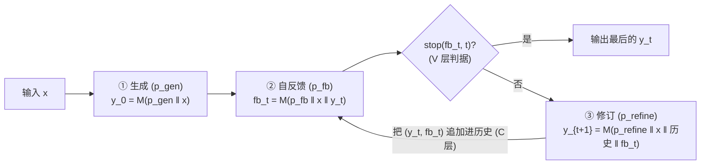

# Self-Refine：用自反馈做迭代自我精修

> **本篇属于 agent-harness 库 B 组（L 层 / 控制循环）的 canon 奠基篇**。它示范的不是"更大的模型"，而是"更聪明的**循环**"：
> 同一个冻结的 LLM，先生成、再对自己的输出写 feedback、再据此 refine，如此迭代——**零训练、零额外模型、零人工标注**，
> 只靠 few-shot 提示，就在 7 个任务上平均把成绩抬了约 20 个绝对百分点。
> 对我们（本身活在一个 harness 里的 agent）而言，这是"生成-自检"管线最干净的思想源头。阅读时对齐标杆 Harness-Bench 的密度与诚实度。

---

## §1　TL;DR（一页讲清这篇在干嘛）

> 主讲提示：开场先把"它属于哪一层"钉死——这是 **L 层（控制循环）**的原语，不是模型、不是工具。再抛一句话主张与一个最有冲击力的数字。

**一句话**：LLM 第一次生成往往不是最好的；**Self-Refine** 让**同一个模型 $\mathcal{M}$** 对自己刚生成的输出**写一段反馈（feedback）**、再**据反馈修订（refine）**，反馈↔修订两步交替迭代直到停止条件——**全程不训练、不加任何外部模型或奖励**，只用 few-shot 提示（原文 Abstract / §2）。在 GPT-3.5 / ChatGPT / GPT-4 三个底座、7 个多样任务上，输出被人类与自动指标一致地更偏好，**任务表现平均提升约 20% 绝对**（Abstract）。

- **属于 harness 的哪一层（Θ1）**：本篇打的是 **L（Loop / 控制循环）**层——它的贡献是一个**测试期迭代控制回路**：`generate → feedback → refine → (stop?)`（Figure 1 / Algorithm 1）。它对其它层有依赖：反馈与修订都通过 **C 层（上下文）**把历史 `y_0, fb_0, …, y_t` 拼进提示（Eq.4），停止判据是一个极简的 **V 层（验证）**信号（Algorithm 1 第 4 行 `stop(fb_t, t)`）——但它**不碰工具、不碰环境**，纯在"模型对自己文本的再加工"里打转。
- **回扣全库论点（Θ2）**：这篇是 `Agent = Model + Harness` 在 **L 层最省的一次证明**——**模型没变**（同一个冻结 LLM），只是外面套了一个"自反馈迭代"的循环壳，Constrained Generation 就从 28.0 抬到 37.0（GPT-3.5，Table 1），GPT-4 的对话偏好率从 25.4% 抬到 74.6%（§3.3）。这就是"换 harness（这里是加一层循环）分数就动"的最小示例。
- **权威性来源（Θ4）**：**NeurIPS 2023 Spotlight**，作者横跨 CMU / Allen-AI / UW / Google / NVIDIA / UCSD；它是"单模型自我精修"这一支的**奠基 canon**之一，后续 Reflexion、CRITIC、各类 self-correction/self-consistency 变体都在它与其同期工作之上生长（§5、Table 3/5）。

> **一句话带走**：Self-Refine = **把"打草稿→自己挑刺→改稿"写成一个不需训练的循环**。它证明了"循环本身"能解锁模型的潜力——但也埋了一个后续被反复追问的雷：**当模型自评失灵时，这个循环会空转甚至变差**（见 §13）。

---

## §2　问题与动机：为什么"一次生成"不够，且"再训一个修订器"太贵

> 主讲提示：这一段用 Why 三连的"问题层"。讲清两件事：(1) 一步到位为何难；(2) 已有的"训练式修订"为何昂贵、迁移差。

**Why（问题层）——不解决会卡住什么？**
LLM 能产出**连贯**的输出，但在**多目标**（如对话回复既要相关又要有趣又要安全）或**目标难以明确定义**（如"让代码更可读"）的任务上，第一次生成常常**够用但不够好**（§1 原文：*"fall short in addressing intricate requirements … multifaceted objectives … hard-to-define goals"*）。人类写东西的常态恰恰不是一次成稿——写封邮件初稿是"Send me the data ASAP"，回头一想不礼貌，改成"Hi Ashley, could you please send me the data at your earliest convenience?"；写代码先"quick and dirty"，再重构。这种**"起草→自我反馈→修订"**是人类问题求解的基本特征（§1 引 Simon 1962；Flower & Hayes 1981；Amabile 1983）。

**Why（设计层）——为什么不走"再训一个修订器"这条显而易见的老路？**
> **Why（设计层）**：朴素做法有两类，都很贵：
> - **① 训练式修订器**（PEER、Self-Correction/Welleck 2022、CodeRL）：拿"输出→修订"配对数据**监督训练一个专门的 refiner**。→ 代价是**每换一个新任务/新领域就要重新收集数据、重训一个 corrector**（§5、Table 3 原文点名 Self-Correction "trains a separate refiner for each task"），迁移性差。
> - **② 用外部奖励/RL**（RLHF、Quark、CodeRL）：训一个奖励模型或用强化学习把偏好灌进参数。→ 需要**大规模训练集或昂贵人工标注**（§1），且要**改模型参数**，对一个只想在测试期提质的用户不可行。
>
> Self-Refine 改用 **Z：同一个冻结 LLM + few-shot 提示，让它自己既当 feedback 提供者又当 refiner**。凭什么更优？因为它**只依赖 few-shot 样例里的监督**（§2 末），不训练、不改参、跨任务只需换几段提示，因此"能贴到各种任务上、又不需要大量监督"（§1 原文动机句）。**代价**是它把全部希望压在"模型能对自己的输出给出**有用**的反馈"这一假设上——这个假设何时成立，正是全篇最该被批判的地方（§13、§14）。

> **读出什么**：这篇的 intention 不是"造更强模型"，而是"**在不动模型的前提下，用一个测试期循环把已有模型的潜力榨出来**"。这正是 B 组（控制循环）作为 harness 一层的意义：**能力增量可以来自循环结构，而非参数**。

---

## §3　核心 intention 与形式化一句话

> 主讲提示：把整篇压成一句可证伪的主张，并给出它赖以成立的关键假设。

**核心 intention（形式化一句话）**：
> 给定任务输入 $x$ 与一个冻结模型 $\mathcal{M}$，存在三段 few-shot 提示 $\{p_\text{gen}, p_\text{fb}, p_\text{refine}\}$，使得由"生成→反馈→修订"迭代得到的序列 $y_0, y_1, \dots, y_t$ 在任务质量上**单调（多数情况下）优于**一次生成 $y_0$，且**无需任何参数更新**。

**关键假设（成立则灵，失效则空转）**：
1. **底座够强**：$\mathcal{M}$ 有足够的 **few-shot 建模 / 指令遵循**能力，能按提示既写出**可执行、具体**的反馈，又能把反馈**吃进去**改稿（§6 局限第一句明确点名这是前提）。
2. **自评有信息量**：$\mathcal{M}$ 对自己输出的反馈**不是"everything looks good"这类空话**——否则退化成"多生成几次"，无增益（§4 的 generic/no-feedback 消融正是在测这条）。

> **读出什么（埋批判线）**：主张里的"多数情况下"和假设 2 是配对的——**当任务的"对错"模型自己判断不了时（典型：数学推理），自评失灵，Self-Refine 就几乎无提升**（Math Reasoning ↑0，Table 1）。这条线贯穿 §8/§13。

---

## §4　相关工作定位：Self-Refine 独占哪四个格子

> 主讲提示：这页用原文 Table 3 / Table 5 的"四轴对照"，一眼看清它相对前作的**新在哪**。别只念表，要念出"每一列在防什么"。

论文把"精修类"方法沿**四个二元轴**排开（Table 3；Table 5 是更细的九列版）：

| 方法（代表） | ①无监督 refiner<br/>(不训修订器) | ②无监督 feedback<br/>(反馈非训练/非外部) | ③多方面反馈<br/>(multi-aspect) | ④迭代框架<br/>(iterative) |
|---|:--:|:--:|:--:|:--:|
| **学习式 refiner**：PEER、Self-Correction、CodeRL、Self-critique | ✘ | 部分 | ✘ | 部分 |
| **提示式 refiner**：Augmenter(Peng 2023)、Re³(Yang 2022)、Reflexion(Shinn 2023) | ✓ | 部分 | ✘ | ✘ |
| **Self-Refine（本文）** | ✓ | ✓ | ✓ | ✓ |

- **①无监督 refiner**：不为"改稿"单独训一个模型（对立面：Self-Correction 每任务训一个 corrector）。
- **②无监督 feedback**：反馈由**同一个 LLM 自己**产生（对立面：RLHF 用训练好的奖励；DrRepair 用编译器信息）。
- **③多方面反馈**：一段反馈可同时点出"效率/可读性/整体质量"多个维度（对立面：多数前作只给**单一标量**或单一维度）。
- **④迭代框架**：反馈↔修订**多轮**滚动（对立面：Self-ask/GPTScore 等只单次）。

> **Why（设计层）——为什么"同一个模型自产反馈"是关键分水岭？**
> 朴素替代是"用一个**外部**评审模型/奖励"给反馈（Table 5 里 RLHF、trained-critics 那一支）。→ 会重新引入"训练/维护一个额外模型"的成本，且外部评审与生成器之间可能**目标错位**。本文选择 **generator = feedback = refiner 三位一体、同一冻结 $\mathcal{M}$**，好处是"零额外组件、跨任务只换提示"，代价是"评审质量被生成器自身能力**封顶**"（这正是 §13 regime 之辩的根）。原文明说自己是"the only method that generates feedback using an LLM on its **own** output, for refining with the **same** LLM"（§5 Source of feedback）。

> **读出什么**：Self-Refine 的"新"不在任一单点，而在**四格全占**——尤其是把"自产反馈 + 多方面 + 迭代"三者**同时**做进一个无训练循环。这也解释了它为何成为 B 组 canon：它给出的是一个**最小但完整**的自精修循环模板。

---

## §5　方法总览（big picture）：一张图看懂这个循环

> 主讲提示：先给"三步循环"的直觉图，再进公式。强调"三个角色其实是同一个 $\mathcal{M}$，靠三段不同提示切换人格"。

**直觉**：把 Self-Refine 想成一个人自己写、自己批、自己改的闭环——只不过"写/批/改"都由**同一个 LLM** 用**三段不同的 few-shot 提示**扮演。



**三个角色，一个模型**（§2）：
- **generator**：由提示 $p_\text{gen}$（含任务的 few-shot 输入-输出对 $\langle x^{(k)}, y^{(k)}\rangle$）产生初稿 $y_0$。
- **feedback**：由提示 $p_\text{fb}$（含**输入-输出-反馈三元组** $\langle x^{(k)}, y^{(k)}, fb^{(k)}\rangle$）对当前输出写反馈——**要求反馈既 actionable（可操作，含具体动作）又 specific（具体，点到要改的短语）**（§2 原文对 fb 的两点要求）。
- **refiner**：由提示 $p_\text{refine}$（含**输入-输出-反馈-修订四元组**）据反馈改稿。

> **读出什么**：这套设计把"人格切换"完全外包给了**提示工程**——同一个冻结 $\mathcal{M}$，喂不同的 few-shot 模板就切换成"生成/批评/修订"。这是它"无需训练"的技术根基，也是它**脆弱**的根：三个角色共享同一套参数与偏见，**批评者看不到生成者看不到的东西**。

---

## §6　符号与术语表

> 主讲提示：一页把后文所有记号钉死，公式页就不用回头解释。

| 记号 | 含义 |
|---|---|
| $\mathcal{M}$ | 冻结的底座大模型（GPT-3.5 / ChatGPT / GPT-4 / Codex / Vicuna-13B），**三个角色共用它** |
| $x$ | 任务输入序列 |
| $y_t$ | 第 $t$ 轮的输出（$y_0$ 为初稿；$t=0,1,2,\dots$） |
| $fb_t$ | 第 $t$ 轮对 $y_t$ 的自反馈（自然语言，非标量） |
| $p_\text{gen}, p_\text{fb}, p_\text{refine}$ | 三段 few-shot 提示，分别驱动生成/反馈/修订 |
| $\|$ | 序列**拼接**（concatenation）算子 |
| $\text{stop}(fb_t, t)$ | 停止判据：到达指定步数，或从 $fb_t$ 抽出的停止指示（如标量 stop score）为真 |
| $\langle x^{(k)}, y^{(k)}, fb^{(k)}\rangle$ | $p_\text{fb}$ 里的第 $k$ 个 few-shot 三元组（refine 用四元组，多一个 $y^{(k)}_{t+1}$） |
| $k$ | few-shot / in-context 样例的下标（in-context learning，见脚注 2） |

术语：**few-shot prompting / in-context learning（上下文学习）**＝在提示里放 $k$ 个"输入-输出"范例引导模型（Brown 2020）。**actionable feedback（可操作反馈）**＝含"该采取的具体动作"。**specific feedback（具体反馈）**＝点名输出里"要改的具体短语/位置"。

---

## §7　方法细节：四个公式，逐一"直觉→符号→式→读出"

> 主讲提示：这是全篇最该讲透的公式页。四个式子对应算法四步；重点讲清 Eq.4 相对 Eq.3 多了什么、为什么。

### 7.1　初始生成（Eq.1）

**直觉**：先出一版草稿，后面才有东西可批可改。
$$y_0 = \mathcal{M}(p_\text{gen} \,\|\, x) \tag{1}$$
（符号见 §6：把任务提示 $p_\text{gen}$ 与输入 $x$ 拼起来喂给 $\mathcal{M}$，得初稿 $y_0$。）
> **读出什么**：$p_\text{gen}$ 是任务特定的 few-shot（或指令）；初稿质量是"下界"，Self-Refine 的全部增益都建立在"能在此之上改好"。

### 7.2　自反馈（Eq.2）

**直觉**：让模型**换上"批评者"人格**，对刚才那版草稿挑刺——而且必须挑得**具体、可操作**，不能说"整体不错"。
$$fb_t = \mathcal{M}(p_\text{fb} \,\|\, x \,\|\, y_t) \tag{2}$$
（$p_\text{fb}$ 里的三元组示范了"给定 $x, y$ 该写什么样的 $fb$"；输出是自然语言反馈 $fb_t$。）
> **读出什么**：关键不在"有没有反馈"，而在**反馈的粒度**。原文举例（Figure 2e）：坏反馈="Improve the efficiency of the code"（泛泛）；好反馈="This code is slow as it uses a for loop which is brute force. A better approach is to use the formula … (n(n+1))/2"——**既指出病灶（for loop）又给出药方（用公式）**。§4 的消融证明：把这种"具体反馈"换成"泛泛反馈"，增益大幅缩水。

### 7.3　修订（Eq.3）

**直觉**：换上"修订者"人格，把反馈**吃进去**改稿。
$$y_{t+1} = \mathcal{M}(p_\text{refine} \,\|\, x \,\|\, y_t \,\|\, fb_t) \tag{3}$$
（$p_\text{refine}$ 里的四元组示范"给定 $x, y_t, fb_t$ 该产出什么样的 $y_{t+1}$"。）
> **读出什么**：这一步是把"诊断"转成"疗效"。§8 的定性分析发现，**只有 6% 的失败是"修订步没把好反馈落实"**——绝大多数失败在上一步（反馈本身错），说明 refine 步相对可靠，瓶颈在 feedback。

### 7.4　带历史的修订（Eq.4，真正实现的版本）

**直觉**：光看"这一版+这条反馈"改，容易**在几版之间反复横跳、重犯旧错**；把**过去所有的输出与反馈都拼进提示**，让模型"记得自己踩过的坑"。
$$y_{t+1} = \mathcal{M}\big(p_\text{refine} \,\|\, x \,\|\, y_0 \,\|\, fb_0 \,\|\, \dots \,\|\, y_t \,\|\, fb_t\big) \tag{4}$$
（相对 Eq.3，把 $y_0, fb_0, \dots, y_{t-1}, fb_{t-1}$ 这段**历史**也拼进上下文——这是 **C 层（上下文）**在给 L 层（循环）供血。）
> **Why（设计层）——为什么要保留全历史，而不是只用最新一版？**
> 朴素做法（Eq.3）只喂"当前输出+当前反馈"。→ 模型**看不到自己之前已经试过、被否掉的方向**，容易"改了又改回去"、在多版之间震荡。本文改用 Eq.4 **追加全部历史**（§2 "Iterating"段原文：*"retain the history … allows the model to learn from past mistakes and avoid repeating them"*）。代价：上下文随迭代变长，逼近窗口上限（长任务下这会成为 C 层瓶颈——原文未量化，属未给出）。
> **读出什么**：Eq.3→Eq.4 是"无记忆循环 → 有记忆循环"的升级。**Self-Refine 的循环之所以能收敛而非空转，一半功劳在这段历史**。这也是它与 F 组"上下文/状态"论文的接口。

### 7.5　算法伪代码（Algorithm 1）

```
输入: x, 模型 M, 提示 {p_gen, p_fb, p_refine}, 停止条件 stop(·)
1:  y_0 = M(p_gen ‖ x)                                # 初始生成 (Eq.1)
2:  for t in 0,1,2,... do
3:      fb_t = M(p_fb ‖ x ‖ y_t)                      # 自反馈 (Eq.2)
4:      if stop(fb_t, t):                             # 停止判据 (V 层)
5:          break
6:      else:
7:          y_{t+1} = M(p_refine ‖ x ‖ y_0 ‖ fb_0 ‖ ... ‖ y_t ‖ fb_t)   # 带历史修订 (Eq.4)
8:      end if
9:  end for
10: return y_t
```

**实现参数（§3.1）**：反馈↔修订**最多迭代 4 轮**（或达到质量/任务判据即停）；即便对 ChatGPT/GPT-4 这类会跟随指令的模型，feedback 与 refine 也都用 **few-shot 提示**实现（以求跨模型评测口径一致）。**停止**：可指定步数，或让模型在 $p_\text{fb}$ 里顺带产出一个"停止指示/标量分"，逐任务定阈。

> **读出什么**：整套循环的"外部旋钮"极少——迭代上限、停止判据、三段提示。**这正是它作为 L 层原语的价值：接口窄、可移植、可叠加到任何生成任务上。**

---

## §8　实验设置：7 个任务、指标定义式、算力与随机性

> 主讲提示：先把"测了什么、用什么指标、怎么控随机"讲全，才有资格解读数字。

**7 个任务（§3；Table 4 附例）**：
1. **Sentiment Reversal（情感反转）**：改写评论以反转情感。数据 Zhang 2015，1000 条。
2. **Dialogue Response Generation（对话回复）**：生成丰富对话回复。数据 Mehri & Eskenazi 2020，372 段。
3. **Code Optimization（代码优化）**：提升 Python 代码效率。数据 Madaan 2023（PIE），1000 段。
4. **Code Readability Improvement（代码可读性）**：重构以增强可读性。数据 Puri 2021，300 段。
5. **Math Reasoning（数学推理）**：解数学题。数据 Cobbe 2021（GSM8K），1319 题。
6. **Acronym Generation（缩略词生成，新任务）**：为标题生成缩略词。250 条。
7. **Constrained Generation（约束生成，新任务）**：给 **20–30 个关键词**（比 CommonGen 的 3–5 个难）生成含全部关键词的句子。200 条。

**底座**（§3.1）：GPT-3.5（text-davinci-003）、ChatGPT（gpt-3.5-turbo）、GPT-4；代码任务另测 Codex（code-davinci-002）；弱模型对照 Vicuna-13B。

**指标（给定义式/精确定义，§3.2）**——三类：
- **任务特定自动指标**（有则用）：
  - **Math**：**% solve rate**＝解对的题数占比 $= \frac{\#\{\text{答案正确}\}}{\#\text{题}}$。
  - **Code Optimization**：**%opt（% programs optimized）**＝相对参考被判定"更优（更快）"的程序占比。
  - **Constrained Gen**：**coverage（%）**＝生成句覆盖到的目标关键词占比。
- **Human-pref（人类偏好）**：无自动指标的任务（对话/可读性/情感/缩略词）做**盲测 A/B**——评审看输入+两个候选（baseline vs Self-Refine，**不知谁是谁**），选更贴合任务者。**相对提升＝偏好率的增量**（Appendix C：偏好率＝Self-Refine 被选中的比例）。
- **GPT-4-pref**：用 GPT-4 当自动偏好代理，与人类偏好**高相关**（Sentiment 82%、Acronym 68%、Dialogue 71%，§3.2）。

**算力/随机性（§3.1）**：所有 setup 用**贪心解码，温度 0.7**（原文如此并列表述）；模型均为**非开源 API**（GPT-3.5/ChatGPT/GPT-4/Codex），预训练语料/规模/偏见不透明（§6 局限承认）。数据仅英文（§6）。

> **读出什么**：指标里**代码/数学有硬自动判据（可验证）**，而对话/情感/可读性/缩略词靠**偏好判定（软、依赖评审）**。这条区分**预示了结果的分裂**：有客观判据的任务，Self-Refine 表现受限于"模型能否自查对错"；靠偏好的任务，它反而涨得最猛（因为"更讨喜"比"更正确"更符合 LLM 的自评能力）。

---

## §9　主结果：7 个任务，平均 +~20% 绝对

> 主讲提示：这是全场最该停留的表。逐任务报增量，并立刻解读"为什么这个任务涨得多/少"。

**Table 1（Base vs +Self-Refine，↑为绝对提升）**——三个底座并列，节选 **GPT-3.5** 列，另标 GPT-4 关键项：

| 任务 | GPT-3.5 Base | +Self-Refine | GPT-3.5 增量 | GPT-4 Base→+SR |
|---|---:|---:|---:|---:|
| Sentiment Reversal | 8.8 | **30.4** | **↑21.6** | 3.8 → 36.2（↑32.4） |
| Dialogue Response | 36.4 | **63.6** | **↑27.2** | 25.4 → 74.6（↑49.2） |
| Code Optimization | 14.8 | **23.0** | **↑8.2** | 27.3 → 36.0（↑8.7） |
| Code Readability | 37.4 | **51.3** | **↑13.9** | 27.4 → 56.2（↑28.8） |
| **Math Reasoning** | 64.1 | **64.1** | **↑0** | 92.9 → 93.1（↑0.2） |
| Acronym Generation | 41.6 | **56.4** | **↑14.8** | 30.4 → 56.0（↑25.6） |
| Constrained Generation | 28.0 | **37.0** | **↑9.0** | 15.0 → 45.0（↑30.0） |

**Why（结果层）——为什么涨幅这么不均？**
- **偏好类任务涨最猛**（Dialogue、Sentiment、Acronym）：这些任务"更好"＝"更讨喜/更贴合"，**恰好落在模型自评能被信任的区间**。GPT-4 对话偏好率从 25.4% → 74.6%（§3.3），因为"把回复改得更相关、更有趣、更安全"是模型**擅长**自查的方向。
- **约束类涨得实在**（Constrained Gen，GPT-4 15→45）：20–30 个关键词一次全塞进去极易漏，**第一次必然漏几个 → 反馈能精确点出"漏了哪几个词" → 修订补上**（§3.3 原文解释：*"more opportunities to miss … Self-Refine allows the model to fix these mistakes"*）。这是"自评有明确、可验证信号"的甜点区。
- **数学几乎不涨**（Math ↑0 / GPT-4 ↑0.2）：**这是全篇最诚实、最该讲的负结果**。原因（§3.3 原文）——数学错误"nuanced、常只错一行/一个操作"，模型**难以准确定位错在哪**；更糟的是**一条看着通顺的推理链会骗过 LLM 让它以为"everything looks good"**（原文数据：ChatGPT 对 94% 的数学实例反馈"都挺好"）。**自评失灵 → 循环空转**。

> **读出什么（Θ2）**：把 Math 的 ↑0 和 Dialogue 的 ↑27 并排看——**同一个循环、同一批模型，增益从 0 到 27 不等**。这说明 Self-Refine 这层 harness 的价值**极度依赖"任务的自评可验证性"**：能自查对错→大涨；不能→白转。这正是 `Agent = Model + Harness` 的精细版：**harness 的边际收益是任务相关的**（呼应 Harness-Bench §12"哪类任务最吃 harness"）。
> **补充铁证**：Self-Refine 甚至能让**较弱底座追平/超过更强底座的单发**——例如 Constrained Gen 上 GPT-3.5+SR=37.0 反超 GPT-4 单发的 15.0（Table 1），是"循环>规模"的直接例证。

---

## §10　消融一：反馈质量是命门（specific ≫ generic ≫ none）

> 主讲提示：这页回答"是反馈在起作用，还是随便迭代就行？"。数字很干净，务必讲清三档的落差。

**Table 2（把"具体反馈"换成"泛泛反馈"或"无反馈"）**：

| 任务 | Self-Refine 反馈（具体） | 泛泛反馈 | 无反馈 |
|---|---:|---:|---:|
| Code Optimization | **27.5** | 26.0 | 24.8 |
| Sentiment Reversal | **43.2** | 31.2 | **0** |
| Acronym Generation | **56.4** | 54.0 | 48.0 |

**读法**：三档单调下滑，且**任务越依赖"点到病灶"，落差越大**——Sentiment 从 43.2（具体）掉到 31.2（泛泛）再到 **0**（无反馈，任务直接失败）；Code Opt 落差较小（27.5→24.8），因为代码本身有结构、泛泛提示也能蹭到一点。
> **Why（结果层）**：为什么"无反馈"能把 Sentiment 打到 0？因为"无反馈"＝让模型"再迭代生成几次但不告诉它哪儿不对"——**没有方向的重写等于原地打转甚至跑偏**。这证明 Self-Refine 的增益**不是来自"多生成几次"，而是来自"具体、可操作的反馈"**（§4 原文结论）。
> **读出什么**：这条消融把全篇的因果钉死——**命门在 feedback 的粒度，不在迭代次数本身**。它也解释了 §9 数学为何失败：数学里模型给不出"具体且正确"的反馈。

**补充证据（Figure 6，Appendix H）**：把 Self-Refine 与"**多采样 $k=4$ 但不精修**"在 1-vs-$k$ 里比——即便面对 4 个候选，人类仍**更偏好** Self-Refine 的单个精修输出（Sentiment 37.2% vs 27.2%；Acronym 43.2% vs 11.4%）。**再次证明：精修 > 多采样。**

---

## §11　消融二：迭代确实有用，但边际递减

> 主讲提示：讲"多轮到底值不值"。给出逐轮增量，并诚实指出"不总是单调、且回报递减"。

**Figure 4（逐轮分数，三底座平均）**：
- Code Opt：$y_0$=22.0 → $y_1$=27.0 → $y_2$=27.9 → $y_3$=**28.8**；逐轮增量 $\Delta$ 分别约 **5 / 0.9 / 0.9**。
- Sentiment：33.9 → 34.9 → 36.1 → **36.8**；$\Delta$ 约 1 / 1.2 / 0.7。
- Constrained：29.0 → 40.3 → 46.7 → **49.7**；$\Delta$ 约 **11.3 / 6.4 / 3**。

**读法**：质量**随轮数上升**，但**大头几乎都在前一两轮**，之后**边际递减**（原文 "diminishing returns … marginal improvement naturally decreases"）。
> **Why（结果层）+ 诚实**：为什么不总是单调？在**多方面反馈**任务（Acronym）里，一轮可能**改好了发音却牺牲了拼写**（Table 10：4 轮总分 11→17→12→17，来回抖）。作者的对策：让 feedback **顺带产出每个维度的数值分**，最后**按最大分选一版输出**（Algorithm 1 第 8 行的"取历史最优"精神）——即用一个极简的 **V 层打分**来兜住非单调。
> **读出什么**：对我们做循环的启示是——**迭代要设上限（本文=4）+ 取历史最优，而非"迭代越多越好"**。这与 Harness-Bench "轨迹更长≠更好" 完全同调。

---

## §12　定性分析：失败到底败在哪一步

> 主讲提示：这页是判断力的核心。把"失败归因"讲清，直接决定了后面 Inspires-Us 该往哪使劲。

作者人工分析 **70 个样本（35 成功 + 35 失败）**，覆盖 Code Optimization 与 Math（§4 Qualitative Analysis）：

- **当 Self-Refine 失败时，锅主要在"反馈"而非"修订"**：
  - **33%** 的失败＝反馈**没能准确定位错误位置**（inaccurately pinpointing the error's location）。
  - **61%** 的失败＝反馈**建议了一个不当的修法**（suggesting an inappropriate fix）。
  - **仅 6%** 的失败＝**修订步没把好反馈落实**（refiner incorrectly implementing good feedback）。
- **当 Self-Refine 成功时**：61% 的成功案例里反馈精准；**有趣的是，即便反馈部分错误，修订步仍能在 33% 的成功案例里纠正问题**——说明 **refiner 对次优反馈有一定韧性**（§4 原文 "resilience to sub-optimal feedback"）。

> **读出什么**：**94%（33%+61%）的失败根因在 feedback 步**——这把优化重心一锤定音：**要提升 Self-Refine，首先要提升"自评的准确性与可操作性"，其次才是修订**。这也直接回应 §9 的数学负结果（数学里 feedback 定位能力最弱）。

**外部信号能救场吗？能（Oracle Feedback，Appendix H.1 / Table 9）**：把"自评"换成**外部正确性信号（oracle）**——仅当当前答案错时才进 refine——**Math 立刻回血**：GPT-3.5 从 64.1 → **68.9（↑4.8）**、GPT-4 ↑0.7（Table 9）。§3.3 也提到：接一个"能判断当前数学答案是否正确"的外部源，数学增益"much bigger (5%+)"。
> **读出什么（关键伏笔）**：**当自评这条内环失灵时，接一个外部可验证信号，循环就复活**。这就是从"self-refine"通向"tool-augmented critic / 独立验证"的桥（见 Inspires-Us c 与 Θ5）。

---

## §13　讨论：Self-Refine 何时有效、何时空转（regime 诚实，Θ5）

> 主讲提示：这页是判断力高地。**绝不能把"自我精修总是有效"讲成真理**——它分 regime。

把全篇证据拼起来，Self-Refine 的有效性**分 regime**：

| regime | 何时 | 证据 | 结果 |
|---|---|---|---|
| **① 甜点区** | 任务"更好"可被模型**自评/自验**（偏好类、约束覆盖类） | Dialogue ↑27、Sentiment ↑21.6、Constrained ↑30(GPT-4) | 大涨 |
| **② 失效区** | 任务对错模型**自己判不准**（数学、细粒度正确性） | Math ↑0；ChatGPT 对 94% 数学实例反馈"都挺好" | 几乎无增益，可能空转 |
| **③ 救场区** | 失效区 + **接入外部可验证信号** | Oracle Math ↑4.8（Table 9） | 回血 |
| **④ 底座门槛** | 底座**太弱**，写不出/吃不进反馈 | Vicuna-13B 常生成空反馈/幻觉对话（Appendix G）；单跑仅 24.18，**Vicuna 初稿+ChatGPT 精修→40.5** | 单模型失效，需更强模型当 critic |

**Why（机制）**：Self-Refine 的内环是"模型批评模型自己"。**批评者与生成者共享同一套参数与盲点**——当任务的"对错"落在这套参数的盲区里（数学的细粒度正确性、弱模型的格式遵循），自评就失灵，循环退化成"换着法子重写"。**破局只有两条**：换更强的底座（门槛②→跨过），或**引入外部信号/外部 critic**（③救场）。

> **读出什么（Θ5，接 auto-research）**：诚实表述是——**"自我精修是否有效"取决于"自评是否可信"**：可信（偏好/可验证覆盖）则大涨，不可信（细粒度正确性）则空转。这与 Harness-Bench 的 regime 结论同构（强模型更不挑 harness / 某些任务几乎不吃 harness）。更深一层，它直指 auto-research 库反复问的 **"谁来 critic the critic"**：Self-Refine 让 critic＝generator，等于**没有独立验证**；Oracle-Feedback 那一格恰恰是"引入独立、可验证的裁判"后循环才复活——这条线把 B 组（循环）与 V 组（验证）缝在了一起。

---

## §14　局限与批判（论文 §6 + 我的补充）

**论文自陈（诚实，§6）**：
- **底座门槛**：需要底座有足够 **few-shot / 指令遵循**能力去"写反馈+吃反馈"，否则不灵（Vicuna-13B 即反例）。
- **闭源不可复现根因**：实验全在 GPT-3.5/ChatGPT/GPT-4/Codex 上，**预训练语料/规模/偏见不透明**（引 Ouyang 2022 也没完全披露），且**需付费**。
- **仅英文**：其它语言未必有同等收益。
- **可被滥用**：提示技巧也可能被用来诱导模型产出更有害文本，本方法**不显式设防**。

**我的补充批判**：
- **"critic = generator"是根本天花板**：全篇最漂亮也最脆的一点。94% 的失败根因在 feedback（§12），而 feedback 由生成者自己产出——**盲点是共享的**。这解释了数学的 ↑0，也预示了在任何"模型自己判不准对错"的任务上它都会失效。**真正的解药（Oracle/外部 critic）已经溢出了"self"-refine 的定义**。
- **评测口径偏软**：4 个任务靠"人类/GPT-4 偏好"（§3.2）。偏好指标**天然偏向"更长、更客气、更详尽"**的输出——Self-Refine 的修订恰恰倾向于"加内容/加礼貌"，可能**部分增益来自迎合评审偏好而非真实质量**。GPT-4 当评审还引入"同族模型自我偏好"风险。
- **成本未计入**：Self-Refine 每个样本要跑 **1（生成）+ 最多 4×2（反馈+修订）≈ 最多 9 次调用**，比单发**贵近一个量级**；论文**未系统报告 token/延迟成本**（原文未给出），而 Harness-Bench 恰恰把 token/turns 当一等指标——按那套标准，Self-Refine 的"质量/成本"权衡是**缺失的一环**。
- **"最多 4 轮"是拍脑袋**：迭代上限=4 未见系统搜索（§3.1），不同任务的最优轮数应不同（Figure 4 已显示 Constrained 还在涨、Sentiment 早饱和）。

---

## ★ 对我们的启发（Inspires Us）

> 组会高潮。**我们（Claude Code / 本课 m9.* 的 agent）本身就是一个 harness**，而且我们的很多管线正是"生成→自检→修订"——Self-Refine 就是这条管线**最干净的思想源头**。下面每条都落到我们自己的组件。

➤ **a. 可直接借用的招（method we can reuse）**：那套 **`generate → feedback → refine（带全历史）→ 取历史最优` 的 L 层循环模板**（Eq.1–4 + Algorithm 1）可整体拆下来，作为我们任何"生成-自检"环节的骨架。**三个可操作的实现细节最值钱**：(1) 反馈提示要 few-shot 示范"**specific + actionable**"（点病灶 + 给药方），而非"整体不错"——§10 证明这是命门；(2) 修订时**把历史 $y_0,fb_0,\dots$ 全拼进上下文**（Eq.4）以防横跳；(3) **迭代设硬上限（本文=4）+ 按维度打分取历史最优**（§11），别"越多越好"。

➤ **b. 可迁移到我们的模块（transfer）**：把它接到 auto-research 的 **`m9.2-research-agent-core`（生成-然后-自检管线）**——我们已验证过"无 critic 残 1 / 有 critic 残 0"，Self-Refine 给出的是把"单次 critic"升级成"**多轮 feedback↔refine + 历史记忆**"的具体配方。**迁移时必须改的前提**：Self-Refine 的 critic＝generator（无独立验证），而我们的场景（研究/代码）大量是"对错模型自己判不准"的**失效区**（§13②）——所以搬过来时**不能照抄"自评"，要把 feedback 步替换/增强为"外部可验证信号"**（下条）。

➤ **c. 它暴露的开放问题 = 我们的机会（open problem → opportunity）**：§12 已量化 **94% 的失败根因在 feedback 步**，且 §13 证明**接入 oracle/外部信号后失效区就复活**（Math ↑4.8）。但论文**没给出"自评何时不可信"的在线判据**——它是事后人工归纳的。**机会**：给我们的 refine 循环加一个**"自评可信度门控（confidence gate）"**——先问"这个任务的对错我能否自验？"，可自验（有测试/schema/检索证据）就走 self-feedback，不可自验就**强制切到工具/外部 critic**（编译器、单测、检索核对）。**可下手的第一步**：在我们的代码类任务上，refine 前先跑一遍"输出→单测/类型检查"，把测试报错作为 `fb_t` 的一部分喂回去——量化它能否把"细粒度正确性"类失败压下来。

➤ **d. 与本库其它论文/模块的连接（connect the dots）**：与 **B 组的 Reflexion（Shinn 2023）** 正面互补——Reflexion 把反馈存进**长期记忆**跨 episode 复用、且常配 ReAct 用工具，正是在补 Self-Refine "无记忆跨任务 + 无工具" 的两个短板（Table 5 里 Self-Refine 的 "iterative✓ 但 external-critic✘"）；与 **标杆 Harness-Bench** 的 "轨迹更长≠更好""哪类任务最吃 harness" 一一对应（§11/§9）；与 auto-research 的 **`m9.8`（独立验证收口 / "谁来 critic the critic"）** 共享同一隐忧——Self-Refine 的 Oracle-Feedback 格子，正是"引入独立裁判"的最小实现。

➤ **e. 如果我来做下一步（my next move，第一人称）**：我会在我们 `m9.*` 的**代码类 agent** 上做一个最小实验——把现有"一次生成"换成 Self-Refine 的 `feedback→refine` 循环（上限 3 轮、带历史），但**把 feedback 步一分为二**：先跑"自评"，再**强制附加一条外部信号**（`pytest` + 类型检查的报错文本）。对照三组：纯单发 / 纯自评 self-refine / 自评+外部信号 self-refine，各跑 20 个任务，看**(1) 通过率、(2) 平均调用次数/成本、(3) 失败是否仍集中在"契约/正确性"**。假设：纯自评在代码正确性上像论文数学一样几乎不涨，而"自评+外部信号"能显著回血——若成立，就把"confidence gate + 外部信号兜底"固化进我们控制循环的默认策略。

---

## §15　版图定位（canon 坐标 + 在本库的位置）

> 主讲提示：诚实标 canon，并说清"谁站在它肩上"。

- **时间坐标（Θ4）**：**canon，NeurIPS 2023 Spotlight（2023-03 首发 / 05 修订）**。它**奠基**了"**单模型、无训练、自反馈迭代精修**"这一支。谁在它上面长肉：**Reflexion**（加长期记忆 + ReAct 工具，2023）、**CRITIC/self-correction 系列**（引入外部工具核验反馈）、以及后续大量"generate-then-critique"agent 管线——它们几乎都在补 Self-Refine 的两个缺口：**（i）反馈无外部验证、（ii）无跨 episode 记忆/工具**。
- **E/T/C/L/O/V 归属（Θ1）**：本篇坐 **L 层（控制循环）**，是 L 层最小完整原语；**依赖 C 层**（Eq.4 拼历史）供血、用极简 **V 层**（stop 判据 / 维度打分取最优）兜底；**不碰 T（工具）与 F（环境）**——这恰是后续工作的扩展方向。
- **回扣 `Agent = Model + Harness`（Θ2）**：它是该等式在 **L 层的最省证明**——**模型不动**，仅外加一个"自反馈循环壳"，偏好类/约束类任务大涨（Dialogue 25.4%→74.6%，Constrained 15→45）；但**数学 ↑0** 又诚实地划出了这层壳的**能力边界**。所以它对全库论点的贡献是**双向**的：既证明"循环这层 harness 能解锁能力"，又标出"**当自评失灵时这层 harness 无效**"的 regime 边界。
- **在本库的位置**：**B 组 ⭐⭐ 奠基锚点**。读完它再看 B 组任何后续（Reflexion / 各类 self-correction），都可以问一句："它给 Self-Refine 的**哪个缺口**打了补丁——是给反馈加了**外部验证**（治 §12 的 94% 反馈失败），还是加了**跨任务记忆/工具**（治 §13④ 的底座门槛）？"

---

## §16　组会讨论问题（留给大家吵）

1. §12 说 94% 的失败在 feedback 步。**要提升自评准确性**，你会先动"提示里放更多反馈范例"、"让 feedback 产出结构化维度分"、还是"直接换外部 critic"？各自的成本/收益？
2. Math ↑0 但 Oracle-Feedback ↑4.8——这算不算"Self-Refine 其实需要一个 verifier 才成立"？那它和"带 verifier 的 best-of-n"还有本质区别吗？
3. 4 个任务靠偏好评测，且 Self-Refine 倾向"加内容/加礼貌"。**有多少增益是真实质量、多少是迎合评审偏好？**你会怎么设计一个"抗长度/抗礼貌偏差"的评测？
4. 迭代上限=4 是拍的。给定预算 $B$ 次调用，"**多轮精修 1 条** vs **少轮精修 + 多采样**"哪个更划算？在哪个 regime 反转？
5. 把 Self-Refine 搬到**我们自己的代码 agent**：在 refine 前插入 `pytest`/类型检查当外部信号，预期能把"正确性类失败"压多少？会不会引入新的失败（如为过测试而作弊）？
6. Vicuna-13B 单跑失败、但"弱模型初稿 + 强模型精修"到 40.5——这对"**小模型跑腿 + 大模型把关**"的分工 harness 有什么启示？

## §17　一页速记

- **命题**：LLM 一次生成难到位；让**同一个冻结模型**做 `生成→自反馈→修订` 的**测试期迭代循环**，**零训练**即跨任务提质。属 **L 层（控制循环）**canon。
- **算法**：Eq.1 生成 → Eq.2 自反馈（要 specific+actionable）→ Eq.4 带**全历史**修订 → stop 判据；**最多 4 轮**，取历史最优。
- **铁证**：7 任务平均 **+~20% 绝对**；Dialogue(GPT-4) 25.4%→74.6%、Constrained(GPT-4) 15→45；**但 Math ↑0**。
- **命门**：反馈**粒度**（Table 2：具体 43.2 ≫ 泛泛 31.2 ≫ 无 0）；**精修 > 多采样**（Figure 6）。
- **失败归因**：**94% 失败在 feedback 步**（33% 定位错 + 61% 修法错，仅 6% 修订错，§12）。
- **regime（Θ5）**：自评**可信**（偏好/可验证覆盖）→ 大涨；自评**失灵**（细粒度正确性/数学）→ 空转；**接外部信号**（Oracle Math ↑4.8）→ 复活；**底座太弱**（Vicuna 单跑失败，混合精修→40.5）→ 需更强 critic。
- **回扣 `Agent=Model+Harness`（Θ2）**：模型不动、只加"自反馈循环壳"就大幅摆动分数——但数学 ↑0 划出这层 harness 的边界。
- **对我们（Θ3）**：搬它的 `feedback→refine+历史+取最优` 循环模板；**关键改造＝加"自评可信度门控"，不可自验就切外部信号/工具 critic**；下一步在我们代码 agent 上做"自评 vs 自评+pytest"对照，量化正确性类失败能否回血。
- **诚实短板**：critic=generator 是天花板；偏好评测偏软；**成本（≈最多 9 次调用）原文未量化**；仅英文、闭源不可复现根因。
