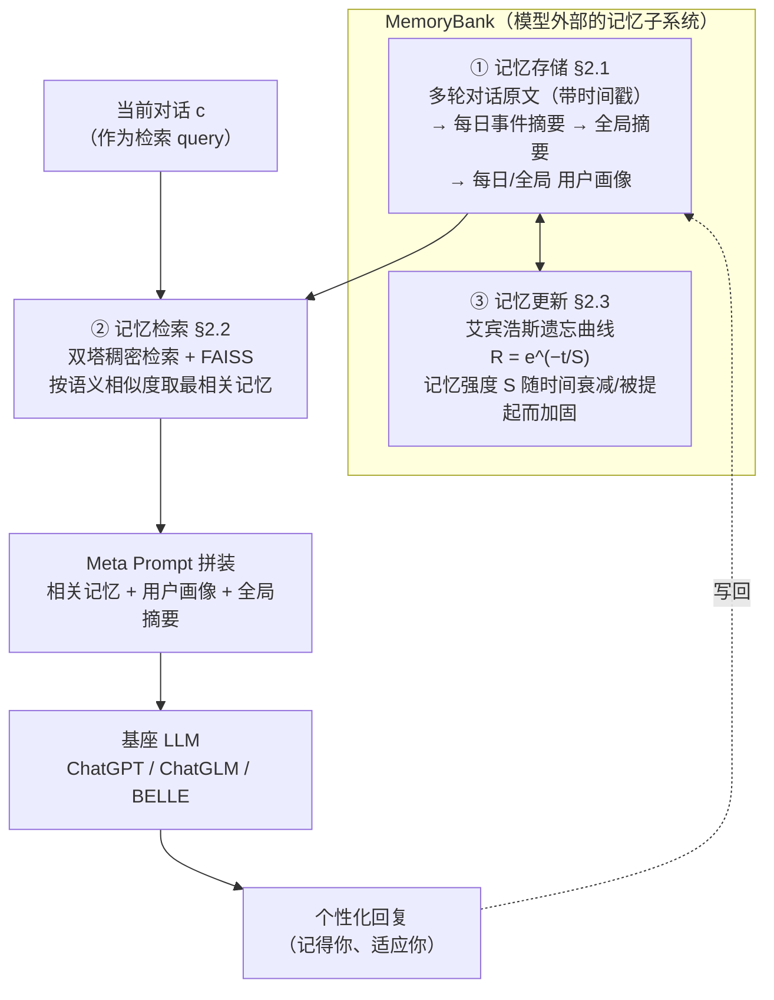
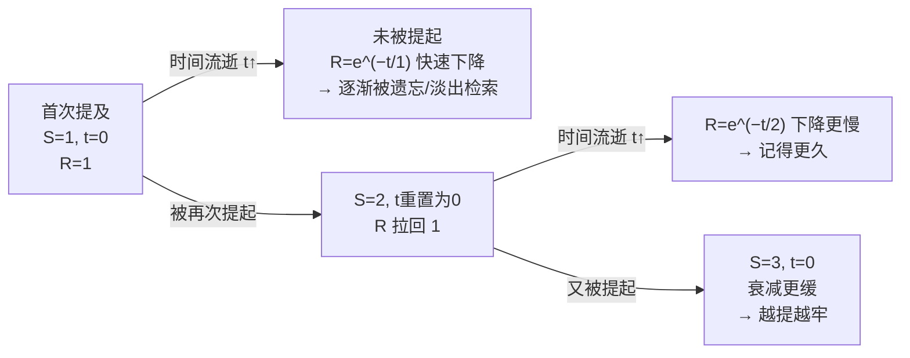

# MemoryBank：用艾宾浩斯遗忘曲线给 LLM 造一层可衰减的长期记忆

> **本篇属于 agent-harness 库 D 组（记忆 / Context 层）**。它回答一个 harness 最基础的追问：当对话跨越几天、几周、几个月，
> 那层"把模型变成能陪你的 agent"的脚手架，究竟该**记住什么、遗忘什么、何时把旧事重新捞回来**？MemoryBank 给出的答案不是
> "把上下文窗口撑到无限大"，而是**在模型外面挂一个带遗忘机制的外部记忆库**——这正是 harness 分层里 **C（Context）层** 的看家问题。
> 全文对齐标杆范文（[Harness-Bench](2605.27922-harness-bench-measuring-harness-effects.md)）的密度与诚实度：公式前给直觉、符号先定义、数字标 §/Table/Eq 出处、区分"论文宣称"与"我的批判"。

---

## §1　TL;DR（一页讲清这篇在干嘛）

> 主讲提示：开场先把"痛点—方案—亮点"三句话说完，再点明它在 harness 分层里坐哪一层、够不够老够权威。

**一句话**：LLM 天生**没有长期记忆**——每开一轮新对话就"失忆"，无法在跨天、跨周的陪伴 / 咨询 / 秘书场景里记住你是谁、你们聊过什么（Abstract、§1）。MemoryBank 给 LLM 外挂一个**记忆子系统**，由三根支柱组成（§2 开头、Fig.1）：

1. **记忆存储（Memory Storage，§2.1）**：按时间顺序存下多轮对话原文，再层层蒸馏成"每日事件摘要 → 全局摘要"，并持续更新"用户画像（user portrait）"。
2. **记忆检索（Memory Retrieval，§2.2）**：把每条记忆和当前对话都编码成向量，用**双塔稠密检索（dual-tower dense retrieval，类 DPR）** + FAISS 索引，按语义相似度把最相关的记忆捞回来喂进 prompt。
3. **记忆更新（Memory Updating，§2.3）**：**本篇的灵魂**——借**艾宾浩斯遗忘曲线（Ebbinghaus Forgetting Curve）**，用指数衰减模型 $R=e^{-t/S}$ 让记忆强度随"时间流逝"衰减、随"被重新提起"加固；该忘的忘、该记的记牢。

- **属于 harness 的哪一层（Θ1）**：本篇打的是 **C（Context / 记忆）层**——它不改模型权重，也不动控制循环，而是给 harness 补一个**可衰减、可检索的外部长期记忆**。它对 **T（Tools）层**有依赖（检索用 FAISS、编码器可换成任意 embedding 模型；工程上用 LangChain 串起来，§3），对 **L（Loop）层**输出接口（每轮把"相关记忆+用户画像+全局摘要"拼进 meta prompt）。
- **回扣全库论点（Θ2）**：这篇是 `Agent = Model + Harness` 里 **Harness 那一项如何"决定 agent 能不能陪你"** 的早期样本——**同一个基座模型（ChatGPT/ChatGLM/BELLE 都行）**，挂上 MemoryBank 这层记忆脚手架就能"记住你、适应你"，不挂就是金鱼记忆。§4 用 194 道探针题量化了"挂上之后能召回多少"。
- **够老够权威（Θ4，canon 坐标）**：**2023-05 预印本**，是 LLM 长期记忆机制的**早期奠基工作之一**，与同期的 MemGPT、Generative Agents 并列被后续大量记忆系统（A-MEM、Mem0…）引用与对比。它的历史贡献不在"最强"，而在**最早把心理学的遗忘曲线搬进 LLM 记忆管理**，把"记忆=全存"这个朴素直觉扭成"记忆=选择性保留"。

> **一句话记住它**：MemoryBank = **存 + 检 + 忘** 三件套；其中"**忘**"（用遗忘曲线选择性保留）是它区别于"无脑全存"的最大记忆点。

---

## §2　问题与动机：为什么"给 LLM 加长期记忆"值得单独做

> 主讲提示：这一页用 Why 三连的"问题层"，讲清 LLM 缺记忆到底卡住了什么、谁受影响、证据在哪。

**Why（问题层）——不解决会卡住什么？**
LLM（ChatGPT、GPT-4）能力惊人，但有一个"关键短板：缺乏长期记忆"（§1 原文 "a key limitation is their lack of long-term memory"）。这个短板在**需要持续交互**的场景里格外致命，论文点名三类（Abstract、§1）：

1. **个人 AI 陪伴（personal companion）**：陪伴要靠"记得你们的过往"来建立关系（rapport building）；每轮失忆的 AI 无法积累亲密感。
2. **心理咨询（psychological counseling）**：知道来访者的历史与既往情绪状态，才能给更有效的支持。
3. **秘书 / 助理（secretarial）**：要记住任务、记住偏好，才能做任务管理与偏好识别。

**证据（原文动机句）**：论文直言"长期记忆的缺失，损害了 LLM 的表现与用户体验"（§1），因此"开发具备更好记忆能力的 AI 系统，对更无缝、更个性化的交互至关重要"。

**Why（设计层）——为什么不用几个"显而易见的替代"？**
组会上最该被追问的是：加长期记忆有几条更省事的路，为什么偏偏要造 MemoryBank 这套"存+检+忘"？论文（§5 相关工作）把替代方案的失败逐个点破：

| 朴素替代方案 | 为什么不够（论文 §5 / §1 的论证） |
|---|---|
| **① 把上下文窗口撑大 / 全塞进 prompt** | 跨天跨周的历史会**爆窗口、爆成本**；且"全存不忘"会让真正重要的信息淹没在噪声里（这正是 §2.3 要引入遗忘的动机）。 |
| **② 记忆增强网络（MANN / NTM，Graves 2014）** | 用外部记忆矩阵扩容神经网络，"展示了潜力，但**没真正解决 LLM 里可靠、可适应的长期记忆**"（§5 原文），且要改网络结构、难即插即用。 |
| **③ 已有长程对话数据集（Xu 2021/2022）** | 这些多会话对话"一般**局限于寥寥几轮**，无法对齐长期 AI 陪伴的应用场景"；且"往往**建不出细致的用户画像、缺乏仿人的记忆更新机制**"（§5 原文）。 |

> **读出什么**：这篇的动机不是"再做一个更聪明的模型"，而是"给 harness 补一个**能跨会话记事、还会像人一样遗忘**的记忆层"。它把记忆问题从"扩容"重新定义为"**管理**"——既要能存能检，更要能**选择性遗忘**。这一步概念转向，是它作为 canon 的价值所在。

---

## §3　研究问题 / 核心 intention（形式化成一句话）

> 主讲提示：把全文压成一个"输入—输出"契约，方便后面对照每个组件在补哪一块。

**核心 intention（一句话）**：给定一个**没有长期记忆**的基座 LLM，和一段**跨越很多天**的历史交互，构造一个外部记忆机制 $\mathrm{MemoryBank}$，使模型在当前这一轮能够——

$$\text{当前回复} = \mathrm{LLM}\big(\underbrace{c}_{\text{当前对话}},\ \underbrace{\mathrm{Retrieve}(M, c)}_{\text{相关旧记忆}},\ \underbrace{\text{用户画像}}_{\text{谁在跟我说话}},\ \underbrace{\text{全局事件摘要}}_{\text{我们经历过什么}}\big)$$

并且这个记忆库 $M$ 会随时间**自我演化**：新对话不断写入、旧记忆按遗忘曲线**衰减或加固**。

**假设（论文隐含）**：(1) "把最相关的历史记忆拼进 prompt"足以让 LLM 表现出"记得你"的行为——**无需改模型权重**；(2) 用一个**极简的**遗忘曲线离散模型（§2.3 自陈 "highly simplified"）就能带来"更自然、更像人"的记忆行为，即使它远不及真实人脑记忆复杂。

**三条自陈贡献（§1 末，原文）**：
1. 提出 MemoryBank——一个**仿人的长期记忆机制**，让 LLM 能"存储、召回、更新记忆，并勾勒用户画像"。
2. 通过 SiliconFriend（挂了 MemoryBank + 用心理对话微调的 AI 陪伴 chatbot）展示其**实用性**。
3. 展示 MemoryBank 的**通用性**三方面：(a) 同时兼容开源与闭源 LLM；(b) 中英双语；(c) **可开可关**遗忘机制。

---

## §4　方法总览（big picture）：存 → 检 → 忘 一图流

> 主讲提示：先给整体数据流的"一张图直觉"，暂不展开数学；强调"记忆库是模型外面的独立子系统，通过 prompt 与模型交互"。

MemoryBank 是挂在 LLM **外部**的记忆子系统（Fig.1）：左半边是 MemoryBank 本体（存储 + 更新），右半边是 SiliconFriend（把记忆拼进 meta prompt 后与用户对话）。数据在其中如此流动：

**三根支柱的分工（Fig.1 图注 + §2 开头）**：
- **记忆存储**（仓库）：装原始对话、事件摘要、演化中的用户画像——一个"分层、多层次的记忆景观"。
- **记忆检索**（图书管理员）：面向当前上下文，做"针对性的记忆召回"。
- **记忆更新**（时间的手）：借遗忘曲线，"更新记忆存储"——让久远且没被再提起的记忆淡出。

> **读出什么**：注意这是一个**即插即用**架构——编码器 $E(\cdot)$"实践中可换成任意合适模型"（§2.2 原文），基座 LLM 也可换（闭源 ChatGPT / 开源 ChatGLM、BELLE）。这种"记忆层与模型解耦"的设计，正是把它归到 harness **C 层**的理由：它是脚手架，不是模型本身。

---

## §5　符号与术语表（后文要用的所有记号先在这里定义）

> 主讲提示：这一页是"字典页"。检索式与遗忘式都要用到，先把符号钉死，讲公式时才不打断。

| 记号 | 含义 | 出处 |
|---|---|---|
| $m$ | 一条**记忆片段**（memory piece）：一轮对话或一条事件摘要 | §2.2 |
| $E(\cdot)$ | **编码器**（encoder model）：把文本编成向量；可换任意 embedding 模型 | §2.2 |
| $h_m$ | 记忆片段 $m$ 经 $E(\cdot)$ 编码得到的**向量表示** | §2.2 |
| $M$ | 整个**记忆存储**预编码后的向量集合 $M=\{h_m^0, h_m^1, \dots, h_m^{|M|}\}$ | §2.2 |
| $|M|$ | 记忆库中记忆片段的**数量** | §2.2 |
| $c$ | **当前对话上下文**（current context），用作检索 query | §2.2 |
| $h_c$ | 当前上下文 $c$ 经 $E(\cdot)$ 编码得到的**查询向量** | §2.2 |
| $R$ | **记忆保持率**（memory retention）：信息还能被记住的比例，$R\in(0,1]$ | §2.3 |
| $t$ | 自"学到该信息"以来**流逝的时间** | §2.3 |
| $e$ | 自然常数，$\approx 2.71828$ | §2.3 |
| $S$ | **记忆强度**（memory strength）：随"学习深度 / 重复次数"变化；本文离散化处理 | §2.3 |
| $y=Wx$ | LoRA 所改的线性层；$W\in\mathbb{R}^{d\times k}$ 冻结 | §3 |
| $A,B$ | LoRA 低秩分解矩阵，$B\in\mathbb{R}^{d\times r},A\in\mathbb{R}^{r\times k},\ r\ll\min(d,k)$ | §3 |
| $r$ | LoRA 秩（rank），本文取 $r=16$ | §3 |
| $s=1/r$ | 排名分（ranking score），$r\in\{1,2,3\}$ 为相对排名 | §4.2 |

---

## §6　方法细节 · 支柱一：记忆存储（分层蒸馏 + 用户画像）

> 主讲提示：这页讲"存什么、怎么把啰嗦对话蒸成能用的记忆"。关键词：分层（原文→日摘要→全局摘要）、时间戳、用户画像。

**Why（问题层）**：为什么不直接把所有对话原文存起来就完了？因为人脑记的不是逐字实录，而是**提炼后的要点**；而且逐字全存到检索时会又长又噪。于是 MemoryBank 做**分层蒸馏**（§2.1）：

**① In-Depth Memory Storage（逐轮原文 + 时间戳）**：按时间顺序记录多轮对话，每条都带**时间戳**，形成"过往交互的有序叙事"。这既服务于精确检索，也为后续记忆更新（要用到 $t$）提供时间索引。

**② Hierarchical Event Summary（分层事件摘要）**：把啰嗦对话蒸馏成"每日事件的高层摘要"，再进一步综合成"全局摘要"，形成一个**层级记忆结构**（bird's eye view）。具体做法是给 LLM 喂 prompt（§2.1 原文）：

> *"Summarize the events and key information in the content `[dialog/events]`"*

**③ Dynamic Personality Understanding（动态用户画像）**：持续评估并更新对用户个性的理解，产出"每日个性洞察"，再聚合成"全局用户画像"。用两类 prompt（§2.1 原文）：

> *"Based on the following dialogue, please summarize the user's personality traits and emotions. `[dialog]`"*（从单日对话推个性）
> *"The following are the user's exhibited personality traits and emotions throughout multiple days. Please provide a highly concise and general summary of the user's personality `[daily Personalities]`."*（跨多日聚合成总画像）

> **读出什么**：存储层的精髓是"**三级蒸馏**"——原文（可检索、带时间）→ 每日摘要（要点）→ 全局摘要 / 画像（人设）。这让 prompt 里能同时塞进"具体某天说过啥"（细粒度记忆）和"你大体是个什么样的人"（粗粒度画像）。这与 harness 里"上下文压缩 / 分层摘要"是同一族工程手法（对照 F 组 AgentFold 的上下文折叠）。

---

## §7　方法细节 · 支柱二：记忆检索（双塔稠密检索 + FAISS）

> 主讲提示：这页讲"当前这句话，怎么从成千上万条旧记忆里精准捞出相关的几条"。先给"图书检索"的直觉，再给编码/索引式。

**Why（设计层）——为什么用稠密向量检索，而不是关键词匹配？**
朴素做法是用关键词 / BM25 去匹配旧对话。→ 会漏掉"说法不同但意思相同"的记忆（用户今天说"我最近睡不好"，三天前说的是"失眠困扰我"，字面不重叠）。本文改用**双塔稠密检索（dual-tower dense retrieval，类 Dense Passage Retrieval, Karpukhin 2020）**，把记忆和查询都映射到同一语义空间，用**向量相似度**召回——语义近即可召回，不依赖字面重合（§2.2）。

**形式化（§2.2，给式前先把每个符号在 §5 已定义，这里给流程）**：
1. **离线预编码**：每条记忆片段 $m$（一轮对话或一条事件摘要）经编码器 $E(\cdot)$ 编成向量 $h_m$。整个记忆存储被预编码成

$$M=\{h_m^0,\ h_m^1,\ \dots,\ h_m^{|M|}\}$$

其中每个 $h_m$ 是一条记忆的向量表示，$|M|$ 是记忆总数。这些向量用 **FAISS（Johnson 2019）** 建索引以支持高效检索。

2. **在线查询**：当前对话上下文 $c$ 经**同一个** $E(\cdot)$ 编成查询向量 $h_c$，拿它去 $M$ 里搜"最相关的记忆"。

> **读出什么**：这套检索本质上是把"记忆召回"当成一个**知识检索（knowledge retrieval）任务**（§2.2 原文 "akin to a knowledge retrieval task"）。关键工程弹性在于"$E(\cdot)$ 实践中可换成任意合适模型"——英文版 SiliconFriend 用 MiniLM（Wang 2020），中文版用 Text2vec（Ming 2022）（§3）。这意味着**记忆质量的一半押在 embedding 模型上**，是它可被后续工作（更强 retriever）迭代的接口。

---

## §8　方法细节 · 支柱三：记忆更新——把艾宾浩斯遗忘曲线讲透 ⭐

> 主讲提示：**这是全篇最该停留、也是标题点名"必讲透"的一页**。顺序严格照：先讲遗忘曲线的三条心理学原则（直觉）→ 定义符号 S/t/R → 给指数衰减式 → 讲清"离散化后 S 和 t 到底怎么变"→ 读出它选择性保留了什么。

### 8.1 Why（问题层 + 设计层）：为什么记忆要"会忘"？

**Why（问题层）**：有了存储（§2.1）和检索（§2.2），LLM 的"记性"已大大增强。但论文指出（§2.3 原文）：在**更需要拟人记忆行为**的场景（AI 陪伴、虚拟 IP 等），还需要"记忆更新"——**"把那些久远且很久没被再提起的、不重要的记忆片段遗忘掉，能让 AI 陪伴更自然。"**

**Why（设计层）——朴素替代 vs 本文选择（★ Why 三连的设计层，标题强制）**：
> **朴素做法**：把所有记忆一律等权保留、永不遗忘（"全存不忘"）。
> **会怎样失败**：① **检索噪声大**——库越堆越大，无关的陈年旧事会挤占检索命中，冲淡真正相关的记忆；② **成本高**——存储与检索开销随时间无限膨胀；③ **不像人**——人类恰恰会遗忘不重要的旧事，全存不忘反而"反自然"，削弱陪伴感。
> **本文改用**：**仿人的遗忘曲线**做**选择性保留**——让"久远且没被再提起"的记忆强度衰减、逐渐淡出，把检索与注意力**聚焦到重要（近期或被反复提起）的记忆**上。依据是心理学里久经检验的艾宾浩斯遗忘曲线（§2.3、§5）。

### 8.2 艾宾浩斯遗忘曲线的三条原则（论文 §2.3 明列，作为直觉基础）

论文声明其遗忘机制**只模拟**下列三条原则（§2.3 脚注 2 明说：艾宾浩斯理论还含 *overlearning*、*meaningful material effect* 等，本文只仿这三条）：

1. **遗忘率（Rate of Forgetting）**：记忆保持率**随时间下降**；信息在学过之后**迅速流失**，除非被有意识地复习。
2. **时间与记忆衰减（Time and Memory Decay）**：曲线**开头很陡**——学后头几小时/几天内就忘掉一大块；此后衰减速度**放缓**。
3. **间隔效应（Spacing Effect）**：重新学一遍比首次学容易；**定期重访、重复**已学材料能"**重置遗忘曲线**"，使其变缓，从而提升记忆保持。

### 8.3 遗忘的数学模型：指数衰减式（Eq，符号已在 §5 / 上文定义）

**直觉**：我们要一个"随时间单调下降、且下降先快后慢"的函数来描述"记忆还剩多少"。指数衰减 $e^{-t/S}$ 正好满足：$t=0$ 时保持率为 1（刚学完全记得），$t$ 越大越接近 0（越久越忘），而"忘得多快"由分母 $S$ 调节。

论文给出的艾宾浩斯遗忘曲线模型（§2.3 原文，逐符号已在 §5 定义）：

$$\boxed{\,R = e^{-\frac{t}{S}}\,}$$

- $R$：**记忆保持率**（memory retention）——该信息还能被记住的比例；
- $t$：自学到该信息以来**流逝的时间**；
- $e\approx 2.71828$：自然常数；
- $S$：**记忆强度**（memory strength）——"随学习深度与重复量而变"。

**读出这个式子说了什么**：
- **$S$ 越大 → 忘得越慢**。因为指数是 $-t/S$，$S$ 大则同样的 $t$ 下指数更接近 0、$R$ 更接近 1。所以"记忆强度"直接决定"抗遗忘能力"。
- **$t$ 越大 → $R$ 越小**，且因为是指数，**开头掉得快、后面掉得慢**——恰好对上原则 2 的"曲线先陡后缓"。
- **重访如何抗遗忘**：见下节离散规则——每次被提起就抬高 $S$ 并把 $t$ 归零，等价于原则 3 的"重置遗忘曲线"。

### 8.4 离散化：S 与 t 在对话里到底怎么变（★ 标题要求"S/t/间隔如何变"讲透）

论文没有把 $S$ 当连续变量精细建模，而是给了一套**极简的离散更新规则**（§2.3 原文），这是实现层最该讲清的部分：

| 事件 | 对 $S$ 的操作 | 对 $t$ 的操作 | 效果（读出什么） |
|---|---|---|---|
| **某记忆首次在对话中被提及** | 初始化 $S \leftarrow 1$ | 从此开始计时 | 新记忆起步强度为 1，之后随 $t$ 增大而按 $R=e^{-t/1}$ 衰减 |
| **某记忆在对话中被再次提起 / 召回（recalled）** | $S \leftarrow S+1$（强度 +1） | $t \leftarrow 0$（时间归零） | **双重加固**：分母 $S$ 变大→衰减更慢；$t$ 归零→保持率瞬间拉回 1，"以更低概率被遗忘"（§2.3 原文 "forget it with a lower probability"） |

用一张"记忆强度随时间/重访演化"的示意来读这套规则：

> **读出什么（机制层）**：这套规则把"间隔效应"落成了两个动作——**被提起 = ①强度累加 + ②计时归零**。所以"经常被聊到的事"会因为 $S$ 不断累加而**越记越牢**（$e^{-t/3}$ 比 $e^{-t/1}$ 平缓得多），而"聊过一次再没提"的事会随 $t$ 增大**快速淡出**。这正是"该记的加固、该忘的衰减"的数学实现，也是**选择性保留**的全部机关。

> **诚实标注（论文自陈局限，§2.3 原文）**：作者明确说这是"**探索性、且高度简化**（exploratory and highly simplified）"的记忆更新模型——真实记忆过程复杂得多，受多种因素影响，不同人、不同信息类型的遗忘曲线都不同。**换言之，这不是对人脑遗忘的精确刻画，而是一个"够用且像人"的工程近似。** 报告后面 §14 会把这条当批判线展开。

---

## §9　方法细节 · 落地载体：SiliconFriend（陪伴 agent）

> 主讲提示：这页讲"MemoryBank 怎么被装进一个真 chatbot 里验证"。两阶段：先用心理对话 LoRA 微调（只对开源模型），再挂 MemoryBank。

**为什么要造 SiliconFriend（§3）**：MemoryBank 是个机制，需要一个真实场景来展示其实用性。作者选了"长期个人 AI 陪伴"这个最吃长期记忆的场景，造了 chatbot **SiliconFriend**——一个能"召回相关用户记忆、理解用户个性与情绪状态"的情感陪伴 agent。它分两阶段搭建：

**阶段一：心理对话数据的参数高效微调（仅对开源 LLM）**
- **数据**：38k 条心理咨询对话（从网络来源整理），覆盖各种情绪状态与回应，目的是让 agent 具备共情、细心、能给有用引导的"人类陪伴者"特质。
- **方法：LoRA（Low-Rank Adaptation, Hu 2021）**。为什么用 LoRA？在算力受限场景里，全量微调太贵。LoRA 把一个线性层 $y=Wx$（$W\in\mathbb{R}^{d\times k}$ 冻结）改写为：

$$y = Wx + BAx,\qquad B\in\mathbb{R}^{d\times r},\ A\in\mathbb{R}^{r\times k},\ r\ll\min(d,k)$$

  即：冻结原权重 $W$，只学一对**低秩**矩阵 $A,B$，大幅减少要训练的参数量。**超参**：LoRA 秩 $r=16$，在 **A100 GPU** 上训 **3 个 epoch**（§3）。
- **注意**：这一阶段**只对开源模型**（ChatGLM、BELLE）做；闭源 ChatGPT 不做微调，直接用。

**阶段二：集成 MemoryBank**
把 §2 的存/检/忘装进 SiliconFriend。工程栈（§3 原文）：用 **LangChain（2022）** 做记忆检索编排，**FAISS** 建索引；英文 embedding 用 **MiniLM**、中文用 **Text2vec**。每轮对话，用户当前发言作为检索 query，召回"相关记忆 + 全局用户画像 + 全局事件摘要"，一起组织进 conversation prompt（meta prompt），于是回复能引用过往、贴合用户画像。

**三个基座模型（§3）**：
- **ChatGPT**（闭源，OpenAI）——不微调，直接挂 MemoryBank。
- **ChatGLM**（开源双语，Zeng 2022，62 亿参数，训了约一万亿 token 中英文 + SFT + RLHF）——LoRA 微调 + 挂 MemoryBank。
- **BELLE**（开源双语，Yunjie Ji & Li 2023，从 7B LLaMA 持续微调，用 ChatGPT 自动合成指令数据以增强中文）——LoRA 微调 + 挂 MemoryBank。

> **读出什么（Θ2 呼应）**：SiliconFriend 这一节其实就是 `Agent = Model + Harness` 的一次装配演示——**Model** 可换（ChatGPT/ChatGLM/BELLE），**Harness**（MemoryBank 记忆层 + LoRA 共情层 + LangChain 编排）是那层把"会聊天的模型"变成"能陪你的 agent"的脚手架。作者刻意让三种不同 model 共用同一套 harness，正是为了证明**记忆层的通用性**——它不绑定某个模型。

---

## §10　实验设置：194 道探针、15 个虚拟用户、10 天对话

> 主讲提示：这页把"怎么评"讲清——先看它构造了什么评测数据，再逐条给指标定义式（这是 benchmark 类内容的重点）。

**评测数据构造（§4、§4.2）**：
- **记忆存储**：10 天的对话，涉及 **15 个虚拟用户**，每个用户有不同个性；用户元信息（姓名、个性、兴趣话题）由 ChatGPT 生成；对话也由 ChatGPT **扮演这些用户**、按预设话题与个性合成。**每天至少覆盖两个话题**。中英文都造。
- **探针题（probing questions）**：人工写 **194 道**（**97 英文 + 97 中文**），用来检验模型能否"准确召回相关记忆、并恰当作答"（§4.2）。Table 1 给了一个例子：5 月 3 日用户聊到"压力大、睡不好"，5 月 10 日探针问"你之前推荐我哪些缓解压力的好方法？"——考的是**跨 7 天的记忆召回**。

**评测的两条腿（§4）**：
- **定性分析（§4.1）**：拿 SiliconFriend 与基座 LLM 对比三方面——(1) 共情陪伴能力（Fig.2）；(2) 记忆召回能力（Fig.3，例：几天后正确召回"推荐过的书和快排算法"，还能正确识别出"堆排序是没聊过的事"，即**能分辨"聊过 vs 没聊过"**）；(3) 按用户个性做个性化推荐（Fig.4）。
- **定量分析（§4.2）**：请人工标注员给检索到的记忆与回复打分，比 3 个变体：SiliconFriend 的 ChatGPT / ChatGLM / BELLE 版。

**四个评测指标（§4.2 原文，逐个给定义）**：
1. **Memory Retrieval Accuracy（记忆检索准确率）**：相关记忆能否被成功检索到。标签 $\{0:\text{no},\ 1:\text{yes}\}$。
2. **Response Correctness（回复正确性）**：回复是否包含对探针题的正确答案。标签 $\{0:\text{wrong},\ 0.5:\text{partial},\ 1:\text{correct}\}$。
3. **Contextual Coherence（上下文连贯性）**：回复是否自然、连贯地把"对话上下文"与"检索到的记忆"衔接起来。标签 $\{0:\text{not coherent},\ 0.5:\text{partially},\ 1:\text{coherent}\}$。
4. **Model Ranking Score（模型排名分）**：对同一问题与上下文，给三个变体的输出排名，用

$$s = 1/r,\qquad r\in\{1,2,3\}\ \text{为相对排名}$$

  即排第 1 得 $1$、第 2 得 $0.5$、第 3 得 $0.33$——是一个把"三者相对好坏"折成分数的简单办法。

> **读出什么（方法学诚实，Θ5 伏笔）**：整套评测有一个必须点破的自指结构——**评测数据（用户、对话）本身是 ChatGPT 生成的**，而被评的最强变体又是 ChatGPT 版。这既省事又埋了偏差（详见 §14）。指标 2/3 靠人工标注，指标 1 是二元判定，都还算客观；但"用 ChatGPT 造题考 ChatGPT"这件事，天然对 ChatGPT 变体有利。

---

## §11　主要结果：挂上 MemoryBank，三种基座都能"记得你"

> 主讲提示：这页报 Table 2 的关键数字，并解读"为什么是这个结果"。别只念数，要点出三条规律。

**Table 2（定量分析结果，§4.2）——四个指标，中英文各三个变体**：

| 语言 | 模型变体 | 检索准确率 | 回复正确性 | 上下文连贯性 | 排名分 |
|---|---|---:|---:|---:|---:|
| **英文** | SiliconFriend ChatGLM | 0.809 | 0.438 | 0.680 | 0.498 |
| | SiliconFriend BELLE | 0.814 | 0.479 | 0.582 | 0.517 |
| | **SiliconFriend ChatGPT** | 0.763 | **0.716** | **0.912** | **0.818** |
| **中文** | SiliconFriend ChatGLM | 0.840 | 0.418 | 0.428 | 0.510 |
| | **SiliconFriend BELLE** | **0.856** | 0.603 | 0.562 | 0.565 |
| | SiliconFriend ChatGPT | 0.711 | 0.655 | 0.675 | **0.758** |

**论文从中读出的三条结论（§4.2 Result Analysis 原文）**：

1. **ChatGPT 版整体最强**：SiliconFriend ChatGPT 在各指标上综合表现最好（英文排名分 0.818、连贯性 0.912、正确性 0.716），说明**整套框架有效**。
2. **开源模型的检索也很好，证明机制通用**：BELLE 与 ChatGLM 版的**检索准确率同样高**（中文 BELLE 检索 0.856、ChatGLM 0.840，甚至高过 ChatGPT 的 0.711）——说明 **MemoryBank 的记忆机制对开源与闭源 LLM 都通用、都有效**。但它们在其它指标（正确性/连贯性）不如 ChatGPT，作者归因于"**基座模型本身的综合能力更弱**"（BELLE、ChatGLM 弱于 ChatGPT）。
3. **不同语言表现有别**：ChatGLM、ChatGPT 版在**英文**更好；BELLE 版在**中文**更好（中文正确性 0.603、检索 0.856 都高于另两者的对应项）。

**Why（结果层）——为什么"检索都高、但正确性/连贯性分化"？**
关键在于把"记忆机制"和"生成能力"两件事分开看：
- **检索准确率**几乎只取决于 **embedding + FAISS 这套检索子系统**，与基座 LLM 的生成能力关系不大——所以三种变体检索都能到 0.7~0.85（记忆机制本身 work）。
- **回复正确性 / 连贯性**则取决于**基座 LLM 拿到检索结果后怎么用**——把召回的记忆组织成正确、连贯回复的能力，强模型（ChatGPT）明显更强。这解释了"检索都不差、但下游质量拉开差距"。

> **读出什么（Θ2）**：这张表是"**记忆 harness 层通用、但最终 agent 质量 = 记忆层 × 模型能力**"的早期证据——**同一套记忆脚手架**能让三种不同基座都"记得住"（检索都高），印证了 harness 记忆层的**模型无关性**；而"记得住"之后能不能"答得好"，则回到模型本身。这正是 `Agent = Model + Harness` 的一体两面：harness 提供能力的**下限与形状**，model 决定**上限**。

---

## §12　定性结果：它到底"记住了"什么

> 主讲提示：定性图是这篇最有说服力的部分之一，挑三个最能打的例子讲。

论文用几张对话截图展示 SiliconFriend 的记忆行为（§4.1）：

- **Fig.2（共情陪伴）**：用户说"我刚和女友分手"，SiliconFriend（ChatGLM 版）给出带**情感支持 + 建设性建议**的回复，明显比裸 ChatGLM 更共情——体现 LoRA 心理微调（§9 阶段一）的作用。
- **Fig.3（记忆召回 + 分辨新旧）**：用户几天前聊过"学 Python、推荐书、写快排"，几天后追问。SiliconFriend **正确召回**了推荐过的书名（"Automate the Boring Stuff with Python"）和快排；更妙的是，问到"我们一起写过堆排序吗？"它**正确回答"没有"**——即能分辨"**聊过 vs 没聊过**"，不是无脑瞎编（这点很关键，说明它没有把"没发生的事"幻觉成"记忆"）。
- **Fig.1 / Table 1（跨天召回）**：Table 1 里 5 月 3 日聊"缓解压力"，5 月 10 日探针题问"你推荐了哪些方法"，三个变体都能正确、连贯地复述当时的建议——展示了**跨 7 天的记忆保持**。
- **Fig.4（按个性个性化）**：对"内向、追求成长"的 Linda 和"开放好奇"的 Emily，SiliconFriend 给出**贴合各自个性**的活动推荐——体现"用户画像"（§6 支柱三）确实被用上了。

> **读出什么**：定性证据的价值在于展示"**记忆被正确使用**"的四种行为：跨天召回、分辨新旧（不幻觉）、共情、按画像个性化。其中"**分辨聊过 vs 没聊过**"（Fig.3 堆排序那例）是最反幻觉的一笔——它说明检索+prompt 的组合能把"记忆的边界"传达给模型。

---

## §13　消融 / 通用性分析：三个"通用性"维度

> 主讲提示：这篇没有传统意义上的逐组件消融（如"去掉遗忘曲线掉几分"），但它把"通用性"当成核心卖点做了三向验证。诚实说明这点。

论文没有做"拆掉某个组件看掉多少分"的经典消融，而是把**通用性（generalizability）**当作要验证的核心属性，声称三个维度都成立（§1 贡献 3、§4.2）：

| 通用性维度 | 证据 | 强度评估（我的判断） |
|---|---|---|
| **① 开源 + 闭源都兼容** | ChatGPT / ChatGLM / BELLE 三种基座检索准确率都高（Table 2） | **较强**——三种基座检索都到 0.7+，机制确实不挑模型 |
| **② 中英双语** | 中英文各造评测集，各变体都能跑出结果（Table 2） | **中等**——展示了双语可用，但没做跨语一致性的严格对照 |
| **③ 遗忘机制可开可关** | §1 声明"applicability with and without memory forgetting mechanism" | **弱**——**原文未给出**"开/关遗忘"的对照实验数字，无法量化遗忘曲线本身带来多少增益 |

> **读出什么（诚实，Θ5）**：这是本篇方法学上**最该被追问的空洞**——它把"仿人遗忘曲线"当作最大卖点和标题，却**没有一个消融去证明"加了遗忘曲线比不加好在哪、好多少"**。Table 2 全是"挂了完整 MemoryBank"的结果，遗忘机制的**边际贡献无法从论文数据中分离**。这不是说遗忘无用，而是说**它的价值在本文里是"设计上讲得通"，而非"实验上被验证"**（详见 §14）。

---

## §14　局限与批判（论文自陈 + 我的补充）

> 主讲提示：这页是判断力高地。先列论文诚实承认的，再补社区/我的质疑。不要把"遗忘曲线"神话。

**论文自陈的局限（诚实）**：
- **遗忘模型高度简化**（§2.3 原文）：明说是"exploratory and highly simplified"；真实记忆受多因素影响，不同人、不同信息的遗忘曲线不同。本文只仿三条原则（遗忘率/时间衰减/间隔效应），连艾宾浩斯理论里的 overlearning、meaningful material effect 都没纳入（脚注 2）。
- **$S$ 被离散成整数**、初始为 1、每次召回 +1——是一个**极粗的近似**，谈不上刻画真实记忆强度的连续演化。

**我的补充批判（原文未展开或未做）**：
1. **遗忘机制没有消融（最致命）**：如 §13 所述，标题级卖点"遗忘曲线"**缺乏"开 vs 关"的对照数字**。我们无法知道：把 §2.3 整段删掉、改成"全存不忘 + top-k 检索"，Table 2 会掉几分？**很可能掉得不多**——因为 194 题的评测跨度只有 10 天、库不大，遗忘的收益（省检索噪声、控成本）在这种小规模下**根本没机会显现**。遗忘曲线真正的价值应在"库极大、跨度极长"时才凸显，而本文的评测规模**恰恰测不出这个价值**。
2. **评测的自指偏差**：评测用户与对话由 **ChatGPT 生成**，最强变体又是 **ChatGPT 版**——"用 ChatGPT 造题考 ChatGPT"对该变体天然有利（§10 已埋线）。且**没有人类真实长期对话**做外部验证集（虽然 §4.1 提到收集了真实用户对话做定性，但定量全是合成数据）。
3. **规模太小、缺基线对照**：194 题、15 用户、10 天。且 Table 2 只比"MemoryBank 的三个变体互相比"，**没有和"无记忆的裸模型"或"其它记忆方案（如 MemGPT / 简单 RAG）"做定量对照**——所以严格说，Table 2 证明的是"三个变体谁强谁弱"，而非"MemoryBank 比其它记忆方案强"。
4. **标注主观性**：正确性 / 连贯性靠人工标注，论文**未报告标注者间一致性（inter-annotator agreement）**，也未说标注者数量与背景。
5. **遗忘 = 硬淡出的风险**：按 $R=e^{-t/S}$ 让久远记忆淡出，可能**误删低频但关键的信息**（例如用户三个月前说过"我对青霉素过敏"，若一直没再提，$t$ 很大、$R$ 很低，可能被检索边缘化）。本文没有"重要性加权"来保护这类"低频高价值"记忆——这是遗忘机制的一个真实隐患。

> **读出什么**：MemoryBank 的历史地位靠的是**概念先发**（最早把遗忘曲线搬进 LLM 记忆），而非**实验严谨**。作为 canon 读它，要学它的**设计取向**（选择性保留），而不是把它的具体离散规则或实验结论当"已验证的最佳实践"。

---

## ★ 对我们的启发（Inspires Us）

> 这一节是组会高潮。本库相对 auto-research 的独门优势：**我们（Claude Code / 本课 m9.* 的 agent）自己就活在一个 harness 里**——
> 而且我们**自己的记忆机制**（`memory/MEMORY.md`、跨会话 ledger、CLAUDE.md）此刻就是一个"**只增不减、从不遗忘**"的记忆库。MemoryBank 恰好照出了我们记忆层的一个真实缺口。下面每条都落到具体组件与第一步。

➤ **a. 可直接借用的招（method we can reuse）**：那套**"三级分层蒸馏"记忆存储**（§2.1：原文+时间戳 → 每日摘要 → 全局摘要/画像）可以整体搬来重构我们的记忆文件。现在我们的 `memory/MEMORY.md` 是**扁平的 append-only 列表**（Memory Index 一条条堆），既没有"每日/每会话摘要"层，也没有"全局画像"层。借它的做法：给每个 task ledger 自动生成一句"本次进展摘要"，再聚合成一个"全局项目画像"，检索时先命中摘要层、需要细节再下钻到原文——直接降低我们读记忆时的 token 噪声。

➤ **b. 可迁移到我们模块的思路（transfer）**：把**检索与生成解耦**这条（§11 的核心机制——检索质量取决于 embedding 子系统、生成质量取决于模型）迁移到 auto-research 的 `m9.*` 记忆检索上：**记忆召回不该靠"把整个 MEMORY.md 塞进上下文"**（等价于本文批判的"全存不忘 + 无检索"），而应像 §2.2 那样先向量检索出 top-k 相关 ledger 再喂给模型。迁移前提：我们要先把记忆**结构化切块 + 预编码建索引**（现在是纯文本文件，没有 embedding 层），这正是下一步 instrumentation 要补的。

➤ **c. 它暴露的开放问题 = 我们的机会（open problem → our opportunity）**：MemoryBank 的**最大空洞是"遗忘无消融"（§13）+"遗忘可能误删低频高价值记忆"（§14 批判 5）**。机会有两层：① **给遗忘加"重要性权重"**——不是只按时间 $t$ 衰减，而是 $R=e^{-t/(S\cdot w)}$，让"关键事实"（如安全约束、用户硬偏好）的重要性权重 $w$ 很大、几乎不忘；② **给"全存不忘 vs 遗忘曲线"补一个真实消融**——在一个长跨度、大记忆库的任务上，量化遗忘到底省了多少检索噪声、降了多少成本。这两件本文都没做，谁做谁就是新工作。

➤ **d. 与本库其它论文/模块的连接（connect the dots）**：与 **MemGPT（分层记忆 + 分页换入换出）** 正面互补——MemGPT 靠"OS 式分页"管上下文，MemoryBank 靠"遗忘曲线"管保留，二者是"**主动换页 vs 被动衰减**"两条记忆治理路线，可以合流（用遗忘曲线决定哪些页该被换出）；与 **F 组 AgentFold（上下文折叠）** 呼应——都在解决"历史太长塞不下"，只是一个折叠、一个遗忘；与 **标杆 Harness-Bench 的失败症状 "state/continuation 9.3%"** 直接挂钩——那类"跨会话没保住进度"的失败，正是记忆层（本篇 C 层）要治的病。

➤ **e. 如果我来做下一步（my next move，第一人称、可执行）**：**我们自己的 harness 记忆文件此刻就缺"遗忘/衰减"这一维度**——`MEMORY.md` 里 `fix-algo-to-match-paper`、`auto-research-reading-focus`（已标 complete）这些条目会**永久驻留、只增不减**，久了必然稀释检索、抬高每次载入的 token。我的下一步很具体：**给我们的记忆索引加一个"记忆强度 $S$ + 最后触达时间 $t$"两列**，实现本文 §8.4 的离散规则——每条 memory 条目首次写入 $S=1$；每当某次会话再次引用它，$S{+}{=}1$、$t$ 归零；对 $R=e^{-t/S}$ 低于阈值且**未被标记为"常驻/安全关键"**的条目，自动降权到"归档区"（不删，只移出默认检索）。先在 `memory/` 上跑一版，量化"归档冷记忆后，每次载入的 token 数 + 检索命中相关性"是否改善——这直接把本篇的遗忘曲线**打到我们自己 harness 的 C 层组件上**。

---

## §15　版图定位（canon 坐标 + 在本库的位置）

> 主讲提示：这页把它钉在时间轴与 harness 分层里，并诚实说清它"奠基了什么、谁在它上面长肉"。

- **时间坐标（Θ4，canon）**：**2023-05**，LLM 长期记忆机制的**早期奠基工作之一**。它奠基的是一个**设计取向**：LLM 记忆不该"全存不忘"，而要**选择性保留**（借心理学遗忘曲线）。后续在它之上长肉的有——MemGPT（虚拟上下文/分页）、Generative Agents（记忆流 + 重要性打分 + 反思，同期）、A-MEM / Mem0（更结构化、更强检索的 agent 记忆系统）。相对这些后辈，MemoryBank 的**遗忘曲线离散模型偏粗**，但"把遗忘引入记忆管理"这个**动作**是先发的。
- **E/T/C/L/O/V 归属（Θ1）**：本篇坐 **C（Context / 记忆）层**——给 harness 补外部长期记忆；依赖 **T 层**（FAISS/embedding 检索、LangChain 编排），输出接 **L 层**（每轮拼进 meta prompt）。
- **回扣 `Agent = Model + Harness`（Θ2）**：本篇的贡献是**证明"记忆 harness 层可与模型解耦、且跨模型通用"**——同一套 MemoryBank 让 ChatGPT/ChatGLM/BELLE 三种基座都"记得住"（Table 2 检索准确率都高）。它给全库论点添的证据是："**Harness 提供 agent 能力的形状（能不能跨会话记事），Model 决定质量上限（记住之后答得多好）。**"这与标杆 Harness-Bench 的结论同构，只是 MemoryBank 是从"记忆"这一层、在 2023 年给出的早期样本。
- **regime 诚实（Θ5，不绝对化）**：**"记忆层（尤其遗忘机制）到底贡献多大"是分 regime 的**——库大、跨度长、无关旧事多时，遗忘曲线的"选择性保留"收益大；但在本文这种**小库、短跨度（10 天/194 题）**的评测里，遗忘的边际价值**很可能小到测不出**（§13/§14）。所以诚实表述是：**"仿人遗忘曲线"是一个在长期、大规模场景下才真正兑现价值的设计**，本文验证了它"设计上讲得通、检索机制通用"，但**没有**、也不能宣称"遗忘曲线在任何规模下都显著更优"。

---

## §16　组会讨论问题（留给大家吵）

1. **遗忘的消融**：如果把 §2.3 整段删掉，改成"全存不忘 + top-k 语义检索"，Table 2 会掉几分？你会怎么设计一个**长跨度、大记忆库**的实验，让遗忘曲线的价值真正显现？
2. **低频高价值记忆**：$R=e^{-t/S}$ 只按时间/重访更新，会让"用户三个月前说的过敏史"这类**低频但关键**的记忆淡出。该怎么给遗忘加"重要性权重"而不破坏"选择性保留"的初衷？
3. **自指评测**：用 ChatGPT 生成评测数据、又用 ChatGPT 变体拿最高分——这个偏差有多严重？换成人类真实长期对话做验证集，排名会变吗？
4. **离散 vs 连续**：把 $S$ 从"整数、召回 +1"改成连续、可学习的强度，值不值得？会不会过拟合？
5. **与 MemGPT 合流**：MemoryBank 的"被动遗忘"和 MemGPT 的"主动分页换出"能不能合一——用遗忘曲线的 $R$ 值来决定 MemGPT 该把哪些记忆页换出主上下文？
6. **打到我们自己**：我们的 `MEMORY.md` 是"只增不减"的记忆库。按本篇给它加遗忘/归档，**最小可行方案**是什么？哪些条目必须标"常驻不忘"（安全/硬约束），哪些可以让它自然淡出？

---

## §17　一页速记（takeaways）

- **命题**：LLM 缺长期记忆 → 在陪伴/咨询/秘书等长期交互场景失灵。MemoryBank 给它外挂一层**可衰减、可检索的长期记忆**（harness **C 层**）。
- **三支柱**：**存**（§2.1 分层蒸馏：原文+时间戳 → 每日摘要 → 全局摘要/用户画像）+ **检**（§2.2 双塔稠密检索 + FAISS，编码器可换）+ **忘**（§2.3 艾宾浩斯遗忘曲线）。
- **灵魂公式（§2.3）**：$R=e^{-t/S}$——$R$ 保持率、$t$ 流逝时间、$S$ 记忆强度。离散规则：首次提及 $S{=}1$；每次被再提起 $S{+}{=}1$ 且 $t$ 归零 → **越提越牢、久不提则快速淡出** = 选择性保留。
- **载体**：SiliconFriend（陪伴 agent）= 基座 LLM（ChatGPT/ChatGLM/BELLE）+ LoRA 心理微调（$r{=}16$，38k 对话，A100×3ep）+ MemoryBank + LangChain。
- **评测**：15 虚拟用户 × 10 天 × 194 探针题（97 EN + 97 ZH，ChatGPT 合成）；指标 = 检索准确率 / 回复正确性 / 连贯性 / 排名分($s{=}1/r$)。
- **结果（Table 2）**：三种基座**检索都高**（0.71~0.86）→ 记忆机制**跨模型通用**；ChatGPT 版下游质量最好（连贯 0.912 / 排名 0.818）→ 生成质量回到模型本身。
- **诚实**：遗忘模型**高度简化且无消融**；评测**自指、规模小、无外部基线**；遗忘可能**误删低频高价值记忆**。它的价值是**概念先发**（最早把遗忘曲线搬进 LLM 记忆），非实验严谨。
- **对我们**：我们的 `MEMORY.md` 正是"**只增不减、从不遗忘**"的库——下一步给记忆索引加 $S$/$t$ 两列、实现 §8.4 离散规则，把"冷记忆"自动归档（保留"安全关键"常驻），量化载入 token 与检索相关性的改善。
- **坐标（Θ1/Θ2/Θ4）**：D 组 **C 层** canon（2023-05）；为 `Agent = Model + Harness` 添证据——**记忆 harness 层可与模型解耦、跨模型通用**；后续 MemGPT / A-MEM / Mem0 在其取向上长肉。
