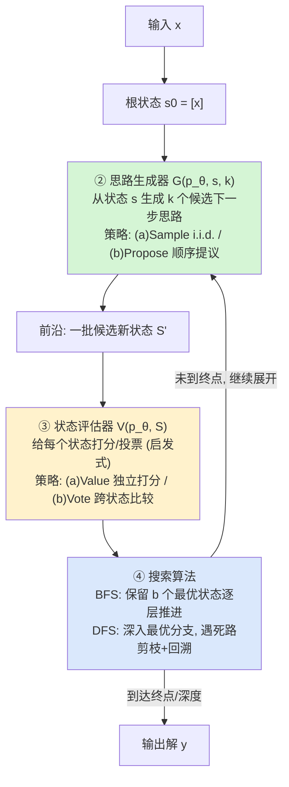

# Tree of Thoughts：把思维链泛化成对『中间思路』的树搜索

> **本篇属 agent-harness 库 B 组（控制循环 / L 层）**。ToT 是 2023 年的**奠基性(canon)**工作：它第一次把
> "让 LLM 深思"显式地写成一个**搜索问题**——状态=部分解、算子=生成下一步思路、启发式=模型自评、外层=BFS/DFS。
> 之所以把它放进 harness 库，是因为它触及了 harness 最核心的那一层 **L（Loop / 控制循环）**：
> 同一个模型 $p_\theta$ 不变，只是把外面的"控制循环"从"一条直线"换成"一棵可回溯的树"，任务成功率就能量级式变化。
> 这正是全库中心命题 **Agent = Model + Harness** 在**推理层**的一个干净证据。

---

## §1　TL;DR（一页讲清这篇在干嘛）

> 主讲提示：开场先把"CoT 是一条链、ToT 是一棵树"这张图讲清楚（原文 Figure 1），再抛出 74% vs 4% 这个反差数字。

**一句话**：语言模型默认是**逐 token、从左到右**地做决策（原文 §1 称之为受限于 token-level, left-to-right decision-making）。这在"需要探索、需要前瞻(lookahead)、或者第一步走错就满盘皆输"的任务上会栽跟头。**Tree of Thoughts (ToT)** 把 Chain-of-Thought(CoT) 泛化：不再采样**一条**连续的思路链，而是把问题建模成在一棵**思维树**上的搜索——树的每个节点是一个**状态 $s=[x, z_{1\cdots i}]$**（输入 + 到目前为止的思路序列），模型既负责**生成**候选思路，又负责**自评**哪个状态更有希望，外层再用 **BFS 或 DFS** 系统地探索、前瞻与**回溯(backtrack)**（原文 §3、Figure 1d）。

**打的是 harness 的哪一层（Θ1）**：本篇主攻 **L（Loop / 控制循环）**——它的全部创新都在"把推理循环组织成树搜索"这件事上；同时它**隐式**用到 **V（Validation）**——但注意这个"评委"不是外部程序，而是**模型自己**（LM self-evaluation），这既是它优雅之处、也是它最大的脆弱点（见 §14）。它对 **C（Context）**的依赖体现在：一个"thought"是一个**语言片段**（几个词 / 一行方程 / 一整段计划），被当作上下文里的可组合单元。

**三条带走的结论**：
1. **机制**：ToT = 思路分解 + 思路生成(sample/propose) + 状态评估(value/vote) + 搜索(BFS/DFS)，四个可插拔模块，**无需任何训练**，一个现成的 LM 就够（原文 §3 "Convenience"）。
2. **铁证**：Game of 24 上，GPT-4 用 CoT 只有 **4.0%**，ToT(b=5) 达 **74%**（Table 2）；连"采样 100 条 CoT 取最好"也只有 49%——**广度探索 > 单链重采样**。
3. **代价与边界（Θ5）**：ToT 更强，但更贵（Game of 24 每题约 5.5k 生成 token、$0.74，约为 CoT 的 5.7 倍成本，Table 7）。作者自己承认：**很多 GPT-4 已经做得很好的任务并不需要 ToT**（§6）——搜索不是免费午餐，**分 regime**。

**权威性来源（Θ4）**：NeurIPS 2023 正会论文，Princeton 与 Google DeepMind 合作；是 2023 年"推理即搜索"这一范式的**代表作/公共祖先**，被后续大量 agent 控制循环、推理时搜索(inference-time search)工作直接继承。

---

## §2　问题与动机：为什么"一条链"不够，要长成"一棵树"

> 主讲提示：这一页用 Why 三连的"问题层"。核心是讲清 autoregressive = System 1，缺一个 System 2。

**Why（问题层）——不解决会卡住什么？**
放大后的 LLM（GPT、PaLM 等）在数学、符号、常识、知识推理上越来越强，但**底层机制始终是**：逐个 token、从左到右地做局部决策（原文 §1）。作者提出的尖锐问题是："这样一个简单的关联式机制，够不够撑起一个**通用问题求解器**？如果不够，什么问题会挑战当前范式，替代机制该是什么？"

作者从**人类认知的双过程理论(dual-process)**借力（原文 §1，引 Kahneman）：人有一个快速、自动、无意识的 **System 1**，和一个缓慢、深思、有意识的 **System 2**。LLM 的 token 级关联选择很像 System 1；它可能受益于一个更深思的 **System 2 规划过程**——(1) 对当前步骤**维护并探索多个不同选项**（而不是只挑一个），(2) **评估自己当前状态**并主动**前瞻或回溯**以做更全局的决策（原文 §1 末）。

**现有方法的两个系统性短板**（原文 §3 明确列出）：
1. **局部无探索**：在一条思路链内部，**不去探索一个思路步骤的不同延续**——即"树的不同分支"从没被展开。
2. **全局无规划**：整体上**不做任何前瞻、回溯**，也不借助启发式去评估这些不同选项——而这种"启发式引导的搜索"恰恰是人类问题求解的特征。

**证据（最有说服力的一张图）**：原文 §4.1 + Figure 3(b) 报告：在 Game of 24 上，**约 60% 的 CoT 采样在生成第一步（前三个词，如 "4 + 9"）之后就已经注定失败**。这是"从左到右解码"病理的直接量化——**一步错，步步错，且无法回头**。

> **读出什么**：ToT 的动机不是"再训一个更强的模型"，而是"给现成模型套一层**会搜索的外壳**"。用本库的话说——它改的不是 Model，而是 **Harness 的 L 层**。

---

## §3　研究问题 / 核心 intention（一句话形式化）

> 主讲提示：把 ToT 的"四要素"先一次性亮出来，后面逐个拆。

**核心 intention**：把"用 LM 深思(deliberate problem solving)"**形式化为在一棵树上的搜索**。ToT 把任意问题框成"在树上找解"，其中每个**节点是一个状态 $s=[x, z_{1\cdots i}]$**（输入 $x$ + 到目前为止的思路序列）。一个具体的 ToT 实例，就是回答**四个问题**（原文 §3，本篇后续 §7–§10 逐一展开）：

1. **如何分解(decompose)** 中间过程为一个个"思路步骤 (thought step)"？
2. **如何生成(generate)** 每个状态的候选思路？
3. **如何启发式地评估(evaluate)** 状态（哪个更有希望）？
4. **用什么搜索(search)算法**（BFS / DFS）来组织探索？

**关键假设**：存在一种粒度合适的"思路(thought)"——它要**足够小**，小到 LM 能生成多样且有希望的候选样本（"生成一整本书"太大、不连贯）；又要**足够大**，大到 LM 能对它的"是否通向解"做出有意义的评估（"生成一个 token"太小、没法评）（原文 §3 "1. Thought decomposition"）。这条"thought 粒度"假设，是 ToT 能不能work的隐形前提。

---

## §4　相关工作定位：ToT 站在谁肩上、和谁不同

> 主讲提示：用一张表把 IO / CoT / CoT-SC / ToT 的"探索能力"横向摆开——这就是 Figure 1 的文字版。

ToT 把几种既有方法收编为**自己的特例**（原文 §3 末 "Generality"：IO、CoT、CoT-SC、self-refine 都可看作深度/宽度受限的 ToT）：

| 方法 | 中间步骤 | 探索结构 | 能回溯？ | 评估机制 | 出处 |
|---|---|---|---|---|---|
| **IO prompting**（输入-输出） | 无 | 一次直出 | 否 | 无 | 原文 §2 |
| **CoT**（思维链） | 一条思路链 $z_1\cdots z_n$ | **单链**（深度=n, 宽度=1） | 否 | 无 | [Wei+ 2022] |
| **CoT-SC**（自一致） | $k$ 条 i.i.d. 链 | **k 条平行链** | 否 | 多数投票（仅限输出空间小时） | [Wang+ 2022] |
| **ToT（本文）** | 思路树 | **树**（可变深度/宽度） | **是（前瞻+回溯）** | LM 自评（value / vote） | 原文 §3 |

**和三类相邻工作的边界**（原文 §5 Related Work）：
- **vs Self-refine / Reflexion / Self-eval decoding**：这些也让 LM 自我反馈/自评，但**self-eval guided decoding**[Xie+ 2023] 用的是 PAL 式"思路即代码"表示，难处理创意写作这类任务；ToT 的语言化表示**更通用**，能覆盖 GPT-4 标准提示都很吃力的任务。
- **vs RAP**（并发工作，用世界模型做规划）：RAP 的任务更简单，且其框架**缺乏可插拔不同树搜索算法的模块性**——ToT 的模块化(modularity)是卖点。
- **vs 经典搜索 A\* / MCTS**：ToT 可看作"现代版的经典搜索"，只不过启发式来自 **LM 的自评**，而非人工编程（DeepBlue）或学习得到（AlphaGo）。这是它的"第三条路"。

---

## §5　方法总览（big picture）：一张图看懂四个模块

> 主讲提示：这页只讲直觉与数据流，数学留到 §7–§10。强调"生成器"和"评估器"都是同一个 LM 换 prompt。

**直觉**：把 LM 想成一个**又能落子、又能自评局面**的棋手，外面套一个**搜索引擎**替它管理"该展开哪个局面、什么时候回头"。



- **①分解**：由问题性质决定"一个思路多大"（Game of 24=一个中间等式；Creative Writing=一段写作计划；Crosswords=填一个词）。
- **②生成器 $G$**：从当前状态生成 $k$ 个候选。两种策略（§7）。
- **③评估器 $V$**：LM 充当**启发式**，判断状态"通向解"的希望。两种策略（§8）。
- **④搜索**：BFS 或 DFS 把生成/评估编排成一次系统探索（§9）。

**四大概念收益**（原文 §3 末）：(1) **Generality** 通用（IO/CoT/CoT-SC 是特例）；(2) **Modularity** 模块化（四件套各自可换）；(3) **Adaptability** 适配（按问题性质与资源约束调）；(4) **Convenience** 便利（无需训练，现成 LM 即可）。

---

## §6　符号与术语表

> 主讲提示：一页定义清楚后面所有式子要用的记号，尤其把"状态 s"讲成"树上的一个节点"。

| 记号 | 含义 |
|---|---|
| $p_\theta$ | 参数为 $\theta$ 的**预训练语言模型**（本文主要是 GPT-4）。 |
| $x, y, z, s$ | 小写字母表示**语言序列**（原文 §2 约定）；$x$=输入，$y$=输出，$z$=一个思路。 |
| $z_i$ | 第 $i$ 步**思路 (thought)**——一个连贯的语言片段，作为通向解的中间步骤。 |
| $z_{1\cdots i}$ | 前 $i$ 步思路的序列。 |
| $s=[x, z_{1\cdots i}]$ | **状态 (state)**=树上一个节点=输入加上到目前为止的思路序列（部分解）。 |
| $S$ | 一**组**状态（前沿 frontier 里的候选集合）。 |
| $G(p_\theta, s, k)$ | **思路生成器**：从状态 $s$ 生成 $k$ 个候选下一步思路。 |
| $V(p_\theta, S)$ | **状态评估器**：给状态集合 $S$ 里每个状态打一个启发式分数。 |
| $k$ | 每个状态生成的候选思路**个数**。 |
| $b$ | **breadth limit（宽度上限）**：BFS 每层保留的最优状态数。 |
| $T$ | **step limit（步数上限）**：树的最大深度（思路步数）。 |
| $v_{th}$ | **value threshold（价值阈值）**：DFS 里低于它就剪枝。 |
| $p_\theta^{\text{value}}, p_\theta^{\text{vote}}$ | 用于"独立打分"、"跨状态投票"的 prompt 化 LM。 |

---

## §7　方法细节 ①②：思路分解 + 思路生成（生成器 G）

> 主讲提示：这一页把"要素①分解"和"要素②生成"讲透。生成的两种策略是考点：什么时候 sample、什么时候 propose。

### 7.1 思路分解（Thought decomposition）——粒度是隐形关键

**直觉**：CoT 是"随便采一条链"，从不显式规定"一步思路多大"；ToT 反过来**利用问题结构去设计分解**（原文 §3 "1."）。

**"读出什么"式的判据**：一个 thought 应当——
- **足够小**：小到 LM 能生成多样且有前景的候选（"生成一整本书"就太大，无法连贯）；
- **足够大**：大到 LM 能评估它"是否通向解"（"生成一个 token"就太小，无从评估）。

三个任务的分解示例（原文 Table 1）：

| 任务 | 一个 thought = | #思路步数 |
|---|---|---|
| Game of 24 | 一个中间等式（如 `13-9=4 (left 4,4,10)`） | 3 |
| Creative Writing | 一段简短写作计划 | 1 |
| 5×5 Crosswords | 为某条线索填一个词（如 `h1. shown`） | 5–10（可变）|

### 7.2 思路生成器 $G(p_\theta, s, k)$——两种策略

**直觉**：给定当前状态 $s=[x, z_{1\cdots i}]$，我要 $k$ 个"下一步"候选。怎么要？取决于"思路空间"稠密还是稀疏。

**策略 (a) Sample（i.i.d. 采样）**——适合思路空间**丰富**（如每个思路是一整段）。

记号：$z^{(j)}$ 是第 $j$ 个候选思路；$p_\theta^{CoT}$ 是带 CoT 提示的 LM。

$$z^{(j)} \sim p_\theta^{CoT}(z_{i+1} \mid x, z_{1\cdots i}), \quad (j = 1 \cdots k)$$

读出什么：从同一个 CoT 提示里**独立采 $k$ 次**，靠采样的随机性获得多样性。用于 **Creative Writing**（Figure 4），因为思路是段落、空间大，i.i.d. 采样天然多样。

**策略 (b) Propose（顺序提议）**——适合思路空间**受限**（如每个思路是一个词/一行）。

记号：用一个"提议提示 (propose prompt)"让 LM **一次性列出 $k$ 个**候选：

$$[z^{(1)}, \cdots, z^{(k)}] \sim p_\theta^{propose}(z_{i+1}^{(1\cdots k)} \mid s)$$

读出什么：当思路空间狭窄（如一个词），独立 i.i.d. 采样容易**撞车重复**；让 LM 在**同一段上下文里一起提议**，能自觉避免重复。用于 **Game of 24**（Figure 2a）与 **Crosswords**（Figure 6）。

> **Why（设计层）——为什么要两种生成策略，而不是一种打天下？**
> 朴素做法：永远 i.i.d. 采 $k$ 次。→ 在**受限空间**（一个词、一行等式）里，$k$ 次独立采样会**大量重复**，白烧算力。反过来，永远用 propose？→ 在**开放空间**（整段文字）里，逼 LM 一次列 $k$ 个反而限制了多样性。ToT 因此**按思路空间的稠密度二选一**（原文 §3 "2."）——这是"适配性(Adaptability)"的具体体现。

---

## §8　方法细节 ③：状态评估器 V（LM 自当启发式）

> 主讲提示：这是 ToT 最"聪明"也最"危险"的一步——把搜索启发式交给模型自己。两种策略：独立打分 vs 跨状态投票。

**直觉**：搜索要有"该往哪走"的**启发式**。经典做法是人工编程(DeepBlue)或学习(AlphaGo)；ToT 提出**第三条路——让 LM 深思地"论证"每个状态好不好**（原文 §3 "3."）。好处：比编程规则更灵活，比学习模型更省样本。

**策略 (a) Value（独立打分）**：对每个状态**分别**打一个标量/分类分。

记号：$V(p_\theta, S)(s) \sim p_\theta^{value}(v \mid s)$，$\forall s \in S$；$v$ 是一个标量（如 1–10）或可映射为分数的分类（sure / likely / impossible）。

$$V(p_\theta, S)(s) \sim p_\theta^{value}(v \mid s), \quad \forall s \in S$$

读出什么：评估靠**few-shot lookahead（少步前瞻）+ 常识**。例如 Game of 24 里，"快速心算确认 5,5,14 能经 `5+5+14` 到 24"→ 判 sure；或"1 2 3 太小到不了 24"→ 判 impossible（原文 §3 "3.(a)" 原例）。**估值不必完美，只要"大致有用"就能引导搜索**（原文原话 "do not need to be perfect, and only need to be approximately helpful"）。

**策略 (b) Vote（跨状态投票）**：当"单个状态好不好"难以直接判断时，**把多个状态摆一起比，投票选最有希望的一个**。

记号：$V(p_\theta, S)(s) = \mathbb{1}[s = s^*]$，其中 $s^* = \arg\max_{s'} p_\theta^{vote}(s^* \mid S)$ 是在一个"投票 prompt"里、通过**刻意比较** $S$ 中不同状态而被投出来的"好状态"。

$$V(p_\theta, S)(s) = \mathbb{1}[s = s^*], \quad s^* \sim p_\theta^{vote}(s^* \mid S)$$

读出什么：这像一种"**步级的自一致(step-wise self-consistency)**"——把"该探索哪个状态"当成一道**多选题**让 LM 投票。用于 Creative Writing（passage 连贯性难打绝对分，但可比较，Figure 4）。

> **Why（设计层）——为什么可以让"运动员兼裁判"？**
> 朴素质疑：让生成思路的模型又去评估思路，会不会"自我美化"？→ 作者的两点缓冲：(1) **估值只需近似有用**，不需精确——它只是排序/剪枝的启发式，不是最终判定；(2) 两种策略都可**多次 prompt 聚合**（vote/value 各采样多次取聚合），"以时间/算力换更忠实鲁棒的启发式"（原文 §3 "3." 末）。**但这仍是它最脆弱的一环**——见 §14 批判。

---

## §9　方法细节 ④：搜索算法（BFS / DFS）——L 层的核心

> 主讲提示：全篇的"控制循环"就在这里。把两段伪代码（Algorithm 1/2）逐行讲清，尤其 BFS 的"逐层保 b 个"和 DFS 的"剪枝+回溯"。

ToT 把上面的生成器 $G$、评估器 $V$ 塞进一个**外层搜索**。作者只用两种最简单的搜索（把 A\*/MCTS 留给未来工作，原文 §3 "4."）。

### 9.1 ToT-BFS（Algorithm 1）——逐层保留 b 个最优

**直觉**：像"广撒网 + 每层只留最靠谱的 $b$ 个"，一层层往深推。适合**树浅**的任务（Game of 24、Creative Writing，$T\le 3$）。

```
Algorithm 1  ToT-BFS(x, p_θ, G, k, V, T, b)
Require: 输入 x, LM p_θ, 生成器 G, 生成数 k, 评估器 V, 步数上限 T, 宽度上限 b
  S_0 ← { x }                                    # 初始只有根状态
  for t = 1 … T do
      S'_t ← { [s, z] | s ∈ S_{t-1}, z_t ∈ G(p_θ, s, k) }   # 展开: 每个状态生 k 个候选
      V_t  ← V(p_θ, S'_t)                         # 评估所有候选
      S_t  ← argmax_{S ⊆ S'_t, |S|=b}  Σ_{s∈S} V_t(s)       # 只保留分数最高的 b 个
  end for
  return G(p_θ, argmax_{s∈S_T} V_T(s), 1)         # 从最优终态生成最终输出
```

读出什么：每层把"候选池 $S'_t$"评分后，**贪心保留 top-$b$** 作为下一层的父节点。$b$ 越大探索越广、越贵。Game of 24 用 $b=5$，Creative Writing 用 $b=1$。

### 9.2 ToT-DFS（Algorithm 2）——深入最优分支 + 剪枝 + 回溯

**直觉**：先"一头扎进最有希望的分支"直到出解或到深度；一旦评估器判某状态"不可能"，就**剪掉该子树并回溯**到父节点换下一个候选。适合**树深/可变**的任务（Crosswords，最多 10 步）。

```
Algorithm 2  ToT-DFS(s, t, p_θ, G, k, V, T, v_th)
Require: 当前状态 s, 步 t, LM p_θ, 生成器 G, 生成数 k, 评估器 V, 步数上限 T, 阈值 v_th
  if t > T then record output G(p_θ, s, 1) end if     # 到深度: 记录输出
  for s' ∈ G(p_θ, s, k) do          # 按评估分数排序后的候选
      if V(p_θ, {s'})(s') > v_th then          # 高于阈值才值得深入
          DFS(s', t+1)                          # 否则该分支被剪枝
      end if
  end for
```

读出什么：**剪枝**由"评估分 ≤ $v_{th}$"触发（判为不可能就砍）；**回溯**是 DFS 递归返回父状态、尝试下一个兄弟候选的自然行为（原文 §3 "4.(b)"：DFS backtracks to the parent state to continue exploration）。Crosswords 限制 DFS 最多 100 步。

> **Why（设计层）——为什么 BFS/DFS 要分任务用，且够用？**
> 朴素做法：一个搜索算法通吃。→ 树浅任务(Game of 24, T=3)用 DFS 没必要、BFS 逐层留 $b$ 个更自然；树深/可变任务(Crosswords)用 BFS 会指数爆炸，DFS 的"深入+剪枝+回溯"才可控。作者刻意**只用最简单的两种**、把 A\*/MCTS 留给未来——先证明"**哪怕最朴素的搜索，套在 LM 上也能带来量级增益**"（原文 §3 "4."、§6）。

> **读出什么（Θ1，L 层）**：整篇 ToT 的"新东西"几乎全在这两段伪代码里——它们就是**控制循环(L 层)本身**。Model($p_\theta$) 一个字节没变，变的只是"外层怎么调度生成与评估"。这是本库把它归入 B/L 组的根本理由。

---

## §10　实验设置：三个"专为难倒 GPT-4"设计的任务

> 主讲提示：强调这三个任务不是随便选的——都是 GPT-4 用 IO/CoT 也很吃力、且需要搜索/规划的任务。给全 setting。

**统一设置**（原文 §4）：除非另说，均用 **Chat Completion 模式的 GPT-4**，采样温度 **0.7**；实验于 2023-05-05 至 05-16 完成（原文脚注1）。

| 任务 | 输入 | 输出 | 评测指标 | 规模 | 搜索 |
|---|---|---|---|---|---|
| **Game of 24** | 4 个数字（如 4 9 10 13）| 一个用尽 4 数、经 +−×÷ 得 24 的等式 | **成功率**：等式合法=24 且恰好各用一次输入数（原文 §4.1）| 从 4nums.com 取按人类解题时间排序的第 901–1000 号共 100 题 | BFS，$b=5$ |
| **Creative Writing** | 4 个随机句子 | 4 段连贯文字，每段各以其中一句结尾 | **连贯性**：GPT-4 打 1–10 分（采 5 次取平均，跨样本 std≈0.56）+ 人类盲测两两比较 | 100 组输入（随机词生成器）| BFS，深度=2，$b=1$ |
| **5×5 Mini Crosswords** | 10 条线索（5 横 5 纵）| 5×5=25 个字母的填字 | 三层成功率：**字母**(25/局)、**词**(10/局)、**整局** | 156 局中取 index 1,6,…,91,96 共 20 局测，另 5 局做提示 | DFS，≤100 步 |

**Baselines**（三任务共用思路）：**IO**（5-shot 示例直出）、**CoT**（每对 IO 加 3 个中间等式/或先列计划；每题采样 100 次求平均）、**CoT-SC**（取 100 条 CoT 的多数）、**IO/CoT-refine**（迭代自我反思至多 10 轮，注意 refine 用到了关于等式正确性的 groundtruth 反馈信号）。

**Game of 24 的 ToT 具体配置**（原文 §4.1）：分解成 3 步（每步一个中间等式）；用同一个 "propose prompt"（只对 4 个输入数那步有示例）；BFS 每步保 $b=5$；评估时把每个候选判 "sure / maybe / impossible"（对能否到 24），"太大/太小"的用常识判 impossible 直接淘汰，其余留 maybe；每个思路的估值**采样 3 次**聚合。

---

## §11　主要结果 ①：Game of 24 —— 4% → 74%

> 主讲提示：这是全场最该停留的数字。先报 Table 2 的极差，再用 Figure 3 解释"为什么 CoT 这么惨、ToT 这么强"。

**Table 2（Game of 24 成功率，原文 §4.1）**：

| 方法 | 成功率 |
|---|---:|
| IO prompt | 7.3% |
| CoT prompt | **4.0%** |
| CoT-SC (k=100) | 9.0% |
| **ToT (ours, b=1)** | 45% |
| **ToT (ours, b=5)** | **74%** |
| IO + Refine (k=10) | 27% |
| IO (best of 100) | 33% |
| CoT (best of 100) | 49% |

**Why（结果层）——为什么 CoT 只有 4%、ToT 能到 74%？**
- **CoT 之惨源于"从左到右无法回头"**：Figure 3(b) 的**误差分析**显示，**约 60% 的 CoT 采样在生成第一步（前三个词）之后就已经失败**（原文 §4.1）。也就是说错误在最开头就锁死，后面再"想"也白搭。
- **广度探索 > 单链重采样**：注意 **CoT(best of 100)=49%** 远高于 CoT-SC 的 9%，却仍**远低于 ToT(b=5)=74%**。这说明"在一棵树里探索更多节点(b>1)"比"独立重采 100 条链再挑最好"**更有效**——因为 ToT 能在**每一步**局部纠偏，而不是等整条链跑完再取舍。
- **Figure 3(a) 的 scale 分析**：把 IO/CoT 的 "best of k" 视作"访问 k 个节点的老虎机"，与 ToT 在 $b=1\cdots5$ 访问的节点数对齐比较——同样的"节点预算"下，ToT 的成功率曲线**系统性高于** IO/CoT。**探索的钱花在树上比花在重采样上更值**。

> **读出什么（Θ2）**：模型是同一个 GPT-4，CoT→ToT 从 4%→74%，**变的只有外层控制循环(harness 的 L 层)**。这就是 `Agent = Model + Harness` 在推理层面最干净的一记实锤——与 Harness-Bench 里"同模型换 harness 摆 23.8 分"是同一个故事的两个侧面（后者在真实 agent 工作流，前者在纯推理任务）。

---

## §12　主要结果 ②③：Creative Writing 与 Mini Crosswords

> 主讲提示：这两个任务证明 ToT 的通用性——一个是开放生成（没有 groundtruth），一个是深树搜索（吃回溯）。

### 12.1 Creative Writing（开放式、无标准答案）

- **ToT 配置**：深度=2 的树——先生成 $k=5$ 个写作**计划**并投票选最优；再基于最优计划生成 $k=5$ 篇**passage** 并投票选最优；宽度 $b=1$（每步只留 1 个）。用一个 zero-shot vote prompt 各投 5 票（Figure 4）。
- **结果（Figure 5）**：GPT-4 自评连贯性平均分——**ToT 7.56 > CoT 6.93 > IO 6.19**（原文 §4.2）。人类盲测：**100 对里 41 对偏好 ToT > CoT，仅 21 对偏好 CoT > ToT**（其余 38 对"差不多"）。
- **一个有意思的补充**：iterative-refine 在这个自然语言任务上**更有效**——把 IO 连贯性从 6.19 提到 7.67、ToT 从 7.56 提到 7.91。作者说这可看作 ToT 框架里"生成思路的第三种方式：从旧思路**精炼**出新思路"（原文 §4.2 末）。

### 12.2 Mini Crosswords（深树、吃回溯）

**Table 3（原文 §4.3）**：

| 方法 | 字母成功率 | 词成功率 | 整局成功率 |
|---|---:|---:|---:|
| IO | 38.7 | 14 | 0 |
| CoT | 40.6 | 15.6 | 1 |
| **ToT (ours)** | **78** | **60** | **20** |
| +best state（用 oracle 最优态输出）| 82.4 | 67.5 | 35 |
| −prune（去掉剪枝）| 65.4 | 41.5 | 5 |
| −backtrack（去掉回溯，退化成贪心 BFS b=1）| 54.6 | 20 | 5 |

**Why（结果层）——回溯与剪枝各值多少分？**（原文 §4.3 消融）
- **回溯是命根子**：去掉回溯（−backtrack，退化成"贪心地一路填最有希望的词、允许覆盖"、相当于 BFS $b=1$），词成功率从 60 **崩到 20**。→ **DFS 的回溯能力贡献巨大**，这正是 ToT 相对 CoT 最本质的东西。
- **剪枝也重要但有副作用**：去掉剪枝（−prune）词成功率 60→41.5。但作者诚实指出：剪枝的启发式**不完美**——有时正确解已经在树里，却因为 GPT-4 把某些生僻/过时词（如 "agend"）误判为 impossible 而被**错误剪掉**（原文 §4.3 + 脚注2）。事实上有 4/20 局的正确解在树中，其中 3 局是"ToT+剪枝在 100 步内解不出来"的。
- **oracle 上界**：若用"oracle 最优态"输出（+best state）能到 35%，说明**输出启发式还有提升空间**。

> **读出什么**：Crosswords 是三任务里最"agent-like"的——深树、需要长程状态维护、需要从死路回头。它把 **L 层里"回溯"这一子能力的价值**单独量化了出来（60 vs 20）。这对我们设计 agent 控制循环极有参考价值（见 Inspires-Us）。

---

## §13　消融·成本·可扩展性（regime 诚实，Θ5 的量化底座）

> 主讲提示：这页给"ToT 不是免费午餐"上证据。先讲成本表，再讲它在弱模型/简单任务上的表现。

### 13.1 成本：ToT 大约是 CoT 的 5–6 倍（原文 Appendix B.3）

**Table 7（Game of 24 成本）**：

| 方法 | 生成/提示 token | 每题成本 | 成功率 |
|---|---|---:|---:|
| IO (best of 100) | 1.8k / 1.0k | $0.13 | 33% |
| CoT (best of 100) | 6.7k / 2.2k | $0.47 | 49% |
| **ToT** | 5.5k / 1.4k | **$0.74** | **74%** |

**Table 8（Creative Writing 成本）**：ToT 约 4k 生成 token、**$0.32/题**，约为 IO/CoT（$0.06–0.07）的 **~5 倍**（因为 $b=5$、且大部分 token 是生成的 passage）。

读出什么：ToT 用**和"100 条 CoT"相近的 token 量**（5.5k vs 6.7k），却拿到远更高的成功率——**同等算力下探索比重采样更划算**；但相对"单条 CoT/IO"，ToT 是数量级更贵的（5–100 倍生成 token，取决于 prompt 与搜索）。

### 13.2 弱模型 / 简单任务上（原文 Appendix B.1–B.2）

- **换到简单任务**：GSM8K 上 ToT=90（CoT 86、IO 51）、StrategyQA 上 ToT=83（CoT 82）——**提升很小**。作者解释：GPT-4+CoT 在这些任务上**已经很好**，且 StrategyQA 的瓶颈是**外部知识**而非推理（Table 4）。
- **换到弱模型 GPT-3.5**：Game of 24 上 GPT-3.5+ToT=19%（把 1-shot 提议改成 3-shot 才 work），远逊 GPT-4+ToT 的 74%（Table 5）；但 "ToT > CoT > IO" 的**序**在 GPT-3.5 上依然成立。一个精彩的拆解：用 GPT-4 生成 + GPT-3.5 评估 = 64%，反过来 GPT-3.5 生成 + GPT-4 评估 = 31%——说明**Game of 24 的瓶颈在"生成"而非"评估"**。

> **Why（结果层 / Θ5）——什么时候该上 ToT，什么时候不该？**
> 作者在 §6 与 Appendix 给出很克制的判断：**ToT 值得用在"CoT 就吃力、需要深思/探索"的任务上**；对 GPT-4 已经做得好的任务，"deliberate search such as ToT might not be necessary"（原文 §6 原句）。所以正确表述是——**搜索是否划算分 regime**：任务越需要探索/回溯/长程规划、基础解码越容易一步走死，ToT 回报越大；任务越是模型已能一遍答对，ToT 只是徒增 5–100 倍成本。

---

## §14　局限与批判（原文 §6 + 我的补充）

> 主讲提示：诚实区分"作者自陈"与"社区/我的质疑"。重点打向"运动员兼裁判"这个软肋。

**论文自陈的局限（原文 §6 / Broader Impact）**：
- **未必普适必要**：很多现有任务 GPT-4 已经很好，ToT 不必要；本文只在**三个自造的难任务**上验证。
- **成本更高**：搜索比采样贵得多（GPT-4 API cost），但作者押注"模块化灵活性 + 开源模型变便宜"会缓解。
- **只探索了最简单的搜索**：A\*、MCTS 等更强搜索留给未来。
- **Broader Impact 的诚实**：ToT 让 LM 更自主决策，未来若接入外部环境/人可能带来风险；但也提升了**可解释性**（决策是可读的高层语言推理，而非隐式 token）。

**我的补充批判**：
- **"运动员兼裁判"是根本软肋**：状态评估器 $V$ 就是**生成思路的同一个 LM**换个 prompt。Crosswords 的 −prune 消融已经暴露：评估器会把正确解**误判为 impossible 而错剪**（原文 §4.3、脚注2）。当"生成会犯的系统性错误"与"评估会犯的系统性错误"**相关**时（同一个模型，很可能相关），自评启发式会**系统性地把搜索引向错误方向**——这是 §8 那句"估值只需近似有用"没有覆盖的风险。**"谁来评估评估者"原文未给出答案**（与本库 Harness-Bench 的"谁 judge the judge"、auto-research 库 m9.8 红队收口同一隐忧）。
- **搜索预算/超参很多且任务特定**：$k, b, T, v_{th}$、propose vs sample、value vs vote，全是**手工按任务调**的，泛化到新任务需要重新设计"思路分解"与提示——**通用性有折扣**。
- **评测部分依赖 LM 自评**：Creative Writing 的连贯性主指标是 **GPT-4 自己打分**（虽有人类盲测佐证），存在"生成器与评委同源"的偏差。
- **成本上界不清**：作者说 Crosswords DFS "应在 100 美元内"，但深树任务的**最坏情形算力**没有给出严格界（原文未给出）。

---

## ★ 对我们的启发（Inspires Us）

> 这一节是组会高潮，也是本库相对 auto-research 的独门优势：**我们（Claude Code / 本课 m9.\* 的 agent）本身就是一个 harness**——
> 我们已经有真实的 ReAct 控制循环、工具预算、上下文压缩、**子代理编排**。ToT 讲的"生成-评估-搜索-回溯"，
> 正是我们控制循环(L 层)与子代理层可以直接照搬的骨架。所以下面每条都能"打到自己身上"。

➤ **a. 可直接借用的招（method we can reuse）**：ToT 的**"生成器 / 评估器 / 搜索器"三分**是一套可拆下来的**控制循环模板**。具体三招：(1) **Propose vs Sample 二选一**——在候选空间受限时(如"下一步该调哪个工具/该修哪个文件")用一次性 propose-$k$ 避免重复，在开放时(如"起草一段方案")用 i.i.d. sample-$k$ 保多样；(2) **"sure/maybe/impossible" 三档剪枝**——用一个轻量自评把明显走死的分支**提前砍掉**，省下深入的算力；(3) **DFS 回溯**——遇到"这条路做不下去"时**显式退回上一个决策点换方案**，而不是硬着头皮往前。

➤ **b. 可迁移到我们的模块（transfer → 我们的子代理层）**：把 ToT 映射到**我们的子代理编排**——**一个"探索型子代理"= 树的一个分支**。主 agent 扮演 ToT 的"搜索器 + 评估器"：并行派 $b$ 个子代理各自沿不同思路推进（如"三种重构方案"各开一个 worktree/子代理），主 agent 用一个 vote-prompt **比较它们的中间产物、只保留 top-$b$ 继续、砍掉没希望的**。迁移时要改什么：ToT 的"状态"在纯推理里是文本，在我们这里是**真实副作用**（文件改动、命令执行），所以"回溯"不是免费的——需要**可回滚的沙箱/worktree**做支撑（这点 ToT 不用管，我们必须管）。什么前提不再成立：ToT 假设"评估只需近似有用"，但我们的动作有真实代价，误剪一个好分支=白跑一个子代理，**评估器的假阴性成本比 ToT 高**。

➤ **c. 它暴露的开放问题 = 我们的机会（open problem → our opportunity）**：ToT 的**评估器与生成器同源**，误差相关时会系统性带偏搜索（§14）。机会：给我们的"探索型子代理"配一个**异源评委**——不是让主 agent 自评，而是引入一个**只认外部可验证信号**的评估器（如"该分支的代码能否通过测试/类型检查/lint"），把 ToT 的"LM 自评启发式"替换成"**部分可验证的启发式**"。可下手的第一步：在多方案探索里，用"**跑一遍单测**"作为 value 信号给分支排序/剪枝，量化它相对"纯 LM 自评"能否降低"选错方案"的概率。

➤ **d. 与本库其它论文/模块的连接（connect the dots）**：与 **Harness-Bench (2605.27922)** 正反呼应——后者证明"真实工作流里换 harness 摆 23.8 分"，ToT 证明"纯推理里换控制循环 4%→74%"，二者共同支撑 `Agent=Model+Harness`；与 **CoT/CoT-SC** 是"深度/宽度受限的特例"关系；与 auto-research 库 **m9.8（独立验证收口 / 谁验证验证者）** 共享"自评启发式不可全信"的隐忧；ToT 的"回溯"这一子能力，正是 H 组"工具失败恢复"类工作在**推理层**的对应物。

➤ **e. 如果我来做下一步（my next move，第一人称）**：我会在我们的**子代理编排**里加一个 **"ToT 式探索开关"**——对"有多条明显不同解法"的任务，并行开 $b=3$ 个子代理各走一条路，主 agent 用"跑单测 + 一个 vote-prompt"给三条分支打分，**保留最优、剪掉走死的、必要时回溯换方案**；先在一个"重构/修 bug"类任务上跑最小验证，对比"单子代理直做" vs "$b=3$ ToT 式探索"的成功率与总 token，看**探索的算力是否换来了成功率的净收益**（复刻 ToT 的 Figure 3(a) 那张"节点预算 vs 成功率"曲线，只不过把"节点"换成"子代理数"）。

---

## §15　版图定位（canon 坐标 + 在本库的位置）

> 主讲提示：一句话——ToT 是"推理即搜索"的奠基作，是后续无数 agent 控制循环的公共祖先。

- **时间坐标（Θ4：canon）**：**2023 NeurIPS 奠基作**。它把 Newell & Simon 1950s 的"问题求解=组合空间里的树搜索"经典思想，**翻译成了当代 LLM 可直接执行的方法**（原文 §3 引 Newell）。它"相对基石推进了哪一步"——CoT[Wei+2022] 把推理显式化成**一条链**，ToT 把它泛化成**一棵可搜索、可回溯的树**；后续大量"推理时搜索 / agent 控制循环 / 自评引导解码"工作把 ToT 当作公共祖先在其上长肉。
- **E/T/C/L/O/V 归属（Θ1）**：本篇坐 **L（控制循环）**层——全部创新在"把生成/评估编排成 BFS/DFS 搜索"；**隐式用 V**（LM 自评当启发式，但非外部独立验证）；**依赖 C**（thought 作为可组合的上下文语言单元）。
- **回扣中心命题（Θ2）**：ToT 是 `Agent = Model + Harness` 在**纯推理维度**的干净证据——Model(GPT-4)不变，仅把 Harness 的 L 层从"单链"换成"树搜索"，Game of 24 从 4%→74%。它与 Harness-Bench（真实工作流维度）互为里外证据。
- **regime 边界（Θ5）**：**搜索并非总划算**——任务需探索/回溯/长程规划、基础解码易一步走死时，ToT 回报巨大；任务模型已能一遍答对时（GSM8K/StrategyQA），ToT 仅 +几分却贵 5–100 倍。**该不该上搜索，取决于任务 regime，不能绝对化。**
- **在本库的位置**：B 组（L 层）⭐⭐ 的**方法奠基石**。读完它，再看任何一篇讲"agent 控制循环 / recovery / 多路探索"的论文，都能问一句："它在 ToT 的四要素（分解 / 生成 / 评估 / 搜索）里动了哪一个？把'LM 自评'换成了什么更可靠的启发式？"

---

## §16　组会讨论问题（留给大家吵）

1. ToT 让"生成思路的模型"兼任"评估状态的裁判"。在哪类任务上这个"运动员兼裁判"最危险？我们能否用"可验证信号(单测/类型检查)"替换掉纯 LM 自评，代价是什么？
2. Table 2 里 "CoT best-of-100=49%" 却远低于 "ToT b=5=74%"。同样烧 token，为什么"树里探索"比"独立重采 100 条链"更值？这对我们"该并行开几个子代理、还是重跑同一个"有什么指导？
3. Crosswords 的 −backtrack 消融把词成功率从 60 砍到 20。把"回溯"搬到**有真实副作用**的 agent 里（要回滚文件/命令），成本模型会怎么变？什么时候回溯的收益 cover 不住回滚的代价？
4. ToT 的四要素($k,b,T,v_{th}$、propose/sample、value/vote)全是手工按任务调的。有没有办法让 agent **自己**根据任务难度**动态**决定搜索宽度/深度（自适应算力）？
5. §13 显示 Game of 24 的瓶颈在"生成"而非"评估"(GPT-4 生成+GPT-3.5 评估=64%)。我们的 agent 任务，瓶颈更多在"想不出下一步"还是"判断不了哪步对"？据此该把算力投在生成侧还是评估侧？

---

## §17　一页速记（takeaways）

- **命题**：把"LM 深思"形式化为**树搜索**——节点=状态 $s=[x,z_{1\cdots i}]$，算子=生成思路，启发式=LM 自评，外层=BFS/DFS。**Model 不变，改 Harness 的 L 层。**
- **四要素**：①分解(thought 粒度要不大不小) ②生成器 $G$(受限空间 propose-$k$ / 开放空间 sample-$k$) ③评估器 $V$(独立打分 value / 跨状态投票 vote，"只需近似有用") ④搜索(BFS 逐层保 $b$ / DFS 深入+剪枝+**回溯**)。
- **铁证**：Game of 24，GPT-4 CoT **4.0%** → ToT(b=5) **74%**（Table 2）；CoT best-of-100 仅 49%——**探索 > 重采样**。CoT 约 60% 在第一步就死（Figure 3b）。
- **通用性**：Creative Writing 连贯性 ToT 7.56 > CoT 6.93 > IO 6.19，人类 41:21 偏好 ToT；Crosswords 词成功率 ToT 60 vs CoT 15.6，且 −backtrack 崩到 20（**回溯值 40 分**）。
- **成本（Θ5）**：ToT ≈ CoT 的 5–6 倍（Game of 24 $0.74/题）；简单任务(GSM8K 90 vs CoT 86)/强模型下增益很小——**搜索是否划算分 regime**。
- **软肋**：**运动员兼裁判**——评估器=生成器同源，会把正解误剪(Crosswords 脚注2)；"谁评估评估者"未解。
- **对我们**：把"生成/评估/搜索/回溯"搬进**子代理编排**——并行开 $b$ 个探索型子代理、用"跑单测+vote"当异源评估器给分支剪枝/回溯；先在重构/修 bug 任务上复刻 Figure 3(a) 的"预算 vs 成功率"曲线，验证探索算力换来的是净收益。
- **坐标（Θ4）**：**canon（NeurIPS 2023, Princeton/DeepMind）**——"推理即搜索"的奠基作，后续 agent 控制循环的公共祖先；与 Harness-Bench 互为"纯推理 / 真实工作流"两侧证据，共同支撑 **Agent = Model + Harness**。
