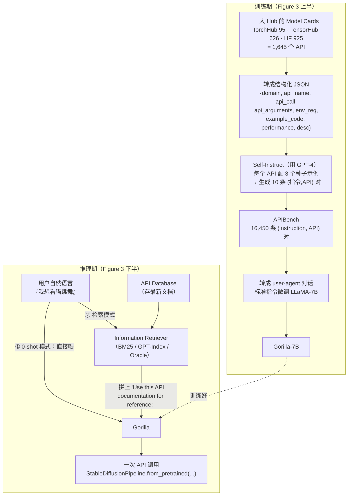

# Gorilla：把 LLM 接到海量 API 上——检索感知微调 + AST 子树匹配度量 API 幻觉

> **本篇定位**：Gorilla 是 agent-harness 库 **C 组（工具接口 = T 层）** 的一块奠基石。它回答一个很窄但很硬的问题——
> **「让模型输出一次 API 调用，怎么知道它调对了？怎么知道它是不是在一本正经地编造一个根本不存在的 API？」**
> 本报告把全部篇幅压在它的两个独门贡献上：**(1) 检索感知训练（Retriever-Aware Training, RAT）**——训练时就把检索到的文档喂进去，让模型学会「跟着文档走」而不是「凭记忆背 API」；
> **(2) AST 子树匹配（AST Sub-Tree Matching）**——一种**执行式/结构式**的评测度量，把「API 调用是否功能正确」和「是否幻觉」变成一个**可判定的树包含问题**。
> 对齐标杆范文（Harness-Bench）的密度与诚实度：每处先直觉→定义符号→「读出什么」，数字标 §/Table/Figure 出处，区分「论文宣称」与「批判」。

---

## §1　TL;DR（一页讲清这篇在干嘛）

> 主讲提示：开场先把「工具调用」这件事在 `Agent = Model + Harness` 里的位置摆正——它就是 **T 层（Tools）**：模型再会推理，最后得落到一次**语法/语义都对**的 API 调用上，否则 agent 什么也干不成。

一句话：**微调一个只有 7B 的 LLaMA（起名 Gorilla），专门学『把自然语言需求 → 变成一次正确的 ML API 调用』；训练时用「检索感知训练」让它学会跟着当前文档走，评测时用「AST 子树匹配」把『调用是否正确 / 是否幻觉』变成可判定的树问题。** 结果：在自建的 **APIBench**（TorchHub + TensorHub + HuggingFace 三大模型库、共 1,645 个 API、16,450 条指令-API 对）上，Gorilla 的 0-shot AST 准确率在 TorchHub 上到 **59.13%**，比 **GPT-4 高 20.43%**、比 ChatGPT 高 10.75%（§4.1，Table 1）；配上 oracle 检索器可到 **67.20% 且幻觉 0%**（Table 1/2）。

- **属于 harness 的哪一层（Θ1）**：本篇打的是 **T（Tools/工具接口）层**——即「模型如何选对、调对一个外部工具/API」。它对 **D 层（Context/上下文）** 有强依赖（检索到的 API 文档要塞进上下文），也顺带触及 **V 层（Validation/评测）**（AST 匹配就是一套针对工具调用的验证协议）。它**不做控制循环（L）**：论文明说「我们有系统能执行这些 API，但那不是本文重点」（§3.2 Gorilla Inference 末句），也**不做多步 agent**——它只管「生成一次正确的调用」。
- **回扣全库论点（Θ2）**：`Agent = Model + Harness`。Gorilla 是**「同一件事，靠 Harness 侧的两个部件（检索 + 结构化验证）把模型能力放大」**的早期范例。这里的 harness 增益体现在两处数字摆动：**(a)** 换检索器（0-shot → oracle 检索）让 Gorilla 从 59.13% 抬到 67.20%、幻觉从 6.98% 压到 0%（Table 1）；**(b)** **检索感知训练** vs 普通微调——训练时带 oracle 检索器，TorchHub 再涨 12.37%、HuggingFace 涨 23.46%（§4.1 "Finetuning with Retrieval"）。模型骨架（LLaMA-7B）没变，变的是它外面「怎么喂文档、怎么验对错」。
- **canon 坐标（Θ4）**：**2023-05 的早期奠基工作**。它和 Toolformer（2302.04761）、TaskMatrix.AI（2303.16434）、HuggingGPT（2303.17580）同期，但走了一条别人没走的路——**「微调 base 模型 + 信息检索」**（论文 §2 自述 "a first, to the best of our knowledge"）。它奠定的「AST 匹配评工具调用」后来被 Berkeley 自己的 **BFCL（Berkeley Function-Calling Leaderboard）** 直接继承发扬。

---

## §2　问题与动机：为什么「让 LLM 调 API」这么难、又这么值得

> 主讲提示：这一段讲清「工具调用」为什么是 agent 的命门，以及现有 LLM 在这件事上的两种典型翻车。

**Why（问题层）——不解决会卡住什么？**
LLM 被固定在「训练时那套权重 + 有限上下文 + 静态计算图」里（§1 原文："limited by the information they can store in a fixed set of weights and the things they can compute using a static computation graph and limited context"）。想让它突破这层天花板、去访问「不断变化的海量知识与算力」，最自然的办法就是**让它调工具（API）**（§1 引 Toolformer [33]）。一旦 LLM 能可靠地调一大片「云 API」，它就从「聊天框」升级成「计算基础设施和 web 的主入口」——订整个假期、办一场会议，都可以只靠对着一个能调机票/租车/酒店/餐饮 API 的 LLM 说话完成（§1 原文的愿景）。

但现实卡在两点（Abstract + §1）：

1. **参数填不对（wrong arguments）**：API 调用要求精确的函数名、参数名、参数取值、约束，模型经常填错。
2. **幻觉出不存在的 API（hallucinate the wrong usage of an API call）**：这是**最致命**的——模型一本正经地生成一个**根本不存在**的 API，或者把 A 库的调用安到 B 库上。

论文用 Figure 1 给了一个极其直观的例子（Prompt：「帮我找一个用 Torch Hub 把录音里的口语转成文字的 API」）：
- **GPT-4** 生成 `torch.hub.load('snakers4/silero-models', 'asr', source='local')`——**`'asr'` 这个模型不存在** → **Hallucinate!（幻觉）**
- **Claude** 生成 `torchaudio.pipelines.WAV2VEC2_ASR_PIPELINE(...)`——**用错了库**（Wrong library!）
- **Gorilla** 生成 `torch.hub.load('snakers4/silero-models', 'silero_stt', ...)`——**Good to go!（对了）**

> **读出什么**：这三张卡片就是本篇的「靶子」。GPT-4 的错叫**幻觉**（调了不存在的东西），Claude 的错叫**选错工具**（error，调错了但那 API 存在）。论文后面**把这两类错严格区分开**（§3.3），这正是 AST 匹配度量的精髓——**不是所有「错」都一样**，「编造不存在」比「用错现有的」更危险。

**Why（问题层续）——为什么不能像以前那样「把 API 文档塞进 prompt」？**
以前的工具-LLM 工作（§1 末引 [35,24]）默认「一小撮、文档齐全、能轻松塞进 prompt 的 API」。但真实世界是**「web 规模、数百万个、还在不断变」的 API**（§2 第 3 段）。此时：
- **塞不下**：不可能把全部 API 描述放进一次上下文；
- **功能重叠、约束微妙**：很多 API 功能重叠、各有限制和约束，光靠 prompt 描述区分不开；
- **评测也得重造**：「在这个新设定下光是评估 LLM 就需要新的 benchmark」（§2 原文 "Simply evaluating LLMs in this new setting requires new benchmarks."）。

> **读出什么（Θ2 呼应）**：这三条正好推出本文的三件事——**(1)** 用**检索**替代「全塞进 prompt」（应对「塞不下 + 会变」）；**(2)** 用**微调**让模型内化「调 API 的范式」（应对「功能重叠、约束微妙」）；**(3)** 造 **APIBench + AST 度量**（应对「评测得重造」）。三件事分别对应 harness 的 **D 层（上下文/检索）、模型微调、V 层（验证）**。

---

## §3　研究问题与核心 intention（形式化成一句话）

> 主讲提示：把整篇的「假设」压成一句话，方便后面所有设计都回扣它。

**核心问题**：给定一句自然语言需求 $q$ 和一个**巨大且随时间变化**的 API 空间，如何让一个（小）模型输出**功能正确、且不幻觉**的 API 调用？

**核心假设（论文隐含的三条）**：
1. **微调 > 纯 prompt**：把「调 API 这件事」通过 self-instruct 微调**内化进权重**，比在推理时临时 prompt 一个通用大模型更可靠（§4.1 用 20.43% 的差距实证）。
2. **检索感知训练 > 事后拼检索**：如果训练时就让模型**习惯**「参考一段检索来的文档再作答」，它就能在推理时**跟上文档变化**、并**降低幻觉**（§3.2 Retriever-Aware training）。
3. **功能等价可判定**：API 调用的「对不对」不该靠单元测试（太贵、且同一任务有多个正确答案），而该靠**「生成调用的 AST 是不是数据库里某个参考调用 AST 的子树」**来判（§3.3）。

> **读出什么**：假设 3 是全篇的「评测哲学」，也是本报告要讲透的重点——它把一个开放式生成问题，降维成一个**有确定答案的结构匹配问题**。

---

## §4　相关工作定位：Gorilla 站在谁肩上、和谁不同

> 主讲提示：用一张表把「同期工具-LLM 工作」和 Gorilla 的差异点出来——关键差异是「微调 base 模型 + 检索」这条独木桥。

论文 §2 把相关工作分三块：LLM 本身、Tool Usage、LLM for Program Synthesis。把与本篇最相关的几篇对比如下（信息取自 §2 原文表述）：

| 工作 | 做法 | 与 Gorilla 的关键差异 |
|---|---|---|
| **Toolformer** [33]（2302.04761） | 让 LLM 自监督地学会「何时/如何调工具」，工具是**一小撮**（计算器、搜索、翻译…） | Gorilla 面向**海量、开放、会变**的 API 空间；且 Gorilla **微调 base 模型 + 检索**，Toolformer 不含检索 |
| **TaskMatrix.AI** [24]（2303.16434） | 用「基础模型 + 数百万 API」完成任务，偏**showcase prompting 的潜力** | Gorilla 聚焦**系统化的评测与训练 pipeline**（§2 原文 "concentrates on systematic evaluation and building a pipeline"） |
| **HuggingGPT** [35]（2303.17580） | ChatGPT 当控制器，调度 HuggingFace 上的模型 | 同样偏 prompting/编排；Gorilla 偏**把调用正确性变成可训练+可评测的能力** |
| **各种 Program Synthesis**（AlphaCode/Codex…） | 通用程序合成，靠 prompt / 预训练 | 太难验证、太底层；Gorilla **限定在「用 API 调用合成线性程序」这个受限域**，API 调用「更像 tool usage」，不必纠缠底层实现（§2 末段） |

论文自我定位的**独特性**（§2 "Large Language Models" 段末原文）：
> "we pioneer the study of **fine-tuning a base model by supplementing it with information retrieval - a first, to the best of our knowledge.**"（我们开创了「微调 base 模型 + 信息检索」的研究——据我们所知是首个。）

> **读出什么（Θ4）**：Gorilla 的「新」不在「让 LLM 用工具」（那是 Toolformer 的功劳），而在**「把检索直接烧进微调过程」**这条路，以及**「用 AST 匹配做工具调用的可判定评测」**这套度量。这两点是它被后续函数调用评测线（BFCL 等）继承的核心遗产。

---

## §5　方法总览（big picture 一图流）

> 主讲提示：先给整张 pipeline 的骨架——上半是「怎么造数据、怎么训 Gorilla」，下半是「推理时两种模式（0-shot / 带检索）」。细节留到后面几页。

Gorilla 系统（论文 Figure 3）分「训练期」和「推理期」两半：



**三个可拆解的部件**（后面逐一展开）：
1. **APIBench 数据构造**（§3.1）：从三大 Hub 抓 model card → JSON → self-instruct 生成指令。
2. **检索感知训练 RAT**（§3.2）：训练样本里就带一段「参考文档」，让模型学会「看文档作答」。
3. **AST 子树匹配评测**（§3.3）：把「调对没 / 幻觉没」变成可判定的树包含问题。**——这是本篇独门，重点讲。**

---

## §6　符号与术语表

> 主讲提示：先把后文要用的记号一次性定义清楚，尤其是 AST 匹配那套。

| 记号 / 术语 | 含义 |
|---|---|
| $q$ | 用户的自然语言指令（instruction/query） |
| **API call** | 一次具体的 API 调用（含函数名 + 各参数），如 `torch.hub.load('pytorch/vision:v0.10.0', 'densenet121', pretrained=True)` |
| **model card** | 模型库里对一个模型的描述页（含用法、依赖、示例代码等） |
| **APIBench** | 本文构造的评测数据集：三大 Hub 的 API + self-instruct 生成的指令-API 对 |
| **RAT** | Retriever-Aware Training，检索感知训练：训练样本中附带检索到的文档 |
| **retriever** | 检索器；本文用三种：**BM25**、**GPT-Index**（`text-davinci-003` 检索，也叫 GPT-Retriever）、**Oracle**（永远返回正确文档，作上界） |
| **0-shot** | 无检索器，只把用户自然语言喂给模型 |
| **AST** | Abstract Syntax Tree，抽象语法树；把代码解析成树 |
| **子树匹配 (sub-tree matching)** | 判定「生成调用的 AST」是否为「数据库中某参考调用 AST」的**子树** |
| **hallucination（幻觉）** | 调用了一个**数据库里不存在**的 API（凭空捏造的工具）—— $\ne$ error |
| **error（错误）** | 调用了一个**存在**的 API，但**用错了**（选错了 API）—— $\ne$ hallucination |
| **AST accuracy** | 用 AST 子树匹配判定「功能正确」的准确率（TorchHub/TensorHub 用它；HuggingFace 因数据集不 exhaustive，只查 domain 是否对） |

> **读出什么**：全篇最需要盯住的是 **hallucination $\ne$ error** 这条区分。它不是文字游戏——**幻觉在部署里是灾难**（调一个不存在的东西，系统直接崩或被注入未知行为），而 error（选错现有 API）至少是「可预期的错」。AST 匹配之所以有价值，就是因为它能**机械地把这两类分开**。

---

## §7　部件一：APIBench 数据集怎么造的（§3.1）

> 主讲提示：讲清「从 20 万个模型里怎么筛出 1,645 个、又怎么用 self-instruct 把它们变成 16,450 条训练对」。数字都要标出处。

**第 1 步：抓三大 Hub 的 model card，筛出高质量 API（§3.1 "API Documentation"）**

| 来源 | 原始规模 | 筛选方式 | 最终纳入 |
|---|---|---|---|
| **HuggingFace**（"The Model Hub"） | **203,681** 个模型 | 很多文档差/无依赖/model card 空 → 取 7 个 domain（多模态、CV 8、NLP 12、Audio 5、tabular 2、RL 2），每类**下载量 top 20** | **925**（原文 "a total of 925 models"） |
| **TensorFlow Hub**（TensorHub） | v2 共 **801** | 过滤掉 model card 信息太少的 | **626** |
| **Torch Hub**（TorchHub） | —— | **穷尽式**纳入每个 API 调用 | **95**（正文 §3.1 与 Fig.3 分别写 94/95；Fig.3 caption 写 "95 from Torch Hub"，正文首处写 "94 API calls"——**原文两处略有出入**） |
| **合计** | —— | —— | **1,645 个 API 调用** |

> **批判点（诚实）**：TorchHub 数在正文（第 2 页「94 API calls」）与 Figure 3 caption（「95 from Torch Hub」/「1,645 API calls. 94 from Torch Hub」）之间**不完全一致**，属原文小瑕疵；总数 1,645 是稳定的。HuggingFace **只取每类 top-20 下载量**，意味着 APIBench 的 HF 部分是「热门子集」，**不 exhaustive**——这也是后面 HF 评测只能查 domain（而非做完整 AST 匹配）的原因（§4.1 原文点明 "since the dataset is not exhaustive, for all models except Gorilla, we only check if they can provide the correct domain names"）。

**第 2 步：把每个 model card 转成结构化 JSON（§3.1）**，字段固定为：
`{domain, framework, functionality, api_name, api_call, api_arguments, environment_requirements, example_code, performance, description}`。
作者特意说这套字段是为了**将来能从 ML API 泛化到别的域（含 RESTful API）**（§3.1 末句）。

**第 3 步：Self-Instruct 生成指令（§3.1 "Instruction Generation"）**
- 用 **GPT-4** 做 self-instruct [42]：给它 **3 个 in-context 示例** + 一段参考 API 文档，让它生成「会用到该 API 的真实世界用例（指令）」。
- **关键约束**：明确要求 GPT-4 **生成指令时不得出现任何 API 名或提示词**（避免指令泄露答案）。
- **种子**：每个 Hub 手工造 **6 条 (Instruction, API) 对**，三个 Hub 共 **18 条**——这 18 条是**唯一手工生成/修改的数据**。
- **产量**：对每个 API 数据点，从 6 个对应示例里**采样 3 个**去生成，共产 **10 条 (instruction, API) 对**。
- **总计**：1,645 API × 10 ≈ **16,450 条 (instruction, API) 对**（Fig.3 写 "16,450 (instruction, API) pairs"）。

**第 4 步：转成对话、标准指令微调（§3.2）**
把每条 (instruction, API) 变成一段 **user-agent 聊天式对话**（一条数据 = user 一轮 + agent 一轮），再对 base **LLaMA-7B** 做标准指令微调 → Gorilla。作者强调 GPT-4 只是用来**生成指令**，完全可换成 LLaMA/Alpaca 等开源替代（§3.1 末）。

> **读出什么**：这条数据流水线是**「文档 → 结构化 → 自动造题 → 微调」**的早期范式。它便宜（只有 18 条人工数据）、可复现、可换 hub。**代价**是：指令由 GPT-4 生成，题目分布带 GPT-4 的偏好；HF 只取热门 top-20，长尾 API 没覆盖。

---

## §8　部件二：检索感知训练 RAT（§3.2）——本篇的第一个「Why 三连」重点

> 主讲提示：这页是设计层的核心之一。先讲「为什么纯 prompt 让模型报 API 会幻觉」，再讲「检索感知微调怎么让模型跟上文档变化、降幻觉」。这正是任务要求打透的 Why。

**直觉**：一个模型如果**靠记忆**背 API（训练时见过 `torch.hub.load('pytorch/vision', 'resnet50')`），那么当文档变了（backbone 从 ResNet-50 升到 ResNet-101、或仓库从 `pytorch/vision` 迁到 `NVIDIA/DeepLearningExamples:torchhub`），它还会背老答案 → **过时 + 幻觉**。解决办法：**训练时就教它「别背，去看我给你的这段参考文档」**。

**做法（§3.2 "Retriever-Aware training"）**：
在指令微调的**每一条**训练样本里，在用户 prompt 后面**追加一段**：
```
Use this API documentation for reference: <retrieved_API_doc_JSON>
```
即：训练样本的**前半是问题**，**后半是「参考这段检索到的文档」**，模型要学会**「用后半（文档）来回答前半（问题）」**（§3.2 原文 "we aim to teach the LLM to parse the second half of the question to answer the first half"）。

论文明确宣称这样做带来**三个好处**（§3.2 原文逐条）：
- **(a)** 让 LLM **适应测试期 API 文档的变化**（adapt to test-time changes in API documentation）；
- **(b)** 从 in-context learning 中**提升表现**；
- **(c)** **降低幻觉**（reduces hallucination error）。

> **Why 三连（设计层）——为什么是「检索感知微调」，而不是两个显而易见的替代？**
>
> - **朴素替代 1：纯 prompt（把 API 文档临时塞进 prompt，模型不微调）**。→ 会因为**模型没被训练过「优先信文档」而更信自己的记忆**，于是**幻觉**：Figure 1 里 GPT-4 就是这样凭记忆造了个不存在的 `'asr'`；§4.2 也观察到「0-shot prompt GPT-4/GPT-3.5 调 API 会导致**严重幻觉**，常见于生成 `AutoModel.from_pretrained(dir_name)` 里塞一个**任意的 GitHub 仓库名**」。
> - **朴素替代 2：普通微调（把答案背进权重，但训练时不带文档）**。→ 模型把「问题→答案」的映射死记进参数，**文档一变就废**，且长尾 API 记不全→幻觉。
> - **本文的 RAT**：训练时**每条样本都带检索文档**，逼模型养成「看文档作答」的习惯。→ 于是推理时换一段**最新**文档，模型就能**跟着变**（Figure 6：同一句「去背景」的需求，喂 `fcn_resnet50` 文档就调 resnet50，喂 `fcn_resnet101` 文档就调 resnet101；喂新仓库文档就切到 `NVIDIA/DeepLearningExamples:torchhub`）。这就是「跟上文档变化 + 降幻觉」的机制。（见原文 §3.2 + Figure 6）

**一个诚实的反直觉发现（§3.2 末 + §4.1）**：**「给 LLM 加检索**不总是**提升表现，有时反而伤害」**（§3.2 原文 "augmenting a LLM with retrieval, does not always lead to improved performance, and can at-times hurt performance"）。具体地——如果推理时用的是**不完美**的检索器（BM25 / GPT-Index），Gorilla 反而**掉分**：在 TorchHub 掉 21.50%、HuggingFace 掉 47.57%（§4.1 "Finetuning without Retrieval"）。原因：**次优检索器会把模型带偏**（misguide the model）——喂错文档比不喂文档更糟。

> **读出什么（Θ2）**：RAT 是「Harness 侧（怎么组织上下文）如何放大或拖累模型」的活教材。**同一个 Gorilla**，配 oracle 检索器（永远给对文档）就上天（TorchHub 67.20%、幻觉 0），配 BM25 就下地（掉 21.50%）。这正是 `Agent = Model + Harness` 的一次内部演示：**模型不变，harness 的检索质量决定成败**。它也埋下一个至今仍活跃的工程铁律——**检索质量是工具调用 agent 的上限**。

---

## §9　部件三（独门）：AST 子树匹配——把「API 幻觉」变成可判定的树问题（§3.3）

> 主讲提示：**这是全篇最该停留、任务点名要讲透的一页。** 每一步都：先直觉 → 再定义 → 再「读出什么」。核心是把「这次 API 调用对不对 / 是不是编的」变成「一棵树是不是另一棵树的子树」。

### 9.1　为什么不能用单元测试？（Why·设计层）

**直觉**：评「生成的代码对不对」，最常见的是**归纳式程序合成**那套——写一堆测试用例，跑一跑看过不过（§3.3 引 [4,25]）。但对 **API 调用**这不行，原因有二（§3.3 原文）：
1. **同一任务有多个正确答案**：比如「图像分类」，光 DenseNet 一族就有 4 种配置、能用的模型 **40 多个**，「很难判断某个 API 是否与参考 API **功能等价**」（"hard to tell if the API being used is functionally equivalent to the reference API by unit tests"）。
2. **语义正确性难测**：API 调用的语义对错，测试用例覆盖不到。

**本文的替代**：既然「跑测试」不行，就**「比结构」**——用 **AST 子树匹配**来判定「生成的调用」是否**功能等价于**数据库里的某个参考调用（§3.3 原文 "we compare their functional equivalence using the dataset we collected... we adopt the AST sub-tree matching strategy"）。

> **读出什么**：这是一次**评测范式的降维**——把「开放式生成对不对」（难）换成「结构上是不是数据库里某条的子树」（可判定）。代价是：它只认「数据库里存在的 API」，**数据库外的正确写法会被判错**（这是它的固有局限，§14 细说）。

### 9.2　直觉：为什么是「子树」而不是「全等」？

**直觉**：一次 API 调用可以带很多参数，其中不少是**可选的默认参数**（Python 允许缺省）。所以**不能要求生成的 AST 和参考 AST 完全相等**——只要生成调用的**「核心骨架 + 我们在意的那几个参数」**能在参考调用的 AST 里**找到一棵对应的子树**，就算调对了。换句话说：**「生成调用的 AST」是「参考调用 AST」的一棵子树 ⟺ 调对了。**

论文的原话（§3.3 "AST Sub-Tree Matching"）：
> "checking if the AST of the candidate API call is a sub-tree of the reference API call reveals which API is being used in the dataset."
> （检查候选 API 调用的 AST 是不是参考调用 AST 的子树，就能揭示它在数据集里到底调的是哪个 API。）

### 9.3　定义符号 + 走一遍 Figure 4 的例子

**先定义记号**（配合 Figure 4）：
- **候选调用** $c$：模型生成的一次 API 调用，例：`torch.hub.load('pytorch/vision:v0.10.0', 'densenet121', pretrained=True)`。
- $\mathrm{AST}(c)$：把 $c$ 解析成的抽象语法树。左图是一条**链**：`torch → hub → load → pytorch/vision → densenet121 → pretrained=True`。
- **参考数据库** $\mathcal{D} = \{a_1, a_2, \dots\}$：APIBench 里所有参考 API 调用，各自也有 AST。图右是 `torch.hub.load` 的参考树：`torch` 下有 `utils / hub / Tensor`，`hub` 下有 `model_zoo / load`，`load` 下挂着不同 `repo`（`pytorch/vision`、`huggingface/pytorch-transformers`），每个 repo 下挂不同 `model`（densenet161/**densenet121**/densenet201），每个 model 下挂 `pretrained: True/False`。
- **匹配判定**：$\mathrm{match}(c) = 1$ 当且仅当 $\mathrm{AST}(c)$ 是 $\mathcal{D}$ 中**某个** $\mathrm{AST}(a)$ 的子树。

**判定过程（§3.3 原文 + Figure 4 caption）**：
> 「我们先建候选调用的树，然后验证它沿着 `torch.hub.load`、`pytorch/vision`、`densenet121` 这几个节点**匹配上数据集里的一棵子树**。但我们**不检查**叶子节点 `pretrained=True` 是否匹配——**因为它是可选的 Python 参数**。」

Figure 4 里那棵被点亮（brown 高亮）的子树 `torch → hub → load → repo:pytorch/vision → model:densenet121` 就是命中——说明这次调用**确实调对了** densenet121。

> **读出什么（关键机制）**：AST 匹配的三个设计决策，每个都对应一个「为什么」——
> 1. **只匹配「我们在意的参数」**（如 `repo_or_dir`、`model`），**跳过可选默认参数**（如 `pretrained`）。→ 因为默认参数不影响「调的是哪个 API」，强匹配它们会误杀。
> 2. **子树（包含）而非全等**。→ 容忍生成调用比参考「少写了默认参数」或「层级更浅」。
> 3. **在数据库里搜「某个」参考树**。→ 因为同一任务有多个正确 API（那 40 多个模型），只要命中**任意一个**参考子树就算对——这正好解决了 §9.1 的「多正确答案」难题。

### 9.4　用同一套树，定义「幻觉」与「错误」（本篇最锋利的一刀）

**直觉**：有了「候选树 vs 数据库」这套机制，就能**机械地区分两种失败**——

**先定义（§3.3 原文，逐字对照）**：
- **幻觉（hallucination）**：候选调用的 AST **不是数据库里任何一个 API 的子树**——即「调了一个**根本不在库里**的工具，凭空想象出来的 API」（原文 "a hallucination as an API call that is not a sub-tree of any API in the database – invoking an entirely imagined tool"）。
- **错误（error）**：与幻觉**明确区分开**——指「调了一个**存在**的 API，但**调错了**（选错 API）」（原文 "This form of hallucination is distinct from invoking an API incorrectly which we instead define as an error"）。

形式化地（用 §9.3 的记号重写，便于讲稿）：

$$
\text{结果}(c)=
\begin{cases}
\textbf{正确} & \text{if } \exists\, a\in\mathcal{D}:\ \mathrm{AST}(c)\ \text{是}\ \mathrm{AST}(a)\ \text{的子树，且是「对的那个」} a\\
\textbf{error（错误）} & \text{if } \mathrm{AST}(c)\ \text{命中库中某} a\ \text{的子树，但不是任务要的 API}\\
\textbf{hallucination（幻觉）} & \text{if } \mathrm{AST}(c)\ \textbf{不是库中任何}\ a\ \text{的子树}
\end{cases}
$$

> **读出什么（这是全篇的「读数仪表」）**：
> - **「幻觉率」= 生成调用落在数据库外（不是任何参考的子树）的比例**——它直接量化了「模型有多爱编造不存在的 API」。
> - **「错误率」= 命中了库、但调错 API 的比例**——它量化「模型选 API 的准头」。
> - 两者相加不等于「1 − 准确率」的全部，因为**准确率、error、hallucination 是三分**的（Table 1 就是分三列报：overall↑ / hallu↓ / err↓）。
> - **为什么这套度量比「准确率」一个数更有信息**？因为**幻觉和 error 的部署后果天差地别**：调一个不存在的 API → 系统直接炸/被注入未知行为；调错一个存在的 API → 至少是可预期、可回退的错。把它们**分开报**，才能判断一个模型「能不能安全地接进生产工具链」。这就是「执行式/结构式评测」相对「文本相似度评测」的根本优势——**它对准的是「这次调用喂给解释器会发生什么」，而不是「这段文本读起来像不像」**。

### 9.5　AST 匹配的适用边界（诚实）

论文自己划的边界（§3.3 + §4.1）：
- **TorchHub / TensorHub**：数据集**穷尽**（把该 hub 的 API 基本收全了），所以能做**完整 AST 子树匹配**评「功能正确」。
- **HuggingFace**：数据集**不穷尽**（只取每类 top-20），无法保证「命中某子树 = 真对」，所以**降级**为「只检查生成的 **domain（领域）** 对不对」——「这个问题退化成从多选里挑一个」（§4.1 原文）。

> **读出什么（批判）**：AST 匹配的**有效性绑定在「数据库是否 exhaustive」**上。库越全，它越接近「真·功能正确性」；库越稀，它越退化成「domain 分类」。这是它最大的方法学软肋——**它评的其实是「与参考库的结构一致性」，不是「在真实解释器里能不能跑通」**（后者需要真执行，本文没做）。这条局限，正是后来 BFCL 引入「可执行子集（真的把函数跑起来对返回值）」要补的。

---

## §10　实验设置：数据集 / baseline / 指标 / 检索器（§4）

> 主讲提示：把「谁跟谁比、用什么指标、检索器怎么设」一次讲清。指标定义式已在 §9 给过，这里补 baseline 和检索器。

**被测模型 / baselines（§4.1 "Baselines"）**：
- **Gorilla**：finetuned LLaMA-7B（本文）。
- **GPT-4**：`gpt-4-0314` checkpoint（OpenAI）。
- **GPT-3.5-turbo**：`gpt-3.5-turbo-0301`（RLHF 对话调优）。
- **Claude**：`claude-v1`（Anthropic，以长上下文著称）。
- **LLaMA-7B**：Meta，最强开源底座（当时）。

**四种检索设定（§4.1 "Retrievers"）**：
- **0-shot（无检索）**：只喂用户自然语言。
- **BM25**：把每个 API 当一篇文档，检索 top-1 拼进 prompt。
- **GPT-Index / GPT-Retriever**：用 OpenAI `text-davinci-003` 做检索，同样 top-1。
- **Oracle（上界）**：**永远**返回正确文档（准确率视作 100% 的检索器）。两个作用：**(1)** 探「更好的检索器能带来多少提升上限」；**(2)** 帮那些「知道该用哪个 API、只是需要帮忙调」的用户。
- 用检索时统一在 prompt 后拼：`<user_prompt> Use this API documentation for reference: <retrieved_API_doc_JSON>`。

**指标（§4.1，定义式见 §9）**：报 **三列**——`overall↑`（AST 准确率）、`hallu↓`（幻觉率）、`err↓`（错误率）。TorchHub/TensorHub 用 AST 匹配；HuggingFace 用 domain 匹配。

**数据划分**：留出 holdout 测试集（把 self-instruct 数据的 instruction-API 对切成 train/test），在其上报数（§4.1 末）。

> **读出什么**：这套 setup 的巧思是 **oracle 检索器**——它把「检索器质量」这个变量**拉到理想上界**，从而把「模型能力」与「检索能力」**解耦**。读表时要记住：**oracle 列 ≈ 模型能力天花板；0-shot 列 ≈ 模型裸能力；BM25/GPT-Index 列 ≈ 现实可达**。

---

## §11　主结果一：不带检索，Gorilla 0-shot 就超 GPT-4 20.43 分（§4.1，Table 1）

> 主讲提示：这是「微调 > 纯 prompt」的铁证。先报极差，再解释机制。

**Table 1（节选，↑ 越高越好，↓ 越低越好；单位 %）**：

| LLM (retriever) | TorchHub overall↑ | TorchHub hallu↓ | TorchHub err↓ | HF overall↑ | HF hallu↓ | TensorHub overall↑ | TensorHub hallu↓ |
|---|---:|---:|---:|---:|---:|---:|---:|
| LLaMA (0-shot) | 0 | 100 | 0 | 0 | 97.57 | 0 | 100 |
| GPT-3.5 (0-shot) | 48.38 | 18.81 | 32.79 | 16.81 | 35.73 | 41.75 | 47.88 |
| **GPT-4 (0-shot)** | 38.70 | 36.55 | 24.7 | 19.80 | 37.16 | 18.20 | 78.65 |
| Claude (0-shot) | 18.81 | 65.59 | 15.59 | 6.19 | 77.65 | 9.19 | 88.46 |
| **Gorilla (0-shot)** | **59.13** | **6.98** | 33.87 | **71.68** | **10.95** | **83.79** | **5.40** |
| Gorilla (Oracle) | **67.20** | **0** | 32.79 | **91.26** | **7.08** | **94.16** | **1.89** |
| GPT-4 (Oracle) | 66.12 | 0.53 | 33.33 | 85.07 | 10.62 | 55.91 | 37.95 |

**Why（结果层）——为什么 Gorilla 0-shot 能赢 GPT-4？**
- **数字**：Gorilla 0-shot TorchHub **59.13%**，GPT-4 0-shot **38.70%** → **高 20.43%**；比 GPT-3.5（48.38%）高 **10.75%**（§4.1 原文明确写 "20.43% better than GPT-4 and 10.75% better than ChatGPT"）。对开源同门 LLaMA-7B（0）更是**高 83%**（原文 "as big as 83%"）。
- **机制**：不是 Gorilla「更聪明」（它才 7B），而是它**把「调 API 这件事」的范式微调进了权重**——它知道 ML-hub API 长什么样、参数怎么填。通用大模型（GPT-4）虽强，但**没针对「这三大 hub 的 API 调用格式」专门训练**，于是**凭记忆猜 → 幻觉高**：看 TorchHub 幻觉列，**GPT-4 高达 36.55%、Claude 65.59%，而 Gorilla 只有 6.98%**。TensorHub 上 GPT-4 幻觉更是 **78.65%**（几乎四分之三都在编）。
- **反直觉细节（§4.2 "Hallucination with LLM"）**：**GPT-3.5 的幻觉普遍比 GPT-4 低**（TorchHub 18.81% vs 36.55%）。作者推测这可能是 **RLHF 在「让模型变得 truthful（诚实、不乱编）」上起了关键作用**（原文 "RLHF plays a central role in turning the model to be truthful"）。

**另一条重要结论（§4.1 "Finetuning without Retrieval"）**：
- Gorilla **不带检索训练**、但评测时放 oracle → 表现几乎不变（TensorHub −0.88%，HF +0.97%）。
- 但评测时若放**不完美检索器**（BM25/GPT-Index）→ **暴跌**：TorchHub −21.50%、HF −47.57%。
- **结论**：「在测试期加一个**次优**检索器，有时会误导模型、反而增错」（原文）。**⇒ 定量说明「微调 > 检索」（at least in our scope）。**

> **读出什么（Θ2）**：Table 1 是 `Agent = Model + Harness` 的双向演示。**向上**：给 Gorilla 换更好的检索（0-shot 59.13 → oracle 67.20，幻觉 6.98 → 0）——harness 侧的检索让模型更强。**向下**：给它换差的检索（BM25/GPT-Index），反而拖垮——harness 侧的检索也能把模型拖垮。**模型（LLaMA-7B）自始至终没变**。这就是「工具接口层（T）+ 上下文层（D）如何整体决定 agent 战力」的一次干净实验。

---

## §12　主结果二：带检索训练（RAT）能再涨，但吃检索器质量（§4.1，Table 2）

> 主讲提示：这页讲 RAT 到底值多少分，以及它「值多少」严重取决于检索器好坏。

**Table 2（Comparison of retrieval techniques，节选；overall↑，Hallu↓，单位 %）**：

| | Gorilla 无检索训练 · 0-shot | · BM25 | · GPT-Index | · Oracle | Gorilla **带 Oracle 检索训练** · 0-shot | · BM25 | · GPT-Index | · Oracle |
|---|---:|---:|---:|---:|---:|---:|---:|---:|
| TorchHub overall↑ | 59.13 | 37.63 | 60.21 | 54.83 | 0 | 40.32 | 61.82 | **67.20** |
| HuggingFace overall↑ | 71.68 | 11.28 | 28.10 | 45.58 | 0 | 17.04 | 47.46 | **91.26** |
| TensorHub overall↑ | 83.79 | 34.30 | 52.40 | 82.91 | 0 | 41.89 | 64.96 | **94.16** |
| TorchHub Hallu↓ | 6.98 | 11.29 | 4.30 | 15.59 | 100 | 4.30 | 8.00 | **0** |
| HuggingFace Hallu↓ | 10.95 | 46.46 | 41.48 | 52.77 | 99.67 | 6.42 | 8.19 | **7.08** |
| TensorHub Hallu↓ | 5.40 | 20.43 | 19.70 | 13.28 | 100 | 2.77 | 2.33 | **1.89** |

**Why（结果层）——RAT 值多少分？**
- **带 oracle 检索训练 + 评测也用 oracle** 时，Gorilla 全面登顶：TorchHub **67.20%（幻觉 0）**、HF **91.26%**、TensorHub **94.16%**（Table 2 最后一列）。相比「不带检索训练」，**TorchHub +12.37%、HuggingFace +23.46%**（§4.1 "Finetuning with Retrieval" 原文）。
- **但有个刺眼的「0」**：带检索训练的 Gorilla 在 **0-shot（不给文档）时几乎全崩到 0、幻觉 ~100%**（Table 2 第 5 列）。**为什么？** 因为 RAT 把它训成了**「离了参考文档就不会答」**——它被教成「答案在我给你的后半段文档里」，你不给文档，它就懵。**这是 RAT 的代价：把模型对检索的依赖烧进了权重。**
- **依然吃检索器质量**：即便带 RAT，换 BM25 也只有 TorchHub 40.32% / HF 17.04%（远低于 oracle）；GPT-Index 居中。作者诚实总结（§4.1 末）："当前检索器与 ground-truth 之间仍有大 gap——用 GPT-Index 掉 29.20%、用 BM25 掉 52.27%"。

> **读出什么（Θ5，regime 诚实）**：RAT **不是免费午餐**。它在「有好检索器」的 regime 下把上界抬得很高（+12~23 分、幻觉压到 0~7%）；但在「没好检索器」的 regime 下，它既让 0-shot 能力归零、又对 BM25 这种弱检索器无能为力。**结论要分 regime 说**：`能拿到高质量、时新的 API 文档检索` → 用 RAT，收益巨大；`只有弱检索或压根没检索` → 反而该用「不带检索训练的 Gorilla + 0-shot」（后者 0-shot 有 59~83%）。**别把「检索感知训练一定更好」当绝对真理。**

---

## §13　主结果三：文档漂移适应 + 约束感知调用（§4.2 / §4.3）

> 主讲提示：这两页展示 Gorilla 除「调得准」外的两个附加能力——跟上文档变化、听懂约束。

**(A) 测试期文档变化（§4.2 + Figure 6）——RAT 的最大卖点兑现**
API 文档更新速度**远快于**模型重训周期，这让 LLM「特别脆」（§4.2 原文 "particularly brittle to changes"）。Figure 6 三列展示 Gorilla 靠 RAT 直接适应：
- **列 1（默认）**：喂 `fcn_resnet50` 文档 → 调 `torch.hub.load('pytorch/vision', 'fcn_resnet50', pretrained=True)`。
- **列 2（升级模型）**：把参考文档换成 `fcn_resnet101` → Gorilla **立刻改调** `fcn_resnet101`（backbone 从 ResNet-50 升到 ResNet-101，无需重训）。
- **列 3（迁移仓库）**：把仓库从 `pytorch/vision` 改成 `NVIDIA/DeepLearningExamples:torchhub` → Gorilla **切到新仓库**调用。

> **读出什么**：这就是 §8 那句「跟上文档变化」的实证兑现——**改的是「喂进去的那段文档」，模型输出随之改**，权重一动不动。对「API 天天变」的真实世界，这是 RAT 相对「把答案背进权重」的**决定性优势**。

**(B) 约束感知的 API 调用（§4.3 + Table 3）**
真实 API 调用常带**约束**（RESTful 里是每次调用的 $ 成本、响应延迟 ms；ML API 里是参数量、磁盘大小、峰值显存、FLOPS、精度下界）。例：**「调一个 ImageNet top-1 ≥ 80% 的图像分类模型」** → 应选 `ResNeXt-101 32x16d`（top-1 84.2%），**不该**选 `MobileNetV2`（71.88%）（§4.3 原文例）。

**Table 3（constraint-aware，Torch Hub 子集，"Accuracy const" 行，单位 %）**：

| 设定 | GPT-3.5 | GPT-4 | **Gorilla** | Claude |
|---|---:|---:|---:|---:|
| 0-shot（Accuracy const） | 43.66 | 43.66 | **47.88** | 17.25 |
| BM25 | 33.80 | 29.57 | 30.28 | 27.29 |
| GPT-Index | 33.09 | 29.57 | 26.76 | 31.69 |
| Oracle | 69.01 | 59.15 | 67.60 | **69.71** |

（Table 3 说明：这个子集是 TorchHub 里「model card 明确给了 accuracy」的部分，占 Table 1 TorchHub 数据集的 **65.26%**。）

> **读出什么**：**加了约束，所有模型都掉分**（约束让题更难，符合直觉）。但 **Gorilla 在 0-shot 下最高（47.88%）**，且用检索时能**追平最强模型**（§4.3 原文 "able to match performance with the best-performing model"）。意义：Gorilla 不只是「调对 API」，还能在「参数量/精度权衡」里**导航约束**——这是从「工具调用」迈向「工具选择」的一步。（注意：BM25/GPT-Index 行大家都掉到 30% 上下，再次印证「弱检索器有害」。）

---

## §14　局限与批判（论文 §6 + 我的补充）

> 主讲提示：诚实是判断力护城河。分「论文自陈」与「我/社区的补充质疑」。

**论文自陈（§6 Limitations & Social Impacts）**：
- **域偏窄 + 潜在偏见**：为造「有挑战性的数据集」特意选了 ML API（功能相似度高），但 ML 模型若在偏斜数据上训练**会产出有偏预测**，可能使某些群体受损。作者以「开源 11,000+ 指令-API 对供社区研究更公平用法」作缓解。

**我的补充批判（结合 §3.3 / §4 的方法学细读）**：
1. **AST 匹配 ≠ 真执行**：它评的是**「与参考库的结构一致性」**，不是「喂给 Python 解释器能不能真跑通、返回值对不对」。库外的正确写法会被误判为 error/幻觉；库内但运行时会报错的调用会被误判为对。**这是「执行式评测」名不副实的地方——它是「结构式」而非「真·执行式」**。（后续 BFCL 补了「真执行子集」正是冲这条。）
2. **幻觉的定义依赖数据库完备性**：「幻觉 = 不是库里任何 API 的子树」——**库越不全，越容易把「合法但没收录的 API」错判成幻觉**。HuggingFace 只取 top-20，长尾全被排除，其「幻觉率」的可信度打折。
3. **指令由 GPT-4 生成**：题目分布带 GPT-4 的偏好与盲区；且「用 GPT-4 生成的题去证明 Gorilla 超 GPT-4」有**微妙的循环**——虽然评测的是 API 调用正确性、不是文本，但题目难度分布仍由 GPT-4 决定。
4. **只评「单次调用」，不评 agent**：Gorilla 明确**不做控制循环、不做多步**（§3.2 末）。所以它的「工具能力」是**离线、单步**的，离「真实 agent 里连续调用、失败恢复、状态维护」还很远——这正是本库 L 层（控制循环）、H 层（恢复）要补的。
5. **检索器是硬上限**：§11–12 反复证明「弱检索器有害」。但论文**没有**深入「如何造一个好检索器」——它把检索器当外部黑盒（BM25/GPT-Index/Oracle 三选一），**检索本身的改进被留白**。
6. **规模与时效**：7B LLaMA、2023-05 的三大 hub 快照。API 空间早已变化，「1,645 个 API」相对「数百万」只是极小样本；结论的外推性受限。

---

## ★ 对我们的启发（Inspires Us）

> 这一节是组会高潮，也是本库的独门优势：**我们（Claude Code / 本课 m9.* 的 agent）本身就是一个 harness**——
> 我们的每一次工具调用（Read/Bash/Edit…）都要「选对工具 + 填对参数 + 不调不存在的工具」，这**正是 Gorilla 的 T 层问题**。所以下面每条都能「打到自己身上」。

➤ **a. 可直接借用的招（AST 子树匹配 → 我们的「工具调用验证器」）**：把 Gorilla 的 **AST 子树匹配 + 三分判定（正确 / error / hallucination）** 整套搬来做**我们自己 agent 的工具调用离线评测**。具体：把我们所有合法工具（Read/Bash/Grep/Edit/…）的**签名建成一个「参考树库」**（工具名 → 允许的参数名 → 参数类型/约束）；对 agent 每一次工具调用，解析成 AST，判定——**(i)** 命中某工具子树且工具选对 = 正确；**(ii)** 命中某工具但选错工具 = error；**(iii)** 调了一个**根本不在工具表里**的工具（或给了不存在的参数名）= **hallucination**。这比「看输出像不像」精确得多，且**可自动化、可判定**。

➤ **b. 可迁移到我们模块（RAT → 给我们的工具层做「检索感知」）**：Gorilla 的**检索感知训练**思想可迁移成 **agent 运行时的「工具文档即时检索」**——当我们的工具/子代理很多、塞不进一次上下文时（正是 Gorilla 面对的「塞不下 + 会变」问题），**别把全部工具描述一次性塞进 system prompt**，而是**按当前子任务检索 top-k 工具签名**注入上下文。迁移前提（§8 的诚实提醒必须记住）：**检索质量是上限**——弱检索反而有害（Gorilla BM25 掉 21~52 分）。所以第一步不是上检索，而是**先量化「我们的工具检索器有多准」**，准了再上。可接到 auto-research 的 `m9.6`（评测沙箱）上做这个度量。

➤ **c. 它暴露的开放问题 = 我们的机会（结构匹配 → 真执行）**：Gorilla 的 AST 匹配**只验结构、不验执行**（§14 批判 1）。机会：给我们的工具调用验证器**加一层「dry-run/真执行子集」**——对可安全 dry-run 的工具（如 `Grep`、只读 `Read`、`Glob`），**真的跑一遍**、对返回值做断言，把「结构对」升级成「跑得通且返回对」。这正是 BFCL 相对 Gorilla 的进化方向，我们可以直接在自己的 harness 里复刻。可下手的第一步：挑 3 个只读工具，给每个写 5 条「有 ground-truth 返回」的 dry-run 用例，量化 agent 调用它们的真执行通过率。

➤ **d. 与本库其它论文/模块的连接**：**与标杆 Harness-Bench（2605.27922）正面呼应**——它的 Table 3 失败症状里 **"契约/格式 36.4%"** 和 **"工具/恢复 24.6%"** 两大类，本质就是 Gorilla 在攻的「工具调用是否合法/参数是否对」；Gorilla 的 AST 三分判定，可以当 Harness-Bench 那五类失败标注里**「工具类失败」的更细粒度探针**。**与 auto-research 的 `m9.8`（独立验证收口）** 共享「用可判定的结构/执行证据卡幻觉」的哲学。**与 §8 的 RAT** 和本库 D 组（上下文/检索）**直接接壤**——它证明「检索质量决定工具调用上限」，是 D 组论点在 T 层的投影。

➤ **e. 如果我来做下一步（第一人称，可执行）**：我会先在我们 `m9.*` 的某个 agent 上**实现一个最小版「工具调用 AST 验证器」**——先只做**幻觉检测**这一件事：维护一张合法工具名+参数名的白名单，拦截 agent 每次工具调用，凡「工具名不在白名单」或「参数名不存在」立即标记为 hallucination 并触发一次自纠（要求 agent 重新从白名单里选）。跑 20 个任务，量化「工具幻觉」发生率，以及「拦截+自纠」能把它从多少压到多少。若有效，再按 (c) 给只读工具加 dry-run 断言，把「结构对」升级为「跑得通」。

---

## §15　版图定位（canon 坐标 + 在本库的位置）

> 主讲提示：诚实标时间坐标，讲清它「奠基了什么、后续谁在它上面长肉」。

- **时间坐标（Θ4）**：**2023-05 的 canon（工具/API 调用方向早期奠基工作之一）**。它**相对基石推进了哪一步**——Toolformer（2302）证明了「LLM 能自学用一小撮工具」；Gorilla 把战场从「一小撮」推到**「海量、开放、会变的 API 空间」**，并**首创**「微调 base 模型 + 检索」这条路（§2 自述 "a first"）。**后续谁在它上面长肉**：Berkeley 自己的 **BFCL（Berkeley Function-Calling Leaderboard）** 直接继承了「AST 匹配评函数调用」的度量思想，并补上「真执行子集、多轮、并行调用」；工业界的 function calling / tool use 评测线普遍沿用「区分幻觉 vs 参数错」这条 Gorilla 立下的评测范式。
- **E/T/C/L/O/V 归属（Θ1）**：本篇稳坐 **T（Tools/工具接口）层**——「模型如何选对、调对一个 API」。强依赖 **D（Context/上下文）层**（检索文档要进上下文）；其 AST 匹配也是一套 **V（Validation）层**的工具调用验证协议。**不碰 L（控制循环）**。
- **回扣全库论点（Θ2）**：`Agent = Model + Harness`。Gorilla 贡献的证据是——**在 T 层，harness 侧的两个部件（检索 + 结构化验证）能把一个 7B 小模型的工具调用能力放大到超过 GPT-4**（0-shot +20.43 分），并**能通过检索质量把同一模型在 67.20% 与「暴跌 21~52 分」之间来回拉扯**。它是「工具接口层决定 agent 战力」的早期硬证据。
- **regime 诚实（Θ5）**：Gorilla 的两条「harness > model」证据都**分 regime**——**(1)** 「微调 > 纯 prompt」成立于**「有针对性训练数据 + 目标 API 域固定」**的 regime（原文自限 "at least in our scope"）；换成开放域、无训练数据，未必成立。**(2)** 「检索感知训练更好」**只在有高质量检索器时成立**；弱检索器下 RAT 反而拖垮 0-shot 能力到 0。**不把「检索/微调一定更好」绝对化。**
- **在本库的位置**：**C 组（工具接口）⭐ 奠基锚点**。读完它，再看本库任何一篇工具/ACI 论文，都能问一句：「它在 Gorilla 的哪一项上动了刀——是把 AST 匹配升级成**真执行**（BFCL 方向）？是把**单步调用**扩成**多步 agent**（L 层）？还是把**检索**做得更好（D 层）？」

---

## §16　组会讨论问题（留给大家吵）

1. **AST 子树匹配把「功能等价」近似成「结构子树包含」**——这个近似在什么情况下会**误判**？（提示：库外的等价写法、同名不同义、运行时才报错的调用。）你会怎么设计一个「AST + 真执行」的混合度量？
2. Gorilla 把**幻觉**（调不存在的 API）与 **error**（调错现有 API）**严格区分**。在我们自己的 agent 里，这两类失败**该用不同的恢复策略吗**？（幻觉 → 强制回白名单重选；error → 给更多文档？）
3. **RAT 的代价**是「离了文档就不会答」（Table 2 那一排 0）。对我们的 agent，「把工具依赖烧进权重 / 训练」值得吗？还是「运行时检索工具文档」更稳？分界线在哪？
4. §4.2 说「GPT-3.5 幻觉普遍低于 GPT-4，可能是 RLHF 让模型更 truthful」。这对我们**选底座模型**有何启发——**「更会调工具」和「更少幻觉工具」是不是两回事**？
5. Gorilla 只评**单次**调用。把它的 AST 三分判定扩到**多步 agent**（每步都判一次），会遇到什么新问题？（状态、上下文里的历史调用、累积漂移。）
6. 「幻觉率」的可信度绑定「数据库完备性」。在开放世界（工具随时可能新增），**怎么判定「这是幻觉」而不是「这是我还没收录的合法工具」**？

---

## §17　一页速记（takeaways）

- **命题**：`Agent = Model + Harness`；在 **T 层（工具接口）**，harness 侧的**检索 + 结构化验证**能把小模型的工具调用能力放大到超 GPT-4。
- **做法**：微调 LLaMA-7B → **Gorilla**；数据 = 三大 Hub（TorchHub 95 / TensorHub 626 / HF 925 = **1,645 API**）经 self-instruct 造 **16,450 条指令-API 对**（仅 18 条人工种子）。
- **独门 1｜检索感知训练 RAT**（§3.2）：训练样本就带「参考文档」，教模型**看文档作答** → 跟上文档变化（Figure 6）、降幻觉。**代价**：离了文档 0-shot 归零；**吃检索器质量**（弱检索有害）。
- **独门 2｜AST 子树匹配**（§3.3）：把「调对没/幻觉没」变成**「候选调用 AST 是否为库中某参考 AST 的子树」**的可判定问题；只匹配在意的参数、跳过可选默认参数；**幻觉 = 不是库里任何 API 的子树，error = 命中库但选错**——二者严格三分。
- **铁证（Table 1）**：Gorilla 0-shot TorchHub **59.13%**，超 GPT-4 **20.43 分**、超 ChatGPT 10.75、超 LLaMA 83；配 oracle 检索 **67.20% 且幻觉 0**；GPT-4 幻觉高达 36.55%（TensorHub 78.65%）。
- **RAT 增益（Table 2）**：带 oracle 检索训练+评测，TorchHub 67.20 / HF 91.26 / TensorHub 94.16，比不带检索训练 +12.37 / +23.46 分，幻觉压到 0~7%。
- **附加能力**：跟上文档漂移（§4.2 Fig.6）、约束感知调用（§4.3 Table 3，0-shot 最高 47.88%）。
- **诚实（Θ5）**：AST 匹配是**结构式**非真执行；幻觉定义依赖库完备性；「微调/检索更好」**分 regime**（"at least in our scope" + 需高质量检索器）。
- **对我们（Θ3）**：搬 AST 三分判定做**工具调用验证器**（先只做**幻觉检测** = 工具白名单拦截+自纠）；再按 BFCL 方向给只读工具加 **dry-run 真执行**断言，把「结构对」升级为「跑得通」。
