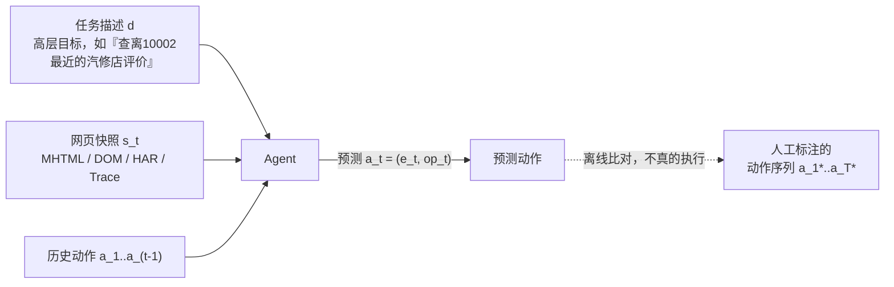
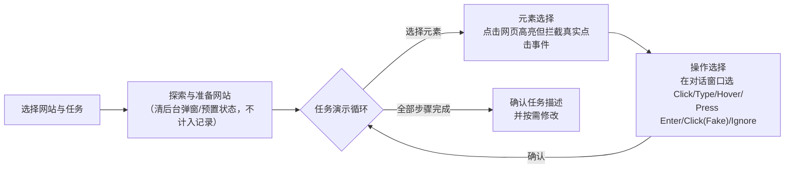

# Mind2Web：迈向 Web 的通才 Agent

> 组会汇报文档 · ~20 页 · 50 分钟组会级 · PPT 风格。忠于 arXiv 2306.06070v3（NeurIPS 2023 Datasets and Benchmarks Track）
> 原文，全篇数字均标注 §/Table/Figure/Appendix 出处；原文未给出的一律写明"原文未给出"，不编造。
> **特别说明**：原文正文里没有任何一个带编号的公式（无 `Eq.(n)`）——全部指标与模型机制都是用**散文**描述的。
> 为满足本库"公式前给直觉、符号先定义"的写作规范，本文档把这些散文描述**形式化**为公式，
> 每处都会明确标注"这是我基于原文散文描述的形式化"，不冒充原文本身就有编号公式。

---

## §1　TL;DR（一页讲清这篇在干嘛）

> 主讲提示：开场先立住"这是一篇数据集/benchmark 论文，不是方法论文"——它给整个 web-agent 子领域定义了"跨网站泛化"这把尺子该长什么样，MindAct 只是这把尺子配的第一根参照指针。

一句话：Mind2Web 是**第一个**面向"通才网页 agent（generalist agent for the web）"的数据集——从 **137 个真实网站**、**31 个域（domain）**里众包收集了 **2,350 条开放式（open-ended）任务**，每条任务配一段人工演示的**动作序列**（(目标元素, 操作) 对），并把网页在标注当时的完整快照（HTML/DOM/网络流量/交互轨迹）一并存下来，使任务可以**离线（offline）完整回放**（摘要；§2）。论文同时给出一个探索性基线 **MindAct**：面对真实网页动辄逾千个元素、塞不进 LLM 上下文这个硬伤，先用一个微调过的小语言模型（small LM）做候选元素排序过滤，再让大语言模型（LLM）在过滤后的候选里做**多选问答（multi-choice QA）**选出目标元素与操作（摘要；§3）。核心发现："即便在从未见过的网站甚至从未见过的整个域上，MindAct 也展现出一定水平的泛化能力，但距离真正通用的 agent 仍有巨大提升空间"（摘要改写）——最好的配置（Flan-T5-XL）任务级成功率在域内（Cross-Task）也只有 **5.2%**，跨网站/跨域进一步降到 **1–5%** 区间（Table 2）。

- **属于 harness 的哪一层（Θ1）**：本篇主战场是 **E 层（Environment）**——它不提出新的控制循环，也不提出复杂的工具协议，而是回答"通才 web agent 该在一个什么规模、什么真实度、什么任务颗粒度的世界里被训练和测量"。但它顺带给出了两个更下游层的早期雏形：**C 层**（§3.1 的候选生成，本质是一次"把千级元素的网页压缩进 LLM 上下文"的检索式上下文工程）和 **V 层**（§4.2 的 offline 逐步评测协议，元素定位准确率/操作 F1/成功率）。**T 层**很薄（只有 Click/Type/Select Option 三种原子操作，且是"回放标注动作"而非"实时执行"）；**L 层**几乎为空（评测时每一步都**喂真值历史**，agent 不需要、也不被允许自主决策多步循环——这是它后来被 WebArena/WebVoyager 反复点名批评的核心方法学软肋，见 §12、§20）。
- **权威性来源**：NeurIPS 2023 Datasets and Benchmarks Track 正式接收，OSU NLP Group（Yu Su / Huan Sun 实验室）出品，代码 MIT 协议开源、训练数据 CC BY 4.0 开源在 HuggingFace。本库内已有的 WebArena、WebVoyager、OSWorld、以及两篇综述（2507.13334、2308.11432）都直接引用了它的"137 网站 × 31 域 × 2000+ 任务"这组数字作为该子领域的标准参照系（详见 §21）。
- **本文带走的 3 条结论**：
  1. **"真实网站 + 开放式高层任务 + 跨百余站点"这套配方，是它对整个子领域最大的方法论馈赠**——在它之前，web agent 数据集要么困在简化仿真环境（MiniWoB++），要么困在一两个网站（WebShop），要么要求逐步低层指令（PixelHelp/MoTIF 一类）；Mind2Web 第一次把"任意网站、任意域、只给高层目标"这三条同时做到了（§1、Table 1）。
  2. **它把"能不能处理真实网页的规模"变成了一个必须先解决的工程问题**——真实网页平均 **1,135** 个元素（Table 1），MindAct 的核心贡献与其说是"更聪明的 agent"，不如说是"一套把千级元素压成 LLM 塞得下的候选集的检索管线"，这正是"harness 决定能不能做"的一次早期活教材（§14–§16，Θ2 核心）。
  3. **它的评测协议是"离线、逐步、给真值历史"的**——这个选择既是它能被大规模自动化评测的原因，也是它两年内被 WebArena/WebVoyager 正面点名批评"无法评估真正的多步自主执行、默认任务只有一条标准路径"的原因（§12、§20、§21，Θ4/Θ5 的核心张力）。

---

## §2　问题与动机：为什么现有数据集配不上"通才"二字

> 主讲提示：这页是 Why 三连的"问题层"。记住三个关键词——网站太少、假设太强、指令太细——它们各自对应 Mind2Web 随后交付的一个设计答案。

**研究问题（§1 原文改写）**：*我们如何构建一个通才网页 agent（generalist agent for the web）——给定任意网站，它都能听懂自然语言指令并完成对应任务？*

**Why（问题层）——不解决会卡住什么？**

论文开篇即给出愿景："网页几乎覆盖了数字世界的每一个角落……一个通才 agent 既能让日益复杂、学习曲线越来越陡的网络重新变得平易近人，也能把整个 web 变成一个前所未有的强大通用工具——例如可以作为 ChatGPT 的插件，直接在 HTML 网站上获取信息、执行操作，而不必只靠检索工具取内容，或依赖为每个 web 服务预先定义好的 API"（§1）。

论文进一步把"通才 agent"拆成三条**必要条件（desiderata）**（§1）：

1. **能在互联网上任意网站工作**：收集覆盖所有网站的训练数据不现实，因此 agent 必须能内在地泛化到训练时从未见过的网站，甚至从未见过的域。
2. **能在真实网站上工作，而真实网站是动态、复杂、有噪声的**：大多数现代网站会根据用户操作动态生成/渲染不同内容，这要求 agent 把每个网站建模为**部分可观测环境（partially-observable environment）**，而不是假设自己对环境有先验的完整知识；agent 也不该对环境做过强的简化假设，而要拥抱网站设计本身带来的全部复杂度乃至噪声。
3. **支持多样、复杂的网站交互**：用户任务可以高度多样，需要很多步才能完成（例如 Figure 1(b) 的任务需要 **14** 个动作）——只支持简单任务的 agent 提供的价值有限。

**已有工作的三宗罪（§1）**：论文指出，此前工作在以下三方面存在系统性缺陷，没有一个同时满足全部条件：
1. **只在有限、预先指定的网站集合上运行**（引用 [5,21,22,35,40]，即 Burns et al. 视觉导航数据集、Li et al. PixelHelp、Liu et al. MiniWoB++/WebShop 一类、Sun et al. META-GUI）；
2. **对网站做了过强的简化假设**（引用 [22,40]，即 MiniWoB++、WebShop）；
3. **只支持特定类型的任务，且/或要求用户提供繁琐的逐步指令**（引用 [21,22,40,39]）。

**后果**：LLM 已在具备良好泛化性/样本效率的复杂环境中展现出扎实的**接地语言理解（grounded language understanding）**能力（引用 [2,13,17,33]），把 LLM 当作通才 web agent 的候选方案是有希望的路径——但这条路径缺一个**足够好的数据集**来支撑开发与评测，而这正是本文的工作重心（§1）。

> **读出什么**：这三宗罪精确对应 Mind2Web 随后交付的三个设计答案——跨 137 网站 31 域（治"网站太少"）、真实网站而非仿真（治"假设太强"）、只给高层目标不给逐步指令（治"指令太细/任务太窄"）。下一节先给贡献总览，再逐条拆解怎么落地。

---

## §3　核心贡献与研究问题的一句话形式化

> 主讲提示：三句话记住这篇论文在交付什么；再给一眼"任务实例长什么样"的形式化，细节留到 §5–§13 逐节展开。

论文的贡献可压成三件事（摘要 + §1 末）：

1. **一个数据集**：MIND2WEB——2,350 条任务，来自 137 个真实网站、31 个域，每条任务配人工众包标注的动作序列（§2）。
2. **一个探索性方法**：MINDACT——利用 Mind2Web 训练数据构建的两阶段 LLM web agent 框架（§3）。
3. **一组实证发现**：LLM（微调的 Flan-T5 家族 + 上下文学习的 GPT-3.5/GPT-4）在三级泛化设置下的系统性评测结果与失败模式分析（§4）。

**任务实例的形式化**（据 §2.1 三段式定义整理，符号先定义、后用式）：

- $d$：**任务描述（task description）**——一句自然语言高层目标，故意不给低层步骤（如给"帮我查明天纽约的天气"而不是"在位置框输入纽约、点搜索、选明天标签"）；
- $\mathbf a = \langle a_1, \dots, a_T\rangle$：**动作序列（action sequence）**，$T$ 为该任务所需步数；每个 $a_i = (e_i, \mathrm{op}_i)$ 是一个 **(目标元素, 操作)** 对，$e_i$ 是当前网页上一个可交互的 DOM 元素，$\mathrm{op}_i \in \{\text{Click}, \text{Type}, \text{Select Option}\}$（Click 已把 Hover、Press Enter 并入），Type/Select Option 还需要一个附加的值参数 $v_i$；
- $\mathbf s = \langle s_1,\dots,s_T\rangle$：**网页快照（webpage snapshots）**，每一步一份，构成任务执行的环境，以 MHTML/DOM/HAR/trace 四种格式保存（细节见 §11）。

一条 Mind2Web 数据实例即三元组 $(d, \mathbf a, \mathbf s)$。agent 在开始时拿到 $d$；每一步拿到当前网页 $s_t$ 与此前动作历史 $a_1,\dots,a_{t-1}$，目标是准确预测下一步动作 $a_t = (e_t, \mathrm{op}_t)$（§2.1）。

> **读出什么**：这个三元组形式化和 WebArena 的四元组 $\langle\mathcal S,\mathcal A,\mathcal O,\mathcal T\rangle$（本库同组 canon，2307.13854）形似神不似——WebArena 的 $\mathcal T$ 是一个**真实可执行的转移函数**（agent 的动作真的会改变网站状态），而 Mind2Web 这里的 $\mathbf s$ 是**预先录制好的静态快照序列**，agent 的预测不会真的执行、也不会引发新的网页状态——这正是 §11、§12 要重点展开的方法论选择，也是它和 WebArena"同期而非承袭"却走向相反路线的分水岭。

---

## §4　相关工作定位：Mind2Web 和谁比、比赢在哪

> 主讲提示：这张表（原文 Table 1）是全篇"我们和前人差在哪"最直接的证据，逐列讲，别只念数字。

**Table 1（原表复现，§2.3）——与已有数据集的统计对比**：

| 数据集 | # 域 (Dom.) | # 环境 (Env.) | 环境类型 | 平均元素数 | # 任务 | 任务信息颗粒度 | 平均动作数 |
|---|---:|---:|---|---:|---:|---|---:|
| MiniWoB++ [22] | – | 100 | 简化的移动端网站 | 28 | 100 | 低层 | 3.6 |
| WebShop [40] | 1 | 1 | 简化的购物网站 | 38 | 12,000 件商品 | 高层 | 11.3 |
| RUSS [39] | – | 22 | 真实网站 | 801 | 80 | 高层+低层 | 5.4 |
| PixelHelp [21] | 4 | 4 | 移动 App | – | 187 | 高层 | 4.3 |
| META-GUI [35] | 6 | 11 | 移动 App | 79 | 1,125 段对话 | 高层 | – |
| MoTIF [5] | 15 | 125 | 移动 App | 188 | 756 | 高层+低层 | 4.4 |
| **MIND2WEB** | **5 / 31** | **137** | **真实网站** | **1,135** | **2,350** | **高层** | **7.3** |

**逐列读法（§2.3）**：
- **# 域**：Mind2Web 写成"5 / 31"——5 个顶级域细分出 31 个二级域（§2.2 详述），是表里域覆盖最细的一档。
- **# 环境**：137 个真实网站，仅次于 MoTIF 的 125 个移动 App，但环境类型是"真实网站"而非"移动 App"或"简化仿真"。
- **平均元素数**：**1,135**，是全表最高值的近 6 倍（RUSS 排第二，801）——这是 §14 起 MindAct 要专门解决的工程硬伤。
- **任务信息颗粒度**：Mind2Web 标"高层（High-level）"，与 RUSS/MoTIF 的"高层+低层"混合、MiniWoB++ 的纯"低层"形成对照——只给高层目标意味着 agent 必须自己做**任务分解与规划**，而不是被喂逐步指令。
- **平均动作数**：7.3，仅次于 WebShop 的 11.3，但 WebShop 的"12,000 件商品"本质是同一个购物流程在不同商品上的重复，而非任务多样性。

**§2.3 原文对三条差异化优势的总结**：(1) 跨 137 网站/31 域，可全面测试 agent 在多样环境下的泛化能力；(2) 使用真实网站、不做人工简化，环境复杂度远超以往研究，更贴近现代网页的真实纹理；(3) 引导标注者提出**开放式（open-ended）**任务以模拟真实网页使用，与此前"提供逐步指令、主要测试 agent 把低层指令翻译成动作"的设定相对——例如不给"在位置框输入 New York，点搜索按钮，选明天标签"，而是给"明天纽约天气如何？"，这对 agent 的**规划（planning）**与**接地（grounding）**能力提出了远高得多、但也更贴近真实的挑战（§2.3 原文）。

**§5 Related Work 的四条主题脉络**（补充定性梳理，非 Table 1 数字部分）：
1. **网页/移动应用自治 agent**：已有大量投入致力于自动化网页导航，但受限于能处理的任务/网站类型——要么困在简化仿真环境 [22,31,40]，要么局限在窄域窄网站集合 [39,40]；近期移动应用方向的工作 [5,21,35] 用了类似技术，但功能比全功能网站简单得多。
2. **网页自动化系统**（引用 Puppeteer [1] 等）：这类技术通常要求编程技能，可及性差；Mind2Web 想给网页自动化配一个自然语言接口，大幅降低门槛。
3. **接地语言理解（grounded language understanding）**：这条研究脉络致力于把自然语言映射为目标环境里的可执行计划；此前多围绕结构良好的 schema/本体展开（关系数据库 [36,43]、知识库 [12,42]），未必能反映真实世界更异质的条件；Mind2Web 把语言接地到**有噪声、无 schema 的网页环境**，也与具身智能（embodied AI，[2,32,33]）相连，但后者通常聚焦单一场景（如家居环境），多样性受限。
4. **工具学习（tool learning）**：Toolformer [29]、ReAct [41]（均为本库 B/C 组 canon）、ToolkenGPT [15] 等展示了 LLM 调用多种工具增强能力的潜力，但既有研究主要关注**短程工具调用**；Mind2Web 要求 LLM 在真实网页浏览环境里执行**长程决策序列**，填补了这块空白，也可能反过来刺激"用自然语言接口 web 的高级工具，再被另一个 LLM 用于更复杂问题求解"这类研究（§5 末段，引用 [11,30]）。

> **读出什么**：把 Table 1 和这四条主题脉络放在一起看，Mind2Web 给自己的定位很清楚——它不是在"多一个数据集"，而是在"把网页自动化、工具学习、接地语言理解三条此前分头走的研究线，在'真实、多样、高层、长程'这四个维度上第一次同时逼到极限"。

---

## §5　数据总览（big picture）：一条任务实例长什么样

> 主讲提示：先看 Figure 2 的具体例子，再抽象成组件图——具体例子最能让人"秒懂"这个数据集在标注什么。

**Figure 2 原图示例**——任务描述："Show me the reviews for the auto repair business closest to 10002."（帮我查离邮编 10002 最近的汽修店的评价），标注了 10 步动作序列：

| # | 目标元素 | 操作 |
|---:|---|---|
| 1 | [searchbox] Find | TYPE: *auto repair* |
| 2 | [button] Auto Repair | CLICK |
| 3 | [textbox] Near | TYPE: *10002* |
| 4 | [button] 10002 | CLICK |
| 5 | **[button] Search** | **CLICK**（触发跳转新网页） |
| 6 | [switch] Show BBB Accredited only | CLICK |
| 7 | [svg]（排序图标） | CLICK |
| 8 | [button] Sort By | CLICK |
| 9 | **[link] Fast Lane 24 Hour Auto Repair** | **CLICK**（触发跳转新网页） |
| 10 | [link] Read Reviews | CLICK |

Figure 2 同时给出 6 张关键步骤的网页截图（Action 1/2/5/6/9/10）与对应 HTML 片段，例如 Action 1 对应 `<input name="Find_text" type="search">`、Action 9 对应 `<a href="link:XXX">Read Reviews</a>`——**标红的第 5、9 步**会导致页面跳转到新网页，是任务执行中的关键转折点。

> **读出什么**：这一个例子把三件事一次性讲清楚了——① 任务描述是"高层目标"而非"操作指令"（没人告诉 agent 要先搜"auto repair"）；② 动作序列可以横跨多个网页（10 步里有 2 次页面跳转）；③ 操作类型很简单（全篇只有 TYPE 和 CLICK 两种，Select Option 未出现在这个例子里，但在数据集里普遍存在）——**真正的难度不在"操作词表大不大"，而在"每一步该点哪个元素"**，这正是 §14 起 MindAct 要解决的核心问题。

**任务实例三组件回顾**（对应 §3 的形式化）：

**数据采集的整体原则**（§2 开篇三条）：① 不在仿真里重建网站（易导致过度简化），而是直接与真实网站互动、采集环境快照；② 从多样域收集网站，众包真实任务，覆盖网站的广泛功能；③ 承认"完美复刻真实环境复杂度"本身很难，所以退而求其次——**尽力捕捉每个网站的完整快照与完整交互轨迹，使所有任务都能被无缝离线回放**，以支持鲁棒、实用的研究。

---

## §6　符号与术语表

> 主讲提示：后文统一用下表记号；再次强调——本文档的公式是"我基于原文散文描述的形式化"，原文本身没有编号公式。

| 记号 | 含义 | 首次出现 |
|---|---|---|
| $d$ | 任务描述 (task description)，高层自然语言目标 | §3 |
| $\mathbf a=\langle a_1,\dots,a_T\rangle$ | 动作序列 (action sequence) | §3 |
| $a_i=(e_i,\mathrm{op}_i)$ | 第 $i$ 步的 (目标元素, 操作) 对 | §3 |
| $e_i$ | 第 $i$ 步的目标 DOM 元素 (target element) | §3 |
| $\mathrm{op}_i\in\{\text{Click},\text{Type},\text{Select Option}\}$ | 第 $i$ 步的操作 (operation) | §3 |
| $v_i$ | Type / Select Option 操作附带的值参数 | §3 |
| $s_t$ | 第 $t$ 步的网页快照 (webpage snapshot) | §3 |
| $q_t$ | 第 $t$ 步的任务查询 = 任务描述 + 历史动作拼接 | §15 |
| $r(e)$ | DOM 元素 $e$ 的文本表示（标签+文本+属性+父子元素） | §15 |
| $k$ | 候选生成阶段保留的候选元素数（$k=50$） | §15 |
| $\mathcal A(e^*)$ | 与真值元素 $e^*$ 等价的"可接受元素"集合（Appendix C.1 启发式给出） | §12 |
| $N$ | 评测步骤总数 | §12 |
| $M$ | 评测任务总数 | §12 |
| ElemAcc / OpF1 / StepSR / SR | 元素定位准确率 / 操作 F1 / 步成功率 / 任务完成率（成功率） | §12 |

---

## §7　数据采集第一步：网站选择——5 顶级域 → 31 二级域 → 137 网站

> 主讲提示：这页讲"网站从哪来"。层级化+热度排序的抽样方法，是"跨 137 站"这个数字的真正来源，别一带而过。

**直觉**：既要覆盖面广（避免"只测电商"这种单一场景偏见），又要保证抽出来的网站真的是人们会用的（避免抽到无人问津的冷门站）——于是用"先分层、再按真实热度筛"的两级抽样。

**做法（§2.2 Website Selection）**：
1. 从 **5 个顶级域**起步：Travel（旅行）、Shopping（购物）、Service（服务）、Entertainment（娱乐）、Information（信息）；
2. 把每个顶级域进一步拆分为若干**二级域**，合计 **31 个二级域**（如 Travel 下有 Airlines/Hotel/Restaurant/Car Rental/Ground/Other 等）；
3. 在每个二级域内，依据 **similarweb.com** 给出的美国区流量排名，人工挑选 **3–5 个代表性网站**；
4. 最终汇总为 **137 个网站**。

**Figure 1 域分布树图（原图数字）**：

| 顶级域 | 占比 | 部分二级域示例（原图可辨读部分） |
|---|---:|---|
| Travel（旅行） | 27.4% | Other 6.2%、Airlines 5.8%、Restaurant 4.3%、Ground 3.7%、Car Rental 2.4%、Hotel 1.8% |
| Information（信息） | 20.4% | Housing 3.7%、Job 3.5%、Social Media 3.5%、General 3.1%、Education 2.8%、Finance 2.7%、Cooking 1.9% |
| Service（服务） | 18.3% | Health 6.5%、Government 3.4%、Home Service 2.5%、Pet 2.1%、Shipping 1.8%、Moving 1.7% |
| Shopping（购物） | 17.5% | Speciality 5.0%、General 3.3%、Auto 3.4%、Digital 2.3%、Department 1.6%、Fashion 1.6% |
| Entertainment（娱乐） | 16.1% | Event 3.8%、Music 3.5%、Sports 3.5%、Movie 3.2%、Game 2.0% |

（五个顶级域占比合计 99.7%，误差来自图中取整；二级域列表仅摘录图中可辨读的主要类目，31 个二级域的完整枚举原文未以文字形式单独列出，只见于 Figure 1 树图本身。）

**Why（设计层）——为什么不是"研究者凭经验挑几个知名网站"？**
> 朴素做法是像很多早期工作那样，研究者凭直觉/文献惯例挑几个"看起来有代表性"的网站（如只测 Amazon、Google）。→ 覆盖面窄，且容易带主观偏见，测出来的"agent 能力"很可能只是"在这一小撮网站上的熟练度"。Mind2Web 改用"顶级域→二级域→网站"的层级化流量排名抽样，至少在**域覆盖广度**上有系统性保证；**代价**是仍然依赖 similarweb.com 这一个第三方热度口径，且"3–5 个代表性网站/二级域"的具体网站仍是人工选定，选择标准本身原文未给出更细的量化规则（如"取流量前 N 名"还是"人工综合考量"）——这是一处"过程有系统性框架、但最后一步仍有人工判断"的方法学边界，如实记录。

> **读出什么（呼应本库 WebArena 报告的对照）**：WebArena 选网站类别的方法是"分析约 200 条**作者自己**的浏览器历史"（本库同组报告 §4 已指出这个方法的样本偏向"CMU 研究者的数字生活"）；Mind2Web 换了一条路——**用第三方真实流量数据代替个人历史**，覆盖面更系统，但反过来失去了"这是真实用户实际点过的具体任务流程"这层保证，两者是同一个"如何科学选场景"问题的两种不同权衡，值得对照着读。

---

## §8　数据采集第二步：任务构造——ChatGPT 种子任务 + 众包三准则（★核心 Why 三连）

> 主讲提示：这是全篇"逼真测泛化能力，代价是标注贵"这条 Why 三连最集中的一页，务必讲透——它直接决定了"跨 137 网站开放式任务"这句话背后是多大的工程/资金投入。

**任务提出（Task Proposal，§2.2 + Appendix B.2）流程**：
1. 每个 HIT（Human Intelligence Task）里，先请标注者选定一个感兴趣的目标网站；
2. 呈现该网站的简要描述，以及**10 条**由 ChatGPT 生成的种子任务（seed tasks）——每个网站预先生成 **50 条**种子任务备用，每次随机抽 10 条展示；
3. 标注者被要求提出**最多 5 条额外任务**，且**明确被指示不得直接复制**种子任务；种子任务的作用仅是"激发灵感"；
4. 提交的任务由作者人工复核，剔除质量低或与已收录任务高度雷同的提案；
5. 一旦某网站累计收集到约 **20 条**任务，即停止向标注者展示该网站，以保证网站间任务分布的均衡与整体多样性（Appendix B.2）。

**任务须满足的三条准则（§2.2 Task Proposal）**：标注者被要求提出**开放式（open-ended）且真实（realistic）**的任务，需同时满足——
1. **类型多样**（diverse types）；
2. **要求多轮交互**（require multiple rounds of interaction）；
3. **描述高层目标而非逐步指令**（describe the high-level goal instead of step-by-step instructions）。

**Table 3（ChatGPT 种子任务生成提示词，原表复现要点）**：提示词要求 ChatGPT 针对给定网站给出 5 条示例任务，并附四条硬性规则——每条任务是单句而非"点击某元素"式描述；不给逐步指令、不直接点名要交互的元素；描述目标并提供具体信息/约束；用编造但具体的信息（身份、号码、日期等）让任务更"真实"。示例产出（针对 aa.com 美国航空官网）如："以 jane smith 的名义，找回一笔从达拉斯(DFW)飞往迈阿密(MIA)、1月20日出发的预订确认号"（Table 3 原文改写）。

**报酬结构（Appendix B.2）**：每条任务提案给 **$0.05** 的名义奖励（无论最终是否被采纳都发放）；被采纳并成功完成演示的任务，标注者获得完整的 **$0.80** 报酬。

**Why（设计层）——这条 Why 三连正是本篇留给全库最该记住的一条**：
> 朴素做法 A：在少数几个网站（比如就测一个电商站）上狂标海量任务，或者干脆退回 MiniWoB++ 那样的**简化仿真**页面——这样便宜、标注快、结果好复现。→ 但测出来的"agent 能力"实质是"agent 对这一个网站/这一类简化页面的熟练度"，模型很容易拟合的是网站的**特异性（idiosyncrasies）**而非"看懂任意网页、执行任意任务"这件事本身——**单网站/受限任务的评测天然不测泛化**，agent 换到没见过的网站可能直接抓瞎，但这在"单站"设置里根本无法被观察到。
> Mind2Web 反过来选择跨 **137 个真实网站、31 个域**，且任务**开放式**（不给低层步骤）——代价是**标注贵得多**：需要为每个网站单独招募标注者构思任务、亲手在真实网页上演示动作、再由作者人工复核（§2.2、Appendix B），2,350 条最终任务背后是数以百计的 Amazon Mechanical Turk 工作者在**137 个不同网站**上的真实浏览器操作，每一条任务从提案到验证要经过"ChatGPT 启发→人工提案→作者初筛→Playwright 工具演示→作者终审"至少五道关卡（§2.2）。
> 换来的是什么：**跨网站 (Cross-Website)、跨域 (Cross-Domain) 这种"网站/域从未见过"的分布外 (out-of-distribution, OOD) 评测切分，在方法论上第一次真正站得住脚**（§4.1，详见 §13）——因为只有当训练集和测试集本身就横跨了几十上百个彼此独立、真实存在的网站时，"泛化到陌生网站"才是一个可以被诚实测量的问题，而不是"泛化到我们仿真引擎里预设的下一个关卡"。这正是"跨 137 网站开放式任务→逼真测泛化能力，代价是标注贵"这条设计取舍的完整账单。

> **读出什么**：这套"种子任务启发但禁止照抄 + 名义奖励与完整奖励分离 + 单站任务数量上限"的众包设计，本身就是一份"如何低成本又不失多样性地采集众包任务"的可复用配方，值得在 Inspires-Us 里单独拎出来（见后文 a 条）。

---

## §9　数据采集第三步：任务示范——Playwright 标注工具与"假点击"安全机制

> 主讲提示：这页讲"动作序列是怎么被人手把手教出来的"。Click (Fake) 这个小设计值得停留——它是整个数据集里唯一直接触碰"安全"议题的地方。

**工具形态（§2.2 Task Demonstration + Appendix B.3，Figure 7）**：作者基于 **Playwright**（微软的浏览器自动化框架）开发了专用标注工具，界面为左右两个窗口——左侧**对话窗口**是标注者的控制面板（引导交互流程、选择操作），右侧**浏览器窗口**供标注者在真实网页上浏览、点选元素。

**整体流程（Figure 8）**：

**两阶段动作标注（每一步）**：① **元素选择**——标注者在浏览器窗口里点击目标元素，工具高亮该元素但**拦截真实点击事件**；② **操作选择**——标注者随后在对话窗口里为该元素选择要执行的操作。

**六种可选原始操作 → 归并为数据集里的三种（§2.2、Appendix B.3）**：
- `Click`、`Hover`、`Press Enter` → 在最终数据集里统一记为 **Click**（消歧简化）；
- `Type` → 需要标注者额外提供要输入的文本值（Figure 9）；若所选元素是 `<select>`，`Click` 会被自动转换为 **Select Option**，并弹出选项列表供标注者选择（Figure 10）；
- **`Click (Fake)`**：一个特殊操作——记录方式与普通 Click 完全相同，但**不会在浏览器里真正执行**。专门用于防范**有副作用的状态变更类动作**（如发帖评论、预约挂号），避免标注过程真的干扰网站上的其他真实用户；未来若模型预测出 `Click (Fake)` 对应的动作，系统可以在真正执行前先向用户请求确认。
- **`Ignore`**：标注者选错元素时用来撤销/忽略这次误选。

**弹窗与 CAPTCHA 的处理（Appendix B.3 "Pop-ups and CAPTCHAs"）**：为保证清晰、直接的任务执行动作，标注前的"探索阶段"**不计入记录**，主要用来让标注者熟悉网站、预先关闭弹窗/清除验证码，为正式演示准备一个干净的初始状态；标注者被进一步引导，在正式演示时不做关广告一类的多余动作。作者也承认，"这类交互确实是真实动态网络环境的重要组成部分，如何让系统在实战中稳健应对，是未来研究一个有趣的方向"（Appendix B.3 原文改写）——即 Mind2Web **有意排除**了 CAPTCHA/弹窗这类噪声，而非声称自己已经解决了它们。

**Why（设计层）——为什么不让标注者直接在浏览器里自由操作、事后再录屏解析？**
> 朴素做法是让标注者像平时上网一样自由操作，事后用某种自动化脚本从录屏/DOM diff 里反推动作序列。→ 会引入大量歧义（到底点的是按钮还是按钮里的文字 span？中途的探索性点击算不算任务的一部分？）。Mind2Web 改用"元素选择 + 操作选择"两阶段、且拦截真实点击事件的强制交互协议，用工具在**标注的当下**就把每一步动作结构化，避免了事后解析的歧义（§2.2 描述改写），代价是标注流程更繁琐、标注速度更慢——这与 §10 的作者终审成本是同一枚硬币的两面。

> **读出什么（安全侧连接）**：`Click (Fake)` 这个不起眼的小机制，是全篇里唯一直接触碰"agent 执行有副作用/不可逆动作前该不该先确认"这一安全议题的地方——它比"UI 层要不要加确认弹窗"的产品讨论早了两三年，且做法很朴素（标注阶段直接不执行），值得与本库 H 组（可靠性/安全）的沙箱与恢复机制类论文对照读（见 Inspires-Us d 条）。

---

## §10　数据采集第四步：任务验证 + 最终数据统计

> 主讲提示：这页把"标注质量怎么把关"和"最终数字从哪来"讲清楚，为后面读 Table 1/Table 2 打好账目基础。

**任务验证（Task Verification，§2.2 + Appendix B.4，Figure 11）**：所有任务演示都要经过作者的**二次复核**，共三项检查：
1. **是否应整体丢弃**——因质量过低；
2. **逐步审查动作是否应被丢弃**——检查任务的起止点是否一致、干净（如排除关闭弹窗一类的多余动作；若任务是"查找某商品"而未要求点进商品详情，则允许在搜索结果页结束标注）；
3. **任务描述是否准确反映了全部动作**——必要时由作者修改任务描述以对齐标注到的动作。

若某个动作的归属存在不确定性，复核者可以选择"unsure（不确定）"选项，交由第一作者做最终裁定（Appendix B.4）。

**最终数字（§2.2 结尾段）**：初始收集 **2,411** 条任务演示，验证后剔除 **61** 条，保留 **2,350** 条；在保留的任务中，**390** 条的任务描述被修改以更好对应标注到的动作，**187** 条被剔除了多余步骤。

**众包细节（Appendix B.1）**：标注者从 Amazon Mechanical Turk 招募，要求**至少 1,000 个已批准 HIT**、批准率 **≥98%**；按俄亥俄州最低工资标准设计报酬，预估时薪约 **$10.10**；不采集任何可识别的个人隐私信息，标注环境为安全的远程沙箱；研究符合 OSU 负责任研究实践办公室的 IRB 豁免标准，所有标注者需先同意知情同意书。上岗前需完成培训文档、视频教程、资格问卷与一系列测试性演示。

**最终数据集统计（回顾 Table 1 Mind2Web 行）**：**137** 个网站、**31** 个域（5 个顶级域细分）、**2,350** 条任务、平均每页 **1,135** 个元素、平均每条任务 **7.3** 步动作。

> **读出什么**：把 §8 的报酬结构（$0.05 提案 + $0.80 演示）、§9 的两阶段强制交互协议、这里的二次人工复核三件事串起来看，"2,350 条高质量、跨 137 站、开放式任务"这个数字的背后，是一条相当"重"的人工众包流水线——这正是 §8 Why 三连里"代价是标注贵"的具体注脚：论文没有给出总标注成本的美元数字（**原文未给出**总花费），但从"每条任务最高 $0.85（提案+演示）× 2,411 条初始演示"可以推算，仅演示环节的直接报酬下限就在 **2,000 美元量级**（这是本文按公开报酬结构做的粗略推算，非原文给出的数字，且未计入标注者培训、资格测试、作者复核的人力成本）。

---

## §11　网页快照：四种格式与"离线可回放"哲学

> 主讲提示：这页讲"环境到底存了什么"，是理解 §12 offline 评测协议为什么长这样的前提。

**四种快照格式（§2.1 Webpage snapshots）**：
1. **MHTML 文件**——自包含的原始网页 HTML 代码；
2. **DOM 快照**——DOM 树连同渲染网页截图的布局/样式信息；
3. **HAR 文件**——完整的网络流量记录，用于在需要时重放交互；
4. **Trace 文件**——标注过程中的完整交互轨迹。

四种格式面向不同的建模路线（纯文本/HTML 解析、视觉/截图、网络层面重放、交互序列建模）预留了接口，MindAct 本身**只用了文本表示**（DOM/HTML），截图与网络流量在本文的方法里**未被使用**，但已经完整包含在数据集中，为未来的多模态/在线探索研究铺路（§2.1、§6"Use of Multimodal Information"）。

**Why（设计层）——为什么不像 WebShop 那样直接重建一个简化的仿真网站，也不像 WebArena 那样自建一套可实时执行的真实开源软件，而是"录一份真实网站的静态快照"？**
> 朴素方案 A（仿真重建）：像 WebShop、MiniWoB++ 那样，用简化的仿真网站承载任务。→ §2 开篇已经点出——"重建仿真网站，往往导致过度简化的环境"，agent 学到的是仿真引擎的分布，而非真实网页的分布。
> 朴素方案 B（自建可执行真实站点，即一个月后 WebArena 的选择）：用真实开源软件（如 Magento/GitLab）承载每类网站，让环境**真的可执行、可重置**。→ 这条路线换来"动态、可复现"，但要为每一类任务**从零构建/托管**一整套生产级软件系统，覆盖的网站类别注定有限（WebArena 最终只做了 4 类网站）。
> Mind2Web 的选择：直接**采集真实生产网站在标注当下的完整快照**（HTML/DOM/网络流量/交互轨迹），使任务可以**离线（offline）完整回放**——好处是可以在**几乎不受限的网站范围**（137 个真实生产站点，覆盖 31 个域）内采集数据，不必为每一类网站单独开发/维护一套可执行的替代实现；**代价**是网页一旦被固定为快照，就失去了"真的被点击后会不会产生新状态"这种动态反馈——这正是 §12 评测协议、以及 §20/§21 里 WebArena/WebVoyager 对它最核心的方法学批评的根源。

> **读出什么**：把这条选择和 WebArena 并排看，能看出 2023 年年中的 web-agent 环境设计其实分出了两条路——"**广度优先**：真实网站快照，覆盖上百个域/站点，代价是静态"（Mind2Web）与"**深度优先**：真实可执行网站，代价是覆盖窄"（WebArena，4 类网站）。这不是谁更"正确"，而是两种在"覆盖面 vs 动态可执行性"这条轴上的不同取舍——正是本库反复强调的"regime 诚实"（Θ5）在环境设计层面的一次具体体现。

---

## §12　评测协议与指标定义式（★核心）

> 主讲提示：这是全篇最该讲透的一页——先把"offline 逐步评测、给真值历史"这个协议本身的含义讲清楚，再逐个上指标定义式。每个定义式都请留意：原文只有散文描述，公式是本文档的形式化。

**预处理：从 1,135 到 580 个元素（§4.2 Data Preprocessing）**

真实网页平均 1,135 个元素，直接塞给 LLM 既不可行也太贵。论文先用一套**简单启发式规则**清洗原始 HTML——只保留可见、且依据属性/文本内容/邻近元素判断"携带实质语义信息"的元素——把平均元素数从 **1,135** 压到 **580**，同时在训练数据上保持 **94.7%** 的目标元素召回率（recall，即真值元素仍在清洗后的 580 个候选里的比例）。

> **读出什么**：这是整条评测/建模管线里**第一道过滤阀**——它不是 MindAct 的一部分，而是所有后续方法共享的预处理步骤；它已经用 5.3% 的召回损失换取了约一半的元素数缩减，是后文 §15 候选生成阶段之前的"前置折扣"。

**离线、逐步、给真值历史——评测协议的核心设定（§4.2 原文关键句）**

> 原文："Each step of the task is evaluated independently with the ground truth action history provided."（每一步任务都被**独立**评测，且给定**真实的**历史动作。）

这句话是理解本节所有指标含义的关键：在评测第 $t$ 步时，模型看到的历史 $a_1,\dots,a_{t-1}$ **不是模型自己此前的预测**，而是**标注者当年演示的真值动作**——也就是说，这是一种类似 NLP 里"teacher forcing"的评测方式：无论模型在第 3 步猜没猜对，第 4 步都会被"扳回"到标注者的真实历史再重新评测。

> **读出什么（这点极其重要，直接预告 §20/§21 的批评线）**：这意味着 Step Success Rate 和"任务完成率"衡量的其实是——"**假设执行到目前为止完全正确，模型能否在这一步猜中标注者当年选的那一步**"，而**不是**"模型能否从头到尾自主、不依赖任何外部提示地闭环完成整个任务"。这是一种**开环（open-loop）/静态回放式**评测，不是**闭环（closed-loop）**的真实执行评测。它的好处是评测**可完全自动化、可大规模并行、不受网站状态漂移影响**；代价是它结构性地**回避了"一步错步步错"的错误累积问题**，也**假设了每个任务只有标注者演示的这一条"标准路径"是对的**（下文马上会看到，元素层面的"多解"被部分修复，但路径层面的"多解"没有）。

**多解问题的部分修复：可接受元素集合 $\mathcal A(e^*)$（Appendix C.1）**

真实网页上常有多个元素能引发同样效果（例如一个按钮里包住一段文字 span，点按钮和点文字效果相同）。为增强评测鲁棒性，论文设计了一套启发式：先检查真值元素 $e^*$ 的祖先节点，找到**离真值元素最近、且本身可点击的上层元素**（包括其自身）作为"顶层可接受元素"；再把该顶层元素**渲染后的包围盒（bounding box）范围内、所有可见的后代元素**一并纳入可接受集合。作者对 100 个"启发式判定出的顶层元素不同于原始真值标注"的实例做了人工抽查，确认该方法有效（Appendix C.1）。

**指标定义式（原文均为散文描述，公式为本文档基于 §4.2 原文的形式化，符号先定义、后用式）**

*直觉*：先看"这一步点没点对地方、填没填对内容"（Element Accuracy + Operation F1），再看"这一步算不算完全正确"（Step Success Rate，两者的合取），最后看"一整条任务是否从头到尾每一步都对"（Success Rate，对所有步骤取合取）——这是一条**由细到粗、层层收紧**的指标链条。

符号：$N$ 为参与评测的步骤总数，$\hat e_i$、$\hat{\mathrm{op}}_i=(\hat{\text{type}}_i,\hat v_i)$ 分别为模型在第 $i$ 步预测的元素与操作，$e_i^*$、$\mathrm{op}_i^*=(\text{type}_i^*,v_i^*)$ 为对应真值。

- **元素定位准确率（Element Accuracy, ElemAcc）**——预测元素是否落在可接受集合内：
$$
\mathrm{ElemAcc} = \frac{1}{N}\sum_{i=1}^{N} \mathbb 1\big[\hat e_i \in \mathcal A(e_i^*)\big]
$$

- **操作 F1（Operation F1, OpF1）**——操作类型必须先匹配；若类型是 Click（无值参数），退化为准确率；若类型是 Type/Select Option，则对预测值 $\hat v_i$ 与真值 $v_i^*$ 计算 token 级 F1（precision/recall 的调和平均，做法与抽取式问答里的 SQuAD F1 一致）：
$$
\mathrm{OpF1}_i =
\begin{cases}
0, & \hat{\text{type}}_i \neq \text{type}_i^*\\[2pt]
1, & \hat{\text{type}}_i=\text{type}_i^*=\text{Click}\\[2pt]
\mathrm{F1}_{\text{token}}(\hat v_i, v_i^*), & \hat{\text{type}}_i=\text{type}_i^*\in\{\text{Type},\ \text{Select Option}\}
\end{cases}
\qquad
\mathrm{OpF1}=\frac1N\sum_{i=1}^N \mathrm{OpF1}_i
$$

- **步成功率（Step Success Rate, StepSR）**——一步"成功"要求元素**和**操作**同时**正确（§4.2 原文："A step is regarded successful only if both the selected element and the predicted operation are correct."）：
$$
\mathrm{StepSR} = \frac1N\sum_{i=1}^N \mathbb 1\big[\hat e_i\in\mathcal A(e_i^*)\big]\cdot \mathbb 1\big[\mathrm{OpF1}_i = 1\big]
$$
（**原文未进一步给出**：当 $0<\mathrm{OpF1}_i<1$ 即操作值部分匹配时，是否仍计入"操作正确"的精确阈值——本文按最直接的读法呈现为 $\mathrm{OpF1}_i=1$ 的合取判据，这一颗粒度原文没有更细的说明，如实标注，不代原作者猜测。）

- **任务完成率（Success Rate, SR）**——对一整条任务，要求**全部步骤都成功**才算成功，是全篇最严的指标：
$$
\mathrm{SR} = \frac1M\sum_{j=1}^{M}\ \prod_{i\,\in\,\mathrm{steps}(j)} \mathbb 1[\text{第 } i \text{ 步成功}]
$$
其中 $M$ 为任务总数。原文明确点出："任务只有在全部步骤都成功时才算成功。因此这是一个**严格（stringent）**的指标"（§4.2 原文）。

**候选生成阶段的召回率（Recall@k，用于评估 §15 的检索质量，也是本文形式化，非原文编号公式）**：
$$
\mathrm{Recall@}k = \frac1N\sum_{i=1}^N \mathbb 1\big[e_i^*\in \mathrm{Top}\text{-}k(\text{第 } i \text{ 步排序结果})\big]
$$

**Why（设计层）——为什么用"合取式（AND）"而不是"部分给分"？**
> 朴素做法是给每一步、每个任务算一个连续的相似度/重合度平均分（比如"平均命中了多少步"），这样分数会更平滑、更容易看出"进步了一点点"。→ 会让"一个 agent 每步都对了一半"和"一个 agent 前面几步全对、最后一步差一点"看起来分数相近，但**后者在真实世界里往往是唯一有意义的结果**（比如填完整张订票表格、最后一步没点提交，整个任务就是白做）。Mind2Web 用**逐步合取**（StepSR 要求元素+操作同时对）和**任务级合取**（SR 要求全部步骤都对）两层"严格 AND"，代价是数字看起来非常"惨"（Table 2 里 SR 经常是 0.0%–7.1%），但换来的是**分数不会被"看似进步、实则没有真正端到端可用"的部分正确性稀释**——这与本库 G 组标杆 Harness-Bench 用"乘法 + 安全硬闸门"防止刷分（§6，"高聚合分 ⟺ 真做完 ∧ 没越权 ∧ 过程稳"）是同一种设计哲学的早期版本。

---

## §13　三级泛化评测切分：Cross-Task / Cross-Website / Cross-Domain

> 主讲提示：这是 Mind2Web 对整个子领域最有生命力的方法论贡献之一——"泛化"不是一个笼统的词，而是可以拆成三个独立可测的轴。

**直觉**：模型在陌生场景下表现差，到底是因为"没见过这个具体任务的措辞"，还是"没见过这个网站的界面/交互逻辑"，还是"连这整个业务领域的概念都没见过"？——把训练/测试的切分方式设计成三种不同的"留出（hold-out）"粒度，就能把这三种"陌生"分开测。

**三个测试集的精确定义（§4.1）**：

| 切分 | 留出粒度 | 规模 | 含义 |
|---|---|---:|---|
| $\mathrm{Test}_{\text{Cross-Task}}$ | 从剩余数据中随机切 20%，**不管**域或网站 | 252 条任务，来自 69 个网站 | 模型训练时见过同一网站的网页、也很可能见过类似任务，只是任务本身没见过 |
| $\mathrm{Test}_{\text{Cross-Website}}$ | 剩余每个顶级域各抽 10 个网站 | 177 条任务 | 训练时从未见过这些具体网站，但见过同域的其它网站与相似任务 |
| $\mathrm{Test}_{\text{Cross-Domain}}$ | 整体留出两个顶级域：**Information、Service** | 912 条任务，来自 73 个网站 | 训练时完全没见过这两个域下的任何网站或任务 |
| 训练集 Train | 上述留出后的剩余数据 | 1,009 条任务，来自 73 个网站 | —— |

（四者任务数之和 252+177+912+1,009 = 2,350，与 §10 的最终任务总数完全吻合，可作为读数正确性的自检。）

**Why（设计层）——为什么是三级，而不是一个笼统的"留出测试集"？**
> 朴素做法是像大多数数据集一样，随机切一个测试集完事——这样操作简单，但**测不出"陌生的是任务、网站、还是整个领域"**，一个模型可能在"随机切分"的测试集上表现很好，只是因为它偷偷记住了同一个网站的界面布局，而不是真的学会了"看懂任意网页"这件事。Mind2Web 把留出粒度拆成三档（任务级 / 网站级 / 域级），**代价**是需要更精细地设计数据切分与网站/域配额（并因此进一步推高了 §8 里"要覆盖足够多网站/域才能三路都切得动"的标注成本），但换来的是一把能**分别诊断三种泛化能力**的尺子——这正是"逼真测泛化能力"这句话在评测协议层面的具体落地，而不只是"网站数字大"这一件事。

> **读出什么（预告后文的核心发现）**：正因为有这三级切分，Mind2Web 才能测出一个此前没人系统验证过的现象——**Cross-Website 和 Cross-Domain 的表现出奇地接近，反而都显著低于 Cross-Task**（§4.3、Figure 6）。如果只有"随机切分 vs 留出切分"两档，这个"网站级泛化差距≈域级泛化差距"的细粒度发现根本无法被观察到——这是三级切分设计本身带来的独有分析能力，具体数字见下节。

---

## §14　MindAct 架构：候选生成 + 动作预测两阶段设计

> 主讲提示：前面 §5–§13 全在讲"怎么造出这批数据、怎么评它"；这一节回到"论文自己提出的 baseline agent 长什么样"——因为下一节 Table 2 里那些数字都是这套架构跑出来的，不先讲清楚"打分的是谁"，表格就是天书。

**直觉**：一张真实网页清洗后还有 580 个候选元素（§12），直接把 580 个元素的完整 HTML 塞进 LLM 的 prompt 里，既超预算又会让模型在海量无关噪声里迷失。MindAct 的答案是"先用一个便宜的小模型粗筛，再让贵的大模型在小范围里精选"——一个典型的**检索-精排两阶段**范式。

**阶段一・候选生成（Candidate Generation，§3.1）**：
- 骨架：DeBERTa-v3-base（86M 参数，Cross-Encoder 架构，来自 Sentence-Transformers 库）（Appendix C.2）。
- 输入构造：把「任务描述 + 历史动作」拼成一条 query，把每个候选 DOM 元素表示为「标签 + 文本内容 + 关键属性 + 父/子元素的文本」（Figure 4）。
- 训练：query 与真值元素配对为正例，网页上随机采样其它元素为负例，过 sigmoid 输出匹配分，用二元交叉熵优化；推理时给页面上全部候选元素打分，取 top-50 送入阶段二。
- 效果（§4.3 开头）：Recall@50 在三个切分上分别是 **88.9% / 85.3% / 85.7%**（Cross-Task / Cross-Website / Cross-Domain）——真值元素有 11%–15% 的概率在第一阶段就被漏筛，这是全链路的隐藏天花板：阶段二无论多强，也救不回阶段一漏掉的元素。

**阶段二・动作预测（Action Prediction，§3.2）**：
- 用阶段一的 top-50 候选**裁剪**网页快照，只留选中元素 + 其邻居节点，构造一段"够小、够相关"的 HTML 片段作为 LLM 输入。
- 核心设计决策：把"选出目标元素"从**直接生成**（autoregressive generation，直接吐出目标元素的完整描述）改造成**多选题（multi-choice QA）**——每次给模型呈现 5 个候选 + 1 个 "None of the above"，模型只需要吐出一个选项字母（Figure 5）。
- 推理时的分批机制：50 个候选按 5 个一组分批问，若某一轮里不止一个候选被选中，就把这些"幸存者"重新分组再问一轮，直到收敛到唯一元素，或者所有组都被判为 None（§3.2 末段）。

**Why（设计层）——为什么是"多选 QA"而不是"直接生成目标元素"？**
> 朴素做法（论文自己也跑了这个 baseline，即下节 Table 2 里的 "Generation" 行）是让 LM 直接把目标元素的完整描述文本生成出来，这样看起来更"端到端"、不需要设计选项格式。→ 但结果很难看：Generation 基线在 Cross-Task 上 Element Acc 只有 **20.2%**，甚至**不如**更小、更简单的 Classification 基线（**26.8%**，§4.3："自回归生成公式表现不佳，即使模型更大（Flan-T5B 220M）也不如分类基线"）——本质原因是生成任务的输出空间是整个词表的自由组合，而正确答案必须**逐字符精确匹配**网页上真实存在的某个元素描述，容错率极低。→ MindAct 把问题转成多选 QA 后，同样量级的 backbone（Flan-T5B）直接把 Cross-Task Element Acc 从 20.2% 拉到 **43.6%**（+23.4 个百分点），代价是需要设计"分批问、多轮收敛"这套推理时的额外机制，但换来的是**把"生成一个字符都不能错的字符串"这一几乎不可能的任务，退化成"在有限选项里做判别"这一 LLM 擅长得多的任务**。

**Why（设计层）——为什么是两阶段而不是一步到位直接对全网页做多选 QA？**
> 朴素做法是跳过候选生成阶段，直接把全部 580 个元素都塞进多选题选项里让 LLM 一次选完。→ 会立刻撞上下文长度和成本的双重上限，且"选项越多，多选题越难"是选择题类任务的普遍规律。→ MindAct 用一个便宜的 DeBERTa 先把 580 压到 50（Recall@50 ≈ 85–89%），代价是引入了阶段一漏筛导致的**硬天花板**，但换来的是**让昂贵的 LLM 只需要在一个数量级更小、噪声更低的候选集里做判别**——这正是本库 D 组（记忆/上下文工程）反复出现的"先粗筛后精排"范式在 Web Agent 场景的一个早期实例。

---

## §15　主结果：Table 2 全表解读 + 三级泛化的核心发现

> 主讲提示：这是全篇最重要的一张表，务必按行、按列对照着讲，因为它同时回答了"哪种方法架构更好"和"三级泛化到底差多少"两个问题。表格数字已按原文 Table 2 逐行核对（区分 "MindAct" 组标签行与其下 5 个 backbone 子行，避免因排版误读串行）。

**Table 2（§4.3）核心数字**（Step SR / SR，即"逐步合取"成功率与整任务成功率，单位 %）：

| 方法 | Cross-Task Step SR | Cross-Task SR | Cross-Website Step SR | Cross-Website SR | Cross-Domain Step SR | Cross-Domain SR |
|---|---:|---:|---:|---:|---:|---:|
| Classification（DeBERTaB 直接分类） | 原文未给出 | 原文未给出 | 原文未给出 | 原文未给出 | 原文未给出 | 原文未给出 |
| Generation（Flan-T5B 直接生成） | 17.5 | 0.0 | 11.0 | 0.0 | 11.9 | 0.4 |
| MindAct w/ Flan-T5B | 41.0 | 4.0 | 29.5 | 1.7 | 31.6 | 1.6 |
| MindAct w/ Flan-T5L | 50.3 | 7.1 | 35.3 | 1.1 | 37.3 | 2.7 |
| MindAct w/ Flan-T5XL | **52.0** | 5.2 | **38.9** | 5.1 | **39.6** | 2.9 |
| MindAct w/ GPT-3.5（3-shot ICL） | 17.4 | 0.8 | 16.2 | 0.6 | 18.6 | 1.0 |
| MindAct w/ GPT-4（3-shot ICL，50 任务子集） | 36.2 | 2.0 | 30.1 | 2.0 | 26.4 | 2.0 |

（Classification 基线结构上无法预测 operation，原表 Op.F1/Step SR/SR 三列留空，只报 Element Acc=26.8/21.6/24.5；这不是数据缺失，是架构性限制——分类头只能选元素、选不了操作，故此处按规范标"原文未给出"而非编造数字。）

**读出什么·发现一：微调模型的规模效应符合直觉，但天花板很低**。Flan-T5B→L→XL 参数量从 220M 一路到 3B，Step SR 稳定爬升（Cross-Task: 41.0→50.3→52.0），说明"候选生成+多选QA"这套架构本身是能从更大模型里吃到红利的。但即便是最强的 Flan-T5XL，Cross-Task 上 Step SR 也只有 52.0%——**逐步都要对，一半时间都做不到**，而任务级 SR 全线在 1.6%–7.1% 区间，意味着"从头到尾整条任务链路全对"的概率极低。

**读出什么·发现二（兑现 §13 的预告）：Cross-Website ≈ Cross-Domain，都显著低于 Cross-Task**。以 MindAct w/ Flan-T5XL 为例：Cross-Task 52.0% → Cross-Website 38.9%（-13.1pp）→ Cross-Domain 39.6%（**反而比 Cross-Website 略高 0.7pp**）。原文明确指出（§4.3 "Three Levels of Generalization"）："Cross-Website 和 Cross-Domain 设置的表现出奇地相似"，并给出机制性解释：**真正的泛化瓶颈是网站设计与交互逻辑的多样性，而不是"领域知识"本身**——预训练 LLM 本来就自带跨领域的常识性任务分解能力（"订机票"和"订酒店"在高层意图上并不难类比），难的是把这种常识"接地"到每个网站具体、迥异的 DOM 结构和交互习惯里。这是一个**违反直觉的发现**：如果先验地认为"没见过的领域应该比没见过的网站更难"，Mind2Web 的数据会纠正这个直觉。

**读出什么·发现三：GPT-4 的强项和弱项都很意外**。GPT-3.5（3-shot ICL）三个切分的 Step SR 全面偏低（17.4/16.2/18.6），原文诊断出具体失败模式（§4.3 "In-context Learning with LLMs"）：**GPT-3.5 有过强的倾向去选"None of the above"**，声称"当前网页做不完这个任务"——这在语义上不算错（多数任务确实需要跨多个网页才能完成），但在评测口径下就是判错，暴露的是模型对"评测协议只看当前页面这一步"这一约束理解不足。GPT-4 则在 Cross-Website（30.1%）和 Cross-Domain（26.4%）上明显优于 GPT-3.5、逼近经过全量微调的 Flan-T5B（29.5%/31.6%），而这是仅用 3 条示例做上下文学习、**零梯度更新**换来的——原文称其"展现出开发通用 web agent 的巨大潜力"（§4.3），但也诚实指出代价是"GPT-4 高昂的调用成本仍是一大顾虑"，且 Cross-Task 上（36.2%）明显落后于微调模型（52.0%）。

**Why（结果层）——为什么候选生成阶段 88.9% 的 Recall@50，没能让最终 Element Acc 也逼近 88.9%？**
> MindAct w/ Flan-T5XL 在 Cross-Task 上的 Element Acc 是 **55.1%**（原表同行第一列），而候选生成阶段的 Recall@50 是 **88.9%**——两者之间存在约 **33.8 个百分点**的"阶段二判别缺口"：正确候选已经进了 top-50 候选池，但阶段二仍有相当比例选错。这说明当前系统的误差**并非单一瓶颈**：既有阶段一"根本没召回"的损失（11.1pp 上限损失），也有阶段二"候选就在眼前却选错"的损失（更大头的 33.8pp）。这提示读者：如果未来工作只顾着优化候选生成的召回率，边际收益会很有限——**阶段二的判别精度才是当前更大的提升空间**，这是只看 Recall@50 这一个数字看不出来的。

---

## §16　局限与社会影响（§6，作者自陈）

> 主讲提示：这一节是论文作者自己写的"打自己脸"部分，五条局限逐一对应数据集设计的某个具体简化，读的时候可以对照 §7–§13 里对应的设计决策回看。

原文 §6 列出 5 条局限：

1. **数据多样性与代表性**：137 个网站以英语、美国用户为主，标注者全部来自 Amazon MTurk，可能带有"更熟悉网络使用"的人群偏置（对应 §7 网站选择、§8 众包设计）。
2. **多模态信息未被使用**：MindAct 只吃文本化的 HTML，但 Mind2Web 数据集本身已经采集了完整网页快照（对应 §11），视觉信息被采集了却没有被当前 baseline 用上——作者明确标注这是"未来可提升的方向"而非架构缺陷。
3. **交互动态未建模**：MindAct 每一步都独立编码当前网页，只把历史动作作为文本上下文喂入，网页在动作后**发生了什么变化**（比如点击后弹出的下拉菜单）没有被显式建模。
4. **人机交互是单轮的**：用户一次性给出完整任务描述，agent 从头做到尾，不支持"中途补充要求"或"agent 主动向用户确认"的交互式设定。
5. **离线评测的假阴性风险**：Mind2Web 用**缓存的静态网页快照**做评测（而非实时联网），好处是可复现、可控，但坏处是"凡是标注时没被缓存下来的路径，一律判失败"——如果一个任务客观上存在多条不同的完成路径，而 agent 走了标注者没走过的那条，即便这条路径在真实世界里完全有效，也会被系统性地误判为失败。这与 §12 里"多元素等价"的评测启发式解决的是同一类"多路径可达"问题的一部分，但那套启发式只覆盖"同一步内哪些元素等价"，覆盖不到"能否走出一条全新但同样有效的操作序列"。

**安全部署考量（§6 末段）**：作者明确提到通用 web agent 一旦真实部署，需要面对"如何管控高风险动作（如金融交易）""透明度与可解释性""用户始终保有控制权"三类问题，并额外警示了 agent 可能被用于**绕过 CAPTCHA 等现有安全机制**、或被滥用于传播虚假信息的风险，呼吁网络安全研究提前考虑这类新型威胁——这段写于 2023 年中，早于本库 H 组（AgentDojo/LlamaFirewall 等 2024–2025 年才出现的系统性 agent 安全研究），可以看作是"web agent 会带来新安全面"这一判断的一份早期、来自数据集作者视角的预警。

---

## §17　结论与作者定位（§7）

作者自陈的贡献总结为三句话：Mind2Web 是"首个用于开发和评测通用 web agent 的数据集"；MindAct 是"利用 LLM 能力来解决这一任务的一个 agent"；并明确把"多模态信息整合、基于真实网站反馈的强化学习、面向网页理解的专用小模型"列为三个开放的未来方向（§7）。全篇没有宣称"MindAct 已经解决了通用 web agent 问题"——相反，Table 2 里全线偏低的 Step SR 和几乎为零的任务级 SR，本身就是作者留给后续工作最直白的"此处仍有巨大空间"的信号。

---

## ★ 对我们的启发（Inspires Us）

**a／数据集设计上的"三级泛化切分"值得搬进我们自己的评测习惯**。我们在验证 `learning/` 系列教学模块（runbook/V0-V1-V2 体系）时，目前的"过/不过"判定基本是单一切分；Mind2Web 的 Cross-Task/Cross-Website/Cross-Domain 三级留出法提醒我们：**同一个"泛化"标签下，其实可能混杂着"没见过具体措辞""没见过界面""没见过整个领域"三种完全不同性质的失败**。如果未来要给某个 harness 组件做泛化测试，应该显式设计至少两级留出（同工具库内新任务 / 全新工具库），而不是笼统跑一遍"没见过的输入"就下结论。

**b／"候选生成 + 精排"两阶段范式直接对应我们上下文管理的现实约束**。§14 揭示的"两阶段设计换来的是把 580 个元素的判别问题降到 50 个"，与本库 D 组（Mem0/AgentFold/ACON 等 16 篇上下文工程论文）反复出现的"先检索/压缩、再精细推理"是同一个思想的不同应用场景。我们自己的 harness 在处理超长文件（比如这次 mind2web PDF 本身，24 页，且遭遇 PDF 页面渲染依赖缺失、改走 `pdftotext` 分页提取）时，如果 token 预算紧张，同样可以借鉴"先用便宜的方式定位相关片段、再用完整推理能力处理小范围"的两阶段思路。

**c／"逐步合取（AND）"评分哲学是我们自查任务完成度时该借用的尺子**。Mind2Web 的 Step SR/SR 用严格 AND 而非部分给分，§15 的 Table 2 进一步验证了代价（数字普遍偏低）与收益（不被虚假的部分正确性掩盖）。我们在这次 agent-harness 74 篇报告库的建设过程中，PROGRESS.md 账本本质上在做同一件事——**"已落盘"不算完成，必须"落盘 ∧ 结构自检通过 ∧ 已提交"三者同时成立才标 ✅**（这正是本次 mind2web 自身"已落盘 49.8k 字但在 §13 处被日限额截断、缺 Inspires-Us 章节"而被打回续写的直接原因）。

**d／GPT-3.5 的"选 None"失败模式，是我们设计工具调用系统时要提防的一类具体错误**。§15 揭示的"模型在语义上没错，但因为对协议边界理解偏差而被判错"，本质上是**任务理解正确、执行接口理解错误**的一种典型 harness 层失败（而非模型能力不足）——这与本库 C 组 Toolformer/ToolLLM 报告里讨论过的"function-calling 参数格式错误"是同一类问题的姊妹版本。下一步：在我们自己的工具调用/子代理派发 prompt 里，应当**显式声明"当前动作的作用范围边界"**，避免模型因边界理解偏差而"选择性放弃"。

**e／数据采集里的"Click (Fake)"安全阀，值得我们在自动化子代理执行真实副作用动作时借鉴**。Appendix B.3 描述的机制——**annotator 标注一个会产生真实副作用的动作时，工具只记录意图、不真正执行**，等真正部署时才向用户确认——与我们自己 harness 里"子代理不能未经确认直接 push/force-reset/删除文件"的安全护栏（本会话反复强调的"explicit-path commit，不 push 除非用户明说"）是同一种设计哲学：**先把"要做什么"和"是否真的执行"这两件事在系统层面拆开**，而不是依赖模型自己判断"这个动作是否危险"。

---

## §18　版本坐标：canon 位置与谁在其上"长肉"

Mind2Web（2023 NeurIPS Datasets & Benchmarks Track）是本库 F 组（Web/GUI Agent）里明确的 **canon** 节点——它不是第一个 web agent 数据集（§5 相关工作提到的 MiniWoB/WebShop/World-of-Bits 更早），但它是第一个把"跨 137 个真实网站、开放式任务、三级泛化切分"这套组合系统性地立起来的工作，定义了后续几乎所有通才 web agent 研究默认继承的评测范式。本库同组的 **WebArena**（2307.13854）和 **WebVoyager**（2401.13919）都在各自的相关工作部分明确定位自己相对 Mind2Web 的差异（WebArena 转向可执行的真实环境交互而非离线快照评测；WebVoyager 转向纯视觉截图输入）；本库 F 组的 **UI-TARS**（2501.12326，2025 年原生 GUI 模型）"纯视觉端到端"路线，本质上是在回应 Mind2Web §6 自陈的"多模态信息未被使用"这条局限。这构成一条清晰的技术演进链：**Mind2Web 定义问题与协议 → WebArena 把评测从离线搬到可交互环境 → WebVoyager/UI-TARS 把输入模态从 HTML 文本搬到屏幕像素**——三步分别对应了原文 §6 自陈局限中的"离线/在线评测""多模态信息"两条，是一个"作者在 Limitations 里写下的开放问题，被后续工作逐条认领"的典型样本。

---

## §19　延伸讨论问题

1. Table 2 显示 Cross-Website ≈ Cross-Domain（都显著低于 Cross-Task），且论文将其归因为"网站设计多样性 > 领域知识差异"。如果换成 2026 年当下的前沿模型重新跑一遍这三个切分，这个"网站级差距≈域级差距"的模式还会成立吗？为什么？
2. §14 的"候选生成+多选QA"两阶段设计把 Element Acc 从 Generation 基线的 20.2% 拉到 MindAct w/ Flan-T5B 的 43.6%。这种"把生成任务转化为判别任务"的技巧，在哪些 LLM 应用场景里也能生效？它的适用边界是什么（提示：想想输出空间是否可枚举）？
3. §15 里 GPT-4 只用 3-shot ICL 就能在 Cross-Website/Cross-Domain 上明显优于 GPT-3.5、逼近全量微调的 Flan-T5B，但 Cross-Task 上明显落后于 Flan-T5XL（36.2% vs 52.0%）。这个"ICL 在陌生环境相对更有竞争力"的现象，对"要不要为每个新场景微调专用小模型"这一工程决策有什么启发？

---

## §20　一页纸速记

**是什么**：Mind2Web——137 个真实网站、31 个域、2,350 条开放式任务的通才 web agent 数据集 + MindAct 两阶段 baseline agent（⭐canon，2023 NeurIPS D&B Track，Ohio State）。

**核心设计**：众包任务构造（ChatGPT 启发 + 人工提案 + Playwright 演示 + 双重人工复核）+ 三级泛化切分（Cross-Task/Cross-Website/Cross-Domain）+ 严格合取评分（Step SR/SR 要求元素与操作同时全对）+ 候选生成/动作预测两阶段架构。

**核心数字**：候选生成 Recall@50 ≈ 85–89%；最强 baseline（MindAct w/ Flan-T5XL）Step SR 52.0%（Cross-Task）/ 38.9%（Cross-Website）/ 39.6%（Cross-Domain）；GPT-4 3-shot ICL 明显优于 GPT-3.5 但 Cross-Task 上仍落后微调模型；任务级 SR 全线个位数。

**最重要的发现**：Cross-Website ≈ Cross-Domain，都显著低于 Cross-Task——泛化的真正瓶颈是网站界面/交互多样性，不是领域知识；阶段二判别缺口（33.8pp）比阶段一召回缺口（11.1pp）更大，是当前更值得优化的方向。

**对我们的启发**：三级泛化切分习惯、候选生成+精排两阶段范式、逐步合取评分哲学、"Click (Fake)"式的意图记录与执行分离安全阀——四条都可直接迁移到我们自己 harness 的评测设计与安全护栏里。

**一句话定位**：它是"通才 web agent"这个子领域的地基性协议，WebArena/WebVoyager/UI-TARS 分别沿着它 §6 自陈的局限（在线交互、多模态）继续往前走。

