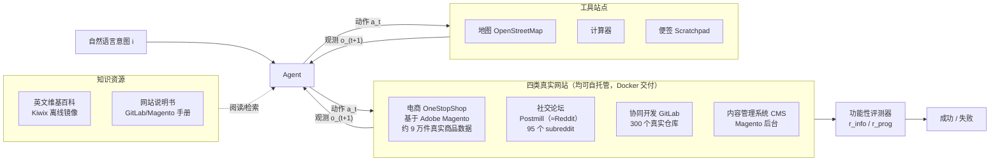

# WebArena：面向自治 Agent 的真实网页环境

> 组会汇报文档 · ~20 页 · 50 分钟组会级 · PPT 风格。忠于 arXiv 2307.13854v4（ICLR 2024 camera-ready）原文，
> 全篇数字/公式均标注 §/Table/Figure 出处；原文未给出的一律写明"原文未给出"，不编造。

---

## §1　TL;DR（一页讲清这篇在干嘛）

> 主讲提示：开场先立住"这是一篇环境论文，不是方法论文"——它不教 agent 怎么变强，它造了一个让"强不强"第一次能被诚实测出来的地方。

一句话：WebArena 自己**搭建**（而非借用真实生产站点，也不用简化仿真）了四类**功能完整、可自托管（self-hostable）**的真实网站——电商（OneStopShop）、社交论坛（Postmill，功能对标 Reddit）、协同开发（GitLab）、内容管理系统（CMS）——外加地图/计算器/便签三个工具和维基百科等知识库，打包成 Docker 镜像，任何人都能在自己机器上一键拉起、一键重置到确定性初始状态。在此之上发布 **812 个长程（long-horizon）任务**的 benchmark，并且第一次系统性地把评测标准从"预测的动作序列文本像不像参考答案"换成"网站的真实状态最终对不对"——即**功能性正确（functional correctness）**评测（摘要；§1）。用三个 LLM（GPT-3.5、GPT-4、PaLM-2/text-bison-001）跑基线 agent，最好的配置（GPT-4 + CoT，去掉"不可达提示"）只拿到 **14.41%** 的端到端成功率，而 5 名 CS 研究生的人类基线是 **78.24%**（摘要；Table 2）——63.83 个百分点的鸿沟，是这篇论文留给整个领域的靶子。

- **属于 harness 的哪一层（Θ1）**：本篇的主战场是 **E 层（Environment）**——它不提出新的控制循环或新的记忆机制，而是回答"agent 该在一个什么样的世界里被测"。但它顺带定义了两个更下游层要用的**接口契约**：观测空间 O（§2.3，DOM／截图／accessibility tree 三种渲染）和动作空间 A（§2.4，click/type/scroll…十余种原子操作 + element-ID 选择机制）——这两者分别对应本库六层分类里的 **C（上下文/观测）** 和 **T（工具）** 的早期形态；评测用的 reward function（§2.1, §3.2）则是一套朴素但极具生命力的 **V（验证）层**设计。E 层是根，C/T/V 是它长出来的枝。
- **权威性来源**：ICLR 2024 正式接收，CMU 团队（Neubig 实验室），公开代码/数据/Docker 镜像（webarena.dev），是本库 F 组（Web/GUI Agent）**唯一的 2023 年 canon**，后续 VisualWebArena、许多 web-agent 方法论文都以它的 GPT-4 基线（14.41%）为起跳线做比较。
- **本文带走的 3 条结论**：
  1. **"自建真实网站"不是妥协方案，而是这篇论文的核心方法论创新**——用真实开源生产软件 + 真实数据，换来"既真实又可复现"，直接解决了"连真实网站会撞验证码/内容漂移、连仿真网站会脱离真实复杂度"的两难（§2、§6 详述）。
  2. **评测指标从比"说了什么"改成比"世界变成了什么"**——r_info（信息检索类，exact_match/must_include/fuzzy_match 三判据）+ r_prog（状态变更类，locator+keywords 直接查网站真实存储）——这是"功能性正确"评测在 web agent 领域第一次被系统化、可复用地实现（§3.2、§11 详述）。
  3. **GPT-4 在这个更贴近真实的世界里现出原形**：14.41% vs 78.24%，且失败主要不是"记不住指令"，而是缺"主动探索"和"失败恢复"这两种能力（§5.1）——这条诊断直接预告了后续三年 web-agent 方法论文的主要研发方向（规划搜索、记忆复用、观测/动作接口重设计）。

---

## §2　问题与动机：现有环境的三宗罪

> 主讲提示：这页是 Why 三连的"问题层"。记住三个关键词——过简化、静态资源、表面匹配——它们各自对应后面 WebArena 的一个设计决策。

**Why（问题层）——不解决会卡住什么？**

论文开篇即给出研究前提："要充分释放自治 agent 的潜力，必须在一个既*authentic*（真实）又*reproducible*（可复现）的环境里测量它的行为"（§1）。但当时（2023 年中）能用的环境有三类系统性缺陷（§1）：

1. **过度简化真实场景（over-simplify real-world situations）**：不少环境是网页/GUI 交互的极简仿真（如 MiniWoB++ 风格的合成页面），网站的真实复杂度——菜单层级、真实业务逻辑、海量长尾内容——被大幅裁剪，直接导致**任务多样性不足**（§1 引用多篇代表性工作）。
2. **进一步简化任务本身的执行复杂度**：一些环境为了让任务"可解"，把真实世界里本该多步骤、跨页面的操作简化成一两步就能完成的玩具任务，与真实执行的复杂度脱节（§1）。
3. **只是一份静态资源（a static resource）**：另一批环境（如 Shi et al., 2017 的 World of Bits、Deng et al., 2023 的 Mind2Web）本质是"数据采集时缓存下来的网页快照 + 人工标注动作序列"，agent **只能访问采集时刻缓存过的状态**，探索的广度和多样性被锁死（§1）——网站不会真的对 agent 的新动作产生反馈。

**评测侧还有第四宗罪**——即便环境本身没问题，很多工作的评测方式仍是"比较预测动作序列与参考动作序列的**文本表面形式**（textual surface form）"，完全**无视执行的功能性正确、也无视同一目标可能存在多条有效路径**这一"在足够复杂的任务里普遍存在的现象"（§1 原文）。

**后果**：环境与真实世界之间的落差，会直接侵蚀"agent 能力评测结果"对真实世界的**可外推性**——你在简化/静态环境里测出来的分数，说明不了它在真实网站上到底行不行（§1）。

> **读出什么**：这四宗罪精确对应 WebArena 随后要交付的四个设计答案——自建*真实*网站（治过简化）、*动态*可交互（治静态资源）、*多样*人类任务（治任务多样性不足）、*功能性正确*评测（治表面匹配）。下一节先给"贡献总览"，再逐条拆解怎么落地。

---

## §3　核心贡献与形式化速览

> 主讲提示：三句话记住这篇论文在交付什么——一个环境、一个 benchmark、一批基线实验；再给一眼四元组形式化，细节后面逐节展开。

论文的贡献可以压成三件事（摘要 + §1）：

1. **一个环境**：`WebArena`——标准化、自托管、可复现的多领域网页环境，四类真实网站 + 三个工具 + 知识库（§2）。
2. **一个 benchmark**：812 个长程、语言驱动的任务，配套**功能性正确**评测器（§3）。
3. **一批基线实验**：三个 LLM × 两种提示策略，量出人类与当时最强 LLM agent 之间的真实差距（§4、§5）。

WebArena 环境被形式化为一个四元组（记号先定义、后用式，§2.1）：

- $\mathcal S$：状态空间（网站真实的底层数据/页面状态全体）；
- $\mathcal A$：动作空间（§2.4，点击/输入/滚动/换标签页/URL 导航等原子操作）；
- $\mathcal O$：观测空间（§2.3，agent 实际"看到"的东西——URL + 当前标签页内容的某种渲染）；
- $\mathcal T:\mathcal S\times\mathcal A\to\mathcal S$：转移函数，**确定性的**，由每个网站的真实底层实现所定义（§2.1）。

$$\mathcal E = \langle \mathcal S, \mathcal A, \mathcal O, \mathcal T \rangle$$

> **读出什么**：这四元组看着像标准的（部分可观测）序贯决策过程模板，但**真正的创新点藏在 $\mathcal T$ 的定义方式里**——它不是一个被拟合/近似出来的仿真器，而是**真实开源生产软件的实际执行语义**：你点"Add to Cart"，Magento 的购物车数据库表就真的多一行。这是"自建真实网站"在形式化层面的精确含义，也是 §6 要重点展开的"设计层 Why"。

---

## §4　环境总览（big picture）

> 主讲提示：先给全景图，再逐块拆解。记住这张图里有三类"东西"——网站、工具、知识库——它们共同构成 agent 的可交互世界。



**网站怎么选出来的（§2.2）**：作者没有拍脑袋选类别，而是先**分析了作者自己约 200 条真实浏览器历史**，把每段浏览会话的目的做摘要，再把访问过的网站归类到抽象类别，最终确定四个最显著的类别：(1) 电商购物（如 Amazon/eBay）、(2) 观点交流的社交论坛（如 Reddit/StackExchange）、(3) 协同软件开发平台（如 GitLab）、(4) 管理数字内容的 CMS（如网店后台）。再补充三个高频工具站——地图（POI 查询/导航）、计算器、便签——以及作为"信息获取"载体的知识库（英文维基百科 + 网站说明书）（§2.2）。

> **Why（设计层）——为什么不是"凭经验挑几个有代表性的网站"？**
> 朴素做法是研究者凭直觉／文献惯例挑几个"看起来重要"的网站类别。→ 容易带主观偏见，覆盖不到真实用户实际花时间的场景分布。WebArena 改用"自下而上分析作者本人的真实浏览器历史"，至少保证选出的类别是**真被用过**的（§2.2）。**代价（我的批判，非原文自述）**：约 200 条样本全部来自论文作者自己，样本量小、人群单一（几乎必然偏向"CMU 研究者的数字生活"——学术、开发、购物），未必能代表更广泛用户群体的高频场景（如社交媒体信息流、即时通讯、视频站）。这是选址方法论上一个值得追问的局限。

---

## §5　环境形式化细节：观测/动作循环怎么转起来

> 主讲提示：这页把 §3 的四元组落到"一步怎么走"的具体循环上，并引出 reward function 的抽象定义（具体怎么算留到 §11）。

**直觉**：agent 拿到一句自然语言意图后，看一眼当前页面（观测），决定按哪个按钮/填哪个框（动作），页面因此真的发生变化（新状态），agent 再看一眼新页面……如此循环，直到它喊停或者到步数上限。

**符号（先定义，后用式，§2.1）**：
- $\mathbf i$：自然语言意图（task intent）；
- $t$：时间步；$a_t\in\mathcal A$：第 $t$ 步动作；
- $o_t\in\mathcal O$：第 $t$ 步观测；$\mathbf a_1^{t-1}$、$\mathbf o_1^{t-1}$：到 $t-1$ 为止的动作/观测历史；
- $s_{t+1}\in\mathcal S$：动作 $a_t$ 作用在 $s_t$ 上、经 $\mathcal T$ 转移得到的新状态；$o_{t+1}\in\mathcal O$：对应的新观测。

$$a_t = \pi\big(\mathbf i,\ o_t,\ \mathbf a_1^{t-1},\ \mathbf o_1^{t-1}\big), \qquad s_{t+1} = \mathcal T(s_t, a_t)$$

在执行结束（第 $T$ 步）后，用一个奖励函数评估整条轨迹：

$$r\big(\mathbf a_1^T,\ \mathbf s_1^T\big) \;\to\; \text{是否达成意图 } \mathbf i$$

其中 $\mathbf a_1^T=(a_1,\dots,a_T)$ 是完整动作序列，$\mathbf s_1^T=(s_1,\dots,s_T)$ 是全部中间状态（§2.1）。论文原话："奖励函数评估状态转移是否与意图的预期一致——比如意图是下单，它就检查订单是否真的被创建；意图是回答问题，它就检查预测答案是否正确"（§2.1 改写）。

> **读出什么**：§2.1 在环境层面只立了"存在这样一个奖励函数"的**契约**——不规定它具体怎么算。真正"怎么算"要到 §3.2 才用 `r_info` / `r_prog` 两套具体实现来履约（见 §11）。这种"先抽象契约、后具体实现"的分层写法，本身就是评测协议设计的一个好习惯：**环境定义和评测指标解耦**，以后想换更严格的评测器也不用动环境。

---

## §6　"自建真实网站"如何同时做到 realistic 与 reproducible

> 主讲提示：这是全篇方法论上最值得停留的一页——把"朴素做法为什么不行"讲透，直接对应任务要求的那句 Why 三连。

**Why（设计层）——为什么不直接连真实网站，也不用简化仿真，而要"自己搭一个真的"？**

三条朴素替代路线，各有各的死穴：

- **朴素方案 A：直接让 agent 连真实生产网站**（真的 Amazon、真的 GitHub）。→ 会撞上"bot 要过验证码（CAPTCHA）、内容随时被别人改写、网站配置随时间漂移"（§2 原文三个并列短语），导致**今天能跑通、明天就挂**，不同系统之间也没法在同一条件下公平比较。
- **朴素方案 B：用简化的合成/仿真页面**（MiniWoB++ 一类的玩具环境）。→ 结构和业务逻辑被大幅精简，agent 在这种环境里练出来的能力，泛化不到真实网站复杂的 DOM 结构和真实用户操作路径（呼应 §2 的"过度简化"批评）。
- **朴素方案 C：静态快照数据集**（爬一批真实网页的截图/DOM，配人工标注的参考动作序列，如 Mind2Web）。→ agent 只能"复述"标注者当年做过的动作；网站不会对 agent 的新动作产生真实反馈，也就没法评测"多步交互后网站状态到底变成什么样"（呼应 §1 的"静态资源"批评）。

**WebArena 的选择**：**自建（self-hostable）但功能完整的真实网站**——用真实开源软件承载每个类别（电商/CMS 用 Adobe Magento、论坛用 Postmill、协同开发直接用 GitLab 官方项目本体），再把真实世界同类网站的**真实数据**导入进去（§2 正文 + Appendix A.1）：

| 网站 | 底层开源实现 | 数据规模（Appendix A.1） |
|---|---|---|
| 电商 OneStopShop | Adobe Magento（开源电商平台） | 约 9 万件商品、300+ 商品类目，数据源自真实线上商店（含 Webshop 数据转储） |
| 社交论坛 | Postmill（Reddit 的开源对标实现） | 95 个 subreddit（覆盖美国东北部城市 + 机器学习/深度学习话题）、127,390 条帖子、661,781 个用户 |
| 协同开发 GitLab | 官方 GitLab 项目本体 | 300 个仓库，按"每种编程语言至少 10 个仓库"启发式采样：80% 从 star 数前 90 分位按权重概率采样，其余从后 10 分位采样，兼顾热门大项目与冷门个人项目；1000+ 账户，均至少有一次提交 |
| CMS | Adobe Magento 后台（官方示例数据） | 复用 Magento 官方指南提供的示例数据 |
| 地图 | OpenStreetMap | 因存储限制，聚焦美国东北部区域 |
| 知识库 | Kiwix 离线托管英文维基百科 | 知识截止 2023 年 5 月；GitLab / Adobe Commerce 官方手册 |

这样，**真实性（authenticity）**来自"跑的就是真实生产级软件 + 导入真实数据"，不是简化仿真；**可复现性（reproducibility）**来自"环境完全自托管、不连外网、不依赖任何实时状态"，并且**每个网站单独打包成一个自包含 Docker 镜像**（含代码、数据库及全部依赖，不依赖外部卷挂载），用户下载镜像即可在自己机器上**精确复现**同一套网站；镜像还配有脚本，可把环境**一键重置到确定性初始状态**（Appendix A.2）。整体交付通过 `gym`-风格 API（Brockman et al., 2016）封装，进一步保证易用性与可复现性（§1）。

> **Why（结果层）——这样换来了什么？**
> 直接后果是：WebArena 可以被**任何第三方在本地精确复现**，不受网站方内容更新、CAPTCHA 策略、访问频控的影响——这正是"公平、长期可比"的 agent benchmark 所需要的底座。论文自己也点明代价：不是所有评测用例都需要重置环境（很多意图是只读的信息检索），但涉及写操作的用例，重置一次可能耗时几秒到一分钟，对评测吞吐有非零但可控的影响（Appendix A.2）。

**我的补充批判（非原文自述）**：自建终究是"某一个时间点的快照 + 某一种开源实现"——网站的鲜活度、长尾功能覆盖，必然不如真正的生产网站；而且每个类别只实现了**一个**实例（如"电商"只有 OneStopShop 一种），覆盖不了同类网站之间真实存在的 UI/信息架构差异（真实世界有成百上千种电商网站，而不是一种）。这与"用 200 条个人浏览历史选类别"（§4）是同一枚硬币的两面：真实性是"这一个实例内部"的真实，代表性是"跨实例"的代表性，WebArena 只对前者下了重注。

---

## §7　观测空间：DOM／截图／accessibility tree 三选一，外加首创多标签页

> 主讲提示：这页讲"agent 到底看见了什么"。accessibility tree 是这篇论文留给后续工作最耐用的一个设计。

**直觉**：设计观测空间要在"信息够不够"和"能不能塞进模型的输入窗口"之间找平衡——原始 HTML 太啰嗦、纯截图对文本模型不友好，于是引入一种"折中"表示。

WebArena 把观测设计为**网页 URL + 已打开标签页 + 当前聚焦标签页的内容**，并提供三种可配置的内容渲染模式（§2.3、Figure 3）：

1. **原始网页 HTML**（DOM 树）——沿用早期工作的做法（Shi et al., 2017；Deng et al., 2023；Li et al., 2020）。
2. **截图**——像素级 RGB 数组表示当前网页。
3. **accessibility tree（无障碍树）**——DOM 树的一个**子集**，只保留对"呈现网页内容"而言*relevant*（相关）且*useful*（有用）的元素；每个元素以"角色（如链接）+ 文本内容 + 属性（如是否可聚焦）"表示。它比 DOM 更**紧凑（compact）**，同时较大程度保留了网页的**结构化（structured）**信息（§2.3）。

**同一块页面在三种模式下长什么样（Figure 3 原图示例，"Patio, Lawn & Garden" 商品条目）**：DOM 树里一条商品大致是

```html
<li><div>
  <a href="..."></a>
  <div class="..."><a href="...">Outdoor Patio ..</a></div>
  <div><span>Rating:</span><div><span>82%</span></div>
    <a href="...#reviews">12<span>Reviews</span></a></div>
</div></li>
```

而对应的 accessibility tree 把样式/嵌套结构全部剥掉，只剩语义角色与文本：

```
link 'Image'
link 'Outdoor Patio..'
LayoutTable ''
  StaticText 'Rating:'
  generic '82%'
  StaticText '12 Reviews'
  button 'Add to Cart' focusable: True
  button 'Wish List' focusable: True
  button 'Compare' focusable: True
```

两相对照就能看出"紧凑但保结构"具体省在哪——`class`、`href` 精确值、`<div>` 层层嵌套这些对完成任务无关紧要的噪声消失了，但"这是个评分、这是个可点击的按钮、按钮叫什么"这些**决策相关**的信息原样保留（Figure 3）。

三种模式都支持"只取视口（viewport）内内容"这一限定，方便适配"上下文长度有限的文本模型"或"对图片尺寸/分辨率有要求的图像模型"（§2.3）。

**多标签页（multi-tab）**是本文明确宣称的一项首创（§2.3 原文）："WebArena 是第一个考虑多标签网页任务的 web 环境，以此促进工具使用、跨标签页的直接比较与引用等功能"——比起把一切都塞进单一标签页，多标签更贴近人类真实的浏览习惯（§2.3）。

> **读出什么**：accessibility tree 是这三选一里**信息密度最高的折中方案**——它既不像 HTML 那样充满与"内容语义"无关的样式/脚本噪声，也不像截图那样对文本模型完全不可用；后文基线 agent（§14）默认就是用"accessibility tree + element ID"作为观测，这个选择后来被大量 web-agent 工作沿用为事实标准。

---

## §8　动作空间：把"点哪里"变成 n-way 分类

> 主讲提示：这是本文一个很小但很聪明的工程设计，值得单独拎出来当"ACI（Agent-Computer Interface）思想"的一个早期 web 实例。

WebArena 设计了一套模拟键鼠操作的复合动作空间（沿用 Shi et al., 2017; Liu et al., 2018 的思路），共三组（§2.4、Figure 4）：

| 分组 | 动作 | 说明 |
|---|---|---|
| 元素操作 | `click(elem)` / `hover(elem)` / `type(elem, text)` / `press(key_comb)` / `scroll(dir)` | 点击/悬停/输入/按键组合/滚动 |
| 标签页管理 | `new_tab` / `tab_focus(index)` / `tab_close` | 开新标签/切换标签/关闭标签 |
| URL 导航 | `goto(URL)` / `go_back` / `go_forward` | 跳转/前进/后退 |
| （另有）| `noop` / `stop(answer)` | 什么都不做 / 宣布完成并给出答案（含 "N/A" 表示"不可达"） |

**核心设计**：元素可以用两种方式引用——屏幕坐标 $(x,y)$，或**遍历 DOM/accessibility tree 时为每个元素生成的唯一 ID**（该 ID 会作为前缀标注在元素前，如 `[1582] Add to Cart`）（§2.4）。

> **Why（设计层）——为什么不直接用屏幕坐标？**
> 朴素做法 A：像素坐标点击（沿用桌面自动化/RPA 传统）。→ 对纯视觉模型是强项，但对文本模型极不友好，还会引入"有没有点准"这种和任务本身无关的噪声失败模式。朴素做法 B：让模型直接生成 CSS 选择器/XPath 字符串。→ 语法自由度高、极易写错，出错定位困难。
> WebArena 的做法：给每个可交互元素分配一个整数 ID，把"点哪里"从一个连续、模糊的**定位问题**，转成离散、无歧义的 **$n$-way 分类问题**——发出 `click [1582]` 就等价于从当前页面 $n$ 个候选元素里选中编号 1582 那个（§2.4 原文）。好处是**同一套 ID 机制能同时兼容不同输入模态设计的 agent**（比如接受截图输入、但仍用 ID 而非坐标作答的模型），而不必牺牲"步数计数"这类公平比较指标（§2.4 原文明确点出这一点）。

**用户角色模拟**见 §9；本节仅需记住：动作空间的设计目标不是"功能全"，而是"**消除 agent 表达同一操作的自由度差异**，让不同实现方式的 agent 能在同一把尺子上被比较"——这正是后来 SWE-agent（本库 C 组 canon）明确提出的 **Agent-Computer Interface（ACI）**理念的一个 web 域先声：好的动作接口设计，是把"任务本该有的难度"和"接口本身带来的额外难度"分离开。

---

## §9　用户角色模拟：同一个网站，不同的人生

> 主讲提示：这一节很短，但戳中了一个此前文献从未认真处理过的维度——"agent 到底是以谁的身份在操作这个网站"。

**问题**：同一个网站，不同用户因为**角色（roles）、权限（permissions）、交互历史（interaction histories）**不同，体验天差地别——电商 CMS 里，店主对全部内容有读写权限，普通员工可能只能改商品、不能碰客户数据（§2.4）。

**做法**：WebArena 为每个平台生成**独特的用户画像**（§2.4、Appendix A.3）：
- 电商站：一个两年内下过 35+ 笔订单的顾客画像；
- GitLab：一个维护多个热门开源项目（很多 merge request/issue）、同时私下管理少量个人项目的用户；
- Reddit（Postmill）：一个活跃参与讨论、有大量帖子/评论的用户；
- 电商 CMS：一个对全部系统内容有完整读写权限的店主。

所有用户通过预缓存 cookie 自动登录（Appendix A.3）。论文自陈："据我们所知，这是第一个实现这一特性的公开 agent 评测环境；既有文献通常假设所有用户角色是同质、统一的"（Appendix A.3，点名 Shi et al., 2017; Liu et al., 2018; Deng et al., 2023 为反例）。

> **读出什么**：这是一个不显眼但影响深远的设计——它意味着 WebArena 的任务不是"匿名操作一个空白网站"，而是"**带着一个真实历史与权限身份**去完成任务"，任务的正确答案（比如"我上次买洗发水是什么时候"）天然依赖这段被注入的历史。**我的补充观察**：论文同时在系统提示词里放了一个 `homepage.com/password.html` 页面，直接列出全部账号密码供 agent 登录切换身份（Appendix A.9，Figure 7）——这意味着 benchmark **不测试"发现/获取登录凭据"这类能力**，登录凭据是显式喂给 agent 的，这是一个明确但原文未主动强调的范围收窄。

---

## §10　Benchmark 任务构造：241 模板 → 812 意图

> 主讲提示：这页讲"任务从哪来"。三条标注准则 + 模板化实例化，是这个 812 任务集合具备"可控多样性"的秘密。

**直觉**：既要任务足够多样、有创造力，又要能系统性地控制"同一类任务、不同参数"下 agent 表现是否稳定——于是用"模板 + 实例化"的两层结构。

**标注三准则（§3.1）**：annotator 先花几分钟熟悉网站内容和功能，再据以下三条构造意图：

1. **抽象、高层（abstract and high-level）**：任务不能一两个动作就完成。例：不用"点击 science 版块"，而用"在 science 版块发一条问候贴"（涉及多个动作）。
2. **有创造力（creative）**：像"注册账号"这种常见任务容易想到，鼓励加约束把任务变独特，例如"创建一个和我 GitLab 账号一样的 Reddit 账号"。
3. **模板化（template）**：把可替换的成分变成变量。上例可写成 `"创建一个和我 {{site2}} 账号一样的 {{site1}} 账号"`，实例化成 `{site1: Reddit, site2: GitLab}` 或 `{site1: GitLab, site2: OneStopShopping}` 等。**注意**：同一模板衍生出的不同任务，执行轨迹可能完全不同——它们的相似性主要体现在**高层语义**，而非具体实现路径（§3.1 原文强调）。

annotator 还获得一份可喂给 ChatGPT 的提示词（含各网站功能概览）用于启发灵感，以及一份精选示例列表作参考（§3.1）。

**规模统计（§3.1）**：最终共 **241 个模板**、**812 个实例化意图**，平均每个模板实例化 **3.3** 个样例。跨网站的意图分布见 Figure 6（Appendix A.4）：

| 网站/维度 | 占比 |
|---|---:|
| E-commerce（电商） | 23.0% |
| CMS | 22.4% |
| GitLab | 22.2% |
| Map（地图） | 13.4% |
| Reddit | 13.1% |
| Cross Site（跨站，需操作多个网站） | 5.9% |

论文特别注明："不论哪个网站，**所有**用户意图都需要与多个网页交互"（Figure 6 图注）——即便不算"跨站"的 5.9%，单站任务本身也已是多页面的长程任务。

**三大意图类别（§3.1、Figure 5）**：
1. **信息检索（information-seeking）**：期望文本回答。与开放域问答（Yang et al., 2018；Kwiatkowski et al., 2019）的关键区别是——WebArena 的信息检索任务常常要求跨多页面导航、且聚焦*用户中心（user-centric）*的内容（比如"我上次买洗发水是什么时候"，需要在个人订单历史里逐条核对，而非查一个通用事实）。
2. **站内导航（site navigation）**：借助搜索/链接等交互元素定位特定信息或页面区块。
3. **内容与配置操作（content & configuration operation）**：创建/修改/配置内容或设置——从改社交状态、改 README，到完成在线交易、调整隐私设置。

> **读出什么**：模板化实例化机制，让 WebArena 后续能问一个很有诊断价值的问题——"同一个模板的不同实例，agent 表现是否稳定"（见 §16）。这是很多"单任务独立评测"的 benchmark 做不到的分析维度。

---

## §11　功能性正确评测：r_info 与 r_prog 怎么打分

> 主讲提示：全篇最该讲透的一页——"功能性正确评测（非文本匹配）"就是这两套判据。每个子判据都给定义式。

**Why（设计层）——为什么不比动作序列的文本，而要比"世界的状态"？**

朴素做法：把 agent 预测的动作序列与人工标注的"标准动作序列"逐步对比文本/编辑距离。→ 会有两个硬伤：(1) 同一目标经常存在**多条同样有效的执行路径**（比如先点搜索框还是先点分类筛选，都能找到同一件商品），文本比对会把"殊途同归"错判为"做错了"；(2) 就算动作序列和参考一模一样，也不能保证**网站的最终状态**真的达成了意图（比如中途一次点击失败但序列文本"看起来"对）。WebArena 改为**结果导向（outcome-based）**评测——只关心执行完之后，网站/答案的**真实状态**是否满足意图，不关心过程走了哪条路（§1、§3.2）。这与更早的比较文献（Zhong et al., 2017；Chen et al., 2021；Wang et al., 2022；Puig et al., 2018；Deng et al., 2023）形成明确对照——原文称此法"更可靠（more reliable）"，且"能容纳完成同一目标的多种潜在有效路径"（§1）。

**又一处作者连续性细节**：被引用作"更可靠"参照系的 `Wang et al., 2022`——《面向开放域代码生成的执行式评测》（*Execution-based evaluation for open-domain code generation*）——其作者正是 Zhiruo Wang、**Shuyan Zhou**、Daniel Fried、**Graham Neubig**，与本文共享三位作者。也就是说，"用执行结果而非文本表面形式判定对错"这套哲学，本身是这个研究小组**先在代码生成任务上验证过、再搬到 web agent 领域**的方法论迁移——这也从侧面说明"功能性正确评测"不是 WebArena 临时想出来的噱头，而是有更早的、同一批作者亲自验证过的先例支撑。

**两套具体实现**分别服务两类任务：

### (1) $r_{\text{info}}$：信息检索类任务的三种判据（§3.2）

直觉从严格到宽松排列：

**exact_match**——最严格：只有预测答案 $\hat a$ 与参考答案 $a^*$ 完全相等才得分，适用于答案本身就该是规范化短语的场景（如人名）。

$$r_{\text{exact}}(\hat a, a^*) = \mathbb 1[\hat a = a^*]$$

**must_include**——较宽松：只要 $\hat a$ 中**包含**了 $a^*$ 规定的关键内容就得分，适用于答案是无序关键信息列表、或评测只关心特定要点是否出现的场景。

$$r_{\text{incl}}(\hat a, a^*) = \mathbb 1\big[a^* \text{ 作为关键内容出现于 } \hat a\big]$$

Table 1 的例 2（"查询电话 8015551212 对应的客户姓名和邮箱"）同时用了两次 `must_include`（一次校验姓名、一次校验邮箱）——说明同一个 $r_{\text{info}}$ 可以是多个子判据的**合取**。

**fuzzy_match**——处理答案表达形式本身多样的情形：用**另一个 LLM**（`gpt-4-0613`，提示词见 Appendix A.7）判断 $\hat a$ 是否与 $a^*$ **语义等价**。例如对"从 AMC Waterfront 到 Randyland 的步行/驾车时间"这类问题，"2h58min"要能匹配"2 hour 58 minutes"、"2:58"等多种表达形式（§3.2）。

$$r_{\text{fuzzy}}(\hat a, a^*) = \mathrm{JudgeLM}\big(\hat a, a^*;\ \text{prompt in App. A.7}\big) \in \{0,1\}$$

> **读出什么**：`fuzzy_match` 是 **2023 年就出现的 LLM-as-judge 用于 agent 评测的早期实例**——比后来"LLM 当裁判"成为标配（例如本库 G 组 Harness-Bench 用固定 LLM 裁判打 Process 分）早了近三年。论文没有停在"用就完了"，而是专门在 Appendix A.8 做了可靠性验证：人工抽查 40 个样例，39 个与人类判断一致（**97.5%**）；进一步发现需要 GPT-4 参与评测的 82 个样例里，60%（49 个）其实是"判断日期/时长的不同**格式**是否等价"这类相对机械的子问题，于是又针对这个子情形程序化生成正负样例做压力测试——两版 GPT-4（`gpt-4-0613` 与 `gpt-4-1106-preview`）在 900 个日期样例 + 900 个时长样例上都拿到 **100%** 准确率（Table 6）。这套"先人工抽查、再针对高频子情形做规模化压力测试"的验证方法论，本身就值得被抄。

### (2) $r_{\text{prog}}$：站内导航与内容配置类任务的程序化判据（§3.2）

直觉：这类任务没有唯一"文本答案"可比——能比的是"该改的地方是不是真的改对了"。于是不比动作序列的文字，而是直接去查网站的**真实存储**（数据库/页面/URL）。

符号（先定义后用）：
- $\mathbf s$：一次执行产生的中间状态序列；
- $\mathrm{locator}(\cdot)$：一个"定位器"函数，从 $\mathbf s$ 中取出与该意图相关的关键内容——其具体实现依场景可以是数据库查询、网站自带 API 调用，或 JavaScript 元素选择器（§3.2）；
- $\mathrm{keywords}$：应当出现在被定位内容里的关键词/字符串集合。

$$r_{\text{prog}}(\mathbf s) = \mathrm{match}\big(\mathrm{locator}(\mathbf s),\ \mathrm{keywords}\big),\qquad \mathrm{match}\in\{\texttt{exact\_match},\ \texttt{must\_include}\}$$

Table 1 例 5（"发帖问'在纽约是否需要一辆车'"）的具体实现：先用 `locate_latest_post_url(s)` 取最新帖子的 URL，再用 `locate_latest_post_body(s)` 取帖子正文，然后分别用 `must_include` 校验 URL 里含 `"r/nyc"`、正文里含 `"a car in NYC"`（Table 1）。`locator` 的**真实实现**并不神秘——§3.2 正文举了具体例子：先检查状态序列 $\mathbf s$ 里的最后一个状态拿到最新帖子的 URL，再导航过去，直接跑一段 JavaScript `document.querySelector('.submission__inner').outerText` 取出帖子正文（§3.2 原文）——也就是说，"定位器"往往就是几行浏览器端 JS 代码，成本很低、但精确锚定在页面真实 DOM 结构上，比任何"读 agent 自己的文字汇报"都可靠。

> **读出什么**：这一步把"评测"从"听 agent 怎么说"整个搬到"看世界怎么变"——网站自己的数据库/DOM 就是唯一 ground truth，天然拒绝"嘴上说做了、其实没做"的刷分方式。这正是"功能性正确"评测的技术落地，也直接呼应本库中心命题相关的"reward hacking"警惕——评测标准锚定在**客观可查的外部状态**，而非 agent 自己的陈述。

**总体成功率的定义式**（据 Table 2 caption 与 §5 反推，符号先定义）：设 $N$ 为任务总数（或某个子集大小），$r_k\in\{0,1\}$ 为第 $k$ 个任务上 $r_{\text{info}}$ 或 $r_{\text{prog}}$ 的取值（对不可达任务，"成功"定义为预测答案等于 `"N/A"`）：

$$\mathrm{SR} = \frac{1}{N}\sum_{k=1}^{N} \mathbb 1[r_k = 1]$$

---

## §12　不可达任务：给 agent 的"我不知道"测谎仪

> 主讲提示：这节讲"防幻觉"设计，是评测协议里容易被忽视但很重要的一块。

**问题**：由于证据不足、用户权限限制（§A.3）、或网站本身不支持某项功能，人类用户在真实场景里也会问出**做不到**的问题。受 Rajpurkar et al. (2018) 在 SQuAD 上引入"不可回答问题"评测 QA 模型这一思路启发，WebArena 也设计了**不可达任务（Unachievable Tasks）**（§3.2）。

**例子**：意图"告诉我 OneStopShop 的联系电话"是不可达的，因为该网站根本没有提供这项联系信息——这类实例被标注为 `"N/A"`，期望 agent 输出等价的"做不到"回应（§3.2）。

**目的**：评测 agent **不做无根据宣称、保持对事实的忠实**的能力（§3.2）——这正是当今"LLM 幻觉"议题在 agent 评测里的一个早期、具体的操作化定义。

**这条设计与 §14 的 UA hint 消融、§15/§16 的反直觉结果直接相连**——先记住这个"防幻觉探针"的存在，后面会看到"提前教模型认怂"反而带来了副作用。

**标注流程（§3.2）**：意图由作者按 §3.1 准则贡献；信息检索类的参考答案由作者与一名外部标注者共同确定，每题标注两遍，若两名标注者不一致则由第三名标注者裁定；程序化评测器由三位精通 JavaScript 的作者贡献；疑难任务集体讨论确认，标注者需完整执行任务并审视中间状态。

**原文未给出**：812 个任务中不可达任务的**确切数量/占比**，正文与附录均未给出精确统计（本文如实标注这一缺失，不做估算）。

---

## §13　人类基线：78.24% 是怎么测出来的

> 主讲提示：这页给"人类基线"这个后续所有百分比都要对齐的锚点数字一个准确的方法论说明——避免把它误解成"人人都能做到"。

**做法（§3.2）**：从 241 个模板中的 **170 个**各抽 1 个任务，请 **5 名计算机科学研究生**执行。

**结果**（§3.2 表格）：

| 指标 | 数值 |
|---|---:|
| 平均耗时 | 110 秒/任务 |
| 信息检索类成功率 $\mathrm{SR_{info}}$ | 74.68% |
| 其余类别成功率 $\mathrm{SR_{others}}$ | 81.32% |
| 总体成功率 $\mathrm{SR_{all}}$ | **78.24%** |

**失败归因（§3.2）**：作者复查了失败轨迹，发现约 **50%** 的人类失败源于**误解意图**（例如问"用时"却答"距离"）、**回答不完整**（只答姓名却漏了邮箱）或**执行不完整**（只填完部分商品信息）；其余是更严重的、执行完全偏题的失败。

**Why（问题层）——为什么人类也做不到 100%？**
作者在 Appendix A.5 坦承：不同背景的人类标注者表现会有差异；很多任务需要**领域特定知识**（例如普通用户未必知道什么是 GitLab 的 merge request，或如何在复杂 CMS 里新建商品）。他们的设计取向是"任务结果容易想象"（比如"新建了一个商品页"）而非"普通用户不需要专业知识就能顺手做的任务"（Appendix A.5）——即 78.24% 已经是"对网站有一定专业背景的人类"的上限，而非"任意普通用户"的上限。

> **读出什么**：78.24% 这个数字**不是"人类的自然上限"，而是"CS 研究生在这套专业化任务集合上的表现"**——理解这一点，才能正确解读后面 14.41% vs 78.24% 这条 63.83 个百分点的鸿沟到底在比什么。

---

## §14　Baseline Agents：三模型 × 两种提示策略

> 主讲提示：这页讲实验设置，为下一页读结果表打基础。注意：这里的"CoT 开/关"与"UA hint 开/关"，就是本文 Θ2 要抓的"早期 harness 消融"。

**模型（§4、Appendix A.6）**：`gpt-3.5-turbo-16k-0613`、`gpt-4-0613`（OpenAI, 2023）、`text-bison-001`（PaLM-2，Anil et al., 2023）。

**提示策略（§4）**：
1. **直接预测（direct）**：给定当前观测、意图、上一步动作，直接输出下一动作，两个 in-context 示例。
2. **推理后行动（CoT，Chain-of-Thought）**：同样信息，但模型先在文本里做**显式推理**（step-by-step），再给出动作预测（Wei et al., 2022；Yao et al., 2022b，即本库 B 组 canon ReAct 的思路），示例前另有一段对浏览器环境、可用动作、多条规则的详细说明——这套说明与展示给人类标注者的指南**基本一致**，以保证公平比较（§4）。

**Unachievable Hint（UA hint）**：为了让模型意识到"不可达任务"的存在，指令中显式加入一句——"如果你认为任务不可能完成，请在括号内给出答案 `N/A`"——这一指令是可开关的消融变量，被称为 **UA hint**（§4、Appendix A.9）。

**观测/动作接口**：统一使用**带 element ID 的 accessibility tree**作为观测（§4）——即 §7、§8 定义的那套接口。

**执行限制（Appendix A.6）**：最大状态转移步数 30；同一观测下同一动作重复 3 次以上、或连续生成 3 次无效动作，即提前终止（判定为大概率会执行失败）；`text-bison-001` 额外允许 10 次重试直到生成合法动作；主实验用**温度 1.0、top-p 0.9**（鼓励探索），并在 Table 5 附了 `gpt-3.5-turbo-16k-0613` 在温度 0.0 下的结果（SR = 6.28%）供复现参照。**原文未给出**运行 812 个任务全部基线实验所耗费的具体 API 调用成本/算力用量——只交代了步数上限与重试策略,没有折算成美元或 GPU-小时。

**系统提示词长什么样（Appendix A.9，Figure 7/9）**：两种 agent 共享同一份环境说明——列出观测包含"意图/accessibility tree/URL/已开标签页/上一步动作"，动作分三组（元素操作/标签页管理/URL 导航），并显式给出登录入口："如果你想访问其他网站，请查看 `http://homepage.com`；`http://homepage.com/password.html` 列出了所有网站的账号名和密码，你可以用它们登录。"（Figure 7 原文译）——这就是 §9、§19 提到的"凭据直接喂给 agent"设计的确切出处。规则部分要求"一次只发一个动作""严格按 `` `click [1234]` `` 这类格式输出""认为任务做完/不可达就发 `stop` 动作"。

**CoT 与 direct 两版 few-shot 示例的真实差别（Figure 8 vs Figure 10）**：两种 agent 用的是**完全相同**的两个上下文示例（一个是"HP 喷墨传真机多少钱"的电商价格查询，另一个是"帮我搜索 ABC 附近的餐馆"的地图搜索），唯一区别是模型被要求输出的**中间文本**：

| 示例 1（价格查询，观测已显示 `[1749] StaticText '$279.49'`） | 推理（CoT）版输出 | 直接（direct）版输出 |
|---|---|---|
| 期望动作 | *"Let's think step by step. This page lists the information of HP Inkjet Fax Machine… Its price is $279.49. I think I have achieved the objective… In summary, the next action I will perform is `stop [$279.49]`"* | `stop [$279.49]` |

> **读出什么**：这组对照把 §15 里"CoT 带来 +2.34 个百分点"的抽象结论变得具体可感——CoT 版本在动作前插入的那段"Let's think step by step…"文字，**不改变最终动作本身**（两版给出的都是 `stop [$279.49]`），改变的是模型在**更难的中间步骤**上会不会先把"我看到了什么、这和目标什么关系"显式写出来再决定怎么做。这正是一个纯粹的**提示层（harness 的最小单元）**改动，与模型权重、环境实现、评测标准都无关——呼应 §15 的 Θ2 回扣。

---

## §15　主结果：14.41% vs 78.24%，以及一次"提前量"的 harness 消融

> 主讲提示：这是全场最该停留的一页。先给主表，再挑两个反直觉的地方细讲。

**Table 2（原表全量复现）**：

| CoT | UA Hint | 模型 | SR | SR$_{\text{AC}}$（可达任务） | SR$_{\text{UA}}$（不可达任务） |
|:---:|:---:|---|---:|---:|---:|
| ✓ | ✓ | text-bison-001 | 5.05 | 4.00 | 27.78 |
| ✗ | ✓ | GPT-3.5 | 6.41 | 4.90 | 38.89 |
| ✓ | ✓ | GPT-3.5 | 8.75 | 6.44 | 58.33 |
| ✓ | ✓ | **GPT-4** | 11.70 | 8.63 | 77.78 |
| ✗ | ✗ | GPT-3.5 | 5.10 | 4.90 | 8.33 |
| ✓ | ✗ | GPT-3.5 | 6.16 | 6.06 | 8.33 |
| ✓ | ✗ | **GPT-4** | **14.41** | **13.02** | 44.44 |
| – | ✓ | Human | 78.24 | 77.30 | 100.00 |

（SR = 总体成功率；SR$_{\text{AC}}$ = 仅在**可达**任务子集上的成功率；SR$_{\text{UA}}$ = 仅在**不可达**任务子集上的成功率，即正确输出 `N/A` 的比例。三者定义见 §11 式。）

**主线读数**：GPT-4 + CoT（带 UA hint，§5 首先报告的"标准"设置）拿到 **11.70%**，显著低于人类 78.24%；GPT-3.5 + CoT 只有 **8.75%**；`text-bison-001` 最弱，5.05%（§5）。GPT-3.5 上"加不加 CoT"（都带 UA hint）对比：6.41% → 8.75%，CoT 带来 **+2.34 个百分点**的提升（§5 原文直接给出这个差值）。

**Θ2 回扣：这是一次"提前三年"的 harness 效应实证**——GPT-4 模型本身完全没变，只是把提示词里的一句"如果做不到就说 N/A"（UA hint）从**开**改成**关**，总体 SR 就从 11.70% 摆到 **14.41%**（+2.71 点，相对提升 23.2%），可达任务子集 SR$_{\text{AC}}$ 从 8.63% 摆到 13.02%（+4.39 点）。UA hint 本身不改变模型、不改变环境、不改变评测标准，只改变**提示层（属于本库 L/控制循环层的一种最小配置）**——这与本库 G 组 Harness-Bench（2605.27922）"同模型换 harness、分数摆 23.8 分"是同一类现象的**微缩早期版本**：早在 2023 年，WebArena 自己的消融实验就已经在验证"Agent = Model + Harness"这条命题的雏形，只是当时没有把它当作独立的研究主轴来命名和系统化。

**机制解释（§5.1，Why·结果层）**：为什么关掉 UA hint 反而分数更高？作者的错误分析发现——**GPT-4 在带 UA hint 时，会把 54.9% 的可行（achievable）任务错误地判定为不可能完成**！这个"过度谨慎"的行为主要就是 UA hint 这句指令诱导出来的："这个提示虽然帮助模型识别不可达任务，但也伤害了它在可达任务上的表现"（§5.1）。去掉这句指令后，GPT-4 在可达任务上的表现回升，总体 SR 升到 14.41%；同时，即便没有显式指令提醒，GPT-4 仍**保留了识别 44.44% 不可达任务的能力**（SR$_{\text{UA}}$），它是靠**自主生成"为什么不可行"的理由**做到的，即便没人明说要它这样做（§5.1）。相比之下，GPT-3.5 很少展现这种程度的推理，更容易陷入"幻觉编答案、重复无效动作、耗光步数上限"这类问题模式（§5.1）。

> **读出什么**：这条结果同时是一次关于**校准（calibration）与完成度（completion）权衡**的活案例——"提前教模型认怂"确实能提高它对不可达任务的识别率（SR$_{\text{UA}}$：44.44%→77.78%），但代价是拖累了它在可达任务上敢于尝试、敢于把活干完的表现。**这不是免费的午餐**，是本节最值得组会展开辩论的一点（见 §21 讨论题 3）。

**摘要口径提醒**：论文摘要与 §5 首段先报告的"11.70%"，其实是**带 UA hint 的标准设置**；而摘要末句强调的"我们最好的 GPT-4 agent 只有 14.41%"，实际来自**去掉 UA hint 之后的消融设置**——这是后续大量论文引用"WebArena GPT-4 基线 = 14.41%"时经常被合并成"唯一基线数字"的两个不同配置，读原文表格时值得留意这层细节（Table 2）。

---

## §16　结果细读：会不会"一学模板就通吃"、UA hint 的反直觉代价

> 主讲提示：这页把主结果掰开看两个更细的问题——"稳不稳定"和"为什么会这样"。

**问题一：来自同一模板的任务，模型表现稳定吗？（§5.1）**

同一模板衍生出的任务通常涉及相似的推理/规划过程，即便具体观测与执行不同。作者对（无 UA hint 设置下）GPT 系列模型的**逐模板成功率**画了直方图（正文称"Table 3"，caption 为"模板内成功率分布（限至少 1 次成功执行的模板，GPT 模型，无 UA hint）"）：

- 统计范围：**61 个模板**（即至少有一次成功执行记录的模板子集，并非全部 241 个）；
- GPT-4：仅在 **4/61** 个模板上做到 100% 成功；
- GPT-3.5：**0/61** 个模板做到 100% 成功；
- 多数情况下，两个模型都只能在同一模板的多个实例中**成功一个**。

作者给的例子很直观："Fork metaseq" 可能是一步到位的简单任务，而同一模板衍生出的 "Fork all repos from Facebook" 需要重复更多次操作，复杂度显著更高（§5.1）——**同模板不同实例的"表面相似"不等于"真实难度相似"**。作者据此提出，WebArena 是测试"能复用过去成功策略的方法（如带记忆组件的方法）"的合适试验场（§5.1，引用 Zhou et al., 2022a；Wang et al., 2023）。

> **读出什么**：这条发现直接预告了后续三年 web-agent 方法论文的一大研发方向——**workflow/经验记忆**（把做成功过的子策略缓存下来，遇到同模板的新实例时检索复用），这正是本库 D 组（上下文/记忆）大量论文要解决的问题在 web 域的具体动机来源之一。

**问题二：错误主要来自"记不住"还是"不敢/不会探索"？（§5.1 总结句）**

作者把"当前 LLM 表现有限"的根因归结为**缺乏主动探索（active exploration）与失败恢复（failure recovery）**这两种关键能力（§5.1 末句，引 LeCun, 2022）——不是知识不够，而是"在陌生、长程、有真实反馈的环境里，不知道怎么试错、怎么从错误里爬出来"。

---

## §17　与既有 benchmark 的坐标对比 + 相关工作定位

> 主讲提示：这页用论文自己给的对比表（Table 4）当"相关工作定位"的主干，再补一段散文梳理。

**Table 4（原表复现）**——四个维度：能否**动态交互（Dynamic Interaction）**、是否**真实环境（Realistic Environment）**、任务是否**多样贴近人类（Diverse Human Tasks）**、评测是否看**功能正确性（Functional Correctness）**：

| Benchmark | 动态交互 | 真实环境 | 多样人类任务 | 功能正确性 |
|---|:---:|:---:|:---:|:---:|
| Mind2Web (Deng et al., 2023) | ✗ | ✓ | ✓ | ✗ |
| Form/QAWoB (Shi et al., 2017) | ✗ | ✓ | ✗ | ✗ |
| MiniWoB++ (Liu et al., 2018) | ✓ | ✗ | ✗ | ✓ |
| Webshop (Yao et al., 2022a) | ✓ | ✗ | ✗ | ✓ |
| ALFRED (Shridhar et al., 2020) | ✗ | ✗ | ✓ | ✗ |
| VirtualHome (Puig et al., 2018) | ✓ | ✗ | ✓ | ✓ |
| AndroidEnv (Toyama et al., 2021) | ✓ | ✓ | ✓ | ✓ |
| **WebArena** | ✓ | ✓ | ✓ | ✓ |

> **读出什么**：WebArena 是表里唯一四项全勾的方案。但要注意——AndroidEnv 同样四项全勾，只是走的是"真安卓 App"路线；论文在正文里补充说明了它没勾上的隐藏代价："AndroidEnv 不保证可复现性，因为它用的是真实的（在线）安卓应用"（§6）——即 AndroidEnv 用"实时真应用"换真实性，代价恰是 WebArena 拼命要解决的"可复现性"问题；这构成一组很好的方法论对照（自建可复现 vs 直连真实但不可复现）。

**相关工作的两条主线（§6 原文梳理）**：

1. **"用自然语言控制 agent"的 benchmark 谱系**：Branavan et al., 2009；Shi et al., 2017；Liu et al., 2018；Toyama et al., 2021；Deng et al., 2023；Li et al., 2020；Xu et al., 2021 等——核心张力始终是"功能性、真实性、环境动态支持"三者不可兼得（§6，即 Table 4 的三个维度）。也有一批拓展到**游戏环境**的工作（Kolve et al., 2017；Shridhar et al., 2020；Puig et al., 2018；Küttler et al., 2020）——但游戏的环境机制往往和人类真实目标脱节（§6）。
2. **交互式决策 agent 的方法谱系**：WebGPT（Nakano et al., 2021，搜索网页回答问题）→ 合成 JS 代码执行任务（Gur et al., 2023）→ 引入多模态、基于截图预测动作（Lee et al., 2023；Shaw et al., 2023）。作者进一步指出，交互式环境任务要求 agent 具备**分层规划、状态追踪、错误恢复**等多种能力（§6）——已有工作探索了"任务分解为子任务"（Huang et al., 2022；Madaan et al., 2022；Li et al., 2023；Zhou et al., 2022b）、"把执行表示为程序以复用技能"（Zhou et al., 2022a；Liang et al., 2023；Wang et al., 2023；Gao et al., 2023）、"搜索与回溯"（Yao et al., 2023 即 Tree-of-Thoughts；Long, 2023）、"失败恢复与自我修正"（Shinn et al., 2023 即 Reflexion；Kim et al., 2023）、"观测摘要"（Sridhar et al., 2023，注：这是 WebArena 作者之一 Abishek Sridhar 的另一篇工作）。作者总结："WebArena 的复杂度为这些方法的进一步测试和改进提供了独特的挑战与机会"（§6）。

> **读出什么**：这段相关工作（related work）名单几乎是本库 B 组（控制循环）canon 阵容的预告片——ReAct（Yao et al., 2022b）、Reflexion（Shinn et al., 2023）、Tree-of-Thoughts（Yao et al., 2023）**都被点名**，说明 WebArena 从一开始就把自己定位为"这些方法论文该拿去挑战的下一个更硬的靶子"，而不是一个孤立的数据集。

**一个值得注意的作者连续性细节**：被引用作"未来方向"的 `Zhou et al., 2022a`（《通过自然语言分层控制情境化 agent》）与 `Zhou et al., 2022b`（《从半结构化网页数据发现程序层级》）——这两篇论文的**第一作者正是 WebArena 本文的第一作者 Shuyan Zhou**。也就是说，§5.1、§6 里"应对模板内不稳定性/复杂长程任务，需要分层规划与技能复用"这条建议，并不是临时提出的空泛展望，而是作者本人此前两年研究纲领（层级化 web 任务控制、从网页数据里挖掘程序层级）的自然延续——WebArena 更像是这条研究线"造一个足够难的环境来倒逼分层方法"的下一步，而非一个孤立的新起点。

---

## §18　错误分析：观测偏差与"看不见自己填过的字"

> 主讲提示：Appendix A.10 的两个具体案例，是理解"为什么 14.41% 这么低"最直观的素材，配图讲效果最好。

**观测偏差（Observation Bias，Appendix A.10）**：真实网站常常在多个位置重复呈现相似主题的信息（为了用户可达性）。GPT-4 agent 表现出一种倾向——**抓到第一条看起来相关的信息就不再深入核实其相关性/准确性**。例：电商 CMS 首页展示的是"近期购买（recent purchases）"口径的畅销商品，而"2022 年历史畅销榜"其实要通过另一个专门报表获取；面对"2022 年销量第一的商品是什么"这一意图，GPT-4 agent 直接采用了首页现成的（其实是错误口径的）信息，而没有走生成报表这一必要步骤。

**观测理解失败（Failures in Observation Interpretation，Appendix A.10，Figure 11）**：GPT-4 能对观测做摘要，却经常忽略更细粒度的信息，比如"输入框里已经填过的内容"。Figure 11 右侧案例——accessibility tree 里 `[5172] StaticText 'DMV area'` 已经明确显示搜索词已被填入，但 agent 无视这一细节，反复发出 `type [2430] [DMV area]` 直到耗尽步数上限。Figure 11 左侧案例——面对"Fork all Facebook repos"任务，agent 未能推进到"Users"分区去完成任务。

**作者的归因假说（Appendix A.10）**：这些失败可能与 GPT 系列模型当前的预训练/指令微调方式有关（引 Ouyang et al., 2022）——这些模型主要基于**即时观测（immediate observations，即对话历史）**训练来执行指令，因而可能表现出**探索不足**；此外在对话场景里，自然语言表达的细微差异对整体对话走向的影响通常较小，模型可能因此倾向于**忽视观测中的细微变化**。

> **读出什么**：这两个案例分别对应"过早采信首个证据、不做交叉验证"和"读了但没真正用上关键的状态更新信息"——都不是"模型不知道怎么点鼠标"，而是**更高层的认知策略缺陷**。这和 §16 的"缺乏主动探索、缺乏失败恢复"总结是同一件事的具体案例化。

---

## §19　局限与批判（论文自陈 + 我的补充）

> 主讲提示：这页要清楚区分"论文自己承认的"和"我额外指出的"，别混着讲。

**论文自陈的局限**：
- **人类基线的代表性**（Appendix A.5）：标注者背景不同会影响人类表现；不少任务需要领域特定知识，78.24% 更接近"有一定专业背景的人类"上限，而非任意普通用户的上限。
- **UA hint 的双刃剑效应**（§5.1）：能提升不可达任务识别率，但会压低可达任务完成率——论文如实报告了这个权衡，没有回避。
- **模板内不稳定性**（§5.1）：61 个模板中 GPT-4 仅 4 个做到全对，暴露当前方法对"看似相似、实则难度不同"的任务缺乏稳健性。

**我的补充批判（非原文自述）**：
- **网站选址的样本偏差**：四个类别来自约 200 条**作者本人**的浏览器历史（§2.2），"每类一个实例"的覆盖也天然有限，很难说这是对"人类网络生活"有代表性的抽样（呼应 §6 的分析）。
- **凭据/登录不在测试范围内**：所有账号密码被直接列在 `homepage.com/password.html` 供 agent 查阅（Appendix A.9 Figure 7），意味着"发现/管理凭据"这一现实中真实存在的能力被排除在评测之外。
- **fuzzy_match 存在"评委即选手"的潜在偏差**：当被测 agent 本身是 GPT-4 家族模型时，语义判等所用的裁判也是 `gpt-4-0613`（§3.2）——同一模型家族既当"答题者"又（部分地）当"阅卷者"，理论上可能带来对自身表达风格更宽容的系统性偏差。论文用 Appendix A.8 的人工抽查验证了 fuzzy_match 相对于*人类*判断的准确性（39/40），但没有专门检验"当选手是 GPT-4 本身时，裁判是否格外宽容"这一更细的问题——这与本库 G 组 Harness-Bench 用固定 LLM 裁判时留下的"谁来 judge the judge"隐忧，是同一类未解问题在不同代际论文里的重现。
- **可控性换来的代表性代价**：自建网站保证了可复现，但"网站的鲜活度、长尾功能、跨实现差异"必然弱于真实生产站点——这是 §6 已经点出的方法论权衡，值得在读后续每一个"self-hostable benchmark"时反复检查。

---

## ★ 对我们的启发（Inspires Us）

> 这一节是组会高潮：**我们（Claude Code / 本课 `m9.*` 的 agent）本身也活在一个 harness 里，也需要一个可被诚实评测的"环境"**——WebArena 这篇 2023 canon，恰恰是"怎么把评测环境搭对"的第一手教材。

➤ **a. 可直接借用的招**：
1. **exact_match / must_include / fuzzy_match 三件套**（§11）——一个几乎零成本、可直接照抄的开放式文本答案评分工具箱：能精确匹配就用最严的 exact_match，答案是无序要点列表就用 must_include，答案表达形式多样（日期/时长/口语转述）就上 fuzzy_match（LLM 当裁判）。可以直接搬来给我们任何"生成一段文本答案"的评测任务打分。
2. **`locator + keywords` 的 $r_{\text{prog}}$ 二段式模式**（§11）——校验"状态是否真的被正确改动"的通用模板：先写一个函数把"和这个任务相关的关键状态"抓出来（数据库查询/API/选择器都行），再检查其中是否包含约定关键词。这比"要求 agent 自己汇报做没做"可靠得多，直接适用于我们任何"写文件/改配置/发请求"类工具调用的验收。
3. **不可达任务（Unachievable Tasks）防幻觉探针**（§12）——往任务集里混入一批"故意做不到"的任务，专门测 agent 会不会**编答案**而不是**说不知道**；这是一个几乎不花什么成本、却极具诊断力的校准探针。

➤ **b. 可迁移到我们课题的思路**：auto-research 库的 `m9.6`（评测沙箱）目前依赖真实/半真实的外部信息源，容易遭遇本论文 §2 点名的"内容漂移、访问受限"问题——WebArena 的解法（自建可自托管、可确定性重置的真实数据副本，而非直连真实站点）是一个现成的方法论模板：迁移时要注意的前提是——我们需要先有一份"可自己托管、能定期同步真实数据"的语料/环境镜像，而不是每次都临时爬取实时网络；这个前提目前**还不成立**，是下一步要补的基础设施。此外，§7 的 accessibility tree（DOM 的紧凑、结构化子集）这一"观测压缩"思路，也值得迁移到我们自己 harness 的上下文层（C 层）——用类似的"保留角色/文本/可操作性、丢弃样式噪声"原则去压缩我们喂给模型的工具/环境状态描述，可能比直接塞原始 JSON/HTML 更省 token、更少噪声。

➤ **c. 它暴露的开放问题 = 我们的机会**：
1. **UA hint 的校准-完成度两难**（§15、§16）——论文只报告了"开/关"两个极端消融，没给出折中方案。机会：设计一个**两阶段提示策略**——先不给"认怂"许可，让 agent 先花一定探索预算去尝试；只有在预算耗尽仍未找到证据时，才允许它输出"N/A"。第一步：在我们自己的任务集里混入若干"确实做不到"的陷阱任务，对比"一开始就允许认怂" vs "先探索再允许认怂"两种提示策略下，误判率和完成率分别怎么变。
2. **模板内不稳定性没有被这篇论文解决**（§16）——作者只是指出"带记忆组件的方法可能有帮助"，没有给出具体机制。机会：把 Table 3 的"逐模板成功率直方图"分析方法直接搬到我们自己的 agent 上——按任务模板/任务族聚合成功率，看看我们是否也存在"一学会一个变体、换个措辞就失败"的模式；如果存在，就是我们上"workflow memory"（缓存并检索过去成功的子策略）最有说服力的立项证据。

➤ **d. 与本库其它论文/模块的连接**：
- 与 **ReAct（2210.03629，本库 B 组 canon）**正面呼应——WebArena 的"CoT reasoning agent"就是 ReAct 范式在一个远比 ReAct 原始测试床（ALFWorld/WebShop/HotpotQA）更硬的长程环境里的一次"压力测试"，11.70%~14.41% 的分数说明 ReAct 式"边想边做"在这个难度台阶上开始明显失灵，为后续 Reflexion/Tree-of-Thoughts 这类"加反思、加搜索"的方法提供了直接的立项理由（§17 related work 名单也点名了这条线）。
- 与 **SWE-agent（2405.15793，本库 C 组 canon，Agent-Computer Interface）**呼应——§8 的 element-ID 动作接口设计（把连续定位问题转成离散分类问题）与 SWE-agent 明确提出的 ACI 理念是同一原则在不同领域（domain）的实例：**好的工具/动作接口设计，要把"任务本该有的难度"和"接口本身带来的额外难度"分开**。
- 与本库 **G 组 Harness-Bench（2605.27922）**呼应——§15 的 UA-hint/CoT 消融是"Agent = Model + Harness"命题的一次 2023 年"迷你早期实证"；三年后 Harness-Bench 把同一现象做成了受控、规模化（5,194 条轨迹）的统计。两篇合起来读，能看出这条论点从"论文里的一个消融表格"成长为"独立研究主轴"的完整轨迹（详见 §20 的 regime 讨论）。
- 与 **VisualWebArena（2401.13649）/ OSWorld（2404.07972）**（均为本库 F 组同批待写论文）呼应——它们分别是"在 WebArena 骨架上加多模态任务"和"把同一哲学从网页搬到整台操作系统"的直接后代，见 §20。

➤ **e. 如果我来做下一步（第一人称）**：我会先在我们某个 `m9.*` 模块（优先选评测相关的 `m9.6`）上，用 WebArena 的 `exact_match / must_include / fuzzy_match` 三件套重写一遍现有的开放式文本答案评分逻辑，并往现有任务集里混入 5–10 个"故意做不到"的陷阱任务（仿 §12 的不可达任务设计），跑一遍看我们自己的 agent 是编答案还是老实承认做不到；如果编答案的比例偏高，就照着 §16/Inspires-Us-c 的思路，加一个"先探索预算、后允许认怂"的两阶段提示策略，对比误判率和完成率的变化。

---

## §20　版图定位：canon 坐标、E 层归属、谁在它上面长肉、regime 诚实

> 主讲提示：这是收官页，把"这篇论文在整条时间线/整张分层图上的坐标"钉死。

**时间坐标与权威性（Θ4）**：2023-07 arXiv 预印本，**2024 ICLR 正式接收**（CMU，Neubig 实验室），公开代码/数据/Docker 镜像，是本库 F 组（Web/GUI Agent）**唯一的 2023 年 canon**。

**它定义/奠基了什么（Θ4）**：
1. **一整套"自建可复现真实网站"的环境构造范式**——真实开源软件 + 真实数据导入 + 每站独立 Docker 镜像 + 确定性重置（§6、Appendix A.1/A.2）；
2. **"功能性正确（functional correctness）"作为 agent 评测的黄金标准**，并给出两套可复用的具体实现——$r_{\text{info}}$ 三判据、$r_{\text{prog}}$ 的 locator+keywords 二段式（§11）；
3. **accessibility tree + element-ID** 的观测/动作接口范式（§7、§8），是 web 域里较早的 Agent-Computer Interface 实践；
4. **不可达任务**这一"防幻觉/校准探针"任务设计模式（§12）；
5. **多标签页支持**与**用户角色模拟**两个此前文献普遍忽略的维度（§7、§9）。

**E/T/C/L/O/V 归属（Θ1）**：主战场是 **E 层（Environment）**；同时向下定义了 **O/A 接口**（对应本库 C 层"上下文/观测"与 T 层"工具"的早期形态），向上给出了早期 **V 层（验证）**评测器设计（$r_{\text{info}}/r_{\text{prog}}$）。它本身不涉及 L 层（控制循环）或记忆/上下文压缩（D 组关心的 C 层重点），但 §4 基线实验里的 CoT 消融，是对 L 层的一次最小化触碰。

**谁在它上面长肉（Θ4，canon 的后代）**——以下除 Table 4 已直接讨论的 Mind2Web 外，均属**本论文之后**的文献脉络，为本库 F 组同批待写论文，具体数字未在本次任务中逐篇核实，仅供定位参考，不作为 WebArena 论文本身的宣称：

- **VisualWebArena（2401.13649，2024-01）**：与 WebArena 同一批 CMU 作者，直接复用 WebArena 的环境/评测器骨架，新增要求**视觉 grounding**的任务（分类广告站 Classifieds、购物、Reddit 的多模态版本）——是最直接意义上"在 WebArena 代码骨架上长肉"的后代。
- **OSWorld（2404.07972，2024-04）**：把"自建真实 + 可复现 + 功能性正确评测"这套方法论哲学，从"网页世界"整体搬到"一整台电脑"（真实桌面应用 + 文件系统，用 VM 快照取代 Docker 镜像做确定性重置）——是同一哲学在更高抽象层级（OS 而非浏览器）的复刻。
- **WebVoyager（2401.13919，2024-01）**：走了一条相反的设计取舍——不自建网站，直接在真实生产网站上跑，改用 GPT-4V 当裁判评判任务完成——与 WebArena 的"自建可控"路线形成正面方法论对照组（真实鲜活 vs 可复现可控，参见 §6 的三条朴素方案分析）。
- **Mind2Web（2306.06070，2023-06）**：**时间上略早于**（约一个月）而非晚于 WebArena，二者应视为**同期而非承袭关系**；WebArena 自己的 Table 4 已将其列为对照——静态快照（Dynamic Interaction: ✗）与 WebArena 的动态可交互路线正面相反，是理解"为什么要动态环境"最直接的反例参照。
- 更广义地，据我了解（同样是论文之后的文献脉络，非本文内容）：WebArena 此后成为 web-agent 领域事实上的标准测试平台之一，规划搜索、workflow/经验记忆、多智能体协作等多种方法论文都以其 GPT-4 CoT 基线（14.41% 或 11.70%，视消融设置而定）作为比较起点；ServiceNow 的 BrowserGym/AgentLab 一类"环境聚合层"项目也把 WebArena 收编为可插拔环境之一——这条脉络恰好呼应本库 G 组 Harness-Bench"harness 该被单独度量"的论点，但同样不构成对本论文内容的引用，仅作背景定位。

**regime 诚实（Θ5）——WebArena 时代的"鸿沟"主要来自模型能力，不是 harness**：
把 §15 的 CoT/UA-hint 消融（±2~4 个百分点）和 78.24% vs 14.41% 的**主鸿沟（63.83 点）**放在一起看，结论应当是**分 regime 的**——2023 年这个时间点，WebArena 环境本身的难度和当时 LLM 的能力上限之间存在巨大落差，作者自己把主因归结为"缺主动探索、缺失败恢复"这类**模型/agent 核心能力**缺陷（§5.1），而不是"提示词/脚手架没调好"；本文能挪动的"harness 级"变量（CoT 开关、UA hint 开关）只能在小范围内（个位数百分点）搬动分数,远不足以填平鸿沟。三年后，Harness-Bench（2605.27922）在**模型能力已大幅提升**的 2026 年重新测这类问题时，发现"harness 级"变量已经能挪动 **23.8 个百分点**——两篇论文合起来看，讲的其实是同一条演化曲线上的两个时间切片：**当模型能力远低于任务难度时，鸿沟主要由模型能力主导；当模型能力追上、乃至逼近任务难度时，鸿沟里 harness 能解释的份额显著上升**。这不是说"harness 现在比模型重要"这种绝对化结论——而是提醒我们，**读任何一篇"harness/scaffold 消融"论文时，都要先确认它所处的"模型能力 vs 任务难度"这个 regime**，再判断这条论点在多大程度上适用。

**在本库的位置**：F 组（Web/GUI Agent）canon 锚点、E 层（Environment）代表作。读完它，再读同批的 VisualWebArena / OSWorld / WebVoyager / Mind2Web 时，可以反复回问一句——"它在 WebArena 打过的哪个维度上（真实性/可复现性/任务多样性/功能正确性，即 Table 4 的四列）做了取舍或推进？"

---

## §21　组会讨论问题

> 主讲提示：挑 3–4 个抛给全场，别自己一个人讲完；第 6 题最适合留到最后，直接把 Harness-Bench 拉进来对照。

1. WebArena 用"约 200 条作者自己的浏览器历史"选出四类网站（§2.2）——这个样本会不会系统性偏向"CMU 研究者的数字生活"（学术/开发/购物），而漏掉普通用户更高频的场景（社交媒体信息流、即时通讯、视频站）？如果要扩展到更具代表性的类别，你会怎么设计抽样？
2. `fuzzy_match` 用 `gpt-4-0613` 当语义裁判（§11），而被测 agent 里恰好也有一版用的是 GPT-4——同一模型家族既当"选手"又（部分）当"裁判"，会不会有系统性的"对自己表达方式更宽容"的偏差？你会怎么设计一个实验把这个偏差测出来？
3. UA hint 的消融（§15）显示"提前教模型说 N/A"让 54.9% 的可行任务被误判为不可行——这是不是说明"校准"和"完成度"在提示词层面是一对必须权衡的目标？有没有不牺牲完成度就能提升校准的提示设计（参见 Inspires-Us c 的"两阶段"构想）？
4. Table 3 显示 61 个有效模板里 GPT-4 只有 4 个模板做到 100% 通过——这种"模板内不稳定"，更可能来自 (a) 同模板不同实例的操作步数/复杂度差异，还是 (b) 模型对措辞变化本身就脆弱？怎么设计一个消融把这两个因素分开？
5. WebArena 的转移函数 $\mathcal T$ 就是真实开源软件本身（§6）——这意味着"环境的真实性"和"环境的可控性"被绑定在"能不能自己部署这个开源项目"上。如果某个真实场景没有对应的成熟开源实现（比如银行网银、政府政务系统），WebArena 这套方法论还能直接套用吗？
6. 对照 2026 年的 Harness-Bench：WebArena（2023）里"换 CoT/UA hint 只挪 2~4 个百分点"，Harness-Bench（2026）里"换 harness 能挪 23.8 分"——这个反差，更可能来自"2023 年模型太弱、上限被模型能力本身卡死"，还是"2023 年的 harness 工程还太原始，可挪动的空间根本没被开发出来"？（§20 regime 讨论）
7. 全部账号密码被直接放进系统提示词（`homepage.com/password.html`，Appendix A.9）——如果去掉这个"作弊页"，改为要求 agent 自己发现/管理凭据，你预期 14.41% 这个数字会往哪个方向、变化多大？

---

## §22　一页速记

> 主讲提示：如果只剩两分钟，念这一页就够了——把它当讲完全篇后的收尾速览，逐条对应前面 §1–§20 的编号。

- **命题**：把 agent 评测从"文本对不对"搬到"世界变没变"——自建真实网站 + 功能性正确评测。
- **环境**：4 类真实网站（电商/论坛/GitLab/CMS，真实开源软件+真实数据自建）+ 3 工具（地图/计算器/便签）+ 知识库（Wikipedia/说明书），Docker 自托管、确定性重置（§6）。
- **形式化**：$\mathcal E=\langle\mathcal S,\mathcal A,\mathcal O,\mathcal T\rangle$，$\mathcal T$ 就是网站真实后端代码本身（§3、§5）；观测 $\mathcal O$ 三种模式（DOM/截图/accessibility tree），首创多标签页（§7）；动作 $\mathcal A$ 用 element-ID 把点击变成 $n$-way 分类（§8）。
- **任务**：812 个由 241 模板实例化的长程任务，三类（信息检索/站内导航/内容配置）+ 不可达任务防幻觉（§10、§12）。
- **评测**：$r_{\text{info}}$（exact_match/must_include/fuzzy_match，后者是早期 LLM-as-judge）+ $r_{\text{prog}}$（locator+keywords 直查网站真实状态）（§11）。
- **结果**：人类 78.24% vs 最好的 GPT-4 agent 14.41%（Table 2），鸿沟 63.83 个百分点；同模型仅换 CoT/UA hint 提示策略也能挪 2~4 分（早期"harness 效应"，Θ2）。
- **失败模式**：观测偏差（抓眼前信息不深挖）、观测理解失败（看不见自己已填过的内容）、模板内一致性差（61 模板仅 4 个 GPT-4 全过）（§16、§18）。
- **canon 地位**：VisualWebArena 在同一套代码骨架上加多模态任务；OSWorld 把"自建真实+功能正确"这套哲学从网页搬到整台操作系统；WebVoyager 走相反路线（真连真实站点+GPT-4V 裁判）；Mind2Web 同期但哲学相反（静态快照）（§20）。
- **regime 诚实**：2023 年的鸿沟主要由模型能力（缺探索、缺恢复）主导，harness 级变量只能挪个位数百分点；2026 年 Harness-Bench 显示同类变量已能挪 23.8 分——同一条曲线的两个时间切片，别把"harness 现在更重要"讲成放之四海皆准（§20）。
- **对我们**：搬它的 `exact_match/must_include/fuzzy_match` 三件套 + `locator+keywords` 的 $r_{\text{prog}}$ 模式，给我们自己的评测沙箱加"不可达任务"防幻觉探针（Inspires-Us）。
