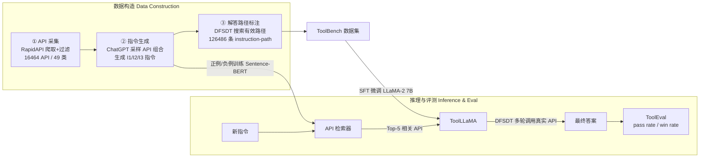
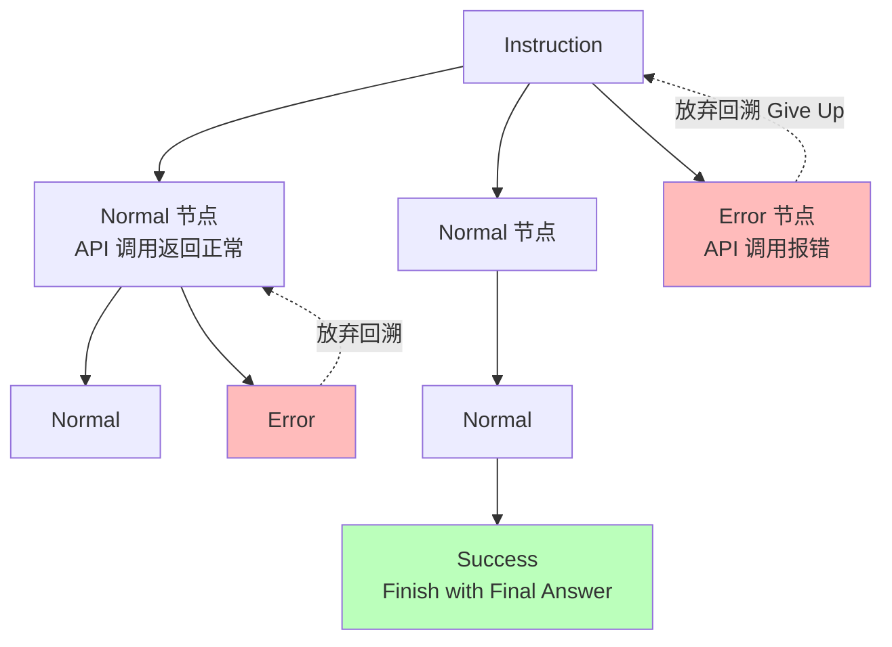

# ToolLLM：让大模型驾驭 16000+ 真实世界 API

> **本篇定位**：这是一篇"数据集 + 方法 + 评测"三位一体的 **T 层（工具接口）奠基工作**。对本 agent-harness 库而言，它回答的核心问题是——
> **当 harness 面前摆着上万个工具时，(1) 怎么把对的工具捞出来（检索），(2) 模型怎么在多个 API 之间做出不一步错就废的决策（搜索）**。
> 它给出的三个答案是：ToolBench（16464 API 的训练数据）、DFSDT（把 ReAct 的单条链升级成决策树）、ToolEval（pass rate / win rate 自动裁判）。
> 阅读时请对齐标杆 `2605.27922-harness-bench` 的密度与诚实度：每个公式前给直觉、符号先定义、指标给定义式、数字标 §/Table 出处、区分"论文宣称"与"批判"。

---

## §1　TL;DR（一页讲清这篇在干嘛）

> 主讲提示：开场先说清"三件套"和它们各自解决的痛点，再点明它在本库的层归属（T 层）与时间坐标（2023 奠基）。

**一句话**：开源大模型（LLaMA 那代）会聊天、会做基础语言任务，但**不会熟练调工具（API）去完成复杂真实指令**——因为当年的指令微调数据几乎只覆盖语言任务，忽略了工具使用这个领域（§1 原文动机句）。ToolLLM 用一套**通用工具使用框架**把这个缺口补上，它包含三件套（Abstract）：

1. **ToolBench**（数据集）：**16,464** 个真实世界 RESTful API，横跨 **49** 个 RapidAPI 类目；由 ChatGPT（`gpt-3.5-turbo-16k`）自动构造，三阶段流水线——① API 采集 ② 指令生成 ③ 解答路径标注（§2）。
2. **DFSDT**（搜索算法）：**深度优先搜索决策树（Depth-First Search-based Decision Tree）**——把传统 ReAct/CoT 的"一条推理链走到黑"升级为"可以**评估多条路径、回溯、放弃当前节点另起分支**"的树搜索，专治 ReAct 的两大顽疾：**错误传播**与**探索受限**（§2.3 / A.4）。
3. **ToolEval**（评测器）：基于 ChatGPT 的自动裁判，含两个指标——**pass rate（通过率）**衡量"能不能在有限预算内完成指令"、**win rate（胜率）**衡量"两条解答路径谁更好"（§3.1 / A.5 / A.6）。

在此之上，作者在 ToolBench 上微调 LLaMA 得到 **ToolLLaMA**，并训练一个 **神经 API 检索器（neural API retriever）** 替代"人工从上万 API 里挑"。结果（Table 4）：ToolLLaMA + DFSDT 超过 Text-Davinci-003 与 Claude-2、逼近 ChatGPT（教师模型），并在**分布外（OOD）** 数据集 APIBench 上与专门为其设计的 Gorilla 打平（Table 5）。

- **属于 harness 的哪一层（Θ1）**：本篇主打 **T 层（工具接口）**——它的全部三件套都围绕"工具"这一层展开：怎么把工具**喂给**模型（RapidAPI 文档 → function call 字段）、怎么在**海量工具**里检索、怎么在多工具间**决策**。但它同时深入 **L 层（控制循环）**：DFSDT 本质是把 agent 的控制循环从"线性 ReAct 循环"换成"树搜索循环"。评测那块（ToolEval）触及 **V 层（验证）**。
- **回扣全库论点（Θ2）**：`Agent = Model + Harness`。这篇是一个漂亮的**"同一个模型，换 harness 里的搜索策略，成绩大变"**的实证——**ChatGPT 不动，只把推理策略从 ReACT 换成 DFSDT，平均 pass rate 从 35.3 → 63.8（Table 3），暴涨 28.5 个百分点**。搜索策略是 harness 的一部分，模型没变，能力却跳了一档。
- **够权威 / 时间坐标（Θ4）**：**ICLR 2024 Spotlight**，清华 THUNLP 出品，是 2023 年**工具学习（tool learning）的奠基工作之一**；它把"工具学习"从 Toolformer/Gorilla 的"少量/单工具"时代，推进到"上万 API、多工具、多步推理"的规模化时代（对比见 Table 1）。

---

## §2　问题与动机：为什么"让开源模型驾驭上万 API"值得单独做

> 主讲提示：这一段用 Why 三连的"问题层"，讲清 2023 年 open-source LLM 在工具使用上到底差在哪，以及现有工具数据集的三条硬伤。

**Why（问题层）——不解决会卡住什么？**
2023 年的现实（§1 原文）：开源 LLM（LLaMA、Vicuna）已经能通过指令微调获得不错的对话能力，但在**"恰当地调用工具/API 来完成复杂人类指令"**这类更高阶任务上明显落后。原因很直接——**当年的指令微调数据主要聚焦基础语言任务，相对忽略了工具使用领域**。反观 SOTA 闭源模型（ChatGPT / GPT-4）工具能力很强，却**闭源、内部机制不透明**，这限制了 AI 技术的民主化与社区驱动的创新。作者由此立下志向（§1 斜体原句）：**"empower open-source LLMs to skillfully master diverse APIs"**。

**现有工具学习数据集的三条硬伤**（§1，作者逐条点名，见 Table 1 的对比）：

| 硬伤 | 具体表现 | 谁踩了 |
|---|---|---|
| **① API 不真实 / 太少 / 多样性差** | 要么不用真实 REST API，要么只覆盖一小撮 API | APIBench(Gorilla)、ToolAlpaca、API-Bank 等 |
| **② 场景受限（单工具）** | 指令只涉及**单个**工具；但真实场景常需**多工具交织、多轮执行**才能解一个复杂任务 | 多数早期工作 |
| **③ 规划与推理弱** | 只用 CoT 或 ReACT 做推理，**无法充分激发**模型能力、难解复杂指令；有的甚至**不真正执行 API**（拿不到真实响应，而真实响应对后续规划至关重要） | 部分工作不执行 API |

**Table 1（本文 vs 既有数据集的硬指标对比）**——这张表就是动机的量化证据：

| 资源 | 真实 API | 真实调用/响应 | 多工具 | API 检索 | 多步推理 | 工具数 | API 数 | 实例数 | 真实调用数 | 平均推理链 |
|---|:--:|:--:|:--:|:--:|:--:|---:|---:|---:|---:|---:|
| **ToolBench（本文）** | ✓ | ✓ | ✓ | ✓ | ✓ | **3,451** | **16,464** | **126,486** | **469,585** | 4.0 |
| APIBench (Gorilla) | ✗ | ✗ | ✗ | ✗ | ✗ | 3 | 1,645 | 17,002 | 0 | 1.0 |
| API-Bank | ✓ | ✓ | ✗ | ✗ | ✓ | 53 | 53 | 274 | 568 | 2.1 |
| ToolAlpaca | ✗ | ✗ | ✓ | ✗ | ✓ | 400 | 400 | 3,938 | 0 | 1.0 |
| ToolBench (Xu et al.) | ✓ | ✓ | ✗ | ✗ | ✓ | 8 | 232 | 2,746 | 3,926 | **5.9** |

> **读出什么**：本文 ToolBench 在"真实 API 数（16,464）"上比其它高**一到两个数量级**，且是**唯一同时勾齐"真实 API + 真实调用 + 多工具 + API 检索 + 多步推理"五项**的数据集。注意一个诚实点：平均推理链长度 4.0，并非全场最高（Xu et al. 的 5.9 更长），作者没有在这一栏刻意拔高——**规模与多样性**才是它的护城河，不是链长。

> **读出什么（Θ2 呼应）**：第 ③ 条"不真正执行 API 就拿不到真实响应"直指 harness 的本质——**真实的工具反馈（observation）是控制循环的燃料**。这与标杆 Harness-Bench 的 "execution alignment"（推理要忠实搬运到可验证的动作/观察）是同一种警惕：光在脑子里想调 API 没用，得真调、真拿回响应、真喂给下一步。

---

## §3　核心 intention：把"工具学习"形式化成一句话

> 主讲提示：一页把整篇的目标压成一句，并埋下三条主线。

**一句话**：给定一条自然语言指令 $\text{Inst}_*$ 和一个巨大的 API 池，训练一个开源模型，让它能**（检索）**从池子里找出相关 API、**（决策）**在多个 API 间做多步决策并真实调用、最终**（完成）**产出满足指令的答案；并且这套能力要能**泛化到训练时没见过的新 API**（只靠读 API 文档即可适配）。

对应三条主线，正好是本报告后面三大块：
- **数据主线（§4–§6）**：ToolBench 怎么造出来（API 采集 → 指令生成 → 解答路径标注）。
- **算法主线（§7–§8）**：DFSDT 怎么把单路径推理升级成决策树搜索。**（本篇最该讲透的一块）**
- **评测主线（§9）**：ToolEval 的 pass rate / win rate 怎么定义、怎么保证可信。

**核心假设**：只要 (a) 数据足够真实/多样/多工具、(b) 推理策略足够能"回溯纠错"、(c) 有可靠的自动评测闭环，那么**开源模型也能被"喂"出接近闭源 SOTA 的工具使用能力**——且这能力**不绑定具体 API**，靠文档就能外推。

---

## §3.5　相关工作定位：它站在谁肩上、和谁不同（§4 Related Work）

> 主讲提示：一张谱系表把 ToolLLM 钉在三条脉络的交叉点上——它是"工具学习 × 指令微调 × 决策搜索"的合流。

作者在 §4 把自己放进三条脉络：

| 脉络 | 代表工作（原文引） | ToolLLM 的差异化 |
|---|---|---|
| **工具学习（Tool Learning）** | Toolformer、Gorilla、RestGPT、HuggingGPT、ToolAlpaca、API-Bank… | 前人多为**少量/单工具**或**不执行真实 API**；ToolLLM 是 **16k 真实 API + 多工具 + 真实调用**（Table 1） |
| **指令微调（Instruction Tuning）** | Self-Instruct、Alpaca、Vicuna、WizardLM、UltraChat… | 前人多聚焦**对话/语言任务**；工具学习因 **API 多样性巨大 + 多工具复杂性**而更难，连 GPT-4 都常找不到有效路径 |
| **提示式决策（Prompting for Decision Making）** | CoT、ReAct、Reflexion、Tree-of-Thoughts | ReAct 无"决策撤回"机制→初始错误级联；**DFSDT 把 Reflexion 扩展成更一般的"评估多路径选最优"**；与 ToT 并发但**面向无限决策空间的真实工具** |

**一句话谱系（务必讲）**：把决策搜索这一支单独拎出来——
$$\text{CoT（单链无反馈）} \to \text{ReAct（单链+环境反馈）} \to \text{Reflexion（失败后反思重试）} \to \underbrace{\text{DFSDT / ToT（树搜索）}}_{\text{本篇在此，DFSDT 攻真实工具}} \to \text{LATS（树搜索+价值函数+MCTS）}$$

> **读出什么**：ToolLLM 的贡献不是发明了树搜索（ToT 并发、Reflexion 在前），而是**第一次把"回溯式树搜索"用在"上万真实 API、无限决策空间、多步执行"的规模化工具场景**，并配齐了数据集与评测，让这套东西**可训练、可复现、可度量**。这正是它成为 T 层 canon 的原因。

---

## §4　方法总览（big picture）：三阶段流水线一图流

> 主讲提示：先给整体流程图，不展开数学；强调"全程由 ChatGPT 自动构造，仅需极少人工监督，可轻松扩展到新 API"（§2 原文）。

**三阶段一句话概括**（§2 引言）：
- **① API Collection（§2.1）**：从 RapidAPI Hub 爬 16,464 个真实 REST API，连同文档（功能描述、必填/选填参数、调用代码片段、示例响应）一起收集——**文档是关键**，因为模型靠读文档来零样本泛化到新 API。
- **② Instruction Generation（§2.2）**：先采样 API，再让 ChatGPT 生成涉及这些 API 的多样指令，**覆盖单工具与多工具场景**。
- **③ Solution Path Annotation（§2.3）**：对每条指令，用 **DFSDT** 搜一条有效的动作序列（API 调用链）作为标注。

> **读出什么（Θ2）**：注意这三阶段本身就是一套 harness 数据管线——**②③ 里那个"让 ChatGPT 采样 API 组合 + 用 DFSDT 搜路径"的循环，就是一个自动化的 agent rollout + 筛选管线**。它和我们 auto-research 库里"生成-执行-筛选"的数据自举思路同源。

---

## §5　符号与术语表

> 主讲提示：一页把后文要用的记号钉死，方便讲 DFSDT 和指标时直接引用。

| 记号 / 术语 | 含义 | 出处 |
|---|---|---|
| $\mathbb{S}_{\text{API}}$ | 全体 API 集合（16,464 个） | §2.2 |
| $\mathbb{S}_N^{\text{sub}}=\{\text{API}_1,\dots,\text{API}_N\}$ | 每次采样出的一小撮 API（$N$ 个） | §2.2 |
| $\text{Inst}_*$ | 一条生成的指令（instruction） | §2.2 |
| $\mathbb{S}_i^{\text{rel}}\subset\mathbb{S}_N^{\text{sub}}$ | 指令 $\text{Inst}_i$ 的相关 API 子集（relevant APIs） | §2.2 |
| $\mathbb{S}_{\text{seed}}$ | 人工写的种子示例集（单工具 12 个 / 多工具 36 个） | §2.2 |
| I1 / I2 / I3 | 三类指令：单工具 / 同类目多工具 / 同集合多工具 | §2.2 |
| $\{a_1,\dots,a_N\}$ | 一条解答路径（动作序列，每个 $a_t$ 是一次 API 调用） | §2.3 |
| $a_t$ | 第 $t$ 步动作，格式="Thought:…, API Name:…, Parameters:…" | §2.3 |
| $r_t$ / $r_*$ | 第 $t$ 步 / 某步的**真实 API 响应**（real API response） | §2.3 |
| DFSDT | 深度优先搜索决策树（本文核心搜索算法） | §2.3 / A.4 |
| pass rate | 通过率：有限预算内成功完成指令的比例 | §3.1 / A.5 |
| win rate | 胜率：两条解答路径两两比较，谁更优 | §3.1 / A.6 |
| NDCG@k | 归一化折损累积增益（评检索器排序质量） | Table 2 |
| AST accuracy | 抽象语法树准确率（APIBench 上评 API 调用正确性） | Table 5 |

---

## §6　ToolBench 构造细节：三阶段流水线怎么落地

> 主讲提示：这是"数据主线"的核心页。逐阶段讲，重点讲清"多工具指令怎么解决采样稀疏问题"和"为什么要压缩 API 响应"。

### 6.1　阶段① API 采集 + 过滤（§2.1 / A.1）

**RapidAPI 层级结构（Figure 3 左）**：三层——**Category（类目，49 个粗粒度，如金融/电影/天气）→ Tool（工具，一个工具含多个 API）→ API（具体端点）**。此外还有 **500+ 个 collection（集合，细粒度，如"中文 API""数据库 API"）**，同一集合内工具功能相近。对每个工具，爬取：名称、描述、host URL、以及它下属所有 API 的{名称、描述、HTTP 方法、必填参数、选填参数、请求体、可执行代码片段、示例响应}。

**过滤（§2.1 / A.1）**：初始爬到 **10,853 个工具（53,190 API）**，但质量参差（有的返回 404、有的响应是 HTML 源码或错误信息）。经两步严格过滤——(1) **initial testing**：测基础功能是否可用；(2) **example response evaluation**：调一次拿示例响应，剔除响应时间长、响应质量差的——最终保留 **3,451 个高质量工具（16,464 API）**。

**API 响应压缩（A.2）**：有些 API 响应太长，塞不进上下文。方案：让 ChatGPT 分析一个响应示例，**删掉不重要的 key**（配 3 个专家写的"原始响应→压缩 schema"的 in-context 例子），得到每个 API 的压缩策略；推理时若响应 >1024 token 就压缩，压缩后仍 >1024 就**只留前 1024 token**。

> **Why（设计层）——为什么要人工两步过滤 + 响应压缩，而不直接全量喂？**
> 朴素做法是把爬到的 53,190 个 API 原样塞进数据集。→ 会因为**大量死链/垃圾响应**污染训练信号（模型学到"调了但拿回一堆 HTML/错误"），且**超长响应撑爆上下文**。本文用"测试+响应质量"两步过滤把工具砍到 1/3、用"ChatGPT 学压缩 schema"控长度，换来数据可靠性——代价是牺牲了那些"响应慢但可能有用"的 API（§A.1 明说"consistently 长响应的被略去"）。**这条对我们直接有用：给 harness 的工具层加"工具健康度过滤 + 响应裁剪"**（见 Inspires-Us）。

> **为什么"文档"是零样本泛化的关键（§2.1 原文点题）**：作者反复强调爬取的这套 rich metadata（工具名/描述/host、每个 API 的方法/必填选填参数/请求体/**可执行代码片段/示例响应**）是"a valuable resource for LLMs to understand and effectively use the APIs, **even in a zero-shot manner**"。**读出什么**：ToolLLaMA 能泛化到训练时没见过的新 API（§3.2 的 Tool/Cat 泛化设定），靠的不是"记住了这个 API"，而是"学会了**读一段结构化 API 文档 → 推断出怎么调它**"这个元技能。这对 harness 的 T 层是根本性的——**工具接口的文档质量，直接决定 agent 能否即插即用新工具**；文档写得烂（缺参数说明、无示例响应），再强的模型也调不对。

### 6.2　阶段② 指令生成（§2.2）

**两个刻意的设计目标**：**多样性（diversity）**——覆盖广泛 API 使用场景以提升泛化/鲁棒；**多工具（multi-tool usage）**——镜像真实世界"多工具交织"的情形。**关键选择**：不是"先头脑风暴指令再找 API"，而是**反过来——先采样不同 API 组合，再据此造指令**（§2.2 原文）。这样能系统覆盖所有 API 及其组合。

**生成过程形式化**（§2.2）。先给直觉：我们要 ChatGPT 看着一撮 API 的文档，吐出"若干条指令 + 每条指令对应哪些 API 相关"。

记号：$\mathbb{S}_N^{\text{sub}}=\{\text{API}_1,\dots,\text{API}_N\}$ 为采样的 API；$\text{Inst}_*$ 为生成的指令；$\mathbb{S}_*^{\text{rel}}\subset\mathbb{S}_N^{\text{sub}}$ 为该指令的相关 API；$\mathbb{S}_{\text{seed}}$ 为种子示例。prompt 由三部分构成：(1) 任务描述，(2) $\mathbb{S}_N^{\text{sub}}$ 中每个 API 的完整文档，(3) 三个 in-context 种子示例 $\{\text{seed}_1,\text{seed}_2,\text{seed}_3\}$。

$$\text{ChatGPT}\big(\{[\mathbb{S}_1^{\text{rel}},\text{Inst}_1],\dots,[\mathbb{S}_N^{\text{rel}},\text{Inst}_{N'}]\}\;\big|\;\text{API}_1,\dots,\text{API}_N,\text{seed}_1,\dots,\text{seed}_3\big)$$

读出什么：$N'$ 是本次生成的指令条数；输出是一批 **(相关API集合, 指令)** 二元组，既用来训指令跟随，也用来训 §9 的 API 检索器（相关 API = 检索正例）。

**三类指令的采样策略（Figure 3 右 + §2.2）**——这是解决"多工具采样稀疏"的关键：
- **I1 单工具指令（single-tool）**：遍历每个工具，为其 API 生成指令。
- **I2 同类目多工具（intra-category multi-tool）**：从**同一 category** 里随机取 2–5 个工具、每工具最多 3 个 API 来造指令。
- **I3 同集合多工具（intra-collection multi-tool）**：从**同一 collection** 里同法采样。

> **Why（设计层）——为什么多工具要"同类目/同集合"内采样，而非全局随机？**
> 朴素做法是从全体工具里**随机**抽几个来造多工具指令。→ 会因为 RapidAPI 里工具间关联稀疏，随机组合出**一串互不相关的工具**，凑不出一条自然的指令（"帮我查天气 + 转账 + 生成 ASCII 艺术"没人会这么问）。本文利用 RapidAPI 的**层级先验**：同 category / collection 的工具本就功能相关，据此采样能造出**自然、可解**的多工具指令（§2.2 原文点明"random sampling…leads to irrelevant tools"）。

**产量**：过滤掉"相关 API 幻觉"（生成的相关 API 实际不在 $\mathbb{S}_N^{\text{sub}}$ 里）的指令后，得到近 **200k** 合格 (指令, 相关API) 对——**I1: 87,413 / I2: 84,815 / I3: 25,251**。

**种子 prompt 里藏着的三个"造好指令"技巧（A.7 原文 prompt，值得逐条学）**：作者手写了 **12（单工具）/ 36（多工具）** 个种子示例，并在任务描述里对 ChatGPT 提了几条很具体的要求——这些"prompt 里的细节"直接决定了数据质量：
1. **强制多 API 协同**：要求每条 query "combine all API call usages"，明确 **"A query that only uses one API call will not be accepted"**——逼出真正需要多步/多工具的指令，而非单点调用。
2. **强制具体化参数、杜绝占位符**：要求 **"don't merely say 'an address', provide the exact road and district names; don't just mention 'a product', specify wearables, milk, a blue blanket…; don't refer to 'my company', invent a company name instead"**——把必填参数（IP、坐标、地点）**具体填进 query**，避免生成"帮我查某地天气"这种缺参数、没法真执行的废指令。
3. **禁止泄露答案式提示 + 难度梯度**：要求 **"you shouldn't ask 'which API to use', rather, simply state your needs"**（不能在指令里暴露该调哪个 API，否则等于漏答案）；且**前 7 条 query 要很具体、后 3 条要复杂冗长**（描述一个需要动用全部 API 的复杂场景），人为制造难度分布。

> **Why（设计层）——为什么要在 prompt 里这么较真？**
> 朴素做法是简单让 ChatGPT "生成一些用到这些 API 的指令"。→ 会生成大量**只用一个 API、参数是占位符（'an address'）、甚至直接说'用 X API'** 的低质指令，训出来的模型学不到真实的多工具协同与参数填充。本文用**手写种子 + 具体化约束 + 难度梯度**把生成质量拉满（A.7 完整 prompt 可见），这是"数据质量"这条隐形护城河的真正来源——**规模（16k API）之外，指令的"可执行性与真实性"同样靠这些 prompt 细节保证**。

### 6.3　阶段③ 解答路径标注（§2.3）

**目标**：对每条指令 $\text{Inst}_*$，让 ChatGPT 搜一条有效动作序列 $\{a_1,\dots,a_N\}$。这被建模为**多轮对话**：每轮 $t$，模型基于历史生成动作 $a_t$——

$$\text{ChatGPT}\big(a_t \;\big|\; a_1,r_1,\dots,a_{t-1},r_{t-1},\text{Inst}_*\big)$$

其中 $r_*$ 是**真实 API 响应**；$a_t$ 格式固定为 `"Thought:…, API Name:…, Parameters:…"`。

**用 function call 承载工具（§2.3）**：把每个 API 当成一个 ChatGPT 的**特殊函数**，把 API 文档喂进 function 字段。此外额外定义两个特殊函数——**"Finish with Final Answer"**（带一个"最终答案"参数）和 **"Finish by Giving Up"**（多次尝试仍无法完成时调用）。

> **读出什么**：这两个"Finish"函数是 DFSDT 能"放弃并回溯"的**语法钩子**——"Finish by Giving Up"就是决策树里"砍掉当前分支、回去另起一支"的动作。记住这点，下一节讲 DFSDT 时会反复用到。最终这一阶段产出 **126,486 条 (指令, 解答路径)** 对，用来训 ToolLLaMA。

---

## §7　DFSDT：把"单路径 ReAct"升级成"决策树搜索"（本篇核心）

> 主讲提示：这是全场最该停留的一节。按"ReAct 为什么会废 → DFSDT 怎么救 → 复杂度与工程取舍"三步讲，务必把"回溯/多分支"讲透。

### 7.1　Why（问题层）：ReAct / CoT 到底差在哪

作者在 pilot study 里发现 CoT（Wei et al. 2023）和 ReAct（Yao et al. 2022）有**两个内生缺陷**（§2.3 原文 + Figure 4 左）：

1. **错误传播（error propagation）**：一步走错，错误会**顺着单条链一路传下去**，把模型卡进"故障循环"——比如**反复用错误的方式调同一个 API**、或**不断幻觉出不存在的 API**。链是线性的，错了没有退路。
2. **探索受限（limited exploration）**：CoT/ReAct **只朝一个方向探索**，对整个动作空间的探索非常有限。后果——**连 GPT-4 都常常找不到有效解答路径**，使标注变得困难。

> **直觉（务必讲透）**：ReAct 是"**一条道走到黑**"。想象你在一个岔路口很多的迷宫里，ReAct 让 agent 每到一个岔口只能选一条路、且**不许回头**——第一次试某个 API 的参数填错了，它要么在这个错误上继续叠错，要么直接放弃整条任务。**它没有"这条不行，退回上一个岔口换一条"的能力。**

### 7.2　DFSDT 怎么救：可评估、可回溯、可多分支

**核心思想（§2.3 / Figure 4 左）**：把解答过程组织成一棵**决策树**，让模型能——
- **(1) 评估多条推理路径**（不是只走一条）；
- **(2) 在每个节点做审慎决策**：要么**沿当前有希望的路径继续**，要么**放弃当前节点（调 "Finish by Giving Up"）、回溯、扩展一条新路径**；
- **(3) 节点扩展时主动多样化**：扩展某节点的子节点时，**把"之前已生成的兄弟节点信息"塞进 prompt，明确要求 ChatGPT 生成一个与它们都不同的新节点**（§2.3 原文 "explicitly encourage the model to generate a distinct node"）。

**为什么选 DFS 而不是 BFS（§2.3）**：因为**只要找到一条有效路径就能收工**，DFS 天然契合这个"找到就停"的目标；而 **BFS 会烧掉过多 OpenAI API 调用**（要同时铺开一层）。

> **Why（设计层）——DFSDT 相对 ReAct 到底"多"了什么？（Θ3 关键）**
> 一句话对比：**ReAct = 深度优先但"不许回溯 + 单分支"的退化树；DFSDT = 允许回溯 + 每节点可扩多个不同子分支的完整树搜索**。
> - ReAct 单路径试 API → **一步错（参数错/API 幻觉/报错）就整条废**，只能"叠错"或"整体放弃"。
> - DFSDT 让 agent 在某个 API 调用失败（Error 节点）后，能**调 "Finish by Giving Up" 砍掉这条分支、回溯到上一个岔口、再扩展一条"与刚才不同"的新路径**——相当于给 agent 装上了"撤销键 + 换条路再试"。
> 作者在 §4（Related Work）里给了精确的谱系定位：**DFSDT 把 Reflexion（反思失败）扩展成更一般的方法——允许模型评估不同推理路径并选最有希望的一条**；它和 **Tree-of-Thoughts（ToT）** 是并发的相似思路，但**关键差异**是 **DFSDT 面向"决策空间无限"的真实工具任务**，而 ToT 处理的是"决策空间有限、可暴力搜"的简单任务（如 24 点、填字游戏）——这个"目标差异"决定了二者实现细节的显著不同（§4 原文）。

**三个"节点状态"是理解 DFSDT 的钥匙（Figure 4 图例）**：原文把树里的节点显式分成三类——**Normal（API 调用返回正常响应）/ Error（API 调用报错）/ Success（调 Finish 给出最终答案）**，外加一个终止态 **Fail（Give Up 放弃）**。DFSDT 的搜索就是在这张"Normal 可继续展开、Error 触发回溯、Success 即收工"的状态图上做深度优先游走。这比"ReAct 只有一条线性 thought-action-observation 序列"多出的关键结构是：**Error 不再是终点，而是一个"回溯信号"**。

**"强制生成不同节点"这一步为什么是 DFSDT 的灵魂**：普通 DFS 回溯后会去试"下一个已存在的子节点"，但在 LLM 决策里，**子节点是现场生成的、不是预先枚举好的**——如果不加约束，模型回溯后很可能**又生成一个和刚才几乎一样的动作**（比如换个措辞再调同一个坏 API），等于原地打转。所以 DFSDT 在节点扩展时**把已生成的兄弟节点作为 negative 显式塞进 prompt，命令模型"generate a distinct node"**（§2.3）。**读出什么**：这一步把"回溯"从"重来一遍"升级为"**有方向地换一条没试过的路**"——没有它，树搜索会退化成"在同一个坑里反复横跳"。这是 DFSDT 相对朴素"重试 N 次"（ReACT@N）真正拉开差距的机制内核，也解释了 Table 3 里 DFSDT 为何能压过等成本的 ReACT@N。

### 7.3　复杂度与工程取舍（A.4）：一个"退化成 ReAct 就不亏"的聪明设计

**成本痛点**：DFSDT 要多调 API，得平衡"效果 vs OpenAI 调用数"。经典 DFS 在每步会**生成多个子节点 → 全部排序 → 选最高分的扩展**。若用 LLM 一次评估两个节点，排序过程约需 $O(n\log n)$ 次 OpenAI 调用（$n$=子节点数）——排序是最耗资源的部分。

**本文的省钱设计（A.4）**：实证发现**排名最高的节点往往就是最先生成的那个**。于是**跳过排序，改用 pre-order traversal（先序遍历，DFS 的一个变体）**。这带来两个漂亮性质：
- **若模型在某步不需要回溯（如简单指令），DFSDT 直接退化成 ReACT，效率与 ReACT 一样**；
- 算法结束后，它探索到的节点与经典 DFS 几乎相同，因此**仍能解只有 DFS 能解的复杂指令**。

> **读出什么（一个常被忽略但很重要的推论）**：因为 **ReACT 可被看作 DFSDT 的退化版本**，所以**虽然 ToolLLaMA 的训练数据由 DFSDT 生成，但推理时它既能用 ReACT 也能用 DFSDT**（A.4 原文）。这意味着 DFSDT 不是"训练/推理都强绑定"的重型方案，而是一个**可按预算收放**的搜索策略——预算紧就当 ReAct 用，遇到硬指令就展开树。这正是把它搬进我们 harness 的关键便利（见 Inspires-Us a）。

**给定的 rollout 约束（A.8 prompt）**：系统 prompt 里明确告诉模型 **"state changes are irreversible, you cannot return to a previous state"（状态变更不可逆）**——因为真实 API 有副作用，DFSDT 的"回溯"是**在推理树层面回溯**（换一条思路重试），不是真去撤销已发生的外部副作用。这是一个诚实且必要的边界。

### 7.4　一个走通的 DFSDT 实例（Figure 4 右，把抽象讲成故事）

> 主讲提示：抽象讲完，用原文 Figure 4 右侧那个"送生日惊喜"的真实标注样例落地，让大家看见"回溯"到底长什么样。

原文 Figure 4 右给了一个 ChatGPT 用 DFSDT 做标注的**真实片段**，指令是：*"I want to give my friend a birthday surprise. I know her favorite actress is Hailee Steinfeld. Help me please!"*（想给朋友办生日惊喜，她最爱的女演员是 Hailee Steinfeld）。DFSDT 的展开是这样的：

1. **第一步动作**：`Thought: I will first get some information about Hailee Steinfeld. API Name: get_extra_character_details, Arguments: {"name": "Hailee Steinfeld"}`。
2. **岔路（同一步的两个 Observation 分支）**：
   - **分支甲（Normal）**：`Observation: {"age": 28, "recent movies": ["Spider-Man: Across the Spider-Verse", …]}`——拿到了有用信息。
   - **分支乙（Error）**：`Observation: {"message": "server is not available."}`——API 挂了。
3. **决策**：在**分支甲**上，模型判断信息够了，走向 `API Name: Finish with Final Answer, Arguments: {"Final Answer": "Hailee Steinfeld recently voiced Spider-Woman in 'Spider-Man: Across the Spider-Verse'. You could buy a Spider-Woman mask as a gift…"}`——**成功**；而**分支乙**（server 挂）这条路，模型会走向 `Finish by Giving Up`——**放弃这条分支，回溯去试别的**。

> **读出什么（把回溯讲透的关键画面）**：同一个动作（查 Hailee 信息）在真实世界里可能返回**正常响应**也可能返回**server error**。ReAct 一旦撞上分支乙（error），就只能在这个错误上继续（或整条任务失败）；**DFSDT 则把"分支乙 → Give Up → 回到岔口 → 走分支甲"这条救援路径变成可能**。这就是"多分支 + 回溯"在一次真实标注里的样子——**不是理论，是 ChatGPT 造 126k 条训练数据时每天在做的事**。而这一整套"哪条分支成功就留哪条、失败的砍掉"的筛选，正是 §11.2 里 DFSDT 标注成功率碾压 ReACT 的微观来源。

---

## §8　把工具喂给模型：function call 接口设计（T 层的"接口"本体）

> 主讲提示：这一页专门讲"工具接口"这个 T 层最本质的东西——文档格式、function call 封装、give_up 函数的 JSON schema。

**接口三要素**（综合 §2.3 / A.7 / A.8 的 prompt）：
1. **工具文档格式**（Figure 3 左下 / A.7 的 "Sampled API List"）：每个 API 是一个 JSON，含 `name / url / description / method / required_parameters / optional_parameters（含 type、description、default）`。这套结构化文档就是模型"认识"一个工具的全部依据——**它靠读这个 JSON 零样本泛化到新 API**。
2. **function call 封装**：把每个 API 注册成 ChatGPT 的一个可调用 function；模型输出 `Thought + API Name + Parameters` 即完成一次调用。
3. **Finish 函数的 schema**（A.8 原文给了完整 JSON）：一个统一的 `Finish` 函数，参数 `return_type ∈ {give_answer, give_up_and_restart}`，当 `give_answer` 时须带 `final_answer` 字段。**"give_up_and_restart" 就是 DFSDT 回溯的接口级实现**。

**diversity_user_prompt（A.8，DFSDT 多分支的接口实现）**：当要给某节点扩展一个"不同的"子节点时，prompt 会告诉模型：*"This is not the first time you try this task, all previous trails failed. Before you generate your thought…I will first show you your previous actions…then you must generate actions that is different from all of them. Here are some previous actions candidates: {previous_candidate}"*。

> **读出什么（Θ1，T 层要点）**：DFSDT 的"多分支探索"**不是靠改模型权重实现的，而是靠 prompt 工程 + function schema 实现的**——把"之前的兄弟节点"作为 negative 塞进 user prompt，强制模型换个动作。**这是纯 harness 层（T + L）的改动**，模型本身可以完全不动。这正是 `Agent = Model + Harness` 的教科书式例证：同一个 ChatGPT，仅靠 harness 侧的"function schema + 回溯 prompt"，就获得了树搜索能力。

---

## §9　ToolEval：pass rate 与 win rate 的精确定义（评测主线）

> 主讲提示：这是"评测主线"的核心页，也是 Benchmark 类论文最该讲透的地方。两个指标都要给"定义式级"的判定规则，并讲清它们各自惩罚什么。

**为什么要造 ToolEval（§3.1 Why 问题层）**：RapidAPI 的 API 有**时间可变性**（今天能调、明天可能挂），且一条指令有**无穷多条潜在有效解答路径**——所以**无法为每条测试指令标一条固定 ground-truth 路径**；而人工评测又太慢。于是仿照 AlpacaEval，做一个基于 ChatGPT 的高效自动评测器。

### 9.1　Pass Rate（通过率）——"能不能完成"的基本盘

**直觉**：pass rate 衡量"一条解答路径**在有限预算内到底把指令做完了没有**"，是工具使用的**基本要求**（executability）。判定前先分类指令为 **solvable（可解，至少一个工具可能有用）** 或 **unsolvable（不可解，所有 API 都无关 / 指令含无效信息如假邮箱）**。

**判定规则（A.5，给"定义式级"的规则表）**——每条路径被 ChatGPT 打上 `Pass / Fail / Unsure` 之一：

| 指令类型 | 模型的结束方式 | 判定 |
|---|---|---|
| **solvable** | Finish by Giving Up | (a) 已充分尝试所有 API 且都没拿到有用信息 → **Pass**；(b) 只调了少数 API 或其实拿到了有效信息 → **Fail** |
| **solvable** | Finish with Final Answer | (a) API 无有效信息、已尽力、最终答案仍未解决或是拒答 → **Pass**；(b) API 有有效信息但答案未完全解决/拒答 → **Fail**；(c) 答案完全解决了指令 → **Pass**；(d) 无法判断是否解决 → **Unsure** |
| **unsolvable** | Finish with Final Answer | (a) 竟解决了原以为不可解的指令 → **Pass**；(b) 拒答 → **Pass**；(c) **幻觉出假的正面回答**（如"我完成了，答案是 *"）→ **Fail** |
| **unsolvable** | Finish by Giving Up | → **Pass** |

**可靠性处理**：对每条路径让 ChatGPT 生成 **≥4 次预测再做多数投票（majority vote）** 得最终 pass rate。

> **读出什么**：pass rate 的判定**极其看重"诚实"**——对不可解指令，**幻觉出假的成功会被判 Fail，而老实拒答/放弃反而 Pass**。这把"reward hacking（假装完成）"在评测层面堵死，与标杆 Harness-Bench 的 Integrity 准则、我们 auto-research 库的"独立验证收口"是同一种防作弊警惕。

### 9.2　Win Rate（胜率）——"完成得多好"的比较盘

**直觉**：pass rate 只看"完成没"，不看"完成得多好"。win rate 通过**两两比较两条解答路径**来衡量质量——只在两条路径**都 Pass 或都 Fail** 时才比。

**评委的六条判据（A.6，给定义式级的比较维度）**：

| # | 判据 | 谁更优 |
|---|---|---|
| 1 | **Information richness（信息丰富度）** | 最终答案含更多解题所需信息者胜；相当则平 |
| 2 | **Factuality（事实性）** | 更准确地描述"做了什么、最后什么失败了"者胜 |
| 3 | **Reasoning（推理）** | 对未解决的查询给出更详尽准确失败原因者胜 |
| 4 | **Milestone（里程碑）** | 执行中达成的里程碑数更多者胜 |
| 5 | **Exploration（探索）** | 尝试了更多潜在有用 API 者胜 |
| 6 | **Cost（成本）** | 在 API 用量相同时，重复/冗余调用更少者胜 |

同样用 **≥4 次预测多数投票**。原始结果含 `win / lose / tie` 三档（Table 6 单独列出 tie），正文 Table 4 为便于阅读把 `tie` **对半拆进 win 与 lose**。举例（Table 6）：GPT4+DFSDT 在 I3-Inst 上 win 80.0 / tie 8.0 → 正文 Table 4 记为 win ≈ 84.0（= 80.0 + 8.0/2）。**读出什么（一个易踩的坑）**：比较 win rate 时要留意口径——"含半个 tie"的正文口径会让数字看起来更极端，看原始 tie 比例（Table 6）才知道两条路径到底有多少次真被判"难分伯仲"。这提醒我们，**读任何 agent 评测的胜率时，都该追问 tie 是怎么处理的**。

**可信度验证（§3.1 / A.6）**：抽 300 条测试指令、4 种方法，请人工标注对照——ToolEval 与人类的一致率达 **87.1%（pass rate）** 和 **80.3%（win rate）**，说明它能较好代表人类判断。

> **Why（设计层）——为什么 win rate 要设这么多判据、还要多数投票？**
> 朴素做法是只用 pass rate 排名。→ 会**抹掉"都完成了但一个啰嗦冗余、一个干净高效"的质量差异**。但作者也诚实承认（A.6 末）：**工具使用的评测远比对话难，一条指令有无穷多"正确"路径，连人类标注者之间都常常分歧**（有人偏好"少调 API 快速出答案"，有人偏好"多调 API 交叉验证"）——所以他们认为"公平评测工具使用仍任重道远"。这份**对评测本身局限的坦白**，值得我们在造自己的 agent 评测时抄。

---

## §10　实验设置：数据、模型、baseline、超参

> 主讲提示：把 setting / metrics / params 一次讲全，方便复现讨论。

**训练（§3.2 / A.3）**：
- **底座**：LLaMA-2 **7B**；原生上下文 4096 太短（API 响应可能很长），用 **position interpolation** 扩到 **8192**。
- **超参（A.3）**：学习率 $5\times10^{-5}$，warmup ratio $4\times10^{-2}$，total batch size **64**，max seq length **8192**，position interpolation ratio **2**，训 **2 epochs**，按 dev 集选 checkpoint。多轮对话模式训练。

**API 检索器（§3.1）**：用 **Sentence-BERT** 在 **BERT-BASE** 上训一个 dense retriever，把指令和 API 文档各编码成 embedding，算相似度。§2.2 生成的相关 API 作正例、随机采若干其它 API 作负例做对比学习。baseline：**BM25** 与 OpenAI **text-embedding-ada-002**；指标 **NDCG@1 / NDCG@5**。

**泛化能力的三档评测（§3.2）**——这是本文很讲究的一点：
- **Inst.（unseen instructions）**：训练里见过的同一批工具，但**新指令**。
- **Tool（unseen tools）**：**同一（见过的）类目**下的**没见过的工具**。
- **Cat.（unseen category）**：**不同（没见过的）类目**下的没见过的工具。

组合成 I1-Inst / I1-Tool / I1-Cat / I2-Inst / I2-Cat / I3-Inst 六个测试子集（§3.2）。

> **Why（设计层）——为什么把上下文从 4096 扩到 8192（position interpolation）？**
> 朴素做法是直接用 LLaMA-2 原生的 4096 上下文。→ 会因为**真实 API 响应可能极长 + 多轮工具对话累积**，很快撑爆 4096，导致长任务被截断。本文用 **position interpolation（PI，Chen et al. 2023）** 把上下文外扩到 **8192**（A.3 给 PI ratio=2），代价极小地换来"装得下多轮长响应"的能力。这与 §6.1 的 API 响应压缩（A.2）是**一对组合拳**——压缩把单条响应压到 ≤1024 token、PI 把总窗口拉长，双管齐下解决"工具 agent 的上下文预算"问题。**读出什么（T×C 层耦合）**：工具层（长响应）的压力会直接传导到上下文层（窗口预算）——这正是本库把 T 层与 C 层分开又强调其耦合的原因。

> **训练格式细节（A.3）**：以**多轮对话模式**训练，训练数据格式与 ChatGPT 保持一致；由于"ChatGPT 如何组织 function call 字段"不透明，作者**直接把工具信息拼接进 prompt** 作为 ToolLLaMA 的输入。这是一个务实但值得注意的近似——ToolLLaMA 学的是"把 API 文档当普通文本读"，而非 ChatGPT 那种原生 function-calling 训练。

**baseline 模型**：Vicuna、Alpaca（开源对话微调）；ChatGPT、Text-Davinci-003、GPT-4、Claude-2（含教师 ChatGPT）；每个都跑 ReACT 与 DFSDT 两种策略；win rate 一律与 **ChatGPT+ReACT** 比。

---

## §11　主要结果：三张表读懂"数据 + 搜索 + 泛化"

> 主讲提示：三张表分别对应三条主线的证据。每张先报关键数字，再解读机制，别只贴数。

### 11.1　检索器（Table 2）：神经检索器碾压 BM25 / Ada

| 方法 | I1 NDCG@1/@5 | I2 NDCG@1/@5 | I3 NDCG@1/@5 |
|---|---|---|---|
| BM25 | 18.4 / 19.7 | 12.0 / 11.0 | 25.2 / 20.4 |
| Ada (text-embedding-ada-002) | 57.5 / 58.8 | 36.8 / 30.7 | 54.6 / 46.8 |
| **Ours（本文检索器）** | **84.2 / 89.7** | **68.2 / 77.9** | **81.7 / 87.1** |

> **读出什么**：本文检索器在所有设定上大幅领先；且 I1（单工具）分数普遍高于 I2/I3——**单工具检索比多工具简单**（多工具要同时命中多个相关 API，更难）。这条直接支撑"大量工具时先检索再决策"的 harness 主线：**检索质量是 T 层的第一道闸**。

### 11.2　搜索策略（Table 3）：DFSDT 全面吊打 ReACT（本篇最该记的对照）

基于 ChatGPT，按 pass rate 比三种策略（ReACT@N = 允许 ReACT 重试 N 次直到总成本与 DFSDT 持平的公平 baseline）：

| 方法 | I1 | I2 | I3 | **平均** |
|---|---:|---:|---:|---:|
| ReACT | 37.8 | 40.6 | 27.6 | 35.3 |
| ReACT@N | 49.4 | 49.4 | 34.6 | 44.5 |
| **DFSDT** | **58.0** | **70.6** | **62.8** | **63.8** |

> **Why（结果层）——为什么 DFSDT 领先这么多，尤其在 I2/I3？**
> **模型没变（都是 ChatGPT），变的只是 harness 里的搜索策略**。DFSDT 平均 63.8 vs ReACT 35.3 = **+28.5 分**；即便给 ReACT 公平重试预算（ReACT@N 44.5），DFSDT 仍高 **19.3 分**。机制上：DFSDT 通过**扩大搜索空间**，能解那些"vanilla ReACT 无论重试多少次都解不了"的**困难复杂指令**（§3.1 原文）。而且**DFSDT 在更难的 I2/I3（多工具）上相对 I1 的提升更明显**——因为多工具任务岔路更多、一步错的代价更高，回溯/多分支的价值被放大。附带收益：DFSDT 标注成功率更高 → **同样预算下能标更多指令**，是更省钱的标注方式（§3.1）。

> **读出什么（Θ2 铁证）**：这就是本库中心命题 `Agent = Model + Harness` 的一个干净实证——**把 harness 的搜索策略从 ReACT 换成 DFSDT，同一个 ChatGPT 的 pass rate 从 35.3 跳到 63.8**。和标杆 Harness-Bench "换 harness 摆 23.8 分"并列，这里是"换搜索策略摆 28.5 分"。

### 11.3　主实验（Table 4）：ToolLLaMA 逼近 ChatGPT，且能被检索器加持

Table 4（pass / win，win 相对 ChatGPT+ReACT，>50 即更强）关键行：

| 模型 | 方法 | I1-Inst P/W | I2-Cat P/W | I3-Inst P/W | **平均 P/W** |
|---|---|---|---|---|---|
| ChatGPT | DFSDT | 54.5 / 60.5 | 71.5 / 64.8 | 62.0 / 69.0 | — / — |
| GPT-4 | DFSDT | 60.0 / 67.5 | 77.5 / 63.3 | 71.0 / 84.0 | **71.1 / 70.4** |
| Claude-2 | DFSDT | 20.5 / 38.0 | 20.5 / 33.5 | 22.6 / 43.5 | 20.5 / 43.5 |
| Text-Davinci-003 | DFSDT | 43.5 / 40.3 | 42.0 / 43.3 | 46.3 / 46.3 | — / — |
| **Vicuna / Alpaca** | ReACT & DFSDT | **0.0 / 0.0** | 0.0 / 0.0 | 0.0 / 0.0 | **0.0 / 0.0** |
| **ToolLLaMA** | DFSDT | 57.0 / 55.0 | 68.5 / 60.8 | 66.0 / 69.0 | — / — |
| **ToolLLaMA** | **DFSDT-Retriever** | 64.0 / 62.3 | 68.5 / 60.8 | 65.0 / 73.0 | **67.3 / 63.1** |

主要发现（§3.2）：
1. **Vicuna / Alpaca 全 0**（pass & win 均 0）——它们**根本无法完成任何工具指令**，坐实"当前指令微调只顾语言技能、不覆盖工具使用"的判断。
2. **DFSDT > ReACT 对所有模型成立**；**ChatGPT+DFSDT 在 pass rate 上甚至超过 GPT-4+ReACT**——再次证明搜索策略（harness）之重要。
3. **ToolLLaMA+DFSDT 远超 Text-Davinci-003 与 Claude-2，几乎追平教师 ChatGPT**；对没见过的指令/工具/类目都有**有竞争力的泛化**，pass rate 仅次于 GPT-4+DFSDT。
4. **检索器不但没拖后腿，反而更强**：用检索器给的 Top-5 API（而非 ground-truth API 集合）喂给 ToolLLaMA，pass 与 win **双双提升**——因为 ground-truth 集合里很多 API 可被检索器找到的**功能更好的替代 API** 顶替，"**检索器扩大了相关 API 的搜索空间、找到了更合适的**"（§3.2 原文）。

> **读出什么（Θ2 + T 层）**：第 4 条对我们特别有启发——**在大量工具场景下，一个好的检索器不只是"省得人工挑"，它本身能通过"找到更优替代工具"提升终局成绩**。这把"工具检索"从辅助功能提升为**能力来源**。

**关于"Vicuna / Alpaca 全 0"这个刺眼结果的进一步解读**：这不是随机波动，而是**结构性缺陷**——这两个模型的指令微调语料里**根本没有"function call / 多轮工具调用"这种交互形态**，所以它们既不会按 `Thought/API Name/Parameters` 格式产出动作，也不会消费真实 API 响应做下一步。这恰好反证了本文的立论：**工具使用能力不是"模型够大就自动会"，而是要专门用工具数据喂出来**。对比之下，同样是 7B 的 ToolLLaMA（LLaMA-2 7B 微调）能追平教师 ChatGPT——**差别全在训练数据（ToolBench）与推理策略（DFSDT），而非参数量**。这是"数据 + harness > 单纯堆参数"在小模型上的一个干净证据。

### 11.4　OOD 泛化（Table 5）：不训 APIBench 也能打平 Gorilla

在完全没训练过的 **APIBench**（TorchHub / TensorHub / HuggingFace 三域）上，报 **幻觉率 Hallu.(↓) 与 AST 准确率(↑)**：

| 方法 | HuggingFace Hallu/AST | TorchHub Hallu/AST | TensorHub Hallu/AST |
|---|---|---|---|
| **ToolLLaMA + 本文检索器** | 10.60 / **16.77** | 15.70 / **51.16** | 6.48 / 40.59 |
| Gorilla-ZS + BM25 | 46.90 / 10.51 | 17.20 / 44.62 | 20.58 / 34.31 |
| ToolLLaMA + Oracle | 8.66 / 88.80 | 14.12 / 85.88 | 7.44 / 88.62 |
| Gorilla-ZS + Oracle | 52.88 / 44.36 | 39.25 / 59.14 | 12.99 / 83.21 |

> **读出什么**：ToolLLaMA（**没在 APIBench 上训过**）+ 自家检索器，在 AST 准确率上**超过在 APIBench 上专门训练的 Gorilla-ZS**；同 oracle 检索器下 ToolLLaMA 也一致优于 Gorilla-ZS。这支撑核心假设——**工具能力靠"读文档"外推，不绑定具体 API**。注意诚实点：作者指出 **Gorilla 反过来无法泛化到 ToolBench**（因为 ToolBench 有多工具+多步推理这类 Gorilla 没有的复杂设定）——两个数据集难度不对称。

---

## §12　消融与分析：哪个部件贡献多少

> 主讲提示：把散落在正文的"对照"归拢成一页消融视角。

- **搜索策略消融（Table 3）**：DFSDT vs ReACT vs ReACT@N，是全篇最强的单因子消融——**孤立出"搜索策略"这一个变量**，证明其价值（+19.3 分 vs 公平 baseline）。且**难度越高（I2/I3）增益越大**。
- **检索器消融（Table 4 的 DFSDT vs DFSDT-Retriever）**：把"oracle API 集合"换成"检索器 Top-5"，性能**不降反升**——量化了检索器"找更优替代"的正贡献。
- **DFS vs BFS（§2.3）**：选 DFS 因"找到即停 + 省调用"；BFS 会烧过多 API。
- **排序 vs 先序遍历（A.4）**：跳过子节点排序、用 pre-order traversal，**几乎不损效果却大幅省钱**，且能优雅退化成 ReACT。
- **response 压缩（A.2）**：人工评估确认压缩"保留重要信息、去掉噪声"。

> **读出什么**：本文的消融**紧扣三条主线各自的关键旋钮**（搜索策略 / 检索 / 成本），干净利落。最值得学的是 **ReACT@N 这个"等成本 baseline"设计**——比较搜索算法时，**必须把预算拉平**，否则"DFSDT 赢"可能只是因为它花了更多钱。

---

## §13　局限与批判（原文承认的 + 我的补充）

> 主讲提示：这页是判断力高地。诚实区分"论文宣称"与"独立质疑"，并埋 regime 依赖（Θ5）。

**论文自陈 / 隐含的局限**：
- **评测靠 LLM 裁判**（§3.1 / A.6）：pass/win 都由 ChatGPT 判，虽与人类一致率 87.1%/80.3%，但**评委自身偏好**会引入系统偏差；作者亦坦白"工具使用的公平评测仍任重道远，连人类都常分歧"。
- **API 时间可变性**（§3.1）：RapidAPI 会变，无法固定 ground-truth 路径——这既是造 ToolEval 的理由，也意味着**结果的可复现性天然受外部服务波动影响**。
- **"回溯"不撤销真实副作用**（A.8）：prompt 明说状态不可逆；DFSDT 的回溯只在**推理树层面**，对有副作用的写操作 API，这个抽象是有裂缝的。

**我的补充批判**：
- **数据全由 ChatGPT 造 → 天花板可能被教师锁死**：指令、解答路径、压缩策略、甚至评测都用 ChatGPT。ToolLLaMA 逼近 ChatGPT 或许部分是"蒸馏到教师上限"，**能否超越教师存疑**（Table 4 里它确实没超 ChatGPT）。这与 auto-research 库"自举数据受教师能力封顶"是同一隐忧。
- **DFSDT 的省钱设计依赖一个经验假设**（A.4："排名最高的常是最先生成的"）——这个假设在不同模型/任务上是否稳定，原文未做跨模型验证；假设不成立时，跳过排序可能损失搜索质量。
- **pass rate 的"solvable/unsolvable"分类本身也靠判断**：谁来定一条指令 solvable？这个前置分类的误差会传导进 pass rate。
- **成本未充分披露**：DFSDT 相对 ReACT 究竟多花多少 OpenAI 调用、构造 126k 路径花了多少钱，正文只给"O(n log n) 排序最贵"这类定性描述，**缺一张成本表**。

> **Θ5 regime 诚实**：DFSDT 的增益**分 regime**——**任务越难、岔路越多、一步错代价越高（I2/I3 多工具）、模型越弱**，回溯/多分支的价值越大（Table 3 里 I2 提升最猛）；反之**简单单工具指令（I1）里 DFSDT 增益相对小**，且 A.4 明说此时它**退化成 ReACT**、优势消失。所以"树搜索 > 单路径"不是绝对真理，而是**难度与模型能力的函数**。这与标杆 Harness-Bench "强模型更不挑 harness"是同一条 regime 曲线的两端。

---

## ★ 对我们的启发（Inspires Us）

> 这一节是组会高潮，也是本库的第一人称优势：**我们（Claude Code / 本课 m9.* 的 agent）本身就是一个 harness**——有真实的 ReAct 循环、工具预算、上下文压缩、子代理编排。ToolLLM 的三件套几乎条条能"打到自己身上"，尤其在 **T 层（大量工具的检索与决策）**。

➤ **a. 可直接借用的招（method we can reuse）**：**把 DFSDT 作为一个"可按预算收放的搜索开关"接进我们的控制循环**。它最漂亮的工程性质是 A.4 那条——**不需要回溯时自动退化成 ReAct，效率无损**。具体接法：给我们的 ReAct 循环加两个 harness 级原语——(1) 一个 `give_up_and_restart` 动作（砍当前分支、回溯到上个决策点）；(2) 一个 `diversity_prompt`（把"刚才失败的兄弟动作"作为 negative 塞进 prompt，强制换招）。**关键：这全是 harness 侧改动，模型权重不动**——正是 §8 展示的"同一 ChatGPT 靠 function schema + 回溯 prompt 就获得树搜索"。

➤ **b. 可迁移到我们模块的思路（transfer）**：**"检索器不只省人工，还能通过找更优替代工具提升终局成绩"（Table 4 DFSDT-Retriever 反超 oracle）** 这条，直接迁移到我们**工具数量膨胀**的场景。迁移做法：当我们的 agent 面对几十上百个工具时，**先跑一个 dense 检索（Sentence-BERT 级即可）取 Top-k 工具再进决策循环**，而不是把全部工具塞进 system prompt。迁移前提要改的：我们的工具得先有**结构化文档 + embedding 索引**（对应 §8 的 JSON schema）；前提不再成立的情形——若工具总数很少（<10），检索反而是多余开销，直接全塞更省。

➤ **c. 它暴露的开放问题 = 我们的机会（open problem → opportunity）**：**DFSDT 的"回溯"只在推理树层面，对有副作用的写操作 API 是裂缝的（A.8 状态不可逆）**。这正是一个"谁解决就是新工作"的缺口。可下手的第一步：给我们的工具层做**"可回溯性标注"**——把工具分成 `read-only（可安全回溯重试）` vs `side-effecting（回溯前需补偿/确认）`，让 DFSDT 式回溯**只在 read-only 子树上自由展开**，遇到 side-effecting 节点前插一个"确认/补偿"闸门。这把 ToolLLM 的推理树回溯升级成**副作用感知的回溯**。

➤ **d. 与本库其它论文/模块的连接（connect the dots）**：
- 与 **B 组 / L 层的 ReAct(2210.03629)、Reflexion(2303.11366)、Tree-of-Thoughts(2305.10601)、LATS(2310.04406)** 直接连成一条谱系——**ReAct（单路径）→ Reflexion（反思重试）→ DFSDT / ToT（树搜索）→ LATS（树搜索+价值函数+MCTS）**。DFSDT 是这条"从线性到树"演化里专攻**真实工具（无限决策空间）**的一环，而 ToT 攻"有限可暴搜"任务、LATS 进一步加了价值评估。讲这篇时可把它钉在这条阶梯的中段。
- 与标杆 **Harness-Bench(2605.27922)** 正面互补：Harness-Bench 证明"换 harness 摆 23.8 分"，本篇给出**"换搜索策略摆 28.5 分（Table 3）"**的具体机制样本——它是 Harness-Bench 那张"Robustness / ToolUse"分项能被 harness 撬动的一个**因果特写**。
- 与 **C 组同层的 Gorilla(2305.15334)、ToolACE(2409.00920)、Toolformer(2302.04761)** 呼应：都在攻 T 层，但 ToolLLM 是**规模（16k API）+ 多工具 + 检索 + 搜索**四合一，站位最全。
- 与我们 auto-research 库的**"生成-执行-筛选"数据自举**同源：ToolBench 的 §2.3（DFSDT 搜路径 → 只留 passed 的当训练数据）就是一个 agent rollout + reject sampling 管线。

➤ **e. 如果我来做下一步（my next move，第一人称可执行）**：我会先在我们某个 m9.* agent 的控制循环里**加一个 `DFSDT-lite` 开关**——实现 `give_up_and_restart` + `diversity_prompt` 两个原语，在一批"多工具、易一步错"的任务上对照跑 **ReAct vs DFSDT-lite**，复刻 Table 3 那个对照，看我们自己的 pass rate 能不能也涨十几个点；**同时把预算拉平（做一个 ReAct@N 等成本 baseline）**，避免"赢只是因为多花了钱"。如果涨了，再叠加 (c) 的"副作用感知回溯"，测它在含写操作工具的任务上是否既保住增益又不产生危险副作用。

---

## §13.5　复现与可用性

> 主讲提示：一页讲清"能不能复现、能不能在自己机器上跑、坑在哪"。

- **完全开源**：代码、训练好的模型、demo 均公开在 `https://github.com/OpenBMB/ToolBench`（Abstract 原文）；ToolBench 数据集、ToolLLaMA 权重、API 检索器、ToolEval 评测脚本都放出。
- **算力门槛低**：底座是 **LLaMA-2 7B**，配 position interpolation 到 8192；7B 规模在单机多卡（甚至单张大显存卡做推理）可跑，是本工作"民主化"主张的落地——**不需要大厂级算力就能复现一个逼近 ChatGPT 的工具 agent**。
- **推理灵活**：因 ReACT 是 DFSDT 的退化版（A.4），ToolLLaMA **推理时可选 ReACT（省钱）或 DFSDT（求强）**，按预算切换。
- **坑（诚实提示）**：
  - **依赖 RapidAPI 的实时可用性**——很多 API 会失效/变更（§3.1 时间可变性），**今天能复现的 pass rate 明天未必一致**；跑评测需自备 RapidAPI key，且部分 API 可能已下线。
  - **数据与评测都带 ChatGPT 依赖**——构造数据、ToolEval 打分都要调 OpenAI，**复现成本 = API 费用**，正文未给总花费。
  - **DFSDT 的成本**随任务难度上升（多调 API），复现"高 pass rate"时要预留调用预算。

---

## §14　版图定位（canon 坐标 + 在本库的位置）

> 主讲提示：诚实标时间坐标（canon），并回扣 `Agent = Model + Harness`。

- **时间坐标（Θ4）**：**canon —— 2023 工具学习奠基工作之一，ICLR 2024 Spotlight**。它相对前辈推进了什么：把工具学习从 **Toolformer（自监督学少量工具）、Gorilla（单 API 调用）** 的"小规模/单工具"时代，推到 **"16k 真实 API + 多工具 + 多步推理 + 检索 + 树搜索"** 的规模化时代（Table 1 是这一跃迁的量化证据）。后续谁在它上面长肉：τ-bench / ToolACE / 各类 API-retrieval 与 function-calling 工作，以及所有需要"大规模工具库 + agent 决策"的 harness。
- **E/T/C/L/O/V 归属（Θ1）**：主坐 **T 层（工具接口）**——数据（工具文档/function schema）、检索（大量工具怎么捞）、评测（工具使用怎么判）三管齐下；深度触及 **L 层（控制循环）**，因为 DFSDT 本质是把控制循环从线性 ReAct 换成树搜索；轻触 **V 层**（ToolEval）。
- **回扣 `Agent = Model + Harness`（Θ2）**：本篇是这个等式的**双重实证**——(1) **同模型换搜索策略（ReACT→DFSDT），pass rate 35.3→63.8（Table 3）**，harness 的搜索层贡献了 +28.5 分；(2) **同模型换工具接入方式（oracle API → 检索器 Top-5），成绩不降反升（Table 4）**，harness 的检索层是能力来源而非仅仅省事。两条都指向同一结论：**在大量工具的场景里，harness（检索 + 搜索）对终局能力的贡献是一等公民**。
- **在本库的位置**：**C 组（T 层）奠基锚点**。读完它再回看 B 组的搜索类（ReAct/Reflexion/ToT/LATS）与 C 组的工具类（Gorilla/ToolACE），都能问一句："它在 ToolLLM 的哪一件套（数据规模 / DFSDT 搜索 / ToolEval 评测 / 检索器）上动了刀，或补了哪块短板？"

---

## §15　组会讨论问题（留给大家吵）

1. **DFSDT vs LATS**：DFSDT 是"无价值函数的深度优先 + 回溯"，LATS 加了价值评估与 MCTS。在**真实工具、无限决策空间**里，加价值函数值不值那份额外算力？什么任务上 DFSDT 的"最先生成即最优"假设会崩？
2. **数据全由 ChatGPT 造**：ToolLLaMA 逼近但没超过 ChatGPT。这是"蒸馏必然被教师封顶"，还是只要数据/搜索够好就能反超？你会怎么设计一个"超越教师"的工具数据自举方案？
3. **副作用 API 的回溯**：Table 里全是读多写少的 RapidAPI。若工具库里全是"下单/转账/删库"这类写操作，DFSDT 的树搜索回溯会不会变成"重复触发危险副作用"的灾难？怎么改？
4. **检索器反超 oracle** 说明"ground-truth 工具集"本身不是最优——那我们该如何定义"工具检索"的正确标签？NDCG 这种"对齐人标相关 API"的指标是不是低估了检索器？
5. **等成本 baseline（ReACT@N）** 是本文很讲究的一点。我们比较任何"更聪明但更贵"的 harness 策略时，如何设计公平的等预算对照，避免"赢在花钱"？
6. **pass rate 的诚实性设计**（幻觉成功判 Fail、老实放弃判 Pass）能否直接搬进我们的 agent 评测，堵住 reward hacking？

---

## §16　一页速记（takeaways）

- **命题**：让开源 LLM 驾驭上万真实 API；三件套 = **ToolBench（数据）+ DFSDT（搜索）+ ToolEval（评测）**。
- **数据**：RapidAPI 爬 10,853 工具→过滤到 **3,451 工具 / 16,464 API / 49 类**；三阶段（采集→指令生成 I1/I2/I3→DFSDT 标注 **126,486** 路径）；全程 ChatGPT 自动造。
- **DFSDT（核心）**：治 ReAct 的**错误传播 + 探索受限**。把单路径升级成**可回溯、可多分支**的决策树（DFS + "give up" 回溯 + "把兄弟节点当 negative"强制多样化）。工程上跳过排序用先序遍历，**不回溯时退化成 ReAct、成本无损**；回溯只在**推理树层面**（状态不可逆）。
- **ToolEval**：**pass rate**（有限预算内是否完成，含 solvable/unsolvable × finish 类型的判定规则，≥4 次多数投票；幻觉成功判 Fail）+ **win rate**（两两比较六判据：信息/事实/推理/里程碑/探索/成本）。与人一致率 **87.1% / 80.3%**。
- **铁证（Θ2）**：**同一 ChatGPT，ReACT→DFSDT，pass 35.3→63.8（Table 3，+28.5）**；ToolLLaMA+DFSDT 逼近 ChatGPT、超 Claude-2/Davinci；**检索器 Top-5 反超 oracle API 集合（Table 4）**；OOD APIBench 上超专训的 Gorilla-ZS（Table 5）。
- **regime（Θ5）**：DFSDT 增益随**任务难度↑、多工具↑、模型能力↓**而变大；简单单工具任务里退化成 ReACT、优势消失。
- **对我们（T 层下一步）**：把 **DFSDT-lite（give_up_and_restart + diversity_prompt）** 接进我们控制循环、配等成本 baseline 对照跑；大量工具时**先 dense 检索 Top-k 再决策**；并给工具层加**"可回溯性标注"**，把回溯升级成**副作用感知**。
