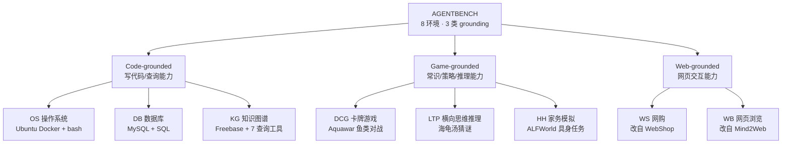
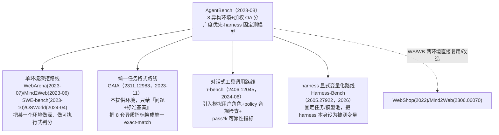

# AgentBench：把大语言模型当智能体来评测

> 组会汇报文档 · ~20 页 · 50 分钟组会级 · PPT 风格。忠于 arXiv 2308.03688v3（ICLR 2024）原文，PDF 共 58 页
> （正文 1–9 页含致谢，参考文献 10–16 页，Appendix A–J 共 17–58 页）。提取方式：Read 工具对该 PDF 报
> `pdftoppm` 缺失，改用 Bash 调用 `pdftotext -f <start> -l <end> -layout` 分四段提取全文；Table 1–4、Table 6
> 等跨列表格在 `-layout` 模式下出现列错位，已改用 `pdftotext ... -raw` 对页 3、6–8、33–34 重新提取并逐格核对，
> 本文档所有表格数字均已完成这一核对，并额外做了三类算术自检（见 §16 的 OA 公式反推验证、§17 的 6/8 环境
> 最优模型逐列核验、Table 4 的按列求和自检），凡原文未给出解释的数字出入，一律标注"原文未言明"，不编造。
> 全篇数字均标注 §/Table/Figure/Appendix 出处；本报告的编号（§1、§2…）是本文档自己的组织顺序，与原文的
> 章节号（Sec. 3.1、Appendix B 等）分属两套体系，引用原文处一律写"原文 §x.x"或"Appendix X"以示区分。

---

## §1　TL;DR（一页讲清这篇在干嘛）

> 主讲提示：开场先立住"这是一篇多环境 benchmark 论文，不是 agent 方法论文"——它不教模型怎么变聪明，它第一次
> 把"LLM 当 agent 用"这件事从零散的单点尝试，做成了一张有 8 个格子的系统性成绩单。

一句话：AgentBench 是**第一个系统性、多维度**的 LLM-as-Agent 基准（摘要；原文 §1："the first systematic
benchmark to evaluate LLM-as-Agent on a wide array of real-world challenges"，Figure 2 标题）——它横跨
**代码（Code）、游戏（Game）、网页（Web）**三类"接地"（grounding），搭出 **8 个彼此独立、可交互执行**的环境：
操作系统（OS）、数据库（DB）、知识图谱（KG）、卡牌游戏（DCG）、横向思维推理游戏（LTP）、家务模拟
（HH，改自 ALFWorld）、网购（WS，改自 WebShop）、网页浏览（WB，改自 Mind2Web）（原文 §1；Figure 4）。
用统一的 Chain-of-Thought（CoT）+ Action 单轮交互协议，评测了 **29 个 LLM**——10 个 API 商用模型 + 19 个
≤70B 的开源（OSS）模型（Table 1）。核心数字：最强模型 gpt-4 总分（Overall Score, OA）**4.01**，是 19 个
OSS 模型均分 **0.51** 的近 8 倍（API 均分 2.32，§4.2/Figure 3）；跨 8 个环境、29 个模型平均，最大的失败
原因不是"答错了"，而是**Task Limit Exceeded（轮数耗尽，TLE，均值占比最高）**——尤其在知识图谱（67.9%）和
横向思维推理（82.5%）两个环境上（Table 4）。

- **属于 harness 的哪一层（Θ1）**：本篇的重心是 **V（Validation/评测）+ O（Observability/可观测）** 层——
  8 套各不相同的 checking pipeline（单测脚本/哈希比对/F1/reward 函数/game progress/Step SR）定义了"什么算
  成功"，Server-Client 解耦架构 + 最大流调度 + 断点续跑（Appendix A）给了早期的可观测、可复现基础设施。但
  与"几乎不碰 E/T/C/L"的 SWE-bench（本库同组已精读，2310.06770）不同，AgentBench 必须**为 8 个领域各自
  定义一套可运行环境**（Docker 化的 Ubuntu/MySQL、Virtuoso 知识图谱服务、C++/pybind 卡牌引擎、ALFWorld
  模拟器、WebShop 模拟器、Mind2Web 网页快照），因此也扎实地触及了 **E（环境）**层；KG 环境显式定义的 7 个
  查询工具触及 **T（工具）**层；§4.1 的"超预算就砍掉最早几轮对话"策略触及 **C（上下文）**层。是本库六层里
  **覆盖面最全、但每层都刻意做浅**的一篇——这本身就是它"广度优先"设计哲学的直接产物（详见 §2）。
- **权威性来源**：ICLR 2024 接收（原文页眉逐页自署；据 iclr.cc 官方页面标题记为 Poster，见 YAML 字段注），
  清华大学 + 俄亥俄州立大学 + UC Berkeley 团队出品，代码/数据/工具箱三件套开源（GitHub THUDM/AgentBench），
  被本库已成稿报告反复引用为"多环境评测"路线的开篇之作。
- **本文带走的 3 条结论**：
  1. **"横跨 8 个环境"不是凑数，而是这篇论文对"单环境基准看不全能力剖面"这一诊断的直接回应**——原文 §1
     明说"most benchmarks now for agents focus on single environments and thus fail to provide a
     comprehensive overview of LLMs across diverse application scenarios"，这句话是全篇设计哲学的总纲
     （详见 §2）。
  2. **8 个环境的失败模式系统性地不同**——DB/DCG 主要死于格式错误（Invalid Format）、HH/WB 主要死于非法
     动作（Invalid Action）、KG/LTP 主要死于轮数耗尽（TLE），OS/WS/WB 则多数能顺利完成（Table 4）——这张
     "失败画像因环境而异"的表，本身就是"横跨多环境"这个设计决策换来的、单一环境基准根本给不出的信息
     （详见 §18）。
  3. **总分不是简单平均，而是"用每个环境自己的跨模型均分的倒数"做权重**——这套"Weight-1"机制专门用来
     压制 Web Shopping 这类"人人都能拿高分"的环境喧宾夺主，本文档已用 gpt-4/codellama-34b 两个模型的原始
     分数反推验证，误差在四舍五入范围内（详见 §16）。

---

## §2　问题与动机：为什么"单环境基准"已经不够用了

> 主讲提示：这一页是 Why 三连的问题层 + 设计层，务必讲清楚"横跨 8 个差异巨大的环境"这个设计选择本身在
> 回答哪个具体问题，而不是含糊地说"更全面"。

**Why（问题层）——不解决会卡住什么？**

原文 §1 开篇给出三条并列的历史局限：① 前 LLM 时代的文本游戏环境（TextWorld、Jericho、LIGHT 等）"往往受限于
封闭、离散的动作空间，且主要窄聚焦于模型的常识接地（commonsense grounding）"；② 后来的具身 agent 尝试
（基于游戏/GUI/室内场景的复杂多模态模拟器）虽然复杂，却"不能准确反映 LLM 的实际使用场景"，且它们的多模态
属性给"迫切需要评测的纯文本 LLM"制造了门槛；③ 最关键的一条——"现在多数 agent 基准都聚焦单一环境，因此
无法提供 LLM 在多样应用场景下的综合概览"（原文 §1 原句改写）。

**Why（设计层）——为什么要横跨 8 个差异巨大的环境，而不是像 WebArena/SWE-bench/OSWorld 那样把一个环境
做深？**

> 朴素做法 A（当时多数工作在做的）：只深挖单一环境（如只做文本游戏，或只做具身家务模拟）。→ 会把评测视角
> 焊死在某一个狭窄的能力切面上（比如只测"常识接地"），既看不到模型在写 SQL、查知识图谱、逛网店、玩策略
> 卡牌等其它维度上的表现差异，也容易让"某环境特有的套路技巧"被误认成"通用 agent 能力"。
>
> 朴素做法 B：找一个理论上能表达任意任务的"万能环境"做深挖（比如 OS 终端——终端能表达几乎一切计算任务）。
> → 会遇到"能表达一切"不等于"能测出一切"的问题：终端这单一环境测不出模型在"多轮追问式收敛推理"
> （LTP）、"身份隐藏下的策略博弈"（DCG）、"部分可观测环境下的工具链检索"（KG）这些**定性不同**的智能
> 维度上的差异——这些差异恰恰是 Table 4 最终呈现出的、按环境系统性分化的失败画像（DB/DCG 死于格式、
> HH 死于非法动作、KG/LTP 死于轮数耗尽，详见 §18），单一环境基准无论挖多深都看不到这张图。
>
> AgentBench 的选择：横跨 **3 类 grounding（代码/游戏/网页）× 8 个环境**，代价是每个环境本身都相对"浅"
> （比如 DB 只有 300 条题、KG 实际只测约 170 条，详见 §22），换来的是一份**能力剖面（capability profile）**
> 而非一个孤立分数——这正是原文标题强调"multi-dimensional benchmark"（多维度基准）而非单纯"benchmark"
> 的原因（原文 §1）。

> **读出什么**：这个设计选择直接决定了全篇的方法论重心必须落在**跨环境的横向比较**上（详见 §17/§18），
> 而不是像 SWE-bench 那样在单一环境里把"防刷分"的协议做到极致。两种路线并非互斥而是互补——本库同期成稿
> 的 SWE-bench 报告（2310.06770）已详述"深挖一个环境、执行式判分"的路线；AgentBench 走的是"广度优先、
> 能力剖面"的路线；后续 GAIA、τ-bench 等工作又各自在这两条路线之间选取了新的坐标点（详见 §24）。

---

## §3　核心贡献与论文结构一览

原文摘要 + §1 末尾把贡献总结为三条：

1. **提出"评测 LLM 作为 agent"这一概念，并给出 AgentBench**——定义 3 类 grounding 下的 8 个环境，为 LLM
   多样化能力提供一个实用测试床。
2. **对 29 个 LLM 做系统性评测**，揭示头部 API 商用模型与 ≤70B 开源模型之间的显著差距；定量分析失败原因；
   指出代码训练对 agent 能力的影响是"双刃剑"。
3. **发布一套基于 Server-Client 架构的集成评测工具箱**，聚焦模块化与可扩展设计，任何 LLM 只要能暴露 HTTP
   接口即可接入评测（原文 §1 三条贡献改写）。

对应地，原文正文分五大块：LLM-as-Agent 的形式化定义（原文 §2）→ 8 个环境的简要构成（原文 §3）→ 评测设置
与主结果（原文 §4）→ 相关工作（原文 §5）→ 结论（原文 §6）；细节全部下放到 Appendix A–J（环境构造细节、
Prompt 样例、失败案例分析）。本报告的组织顺序基本对应这一结构，但把"8 个环境"拆成 §8–§15 逐个精读，
是本库"各子环境具体协议讲透"的写作要求所致，非原文本身的章节编排。

---

## §4　形式化定义：LLM-as-Agent 是什么、五种"游戏结束"方式

> 主讲提示：先给直觉——"agent 评测"和"单轮问答评测"的本质区别是什么，再上定义。

**直觉**：单轮问答评测里，模型说一句话、对一次答案，评测就结束了。Agent 评测不一样——模型要跟一个会
"反馈"的环境**打多个回合的交道**：说一句话/做一个动作，环境给一个新的观察，模型基于新观察再决策下一步，
如此循环，直到模型自己喊停、或者踩到某个终止条件。

**定义（原文 §2，"Interactive Evaluation of LLM-as-Agent"）**：LLM-as-Agent 的交互式评测可以看作一个
**部分可观测马尔可夫决策过程（Partially Observable Markov Decision Process, POMDP）**：

$$(\mathcal S, \mathcal A, \mathcal T, \mathcal R, \mathcal U, \mathcal O)$$

符号先定义（原文给出，本文档补充直觉）：
- $\mathcal S$：状态空间（环境内部真实状态，如数据库当前内容、房间里物品的实际位置）；
- $\mathcal A$：动作空间（agent 能做的合法操作，如 bash 命令、SQL 语句、点击某个网页元素）；
- $\mathcal T:\mathcal S\times\mathcal A\to\mathcal S$：状态转移函数（做了这个动作，世界变成什么样）；
- $\mathcal R$：奖励分配函数（这一步/这局游戏该给多少分）；
- $\mathcal U$：任务指令空间（用自然语言描述"要做什么"的那句话从哪来）；
- $\mathcal O$：观测空间（agent 能"看到"的东西，通常是 $\mathcal S$ 的部分投影，如终端标准输出、网页 HTML）。

论文记 LLM agent 为 $M$。这个六元组和标准 MDP 的差别就在"部分可观测"——多数环境里 agent 看不到 $\mathcal
S$ 全貌，只能看到 $\mathcal O$（比如 KG 环境里 agent 拿不到整张知识图谱，只能一步步用工具查询局部信息；
OS 环境里终端输出过长会被截断）。

**推理策略：只用最朴素的 CoT**（原文 §2）。LLM-as-Agent 需要强推理能力，AgentBench 采用"Chain-of-Thought
（CoT，Wei et al. 2022b）+ 动作"这一已成为业界事实标准的策略（引 ReAct，Yao et al. 2023b）。原文特别强调
**没有**引入后续更精细的策略——集成（ensemble）、反思（reflection，即 Reflexion）、搜索（search，即 Tree
of Thoughts）——理由很直白："不做多次尝试、不做重复生成、不用复杂策略，CoT 是人们部署 LLM agent 最简单、
最便宜、最常见的方式"（原文 §2 改写）。

> **读出什么（Θ2 前哨）**：这是一处值得留意的方法学选择——AgentBench 刻意把"控制循环"（L 层）钉死在最
> 朴素的单轮 CoT+Action，不引入任何后处理策略。这意味着 Table 3 的所有分数，量的都是"裸 CoT 循环下的模型
> 能力"，而**不是**"模型 + 更精细的 harness（如反思、搜索、多次采样投票）组合后能达到的上限"。这个选择
> 本身就是一次隐含的 harness 固定——后文 §19 会展开讨论这对 Θ2（Agent = Model + Harness）意味着什么。

**五种"游戏结束"的方式（原文 §2，"Typical Types of Finish Reasons"）**：原文明确指出——即便是当时最强的
gpt-4，也"不够格被称为一个实用的 agent"（原文 §2 改写），并把每条轨迹的终止原因归为五类：

| 终止类型 | 缩写 | 定义（原文 §2） |
|---|---|---|
| Context Limit Exceeded | CLE | 交互历史长度超过 LLM 最大上下文长度（仅出现在 2,048 长度的 text-davinci-002/003） |
| Invalid Format | IF | agent 没有遵循格式指令 |
| Invalid Action | IA | agent 遵循了格式指令，但选择的动作本身非法 |
| Task Limit Exceeded | TLE | 达到预设最大交互轮数仍未解决，或开始多轮重复生成 |
| Complete | — | 任务正常结束（不代表做对，只代表"跑完了"） |

原文点明：IF 与 IA 大多源于 LLM **指令遵循能力弱**；TLE 则往往暗示模型在特定任务上**多轮能力弱**（原文
§2）。这五分类是全篇失败分析（§18）的骨架，本身就是一份可以直接搬到我们自己 harness 里的诊断模板
（详见 Inspires-Us a）。

---

## §5　符号与术语表

> 主讲提示：后文统一用下表记号；原文散文中出现的英文缩写在此统一给出中文对照。

| 记号/术语 | 含义 | 首次出现 |
|---|---|---|
| $(\mathcal S,\mathcal A,\mathcal T,\mathcal R,\mathcal U,\mathcal O)$ | LLM-as-Agent 的 POMDP 六元组 | 原文 §2 |
| $M$ | 被测 LLM agent | 原文 §2 |
| CoT | Chain-of-Thought，思维链 | 原文 §2 |
| CLE/IF/IA/TLE | 四类失败终止原因（第五类 Complete 为正常结束） | 原文 §2 |
| OS/DB/KG/DCG/LTP/HH/WS/WB | 本报告对八个环境的统一简称（操作系统/数据库/知识图谱/卡牌游戏/横向思维推理/家务模拟/网购/网页浏览） | 原文 §3、Table 2 |
| SR | Success Rate，成功率 | Table 2 |
| OA | Overall Score，AgentBench 总分（8 环境加权平均） | 原文 §4.1、Table 3 |
| Weight-1 | Table 2 中"某任务在全部 29 模型上的跨模型均分"，用其倒数做加权系数 | Table 2、原文 §4.1 |
| $(u_0,a_0,\dots,u_k,a_k)$ | 一条交互轨迹（用户/环境回合 $u_i$、agent 回合 $a_i$ 交替） | 原文 §4.1 |
| F2P/P2P | 本文档说明：AgentBench 不使用此记号，此处留空以提醒读者与本库同组 SWE-bench 报告的记号区分 | — |

---

## §6　八环境总览：三类 grounding 与统计画像

**三类 grounding**（原文 §1，Figure 4）：



原文 §1 明确三类各自考验什么："Code 类考验编码与推理能力；Game 类不要求编码专长，而更考验对常识和世界
知识的综合理解；Web 类考验真实世界最主要的人机交互界面——网页——上的推理与决策能力"（改写自原文 §1、
§3.1–§3.3 各段开篇）。其中 **5 个环境是首次提出**（原文 §1："five out of eight are created for the
first time"），KG、DCG、LTP、OS、DB 均为 AgentBench 自建；HH 改编自 ALFWorld（Shridhar et al. 2020b）、
WS 改编自 WebShop（Yao et al. 2022）、WB 改编自 Mind2Web（Deng et al. 2023，本库 F 组已精读 2306.06070）。

**统计画像（Table 2，本文档已用 `-raw` 模式核对）**：

| 环境 | #Avg.Round | 指标 | #Dev（样本/总轮数） | #Test（样本/总轮数） | Weight-1 |
|---|---:|---|---:|---:|---:|
| OS | 8 | SR | 26 / 240 | 144 / 1200 | 10.8 |
| DB | 5 | SR | 60 / 300 | 300 / 1500 | 13.0 |
| KG | 15 | F1 | 20 / 300 | 150 / 2250 | 13.9 |
| DCG | 30 | Reward | 12 / 360 | 20 / 600 | 12.0 |
| LTP | 25 | Game Progress | 20 / 500 | 50 / 1250 | 3.5 |
| HH | 35 | SR | 20 / 700 | 50 / 1750 | 13.0 |
| WS | 5 | Reward | 80 / 400 | 200 / 1000 | 30.7 |
| WB | 10 | Step SR | 31 / 400 | 100 / 1000 | 11.6 |

**"#Avg. Round" 同时是round限制**：Table 2 标注"估计的单题解题轮数"，但把它和 Appendix 逐环境细节对照
后可确认——它同时就是评测时实际强制的**轮数上限**：Appendix B.2 明写 OS "若超过轮数上限（默认 8）判定
失败"，与 Table 2 的 OS=8 精确一致。这不是巧合：DB×5=1500（精确匹配 #Test 300/1500）、KG×15=2250（精确
匹配）、DCG×30=600（精确匹配）、LTP×25=1250（精确匹配）、HH×35=1750（精确匹配）、WS×5=1000（精确匹配）、
WB×10=1000（精确匹配）——除 OS（144×8=1152≠1200，Dev 26×8=208≠240）与 WB Dev（31×10=310≠400）两处外，
其余全部逐位精确吻合，本文档已逐项验证。OS/WB Dev 的这两处出入原文未说明，推测可能与 OS 允许 QA 类任务
中途提前 commit、WB 每步都是独立多选题因而实际调用次数不严格等于"样本数×固定轮数"有关，如实标注不做
过度推测。

> **读出什么**：这份"按环境单独校准轮数预算"的设计——从 WS/DB 的 5 轮到 HH 的 35 轮，跨度 7 倍——本身
> 就是"横跨多环境"必须解决的一个具体工程问题：单一环境基准不需要考虑"不同领域的天然解题步数差异有多大"
> 这件事。Weight-1 列跨度更大——从 LTP 的 3.5 到 WS 的 30.7，接近 9 倍——直接说明"29 个模型在 WS 上的
> 平均绝对分数天然就比在 LTP 上高得多"，这正是 §16 要讲的"为什么不能直接平均"的数据依据。

---

## §7　评测系统设计：Server-Client 解耦架构与最大流调度

> 主讲提示：这一页是 Why 三连的设计层，讲清楚"为什么要专门设计一套评测工具箱"而不是拿现成脚本糊一糊。

**Why（设计层）——为什么需要专门造一套评测框架，而不是像多数单环境基准那样写个跑分脚本了事？**

> 朴素做法：延续传统 agent 评测框架的做法——针对某个特定任务定制评测脚本，Task/Agent/Evaluation 三者
> 通常跑在同一个进程或子进程里，必须同机部署，一次只能测一个 agent 对一个任务（原文 Appendix A.1 对"传统
> 框架局限"的三点总结）。→ 对 AgentBench 这种要同时管理 8 套完全不同技术栈的环境（Docker/MySQL/Virtuoso/
> C++引擎/模拟器/网页快照）× 29 个模型的场景，这种做法会导致环境配置互相冲突、无法并行、无法跨机器扩展。
>
> AgentBench 的选择（Appendix A.2）：**Task Server / Agent Server / Evaluation Client 三者解耦**，之间
> 用 HTTP 协议通信，可分别部署在不同设备上；复杂环境打包成 Docker 镜像，每个任务再拆成独立 worker 保证
> 环境隔离；额外引入**网络流算法**做智能调度、以及**断点续跑（resumable evaluation）**能力（Appendix A.2）。

```mermaid
flowchart LR
    AS["Agent Server(s)<br/>把待测 LLM 包装成 HTTP 服务"] -->|HTTP| EC["Evaluation Client<br/>建 Agent-Task 二部图<br/>跑最大流算法调度样本分配"]
    TS["Task Server(s)<br/>Task Controller + 若干 Task Worker<br/>各自跑在隔离环境/Docker 中"] -->|HTTP| EC
    EC -->|分配 (Agent_i, Task_j, 样本数)| AS
    EC -->|分配 (Agent_i, Task_j, 样本数)| TS
```

**最大流调度的形式化**（Appendix A.3，原文本身有编号公式 Eq.1/Eq.2）：设 $n$ 个 agent $A_1,\dots,A_n$、
$m$ 个任务 $T_1,\dots,T_m$，要对 $l$ 组 $(A_{x_k},T_{y_k})$ 各评测 $s_k$ 个样本（$1\le k\le l$），$A_k$/$T_k$
各自的 worker 数记为 $w(A_k)$/$w(T_k)$。构造流图 $G=\langle V,E\rangle$：

$$V=\{A_k\mid 1\le k\le n\}\cup\{T_k\mid 1\le k\le m\}\cup\{S,D\}$$

$$E=\{(A_{x_k},T_{y_k},s_k)\mid 1\le k\le l\}\cup\{(S,A_k,w(A_k))\mid 1\le k\le n\}\cup\{(T_k,D,w(T_k))\mid 1\le k\le m\}$$

即从虚拟源点 $S$ 到每个 agent 连一条容量 = 该 agent worker 数的边，agent 到 task 之间按"还需评测的样本数"
连边，task 到虚拟汇点 $D$ 再连一条容量 = 该 task worker 数的边；用 **Edmonds–Karp 算法**（Ford–Fulkerson
方法的一种实现，时间复杂度 $O(|V||E|^2)$，Appendix A.3）求 $S\to D$ 最大流，每条流边 $(A_i,T_j,f_{i,j})$
即分配 $f_{i,j}$ 个样本给这对 (agent, task)；分配完扣减对应边权重，评测完成后再把连 $S$/$D$ 的边权重
补回 1，并周期性对新出现的评测三元组重跑一次算法（Appendix A.3）。

> **读出什么**：这套"worker 数 = 图的边容量"设计，本质上是把"有限的计算资源（各环境能同时跑多少个
> 隔离 worker）"和"待评测的 (模型,任务) 组合"两件事，转成一个经典的网络最大流问题来自动调度——这是
> AgentBench 在 **O（可观测/编排）层**留下的一份具体系统资产，比同期多数 benchmark 论文只给"跑分脚本"
> 要工程化得多，也是本文档 Inspires-Us 里值得单独提一句的可复用设计（详见 Inspires-Us a）。

---

## §8　OS（操作系统）环境协议

> 主讲提示：8 个子环境逐一精读，每个都按"构造→动作空间→评测三段式→指标"的固定顺序讲，方便横向对比。

**构造（Appendix B.1）**：每条样本含指令、Docker 环境（默认镜像 `local-os/default`）、可选的初始化脚本
（交互开始前先跑一遍，如预设文件/用户状态）、可选的启动脚本、检查管线（checking pipeline）、可选的
参考解脚本（仅用于单元测试自检，不喂给模型）。任务分两类：**问答（QA）**（如统计目录下文件数，需要
最终 commit 一个答案）与**操作（Operation）**（如批量修改文件/用户状态，不需要 commit 答案）。

数据来源两路：**人工**——从 Stack Overflow 抓取 6,000 条带 bash/shell 标签的真实问题，按点赞数排序，
8 名编程背景的标注员挑出有挑战性的题目，每题配指令、初始化脚本、启动脚本、检查管线，并做交叉校验，
**每题标注约需 2 小时**（Appendix B.1）；**生成**——约一半的 QA 类问题由 gpt-4 生成，再经单元测试严格
过滤：① 初始化脚本必须能正常跑通（exit code = 0）；② 用参考解代码本身去跑检查管线，答案必须判定为正确
（Appendix B.1）。最终**保留 144 条高质量 OS 样本**（Appendix B.1——注意这个"144"精确等于 Table 2 里 OS
的 **Test** 集样本数，Dev 集的 26 条应是另外划出的开发集，原文未明确说明二者是否同源，如实标注）。

**动作空间（Appendix B.2）**：两种——`bash`（在 shell 里执行一段命令）、`commit`（宣告任务完成；QA 题
须在 content 字段给出最终答案，Operation 题则由检查管线自动核查系统状态）。

**评测三段式（Appendix B.1，"Evaluation Setup"）**：① **初始化**——用指定镜像起一个 Docker 容器，跑
初始化脚本布置环境；② **交互**——在容器里开一个新 shell，跑启动脚本，随后 LLM 拿到指令开始交互，每轮
选 `bash` 或 `commit`，超过轮数上限（默认 8）判失败；③ **检查**——检查管线是一串脚本 $f_1,f_2,\dots,f_n$，
$f_k$ 以模型答案 $o_0$ 与前序脚本输出 $o_1,\dots,o_{k-1}$ 为输入，即 $o_k=f_k(o_0,o_1,\dots,o_{k-1})$，
**当且仅当全部脚本都以 exit code 0 退出**才判正确（本文档据原文散文形式化）。

**指标**：Success Rate（成功/失败二元判定的样本占比）。

---

## §9　DB（数据库）环境协议

**构造（Appendix C.1）**：融合五个既有 SQL/表格问答数据集——WikiSQL、WikiTableQuestions、SQA、HybridQA、
FeTaQA——保证指令与数据的多样性；为扩充规模并规避直接抄袭原数据集，用 **gpt-3.5-turbo 做数据增强**：
给定表头与原始行，生成 10 条新行；给定表名/表头/若干 SQL 示例，生成 5 条新 SQL；每条生成的 SQL 再顺序
喂给 gpt-3.5-turbo 做**不改变原意的复述改写**（Appendix C.1、C.2）。最终采样出 **300 条**样本，分
**select / insert / update** 三类基础操作（Appendix C.1——同样精确等于 Table 2 的 DB Test 集大小）。

**评测三段式（Appendix C.1）**：① 初始化——按表内容构造初始 SQL 脚本，在 Docker 容器里起一个 MySQL
数据库并转发端口；② 交互——agent 每轮给出一条可执行 SQL 及推理过程，环境直接执行并把结果原样返回，
循环直到 agent 提交最终答案或触发轮数上限/解析失败；③ 检查——**select 类**：与标准文本答案精确匹配
（忽略顺序；数字类答案容忍等价表示，如 `5`/`5.0`/`+5` 视为相同）；**insert/update 类**：比较 agent 操作后
表的哈希值与标准 SQL 操作后表的哈希值。

**指标**：SR，且**总 SR 是三类操作 SR 的宏平均（macro average）**（Appendix C.1）——即 $\text{SR}_{DB}=
(\text{SR}_{select}+\text{SR}_{insert}+\text{SR}_{update})/3$，而非按样本数加权的微平均。

> **读出什么（呼应 §16）**：这个"宏平均防止某一操作类型样本多就压过其它类型"的小设计，和 §16 要讲的
> "Weight-1 防止某个环境分数普遍偏高就压过其它环境"是**同一种防偏斜哲学在两个粒度上的重复应用**——一次
> 用在单个环境内部（DB 的三种操作类型之间），一次用在 8 个环境之间。这说明"别让强项主导总分"是贯穿全文
> 的一条设计公理，不是孤立的一次选择。

**偏差自查（Appendix C.4）**：为验证数据增强没有引入模型偏好性偏差，用 Claude-2 重新标注一小批数据，
与 gpt-4/gpt-3.5-turbo 原始标注对比（Appendix Table 5，原文全局编号延续正文 Table 4，非独立编号）：

| 类型 | SELECT | INSERT | UPDATE |
|---|---:|---:|---:|
| gpt-4（原始） | 0.32 | 0.32 | 0.32 |
| gpt-3.5-turbo（原始） | 0.21 | 0.23 | 0.66 |
| gpt-4（新标注） | — | 0.27 | 0.66 |
| gpt-3.5-turbo（新标注） | — | 0.19 | 0.92 |

原文结论："数据呈现出一致的打分模式，即 gpt-4 在 UPDATE 上表现较弱、在 INSERT 上表现较强……这说明数据
增强方法不太可能引入实质性偏差"（Appendix C.4 改写）。

---

## §10　KG（知识图谱）环境协议

**构造（Appendix D.1）**：从既有 Freebase 知识库问答（KBQA）数据集——GrailQA、ComplexWebQuestions、
GraphQuestions——汇编而来；借助 Gu & Su (2022) 标注的 S-expression，可以精确重建每个问题对应的"最优工具
调用序列"；为保持难度，**只保留至少需要 5 次工具调用**的问题，最终积累 **1,663 条**问题（Appendix D.1）。
每条样本含：输入问题、话题实体（topic entities，免去实体链接步骤，让 LLM 专注长程规划）、金标准动作序列、
金标准答案。原文特别强调这是一个**部分可观测环境**——不像 DB 环境把整张表内容直接塞进输入，Freebase
本身太大（超 4,500 万实体、30 亿事实），不可能把知识图谱"讲述"给 LLM（Appendix D.1）。

**工具集（7 个，Appendix D.2）**：`get_relations(variable)`（列出与该变量相连的全部关系）、
`get_neighbors(variable, relation)`（按关系取邻居，返回新变量）、`intersection(var1, var2)`（两变量
求交集，类型须一致）、`get_attributes(variable)`（列出数值型属性，仅当问题涉及最值时用）、
`argmax(variable, attribute)`/`argmin(variable, attribute)`（按属性取最值实体）、`count(variable)`
（统计变量所含实体数）。最多允许 **15 步**动作（Appendix D.2）。由于零样本设置下 LLM 很难产出有意义的
输出，Prompt 里额外提供了一个完整的**教学示例**（Appendix D.2，示例问题为"用生成器循环、煤油为燃料的
双组元火箭发动机是谁设计的"，演示 `get_relations→get_neighbors→intersection→get_relations→get_neighbors`
五步串联）。

**评测三段式（Appendix D.1）**：① 初始化——用具体任务描述 + 每个工具的说明喂给 LLM；② 交互——LLM
自主调用工具积累信息，全程**完全自主决策**（"the process is entirely autonomous"）；③ 最终答案预测——
LLM 认为某个中间变量就是答案时，直接输出该变量并结束。

**指标（Appendix D.1）**：**F1**（主指标，比较预测答案集合与金标准答案集合）；**Exact Match**（这里的
判定口径是预测答案集合与金标准答案**集合**是否完全一致，而非传统 KBQA 常用的"逻辑形式精确匹配"）；
**Executability**（动作序列执行后只要产出任意一个答案集合就记 1.0，否则 0）。

原文写"我们用数据集里前 500 条任务做评测"（Appendix D.1），但 Table 2 给出的 KG 环境 Dev+Test 合计只有
20+150=170 条——**500 与 170 之间存在明显差异**，原文未进一步说明这中间的筛选/切分逻辑，如实标注，
不做过度推测（详见 §22 的系统性梳理）。

---

## §11　DCG（数字卡牌游戏）环境协议

**构造（Appendix E.1）**：基于 THUAC（2021 清华学生 Agent 竞赛）的简化卡牌对战系统 **Aquawar**。双人对战，
每方 4 张"鱼"卡（从 10 种鱼里选，Appendix E.2），初始 400 血、200 攻击力，各带一个主动技能和一个被动技能。
**断言机制（Assertion）**是 Aquawar 的核心策略点——每方鱼的身份初始隐藏，对手每回合可以猜一条存活且未
曝光的鱼的身份，猜中则该鱼身份公开、且对方全部存活的鱼受到伤害。为平衡参与度与复杂度，设计**两阶段**
规则：第一阶段去掉断言机制，第二阶段保留；两阶段各测一遍，取平均作最终分（Appendix E.1）。10 种鱼的
主动/被动技能刻意存在**重叠**（如 Spray 与 Flame 共享同一被动 Counter），"目的是更好地隐藏鱼的身份信息、
增强博弈性"（Appendix E.2 改写）。

**对手策略**：两个朴素基线——纯随机动作；一个"能秒杀就秒杀，否则用主动技能，最后普通攻击"的启发式策略
（Appendix E.1）。

**评测三段式（Appendix E.1）**：① 初始化——用 pybind 编译好的游戏逻辑环境 + 基线 agent，跑在 Ubuntu 20.04
下；② 交互——按阶段把规则说明放进 prompt，LLM 与基线策略对战；**给 5 次机会**产出合法格式的动作，超出
次数直接判负（这是 8 个环境里格式容错最少的之一）；③ 结果计算——记录整场对战用于复盘，据此算出各项指标。

**指标（Appendix E.1）**：Win Round / Total Round / Win Rate / Damage Rate 等基础量之上，给出最终
reward：

$$\text{reward}=0.7\cdot\text{winrate}+0.3\cdot\text{damagerate}$$

**难度分级：战斗力与难度比**（Appendix E.4，原文本身含编号推导）。先给直觉：一队鱼能不能打赢，取决于
"打得够狠"（攻击力）和"扛得够久"（血量）的乘积效应。设鱼 $c$ 的血量为 $HP_c$、（标准攻击的期望伤害）
攻击力为 $ATK_c$；对单条鱼，战斗力定义为 $HP\cdot ATK$（原文由"谁能率先耗死对方"这一临界条件推导得到）。
推广到多鱼组队的团队 $T$：整队的总耐久是全队血量之和，而每回合平均伤害输出取全队攻击力的均值（因为每回合
只能选一条鱼出手，且对手常optimal地先集火攻击力最高者，故假设各鱼被选中概率均等）：

$$\text{Power}(T)=\frac{1}{\#T}\Big(\sum_{c\in T}HP_c\Big)\Big(\sum_{c\in T}ATK_c\Big)$$

难度比 $\rho(H\mid F)=\text{Power}(H)/\text{Power}(F)$（$F$=我方，$H$=敌方），$\rho=1$ 代表势均力敌
（Appendix E.4.2）。原文说明：主文实验中所有模型用的是**固定预设**（同一批对战场景），随机难度生成
只用于额外分析（Appendix E.4）。

---

## §12　LTP（横向思维推理游戏）环境协议

**构造（Appendix F.1）**：每条样本是一对"故事（story，即谜面）+ 真相（truth）"，经典例子即原文反复引用
的"海龟汤"："一男子走进餐厅，点了碗海龟汤，喝完后自杀身亡，为什么？"（原文摘要、Figure 2、Appendix F.1
均引此例）。样本分 **easy/medium/hard/expert** 四档难度。角色设定为**主持人（host）**（知晓故事与真相，
向解题者提供故事，并引导其猜出真相）与**解题者（solver，由被测 LLM 扮演）**——通过提问、综合主持人的
回答来逼近真相。解题者每轮只能问一个能用"是/否/无关"回答的问题；**最长 25 轮**（原文举例的默认值）；
主持人偶尔会在解题者陷入错误方向时给出提示以降低难度；解题者认为已猜出真相主要情节时可宣告，主持人
判断正确与否，正确则游戏结束（Appendix F.1）。

**评测三段式（Appendix F.1）**：① 初始化——通过本地 Python 包或 Web API 起一个 LTP 主持系统；② 交互——
给 LLM 设置玩家角色的系统提示，在最大轮数内测试；自动评测里用 gpt-3.5-turbo 把主持人回答**限定**为
"是/否/无关"三选一并从其响应中抽取；同时要求 LLM 阶段性总结自己的推理，辅助更准确地判定"游戏是否该
结束"；③ 检查——先做每个 LLM 的试跑（pilot study）收集所有可能出现的游戏局面，据此设计判定方案；自动
评测里给 gpt-3.5-turbo 设置关键词表，并提醒其考虑同义替换等灵活情形。

**指标（Appendix F.1，4 项自建指标，Game Progress 为主指标）**：**Single Game Accuracy (SGA)**——单局
内"逼近真相"的轮次占比；**Round Efficiency (RE)**——在轮数上限内多快猜出真相；**Query Relevance
(QR)**——模型提问与真相的相关度；**Game Progress (GP)**——把真相拆成若干"关键点（key points）"，测
agent 命中了多少个（主指标）。关键点由 gpt-3.5-turbo 从真相文本里总结得到，判定命中的流程是：把回答
"是"的问题改写成陈述句、把回答"否"的问题按反义改写成陈述句，再把散落的推理合并成一句话，最后与预置的
关键点逐条比对是否覆盖（Appendix F.3，附完整 prompt 链）。

**LTP 主持系统的自我验证（Appendix F.2）**：作者用人工评估校验自动主持系统在"里程碑识别"和"事实核验"上
的准确性，发现**自动评测有时比人工评测更"宽容"**——尤其在开源模型上，SGA/QR 会比人工评测显得更高；但
GP 与 RE 两项自动评测能匹配人工评测水平（Appendix F.2 改写）。

> **读出什么（Θ5 前哨）**：这是原文自己做的一次"谁来 judge 评测系统"的元校验，规模虽小，但态度诚实——
> 明确承认"用 LLM 当自动裁判会在某些指标上系统性偏松"。这类"给 LLM-as-judge 的可靠性打个折扣"的自省，
> 与本库标杆 Harness-Bench（2605.27922）"谁来 judge the judge"的隐忧、以及 auto-research 库 m9.8 的
> 独立验证收口思路是同一种判断力，值得在组会上专门提一句。

---

## §13　HH（家务模拟，改自 ALFWorld）环境协议

**构造（Appendix G.1）**：直接采用 ALFWorld（Shridhar et al. 2020b，底层基于文本游戏工具包 TextWorld）——
给定家居环境的文字描述（agent 初始位置 + 房间物品快照）与一个高层目标（如"把台灯放到桌子上"），agent
需要把目标拆解成一串具体动作，每步后拿到环境反馈，据此动态调整计划直至完成。原文使用 ALFWorld 的
**out-of-distribution（分布外）评测切分**中的 **134 个可解问题**，归为六类：pick_and_place / pick_clean_
then_place / pick_heat_then_place / pick_cool_then_place / look_at_obj / pick_two_obj（Appendix
G.1）——注意这与 Table 2 里 HH 环境 Dev(20)+Test(50)=70 条**不完全一致**（134 可解 vs 实际用 70），原文
未说明具体抽样方法，如实标注。

**评测三段式（Appendix G.1）**：① 初始化——由于问题固有的复杂度和对输出格式的高要求，采用 **1-shot**
评测：每一类问题都从训练集里挑一个相对简单、完整的同类交互过程作范例，沿用 ReAct（Yao et al. 2023b）
官方仓库的 few-shot 范例与提示格式；随后再给出具体环境描述与目标。② 交互——模型基于此前反馈与当前
环境信息生成"想法"和下一步动作；若输出格式不合法，用 **BLEU 相似度**在全部合法动作候选里找最相似的一个
作为本轮实际执行的动作（Appendix G.1——这是 8 个环境里**唯一**带有"格式容错兜底"机制的一个）；若模型
连续三次输出完全相同的内容，直接判失败以节省评测时间。③ 循环直至达成目标（成功）或超过最大动作数
（失败）。

**指标**：整体 Success Rate。

> **读出什么（Θ2 关键证据）**：这处"仅 HH 一个环境有 BLEU 相似度兜底纠错、其余 7 个环境格式错误直接
> 判负或按 Invalid Format/Invalid Action 记账"的不对称设计，是 AgentBench 论文自己实现细节里悄悄埋下的
> 一处**harness 塑形分数**的具体证据——同一个模型，如果把这套 BLEU 兜底机制搬到（或撤出）其它环境，
> 大概率会改变该环境的 Invalid Format/Invalid Action 占比、进而改变最终 SR。论文本身没有把这当成一次
> "harness 消融"来讨论，只是作为一处实现细节一笔带过，但它恰好是"harness 设计选择影响分数"的一个朴素、
> 真实、写在附录里的样本，详见 §19 的 Θ2 集中讨论。

---

## §14　WS（网购，改自 WebShop）环境协议

**构造（Appendix H.1）**：环境向 agent 展示网页的文本观察与可用动作列表；数据库来自约 **100 万件**从
amazon.com 抓取的商品，每件都标注了属性；收集了 **12,087 条**人类指令，各自关联目标商品与期望属性
（Appendix H.1，构造细节引 Yao et al. 2022 原论文）。AgentBench **采用前 500 条指令**作测试集（跟随
WebShop 官方实现）——同样，这与 Table 2 里 WS 的 Dev(80)+Test(200)=280 条存在数量差异，原文未展开说明
（详见 §22）。

**动作空间**：`search[keywords]`（用关键词检索）、`click[value]`（点击某个可点元素），二选一，与真实
电商网站的"搜索/点选"操作对应。

**评测三段式（Appendix H.1）**：① 指令——给定环境说明与回复格式后，给出购物目标；② 交互——agent 按
格式回复思考与动作，环境用简化文本网页与可点按钮列表作答，循环直到点击"buy now"或超轮数；③ 计算奖励——
直接复用 WebShop 原论文的匹配奖励公式（Appendix H.1，Eq.3/Eq.4，原文本身带编号）：

$$\text{Reward}=\frac{|U_{att}\cap Y_{att}|+|U_{opt}\cap Y_{opt}|+\mathbb 1[y_{price}\le u_{price}]}{|U_{att}|+|U_{opt}|+1}\times r_{type}$$

其中 $U,Y$ 分别代表目标商品与所选商品，$att/opt$ 代表属性/选项，$r_{type}$ 由标题文本匹配度
（TextMatch）分段决定：

$$r_{type}=\begin{cases}0,&\text{TextMatch}=0\\0.1,&\text{TextMatch}<0.1\\0.5,&\text{TextMatch}\ge0.2\ \text{且查询/类别均不匹配}\\1,&\text{否则}\end{cases}$$

（该分段判据按 if-elif 链式顺序求值，非互斥并列条件；原文（沿用 Yao et al. 2022）未进一步展开各分支
组合的完整真值表，本文档如实转录原文定义，不做超出原文的补充解释。）

---

## §15　WB（网页浏览，改自 Mind2Web）环境协议

**构造（Appendix I.1）**：直接采用 Mind2Web（本库 F 组已精读，2306.06070）的 **Cross-Domain 测试切分**——
73 个网站上的 **912 条**跨域任务，覆盖住房、招聘、社交媒体、教育、医疗、政府、家政服务等域。每条样本含
高层任务描述（如"找一门 4 星以上、时长 3-6 小时、适合中级学员的 SAP S/4 HANA 课程，加入购物车并结账"）、
参考动作序列（每步 $\{e_t,o_t\}$，$e_t$ 是目标 HTML 元素的后端 ID，$o_t\in\{$Click, Type, Select
Options$\}$）、以及每步的网页快照（原始 HTML + 此前交互轨迹）。原文指出 LLM 处理真实网页庞杂的原始 HTML
非常吃力，因此 Mind2Web 原论文提出先用一个**小语言模型（DeBERTa）**对 HTML 元素排序过滤（Appendix I.1）。

**AgentBench 对 Mind2Web 评测协议的改造（Appendix I.1）**：延续"小模型排序 + LLM 多选"的两阶段流程，
但把**候选数从 Mind2Web 原论文的 top-50 缩到 top-10**，并把元素选择重新表述成一个 5 选一的多选题
（Element Accuracy 判据）；Type/Select 类操作额外要求 LLM 给出具体文本/选项参数；采用 CoT few-shot
prompting（Appendix I.2 给出 3-example 完整范例）。原文明确提醒："因此，GPT-3.5 的结果可能与原论文
在 top-50 设置、不同 prompting 策略下的结果不同"（Appendix I.1 改写）——这是论文自己承认的一处"改造后
数字不可直接与源论文横向比较"的诚实标注。

**指标（Appendix I.1）**：**Element Accuracy**（目标元素 $e_t$ 选对与否）、**Action F1**（操作 $o_t$ 的
token 级匹配分，对 Type/Select 这类带文本值的操作单独处理）、**Step Success Rate**（每步都要求元素与
操作同时正确——报告用的**主指标**，理由是当前 LLM 的**Task Success Rate**（要求全部步骤都成功，是一种
严格的逐步合取评分）"即便最好的 LLM 也只能拿到个位数百分比"（Appendix I.1 改写）。

> **读出什么（呼应本库 F 组同组报告）**：Mind2Web 原论文自己的评测就已经是"逐步合取"的严格设计（Task
> SR 要求每一步都对），AgentBench 在此基础上又把候选数从 top-50 收窄到 top-10——这是"既要复用现成环境、
> 又要控制评测成本"的一次典型取舍，代价是牺牲了与原论文数字的可比性。这与 §9 DB 环境"macro average"、
> §16 的"Weight-1"是同一类"每处都在和成本/公平性做权衡"的设计基因。

---

## §16　总分怎么算：Weight-1 归一化机制（★核心）

> 主讲提示：这是全篇最值得停留的公式页——先讲清楚"为什么不能直接平均"，再给出公式，最后用两个模型的
> 真实数据反推验证，让"读出什么"落到实处而不是空话。

**Why（设计层）——为什么不能把 8 个环境的原始分数直接算术平均？**

> 朴素做法：把 8 个环境的分数（SR/F1/Reward/Game Progress/Step SR，量纲、量级完全不同）直接取算术平均。
> → 原文明确指出这会"被那些普遍打分更高的任务主导（比如我们观察到的 Web Shopping），压过打分较低的
> 任务"（原文 §4.1 改写）。从 §6 的 Weight-1 列就能看到问题有多严重：Web Shopping 跨模型均分 30.7，
> Lateral Thinking Puzzle 只有 3.5——直接平均，Web Shopping 一项就能把总分"稀释"得看不出模型在 LTP 上
> 的真实差距。
>
> AgentBench 的选择（原文 §4.1）：**先把每个任务的均分缩放到 1，再对各任务取平均**——具体做法是，把
> "全部被测模型在该任务上的跨模型均分的倒数"当作该任务的**固定权重**，用于未来所有评测的总分计算。

**形式化**（原文散文描述，本文档形式化并给出下标记号）：设模型 $m$ 在环境 $i$（$i=1,\dots,8$）上的原始
分数为 $s_i^m$，$\bar s_i=\text{mean}_m(s_i^m)$ 就是 Table 2 里 **Weight-1** 那一列——本文档已用 §6
表格数字核实其含义就是"该任务在全部 29 模型上的算术均分"（而非其倒数本身，二者在原文行文与表格标题之间
措辞略有交叉，本文档以数值量级核验后的含义为准，见下方验证）。权重 $w_i=1/\bar s_i$，总分：

$$\mathrm{OA}_m=\frac18\sum_{i=1}^{8}w_i\cdot s_i^m=\frac18\sum_{i=1}^{8}\frac{s_i^m}{\bar s_i}$$

**用真实数据反推验证**（本文档独立完成，原文未给出这一验证步骤）：取 gpt-4 一行（Table 3）：OS 42.4、
DB 32.0、KG 58.8、DCG 74.5、LTP 16.6、HH 78.0、WS 61.1、WB 29.0，对应 Weight-1（Table 2）10.8/13.0/
13.9/12.0/3.5/13.0/30.7/11.6，逐项相除再取均值：

$$\frac18\Big(\frac{42.4}{10.8}+\frac{32.0}{13.0}+\frac{58.8}{13.9}+\frac{74.5}{12.0}+\frac{16.6}{3.5}+\frac{78.0}{13.0}+\frac{61.1}{30.7}+\frac{29.0}{11.6}\Big)\approx\frac{32.06}{8}\approx4.007$$

与 Table 3 报告的 gpt-4 OA=**4.01** 几乎精确吻合（四舍五入误差范围内）。再验证一个 OSS 模型 codellama-34b
（OS 2.8、DB 14.0、KG 23.5、DCG 8.4、LTP 0.7、HH 4.0、WS 52.1、WB 20.0）：同样代入公式得 $\approx0.957$，
与 Table 3 报告的 **0.96** 同样精确吻合。两个独立样本都验证通过，说明本文档对 Weight-1 机制的形式化
理解准确。

> **读出什么**：这套机制和 §9 DB 环境内部的"三操作类型宏平均"是同一条设计公理在不同粒度上的两次应用——
> **别让某个天然更容易拿高分的子任务，靠绝对分值的高低去主导聚合指标**。这也是为什么本库标杆 Harness-
> Bench（2605.27922）会用"乘法 + 硬闸门"而不是简单加权和来防刷分（§6，同一份报告已详述）——两篇论文
> 独立地收敛到"聚合规则本身要设计成防偏斜的"这一共识，值得在组会上并排提一句。

---

## §17　主结果：Table 3 精读与跨环境横向对比（★核心）

> 主讲提示：先给头条数字，再做"哪个模型在哪几个环境称王"的逐列核验——这是原文自己没有摊开讲、但读者
> 一算就能挖出来的细节，务必讲透，这是"横跨多环境"这个设计选择的最终回报。

**Table 3（Test 集主结果，本文档已用 `-raw` 模式逐格核对）**：

| 类别 | 模型 | Ver. | OA | OS | DB | KG | DCG | LTP | HH | WS | WB |
|---|---|---|---:|---:|---:|---:|---:|---:|---:|---:|---:|
| API | gpt-4 | 0613 | **4.01** | **42.4** | 32.0 | **58.8** | **74.5** | **16.6** | **78.0** | 61.1 | **29.0** |
| API | claude-3 | opus | 3.11 | 22.9 | **51.7** | 34.6 | 44.5 | 14.3 | 70.0 | 27.9 | 26.0 |
| API | glm-4 | - | 2.89 | 29.2 | 42.3 | 46.3 | 34.1 | 14.2 | 34.0 | 61.6 | 27.0 |
| API | claude-2 | - | 2.49 | 18.1 | 27.3 | 41.3 | 55.5 | 8.4 | 54.0 | 61.4 | 0.0 |
| API | claude | v1.3 | 2.44 | 9.7 | 22.0 | 38.9 | 40.9 | 8.2 | 58.0 | 55.7 | 25.0 |
| API | gpt-3.5-turbo | 0613 | 2.32 | 32.6 | 36.7 | 25.9 | 33.7 | 10.5 | 16.0 | **64.1** | 20.0 |
| API | text-davinci-003 | - | 1.71 | 20.1 | 16.3 | 34.9 | 3.0 | 7.1 | 20.0 | 61.7 | 26.0 |
| API | claude-instant | v1.1 | 1.60 | 16.7 | 18.0 | 20.8 | 5.9 | 12.6 | 30.0 | 49.7 | 4.0 |
| API | chat-bison-001 | - | 1.39 | 9.7 | 19.7 | 23.0 | 16.6 | 4.4 | 18.0 | 60.5 | 12.0 |
| API | text-davinci-002 | - | 1.25 | 8.3 | 16.7 | 41.5 | 11.8 | 0.5 | 16.0 | 56.3 | 9.0 |
| OSS-L | llama-2-70b | chat | 0.78 | 9.7 | 13.0 | 8.0 | 21.3 | 0.0 | 2.0 | 5.6 | 19.0 |
| OSS-L | guanaco-65b | - | 0.54 | 8.3 | 14.7 | 1.9 | 0.1 | 1.5 | 12.0 | 0.9 | 10.0 |
| OSS-M | codellama-34b | instruct | 0.96 | 2.8 | 14.0 | 23.5 | 8.4 | 0.7 | 4.0 | 52.1 | 20.0 |
| OSS-M | vicuna-33b | v1.3 | 0.73 | 15.3 | 11.0 | 1.2 | 16.3 | 1.0 | 6.0 | 23.9 | 7.0 |
| OSS-M | wizardlm-30b | v1.0 | 0.46 | 13.9 | 12.7 | 2.9 | 0.3 | 1.8 | 6.0 | 4.4 | 1.0 |
| OSS-M | guanaco-33b | - | 0.39 | 11.1 | 9.3 | 3.2 | 0.3 | 0.0 | 6.0 | 6.2 | 5.0 |
| OSS-S | vicuna-13b | v1.5 | 0.93 | 10.4 | 6.7 | 9.4 | 0.1 | 8.0 | 8.0 | 41.7 | 12.0 |
| OSS-S | llama-2-13b | chat | 0.77 | 4.2 | 11.7 | 3.6 | 26.4 | 0.0 | 6.0 | 25.3 | 13.0 |
| OSS-S | openchat-13b | v3.2 | 0.70 | 15.3 | 12.3 | 5.5 | 0.1 | 0.0 | 0.0 | 46.9 | 15.0 |
| OSS-S | wizardlm-13b | v1.2 | 0.66 | 9.0 | 12.7 | 1.7 | 1.9 | 0.0 | 10.0 | 43.7 | 12.0 |
| OSS-S | vicuna-7b | v1.5 | 0.56 | 9.7 | 8.7 | 2.5 | 0.3 | 6.4 | 0.0 | 2.2 | 9.0 |
| OSS-S | codellama-13b | instruct | 0.56 | 3.5 | 9.7 | 10.4 | 0.0 | 0.0 | 0.0 | 43.8 | 14.0 |
| OSS-S | codellama-7b | instruct | 0.50 | 4.9 | 12.7 | 8.2 | 0.0 | 0.0 | 2.0 | 25.2 | 12.0 |
| OSS-S | koala-13b | - | 0.34 | 3.5 | 5.0 | 0.4 | 0.1 | 4.4 | 0.0 | 3.9 | 7.0 |
| OSS-S | llama-2-7b | chat | 0.34 | 4.2 | 8.0 | 2.1 | 6.9 | 0.0 | 0.0 | 11.6 | 7.0 |
| OSS-S | codegeex2-6b | - | 0.27 | 1.4 | 0.0 | 4.8 | 0.3 | 0.0 | 0.0 | 20.9 | 11.0 |
| OSS-S | dolly-12b | v2 | 0.14 | 0.0 | 0.0 | 0.0 | 0.1 | 1.2 | 0.0 | 0.4 | 9.0 |
| OSS-S | chatglm-6b | v1.1 | 0.11 | 4.9 | 0.3 | 0.0 | 0.0 | 0.0 | 0.0 | 0.5 | 4.9 |
| OSS-S | oasst-12b | sft-4 | 0.03 | 1.4 | 0.0 | 0.0 | 0.0 | 0.0 | 0.0 | 0.3 | 1.0 |

（加粗为本文档逐列核验后确认的该环境最高分；OSS-L/M/S 对应原文 Table 3 的 Large/Medium/Small 三档
open-source 分组，划分依据是模型参数量。）

**头条数字**：全体 API 模型 OA 均高于 1.00（原文 §4.2）；开源模型均分 **0.51** vs API 均分 **2.32**
（Figure 3 / §4.2），近 4.5 倍差距；OSS 阵营里 ≤70B 表现最好的是 **codellama-34b（0.96）**，仍明显落后
于最弱的 API 模型 text-davinci-002（1.25）。

**逐列核验"gpt-4 在 6/8 环境称王"这句话（原文 §4.2："gpt-4 presents the best performance on 6 out of
8 datasets"）**：本文档逐列核对全部 29 个模型分数，确认 gpt-4 确实在 **OS(42.4)、KG(58.8)、DCG(74.5)、
LTP(16.6)、HH(78.0)、WB(29.0)** 六项夺冠；**未夺冠的两项**原文没有点名，本文档逐列核验后确认是——
**DB**（claude-3-opus 以 51.7 大幅领先 gpt-4 的 32.0）与 **WS**（gpt-3.5-turbo 以 64.1 微弱领先 gpt-4
的 61.1，glm-4 的 61.6 也高于 gpt-4）。这两处"例外"是本文档独立核验得到的具体信息，原文只给了"6/8"这个
汇总说法。

**一处叙事与表格的不一致（值得单独一提）**：原文 §4.2 正文写"claude-2 and claude follow gpt-4 but quite
outperform gpt-3.5-turbo"，但按 Table 3 的 OA 排序，紧跟在 gpt-4（4.01）之后的其实是 **claude-3-opus
（3.11）与 glm-4（2.89）**，claude-2（2.49）和 claude（2.44）实际排在第 4、5 位。这处不一致的根源可以
在 Table 1 脚注里找到直接依据："标 * 的模型是在任务权重算完之后才评测的"（原文 Table 1 caption），而
claude-3 与 glm-4 恰好是两个带 * 的模型——即它们是在原始 27 模型的 Weight-1 权重已固定之后才补测、插入
Table 3 的。这说明 §4.2 这句排序描述很可能是围绕最初 27 模型撰写、v3 修订插入两个新模型后未同步更新
文字，如实标注，不代表分数本身有误（与本库同组 SWE-bench 报告 §11 发现的"v3 修订更新表格未同步更新正文"
是同一类版本一致性问题）。

**跨环境横向对比：同一个模型，换个环境，排名大洗牌**——这是"横跨 8 个环境"这个设计选择的最终回报，
也是单一环境基准不可能给出的信息：

- **没有"全面碾压"的模型**：即便是总分最高的 gpt-4，也在 DB 和 WS 两项上输给别的模型；claude-3-opus
  总分不敌 gpt-4，却在 DB 上是全场最强。
- **glm-4 在 WS 上反超 gpt-4**（61.6 vs 61.1），但 OA 排名（2.89）明显落后 gpt-4（4.01）——单看 WS 一项
  会得出与总分完全不同的结论。
- **OSS 阵营内部也不是铁板一块**：codellama-34b 在 WS 上（52.1）逼近甚至超过多个 API 模型（如 claude
  的 55.7 只高出一点，claude-instant 的 49.7 反被超过），但在 OS/DCG/LTP/HH 上几乎全灭（2.8/8.4/0.7/4.0）——
  同一个模型在不同环境间的分数落差可以达到 70 倍以上。

> **读出什么**：如果 AgentBench 只做了 WS 一个环境，codellama-34b 会显得相当能打；只做 OS/DCG/LTP/HH
> 任一个，它又会显得几乎不可用。这正是 §2 Why 三连设计层论证的"单环境基准看不到能力剖面"的具体实锤——
> 8 个环境横向摆在一起，才看得出"哪个模型强在哪一类能力"，而不是一个笼统的"强/弱"标签。

---

## §18　失败画像：Table 4 五态执行结果 × 8 环境（★核心，Why 三连结果层）

**Table 4（8 任务在全部模型上的执行结果占比均值，原文 §4.3，本文档已用 `-raw` 核对，并逐列验证求和
≈100%——OS 99.9、DB 99.9、KG 100.0、DCG 99.9、LTP 100.0、HH 100.0、WS 99.9、WB 100.0，误差均为四舍
五入所致）**：

| 结果类型 | OS | DB | KG | DCG | LTP | HH | WS | WB |
|---|---:|---:|---:|---:|---:|---:|---:|---:|
| Completed | 75.0 | 37.9 | 30.1 | 51.2 | 14.0 | 13.1 | 54.9 | 56.6 |
| CLE | 0.1 | 0.7 | 2.0 | 0.0 | 3.5 | 0.7 | 0.0 | 0.0 |
| Invalid Format | 0.0 | **53.3** | 0.0 | **38.5** | 0.0 | 0.0 | 17.2 | 0.0 |
| Invalid Action | 0.9 | 0.0 | 0.0 | 10.2 | 0.0 | **64.1** | 0.0 | **8.4** |
| TLE | 23.9 | 8.0 | **67.9** | 0.0 | **82.5** | 22.1 | 27.8 | 35.0 |

**Why（结果层）——为什么每个环境的主导失败原因都不一样？**

这张表直接兑现了 §2 提出的设计层论证——"横跨多环境"换来的正是这份**因环境而系统性分化**的失败画像，
单一环境基准根本看不到这种对比：

- **DB（53.3%）与 DCG（38.5%）死于 Invalid Format**：两者都对输出格式有严格的解析要求——DB 要求把
  SQL 精确框进指定的 markdown 代码块，DCG 要求输出严格符合 JSON schema 的动作描述（Appendix J.2.1
  原文点名这两个环境格式要求最严）。
- **HH（64.1%）与 WB（8.4%）死于 Invalid Action**：两者的合法动作空间都是**从环境状态动态生成**的
  有限集合（HH 是"当前房间可执行的动作列表"，WB 是"5 选一的候选元素"），模型很容易生成一个不在这个
  动态集合里的动作（Appendix J.2.1 原文点名这两个环境非法动作最多）。
- **KG（67.9%）与 LTP（82.5%）死于 TLE**：两者都要求长程、多轮收敛式推理（KG 至少 5 次工具调用、LTP
  最多 25 轮猜谜），模型容易在耗尽预算前都没能收敛到答案。
- **OS（75.0%）、WS（54.9%）、WB（56.6%）以 Completed 为主**：这三个环境格式相对宽松（OS 就是裸
  bash 命令、WS/WB 是简化过的点选式动作），"能不能跑完"本身不是主要瓶颈。

> **读出什么（Θ2 呼应）**：注意 DB/DCG 的"格式敏感"与 HH/WB 的"动作空间敏感"，本质上都是**评测协议
> 本身对输出契约的宽容度**在起作用，而不单纯是"模型推理能力"的差异——这与 §13 提到的"HH 唯一带 BLEU
> 兜底纠错"的观察互相印证：同一批模型，换一套更宽容的解析/纠错策略（harness 的一部分），Invalid
> Format/Invalid Action 的占比很可能显著变化，从而重新分配 Completed 与 TLE 之间此消彼长的比例。这正是
> §19 要集中讨论的 Θ2 证据链的核心一环。

**Table 6（Appendix J.2.1，Commercial API vs OSS 模型的执行结果对比，本文档已核验求和=100.0%）**：

| 模型类别 | Completed | CLE | Invalid Format | Invalid Action | TLE |
|---|---:|---:|---:|---:|---:|
| Commercial API | 61.5% | 3.0% | 6.0% | 4.6% | 24.9% |
| Open-Sourced | 39.1% | 0.0% | 10.4% | 13.6% | 36.9% |

原文结论："这些差异可能体现了商用模型的鲁棒性与泛化能力，或者是模型设计与训练阶段对细节（尤其是指令
遵循）的重视程度"（Appendix J.2.1 改写）。原文还给了一个具体反例：即便是 gpt-4，也曾在明确要求"Action:
Operation"格式的 DB 任务里，通篇给出正确的 SQL 推理却**完全没有输出规定的 Action 标签**，作者推测这
可能是"模型在训练/对齐过程中内化了某些输出模式，从而忽视了具体任务指令"（Appendix J.2.1 改写）。

---

## §19　模型侧发现：代码调优的双刃剑、对齐数据的价值、llama-2 的意外

**代码调优是双刃剑（原文 §4.3，Appendix J.2.5）**：对比 codellama 系列与 llama-2 系列（同源、仅调优
数据不同），原文结论是"代码调优能在遵循相对固定流程的任务（如 Web Shopping）上给模型带来优势，但可能
损害模型的通用思维能力"（原文 §4.3 改写）。本文档逐档核验 Table 3 具体数字，三个尺度上的模式高度一致：

| 尺度 | 环境 | codellama | llama-2 | 差值方向 |
|---|---|---:|---:|---|
| 34B/70B | OS | 2.8 | 9.7 | llama-2 大幅领先 |
| 34B/70B | DCG | 8.4 | 21.3 | llama-2 大幅领先 |
| 34B/70B | WS | 52.1 | 5.6 | codellama 大幅领先 |
| 13B | OS | 3.5 | 4.2 | llama-2 小幅领先 |
| 13B | DCG | 0.0 | 26.4 | llama-2 大幅领先 |
| 13B | WS | 43.8 | 25.3 | codellama 领先 |
| 7B | OS | **4.9** | **4.2** | **codellama 反超**（模式反转） |
| 7B | DCG | 0.0 | 6.9 | llama-2 领先 |
| 7B | WS | 25.2 | 11.6 | codellama 领先 |

DCG 与 WS 两项在三个尺度上都严格遵循"代码调优伤害 DCG、帮助 WS"的模式；但 **OS 在 7B 档发生反转**——
codellama-7b（4.9）反而略高于 llama-2-7b（4.2），且两者绝对分值都是个位数，更可能是噪声而非稳定效应，
原文没有专门讨论这一档细节，本文档如实标注这处例外，不做过度解读。原文给出的机制性解释是：DCG 需要
模型"评估双方当前局势、设计精细反制策略、在没有简单流程模板可套用的情况下拿高分"，而 WS 的 1-shot
提示"精确勾勒出购物流程模板，照抄模板即可拿到不错的分数"（Appendix J.2.5 改写）——即代码调优更擅长
"照章办事"，较弱于"临场博弈"。

**对齐数据质量的价值（原文 §4.3）**：vicuna-13b 与 llama-2-13b 共享同一基座模型，前者用 ShareGPT 数据
（由 gpt-4/gpt-3.5-turbo 生成、用户分享）做对齐，后者是 Meta 官方对齐。结果 vicuna-13b（OA 0.93）明显
优于 llama-2-13b（0.77），甚至**逼近参数量 3 倍于己的 codellama-34b（0.96）**——原文据此认为"高质量对齐
数据仍是打造更强 LLM agent 的关键"（原文 §4.3）。

**llama-2-13b 与 llama-2-70b 的"意外雷同"（原文 §4.3）**：OA 分别为 **0.77 与 0.78**，参数量相差 5.4
倍，分数几乎没有差异。原文反复核实（"carefully checking and re-running experiments, the results are
unchanged"）后给出两点猜测：① 两者预训练 token 量相同（2T），而按 Chinchilla 缩放律（Hoffmann et al.
2022），更大的模型理应配更多训练 token，llama-2-70b 可能**预训练不充分**；② llama-2-70b 可能**指令
遵循对齐不够**，导致其本应有的规模优势没有转化为 agent 能力（原文 §4.3，交叉引用 Appendix J.2.5）。

> **读出什么**：这三条发现合在一起说明——在这批 2023 年模型里，**决定 agent 能力的主要是训练数据的
> 构成与对齐质量，而非参数规模本身**。这与 §17 的"总分差距主要来自模型阵营（API vs OSS）"是同一个结论
> 在不同粒度上的重复：AgentBench 的实验设计本身把 harness（评测协议、CoT 格式、轮数预算）在全部 29 个
> 模型间**保持固定**，因此它测到的差异，逻辑上只能归因于模型侧因素——这对应 §24 要讨论的 Θ5 regime
> 定位：AgentBench 不是一篇论证"harness 比 model 更重要"的论文，它的实验设计本身决定了它测的是相反的
> 问题——"harness 固定时，model 之间能差多少"。

---

## §20　案例研究：规划一致性与自我纠错

> 主讲提示：挑两个 Appendix J.2 的具体转录片段，让"指令遵循/多轮一致性差多少"变得可触摸。

**案例一 · 家务模拟里的"找肥皂"任务（Appendix J.2.2，Figure 7）**：任务是"把干净的肥皂放到台面上"。

**gpt-4 的轨迹**：依次检查 4 个柜子 → 都没有肥皂 → 转去检查两个洗手池 → 也没有 → 检查马桶 → 报告任务
失败 → 环境反馈"Nothing happens"（说明"报告失败"本身不是合法动作）→ gpt-4 **没有慌乱地重复同一动作**，
而是自我反思"我可能漏看了什么"，转而去检查此前完全没想到的**台面（countertop）**本身 → 果然在台面上
就有一块肥皂 → 拿起、用洗手池清洗、放回台面 → 完成。原文点评："gpt-4 展现出一种深度优先搜索式的规划——
把任务拆成 Find→Clean→Put 三步，每次探索无果就回溯到父节点，还在关键时刻表现出自我反思与假设修正的
能力"（Appendix J.2.2 改写）。

**gpt-3.5-turbo 在同一任务上**：反复在"检查柜子 1（关闭）→ 打开柜子 1（看到布料，没有肥皂）→ 关闭柜子
1 → 决定检查柜子 2 → 却又摹地‘examine cabinet 2’收到‘The cabinet 1 is closed’这样文不对题的环境反馈 →
道歉、转头又重新‘examine cabinet 1’……"这一循环**至少重复了 6 轮以上**（原文转录完整对话，本文档摘要
呈现），始终没有跳出对柜子 1/2 的死循环去尝试台面。原文点评："gpt-3.5-turbo 虽然也能做出初始任务拆解，
但难以坚持原定计划——遇到失败尝试后，会逐渐迷失原始计划"（Appendix J.2.2 改写）。

> **读出什么**：这组对照直接对应 §4 定义的**TLE**（轮数耗尽）这一终止类型——同一个任务，gpt-4 靠"回溯 +
> 反思"在有限轮数内收敛，gpt-3.5-turbo 靠"局部循环"把预算耗尽在死胡同里。这也解释了 §18 里 HH 环境
> Invalid Action 占比高企的另一面——不仅是"选了非法动作"，即便动作合法，模型也可能在**语义层面**原地
> 打转，这是 Table 4 的五分类无法单独捕捉、必须靠案例转录才能看清的一层。

**案例二 · 数据库任务里的自我纠错（Appendix J.2.6）**：任务要求查询"Dunfermline Athletic 队总决赛
出场次数 < 2 时的获胜场次"，表名与列名都含空格（`Scottish Challenge Cup Finalists`、`Total final
appearances`）。claude-2 的完整轨迹：

1. 第一次尝试：`SELECT Total final appearances FROM Scottish Challenge Cup Finalists WHERE ...` →
   MySQL 报语法错误（列名含空格未转义）；
2. claude-2 读懂报错，自我更正："我的错，列名 `Total final appearances` 含空格，需要用反引号转义"
   → 重新生成 SQL，但**表名**仍未转义 → 再次报语法错误；
3. claude-2 再次读懂新的报错位置，补上表名的反引号转义 → 第三次执行成功，拿到正确结果。

原文点评："如日志所示，claude-2 成功地从 MySQL 错误信息里辨认出自己遗漏了给含空格字段加反引号这件事"
（Appendix J.2.6 改写），并总结"许多测试样例里，模型失败的主因是无法从环境反馈的报错信息里识别出自己
的错误；能做到自我纠错的模型明显领先"（Appendix J.2.6 改写）。

> **读出什么（Θ2 关键证据）**：这个案例之所以能发生"自我纠错"，前提是 **DB 环境这套 harness 把原始
> MySQL 报错信息原样透传给了 agent**（而不是像有些环境那样把错误折叠成一句"命令失败"）。这是"harness
> 的错误反馈粒度决定了模型能否发挥自我纠错能力"的一个具体、可读、写在论文附录里的正面例子——如果换一个
> 把错误信息抹平的 harness，同一个 claude-2 大概率无法完成这次纠错。这与 §13 的 BLEU 兜底、§18 的格式
> 容错讨论，共同构成本篇论文关于 Θ2（Agent = Model + Harness）最扎实的三处间接证据，详见 §24。

---

## §21　相关工作定位：AgentBench 和谁比、比赢在哪

**原文 §5 给出三条脉络**：

1. **LLM 评测**：已有综合基准（MMLU、HELM、BIG-bench）仍局限在传统任务范式，测不了开放式生成、多轮
   交互、agent 化决策（原文 §5 改写）。
2. **LLM-as-Agent**：前 LLM 时代以 TextWorld/Jericho/LIGHT 等文本游戏 + BERT/强化学习为主；CoT
   （Wei et al. 2022b）之后 LLM agent 研究开始兴起，**ReAct（Yao et al. 2023b）被原文点名为"率先把
   CoT 推理与动作结合起来的开创性工作（pioneer work）"**——AgentBench 的 CoT+Action 交互格式正是直接
   沿用 ReAct 的范式（§4 已提及）。原文接着列出一批同期涌现的进阶策略（Reflexion 的反思、Tree-of-
   Thoughts 的搜索）与应用框架（AutoGPT、BabyAGI、AgentGPT）及多智能体系统（Generative Agents、
   MetaGPT、AutoGen），但指出这些工作"缺少标准、全面的基准"，AgentBench 正是要填这个空（原文 §5）。
3. **在可执行环境中评测 LLM**：除文本游戏（如 ALFWorld）外，另一条主线是代码执行——APPS、HumanEval、
   MBPP 率先把"功能正确性"取代"文本相似度"作判分标准（这条脉络正是本库同组 SWE-bench 的更早期先声）；
   原文特别点名一项**并发工作 InterCode（Yang et al., 2023）**——一个允许模型与 Bash/SQL 环境交互的
   框架，"与 AgentBench 里的 OS 和 DB 任务相似"（原文 §5 改写）。

> **读出什么**：AgentBench 在 2023 年 8 月这个时间点，处在一个"LLM agent 研究正在爆发但缺标准基准"的
> 真空期——ReAct（2022-10）刚提供了主流交互范式，AutoGPT 等应用框架刚点燃公众兴趣，但整个领域还没有一份
> 能把"能力有多强"讲清楚的系统性成绩单。AgentBench 与几乎同期出现的 InterCode（代码执行）、稍早的
> Mind2Web（2023-06，网页）、WebArena（2023-07，网页）共同构成了 2023 年 Q3 这一波"给 LLM agent 立
> 标尺"的集中爆发；AgentBench 的独特之处在于它是这批工作里**唯一选择"多环境横向覆盖"而非"单环境深挖"**
> 的一个（详见 §2、§24）。

---

## §22　数字自查：Dev/Test 与 Appendix 构造数字的系统性出入

> 主讲提示：这一页专门汇总全文出现的多处"Appendix 里报告的构造/候选池数字" vs "Table 2 里实际用的
> Dev+Test 数字"之间的差异，这是本报告在通读全文后总结出的一个横向模式，原文没有专门讨论。

逐环境核对（Table 2 的 Dev+Test 合计 vs Appendix 对应小节报告的"最终产出/可用候选"数字）：

| 环境 | Appendix 报告数字 | Table 2 Dev+Test 合计 | 是否吻合 |
|---|---|---:|---|
| OS | "144 条高质量样本"（Appendix B.1） | 26+144=170 | 部分吻合（144 恰好=Test） |
| DB | "300 条最终数据集"（Appendix C.1） | 60+300=360 | 部分吻合（300 恰好=Test） |
| KG | "1,663 条问题"；"用前 500 条评测"（Appendix D.1） | 20+150=170 | **不吻合**，且与"500"也不吻合 |
| HH | "134 个可解问题"（Appendix G.1） | 20+50=70 | **不吻合**（134→70） |
| WS | "12,087 条指令"；"用前 500 条测试"（Appendix H.1） | 80+200=280 | **不吻合**（与 500、12,087 均不同） |
| WB | "912 条跨域任务"（Appendix I.1） | 31+100=131 | **不吻合**（912→131） |

**观察到的规律**：OS 与 DB 两个环境的"Appendix headline 数字"恰好精确等于 Table 2 的 **Test** 集大小
（144、300），暗示这两处的 Dev 集可能是从同一构造流程里额外多划出的一部分，量级上是自洽的；但 KG/HH/
WS/WB 四个环境的"Appendix 构造池/候选池"数字都明显大于 Table 2 实际使用的 Dev+Test 合计——这些环境
显然经历了从"更大候选池"到"实际评测子集"的进一步采样，但**具体采样方法原文均未展开说明**。本文档如实
记录这一模式，不做超出原文的推测；这也提示——若要复现或扩展 AgentBench 的某个子环境，"Table 2 里报告
的 Dev/Test 数字"才是实际被使用、可以直接复现的口径，Appendix 里的"构造池"数字更多是"这个环境理论上
能有多大规模"的背景信息。

---

## §23　局限与批判

**原文自陈的局限**：原文正文与 Appendix 均未设置独立的"Limitations"小节（不同于本库同组 SWE-bench 论文
有专门的原文 §7 Discussion），局限性散落在各处的措辞里——如"最强的 gpt-4 也不够格称为一个实用 agent"
（原文 §2）、"我们的社区仍需付出大量努力才能产出更强的开源 LLM"（原文 §4.2）。**原文未给出**一份集中的
局限自陈，本文档如实标注这一结构性缺失，不代表论文没有局限，只代表它没有像 SWE-bench 那样单独用一节
系统性讨论。

**本文档补充的批判性观察**：

1. **评测协议本身固定不变，因此测不出"harness 选择的影响"**——如 §19 已讨论，AgentBench 的实验设计
   把 CoT 格式、轮数预算、prompt 模板在全部 29 模型间保持一致，这是一个经过深思熟虑的控制变量（为了
   干净地比较模型），但代价是读者不能从 Table 3 的数字里读出"如果换一套更宽松的 harness，这些模型的
   排名会怎么变"——这恰恰是三年后 Harness-Bench（2605.27922）要专门补上的那块拼图。
2. **8 个环境里至少 4 个（KG/HH/WS/WB）的实际评测规模明显小于其"构造池"规模**（详见 §22），具体
   子采样方法原文未交代，这对"评测结果的代表性"构成一处应予关注、但无法在本文档内独立验证的不确定性。
3. **研究经费来源与被测模型之间存在需要披露的关联**：原文 Acknowledgement 明确写"本研究全部 GPU 与
   API 费用由智谱 AI（Zhipu AI）资助"，而评测对象里恰好包含智谱与清华共同研发的 **glm-4 / chatglm-6b**
   （Table 1 明确标注 Creator 为"Tsinghua & Zhipu"）。这**不构成**数据造假的指控——原文已经在
   Acknowledgement 里主动、清晰地披露了资助方，这份透明度本身值得肯定；但从研究诚信角度，这仍是一处
   值得读者知晓的潜在利益关联，尤其 glm-4 在 Table 3 里总分排名第三（2.89）、在 WS 环境上甚至反超
   gpt-4，这类"资助方相关模型表现亮眼"的情形，理想情况下会由第三方复现来交叉验证，本文档未做这一步
   独立复现，如实标注这一局限。
4. **LTP、KG 等环境的自动裁判本身依赖 gpt-3.5-turbo**（§10、§12 已提及），原文自己的人工校验（Appendix
   F.2）已经发现"自动评测有时比人工评测更宽容，尤其对开源模型"——这意味着 Table 3 里 LTP 一列的绝对
   分值，可能对不同模型阵营存在系统性的松紧不一致，原文没有对这一发现做进一步的分数修正或敏感性分析。
5. **静态基准的污染风险**：与本库同组 SWE-bench 报告 §18 讨论的规律相同，AgentBench 的 8 个环境（尤其
   是 OS/DB 里含 gpt-4 生成并公开发布的题目与参考解）随着时间推移、被后续模型的训练语料抓取，存在与
   SWE-bench 类似的"静态基准保鲜期"问题；**原文未给出**任何形式的时间切分或污染自查（不同于 SWE-bench
   原论文至少做了一次按 issue 创建时间切分的自查），本文档未检索到 AgentBench 是否有后续"去污染版"或
   社区复核，如实标注为"原文未给出，本文档也未找到后续公开复核信息"。

---

## ★ 对我们的启发（Inspires Us）

> 这一节是组会高潮。AgentBench 本身既是"8 个环境的定义者"（E 层）也是"评测协议与工具箱的设计者"
> （O/V 层）——我们自己的 Claude Code / `m9.*` agent 同样天天在"多个环境（不同代码库、不同任务类型）
> 里跑同一套控制循环"，下面每条都能直接打到我们自己的 harness 上。

➤ **a. 可直接借用的招**：**五类终止原因分类法（CLE/IF/IA/TLE/Complete，原文 §2）**是一个极轻量、极
易实现的诊断模板——只需要在我们自己 agent 的每条轨迹结束时打一个标签（超预算终止？格式解析失败？
动作校验失败？轮数耗尽？正常结束？），就能立刻复现出 Table 4 那种"失败画像因任务类型而异"的诊断表。
**Table 4 本身的"按环境分列失败原因"这一呈现方式**也值得直接照搬——如果我们同时在多个 `learning/`
教学模块或多个真实任务类型上跑我们自己的 agent，按"契约违规/工具调用非法/循环未收敛/正常完成"四列
把结果摆开，立刻能看出哪类任务是我们当前 harness 的短板（是格式约束太严？还是控制循环不会跳出死胡同？）。

➤ **b. 可迁移到我们课题的思路**：**Weight-1 归一化机制**（§16，"用每个任务自己的跨模型均分的倒数
做权重"）可以直接迁移到 `runbook-verification-task` 记忆条目提到的多模块验证体系——如果我们要给
`learning/` 下几十个教学模块算一个总体"健康度"，不同模块天然的"平均通过率"差异很大（有的模块几乎
人人都能跑通，有的模块本身就刁钻），直接算术平均会让"容易模块"主导总分；借用 AgentBench 的思路，
先给每个模块算出"历史跑分的均值"，用其倒数做权重再聚合，能得到一个更公平地反映"相对表现"而非"绝对
难度"的健康度指标。**迁移前提**：需要先积累一批历史跑分数据才能算出稳定的"均值"，这是当前基础设施
里还缺的一环。

➤ **c. 它暴露的开放问题 = 我们的机会**：AgentBench 把"CoT+Action、轮数预算、prompt 模板"在全部 29
个模型间钉死，这个控制变量设计干净地测出了"模型侧差异"，但**完全没有触碰"harness 侧差异"这个维度**
（§19、§23 已讨论）——它甚至在实现细节里留下了值得深挖的线索：HH 环境的 BLEU 相似度纠错兜底（§13）、
DB 环境把原始 MySQL 报错透传给 agent 因而支持自我纠错（§20 案例二）。机会：拿 AgentBench 已经开源的
OS 或 DB 环境（最自包含、最小成本可复现），固定同一个模型，只切换"错误反馈粒度"这一个 harness 变量
（原始报错 vs 折叠成通用失败提示 vs 完全不反馈），measure 一下 Invalid Format/TLE 占比与最终 SR 会
移动多少——这其实就是一个迷你版的 Harness-Bench（2605.27922）消融，而且可以完全用 AgentBench 已发布
的资产做，不需要重新造环境。**可下手的第一步**：先在 OS 环境上，对 2-3 个开源模型分别跑"错误信息全量
透传"与"错误信息统一折叠为 `Command failed`"两种配置，对比 SR 与 TLE 占比的变化。

➤ **d. 与本库其它论文/模块的连接**：AgentBench 的 **WS 环境直接复用 WebShop（Yao et al. 2022）**、
**WB 环境直接改造自本库 F 组已精读的 Mind2Web（2306.06070）**——§15 已详细核对了 AgentBench 对 Mind2Web
评测协议的具体改造（top-50→top-10、多选题重构），这是"同一个环境资产被后续多环境基准复用/改造"的一个
具体样本，值得和 Mind2Web 报告并排读。与本库 v2 标杆 **Harness-Bench（2605.27922）**互为对角样本——
AgentBench 固定 harness 测模型、Harness-Bench 固定模型测 harness，二者分别站在"Model×Harness"矩阵的
两条边上，§24 会展开这层关系。与本库同组 canon **SWE-bench（2310.06770）**互为"广度 vs 深度"的镜像——
两篇论文几乎同期（2023-08 vs 2023-10），前者横跨 8 个浅环境，后者深挖 1 个可执行环境，二者共同框定了
"agent benchmark 设计"这条谱系的两个端点（§2、§24）。

➤ **e. 如果我来做下一步（第一人称）**：我会先把 §4 的"五类终止原因"标签体系，接到我们自己某个正在
用的 agent 工作流（例如本课 `learning/agent-harness-frontier` 报告撰写这条 pipeline 本身，或
`for_real_dummy` 系列教学模块的验证流程）上——给最近若干次运行手工标注终止原因，看我们自己的失败是不是
也像 Table 4 里某些环境那样，被单一类型（比如"格式/契约违规"）主导；如果是，就照着 §13/§20 的发现，
优先检查我们的错误反馈是否被过度折叠（有没有把工具的原始报错信息喂回给模型），而不是急着换更强的模型。

---

## §24　版图定位：canon 坐标、Θ1/Θ2/Θ4/Θ5 汇总

**Θ1・E/T/C/L/O/V 归属**：AgentBench 的重心在 **V（Validation）+ O（Observability）**——8 套各异的
checking pipeline 定义"什么算成功"（§8–§15 逐一细述），Server-Client 解耦架构 + 最大流调度 + 断点续跑
（§7）是一份具体的可观测/可复现系统资产。但与"几乎不碰 E/T/C/L"的 SWE-bench 不同，AgentBench 因为要
**从零定义 8 套可运行环境**，客观上也产出了 **E 层**资产（8 套环境接口本身）、**T 层**雏形（KG 的 7 个
查询工具）、**C 层**雏形（§4.1 的 3,500-token 上下文省略策略）；唯独 **L 层**（控制循环）刻意保持
最朴素——直接借用 ReAct 的单轮 CoT+Action，不引入反思/搜索/多次采样（§4）。六层里覆盖面最全、但深度
最浅的一篇，这正是"广度优先"设计哲学（§2）在六层框架上的投影。

**Θ2・回扣"Agent = Model + Harness"**：AgentBench **没有**像 Harness-Bench 那样做正式的"同模型换
harness"消融——它的实验设计恰恰相反，是把 harness（CoT 格式、轮数预算、prompt 模板）在全部 29 模型间
**钉死**，专门用来测模型侧差异（§19 已详述这是它的核心方法论选择，不是缺陷）。但细读实现细节，仍能挖出
三处间接、朴素、写在附录里的"harness 影响分数"的证据：① **HH 环境唯一带 BLEU 相似度格式兜底**（§13），
其余 7 个环境格式错误直接判负——同一个模型换一套格式容错策略，Invalid Format/Invalid Action 占比大概率
会变；② **Table 6 的 Commercial vs OSS 格式错误率差异**（Invalid Format 6.0% vs 10.4%、Invalid Action
4.6% vs 13.6%，§18）部分反映了"这套严格的 CoT+Action 协议对没有专门对齐过格式的模型不友好"，混杂了
"推理能力"与"协议适配度"两种不同的信号；③ **DB 环境把原始 MySQL 报错透传给 agent，才使 claude-2 的
自我纠错成为可能**（§20 案例二）——若换一个折叠错误信息的 harness，同一个模型的这次纠错大概率不会发生。
这三处证据的共同点是：**论文自己没有把它们框定成"harness 效应"来讨论**，是本文档在读完全篇后归纳出来的
观察，值得在组会上和 Harness-Bench 的正式消融结果并排讨论。

**Θ4・canon 坐标与后续演化谱系**：AgentBench（2023-08，ICLR 2024）是本库 G 组与 SWE-bench 并列的两块
2023 年地基石——第一个系统性、多维度的 LLM-as-Agent 基准。演化谱系（本文档整理，非原文自带）：



（B/F 两支为本库已成稿报告可直接查阅；C/D 两支论文虽已收录进本库 papers 目录，但**本报告未在本次任务中
重新精读其 PDF**，图中描述基于本文档撰写时对这两篇论文的既有认识——GAIA 的核心设计是抛弃环境本身，只给
"问题+标准答案"、让被测系统自带任何 agent 栈，评测收敛为单一的答案匹配；τ-bench 的核心设计是引入一个由
LLM 扮演的模拟用户与被测 agent 做多轮对话，并强调"多次独立试跑下是否稳定达标"的 pass^k 可靠性指标——
这两条概括均为结构性、非数字性描述，具体数字请以该两篇论文原文为准，本文档不代为断言。）

**在这张谱系图里，AgentBench 与 GAIA 的对比最能说明"多环境评测"这条路线内部也存在分叉**：AgentBench
选择"我们造 8 套环境，你只需要带模型来"；GAIA 选择"我们只给问题和答案，你带你自己的整套 agent 系统来"——
前者的评测对象更接近"裸模型在标准化脚手架下的表现"，后者的评测对象更接近"一整套 agent 系统（模型+工具+
编排）的综合表现"。这个分叉本身，恰恰呼应了本库反复强调的 `Agent = Model + Harness` 命题——AgentBench
的 8 个环境，某种意义上就是论文作者亲自实现的、被固定下来的那部分"Harness"，GAIA 则把这部分完全留白，
交给被测方自己填。

**Θ5・regime 诚实**：不能把 AgentBench 读成"证明了 harness 比 model 更重要"（它压根不是为验证这个命题
设计的实验）；反过来也不能把它读成"证明了 model 比 harness 更重要"（它的 harness 全程固定，没有对照
组）。诚实的定位是——**AgentBench 回答的是"harness 固定时，不同模型能差多少"，这与 Harness-Bench 回答
的"model 固定时，不同 harness 能差多少"是两个互补但不可互相替代的问题**；本文档在 §19、Θ2 段落里挖出的
三处间接证据（BLEU 兜底、格式错误率的阵营差异、错误透传使能自我纠错），只能提示"harness 的具体实现
细节可能在悄悄影响分数"，**不能**、也不应该被拿来当作"harness 效应有多大"的定量结论——量化这件事，
需要像 Harness-Bench 那样专门设计的对照实验，AgentBench 本身没有提供。

---

## §25　组会讨论问题

1. §16 的 Weight-1 机制用"跨模型均分的倒数"防止 Web Shopping 这类"人人都能拿高分"的环境主导总分。
   如果换成本库标杆 Harness-Bench 式的"乘法 + 硬闸门"聚合（而非加权算术平均），AgentBench 这 29 个
   模型的排名会怎么变？哪个模型受益/受损最大？
2. §18 的 Table 4 显示 DB/DCG 死于格式错误、HH/WB 死于非法动作、KG/LTP 死于轮数耗尽。如果给 8 个环境
   统一装上 §13 提到的"BLEU 相似度格式兜底"，你预期哪个环境的 SR 会涨得最多？这种兜底本身算不算一种
   "隐性的更宽容的 harness"，会不会让评测失去区分度？
3. §19 发现 llama-2-13b 与 llama-2-70b 表现几乎雷同，原文猜测是预训练/对齐不充分。如果要在 AgentBench
   的框架下设计一个实验来区分"预训练不足"与"对齐不足"这两种假说，你会怎么设计？
4. §24 的 Θ2 讨论指出 AgentBench 没有做"同模型换 harness"的正式消融。如果要在不新建环境、只用
   AgentBench 已开源的 OS/DB 环境的前提下，设计一个最小成本的 harness 消融（比如只切换错误反馈粒度），
   你会怎么设计对照组？
5. §21 提到 AgentBench 与 InterCode 是同期的并发工作，都覆盖了"Bash + SQL"这类代码执行场景。如果要
   合并两者的任务集合做一次交叉评测，你预期两边独立构建的 OS/DB 类任务，对同一批模型的排序会有多一致？

---

## §26　一页速记

- **是什么**：AgentBench——第一个系统性、多维度的 LLM-as-Agent 基准，横跨代码/游戏/网页 3 类 grounding
  共 8 个可交互执行环境（OS/DB/KG/DCG/LTP/HH/WS/WB），评测 29 个 LLM（10 API + 19 OSS ≤70B）（⭐canon，
  2023-08 预印本，ICLR 2024）。
- **定义**：LLM-as-Agent 的交互式评测形式化为 POMDP $(\mathcal S,\mathcal A,\mathcal T,\mathcal R,
  \mathcal U,\mathcal O)$，用最朴素的 CoT+Action 单轮循环（沿用 ReAct），失败归为 CLE/IF/IA/TLE/
  Complete 五类（原文 §2）。
- **设计动机（★核心）**：多数既有基准只测单一环境，"无法提供 LLM 在多样应用场景下的综合概览"（原文
  §1）——AgentBench 用"广度优先、能力剖面"回应这一诊断，代价是每个环境相对浅（详见 §2、§22）。
- **8 环境协议（★核心）**：各自有独立的构造流程、动作空间、评测三段式（初始化→交互→检查）与指标
  （SR/F1/Reward/Game Progress/Step SR）——详见 §8–§15，仅 HH 环境带 BLEU 相似度格式兜底。
- **总分设计（★核心）**：$\mathrm{OA}_m=\frac18\sum_i s_i^m/\bar s_i$，用"任务自身跨模型均分的倒数"
  做权重防止强项环境主导（§16，已用 gpt-4/codellama-34b 数字反推验证 ≈4.01/0.96）。
- **主结果**：gpt-4 OA=4.01，OSS 均分 0.51 vs API 均分 2.32（近 4.5 倍差距）；gpt-4 在 6/8 环境称王，
  唯独 DB 输给 claude-3-opus、WS 输给 gpt-3.5-turbo（本文档逐列核验，§17）。
- **失败画像（★核心）**：DB/DCG 死于格式错误，HH/WB 死于非法动作，KG/LTP 死于轮数耗尽，OS/WS/WB 多数
  能完成——因环境而系统性分化，是"横跨多环境"设计的直接回报（Table 4，§18）。
- **模型侧发现**：代码调优是双刃剑（帮 WS、伤 DCG/OS，7B 档有反例）；对齐数据质量比参数规模更关键
  （vicuna-13b 逼近 3 倍大的 codellama-34b）；llama-2-13b 与 70b 意外雷同，疑似预训练/对齐不充分（§19）。
- **Θ2 间接证据**：HH 独有的格式兜底、Commercial vs OSS 格式错误率差异（6.0%/10.4%）、DB 环境错误
  透传使能自我纠错——三处论文没点名但可读出的"harness 影响分数"线索（§20、§24）。
- **诚实边界（Θ5）**：AgentBench 的 harness 全程固定，回答的是"model 差多少"而非"harness 差多少"；
  与三年后的 Harness-Bench（回答"harness 差多少"）是互补而非替代关系，不宜把二者的结论对调着用（§24）。
- **对我们的启发**：搬五类终止原因标签体系体检我们自己的 agent；用 Weight-1 思路给多模块教学验证体系
  算更公平的健康度；拿 AgentBench 已开源的 OS/DB 环境做一次最小成本的错误反馈粒度消融，验证"harness
  影响分数"这条线索能否被量化坐实。
- **一句话定位**：它是"agent 评测该测多宽"这个问题在 2023 年给出的第一份系统答案——GAIA 后来把"多环境"
  的"环境"部分整体外包给被测方，Harness-Bench 后来把它固定的"harness"变量本身也松开来测，AgentBench
  自己站在这条谱系的起点上。
