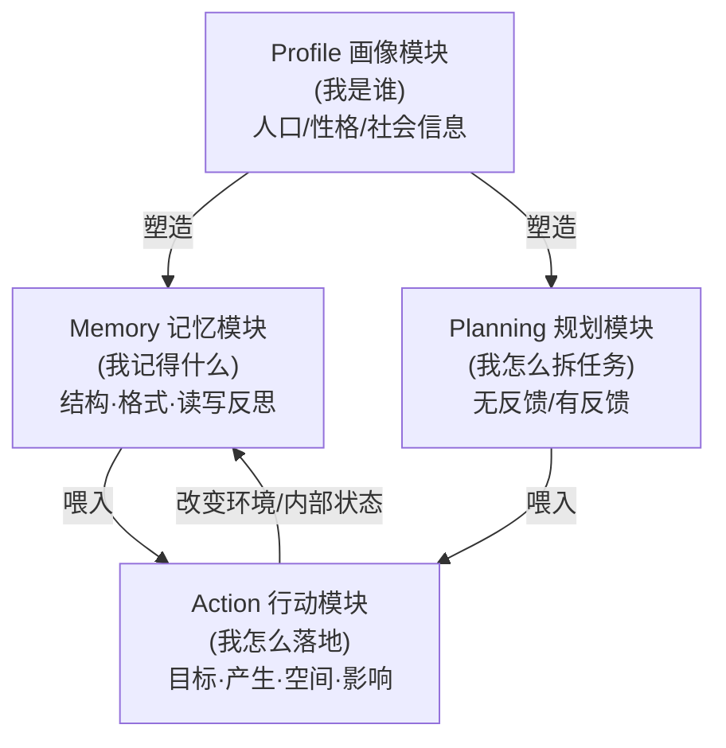

# LLM-based 自治 Agent 综述：profile / memory / planning / action 四件套奠基

> **本篇是 agent-harness 库的 A 组 canon（奠基综述）报告**。读法与标杆范文 [Harness-Bench](2605.27922-harness-bench-measuring-harness-effects.md) 互补：
> Harness-Bench 证明「换 harness 分数摆 23.8 分」是**实证压舱石**；本篇则提供**这套 harness 到底由哪几个部件构成**的**词汇表与坐标系**。
> 换句话说——Harness-Bench 量了"harness 有多重要"，这篇 2023 综述给了"harness = profile+memory+planning+action"的**解剖图**。
> 后续库内任何一篇前沿论文，都能被定位成"在这张图的哪一格里动了刀"。

---

## §1　TL;DR（一页讲清这篇在干嘛）

> 主讲提示：开场先把"四件套"这张图甩出来——它是全篇、也是后续半个库的骨架。再点明它是 **canon**，不是前沿。

一句话：**把 2021–2023 年间散落的几十个 LLM agent（Generative Agents、ReAct、Voyager、HuggingGPT、Reflexion、ChatDev…）统一进一张框架图**——一个 agent = **Profile（我是谁）+ Memory（我记得什么）+ Planning（我怎么拆任务）+ Action（我怎么落地）**（Fig 2，§2.1）。在此之上，综述再讲三件事：**怎么给 agent 装上能力**（微调 / 提示工程 / 机制工程，Fig 4）、**agent 用在哪**（社会/自然/工程三大科学域，Fig 5 + Table 2）、**怎么评 agent**（主观/客观两条线，Table 3）。

- **属于 harness 的哪一层（Θ1）**：本篇是**跨层 canon**。它不打单层，而是**给整个 harness 立词汇表**——用本库的 E/T/C/L/O/V 对照：**Profile≈给 L(Loop) 的角色先验**、**Memory=C(Context) 的全部**（结构/格式/读写反思）、**Planning=L(Loop) 的拆解与反馈**、**Action=T(Tools)+F(Environment) 的接口与后果**。可观测 O 与验证 V 则落在它的"评测"章（§4）。
- **它在全库的角色（Θ4 提前剧透）**：这是 **canon（2023 奠基）**。它**定义了**"agent 由哪四件套组成"这套通用语言；后续 C 组讲 ACI/工具、D 组讲记忆压缩、B 组讲控制循环、F 组讲环境——**都是在它划好的某一格里把内容做深**。它本身**不提供**"换 harness 摆多少分"的实证（那是 Harness-Bench 的活），但它提供了**讨论 harness 时所有人共用的名词**。
- **权威性来源（ΔC）**：正式发表于 **Frontiers of Computer Science（中科院/Higher Education Press，2025）**，人大高瓴团队出品，是被引量极高的 LLM-agent 领域奠基综述之一；arXiv 已迭代到 v7，说明它被长期当作"活的索引"维护。

> **三条带走的结论**：① agent 的"软件层"可以被拆成 profile/memory/planning/action 四格，每格都有自己的设计选项菜单；② 给 agent 加能力有三条路——改参数（微调）、改提示（prompt）、改机制（mechanism engineering，本文自创的伞形概念）；③ 评 agent 没有银弹，主观（人评/图灵测试）与客观（成功率/相似度/效率 + 协议 + benchmark）必须并用。

---

## §2　问题与动机：为什么 2023 年要给 agent 立一张统一框架

> 主讲提示：这页讲清"在这篇之前，领域是一地碎片"。用 Why 三连的问题层。

**Why（问题层）——不立框架会卡住什么？**
综述开篇引用 Franklin & Graesser (1997) 对 autonomous agent 的经典定义——"一个嵌在环境中、能感知环境并持续地为自己的目标而行动、以影响它未来所感知之物的系统"（§1 引文）。问题在于：**传统 agent**（强化学习那一支）被假设为"基于简单启发式策略、在孤立受限环境里学"（§1，引文献 [1–6]），与人类"在极广环境里学习"的过程差很远，因此"在开放域里远不能复刻人类决策"。

**LLM 的出现改变了局面**：大模型从海量网络知识里习得了**接近人类水平的常识与推理**，于是涌现出一大批"用 LLM 当中央控制器"来造 agent 的工作（§1，Fig 1 显示 2021-01 到 2023-08 论文数从个位涨到 ~150 篇）。但——**这些系统是各自独立提出的**，"很少有人去做整体的总结与比较"（§1 原文 "proposed independently, with limited efforts made to summarize and compare them holistically"）。

后果：新人无从入门，研究者无法定位自己的工作站在谁肩上、和谁不同。**缺一张统一框架**，"harness"这个词背后到底有哪些可调旋钮，没人说得清。

> **读出什么（Θ2 提前呼应）**：本库的中心命题是 `Agent = Model + Harness`。这篇综述的历史功绩，正是**第一次把右边那个 `Harness` 拆开**——它告诉你 harness 不是一坨黑盒，而是 profile/memory/planning/action 四个可独立设计、可独立替换的部件。Harness-Bench 后来"换 harness 摆 23.8 分"之所以能被理解，靠的就是这套词汇。

---

## §3　研究问题 / 核心 intention：把"造 agent"形式化成两问 + 三主题

综述把"如何造一个好 agent"拆成**两个递进问题**（§2 开头）：

1. **架构设计（Architecture）**：该设计**什么样的架构**，才能更好地利用 LLM？→ 类比传统机器学习里的"**定义网络结构**"。
2. **能力获取（Capability Acquisition）**：给定架构，怎样让 agent **习得完成具体任务的能力**？→ 类比"**学习网络参数**"。

> **直觉**：第一问造的是"硬件骨架"（agent 由哪些模块组成），第二问灌的是"软件资源"（让骨架真正会干活的技能/经验）。这个"硬件 vs 软件"的二分（§2 原文 "hardware fundamentals" vs "software resources"）贯穿全篇。

围绕这两问，综述组织成**三大主题**（§1 末）：
- **构造（Construction）**= 架构（四件套）+ 能力获取（微调/提示/机制）；
- **应用（Application）**= 社会科学 / 自然科学 / 工程；
- **评测（Evaluation）**= 主观 / 客观。

**核心 intention 一句话**：*为一个爆炸式增长却各自为政的领域，提供一套"统一框架 + 系统综述 + 挑战清单"，让后来者既能快速入门，又能在框架里定位与展开新工作。*

---

## §4　相关工作定位：它和其它 LLM 综述有何不同

> 主讲提示：一句话——别的综述讲"LLM 本身"，这篇讲"用 LLM 造 agent"。

综述在 §5 Related Surveys 里诚实划界：此前已有大量 LLM 综述，但侧重各异——

| 综述方向 | 代表 | 侧重 | 与本篇的区别 |
|---|---|---|---|
| LLM 背景与主流技术 | [175] | 训练/架构/能力全景 | 不聚焦 agent 形态 |
| LLM 下游应用与部署挑战 | [176] | 应用 + 部署 | 不拆 agent 的内部模块 |
| 人类对齐（bias/illusion） | [177] | 数据采集 + 训练方法 | 只覆盖对齐这一面 |
| LLM 推理能力 | [178] | 提升/评估推理 | 不含 memory/action |
| 增强语言模型（ALMs，带工具/推理） | [179] | 工具 + 推理增强 | 最接近，但不成 agent 框架 |
| LLM 评测 | [180] | 评什么/在哪评 | 不针对 agent |

**它的独特定位（§5 末原文）**："prior to this paper, no work has specifically focused on the rapidly emerging and highly promising field of LLM-based Agents"——即**第一篇专门以"LLM 自治 agent"为主体、覆盖构造/应用/评测全链路的系统综述**，编入 100 篇相关工作。

> **读出什么**：它和 ALMs 综述 [179] 最像，但关键差别是——ALMs 把"工具/推理"当成给 LLM 的**插件**，本篇则把它们**编进一个完整 agent 的生命周期**（profile→memory→planning→action 的闭环）。这一步抽象，正是它成为 canon 的原因。

---

## §5　方法总览（big picture）：四件套一图流

> 主讲提示：这是全场最该停留的一张图。先讲四格各管什么、再讲它们怎么互相影响。后面 §7–§10 逐格展开。

**统一框架（Fig 2，§2.1）**：一个 LLM-based agent 由四个模块组成，它们之间有明确的**影响链**——

四格各自的职责（§2.1 原文）：
- **Profile（画像）**：指明 agent 扮演的**角色**（coder / teacher / 领域专家…），写进 prompt 去影响 LLM 行为。
- **Memory（记忆）**：存"从环境感知到的信息"，并据此**积累经验、自我演化、行为更一致**。
- **Planning（规划）**：把复杂任务**拆成子任务**逐个解，让行为更合理可靠。
- **Action（行动）**：把 agent 的决策**翻译成对环境的具体输出**，处在最下游、直接和环境交互。

**影响链（§2.1 原文最关键的一句）**："the profiling module impacts the memory and planning modules, and collectively, these three modules influence the action module."——**Profile 是地基**（决定怎么记、怎么规划），Memory+Planning+Profile 三者**共同决定** Action。Action 又通过"改变环境/内部状态"**回流**进 Memory（§2.1.4 Action Impact），形成闭环。

> **读出什么（这就是 harness 的解剖图）**：把本库 E/T/C/L/O/V 套上去——**Memory ≡ C(Context) 层全部**；**Planning ≡ L(Loop) 的拆解逻辑**；**Action ≡ T(Tools) + F(Environment) 的接口与后果**；**Profile** 是给 L 的"角色先验"。一个 harness 工程师调的每一个旋钮，几乎都能在这四格里找到位置。这正是为什么本篇是**跨层 canon**。

---

## §6　符号与术语表（后文要用的记号）

| 记号/术语 | 含义 | 出处 |
|---|---|---|
| Profile / Memory / Planning / Action | 四件套模块 | Fig 2, §2.1 |
| $m$ | 一条记忆（memory item） | Eq.(1), §2.1.2 |
| $M$ | 所有记忆的集合 | Eq.(1) |
| $q$ | 查询（如当前要解决的任务/所处情境） | Eq.(1) |
| $s^{rec}(\cdot),\,s^{rel}(\cdot),\,s^{imp}(\cdot)$ | recency/relevance/importance 三个打分函数 | Eq.(1) |
| $\alpha,\beta,\gamma$ | 三个打分的平衡系数 | Eq.(1) |
| $m^{*}$ | 被检索出的最优记忆 | Eq.(1) |
| Handcrafting / LLM-generation / Dataset-alignment | profile 的三种生成法 | §2.1.1 |
| Unified / Hybrid Memory | 记忆结构（只短时 / 短时+长时） | §2.1.2 |
| Memory Reading / Writing / Reflection | 三种记忆操作 | §2.1.2 |
| Planning w/o feedback、Planning w/ feedback | 规划两大类（有无反馈） | §2.1.3 |
| Fine-tuning / Prompt-engineering / Mechanism-engineering | 能力获取三策略 | §2.2 |

> 讲稿提示：这张表是"后面所有缩写的字典"。组会时可先念一遍 Eq.(1) 的五个符号，因为那是全篇**唯一一条核心公式**（综述公式少，符合 A 组特性）。

---

## §7　方法细节·Profile（画像）：我是谁

> 主讲提示：四件套第一格。重点讲三种生成法的取舍（Why 设计层）。

**它在解决什么**：autonomous agent 通常要扮演特定角色（§2.1.1）。Profile 模块把"角色信息"（年龄/性别/职业 [20]、性格、社会关系 [21]）写进 prompt 去塑形 LLM。profile 的**内容选择由应用场景决定**——若要研究人类认知过程，心理学信息就成关键。

**三种生成策略（§2.1.1，Table 1 用 ①②③ 标）**：

| 策略 | 怎么做 | 代表 | 优点 | 缺点 |
|---|---|---|---|---|
| ① **Handcrafting 手工** | 人手指定（"you are an outgoing person"） | Generative Agent [22]、MetaGPT [23]、ChatDev [18] | 极灵活，可赋任意信息 | 人工成本高，大规模时尤甚 |
| ② **LLM-generation 模型生成** | 先定生成规则 + 少量种子 profile 当 few-shot，再让 LLM 批量生成 | RecAgent [21] | 省时省力，适合大规模人口 | 对生成结果**控制力弱**，可能不一致/偏离 |
| ③ **Dataset-alignment 数据集对齐** | 用真实数据集（如 ANES 选民人口背景）转成 prompt | [29] 给 GPT-3 赋 ANES 角色 | 准确反映真实人群属性，行为更可信 | 受限于数据集覆盖 |

> **Why（设计层）——为什么需要三种，而非只用手工？**
> 朴素做法：全部手工指定。→ 在"模拟一整个社会（成百上千 agent）"时**人工不可行**。于是有了 ②（LLM 批量生成）换规模、③（真实数据对齐）换可信度。综述在 Remark 里点出**最佳实践是组合**（§2.1.1 末）：例如模拟社会演化，可用真实数据 profile 一部分 agent（锚住现状），再手工赋予"现实中不存在但未来可能涌现"的角色（预测未来），二者互补。

> **读出什么**："Profile 是地基"——它**显著影响**后续 memory/planning/action（§2.1.1 末原文 "exerting significant influence on the agent memorization, planning, and action procedures"）。这对应我们 harness 里的 **system prompt / 角色设定**：一句"你是严谨的代码审查者"会一路影响它怎么记、怎么规划、怎么动手。

---

## §8　方法细节·Memory（记忆）：我记得什么 —— 全篇唯一核心公式所在

> 主讲提示：这是四件套里**最该讲透**的一格（对应 harness 的 C 层全部）。从"结构→格式→操作"三层切，操作里的 Eq.(1) 是全篇唯一公式，必须逐符号讲。

记忆模块"借鉴认知科学对人类记忆的研究"（§2.1.2）：人类记忆从**感觉记忆→短时记忆→长时记忆**递进。综述从**三个维度**解剖：

### 8.1 记忆结构（Memory Structure）
- **Unified Memory（统一/只短时）**：只模拟短时记忆，靠 in-context learning，直接写进 prompt。例：RLP [30]（对话中维护说话者/听者状态）、SayPlan [31]（场景图当短时记忆）、CALYPSO [32]（D&D 场景描述）。**局限**：受 LLM 上下文窗口限制，塞不下全部记忆 → 损性能。
- **Hybrid Memory（混合/短时+长时）**：显式建模短时+长时。短时缓冲近期感知，长时**固化**重要信息。例：Generative Agent [20]（短时=当前情境，长时=过去行为/想法，按当前事件检索）、AgentSims [34]、GITM [16]（短时=当前轨迹，长时=成功轨迹总结出的参考计划）、Reflexion [12]（短时滑窗反馈 + 长时凝练洞见）。

> **Why（设计层）——为什么要混合，不只用统一？**
> 朴素做法：只保短时（全塞 prompt）。→ 上下文窗口爆掉、长程任务记不住经验。混合记忆用**外部向量库当长时记忆**（如把每日记忆编码成 embedding 存库，需要时按相似度检索回来），换来"长程推理 + 经验积累"——这正是 §2.1.2 反复强调"复杂环境里至关重要"的能力。

### 8.2 记忆格式（Memory Format）
- **Natural Languages 自然语言**：灵活、语义丰富（Reflexion [12]、Voyager [38] 把技能存成自然语言）。
- **Embeddings 向量**：检索/读取高效（MemoryBank [39] 双塔稠密检索）。
- **Databases 数据库**：可精确增删改（ChatDB [40] 用 SQL 操作记忆）。
- **Structured Lists 结构化列表**：简洁高效（GITM [16] 子目标动作存成层次树；RET-LLM [41] 转三元组短语）。
- Remark：这些格式**不互斥**，GITM [16] 的 key-value 列表就同时用 embedding（key）+ 自然语言（value）。

### 8.3 记忆操作（Memory Operation）—— 含全篇唯一核心公式

**① Memory Reading（记忆读取）**——从记忆里抽出对当前行动有用的信息。三个抽取准则：**recency 时近性、relevance 相关性、importance 重要性**（[20]）。综述把它形式化为全篇**唯一一条核心式子**（Eq.(1)，§2.1.2）：

> **直觉**：要从一堆记忆里挑"最该用的那条"，但"最该用"是三种诉求的折中——越**新**、越**贴当前任务**、本身越**重要**的记忆，越该被取出。于是把三者加权求和、取最大。

**符号（先定义，后用式）**：
- $q$：查询（query），即 agent 当前要解决的任务或所处情境；
- $M$：所有记忆的集合；$m\in M$ 是其中一条；
- $s^{rec}(q,m)$：**时近性**打分（越近越高）；
- $s^{rel}(q,m)$：**相关性**打分（与 $q$ 越相关越高，常用向量相似度算）；
- $s^{imp}(m)$：**重要性**打分（**只看记忆本身**、与 $q$ 无关）；
- $\alpha,\beta,\gamma$：三个分量的平衡系数；
- $m^{*}$：被选出的最优记忆。

$$ m^{*} \;=\; \arg\max_{m\in M}\Big(\alpha\, s^{rec}(q,m) \;+\; \beta\, s^{rel}(q,m) \;+\; \gamma\, s^{imp}(m)\Big) \tag{Eq.(1)}$$

> **读出什么**：这条式子的妙处在于**三个旋钮 $\alpha/\beta/\gamma$ 把"如何回忆"参数化了**。综述明确举例（§2.1.2 原文）：令 $\alpha=\gamma=0$，就退化成"只看相关性"的纯 RAG 检索（多数工作 [16,30,38,41] 如此）；令 $\alpha=\beta=\gamma=1.0$，则三者等权（Generative Agent [20] 的做法）。注意 $s^{imp}$ **不含 $q$**——它衡量的是"这条记忆本身有多重要"（如"房子着火了"天然比"早餐吃了麦片"重要），与你现在问什么无关。
> 这把"记忆检索"从"一个相似度查询"升级成"**三因子可调的认知策略**"，是本格最有迁移价值的抽象（见 Inspires-Us）。

**② Memory Writing（记忆写入）**——把感知存进记忆。两个要处理的难题（§2.1.2）：
- **Memory Duplicated 记忆去重**：相似记忆如何合并？例：GITM [16] 同一子目标的成功序列存进列表，**达 N(=5) 条就用 LLM 凝练成一条统一方案**替换原序列；Augmented LLM [42] 用计数累积聚合重复信息。
- **Memory Overflow 记忆溢出**：满了如何删？例：ChatDB [40] 按用户命令显式删；RET-LLM [41] 用固定大小缓冲 **FIFO 覆盖最旧**。

**③ Memory Reflection（记忆反思）**——模拟人"审视并评估自己认知/行为"的能力，从底层记忆**归纳出更抽象的洞见**。例：Generative Agent [20] 先基于近期记忆**生成 3 个关键问题**，再用问题查记忆、**生成 5 条 insight**（如从"Klaus 在写论文""Klaus 找图书馆员""Klaus 和 Ayesha 聊研究"归纳出"Klaus 专注于研究"）；且**反思可分层**（在已有 insight 上再生成更高层 insight）。ExpeL [43] 则对比成功/失败轨迹来习得经验。

> **读出什么（Θ1 对 C 层）**：这一整格（结构+格式+读写反思）就是本库 **C(Context) 层的完整菜单**。后续 D 组任何一篇（如上下文折叠、状态重建）都能定位成"在这格里把某个操作做深"——AgentFold/IterResearch 攻的是 Reflection+Overflow，MemGPT 攻的是 Hybrid 结构。

---

## §9　方法细节·Planning（规划）：我怎么拆任务

> 主讲提示：四件套第三格（对应 harness 的 L 循环）。一句话切分：**有没有反馈**。

**它在解决什么**：人面对复杂任务会**拆成子任务逐个解**（§2.1.3）。Planning 模块赋予 agent 同样能力，让行为更合理、强大、可靠。综述按"**规划中能否收到反馈**"二分：

### 9.1 无反馈规划（Planning without Feedback）
agent 行动后**不接收**会影响后续行为的反馈。三种代表策略（Fig 3 配单路径 vs 多路径对照图）：

- **Single-path Reasoning 单路径**：任务拆成**级联**的步骤，一步接一步。代表：CoT [45]（把推理步当 few-shot 例子）、Zero-shot-CoT [46]（"think step by step" 触发，**不放例子**）、ReWOO [48]（计划与观察分离）、HuggingGPT [13]（先拆任务再在 HuggingFace 上逐个解）。
- **Multi-path Reasoning 多路径**：推理步组织成**树状**，每步可有多个后继。代表：CoT-SC [51]（多条 CoT 路径 + 多数投票）、ToT [52]（树节点=thought，用 BFS/DFS 选）、GoT [54]（扩成图）、RecMind [53]、AoT [55]、RAP [57]（用 MCTS 在世界模型上模拟）。
- **External Planner 外部规划器**：领域问题上 LLM 零样本规划仍难，转用成熟外部规划器。代表：LLM+P [58]（任务→PDDL→外部规划器→译回自然语言）、LLM-DP [59]、CO-LLM [22]（LLM 擅长高层计划、外部启发式规划器管低层控制）。

### 9.2 有反馈规划（Planning with Feedback）
长程任务里"一次性生成完美计划极难"，且"执行可能被不可预测的转移动态打断使初始计划不可行"（§2.1.3 原文）。于是引入**行动后反馈**，反馈来自三处：

| 反馈源 | 含义 | 代表 |
|---|---|---|
| **Environmental 环境反馈** | 来自客观/虚拟世界（任务完成信号、动作后的观察） | ReAct [60]（thought-act-observation 三元组）、Voyager [38]（程序执行进度/报错/自检）、Ghost/GITM [16]、SayPlan [31]、Inner Monologue [62]（成功与否+被动/主动场景描述）、DEPS [33]（告知失败的**详细原因**而非仅"失败了"） |
| **Human 人类反馈** | 主观信号，对齐人类价值、缓解幻觉 | Inner Monologue [62]（3D 环境里主动征询人类对场景的描述） |
| **Model 模型反馈** | 来自 agent 自身预训练模型的内部反馈 | Self-Refine [63]（output→feedback→refinement 迭代）、SelfCheck [64]、InterAct [65]（用 ChatGPT/InstructGPT 当 checker）、Reflexion [12]（详细的言语反馈而非标量） |

> **Why（设计层）——为什么要费劲加反馈？**
> 朴素做法：无反馈规划（一次性出全计划）。→ 综述明说（§2.1.3 Remark）它"实现简单，但只适合步骤少的简单任务"。有反馈虽"设计更复杂、要处理反馈"，但"强大得多、能有效处理长程推理的复杂任务"。这正是 ReAct 这类 canon 之所以奠基的原因——把"想—做—看—再想"做成闭环。

> **读出什么（Θ1 对 L 层）**：这一格是本库 **L(Loop) 控制循环**的源头分类。B 组（控制循环）所有论文都能挂进来：ReAct=环境反馈的奠基、Reflexion=模型反馈的奠基、ToT/GoT=多路径的奠基。它们后来"长肉"的方向，都是在这张分类表里加深某一支。

---

## §10　方法细节·Action（行动）：我怎么落地

> 主讲提示：四件套第四格（对应 harness 的 T+F 层）。综述用"前/中/后"四视角讲，干净好记。

**它在解决什么**：Action 模块把决策**翻译成对环境的具体输出**，处在最下游（§2.1.4）。综述用**四个视角**（按动作的时间顺序）解剖：

| 视角 | 问的问题 | 选项（§2.1.4） |
|---|---|---|
| **① Action Goal 目标**（before） | 动作意图是什么？ | Task Completion（完成任务，如 Minecraft 造铁镐 [38]、写函数 [18]）、Communication（与人/agent 沟通协作，如 ChatDev [18]）、Exploration（探索未知、平衡探索利用，如 Voyager [38] 试错精炼技能码） |
| **② Action Production 产生**（before） | 动作怎么生成？ | via Memory Recollection（按当前任务从记忆里抽信息触发动作，Generative Agents [20]）、via Plan Following（严格执行预生成计划，DEPS [33]、GITM [16] 逐子目标解） |
| **③ Action Space 空间**（in） | 有哪些可用动作？ | **External Tools 外部工具**（APIs：HuggingGPT/WebGPT/Gorilla/Toolformer/ToolLLM/RestGPT；Databases & KB：ChatDB/MRKL/OpenAGI；External Models：ViperGPT/ChemCrow 17 工具/MM-REACT）+ **Internal Knowledge 内部知识**（planning / conversation / common-sense 三种 LLM 内生能力） |
| **④ Action Impact 影响**（after） | 动作的后果是什么？ | Changing Environments（改环境状态，如采集资源使其从环境消失 [16,38]）、Altering Internal States（改 agent 自身：更新记忆、形成新计划、获取新知识）、Triggering New Actions（一个动作引发后续动作，Voyager [38] 集齐资源后触发建造） |

> **Why（设计层）——为什么要给 agent 配外部工具，而不全靠 LLM 内部知识？**
> 朴素做法：纯靠 LLM 内部知识行动。→ 综述明说（§2.1.4 External Tools）："LLM 在需要全面专家知识的领域可能不灵，且有难以自解的幻觉问题。" 配工具能**缓解幻觉**（如 Gorilla [69] 微调后生成精确 API 参数、Toolformer [15] 自监督学何时调工具）并**扩张动作空间**，让 agent 超越纯语言模型的固有限制。

> **读出什么（Θ1 对 T+F 层 & Θ2）**：这一格 = 本库 **T(Tools) + F(Environment)**。C 组（工具/ACI）整组都在 ③ Action Space 这一格里做深——给 agent 一个"动作好不好用"的接口。这正是 `Agent = Model + Harness` 里 Harness 最显形的地方：**同一个模型，配不同的工具接口（ACI），干活能力天差地别**（Harness-Bench 的 ToolUse 维度量的就是这个）。

---

## §11　能力获取：给 agent 装能力的三条路（含 mechanism engineering 这个自创概念）

> 主讲提示：构造的第二半。Fig 4 那张"机器学习时代→LLM 时代→agent 时代"的演化图是这页的灵魂。

架构是"硬件"，但光有硬件不够——agent 还缺"任务相关的能力、技能、经验"这些"软件资源"（§2.2）。综述按**是否微调 LLM**把能力获取分两大类，并升华出第三条新路（Fig 4）：

### 11.1 带微调的能力获取（Capability Acquisition with Fine-tuning）
用任务数据集微调模型。数据来源三种：
- **Human-Annotated 人工标注**：CoH [85]（把人类反馈转成自然语言比较信息对齐价值）、WebShop [86]（1.18M 真实商品 + 13 工人行为数据）、EduChat [87]。
- **LLM-Generated 模型生成**：ToolBench [14]（从 RapidAPI 收 16,464 个真实 API × 49 类，用 ChatGPT 生成指令再微调 LLaMA，工具能力大涨）——省去昂贵人工。
- **Real-world 真实数据**：MIND2WEB [88]（137 网站 × 31 域 × 2000+ 任务）、SQL-PaLM [89]（Spider/BIRD 微调 PaLM-2）。

### 11.2 不带微调的能力获取（Capability Acquisition without Fine-tuning）
LLM 时代可不动参数、靠**提示**注入能力。综述进一步把"不微调"细分为两条，**其中第二条是本文自创的伞形概念**：

- **Prompting Engineering 提示工程**：用自然语言描述所需能力当 prompt。CoT [45]（推理步当 few-shot）、CoT-SC/ToT、RLP [30]（提示 LLM 自身与听者的心理状态）、Retroformer [90]（回顾模型生成对过去失败的反思，再用 RL 迭代优化）。
- **Mechanism Engineering 机制工程（本文自创概念，§2.2 原文 "we called it as mechanism engineering"）**：开发专门模块、引入新规则来增强能力。四种代表机制：

| 机制 | 含义 | 代表 |
|---|---|---|
| **Trial-and-error 试错** | 行动后由预定义 critic 评判，不满意则据反馈重做 | RAH [91]、DEPS [33]、RoCo [92]（计划+3D 路点经碰撞检测/逆运动学校验，不过就追加反馈再来一轮）、PREFER [93] |
| **Crowd-sourcing 众包** | 多 agent 对同一问题各自作答，不一致则互相吸收、迭代到共识 | [94] 辩论机制（用"群体智慧"提升事实性与推理） |
| **Experience Accumulation 经验积累** | 成功后把动作存进记忆，遇相似任务再取出 | GITM [16]、Voyager [38]（技能库，可执行码经交互精炼）、AppAgent [95]、MemPrompt [96] |
| **Self-driven Evolution 自驱演化** | agent 自设目标、靠环境反馈/奖励自我改进 | LMA3 [97]、SALLM-MS [98]、CLMTWA [99]（强模型当老师、弱模型当学生，用 ToM 生成解释提升学生）、NLSOM [100] |

> **Why（设计层）——为什么要发明 "mechanism engineering" 这个新词？**
> 朴素二分是"微调 vs 提示"。→ 但综述发现**很多增强 agent 的手段两者都不是**——它们既不改参数、也不只是改 prompt 措辞，而是**搭建新机制**（critic 循环、多 agent 辩论、技能库、自驱演化）。Fig 4 把这画成第三个时代（"agent 时代"）：能力来源从"调参数"(ML 时代)→"调提示"(LLM 时代)→"调机制"(agent 时代)。这个伞形概念的价值，是**给"我们这类 harness 工程"正式命名**——我们做的恰恰就是 mechanism engineering。

> **读出什么（Θ2 直击全库命题）**：`Agent = Model + Harness` 里，**Model = 微调能动的部分**，**Harness ≈ mechanism engineering + prompt engineering 能动的部分**。本篇等于提前两年给本库的核心命题画了张"能力从哪来"的责任分配图：模型之外，靠提示和机制把"会推理"变成"会干活"。

---

## §12　实验设置 / 资产盘点：综述拿什么支撑结论（Table 1 / Table 2 / Table 3）

> 主讲提示：综述没有"实验"，但有**三张资产表**充当证据。这页把三张表的角色说清。

综述的"setting"不是跑实验，而是**把 100 篇工作系统编目**。三张核心表：

- **Table 1（§2 末）· 构造维度对照**：把 30+ 系统（WebGPT→MetaGPT，按时间 2021-12 → 2023-08 排）在 **Profile / Memory(Operation,Structure) / Planning / Action / CA(能力获取) / Time** 六维上标注实现策略（用 ①②③ 编码）。"–"表示原文未明确讨论。**作用**：一眼看出每个系统"四件套各填了哪格、用没用工具、微调没微调"。例：ReAct=有反馈规划①+用工具②+微调获取①；Generative Agents=手工 profile ①+混合记忆②+读写反思②+无反馈规划①+用工具①。
- **Table 2（§3）· 应用对照**：把代表系统按**社会科学 / 自然科学 / 工程**三域 × 子领域归类（见 §13）。
- **Table 3（§4）· 评测对照**：把系统按**主观（①人评/②图灵测试）× 客观（①真实模拟/②社会评测/③多任务/④软件测试）× 是否基于 benchmark（✓）× Time** 归类（见 §14）。

> **读出什么**：这三张表本身就是综述最值钱的"可查资产"。Table 1 是"造 agent 的配方表"，Table 2 是"agent 用在哪的地图"，Table 3 是"怎么评 agent 的清单"。组会时把 Table 1 投出来，能直接回答"我这篇前沿论文该挂在四件套哪一格"。

---

## §13　应用：社会 / 自然 / 工程三大科学域（Fig 5 左 + Table 2）

> 主讲提示：这页快讲，给"四件套能干什么"一个全景。重点是"它已渗透到三大科学"。

LLM agent 凭"语言理解 + 复杂推理 + 常识"已影响多个领域（§3，Fig 5 左）：

- **社会科学（Social Science）**：
  - *心理学*：赋 LLM 不同 profile 做心理实验 [101]，结果与真人研究吻合，但有"hyper-accuracy distortion（过度精确失真）"——模型给的估计"太完美"，可能影响下游。
  - *政治学与经济*：意识形态检测、投票预测 [29]、模拟经济行为 [105]。
  - *社会模拟*：Social Simulacra [80]、Generative Agents [20]、AgentSims [34]、S³ [78]（信息/情绪/态度传播）、CGMI [110]（树结构维持人格 + 认知模型）。
  - *法学*：ChatLaw [111]、Blind Judgement [112]（多法官投票）。
  - *科研助手*：[104] 生成摘要/提关键词，[113] 帮社科学者识别新研究问题。
- **自然科学（Natural Science）**：
  - *文献与数据管理*：ChemMOF/[114] 查网答题 + 实验规划。
  - *实验助手*：[114] 自动化设计/规划/执行实验（联网取文献 + Python 算）；ChemCrow [76]（17 个化学工具，并提示安全风险）。
  - *科学教育*：MathAgent [116]、[117] 用 CodeX 解大学数学、CodeHelp [119]、EduChat [87]。
- **工程（Engineering）**：
  - *计算机/软件工程*：ChatDev [18]（多角色协作走完软件生命周期）、MetaGPT [23]（PM/架构/工程师分工）、Self-collaboration [24]、D-Bot [122]（ToT 回溯诊断数据库异常）、PentestGPT [125]。
  - *工业自动化*：[129]（LLM + 数字孪生）、IELLM [130]（油气行业 PLC 编程）。
  - *机器人与具身 AI*：SayCan [79]（551 技能 × 7 族 × 17 物体）、TidyBot [136]、DEPS [33]、Planner-Actor-Reporter 范式 [138]、DECKARD [139]、TaPA [137]。

综述还盘点了**开源库**（§3.3 末）：LangChain、AutoGPT [82]、AgentVerse [156]、GPT-Researcher [150]、BMTools [151]、XLang [145] 等，方便快速搭建评估 agent。

> **读出什么**：把四件套放进真实科学场景，最显形的两个域是**社会模拟**（多 agent + 记忆 + profile）和**软件工程**（规划 + 工具 + 多角色）。这也解释了为什么 Harness-Bench 里"软件工程/数据 BI"类任务**最吃 harness**（§12 of Harness-Bench）——它们正是四件套全开、最依赖工具排序与状态追踪的场景。

---

## §14　评测：主观 / 客观两条线（Fig 5 右 + Table 3）

> 主讲提示：这页对应 harness 的 O+V 层。给"怎么评 agent"一套清单。重点讲客观评测的"指标→协议→benchmark"三件套。

agent 评测与 LLM 评测一样难（§4）。综述分两条线：

### 14.1 主观评测（Subjective Evaluation）
适用于"没有数据集或很难设计定量指标"的场景（如评 agent 的智能/友好度）：
- **Human Annotation 人评**：人类直接打分/排序（[20] 雇 25 个标注者从五个能力维度评）。
- **Turing Test 图灵测试**：人类辨不出 agent 与真人输出，即达人类水平（[29] 让人猜 partisan 文本是人还是 agent 写的）。
- Remark：主观评测"反映人类标准、关键"，但有**高成本、低效率、人群偏差**——故越来越多人用 **LLM 当评委**（ChemCrow [76] 用 GPT 评、ChatEval [158] 多 agent 辩论式评审）来代替直接人评。

### 14.2 客观评测（Objective Evaluation）
用可计算、可比较、可追踪的定量指标。三件套（§4.2）：

**(1) 指标（Metrics）**——三类：
- *任务成功指标*：success rate [12,22,58,60]、reward/score、coverage [16]、accuracy/error rate（可反映程序可执行性 [18] 或任务有效性 [101]）。
- *人类相似度指标*：coherent/fluent [104]、与人对话相似度 [80]、human acceptance rate [101]。
- *效率指标*：开发成本 [18]、训练效率 [16,38]。

**(2) 协议（Protocols）**——怎么用这些指标：
- *Real-world simulation 真实模拟*：在游戏/交互模拟器里跑（ALFWorld/IGLU/Minecraft）。
- *Social evaluation 社会评测*：从交互中评社会智能（协作/辩论/共情/ToM）。
- *Multi-task evaluation 多任务*：用跨域任务集测泛化。
- *Software testing 软件测试*：让 agent 写测试/复现 bug/调试，用测试覆盖率/bug 检出率衡量。

**(3) Benchmark**——给指标和协议提供标准场景：
- 环境型：ALFWorld、IGLU、Minecraft。
- 系统型：AgentBench [169]（**第一个跨多样环境系统评 LLM-as-agent 的框架**）、SocKET [163]（58 任务 × 5 类社会信息）、ToolBench [151]（16,464 RESTful API）、WebShop [86]（1.18M 商品）、WebArena [173]（跨域端到端网站环境）、Mobile-Env [164]、GentBench [171]、RocoBench [92]、EmotionBench [172]、PEB [125]。

> **读出什么（Θ1 对 O+V 层 & 接 Harness-Bench）**：这一整章就是本库 **O(可观测) + V(验证)** 层的 2023 版起点。但请注意它的**历史局限**——综述只把"评 agent"理解为"评 model+某固定 harness 的和"，**还没有把 harness 本身当成被测变量**。这正是 Harness-Bench（2026）相对它推进的**那一步**：从"评 agent 得分"升级到"固定一切只换 harness、量 harness 的边际贡献"。两篇并读，恰好看清评测范式从 canon 到前沿的演化。

---

## §15　六大挑战（§6）：综述自己开的"未完成清单"

> 主讲提示：这页是综述最有前瞻性的部分，也是后续整个领域（含本库前沿论文）的"选题来源"。逐条点名。

综述在 §6 列了**六个仍未解决的挑战**——它们几乎就是后续两年研究的路线图：

1. **Role-playing Capability 角色扮演能力**：LLM 对"网络上罕见的角色 / 新涌现角色"模拟不好，且可能缺乏自我意识 [30]。解法：为冷门角色收真实数据微调，或设计专门 prompt/架构（但设计空间太大）。
2. **Generalized Human Alignment 广义人类对齐**：做**模拟**时，理想 agent 应能诚实刻画**包括负面价值在内**的多样人性（"模拟造炸弹的人，才能研究怎么阻止"）；但现有 ChatGPT/GPT-4 多与"统一正向价值"对齐 → 需研究如何用 prompt"重新对齐"出多样人格。
3. **Prompt Robustness 提示鲁棒性**：agent 嵌了 memory/planning 等多模块，prompt 框架复杂，"一处微小改动就大幅改变结果" [183,184]；且一个模块的 prompt 会影响别的模块，跨 LLM 还不通用 → 缺一个统一、鲁棒的 prompt 框架。
4. **Hallucination 幻觉**：LLM 会"高置信地产出假信息"，在 agent 里会导致错误代码、安全风险 [185] → 把人类纠错反馈直接纳入人-agent 交互迭代是可行解 [23]。
5. **Knowledge Boundary 知识边界**：做人类模拟时，LLM 的知识**远超**普通人（如它"早知道"用户本不该知道的电影内容）→ 如何**约束 agent 使用"用户不可知的知识"**，是可信社会模拟的关键难题。
6. **Efficiency 效率**：LLM 自回归推理慢，而 agent 每个动作要多次查 LLM（取记忆、做规划…）→ agent 行动效率被 LLM 推理速度严重制约。

> **读出什么（Θ4 canon 的前瞻性）**：这六条里，**幻觉、prompt 鲁棒性、知识边界**直接催生了本库 G/H 组的批判与验证工作；**效率**催生了上下文压缩（D 组）；**对齐与角色**催生了多 agent 模拟。一篇 2023 综述能把后续两年的选题列得八九不离十，正是它作为 **canon** 的分量所在。

---

## §16　局限与批判（综述自陈 + 我的补充）

> 主讲提示：诚实地给这篇 canon 也泼点冷水——它是地图，不是实验。

**综述自陈的边界**：
- 它**不提供实证对比**——是 taxonomy + 编目，不跑 benchmark，不给"换某模块涨多少分"的数字（这是它的体裁决定的，但也意味着"哪格更重要"它答不了）。
- Table 1 里大量"–"——很多系统某些模块"原文未明确讨论"，归类带主观性。
- 评测章（§4）**未把 harness 当被测变量**（见 §14 读出什么）。

**我的补充批判（Θ5 regime 诚实）**：
- **四件套是"描述性"而非"规范性"框架**：它告诉你 agent**可以**由哪四格组成，但**没说每格该投多少工程**。后来 Harness-Bench 证明"harness 价值分 regime"——动手/状态类任务四件套全开才划算，纯语言任务里 planning/memory 几乎无所谓。**别把"四件套俱全"当成对所有任务的银弹**。
- **"mechanism engineering"边界模糊**：试错/众包/经验积累/自驱演化四类机制之间互有重叠（如自驱演化常含试错），分类更像"光谱"而非"互斥桶"。
- **时间快照**：截至 2023-08（Fig 1）。两年后的多 agent 编排、long-horizon、tool-learning 已远超本图覆盖——读它要带"它是 2023 的地图"这个前提（Θ5）。

---

## ★ 对我们的启发（Inspires Us）

> 这一节是组会高潮，也是本库的独门优势：**我们（Claude Code / 本课 m9.* 的 agent）本身就是一个 harness**——
> 而这篇 canon 恰好给了"拆我们自己 harness"的**标准解剖图**。下面每条都把四件套打到我们自己身上。

➤ **a. 可直接借用的招（四件套当"自我体检清单"）**：把 profile/memory/planning/action **当成审视我们自己 agent 的四张表**——逐格问：我们的 **Profile**（system prompt/角色设定）写清了吗？**Memory**（上下文管理）用的是 Unified（全塞窗口）还是 Hybrid（短时+外部长时）？**Planning**（ReAct 循环）属于无反馈还是有反馈、反馈来自环境/人/模型哪一种？**Action**（工具层）的 Action Space 是否覆盖了任务所需、Action Impact 有没有回流进 Memory？这套"四格自检"能立刻暴露我们 harness 的薄弱格。

➤ **b. 可迁移到我们模块的具体机制（Eq.(1) 三因子记忆检索）**：把**记忆读取的 $\alpha\,s^{rec}+\beta\,s^{rel}+\gamma\,s^{imp}$**（Eq.(1)）搬进 auto-research 的 `m9.*` 上下文管理——我们现在多半只做 $\beta$（相关性/向量检索，即 $\alpha=\gamma=0$ 的退化版）。**迁移要改的前提**：得给每条记忆额外维护 recency 时间戳和一个 importance 标量（"这条结论有多关键"）。值得一试的假设：在长程研究任务里，引入 $\gamma\,s^{imp}$（让"关键中间结论"不被时近性冲掉）能减少"忘了早先重要发现"型失败。

➤ **c. 它暴露的开放问题 = 我们的机会（mechanism engineering 还缺"在线度量"）**：综述发明了 "mechanism engineering" 却**只给了分类、没给"哪种机制对哪类任务增益多大"的度量**。机会：在我们 harness 上做一个最小消融——同一任务分别开/关"试错 critic 循环"和"经验积累（技能库）"，量各自的 ΔSuccess。可下手的第一步：在我们的 ReAct 循环里加一个可开关的 "trial-and-error critic"（行动后让一个独立 critic 评一句"这步是否偏离任务"，偏离则触发重做），测它能否压低 contract/格式类失败。

➤ **d. 与本库其它论文/模块的连接（canon 与前沿的对照）**：本篇是**地图**，[Harness-Bench](2605.27922-harness-bench-measuring-harness-effects.md) 是**实验**——前者拆出"harness=四件套"，后者证明"换 harness 摆 23.8 分"。两篇是本库的"经纬度"：任何前沿论文先用本篇定位"它在四件套哪一格"，再用 Harness-Bench 问"它在 Tool/Consistency/Robustness 哪一维动了刀"。具体接力：C 组（工具/ACI）= Action 格的深化；D 组（记忆/上下文）= Memory 格的深化；B 组（控制循环）= Planning 格的深化；G 组（评测批判）= §4 评测章的"把 harness 设为变量"那一步推进。

➤ **e. 如果我来做下一步（第一人称、可执行）**：我会先在我们某个 `m9.*` agent 上**做"四格自检 + 一处升级"**——具体地，把它的记忆读取从"纯相关性检索"升级成 Eq.(1) 的三因子版（补上 recency 和 importance 两个旋钮），跑 10 个长程研究任务，对照"是否减少了'忘掉早先关键结论'型失败"。若有效，再把 importance 打分本身交给一个轻量 critic（呼应 c 的 mechanism engineering），形成"四件套里 Memory 格"的可量化改进。

---

## §17　版图定位（canon 坐标 + 在本库的位置）

> 主讲提示：收尾页。明确标定它是 **canon**、它定义了什么、谁在它上面长肉、以及它的 regime 边界。

- **时间坐标（Θ4）**：**canon（2023-08 首发，2025 正式刊于 Frontiers of Computer Science）**。它是**首篇专门以"LLM 自治 agent"为主体、覆盖构造/应用/评测全链路的系统综述**（§5 自述）。
  - **它定义了什么**：`Harness = Profile + Memory + Planning + Action` 这套**通用解剖词汇**，以及"能力获取 = 微调 / 提示 / 机制工程"的**责任分配图**。
  - **谁在它上面长肉**：本库几乎所有前沿论文都是某一格的深化——**C 组(工具/ACI)→Action 格**、**D 组(记忆/上下文)→Memory 格**、**B 组(控制循环)→Planning 格**、**F 组(环境)→Action 的 Impact/Environment**、**G/H 组(评测/可观测)→§4 评测章**。Harness-Bench 则是把它 §4 的"评 agent"推进到"评 harness"。
- **E/T/C/L/O/V 归属（Θ1）**：**跨层 canon**——Profile→L 的角色先验、**Memory=C 全部**、**Planning=L 的拆解/反馈**、**Action=T+F**、评测章=O+V。它不打单层，而是**给整个 harness 立坐标系**。
- **回扣 `Agent = Model + Harness`（Θ2）**：本篇的历史功绩，是**第一次把等式右边的 `Harness` 拆开**——证明它不是黑盒，而是四个可独立设计/替换的部件，且其中"非模型能力"主要靠 prompt + mechanism engineering 获取。它**没给**"换 harness 摆多少分"的实证（那是 Harness-Bench），但它给了**所有人讨论 harness 时共用的名词**。
- **regime 诚实（Θ5）**：四件套是**描述性地图**，不是"全开就最强"的规范。Harness-Bench 证明 harness 价值**分 regime**——动手/状态类任务里四件套全开才划算，纯语言任务里 planning/memory 近乎无关紧要。读这张 2023 的地图，要带"它描述可能性、不保证最优配置"的清醒。

---

## §18　复现与可用性

- **体裁**：综述，无代码/实验需复现。配套有社区维护的论文清单（README 顶部链接），可当"四件套填空表"持续查阅。
- **可用产出**：三张表（Table 1 构造 / Table 2 应用 / Table 3 评测）是最实用的"可查资产"；Fig 2（四件套）、Fig 4（能力获取演化）、Fig 5（应用+评测全景）适合直接做组会 PPT 底图。
- **坑**：Table 1 大量"–"（原文未讨论）使部分归类带主观性；时间截至 2023-08，读时需补两年增量。

---

## §19　组会讨论问题（留给大家吵）

1. 四件套里，哪一格对"换 harness 摆 23.8 分"（Harness-Bench）贡献最大？是 Action 的工具接口、Planning 的反馈循环，还是 Memory 的状态保持？这篇综述答不了——你会怎么设计消融去拆？
2. Eq.(1) 的三因子 $\alpha/\beta/\gamma$，在我们的研究 agent 里该怎么配？长程任务里 importance（$\gamma$）该不该压过 recency（$\alpha$）？
3. "mechanism engineering" 这个伞形概念，和 prompt engineering 的边界在哪？我们给 agent 加一个 critic 循环，算"改机制"还是"改提示"？这个区分对工程实践有意义吗？
4. 综述 §6 的六大挑战（角色/对齐/prompt 鲁棒/幻觉/知识边界/效率），两年过去哪些已解、哪些更严重了？我们的 harness 现在卡在哪一条？
5. 这篇把"评 agent"理解成"评 model+固定 harness 的和"，没把 harness 设为变量。如果让 2023 的作者读 Harness-Bench，他们会怎么改写 §4 评测章？
6. 四件套是"描述性"框架。对一个**纯文本研究综述任务**（不动手、不调工具），profile/memory/planning/action 哪几格其实可以砍掉？砍了会怎样？

---

## §20　一页速记 takeaways

- **是什么**：LLM 自治 agent 的**奠基综述**（人大高瓴，Frontiers of CS 2025，编目 100 篇）。本库 **A 组 canon、跨层**。
- **核心框架**：`Agent = Profile（我是谁）+ Memory（我记得什么）+ Planning（我怎么拆任务）+ Action（我怎么落地）`（Fig 2）。**Profile 是地基，三者共同决定 Action，Action 回流 Memory 成闭环**。
- **唯一核心公式**：记忆读取 $m^{*}=\arg\max_m(\alpha s^{rec}+\beta s^{rel}+\gamma s^{imp})$（Eq.(1)）——把"如何回忆"参数化成时近/相关/重要三旋钮。
- **能力获取三路**：微调（改参数，仅开源模型）/ 提示工程（改提示）/ **机制工程（改机制，本文自创伞形概念）**（Fig 4）。后两者 ≈ 我们 harness 工程的本体。
- **应用**：社会（社会模拟最显形）/ 自然（实验助手）/ 工程（软件工程多角色协作）三大科学域（Table 2）。
- **评测**：主观（人评/图灵测试）+ 客观（成功率/相似度/效率 × 协议 × benchmark）（Table 3）。**局限：未把 harness 设为变量**——这正是 Harness-Bench 后来推进的一步。
- **六大挑战（§6）**：角色扮演 / 广义人类对齐 / prompt 鲁棒 / 幻觉 / 知识边界 / 效率——后续两年选题的路线图。
- **对我们（Θ3）**：用四件套做"自我体检"；把 Eq.(1) 三因子记忆检索搬进 `m9.*`；给 ReAct 加可开关的 trial-and-error critic 量增益。
- **坐标（Θ2/Θ4/Θ5）**：它**定义了** harness 的解剖词汇，后续 B/C/D/F/G 组在各格"长肉"；它给词汇、Harness-Bench 给实证；四件套是**描述性地图**，不是"全开最强"的规范（regime 依赖）。
