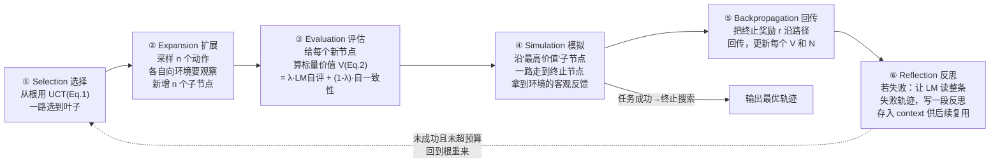

# LATS：用蒙特卡洛树搜索统一语言模型的推理、行动与规划

> **本篇定位**：这是 agent-harness 库 **B 组（控制循环 / Loop 层）** 的一篇 canon 级论文。它回答一个纯粹的"harness 问题"：当模型固定时，**该用什么样的控制循环去驱动它**？ReAct 给的是"想一步→做一步→观察→再想"的**线性**循环；LATS 把这条线**换成一棵树**，用蒙特卡洛树搜索（Monte Carlo Tree Search, MCTS）来决定"下一步探哪个分支"。全文对齐标杆范文 [Harness-Bench](2605.27922-harness-bench-measuring-harness-effects.md) 的密度与诚实度：公式前先定义符号，数字标 §/Table/Eq 出处，宣称与批判分开写。

---

## §1　TL;DR（一页讲清这篇在干嘛）

> 主讲提示：开场先把"三张牌"摆出来——推理、行动、规划——说清此前没有一个方法同时握住这三张；LATS 用 MCTS 把它们攥到一起。然后立刻点明代价：调用量。

**一句话**：LATS（Language Agent Tree Search）= **ReAct 的动作空间（推理 thought + 行动 action）** × **MCTS 的搜索控制** × **环境反馈 + LLM 自评 + 自我反思（self-reflection）**。它把 LLM 从"一条轨迹跑到黑"升级为"在一棵可回溯的树上，反复选/扩/评/模拟/回传/反思，挑出最优轨迹"（摘要 + §4.2）。

- **属于 harness 的哪一层（Θ1）**：本篇几乎是**纯 L（Loop / 控制循环）层**的工作。它不发明新工具、不改上下文压缩，而是**替换控制循环本身**——把线性的 ReAct 循环换成 MCTS 树搜索循环；但它对 **E（Environment，需要"能回退到历史状态"）** 有硬依赖（§3.2、§6），对 **C（Context，把树、反思都存进外部长期记忆）** 有轻度使用（§4.2 "external long-term memory structure"）。
- **回扣全库论点（Θ2）**：这是 `Agent = Model + Harness` 的一个漂亮注脚——**模型不变（同为 GPT-3.5 / GPT-4），只把控制循环从 ReAct 换成 LATS，分数就大跳**：HotpotQA EM 从 ReAct 的 0.32 → LATS 的 **0.71**（Table 3）；HumanEval Pass@1 GPT-4 从 Base 80.1 → LATS **92.7**（Table 4，设当时 SOTA）；WebShop 成功率从 ReAct 28.0 → LATS **38.0**，还**超过了 RL 微调**（Table 6）。这些都是"harness 摆动"的直接证据。
- **够权威（Θ4）**：**ICML 2024** 接收（PMLR 235），UIUC 出品，代码开源，是被后续 agentic-search / 树搜索类脚手架**反复引用的奠基工作之一**。

**三条带走的结论**：
1. **统一性**：LATS 是"第一个"（论文自述 "the first general framework"）同时具备 **推理 / 行动 / 规划 / 自省 / 外部记忆** 五要素的框架（Table 1）——此前 ReAct 缺规划、ToT/RAP 缺行动与外部反馈、Reflexion 缺前瞻规划。
2. **机制**：核心是把 MCTS 的**六步循环**（selection→expansion→evaluation→simulation→backpropagation→reflection）套到 LLM 上，用 **UCT 公式**（Eq.1）平衡"探索 vs 利用"，用 **LLM 自评 + 自一致性**（Eq.2）当免训练的价值函数。
3. **代价与边界（诚实）**：性能提升是**用调用量换来的**——树搜索比 ReAct/Reflexion 贵得多（§6、Table 9/10）；且**强依赖环境可回退**（decision-making 任务里"能 revert 到历史状态"是硬前提，§3.2、§6），并非处处适用。

---

## §2　问题与动机：为什么"线性循环"不够，要上"树"

> 主讲提示：这一页用 Why 三连的"问题层"，讲清 ReAct/CoT/ToT/RAP 各自缺哪块，把"缺口"摆成一张明牌，下一页的整合才顺理成章。

**Why（问题层）——不解决会卡住什么？**
LLM 已被当成 agent 部署去调工具、导航网页、玩游戏（§1）。但主流的"提示式"方法在难任务上有三条系统性短板（§3.1 原文列的三点）：

1. **Flexibility（灵活性）不足**：CoT / ReAct 这类**自回归**地一条道跑到黑，"忽略了从特定状态出发的其它候选延续"（§3.1）——想错一步就一路错下去，没有"退回去换条路"的机制。
2. **Sensibility（对外部世界的感知）不足**：CoT / RAP / ToT 这类**只靠模型内部推理**，不吸收外部观察 → 事实幻觉、错误累积，性能有天花板（§3.1）。
3. **Adaptability（适应性）不足**：现有规划（RAP / ToT）**用简单的 BFS/DFS**，且**不能利用环境反馈**改进规划；agent 是静态的，不能从试错中复用经验（§3.1）。RAP 虽然用了 MCTS，但**它把 LLM 当世界模型（world model）做内部模拟**，只在"LLM 能准确预测状态"的任务上成立。

> **读出什么**：三条短板恰好对应"缺规划 / 缺外部反馈 / 缺经验学习"。ReAct 有行动和外部反馈却**没有前瞻规划**（想错了不会回退）；ToT/RAP 有树搜索规划却**没有真环境反馈**（只在脑内推演）；Reflexion 有自省却**只在单条轨迹上打转、不比较每一步的其它分支**（§2）。所以缺口很清楚：**需要一个既能像 ReAct 那样与真环境交互、又能像 ToT/RAP 那样做树搜索规划、还能像 Reflexion 那样自省的控制循环。**

**关键洞察（论文 §2 "key insight"）**：MCTS 在基于模型的强化学习（model-based RL）里大获成功（Silver et al., 2017 的 AlphaGo/AlphaZero）；而**很多 LM 任务允许"回退到更早的步骤"**——因为对多数 LM 任务，只要把输入设成"要恢复到的那个状态"、把对应的历史文本复制粘贴回来，就等于"重置到任意状态"（§3.2、§4 开头）。**正是这个"可回退"性质，让 MCTS 里最苛刻的假设（需要一个环境模型/世界模型）在 LM 场景下被绕过**——这是全文最核心的动机句。

---

## §3　它站在谁肩上：一张"五要素"对比表（Table 1）

> 主讲提示：这张表是全篇的"电梯演讲"。指着它说：横轴五个能力，此前没有任何一行五个全绿，LATS 是第一个全绿的。

论文 **Table 1** 把相关工作按五个能力打勾。转录如下（✓=具备，✗=缺）：

| 方法 | 推理 Reasoning | 行动 Acting | 规划 Planning | 自省 Self-Reflection | 外部记忆 External Memory |
|---|:--:|:--:|:--:|:--:|:--:|
| CoT (Wei 2022) | ✓ | ✗ | ✗ | ✗ | ✗ |
| ReAct (Yao 2023b) | ✓ | ✓ | ✗ | ✗ | ✗ |
| ToT (Yao 2023a) | ✓ | ✗ | ✓ | ✗ | ✗ |
| RAP (Hao 2023) | ✓ | ✗ | ✓ | ✗ | ✓ |
| Self-Refine (Madaan 2023) | ✓ | ✗ | ✗ | ✓ | ✗ |
| Beam Search (Xie 2023) | ✓ | ✗ | ✗ | ✓ | ✗ |
| Reflexion (Shinn 2023) | ✓ | ✓ | ✗ | ✓ | ✓ |
| **LATS（本文）** | ✓ | ✓ | ✓ | ✓ | ✓ |

> **读出什么**：表里对术语的定义（表注原文）——**reasoning** = LM 内部推理；**acting** = 外部决策/与环境交互；**planning** = 使用某种搜索算法；**self-reflection** = 用 LM 生成的反馈；**external memory** = 存历史文本以供后续更新。LATS 是"第一个把三大领域（推理/行动/规划）设计**全**纳入的工作，故可广泛适用于三类任务"（表注原文 "the first work incorporating designs from all three domains"）。**这就是它的卖点：不是某一项更强，而是把此前分散的能力统一进一个控制循环。**

---

## §4　方法总览（big picture）：把 LLM 包进 MCTS 的六步循环

> 主讲提示：先给"树"的直觉，别急着上公式。一句话——"每个节点是一个状态（走到这里的历史），每条边是一个动作（一步 thought 或 action），MCTS 决定下一步去探哪个节点。"然后用 Figure 2 的六步流程走一遍。

**先立骨架（§4.1 LM Agent）**：在时刻 $t$，agent 收到观察 $o_t\in O$，按策略 $\pi(a_t\,|\,x, o_{1..t-1}, a_{1..t-1})$ 取动作 $a_t\in A$。沿用 **ReAct 的动作空间** $\hat{A}=A\cup Z$：既能取**真实动作** $A$（改变环境、产生观察），也能取**推理动作** $Z$（thought，只在脑内组织信息/规划/注入知识，不改环境）。**没有环境反馈的纯推理任务（如 Game of 24）就退化用 CoT 当底座**（§4.1）。关键一点：**不贪心解码一条轨迹，而是用当前状态从 $p_\theta$ 采样 $n$ 个动作**——因为难任务往往有多条正确路径，采样多样候选能抵消 LM 生成的随机性、扩大探索面（§4.1）。

**核心贡献一句话（§4.2）**：**"adapting MCTS to language agents"**——把预训练 LM $p_\theta$ **同时复用**成三种角色：**① agent（生成动作）、② 状态评估器（value function）、③ 反馈生成器（reflection）**。与标准 MCTS / RAP 不同，LATS **不需要世界模型**，直接用**真环境交互**来推进规划（§4.2 原文）。

**节点与状态**：树里每个节点 $s=[x, a_{1..i}, o_{1..i}]$ = 原始输入 $x$ + 到此为止的动作序列 + 观察序列（§4.2）。节点显式存进**外部长期记忆**（§4.2、Algorithm 1 "Nodes are stored explicitly in the memory"）。

**六步操作（Figure 2）——一张流程图**：

> **读出什么**：这六步是标准 MCTS 的四步（选择/扩展/模拟/回传）**外加两处 LM 特化**——把"模拟中的随机 rollout"换成"**LM 价值函数评估 + 采样式模拟**"（③④），把"纯数值信号"升级为"**语义反思**"（⑥）。反思（⑥）是 LATS 相对 RAP 的独门加法：它把 Reflexion 的自省机制嵌进了 MCTS 的失败节点处理里。

---

## §5　符号与术语表（后文公式都用它）

> 主讲提示：这页是"字典"，讲快一点，但强调 $V$、$N$、$w$、$\lambda$ 四个符号后面反复出现，先记住。

| 记号 | 含义 | 出处 |
|---|---|---|
| $p_\theta$ | 参数为 $\theta$ 的预训练 LM（同时当 agent / 评估器 / 反思器） | §3.1, §4.2 |
| $x$ | 自然语言输入（问题 / 任务描述） | §3.1 |
| $s=[x,a_{1..i},o_{1..i}]$ | 一个**节点/状态** = 输入 + 到此的动作序列 + 观察序列 | §4.2 |
| $s_0$ | 根节点（初始状态） | §4.2 |
| $\hat{A}=A\cup Z$ | 动作空间 = 真实动作 $A$（改环境）∪ 推理动作 $Z$（thought，不改环境） | §3.1, §4.1 |
| $o_t\in O$ | 时刻 $t$ 的观察（来自环境） | §4.1 |
| $n$ | **每次扩展采样的动作数**（分支因子）；主实验 $n=5$ | §4.2, App.A |
| $k$ | **轨迹数 / roll-out 数**（搜索预算）；HotpotQA $k=50$、HumanEval $k=8$、WebShop/G24 $k=30$ | §5, App.A |
| $N(s)$ | 节点 $s$ 的**访问次数**（被选中/更新过多少次） | Eq.1, §3.2 |
| $N(p)$ | $s$ 的**父节点** $p$ 的访问次数 | Eq.1 |
| $V(s)$ | 节点 $s$ 的**价值**（对该子树期望回报的估计） | Eq.1, Eq.2 |
| $w$ | **探索权重**（exploration weight），越大越鼓励探索；主实验 $w=1$ | Eq.1, App.A |
| $\text{LM}(s)$ | LM 自评分（0–10 归一化到 [0,1]），prompt LM 给轨迹打"正确性分" | Eq.2, §4.2 |
| $\text{SC}(s)$ | 自一致性分（self-consistency）：同状态下多次采样动作的一致程度 | Eq.2 |
| $\lambda$ | 价值函数里 LM 分与自一致性分的**混合权重**；HotpotQA/G24 用 $0.5$、Programming/WebShop 用 $0.8$ | Eq.2, App.A |
| $r$ | 终止节点从环境拿到的**客观奖励**（成功/失败/部分完成度） | §4.2 backprop |
| $d$ / $L$ | 树的**深度限制**（HotpotQA 主实验 $d=7$，消融到 4） | App.A, App.C |

---

## §6　六步逐个讲透（核心）—— 从选择到反思

> 主讲提示：这是全篇最该停留的两页。每一步先说"它在解决什么"，UCT 与价值函数两条公式务必逐符号讲。

### ① Selection 选择：用 UCT 决定"下一步探哪个分支"

**它在解决什么**：树越长越大，不可能每个分支都探。得有个规则，在"**利用**已知高价值分支"和"**探索**访问次数少、可能藏着更优解的分支"之间权衡。MCTS 的经典答案就是 **UCT（Upper Confidence bounds applied to Trees，上置信界树搜索，Kocsis & Szepesvári 2006）**。

**过程（§4.2 Selection）**：从根 $s_0$ 出发，每一层都选 UCT 值最高的子节点，一路走到**叶子节点**为止。

**先定义每个符号，再上公式**：
- $s$：当前正在打分的**候选子节点**；
- $V(s)$：$s$ 的**价值**（它那棵子树的期望回报估计，来自 Eq.2 与历次回传）——**这是"利用"项**，代表"目前看它多好"；
- $N(s)$：$s$ 的**访问次数**——被选中/更新过几次；
- $N(p)$：$s$ 的**父节点** $p$ 的访问次数；
- $w$：**探索权重**（超参，主实验 $=1$）——放大或缩小探索项的分量。

$$UCT(s) \;=\; \underbrace{V(s)}_{\text{利用：它有多好}} \;+\; \underbrace{w\sqrt{\dfrac{\ln N(p)}{N(s)}}}_{\text{探索：它被访问得有多少}} \tag{Eq.1}$$

> **读出什么**：第二项是关键。$N(s)$ 在**分母**——一个节点被访问越少（$N(s)$ 越小），探索项越大，越"有资格"被再选一次；分子 $\ln N(p)$ 随父节点总访问数缓慢增长，保证"随着整体探索变多，尚未充分探索的兄弟节点会逐渐被翻牌"。$w$ 调总体探索力度：论文消融（§C）发现 **$w$ 降到 0.5 会削弱搜索效果、升到 2.0 又不带来加速**，最优值依环境而定——主实验取 $w=1$（Table 11：$w{=}0.5$→0.55、$w{=}2.0$→0.63、$w{=}1$→0.63）。
>
> **Why（设计层）——为什么用 UCT 而不是贪心/纯随机？** 朴素替代 A：**贪心**永远选当前 $V$ 最高的 → 会卡在**局部最优**，错过一开始看着一般、其实更优的分支。朴素替代 B：**纯随机/BFS/DFS**（ToT、RAP 用的）→ 没有"置信度"概念，不会把预算优先投给"有潜力但没探够"的节点，效率低。UCT 用一条式子同时握住"目前多好"和"探得够不够"，这正是 MCTS 相对 ToT/RAP 的 BFS/DFS **更 principled** 的地方（§5.4 消融：把 LATS 退化成 DFS，HotpotQA EM 从 0.63 掉到 **0.42**，Table 8）。

### ② Expansion 扩展：一次长出 $n$ 个子节点

**它在解决什么**：选到叶子后，要"生小孩"——从这个状态出发试探多个不同的下一步。

**过程（§4.2 Expansion）**：从当前节点用 $p_\theta$ 采样 **$n$ 个动作**（主实验 $n{=}5$）；**每个动作都送进环境、拿回对应观察**，形成 $n$ 个新子节点，加入树（并存进外部长期记忆）。

> **读出什么 + Why（设计层）**：注意"每个动作都真的去环境执行"——这是 LATS 与 RAP 的分水岭。RAP 让 LM 当世界模型**自己想象**观察，LATS **真的调环境**。朴素替代（RAP 式脑内模拟）在"LM 能准确预测状态"时省钱，但一旦模型对环境预测不准就会**把错误的想象喂给搜索**；LATS 用真反馈换取了"感知外部世界"的能力（对应 §2 的 Sensibility 短板），代价是每次扩展要多花 $n$ 次环境调用。

### ③ Evaluation 评估：免训练的 LM 价值函数（第二条核心公式）

**它在解决什么**：MCTS 要给每个新节点一个标量价值来指导选择/回传。传统 MCTS 靠"随机 rollout 到底看输赢"或"训练一个价值网络"。LATS **不训练**，于是要一个**免训练的价值函数**。

**怎么造（§4.2 Evaluation）**：把 $p_\theta$ **复用成打分器**——prompt 它读当前轨迹，在末尾输出一个"正确性分数 $s\in\{1..10\}$"（见附录 E.3 Value Function Prompt 原文 "conclude 'Thus the correctness score is s'"）。**与 ToT 的关键区别**：LATS 是在**拿到环境反馈之后**再打分，评估更准，也能扩展到更难的环境（§4.2）。此外再加一个**自一致性（self-consistency）**启发式：同一状态下多次采样的动作若彼此一致，往往更可靠（Wang et al. 2022）。两者线性混合：

**先定义符号**：
- $\text{LM}(s)$：LM 自评分（把 1–10 归一化到 [0,1]）；
- $\text{SC}(s)$：自一致性分（同状态多样采样的一致程度）；
- $\lambda\in[0,1]$：混合权重（超参）。

$$V(s) \;=\; \lambda\cdot \text{LM}(s) \;+\; (1-\lambda)\cdot \text{SC}(s) \tag{Eq.2}$$

> **读出什么**：$\lambda$ 越大越信"LM 自己的判断"，越小越信"多次采样的一致性"。论文取值有讲究——**HotpotQA / Game of 24 用 $\lambda{=}0.5$，Programming / WebShop 用 $\lambda{=}0.8$**（App.A）。消融证明这两块都不能省：去掉 LM 分（"No LM Heuristic"）HotpotQA EM **暴跌 0.26**（0.63→0.37，Table 8 / §D "dramatic 0.26 drop"）——**说明 LM 打分才是价值函数的主心骨**；而在 Game of 24 上把 $\lambda$ 从 0.5 调到 1（=去掉自一致性）成功率从 0.44 掉到 0.40（Table 13），**说明自一致性也确有增益**。
>
> **Why（设计层）——为什么不直接训练一个价值网络？** 朴素替代：像 AlphaZero 那样**训一个价值网络**。→ 需要大量标注/自博弈数据、要对"语言状态"建模，成本高、且难迁移到任意 LM 任务。LATS 改用"**in-context 提示 LM 打分**"，零训练、即插即用，代价是打分带 LM 噪声（所以才补自一致性去平滑）。这是"免训练价值函数"这一贡献的精髓。

### ④ Simulation 模拟：不用随机 rollout，而是"贪最高价值一路走到底"

**它在解决什么**：把选中的节点一路推进到**终止状态**，好拿到环境的**客观反馈**（比 LM 自评更硬的真信号）。

**过程（§4.2 Simulation）**：从当前节点开始，**每一层都用与前面相同的操作采样并评估**，但只**沿"价值最高的子节点"前进**，直到到达终止节点。到达终止节点就拿到"这条轨迹对不对"的客观反馈（如 WebShop 里"是否完成购买"）。**若任务成功 → LATS 立即终止搜索**；若只是部分成功/失败 → 触发下面的回传与反思（§4.2）。

> **读出什么**：这一步把"MCTS 随机 rollout"替换成"**LM 价值引导的确定性下探**"。好处是省掉大量无意义的随机模拟；风险是若价值函数偏了，模拟方向也会偏——这正是③里 $\lambda$ 与自一致性要压噪声的原因。

### ⑤ Backpropagation 回传：把终止奖励沿路径灌回去

**它在解决什么**：拿到终止奖励后，要把这个"真信号"沿着刚走过的路径回灌，更新沿途每个节点的价值与访问数，好让下一轮 Selection 更聪明。

**过程与公式（§4.2 Backpropagation）**：对从根 $s_0$ 到终止叶 $s_l$ 路径上的每个节点 $s_i$：访问数 $N(s_i)\leftarrow N(s_{i-1})+1$；价值按下式更新——

**先定义符号**：$V_{\text{old}}(s)$ = 更新前的旧价值；$N(s)$ = 更新后的访问次数；$r$ = 本次模拟在终止节点拿到的客观奖励。

$$V(s_i) \;=\; \dfrac{V_{\text{old}}(s)\,\big(N(s)-1\big)\;+\;r}{N(s)} \tag{§4.2}$$

> **读出什么**：这就是一个**增量式的运行平均**——把"过去 $N(s)-1$ 次的平均价值 $V_{\text{old}}$"与"这次的新奖励 $r$"按次数加权平均。访问越多，单次新样本对均值的扰动越小（越稳）。更新后的 $V$、$N$ 立刻回喂 Eq.1 的 UCT，指导下一轮选择。**这条式子是把"一次真实结果"公平摊到整条路径上的记账法。**

### ⑥ Reflection 自省：失败不只扣分，还要写一段"复盘"

**它在解决什么**：纯数值奖励（$r$）信息量太低——"失败了"但没说"为什么、下次怎么改"。LATS 借 Reflexion（Shinn 2023）的自省机制补上语义信号。

**过程（§4.2 Reflection）**：碰到**不成功的终止节点**时，用 $p_\theta$ 读"整条轨迹 + 最终奖励"，生成一段**口头反思（verbal self-reflection）**，总结推理/行动里的错误并提出更优替代；把**失败轨迹 + 对应反思都存进记忆**，在后续迭代里作为**额外上下文**喂回 agent 与价值函数（§4.2）。

> **读出什么 + Why（设计层）**：这提供了"比标量更有用的**语义梯度**"（§4.2 原文），让 agent 无需 RL 那样的昂贵优化就能从试错中学。**但消融给了它一个诚实的定位**：去掉自省（"No Reflection"）HotpotQA EM 仅从 0.63 掉到 **0.58**（降 0.05，Table 8）——**远小于**"去掉 LM 价值函数"的 0.26 降幅。作者自己点破（§5.4）：这 0.05 比 Reflexion 相对 ReAct 的 0.19 增益小，说明"**自省与搜索在'能被自省改进的问题'上有重叠**"——搜索本身已经吃掉了一部分自省的红利。**所以对 LATS 而言：价值函数是命脉，自省是锦上添花。**

**完整算法（Algorithm 1，App.A）**：把六步写成一个双重循环——外层跑 $k$ 条轨迹，内层沿深度 $L$ 推进；每步先"扩展+模拟+评估"（内嵌 $n$ 个采样），碰终止且失败就"反思"，然后用 UCT"选择"下一步，轨迹跑完再统一"回传"。超参默认：$n{=}5$、$w{=}1$、$\lambda\in\{0.5,0.8\}$（App.A）。

---

## §7　实验设置：4 个域、指标定义、超参与成本

> 主讲提示：一句话概括——"覆盖推理(QA/数学)、行动(网购)、编程三类任务，正好对应 Table 1 的三张牌都要验。"指标定义式要念出来。

**四个评测域**（§5）：
- **HotpotQA**（Yang 2018）：多跳问答，需在 ≥2 篇维基段落上检索推理。**动作空间**（§D.1）= `search[entity]` / `lookup[keyword]` / `finish[answer]` + 自由 thought。用 **oracle 反馈**（答对与否由环境告知，与 ReAct/Reflexion 一致，保证公平）。取 100 题子集、3-shot、$k{=}50$、$n{=}5$、$d{=}7$。**指标：EM（Exact Match，精确匹配率）**——预测答案与标准答案完全一致才算对。
- **Programming**：**HumanEval**（164 题，Chen 2021）与 **MBPP**（397 题子集，Austin 2022）。动作 = 生成完整解 + 在**合成测试集**上跑，编译/测试结果当观察（§5.2、§D.2）。**指标：Pass@1**——生成 1 个解、通过全部隐藏单测的比例。$k{=}8$、$n{=}5$。注意 Programming 里"每个动作=一整份解"，所以**跳过 simulation**，直接把"通过测试比例"当回传奖励（§5.2）。
- **WebShop**（Yao 2022）：118 万真实商品 + 12k 人类指令的网购环境。动作 = 搜索/点击（Table 12）。50 条指令、$k{=}30$。**两个指标**（§5.3、§D.3）：**Score** = $100\times$平均奖励（按选中商品满足用户属性的比例）；**Success Rate（SR）** = 奖励 $r{=}1$（完全满足）的指令占比。
- **Game of 24**（Yao 2023a）：用 4 个数与四则运算凑出 24。纯推理，**用 CoT 当底座**（无环境反馈）。50 局、$k{=}30$、$\lambda{=}0.5$。**指标：Success Rate**（凑出且每数只用一次）。

**成本 / 复杂度（§C、Table 9/10）**：这是本篇"诚实"的重头——
- **样本复杂度**：LATS 与 ToT/RAP 同为 $O(kn)$（Table 9）——**树搜索类天然比 ReAct 的 $O(k)$ 贵一个 $n$ 倍量级**。
- **Token 消耗**（HotpotQA，$n{=}5,k{=}50$，成功时）：LATS **173,290** tokens，略低于 ToT 的 210,215、高于 RAP 的 176,500（Table 9）——同为树搜索里 LATS **相对省**，但对 ReAct/CoT-SC 仍贵得多。
- **节点数**（成功所需，Table 10）：$k{=}50$ 时 LATS **66.65** 个节点 < RAP 70.60 < ToT 84.05——即"用更少节点拿更高分"，作者据此论证 LATS 是"更 principled、更高效"的搜索（§C）。

> **读出什么（Θ2 呼应）**：把"性能"和"成本"两张表并读，才是对 harness 诚实的姿态——LATS 的分数领先是**真金白银的调用量换来的**。它在"树搜索这一族"里最省，但和线性 ReAct 循环比，是数量级的开销差。**这正是 L 层最核心的工程权衡：控制循环越"会搜索"，越强也越贵。**

---

## §8　主结果：同模型换循环，分数大跳

> 主讲提示：一张一张表过。每张都先报数，再解释"为什么是这个数"（结果层 why），最后回扣 `Model+Harness`。

### 8.1　HotpotQA（Table 2 推理侧 / Table 3 行动侧）

| 方法（GPT-3.5） | HotpotQA EM ↑ | 方法（GPT-3.5） | HotpotQA EM ↑ |
|---|:--:|---|:--:|
| Base LM | 0.32 | ReAct | 0.32 |
| CoT | 0.34 | ReAct (best of k) | 0.38 |
| CoT-SC | 0.38 | Reflexion | 0.51 |
| ToT | 0.55 | ToT (ReAct) | 0.39 |
| RAP | 0.60 | RAP (ReAct) | 0.54 |
| **LATS (CoT)** | **0.62** | LATS (ReAct) | 0.63 |
|  |  | LATS (n=10) | 0.65 |
|  |  | **LATS (CoT + ReAct)** | **0.71** |

**Why（结果层）——为什么 CoT+ReAct 组合能冲到 0.71？** 因为"内部推理"和"外部检索"是互补的：LATS 先用 **CoT 底座**（模型本身知识就能答一部分），**失败时再切到 ReAct** 去检索（§5.1，模仿人"先想、想不出再查"）。**内外结合 > 单用任一个**——这正是 §2 三短板里"缺外部反馈"被补上的直接体现。**同为 GPT-3.5，只把控制循环从 ReAct(0.32) 换成 LATS(0.71)，EM 翻了一倍多**（§1 原文 "doubles the performance of ReAct"）——这是 `Agent=Model+Harness` 的实锤。反直觉点：**ToT(ReAct)/RAP(ReAct) 在决策设定下反而比纯推理设定更差**（Table 3），作者点明"把搜索算法适配到决策场景是 non-trivial 的"（§5.1）——不是套个树搜索就万事大吉。

### 8.2　编程（Table 4 HumanEval / Table 5 MBPP）

| 方法 | 模型 | HumanEval Pass@1 ↑ | | 方法 | MBPP Pass@1 ↑ |
|---|---|:--:|---|---|:--:|
| CoT | GPT-3.5 | 46.9 | | CoT | 54.9 |
| ReAct | GPT-3.5 | 56.9 | | ReAct | 67.0 |
| Reflexion | GPT-3.5 | 68.1 | | Reflexion | 70.0 |
| ToT | GPT-3.5 | 54.4 | | ToT | 65.8 |
| RAP | GPT-3.5 | 63.1 | | RAP | 71.4 |
| **LATS (ReAct)** | GPT-3.5 | **83.8** | | **LATS (ReAct)** | **81.1** |
| Base LM | GPT-4 | 80.1 | | | |
| Reflexion | GPT-4 | 91.0 | | | |
| **LATS (ReAct)** | **GPT-4** | **92.7** | | | |

**Why（结果层）**：GPT-4 上 LATS 拿 **92.7 Pass@1**，是论文投稿时的 HumanEval **SOTA**（§1、§5.2）。机制上，编程任务的外部反馈（编译器 + 合成测试）质量极高，LATS 的"用外部测试结果当奖励 + 树搜索挑最优解 + 失败反思"把这份高质量反馈用足了。**注意 GPT-3.5 上 LATS(83.8) 甚至超过 GPT-4 Base(80.1)**——**好的控制循环能让弱模型越级**，又一条 harness 摆动证据。

### 8.3　WebShop（Table 6）与 Game of 24（Table 7）

| WebShop 方法（GPT-3.5） | Score ↑ | SR ↑ | | Game of 24 方法 | SR ↑ |
|---|:--:|:--:|---|---|:--:|
| ReAct | 53.8 | 28.0 | | CoT | 0.08 |
| ReAct (best of k) | 59.1 | 32.0 | | Reflexion | 0.12 |
| Reflexion | 64.2 | 35.0 | | ToT | 0.20 |
| **LATS (ReAct)** | **75.9** | **38.0** | | RAP | 0.40 |
| IL（模仿学习） | 59.9 | 29.1 | | **LATS (CoT)** | **0.44** |
| IL+RL | 62.4 | 28.7 | | | |
| Fine-tuning | 67.5 | 45.0 | | | |
| *Expert（人类）* | *82.1* | *59.6* | | | |

**Why（结果层）——WebShop 这条最有料**：LATS 的 Score **75.9 超过所有 RL 训练法**（IL/IL+RL/Fine-tuning，§1 "gradient-free performance comparable to gradient-based fine-tuning"）——**不训练、只靠更聪明的控制循环，就追平甚至超过梯度微调**。但**诚实标注**：SR 38.0 仍**低于** Fine-tuning 的 45.0，也远低于人类 59.6——WebShop 里"生成的反思常常太泛、帮助有限，agent 易陷局部最优"（§5.3 原文），LATS 的增益主要来自"更充分的探索"而非反思。Game of 24 上 LATS(CoT) 0.44 > RAP 0.40 > ToT 0.20，靠的是价值函数里加了自一致性（§5.4、Table 13）。

---

## §9　消融与分析：哪个部件是命脉（Table 8）

> 主讲提示：这页回答"拆掉哪块最疼"。一句话——价值函数（LM 打分）是命脉，搜索算法(MCTS>DFS)是骨架，自省是锦上添花。

**Table 8（HotpotQA，$n{=}5,k{=}50$，ReAct 底座）**：

| 变体 | HotpotQA EM ↑ | 相对完整 LATS 的落差 |
|---|:--:|:--:|
| ToT (ReAct) | 0.39 | — |
| RAP (ReAct) | 0.54 | — |
| **LATS (No LM Heuristic)** | **0.37** | **−0.26**（拆掉 LM 价值函数） |
| LATS (DFS) | 0.42 | −0.21（把 MCTS 退化成 DFS） |
| LATS (No Reflection) | 0.58 | −0.05（拆掉自省） |
| **LATS (ReAct，完整)** | **0.63** | 基准 |

> **读出什么（三条结论）**：
> 1. **LM 价值函数 = 命脉**：拆掉它 EM 从 0.63 崩到 0.37（−0.26），甚至跌破 ToT/RAP——**没有 LM 打分，搜索就是瞎走**。这与标杆范文里"execution alignment 比工具多少更本质"异曲同工：**决定成败的是'把推理忠实变成好的搜索方向'的那个价值信号**。
> 2. **MCTS 骨架 = 关键**：退化成 DFS（去掉 selection/backprop）EM 掉 0.21（0.63→0.42）——**UCT 的选择/回传确实带来实质增益**，不是花架子。
> 3. **自省 = 锦上添花**：拆掉仅 −0.05——如前所述，搜索已吃掉部分自省红利。
>
> **"LATS requires every component and operation for optimal performance"**（Table 8 表注原文）——但三者贡献不均，这份"不均"本身就是最有信息量的发现。

---

## §10　局限与批判（论文 §6 / App.B + 我的补充）

> 主讲提示：这页是判断力高地。别把 LATS 讲成万能钥匙——它有两条硬边界，且贵。

**论文自陈的局限（诚实，§6 / App.B）**：
1. **计算成本高**：明确承认"higher computational cost compared to simpler prompting methods like ReAct or Reflexion，may limit its practicality"（§6）。缓解说辞：渐近样本复杂度与 ToT/RAP 同级、成功时用更少节点/token（App.B、Table 9/10）；且**$n{=}1$ 时 LATS 退化得与 ReAct（多次试）/CoT-SC 一样高效**（App.B）——即成本可调。作者建议"**难任务（如编程）或性能优先场景**才用 LATS"（App.B）。
2. **假设环境可回退**：LATS 基于 MCTS 且 model-free，**要求 agent 能 revert 到环境中的更早状态**（§6、App.B）。作者辩称这在很多现实环境成立（编程 / WebShop / ALFWorld / ToolBench），并把它定位成"**a feature that has not been explicitly given notice**（一个尚未被充分利用的性质），而非缺陷"（App.B）——但**这终究是一条外部依赖（Θ1 的 E 层依赖）**：换到"不可回退"的真实在线环境（发了不能撤的交易、真实副作用），LATS 就不适用。

**我的补充批判**：
- **评测用 oracle 反馈**：HotpotQA 用"环境直接告知答对与否"的 oracle 设定（§5.1）。这对公平比较是合理的，但**现实里往往没有这种即时正确性信号**——没了 oracle，LATS 的价值函数就得完全靠 LM 自评（那正是消融里最脆弱的一环），实际增益可能缩水。
- **价值函数 = LM 自己**：Eq.2 的 LM 打分是"模型给自己的轨迹打分"，存在**自我偏好 / 自我确认**风险（模型可能高估自己的错误轨迹）——与标杆范文"谁来 judge the judge"、auto-research 库 `m9.8` 红队收口是同一隐忧。
- **"统一"的代价被口号盖住**：Table 1 的五个全绿很漂亮，但**每多握一张牌都在加调用量**。§7 的成本表提醒我们：LATS 的"统一"更像"把多套机制叠进一个循环"，工程上是**加法**而非"免费的统一"。
- **反思增益小 → 组件冗余问号**：既然 No-Reflection 只掉 0.05，那"五要素全绿"里"自省"这张牌在**有强搜索时**的边际价值存疑——换更强模型（搜索更省时），自省可能进一步失色。

---

## ★ 对我们的启发（Inspires Us）

> 这一节是组会高潮，也是本库第一人称优势：**我们（Claude Code / 本课 m9.* 的 agent）自己就是一个 harness**——我们现在跑的正是 LATS 想替换掉的那种**线性 ReAct 循环**。所以下面每条都能"打到自己身上"。

➤ **a. 可直接借用的招（method we can reuse）**：那套**"免训练 LM 价值函数 = λ·LM自评 + (1−λ)·自一致性"（Eq.2）**可以整块拆下来，作为我们任何"生成多个候选、需要挑一个"的环节的**打分器**——不用训练、prompt 即得。关键工程细节要照抄：**在拿到环境/工具反馈之后再打分**（LATS 相对 ToT 的核心改进），比"凭空对候选打分"准得多。配套抄 UCT（Eq.1）的"利用+探索"权衡形式，用来在候选分支间分配预算。

➤ **b. 可迁移到我们的模块（transfer）**：把 LATS 的**六步循环**做成我们控制循环的一个**可选"搜索模式"**，接到 auto-research 的 `m9.*` 上——**默认仍走便宜的线性 ReAct，只在'检测到卡住/失败'时才切进 MCTS 分支做局部树搜索**（正如 LATS 的 CoT→ReAct 回退：先便宜后昂贵）。迁移时**必须改的前提**：我们的执行环境要能"回退到某个历史状态"（§6 的硬依赖）——对可回退的沙箱任务（代码、检索）能用，对有真实副作用的动作（发消息、写外部系统）不能用，得先给动作打"可回退/不可回退"标签。

➤ **c. 它暴露的开放问题 = 我们的机会（open problem → opportunity）**：LATS 把"树搜索控制循环"证明有效，但**成本是数量级的**（§7），而**它的自省组件在有强搜索时只贡献 0.05**（Table 8）——**机会：设计一个"自适应预算控制器"**，实时根据"价值函数方差 / 是否已卡住"决定"这一步该多探几个分支还是直接前进"，把 LATS 的"固定 $n,k$"变成"按需分配"。**可下手的第一步**：在我们的循环里加一个轻量探针——当"连续两步 LM 自评分不升"时才触发一次 $n{=}3$ 的局部扩展，量化它能否用远低于全量 MCTS 的调用量拿到大部分增益。

➤ **d. 与本库其它论文/模块的连接（connect the dots）**：与 **Reflexion（Shinn 2023）** 直接承接——LATS 就是"把 Reflexion 的自省嵌进 MCTS 失败节点"，二者是"线性自省"→"树上自省"的演进；与 **ToT / RAP** 是"纯推理树搜索"→"带真环境反馈的树搜索"的演进（Table 1）；与标杆 **Harness-Bench（2605.27922）** 呼应——LATS 正是它所说"换 harness 分数大摆"的一个**受控案例**（同模型 ReAct 0.32→LATS 0.71）；LATS 的"价值函数是命脉、工具/反思次之"与 Harness-Bench 的"execution alignment 比工具数量更本质"是同一判断的两种表述；与 auto-research 的 `m9.8`（独立验证收口）共享"LM 给自己打分可信吗"的隐忧。

➤ **e. 如果我来做下一步（my next move，第一人称）**：我会先在我们某个 `m9.*` 的可回退任务（比如代码修复）上，**只加 Eq.2 的价值函数 + 一个 $n{=}3$ 的单层扩展**（不上完整 MCTS），跑 10 个任务，对比"线性 ReAct" vs "线性+单层择优"的成功率与 token 开销——先验证"**多采样择优**"这块最便宜的红利能不能落地，再决定要不要上完整树搜索。理由：消融告诉我们价值函数(−0.26)远比自省(−0.05)重要，所以第一刀就切在价值函数+择优上，性价比最高。

---

## §11　版图定位（canon/前沿坐标 + 在本库的位置）

> 主讲提示：一句话收口——LATS 是 B 组"控制循环"的一块奠基石，把"树搜索式循环"从纯推理推广到了带环境反馈的 agent。

- **时间坐标（Θ4）**：**2023 canon（ICML'24）**。它**站在四篇肩上做整合**——ReAct（行动+外部反馈）、ToT（树搜索规划）、RAP（把 MCTS 用于 LM，但当世界模型）、Reflexion（自省）。它相对这些基石的**增量**：第一个把"MCTS 树搜索 + **真环境反馈**（而非世界模型脑内模拟）+ 自省"三者合一（§2、Table 1）。它是后续一大批 **agentic tree-search / 推理-时搜索** 脚手架的直接祖先。
- **E/T/C/L/O/V 归属（Θ1）**：本篇几乎是**纯 L（控制循环）层**的贡献——它替换的是"循环形状"（线性→树）；对 **E 层**有硬依赖（环境须可回退），对 **C 层**有轻度使用（树/反思存外部长期记忆）。
- **回扣全库中心命题（Θ2）**：LATS 是 `Agent = Model + Harness` 的**受控样本**——固定模型、只换控制循环，HotpotQA EM 0.32→0.71、HumanEval GPT-4 80.1→92.7、WebShop SR 28.0→38.0（且超过 RL 微调）。它把"换 harness 分数大摆"从轶事变成**可复现的方法**，与标杆 Harness-Bench 一个在"造循环"、一个在"量循环"，互为表里。
- **在本库的位置**：**B 组（Loop）奠基锚点**。读完它再看 B 组其它控制循环、或 H 组的失败恢复类论文，都能追问一句："它相对 LATS 的树搜索，是把'探索'做得更省了，还是把'价值信号'做得更准了？"——因为 LATS 的消融已经告诉我们：**这两处（搜索骨架 + 价值函数）才是控制循环的胜负手。**

---

## §12　组会讨论问题（留给大家吵）

1. **成本 vs 收益的拐点在哪？** LATS 比 ReAct 贵一个 $n$ 倍量级（§7）。在哪些任务上这笔账划算、哪些纯属浪费？$n{=}1$ 时 LATS≈ReAct，那"多探一点"的边际收益曲线长什么样（Fig.3 只画了 HumanEval）？
2. **价值函数是命脉（−0.26）但它是 LM 给自己打分**——如何设计一个消融，把"LM 自评的自我偏好偏差"量化出来？换成"独立第二模型打分"会不会更稳、还是更贵？
3. **可回退假设是硬边界**。对"不可回退"的真实在线环境（有副作用的动作），能否用"先在可回退的世界模型/沙箱里搜索、再在真环境执行一次"的两段式绕过？这会不会又退回 RAP 的"世界模型"老路？
4. **自省只贡献 0.05**——随着基座模型变强、搜索更省，自省这张牌会不会彻底失色？Table 1 的"五要素全绿"里，哪几张牌是**随模型变强而贬值**的，哪几张**保值**（如"外部记忆/环境反馈"）？
5. **把 LATS 的六步循环搬进我们自己的 harness**：最小可行版本该保留哪几步、砍哪几步？（建议先答：保留 evaluation+expansion 的"择优"，砍 simulation 的深下探？）

---

## §13　一页速记（takeaways）

- **命题**：控制循环该"线性"还是"树"？LATS 把 ReAct 的线性循环换成 **MCTS 树搜索循环**，第一个统一**推理/行动/规划/自省/外部记忆**五要素（Table 1）。
- **机制（六步）**：Selection（UCT, Eq.1）→ Expansion（采 $n$ 个动作、各调环境）→ Evaluation（免训练价值函数 $V=\lambda\text{LM}+(1{-}\lambda)\text{SC}$, Eq.2）→ Simulation（贪最高价值下探到终止）→ Backpropagation（增量平均回传 $r$）→ Reflection（失败写复盘、存记忆）。
- **两条核心公式**：**Eq.1 UCT** = 利用项 $V(s)$ + 探索项 $w\sqrt{\ln N(p)/N(s)}$（$N(s)$ 在分母 → 少访问的分支更该被探）；**Eq.2 价值** = LM 自评与自一致性的加权和（$\lambda$：HotpotQA/G24=0.5，Prog/WebShop=0.8）。
- **超参**：$n{=}5$、$w{=}1$、$k$∈{8,30,50}、$d{=}7$（App.A）。
- **铁证（Θ2）**：同模型换循环——HotpotQA EM **0.32→0.71**、HumanEval GPT-4 **80.1→92.7**（SOTA）、WebShop SR **28.0→38.0**（超 RL 微调）、Game of 24 **0.44**。
- **消融（胜负手）**：**LM 价值函数 −0.26（命脉）** > **MCTS 骨架 −0.21（vs DFS）** > **自省 −0.05（锦上添花）**（Table 8）。
- **代价与边界（诚实）**：$O(kn)$ 样本复杂度、~17 万 token/成功（HotpotQA），比 ReAct 贵一个量级；**硬依赖环境可回退**（§6）；价值函数是 LM 自评，有自我偏好风险。
- **对我们**：先抄 Eq.2 价值函数做"多候选择优"（最便宜红利），加"卡住才触发局部扩展"的自适应预算控制器；只在可回退任务上开树搜索模式，默认仍走便宜的线性 ReAct。
