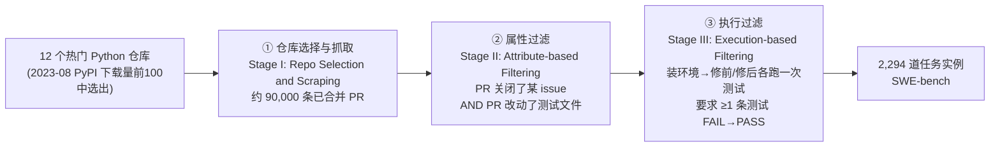
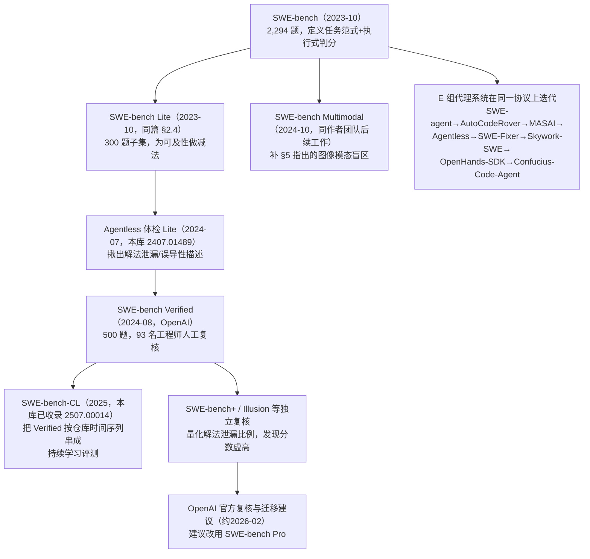

# SWE-bench：大语言模型能解决真实世界的 GitHub Issue 吗？

> 组会汇报文档 · ~20 页 · 50 分钟组会级 · PPT 风格。忠于 arXiv 2310.06770v3（ICLR 2024）原文，全篇数字均标注
> §/Table/Figure/Appendix 出处；原文未给出的一律写明"原文未给出"，不编造。PDF 共 52 页，正文 1–15 页
> （含参考文献），Appendix A–F 共 16–52 页。提取方式：Read 工具对该 PDF 报 `pdftoppm` 缺失，改用 Bash 调用
> `pdftotext -f <start> -l <end> -layout` 分段提取；凡遇跨列表格（如 Table 1/5/18/19/20/22/23）在 `-layout`
> 模式下数字错位，一律改用 `pdftotext ... -raw` 交叉核对到逐格对齐为止，本文档中所有数字均已完成这一核对。
> **特别说明**：原文正文没有任何一个带编号的公式（无 `Eq.(n)`）——全部指标与协议都是用**散文**描述的。
> 为满足本库写作规范，本文档把这些散文描述**形式化**为公式，每处都会明确标注"这是本文档基于原文散文的
> 形式化"，不冒充原文本身就有编号公式。此外，本文档在多处标注了原文内部的**版本/数字小出入**
> （如摘要 1.96% 与 Table 5 的 1.97%、Table 5 的"GPT-4-turbo"与 §4.3/Table 4 定义的"GPT-4"并非同一模型
> 快照、Appendix A.7 正文疑似遗漏），均为如实记录，不代表方法论错误，也不代表本文档提取有误。

---

## §1　TL;DR（一页讲清这篇在干嘛）

> 主讲提示：开场先立住"这是一篇 benchmark/评测协议论文，不是 agent 方法论文"——它给整个『LLM 解真实
> GitHub issue』赛道定义了任务是什么、怎么算过、以及最关键的一条：**为什么这件事不该像 HumainEval 那样好刷分**。

一句话：SWE-bench 是一个**执行式（execution-based）**评测框架——从 **12 个热门 Python 开源仓库**里，通过
"抓 PR → 属性过滤 → 执行过滤"三级管线，从约 **90,000** 条已合并 PR（拉取请求，pull request）中筛出
**2,294** 道任务实例，每道题给模型一段**问题描述**（issue 文本）+ 一份**完整代码库**快照，要求模型生成一个
**补丁（patch）**，能让该仓库自己原本关联的测试套件从"改之前挂、改之后过"（FAIL_TO_PASS）且不破坏"改之前
就过、改之后仍要过"（PASS_TO_PASS）（摘要；§2）。这不是一道"写一个函数"的自包含编程题，而是要在动辄
**数千文件、数十万行**的真实代码库里，定位并协调修改多个函数/文件（§2.3）。核心发现：**2023 年最强的模型
在这道题上几乎全军覆没**——表现最好的 Claude 2 在全测试集、BM25 检索设置下只解出 **1.96%**（摘要 / §5 正文；
Table 5 给出的精确值为 **1.97%**，两处 0.01 个百分点的出入见 §11 讨论）。

- **属于 harness 的哪一层（Θ1）**：本篇主战场是 **V（Validation/评测）层**——它不提供沙箱环境定义、不设计
  工具集、不管上下文压缩策略、不设计控制循环（那些是 E/T/C/L 层的事，留给两年后的 SWE-agent/AutoCodeRover/
  Agentless 等本库 E 组论文去补）。但它的评测执行本身（checkout → 装环境 → apply patch → 跑测试 → 记录 log，
  Appendix A.4/Figure 8）天然带有 **O（Observability）**层的雏形——每次评测都留下可复盘的执行日志。
- **权威性来源**：ICLR 2024 **Oral**（口头报告，接收率通常 <5%，据 iclr.cc 官方 virtual site 收录信息；PDF
  正文页眉本身写的是"Published as a conference paper at ICLR 2024"，而非本任务简报里提到的"NeurIPS"——
  经逐页核对，本文档以 PDF 原文页眉为准，采用 **ICLR 2024**，如实更正）。Princeton Language and Intelligence
  出品，代码/数据/排行榜三件套齐全开源（swebench.com），被本库已成稿的 **10 篇** E 组论文（SWE-agent、
  AutoCodeRover、MASAI、Agentless、SWE-Fixer、Skywork-SWE、OpenHands-SDK、Confucius-Code-Agent 等）共同
  引用为评测地基与数字标尺。
- **本文带走的 3 条结论**：
  1. **"真 issue + 真 PR + 真测试"的三级过滤管线，是它对整个子领域最大的方法论馈赠**——尤其是"PR 必须自带
     新增测试"这条准入线（§2.1 Stage II），把"模型补丁是否正确"从主观的文本相似度判断，变成了可以**自动
     执行、可复现**的客观信号（详见 §5）。
  2. **FAIL_TO_PASS ∧ PASS_TO_PASS 的双重校验，是"防止刷分"的核心机制**——只看目标测试是否通过会被"删掉
     整个功能"这类退化解糊弄过去；必须同时不破坏原本就通过的测试（中位数 51 条，Table 1），才叫"解决"
     （详见 §6）。
  3. **它比 HumanEval 一类合成基准难刷分，不是因为题目更"刁钻"，而是因为评测粒度换了对象**——判分测试来自
     仓库自己的真实测试套件而非基准作者手写的固定用例，编辑范围横跨平均 1.7 个文件/3.0 个函数（§2.3），且
     可以随时用训练截止日期之后的新 PR 持续铸造新题（详见 §7；但这条"抗污染"承诺在两年后的社区复核里被
     部分证伪，见 §18）。

---

## §2　问题与动机：为什么"能不能刷题"已经不够用了

> 主讲提示：这页是 Why 三连的"问题层"。记住两个关键词——饱和 (saturation)、自包含 (self-contained)——
> 它们各自对应 SWE-bench 随后给出的一个设计答案。

**Why（问题层）——不解决会卡住什么？**

摘要开篇就是一句直白的判断："语言模型的发展已经超过了我们有效评估它们的能力"（摘要改写）。论文引用
Kiela et al. 2021 与 Ott et al. 2022 指出：**已有基准正在饱和（saturated）**，无法再刻画前沿模型能力的边界
（§1）。与此同时，"构建一个好基准很难，因为任务既要challenging 到能难住现有模型，模型的作答又要 easy to
verify（易于验证）"（§1，引 Martínez-Plumed et al. 2021）——这是一对天然的张力：**代码任务恰好同时满足
两端**：一方面能出很难的题，另一方面"生成的解答可以通过跑单元测试来轻松验证"（§1）。但已有代码基准如
HumanEval（Chen et al. 2021）"主要是可以用几行代码解决的自包含问题（self-contained problems）"（§1）——
真实软件工程完全不是这样："修一个 bug 可能要在一个大代码库里跳转、理解不同文件间函数的相互作用、或者在
一团缠绕的代码里揪出一个微小的错误"（§1）。

**已有基准的两难**：要么走"自包含小题" 路线（HumanEval 系），失真但好判；要么走"多步交互环境"路线
（本文 §6 相关工作点名的 Yao et al. 2022 WebShop、Zhou et al. 2023 WebArena、**Deng et al. 2023 Mind2Web**——
即本库 F 组同组已精读的 2306.06070——、Liu et al. 2023d AgentBench），这类工作把任务放进多步交互环境，
但通常只聚焦"一步检索或一步生成"（§6 原文），没有 SWE-bench 这种"整个真实软件工程流程"的复杂度。

> **读出什么**：SWE-bench 的定位很清楚——它要同时吃到"难"和"好判"两头的好处：**难**来自真实代码库的规模
> 与复杂度（§2.3），**好判**来自"execution-based"（执行式）评测——不比文本相似度，直接跑测试看过不过
> （§1）。这个组合正是它比 HumanEval 更难刷分的根子，详见 §7。

---

## §3　核心贡献与任务实例的一句话形式化

> 主讲提示：三句话记住这篇论文在交付什么；再给一眼"一道题长什么样"的形式化，细节留到 §5–§6 逐节展开。

论文的贡献压缩为四件事（摘要 + §1 末 + §3）：

1. **一个评测框架 SWE-bench**：2,294 道任务实例，来自 12 个真实 Python 仓库的 issue+PR 对（§2）。
2. **一个训练数据集 SWE-bench-train**：19,000 条来自另外 37 个仓库的 issue-PR 对，用于微调开源模型（§1 末）。
3. **两个微调模型 SWE-Llama 7b / 13b**：基于 CodeLlama 微调而成的"补丁生成器"（§3）。
4. **一组实证结果**：多个 SOTA 专有模型 + SWE-Llama 在该框架下的系统性评测与失败模式分析（§5）。

**任务实例的形式化**（据 §2.1/§2.2 三段式定义整理，符号先定义、后用式；原文本身没有编号公式，下式为本文档
基于原文散文的形式化）：

- $C$：**代码库（codebase）**——由 `owner/repo` + `base_commit`（PR 应用之前的那次提交）唯一确定；
- $P$：**问题描述（problem statement）**——PR 关联的全部 issue 标题+正文+（PR 首次提交之前的）评论聚合而成
  的自然语言文本（§2.1、Appendix A.2）；
- $T$：**测试补丁（test patch）**——从 PR 的代码改动中，挑出**文件路径含测试相关关键词**（如 "test"、
  "testing"）的那些 diff 块拼成的补丁（§2.1）；
- $\delta^*$：**金标准补丁（gold patch）/参考解（reference solution）**——PR 里除测试补丁外剩下的代码改动
  （§2.1）；
- $\hat\delta$：模型生成的**预测补丁（prediction）**。

一条 SWE-bench 任务实例即元组 $(C, P, T, \delta^*)$；模型在评测时只能看到 $(C, P)$，目标是生成 $\hat\delta$，
使得应用 $T$ 与 $\hat\delta$ 之后，仓库自身的测试脚本给出与应用 $T$、$\delta^*$ 之后**同等或更好**的通过结果
（§2.2；精确判据见 §6）。

> **读出什么**：这个四元组形式化和本库 F 组 Mind2Web 的三元组 $(d,\mathbf a,\mathbf s)$（任务描述+动作序列+
> 网页快照）形似神不似——Mind2Web 的"金标准"是一条**必须逐步复现**的动作序列（逐步合取评分），而
> SWE-bench 的金标准 $\delta^*$ 只是用来**提取测试、圈定"应该修好什么"**的参照物，模型本身**允许生成与
> $\delta^*$ 文本上完全不同、但同样能让测试通过的补丁**（§2.3 "Wide scope for possible solutions"）——
> 这是一个关键的评测哲学差异，详见 §7。

---

## §4　符号与术语表

> 主讲提示：后文统一用下表记号；再次强调——本文档的公式是"基于原文散文的形式化"，原文本身没有编号公式。

| 记号/术语 | 含义 | 首次出现 |
|---|---|---|
| $C$ | 代码库 (codebase)，由 `owner/repo`+`base_commit` 唯一确定 | §3 |
| $P$ | 问题描述 (problem statement)，聚合自 issue 标题/正文/PR 前评论 | §3 |
| $T$ | 测试补丁 (test patch)，PR 中改动测试文件的部分 | §3 |
| $\delta^*$ | 金标准补丁 (gold patch)，PR 中除测试外的代码改动 | §3 |
| $\hat\delta$ | 模型生成的预测补丁 (prediction patch) | §3 |
| F2P / FAIL\_TO\_PASS | 应用 $T$ 后失败、应用 $\delta^*$ 后转为通过的测试集合 | §6 |
| P2P / PASS\_TO\_PASS | 应用 $T$ 后已通过、应用 $\delta^*$ 后仍通过的测试集合 | §6 |
| $N$ | 任务实例总数（全集 2,294 / Lite 300） | §6 |
| BM25 | 一种稀疏检索算法 (sparse retrieval)，用于从代码库里选文件塞进上下文 | §10 |
| "oracle" 检索 | 直接"检索"金标准补丁实际编辑过的文件（论文自造术语，原文加引号） | §10 |
| Resolve Rate / %Resolved | 任务解决率：F2P∧P2P 全部通过的任务实例占比 | §6 |
| %Apply | 预测补丁能被 `patch` 程序成功应用的实例占比 | §11 |
| SWE-Llama | 基于 CodeLlama-Python 微调、专门做仓库级补丁生成的模型 | §9 |

---

## §5　任务收集流程：三阶段管线如何从 9 万 PR 筛出 2,294 题（★核心）

> 主讲提示：这是全篇"为什么难刷分"的地基页，一定要讲透每一级过滤在挡什么、挡掉了多少。

**直觉**：GitHub 上的 PR 良莠不齐——很多是文档修订、格式化、依赖升级，跟"模型能不能解决一个真实软件工程
问题"毫无关系。要从中筛出"有一个明确问题、有一个明确修复、修复对不对能被客观验证"的题目，需要层层收紧
的准入线。

**Stage I · 仓库选择与抓取（§2.1、Appendix A.1）**：从 **2023 年 8 月**下载量最高的 **5,000** 个 PyPI 库中选出
**Top 100**，找到对应 GitHub 仓库，核实许可证允许自由使用，再用 GitHub 开发者 API 抓取这些仓库的全部 PR，
合计约 **90,000** 条（§2.1 正文；Appendix A.1 给出更精确的筛选起点"top 5,000 most downloaded PyPI
libraries"）。选"热门"仓库的理由很直接：广泛使用通常意味着**文档更全、贡献者规范更清晰、测试覆盖更好**
（Appendix A.1）。

**Stage II · 属性过滤（§2.1）——本节用户明确关心的"两条准入线"**：候选任务须同时满足：
1. **PR 状态为 Merged**（已合并）——表示改动被接受并并入主仓库（Appendix A.1）；
2. **PR 解决了一个或多个 issue**——扫描 PR 的标题、正文、commit 信息里是否有"fixes #24"一类指向 issue 编号
   的链接词（Appendix A.1）；
3. **PR 引入了一个或多个新测试**——判据是"PR 的代码改动里，有文件路径包含测试相关关键词（如 "test"、
   "testing"）被改动"（§2.1）。

**Why（设计层）——为什么必须要求 PR 新增测试，而不是随便改了代码、关闭了 issue 就算数？**
> 朴素做法 A：只要求"PR 合并且关闭了某 issue"，把该 PR 的代码 diff 当作唯一的金标准，用**文本相似度**
> （如 BLEU、精确字符串匹配）比较模型补丁与 $\delta^*$。→ 会有两个致命问题：(a) **同一个 bug 有很多种同样
> 正确的修法**（不同变量名、不同实现路径、不同代码风格），文本相似度会**冤枉**正确但写法不同的补丁；
> (b) 文本相似度**不验证补丁是否真的解决了问题**——一个语法正确但逻辑错误的补丁完全可能在字符层面"看起来
> 很像"金标准。
> 朴素做法 B：退一步，只要求"PR 合并"，完全不管有没有测试，靠人工判卷。→ 完全不可扩展（2,294 道题 靠人工
> 判分不现实），也引入评委主观性。
> SWE-bench 的选择：**要求 PR 本身就带有新增测试**，这样就能把"这条 PR 到底解决了什么"从**这条 PR 自己
> 提交的测试代码**里**提取**出来，变成一个**可执行、客观、自动化**的判据——模型的补丁不需要长得像 $\delta^*$，
> 只需要**让同一批测试通过**（§1："a robust framework for execution-based evaluation"）。代价是：这条准入线
> 本身就会**筛掉大量 PR**（下面 Table 10 会看到，Stage II 把 ~90,000 条压到 **11,407** 条，压掉了 87.4%）——
> 换来的是"客观、可执行、可规模化"的判分方式，而不是让基准维护者亲自读代码判"对不对"。

**Stage III · 执行过滤（§2.1、Appendix A.3）**：对 Stage II 剩下的候选，逐个实际**跑**测试——先应用测试补丁
$T$、跑一次测试记录 $\log_{\text{pre}}$（此时 $\delta^*$ 尚未应用，即"修复前"状态）；再应用金标准补丁
$\delta^*$、再跑一次记录 $\log_{\text{post}}$（"修复后"状态）。**保留条件**：$\log_{\text{pre}}$ 里不能有
`ImportError`/`AttributeError`（这类错误多半是环境/命名问题，几乎不可能被正确解决，见 Appendix A.3）；且必须
存在**至少一条测试**，其状态从 $\log_{\text{pre}}$ 的 fail 变为 $\log_{\text{post}}$ 的 pass——这条测试就被记为
一条 **FAIL_TO_PASS（F2P）测试**（§2.1）。这一步的成本很高：要为每个仓库的**每个发布版本**手工配置可执行的
虚拟环境（Appendix A.3 "Executable Contexts"，靠读 README/CONTRIBUTING 文档人工定 Python 版本、依赖、安装
命令），"这一步平均会刷掉候选任务实例的**一半左右**"（Appendix A.3 原文改写："this step generally removes
half of the candidate task instances"）。

**Table 10（Appendix A.3，逐仓库漏斗，本文档已用 `-raw` 模式逐格核对）**：

| 仓库 | 抓取 PR 总数 | 属性过滤后 | 执行过滤后（最终） |
|---|---:|---:|---:|
| astropy | 9,469 | 1,016 | 95 |
| django | 16,914 | 2,880 | 850 |
| flask | 2,434 | 107 | 11 |
| matplotlib | 16,545 | 1,057 | 184 |
| pylint | 3,848 | 787 | 57 |
| pytest | 5,147 | 750 | 119 |
| requests | 2,344 | 84 | 44 |
| scikit-learn | 15,159 | 1,169 | 229 |
| seaborn | 1,004 | 203 | 22 |
| sphinx | 4,931 | 645 | 187 |
| sympy | 11,928 | 1,897 | 386 |
| xarray | 3,416 | 812 | 110 |
| **合计** | **93,139** | **11,407** | **2,294** |

（原文摘要说"约 90,000 条 PR"，Table 10 精确值为 93,139——量级一致，摘要是取整表述，非矛盾。逐仓库任务数与
Figure 3 的饼图括号数字完全吻合，12 个数字相加 = 2,294，可作读数正确性自检。）

> **读出什么**：这张漏斗表本身就是"为什么这道题不好刷"的第一层证据——从 93,139 条 PR 到 2,294 道题，
> 整体**留存率只有 2.5%**，而且淘汰主要发生在两处：属性过滤（"必须关一个 issue 且带测试"）刷掉了
> **87.7%**（93,139→11,407），执行过滤（"必须真的能装起来、真的有 F2P 测试"）又刷掉了**79.9%**
> （11,407→2,294）。django（16,914→850，5.0%）和 requests（2,344→44，1.9%）的留存率差异也提示：不同项目
> 的"issue 关闭习惯是否配测试"差异很大——这本身就是"用真实数据而非人工合成任务"必须付出的代价。

---

## §6　执行式评测协议：FAIL_TO_PASS ∧ PASS_TO_PASS 双重校验（★核心）

> 主讲提示：这是全篇最该讲透的一页——先讲清"一次评测在跑什么"，再上形式化定义，最后回答"为什么要两个
> 测试集而不是一个"。

**直觉**：把一次评测想成"请模型在一个干净代码库里改一处代码，然后**用这个项目自己的测试套件**验收——不仅
要验收"新提的要求（那个 issue）是不是真被满足了"，还要验收"没有把原本好好的功能改坏"。前者对应
FAIL_TO_PASS，后者对应 PASS_TO_PASS。

**任务formulation（§2.2）**：模型输入 = issue 文本描述 + 完整代码库；输出 = 一份补丁文件（patch file，
描述要在代码库里改哪些行）；评测 = 用 Unix 的 `patch` 程序把预测补丁应用到代码库，再执行该任务实例关联的
单元测试与系统测试；若**补丁成功应用**且**这些测试全部通过**，则记为该问题被成功解决；本基准的核心指标就是
"被解决的任务实例占比"（§2.2）。

**精确判据的形式化**（据 §2.2、§4.2、Appendix A.3/A.4 原文散文描述整理，符号先定义、后用式；原文没有编号
公式）：

对任务实例 $(C, P, T, \delta^*)$，设 $\mathrm{status}(t, X)\in\{\text{fail},\text{pass}\}$ 表示测试 $t$ 在代码库
状态 $X$（已应用 $T$，使得测试代码本身存在）下的运行结果。在**构造阶段**（Appendix A.3），用金标准补丁
$\delta^*$ **一次性**算出两个固定的测试集合，并**缓存**进任务实例的元数据（Table 9 的 `FAIL_TO_PASS` /
`PASS_TO_PASS` 字段）：

$$
\mathrm{F2P} \;=\; \big\{\, t\in T \;:\; \mathrm{status}(t,\,C\oplus T) = \text{fail} \ \wedge\ \mathrm{status}(t,\,C\oplus T\oplus \delta^*) = \text{pass} \,\big\}
$$

$$
\mathrm{P2P} \;=\; \big\{\, t\in T \;:\; \mathrm{status}(t,\,C\oplus T) = \text{pass} \ \wedge\ \mathrm{status}(t,\,C\oplus T\oplus \delta^*) = \text{pass} \,\big\}
$$

（$\oplus$ 表示"把补丁应用到代码库状态上"。）F2P 就是"因为这个修复而由错转对"的测试——直接对应 issue 描述的
问题；P2P 就是"修复前后都应该保持通过"的测试——代表这个仓库既有的正确行为。

**评测阶段**（对模型预测 $\hat\delta$，Appendix A.4、Figure 8 七步流程）：① checkout `base_commit` 得到 $C$；
② 激活对应版本的可执行环境；③ 装依赖；④ 应用测试补丁 $T$；⑤ 应用预测补丁 $\hat\delta$（若应用失败，⑥ 尝试
**自动修补**——去掉多余上下文行、重算 diff 头部信息后重试一次；若仍失败则直接记 0 分）；⑦ 跑测试脚本，得到
$\mathrm{status}(t,\,C\oplus T\oplus\hat\delta)$，$\forall t\in \mathrm{F2P}\cup\mathrm{P2P}$。最终判据：

$$
\mathrm{Resolved}(\hat\delta) \;=\; \mathbb 1\Big[\ \forall t\in \mathrm{F2P}:\ \mathrm{status}(t,\,C\oplus T\oplus\hat\delta)=\text{pass}\ \ \wedge\ \ \forall t\in \mathrm{P2P}:\ \mathrm{status}(t,\,C\oplus T\oplus\hat\delta)=\text{pass}\ \Big]
$$

$$
\%\mathrm{Resolved} \;=\; \frac1N\sum_{i=1}^{N}\mathrm{Resolved}(\hat\delta_i)
$$

（若某测试在评测日志里**缺失**，一律按 fail 处理，§ Appendix A.4 原文："If a test is missing or has a
non-pass status, it is considered a fail status."）

**Why（设计层）——为什么要 F2P **和** P2P 同时满足，而不是只看 F2P？**
> 朴素做法：只检查"issue 对应的目标测试是否通过"（即只看 F2P）。→ 会给**退化解**开后门——比如把某个函数
> 整个删掉、或者把某个功能整体关掉，恰好能让"目标测试"通过（因为该测试原本就是在断言"这个 bug 不再复现"，
> 而"功能都没了"自然也不会复现），但这种"修复"实际上摧毁了该仓库既有的正确行为。SWE-bench 额外要求
> **PASS_TO_PASS 里的每一条测试都必须继续通过**——这些测试量不小：Table 1（§2.3 "Robust evaluation"）显示
> 平均每道题有 **9.1** 条 F2P 测试（**40%** 的实例有 ≥2 条 F2P 测试）与**中位数 51 条**额外的回归测试。
> 这套"目标达成 AND 无回归"的合取判据，与本库 G 组标杆 Harness-Bench（2605.27922）"TaskScore = Security ·
> Completion · Process"式的乘法/硬闸门设计、以及本库 F 组 Mind2Web 的"逐步合取（Step SR 要求元素与操作同时
> 对）"是同一种"不给虚假部分正确性留缝"的设计哲学——三篇论文各自独立地收敛到"用合取/乘法而非加权和来防刷分"
> 这一点，值得在组会上专门提一句（详见 §19 canon 定位）。

**Appendix C.5 的六态失败分类法（Table 22，本文档据原文散文定义重新整理为清晰的 3×2 网格；原始 PDF 表格因
跨列排版在文本提取时数字错位，此处按文字定义逻辑重建，取值与原文叙述完全一致）**：对**成功应用**的预测补丁，
按"F2P 测试通过比例"（全部/部分/零）与"P2P 测试是否全部保持通过"两个维度交叉，恰好落成 6 个原文命名的
结局：

| F2P 通过情况 \ P2P 是否全通过 | P2P 全部通过 | P2P 未全部通过 |
|---|---|---|
| **F2P 全部通过** | Resolved（已解决） | Breaking Resolved（解决了但引入回归） |
| **F2P 部分通过** | Partially Resolved（保住旧行为但没完全解决） | Work in Progress（半吊子：新旧都没做好） |
| **F2P 零通过** | No-Op（补丁没有实质效果） | Regression（没解决问题，还把原本能用的搞坏了） |

> **读出什么（Θ2 呼应）**：这张表把"合取判据"的严格性具象化了——"Resolved" 只是 3×2=6 种可能结局里最
> 苛刻的那一格，其余 5 格全部计为"未解决"，哪怕模型已经"部分做对"。这正是为什么 §11 会看到全场解决率
> 普遍低于 5%，但这不代表模型"完全没有理解任务"——§15 会用 Table 23 的真实计数进一步拆解这些"未解决"里
> 到底有多少是"压根没做"、多少是"做了但弄巧成拙"。

---

## §7　为什么比 HumanEval 更难刷分：不是题更刁钻，是判分对象换了（★核心）

> 主讲提示：这页把"难刷分"讲成一个可以拆开逐条核对的工程事实，而不是一句空泛的"更真实所以更难"。

**§2.3 原文给出的六条特性，是这套"难刷分"设计的完整清单**：

1. **真实软件工程任务（Real-world SE tasks）**：每道题都是一个大而复杂的代码库 + 一个真实 issue，需要展现
   "有经验软件工程师才具备、但传统代码生成基准通常不考"的综合能力（§2.3）。
2. **可持续更新（Continually updatable）**：采集流程能应用到 GitHub 上**任何** Python 仓库，人工介入极少，
   因此可以不断用"晚于任意模型训练截止日期"的新 PR 铸造新题，**保证模型没在训练时见过解答**（§2.3）——
   这是它区别于 HumanEval（一个固定的 164 题静态集合）最结构性的抗污染设计（但这个承诺的实际效力见 §18）。
3. **输入多样且长（Diverse long inputs）**：issue 文本平均 **195.1** 词（Table 1），代码库常包含成千上万个
   文件——"解 SWE-bench 需要在一片汪洋般的上下文里，找出真正需要编辑的一小撮行"（§2.3）。
4. **鲁棒的评测（Robust evaluation）**：每道题至少 1 条 F2P 测试，**40%** 的实例有 ≥2 条 F2P 测试；此外**中位
   数 51 条**额外测试专门检查"原有功能是否被妥善保留"（§2.3；即 §6 的 P2P 机制）。
5. **跨上下文代码编辑（Cross-context code editing）**：不像先前工作把编辑范围限定在单个函数/类内
   （如 HumanEval 系），或提供完形填空式的挖空提示（cloze-style），SWE-bench **不给这类显式引导**——参考解
   平均编辑 **1.7 个文件、3.0 个函数、32.8 行**（增删合计，§2.3；精确到 Table 1：均值 32.8 行/最大 5,888
   行，均值 1.7 文件/最大 31 文件，均值 3 函数/最大 36 函数）。
6. **解法空间开放（Wide scope for possible solutions）**：仓库级代码编辑这个任务，天然能让"检索+长上下文
   模型"到"会推理行动的决策 agent"等各路方法在同一个擂台上比较；且模型**允许生成偏离参考 PR 的新颖解法**
   （§2.3）——即评分不是"文本要像参考答案"，而是"测试要真的过"。

**Table 1（§2.3，本文档已用 `-raw` 模式逐格核对，微平均，不按仓库分组）**：

| 属性 | 均值 (Mean) | 最大值 (Max) |
|---|---:|---:|
| Issue 文本长度（词数） | 195.1 | 4,477 |
| 代码库 # 非测试文件数 | 3,010 | 5,890 |
| 代码库 # 非测试行数 | 438K | 886K |
| 金标准补丁 # 编辑行数 | 32.8 | 5,888 |
| 金标准补丁 # 编辑文件数 | 1.7 | 31 |
| 金标准补丁 # 编辑函数数 | 3 | 36 |
| 测试 # FAIL_TO_PASS 数 | 9.1 | 1,633 |
| 测试 # 总数 | 120.8 | 9,459 |

**用一张对比表把"为什么难刷分"钉死**（本文档整理，非原文自带表格）：

| 维度 | HumanEval 一类自包含基准 | SWE-bench |
|---|---|---|
| 问题范围 | 一个函数 + docstring，全部上下文一屏放得下 | 平均 3,010 个非测试文件、438K 行的完整仓库（Table 1） |
| 编辑范围 | 补全/重写单个函数体 | 平均 1.7 个文件、3.0 个函数、32.8 行（§2.3） |
| 判分测试来源 | 基准作者为该题手写的少量固定测试 | 该开源项目自己的测试套件；F2P 均值 9.1、总测试均值 120.8（Table 1） |
| 判分逻辑 | 通常只看新写的测试是否通过 | FAIL_TO_PASS **且** PASS_TO_PASS 同时满足（§2.2/Appendix A.4，见 §6） |
| 是否要求文本像参考答案 | 隐含要求（很多基准用相似度/精确匹配打分） | 明确不要求，允许"偏离参考 PR 的新颖解法"（§2.3） |
| 出新题的方式 | 基准发布后基本固定 | 可用任意新 PR 持续铸造新题（§2.3，抗污染设计意图；效力见 §18） |

> **读出什么**：把这两张表放在一起看，"难刷分"体现在三处**结构性**的不同，而不是"题目更聪明"：
> (a) **判分测试不是基准作者写的，是那个开源项目自己维护多年的测试套件**——模型很难去猜"这道题的出题人
> 想要什么样的输出格式"，因为压根没有统一的"出题人"；(b) **合格答案不唯一**——模型不需要、也不太可能靠
> "记住一个标准答案字符串"过关，因为判分完全不看文本相似度；(c) **编辑面横跨多个文件/函数**，模型必须先
> 在陌生代码库里"定位"要改哪，这一步本身就很难（§10 的检索实验会看到，27k token 预算下 BM25 也只能覆盖
> 到不到六成的金标准文件，Table 3）。这三点共同决定了"刷分"在这里几乎无法靠 few-shot 记忆或格式套路完成，
> 只能靠真的理解代码库。摘要原句"existing benchmarks have become saturated"（§1，引 Kiela et al. 2021;
> Ott et al. 2022）与 Claude 2 全集下不到 2% 的解决率（Table 5）恰成对照——同一时期 HumanEval 已趋于饱和，
> SWE-bench 却几乎是从零刻度重新开始量。

---

## §8　SWE-bench Lite：为可及性做的减法

> 主讲提示：这页短，讲清楚 Lite 存在的动机与代价即可，是后面很多 E 组论文的主战场（多篇后续报告都在 Lite
> 上跑分），值得单独停一下。

**动机（§2.4）**：全集评测"可能相当耗时，且视模型而定，需要一笔不小的算力或 API 调用开销"；鉴于 §5 呈现的
初始解决率已经很低，SWE-bench 的难度虽然适合长期追踪进展，却"对短期内想在这个方向做出成果的初期系统而言
可能令人望而却步"（§2.4）。

**做法**：采样 **300** 个"更自包含（more self-contained）、聚焦功能性 bug 修复"的实例，构成 **SWE-bench
Lite**；覆盖原 12 个仓库中的 **11 个**，分布多样性与原集合相近（§2.4）。完整筛选准则见 Appendix A.7——但
**原文该节正文异常简短**："SWE-bench Lite is a canonical subset for more efficient evaluation of language
models on the SWE-bench task. SWE-bench is"，句子在此戛然而止，紧接着直接跳进 "B ADDITIONAL DETAILS ON
TRAINING SWE-LLAMA" 一节（本文档已用 `-layout` 与 `-raw` 双重核对，非本文档提取脚本导致，疑似原始 PDF 定稿
时的排版遗漏；原文未给出 Lite 的完整筛选细则文字，如实标注，不做补全）。

> **读出什么**：Lite 的存在本身就是"难刷分"与"门槛太高没人愿意跑"之间的一次工程妥协——§18/Θ5 会看到，
> 这个"更自包含"的采样方式后来被本库同组 Agentless（2407.01489）的人工复核揪出**数据质量问题**（部分题目
> 描述里直接含金标准修复步骤），并催生了 OpenAI 的 SWE-bench Verified——这是"为可及性减负"与"可及性反而
> 引入新的可刷分缝隙"之间的一条完整因果链，留到 §18/§19 细讲。

---

## §9　SWE-Llama：给开源模型一个参照系

> 主讲提示：这页讲"作者不满足于只测专有模型，还想给开源阵营一个能打的基线"。

**动机（§3）**：在专有模型之外，也要能评测开源模型的表现；但截至写作时，只有 CodeLlama（Rozière et al.
2023）系列能处理必要的超长上下文，而"现成的 CodeLlama 变体不足以遵循详细指令生成仓库级代码编辑，通常只会
输出占位符式回复或不相关代码"（§3）——因此作者对 **CodeLlama-Python 7B / 13B** 做**有监督微调**，得到专门
的"仓库编辑器"SWE-Llama，可在消费级硬件上运行。

**训练数据（§3、§1 末）**：沿用与 SWE-bench 相同的采集流程，从**另外 37 个** Python 仓库收集 **19,000** 条
issue-PR 对，构成 **SWE-bench-train**；与 §5 的评测集不同，这里**不要求 PR 必须新增测试**（放宽准入线以扩大
训练集规模）；且训练仓库集合与评测仓库集合**互不相交**，消除数据污染风险（§3）。

**训练细节（§3、Appendix B.1）**：用 **LoRA**（Hu et al. 2022，Low-Rank Adaptation）微调，只调每层注意力子层
的 Q/K/V/O 投影矩阵，秩 $r=16$，$\alpha=16$，dropout $=0.05$；学习率 $6\times 10^{-4}$，batch size 32，最多
训 4 个 epoch；每 50 步存一次 checkpoint，训练结束后用**留出的 100 条实例**的验证损失挑最优 checkpoint；
排除超过 30,000 token 的训练序列，把有效训练语料压到 **10,000** 条实例。SWE-Llama 7b 由 CodeLlama-Python 7b
初始化，在 **4×A100** 上训 **20 小时**；SWE-Llama 13b 由 CodeLlama-Python 13b 初始化，在 **8×A100** 上训
**47 小时**；用 DeepSpeed Ulysses（Jacobs et al. 2023）+ FlashAttention（Dao et al. 2022）支持长上下文训练。

**Why（设计层）——为什么训练目标是"生成补丁文件"而不是"重写整个文件"？**
> 朴素做法是让模型直接重新生成修改后的整份代码文件（whole-file generation）——直觉上更"端到端"，不需要
> 模型学会 diff 格式。→ §11 会看到这条路径在实测里反而更差：Claude 2 在 oracle 检索设置下生成整份文件只
> 解出 **2.2%**，生成补丁文件则是 **4.8%**（§5 正文）；即便控制实例长度、只看输入较短的一半，生成补丁仍是
> **7.8%** vs 整份文件 **3.9%**（§5 正文）。SWE-bench 选择让模型生成**补丁文件（patch file）**这种更紧凑的
> 差量表示，训练与推理都更高效，也更贴近真实工程师提交 PR 的方式（§5 "Generating patches is easier than
> generating whole files"）。

---

## §10　实验设置：检索是逃不掉的瓶颈

> 主讲提示：这页讲清楚"塞不下整个代码库，所以必须先检索"这件事本身有多难，为 §13 的"长上下文是敌人"埋伏笔。

**核心矛盾（§4.1）**：issue 文本通常短（Table 1 均值 195.1 词），但代码库动辄成千上万文件（均值 438K 行）——
远超任何 LM 的上下文窗口。论文用两种检索设置来选"喂给模型哪些文件"：

- **稀疏检索（sparse retrieval）**：用 **BM25**（Robertson et al. 2009）——作者指出稠密检索（dense
  retrieval）不适合这个场景，因为 key/query 都极长，且"用自然语言 query 检索代码文档"本身就是一种不常见的
  检索设定（§4.1）。实验了三档最大上下文限制：**13k / 27k / 50k** token，每个模型取"能塞进其上下文窗口的
  限制中表现最好的一档"报告——经验上模型在**最短**的上下文窗口下表现反而最好（§4.1，呼应 §13）。
- **"oracle" 检索**：直接把金标准补丁 $\delta^*$ 实际编辑过的文件当作"检索结果"喂给模型——论文自己承认这个
  设置"不那么真实"，因为工程师事先并不知道该改哪些文件，且"仅编辑过的文件本身也未必包含理解代码在与未见
  部分交互时行为所需的全部上下文"（§4.1）；它存在的目的是**分析用**，用来隔离"检索质量"对最终得分的影响。

**BM25 检索率有多差（Table 3，§4.1，本文档已 `-raw` 核对）**：以"oracle 文件"为参照，衡量 BM25 检索到的
文件集合与其重合度：

| 上下文限制 | Avg（平均召回） | All（全部命中占比） | Any（至少命中一个占比） |
|---|---:|---:|---:|
| 13k | 29.58 | 26.09 | 34.77 |
| 27k | 44.41 | 39.83 | 51.27 |
| 50k | 51.06 | 45.90 | 58.38 |

> **读出什么**：即使把预算拉到 27k token，BM25 也只能在 **39.83%** 的实例里把 oracle 文件**全部**找齐，
> 还有约 **48.73%**（"约 40% 的实例里，BM25 在 27k 限制下检索到的是 oracle 文件的超集"，§4.1 原文）在**超集
> 但混入大量噪声**与**完全没命中**之间徘徊。这意味着"在真实代码库里定位该改哪"本身就是一道远未解决的
> 子问题——模型还没开始"修 bug"，就先在"找 bug 在哪"这一步吃了大亏。

**模型与上下文限制（Table 4，§4.3）**：

| 模型 | 最大 token 数 | 覆盖 oracle 设置下实例的比例 |
|---|---:|---:|
| ChatGPT-3.5（gpt-3.5-turbo-16k-0613） | 16,385 | 58.1% |
| GPT-4（gpt-4-32k-0613） | 32,768 | 84.1% |
| Claude 2 | 100,000 | 96.4% |
| SWE-Llama | 100,000 | 94.8% |

（原文特别提醒："token 长度的描述是一个相对非标准的度量"——例如 Llama 分词器编码同一段文本平均比 GPT-4
分词器长 42%，Table 4 注释。）

**输入格式与推理设置（§4.2、Appendix D）**：输入 = 任务说明 + issue 文本 + 检索到的文件与文档 + 一份补丁
格式示例 + 生成提示（完整模板见 Appendix D.3）。推理用**贪婪解码（greedy decoding）**，每道题只生成**一次**
预测（follow Chen et al. 2021、Rozière et al. 2023 的 pass@1 惯例，Appendix D.2）——**原文未给出**多次采样/
温度扫描的结果，也**未报告**跨随机种子的方差，这意味着 Table 5 的所有数字都是**单样本 pass@1**，没有置信
区间。

---

## §11　主结果：全员不及格（Table 5 + Table 18）

> 主讲提示：这是全场最该停留的数字。先报头条数字，再解释两处版本内部的小出入——这恰恰是"读细"的地方。

**Table 5（BM25 检索，§5，本文档已 `-raw` 核对；这是 v3 修订版的表，比 v1 多了 Claude 3 Opus）**：

| 模型 | SWE-bench 全集 %Resolved | %Apply | SWE-bench Lite %Resolved | %Apply |
|---|---:|---:|---:|---:|
| Claude 3 Opus | **3.79** | 46.56 | **4.33** | 51.67 |
| Claude 2 | 1.97 | 43.07 | 3.00 | 33.00 |
| ChatGPT-3.5 | 0.17 | 26.33 | 0.33 | 10.00 |
| GPT-4-turbo | 1.31 | 26.90 | 2.67 | 29.67 |
| SWE-Llama 7b | 0.70 | 51.74 | 1.33 | 38.00 |
| SWE-Llama 13b | 0.70 | 53.62 | 1.00 | 38.00 |

**Table 18（"oracle" 检索，Appendix C.1，本文档已 `-raw` 核对；对应 v1 时期的模型名单，无 Claude 3 Opus）**：

| 模型 | %Resolved | %Apply |
|---|---:|---:|
| Claude 2 | 4.80 | 62.82 |
| ChatGPT-3.5 | 0.52 | 21.80 |
| GPT-4（25% 随机子集，因算力预算所限，§5/Table 18 注） | 1.74 | 34.00 |
| SWE-Llama 7b | 3.01 | 65.52 |
| SWE-Llama 13b | 3.97 | 66.78 |

**两处版本内部小出入，如实标注**：
1. 摘要与 §5 正文都写 Claude 2"解出 **1.96%**"，但 Table 5（v3 修订）给出的精确值是 **1.97%**——0.01 个
   百分点的出入，合理猜测是 v3 修订时重新跑分/四舍五入所致，摘要文本未同步更新；**原文未解释**这处出入，
   本文档如实两个数字都记录，不视为矛盾。
2. Table 5 用"GPT-4-turbo"、并新增了"Claude 3 Opus"，但 §4.3 定义的模型名单与 Table 4 仍是"GPT-4
   (gpt-4-32k-0613)"、"Claude 2"，不含这两个新模型快照——说明 **v3 修订只更新了 Table 5/Table 6 的头条
   结果，没有同步改写方法学正文**。Table 18（oracle）、Table 6（oracle-collapsed）里的"GPT-4"应仍对应
   §4.3 定义的 `gpt-4-32k-0613`，与 Table 5 的"GPT-4-turbo"**不是同一模型快照**，两者数字不宜直接横向
   比较（如 Table 6 里 GPT-4 的 oracle-collapsed 值 3.40% 与 Table 5 里 GPT-4-turbo 的 BM25 值 1.31% 是
   两种设置+两个快照的差异叠加，不能简单相减）。

> **读出什么**：即便算上 v3 新增的 Claude 3 Opus，**全集 BM25 下没有一个模型超过 4%**；换成"oracle"这种
> 不切实际的理想化检索，Claude 2 也只从 1.97% 爬到 4.80%（Table 18）——检索质量能解释一部分差距，但绝不是
> 全部瓶颈，§13 会看到"给了对的文件，模型也未必能用好"。这组数字印证了 §1 的头条论断：2023 年的 SOTA
> 模型在这道题上"只能解决最简单的那批问题"（摘要）。

---

## §12　结果解读一：仓库难度不均，图像是明确的盲区

> 主讲提示：这页讲"同一个模型，换个仓库，分数天差地别"，并且点出一个具体的、模型当时完全没能力应付的
> 输入模态缺口。

**难度因仓库而异（Figure 4 + Table 19，§5，本文档已 `-raw` 核对）**：三个模型（ChatGPT-3.5、Claude 2、
SWE-Llama 13b）在 12 个仓库上的解决率趋势相似，但个体差异巨大——例如 `psf/requests` 是公认"最好啃"的仓库
（Claude 2 达 **15.91%**、SWE-Llama 7b 达 **18.18%**），而 `mwaskom/seaborn` 上**所有模型都是 0.00%**
（Table 19）。更值得注意的是：**同样难度的分数，不代表解出的是同一批题**——"oracle"设置下 Claude 2 与
SWE-Llama 13b 分别解出 **110** 和 **91** 个实例，看似接近，但**Claude 2 只解出了 SWE-Llama 能解出的题目中的
42%**（§5 正文）——两个模型的"能力剖面"其实很不一样，不是简单的强弱线性排序。

**图像输入是一个明确的模态盲区（§5）**：部分 issue 文本里嵌有图片链接（Markdown 语法
``）；`matplotlib` 有 **32%** 的实例、`seaborn` 有 **10%** 的实例包含内嵌图片，
远高于全集平均的 **2%**（§5）。这类实例"可能需要多模态 LM，或某种外部工具来处理图像"（§5）——2023 年评测
的模型全部是纯文本输入，天然拿不到这部分分数。Appendix F 的 Table 28 给出一个具体反例（seaborn-3217，
详见 §16）：issue 里嵌了三张对比截图来说明"直方图宽度计算" bug，Claude 2 因为读不到图，给出的补丁完全没
命中问题根源。

> **读出什么**：这两条观察合起来说明一件事——SWE-bench 的"难"不是一个均匀分布的标量，而是**因仓库、因
> 模态高度不均**的。这与本库 G 组标杆 Harness-Bench §12（按工作流类别的跨 harness 方差）的发现遥相呼应：
> "越是需要结构化操作/多步串联的任务类别，能力差距越大"——这里则是"越依赖仓库特异性上下文/非文本模态，
> 模型能力差距越大"。这也提示后续工作（如本库 F 组 UI-TARS 一类原生视觉模型）在"读图修 bug"这个具体缺口
> 上是有明确靶子的。

---

## §13　结果解读二：更长的上下文是敌人，不是朋友

> 主讲提示：这页是"检索给多了反而更差"的反直觉结果，务必讲清楚背后的"lost in the middle"机制，并顺手澄清
> 一处数字对不上的地方。

**上下文越长，表现越差（Figure 5，§5）**："聊天模型或许在长代码序列上预训练过，但通常被要求在有限上下文
里生成更短的代码片段"（§5）；实测中，随着总输入长度增加，Claude 2 的解决率明显下降，其他模型也观察到类似
现象（§5）。论文把这归因于"模型被额外上下文分散注意力，且可能对目标序列的相对位置很敏感"，并引用 Liu et
al. 2023b 的"Lost in the Middle"研究印证这一点（§5）。**即便**扩大 BM25 的上下文限制能提高对 oracle 文件的
召回率（Table 3），表现依然会下降（对照 Table 2）——说明模型"单纯不擅长在一堆代码里定位真正有问题的那部分"
（§5）。

**"Oracle-collapsed" 消融实验（Table 6，§5，本文档已 `-raw` 核对）**：为了进一步验证"上下文太长本身是问题"，
论文构造了一个更激进的输入变体——保留 oracle 文件，但把**没有被 PR 实际编辑到**的代码**折叠掉**，只留下
真正被改动的行 ± 15 行缓冲：

| 模型 | "Oracle"-collapsed %Resolved | %Apply |
|---|---:|---:|
| Claude 3 Opus | 9.39 | 48.00 |
| Claude 2 | 5.93 | 68.18 |
| GPT-4 | 3.40 | 48.65 |
| ChatGPT-3.5 | 1.09 | 40.93 |

正文明确写道："在这个设置下我们看到性能提升，GPT-4 从 1.3% 跳到 3.4%，Claude 2 从 4.8% 跳到 5.9%"（§5）。
这里"4.8%"与"5.9%"分别精确对应 Table 18 的 Claude 2 oracle 值（4.80）与本表的 5.93；但"1.3%"**与** Table 18
给出的 GPT-4 oracle 值（**1.74%**，25% 子集）**不完全一致**（相差 0.44 个百分点）——**原文未解释**这处出入，
可能是正文撰写时引用了早期或未精确到小数点后两位的表述，本文档如实两处都记录，不做过度解读。

**Why（结果层）——为什么"折叠掉无关代码"能带来实打实的提升？**
> 这不是"给模型更少信息"，而是"把同样的目标信息从一堆噪声里摘出来、缩短了物理距离"——本质上是在验证
> "定位难度"与"生成难度"是两个独立瓶颈：oracle 检索已经解决了"该看哪些文件"，但**文件内部**依然可能有几
> 百行与本次修复无关的代码，模型仍然要在**文件内部**做二次定位。折叠后这一步被基本消除，于是即便是同一批
> 模型、同一批 oracle 文件，分数依然显著上升（GPT-4 +1.66~2.1pp、Claude2 +1.13pp、更极端地 Claude 3 Opus
> 达到 9.39%——是 Table 5 里同模型 BM25 全集分数 3.79% 的 2.5 倍）。

> **读出什么（Θ2 呼应）**：这组消融本质上是在说——**同一个模型权重，只换"喂给它的上下文怎么组织"，分数
> 就能翻倍甚至更多**。这已经是"harness/上下文工程决定得分"的一个早期、朴素但明确的证据，只是 2023 年这篇
> 论文还没有用"harness"这个词去命名它。

---

## §14　结果解读三：时间不是解释变量——原文自己的抗污染论证

> 主讲提示：这页是论文自己做的"数据污染"自查，态度审慎但结论有边界——为 §18 的后续批评埋伏笔。

**时间切分实验（Table 7，§5，本文档已 `-raw` 核对；oracle 检索设置，按 issue 是否创建于 2023 年之前/之后
切分）**：

| 时间段 | Claude 2 | ChatGPT-3.5 | GPT-4（25% 子集） | SWE-Llama 7b | SWE-Llama 13b |
|---|---:|---:|---:|---:|---:|
| 2023 年之前 | 4.87 | 0.49 | 1.96 | 2.95 | 3.98 |
| 2023 年之后 | 4.23 | 0.77 | 0.0 | 3.46 | 3.85 |

正文结论："我们发现，多数模型在这个时间分界点前后表现差异很小，GPT-4 是例外"（§5）；作者认为这个结果"总体
是乐观的"——"尽管模型可能在预训练时见过某个仓库的某个旧版本，它们并不太可能靠'生成一个更新版本的仓库代码'
这种方式'作弊'"（§5 改写）。Appendix C.4 的 Table 21 进一步把切分粒度细化到逐年（2018 年之前到 2023 年），
同样"没有发现模型表现与年份之间存在一致的相关性"（Appendix C.4）。

> **读出什么**：这是论文自己在 2023 年 10 月做的一次**善意的自我审计**——用"issue 创建时间"作为代理变量
> 检验"模型是不是靠背题过关"，结论是"当时没看到明显证据"。但这套检验方法本身有一个结构性局限：它只能
> 检验"模型训练截止日期之前/之后的 issue 难度是否有系统性差异"，**检验不了**"这批 2023 年之前的 issue 到
> 2025–2026 年，是否已经被后续模型的训练语料重新抓取、连带 gold patch 一起被记住"——这正是 §18 要接着讲的、
> 两年后被社区反复证实的问题：**同一批 2,294 道题，静止不动地挂在 GitHub 和 HuggingFace 上，本身就是一个
> "随时间推移会被下一代模型训练语料抓取"的慢性泄漏源**。这不是这篇论文的错，而是"静态基准 + 持续训练"这
> 一组合的通病，§18 会展开讲。

---

## §15　结果解读四：模型爱走捷径——patch 更短、更"原始"，且多数改动等于没改

> 主讲提示：这页把"模型到底哪里不如人"落到可量化的统计上，别停留在"模型不够聪明"这种空泛判断。

**模型生成的补丁比金标准短得多（Table 8，§5，本文档已 `-raw` 核对；oracle 检索、仅统计成功应用的补丁）**：

| 模型 | 总行数 | 新增 | 删除 | 编辑函数数 | 编辑文件数 |
|---|---:|---:|---:|---:|---:|
| Claude 2 | 19.6 | 4.2 | 1.9 | 1.1 | 1.0 |
| （对应 Gold） | 44.1 | 12.0 | 5.8 | 2.1 | 1.2 |
| ChatGPT-3.5 | 30.1 | 3.8 | 2.7 | 1.6 | 1.0 |
| （对应 Gold） | 39.6 | 9.5 | 6.1 | 1.9 | 1.2 |
| GPT-4 | 20.9 | 4.4 | 1.5 | 1.0 | 1.0 |
| （对应 Gold） | 33.6 | 8.4 | 3.8 | 1.9 | 1.1 |
| SWE-Llama 13b | 17.6 | 1.6 | 1.2 | 1.2 | 1.1 |
| （对应 Gold） | 37.8 | 10.0 | 4.4 | 1.9 | 1.1 |
| SWE-Llama 7b | 16.7 | 1.3 | 1.2 | 1.2 | 1.1 |
| （对应 Gold） | 40.2 | 11.3 | 4.9 | 1.9 | 1.1 |
| **全体 Gold（All Gold）** | **74.5** | **22.3** | **10.5** | **3.0** | **1.7** |

正文点评："相比平均金标准补丁，成功应用的模型补丁总长度不到金标准的一半（74.5 行 vs 30.1 行），且很少改
超过一个文件"（§5，此处 30.1 行取的是 ChatGPT-3.5 一行为例；不同模型总行数在 16.7–30.1 行区间，普遍显著
短于同组 Gold 的 33.6–44.1 行，更远短于全体 Gold 均值 74.5 行）。

**六态失败分类法的真实计数（Table 23，Appendix C.5，本文档已 `-raw` 核对，并逐行验证求和自洽）**：

| 模型 | 已应用 | Resolved | Breaking Resolved | Partially Resolved | Work in Progress | No-Op | Regression |
|---|---:|---:|---:|---:|---:|---:|---:|
| Claude 2 | 1,078 | 110 | 26 | 15 | 20 | 471 | 436 |
| ChatGPT-3.5 | 284 | 12 | 2 | 4 | 2 | 174 | 90 |
| GPT-4 | 76 | 10 | 3 | 3 | 1 | 30 | 29 |
| SWE-Llama 7b | 1,257 | 69 | 17 | 17 | 17 | 716 | 421 |
| SWE-Llama 13b | 1,196 | 91 | 10 | 10 | 16 | 672 | 397 |

（每行 6 个结局计数相加均精确等于"已应用"总数，本文档已逐行验证，如 Claude 2：110+26+15+20+471+436=1,078，
确认无转录错误。此表对应的检索设置原文 C.5 小节未重新明示，且"已应用"计数与 Table 14/Table 18 中 oracle
设置下的 %Apply 换算值不完全一致（Claude 2 oracle 下约 1,441 条应用，此处 1,078），可能对应另一子集或统计
口径，**原文未言明**，如实标注，不做无根据推测。）

正文结论："在未'Resolved'的实例里，模型提出的多数补丁压根没有解决任何一条 F2P 测试（No-Op 与
Regression）；在这部分里，**60% 到 70%** 是 No-Op，其余是模型把已有行为改坏了"（§5/Appendix C.5 改写）。
逐模型核算 No-Op 占"No-Op+Regression"之比：ChatGPT-3.5 **65.9%**（174/264）、SWE-Llama 7b **63.0%**
（716/1,137）、SWE-Llama 13b **62.9%**（672/1,069）落在原文所说的区间内；但 Claude 2 **51.9%**（471/907）
与 GPT-4 **50.8%**（30/59，样本量小、方差大）实际略低于该区间下限——原文这句应是对多模型的粗略概括，而非
逐模型精确复述，如实注明，不代表数字有误。

**质性归纳（§5.1 原文，为下节案例研究定调）**："模型倾向于写'原始（primitive）'的 Python 代码，不太会利用
已有的第三方库或代码库里现成的其它部分来构造解法；模型的生成也反映出一种'贪婪（greedy）'的解题方式——只
求恰好解决眼前的问题，很少顾及代码风格或代码库里隐含的逻辑约束（比如该用相对导入还是绝对导入）。相比之下，
很多金标准补丁会做**结构性改进**，覆盖的范围比单纯解决 issue 更大——不仅解决当前问题，还预见并顺手解决了
潜在的未来问题"（§5.1）。

> **读出什么**：这一节把"为什么难刷分"落到了最具体的一层——不是模型完全不会，而是模型的**default 解题
> 风格**（贴着最小改动量、绕开代码库既有工具、不做前瞻性重构）与"good code"之间存在系统性差距，而这个
> 差距**恰好是** F2P/P2P 判据+全套测试能捕捉到、但"文本相似度"这类粗糙指标完全捕捉不到的——这再次印证
> §7 的核心论点：判分对象换了，糊弄的空间也就没了。

---

## §16　案例研究：从 sphinx 到 scikit-learn 的几个切片

> 主讲提示：这页挑几个 Appendix F 的具体例子过一遍，用真实 diff 让"模型哪里错了"变得可触摸，别只讲抽象结论。

**案例一 · sphinx-doc/sphinx-8713（Figure 6，正文 §5.1 主案例，Claude 2 oracle 检索，未解决）**：issue 要求
`napoleon_use_param` 配置项也应该影响"Other Parameters"这个文档小节的渲染方式。模型**编辑对了函数**
（`_parse_other_parameters_section`），但**逻辑写反了**——直接把该函数改成"总是按 `napoleon_use_param=True`
的方式渲染"，而不是像金标准那样先检查配置项、再决定走哪条分支（模仿同文件里 `_parse_parameters_section`
已有的写法）。模型输入总长 **1,558 行 / 20,882 token**（§5.1）。测试结果：2 个测试失败（其中
`test_parameters_with_class_reference` 直接命中了这处逻辑错误）、45 个测试通过（Figure 6 日志）。

> **读出什么**：模型"编辑对了地方"——检索/定位没有问题——但"编辑错了逻辑"，而且错的方式恰恰是**没有去
> 参照同一个文件里已经写好的姊妹函数**（这正是 §15"贪婪、不利用代码库现成资源"的具体写照）。

**案例二 · scikit-learn-13328（Table 25，Claude 2 oracle 检索，已解决但风格原始）**：`HuberRegressor.fit`
接收布尔型数组时报 `TypeError`。金标准解法极简——给已有的 `check_X_y(...)` 调用**加一个 `dtype=[np.float64,
np.float32]` 参数**（1 行改动）。Claude 2 的解法则是**新写一个 `_validate_data` 方法**，手动做类型转换，再
在 `fit` 里调用它——测试全部通过，问题确实解决了，但绕开了 `check_X_y` 已经内置的类型转换机制，"这个修法
可以更高效，且可能引入与代码库其余部分不一致的风格"（Table 25 讨论）。

**案例三 · astropy-14365（Table 27，Claude 2 oracle 检索，未解决）**：issue 要求 QDP 文件格式的解析器不再
强制要求命令关键字（如 "READ SERR"）必须大写。模型定位到了正确的正则表达式变量 `_command_re`，直接把它
改成小写形式——但**同一个文件里这个正则被复用在另一处更上层的模式 `_type_re` 里**，只改一处治标不治本，
补丁**既没通过新测试、也把原本通过的测试搞挂了**（Regression 结局的典型样本）。金标准的做法是给正则编译
加 `re.IGNORECASE` 标志（一次性、对所有复用处都生效的修法）。

**案例四 · scikit-learn-13241（Table 34，SWE-Llama 13b oracle 检索，未解决且引入回归）**：`KernelPCA` 的
`fit_transform` 在符号上不确定（同一输入两次运行可能得到正负号相反的结果）。金标准引入 `svd_flip` 做**符号
归一化**。SWE-Llama 13b 的补丁改的是完全无关的一行（`return K` 改成 `return K / self.lambdas_`）——**这处
改动本身就是错的**，不仅没解决符号不确定性问题，还破坏了原本通过的测试。这是 §6 "为什么必须同时校验
PASS_TO_PASS"最直观的实例——如果只看"目标测试是否通过"，这个补丁可能侥幸蒙对，但 P2P 检查直接把它钉在
Regression 一栏。

**量化视角：Radon 复杂度案例研究（Appendix C.7，Figure 10，psf/requests-4356）**：作者用开源库 Radon 对
Claude 2 在 `psf/requests` 上成功应用的补丁做静态分析，比较其 **Cyclomatic complexity**（圈复杂度，衡量
函数内独立执行路径数，McCabe 1976）与 **Halstead complexity**（衡量程序中操作符/操作数数量，Halstead
1977）。具体样本：模型补丁只改了 **6 行、1 个文件**（比金标准的 11 行、2 个文件更"简洁"），但它把改动加在
一个被广泛复用的 `HTTPAdapter` 类内部，让该类的圈复杂度从 **3 升到 5**；而金标准把改动放进一个逻辑更简单的
`get_connection` 函数（复杂度 2→3）并**新定义了一个专门的异常类型** `InvalidProxyURL`（复杂度 0→1）——
"更长"的金标准补丁反而让复杂度增量更分散、更可控（Appendix C.7）。

> **读出什么**：把这四个案例 + 复杂度分析放在一起，能看到一条清晰的主线——**模型不是"不会解题"，而是解题
> 方式系统性地偏向"最省事的局部修补"**：不看代码库里的姊妹函数（案例一）、不用已有的工具函数（案例二）、
> 没意识到同一段逻辑在别处被复用（案例三）、干脆改错了地方却因为"看起来简短"而蒙混（案例四）、即便侥幸
> 通过测试，也可能把复杂度悄悄集中在不该动的地方（Radon 案例）。这些失败模式**都不是"文本相似度"或
> "HumanEval 式的单测通过率"能捕捉到的**——只有"跑该仓库自己的完整测试套件 + 对照 gold patch 做质性复核"
> 才能看见，这是 SWE-bench 评测设计留给后续 E 组 agent 论文（SWE-agent 的 ACI、Agentless 的定位-修复-验证
> 三段式管线等）的真正靶子。

---

## §17　相关工作定位：SWE-bench 和谁比、比赢在哪

> 主讲提示：这页讲清楚 SWE-bench 在 2023 年那批"评测 LLM"的论文里，专门反对的是哪一种做法。

**§6 Related Work 给出三条脉络**：

1. **LLM 评测**："已有的多个评测工作要么提出一批彼此独立、横跨多领域的任务集合（Hendrycks et al. 2021
   MMLU、Liang et al. 2022 HELM、Srivastava et al. 2023 BIG-bench），要么转向 web 这种需要多步才能解决的
   交互式场景（Yao et al. 2022 **WebShop**、Zhou et al. 2023 **WebArena**、**Deng et al. 2023 Mind2Web**——
   即本库 F 组已精读的 2306.06070——、Liu et al. 2023d **AgentBench**）"（§6）。作者指出这类"大杂烩
   （potpourri）"式设置的通病：每个任务往往只窄聚焦一两项技能，题目容易偏简单，把模型框进一个缩水的角色
   里，没给模型足够空间展现多面能力或潜在新能力，导致模型在这类任务集合上的表现"难以给出关于其能力、以及
   如何改进这些能力的、可操作的深刻洞见"（§6，引 Schlangen 2019、Martínez-Plumed et al. 2021、Bowman &
   Dahl 2021）。SWE-bench 相信自己解决了这些短板：任务本身就足够有挑战性，为改进 LM 留出宽阔的空间，且能
   随时间用新任务实例刷新（§6）。
2. **代码生成基准**：HumanEval（Chen et al. 2021）是"用自然语言描述合成代码"这条长期研究路线上的现行标准，
   后续工作大多在此基础上扩展语言、变化编辑范围、增加测试覆盖，但仍是"自包含、封闭式补全"范式；SWE-bench
   用最小的后处理把源码原样搬进基准，因而保留了远超封闭式补全的挑战集合——补丁生成、超长上下文推理、代码
   库目录导航、跨模块依赖关系捕捉（§6）。
3. **软件工程机器学习（ML for SE）**：涵盖 commit 生成、PR 审阅、bug 定位、测试、程序修复等方向；SWE-bench
   与"用 LM 做自动程序修复"这条子线最相关，但既有数据集（如 Defects4J，Just et al. 2014）都达不到 SWE-bench
   这种代码上下文规模，且 SWE-bench 能轻松扩展到新语言/新仓库（§6）。

> **读出什么**：这份相关工作梳理直接把 **Mind2Web**（本库 F 组同组已精读）点名为"它反对的那类多步交互
> 基准"之一——两篇论文几乎同一年发表（Mind2Web 2023-06、SWE-bench 2023-10），但走的是两条不同的赛道：
> Mind2Web 要解决"如何在**网页**这种部分可观测、动态环境里测试跨站点泛化"，SWE-bench 要解决"如何在**代码
> 仓库**这种结构化、可执行环境里做客观、可复现的判分"——两者都不是"大杂烩"式基准，但 SWE-bench §6 原文
> 的分类法把 Mind2Web 归入了它想区分开的那一类（"多步交互环境、通常只需一步检索或生成"），这本身也提示：
> 分类法是作者站在自己方法论立场上画的边界，读者应当独立判断这条边界画得是否精准——这正是本库一贯强调的
> "区分论文宣称与批判"的实践。

---

## §18　局限、伦理与"后续被证伪的承诺"：污染批评的完整演化线（Θ5）

> 主讲提示：这页分两段讲——先讲论文自己诚实承认了什么，再讲两年后社区独立复核发现了什么。态度要克制，
> 不要把"harness/benchmark 会过时"讲成对这篇论文的否定，而是"静态基准的宿命"。

**作者自陈的局限（§7 Discussion，诚实）**：
1. **只有 Python**：论文希望未来把采集流程扩展到更多编程语言/领域。
2. **基线故意朴素**：论文明确说"我们的实验旨在为这个任务建立一个最简单、最直接的方法基线，并不打算把未来
   方法论限制在同一类做法上"，鼓励后续探索 **agent 式方法、工具增强的 LM**（§7 原文——这句话直接预言了两年
   内本库 E 组要精读的 SWE-agent/AutoCodeRover/Agentless 等论文的研究方向）。
3. **执行式测试不是万能保证**："仅依赖这种方法不足以保证模型生成结果的可靠性能，因为我们发现 LM 自动生成
   的代码经常在全面性、效率或可读性上不如人类写的解法"（§7）——这正是 §15/§16 案例研究实证的"primitive
   Python / greedy fix"现象，作者自己已经点明了这条局限的方向。

**伦理声明（§8）**：数据完全来自许可证允许的公开仓库；采集/评测过程不收集 GitHub 用户个人信息；不涉及人类
受试者、不做众包；仓库筛选准则基于热门度，不依赖任何有偏见的判据；承诺开源任务实例、采集与评测基础设施、
实验结果、训练数据与模型权重。

**社会影响（Appendix E）**："随着对代码的推理成为许多 LM 能力的基础技能之一，机器自动化软件工程的潜在未来
带来许多重要问题，涉及 AI 安全（引 Gros et al. 2023）——如何确保 AI 生成的代码忠实于人类意图、当人类目标被
代码 agent 误解时应有哪些护栏"；作者希望 SWE-bench 能成为在受控环境中观察此类问题、并推动其解法的测试床
（Appendix E）。这段写于 2023 年，早于本库 H 组（AgentDojo/LlamaFirewall 等 2024–2025 年才出现的系统性
agent 安全研究），可视为一份早期、来自基准作者视角的预警。

**污染批评的完整演化线（本节内容来自本文档撰写时的公开检索与本库同组报告转引，均非 2310.06770 原文自陈，
如实分层标注来源，不冒充原文观点）**：

1. **原文自己的检验（2023-10，§5/Appendix C.4，见 §14）**：按 issue 创建时间切分，"未发现模型表现与训练
   截止日期存在明显关联"——一次**善意但有效范围有限**的自查，检验的是"新旧 issue 难度是否有系统性差异"，
   不是"gold patch 有没有随时间被抓进后续模型的训练语料"。
2. **Agentless 的人工复核（2407.01489，arXiv 2024-07，本库同组已成稿报告）**：对 **SWE-bench Lite 全部
   300 题**人工复核，发现 **4.3%** 题目描述里**直接含 ground-truth 补丁**、**9.7%** 含精确修复步骤、
   **5.0%** 含误导性方案、**10.0%** 信息不足（该报告 §14 转引原文 Figure 8）——据此构造更严格的**
   SWE-bench Lite-S（249 题）**。这一诊断**直接催生了 OpenAI 的 SWE-bench Verified**（该报告 §1/§6.2）。
3. **SWE-bench Verified（OpenAI，2024-08-13 官方发布，与 Princeton SWE-bench 团队合作）**：500 道从原始
   2,294 题中经**93 名签约软件工程师**逐题人工复核筛出的子集，专门剔除"描述有歧义、测试判据不可靠、题目
   在给定时间预算内不可解"的实例（据本次撰写时的网络检索结果，非 2310.06770 原文内容，仅作后续演化脉络
   记录）。
4. **SWE-Bench+（arXiv 2410.06992）等独立研究**：对排行榜前列模型的"已解决"实例做人工筛查，发现约
   **60.83%** 的成功案例存在"解法泄漏（solution leakage）"（issue 文本或评论里直接或间接给出了解法），
   另有约 **47.93%** 因测试判据过弱而被误判为"已解决"；剔除这些问题实例后，解决率从 SWE-bench Lite 的
   42.1% 降到 21.8%、SWE-bench Verified 的 51.7% 降到 25.9%（据本次撰写时的网络检索结果转引该论文数据，
   本文档未直接读取 2410.06992 原文，只做二手转引，如实标注来源，具体数字请以该论文原文为准）。
5. **"The SWE-Bench Illusion"（据网络检索结果转引，Purdue/Microsoft 团队）**：仅给模型 issue 文本、**不给
   任何仓库访问权限**，模型（如 o3）仍能以较高准确率"猜中"该改哪个文件——被解读为训练数据污染的直接信号。
6. **OpenAI 官方对 SWE-bench Verified 的复核与"退役"建议（据本次撰写时的网络检索结果，日期约 2026-02，
   晚于本文档撰写时点，仅作最新演化脉络的记录，不代表本文档对该信息来源做了独立核实）**：OpenAI Frontier
   Evals 团队对 138 个疑难任务做内部审计，发现逾 **60%** 因测试判据本身有缺陷而"按原样不可解"；并设计了
   让 GPT-5 对 GPT-5.2/Claude Opus 4.5/Gemini 3 等模型做"污染红队测试"（仅凭任务 ID 让模型复现 gold patch），
   发现多个前沿模型能够**逐字复现**金标准补丁——据此建议社区改用更新、污染程度更低的 **SWE-bench Pro**
   基准替代 SWE-bench Verified。
7. **去污染化的后续基准**：**SWE-bench-Live**（限定在特定时间窗口内新采集的 issue，如 2024-01 至
   2025-04，以保证"新鲜度"）、**SWE-Rebench**（专门收集晚于被测模型训练截止日期的任务）——这些都延续了
   SWE-bench 原文 §2.3 "continually updatable" 的设计初衷，只是把"持续更新"从**可选项**变成了**评测协议
   的强制约束**。

> **读出什么（Θ5，不绝对化）**：把这条演化线完整看下来，得到的不是"SWE-bench 是个坏基准"，而是**任何
> 静态、答案公开的基准，只要存在的时间足够长、模型训练数据抓取范围足够广，污染风险就会单调上升**——这是
> 一个关于"基准寿命"的结构性规律，不是这篇论文独有的缺陷。SWE-bench 原论文（2023）在**当时**用尽了合理的
> 自查手段（§5/Appendix C.4 的时间切分实验），也在设计上刻意留了"持续更新"这个逃生舱口（§2.3）——事后看，
> 这个逃生舱口预判对了方向，但没能靠自身机制自动触发（真正把"持续更新"落地为强制约束的，是两年后的
> SWE-bench-Live/SWE-Rebench）。**因此本文档不把"harness/benchmark 污染"这件事写成对 SWE-bench 的否定，
> 而是写成"评测协议本身也需要被持续维护"这条更大规律的一个典型样本**——与本库 G 组标杆 Harness-Bench §14
> "harness 是 2026 的一批具体系统，结论外推性取决于这些系统是否代表性"的诚实表述是同一种判断力。

---

## ★ 对我们的启发（Inspires Us）

> 这一节是组会高潮。SWE-bench 本身是一个"评测 harness"——它的三阶段任务收集管线、FAIL_TO_PASS/PASS_TO_PASS
> 双重校验、六态失败分类法，都是可以直接搬到**我们自己的评测实践**里的具体机制，而不只是"读完感慨一下"。

➤ **a. 可直接借用的招**：**"执行式判分 + 双重测试校验"**（§6）可整体搬进我们评测自己 agent 产出代码的流程——
不比较模型输出与"标准答案"的文本相似度，而是（1）从"参考解"里提取一组 FAIL_TO_PASS 测试（验证"目标真的
达成了"）和一组 PASS_TO_PASS 测试（验证"没有破坏其它约定行为"），（2）只有两者都通过才算"解决"。这套判据
比"看起来像不像标准答案"更客观、也更抗刷分——尤其适合我们评测"修 bug/加功能"类任务时，直接抄这个双测试
集合设计，而不是自己再发明一套模糊的评分 rubric。

➤ **b. 可迁移到我们课题的思路**：§5 的三阶段过滤管线（属性过滤"必须新增测试" + 执行过滤"必须至少一条
F2P"）本质上是一套**"任务实例的自动化质量闸门"**，可以映射到我们 `learning/` 系列教学模块的验证流程
（`runbook-verification-task` 记忆条目提到的 V0/V1/V2 体系）——目前我们判断一个教学模块"能不能跑"多半靠
人工检查；SWE-bench 的经验提示我们可以引入类似的**两级闸门**：① 结构闸门（模块是否声明了可执行的验证脚本/
测试，类似"必须新增测试"）、② 执行闸门（该验证脚本改动前后是否真的从 fail 变 pass，而不是本来就一直
pass）。**迁移前提**：我们的模块要先有"改动前/改动后"两个可对比的状态（对教学 notebook 而言，这可以是
"清空输出重跑"与"填完答案重跑"两个版本），这是下一步要补的基础设施。

➤ **c. 它暴露的开放问题 = 我们的机会**：§18 梳理的污染演化线说明——**"持续更新"如果只是论文里的一句
承诺，不会自动生效**；真正让它生效的是后续 SWE-bench-Live/SWE-Rebench 把"时间窗口过滤"做成**协议的强制
部分**。机会：我们自己维护的 `learning/agent-harness-frontier` 论文库本身也是一个"会随时间被污染"的资产
（论文列表会被检索引擎/未来 LLM 训练语料抓取，我们写的"标准答案"式报告也可能被抓取后反哺进评测我们自己的
模型里）——可下手的第一步：给本库的报告加一个**采集时间戳 + 明确的"这是解读不是原文"声明**（本文档 YAML
的 `arXiv` 字段已经在做类似事情），并在未来设计"用我们自己的 harness 解决某类任务"的自测时，优先选**近期
才出现、不太可能已被现成模型记住**的任务，而不是复用网上早已有标准答案的经典题。

➤ **d. 与本库其它论文/模块的连接**：与本库 G 组标杆 **Harness-Bench（2605.27922）**"TaskScore = Security ·
Completion · Process"的乘法/硬闸门设计、与 F 组 **Mind2Web（2306.06070）**"Step SR/SR 逐步合取"评分哲学，
三者共享同一条设计公理——**"防刷分的关键不是把指标做复杂，而是用 AND/乘法拒绝虚假的部分正确性"**（详见
§6 的呼应段落）。与本库已成稿的 E 组论文关系最直接：**SWE-agent（2405.15793）**用同一套 SWE-bench 评测
协议证明"仅仅换一层代理-计算机接口（ACI），GPT-4 Turbo 在 SWE-bench Lite 上就多解 10.7 个百分点"——这是
"Agent = Model + Harness"（Θ2）在 SWE-bench 生态里最直接的数字证据，模型权重一个字节没变；**Agentless
（2407.01489）**用一个不给 LLM 自主规划权的固定三段式管线反而刷新当时开源最高分，并且是它对 Lite 的"体检"
直接催生了 Verified——这条因果链完整呼应了本文档 §18 的污染演化线；**SWE-Fixer（2501.05040）**、
**Skywork-SWE（2506.19290）**分别在 Verified/Lite 上刷新开源 SOTA，共同构成"同一套评测协议下，harness/
训练方法持续迭代"的活样本。

➤ **e. 如果我来做下一步（第一人称）**：我会先把 §6 的"执行式判分 + 双重测试校验"模板，套到我们
`for_real_dummy`/`learning` 系列里**任意一个已有单元测试的教学模块**上做最小验证——挑一个模块，人为引入
一个"看似合理但实际有 bug"的答案版本，检验我们现有的验证脚本能不能像 FAIL_TO_PASS/PASS_TO_PASS 一样，
既揪出"没解决问题"，也揪出"顺手破坏了其它本该保持通过的检查"；如果现有验证脚本做不到后半段（即只检查
"目标测试通过"，不检查"回归测试"），就照着 §6 的设计把这道闸门补上，作为本库评测基础设施的一次具体加固。

---

## §19　版图定位：canon 坐标、Agent=Model+Harness 回扣、后续演化

> 主讲提示：收官页，把 Θ1/Θ2/Θ4 三条线在这里集中回答一遍。

**Θ1・E/T/C/L/O/V 归属**：SWE-bench 的绝对重心在 **V（Validation）层**——它定义了"什么算一道题、怎么判
对错"，即任务准入准则（§5）+ 执行式双重测试校验（§6）。它**不**定义 E（环境/沙箱抽象，虽然靠 conda 环境+
Docker 一类基础设施支撑评测执行，但论文本身没有把"环境"抽象成一层可复用的接口）、**不**定义 T（工具集，
模型只被要求直接输出补丁文本，没有工具调用协议）、**不**定义 C（上下文管理策略，只做了最朴素的 BM25/oracle
文件选择实验）、**不**定义 L（控制循环，评测是单轮"给上下文→吐补丁"，没有多轮自主决策）。评测执行流程
（Appendix A.4/Figure 8：checkout→装环境→apply→跑测试→记 log）客观上留下了结构化的执行记录，是 **O
（Observability）**层的一个早期、朴素雏形。

**Θ2・回扣"Agent = Model + Harness"**：SWE-bench 论文本身没有使用"harness"这个词，但它**恰恰是这个命题
最早、最朴素的一次隐性实践**——它把"能不能解决真实 issue"从"模型的语言能力"里剥离出来，用一套固定、
客观、可执行的判分协议（即评测 harness）去衡量。它的两条设计选择（§10 的检索策略、§9 的 patch-vs-whole-
file 生成格式）已经显现出"同一个模型，换一种信息组织/输出格式，分数明显不同"（§13 的 oracle-collapsed
消融、§9 的 patch vs whole-file 对比）——这已经是"harness 影响得分"的证据雏形，只是论文没有把它上升到
"这是 harness 效应"的理论高度。真正把这一层显式命名、系统化验证的，是两年后同一套评测协议之上的 **SWE-agent
（2405.15793）**——"仅换一层 ACI，GPT-4 Turbo 在 SWE-bench Lite 上多解 10.7 个百分点"（本库同组报告 §5.1）——
模型权重完全不变。SWE-bench 立的是"用什么尺子量"，SWE-agent/Agentless 等后续工作证明的是"尺子量出来的
分数大半由脚手架决定"。

**Θ4・canon 坐标与后续演化谱系**：SWE-bench（2023-10，ICLR 2024 Oral）是本库 E/G 组当之无愧的**canon**——
它定义了"给定 issue + 代码库，生成能通过原始测试套件的补丁"这一整个任务范式，此后两年内几乎所有"LLM 修
真实代码库"的工作都直接或间接以它为评测地基。演化谱系：

（图中 E 项均为本库已成稿的 E 组报告；D→E 的 SWE-bench-CL 论文本身已入库但**尚未成稿报告**，本文档据其
arXiv 摘要给出一句话定位："把 SWE-bench Verified 的题目按仓库时间顺序串成序列，测 agent 会不会在解第
101 个 issue 时比解第 1 个更熟练、会不会灾难性遗忘"，未展开精读，如实标注信息来源层级。H 项"SWE-bench
Multimodal"未收录进本库 papers 目录，仅据公开信息标注其存在与大致定位，供后续收录参考。）

**Θ5・regime 诚实的最终版本**：SWE-bench 在**任务定义与判分协议**这个维度上是真正的地基性贡献，这一点
不因两年后的污染争议而褪色——就像一把尺子的刻度设计得再合理，也无法阻止有人偷看答案；"污染"争议指向的是
**具体那 500/2,294 道题作为静态资产的保鲜期**，而不是"issue-PR-测试三元组 + 双重执行校验"这套**判分方法论**
本身。区分这两层，是读这篇论文两年后的公允立场。

---

## §20　组会讨论问题

1. §5 的三级过滤管线把 93,139 条 PR 压到 2,294 条（留存率 2.5%）。如果我们要把这套流程搬到别的语言/生态
   （比如给 Rust 或 TypeScript 仓库建一个"SWE-bench-Rust"），哪一级过滤条件最需要改？"必须新增测试"这条
   线在测试文化更弱的生态里是否会过度压低样本量？
2. §6 的 FAIL_TO_PASS ∧ PASS_TO_PASS 判据要求"全部通过"，是一种严格的合取评分。如果换成"F2P 全过 + P2P
   容忍 1–2 条失败"的宽松版本，Table 23 的 No-Op/Regression 比例会怎么变？这种放宽是不是在开一个新的
   "刷分"后门？
3. §13 的 oracle-collapsed 消融显示"折叠掉无关代码"能让分数翻倍以上。如果把这套"先定位、再折叠上下文"
   做成一个**在线**的检索-精排两阶段流程（呼应本库 F 组 Mind2Web 报告 Inspires-Us b 条），会不会比单纯扩大
   BM25 上下文限制更有效？
4. §18 的污染演化线里，OpenAI 用"仅凭任务 ID 让模型复现 gold patch"检测污染。这种红队方法能不能反过来用在
   我们自己维护的任何"标准答案公开"的评测集上？我们现有哪些自建评测集有类似风险？
5. §16 的案例研究显示模型"贪婪、不利用代码库现成资源"。如果在 prompt 里显式要求模型"先搜索代码库里是否
   已有相关工具函数，再决定要不要新写"，能不能把 Table 8 里模型补丁与金标准补丁的行数差距缩小？这属于
   C 层（上下文/检索策略）还是 L 层（控制循环里加一步强制检索）的改动？

---

## §21　一页速记

- **是什么**：SWE-bench——从 12 个真实 Python 仓库、约 9 万条已合并 PR 中三级过滤出的 **2,294** 道"issue+
  PR+测试"补丁题（⭐canon，ICLR 2024 Oral，Princeton）。
- **任务**：给 issue 文本 + 完整代码库，模型生成补丁；执行式判分——FAIL_TO_PASS ∧ PASS_TO_PASS 全部通过
  才算"Resolved"（§2.2/§4.2/Appendix A.4）。
- **收集流程（★核心）**：Stage I 抓 PR（12 仓库，~9 万条）→ Stage II 属性过滤（关闭 issue AND 新增测试，
  →11,407）→ Stage III 执行过滤（真的装环境跑测试，要求 ≥1 条 F2P，→2,294）（§2.1/Appendix A.3，Table 10）。
- **为什么难刷分（★核心）**：判分测试来自项目自己的真实测试套件而非基准作者手写题（Table 1：F2P 均值 9.1、
  总测试均值 120.8）；编辑面横跨平均 1.7 文件/3.0 函数/32.8 行（§2.3）；不要求文本像参考答案，允许"偏离
  参考 PR 的新颖解法"；可持续用新 PR 铸造新题（§2.3；抗污染效力的边界见 §18）。
- **主结果**：全集 BM25 下最强模型（Claude 3 Opus，v3 新增）**3.79%**，Claude 2 **1.97%**（Table 5）；理想化
  oracle 检索下 Claude 2 **4.80%**（Table 18）；上下文越长表现越差（Figure 5，"lost in the middle"）。
- **失败画像**：模型补丁比金标准短一半以上，风格"原始（primitive）"、贪婪、不用代码库现成工具（§5.1）；
  六态失败分类法显示，未解决案例里六到七成是 No-Op（完全没解决），其余是 Regression（把原本能用的搞坏）
  （Table 22/23）。
- **SWE-Llama**：微调 CodeLlama-Python 7b/13b 给开源阵营一个参照系，LoRA r=16/α=16，oracle 下 13b 达
  3.97%（§3/Appendix B，Table 18）。
- **诚实的边界（Θ5）**：论文自己的时间切分自查（Table 7）在 2023 年没发现污染信号，但这套自查检验不了
  "gold patch 随时间被后续模型训练语料抓取"这一慢性泄漏——两年后 Agentless/SWE-Bench+/OpenAI 官方复核相继
  证实 SWE-bench Lite/Verified 存在不同程度的解法泄漏与测试判据缺陷，催生 Verified→Pro 与 SWE-bench-Live/
  SWE-Rebench 等去污染化后续基准（§18）。这不否定任务定义与判分方法论本身的地基性价值。
- **对我们的启发**：把"执行式判分 + F2P/P2P 双重校验"整体搬来评测我们自己的代码类任务；把三级过滤管线的
  "结构闸门+执行闸门"思路用于我们教学模块的验证流程；警惕我们自己维护的评测资产也会随时间被污染。
- **一句话定位**：它是"LLM 解真实代码库问题"这个子领域的地基性协议——Lite/Verified/Multimodal/CL 分别沿着
  可及性、可靠性、模态、时序四个方向在它之上演化，本库 E 组 10 篇 agent 论文全部站在它的评测协议上打分。
