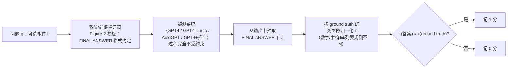
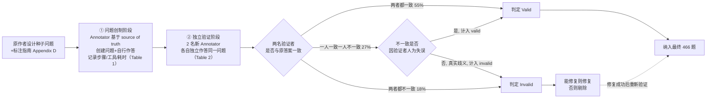
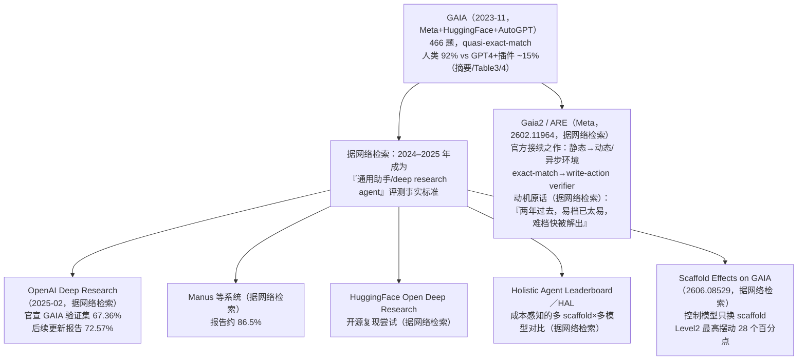

# GAIA：一个通用 AI 助手基准

> 组会汇报文档 · ~20 页 · 50 分钟组会级 · PPT 风格。忠于 arXiv 2311.12983v1 原文，全篇数字均标注 §/Table/Figure/
> Appendix/footnote 出处；原文未给出的一律写明"原文未给出"，不编造。PDF 共 24 页，正文 §1–§7（含参考文献，页 1–16），
> Appendix A–D（页 17–24）。提取方式：Read 工具对该 PDF 报 `pdftoppm` 缺失，改用 Bash 调用 `pdftotext -f <start>
> -l <end> -layout` 分段提取三段（1–8/9–16/17–24）；其中 Table 4（页 21，全篇最重要的数字表）在 `-layout` 模式下出现
> **行错位**（标签行与数字行没有对齐，"AutoGPT (GPT4 backend)"错误地承接了本应属于"GPT4 Turbo"的数字），已改用
> `-raw`、`-table`、`-lineprinter` 三种独立提取模式交叉核对，三者完全一致，并用摘要给出的"92% vs 15%"整体声称反推
> 加权平均验证（详见 §11），确认最终采用的行列对应关系正确。**特别说明**：原文正文没有任何一个带编号的公式（无
> `Eq.(n)`）——评分协议、难度分级全部用散文描述。为满足本库写作规范，本文档把这些散文描述**形式化**为符号与式子，
> 每处都会标注"这是本文档基于原文散文的形式化"，不冒充原文本身就有编号公式。文档中标注为"据网络检索"的内容
> （venue 核实、后续演化谱系）均为撰写本文档时的外部检索结果，非 2311.12983 原文内容，与 PDF 直接读到的信息
> 分层清楚标注。

---

## §1　TL;DR（一页讲清这篇在干嘛）

> 主讲提示：开场先立住"这是一篇纯评测协议论文"，然后立刻抛出全篇最反直觉的一句话——GAIA 存心去找对人类
> **容易**的题，而不是更难的题。这个反转就是它整篇论文的灵魂，后面 §3 会整节展开讲透。

一句话：GAIA 是一个**评测框架**，提出 **466** 道"文本+可选附件文件"的真实世界问答题（摘要；§3.1），覆盖日常
个人事务、科学、常识等通用助手真实使用场景（§3.1）。这些题对人类而言"概念上简单（conceptually simple for
humans）"——标注者验证阶段的平均正确率高达 **92%**（Table 3"Human score (aggregated)"；摘要复述同一数字）——
但对 2023 年最强的 LLM 系统而言"极具挑战（yet challenging for most advanced AIs）"：配了插件的 GPT-4（人工挑
插件的"oracle"估计）整体正确率约 **15%**（摘要；本文档按 Table 4 的题量加权复算得 **14.59%**，详见 §11）。这句
"92% vs 15%"的反差，与"LLM 在需要专业技能的任务（如法律、化学）上反超人类"这一近期趋势形成鲜明对照（摘要）——
GAIA 的整个方法论就是在回应这组反差意味着什么。

- **属于 harness 的哪一层（Θ1）**：本篇几乎**纯粹坐落在 V（Validation）层**，而且比本库同组 SWE-bench 更彻底——
  它**主动拒绝**定义 E（沙箱环境）、T（工具集/API 池）、C（上下文策略）、L（控制循环）：§2 原文明确写道 GAIA
  "does not specify possible APIs, and relies on interactions with the real world"，即刻意不把"用什么工具、在什么
  环境里跑"钉死，把这些完全留给被测系统自己决定。O（Observability）层原文**自陈完全缺失**——§6 承认"GAIA does
  not evaluate the trace leading to the answer"，且"OpenAI's API does not provide the detailed log of tool calls
  yet"，作者想做细粒度分析都做不到工具调用日志。这是一种和 Harness-Bench（V+O，既测结果又测过程）、SWE-bench
  （V 为主+O 雏形，执行日志天然留痕）都不同的极端设计点——GAIA 是"纯黑盒只看最终答案"的那一端。
- **权威性来源**：ICLR 2024 Poster（据网络检索核实，OpenReview forum ID `fibxvahvs3`）。Meta FAIR/GenAI +
  HuggingFace + AutoGPT 四方合作，一作 Grégoire Mialon，通讯作者含 Thomas Scialom（首页 correspondence）。据网络
  检索，2024–2025 年成为"通用助手/deep research agent"评测的**事实标准**——OpenAI 于 2025 年公布 Deep Research
  时把 GAIA 验证集得分（67.36%，后续更新到 72.57%）作为头条指标（据网络检索，非本文档直接读取 OpenAI 官方
  文档，如实标注来源）。
- **本文带走的 3 条结论**：
  1. **"人类易、AI 难"是一次评测哲学的主动反转**，不是意外——GAIA 明确反对"找对人类更难的题"这条当时的主流
     赛道（摘要："GAIA's philosophy departs from the current trend in AI benchmarks suggesting to target tasks
     that are ever more difficult for humans"），理由是"对人类难的题不一定对 LLM 难"（MMLU/GSM8k 均已接近被
     解决，§1），且这条赛道的评分本身也越来越难自动化（详见 §3）。
  2. **三级难度分层**（Level 1/2/3）不是任意划分，而是用annotator 自己解题时的"步数"与"工具种类数"做代理
     变量，且论文用结果做了自我验证——三档难度与四种被测方法的实测表现严格单调对应（§4，详见 §6）。
  3. **答案格式的"quasi exact match"协议**是全篇最值得学的机制——它不靠约束"怎么解题"（过程完全开放）来
     换取好判分，而是靠在**标注阶段**就把答案锁定为"唯一、简短、类型明确"的事实，换来"任由 AI 用任何工具/
     环境/策略作答，最后仍然可以纯字符串比对判分"（详见 §7；这正是任务简报要求讲透的"为什么能兼顾开放式
     任务和自动化评分"）。

---

## §2　问题与动机：为什么"对人类更难"这条路走不通了

> 主讲提示：这页是 Why 三连的"问题层"。记住两个关键词——饱和（saturated）、评委的困境（judge 悖论）——它们
> 各自对应 GAIA 随后给出的一个设计答案。

**Why（问题层）——不解决会卡住什么？**

摘要与 §1 开篇的判断很直接："LLM 的能力正在打破 AI 基准，而且打破的速度越来越快"（§1 改写，引 Kiela et al.
2023）。当时的"找更难题目"主流思路有两条：(a) 用更难的教育类考题（STEM、法律）；(b) 挑战更复杂的生成任务
（如写一整本连贯的书）（§1）。这条路有两个致命问题：

1. **对人类难的题，不一定对最新系统难**：MMLU（Hendrycks et al. 2021）与 GSM8k（Cobbe et al. 2021）这两个
   当时公认"有挑战性"的基准，"已经接近被解决"（§1），部分原因是 LLM 进步太快、部分原因是数据污染
   （footnote 2 举了 Hellaswag 的例子，原文未展开细节，如实标注）。footnote 1 给出具体数字：**GPT-4 在
   MMLU 上做到 86.4%**，而**人类非专家准确率只有 34.5%**，专家级人类表现估计为 **89.8%**——GPT-4 早已
   超过专家水平。
2. **开放式生成天然需要人工或模型评判（model-based evaluation），而这两条路都有结构性缺陷**（§1，引
   Zheng et al. 2023）：
   - **人工评判**：随着任务复杂度增加（输出更长、需要的技能更专业），人工评判会**越来越不可行**——"怎么
     评价一本 AI 写的书，或者世界上没几个人能解出的数学题的解法？"（§1）。
   - **模型评判**：天然依赖一个**比被评模型更强**的模型（通常是 GPT-4）做裁判，因此**无法评测新一代
     SOTA 模型**（评委比选手弱就失去意义），而且评委 LLM 自身的缺陷会带来微妙偏差，比如"偏好排在前面的
     选项"（§1，引 Zheng et al. 2023）——这正是 2026 年 harness 评测里"谁来 judge the judge"这一老问题
     在 2023 年的早期版本。

> **读出什么**：GAIA 面对的不是"随便挑一批更难的题"这种表层问题，而是一个更深的悖论——**评测本身的可扩展性
> 与评测的挑战性天然冲突**：你想让基准更难，往往就得让答案更开放，而答案越开放就越难自动、廉价、公平地打分。
> GAIA 随后的设计（§3）正是针对这个悖论给出的具体解法，而不是又造一批更难的题就完事。

---

## §3　核心设计哲学：人类易、AI 难——一次评测哲学的主动反转（★核心）

> 主讲提示：这是任务简报明确要求"讲透"的一页，也是全篇最有个性的一页。务必讲清楚这不是一个讨巧的噱头，
> 而是有严密论证支撑的方法论选择——论文用了 Proof-of-Work 类比 + AGI 鲁棒性论证两条线来支撑它。

**直觉**：与其去找"对人类也难"的题（这类题天生难判分、难规模化），不如反过来——找一批"人类几乎不假思索
就能做对，但要做对必须**真的**完成一串正确的现实世界步骤（搜索、读文件、跨信息源整合）"的题。人类能轻松做
对，恰好证明这批题**不模糊**（可以自动判分）；而"必须真的走完步骤"这一性质，恰好卡住了只会背书、不会真正
执行的模型。

**GAIA 的原话（摘要）**："Alternatively to tasks that are harder for humans, AI systems could be asked to solve
conceptually simple tasks yet that require accurate execution of complex sequences of actions, with large
combinatorial spaces."

**类比：Proof-of-Work（工作量证明）**（§1，引 Jakobsson and Juels 1999; Dwork and Naor 1993）——GAIA 把这条
设计思路直接类比成密码学里的工作量证明算法："计算机被要求解一个复杂问题，但这个问题的解**易于验证**"（§1）。
把这个类比落到 GAIA 的场景："输出只有在任务被**真正成功完成**之后才能获得，且这个输出**易于校验**"（§1）——
这正是"通用助手类任务"的天然属性：助手需要接入一个多样、不确定的真实世界，这个过程本身就难以蒙混，而它产出
的答案又可以设计成一个简单的事实。

**GAIA 的核心论断——AGI 鲁棒性假说**（摘要原文，全篇最重的一句话）："We posit that the advent of Artificial
General Intelligence (AGI) hinges on a system's capability to exhibit similar robustness as the average human
does on such questions."（我们认为，通用人工智能的到来，取决于一个系统能否在这类问题上展现出与普通人类
相当的鲁棒性。）这句话把"解决 GAIA"直接绑定到了"何以为 AGI"这个更大的问题上，而不只是"再刷一个 benchmark
分数"。

**与 t-AGI / Levels of AGI 框架的呼应**（§1，footnote 4）：论文引用了"t-AGI"概念（定义见 AlignmentForum 一篇
帖子）——"一个 t-AGI 系统，在给定时间 $t$ 内完成任务时，在大多数任务上胜过大多数被给同样时间 $t$ 的人类专家"。
GAIA 的人类标注者平均解题耗时是 **6.8 分钟**（最简单档，Level 1，Table 4）到 **17.7 分钟**（最难档，
Level 3，Table 4）（正文改述为"6 分钟到 17 分钟"，§1，与 Table 4 精确值 6.8/17.7 略有取整差异，如实标注）——
换句话说，一个能稳定解出 GAIA 全部题目的系统，大致相当于一个"17 分钟量级"的 t-AGI。论文进一步指出，这样的
系统"大概率会是 Morris et al. (2023) 提出的 Levels of AGI 框架里一个称职的通用 AI（competent General AI），
而 ChatGPT（OpenAI, 2023）还差它一个等级"（§1）——这把 GAIA 直接放进了"AGI 分级"这个更大叙事的坐标系里。

> **Why（设计层）——朴素替代方案为什么会失败？**
> 朴素做法 A：继续沿着"对人类更难"这条路走，出更难的 STEM/法律考题。→ §2 已经证明这条路失败：难题对人类难，
> 对 LLM 不一定难（MMLU/USMLE 已被打穿），而且题目越复杂，评判就越难自动化。
> 朴素做法 B：既然开放式生成难判，那就退回去做"多选题"（像 MMLU 一样）。→ 论文明确反对：多选题让"污染评估"
> 变得更难——"一条错误的推理链仍然可能蒙对正确选项"（§3.1"Our third principle"），也就是说多选题的表面正确率
> 掩盖了推理过程是否真的对。
> GAIA 的选择：**保留开放式生成（让模型自由展示真实推理与工具使用），但把答案空间收窄成annotator 验证过的
> 唯一事实**——难度留给"过程"，简单留给"答案格式"。这正是 §7 要展开的核心机制，也是这套哲学能落地为一个
> 可执行协议的关键。

> **读出什么**：这套哲学不是"降低标准"，而是**把"难"和"能不能判"这两件事解耦到了任务的不同维度上**——
> 过程维度尽量难（真实世界、多步骤、多模态、组合空间大），答案维度尽量简单（唯一、简短、annotator 验证过）。
> 这个解耦思路后面会在 §7 反复出现，是理解 GAIA 全篇设计的钥匙。

---

## §4　四条设计原则：从"是什么"到"为什么这样设计"

> 主讲提示：这四条原则在原文出现两次——一次在 §1 引言里作为四个项目符号列出，一次在 §3.1"Design choices"
> 里用"我们的第一/第二/第三/最后一条原则"的语言展开论证。两处说的是同一套东西，本页合并讲，逐条给 Why。

GAIA 试图规避 LLM 评测的几个常见陷阱，具体体现为四条设计原则（§1 项目符号 + §3.1 展开）：

**原则一 · 真实世界且有挑战性（Real-world and challenging）**：典型地，LLM 需要浏览开放、不断变化的网络、
处理多模态信息、或做多步推理才能回答问题；相对地，很多 LLM 基准"相当专门化，且/或局限在封闭的合成环境里"
（§1）。§3.1 补充：目标是聚焦"快速通过推理适应、多模态理解、以及潜在多样的工具使用"这类**基础能力**，而不是
专精技能（§3.1，引 Chollet 2019《On the Measure of Intelligence》）——这是全篇第二次引用 Chollet 2019，呼应
"衡量智能应该看**适应新任务**的能力，而不是看在某个专精领域堆了多少已知技能"这一 ARC-AGI 一脉的立场。

**原则二 · 易于解释（Easy interpretability）**：小规模、非专家标注者近乎满分、带有关联推理轨迹的少而精题目，
比"聚合型基准"（aggregated benchmarks）更容易使用——后者"可能缺乏效率与可靠性"（§1，引 Perlitz et al. 2023
《Efficient benchmarking》）。§3.1 举例：对 Figure 1 的 Level 1 例题（H. pylori 临床试验入组人数），推理轨迹
"基本上就是核对正确的网站，报出正确的入组人数"——简单到可以一眼验证。

**原则三 · 不可刷分 / 抗记忆（Non-gameability）**：完成任务需要成功走完若干步骤，"由于步骤的多样性，这些
步骤不能轻易被暴力枚举"（§1）。检查推理轨迹的可能性、答案要求的精确性、答案在训练数据里"以纯文本形式缺席"
这三者共同**抑制**数据污染风险（§3.1，用词是 mitigate 而非 eliminate，即"缓解"而非"消除"）。**对照组**：
多选题（如 MMLU）让污染评估变得更难，因为"一条错误的推理链依然可能蒙对正确选项"（§3.1）——这是 GAIA 反复
强调的一条论据。§3.1 还留了一道"逃生舱口"：万一还是发生了灾难性记忆污染，"用 §3.4 提供的指南很容易再造
新题"（§3.1）。

**原则四 · 易用性（Simplicity of use）**：答案是"事实性的（factoid）、简洁、无歧义的"（§1），这些性质
支撑"简单、快速、事实性的评测"。题目设计为**零样本（zero-shot）**作答，"限制评测设置本身对结果的影响"——
对照很多 LLM 基准对"提示词数量与措辞"敏感（§1，引 Liang et al. 2022b，即 HELM），或对"基准具体实现方式"
敏感（footnote 3，链接到 HuggingFace 关于评测 MMLU 排行榜一致性问题的博客）。

> **Why（设计层）——四条原则合起来解决了什么朴素替代方案解决不了的问题？**
> 朴素做法：像 BIG-bench/HELM 那样，堆叠成百上千个彼此独立的小任务（"大杂烩"式聚合基准）。→ 这类基准
> 单个任务往往偏简单、窄聚焦一两项技能，很难看出模型的"综合通用助手能力"；而且聚合越多，效率与可靠性问题
> 越突出（Perlitz et al. 2023，§1 引用）。
> GAIA 的选择：**少而精**（466 题）、**每题都要求综合多种能力**（Figure 3 左显示平均每题涉及 ~1.7 项能力，
> 详见 §8）、**每题都经过两轮独立人工验证**（详见 §9）。代价是规模远小于 MMLU 的 1.5 万题（§5 Discussion
> 原文直接点出这个对比），换来的是"每一题都是高质量、无歧义、真正测试综合能力"的题目。

---

## §5　符号与任务实例形式化 + 样例

> 主讲提示：原文没有编号公式，这里给出的是本文档基于原文散文的形式化，先给直觉、再定义符号。之后直接看
> Figure 1 的三个真实例题，建立"这道题长什么样"的具体印象。

**直觉**：把一条 GAIA 任务想成"一个问题 + 可能附带一份证据文件，只有一个正确答案，Ground truth 由annotator
亲自验证过"。

**形式化**（本文档基于 §3.1/§3.2 原文散文整理，符号先定义、后用式；原文本身没有编号公式）：

- $q$：问题文本（自然语言，§3.1："These questions are text-based"）；
- $f$：可选附件文件（如图片、表格；§3.1："sometimes come with a file (such as an image or a spreadsheet)"）；
- $a^*$：ground truth 答案——一个**数字**、**字符串（一个或几个词）**，或**由数字/字符串组成的逗号分隔列表**
  （§3.2），且**只有一个正确答案**（§3.2："There is only one correct answer"）；
- $\hat a$：被测系统给出的最终答案，从其输出中按固定模板抽取（见 §7 的 `FINAL ANSWER:` 模板）。

一条 GAIA 任务实例即 $(q, f, a^*)$（$f$ 可为空）；被测系统只能看到 $(q, f)$，零样本作答，目标是产出
$\hat a$，使其在**类型相关的归一化**下与 $a^*$ 一致（精确判据见 §7）。

**三个真实例题（Figure 1，摘录三档难度各一例）**：

| 难度 | 问题 | Ground truth |
|---|---|---|
| Level 1 | 2018 年 1–5 月，NIH 网站上登记的 H. pylori（幽门螺杆菌）与寻常痤疮患者临床试验的实际入组人数是多少？ | 90 |
| Level 2 | 如果这一整品脱都是冰淇淋，按 Wikipedia 2020 年报告的美国联邦标准衡量，它的乳脂含量比标准高/低百分之多少？答案用 +/- 号加一位小数。 | +4.6 |
| Level 3 | NASA"每日一图"2006 年 1 月 21 日的照片里有两名宇航员，其中一人明显更矮小。截至 2023 年 8 月，在这位较矮宇航员所属的 NASA 宇航员组里，排除太空时长为零的成员，谁的太空停留时间最短？给出姓氏，用分号与"停留分钟数"隔开，数字用千位逗号分隔。 | White; 5876 |

（Figure 1 图注："完成这些任务需要推理、多模态处理、或工具使用等基础能力。答案是无歧义的，且按设计极不可能
以纯文本形式出现在训练数据里。部分问题附带额外证据（如图片），反映真实使用场景，也让问题设计更可控。"）

**GPT-4 作答示例（Figure 2）**：一道"上传的 Excel 文件里，某快餐连锁店食品（不含饮料）销售总额是多少"的问题，
GPT-4（Advanced Data Analysis 模式）用 pandas 读取文件、筛选食品列、求和，最终输出"FINAL ANSWER: $89706.00"，
对照 Ground truth "89706.00"——注意模型答案带了 `$` 符号而 ground truth 不带，暗示评分函数在数值类型上做了
某种归一化（如剥离货币符号）；原文没有明确断言这个具体样例最终被判为正确，这是本文档基于图示对照做的**推测性
解读**，如实标注，不代表原文明示。

> **读出什么**：三档例题的问题文本长度、涉及的信息源数量、需要的运算复杂度明显递增（L1 只需查一个网站、
> L2 需要"品脱换算+联邦标准+2020年版本"三条信息拼接、L3 需要先定位宇航员再回溯整个宇航员小组再比较太空
> 时长），这为 §6 的"步数/工具数"难度代理指标提供了直观例证。

---

## §6　三级难度分层设计详解（★核心）

> 主讲提示：这是任务简报要求讲透的第二个核心机制。先给出定义，再讲清楚它是**代理指标（proxy）**而非硬性
> 规则，最后用 §11 的结果做自我验证——这条自证闭环是本节的高潮。

**直觉**：难度不是靠"这题涉及多深的专业知识"来分级（那是"对人类更难"那条被否定的路），而是靠annotator
自己解题时"走了多少步、用了多少种不同的工具"来做代理——这本身就是"人类几乎不觉得难，但过程步骤客观存在"这
一哲学的直接落地。

**符号定义**（本文档基于 §3.3"Increasing difficulty"原文整理的形式化）：
- $s(q)$：annotator 解答问题 $q$ 时记录下来的**步骤数**；
- $k(q)$：annotator 解答问题 $q$ 时用到的**不同工具/能力种类数**（工具与能力的对应关系见 Appendix C，§8 详述）。

**分级规则（§3.3 原文，"loosely"——原文明确用词"松散地"定义）**：

$$
\mathrm{Level}(q) =
\begin{cases}
1 & \text{通常不需要工具，或最多 1 种工具，且 } s(q)\le 5 \\
2 & \text{通常步骤更多，大致 } 5\le s(q)\le 10\text{，且需要组合不同工具} \\
3 & \text{近乎完美通用助手级别：允许任意长的动作序列、任意数量工具、访问整个世界}
\end{cases}
$$

**这不是硬性约束**（§3.3 原文明确自我限定）："不存在单一的'步骤'或'工具'定义，一个问题可能有多条可行的
解题路径" ——annotator 记录的步数/工具数只是**代理（proxy）**。举例：一道annotator 只用了不到 10 步的题，
如果它需要复杂的网页导航，也可能被归为 Level 3 而非 Level 2（§3.3 原文举的例子）。

**自我验证（§3.3 末句 + §4 结果）**："我们对难度的定义在 §4 得到了验证"（§3.3）。具体证据：Figure 3
（右图）展示 466 题在"步数—工具数"两个轴上的分布，三档难度呈现出可分辨的区域；更有力的证据在 §4："我们
提出的、基于步骤数与工具种类数松散定义的难度等级，与当前模型的实测表现相关，从而加强了这些等级的有效性"
（§4 原文改写）。这个"有效性"体现在 Table 4 上极为直观——**四种被测方法（GPT4/GPT4 Turbo/AutoGPT/GPT4+
插件）在 Level 3 上无一例外全部是 0%**，而人类在 Level 3 上仍能拿到 87.3%（详见 §11）——难度分级和实测
表现完美地单调对应，形成一个自洽的闭环证据链。

**难度与耗时的关系（Appendix C，Figure 7/Figure 8）**：annotator 回答一道题所花的时间，与"步骤数"有明显
相关性，但与"工具种类数"的相关性不明显（Appendix C 原文："The correlation is less clear with the number of
different tools used"）——即 Figure 8（时间 vs 步骤数）比 Figure 7（时间 vs 工具数）表现出更清晰的正相关
趋势。图注进一步点评 Figure 7："用更多工具不必然意味着花更多时间"（Figure 7 图注）——这是一个有意思的
反直觉观察：工具种类多不代表耗时长，真正拖时间的是步骤链条的长度。

> **读出什么（Θ2 呼应，提前预埋）**：三级难度的本质是"annotator 走完整条正确路径需要多少动作"，这和
> Harness-Bench（本库 v2 标杆 2605.27922）§12 的"哪类任务最吃 harness"遥相呼应——越是需要多步串联、多
> 工具协同的任务，"脚手架/harness 怎么设计"对最终表现的影响就越大。GAIA 虽然没有把这一点上升为"harness
> 效应"的理论表述（这是 2023 年的论文，尚未出现"harness"这个术语的系统用法），但 Level 越高、需要串联的
> 工具越多，恰恰就是后续研究者（详见 §18 的 Scaffold Effects on GAIA）拿 GAIA 做"控制模型、只换 scaffold"
> 实验时选中"Level 2"作为主战场的原因——这不是巧合。

---

## §7　答案格式与精确匹配评测协议：为什么能兼顾开放式任务和自动化评分（★核心）

> 主讲提示：这是任务简报明确要求讲透的第三个核心机制，也是全篇工程含金量最高的一页。先讲清楚"评测怎么跑"，
> 再上形式化，最后专门用一个 Why 块回答"为什么这套设计能同时保住开放性与自动化"——这是组会上最该被追问、
> 也最能体现有没有读懂的地方。

**直觉**：把一次评测想成"给模型一道题（可能带文件），模型可以用任何它想用的方式作答——搜网页、读文件、写
代码、调插件、甚至纯靠记忆——但**最后必须按一个固定模板吐出一个简短、类型明确的最终答案**，评测脚本只做
字符串比对，不看过程"。

**评测协议原文**（§3.2）："评测是通过模型答案与 ground truth 之间的**准确匹配（quasi exact match）**完成的
（up to 某种与 ground truth"类型"绑定的归一化）"。系统/前缀提示词（Figure 2）用于告知模型所需格式。

**Figure 2 系统提示词全文（本文档逐字翻译）**：

> 你是一个通用 AI 助手。我会问你一个问题。请报告你的思考过程，并用以下模板结束你的回答：
> `FINAL ANSWER: [YOUR FINAL ANSWER]`。你的最终答案应该是一个数字，或者尽量少的几个词，或者一个由数字
> 和/或字符串组成的逗号分隔列表。如果被要求给出数字，不要用逗号分隔数字，也不要使用美元符号或百分号等
> 单位（除非题目另有说明）。如果被要求给出字符串，不要用冠词，也不要用缩写（比如城市名），除非题目另有
> 说明，否则请把数字写成文字形式。如果被要求给出逗号分隔列表，请依据列表中每个元素是数字还是字符串，分别
> 套用上述规则。

**归一化的形式化**（本文档基于 §3.2 原文散文的形式化）：设 $\mathrm{type}(a^*) \in \{\text{数字},\ \text{字符串},\
\text{列表}\}$，$\tau_{\mathrm{type}}(\cdot)$ 为该类型对应的归一化函数（数字类去除千位分隔符/单位符号；字符串类
去冠词、去缩写、数字转文字；列表类逐元素套用前两条规则）；则

$$
\mathrm{Score}(q) = \mathbb 1\big[\ \tau_{\mathrm{type}(a^*)}(\hat a) = \tau_{\mathrm{type}(a^*)}(a^*)\ \big]
$$

$$
\%\mathrm{Score} = \frac{1}{N}\sum_{i=1}^N \mathrm{Score}(q_i)
$$

原文补充一句很关键的工程事实："实践中，GPT4 级别的模型很容易遵循我们的格式"（§4）——这说明 Table 4 里
那些个位数/十几个百分点的低分**不是**"模型不会按模板输出"造成的格式错误，而是**真的答错了**，排除了一个
常见的混淆因素。

**Why（设计层）——为什么这套设计能同时兼顾"开放式任务"和"自动化评分"？**
> 朴素做法 A（像 AgentBench/ToolQA 那样约束过程）：预先定义一套固定 API 池/闭环境境，只允许模型在这个池子
> 里调用工具。→ 好处是过程可控、容易记录，但代价是评测的其实是"模型有没有学会调**我们这套特定 API**"，
> 而不是通用世界里的真实解决能力（§2 原文批评 AgentBench 正是"risk evaluating how well the assistants have
> learned to use specific APIs, instead of more general results grounded in real world interactions"，详见
> §16）。
> 朴素做法 B（像开放式生成评测那样约束答案的语义正确性，但保留长答案）：让模型自由回答，用人工或模型评委
> 打分语义是否正确。→ §2 已经论证过这条路的两个硬伤——人工评判不可扩展，模型评判有裁判偏见+无法评测比
> 裁判更强的模型。
> GAIA 的选择：**过程 0 约束（不设 E/T/C/L 任何一层），答案 1 处强约束（annotator 验证阶段就锁定为"唯一、
> 简短、类型明确"的事实）**。这把"开放性"完全留在**解题过程**这个维度（爱用什么工具、爱怎么规划都行），
> 把"可自动化"完全放在**答案表示**这个维度（annotator 已经替未来的评测脚本把"正确性判断"这件苦活干完了，
> 剩下的只是字符串比对）。代价是：GAIA **只能出"事实性问答"这一类题**，出不了"写一篇文章""设计一个方案"
> 这类真正开放式产出的题（这条边界在 §15 Limitations 里也有呼应）。

> **读出什么**：这个设计和本库同组 SWE-bench 的核心思路（§6：不比较模型输出与"标准答案"的文本相似度，
> 而是让仓库自己的测试套件说了算）神似而神不似——两者都是"**不评判过程像不像标准解法，只看结果能否被
> 客观核验**"这同一条设计公理的不同落地：SWE-bench 靠**执行测试**核验（代码域天然自带可执行判据），GAIA
> 靠**annotator 事先验证过的答案唯一性**核验（开放域没有天然可执行判据，只能靠人工把"答案空间"预先收窄到
> 可比对的程度）。这也解释了为什么 GAIA 需要 §9 那一整套"两轮独立annotator验证"流程——它是 GAIA 版本的
> "执行过滤"，只不过验证对象从"测试能不能跑通"换成了"这个答案是不是真的唯一无歧义"。

---

## §8　GAIA 的组成：466 题从哪些能力、哪些文件类型拼出来

> 主讲提示：这页是数据画像页，把 Figure 3（左）与 Figure 6 的具体数字过一遍，注意这些计数是"多标签"的
> （一题可能同时需要多种能力），别误读成互斥分类。

**能力覆盖（Figure 3 左，本文档已用 `-raw` 模式核对；计数为"至少需要该能力才能解决"的题目数，多标签、
不互斥）**：

| 能力 | 涉及题目数 |
|---|---:|
| Web browsing（网页浏览） | 355 |
| Coding（代码执行） | 154 |
| Multi-modality（多模态） | 138 |
| Diverse filetype reading（多样文件类型读取） | 129 |
| N/A（非增强 LLM 也能做） | 32 |

五项计数相加为 808，远超总题数 466——这是本文档的推算，用于说明这是**多标签**统计（平均每题涉及约
$808/466\approx 1.73$ 项能力），原文没有直接给出这个"人均能力数"的汇总值，如实标注为本文档推算。

**能力定义与典型工具举例（Appendix C，逐字翻译要点）**：
- **Web browsing**：搜索与浏览网站相关的工具。例：网页浏览器、搜索引擎、网站控件访问、YouTube 访问、
  Google 街景。
- **Multi-modality**：理解文本以外数据模态的工具。例：语音转文字、视频识别、图像识别、OCR、Google 街景。
- **Coding**：代码执行相关工具。例：Python、计算器、替换密码编码器、C++ 编译器、词语反转脚本。
- **Diverse filetype reading**：理解用户提供或网上找到的各类文件的工具。例：PDF 阅读器、Excel 访问、
  PowerPoint 阅读器、CSV 访问、txt 文件访问。
- **N/A**：非增强 LLM 当前就能完成的任务对应的工具。例：俄罗斯方块规则数据库、德语翻译器、拼写检查器、
  文本编辑器、贝斯音符数据。

原文特别提醒："同一个工具可能属于多个类别"（例如 Google 街景同时涉及网络访问、浏览、多模态），因此
"这些类别是 GAIA 所需能力的**指示**，而非题目的完美分类法"（Appendix C）。

**文件类型分布（Figure 6，Appendix C，本文档已用 `-raw` 模式核对）**：

| 文件类型 | 数量 |
|---|---:|
| xlsx | 29 |
| png | 18 |
| pdf | 15 |
| txt | 13 |
| mp3 | 7 |
| jpg | 7 |
| csv | 6 |
| docx | 2 |
| pptx | 2 |
| zip | 2 |
| xml | 2 |
| py | 1 |
| json | 1 |
| m4a | 1 |
| pdb | 1 |
| MOV | 1 |
| jsonld | 1 |

累加约 **109** 个文件实例（本文档汇总所得，原文未直接给出该合计数）。一道题是否可能对应不止一个文件，
原文未明确说明，本文档不做推测；但从数量级看，大致对应"466 题中约有五分之一（≈23%）附带文件证据"这一
量级（本文档推算，未经原文精确核实，如实标注为估算）。

**语言与文化覆盖**：作者"尽最大努力覆盖不同主题领域与文化"，但"数据集的语言仅限英语"（§3.3，与 §15
Limitations 呼应）。

> **读出什么**：Web browsing 355/466（约 76%）是遥遥领先的第一大能力需求——这与 GAIA"依赖开放变化的网络"
> 这一核心设计取向完全一致；而"编码"（154）与"多样文件读取"（129）合起来指向"GAIA 相当一部分题目要求
> 模型像分析师一样处理结构化/半结构化数据"，这正是 §13 案例研究里能看到的场景（如 Excel 销售额求和题）。

---

## §9　问题构建与两轮独立验证流程

> 主讲提示：这一页是 GAIA 版本的"质量闸门"，与 SWE-bench 的三级过滤管线扮演同一角色——都是"如何在没有
> 天然可执行判据的领域里，人工造出一套可信、抗歧义的判分基准"。

**问题创制阶段（Appendix D）**：作者提供了一批自己设计的种子问题，连同以下指令交给（付费）annotator
（Appendix D 原文逐条翻译）：

- 问题必须基于一个**信实来源（source of truth）**（Wikipedia、arXiv、GitHub 等）；Level 2/3 的好方法是
  **组合多个**信实来源；
- 确保答案**不会**以纯文本形式出现在互联网上；
- 确保答案是一个数字，或最多几个词，以保证评测的鲁棒性；
- 确保答案**不随时间变化**（包括信实来源本身可能被删除的情况）；
- 确保答案**无歧义**；
- 确保问题"有意思"——即读到这个问题时，你会觉得一个 AI 助手能回答它会对你很有帮助；
- 确保问题能在**合理时间内**被人工annotator 回答；
- （后续补充）检查托管答案所需信息的网站的 `robots.txt`，确保 AI 助手可以访问。

annotator 创建问题后还要**自己作答**，并记录元数据：用了哪些工具、走了哪些步骤、花了多长时间（§3.4）。
一个典型的annotator 标注结果如 **Table 1**（H. pylori 临床试验题）：8 个步骤（"在 Google 搜索'nih'→点开
nih.gov→搜索'h pylori acne'→点'More'选'Clinical Trials'→点开对应结果→核对日期确认为 2018 年 1–5 月→
打开'Tabular View'→下拉到 Actual Enrollment 记下数字"）、1 种工具（网页浏览器）、答案 90、耗时 8 分钟。

**注释来源（§3.4 footnote 5）**："更准确地说，是我们团队与 Surge AI 的付费annotator 合作完成的"——即问题
创制、验证均由 Surge AI（一家付费标注平台）的标注者与作者团队协作完成，不是众包或无偿贡献。

**验证阶段（§3.4 + Appendix D）**：问题创建后，两名**新的**annotator 独立作答同一问题，检查是否存在歧义。
如果原annotator 与两名新annotator 得出相同答案，问题被**判定有效（validated）**；出现分歧的问题，如果不是
"人为失误"，则尝试修复，修复不了就**剔除**。

**验证统计（Table 3，本文档已用 `-raw`/`-table`/`-lineprinter` 三重核对；623 道新创建问题，由两名新
annotator 各自独立作答，共 1,246 条标注结果）**：

| 统计项 | 占比 |
|---|---:|
| 两名新annotator 都与原答案一致 | 55% |
| 一名一致、另一名不一致 | 27% |
| 两名都不一致 | 18% |
| **有效问题（aggregated）** | **68%** |
| 有效 Level 1 问题占比 | 75% |
| 有效 Level 2 问题占比 | 68% |
| 有效 Level 3 问题占比 | 47% |
| **人类得分（aggregated）** | **92%** |
| 人类得分 Level 1 | 94% |
| 人类得分 Level 2 | 92% |
| 人类得分 Level 3 | 87% |

（脚注定义："有效问题"= 两名annotator 都给出与题目设计者相同的答案，**或**只有一名给出相同答案、另一名的
不一致被判定为"人为失误"；"人类得分"= 全部有效问题上，验证annotator 给出正确答案的比例。）

**算术自检（本文档核验，非原文自带）**：55%（都一致）+ 27%（一人一致一人不一致）+ 18%（都不一致）=
100%，闭合。"有效问题 68%"= 55% + 从 27% 那一档中被判定为"人为失误"的部分（68%−55%=13 个百分点，约占
27% 那一档的 48%）；相应地，"无效问题 32%"= 18%（都不一致）+ 27% 那一档中被判定为"真实歧义"的部分
（27%−13%=14 个百分点），即 18%+14%=32%，与 100%−68%=32% 完全吻合——本文档核验此表内部算术自洽，无
转录错误。此外，Table 3 的"人类得分"（92%/94%/92%/87%）与 §11 将展开的 Table 4"Human annotator"行
（93.9%/91.8%/87.3%，四舍五入后正是 94%/92%/87%）逐位吻合，是两张独立统计表相互印证的又一佐证。

**验证成本**："我们估计创建一道题（含两名补充annotator 的验证与可能的修复）需要 2 小时annotator 时间"
（§3.4，Appendix D 重复同一数字）。按此粗略折算，466 题合计约 **932 人时**（本文档基于单题耗时的推算，
原文未直接给出这一汇总数字，仅供直觉参考）。

> **读出什么**："有效问题占比"随难度单调下降（75%→68%→47%）——难度越高，annotator 之间越容易出现分歧，
> 这符合直觉（步骤越多，出现"某一步的信息来源版本不一致"等歧义的概率越大），也从侧面印证了 §6 的难度
> 分级不是空中楼阁。而这套"两轮独立复核、只保留全员一致或可修复"的机制，本质上是 GAIA 版本的"执行过滤"——
> SWE-bench 靠代码能不能跑通来把关，GAIA 靠人类能不能达成一致来把关，两者都是"用一种领域内可获得的客观
> 信号，把主观判断的空间挤到最小"。

---

## §10　实验设置：五种基线怎么跑的

> 主讲提示：这页讲清楚"评测跑了哪几种系统、怎么跑的"，为下一页读 Table 4 打基础。

被测系统与基线（§4）：
- **GPT4**（无插件，OpenAI, 2023）；
- **GPT4 Turbo**（无插件）；
- **AutoGPT**（GPT4 作为后端；§4 footnote 7 给出具体评测版本的 git commit hash
  `ed172dec1947466cc0942abf75bb77b027cd433d`，锁定可复现的具体版本——这是一处值得称道的复现性细节）；
- **GPT4 + 插件**（人工挑选插件，详见下段）；
- **人类annotator**（非 LLM 基线）；
- **搜索引擎**（非 LLM 基线：把问题原样输入搜索引擎，检查答案能否从第一页结果里推断出来，§4）。

**关于"GPT4+插件"这一行的特殊性（§4）**：GPT4（无插件）与 GPT4 Turbo 都有 API，可以自动化重复评测；但
2023 年写作时，"GPT4+插件"**没有 API**，只能靠人工手动在 ChatGPT 界面里操作——用户必须在"Advanced Data
Analysis 模式"（自带代码执行与文件读取）与最多三个第三方插件之间手动选择。作者的操作方式是"根据我们对
任务最需要能力的最佳猜测"手动选（§4），常用组合是：(i) 一个读取各类链接的工具、(ii) 一个网页浏览工具、
(iii) 一个计算工具。由于插件商店经常变化（甚至 GPT4 官方搜索工具一度因"可能绕过付费墙"被下架、后来又
恢复），作者明确承认："我们给 GPT4+插件的分数是一个**'oracle'估计**——用更稳定、自动选择的插件本可以
达到的潜力，而不是一个容易复现的结果"（§4）。这条自我限定非常重要，直接影响 §11 如何解读这一行数字。

**运行规则**："只要有直接 API 访问权限，我们就把模型跑三次，报告平均结果"（§4）——这解释了 Table 4 中
GPT4 与 GPT4 Turbo 两行带 `±` 误差棒，而 AutoGPT/GPT4+插件/搜索引擎/人类四行不带的原因：GPT4+插件是人工
操作、无法稳定复现三次一致的插件组合；搜索引擎与人类是非 API 方法；AutoGPT 虽然可自动运行，但原文未明确
说明为何该行没有 `±` 误差棒——合理推测与其单题耗时过长（详见 §11 Table 4，AutoGPT 单题耗时 7.6–11.7
分钟）有关，重复三次成本过高，但这是本文档的推测，原文未言明，如实标注不做武断结论。

**耗时测量方法**："API 的耗时数据是在 20 道题上跑出来后取平均，并且是在某个单一时间点测得的：它们不是
为了对比 GPT4 与 GPT4 Turbo 的速度，而是为了对比 GPT4 与其它类型方法回答 GAIA 的耗时"（Table 4 表注）。

---

## §11　主结果：Table 4 全景解读（★核心数字页）

> 主讲提示：这是全场最该停留的数字表。先给全表，再点出"92% vs 15%"这句摘要金句具体是怎么从这张表里
> 加权算出来的，最后指出 L3 全灭这个最戏剧性的行。

**Table 4（§4/Appendix D.1，本文档已用 `-raw`、`-table`、`-lineprinter` 三种独立提取模式交叉核对，逐格
对齐；这是原文唯一一张在 `-layout` 模式下出现行错位的表，务必以此三重核对结果为准）**：

| 方法 | Score L1 (%) | Score L2 (%) | Score L3 (%) | 耗时 L1 (min) | 耗时 L2 (min) | 耗时 L3 (min) |
|---|---:|---:|---:|---:|---:|---:|
| **题目数** | 146 | 245 | 75 | 146 | 245 | 75 |
| GPT4（无插件） | 9.1 ± 2.5 | 2.6 ± 0.6 | 0 | 0.19 | 0.15 | N.A. |
| GPT4 Turbo（无插件） | 13.0 ± 2.1 | 5.5 ± 1.4 | 0 | 0.24 | 0.12 | N.A. |
| AutoGPT（GPT4 后端） | 14.4 | 0.4 | 0 | 7.6 | 11.7 | N.A. |
| GPT4 + 插件（人工选，oracle 估计） | 30.3 | 9.7 | 0 | 0.65 | 0.53 | N.A. |
| 搜索引擎 | 7.4 | 0 | 0 | 7.4 | N.A. | N.A. |
| **人类annotator** | **93.9** | **91.8** | **87.3** | 6.8 | 10.5 | 17.7 |

（题目数 146+245+75=466，与摘要总题数完全吻合，是本文档做的算术自检；"人类annotator"行与 Table 3
"人类得分"行四舍五入后逐位一致，见 §9 末尾。）

**"92% vs 15%"这句摘要金句是怎么算出来的**：Table 3 直接给出"Human score (aggregated)** 92%"；对
GPT4+插件行，原文没有直接给出一个跨三档的加权聚合百分比，本文档按题目数 146/245/75 加权复算：
$(30.3\times146+9.7\times245+0\times75)/466 \approx 14.59\%$，四舍五入后正是摘要所说的**"15%"**——本文档
在此确认这处加权推算与摘要声称完全吻合。

**本文档同法为其余方法补算的加权聚合分（原文未直接给出，仅 Human/GPT4+插件 两行的聚合含义可从摘要/
Table 3 反推得到确认，其余四行为本文档推算，如实标注）**：

| 方法 | 加权聚合分（本文档推算） |
|---|---:|
| 人类annotator | ≈ 91.7%（Table 3 直接给出 92%） |
| GPT4 + 插件（oracle） | ≈ 14.6%（摘要给出"15%"） |
| GPT4 Turbo | ≈ 7.0% |
| AutoGPT | ≈ 4.7% |
| GPT4（无插件） | ≈ 4.2% |
| 搜索引擎 | ≈ 2.3% |

**Level 3 的"全灭"现象**：**除人类外，全部五种方法在 Level 3 上均为 0%**（Table 4）——这是全表最戏剧性
的一行数字，直接对应摘要原句"即使装备了工具，GPT4 在最简单的任务上也不超过 30% 的成功率，在最难的任务上
则是 0%"（摘要改写；注意 GPT4+插件 Level 1 精确值是 **30.3%**，严格意义上"略微超过"了 30%，这是原文表述
"does not exceed a 30% success rate"与 Table 4 精确数字之间一处很小的取整方向差异，如实标注，不代表数字
有误）。

> **读出什么**：把"92% vs 15%"与"L3 全灭"两条证据并读，能看到 GAIA 的难度设计确实做到了"随 Level 递增，
> 人类掉得很慢（94%→92%→87%，Table 3），AI 掉得极快甚至归零"——这正是 §6 所说"难度分级用结果验证了自身
> 有效性"的具体数字实锤。同时也能看到，"GPT4+插件"这一整条 harness/工具增强链路，把 GPT4 在 Level 1 上的
> 表现从 9.1% 顶到了 30.3%（**3.3 倍**），这是 §12/§18 要重点展开的"Agent = Model + Harness"早期证据。

---

## §12　结果解读：工具增强的价值，与 AutoGPT 的一处数字张力（Why 结果层）

> 主讲提示：这页专门做"读细"——先讲清楚工具增强为什么有用，再诚实地指出正文一句话描述与 Table 4 精确
> 数字之间的一处张力，不强行调和，这正是本库一贯的诚实底线。

**Why（结果层）——为什么"GPT4+插件"比"GPT4 无插件"高出这么多？**
Level 1 上 GPT4 无插件只有 9.1%，GPT4+插件（oracle）却有 30.3%，**同一个底层模型**，分数差了 3.3 倍。
正文的解读（§4）："GPT4 无插件与其它方法之间的差距，说明通过工具 API 或访问网络来增强 LLM，能提升答案
准确率，并解锁许多新的使用场景"（§4）。具体行为观察（§4，示例见 Appendix D.1）：GPT4+插件展现出"回溯或
在结果不满意时重新提炼查询词"的行为，以及相对更长的"计划执行"过程——Figure 10 的案例（详见 §13）正是
"重新提炼查询词"的直接示例。

**AutoGPT 的一处数字张力**：正文写道："AutoGPT4 ... 在 Level 2、乃至 Level 1 上，相较于无插件的 GPT4，
表现都令人失望"（§4 改写原句"offer disappointing results for Level 2, and even Level 1 compared to GPT4
without plugins"）。但对照 Table 4 精确数字：

| | Level 1 | Level 2 |
|---|---:|---:|
| GPT4（无插件） | 9.1% | 2.6% |
| GPT4 Turbo（无插件） | 13.0% | 5.5% |
| AutoGPT（GPT4 后端） | **14.4%** | **0.4%** |

AutoGPT 在 **Level 2**（0.4% 远低于 GPT4 的 2.6%、GPT4 Turbo 的 5.5%）上确实"令人失望"，与正文描述完全
吻合；但在 **Level 1** 上，AutoGPT 的 14.4% 实际**高于** GPT4 无插件的 9.1%，也高于 GPT4 Turbo 的 13.0%
——并不是正文字面意思所暗示的"比无插件 GPT4 还差"。本文档用 `-raw`、`-table`、`-lineprinter` 三种独立
提取模式反复核对这张表的行列对应关系（详见文档开头的提取说明），确认这一数字张力不是提取错误。合理的
折中解读是：正文这里的"disappointing"更可能是在**相对预期**的意义上使用——一个号称能自动串联工具的
agent，本该在 Level 1 上大幅超过 30.3%（GPT4+插件的水平）才符合"自动化本该带来更大增益"的预期，但
AutoGPT 只涨到 14.4%，涨幅有限；到了 Level 2 更是直接崩到 0.4%，接近失灵——而不是字面意义上"两个 Level
都被无插件 GPT4 反超"。本文档如实记录这处原文表述与精确数字之间的张力，不强行调和，也不代表 AutoGPT
一定"两个 level 都更差"。

正文对这一现象的归因："这种差异可能来自 AutoGPT4 依赖 GPT4 API 的具体方式（提示词与生成参数），需要
在不久的将来做新的评测"（§4）；此外"AutoGPT4 相较其它 LLM 也更慢"——Table 4 显示 AutoGPT 单题耗时
7.6–11.7 分钟，比 GPT4/GPT4 Turbo（0.12–0.24 分钟）慢了**30–60 倍**。

**总体结论**（§4 原文）："总体而言，人类与 GPT4+插件之间的协作，目前看来提供了'分数/所需时间'比值最好的
组合"——这句话点出一个有意思的方向：不是纯 AI 自动化，而是"人类挑插件+GPT4 执行"这种**半自动化**组合，
在 2023 年是效率最优解。这与 §14 Discussion 里"部分自动化 vs 完全自动化"的讨论直接呼应。

> **读出什么**：这一节最大的收获不是"哪个方法分数更高"，而是**同一个 GPT4 权重，只因为外面套的执行策略
> 不同（无工具/AutoGPT 自动循环/人工插件挑选），Level 1 分数在 9.1%–30.3% 之间摆动，摆动幅度超过 3 倍**——
> 这在 2023 年 11 月这个时间点，已经是"Agent = Model + Harness"命题一份朴素但明确的早期证据，只是论文
> 没有用"harness"这个词去命名它（详见 §18 的 Θ2 回扣）。

---

## §13　案例研究：从记忆缺陷到逻辑谜题失败

> 主讲提示：这页挑 Appendix D.1 里三个具体的 GPT4 作答示例过一遍，用真实问答让"模型哪里错、哪里对"变得
> 可触摸，别只停留在抽象的百分比。

**案例一 · 记忆截止日期 vs 实时检索（Figure 9）**：问题——"Nedoshivina 2010 年论文中 Kuznetzov 描述的
越南标本，最终被保存在哪里？只给城市名，不要缩写。"（Ground truth：Saint Petersburg，圣彼得堡）
- **无网页浏览的 GPT4**：直接回答"我无法浏览互联网或获取 2022 年 1 月知识截止日期之后的新信息，因此
  无法提供……"——`FINAL ANSWER: Unable to provide`，**完全答不出**（Figure 9）。
- **配网页浏览插件的 GPT4**：搜索"Vietnamese specimens described by Kuznetzov Nedoshivina 2010 paper
  deposition location"，读取到一篇馆藏目录页面，直接命中"deposited in the Zoological Institute, St.
  Petersburg"——`FINAL ANSWER: Saint Petersburg`，**答对**（Figure 9）。

> **读出什么**：这组对照精确地展示了"知识截止日期"这一纯语言模型的硬伤，以及"接上网络浏览工具"这一
> 最基础的 harness 组件能带来的立竿见影效果——这是 §8"Web browsing 355/466 高居能力需求榜首"这一统计
> 数字背后最直观的机制解释。

**案例二 · 查询重构（query refinement，Figure 10）**：问题——"电影《金手指》结尾，James Bond 用什么颜色
的物体把自己和 Pussy Galore 藏起来？"（Ground truth：orange, white）GPT4 网页浏览插件先搜"Goldfinger
ending scene object color"，结果不够满意，**主动重新提炼查询词**为"Goldfinger ending scene parachute
color"，再读取内容，最终答对"Orange, White"（Figure 10；图注特别指出这是"能根据搜到的信息优化初始查询"
的官方 GPT4 浏览插件版本才有的行为，且这个具体版本后来被下架，无法用新版本复现——呼应 §5/§10 讨论的
"闭源系统可复现性"问题）。

**案例三 · 自包含谜题的推理失败（Figure 11）**：一道完全**不需要联网、不需要工具**的纯逻辑谜题——一个
标准魔方被拆成小方块，给出一串关于"哪些颜色的方块已找到"的复杂条件链，要求推理出"被移走的那个方块上的
两种颜色"（Ground truth：green, white，绿色、白色）。GPT4 给出了一长串看似有条理的逐步分析，但**最终
结论错误**——`FINAL ANSWER: Red, Yellow`（Figure 11）。图注点评："GPT4 与其它助手在谜题上表现挣扎，
而这类题往往属于 Level 1"（Figure 11 图注）。

> **读出什么**：三个案例合起来揭示了 GAIA 失败模式的**两种截然不同的根源**——案例一/二是"信息缺口"型
> 失败（模型本身推理没问题，缺的是接入实时世界的能力，一旦补上工具就立刻答对），案例三是"纯逻辑推理"型
> 失败（不缺信息，纯粹是多步条件推理链在中途出错）。这对应了 §8 能力分类里"Web browsing"（信息缺口类）
> 与"N/A"（不需要额外能力，纯推理类，但 32/466 题里依然会出错）两个类别——即便是"用现有能力就该会"的
> 题目，GPT4 依然不能保证做对，这提示 GAIA 的低分不能简单归因为"工具不够"，**推理鲁棒性本身也是瓶颈**。

---

## §14　讨论：AI 评测范式的四个反思（§5 Discussion）

> 主讲提示：这页是论文作者跳出 GAIA 本身、对"AI 评测该往哪走"做的四点前瞻性思考，属于"设计哲学"的延伸，
> 组会上适合作为引发讨论的引子。

**反思一 · 闭源系统的可复现性问题**：闭源 API 背后的模型能力可能随时间变化（§5，引 Chen et al. 2023
《How is ChatGPT's behavior changing over time?》），使得"某个时间点做的评测不可复现"。更麻烦的是：像
ChatGPT 插件这类能力会定期变化，且当时还不能通过 API 访问。作者认为"静态基准可能会让位于'随时间衰变'的
基准，因为它们依赖真实世界"——但 GAIA 本身"对 token 生成的随机性是鲁棒的，因为只有最终答案（且只有一个
正确答案）被评测"（§5）。

**反思二 · 静态 vs 动态基准**：GAIA 目前是"数百道精心策划、筛选过的问题"，相比 MMLU 近 1.5 万题的规模
小得多；但 MMLU 是多选题，"看起来比我们的开放式问题更简单"（§5）。作者坦言 GAIA"很可能随时间衰变"，
衰变的两条路径：(i) 预训练数据的**灾难性污染**，(ii) 网络上部分答题所需信息**消失**。作者的应对策略是
"逐年清除失效问题、补充新问题，让 GAIA 演化"，认为这可能是更好评估 AI 系统泛化性与鲁棒性的重要组成部分——
"静态基准生来就是要变成坏基准的（Static benchmarks are broken benchmarks in the making）"（§5 原句，
是本篇最凝练的一句警句）。

**反思三 · 生成式模型的统一评测**：许多 GAIA 任务可能需要调用可能出错的子模块（如图像分类器给错标签）——
有人可能会说这让评测变得模糊，因为它把系统当整体评测，不区分错误归因到哪个子部件（如网页浏览还是视觉
模块）。但作者认为"LLM 外接工具做每一项非文本理解任务"这一范式未必会长久存在——未来模型可能像
Flamingo/OBELICS（Alayrac et al. 2022; Laurençon et al. 2023）那样把视觉语言能力**原生集成**进模型本身。
GAIA 的定位是"评测 AI 系统，而非当前的架构标准"（§5）——这是一句很有前瞻性的表态：即便未来不再是"LLM+
外挂工具"这套架构，GAIA 的题目设计本身依然成立。

**反思四 · 部分自动化 vs 完全自动化**：作者区分"部分自动化"（仍需人类在环）与"完全自动化"（完全不需要
人类）——两者可能只差"任务出错率 1% vs 0%"这种表面上很小的差距，却是两种根本不同的范式。深度学习一直
在追求完全自动化，但"即便在多个领域取得了 SOTA 结果，大多数基于神经网络的系统依然会在一些常见场景里
不可预测地失败"，阻碍了自动驾驶等技术的落地（§5）。**解决 GAIA 需要完全自动化**，因为"答案不允许任何
近似"（§5）——这是一句很值得注意的定位：GAIA 的"quasi exact match"协议表面上有一点点归一化容忍度，但
就任务本质而言，它要求的是"确定性地把整个流程走对"，不接受"大部分对了"这种近似解。作者也提醒"更多人类
活动的完全自动化会重塑我们的社会经济格局"，其中利益主要被技术所有者而非人类劳动者攫取的风险，是支持
开源的一条论据（§5，引 Growiec 2022）。

---

## §15　局限与作者自陈边界：Datacard 里的人口学细节

> 主讲提示：这页把 §6 Limitations 与 Appendix B Datacard 合并讲——前者是方法论边界，后者是"谁参与制作
> 了这个基准"的透明度声明，两者共同构成"诚实标注局限"的完整画像。

**作者自陈的三条局限（§6，诚实）**：

1. **缺失对推理轨迹的评测**：GAIA 目前**不评测导向答案的推理过程**——不同于唯一的 ground truth，不同
   路径都可能导向正确答案，且没有显而易见、简单的方式给这些路径打分，而 GAIA 优先考虑的是易用性（§6）。
   作者认为未来加入人工或模型评判轨迹是"有趣的方向"，理由是（i）GAIA 的问题很少需要专家知识，招募标注
   人员的门槛低；（ii）裁判可以直接参照 ground truth，通常"验证比独立推导答案更快"——这条留白直接呼应
   §1"O 层完全缺失"的论断。另外，作者只评测了"能获取工具、因此能得到有信息量分数"的最强 LLM；OpenAI 的
   API **当时不提供工具调用的详细日志**，无法做细粒度分析——这是一句很关键的自陈，直接解释了为什么 GAIA
   连"记录一下工具调用轨迹"这种最基础的 O 层能力都没有，不是不想做，而是当时**做不到**（底层 API 不
   暴露这些信息）。
2. **设计无歧义问题的成本**：要保证问题无歧义，需要两轮标注——第一名annotator 尽力设计无歧义问题（比给
   两个候选生成排序更耗时），另两名annotator 独立作答并在必要时消歧。即便经过这套流程，仍可能残留歧义。
   作者认为标注成本是**固定且可能不算大**的，相较于"多次不可信评测"的潜在代价。一个问题对"完全理性的
   计算机"可能是模糊的，但对人类不模糊——这不是问题，因为"我们希望 AI 系统与人类偏好对齐"（§6）。作者
   相信人工标注对于保持问题多样、扎根现实是**目前必需**的，而非程序化生成（同样引用 Chollet 2019 作为
   论据）。此外，部分 GAIA 问题包含很多细节、显得"不自然"，但这些细节恰恰是为了确保问题只有一个正确
   答案而**必需**的——真实场景里用户会问不完整的问题，一个有用的助手应当引用信源或选择最可信的信源来
   回答，但这两点都难以做事实性评测，留给未来工作（§6）。
3. **语言与文化多样性缺失**：GAIA 的最大局限是缺乏语言多样性——所有问题只用"标准"英语提问，且很多问题
   依赖英语网页。这意味着该基准**无法验证**助手对非英语使用者（占全球人口 80%）、非英语网络内容（约占
   网络内容一半）、乃至任何英语方言变体的可用性。GAIA 只是评估 AI 助手潜力的**第一步**，不应被视为其
   成功的绝对通用证明（§6）。

**Datacard 人口学细节（Appendix B，遵循 Bender and Friedman 2018 的 datacard 规范）**：

- **语言多样性**：annotator 的国籍信息未提供，但均常驻美国，全部问题/答案/元数据用主流英语撰写（"most
  likely en-US"）。作者特别自陈："本文全体作者都是法国人，英语并非母语，这可能导致问题或答案里混入
  非标准英语表述"（Appendix B）——这是一处颇为坦诚的自我暴露。
- **Curator 与Annotator 人口学**（遵循 Bender and Friedman 2018 定义，Curator=设计问题及答案的人，
  Annotator=独立验证问题无歧义性的人）：
  - 年龄：18–25 岁 17%，26–35 岁 39%，36–45 岁 26%，45–55 岁 13%，56–65 岁 4%；
  - 性别：男性 57%，女性 43%；
  - 学历：本科 61%，硕士 26%，博士 17%。

> **读出什么**：把 §6 与 Appendix B 放在一起读，能看到 GAIA 的"人类基线 92%"这个数字，背后是一个
> **相对年轻（26–45 岁占 65%）、受过良好教育（87% 本科以上）、几乎全部使用英语、常驻美国**的annotator
> 群体给出的表现——这不是对 GAIA 方法论的否定，而是任何"人类基线"类基准都要诚实标注的**样本代表性**
> 边界，值得在组会上单独提一句：92% 这个数字度量的是"这一特定人群"的表现，不是严格意义上"全人类平均"。

---

## §16　相关工作定位：GAIA 反对的是哪一种做法

> 主讲提示：这页讲清楚 GAIA 在 2023 年那批"评测 LLM/评测通用助手"的论文里，专门反对的是哪一种设计。

**评测 LLM 的既有脉络（§2）**：GLUE（Wang et al. 2018）发布一年内就被模型超越；其扩展版
SuperGLUE（Wang et al. 2019）撑不过几年就饱和；更宏观地，"静态基准正以越来越快的速度被饱和、被解到
人类水平"（§2，引 Kiela et al. 2023）。转向"专业级知识"方向的代表是 MMLU（15,000+ 题，覆盖 57 个学科），
但 LLM 已经超过人类表现，甚至"被报道能通过美国律师资格考试（OpenAI, 2023），或超过 USMLE（美国医师
执照考试）的及格线（Nori et al. 2023）"（§2）。三条更全面评测 LLM 的方向：(i) 聚合型评测汇编（Gao et al.
2021 的 lm-eval-harness、Liang et al. 2022a 的 HELM、Srivastava et al. 2023 的 BIG-bench）——难以有意义地
聚合、容易因数据泄露而污染；(ii) 人工评测——耗时、难以规模化；(iii) 模型评测（Zheng et al. 2023）——依赖
一个比被评模型更强的 LLM（通常是 GPT4），评测质量受裁判 LLM 自身缺陷影响，可能导致微妙的错误结果。

**评测通用助手的既有脉络（§2）与 GAIA 的对照**：

| 既有工作 | 做法 | GAIA 的批评/对照 |
|---|---|---|
| ToolQA（Zhuang et al. 2023）、Gentopia（Xu et al. 2023a） | 把既有数据集（MMLU、MATH）与人工标注结合 | 存在训练污染风险，且不保证真正测试了工具使用 |
| Gorilla/APIBench（Patil et al. 2023）、API-Bank（Li et al. 2023b） | 测试 agent 系统调用特定 API 的准确度；API-Bank 提供 API 池辅助评测 | 本质是"调特定 API 调得准不准"，不是通用真实世界结果 |
| AgentBench（Liu et al. 2023a） | 更通用，提供若干**闭盒环境**（从 Unix shell 到网购 API），让 assistant LLM 在其中回答查询 | 依赖闭环境，"有可能测的是助手学会了用**特定 API**，而不是扎根真实世界交互的更通用结果"（§2 原文）；GAIA **不指定**可能的 API，直接靠与真实世界交互 |
| OpenAGI（Ge et al. 2023） | 平台+基准，覆盖多模态、多步骤的任务，与 GAIA 最接近 | 核心差异：OpenAGI 的任务聚焦"当前模型能力"，GAIA 聚焦"即将到来的能力进步"（§2 原文，即 GAIA 有意为未来模型留出成长空间） |

> **读出什么**：这份相关工作梳理把"是否闭环境/是否指定固定 API"当作核心分野——ToolQA/API-Bank/AgentBench
> 这一脉都在不同程度上"钉死"了环境或工具池（对应本库 harness 分层的 T/E 层被显式定义），GAIA 反其道而
> 行之，**主动放弃**定义这些层，把赌注全部押在"答案唯一性"上。这也解释了为什么本库把 GAIA 归为"V 层
> 最纯粹"的样本（§1 Θ1）——它是"AgentBench 路线"（钉死环境测 API 使用）的直接对立面，而不是它的同类。
> 值得一提：本库同组另一篇 G 组论文 AgentBench（2308.03688，尚待撰写，PROGRESS.md 列于 G 组待办）正是
> GAIA §2 原文点名批评的对象之一，两篇论文站在"评测该不该钉死环境"这一问题的两端，留给该报告写作时
> 正面回应这一处直接的方法论分歧。

---

## §17　局限与批判补充（Θ5：不把结论绝对化）

> 主讲提示：这页是本文档自己的批判性补充，不是原文内容，要与 §15 的"作者自陈局限"分开标注清楚。态度
> 克制，聚焦在"harness/评测协议本身的边界"上。

我的补充批判：

1. **"quasi exact match"的"quasi"其实留了不小的解释空间**：§3.2 原文只说"某种与 ground truth 类型绑定
   的归一化"，Figure 2 系统提示词给出了一批具体规则（不加千位逗号、不加单位、不用冠词/缩写等），但
   **具体的归一化实现细节（如大小写是否敏感、标点如何处理）原文正文未逐条列出**，只说"评分函数随排行
   榜一起发布"（§3.2）——这意味着"quasi exact match"的**确切边界**要靠读代码才能完全确认，本文档未能
   拿到该评分脚本源码逐行核对，如实标注这一信息缺口，不代表评分协议本身有缺陷。
2. **人类基线的样本代表性边界**（呼应 §15）：92% 的人类基线来自一个高学历、英语为主、常驻美国的
   annotator 群体，"人类易"这个论断的普适性边界值得单独讨论，不宜直接等同于"全人类平均水平"。
3. **"harness 是否主导"在 GAIA 自身数据里已现雏形，但论文没有专门讨论这一维度**：Table 4 显示同一个
   GPT4 权重，仅因外部执行策略不同（无工具/AutoGPT/人工插件），Level 1 分数摆动超过 3 倍（9.1%→30.3%，
   详见 §12），这本该是"harness 决定得分"的一条早期证据，但 2023 年这篇论文完全没有在这个维度上做归因
   分析或消融实验——这不是 GAIA 的方法论缺陷（它当时的研究问题根本不是"harness 效应"），而是"以 2026
   年 harness 研究的眼光回看 2023 年评测论文"时会自然浮现的一个观察视角，本文档把它作为**读后洞见**
   标注，不作为对原文的批评。
4. **"静态基准会衰变"的自我预言，两年后在 GAIA 自己身上应验了**（详见 §18）：GAIA 用来批评 MMLU/GSM8k
   "已被解决"的论证逻辑（§1/§2），两年后同样套用在了 GAIA 自己头上——据网络检索，Meta 团队在 2026 年
   发布 Gaia2 的公开博客里直言"两年过去，最容易的档位已经变得太容易，社区也快要解出最难的题目了，是时候
   出一个全新、更难的 agent 基准了"（据网络检索转引，非 2311.12983 原文内容）。这不是对 GAIA 的否定，
   而恰恰印证了 GAIA 自己在 §5"静态基准生来就是要变成坏基准的"这句警句的先见之明——这条批判更适合
   理解为"GAIA 对自己命运的预言应验"，而非外部反证。

> **读出什么（Θ5，不绝对化）**：GAIA 的"人类易、AI 难"哲学在**任务设计**这个维度上是稳固的地基性贡献，
> 这一点不因两年后被 Gaia2 接续取代而褪色——就像 SWE-bench 的判分方法论不因污染争议而褪色一样（本库
> 同组报告 §18/19 的结论）。但"这套协议能撑多久""harness 效应在 GAIA 数据里到底有多大"这两个问题，
> GAIA 原文没有给出、也不该被苛求给出答案——它们是后续研究者（§18 会展开）用两年时间逐步填上的空白。

---

## ★ 对我们的启发（Inspires Us）

> 这一节是组会高潮。GAIA 本身是一份"评测 harness 该怎么设计答案协议"的教科书级案例——它的"quasi exact
> match + 类型归一化 + FINAL ANSWER 模板"、"两轮独立annotator 验证"，都是可以直接搬到**我们自己的评测
> 实践**里的具体机制，而不只是读完感慨一下。我们（Claude Code / 本课 m9.* 的 agent）本身就活在一个
> harness 里，GAIA 测的 GPT4+AutoGPT+插件，正是我们这类"控制循环+工具+上下文"脚手架的同类祖先。

➤ **a. 可直接借用的招**：GAIA 的**"FINAL ANSWER 模板 + 类型相关归一化"**（§7）可以整体搬来给我们自己
的任何"事实性问答/信息检索"类评测做自动判分——不需要 LLM 裁判、不需要人工复核，只需要：(1) 在造题阶段
就把答案限定为"数字/短字符串/逗号分隔列表"三选一并人工验证唯一性；(2) 用系统提示词强制模型以固定模板
收尾；(3) 按答案类型套用一套轻量归一化规则（去千位分隔符、去冠词缩写、数字转文字）做字符串比对。这比
我们目前很多评测里"让另一个模型当裁判打分"的做法更便宜、更确定、更不会引入裁判偏见——尤其适合我们
`learning/` 系列教学模块里那些"有唯一正确答案"的检查点（比如"这段代码运行后 loss 应该收敛到大约多少"
这类问题，可以借鉴 GAIA 的类型归一化思路做数值容差匹配）。

➤ **b. 可迁移到我们课题的思路**：GAIA"过程零约束、答案强约束"这条设计公理，可以映射为我们评测自己
harness 时的一条通用配方——**不要试图靠约束"agent 该怎么解题"来让评测好判分**（那会把评测降级成"测 agent
有没有学会调我们这套特定接口"，正是 GAIA §2 批评 AgentBench 的那条理由），而应该靠**在造题/标注阶段
把答案空间收窄到可验证的程度**。具体到我们 `runbook-verification-task` 记忆条目提到的 46 个教学模块
验证工作：与其纠结"要不要规定验证脚本必须怎么写"，不如学 GAIA 那样先问"这个模块的'正确产出'能不能被
annotator（也就是我们自己）验证到唯一、无歧义"，能则设计成"跑完之后产出一个可字符串/数值比对的检查点"，
不能则老实承认这个模块的验收天然需要人工/模型判断，别硬套自动化。**迁移前提**：我们要先像 GAIA 的
annotator 一样，为每个待验证模块补一份"两轮独立复核"的记录（哪怕只是我们自己隔几天重新走一遍），而不是
凭第一直觉就判定"这个检查点无歧义"。

➤ **c. 它暴露的开放问题 = 我们的机会**：§15 原文自陈"不评测推理轨迹""OpenAI API 不提供工具调用日志，
无法做细粒度分析"——这正是本库 v2 标杆 Harness-Bench（2605.27922）两年后用 Process/Robustness/ToolUse/
Consistency 四项 trace 级 rubric 填上的那个坑。机会：我们可以做一个"**trace-aware 的 GAIA 复现**"——
拿 GAIA 已公开答案的 166 题dev 集中抽样一批，让我们自己的 harness（带完整结构化 trace：模型调用/工具
调用/中间产出）去跑，同时记录（i）GAIA 原生的 quasi-exact-match 最终得分，（ii）仿照 Harness-Bench 的
Process 子项打过程质量分。可下手的第一步：先挑 10～15 道 Level 1/2 题（覆盖 web browsing 与 diverse
filetype reading 两类能力），跑一遍我们的 agent，人工标注每条失败轨迹属于"信息缺口型"还是"推理链断裂型"
（呼应 §13 案例研究的两分类），看这个二分在我们自己的失败样本里各占多少比例。

➤ **d. 与本库其它论文/模块的连接**：与本库同组 **SWE-bench（2310.06770）**共享同一条设计公理——"不比
过程像不像标准解法，只看结果能否被客观核验"，但两者在**领域是否天然可执行**这一点上分道扬镳：SWE-bench
靠代码测试的天然可执行性，GAIA 靠annotator 人工验证唯一性把开放域的答案空间人为收窄——这组对照值得在
组会上专门画一张"V 层判分哲学谱系图"（GAIA 纯答案匹配 → Mind2Web/WebArena 逐步动作序列匹配 → SWE-bench
执行测试匹配 → Harness-Bench 乘法+trace rubric），本文档 §18 会给出这张谱系图。与本库 v2 标杆
**Harness-Bench（2605.27922）**的关系最直接：GAIA 自己数据里"同一个 GPT4，换执行策略，Level 1 摆动
9.1%→30.3%"这条早期证据（§12），两年后被后续论文 Scaffold Effects on GAIA（据网络检索，2606.08529）
用受控实验坐实——同模型换 scaffold，Level 2 最高摆动 **28 个百分点**，直接呼应 Harness-Bench 的"23.8
分极差"结论（详见 §18）。与本库同组待撰写的 **AgentBench（2308.03688）**是正面的方法论对立面（§16）。

➤ **e. 如果我来做下一步（第一人称）**：我会先把 GAIA 的"FINAL ANSWER 模板 + 类型归一化"协议，套到我们
`for_real_dummy`/`learning` 系列里**任意一个当前靠人工检查是否"跑对了"的教学模块**上做最小验证——挑一个
模块的某个检查点（比如某道 numpy 练习题"最终打印的数组形状/数值"），仿照 GAIA annotator 的流程，先由我
自己"扮演annotator"给出唯一 ground truth 并记录归一化规则，再检验：（1）这套规则是否真的能把"对/错"
判清楚而不需要人工介入；（2）如果我们的 agent 在多次独立运行里给出格式不同但语义相同的答案（比如
`[3, 4]` vs `(3, 4)` vs "3 行 4 列"），现有归一化规则能否正确判定它们等价。如果不能，就照着 Figure 2
的规则模板，为我们自己的验证脚本补一版"类型相关归一化"函数，作为本库评测基础设施的一次具体加固。

---

## §18　版图定位：canon 坐标、Agent=Model+Harness 回扣、后续演化谱系

> 主讲提示：收官页，把 Θ1/Θ2/Θ4 三条线在这里集中回答一遍，并给出一张跨越 GAIA→Gaia2 的演化图。

**Θ1・E/T/C/L/O/V 归属**：GAIA 的绝对重心在 **V（Validation）层**，且是本库目前精读的三篇 V 层论文
（Harness-Bench、SWE-bench、GAIA）里**对 E/T/C/L 约束最少**的一个——它不仅不提供沙箱环境定义（E），
甚至明确反对"预先指定 API 池"这件事本身（T），完全不涉及上下文管理策略（C）或控制循环设计（L），把这
一切全部留给被测系统自己决定。O（Observability）层原文**自陈完全空白**（§15）——2023 年的 OpenAI API
甚至不暴露工具调用日志，这不是设计选择，而是当时的基础设施限制。用一句话总结 GAIA 在 harness 六层里的
位置："只要求黑盒交出一个annotator 验证过的正确答案，中间那台机器长什么样、用了什么零件，GAIA 完全不管"。

**Θ2・回扣"Agent = Model + Harness"**：GAIA 论文本身没有使用"harness"这个词（2023 年这个术语尚未在
agent 评测语境里系统流行），但它的 Table 4 已经不自觉地留下了一份早期证据——**同一个 GPT4 权重**，
Level 1 分数因为外部执行策略不同而在 **9.1%（无工具）→ 13.0%（GPT4 Turbo，无工具但换代模型）→
14.4%（AutoGPT 自动工具循环）→ 30.3%（人工挑选插件，oracle 估计）**之间摆动（详见 §11/§12），最高与
最低相差 **3.3 倍**。这条证据链两年后被后续研究者正面坐实：据网络检索，"Scaffold Effects on GAIA: A
Controlled Comparison"（arXiv 2606.08529，本库未收录，仅据网络检索转引，非本文档精读该论文原文）在
**固定模型、只换 scaffold**（ReAct / Planner-Actor-Rater 多智能体 / Planner-then-Executor 三种脚手架，
横跨 Claude Opus/Sonnet/Haiku、Gemini、GPT-5 五个模型）的受控实验下，发现"scaffold 选择单独就能让同一
模型的 GAIA Level 2 准确率摆动最多 **28 个百分点**"——这与本库 v2 标杆 Harness-Bench（2605.27922）
"NanoBot 76.2 vs OpenClaw 52.4 = 23.8 分极差"的结论量级完全一致，二者独立地在两个不同基准（Harness-Bench
自建的 106 任务 vs GAIA 的真实世界问答）上收敛到同一个数量级的"harness 效应"，是跨基准的交叉印证。
更值得注意的是，该后续研究还**证伪**了一个直觉预期——"模型越强，越不挑 scaffold"——原文（据网络检索）
报告"最强的 Anthropic 模型在更难的 Level 2 上，从结构化 scaffold 中获益反而最多"，且"模型家族比能力
档位更能预测 scaffold 敏感度"，这与 Harness-Bench §9"强模型更不挑 harness"的结论**不完全一致**，
提示 §17/Θ5 讨论的"harness 是否主导"规律，在不同基准、不同任务形态下**并不总是同一个方向**——这正是
本库反复强调的"regime 诚实"，不宜把任何一篇论文的结论直接推广成放之四海而皆准的规律。

**Θ4・canon 坐标与后续演化谱系**：GAIA（2023-11，ICLR 2024 Poster）是本库 G 组无可争议的 **canon**——
它定义了"通用 AI 助手"这一整个评测范式：真实世界、多模态、多工具、答案唯一可自动判分。据网络检索，
它在 2024–2025 年成为"deep research agent"评测的事实标准，被多个头部系统直接引用头条指标：

（图中标注"据网络检索"的节点均为撰写本文档时的外部检索结果，非 2311.12983 原文内容，与直接读自 PDF
的信息分层清楚标注；本库未收录 2606.08529/2602.11964 两篇论文全文，此处仅据检索摘要给出一句话定位，
供后续如收录该组论文时参考，不代表本文档已对其原文做精读级别的核实。）

**Θ5・regime 诚实的最终版本**：GAIA 在**"如何用annotator 验证的答案唯一性，把开放域通用助手能力压进
可自动判分协议"**这个维度上，是真正的地基性贡献，这一点不因两年后 Gaia2 的接续、也不因"harness 效应"
在它身上被后续研究坐实而褪色——就像 SWE-bench 的判分方法论不因污染争议而褪色一样（本库同组报告的
结论）。GAIA 原文完全没有讨论"harness/scaffold 效应"这个维度（它 2023 年要回答的是另一个问题：能不能
设计出'人类易、AI 难'且可自动判分的题），这不是缺陷，而是**范围之外**；后续研究者用两年时间在它的
数据基础上，先后填上了"trace 评测""scaffold 控制对比""动态环境"这几块空白。区分"这篇论文当时回答了
什么问题"与"两年后的我们还能从它的数字里读出什么"，是读懂一篇 canon 论文应有的公允立场。

---

## §19　组会讨论问题

1. §9 的两轮独立annotator 验证，本质上是"用人类共识代替可执行判据"。如果我们要把 GAIA 这套方法搬到一个
   **没有annotator 预算**的场景（比如快速给我们自己的教学模块出题），能不能用"多个独立 LLM 各自作答、
   只保留全部一致的题目"来近似替代人工两轮验证？这样做会引入什么新的偏差？
2. §12 指出 AutoGPT 在 Level 1 上其实略高于无插件 GPT4（14.4% vs 9.1%），与正文"even Level 1... disappointing"
   的字面表述存在张力。如果你是审稿人，会要求作者怎么修正这句话，或者补什么消融实验来支撑这句话？
3. §7 的"quasi exact match"协议要求答案必须是"数字/短字符串/逗号分隔列表"三选一。这套协议**出不了**
   "写一篇文章""设计一个方案"这类真正开放式产出的题——如果要把 GAIA 的判分哲学扩展到这类任务，你会
   怎么改造"annotator 提前锁定唯一答案"这个核心机制？
4. §18 提到 Scaffold Effects on GAIA（据网络检索）发现"模型家族比能力档位更能预测 scaffold 敏感度"，
   这与 Harness-Bench 的"强模型更不挑 harness"结论方向不完全一致。如果要设计一个实验来调和/裁决这两个
   结论，你会怎么设计？
5. §17 指出"harness 效应"在 GAIA 自己 2023 年的数据里已经有雏形（Table 4 的 3.3 倍摆动），但论文完全
   没有在这个维度上做归因分析。这是"论文没想到"还是"当时的基础设施（无工具调用日志）让这类分析根本
   做不了"？如果重新设计 2023 年的 GAIA 实验，你会补哪个最小可行的 O 层组件？

---

## §20　一页速记

- **是什么**：GAIA——Meta+HuggingFace+AutoGPT 出品的通用 AI 助手基准，466 道真实世界事实性问答（⭐canon，
  ICLR 2024 Poster，据网络检索核实）。
- **核心哲学（★核心）**：反转"对人类更难"这条赛道——挑"对人类概念上简单（人类验证阶段 92%），对 2023
  年最强 LLM+插件极难（约 15%）"的题（摘要/Table 3/4）；类比 Proof-of-Work："过程难、答案易验证"；核心
  论断——AGI 的到来取决于系统能否在这类题上展现人类级鲁棒性（摘要）。
- **三级难度分层（★核心）**：用annotator 解题的"步数 $s(q)$、工具数 $k(q)$"做代理指标（L1: ≤1 工具且
  $s\le5$；L2: 5–10 步+多工具；L3: 任意长动作序列+任意工具数），"松散定义，非硬约束"（§3.3），用结果
  自我验证——L3 上除人类外全部方法 0%（Table 4）。
- **答案格式与精确匹配协议（★核心）**：`FINAL ANSWER: [...]` 固定模板 + 按答案类型（数字/字符串/列表）
  归一化后做 quasi exact match（§3.2/Figure 2）；过程完全不约束（不设 E/T/C/L 任何一层），答案在annotator
  阶段就锁定为唯一事实——这套"过程开放、答案强约束"的解耦设计，是它能同时兼顾开放性与自动化评分的关键。
- **数据构成**：Web browsing 355/466、Coding 154、Multi-modality 138、Diverse filetype reading 129、
  N/A 32（Figure 3 左，多标签）；两轮独立annotator 验证，68% 有效率，2 小时/题（Table 3/§3.4）。
- **主结果**：Table 4——GPT4 无插件 9.1%(L1)，GPT4+插件（oracle）30.3%(L1)/9.7%(L2)，人类 93.9%/91.8%/
  87.3%；L3 全员（除人类）0%；AutoGPT 存在一处正文表述与精确数字的张力（§12，如实标注不强行调和）。
- **局限（作者自陈）**：不评测推理轨迹、无法拿到工具调用日志（O 层空白）、缺乏语言文化多样性（§6/§15）。
- **Θ2 回扣**：同一个 GPT4，Level 1 因执行策略不同摆动 9.1%→30.3%（3.3 倍），是"Agent=Model+Harness"
  的早期朴素证据；两年后 Scaffold Effects on GAIA（据网络检索）用受控实验坐实同基准 Level 2 摆动最高
  28 个百分点，且发现"模型家族比能力档位更能预测 scaffold 敏感度"，与 Harness-Bench 的结论不完全一致
  （Θ5，regime 不绝对化）。
- **Θ4 canon 坐标**：据网络检索，2024–2025 成为通用助手评测事实标准（OpenAI Deep Research/Manus/HF Open
  Deep Research 均引用其分数），2026 年由 Gaia2（同团队）接续，动机与 GAIA 自己"静态基准生来就是要变成
  坏基准的"（§5）这句警句形成完整闭环。
- **对我们的启发**：把"FINAL ANSWER 模板+类型归一化"协议搬来做我们自己的自动判分；把"annotator 两轮
  验证"思路用于我们教学模块验收；用 GAIA 已公开的 166 题 dev 集做一次 trace-aware 的最小复现实验，
  检验我们自己的 harness 在"信息缺口型"与"推理链断裂型"两类失败上的分布。
- **一句话定位**：它是"通用 AI 助手"这个子领域最早、最纯粹的"只看答案、不管过程"评测协议——V 层做到了
  几乎不掺 E/T/C/L/O 任何一层的极致，代价是把"harness/scaffold 到底如何影响分数"这个问题完整留给了
  两年后的后续研究去回答。
