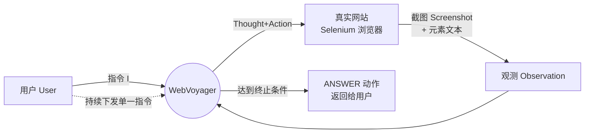
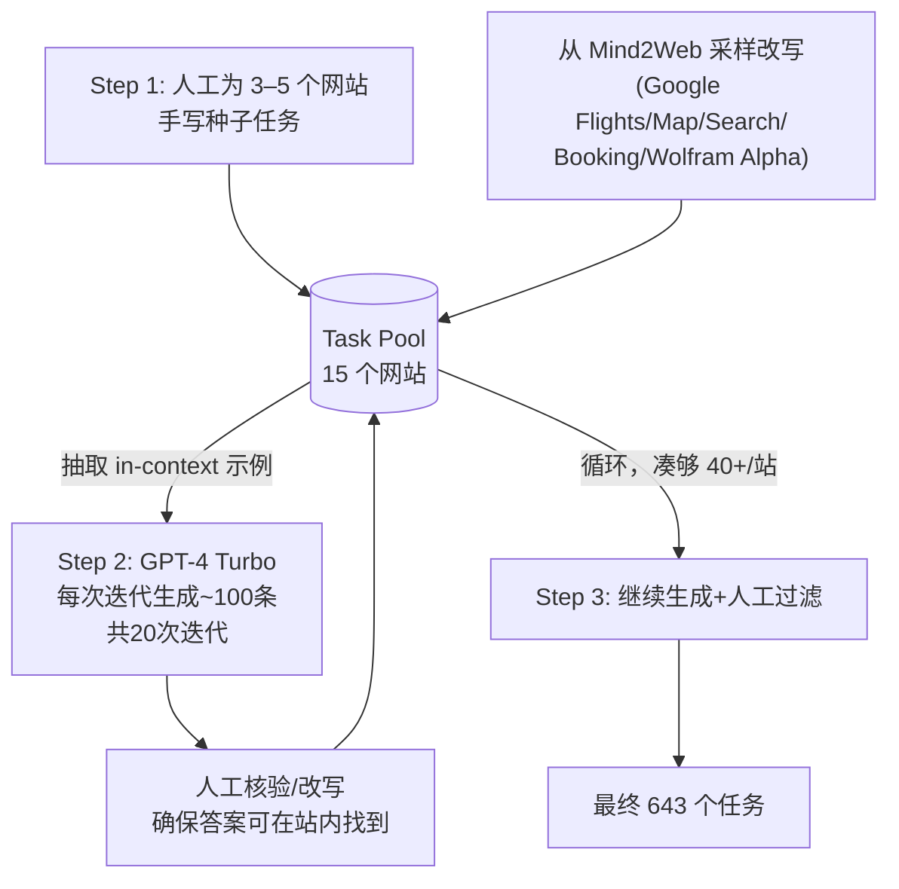

# WebVoyager：用大型多模态模型构建端到端 Web Agent

> 本篇是 agent-harness 库 **F 组（Web/GUI Agent）** 的开篇之作，也是 **E（Environment）层**的典型样本——它不是在"造更聪明的大脑"，而是在决定"agent 应该活在一个什么样的世界里"：清洗过的无障碍树？本地托管的网站镜像？还是没有任何中间层、直接用眼睛看的真实互联网？WebVoyager 选择了最后一种，也因此天然和本库 G 组标杆 Harness-Bench（选择离线沙箱）站在了天平的两端。读这篇论文，最值得带走的不是"59.1% 这个数字"，而是"真实 vs 可控"这条设计轴——本库后面几乎每一篇涉及"评测"的论文，都要在这条轴上选边。

---

## §1　TL;DR（一页讲清这篇在干嘛）

> 主讲提示：先给"是什么"，再立刻抛出它和本库标杆的对立姿态，吊住大家的好奇心。

一句话：**WebVoyager 是一个端到端的大型多模态模型（LMM, Large Multimodal Model）web agent**——它不解析 HTML，只看**截图**（叠加 Set-of-Mark 数字标签）加少量辅助文本，就在**真实的、活的互联网**（Amazon、Apple、GitHub、Google Flights……15 个真实网站）上完成用户指令，全程无人工干预；论文同时提出了一套**用 GPT-4V 自动打分**的评测协议，替代"人工看轨迹"这种不可扩展的评测方式。

- **它属于 harness 的哪一层（Θ1）**：本篇主打 **E（Environment）层**——它的核心决策是"agent 该被放进一个什么样的世界"（真实网站 vs 沙箱镜像），这个决策比任何 prompt 技巧都更根本，因为**下游能测到什么、测得准不准，全部由这层决定**。同时它也顺带交代了 **T 层**（观测/动作接口设计，即"Agent-Computer Interface"的网页版）和 **V 层**（自动评测协议）。
- **它有多硬（权威性来源）**：ACL 2024 主会 Long Paper（2024.acl-long.371，pp.6864–6890，Bangkok），浙大/腾讯 AI Lab/西湖大学出品。更实在的权威性证据是**下游采用**——独立文献显示，Anthropic（Computer Use）、OpenAI（Operator）、DeepMind（Mariner）、Agent-E 等一众 2024–2025 的商业/学术 web agent 都把"WebVoyager benchmark"当成标准汇报靶子（详见 §18，引自 Xue et al. 2025, COLM）。643 个任务、15 个网站的这套 benchmark，已经事实上成为了 web agent 领域的通用尺子之一。
- **回扣全库论点（Θ2）**：这篇提供了一组**几乎是自然实验级别**的"Agent = Model + Harness"证据——大致同一代 GPT-4 模型家族，只换"怎么接入网页"这一层 harness：GPT-4(All Tools，靠 Bing 抓取)30.8% → WebVoyager 纯文本无障碍树版 40.1% → WebVoyager 截图+SoM 版 59.1%（§5.2/Abstract，Table 1 Overall 列），**28.3 个百分点的落差，模型量级都没变**。反过来，固定 WebVoyager 这套 harness、只换模型后端（GPT-4V/Claude-3-Opus/GPT-4o），自动评测给出的总分只在 52.8%–57.1% 之间摆动（Table 3，GPT-4V 评委列），带宽收窄到 4.3 分。两组数字放在一起，就是"harness 决定的落差 > 模型后端决定的落差"的一次干净对照。
- **它和本库标杆的立场冲突（Θ5，先剧透）**：Harness-Bench（G 组标杆）选择**离线沙箱**换可复现性；WebVoyager 选择**真实活网站**换生态效度。两者都对，只是回答的不是同一个问题——这个张力会贯穿全篇，在 §7 和 §18 分别展开。

---

## §2　问题与动机：为什么"看得见"和"活的"都很重要（Why·问题层）

> 主讲提示：这段是全篇最容易被一带而过、但最该讲透的动机——先讲"看不见"的代价，再讲"沙箱"的代价，两条线最后在 WebVoyager 的设计选择里汇合。

**证据链 1——单模态之痛**：2024 年之前的 web agent 大多只吃一种输入。要么是纯文本流派——WebGPT（Nakano et al., 2021）把网页当 Bing 检索结果的文本片段处理；WebAgent（Gur et al., 2023）用 T5 抽取 HTML 片段再生成 Python 代码操作；这条路线的通病是**网页的 HTML/无障碍树天生是给机器解析用的，不是给"理解 UX"用的**——真实网页的视觉设计（按钮的位置、颜色、层级）本身就承载着大量决策信息，纯文本表示要么把这些信息丢光，要么把 DOM 树摊开成一坨冗长到"让 agent 犯糊涂"的文本（原文 §1："rendered web pages are inherently designed with user experience (UX)... This design principle of rendering makes visual analysis more effective than mere HTML representation"）。

**证据链 2——简化沙箱之痛**：另一条线是用**本地模拟器**控制变量——WebShop（Yao et al., 2022a）、WebArena（Zhou et al., 2023）都在本地托管一批"仿真"网站，图的是可控、可复现。但仿真网站终究是**某一时刻的快照**，天然缺少真实网站的动态性（广告位轮播、弹窗、登录墙、实时数据）——这批 benchmark 测的是"agent 在一个精心打扫过的房间里表现如何"，而不是"agent 能不能在真实世界的乱糟糟里活下来"。

**证据链 3——评测方式之痛**：Mind2Web（Deng et al., 2023）这类 benchmark，主要做法是**逐步（stepwise）、离线**评测——把 agent 每一步动作和一条预先录好的"标准轨迹（golden trajectory）"比对。论文原文直接点出这个方法学漏洞（§1）："This approach... may not fully account for the variety of viable strategies to accomplish a task, as it only reflects one possible plan. This limitation could lead to a biased evaluation and difficulties in fairly comparing different methods." 换句话说：**任务的解法从来不是唯一的**，只要求 agent 复刻一条特定路径，会误判所有"殊途同归"但同样正确的策略。

三条痛点汇成一句话的研究问题：**能不能造一个像人一样"用眼睛看、用手点"的 agent，直接在真实活网站上完成任务，并配一套不需要"标准路径"也能公平打分的评测协议？** 这正是 WebVoyager 的两个交付物——一个 agent + 一套评测协议——分别要回答的问题。

---

## §3　核心贡献与研究问题（一句话形式化）

> 主讲提示：把贡献和研究问题压成一句话，方便后面每一节回头对齐"到底在回答什么"。

论文 §1 末尾把贡献浓缩成三件事：

1. **WebVoyager**：一个端到端 LMM web agent，输入截图（叠加数字标签）+ 少量辅助文本，输出结构化动作，在真实网站上自主完成用户指令。
2. **一个新 benchmark**：643 个任务、覆盖 15 个真实常用网站，用 self-instruct + 人工校验半自动构造。
3. **一套自动评测协议**：用 GPT-4V 看"任务指令 + 关键帧截图 + 最终回答"来判定成功与否，人机一致率 85.3%（Table 2, full 轨迹）。

**研究问题的一句话形式化**：给定用户指令 $I$，能否让模型 $\mathcal{M}$ 仅凭"看到的（截图+文本）"与"能做的（点击/输入/滚动等动作原语）"，在没有任何网站特定微调、没有人工中途干预、也不依赖预先录制的标准轨迹的前提下，端到端完成 $I$，并让**另一个模型**（而非人）就能可靠地判断它是否做到了？

---

## §4　相关工作定位：WebVoyager 站在谁的肩上、和谁不同

> 主讲提示：这张表是"一图流"式定位，帮大家迅速分清一堆相似缩写。

| 系统 | 环境 | 主要输入模态 | 是否需要额外训练/模块 | 与 WebVoyager 的关系 |
|---|---|---|---|---|
| WebGPT (Nakano et al. 2021) | Bing 检索文本片段 | 纯文本 | 微调 GPT-3 | 前身：纯文本、间接访问网页 |
| WebAgent (Gur et al. 2023) | 真实网页 | HTML 片段抽取 | 预训练 T5 + Flan-U-PaLM 生成代码 | 前身：需要专门训练的抽取模块 |
| WebGUM (Furuta et al. 2023) | 简化网页 | 截图 + HTML（T5+ViT） | 微调 | 前身：多模态但要微调，且非真实网站 |
| PIX2ACT (Shaw et al. 2023) | 简化网页 | 纯截图 | 微调 | 前身：纯视觉但同样要微调 |
| WebArena (Zhou et al. 2023) | **本地托管镜像网站** | 无障碍树文本 | 无需训练（prompt） | **环境设计的对照组**——WebVoyager §3.1 明确"unlike WebArena"，见 §7 |
| SeeAct (Zheng et al. 2024) | 真实网页 | 截图 + LMM | **仍需微调的交叉编码器**挑候选元素 | **并发工作（concurrent）**，最接近的同类，但仍留了一个训练模块 |
| **WebVoyager（本文）** | **真实网页** | **截图（SoM）+ 辅助文本** | **完全无需额外训练/模块** | —— |

**读出什么**：把这张表纵向看，能看出一条清晰的技术演进轴——从"纯文本、间接访问"（WebGPT）→"需要专门训练抽取/定位模块"（WebAgent/WebGUM/PIX2ACT/SeeAct）→"零训练、直接用通用 LMM 看真实网页"（WebVoyager）。SeeAct 是最接近的并发工作，论文原文专门强调差异（§2）："the best SeeAct agent still relies on a finetuned cross-encoder model to select candidate elements for interaction. In contrast, WebVoyager does not require any additional modules." 这是本文对自己"简洁性"最看重的卖点。

---

## §5　方法总览（big picture）

> 主讲提示：先看图，再展开数学。这张图对应原论文 Figure 1，本质就是一个"感知—思考—行动"的闭环。

**直觉**：这就是人类浏览网页的方式——看一眼屏幕（观测），心里盘算一下要干什么（思考），动手点一下/打几个字（动作），屏幕刷新（新观测），如此循环，直到任务完成就报告结果。WebVoyager 唯一"不像人"的地方是：为了让模型能精确说出"点哪里"，它借助 **Set-of-Mark Prompting**（Yang et al., 2023a）的思路，把网页上所有可交互元素都框出来并编号（图 2），模型只需要说"点 [17]"，不需要自己描述元素的像素坐标或 CSS 选择器。

这一节先建立直觉，§8 会把这个循环写成精确的数学形式化。

---

## §6　符号与术语表

> 主讲提示：后文公式统一使用下表记号，先备好一张"字典"，讲的时候可以直接指着这张表说"符号我们已经定义过了"。

| 记号 | 含义 |
|---|---|
| $\mathcal{E}$ | Environment，真实网站构成的浏览环境 |
| $\mathcal{M}$ | 大型多模态模型（LMM），此处的"大脑" |
| $\mathcal{O}$ | 观测空间（Observation Space）：截图 + 辅助文本 |
| $\mathcal{A}$ | 动作空间（Action Space）：7 种网页操作原语 |
| $t$ | 时间步（第几轮交互） |
| $o_t$ | 第 $t$ 步的观测（截图+文本） |
| $a_t$ | 第 $t$ 步的动作 |
| $c_t$ | 第 $t$ 步喂给模型的上下文 |
| $I$ | 用户指令（Instruction） |
| $s_t,\hat a_t$ | 思考（thought）与动作代码（action code），$a_t=(s_t,\hat a_t)$ |
| $k$ | 自动评测时提供给 GPT-4V 评委的关键帧截图数量（超参数） |
| $J$ | 自动评测器（此处特指 GPT-4V 扮演的裁判） |
| Agreement / $\kappa$ | 评测一致率 / Cohen's Kappa（排除偶然一致后的一致度） |

---

## §7　浏览环境设计：真实活网站 vs 沙箱镜像（全篇设计层 why 的核心）

> 主讲提示：这是全场最该停留、也是本篇布置的"必考题"——务必讲清两种选择各自的直觉、代价，以及它们分别在服务一个什么样的评测目的。

**直觉**：造一个 web agent 之前，先要决定"它活在哪个世界"。有两种世界可选——**沙箱镜像**（把一批网站的某个历史快照搬到本地服务器上，agent 只能在这个"标本馆"里活动）和**真实活网站**（agent 直接用浏览器连上 amazon.com、github.com……这些每天都在变化的真实站点）。

**Why（设计层）——朴素做法为什么不够，本文为什么反过来选**：

> 朴素做法是像 WebArena 那样，把评测要用到的网站**本地托管**成镜像（§3.1 原文点名对照："Unlike WebArena (Zhou et al., 2023), we do not host any websites locally"）。→ 这样做换来的是**可控与可复现**：今天跑和明天跑，页面内容、按钮位置分毫不差，不同论文之间可以放心比较分数。**代价是"贴近但失真"**——镜像终究是某一时刻的快照，天然缺失真实网站的浮动广告、弹窗、持续变化的库存与价格、登录墙与人机验证（CAPTCHA）等"噪音"；而这些噪音，恰恰是人类每天真实上网时要应付的主要麻烦。
>
> 本文反过来选择**直接连真实活网站**，理由写在原文（§3.1）："we opt for online interaction with real websites as we believe this setting truly reflects the real-world use cases (e.g., the agent needs access to real-time information from the web), and a successful web agent should be able to adapt to these challenges and consistently solve the problem robustly." 换来的是**最高的生态效度（ecological validity）**——测的就是"扔进真实互联网里能不能活下来"这件事本身。**代价是不可控**：论文自己承认（§3.1 脚注 4）这带来"floating ads, pop-up windows, constant updates"等独特挑战；更深一层的代价是——网站内容持续变化，意味着今天测出的分数和三个月后测出的分数，**未必是在测同一件事**（这一现象后续文献称为 **benchmark drift**，原文本身并未使用这个词，但已经在用真实的应对措施——见 §12 的 Golden/Possible 标注设计——为它兜底）。

**这条选择和本库标杆 Harness-Bench 正面相反**：Harness-Bench（G 组标杆，2605.27922）§3.2 的设计理由几乎是这段话的镜像版本——"朴素做法是让 agent 直接连真实网站/服务……→ 会因为外部状态漂移（benchmark drift）导致『今天能过、明天挂』，无法复现、无法独立打分。本文改用离线沙箱：每个 model–harness 对都从同一初始状态起跑，换来可复现性与独立可打分性——代价是牺牲了对 live 服务/用户反馈的覆盖。" 两篇论文用几乎相同的论证结构，得出了**相反的结论**——因为它们在优化不同的目标函数：Harness-Bench 要的是"哪个 harness 更强"这个**排名**的可信度，WebVoyager 要的是"agent 能不能在真实世界干活"这个**能力**的真实性。这条张力我会在 §18 与 Inspires-Us d) 里正式收口，这里先埋下伏笔。

**一个容易漏看的代价证据**：原文 §3.1 还专门提到 CAPTCHA 的处理方式——"we believe it is important to respect the rules of these websites and prompt the agent to retrieve information from alternative sources"——也就是说，**遇到人机验证就绕道**，而不是想办法破解。这既是研究伦理的自我约束（呼应 Ethics Statement），客观上也再一次说明"真实活网站"这条路上，agent 必须学会和"不受它控制的规则"共处，这恰恰是沙箱镜像永远不会遇到的一类挑战。

---

## §8　交互形式化：把"感知—思考—行动"写成公式

> 主讲提示：先给直觉、再逐个定义符号、最后才亮出公式——这是全库统一的公式书写规范。

**直觉**：§5 的循环图已经给了直觉——每一步，模型看一眼当前屏幕和历史，说一句"我打算做什么"，再吐出一个能被机器执行的动作；环境执行完动作、给出新的屏幕，循环继续。这一节把这个直觉写成精确的记号（原文 §3.2）。

**符号定义（先定义后用式，见 §6 总表）**：环境 $\mathcal{E}$、模型 $\mathcal{M}$、观测空间 $\mathcal{O}$、动作空间 $\mathcal{A}$；$o_t,a_t$ 分别是第 $t$ 步的观测与动作；$I$ 是用户指令；$c_t$ 是第 $t$ 步的上下文。

**核心三个式子**：

$$c_t = (o_1, a_1, \dots, o_{t-1}, a_{t-1}, o_t, I)$$

$$a_t = \mathcal{M}(c_t)$$

$$o_{t+1} = \mathcal{E}(o_t, a_t)$$

**读出什么**：第一式说"上下文 = 到目前为止的全部历史观测与动作 + 当前观测 + 原始指令"——即模型每一步都能看到完整历史，不是只看当前这一帧（但见下文"context clipping"会对这条做工程折中）。第二式说"动作是模型看完上下文后的输出"，第三式说"环境执行动作后给出下一步的观测"——这就是标准的 agent-environment 交互循环，直到模型生成终止动作（ANSWER）或用完预算（原文设为最多 15 步）为止。

**thought-action 分解（受 ReAct 启发，Yao et al. 2022b）**：

$$a_t = (s_t, \hat a_t)$$

其中 $s_t$ 是自然语言思考（thought），$\hat a_t$ 是可执行的动作代码。**读出什么**：这就是本库 B 组 canon ReAct（2210.03629）的思路直接搬进网页场景——先说人话再落地成结构化指令，好处是给了模型一步"打草稿"的空间，也给了人类调试者一条可读的推理轨迹。

**工程折中——context clipping（原文 §3.2 最后一段）**：论文观察到"较长 episode 的过多网页观测可能会让 agent 犯糊涂"（"excessive observations of web pages from longer episodes may confuse the agent"），于是做了一次显式裁剪：**只保留最近 3 次观测（截图），但保留全部的思考与动作历史**。

**Why（设计层）——为什么不是把历史全部喂给模型？** 朴素做法是把 $c_t$ 定义中的全部 $o_1,\dots,o_t$ 老老实实都塞进上下文（如 §8 公式字面所写）。→ 会带来两个问题：（1）多模态输入的 token 消耗随步数线性增长，很快撞上上下文窗口（原文 §5.3 提到 15 步轨迹约需 7000+ token）；（2）过时的网页截图会"分散"模型注意力，甚至诱导它重复过去的错误动作（原文 §5.4 "Navigation Stuck" 错误类型里明确点名"the agent also tends to repeat its previous mistakes due to the input clipping"——注意这里作者自己也承认，裁剪本身有时反而是错误的**成因**之一，这是一处诚实的自我批判）。本文的折中是"图像观测做滑动窗口、文字历史全保留"——这正是本库 D 组一整条"上下文工程/记忆"文献（AgentFold、ACON 等）在做的事情的一个早期、朴素版本，详见 Inspires-Us b)。

---

## §9　观测空间：截图 + Set-of-Mark 编号 + 辅助文本

> 主讲提示：这一节讲"眼睛怎么看"——截图打了什么标签、配了什么辅助文本，直接决定了后面 §16/§17 会讨论的一大半误差来源。

**直觉**：人类看网页时，眼睛会自动"框出"哪里能点——按钮有边框、链接是蓝色带下划线。模型没有这种直觉，所以 WebVoyager 人工把这种"可点性"画出来：给每个可交互元素套一个黑色边框，并在左上角标一个数字（图 2）。模型只需要认出数字、说"点几号"，不需要自己描述元素的像素坐标。

**Why（设计层）——为什么不用无障碍树，也不用目标检测模型**：

> 朴素做法 A：像 WebArena 一样，只用**无障碍树（accessibility tree）文本**描述页面结构。→ 会遇到 §2 已经说过的问题——真实网站的无障碍树"高度复杂冗长"（原文 §5.3："the textual input such as the accessibility tree becomes highly complex and verbose, making it far less intuitive than using screenshots"），尤其在 Booking、Google Flights 这类带日历、多级筛选器的网站上几乎不可用。
>
> 朴素做法 B：像原始 Set-of-Mark Prompting（Yang et al., 2023a）论文一样，用**目标检测模型**（Zou et al., 2023）去定位可交互元素再画框。→ 需要额外训练/部署一个检测模型，增加系统复杂度和一个新的错误来源。
>
> 本文选择：用一个规则式的 JavaScript 工具（GPT-4V-Act，原文脚注 5，纯规则，不含任何目标检测模型）直接遍历 DOM 找出"元素类型 + 是否可交互"，据此画框编号。§3.3 原文强调这个选择的理由是**效率**："GPT-4V-Act is efficient since it is rule-based without incorporating any object detection model." 同时经验上发现，边框颜色统一用黑色比用多种颜色成功率更高（§3.3，未给具体消融数字，原文只说"We observe that using a single black color yields higher success rates than using multiple colors"——**原文未给出**具体的消融百分比，这是一处"只给结论、不给数字"的例子，如实记录，不替原作者编造）。

**辅助文本**：除了截图，每个元素还附带三类文本信号——元素内嵌的文本内容、元素类型（如 input/button）、以及 `aria-label` 里可能有的注释文本（§3.3）。**读出什么**：这是"视觉优先、文本兜底"的设计——截图负责给出空间/布局直觉，文本负责补上截图里看不清楚的语义细节（尤其是小字号密集文本），这也是后文 §16 讨论"为什么纯视觉在文本密集网站上吃亏"的伏笔。

**多标签页限制**：为了简化观测，WebVoyager 禁用了多标签页——所有交互都在当前标签页内完成（§3.3）。这是一处"故意简化"的工程取舍，牺牲了一部分真实浏览行为（人类会开新标签页对比），换取观测空间的确定性。

---

## §10　动作空间：7 个网页操作原语

> 主讲提示：这一节讲"手怎么动"——把它当成本库 C 组 ACI（Agent-Computer Interface）概念的网页版来听。

**直觉**：这一节相当于给 agent 设计一套"网页版的工具接口"（Agent-Computer Interface，呼应本库 C 组 canon SWE-agent 的 ACI 概念，见 Inspires-Us d)）——原语要**少而够用**，每个动作都有严格的输出格式，方便下游用正则解析执行。

**动作空间 $\mathcal{A}$（原文 §3.4 + Appendix C，共 7 种）**：

| 动作 | 格式 | 语义 |
|---|---|---|
| Click | `Click [Numerical_Label]` | 点击编号元素（若触发 PDF 下载，用 OpenAI Assistant API 解析内容并并入观测） |
| Input | `Type [Numerical_Label]; [Content]` | 清空文本框已有内容，输入新内容，自动模拟回车（减少交互次数） |
| Scroll | `Scroll [Numerical_Label or WINDOW]; [up or down]` | 滚动整页或某个可滚动子区域 |
| Wait | `Wait` | 等待页面加载 |
| Back | `GoBack` | 返回上一页（未支持"前进"，理由是"可以靠重复之前的动作达成"） |
| Jump to Search Engine | `Google` | 卡住时跳回 Google 搜索重新开始 |
| Answer | `ANSWER; [Content]` | 终止本轮任务，返回最终答案 |

**读出什么**：这套设计里最值得注意的是最后两个——**Back** 和 **Jump to Search Engine**——它们不是"完成任务"的动作，而是**给 agent 一条从死胡同里退出来的路**。这正是 §17 失败模式分析里"Navigation Stuck"（44.4%，头号失败原因）这一类错误理论上应该被缓解、但实践中依然是最大失败源的地方——说明"给了退出机制"和"agent 会正确使用退出机制"是两回事，这也是 §17 讨论的重点。

**执行期报错处理**：若某个动作在浏览器里执行报异常，系统会把错误信息塞回 prompt，让模型重新生成一次动作；这次重试也计入总步数预算（§3.3）——即**没有免费的重试**，这是防止 agent 无限空转的一个隐式护栏。

---

## §11　Benchmark 构建：self-instruct 三步法炼出 643 个任务

> 主讲提示：这一节展示"怎么半自动地攒出一个有质量保证的评测集"，对应原文 §4.1–4.2、Figure 3。

**网站选择（§4.1）**：15 个真实常用网站——Allrecipes、Amazon、Apple、ArXiv、BBC News、Booking、Cambridge Dictionary、Coursera、ESPN、GitHub、Google Flights、Google Map、Google Search、Huggingface、Wolfram Alpha。选择标准是"覆盖日常生活不同方面"，且**明确排除**了需要登录或有 CAPTCHA 的网站（技术限制，§4.1 原文用"regretfully omit"，说明这是无奈的取舍而非设计初衷）。每个网站最终收录 **40–45 个任务**（Table 1 表注），共计 **643** 个。

**数据构造流程（Figure 3，self-instruct，Wang et al. 2022）**：

**Why（设计层）——为什么不是纯人工写、也不是纯模型生成**：

> 朴素做法 A：纯人工编写全部任务。→ 覆盖面和多样性受限于人力，643 条纯手工任务成本过高。
> 朴素做法 B：纯模型自动生成（self-instruct 到底）。→ 生成任务的质量、可解性没有保证，可能出现网站上根本找不到答案的"幻觉任务"。
> 本文选择"人工先给种子、模型迭代扩增、人工每一轮都复核"的混合流程——用人工种子锚住任务分布的合理性，用模型迭代解决规模问题，用人工复核卡住质量下限（§4.2："we manually verify each generated task and rewrite them if necessary to ensure its high quality and the answers can be found"）。

**去重验证（§4.2 最后一段）**：用 `all-mpnet-base-v2` 句向量模型对 643 条任务两两算相似度，共 $\binom{643}{2}=206{,}403$ 对——**只有 49 对相似度 > 0.8**（人工复核后确认可接受），140 对落在 0.7–0.8 区间，**99.68% 的任务对相似度 < 0.6**。**读出什么**：这是一个简单但有效的"防灌水"检查——证明这套 self-instruct 流程没有沦为"同一个任务换几个词重复刷"，而是真的覆盖了多样的任务表述。

---

## §12　标注体系：Golden vs Possible——真实世界会变，答案就不能只有一个

> 主讲提示：这一节看似是标注细节，实则是 §7 那条"真实 vs 可控"张力在数据标注层面的具体账单，别当成琐碎细节跳过。

**直觉**：如果网站是本地沙箱镜像，答案可以永远是唯一确定的"标准答案（Golden）"。但 WebVoyager 选择了真实活网站（回扣 §7），这意味着：机票价格明天会变，新闻头条今天和昨天不一样，摘要类任务本来就没有唯一正确写法——标注体系必须为这种"不确定性"设计一个软类别。

**两类标注（§4.3）**：
- **Golden**：答案稳定、可以给出确切列表，全数据集 **22.3%** 的问题属于此类。
- **Possible**：覆盖三种场景——① 开放式任务难有精确匹配答案（如摘要类）；② 多个答案都满足要求，穷举不现实，只给部分列举；③ 与实时信息相关，答案会随时间变化（如机票价格）——论文原文明确承认"the 'Possible' answers were also correct during our experiments"，即评测时是按"当时的实际网页状态"人工核对的，而不是死磕一个写死的答案。

**读出什么（回扣 §7 张力）**：这个"77.7% 的任务连标准答案都无法固定"的比例，本身就是"选择真实活网站"这一设计决策的直接账单——如果 WebVoyager 走 WebArena 的沙箱路线，这个 Possible 类别可能根本不需要存在。反过来说，**Golden/Possible 二分法就是 WebVoyager 团队为了在"真实世界不可控"和"评测需要确定性"之间找到的一个务实折中**，是 §7 那条设计取舍在标注层面的具体落地，而非孤立的标注规范选择。

---

## §13　自动评测协议：让 GPT-4V 当裁判（全篇第二个核心）

> 主讲提示：这是全篇另一个"必考题"——上一节讲了"世界该长什么样"，这一节讲"分数该怎么打"。两节合在一起才是完整的"取舍+度量"故事。

**直觉**：人工评测（人看完整轨迹，判断成功与否）准，但**不可扩展**——每加一个新方法就要人工重新看几百条轨迹。于是本文提出：能不能训一个"自动裁判"，输入和人类裁判看到的东西差不多（任务说明 + 关键截图 + 最终回答），输出一个二元判断？

**协议形式化**：

- $T$：任务指令；
- $n$：该次轨迹的总步数；
- $k$：超参数，表示提供给评测器的**关键帧截图数量**（取轨迹最后 $k$ 帧），$k=\text{full}$ 表示提供完整轨迹的全部截图；
- $R$：agent 最终执行 `ANSWER` 动作时给出的文字回答；
- $J_{\text{GPT-4V}}$：以 GPT-4V 为后端的自动评测器（system prompt 见原文 Appendix B / Figure 8）。

$$\text{Eval} = J_{\text{GPT-4V}}\big(T,\ \{o_{n-k+1},\dots,o_n\},\ R\big) \in \{\text{SUCCESS},\ \text{NOT SUCCESS}\}$$

**读出什么**：注意这个评测函数**不需要"标准轨迹"作为输入**——它纯粹靠"任务说明 + 最后发生了什么（截图与回答）"来下判断，这正是 §2 里对 Mind2Web 式 stepwise 评测的批评在方法论上的直接回应：不比对路径，只看结果证据是否支持"任务确实完成了"。评测时温度设为 0（Appendix B），减少裁判自身的随机性。

**评测协议里几条容易被忽略但很关键的指令（Appendix B / Figure 8 原文）**：裁判**不需要**自己去操作网页复核；**不能**凭截图上没出现的信息做假设；截图和文字回答如有冲突，**优先信截图**（除非截图没提到，此时才信文字）——这几条规则本质上是在给"多模态裁判"划安全边界，防止它自由发挥编造判据。

**评测质量：Table 2（一致性）**——在 300 个任务的子集上，请 3 位人工标注员各自判断，取一致后的"人类共识标签"，人类标注员之间的 Fleiss's Kappa 基线是 **0.7**（"substantial agreement"，原文脚注 7）。GPT-4V 裁判 vs 人类共识：

| $k$（关键帧数） | GPT-4V 判定的成功率 | Agreement（一致率） | $\kappa$（Cohen's Kappa） |
|---|---:|---:|---:|
| 1 | 47.7% | 75.3% | 0.51 |
| 2 | 55.3% | 79.7% | 0.59 |
| 3 | 54.3% | 81.3% | 0.62 |
| full（全部截图） | 58.3% | **85.3%** | **0.70** |

**指标定义**：**Agreement**（一致率）= GPT-4V 与人类共识标签在该子集上判定重合的任务比例；**Cohen's Kappa** $\kappa$（Cohen, 1960）= 排除"纯靠运气蒙对"的偶然一致后的一致度，公式直觉是 $\kappa = \frac{p_o - p_e}{1-p_e}$（$p_o$ = 观测到的一致率，$p_e$ = 随机情况下期望的一致率），$\kappa$ 越接近 1 说明一致性越"实打实"。

**读出什么**：随着给评测器看的截图从 1 帧增加到全部，一致率和 $\kappa$ 单调上升，在 full 轨迹时 $\kappa=0.70$，**已经追平人类标注员彼此之间的一致度基线（同为 0.7）**。这是本文最重要的方法论主张——"GPT-4V 可以作为多模态 web agent 的可靠自动评测器"（§5.2）——的直接证据。

**评委也可能"拉偏架"：Table 3**——论文进一步用 GPT-4V / Claude-3-Opus / GPT-4o 三个模型分别做 WebVoyager 的**后端**（跑轨迹）和**评委**（打分），交叉运行：

| WebVoyager 后端 \ 评委 | GPT-4V | Claude-3-Opus | GPT-4o |
|---|---:|---:|---:|
| GPT-4V | 57.1 | 55.1 | 63.0 |
| Claude-3-Opus | 52.8 | 51.6 | 54.9 |
| GPT-4o | 55.5 | 54.9 | **64.1** |

**读出什么（原文 §5.2 的解读）**：GPT-4o 当评委时明显更"宽容"（同一批轨迹，GPT-4o 给出的分数普遍偏高，尤其对 GPT-4o 自己跑出的轨迹打出全表最高的 64.1）；GPT-4V 当评委相对"严格"；Claude-3-Opus 与人类的 $\kappa$（原文正文提到，full 轨迹下）只有 0.6，**低于** GPT-4V 的 0.7，可靠性稍逊；而与人类的 $\kappa$ 用 GPT-4o 做评委时是 0.72，略高于 GPT-4V。原文明确指出 Claude-3-Opus"对自己的结果表现出明显偏好"（"a clear preference for its own results"）。**这就是"评委本身也是一个模型，也会自利"的活生生例子**——放在本库语境下，这正是 Harness-Bench 在其局限section里提出的"谁来 judge the judge"问题（见 §18、Inspires-Us d) 的呼应）。

---

## §14　实验设置：模型、baseline、跨库交叉验证

> 主讲提示：这一节是"规格表"，讲快一点，重点是标出后面 §15 数字对比时"谁跟谁在比"。

**主干模型（backbone）**：GPT-4 Turbo with vision（`gpt-4-vision-preview`）为默认后端；另补测 Claude 3 Opus、GPT-4o（GPT-4 Omni）以考察后端多样性（§5，Experimental Details）。

**Baseline**：
- **GPT-4 (All Tools)**：OpenAI 2023 年 10 月发布的集成工具型 agent（脚注 2），整合视觉、网页浏览、代码分析等多种插件于一体；本文把它当作"当前最强商业闭源 all-in-one agent"的代表。
- **WebVoyager$_{\text{Text-only}}$**：观测换成 WebArena 提出的无障碍树文本，其余（模型后端、动作空间）与 WebVoyager 一致——这是 §7/§9 讨论的"截图 vs 无障碍树"设计选择的直接消融对照。

**核心指标定义（§5，Dataset and Metrics 段）**：跟随 WebArena 的做法，主评测指标是 **Task Success Rate（任务成功率）** = 被判定为"成功完成"的任务数 / 总任务数，**不考虑所走的步骤是否最优**（原文："measuring the successful completion of tasks without considering whether the steps are optimal"）——这个"不管过程只看结果"的定义，正是 §2 里对 stepwise/golden-trajectory 评测方式那条批评在指标定义层面的直接落地。

**关键超参数**：浏览器窗口固定 1024×768 像素（保证截图尺寸一致）；采样温度 = 1（生成阶段，鼓励探索）；最大步数预算 = 15 步。

**评测数据集三件套（§5 首段）**：
1. 本文新构造的 643 任务 benchmark（§11）；
2. **GAIA**（Mialon et al., 2023）里筛出的 90 个 Level 1/2 的 web 相关任务——GAIA 本身不提供具体网站，故指示 agent 从 Google Search 起步；
3. **SeeAct**（Zheng et al., 2024）在线评测用的 50 个开放式网页任务，直接与其报告结果对比。

**读出什么**：这套设置本质上是在做**跨 benchmark 的交叉验证**——不只在自己造的题库上考高分，还拿去 GAIA、SeeAct 两个"别人出的卷子"上再考一次，这是这篇论文说服力的一个来源（呼应本库对"独立验证"的一贯重视）。

---

## §15　主要结果：30.8% → 40.1% → 59.1% 这条落差链（Θ2 关键证据）

> 主讲提示：这是全场最该停留的数字，直接对应本篇的 Θ2 使命——证明"接入网页的方式"本身就是能力的一部分。

**主表节选（Table 1，§5.2，Task Success Rate，人工评测，每个网站 40–45 个任务）**：

| 网站 | GPT-4 (All Tools) | WebVoyager$_{\text{Text-only}}$ | WebVoyager |
|---|---:|---:|---:|
| Allrecipes | 11.1% | **55.6%** | 53.3% |
| Amazon | 17.1% | 31.7% | **58.5%** |
| Apple | 44.2% | 34.9% | **65.1%** |
| ArXiv | 14.0% | 32.6% | **51.2%** |
| GitHub | 48.8% | 61.0% | **63.4%** |
| Booking | 22.7% | 2.3% | 4.2% |
| ESPN | 31.8% | **43.2%** | 38.6% |
| Coursera | 31.0% | 23.8% | **73.8%** |
| Google Map | 53.7% | 61.0% | **70.7%** |
| **Overall（15 站全量）** | **30.8%** | **40.1%** | **59.1%** |

> 其余 6 站（BBC News/Google Flights/Google Search/Huggingface/Wolfram Alpha/Cambridge Dictionary）从略，规律一致，详见原文 Table 1。

**Why（结果层）——为什么是这条落差链，机制是什么**：GPT-4(All Tools) 敬陪末座的根因不是"模型笨"，而是**物理上够不着**——它的网页浏览能力主要靠 Bing 抓取页面，"无法直接访问 Apple、Amazon、BBC News 等网站进行搜索、点击或使用其排序功能"（§5.3，"Direct interaction with the websites is necessary"），这直接压低了它在这些站点上的分数（Apple 44.2%、Amazon 17.1% 明显低于 WebVoyager）。WebVoyager$_{\text{Text-only}}$ 与 WebVoyager 用的是**同一套后端与动作空间**，唯一的差异是观测模态——text-only 在 Allrecipes（55.6% vs 53.3%）、GitHub、ESPN（43.2% vs 38.6%）、Cambridge Dictionary、Wolfram Alpha 这几个**偏文本、结构规整**的网站上打平甚至反超，但在 Amazon、Apple、Coursera 这些**视觉信息密集**的网站上被 WebVoyager 大幅甩开（Coursera 23.8% vs 73.8%，接近 50 个百分点）。这组一升一降精确对应了 §9 的设计权衡：**截图擅长空间/视觉密集场景，无障碍树擅长纯文本密集场景**，谁也不是全面碾压谁——这也是原文 §5.3 小标题直接点明"Both text and vision are necessary for generalist web agents"的原因。

**一处反常规律，值得单独拎出来**：Booking 一栏，GPT-4(All Tools) 反而以 22.7% 明显高于 WebVoyager 两个版本（text-only 2.3%、多模态 4.2%）——这和"WebVoyager 全面碾压 All Tools"的整体叙事恰好相反。一个合理的机制解释是：All Tools 依赖 Bing 检索，很可能没有真正深入 Booking 的日历/筛选控件去逐步操作，而是靠搜索结果拼凑出一个"看着合理"的答案；WebVoyager 两个版本则是**老老实实尝试操作那套出了名难缠的日历组件**（原文 §5.3 明确点名 Booking/Flights 需要"interactions with calendars and other intricate components"，Appendix 的 Figure 25 也专门展示了一次因为选错日期数字标签而失败的案例），反而在"力求做对"的过程中更容易在某一步彻底翻车拿零分。这提示一个指标设计层面的隐忧：**Task Success Rate 这种只看终点不看过程的二元指标，有时会让"绕开难点"的策略意外占便宜**——这条留到 §20 讨论题里展开。

**一处诚实的空白**：原文未给出任何显著性检验（如置信区间、t 检验）来支撑 Table 1 逐网站的差异是否具有统计显著性——表中标了 ± 标准差的，只有自动评测重复三次那几行（Table 1 表注："we run GPT-4V evaluator three times to calculate the performance mean and standard deviation"），主表的人工评测部分是单次结果。这不是这篇论文独有的疏漏（2024 年前后的 agent 论文普遍没有这个习惯），但按本库"不编造、诚实标注缺失"的规范，如实记录在这里。

**GAIA 交叉验证（Figure 5）**：Level 1（较简单任务）：GPT-4(All Tools) 23.1%、WebVoyager$_{\text{Text-only}}$ 19.2%、WebVoyager **38.5%**；Level 2（更复杂）：分别为 12.5%、12.5%、**15.6%**。**读出什么**：难度上升后三者差距明显收窄（Level 2 只差 3 个百分点），提示"接入方式的优势"在简单任务上更容易兑现成分数，而复杂多步任务上大家都会撞上更本质的推理/规划瓶颈（呼应 §17 的失败模式分析）。

**SeeAct 交叉验证（§5.2 末段）**：在 SeeAct 的 50 个在线开放任务上，WebVoyager 成功率 **30%**，而 SeeAct 自己报告的最好自主 agent 版本是 **26%**——虽然差距不大（4 个百分点），但这是在**别人的考卷、别人的评测环境**下拿到的结果，比自家 benchmark 上的分数更有说服力。

**跨模型后端结果（Table 3，GPT-4V 评委列，与 §1/§13 呼应）**：固定 WebVoyager 这套 harness，仅替换模型后端：GPT-4V 57.1%、Claude-3-Opus 52.8%、GPT-4o 55.5%——**带宽只有 4.3 个百分点**。把这组数字和上面 30.8%→40.1%→59.1%（28.3 分落差）并排看，就是本篇对"Agent = Model + Harness"最干净的一次背书：**换接入网页的方式（harness），比换模型后端（model）造成的分数波动大得多**。

---

## §16　消融与分析：网站复杂度、双模态互补、为什么不用开源模型

> 主讲提示：这一节把几条"大概如此"的直觉，落成图和数字验证过的结论。

**直接交互的必要性**（§5.3 首条）：已在 §15 结果层 why 中展开，此处不赘述。

**网站复杂度 → 任务难度（Figure 6）**：论文额外统计了两个"复杂度代理指标"——每个网站页面的**平均可交互元素数**、以及完成任务的**平均轨迹长度**，与 Task Success Rate 一起画散点图（颜色深浅编码成功率）。**读出什么**：图的左下角（元素少、轨迹短的网站，如 Wolfram Alpha、Google Search）颜色最深（成功率最高），右上角（ESPN、Booking，元素多、轨迹长）颜色最浅——"网站可交互元素越多、所需轨迹越长，agent 表现越差"这个朴素直觉，在真实数据里得到了印证（§5.3："the results largely align with this intuition"）。这也从侧面印证了 §8 提到的 context clipping 折中是有代价的——轨迹越长，被裁掉的历史截图信息也越多。

**Why（设计层）——为什么不用开源 LMM（如 LLaVA）**：

> 朴素做法：用开源模型（如 LLaVA）替代 GPT-4V，降低成本、便于复现。→ 会遇到两个硬限制（§5.3，"Why not use Open Source models"）：（1）**分辨率不够**——LLaVA 等模型通常把输入图像压到 224×224 或 336×336，网页截图上的小字号文字会直接变得不可辨认，而 web 导航任务恰恰需要读清页面细节；（2）**上下文长度不够**——LLaVA 类模型上下文上限常见 4096 token，而 WebVoyager 一条 15 步的轨迹大约需要 7000+ token，直接放不下。本文因此选择闭源的 GPT-4V/Claude-3-Opus/GPT-4o 作为后端——这不是"看不起开源模型"，而是**当时（2024 年初）开源 LMM 在分辨率与长上下文两个维度还没跟上这个任务的门槛**，原文明确留白："a stronger visual encoder or additional text inputs might be needed"，指向未来工作方向。

---

## §17　失败模式分析：Table 4 四类错误，与本库 G 组失败分类对照

> 主讲提示：这一节的价值不在"报告了多少种错误"，而在于这套失败分类法可以直接和 Harness-Bench 的失败症状表并排读——两套独立设计的分类法，映照出的是同一类"harness 该管却没管好"的问题。

论文从 benchmark 里抽样 300 个失败任务，人工标注失败原因（§5.4，Table 4）：

| 失败原因 | 占比 | 典型表现 |
|---|---:|---|
| **Navigation Stuck（导航卡死）** | **44.4%** | 步数耗尽仍未完成；三种子情形：①搜索词不够精确，被无关结果淹没；②可滚动区域太小，agent 找不到；③在页面中部时无法判断该往上滚还是往下滚，且因 context clipping 反复重复此前的错误动作 |
| Visual Grounding Issue（视觉定位问题） | 24.8% | 三种子情形：①认不出少见的视觉模式（如音标、数学公式）；②看不出两次观测间的细微差别，误以为动作没生效；③因元素邻近而点错（如把日历上的数字误认成编号标签） |
| Hallucination（幻觉） | 21.8% | 两种子情形：①忽略部分任务要求，用一个"部分正确"的答案敷衍（如该排序却直接拿了个看着便宜的商品）；②执行了一个"看似没报错、实则偏离正确推理路径"的动作（如多文本框场景下输错框） |
| Prompt Misalignment（指令对齐问题） | 9.0% | 两种子情形：①输出格式不可解析（只给了 Thought 没给 Action）；②明知任务未完成却提前用 ANSWER 终止 |

**指标定义**：占比 = 该类失败在 300 个抽样失败任务里出现的比例（四类合计 100.0%，这里是互斥的单选分类，与 Harness-Bench Table 3 的"非互斥多选"设计不同，是一处方法学差异，据实记录）。

**读出什么，与 Harness-Bench（G 组标杆）对照**：把 WebVoyager 这四类和 Harness-Bench §10 的五类失败症状（契约/格式 36.4%、工具/恢复 24.6%、证据/grounding 14.6%、产物提交 11.1%、状态/续跑 9.3%）并排放，能看出跨系统的**共性结构**：

- WebVoyager 的 **Navigation Stuck**（44.4%，头号杀手）本质上是"陷入死胡同后没能有效恢复"——直接对应 Harness-Bench 的**工具/恢复**范畴，且严重程度还要更高（这里高居榜首，Harness-Bench 里排第二）；
- WebVoyager 的 **Prompt Misalignment**（9.0%，尤其是"输出不可解析"这一子类）正是 Harness-Bench **契约/格式**问题（36.4%，头号杀手）的网页版；
- WebVoyager 的 **Visual Grounding Issue**（24.8%）是一个 Harness-Bench 分类体系里没有直接对应项的**模态特有**问题——因为 Harness-Bench 测的 6 个 harness 都不需要处理"像素级视觉定位"，这提醒我们：**失败分类法本身也会被 harness 的输入模态形状所塑造**，不存在一套放之四海而皆准的失败分类。

这条对照直接支撑本篇 Θ2 的落点——不管接入网页的方式是"看的"还是"读的"，最大的失败根源都不在"模型想不清楚"，而在**"控制循环/恢复机制"这一层**（L 层），这恰是 harness 的核心职责所在，而非模型智力问题。

---

## §18　局限与批判：原文自陈 + 独立复核给出的"活网站税"

> 主讲提示：这是本篇 Θ5 张力的正式收口——先讲论文自己承认了什么，再讲独立文献两年后回头审计发现了什么，最后给出不绝对化的结论。

**论文自陈的局限（Limitations 章节 + Ethics Statement）**：
- **动作空间不完整**：不支持 Drag（拖拽）等连续型动作，理由是"拖拽的幅度不是一个有限集合"，作者设想未来可以让模型直接给出像素坐标，但依赖更强的视觉定位能力。
- **文件格式支持有限**：目前只能处理文本、PDF 等基础格式，不支持视频等格式。
- **安全与伦理**：作者明确写出风险清单——agent 可能"无意中从未授权网站下载恶意内容"、"在公开网站上输入隐私/机密信息"、"向网站服务器发送虚假请求或产生虚假用户活动"；应对措施是限定只做免登录任务、全程人工监督在线评测、任务查询人工审核。这份清单本身就是"活网站"这条路线代价的一部分——如果是沙箱镜像，这些风险大半不存在。

**我的补充批判（独立复核证据，均为二手转引，非我直接精读原文，已标注来源）**：

1. **"活网站税"被后续文献实锤**——`Emergence WebVoyager: Toward Consistent and Transparent Evaluation of (Web) Agents in The Wild`（Akkil et al., 2026, arXiv:2603.29020）对 643 个任务逐条人工复审，发现 **11 类方法学问题**，可归为"任务表述含糊"（5 类）与"执行条件不一致"（6 类）两大类；其中直接印证 §7 张力的证据包括：**超过 75 个任务依赖写死的具体日期**，会随时间过期失效；亚马逊、Cambridge Dictionary 等站点后来上线了间歇性 CAPTCHA/反爬机制，导致同一任务在不同时间点"能不能测"本身都不确定；不同论文对"过期任务"的修补方式五花八门（如某研究把日期整体加了 8 个月，更多研究干脆不说明处理方式），"降低了结果的可比性与可复现性"（该文原话，经检索转述）。
2. **独立复现的分数波动，比模型/harness 差异更大**——同一份 Emergence WebVoyager 的复审文章列出一张跨系统成绩单：原始 WebVoyager 44%（文本）/57%（多模态）、Agent-E 73.2%、Agent-E 自动校验版 81.2%、Browser Use 89%、Skyvern 2.0 85.8%、OpenAI Operator **官方自报 87%**，而该团队**自己用 Emergence WebVoyager 复现 Operator 只测出 68.6%**——接近 19 个百分点的落差，作者将其归因于任务口径不一致、执行地理位置未披露、CAPTCHA/限流处理方式不同等"未知变量"（Table 1 中标注为 unknown 的字段贯穿几乎每一行）。这正是"真实活网站"路线要付出的可复现性代价的极端案例——**同一个『WebVoyager』benchmark 名字，实际上从来不是同一件事**。
3. **自动评测协议的独立复现一致率明显更低**——据 Emergence WebVoyager 转引 `An Illusion of Progress? Assessing the Current State of Web Agents`（Xue et al., 2025, COLM，arXiv:2504.01382）的说法，独立复现下当前主流的自动评测器（沿用 WebVoyager 提出的 GPT-4V-judge-trajectory 范式）与人工判断的**分歧率高达 20%–40%**——这与 WebVoyager 自报的 85.3% 一致率（即 14.7% 分歧率，Table 2）有明显差距。这一条我未能亲自读到 Xue et al. 2025 原文验证具体章节，**如实标注为转引**，但作为"宣称 vs 独立反证"的对照样本仍然值得记录。

**不绝对化的结论（Θ5 正式收口）**：把 §7 的设计选择和这里的独立复核放在一起看，**"真实活网站"和"离线沙箱"谁更对，取决于你要问的问题**：
- 如果目标是"证明某个 agent 能不能在真实世界干活、有没有生态效度"，WebVoyager 式的真实活网站几乎是唯一诚实的答案——沙箱镜像给出的分数，回答的是一个更窄的问题。
- 如果目标是"公平比较两个 harness/模型谁更强、给出一个可以在论文之间互相引用的排行榜数字"，Harness-Bench 式的离线沙箱更可信——上面这几条独立复核证据说明，**真实活网站的排行榜数字，脱离"测量时刻+执行条件"这个上下文之后，含金量会打相当大的折扣**。
- 两者并不矛盾，而是分别对应"能力验证"与"横向排名"两种不同的评测意图——**本库读者做自己的评测设计时，第一步应该先想清楚自己要回答哪一种问题，再决定往哪一端偏**。这正是 Θ5 反复强调"不要把某个立场绝对化"的具体案例。

---

## ★ 对我们的启发（Inspires Us）

> 这一节把 WebVoyager 的经验直接打到"我们自己也是一个 harness"这件事上——Claude Code / 本课 m9.* 的 agent，同样要面对"观测该给多少、该给什么模态""上下文该怎么裁剪""该不该自己当自己的裁判"这些和 WebVoyager 一模一样的选择题。

➤ **a. 可直接借用的招**：三个可以直接拆下来复用的具体机制——① **Set-of-Mark 式编号观测**（截图叠加数字标签 + 元素类型/文本辅助信息，§3.3）：如果我们的工具层未来接入浏览器/GUI 自动化能力（如 MCP 的 playwright/browser-use 工具），可以直接照搬这套"编号让模型说数字而不是描述坐标"的观测格式；② **context clipping**（只保留最近 3 帧截图、全量保留文字历史，§3.2）：这是一个几乎零成本的多模态上下文预算控制策略，可以直接套用在我们任何"截图+文字混合"的会话场景（比如用户中途贴多张截图求排查）；③ **无需标准轨迹的自动评测协议**（§13：任务说明+关键帧+最终回答 → LMM 判成功/失败）：这是一个可以直接复刻到我们自己会话质量评估上的模板——不需要人工先录一条"标准操作路径"，只需要"结果证据是否支持任务完成"就能打分。

➤ **b. 可迁移到我们的模块**：§8 的 context clipping 本质上是本库 D 组一整条"上下文工程/记忆"文献（AgentFold 2510.24699、ACON 2510.00615 等）在做的事情的**朴素、手工版本**——WebVoyager 用的是"固定窗口大小=3"这种最简单的启发式，没有像 AgentFold 那样做"按语义折叠"或按重要性动态取舍。迁移思路：如果我们要给自己的 harness 设计多模态上下文压缩策略，WebVoyager 提供了一个"下限对照组"——固定窗口已经能在 15 步、7000+ token 的任务上跑出 59.1%，那么任何更精细的压缩策略，都应该拿这个"固定窗口基线"作为最低应该超越的参照，而不是自己关起门来证明"压缩有用"。迁移前提：我们需要先有真实的多模态、多轮、会变长的任务场景来验证，纯文本场景可能体现不出裁剪策略的差异。

➤ **c. 它暴露的开放问题 = 我们的机会**：论文自己在 §5.4 承认 Navigation Stuck（44.4%）里有一类是"因为 context clipping 反而导致 agent 重复犯错"——**裁剪策略本身有时是错误的成因**，但原文没有给出任何"在线检测裁剪是否正在造成伤害"的机制，只是留白给未来工作。机会：设计一个**轻量级的"重复动作检测器"**——如果最近 N 步的动作序列出现明显重复模式（如反复点同一批坐标附近的元素），就触发一次"强制展开更长历史"或"主动请求 Jump-to-Search-Engine 式重置"，而不是被动等步数预算耗尽。可下手的第一步：在我们自己的 ReAct 循环里加一个基于动作字符串编辑距离的重复检测器，先用离线日志验证它能否提前预测最终会话是否会"卡死收场"。

➤ **d. 与本库其它论文/模块的连接**：
- 与 **G 组标杆 Harness-Bench（2605.27922）** 构成本库最核心的一组正反对照——WebVoyager 选真实活网站（生态效度优先），Harness-Bench 选离线沙箱（可复现性优先），§7/§18 已经展开，这里再次点名：**这个张力没有标准答案，只有"你在回答哪个问题"的区别**。
- 与 **C 组 canon SWE-agent（2405.15793，ACI 锚点）** 呼应——§10 的动作空间设计（7 个原语、严格输出格式）本质上就是"网页版的 Agent-Computer Interface"，两篇论文分别在"终端/文件系统"和"浏览器"两个不同的执行基底上，独立得出了"少而严格的动作原语 + 结构化解析"这条相同的设计结论。
- 与 **D 组上下文工程文献群**（AgentFold/ACON/Memory-as-Action 等）呼应——见 b) 条，context clipping 是这条线的"史前版本"。
- 与 **本库 F 组姊妹论文 WebArena（2307.13854，尚未成文，⬜）**构成最直接的"环境设计对照组"，本文档 §7 已大量引用 WebVoyager 对 WebArena 的自我定位；建议 WebArena 报告写作时反向引用本文档 §7，形成双向互链。
- 与 **auto-research 库的"独立验证收口"母题**同构——§18 的三条独立复核证据（Emergence WebVoyager 的方法学审计、独立复现分数落差、评测一致率的独立复核）就是"权威论文的宣称必须经受得住独立复核"这条原则在 harness 评测语境下的又一次应验。

➤ **e. 如果我来做下一步（第一人称）**：如果我们的工具层接入了浏览器自动化能力（例如通过 MCP 的 playwright 类工具），我会先把 WebVoyager 的三件套——**SoM 编号观测 + 双模态输入（截图+元素文本）+ context clipping（只留最近 3 屏，文字历史全留）**——原样搬到我们的浏览器工具封装层，然后设计一个 10 道题左右的最小可行测试集（比如"帮我在某新闻站查 XX 并汇总"这类真实、我们自己会用到的任务），用"GPT-4V/Claude 看关键帧+最终回答判成功"的自动评测协议（而非人工逐条看）来打分，并抽 3 道题人工复核，检验这套自动评测在我们自己的任务分布上，一致率是否也能接近论文报告的 85% 量级——如果做不到，就先老实承认我们的自动评测不可靠，再决定要不要投入更多工程去补。

---

## §19　版图定位：canon 坐标、分层归属、与全库论点的关系

> 主讲提示：这是全篇的"定位页"——把 Θ1/Θ2/Θ4/Θ5 四条本库硬指标一次性对齐清楚。

**时间坐标（Θ4）**：**2024 canon**。arXiv 首版 2024-01（2401.13919），2024-06 修订至 v4，正式发表于 **ACL 2024 主会 Long Paper**（2024.acl-long.371，pp.6864–6890，Bangkok，2024-08）。它和 WebArena（同期，2307.13854，但更早一点，2023-07）、并发工作 SeeAct（Zheng et al. 2024）一起，构成了"多模态、直接看真实网页"这一路线的奠基三角。它相对更早的纯文本/需微调路线（WebGPT/WebAgent/WebGUM/PIX2ACT）推进的关键一步，是**证明了"不训练任何专用模块、纯靠通用 LMM + 截图 + 规则式元素标注"就能打过依赖微调模块的同期工作（SeeAct）**。更实在的"canon"证据是**下游采用**——据独立文献（Xue et al. 2025, COLM）梳理，Anthropic（Computer Use）、OpenAI（Operator）、DeepMind（Mariner）等 2024–2025 的主要商业/学术 web/computer-use agent 均把"WebVoyager benchmark"列为标准汇报对象之一，使其事实上成为该子领域最常用的评测尺子之一（同时也正因为"最常用"，才招来了 §18 那些独立审计）。

**E/T/C/L/O/V 归属（Θ1）**：主坐标在 **E（Environment）层**——它的核心贡献是"决定 agent 活在真实活网站还是沙箱镜像里"这一层设计选择（§7），这个选择的影响力覆盖了后续几乎所有指标的可信度。同时它明显触及 **T 层**（§9–§10 的观测/动作接口设计，网页版 ACI）与 **V 层**（§13 的自动评测协议）。它相对不触及 **C 层**（上下文/记忆管理，仅有 §8 末尾一个朴素的 context clipping 折中）与 **O 层**（可观测性/追踪，论文没有专门讨论 trace/日志基础设施）。

**回扣 Agent = Model + Harness（Θ2）**：§15 已经给出核心证据——同一代模型家族，仅替换"接入网页的方式"（harness），分数从 30.8% 摆到 59.1%（28.3 分）；反过来固定 harness、只换模型后端，分数只在 52.8%–57.1% 之间摆（4.3 分带宽，Table 3）。这组"harness 摆动 > 模型摆动"的对照，和 Harness-Bench 用 106 任务 × 8 模型 × 6 harness 得到的"23.8 分 harness 极差"结论，方向完全一致——**两篇论文用完全不同的任务域（网页导航 vs 通用软件工作流）、完全不同的实验设计，独立得出了同一个结构性结论**，这是"Agent = Model + Harness"这条全库论点少见的、跨领域的交叉验证。

**Θ5 regime 诚实（承接 §18）**：不宜把"真实活网站优于沙箱"或反过来"沙箱优于真实活网站"讲成绝对真理——这是一个**分评测意图**的选择：验证生态效度，选真实网站；要可信的横向排行榜，选沙箱。这条 regime 边界，正是本库把 WebVoyager（F 组）和 Harness-Bench（G 组标杆）并列阅读的核心价值。

---

## §20　组会讨论问题

1. §7 的核心张力——如果你要为"我们自己的 agent"设计一个长期运行的评测集，你会选真实活网站还是沙箱镜像？如果答案是"看情况"，具体是看哪几个因素？
2. Table 3 显示 Claude-3-Opus 当裁判时和人类的 $\kappa$ 只有 0.6，明显低于 GPT-4V 的 0.7——如果我们要选一个"自动裁判"模型，除了一致率，还应该看哪些维度（比如成本、稳定性、是否容易被 prompt injection 影响）？
3. Navigation Stuck（44.4%）是头号失败原因，而论文提供的"退出机制"（Back / Jump to Search Engine）理论上应该缓解它——为什么实践中它依然是最大的失败源？是退出机制本身不够，还是模型不会用？
4. Emergence WebVoyager（2026）指出原始 643 个任务里有 75+ 个依赖写死日期、部分网站后来加了 CAPTCHA——如果你是 WebVoyager 团队，两年后要不要专门发一个"v2 benchmark"来维护它，值得投入吗？（对照 auto-research 库里"评测集要不要持续维护"的讨论）
5. §16 的"为什么不用开源模型"给出的两条理由（分辨率、上下文长度）到 2026 年是否已经过时？如果现在重跑这个消融，开源模型的表现会不会显著改观？
6. Table 1 里 Booking 一栏，WebVoyager 与 WebVoyager-text-only 双双落到个位数（2.3%/4.2%），反而不如靠 Bing 检索、不直接操作日历控件的 GPT-4(All Tools)（22.7%）——这是否说明"避开操作难点、靠检索硬猜"有时反而在"成功率"这个指标上占便宜？这类指标设计漏洞，你觉得还有哪些 agent 评测里也存在？

---

## §21　一页速记

- **命题**：造 web agent 前先要回答"它活在哪个世界"——真实活网站（生态效度优先，代价是不可复现/drift）vs 沙箱镜像（可复现优先，代价是失真），WebVoyager 选前者，本库标杆 Harness-Bench 选后者，二者构成正反对照（Θ5）。
- **系统**：截图 + Set-of-Mark 数字标签 + 辅助文本 做观测，7 个动作原语做接口，无需任何额外训练模块；context clipping（截图留 3 帧、文字全留）做工程折中。
- **Benchmark**：self-instruct 三步法（人工种子→模型迭代生成→人工复核）炼出 643 任务、15 真实网站；Golden(22.3%)/Possible 二分标注法应对"真实答案会变"。
- **自动评测**：GPT-4V 看任务说明+关键帧+最终回答判成功/失败，无需标准轨迹；full 轨迹一致率 85.3%、$\kappa$=0.70，追平人类标注员互相之间的一致度。
- **铁证（Θ2）**：同代模型、只换 harness——30.8%(GPT-4 All Tools) → 40.1%(text-only) → 59.1%(WebVoyager)，28.3 分落差；固定 harness 换模型后端只摆 4.3 分（Table 3）——harness 摆动明显大于模型摆动，和 Harness-Bench 独立得出同一结构性结论。
- **失败**：Navigation Stuck 44.4% 居首（本质是恢复机制失灵，L 层问题）；Visual Grounding 24.8%（模态特有）；Hallucination 21.8%；Prompt Misalignment 9.0%（契约/格式问题，与 Harness-Bench 头号失败类型同构）。
- **诚实**：论文自陈局限（Drag 不支持、文件格式有限、安全风险清单）+ 独立复核（Emergence WebVoyager 2026 审出 11 类方法学问题、Operator 复现分数比官方自报低 19 分、自动评测独立一致率据传仅 60%–80%）——"活网站"是要交税的。
- **对我们**：SoM 编号观测 + context clipping + 无需标准轨迹的自动评测协议，三件套可直接搬进我们自己的浏览器工具层；下一步是先做 10 题最小验证，看我们自己的自动评测一致率能不能接近 85%。
