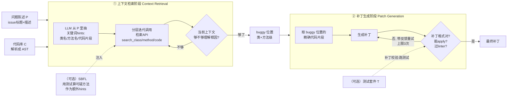

# AutoCodeRover：把软件工程的『结构感知代码搜索 + 谱系故障定位』接进 LLM Agent

> **本篇定位**：agent-harness 精读库 **E 组（编码集成系统，跨 T/L 层）**。它回答一个对我们（Claude Code 本身就是一个 harness）极其贴身的问题——
> **当 agent 要在一个成熟大项目里"找到那处 bug"时，是用纯文本 `grep` 满仓库捞关键词好，还是先把代码解析成 AST、在"类/方法/代码片段"这些程序结构上检索、再用测试驱动的谱系故障定位(SBFL)把可疑范围收窄好？**
> AutoCodeRover（下称 **ACR**）给出的答案是后者，并用 SWE-bench 的数字把它坐实。读这篇的正确姿势不是"又一个修 bug 的 agent"，而是"**一次教科书式的 harness 工具层增强**：把软件工程几十年沉淀的两把利器接进 LLM 的工具箱"。

---

## §1　TL;DR（一页讲清这篇在干嘛）

> 主讲提示：开场先把"两把 SE 利器接进 agent"这句话说死，再落到 SWE-bench 的数字，最后点明它属于 harness 的哪一层。

**一句话**：给定一个真实的 GitHub issue（自然语言描述的 bug 或功能请求）和对应的**整个代码库** $C$，ACR 自动产出一个能打上去的补丁（patch）。它分两阶段（原文 §4.1、Figure 2）：

1. **上下文检索（context retrieval）**：不是 `grep` 满仓库找字符串，而是把代码库解析成 **抽象语法树（Abstract Syntax Tree, AST）**，给 LLM 一组**在程序结构上检索**的工具 API（`search_class` / `search_method_in_class` / `search_code` …，共 7 个，见 Table 1），让 LLM **分层迭代地（stratified, iterative）**调用它们，一步步把"可疑的类/方法"收窄成"buggy 位置"。
2. **补丁生成（patch generation）**：换一个 LLM agent，拿着检索到的精确代码上下文写补丁；写不出合法/可应用的补丁就**带 linter 反馈重试**（重试上限 3 次，原文 §4.5）。

**两把 SE 利器**（这篇的灵魂）：
- **结构感知代码搜索**：检索发生在 **AST / 程序结构**上，而非纯文本行。→ 一次能精确定位到"某类的某方法"，避免 `grep` 的海量噪声（原文 §1、§4.2）。
- **谱系故障定位（Spectrum-based Fault Localization, SBFL）**：当项目**自带测试套件**时，用"通过测试 vs 失败测试"经过的代码差异，给每个方法算一个**可疑度分数**，把可疑方法当"外部分析工具给的提示"喂给检索 agent（原文 §4.4）。

**关键数字**（原文 §6.1、Table 2）：
- **SWE-bench lite（300 题）**：ACR@1 **19%**（57 题）、ACR@3 **26%**（78 题）；加 SBFL 的 **ACR-sbfl 22%**（66 题）。对照并发工作 **SWE-agent 18%**（54 题）。
- **成本**：每题 **~4 分钟**（195 秒）、**37K token ≈ $0.43**（ACR@1）；对照 SWE-agent 245K token ≈ $2.51，**成本约 1/6**。
- **补丁质量**：解决的补丁里 **65.4%（51/78）是 correct**（语义等价于开发者补丁），而非仅仅"过了测试的 overfitting 补丁"（原文 §6.2）。

**属于 harness 的哪一层（Θ1）**：主打 **T（Tools，把结构化搜索/ SBFL 做成工具）** 与 **L（Loop，分层迭代检索 + 带 linter 的补丁重试循环）**；作为一个端到端系统它坐 **E 组（集成）**。它几乎不碰 O（可观测）/ V（评测协议）——评测直接借用 SWE-bench 现成的 Docker 裁判。

**回扣全库论点（Θ2）**：这是 `Agent = Model + Harness` 最"工程实感"的一条证据——**模型固定为 GPT-4，能力差异全来自 harness**（工具是 AST 检索还是文本 grep、循环里加不加 SBFL）。它把"harness 增强"具体化为"**把成熟 SE 工具接进工具层**"这一可操作范式。

---

## §2　问题与动机：为什么"自动改 GitHub issue"是块难啃的骨头

> 主讲提示：这页用 Why 三连的"问题层"。先讲清"自动编程"和"自动程序改进"的区别，再讲现有 APR 的两个死穴。

**Why（问题层）——不解决会卡住什么？**

论文开篇（原文 §1 "Beyond Automatic Programming"）把视野从"自动编程（automatic programming，从零生成代码）"抬到"**自动程序改进（autonomous program improvement）**"：软件工程的大头不是从零写，而是**维护已有项目**——修 bug、加功能。开发者"花了大量小时手动修 bug"（原文 §1 原句）。而 LLM/Copilot 生成的代码"可能不正确 [10] 或有漏洞 [34]"，于是需要能**自主改进**代码的流程。

**这件事为什么难**（原文 §2.2 讲 SWE-bench lite 的挑战）：解决一个真实 issue 不是 HumanEval/MBPP 那种"给函数签名补函数体"的玩具题。它要求：
- 在**成熟的大代码库**里**跨文件推理**目标位置；
- 分析 issue 的**根因（root cause）**；
- 提出修复策略；
- 最终写出能过 PR 里所有测试的补丁。

**传统自动程序修复（Automated Program Repair, APR）的两个死穴**（原文 §2.1 末）：
1. **依赖高质量测试套件**："APR 技术依赖高质量 test suite，而现实里不总是有"（原文原句）。搜索式/语义式/学习式 APR 都要一个能精确刻画正确行为的测试套件来当"修复约束"。
2. **不用自然语言规约**：它们"不利用 issue 原始描述里宝贵的自然语言规约"。而真实 issue 的价值恰恰在那段人话描述里。

**后果**：得到一个大项目里的 **buggy 位置**（fault localization）本身就是"real-life bug fixing 里一个本质且困难的任务"（原文 §2.1）。很多 LLM-APR 工作干脆假设"**完美故障定位**（perfect fault localization assumption）"——直接告诉模型哪几行有问题（原文 §2.1 点名 [10,15,46]）。ACR 要打掉这个假设：**从 issue 描述出发，自己把 buggy 位置找出来**。

> **读出什么**：这篇的 intention 不是"再造一个更强的补丁生成器"，而是"给 agent 补上**在真实代码库里精准定位**的能力"。定位准了，补丁生成才有的谈。这条主线贯穿全文。

---

## §3　核心 intention 与研究问题（形式化成一句话）

> 主讲提示：把问题压成一句话 + 三个 RQ，让听众知道后面每个实验在回答哪一问。

**一句话 intention**（原文 §1 Contributions）：
> "我们的贡献在于**有效地使用代码搜索来把软件工程流程接进自动程序修复**……我们不把代码库看成一堆文件（a collection of files），而把 ACR 看成一个**从程序结构里提炼规约（gleans specification from program structure）**的途径，用它来指导打补丁。"

这句话里藏着全篇的"世界观差异"：
- **别人的世界观**：codebase = a collection of files（文本文件集合）→ 检索 = 文本匹配。
- **ACR 的世界观**：codebase = program structure（AST：类、方法、代码片段的层级结构）→ 检索 = 结构导航；而"**程序结构本身就是一种规约（specification）**"，可以弥补测试套件缺失时"没有规约"的窘境。

**三个研究问题**（原文 §5）：
- **RQ1**：ACR 能在多大程度上像人类开发者一样自动解决软件 issue？（→ §8 主结果）
- **RQ2**：现有调试/分析技术（SBFL）能否辅助 ACR？（→ §10 SBFL 消融）
- **RQ3**：真实任务里，全自动程序改进的挑战是什么？（→ §11 失败分类学）

**核心假设**（原文 §1 五条 dimensions 摘要）：
1. 在**程序表示（AST）**上工作，比在文件集合上工作更利于自主软件工程；
2. 用**类/方法/代码片段**做检索（像人类工程师那样按结构找），比纯文本检索更能给 LLM 有效上下文；
3. **自动修复的效率不如效果重要**——只要时间在一个阈值内（原文强调 "as long as the time is within a threshold"）。

---

## §4　相关工作定位：它站在谁肩上、和谁不同

> 主讲提示：一张对比表说清 ACR 在 2024 年 4 月那波 agent 里的独特站位——"structure-aware"是它的旗。

**它继承的三条血脉**（原文 §2.1）：
- **传统 APR**：搜索式（GenProg [42]）、语义式（[28,30]）、学习式（[26,38,48]）——ACR 的"补丁生成 + 重试验证"是这条线的现代 LLM 版。
- **故障定位**：SBFL 综述 [44,45]、Tarantula [21]、Ochiai [3]——ACR 把它当**可选增强**接进来。
- **LLM-APR**：[10,15,46] 用 LLM 修 bug，但多数**假设完美故障定位**——ACR 正是要去掉这个假设。

**与并发 agent 的关键区别**（原文 §2.2、§9）：

| 系统 | 代码库视角 | 与代码交互方式 | 故障定位 | 备注 |
|---|---|---|---|---|
| **AutoCodeRover** | **程序结构 / AST** | **结构感知搜索 API**（search_class/method/code） | issue 描述 + **可选 SBFL** | 本篇；ISSTA'24 |
| **SWE-agent** [47] | **文件集合** | **Agent-Computer Interface（ACI）**：shell 命令读写文件 | 无显式 FL，靠 agent 浏览 | 并发工作；ACR 明确对标它 |
| **Devin** [24] | 未公开 | 未公开（首个"AI 软件工程师"） | 未公开 | 商业系统，细节不可得 |
| 经典 LLM-APR [10,15,46] | 给定 buggy 行 | 直接 prompt 补丁 | **假设完美 FL** | ACR 要打掉的假设 |

> **读出什么（Θ2 呼应）**：ACR 和 SWE-agent 是同一命题的两个变体——**都在增强 harness 的工具层，但增强方向不同**。SWE-agent 给的是"通用 shell 接口（ACI）让 agent 像人一样敲命令"；ACR 给的是"**领域专用的结构化检索 + SBFL**"。这正是 `Agent = Model + Harness` 里"工具层怎么设计"的两种哲学之争：**通用可组合** vs **领域专用高精度**。记住这条对立，§17 会回收。

---

## §5　方法总览（big picture）：两阶段一图流

> 主讲提示：先给整张 pipeline 的直觉——"先侦查（检索），侦查够了再动手（打补丁），动手失败就重试"，不展开公式。

ACR 吃两个输入（原文 §4.1）：**问题陈述 $P$**（issue 的标题 + 描述）与**代码库 $C$**。产出一个补丁。

**三条设计直觉**（贯穿全篇）：
1. **像人一样按结构找**：人类工程师读 issue 会先猜"大概是 `ModelChoiceField` 这个类的某个方法"，然后跳转过去看——ACR 的结构化搜索就是把这个动作 API 化。
2. **检索要"分层迭代"，不能一把梭**：一次把所有 API 全调，会返回一个 LLM 读不完、甚至超上下文窗口的巨大代码块（原文 §4.3）；只调一个又信息不全。所以**每一层只调"必要"的几个，看完再决定下一层调什么**。
3. **效果 > 效率**：宁可多花几分钟检索准，也不要定位错（原文反复强调的 "as long as the time is within a threshold"）。

---

## §6　符号与术语表（先定义，后文要用）

> 主讲提示：这页是"字典页"，后面公式/流程用到的记号都在这。SBFL 公式尤其依赖它。

| 记号 / 术语 | 含义 | 出处 |
|---|---|---|
| $P$ | 问题陈述（problem statement）：issue 标题 + 描述 | §4.1 |
| $C$ | 代码库（codebase），被解析成 AST | §4.1 |
| **AST** | 抽象语法树（Abstract Syntax Tree）：把源码表示成"类 → 方法 → 语句"的层级结构 | §1 |
| **hints** | LLM 从 $P$ 里识别出的关键词（类名/方法名/代码片段），未必精确指向 bug，但揭示了相关上下文所在 | §4.2 |
| 检索 API | Table 1 的 7 个函数，输入关键词、在 AST 上搜、返回签名或实现 | Table 1 |
| **stratified search** | 分层搜索：把检索组织成一层层（stratum 1,2,…,k），每层只调必要 API，逐层加深上下文 | §4.3, Figure 5 |
| **buggy locations** | 待修改位置，粒度到"类 + 方法" | §4.1 |
| **SBFL** | 谱系故障定位（Spectrum-based Fault Localization） | §4.4 |
| $T$ | 测试套件（test-suite），SBFL 与补丁校验的前提 | §4.4 |
| **suspiciousness score** | 可疑度分数：SBFL 给每个程序元素（这里是方法）打的"它多可能是 bug"的分 | §4.4 |
| $e_f, e_p$ | 覆盖某程序元素的**失败测试数** / **通过测试数**（executed-failed / executed-passed） | 标准 SBFL 记号（见 §7 说明） |
| $n_f, n_p$ | **不**覆盖该元素的失败测试数 / 通过测试数（not-executed-failed / not-executed-passed） | 标准 SBFL 记号 |
| **plausible / correct patch** | plausible=过了给定测试；correct=进一步与开发者补丁语义等价（correct ⊆ plausible） | §6.2 |
| **pass@1 / pass@3** | 重复跑 $k$ 次、只要有一次解决就算解决的解决率（$k=1$ 或 $3$） | §5, [8] |

---

## §7　方法细节 · 结构感知代码搜索（把 grep 换成 AST 导航）

> 主讲提示：这是全篇第一个"该讲透"的核心。先把"为什么 grep 不行"讲到听众点头，再讲 7 个 API 与"分层迭代"。

### 7.1　Why 三连：为什么是"结构感知搜索"而非"文本 grep"

**Why（问题层）**：要修 bug，先得找到 bug 在哪。issue 描述里往往提到一些 hints（类名 `ModelChoiceField`、方法名、短代码片段），但这些"未必直接指向精确修改位置"（原文 §4.2）。怎么用这些 hints 去代码库里捞出真正相关的上下文？

**Why（设计层）——朴素替代方案会怎样失败**：

> **朴素方案 A：纯文本 `grep` 关键词。** 在整个代码库里对 `ModelChoiceField` 做文本匹配。→ 失败模式：
> 1. **噪声爆炸**：一个常见类名可能在测试、注释、文档字符串、无关调用里出现几十上百次，返回一大堆无关行，LLM 难以分辨哪个是"定义"、哪个是"根因"。
> 2. **粒度错位**：grep 返回的是"行"，但修 bug 需要的是"**这个方法的完整实现**"这种**结构单元**。行级结果割裂了语义。
> 3. **无法表达"类里的方法"这种结构关系**：issue 说"`clean` 方法可能有问题"，grep `clean` 会命中所有叫 clean 的东西，无法约束到"`ModelChoiceField` 这个类里的 clean"。
>
> **朴素方案 B：把整个相关文件/整个类塞给 LLM。** → 失败模式：大项目里"一个类的完整定义可能很长"（原文 §4.2 原句），塞进去要么**撑爆上下文窗口**，要么**制造干扰（distraction）**淹没关键信息。
>
> **ACR 的设计**：把代码库解析成 AST，提供**结构感知的检索 API**（Table 1）。检索单元是"类 / 方法 / 代码片段"这些**程序结构实体**；且为控制上下文长度，`search_class` 只返回**类签名**（class signature，即类名 + 各方法签名的骨架），而不是整个类体——"返回签名是在某个界限上裁剪上下文的好办法"（原文 §4.2）。要看某方法细节，再调 `search_method_in_class` 精确取那一个方法的实现。**这就把"找对地方"和"看太多"这对矛盾同时解决了。**

**Why（结果层，预告）**：§8 的 Venn 图（Figure 6）显示 ACR **独立解决了 26 个 SWE-agent 没解决的题**，原文点名机制是"**benefited from the fine-grained code context search at the AST level to precisely locate the bug locations**（例如 django-13401 一次就搜了 3 个必要方法）"（原文 §6.1）。结构化检索的精度直接兑换成了解决率。

### 7.2　七个检索 API（原文 Table 1）

| API | 作用 | 返回 |
|---|---|---|
| `search_class(cls)` | 全库找类 `cls` | 类的**签名** |
| `search_class_in_file(cls, f)` | 在文件 `f` 里找类 `cls` | 类的签名 |
| `search_method(m)` | 全库找方法 `m` | 方法**实现** |
| `search_method_in_class(m, cls)` | 在类 `cls` 里找方法 `m` | 方法实现 |
| `search_method_in_file(m, f)` | 在文件 `f` 里找方法 `m` | 方法实现 |
| `search_code(c)` | 全库找代码片段 `c` | 该片段 **±3 行** |
| `search_code_in_file(c, f)` | 在文件 `f` 里找片段 `c` | 该片段 ±3 行 |

**工程细节**（原文 §4.2 "Interfacing with LLM"）：这些 API 的描述 + 期望输出被写进 prompt；LLM 决定调哪些时，就以"API 调用名 + 参数"的形式回应；ACR **本地把项目解析成 AST 并在其上搜索**（"running locally based on AST analysis"，原文 §2 开头），把结果返回给 agent 构成代码上下文。**注意：搜索是本地静态的，不消耗额外 LLM 调用**——只有 agent 的"决定调什么/分析结果"才过 LLM。

### 7.3　分层迭代检索（stratified search）

**Why（设计层）**：原文 §4.3 给了两条关键观察：
- **观察一**：检索**不能只限一次单一 API**。django-13230 里若只从 `search_method("add_item")` 出发，会得到不完整的根因图景；但若把所有 API 一次全执行，又会得到一个"LLM 难以理解、甚至超出上下文"的巨大代码块。
- **观察二**：某些 API 的结果会"揭示出**值得进一步检索**的新元素"——比如 `search_class` 返回类签名后，LLM 能从签名里发现更该看的方法，于是**下一层**再去 `search_method_in_class`。

于是提出**分层搜索**（Figure 5）：
- **Stratum 1**：上下文里只有问题陈述 $P$。LLM 选一组**必要的（necessary）** API 调用。
- **Stratum 2…k**：上下文 = $P$ + 前面各层搜到的代码。每层执行完，新代码并入上下文，LLM 再判断"够不够理解 issue？(a) 继续迭代搜索，还是 (b) 定下 buggy 位置准备修"。

> **读出什么**：这一层"**允许 LLM 一次选多个 API、但要求它只选必要的**"的设计（原文 §4.3 末），本质是在做**上下文预算管理**——用最少的检索步数逼近一个"optimal context"。这与 D 组（上下文/记忆）论文的关切是同一件事，只是 ACR 把它落在了"检索工具的调用策略"上。这条 L 层（Loop）的循环控制，正是 harness 的核心组件之一。

---

## §8　方法细节 · 谱系故障定位 SBFL（用测试把可疑代码"照"出来）

> 主讲提示：这是全篇第二个"该讲透"的核心。务必先把"什么是谱（spectrum）"讲清，再上可疑度公式（并诚实说明：公式是它引用的标准式，原文没写出来）。

### 8.1　Why 三连：为什么在结构化搜索之外还要 SBFL

**Why（问题层）**：结构化搜索只用了 issue 描述里的 hints。但当项目**恰好带着能复现 bug 的测试**时，测试执行里藏着一份"免费的、动态的"定位信号——**哪些代码被失败测试走到了、又没被通过测试走到**。不用白不用。

**Why（设计层）——朴素替代 vs ACR**：
> **朴素方案：直接把 SBFL 排名第一的方法当作 buggy 位置去修。** → 失败模式：SBFL 的精度**高度依赖测试套件质量**（原文 §4.4 引 [22]），"SBFL 结果实际上是对'通过/失败测试控制流差异'的一种**抽象**"，未必精确。盲信 top-1 会被带偏。
>
> **ACR 的设计（关键巧思）**：**不用 SBFL 替代检索，而用它增强检索。** 把 SBFL 识别出的可疑方法，作为"**一个外部分析工具识别出的可疑代码（results from an external analysis tool that identifies suspicious code）**"喂给检索 agent，当成**额外的 hints**（原文 §4.4 原句）。LLM 于是能**交叉引用**两路信号——issue 描述里的自然语言 hints 与 SBFL 的可疑方法。原文举例：若某个 SBFL 方法名和问题陈述更相关，LLM 更可能对它调 `search_method`；而且实测中 agent 不盲信 top-1，反而会去看排名第 3、第 5 的方法（§10 case study）。
>
> **为什么用"方法级（method-level）"SBFL**：SBFL 可在语句/基本块等不同粒度做；ACR 选**方法级**，因为"LLM 能合理处理方法级的长代码片段"（原文 §4.4）——粒度与 LLM 的消化能力对齐。

### 8.2　可疑度公式（先定义符号，再给式子）

**直觉**：一段代码，如果**几乎所有失败测试都走过它、而通过测试很少走它**，它就很可疑——bug 大概率藏在这。SBFL 就是把这个直觉量化成一个 $[0,1]$（或非负实数）的**可疑度分数**，分数越高越可疑。

**符号定义**（标准 SBFL 记号；针对某个程序元素 $s$，这里 $s$ 是一个方法）：
- $e_f(s)$：**执行了** $s$ 的**失败**测试数（executed & failed）；
- $e_p(s)$：**执行了** $s$ 的**通过**测试数（executed & passed）；
- $n_f(s)$：**没执行** $s$ 的**失败**测试数（not-executed & failed）；
- $n_p(s)$：没执行 $s$ 的通过测试数；
- 记总失败测试数 $F = e_f + n_f$，总通过测试数 $P_{\text{ass}} = e_p + n_p$。

> ⚠️ **诚实标注（忠于原文）**：原文 §4.4 明确说 SBFL 的可疑度分数"可以用 **Tarantula [21]** 或 **Ochiai [3]** 等多种度量计算"，但**正文并未写出具体公式**。下面两式是这两篇被引文献里的**标准定义**，列在此处是为把"可疑度"讲透，**并非 ACR 原文给出的式子**。

**Ochiai [3]**（当代 SBFL 最常用，经验上优于 Tarantula）：

$$ \mathrm{susp}_{\text{Ochiai}}(s) \;=\; \frac{e_f(s)}{\sqrt{\,(e_f(s)+n_f(s))\cdot(e_f(s)+e_p(s))\,}} \;=\; \frac{e_f}{\sqrt{F\cdot(e_f+e_p)}} $$

**Tarantula [21]**：

$$ \mathrm{susp}_{\text{Tarantula}}(s) \;=\; \frac{\dfrac{e_f}{F}}{\dfrac{e_f}{F}+\dfrac{e_p}{P_{\text{ass}}}} $$

**读出什么**：两式分子都是"失败测试对 $s$ 的覆盖"，分母都在做某种归一化以惩罚"通过测试也常走 $s$"。若一个方法**只被失败测试走、通过测试从不走**（$e_p=0$），可疑度拉满（=1）；若通过测试也频繁走它，可疑度被压低。ACR 取**方法级可疑度的 top-5** 方法作为提示注入检索阶段（原文 §6.2 "we additionally provide SBFL results (top-5 suspicious methods)"）。

### 8.3　什么时候用 SBFL（两种 regime）

原文 §4.4 把"是否有测试"分成两档，很关键：
- **无测试**：只用问题陈述 $P$ + 结构化检索。这是 ACR 的默认、也是 RQ1 主实验的设定（原文 §4.3 末、§5）。
- **有测试**：(1) 把 SBFL 可疑方法当额外 hints 增强检索；(2) 补丁生成阶段可用测试做**补丁校验**——补丁若没过完整测试套件，就重跑补丁生成 agent，校验循环配置为跑 3 次（原文 §6.2 "ACR-sbfl" 设定）。这是 RQ2（§10）研究的设定。

> **读出什么（Θ5 regime 诚实的种子）**：SBFL 是**条件增益**——它的价值只在"有可复现测试"时兑现。原文 §7 也承认"这第二种场景在真实开发里并不总是现实的"。别把 SBFL 讲成万灵药。

---

## §9　方法细节 · 补丁生成与重试循环（L 层）

> 主讲提示：这页短，但要点出"重试 + linter 反馈"是让 agent 从'格式错误'里自我恢复的关键循环。

**补丁生成 agent**（原文 §4.5）：输入 = 问题陈述 + 检索阶段定下的 buggy 方法 + 整个检索历史（调了哪些 API、结果、分析）。步骤：
1. 先取 buggy 位置的**精确代码片段**（此前检索给的是签名/片段，这里要完整代码）；
2. 进入**补丁生成重试循环**：若生成的补丁"不符合规定格式"或"无法语法上应用到原程序"，就 prompt agent 重试；循环里还挂了个 **linter** 专抓缩进等 Python 语法错误；
3. 重试上限 **3 次**（"currently set to three"），超了就返回目前最好的补丁。

**关键超参**（原文 §5 "Implementation and Parameters"）：底座模型 **GPT-4（gpt-4-0125-preview）**；补丁生成 **temperature=0.2、max_tokens=1024**（求相对确定 + 足够推理长度）；其余默认。ACR 在"生成出补丁"或"检索阶段重复 10 次上限"时终止（context retrieval stage repeats ten times，原文 §5）。

> **读出什么（Θ2）**：这个"生成→校验（格式/linter/测试）→带反馈重试"的小循环，就是 harness **L 层**在"从失败中恢复"上的最小实现。它对应 Harness-Bench 里的 **Robustness** 维度。ACR 的这套很轻（linter + 3 次重试），但方向正确。

---

## §10　实验设置（setting / metrics / params 全）

> 主讲提示：把数据集、baseline、指标定义式一次交代清，后面看数才不虚。

**数据集**（原文 §5 Benchmark）：
- **SWE-bench**：2294 个真实 GitHub issue（11 个流行 Python 项目，如 django、sympy）。
- **SWE-bench lite**：其 300 题子集（原文 §2.2）。
- **SWE-bench Devin subset**：Devin 被评测的 570 题（full SWE-bench 的随机 25% 子集），为与 Devin 对齐而用。
- **唯一输入**：issue 的自然语言描述 + 对应 buggy 代码库（checkout 到出错版本）。

**Baseline**（原文 §5）：
- **SWE-agent [47]**：并发工作，其结果 GitHub 公开，**直接对比**。
- **Devin [24]**：首个"AI 软件工程师"，无法访问，取其技术报告 [40] 的报告值对比。

**评测指标（给定义式）**：
1. **解决率（resolved rate）**：解决的 task 实例占比。一个实例算"解决" ⟺ 生成的补丁**过了该 issue 的 PR 里新增的全部测试**（原文 §8 Threats 里的定义）。
2. **pass@k**（原文 §5 引 [8]）。直觉：LLM 有随机性，跑一次可能碰运气或翻车，跑 $k$ 次里只要有一次成功就算这题"能被解决"。
   - 记号：对第 $i$ 题跑 $k$ 次，$\mathbb{1}[\text{run } j \text{ 解决}]$ 表示第 $j$ 次是否解决。
   $$ \mathrm{pass@}k \;=\; \frac{1}{N}\sum_{i=1}^{N}\; \mathbb{1}\!\left[\;\exists\, j\in\{1,\dots,k\}:\ \text{run } j \text{ 解决第 } i \text{ 题}\;\right] $$
   ACR 跑 **3 次**，报 **pass@1（记 ACR@1）** 与 **pass@3（记 ACR@3）**。$N$=题目总数。
   > 读出什么：pass@3 ≥ pass@1 恒成立（更多尝试不会更差）；两者的差反映"这题是不是全靠运气"。ACR@3 明显高于 @1，说明**多跑几次 + 有程序规约做校验，还有上升空间**（原文 §6.1 末点出这暗示了未来"迭代 generate-and-validate"的潜力）。
3. **平均时间 / 平均 token（成本）**：每题跑 3 次的平均耗时与 token 数（折算美元）。体现"效率 + 经济性"。

**环境**（原文 §5 System Environment）：x86_64、Ubuntu 20.04；补丁正确性在**官方 SWE-bench Docker 环境**里判定。**随机性控制**：每实验重复 3 次以缓解 LLM 随机性（原文 §8）。

---

## §11　主结果（RQ1）：19% / 26%，且比 SWE-agent 便宜约 6 倍

> 主讲提示：这是全场最该停留的表。先报解决率，再报"更便宜"，最后用 Venn 图讲"结构化检索独解了哪些题"。

**Table 2 主结果**（"-" = 无数据）：

| 数据集 | 系统 | 解决率（题数） | 平均时间(s) | 平均 token（$USD） |
|---|---|---:|---:|---:|
| **lite（300）** | SWE-agent [47] | 18.00%（54） | - | 245K（$2.51） |
| | **ACR@1** | **19.00%（57）** | 195 | **37K（$0.43）** |
| | **ACR@3** | **26.00%（78）** | 520 | 112K（$1.30） |
| | **ACR-sbfl** | **22.00%（66）** | 250 | 40K（$0.47） |
| **full（2294）** | SWE-agent [47] | 12.47%（286） | - | 240K（$2.46） |
| | ACR@1 | 12.42%（285） | 248 | 39K（$0.45） |
| | ACR@3 | 17.96%（422） | 701 | 120K（$1.39） |
| **Devin subset（570）** | SWE-agent [47] | 13.51%（77） | - | 234K（$2.40） |
| | Devin [24,40] | 13.86%（79） | >600 | -（$2.40） |
| | ACR@1 | 12.63%（72） | 238 | 37K（$0.42） |
| | ACR@3 | 18.77%（107） | 692 | 117K（$1.36） |

**Why（结果层）——这些数说明了什么**：
- **效果**：lite 上 **ACR@1 19% > SWE-agent 18%**；ACR@3 冲到 **26%**。full SWE-bench 上 ACR@1（12.42%）与 SWE-agent（12.47%）基本打平，ACR@3 拉到 17.96%。Devin subset 上 ACR@3（18.77%）明显高于 Devin（13.86%）。
- **效率/成本**：ACR@1 每题 **~4 分钟（195s）、$0.43**；SWE-agent **$2.51**。**成本约 1/6**，时间远低于"开发者认为可接受的 30–60 分钟 APR 时限"（原文 §2、引 [31]）。原文还给了个扎心对照：ACR 平均 195 秒解决的题，开发者平均花了 **2.68 天**（§1、§6.1）。
- **Devin 时间**：Devin >600s 且平均 2.68 天级别的开发者对照，ACR 的"快而便宜"是它主打的卖点（原文 §6.1 Time/Token Cost）。

**Venn 图（Figure 6）——互补性**：ACR 与 SWE-agent 在 lite 上**共同解决 31 题**；**ACR 独解 26 题**，**SWE-agent 独解 23 题**。
- **ACR 独解的机制**（原文 §6.1）：得益于 **AST 级细粒度检索一次精确定位**（django-13401 一次搜 3 个必要方法）。
- **ACR 失手、SWE-agent 独解的机制**：ACR 在 23 题上败给"**未实现的搜索 API**"——比如 django-12286 里 agent 想调 `search_file`（ACR 没提供这个 API），调了会返回错误信息，LLM 后续可能仍找不到有效 API。→ 原文自评："需要更 robust 的搜索 API"（这是它诚实点出的工具层短板）。

> **读出什么（Θ2 铁证）**：**模型都是 GPT-4，工具层不同 → 解决的题集不同**。ACR 的 AST 检索和 SWE-agent 的 shell-ACI 各有 20 多题是对方够不着的。这就是 `Agent = Model + Harness` 在"工具层设计"上的直接体现：**换一种代码交互工具，agent 的能力边界就整体挪一块**。

---

## §12　补丁质量（RQ1 续）：过测试 ≠ 修对了

> 主讲提示：这页是判断力的高地。务必把 plausible / correct 的区别讲死——这是 APR 领域最容易被忽悠的地方。

**定义（原文 §6.2）**：
- **plausible（貌似对）**：补丁**过了给定测试套件**。
- **correct（真的对）**：补丁进一步**与开发者补丁语义等价（semantically equivalent）**。$\text{correct} \subseteq \text{plausible}$。
- **overfitting（过拟合补丁）**：plausible 但不 correct——过了测试却没真正符合开发者意图。这是 APR 社区"well-known challenge"（原文 §6.2 引 [12]）。

**结果（原文 §6.2）**：在 SWE-bench lite 上人工核验（至少两位作者交叉验证，分歧再引第三人），ACR 的**正确率 65.4%（51 correct / 78 plausible）**。且关键观察：**绝大多数 overfitting 补丁（除 2 个外）改的位置和开发者补丁相同，只是代码改法不对**——意味着"**即使 overfitting，ACR 也把 bug 定位对了**，只是补丁写歪了"，对开发者仍有价值（帮了定位）。

**两个有趣的 overfitting 成因**（原文 §6.2）：
1. **issue 创建者给了初步补丁**，但和最终开发者补丁不同，误导了 LLM；
2. **issue 只提了一个待修 case，开发者却修了多个类似 case**——LLM 只修了提到的那个。两者都说明 **issue 描述本身是不完整的规约（incomplete specification）**。

> **读出什么**：这段是全篇最诚实、也最有迁移价值的一段。它把"agent 修 bug"的成功拆成两层：**定位对（65% overfitting 也定位对）** 与 **补丁对（65.4% correct）**。SWE-bench 的解决率只测"过没过测试"，掩盖了这层区别。原文点名 Devin [24] 和 SWE-agent [47] **都没报告这个 correctness 维度**——ACR 在这点上比同行更严谨。

---

## §13　SBFL 消融（RQ2）：+SBFL 把 57 题抬到 66 题

> 主讲提示：这页回答"经典调试技术能不能帮 agent"。用 django-13964 的 case 讲清 SBFL 是怎么"照出被 issue 误导时看不见的可疑代码"的。

**设定（原文 §6.2）**：给检索阶段额外喂 **SBFL top-5 可疑方法**，并在补丁生成阶段加**测试校验**（跑 3 次）。测试套件用 SWE-bench lite 自带的开发者写的测试。

**结果（原文 §6.2、Table 2）**：
- 加 SBFL 后，解决题数从 **57（ACR@1）→ 66（ACR-sbfl）**，即 lite 解决率 **19% → 22%**。
- 且 **ACR-sbfl 独解 7 题**是所有其它跑法都没解决的。
- 成本几乎没涨（40K token / $0.47 / 250s，和 ACR@1 相近），因为 SBFL 是本地静态分析，不烧 LLM token。

**Case study（django-13964，Figure 9）——SBFL 如何救场**：该 issue 讲"给子对象设了非自增主键后保存父对象导致数据丢失"。issue 里 highlight 的 hints（`Product`、`Order` 类）其实是**干扰项（distracting factors）**——**只看这两个类（WITHOUT SBFL）检索不出有用上下文，修不了**。而 SBFL 因为看的是**测试执行差异**，额外照出了 `resolve_related_fields`、`_prepare_related_fields_for_save` 等真正相关的方法（WITH SBFL）。有意思的是 agent **没盲信 SBFL 的 top-1**，而是去搜了 rank-3、rank-5 的方法——因为这些和 issue 描述里另一些（黄色 highlight 的）hints 更相关。**LLM 把两路信号交叉引用，才收集到对的上下文。**

> **读出什么（Θ5）**：SBFL 的价值场景很清晰——**当 issue 描述本身有误导性、而恰好有可复现测试时**，SBFL 用"执行事实"纠偏"文字误导"。但它的前提（可复现测试）在真实开发里不总满足（原文 §7）。所以 RQ2 的结论是"**能帮，但有条件**"，不是"SBFL 永远更好"。

---

## §14　失败分类学（RQ3）：全自动的边界在哪

> 主讲提示：这页把"ACR 修不了的题"解剖成五类，是理解"下一步该补什么"的地图。

**Figure 10 分类学**（对 300 题里 ACR 失手的题，取 3 次里最好的一次归类）：

| 类别 | 占比 | 含义 |
|---|---:|---|
| **Success** | **26.0%** | 补丁真的解决了 issue |
| **Wrong patch** | **29.3%** | **所有该改的方法都定位对了**，但补丁内容写错（location 对、patch 错） |
| **Wrong location in correct file** | **20.0%** | 改对了文件，但改错了文件里的位置 |
| **Wrong file** | **18.0%** | 改错了文件 |
| **No patch** | **6.7%** | 从检索到的上下文里没生成出补丁 |

**Why（结果层）——这五类说明了什么**（原文 §6.3）：
- **最大的失败类是 "Wrong patch"（29.3%）**：**定位全对、补丁写错**。原文说"**更细粒度的过程内分析（intra-procedural analysis）与规约推断**能显著改善这类——给补丁生成 agent 更多方法级修复指引"。→ 瓶颈从"定位"移到了"补丁生成的推理"。
- **Wrong file / Wrong location（合计 38%）**：**故障定位没能锁定所有该改的地方**。原文观察：这些题的 issue 描述"**提到的方法/类/文件很少**，反而常给一段短的复现示例"——对这类，"用复现示例生成一个综合测试套件、再用 SBFL 揭示可疑位置"是可能的解法；但也有些题"**只有自然语言、没有可复现示例**"，这时"**可能需要人类介入**"。

> **读出什么（Θ5 + RQ3 收口）**：ACR 诚实地画出了全自动的边界——**issue 描述越像"给了复现脚本/明确类名"的强规约，agent 越能自动搞定；越是"只有一段模糊人话"的弱规约，越需要人介入**。这正是 harness 增益的 regime 边界：**规约质量决定 harness 能推到多远**。

---

## §15　版图定位坐标（leaderboard）：2024 年 7 月的第 2 名

> 主讲提示：一句话给出它在当时 SWE-bench 江湖里的位置，别夸大。

**Figure 11（full SWE-bench leaderboard，2024-07-12 快照）**：
- Factory Code Droid **19.27%**（第 1）
- **AutoCodeRover (v20240620) + GPT-4o 18.83%**（第 2）
- AppMap Navie + GPT-4o 14.60%（第 3）
- SWE-agent + GPT-4o 12.47% …

原文 §7 自陈："自 2024 年 4 月起，SWE-bench 上有 **17+ 次尝试**"——ACR 处在这波爆发的最前列，且用**低成本**站上第 2。注意 leaderboard 上的 18.83% 是后续 **+GPT-4o** 版本，与正文主实验（GPT-4 0125）的 17.96% 略有出入，是版本迭代所致。

---

## §16　局限与批判（原文 §8 Threats + 我的补充）

**论文自陈的 threats（诚实）**（原文 §8）：
1. **LLM 随机性**：不同 run 结果不同 → 用"重复 3 次 + 提供 replication package"缓解。
2. **plausible ≠ correct**：过测试的补丁可能 overfitting → 用人工核验 correctness（§12）应对，但这本身是 SWE-bench 评测机制的固有局限。

**论文其它诚实点**：
- **搜索 API 不够 robust**：agent 想调没实现的 API（如 `search_file`）会失败，是 23 题失手的主因（§11）。
- **SBFL 依赖可复现测试**，真实场景不总满足（§7）。
- **Human involvement 缺失**：ACR 把所有决策（选检索位置、何时停止检索）都留给底座 LLM——"**leaving it to the LLM may not always be enough**"，真实 PR 常需多轮人机讨论（原文 §7）。

**我的补充批判**：
- **只在 Python / SWE-bench 上验证**：结构化检索依赖成熟的 Python AST 解析。换到弱类型/动态语言或多语言仓库，"结构感知"的精度未必稳定——外推性存疑。
- **AST 检索是"静态结构"，没用上"语义/跨过程"信息**：原文 §9 自己也提到未来可接 **静态调用图分析 [36,37]**、**language server（jump-to-definition）[14]**、**数据依赖分析 [19]**——说明当前的结构化检索还停在"名字匹配 + 签名裁剪"，离"真正理解程序语义"还有距离。
- **"从程序结构提炼规约"是个漂亮口号，但缺量化**：论文没有单独消融"结构化检索 vs 纯文本检索"的头对头实验（只有整系统 vs SWE-agent 的对比），因此"AST 到底比 grep 强多少"没有干净的数字，只有 Venn 图的间接证据 + case study。这是最该补的一个消融。

---

## ★ 对我们的启发（Inspires Us）

> 这一节是组会高潮。**我们（Claude Code）本身就是一个 harness**——我们的代码搜索工具正是 `Grep`（文本正则）与 `Glob`（文件名）。ACR 恰恰在论证"**文本 grep 定位代码 → 噪声大、找不准；结构感知搜索 + SBFL → 精准定位缺陷**"。所以这篇几乎是**冲着我们自己的工具层来的**，每条都能打到自己身上。

➤ **a. 可直接借用的招（method/trick we can reuse）**：
1. **结构感知检索 API 组**（Table 1 那 7 个）——把"找类/找方法/找片段"从文本匹配升级为 AST 导航，且**`search_class` 只返签名、要细节再取实现**这个"**签名优先、按需展开**"的上下文预算技巧，可直接抄。
2. **SBFL 当"额外 hints"而非"替代定位"**——把任何一个外部分析工具（linter、type checker、覆盖率、SBFL）的输出，当成"**一个外部工具认为这里可疑**"的软提示喂给检索 agent，让 LLM 去和其它线索交叉引用，而不是硬替换。这个"**软提示 + 交叉引用**"的接法很通用。
3. **补丁生成的"linter + 3 次重试"小循环**——交付前先用 linter/schema 卡一遍、失败带反馈重试，是压低"格式/语法类失败"的低成本招。

➤ **b. 可迁移到我们课题的思路（transfer）**：把 ACR 的两阶段（**结构化检索 → 带校验的补丁生成**）映射到 auto-research 库的 `m9.*` 代码修改类模块，以及本库对"我们自己 harness"的改造上。**迁移时要改的前提**：ACR 是 Python-only + 有 SWE-bench 测试；迁到多语言仓库时，"结构感知"要换成语言无关的实现（见下条 c 的 LSP 方案），SBFL 那条则只在"有可跑测试"的模块上开启。

➤ **c. 它暴露的开放问题 = 我们的机会（open problems → our opportunity）**：
- **开放问题 1（论文自己点的）**：当前结构化检索停在"名字匹配 + 签名"，**没用跨过程语义**（原文 §9 列了 call-graph / LSP / data-dependence 作为 future work，但没做）。→ **机会**：把检索工具接到 **Language Server Protocol（LSP）** 上，支持真正的 "jump-to-definition / find-references / call-hierarchy"。**可下手的第一步**：给我们的 harness 加一个 `find_references(symbol)` 工具（基于 LSP 或 tree-sitter），在 3 个 bug 定位任务上对比"它 vs 纯 `Grep`"的定位命中率。
- **开放问题 2**：论文**没做"结构化检索 vs 文本 grep"的干净头对头消融**（§16 批判）。→ **机会**：我们**能**做这个消融——因为我们同时握着 `Grep`（文本）和潜在的结构化检索工具。

➤ **d. 与本库其它论文/模块的连接（connect the dots）**：
- **与 SWE-agent [47]（本库并发对标）正面对立**：ACR = 领域专用高精度结构检索；SWE-agent = 通用 shell-ACI。二者在 Venn 图里各独解 20+ 题，是"**工具层：专用 vs 通用**"这场辩论的最佳对照，值得单独开一页讨论。
- **与 Harness-Bench（本库 G 组标杆）呼应**：ACR 的"linter + 重试"打的是 Harness-Bench 的 **Robustness** 维度；它的"结构化检索精度"打的是 **ToolUse** 维度。可以用 Harness-Bench 那套"乘法打分 + 五类失败标注"来体检 ACR。
- **与 §14 失败分类学 ↔ Harness-Bench 失败症状表呼应**：ACR 的 "Wrong patch 29.3%"（定位对、补丁错）约等于 Harness-Bench 的 "contract/reasoning" 类失败——**都指向"想到了但没落对"**。

➤ **e. 如果我来做下一步（my next move，第一人称、落到我们 harness 的具体组件）**：
> 我会在**我们自己的工具层**里加一个原型工具 `search_symbol`（基于 **tree-sitter** 做 AST 解析，支持 `class/method/reference` 三种查询、且默认只返签名），把它和现有 `Grep` 并列。然后取 **5 个"在中大型仓库里定位某函数缺陷"的真实任务**，做一次**头对头消融**：分别只给 `Grep` 和只给 `search_symbol`，测两指标——(1) **定位命中率**（找到的位置是否包含真正该改的方法）、(2) **达到定位所消耗的工具调用轮数 / token**。若 `search_symbol` 在命中率或轮数上显著更优，就把它设为默认代码检索入口、`Grep` 降级为兜底。**这正是把 ACR 的核心主张（结构 > 文本）在我们这个 harness 上做一次可证伪的验证。**

---

## §17　版图定位（canon/前沿坐标 + 在本库的位置）

> 主讲提示：收尾。把时间坐标、E/T/L 层归属、回扣中心命题一次说清，别绝对化。

- **时间坐标（Θ4）**：**2024 早期基石**。ISSTA'24（顶级软工会议）；处在 **2024-04 起 SWE-bench agent 爆发**的第一波，2024-07-12 leaderboard 上以 18.83% 排 full SWE-bench 第 2。它**奠基**了一个范式——"**把成熟软件工程技术（结构化检索 / SBFL）接进 LLM agent 的工具层**"；后续大量 SWE agent（含各种 RAG-based 补丁生成、AppMap Navie 等）在"如何给 agent 更好的代码理解工具"这条线上继续长肉。相对经典 LLM-APR（假设完美故障定位）它推进了一步：**让 agent 自己完成定位**。

- **E/T/L 层归属（Θ1）**：本篇坐 **E 组（编码集成系统）**，其增强主要落在 **T（Tools：AST 结构检索 API + SBFL 提示）** 与 **L（Loop：分层迭代检索 + 带 linter 的补丁重试）**。它基本不动 C（上下文压缩靠"签名优先"这一朴素策略）、O（可观测）、V（评测直接用 SWE-bench 现成裁判）。

- **回扣中心命题 `Agent = Model + Harness`（Θ2）**：这是全库里**"harness 增强 = 把领域工具接进工具层"最清晰的一课**。它贡献的证据是：**模型钉死为 GPT-4，只把'代码怎么搜'从文本换成结构、把 SBFL 加进循环，解决的题集就整体挪动**（Venn 图 ACR 独解 26 题；+SBFL 57→66 题）。它同时贡献了一个**反例视角**——与 SWE-agent（同样固定 GPT-4、但用通用 shell-ACI）各有 20+ 独解题，说明"**最好的工具层不唯一**"，专用高精度与通用可组合各有胜场。

- **regime 诚实（Θ5，不绝对化）**：ACR 的 harness 增益**分 regime**——
  - **强增益 regime**：issue 描述**误导性强、但有可复现测试**时，SBFL 用执行事实纠偏（django-13964）；代码库结构清晰、issue 点名了类/方法时，AST 检索一击命中（django-13401）。
  - **弱增益 / 失效 regime**：issue **只有模糊自然语言、无复现示例、无测试**时，SBFL 用不上、结构检索也抓不到锚点，原文明说"**可能需要人类介入**"（§14）。
  - 一句话：**这套 harness 增强的价值上限，由"issue 作为规约的质量"和"是否有可跑测试"共同决定**——不是"结构化 + SBFL 永远赢文本 grep"，而是"**在有结构锚点、有执行信号的地方，它明显更准；在只有模糊人话的地方，谁都难**"。

---

## §18　复现与可用性

- **代码/数据全开源**（原文 DATA AVAILABILITY）：实现、实验里生成的全部补丁与对话、复现脚本，均在 https://github.com/nus-apr/auto-code-rover 与 https://autocoderover.dev。
- **能不能单机跑**：核心计算是"本地 AST 解析 + 调 GPT-4 API"，普通 x86_64 / Ubuntu 20.04 机器即可；主要成本是 GPT-4 API（每题 ~$0.43）。正确性判定需拉 **官方 SWE-bench Docker 环境**。
- **坑**：(1) 结果有 LLM 随机性，官方靠重复 3 次缓解，复现单次数字会有波动；(2) SBFL 那条需要目标 issue 自带可跑测试，lite 里有、真实场景常没有；(3) leaderboard 版本（+GPT-4o, v20240620）与论文主实验版本（GPT-4 0125）不同，数字会有出入。

---

## §19　组会讨论问题（留给大家吵）

1. 论文**没做**"结构化检索 vs 纯文本 grep"的干净头对头消融，只有 Venn 图和 case 的间接证据。你会怎么设计这个消融，才能把"AST 比 grep 强多少"量化出来？（这正是 Inspires-Us e 想做的）
2. ACR（专用结构检索）与 SWE-agent（通用 shell-ACI）在 Venn 图里各独解 20+ 题。随着底座模型变强（GPT-4→更强），你赌哪种工具层哲学的边际价值衰减更慢？为什么？
3. SBFL 只在"有可复现测试"时有用。能不能让 agent **自己先从 issue 的复现描述生成一个测试**，再跑 SBFL？（原文 §14 提到了这个方向但没做）这会不会引入"agent 自造测试自证清白"的 reward hacking 风险？
4. "Wrong patch 29.3%（定位对、补丁错）"是最大失败类。补齐它靠的是"更强的过程内分析/规约推断"还是"更强的底座模型"？这决定了工程力气该投工具层还是等模型。
5. 把 ACR 的检索工具接 **LSP（jump-to-definition / find-references）**，最小可行方案是什么？它能压掉 Wrong file(18%)/Wrong location(20%) 这 38% 里的多少？
6. correctness（65.4%）这个维度 SWE-agent/Devin 都不报。如果所有 SWE agent 都被要求报 correct 而非仅 plausible，leaderboard 排名会怎么洗牌？

---

## §20　一页速记（takeaways）

- **命题**：codebase 不是"文本文件集合"，而是"**可在 AST 上检索的程序结构**"；程序结构本身就是一种**规约**。
- **两把 SE 利器接进工具层**：① **结构感知代码搜索**（7 个 AST 检索 API，签名优先、分层迭代）；② **SBFL 谱系故障定位**（用测试的通过/失败差异算可疑度，当额外 hints 注入检索，**不替代**检索）。
- **可疑度直觉**：只被失败测试走、通过测试不走的方法最可疑（Ochiai/Tarantula；原文引 [3,21] 但未写式，本报告补了标准式并标注）。
- **两阶段**：上下文检索（stratified）→ 补丁生成（linter + 3 次重试；有测试则加补丁校验）。
- **数字**：SWE-bench lite **ACR@1 19% / ACR@3 26% / +SBFL 22%**（vs SWE-agent 18%）；每题 **~4 分钟、$0.43**（比 SWE-agent 省约 6 倍）；correctness **65.4%（51/78）**。
- **互补**：Venn 图 ACR 独解 26 题、SWE-agent 独解 23 题——**同模型、不同工具层 → 不同能力边界**（`Agent = Model + Harness` 的工具层铁证）。
- **失败地图**：Wrong patch 29.3%（定位对补丁错）居首 → 瓶颈从"定位"移向"补丁推理"；弱规约 + 无测试的题需人介入。
- **诚实（regime）**：结构化 + SBFL 的增益**分 regime**——有结构锚点/有可跑测试时明显更准；只有模糊人话时谁都难。别绝对化。
- **对我们（Θ3）**：我们的代码搜索就是 `Grep`/`Glob`（文本）。下一步——给 harness 加 tree-sitter 版 `search_symbol`（签名优先、支持 references），和 `Grep` 做 5 任务头对头消融，比命中率与定位轮数；胜则设为默认代码检索入口。
