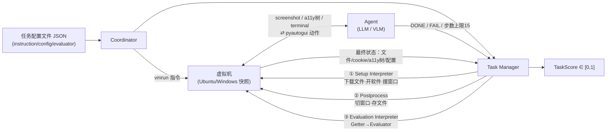

# OSWorld：真实操作系统环境 + 执行式评测，给 computer-use agent 定的第一把标尺

> **本篇定位**：这是 agent-harness 库 **F 组（Web / 计算机使用 / GUI Agent）的开篇 canon**。在它之前，测"数字 agent"的环境几乎都长在浏览器或某个单一 App 里（WebArena 测网页、Mind2Web 测网页、InterCode 测代码执行、MiniWoB++ 测简化网页控件）；OSWorld 第一次把整台**真实操作系统**（Ubuntu、以及有限支持的 Windows）搬进评测循环——agent 拿到的不是"简化过的 DOM"，而是像素级 screenshot、原始 accessibility 树，和一套覆盖全部鼠标键盘动作的 `pyautogui` 接口；判分不是"看它说了什么"，而是任务结束后**单独打开文件系统/应用配置/浏览器 cookie**，用 134 个手写的执行式评测函数逐个核对。
>
> 读它的正确姿势：把它和本库标杆 **[Harness-Bench（2605.27922）](2605.27922-harness-bench-measuring-harness-effects.md)** 对照——两者相隔两年，共享同一条哲学内核："**别信 agent 自称做完了，去检查世界真的变了没有**"（execution-based evaluation）。Harness-Bench 在 2026 年把这条哲学做成了跨 harness 的配置级协议；OSWorld 在 2024 年把它第一次做成了跨"整台电脑"的规模化基础设施。也建议对照 C 组 canon **[SWE-agent/ACI（2405.15793）](2405.15793-swe-agent-agent-computer-interface.md)**——SWE-agent 精修的是 agent 和"一个终端"之间的接口（T 层），OSWorld 精修的是 agent 和"一整台电脑"之间的环境本身（E 层），二者是同一条"harness 决定能力"论点在不同粒度上的样本。

---

## §1　TL;DR（一页讲清这篇在干嘛）

> 主讲提示：先给一张对比图景——"网页沙箱 vs 真实电脑"，再抛数字。这是本篇最大的记忆点。

**一句话**：此前几乎所有"digital agent"基准，测的都是某个**被简化过的接口**——WebArena/VisualWebArena 测浏览器 DOM，Mind2Web/WebVoyager 也困在网页里，InterCode 测代码执行终端，MiniWoB++ 测被裁剪到只剩点选框的迷你网页控件（Table 4）。**没有一个环境能表达"打开文件管理器复制文件到U盘""用 GIMP 修图再用 VLC 剪视频""从邮件附件提取图表传到 Google Drive"这类真正跨应用的日常操作**。OSWorld 用**虚拟机 + 原始鼠标键盘动作空间**把整台可复位的真实 Ubuntu/Windows 电脑接入评测循环，并配上 369 个任务、每个任务都带**手写的执行式评测脚本**（不查文本相似度，查文件/浏览器/应用内部状态是否被正确改动）。结果：人类完成率 72.36%，最强基线（GPT-4，a11y 树输入）只有 **12.24%**（§4.2/Table 5），差距 **60.12 个百分点**；涉及多个应用协作的 workflow 任务上，agent 掉到 6–8% 区间，人类依旧稳定在 73.27%（Table 5/6）。

- **属于 harness 的哪一层（Θ1）**：本篇主打 **E（Environment）层**——它造的是"agent 能在哪跑、能看见什么、能操作什么"的基础设施（VM 快照、Coordinator、Task Manager，§2.2）；同时重度产出 **V（Validation）层**资产——134 个 example-specific 执行式评测函数（§2.2.3、Table 3）。它也顺带给 **T（Tools）层**留下了事实标准：`pyautogui` 动作空间后来被 UI-TARS、Claude computer-use 等大量后续系统直接沿用。它**不**触碰 C（上下文压缩/记忆）与 L（控制循环设计）——论文自己在 §7 把"exploration, memory, and reflection"列为**尚未做、留给未来**的方向。
- **回扣全库论点（Θ2）**：OSWorld 没有做显式的"harness 消融实验"，但它的四种观测格式设置（纯 a11y 树 / 纯 screenshot / screenshot+a11y / Set-of-Mark）本质上就是**四套不同的观测层 harness 配置**，套在同一个冻结模型上。GPT-4V 换一种观测格式，成绩从 5.26%（纯 screenshot）跳到 12.17%（screenshot+a11y），**相对提升 131%**（Table 5）——模型权重没变一个字节。这是"Agent = Model + Harness"在 2024 年、在 computer-use 场景下的一块早期实锤。
- **够新够权威（Θ4）**：**NeurIPS 2024 Datasets and Benchmarks Track**（Poster），香港大学 XLang Lab（Tao Yu 组，与 SWE-bench 学术脉络相近）联合 CMU、Salesforce Research、滑铁卢大学。属**canon**——它定义了"computer-use agent 评测"这个子领域至今仍在用的环境接口与评测哲学。

---

## §2　问题与动机：为什么"网页沙箱"接不住真实的电脑使用

> 主讲提示：这页用 Why 三连的"问题层"。用一个场景带入——"帮我把上周的发票整理进账本"这种任务，根本不活在浏览器里。

**Why（问题层）——不解决会卡住什么？**
自主数字 agent 的终极目标，是替人完成"网页浏览、视频编辑、文件管理、数据分析、软件开发"这类横跨多个应用/接口的真实工作流（§1）。但截至 2024 年初，"评测这件事本身"卡在两类环境上：

1. **没有可执行环境、只有演示数据集**：AITW、Mind2Web、PixelHelp 等提供的是"人类操作轨迹"的静态记录（§1）。非执行式评测**默认每个任务只有一种标准解法**，agent 走了条同样能达成目标的替代路径也会被误判为错——这类基准甚至无法评估"探索式学习"（interactive learning），因为压根没有一个能反馈的环境可探索。
2. **可执行、但域被锁死在单一应用/接口**：WebArena/VisualWebArena/WorkArena/WebShop/MiniWoB++ 全部锁定在浏览器（Table 4 "Environment Scalability" 列全部标"Web"）；InterCode 锁定在代码终端；AssistGUI 虽然是"真实桌面"但仅覆盖 100 个任务且不支持跨应用。这类环境"简化了人机交互的观察和动作空间，把任务范围限制在特定应用或领域内"（§1 原文），天然无法表达跨应用 workflow。

OSWorld 用 Table 3 的统计量化了这个问题的规模：369 个任务里有 **101 个（27.4%）是跨应用 workflow**——这部分任务，此前**没有任何一个可执行、可复现评测的环境能装下**。

> **读出什么**：这不是"评测指标不够精细"的小问题，而是"评测环境的表达能力"从根上限制了整条研究路线——你没法研究"agent 怎么协调 Chrome+Calc"，如果你的环境压根没有 Calc。这正是 E 层（Environment）作为方法论护城河的意义：**测不到的能力，没法被优化**。

---

## §3　核心贡献与"用电脑"的形式化

> 主讲提示：先给 POMDP 的直觉——"agent 看一眼屏幕，动一下鼠标，屏幕又变了"，再上符号，最后强调这套形式化跟 web agent 的 POMDP 唯一的区别就是 S 和 O 的定义域，但这个区别决定了一切。

论文摘要与 §1 末自陈的核心贡献可归纳为三条：

1. **环境基础设施**：OSWorld，首个可扩展、支持真实操作系统（Ubuntu/Windows/macOS，环境层面）的多模态 agent 环境，支持任务初始化、执行式评测、交互式学习（摘要）。
2. **Benchmark 资产**：369 个 Ubuntu 任务 + 43 个 Windows 分析集任务，134 个独立执行式评测函数，302 个不同初始状态（§3.3/Table 3）——"比此前工作高一个数量级"（§1）。
3. **系统性实证**：对 GPT-4V/Gemini/Claude-3/Qwen-Max/Mixtral/Llama-3/CogAgent 等基线做大规模评测与消融分析，证明当前 LLM/VLM 远不能胜任"电脑助理"这一角色（§4、§5）。

**"用电脑"的形式化（直觉先行）**：把"agent 操作电脑"想象成一个人闭着眼睛只能通过"看一眼屏幕截图"来决定"下一步点哪、敲什么字"，而这台电脑的真实状态（打开了哪些程序、文件改成什么样了）远比这一眼截图丰富得多——这就是"partially observable"的直觉来源。

论文用标准的**部分可观察马尔可夫决策过程（POMDP）**形式化（§2.1）：

$$(S,\; O,\; A,\; T,\; R)$$

符号先定义（读公式前必须先认识每个字母指什么）：
- $S$：状态空间——此处等于"整台电脑当前的真实状态"（文件系统、进程、每个应用的内部状态），**不是**某个被裁剪过的子集；
- $O$：观察空间——agent 实际能看到的东西，是 $S$ 的部分投影：自然语言指令 + 屏幕截图 / accessibility 树 / 二者组合（§2.3，详见 §5）；
- $A$：动作空间——原始鼠标键盘动作，如 `.click(300, 540, button='right')`、`.hotkey('ctrl','alt','t')`（§2.4）；
- $T: S \times A \to S$：转移函数——**这里的关键是它不是仿真器，是真实操作系统在真实执行**这个动作后产生的下一状态；
- $R: S \times A \to [0,1]$：奖励函数——**执行式**（execution-based），本报告 §6 专门讲透。

交互循环：agent 在 $o_t$ 上产出动作 $a_t \in A$，环境转移到 $s_{t+1}$，agent 观察到 $o_{t+1}$；循环直到 agent 输出终止动作（`DONE` 或 `FAIL`）或达到步数上限（**主实验设为 15 步**，§2.1）。

> **读出什么**：这套形式化和 WebArena 的 POMDP 形式几乎逐字同构——真正的区别全部压缩在 $S$、$O$、$A$ 的**定义域**里：WebArena 的 $S$ 是"一个网页的 DOM 状态"，OSWorld 的 $S$ 是"一整台电脑的状态"。**同一套数学外壳下，OSWorld 把状态空间的天花板从"一个浏览器标签页"抬到了"整台计算机"**——这是它相对 web 环境唯一但决定性的形式化差异，后面所有的工程代价（VM、快照、134 个 evaluator）都是为了在这个扩大后的状态空间里保持"可复现、可打分"而支付的成本。

---

## §4　环境基础设施：VM 快照 + 三件套（Coordinator / Task Manager / Simulator）

> 主讲提示：讲 Fig. 2 这张架构图。这是"E 层"落地成代码的样子——不要讲成抽象概念，讲成"这套系统真的在硬盘上跑"。

**直觉**：给 agent 造一台"随时能一键恢复出厂设置"的电脑——每次评测前，从一张记录了"某个精确时刻整机状态"的**快照（snapshot）**里启动虚拟机；跑完一个任务，不管 agent 把电脑造成什么样，下一个任务照样从干净快照重新开始。

**架构（§2.2.1，对照下图）**：宿主机上跑一个 **Coordinator**，接收任务配置文件后，调用虚拟机平台指令（`vmrun` 等）创建/恢复虚拟机实例，交给 **Task Manager** 完成三阶段初始化——① **Setup Interpreter** 按配置下载文件、打开软件、调整窗口布局；agent 开始交互后，**Simulator** 把每条动作代码送进虚拟机执行，同时把截图/a11y 树/终端输出等观察传回；任务终止后，② **Postprocess** 执行收尾（切换到目标窗口、保存文件等），再由 ③ **Evaluation Interpreter** 调用对应的 getter + evaluator 函数完成打分（Fig. 2；§2.2.1）。整个环境**支持在单机上并行跑多个虚拟机**（用于训练或批量评测），也**支持 headless 无头运行**（Fig. 2 图注）。

**为什么用虚拟机而非 Docker 容器（Why·设计层）**：
> **Why（设计层）**：朴素做法是用 Docker 这类容器技术（App A.1 原文点名对比）。→ 容器共享宿主内核，天然**跑不了 Windows/macOS 这类异构操作系统**，也没法在应用层面提供"真实桌面 GUI"的完整体验。本文改用虚拟机——代价是**更重**（每个快照要存整机状态，体积大、启动慢），换来的是**能在 x64/ARM 等不同硬件上运行 Windows/macOS/Linux 等任意内核**（App A.1），并且**快照可一键复位**，天然隔离对宿主机的破坏性副作用（§2.2 原文："offers a safe isolated environment and prevents the agent resulting in irreversible damaging effect on the real host machine"）。

**初始状态为什么不能全靠整机快照复原（Why·设计层）**：
> **Why（设计层）**：朴素做法是给每个任务单独存一份"整机快照"。→ 每个任务样例都要吃掉几个 GB 硬盘空间，369+ 个任务的存储成本不可接受（§2.2.2）。本文改用**混合方案**：启动模板虚拟机 → （可选）从云端下载任务专属文件 → （可选）执行预处理命令（开文件、调窗口大小）三段式流程（§2.2.2），只有 302 个"初始状态"（Table 3）是真正需要区分存储的，其余环节靠脚本动态搭建。这也解释了论文反复强调的一个设计初衷——**很多真实求助场景发生在"中间状态"**（软件已经开着、电脑刚崩溃过），而不是"刚开机"，所以初始状态必须能模拟半途而废的现场，而不能只会摆出干净的桌面（§2.2.2 原文）。

---

## §5　观察空间与动作空间：屏幕截图⊕a11y 树⊕终端；pyautogui 与 computer_13

> 主讲提示：这页讲"agent 到底看见什么、能按什么键"。强调这是后续几乎所有 GUI agent 复用的事实标准接口。

**直觉**：观察空间回答"agent 睁眼能看见什么"，动作空间回答"agent 的手能做到什么"——这两者合起来就是 §3 里 $O$ 和 $A$ 的具体实现，也是整个 harness 里离模型最近的那层接口。

**观察空间 $O$（§2.3, App A.2）**：三种可获取的观察，可单独或组合使用——
- **完整屏幕截图**：默认分辨率 1920×1080（16:9，2023 年互联网最常见分辨率，App A.2.1），含鼠标位置和形状，与人类感知对齐；也支持修改分辨率，用于研究跨分辨率泛化。
- **accessibility 树（a11y 树）**：操作系统/浏览器无障碍 API 生成的 XML 结构，记录每个 UI 元素的类型（按钮/复选框/段落…）、状态（选中与否）、空间位置（App A.2.2）。Ubuntu 用 `pyatspi`（ATSPI 协议）获取，Windows 用 `pywinauto`。**原始 a11y 树可达百万级 token**（§4.1），必须过滤——过滤规则见 Table 13（按标签/可见性/可用性/是否有文本或图像内容等条件保留节点）。
- **终端输出**：命令行的原始输出流，用于 CLI 相关任务。

论文也实现了视频录制但**未纳入建模**，理由是"受限于 agent 能力"（App A.2 原文）——这是一处诚实的"做了但没用上"的披露。

**动作空间 $A$（§2.4, App A.3）**：两种实现——
- **`pyautogui`（主用）**：一个开源跨平台 Python 库，把人类的鼠标键盘输入转成可编程回放的代码（Table 2 列出常用函数：`moveTo`/`click`/`write`/`press`/`hotkey`/`scroll`/`dragTo`/`keyDown`/`keyUp`）。它的语法可以嵌进 `for` 循环等程序结构，天然支持批量操作，比自定义离散动作空间**表达力更强**（§2.4 原文）。额外定义三个特殊动作：`WAIT`（等待）、`FAIL`（agent 自判无法完成）、`DONE`（agent 自判完成）。
- **`computer_13`（备用，面向强化学习）**：把 `pyautogui` 包装成 13 类带参数枚举的离散动作（不含 3 个特殊动作），便于 RL 场景下的动作空间学习（App A.3.2，Table 8：`MOVE_TO`/`CLICK`/`MOUSE_DOWN`/`MOUSE_UP`/`RIGHT_CLICK`/`DOUBLE_CLICK`/`DRAG_TO`/`SCROLL`/`TYPING`/`PRESS`/`KEY_DOWN`/`KEY_UP`/`HOTKEY`）。

**为什么不用 web agent 惯用的"点选+输入"精简动作空间（Why·设计层）**：
> **Why（设计层）**：MiniWoB++/CC-Net/WebArena 一类先驱只定义了"点击+输入+少量网页专属动作"（§2.4 原文）。→ 它们**没建模全部可能的电脑操作**——比如右键菜单、Ctrl+点选多选——这天然给 agent 的学习能力设了"天花板"（§2.4 原文："imposes an upper bound on agent learning capabilities"）。OSWorld 选择用 `pyautogui` 覆盖"人类能做的全部鼠标键盘操作"，代价是动作空间连续、维度高，agent 的"grounding"（把意图对准精确像素坐标）难度陡增——这也是本篇最终发现的头号失败原因（§5.4，见 §14）。

> **读出什么**：观察空间和动作空间合起来定义了 agent"眼睛能看多细、手能动多准"的上限——这两者都是**环境层（E）暴露给上层的接口**，后续任何工具封装（比如给 agent 包一层"点击这个按钮"的高阶函数）都是在这层原始接口之上继续搭 harness。这也是为什么 §17 会说 OSWorld 顺带给 **T 层**留下了事实标准：`pyautogui` 本身几乎是"最原始、最不加修饰"的动作空间，后来者（UI-TARS、Claude computer-use）的创新很大程度上就是"在这层原始动作之上，再包一层更聪明的高阶动作"。

---

## §6　执行式评测精讲：不问 agent 说了什么，只查世界变成了什么样

> 主讲提示：这是全篇最该停留、也是任务书点名"必须讲透"的一页。慢一点讲，讲两个例子（Table 1 的两行）。

**直觉**：设想你雇了一个新助理帮你整理账本。你不会指着一段他自己写的"工作汇报"文字去判断他到底做完没有——你会**亲自打开那张 Excel**，看看数字对不对。OSWorld 把这种"眼见为实"的验收方式，原封不动地搬进了 agent 评测：agent 说 `DONE` 只是它自己的一个终止信号，**这个信号本身完全不参与打分**；真正决定分数的，是任务结束后，一段独立于 agent 运行的评测脚本，跑去**检查文件系统、浏览器 cookie、应用配置、accessibility 树**这些客观存在的产物，是否满足任务要求（§2.2.3）。这正是"execution-based evaluation / 执行式评测"名字的由来——评测的对象是"执行的结果"，不是"生成的文本"。

**定义符号（先认清每个函数在做什么，再看公式）**：
- **Getter 函数** $g(\cdot)$：从"虚拟机当前状态"或"云端参照"里**取出**某个具体的客观产物——例如 `get_file(env)` 取回 agent 改过的 xlsx 文件本身、`get_cookie_data(env)` 取回 Chrome 的 cookie 记录、`get_a11y_tree(env)` 取回当前界面的 accessibility 树（Table 1）。
- **Evaluator 函数** $\mathrm{eval}(\cdot)$：拿到 getter 取回的产物后，**判定它是否符合任务要求**——可以是与"标准答案"逐单元格比对（`compare_table`），可以是规则匹配（`check_a11y_tree` 按选择器风格的规则检查树节点），也可以是集合成员检查（`is_cookie_deleted`）。
- **奖励函数** $R: S \times A \to [0,1]$（§2.1）：在终止步给出的最终分数——**不是简单的 0/1**：论文原文写"1 或一个小于 1 的正小数"（"a value of 1 or a positive decimal under 1"），对应"目标完全达成"或"部分达成"；如果任务本身不可行（infeasible）而 agent 正确判断出来，也记 1 分；其余情况记 0。

把一次评测写成一个复合式：

$$\mathrm{TaskScore}_i = \mathrm{eval}_i\big(g_i(\text{env}_{\text{final}}),\; g_i(\text{cloud/gold})\big)$$

下标 $i$ 强调：**每个任务 $i$ 都有自己专属的一对 $(g_i, \mathrm{eval}_i)$**，不是全局共享一个打分器。

**读出什么（用 Table 1 的两行具体过一遍）**：
1. **"清掉亚马逊的 cookie"**：`cookie_data = get_cookie_data(env)` → 从虚拟机里真实取出 Chrome 的 cookie 数据库 → `is_cookie_deleted(cookie_data, {"domains":[".amazon.com"]})` → 检查 `.amazon.com` 相关条目是否真的被删除。**agent 有没有点过"清除浏览数据"按钮完全不重要，重要的是 cookie 文件里那几行是否真的消失了**。
2. **"重命名+复制 Sheet 并加后缀"**：`result = get_file(env)` 取回 agent 操作后的实际 xlsx 文件，`expected = get_file(cloud)` 取回人工准备的标准答案文件，`compare_table(result, expected, rules)` 按一组结构化规则（sheet 名称、A1:A8 区域数据……）逐项比对。**允许"条条大路通罗马"**——只要最终文件状态符合规则，无论 agent 是用鼠标拖拽还是敲快捷键做到的，都算过。

这正是它相对"演示数据集类"评测（AITW/Mind2Web，Table 4 中 `# Exec.-based Eval. Func.` 全部为 0）的本质区别：**后者只能判断 agent 是否复现了标注者当初的那条操作序列**（"assumes a single solution for each task and wrongfully penalizes alternative correct solutions"，§1）；OSWorld 判断的是**最终世界状态**，天然允许多解。

**这套评测要付出的具体工程代价（Why·设计层，呼应任务书"更难控制"）**：
> **Why（设计层）**：朴素做法是设计几个通用的、跨任务复用的打分函数（比如"用 GPT 判断截图像不像做对了"或"比较最终文本输出的字符串相似度"）。→ 通用打分器在真实全 OS 场景下会系统性失真：一个"字符串相似"的文件可能格式全错（xlsx 的单元格格式、公式、条件着色都不是纯文本能比较的），一个"看着像"的截图可能内部状态完全没变。本文改为**几乎逐任务手写评测函数**——全部 369 个任务背后只有 134 个"可复用的评测函数原型"，但组合、参数化后逐一定制（§1）。代价极其具体：要读懂每款软件的内部存储格式（xlsx 用 `openpyxl`、docx 用 `python-docx`、pptx 用 `python-pptx`，读不到的属性还要直接解析 Office Open XML；Thunderbird 的账户密码要靠开源逆向工具 Firefox Decrypt 解密；Chrome 要打开远程调试端口、用 Playwright 经 `socat` 端口转发连进虚拟机；VS Code 要自己开发一个自定义扩展安装进虚拟机、每次评测时调用它的命令读取内部状态；GIMP 要读配置文件 + 用 Pillow 比较像素，App B.6）。整个标注+评测工程消耗了**9 名作者、3 个月、约 1800 人时**（其中 650 人时用于单应用任务、750 人时用于 workflow 任务、400 人时专门用于复核，§3.2），平均每个评测函数开发+验证约 **2 人时**（§3.2），此外还有专门的质量控制——每个任务被另外两名未参与标注的作者试做，四轮复核共 400+ 人时（§3.2）。

> **读出什么**：这份"1800 人时"账单，就是"网页沙箱→真实 OS"这条路线切换所需要支付的**真实价格**。WebArena 一类环境能靠 DOM 结构相对统一地写少量评测脚本（Table 4 中 WebArena 的 `# Exec.-based Eval. Func.` 只有 5 个，却覆盖 812 个任务实例），而 OSWorld 为了覆盖"任意桌面软件"，几乎**放弃了评测函数的可复用性**，换来了任务表达力的上限——这就是任务书要求讲透的那句话的具体数字版本："网页环境覆盖不了本地应用/文件操作；真实 OS 环境→覆盖任意桌面软件，代价是更难控制（评测工程量陡增）"。

---

## §7　Benchmark 总览：369+43 个任务，与 16 个既有环境正面对比

> 主讲提示：先过一遍任务规模统计（Table 3），再上大对比表（Table 4）——这张表是"E 层覆盖面"最直观的证据。

**任务规模与构成（§3.2/§3.3, Table 3）**：

| 统计量 | 数值 |
|---|---:|
| Ubuntu 主任务集 | 369（100%） |
| —— 跨应用 workflow | 101（27.4%） |
| —— 单应用 | 268（72.6%） |
| —— 从既有 benchmark 整合而来（NL2Bash/Mind2Web/SheetCopilot/PPTC/GAIA） | 84（22.8%） |
| —— 不可行任务（infeasible，如已废弃功能/用户臆想出的功能） | 30（8.1%） |
| Windows 分析集（需用户自行激活，版权限制） | 43 |
| 不同初始状态数 | 302 |
| 独立评测函数数 | 134 |

覆盖的 8 类代表性软件（准入标准：Ubuntu 22.04 可用、开源、下载量/推荐度高、社区活跃、类别多样，App B.2）：**Chrome**（网页浏览）、**VLC**（多媒体）、**Thunderbird**（邮件）、**VS Code**（编程 IDE）、**LibreOffice Calc/Writer/Impress**（表格/文档/演示）、**GIMP**（图像编辑），加上终端、文件管理器、图片/PDF 查看器等系统自带应用（§3.1）。任务来源以真实性为第一原则：官方文档、Reddit/Quora/StackOverflow/SuperUser 问答、YouTube/TikTok 教程、个人博客（App B.3 详列每类软件的具体信源），由"浏览量/点赞数"筛选热度与代表性；跨应用任务因网上少见成例，改由作者头脑风暴+生活场景改编（§3.2）。此外 Fig. 3 按操作类型给出更细的指令分布，覆盖 File ops（8.1%）、Data analysis（8.9%）、Slide editing（8.7%）、Image ops（7.0%）、OS（6.5%）等约 20 个细粒度类别，显示指令语义覆盖面相当宽（各子项精确的粗粒度归属因原图排版信息不全，此处不做过度解读）。

**与 16 个既有环境的正面对比（Table 4，节选，"–"表示原文未细分该栏）**：

| 环境 | # 实例（# 模板） | 可控执行环境 | 环境可扩展性 | 多模态 | 跨应用 | 支持中间初始态 | 执行式评测函数数 |
|---|---:|:---:|:---:|:---:|:---:|:---:|---:|
| GAIA | 466 | ✗ | – | ✗ | ✗ | ✗ | 0 |
| Mind2Web | 2350 | ✗ | – | ✓ | ✗ | ✓ | 0 |
| AITW | 30k | ✗ | – | ✓ | ✗ | ✓ | 0 |
| AgentBench | 1091 | 多隔离环境 | ✗ | ✗ | ✗ | ✗ | 7 |
| InterCode | 1350(3) | 代码 | ✗ | ✗ | ✗ | ✗ | 3 |
| MiniWoB++ | 125 | 网页 | ✗ | ✓ | ✗ | ✗ | 125 |
| WebShop | 12k(1) | 网页 | ✗ | ✓ | ✗ | ✗ | 1 |
| **WebArena** | 812(241) | 网页 | ✗ | ✓ | ✗ | ✗ | 5 |
| VisualWebArena | 910(314) | 网页 | ✗ | ✓ | ✗ | ✗ | 6 |
| WorkArena | 23k(29) | 网页 | ✗ | ✓ | ✗ | ✓ | 7 |
| AssistGUI | 100 | ✗ | ✗ | ✓ | ✗ | ✓ | 2 |
| **OSWorld** | **369** | **计算机** | **✓** | **✓** | **✓** | **✓** | **134** |

（完整 17 行见原文 Table 4；此处保留最具代表性的对照行。）

> **读出什么**：这张表把 §2 的"问题层 Why"钉成了铁证——**"跨应用（Cross-App）"这一列，OSWorld 之前的全部环境都是 ✗**；"环境可扩展性"一栏里其余环境全部锁死在 Web/Code/Mobile 某个单一域，只有 OSWorld 标"计算机"（覆盖任意桌面应用）。而"执行式评测函数数"一栏也说明了代价的分布：MiniWoB++ 虽然有 125 个评测函数，但它建立在极度简化的迷你网页控件上；OSWorld 的 134 个函数则要扛住真实、未经简化的应用生态——**同样量级的"评测函数数"，含金量完全不同**。

---

## §8　人类基线：72.36% ± 不到 5 个百分点

> 主讲提示：这页立"锚"——后面所有 agent 的差劲表现，都要靠这两个数字（72.36%、111.94s）当参照系。

**实验设置（§3.4）**：找计算机专业在校生（**具备基础软件使用能力，但没接触过这批具体样例/软件**）作为标注者，记录他们完成每个任务的用时与正确与否；并在同样评测协议下额外抽样 WebArena 的 100 个任务做对照。

**结果（Fig. 4）**：
- **完成用时**：OSWorld 任务中位数 **111.94 秒**，WebArena 对照样本中位数仅 **35.38 秒**——前者是后者的约 **3.2 倍**；且 OSWorld 有相当数量样例分布在 900 秒以上。
- **正确率**：OSWorld 上人类总体 **72.36%**，显著低于 WebArena 对照的 **88%**。

> **读出什么**：这组对比本身就是"真实 OS 环境更难"的**独立证据**——不需要看 agent 的分数，光是**人类**在 OSWorld 上就比在 WebArena 上慢 3 倍多、错得更多。这符合直觉：真实桌面任务涉及的操作链更长（找文件→开软件→定位菜单→改设置→存盘），可能触及的软件细节知识面也更广，不像网页任务那样"信息都摆在 DOM 里，点哪都能读到文字提示"。

按 §5.1（Table 6）进一步拆分，人类表现在**难度分组**上也呈现"稳定"的特征：Easy（≤60秒完成，占 28.72%）人类 84.91% 正确，Medium（60–180秒，40.11%）81.08%，Hard（>180秒，30.17%）49.57%——虽有下降但始终"可完成"；跨 5 大软件类别（OS/Office/Daily/Professional/Workflow）人类正确率稳定在 70–75% 区间，**方差不到 5 个百分点**（§4.2 原文）。这条"human baseline 几乎不随任务类别摆动"的性质，将在 §11 与 agent 的巨大类别间方差形成尖锐对比。

---

## §9　Baseline Agents 与实验设置：4 种观测格式 × 12 个模型家族

> 主讲提示：讲清"谁在跟谁比"——闭源旗舰（GPT-4V/Gemini/Claude-3/Qwen-Max）vs 开源代表（Mixtral/Llama-3/CogAgent），4 种输入配置。

**模型覆盖（§4.1）**：闭源——GPT-3.5/GPT-4/GPT-4V/GPT-4o（OpenAI）、Gemini-Pro/Gemini-Pro-Vision/Gemini-Pro-1.5（Google）、Claude-3-Opus（Anthropic）、Qwen-Max（阿里）；开源——Mixtral-8x7B、Llama-3-70B、CogAgent（GUI 专用视觉语言模型）。

**四种观测格式设置（§4.1，可理解为"给同一个模型换四套感知层 harness"）**：
1. **A11y tree（纯文本）**：把过滤压缩后的 accessibility 树（保留标签/名称/文本/坐标/尺寸，按 Table 13 规则筛选）以 tab 分隔表格形式喂给纯文本 LLM，要求其直接输出坐标。
2. **Screenshot（纯视觉）**：直接把 1920×1080 截图喂给 VLM，最贴近人类感知，但要求模型自己在像素图上定位坐标。
3. **Screenshot + A11y tree（视觉+文本融合）**：两者都给，看能否互补。
4. **Set-of-Mark，SoM**：借助 a11y 树定位可点击元素的包围盒，在截图上标数字编号，模型只需指定编号而非精确坐标（沿用 VisualWebArena / UFO 的做法，§4.1）。

**关键工程细节（§4.1, App C.1–C.2）**：早期尝试过 few-shot prompting（(观察,动作) 对当示例），效果很差（纯 screenshot 下仅 **2.79%** 成功率），归因是"缺乏历史编码"；因此正式实验改为**聊天模式**——把最近 3 轮观察+动作以 user/assistant 轮换形式塞进上下文。温度 1.0、top-p 0.9，超出上限则从输入开头截断；**步数上限 15 步、总时限 30 分钟**（App C.1）。系统 prompt 里还有一些颇有意思的运行细节，比如明确要求"不要用 `pyautogui.locateCenterOnScreen`（没有目标元素的独立图像）"、"不要调用 `pyautogui.screenshot()`"，甚至直接把虚拟机密码写进了 prompt："My computer's password is 'password', feel free to use it when you need sudo rights"（App C.2）——这是给 agent 一份"能用 sudo"的授权声明，本质上就是一条**权限边界设定**，只是 2024 年这份边界还非常朴素、直接写死在自然语言 prompt 里，而不是像后来的 harness 那样做成结构化的权限系统。

> **读出什么（Θ2 呼应）**：这一段本身就是一次"未被作者点名、但客观存在"的 harness 消融——"few-shot 范式"vs"chat 模式+历史窗口"这两种**prompt 组织方式**（都不改模型权重）造成了从 2.79% 到几倍的差距。这比 §10 的四种观测格式对比更早、更极端地印证了"Agent = Model + Harness"，只是作者没有把它当正式实验报告（仅一句带过），本报告把它作为**辅证**列出，不作为主证据引用其数值精度。

---

## §10　主结果：定义"人类–agent 差距"，算出 60.12 个百分点

> 主讲提示：全场最该停留的数字页。先给差距的定义式，再摆表，再讲机制。

**先给指标的定义式**——"成功率"本身（因为 §6 讲过奖励可以是小数）：

$$\mathrm{SR}(M,\,\text{setting}) = \frac{1}{|\text{Tasks}|}\sum_{i \in \text{Tasks}} R\big(s_i^{\text{final}}, \cdot\big)$$

即对该模型-观测配置在全部任务上的**平均奖励**（并非严格 0/1 二值的"通过率"，因为允许部分完成计小数分，§2.1）。

在此基础上，"人类 vs agent 差距"定义为：

$$\mathrm{Gap} = \mathrm{SR}_{\text{human}} - \max_{M,\,\text{setting}} \mathrm{SR}(M,\,\text{setting})$$

**代入 Table 5 的数字**：全部 12 个模型 × 4 种观测设置共 26 个"模型-设置"组合里，最高分是 **GPT-4（a11y 树输入）12.24%**（§4.2/Table 5，与摘要"the best model achieves only 12.24% success"一致）；人类基线 **72.36%**（§3.4）。

$$\mathrm{Gap} = 72.36\% - 12.24\% = \mathbf{60.12}\ \text{个百分点}$$

**Table 5 节选（按输入设置分组，Overall 列）**：

| 输入设置 | 模型 | OS | Office | Daily | Profess. | Workflow | **Overall** |
|---|---|---:|---:|---:|---:|---:|---:|
| A11y tree | GPT-4 | 20.83% | 3.58% | 25.64% | 26.53% | 2.97% | **12.24%** |
| A11y tree | GPT-4o | 20.83% | 6.99% | 16.81% | 16.33% | 7.56% | 11.36% |
| A11y tree | Qwen-Max | 29.17% | 3.58% | 8.36% | 10.20% | 2.61% | 6.87% |
| Screenshot+A11y | GPT-4V | 16.66% | 6.99% | 24.50% | 18.37% | 4.64% | 12.17% |
| Set-of-Mark | GPT-4V | 8.33% | 8.55% | 22.84% | 14.28% | 6.57% | 11.77% |
| Screenshot | GPT-4V | 12.50% | 1.86% | 7.58% | 4.08% | 6.04% | 5.26% |
| Screenshot | Claude-3-Opus | 4.17% | 1.87% | 2.71% | 2.04% | 2.61% | 2.42% |
| Screenshot | CogAgent | 4.17% | 0.85% | 2.71% | 0.00% | 0.00% | 1.11% |
| **人类** | — | 75.00% | 71.79% | 70.51% | 73.47% | 73.27% | **72.36%** |

**Why（结果层）——为什么差距这么大？**
论文明确把主因归结为两条（§1、§5.4）：**GUI grounding**（把"意图"精确对准像素坐标的能力）和**operational knowledge**（不知道某个具体软件的某个功能藏在哪个菜单里）。§5.4 的失败案例分析给出机制细节：**agent 常常在代码注释里把步骤规划得清清楚楚、逻辑正确，却依然点错坐标**（"strong planning but weak execution"，§5.4 原文）——**不是不会想，而是手不听使唤**。这跟纯文本推理基准（GSM8K/HumanEval）测的是完全不同的能力维度，也解释了为什么"Claude-3 Opus 在传统基准上与 GPT-4V 相当，落到 OSWorld 上却系统性落后 2.84–7.76 个百分点"（§5.4）——语言/代码推理强不代表操作强。

> **读出什么**：作者原文特别值得核对的一处细节——引言里提到"workflow 任务上最高基线只有 6.57%"，对照 Table 5 会发现这具体指的是 **GPT-4V + SoM** 这一档（Workflow 列 6.57%），而**同一张表里 GPT-4o + a11y 树的 Workflow 分数其实是 7.56%，比引言引用的数字更高**。这不是原文出错——§5.1/Table 6 的表注本就明确写"Success rate of GPT-4V (SoM)"，说明这句引言原本框定的就是"默认分析配置下"的数字。这提醒我们**读顶会论文摘要引用的单个数字时，要回到表格核对它具体框定的子集**——这正是 Θ5 regime 诚实所要求的阅读习惯。

---

## §11　分析一：难度、可行性与"涉及几个应用"如何影响成功率

> 主讲提示：这页三张小表，讲的是"agent 到底怕什么"。核心信号——越长越难、越跨应用越崩。

**任务难度分组（§5.1, Table 6）**：按人类完成用时切三档——Easy（≤60秒，占全部任务 28.72%）、Medium（60–180秒，40.11%）、Hard（>180秒，30.17%）。GPT-4V(SoM) 的成功率随难度单调下降：**16.78% → 13.12% → 4.59%**；对照人类的 84.91% → 81.08% → 49.57%，人类也下降，但降幅远小于 agent，且 Hard 档依旧接近五五开，agent 却几乎"打不动"（§5.1 原文："becoming almost impossible to complete"）。

**可行性分组**：不可行任务（infeasible，占 8.13%，如已废弃的软件功能）上，agent SR **16.67%**，反而略高于可行任务的 **13.34%**——但作者提醒这里有假阳性风险：**某些设置下模型（如纯 screenshot 下的 Gemini-Pro）会"轻易输出 FAIL、不再尝试"**，这会人为拉高不可行任务的"正确率"，但代价是牺牲了可行任务上的真实探索（§5.1 原文）。

**涉及应用数分组**：单应用任务 SR **13.74%**，跨应用 workflow 任务 SR 骤降到 **6.57%**——不到单应用的一半（§5.1/Table 6）。进一步看子类别，GUI 密集的 Office 类任务（如 LibreOffice Calc）经常直接掉到 0%（App C.5 详细拆分，见 §14）。

| 切分维度 | 子集 | 占比 | GPT-4V(SoM) 成功率 |
|---|---|---:|---:|
| 难度 | Easy | 28.72% | 16.78% |
| 难度 | Medium | 40.11% | 13.12% |
| 难度 | Hard | 30.17% | 4.59% |
| 可行性 | Infeasible | 8.13% | 16.67%（存在"轻易判 FAIL"的假阳性风险） |
| 可行性 | Feasible | 91.87% | 13.34% |
| 应用数 | Single-App | 72.63% | 13.74% |
| 应用数 | Multi-App Workflow | 27.37% | 6.57% |

> **读出什么**：这三条切分共同指向一个结论——**agent 的失败率和"任务需要维持多久的正确状态、需要在多少个应用间正确切换上下文"强相关**。这和本库 D 组（记忆/上下文）反复验证的"长程任务掉分"现象是同一个根：**跨应用 workflow 本质上就是一种长程任务**——只是它的"长"体现在应用切换而非纯文本轮数上。

---

## §12　分析二：多模态观测的四组消融

> 主讲提示：这页信息密度最高，四张图各讲一句"读出什么"。强调"分辨率、历史长度、SoM、窗口扰动"这四个维度，都是"harness 怎么喂信息给模型"的具体旋钮。

**① 分辨率消融（Fig. 5）**：对 10% 子集，把截图按 0.2/0.4/0.6/0.8 比例降采样，模型仍需输出对应**原始 1920×1080** 坐标系的坐标。结果：纯 screenshot 设置下，**分辨率越高、成功率越高**（单调）；但 **SoM 设置下不单调**——降到 0.4 倍（768×432）反而比原始分辨率更好，再降到 0.2 倍才明显下滑（§5.2）。

**② a11y 树长度统计（Fig. 6）**：抽样统计单次观察的 a11y 树 token 数，**90 分位点 6343.60 token**（§5.2）——这解释了为什么"过滤"（Table 13）是刚需：不过滤的话原始 XML 树可达百万级 token（§4.1）。

**③ 历史轨迹长度消融（Fig. 7）**：把"最近 N 步观察+动作"塞进上下文，$N \in \{1,2,3,{>}3\}$，10% 子集。**文本类历史（a11y/SoM）：更长历史→更好表现**；但**纯截图历史：加更多张历史截图并不能提升表现**（§5.2 原文："inclusion of additional trajectory history does not enhance performance under the pure screenshot setting"）——作者推测这反映**当前 VLM 从图像里提炼稳健上下文信息的能力，明显弱于从文本里提炼**（§5.2）。

**④ 窗口扰动鲁棒性（Fig. 8）**：挑一批 agent 本来表现较好的 28 个任务（基线 SR **50.79%**），在任务开始前人为扰动窗口——挪位置、缩到最小、开无关软件占屏——重跑：

| 扰动类型 | 成功率 | 相对原始的跌幅 |
|---|---:|---:|
| 原始（无扰动） | 50.79% | — |
| 挪动窗口位置 | 36.5% | −28.1% |
| 缩到最小尺寸 | 15.04% | −70.4% |
| 开无关软件占屏（clutter） | 25.39% | −50.0% |

论文原文的表述是"drop to over 60% to even 80%"（§5.2）——对照上表，这指的是**相对跌幅**，其中"缩到最小尺寸"这一项跌幅最深（−70.4%，逼近论文说的 80% 量级）。作者还观察到一个有意思的细节：**agent 有一定能力切换窗口，但缺乏把窗口"最大化"这类中间步骤的完整策略，常常卡在半途**（§5.2 原文）。

> **读出什么**：这四组消融合起来讲的是同一件事——**当前 VLM-based agent 对"喂给它的信息怎么摆放"极度敏感**：分辨率降一点会掉分、截图历史加了没用但文本历史加了有用、窗口挪个位置就腰斩。这些都是"环境噪声鲁棒性"问题，而**环境噪声鲁棒性，正是 harness 要负责兜底的东西**——模型本身的推理能力没变，纯粹是"观测层 harness"没能把信息喂得稳。

---

## §13　分析三：跨操作系统的可迁移性（Ubuntu → Windows）

> 主讲提示：这页短，讲"环境层的可迁移性"这个附加验证——OSWorld 的方法论本身能不能换个 OS 复用。

论文把环境基础设施扩展到 Windows（支持初始状态搭建、最终评测、a11y 树/截图观察获取），并对 OSWorld 的 Ubuntu 子集做等价 Windows 版本迁移（§5.3）。用 **GPT-4V + 纯 screenshot** 设置测试：

| 操作系统 | 成功率 | 相关系数 |
|---|---:|:---:|
| Ubuntu | 4.88% | 0.7（与 Windows 侧同任务对） |
| Windows | 2.55% | — |

**相关系数 0.7**——尽管两个 OS 的观测空间（a11y API：Ubuntu 用 ATSPI、Windows 用 UIA/pywinauto）完全不同，agent 在同一批任务改写版本上的表现仍然强相关（§5.3 原文："insights and methodologies developed within the OSWorld framework can be effectively transferred to Windows environments with a high degree of reliability"）。

> **读出什么**：这条相关性说明 agent 的"能力短板"更多来自**通用的 GUI grounding/操作知识欠缺**，而不是对某个特定 OS 的过拟合或不适配——failure mode 是跨 OS 稳定的。但也要诚实地指出**样本量与设置都比主实验窄得多**（只用了一种模型、一种输入格式），这条结论的把握程度弱于 Table 5 的主结果，原文本身也只用一句话带过，没有展开更多消融——**这条"迁移性良好"的结论，稳健性介于"宣称"与"充分实证"之间**，本报告把它标注为"较可信但证据密度较低"。

---

## §14　定性解剖：550 个失败案例，75% 以上败在"点不准"

> 主讲提示：这页讲"人话版"的失败故事——用具体案例（Fig 9/10/16）让听众"看见"失败是什么样。

**成功案例（Fig. 9, §5.4）**：任务"从视频里提取字幕并导出为 srt"——agent 正确地把屏幕分成 VLC 窗口 + 终端窗口两部分，两次调用 `ffmpeg`（一次提取字幕、一次生成无字幕视频），全程只用了终端命令，没有陷入 GUI 细节——**GPT-4V 在"能用命令行绕过 GUI"的任务上明显更强**。

**失败案例（Fig. 10, §5.4）**：任务"居中对齐标题"——agent 做了大量无意义动作（选中无关文字、开无关菜单），**没能 ground 住"居中对齐"这个本该很简单的需求**。GIMP 任务"降低亮度"——agent 不知道"亮度调整"藏在哪个菜单，只能反复乱试直到耗尽步数（§5.4）。

**550 个失败样本的错误类型（§5.4）**：**超过 75% 的失败案例存在鼠标点击不准确**（mouse click inaccuracies）——这是头号错误类型；由此还衍生出两种连锁失败：**重复点击**（agent 反复误点-调整-再误点，耗光步数）与**环境噪声**（误触发弹窗、意外打开无关程序）。作者特别指出一种"认知缺陷"：agent 缺少人类式的网页常识，**不会主动关闭弹窗、容易被广告内容干扰**，进而影响后续本来正确的判断（§5.4）。

**任务难度错位（Fig. 19, App D.3）**——agent 和人类"觉得难"的任务经常不是同一批：
- **人类比 agent 强**：文本/排版类精细操作，如"清除文档里所有高亮标记"——这类操作在互联网上缺少细粒度的软件执行过程数据，agent 训练语料里天然稀缺（§5.4）。
- **agent 比人类强**：可以纯用命令行解决、几乎不需要 GUI 交互的任务，如"监控 CPU 30 秒并输出结果""强制结束进程"。但这里有个有趣的陷阱——"用 GIMP 剪辑视频 2-4 秒片段"这个任务里，agent 完全绕过 GIMP、直接用 `ffmpeg` 命令行完成，**结果虽然正确但没有遵守指令里"用 GIMP"这个显式约束**（§5.4）——这是"达成目标"与"遵守指令"出现分歧的一个具体样本。

**Claude-3 Opus vs GPT-4V 的系统性差距（App D.4）**：Claude 在传统语言/代码基准（GSM8K、HumanEval）上与 GPT-4V 相当甚至更强，但在 OSWorld 上**平均落后 2.84–7.76 个百分点**（§5.4）。具体病灶——Claude 会把"双击文件"理解成"选中文件"而非"打开"、把 LibreOffice Calc 里的 B 列认成 C 列、在 VS Code 替换框里直接打字却没先点开全局替换（§5.4）。**高层解法方案正确，落到像素级/坐标级执行就走样**——论文把这归纳为"能对齐人类式规划、但缺乏优秀的 grounding 能力"（§5.4 原文）。

**SoM 为什么有时反而更差（App D.5/D.6，呼应 §12）**：任务"关闭 VS Code 里 Python 插件的代码检查"——不带 SoM 的 agent 直接编辑 `settings.json` 成功；带 SoM 的 agent 在设置界面里翻找、勾选复选框，路径更长、更容易点错而失败。原因：**SoM 给动作空间加了"标号"这层约束，反而压缩了 agent 探索的灵活性**（App D.6 原文："shortens the action space of the agent and thus hinders the agent's exploration and adaptability"）。

**逐软件拆解：把 26 个"模型-设置"组合按 9 类软件二次核算（App C.5/Table 14）**，能看到比"75% 点不准"更细粒度、也更极端的分化（本报告对 Table 14 全部 26×10 个单元格逐一核算，而非摘抄原文结论）：

| 软件 | 26 组合里的最高分 | 26 组合里 0.00% 的组合数 | 人类分数 |
|---|---:|---:|---:|
| LibreOffice Calc | 8.51%（SoM+GPT-4V） | **16 / 26** | 61.70% |
| Thunderbird | 33.33%（Screenshot+A11y 与 SoM 下的 GPT-4V 并列） | **18 / 26** | **46.67%（全部 9 类软件里最低）** |
| VS Code | 30.43%（A11y+GPT-4 / Screenshot+A11y+GPT-4o 并列） | 12 / 26 | 73.91% |
| GIMP | 23.08%（A11y+GPT-4 / Screenshot+Gemini-ProV 并列） | 10 / 26 | 73.08% |
| LibreOffice Impress | 13.16%（Screenshot+Gemini-Pro-1.5） | 3 / 26 | **80.85%（全部 9 类软件里最高）** |
| Writer / VLC / OS / Chrome | 21.73%~41.67% | 0～1 / 26 | 70.59%~78.26% |

**Calc**——26 个组合里有 **16 个直接拿 0 分**，GPT-4、Claude-3-Opus、Qwen-Max、Llama-3-70B 等在多种输入设置下全线挂零，唯一能冲上个位数以上的只有 SoM+GPT-4V（8.51%）。**Thunderbird**——零分组合比例更高（18/26），但**人类分数本身也是全部 9 类软件里最低的**（46.67%，甚至低于 Calc 的 61.70%）——App B.8 的任务示例里提到"设置统一收件箱"这类任务，作者原话标注它是"deep-hided feature, need to be explored even by human users"（App B.8），说明 Thunderbird 部分功能连人类都要花力气摸索，agent 只是在同一个坑里摔得更重。相比之下 **Writer/VLC/OS/Chrome 几乎不出现 0 分组合**，说明"整线挂零"不是所有软件的普遍现象，而是集中在 Calc、Thunderbird 这类"结构化数据操作多"或"功能藏得深"的软件上。

> **读出什么**：Calc 和 Thunderbird 这两款软件的零分模式**归因并不相同**——**Calc 是"agent 明显偏弱、人类尚可"**（人类 61.70% 说得过去，agent 大面积挂零，典型的表格/公式/单元格级 grounding 短板）；**Thunderbird 是"连人类都不容易"**（人类 46.67% 全场最低），困难更多来自"功能藏得深、需要探索"，agent 和人类在这里其实输在同一个坑里。这提示我们做失败归因时要把**"agent 能力不足"**和**"任务本身刁钻，人类也够呛"**分开看，不能把所有低分都笼统记到 agent 头上——这也是 §11 Table 6 里"infeasible 任务 SR 反而更高"那条反直觉结果背后同一种归因陷阱的另一个例子。

> **读出什么**：把这一整页串起来看，问题的根源高度集中：**大部分失败可以归到"grounding/执行"层面，而非"理解/规划"层面**（§5.4 明确量化的是"75% 以上失败样本存在鼠标点击不准确"，其余认知类错误如误解指令、视觉疏漏原文未给出精确占比，仅定性提及）。这对应本库 T 层（工具接口）的讨论——OSWorld 揭示的其实是"感知-动作接口"这一层的巨大缺口，恰好是 C 组 SWE-agent/ACI 那类"为 LM 定制接口"思路要解决的问题，只是 SWE-agent 解决的是终端接口，OSWorld 揭示的是 **GUI 接口**目前还没人真正解决好。

---

## §15　Why 三连收口：真实 OS 环境这条路线，到底值不值

> 主讲提示：这页是全篇设计哲学的收口页，直接对齐任务书要求的表述，讲完可以直接过渡到局限。

**问题层**：网页环境测不出"打开文件管理器复制文件""跨应用协作"这类操作——OSWorld 统计显示这类任务占真实使用场景的 **27.4%**（§3.3/Table 3），且随手一翻 Table 4 就能看到，此前所有既有环境的"跨应用"列**全部是 ✗**。

**设计层（任务书点名要求的核心 Why）**：
> **Why（设计层）**：朴素做法是继续在网页/单应用域里扩展动作空间和任务库（WebArena→VisualWebArena→WorkArena 这条演进路线本身就是这么做的）。→ 无论怎么扩，**域天花板锁死在浏览器 DOM 或某个单一应用的 API 上**，永远表达不了"local 文件操作、跨应用状态传递、CLI+GUI 混用"这类任务（§1、§2.4）。本文改用**真实虚拟机 + 原始鼠标键盘动作空间**，换来"理论上覆盖任意桌面软件"的表达力上限（Table 4"环境可扩展性"栏标"计算机"，其余全部锁定在某个具体域）——**代价有两层，且都可用本报告前文的数字量化**：
> 1. **更难控制**：评测工程从"少量通用脚本复用"退化为"几乎逐任务手写"——134 个评测函数背后是 1800 人时的标注、平均每个评测函数 2 人时开发+验证、外加 400+ 人时四轮质检（§3.2，详见 §6）；WebArena 只用 5 个评测函数就覆盖了 812 个任务实例，OSWorld 用 134 个才覆盖 369 个，**评测函数的"复用率"明显更低**。
> 2. **更慢**：人类在 OSWorld 上做题的中位耗时 111.94 秒，是 WebArena 对照样本（35.38 秒）的约 **3.2 倍**（§3.4/Fig. 4）；agent 侧步数上限也相应要设到 15 步、总时限 30 分钟（App C.1），比典型 web-agent 基准的循环预算宽松得多，单任务评测吞吐更低。

**结果层**：这份"代价"换来的，是第一次能观测到"agent 到底哪里不会用电脑"的真实全貌——12.24% vs 72.36% 的巨大缺口（§10），以及"跨应用任务腰斩、窗口挪位置腰斩、GUI 密集任务经常直接归零"这些**只有在真实 OS 尺度上才会暴露的失效模式**（§11、§12、§14）。如果继续困在网页沙箱里，这些失效模式根本没有被观测到的机会。

> **读出什么**：这就是任务书要求讲透的那句话的完整版本——"网页环境覆盖不了本地应用/文件操作；真实 OS 环境→覆盖任意桌面软件，代价是更难控制/更慢"，而 OSWorld 的贡献恰恰在于**第一次把这笔代价明码标价、并证明这笔钱花得值**：它换回来的，是此前所有环境都测不出的一整类失败模式。

---

## §16　局限与批判（原文自陈 + 我的补充）

> 主讲提示：这页要克制，先讲论文自己承认了什么，再补充审读发现的落差，不要上纲上线。

**论文自陈的局限（§7，诚实披露）**：
- **agent 方法论本身空白**：论文明确把"探索、记忆、反思"（exploration, memory, reflection）列为**尚未做、留给未来**的方向——OSWorld 只造了环境和评测，没有造更强的 agent 架构（§7）。
- **安全性缺乏可靠度量**：原文直言"currently... there still lacks a reliable metric to assess the safety of an agent developed in an isolated environment"（§7）——现有评测函数只关心"任务是否达成"，**不关心 agent 有没有顺手搞破坏**（比如误删无关文件、修改了不该碰的系统设置）。作者承认"due to the complexity of a complete computer environment, we didn't work out an efficient way to detect the latent side effects of the agent"（§7）。
- **a11y 树质量参差**：不同软件对 accessibility 规范的遵守程度不一，目前测试的应用集里问题不算严重，但**不保证所有第三方软件都会提供清晰、有意义的 a11y 描述**（§7）。
- **红队/质检强度有限**：论文自己说"进一步投入时间和更多红队测试可以进一步减少假阳性和假阴性，我们把这个留给未来工作"（§3.2）。

**我的补充批判（审读原文发现的细节）**：
- **"三个操作系统"的宣称与实际发布的任务覆盖存在落差**：摘要和 Fig. 1 都写"Ubuntu, Windows, and macOS"三个 OS，但 App B.1 原文直言——"从版权角度看，在非 Apple 设备上安装 macOS 理论上是违法的，这使我们放弃在这个平台上开发我们的 benchmark"（App B.1）。也就是说，**macOS 支持停留在"环境基础设施理论上 OS 无关"这个层面，实际发布的任务集里 macOS 任务数为 0**；Windows 任务集虽然存在（43 个），但"因版权问题需要用户自行激活"（Table 3 脚注），不是开箱即用的公开资源。**真正开箱即用、公开可复现的只有 369 个 Ubuntu 任务**。这不是论文撒谎，是"环境能力"与"任务资产覆盖"两件事被摘要的一句话合并表述，读者需要翻到附录才能看清边界。
- **"6.57%"这类摘要引用数字的适用范围要回表核对**：已在 §10 指出——摘要/引言引用的"workflow 最高 6.57%"实际框定在 GPT-4V+SoM 这一具体配置下，并非 Table 5 全部 26 个组合里的真实最大值（GPT-4o+a11y 树的 7.56% 更高）。
- **人类基线的代表性边界**：标注者是"计算机专业在校生"，不是各软件的资深用户或专业人士——72.36% 更接近"聪明但非专家的普通用户"水平，而非"专家"水平。如果换更资深的软件用户，人类分数很可能进一步走高，agent 的差距可能被进一步拉大——原文没有做"专家 vs 生手"的人类分层对照，这一维度**原文未给出**。
- **任务来源的热度筛选可能带有系统性偏置**：任务由"浏览量/点赞数"筛选自公开论坛教程（App B.3），这天然偏向"网上常被问到、容易讲清楚"的操作类型，冷门但真实存在的工作流（比如公司内部专有软件的定制流程）结构性地不在采样范围内——这一点原文没有讨论，本报告在此补充指出。

---

## ★ 对我们的启发（Inspires Us）

> 这一节是组会高潮。OSWorld 的"execution-based evaluation"哲学和我们自己的处境高度同构——**我们（Claude Code / 本课 agent）本身就活在一台真实操作系统里**：这次任务全程用的 Bash/PowerShell 工具，操作的是 `E:\Workspace\dummy` 这台 Windows 机器上真实的文件系统。OSWorld 造了一整套基础设施来"让 agent 能操作真实 OS、并让评测者能验证它真的操作对了"；我们不需要再造"能操作真实 OS"这部分（Bash/PowerShell 工具已经是），但**"验证它真的操作对了"这部分，我们目前基本靠子代理自我报告（✅/⬜标记），还没有 OSWorld 那种独立于 agent 的执行式验证**。这是本节要打透的落差。

➤ **a. 可直接借用的招**：OSWorld 的 **getter + evaluator** 两段式评测模式（§2.2.3, Table 1）可以整体搬过来做我们自己的产出验收——`getter_i(final_state)` 独立取出客观产物（不问 agent、只看世界），`evaluator_i(结果, 参照)` 按规则判定。对应到我们这次的报告写作任务，一个可直接落地的 getter+evaluator 对是：`getter` = 读取 `paper-reports/<id>.md` 的字符数、抓取全部 `## ` 二级标题、统计全部 `(§\d|Table \d|Eq\.)` 引用出现次数；`evaluator` = 断言字符数 ≥ 35000、断言 `## ★ 对我们的启发` 等必需标题存在、断言引用密度不低于阈值。**这比现在"子代理说写完了就标 ✅"要可靠得多**，完全类比 OSWorld"agent 说 DONE 不算数、必须独立查文件系统"的哲学（§2.2.3）。

➤ **b. 可迁移到我们课题的思路**：OSWorld 反复强调的"$R \in [0,1]$ 允许部分完成计分，而非非黑即白"（§2.1）这个设计，可以迁移到我们评价"研究/报告类"产出上——不是简单的"这篇报告写完了/没写完"，而是像 OSWorld 的 `compare_table` 按规则打分那样，把一篇报告拆成"字符数达标(0/1)×必需章节齐全度(0~1)ק/Table 引用密度(0~1)×Inspires-Us 落地程度(0~1)"这类可独立核验的子项，乘出一个综合分——这其实就是本库标杆 Harness-Bench（§6）"乘法+分项报告"打分法在"文档类产出"场景下的一个具体化版本，而 OSWorld 提前两年给出了"允许小数、按规则算"这半套数学。**迁移前提**：我们要先把"报告应满足什么"从散落在 `_STYLE-GUIDE*.md` 里的自然语言要求，转成能被脚本直接检查的**结构化规则**（类似 OSWorld Table 1 里 `{"type":"sheet_fuzzy","range":"A1:A8",...}` 这种参数化规则），这部分目前还没做。

➤ **c. 它暴露的开放问题 = 我们的机会**：论文自己承认"没有可靠的方法衡量 agent 的副作用/破坏性行为"（§7）——现在的评测函数只查"任务该做的事有没有做"，不查"任务不该做的事有没有做"。这正是本库标杆 Harness-Bench 用 `Security ∈ {0,1}` 硬闸门（§3.4）去补的那个洞，但 Harness-Bench 测的是相对可控的沙箱任务，OSWorld 这种"整台真实 OS、原始鼠标键盘"的场景下，"副作用检测"要难得多——你怎么知道 agent 有没有顺手改了一个和任务无关的系统设置？**机会**：给 execution-based evaluator 配一个"差分探针"——在任务开始前对整机状态（文件系统改动时间戳、进程列表、关键配置文件）做一次快照式摘要，任务结束后再摘要一次，除了 evaluator 关心的那部分，**其余所有变化都算作待复核的"未声明副作用"**，统计"副作用面积"作为一个独立于 Completion 的指标。可下手的第一步：先在我们自己的 Bash/PowerShell 工具调用日志上做这件事最小化验证——统计一次任务执行中，工具调用触达的文件路径里，有多少落在任务声明范围之外。

➤ **d. 与本库其它论文/模块的连接**：与本库标杆 **Harness-Bench(2605.27922)** 同属"execution-based/客观核验优于自称完成"这条哲学脉络，OSWorld 早两年在"整台电脑"尺度上验证了它；与 C 组 canon **SWE-agent/ACI(2405.15793)** 互补——ACI 精修的是 agent 与"一个终端"之间的接口（T 层），OSWorld 精修的是 agent 与"一整台电脑"之间的环境本身（E 层），二者合起来才是完整的"computer-use harness"画像；与本库尚未成文的 F 组同侪 **WebArena(2307.13854)** 是直接的对照基线，OSWorld 的 Table 4 全篇几乎是在回答"我们比 WebArena 多覆盖了什么"；其失败模式分析（§14 的"grounding/execution 短板"）预告了 H 组 **Hell-or-High-Water(2508.11027，工具失败恢复)** 要系统研究的问题——agent 点错之后"回不去"的现象，OSWorld 在 2024 年就用具体案例（Fig. 17）记录下来了。

➤ **e. 如果我来做下一步（第一人称）**：我会先给 `learning/agent-harness-frontier/paper-reports/` 这条报告流水线写一个最小的 `verify_report.py`——照 OSWorld 的 getter+evaluator 模式，对每篇 `.md` 做三项独立于"子代理自称已完成"的执行式检查：①字符数 ≥ 阈值；②通过正则抓取的二级标题集合，覆盖 `_STYLE-GUIDE*.md` 列出的必需章节（TL;DR/Inspires-Us/版图定位等）；③统计 `§\d|Table\s*\d|Eq\.` 出现次数，低于阈值则标记"引用密度可疑，需人工复核"。跑完这三项检查**通过**，才允许在 `PROGRESS.md` 里把状态从 🟡 改成 ✅——把"ledger 是唯一真相"这句我们自己已经在遵守的原则，从"人工抽检"升级成"至少有一层自动化的执行式验证"，这正是 OSWorld 教我们的那件事的最小可执行版本。

---

## §17　版图定位：canon 坐标、E 层归属、回扣 Agent = Model + Harness

> 主讲提示：收官页，把 Θ1/Θ2/Θ4/Θ5 四条一次性交代清楚。

- **时间坐标与权威性（Θ4）**：arXiv 首版 2024-04-11，v2 修订 2024-05-30，**NeurIPS 2024 Datasets and Benchmarks Track**（Poster）收录；作者来自香港大学 XLang Lab（Tao Yu 组，与 SWE-bench 学术脉络相近的姊妹团队）、CMU、Salesforce Research、滑铁卢大学。属**canon**——它是"computer-use agent 评测"这个子方向事实上的奠基之作：后续 UI-TARS(2501.12326)、Anthropic 的 Claude computer-use、微软的 WindowsAgentArena、以及 OSWorld 团队自己后续推出的 OSWorld-Verified，都直接沿用它定义的观察空间（screenshot/a11y 树）、动作空间（pyautogui）和评测协议（getter+evaluator）。它比本库标杆 Harness-Bench(2605.27922) 早两年，是"固定任务与环境、只查客观执行结果而非文本"这条哲学在 computer-use 方向上最早、规模最大的系统实践。
- **E/T/C/L/O/V 归属（Θ1）**：主打 **E（Environment）层**——VM 快照、Coordinator/Task Manager/Simulator 基础设施（§2.2）是全篇最重的工程投入；强依赖并产出 **V（Validation）层**资产——134 个执行式评测函数是评测本身能立住的关键（§2.2.3）；顺带为 **T（Tools）层**贡献了事实标准动作空间（`pyautogui`/`computer_13`，App A.3），后续大量 GUI agent 直接复用这套动作接口。它**明确不覆盖** C（上下文管理/记忆）与 L（控制循环设计）——§7 原文把这两块列为"未来方向"，这也是本报告在 Θ1 自检里必须诚实注明的边界。
- **回扣全库论点（Θ2）**：OSWorld 没有专门设计"harness 消融"实验，但它的四种观测格式配置（纯 a11y / 纯 screenshot / 二者融合 / SoM）客观上就是**四套观测层 harness**，套在同一批冻结模型上跑出了成倍的分数摆动——GPT-4V 从 5.26%（纯 screenshot）到 12.17%（screenshot+a11y），相对提升 **131%**（Table 5，详见 §10）；Claude-3-Opus 从 2.42% 到 6.72%，相对提升 **178%**。这些数字规模上小于 Harness-Bench 两年后测出的"23.8 分绝对差距"，但**方向完全一致**，且更早、更聚焦在"观测层"这一个具体子维度上，是本库论点在 2024 年、在 computer-use 场景下的一块重要早期拼图。
- **Regime 诚实（Θ5）**：本篇不宜被读成"真实 OS 环境全面碾压网页环境"的绝对结论——WebArena 一路的网页环境在**评测函数复用率**（5 个函数覆盖 812 实例）、**评测工程成本**、**任务吞吐**上都显著占优，如果研究问题本身就局限在"网页操作"，没必要为了"覆盖面"去承担整台 OS 的工程代价。真实 OS 环境值得投入，**前提是任务分布里确实存在跨应用/本地文件操作这类网页环境天生表达不了的部分**——OSWorld 自己的数据（27.4% workflow 任务）证明这个前提对"通用电脑助理"这个目标是成立的，但对更窄的垂直场景（纯网页购物助手、纯代码补全）未必成立。
- **在本库的位置**：F 组（Web/计算机使用）开篇 ⭐ canon。读完它，再看本库 C 组（工具接口）、G 组（harness 评测协议）、H 组（可靠性/安全）的任何一篇，都可以追问一句："它有没有一套像 OSWorld 这样，独立于 agent 自我报告的执行式核验？"

---

## §18　组会讨论问题（留给大家吵）

1. OSWorld 的执行式评测虽然客观，但本质上是"每个任务单独手写检查脚本"——134 个函数背后是 1800 人时。如果要把任务规模从 369 扩到 3690，这套评测工程能否用 LLM 自动生成 evaluator 脚本来摊薄成本？这会引入什么新的假阳性/假阴性风险？
2. 论文的"macOS 支持"停留在环境基础设施层面（VM 技术本身 OS 无关），但因版权原因从未真正发布 macOS 任务集（App B.1）。这种"能力声明"与"任务覆盖"之间的落差，在多大程度上影响了读者对"OSWorld = 全 OS 覆盖"这句话的理解？
3. GPT-4V 换四种观测格式，成绩从 5.26% 摆到 12.17%，已经是一种早期"harness 摆动"证据。如果给 OSWorld 也设计一套 Harness-Bench 式的"模型 × 观测通道"全因子矩阵，会不会得出"通道选择比模型选择影响更大"这个结论？怎么设计实验去验证？
4. 窗口扰动实验（Fig. 8）显示仅仅挪动/缩小窗口就能让原本能做对的任务成功率腰斩甚至跌去 70%。如果连"窗口没被移动过"这种脆弱假设都撑不住，OSWorld 测出来的 12.24% 会不会已经是"理想条件"下偏乐观的数字？
5. 论文发现人类跨任务类别的方差不到 5 个百分点，agent 的方差却极大（workflow 任务骤降到个位数）。这种反差，多大程度上可以只靠解决"GUI grounding"这一个瓶颈来弥合，而不需要更根本的架构变化（比如像 SWE-agent 那样为 GUI 单独设计一套 ACI）？

---

## §19　一页速记

- **命题**：评测 computer-use agent，不能困在网页沙箱里；要测，就去真实操作系统上测，还要靠"查客观执行结果"而非"信 agent 自称"来打分。
- **做法**：VM 快照 + Coordinator/Task Manager/Simulator 基础设施（§2.2）；369 个 Ubuntu 任务 + 43 个受限 Windows 任务，134 个手写执行式评测函数，302 个初始状态（§3.3）；观察=screenshot⊕a11y树⊕terminal，动作=`pyautogui`原始鼠标键盘（§2.3/§2.4）。
- **铁证**：人类 72.36% vs 最强基线（GPT-4，a11y 树）12.24%，差距 **60.12 个百分点**（§4.2/Table 5）；跨应用 workflow 任务 agent 只剩 6.57%（GPT-4V+SoM，Table 6）。
- **规律**：agent 失败绝大多数败在"点不准"而非"想不到"（75%+ 案例存在鼠标点击不准确，§5.4）；跨应用/长难度任务腰斩；窗口挪位置就能让成功率再腰斩（Fig. 8）；人类跨类别方差 <5pp，agent 方差巨大。
- **抽象**：execution-based evaluation——getter 取客观产物、evaluator 按规则打分、$R\in[0,1]$ 允许部分完成计分，agent 自称的 `DONE` 完全不参与打分。
- **诚实**：摘要引用的单个数字（如"workflow 6.57%"）要回表核对适用范围；"三 OS 支持"的宣称与"仅 Ubuntu+受限 Windows 实际发布"存在落差（App B.1）；真实 OS 路线的代价（1800 人时评测工程、3.2 倍人类完成耗时）是网页环境不需要付的成本，值不值取决于任务分布里有没有真正的跨应用/本地操作需求。
- **对我们**：借它的 getter+evaluator 两段式，给我们自己的报告写作流水线补一层执行式验收脚本（`verify_report.py`），让 `PROGRESS.md` 的 ✅ 不再只靠子代理自我报告。
