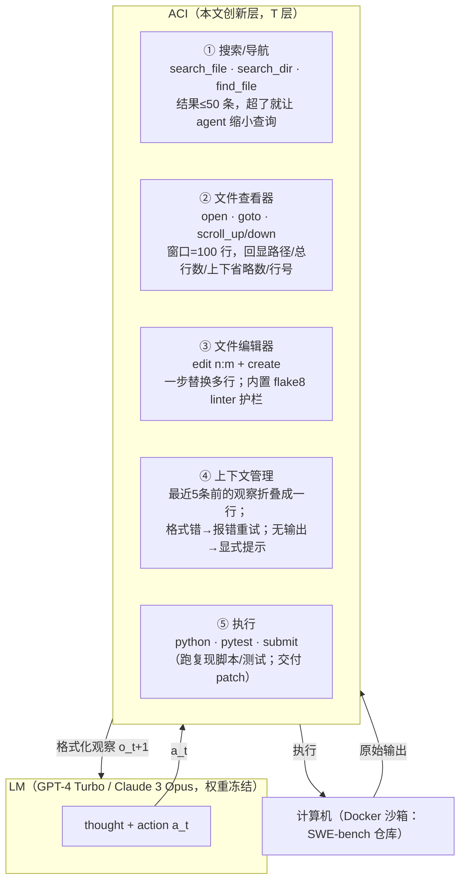

# SWE-agent：Agent-Computer Interface（ACI）让 LM Agent 会做软件工程

> **本篇定位**：这是 agent-harness 库 **C 组（工具/接口，T 层）的 canon**。它回答一个今天看起来"理所当然"、但 2024 年还需要被论证的命题——**"给 agent 用什么工具、工具吐回来的东西长什么样，本身就是一项架构决策，其影响力可与换模型比肩"**。它把这层抽象命名为 **ACI（Agent-Computer Interface，智能体–计算机接口）**，并用 SWE-bench 上的硬数字证明：**同一个 GPT-4 Turbo，套裸 Linux shell 只能解 ~3.8%（RAG/Shell-only 一侧），套上专为 LM 设计的 ACI 就能解 12.47%**。
>
> 读它的正确姿势：把它和本库标杆 **[Harness-Bench（2605.27922）](2605.27922-harness-bench-measuring-harness-effects.md)** 对照——Harness-Bench 在 2026 年"把 harness 设成被测变量、量出 23.8 分摆动"，而 SWE-agent 在 2024 年就"把 harness 的**一个子层（工具接口）**单独拎出来做消融、量出 ~10 分摆动"。**ACI 是『harness 决定能力』这一全库命题最早的一块铁证。**

---

## §1　TL;DR（一页讲清这篇在干嘛）

> 主讲提示：开场先抛全库命题 `Agent = Model + Harness`，然后说这篇是"harness 里最贴近模型的那一层——工具接口——的奠基之作"。强调"接口 = 架构决策"这句反直觉的口号。

**一句话**：LM agent 要在电脑上干活（改代码、跑测试），它和电脑之间需要一层**接口**。人类用的是 IDE（VSCode/PyCharm）；过去大家默认让 agent 直接用**人类的接口**——Linux shell。本文说：**这是错配**。LM 和人的能力/局限不同（没有视觉、上下文有固定成本、容易被冗长输出淹没），应当为 LM **专门设计**一套接口——作者称之为 **ACI（Agent-Computer Interface）**。他们据此造了 **SWE-agent**：一小组为 LM 定制的命令（`open`/`goto`/`scroll` 看文件、`search_file`/`search_dir`/`find_file` 搜索、带 linter 的 `edit` 编辑、`python`/`pytest` 跑测试、`submit` 交付），并证明这套接口把下游性能大幅拉高。

**三条带走的结论**：

1. **接口是架构决策（核心命题）**：把裸 shell 换成 SWE-agent 的 ACI，GPT-4 Turbo 在 SWE-bench Lite 上多解 **10.7 个百分点**（消融基线对比，§4/§5.1）；在 SWE-bench 全测试集上达 **12.47% pass@1（286/2294）**，远超此前非交互式 RAG 系统的 **3.8%** SOTA（§1/Table 1）。**模型权重一个字节没改。**
2. **四条 ACI 设计原则**（§2）：① 动作要**简单易懂**（少选项、短文档）；② 动作要**紧凑高效**（高阶操作一步到位，别逼 agent 拼多步）；③ 环境反馈要**信息足但简洁**；④ 用**护栏（guardrails）**阻断错误传播、加速恢复（如 `edit` 内置 linter，出语法错就拒绝并反馈）。每一条都有消融支撑（Table 3）。
3. **可迁移、可移植**：ACI 与具体模型解耦——同一套接口换成 Claude 3 Opus 仍解 10.46%（Table 1）；在 HumanEvalFix 上 pass@1 达 **87.7/89.7/87.9%（Py/JS/Java）**，均为当时该基准 SOTA（Table 2）。

- **属于 harness 的哪一层（Θ1）**：本篇主打 **T（Tools）层** —— 它研究的正是"工具集 + 工具的输入/输出格式 + 工具反馈"。但它对其它层有强依赖与外溢：`edit` 的 linter 护栏属 **V（Validation）**、"折叠旧观察 / 只留最近 5 条"属 **C（Context）**、ReAct 式 thought→action 循环属 **L（Loop）**、错误消息模板属 **O（Observability）**。作者自己就说 ACI 统一了"工具使用 / 提示技巧 / 代码执行反馈"这几条以前被独立研究的线（§1 末）。
- **回扣全库论点（Θ2）**：这篇是 `Agent = Model + Harness` 在 **2024 年**的实证先声。它把"换脚手架分数大变"这件事，用一组**受控消融**钉死在**工具接口**这一个变量上——这正是本库标杆 Harness-Bench 的 **ToolUse 分项**在两年后要系统化度量的东西。
- **够权威够奠基（Θ4）**：**NeurIPS 2024**，普林斯顿（SWE-bench 原班人马）。它**定义并命名了 ACI 这个概念**，是后续 OpenHands、Agentless、Moatless、SWE-bench 榜单几乎所有 agent 的共同词汇与设计范式来源。属**canon**。

---

## §2　问题与动机：为什么"接口设计"值得当成一篇论文来做

> 主讲提示：这页用 Why 三连的"问题层"。核心画面——把原始 shell 直接丢给 GPT-4，它会怎样翻车。让听众先"疼"，才理解 ACI 为什么必要。

**Why（问题层）——不解决会卡住什么？**
LM agent 已被证明能在**有执行反馈**的代码生成上奏效（§1，引 Reflexion [39]）。但把它推到**软件工程（SE）**这种复杂任务——在真实仓库里定位 bug、跨文件改代码、跑测试验证——就没人趟过（"remains unexplored"，§1）。一个朴素的起点：**让 agent 直接操作 Linux shell**（InterCode [59] 那种设定）。作者实测发现，这条路会系统性翻车（§1 原文）：

- **不能可靠地取动作**：LM 在裸 shell 里"struggle to reliably take actions"。
- **没有好的小范围编辑命令**：想改文件里一小段，shell 里只能 `sed`（要精确算行号、拼转义）或整文件重写（`cat >`），既笨重又易错。
- **无效编辑没有反馈**：agent 做了个错误编辑，shell **不告诉它错了**（silent failure），错误就此累积。

**为什么人类的接口不适合 agent（这是全篇的思想内核）**：作者借**人机交互（HCI）**的视角（§2，引 Carroll [2]、Cooper [7]）指出——**人和 LM 是两类不同的"用户"**，能力与局限不同，所以接口设计准则也该不同：

| 维度 | 人类用户 | LM agent | 对接口的启示 |
|---|---|---|---|
| 视觉理解 | 能看 GUI、语法高亮、图标 | **看不懂**富视觉信号（当代 LM） | 把语法检查、导航等能力**以文本形式**重新提供给 agent |
| 冗余信息 | 能灵活忽略无关内容 | **所有内容都有固定的内存/算力成本**，且"lost in the middle"会掉性能（§2 引 [27]） | 反馈必须**精简**，主动裁掉无关输出 |
| 状态记忆 | 记得刚才 cd 到哪、开了哪个文件 | 无状态，需接口**替它维护并回显**状态 | 接口要有状态、要在输出里回显当前文件/行号/工作目录 |

> **读出什么**：这篇的动机不是"造一个更强的模型"，而是"**给 LM agent 补一副合脚的鞋**"。这正是 T 层作为架构护城河的意义——**同一个大脑，换一副手脚，能力天差地别**。这也是它和本库 [Harness-Bench](2605.27922-harness-bench-measuring-harness-effects.md) 隔两年遥相呼应的地方：后者把这句话升级为"配置级而非模型级报告能力"。

---

## §2.5　把裸 shell 丢给 agent，到底怎么翻车（本篇 Why 三连的"设计层"总纲）

> 主讲提示：这页是全篇 Why 的地基——把"为什么不能直接用 shell、为什么要设计约束性 ACI"三条痛点讲到肉。每条痛点对应一条 ACI 设计（§4/§5）。讲完这页，后面所有设计都变成"对症下药"。

这是 Θ 规范点名要求的那条核心 Why 三连——**"直接把原始 shell 丢给 agent → 输出太长 / 无引导 / 易出错；设计约束性 ACI → 引导 + 反馈 + 防错。"** 我把它拆成三组"痛点 → 对症设计"（证据全在 §A.1）：

**痛点 A：输出太长（context flooding）。**
> **Why（设计层）**：朴素做法用 `cat`/`printf` 看文件、用 `grep`/`find` 搜。→ `cat` 一个 3000 行的文件直接把上下文塞爆，而其中 99% 与当前 issue 无关（§A.1 原文："easily flood a language agent's context window"）；`grep`/`find` 又高度可配置、输出格式不稳、动辄几十上百行无关匹配。**对症设计**：文件查看器只给 **100 行窗口**（§5②）、搜索结果**封顶 50 条**且超了就提示缩小查询（§5①）。→ 把"看/搜"的输出压到 agent 能消化的量级。**消融印证**：整文件 12.7% vs 100 行 18.0%（Table 3）——**给太多，真的更差。**

**痛点 B：无引导 + 需要算术（no grounding, arithmetic burden）。**
> **Why（设计层）**：朴素做法用 `sed`/`head`/`tail` 做定位与编辑。→ 这些命令**无状态**：想"往下翻一屏"，agent 得**自己重算** start/end 行号、重新拼一条几乎一样的长命令（§A.1 原文："recalculate parameters… reflect these updates correctly in the subsequent generation"）；想插一行代码，得精确指定字符级位置 + 处理缩进/转义。**这些算术恰恰是 LM 最不擅长的。** **对症设计**：查看器命令**互补且基于同一状态输出**——`scroll_down` 直接在当前窗口基础上翻，不用重算；`edit n:m` 用行号范围替换，免去字符级算术（§5②③）。→ 把"接口算术"从 agent 的推理预算里拿掉。

**痛点 C：易出错且静默（error-prone & silent）。**
> **Why（设计层）**：朴素做法让 agent 用 `sed`/重写自由编辑，出错也不拦。→ (1) 多行编辑在 shell 里得拆成多条精细 `sed`，任一条参数错就悄悄改坏文件；(2) 编辑是"静默过程"——shell **不回显**改后内容，agent 得再 `cat` 一次才知道改成什么样，既费轮数又常"对着想象中的文件"继续错（§A.1、§5.1）；(3) 语法错一旦落盘就**级联**。**对症设计**：`edit` 三合一——一步多行替换 + 编辑后**自动回显**改后片段（免二次确认）+ **linter 护栏**（语法错就拒绝落盘并反馈前后片段，§5③④）。→ 把"编辑"从"盲操作"变成"有即时反馈、有防错网"的操作。

**一张对照表收口**：

| 痛点（裸 shell） | 症状 | 对症 ACI 设计 | 消融证据 |
|---|---|---|---|
| A 输出太长 | `cat`/`grep` 淹没上下文 | 100 行窗口 + 搜索封顶 50 条 | 整文件 12.7% vs 100 行 18.0% |
| B 无引导/要算术 | `sed`/`tail` 无状态、逼 agent 算行号 | 有状态的 `scroll`/`goto` + `edit n:m` 行号替换 | 去 `edit` ↓7.7；Iterative 搜索 12.0<无搜索 15.7 |
| C 易错且静默 | 编辑无反馈、语法错级联 | `edit` 自动回显 + linter 护栏 | 去 linter ↓3.0 |

> **读出什么**：ACI 的每一个设计都不是凭空的"功能堆料"，而是**精确对准裸 shell 的一个具体失效模式**。这就是"约束性接口"的哲学——**不是给 agent 更多自由，而是给它更少但更对的动作**（fewer but righter actions）。这条哲学，后面会直接照进我们自己的工具设计（见 Inspires-Us）。

---

## §3　核心 intention 与形式化：ACI 到底是什么

> 主讲提示：这页把"ACI"这个新词的内涵讲清楚——它不是"agent"，也不是"环境"，而是夹在中间的那层**约定**。给出论文对 ACI 职责的三句话定义。

**一句话形式化**：一个 agent = **LM + ACI**（§1 原文："an agent composed of an LM and ACI"）。其中——

- **LM**：负责推理（在 SWE-agent 里，GPT-4 Turbo 或 Claude 3 Opus，权重冻结）。
- **ACI**：负责把"LM 的语言输出"翻译成"对计算机的动作"、再把"计算机的状态/反馈"翻译成"LM 能高效消化的文本"。**本文的全部创新都在 ACI 这一侧。**

**ACI 的三项职责**（§2 原文，逐条对照本库六层）：

1. **帮 agent 理解应用当前状态**（给定过去的改动）—— 对应 **O（可观测）**：如文件查看器回显"当前在第几行、上下省略了多少行"。
2. **管理历史，避免无关上下文堆积** —— 对应 **C（上下文）**：如把最近 5 条之前的观察各折叠成一行。
3. **提供模型能高效可靠使用的动作** —— 对应 **T（工具）**：如一步完成多行替换的 `edit`。

**符号约定（本报告后文沿用）**：
- $\mathcal{A}$：ACI 暴露给 LM 的**动作集**（命令集，见 §5 的 Table 4）；
- $o_t$：第 $t$ 步计算机回传、经 ACI 格式化后喂给 LM 的**观察**（文本）；
- $a_t$：LM 在第 $t$ 步产出的**动作**（一条命令 + 一段 thought）；
- $\text{doc}(a)$：ACI 提供给 LM 的、关于动作 $a$ 的**文档**（用途 + 参数说明，注入 system prompt）。

一次交互就是 ReAct [62] 循环：$\text{LM}$ 读 $o_{t}$ 与历史 → 产出 thought + $a_{t}$ → ACI 执行 → 返回 $o_{t+1}$。**ACI 的设计 = 选定 $\mathcal{A}$、设计每个 $o$ 的格式、写好每个 $\text{doc}(a)$、并决定历史怎么裁剪。**

> **读出什么**：这个抽象的**迁移价值**极高——它把"agent 能力"从"模型有多强"里**分离**出一个可独立优化的维度。这正是本库反复讲的 `Agent = Model + Harness` 在**工具层**的精确落点：$\mathcal{A}$、$o$ 的格式、$\text{doc}$ 就是 harness 的"手"。

---

## §3.5　符号与术语表（后文统一沿用）

> 主讲提示：这页是"读表前先对齐记号"。SWE-agent 全篇几乎没有重数学，但把"ACI 的可调维度"记号化，能让后面 Table 3 的消融一目了然——每个记号就是一个"可以拧的旋钮"。

| 记号 / 术语 | 英文 | 定义 | 在本文对应什么 |
|---|---|---|---|
| ACI | Agent-Computer Interface | 夹在 LM 与计算机之间的接口层：定义动作集、观察格式、文档、历史裁剪 | 本文全部创新所在 |
| $\mathcal{A}$ | action space | ACI 暴露给 LM 的命令集 | Table 4 的那 10 条命令（+ 回落的 bash） |
| $a_t$ | action | 第 $t$ 步 LM 产出的 (thought, command) 对 | ReAct 的 "act" |
| $o_t$ | observation | 第 $t$ 步计算机回传、经 ACI 格式化后的文本 | 文件查看器窗口 / 搜索结果 / 报错 |
| $\text{doc}(a)$ | documentation | 注入 system prompt 的命令用途 + 参数说明 | 图 27 的 `{documentation}` 字段 |
| guardrail | guardrail | 阻断错误传播的机制 | `edit` 内置 linter；搜索封顶 50 条 |
| collapse | collapse | 把旧观察压成一行以省上下文 | 折叠"最近 5 条之前"的观察 |
| pass@1 / %Resolved | resolve rate | patch 应用后隐藏测试全绿的实例占比 | 主指标 |
| failed edit | — | 触发 linter 报错、被拒绝落盘的编辑 | §9 的核心失败源 |
| recovery | recovery | 若干次失败编辑后紧跟一次成功编辑 | 图 20 的恢复概率 |

**一个心智模型**：把 ACI 想成一台"翻译机"，两个方向都要翻——**入向**把 LM 的自然语言命令 $a_t$ 翻成对计算机的真实操作；**出向**把计算机的原始状态翻成 LM 能低成本消化的 $o_t$。SWE-agent 的四条原则（§4）本质是在规定**这两向翻译的质量标准**：入向要"简单+紧凑"（原则①②，降低 LM 表达动作的负担），出向要"信息足但简洁"（原则③，降低 LM 消化观察的负担），再加一层"翻译错了要拦下并纠正"的护栏（原则④）。

> **读出什么**：记住这个"双向翻译机"隐喻，后面每个消融都能秒懂——去掉 `edit`（入向翻译退化）掉最多分；`Iterative` 搜索（出向翻译啰嗦）比没有还差；文件窗口 100 行（出向信息量甜点区）最优。**ACI 的好坏 = 双向翻译的损耗有多低。**

---

## §4　四条 ACI 设计原则（§2 末，全篇的"设计公理"）

> 主讲提示：这四条是本篇的灵魂。每条都配一个"朴素做法会怎样翻车 → 本设计怎么救"的对照。这也是 Θ 规范要求的 Why 三连"设计层"最集中的一页。

作者用两种手段得出这四条原则（§2）：(1) **人工检查** agent 行为、找出难点、提改进；(2) 在开发集上**网格搜索**最优 ACI 配置。四条原则如下——

**① 动作要简单、易被 agent 理解（Simple & easy to understand）**
> **Why（设计层）**：朴素做法是把 bash 全套丢给 agent（每条命令几十个 flag、长 man page）。→ 文档太长、选项太多，agent 要么用错、要么要靠大量示例/微调才会用。本文改用**少选项、短文档**的自定义命令，降低对 demonstration/fine-tuning 的依赖（§2 原则 1；对应 §5 的 Table 4，每条命令的 doc 只有一两句）。

**② 动作要紧凑、高效（Compact & efficient）**
> **Why（设计层）**：朴素做法是把"改一段代码"拆成"读文件→算行号→sed 拼命令→再读确认"好几个原子步。→ 一个高阶操作要跨多个 turn 才完成，既慢又给每一步引入出错机会。本文把"文件导航、编辑"等重要操作**合并成尽量少的动作**（如 `edit n:m` 一步替换多行），让每一步都朝目标推进有意义的一步。**消融证据**：`edit` 命令相比无 `edit`（只能用 shell）在 SWE-bench Lite 上 18.0% vs **10.3%（↓7.7）**（Table 3，§5.1）。

**③ 环境反馈要信息足、但简洁（Informative but concise）**
> **Why（设计层）**：朴素做法是把命令 stdout 原样回灌。→ 要么冗长淹没上下文（`cat` 整文件），要么没信息（无效编辑静默无输出）。本文让反馈"提供关于当前状态与最近动作效果的实质信息、但不带冗余"——如编辑后**自动回显**改动后的文件片段（图 3a/3b、Table 3），无输出时也**显式**提示"命令成功执行但无输出"（§3）。**消融证据**：文件查看器窗口太小（30 行）或太大（整文件）都掉分——30 行 14.3%（↓3.7）、整文件 12.7%（↓5.3）、100 行 18.0%（Table 3）。**信息量有个甜点区。**

**④ 护栏阻断错误传播、加速恢复（Guardrails mitigate error propagation）**
> **Why（设计层）**：朴素做法是"agent 爱怎么编辑就怎么编辑"。→ LM 会引入语法错（缩进错、多括号），一旦写进文件就**级联**：后续编辑基于坏文件，越滚越乱。本文在 `edit` 里内置**代码 linter**（`flake8`）：编辑若引入语法错，**整条编辑被丢弃、不落盘**，并把错误 + 改动前后片段反馈给 agent 让它重试（§3、§A.1、图 6、图 11）。**消融证据**：去掉 linting，SWE-bench Lite 从 18.0% 掉到 **15.0%（↓3.0）**（Table 3，§5.1）。

> **读出什么（本页最该记住的一句）**：这四条原则**不是软件工程专属**——它们是"为 LM 这类用户设计任何工具接口"的通则。SWE-agent 只是把它们在 SE 上做了实证。**这也是为什么它是 canon**：后来所有 agent 工具设计（包括我们自己的 Read/Edit/Bash）都能拿这四条来审。

---

## §5　方法：SWE-agent 的五大 ACI 组件

> 主讲提示：这页是"产品拆解"。对着 Table 4 的命令清单，讲清五个组件各解决 §2 的哪条痛点。可用一张架构图串起来。

SWE-agent 的 ACI 由五部分组成（§3 + §A.1），并允许在需要时**回落到普通 Linux 命令**（`grep`/`find`/`cd`/`ls` 等仍可用，只是不鼓励）。

**① 搜索与导航（Search & navigation）**——`find_file <name>`（按文件名找）、`search_file <term>`（在某文件里找串）、`search_dir <term>`（在某目录所有文件里找串）。护栏：**每次搜索最多回 50 条结果**，超了就不报结果、改而建议 agent"写更具体的查询"（§3、§A.1）。动机：裸 shell 里 `grep`/`find` 要么淹没上下文、要么输出格式不稳（§5.1）。

**② 文件查看器（File viewer）**——`open <path> [line]` 打开文件，一次显示**至多 100 行**的窗口；`scroll_up`/`scroll_down` 移动窗口（各 ±100 行）；`goto <line>` 跳到某行。回显：**完整路径、文件总行数、当前窗口上/下省略了多少行、每行前缀行号**（图 3a、图 10）。动机：`cat` 淹没上下文；`head`/`tail` 不直观、无状态、"往下翻"要重算参数（§A.1）。

**③ 文件编辑器（File editor）**——`edit n:m <replacement> end_of_edit`：**一步**把第 $n$–$m$ 行（含）替换为新文本（图 3b）；`create <filename>` 新建并打开。两大关键设计：(a) 编辑后**文件查看器自动回显**改动后的内容，无需额外命令确认（对应原则③）；(b) **内置 linter 护栏**——Python 文件编辑后跑 `flake8 --isolated --select=F821,F822,F831,E111,E112,E113,E999,E902`，**只要引入这些语法错就丢弃该编辑、反馈错误 + 改动前后片段让 agent 重试**（§A.1、图 11）。作者坦诚一个**副作用**：护栏会**强制某些编辑必须分特定顺序做**（如要删一个函数参数，可能得先删函数体里的引用再删签名，否则中间态过不了 linter），这在灵活性与防错间是个取舍（§A.1）。

**④ 上下文管理（Context management）**——三招保持历史精简（§3、§A.2）：(a) 每步指示 agent 同时产出 **thought + action**；格式错（malformed）就回一个错误响应让它重试，直到合法（图 26 的 Format Error 分支）；(b) 命令**无输出**时，不留空，而是显式回"命令成功执行但无输出"以增清晰度；(c) **把最近 5 条之前的观察各折叠成一行**（collapse），保住"计划 + 动作历史"的骨架，同时砍掉过期的文件内容，腾出更多交互轮数。

**⑤ 执行与交付**——agent 可用 `python`/`pytest` 跑复现脚本或测试，用 `submit` 从所有历史编辑生成 patch 并结束（Table 4）。注意：Docker 环境**不支持交互式会话**（`vim`/`python` REPL），system prompt 里明确告知 agent 别调（图 27）。

**Table 4（论文原表，命令清单摘要）**：

| 类别 | 命令 | 文档（喂给 LM 的，已精简） |
|---|---|---|
| 文件查看 | `open <path> [line]` | 在编辑器打开文件；给 line 则窗口移到含该行 |
| | `goto <line>` | 窗口移到显示 line |
| | `scroll_down` / `scroll_up` | 窗口下移/上移 100 行 |
| 搜索 | `search_file <term> [file]` | 在文件里搜 term（不给 file 则搜当前打开文件） |
| | `search_dir <term> [dir]` | 在目录所有文件里搜 term |
| | `find_file <name> [dir]` | 按文件名找文件 |
| 编辑 | `edit n:m <replacement> end_of_edit` | 替换第 n–m 行为 replacement；**Python 文件编辑后查语法错，有错则不执行** |
| | `create <filename>` | 新建并打开文件 |
| 任务 | `submit` | 生成并提交 patch，关闭 shell |

> **读出什么**：五个组件全都在实践 §4 的四条原则。特别注意——**这套 ACI 是"配置文件驱动"的**（§A.3、图 12）：prompt 模板、命令文件（.py/.sh）、控制流、环境变量都写在一个 `.yaml` 里，换命令/换输出格式/换历史策略只需改配置。这让 ACI 成为一个**可实验、可扩展**的对象——这正是它能被后续系统（OpenHands 等）拿去改造的工程基础。

---

## §5.5　ACI 是一个"可编程对象"：配置文件与提示模板

> 主讲提示：这页揭开引擎盖。前面讲"ACI 是什么"，这里讲"ACI 在工程上长什么样"——它不是硬编码，而是一份 `.yaml` + 一组命令函数 + 一套 prompt 模板。这解释了两件事：为什么 SWE-agent 能做那么多消融（改配置即可），以及为什么它能成为 canon（别人能在它的抽象上二次开发）。

**为什么强调"配置驱动"（Why·设计层）**：
> **Why（设计层）**：朴素做法是把工具集、输出格式、历史策略**硬编码进 agent 代码**。→ 每做一个消融（换搜索策略、改窗口大小、换历史裁剪）都要改源码、易引入不一致。本文把 ACI 的四类可配置成分全部外置到一个 `.yaml`（图 12），于是"设计一个新 ACI"退化成"改配置文件"——**这正是 §8 那张消融表能存在的工程前提**（作者 §A.3 明说"迭代精修配置文件"是他们拿到好性能的方法）。

**ACI 的四类可配置成分**（§A.3、图 12）：

| 成分 | 英文 | 作用 | 对应本库层 |
|---|---|---|---|
| 提示模板 | prompt templates | 告诉 LM 任务设定、命令清单、把状态值填进观察 | O / C |
| 命令文件 | command files | 一组 `.py`/`.sh`，每个是一条命令的实现 + 文档 | **T** |
| 控制流 | control flow (`history_processor`, `parse_function`) | 如何解析模型响应、如何裁剪历史 | L / C |
| 环境变量 | env variables | 与命令、shell 交互的初值（如 `CURRENT_FILE`, `WINDOW_SIZE`） | E / O |

**命令是有状态的**（§A.3 关键细节）：`open`/`goto`/`scroll_up`/`scroll_down`/`edit` 这几条命令**共享**一组全局环境变量（`CURRENT_FILE`, `CURRENT_LINE`, `WINDOW_SIZE`, `START_INDEX`, `END_INDEX`…）。正因如此，`scroll_down` 才知道"当前在哪、往下翻到哪"，`edit` 才知道"改的是哪个文件"——**这就是 §2 说的"接口要替 agent 维护状态"的具体实现**。加一条新命令的骨架只需 `signature` + `docstring` 两个必填项（图 13），文档会在运行时被编译进 system prompt 的 `{documentation}` 字段。

**提示模板：接口的"说明书"也是接口的一部分**（§C、图 26/27）。SWE-agent 的一个反复出现的经验是——**光给命令还不够，得在 prompt 里手把手教 agent 避坑**。system prompt（图 27）里塞进了几条关键"叮嘱"：
- **强制单命令**："每次只在 command 段放**一条**命令，然后等 shell 回应"——防止 agent 一口气发多条命令打乱交互循环。
- **强调缩进**："EDIT 命令要求正确缩进……代码缩进错会运行失败"——因为作者观察到 agent 常在 `edit` 时缩进出错（对应原则④的护栏动机）。
- **禁交互式命令**："环境不支持 `vim`/`python` 交互式会话，别调"——因为 Docker 沙箱里这些会挂起。

**Demonstration（示范轨迹）也是 ACI 的一部分**（§C、图 28、Table 3）。SWE-agent 默认在 system prompt 后放**一条完整的成功轨迹**当示范；`put_demos_in_history` 开关控制它是"作为独立消息注入历史"还是"整段包成一条带自然语言说明的消息"。**消融**：去掉 demo，SWE-agent（Lite）从 18.0 掉到 16.3（↓1.7，Table 3）；而 **Shell-only 去 demo 从 11.0 暴跌到 7.33**（Table 1）——**接口越差，越依赖示范来教 agent 怎么用。** 这反过来印证：好 ACI 的一个隐性好处是"自解释"——命令越简单直观，需要的示范越少（呼应原则①）。

**Prompt 工作流的三分支控制循环**（§C、图 26）——每一轮 LM 生成后，ACI 按响应类型走三条分支：
1. **正常**（有 thought + 合法 command + 有输出）→ `next_step_template`：回显命令输出 + 提示下一步。
2. **命令无输出** → `next_step_no_output_template`：显式回"命令成功但无输出"（原则③，别留空让 agent 猜）。
3. **格式错**（malformed，解析不出 thought/command）→ `format_error_template`：回错误、要求重发；**连续 2+ 次格式错则终止 episode**（Early Exit）。

> **读出什么（直通 Inspires-Us）**：这一页其实是在说——**ACI = 命令集 + 命令的状态 + 命令的文档 + 观察模板 + 历史策略 + 示范**，是个**六位一体的可编程对象**。我们自己的 harness（Claude Code）恰好每一维都有对应物：工具集（Read/Edit/Bash…）、工具的隐式状态（如"必须先 Read 才能 Edit"）、工具描述（system prompt 里的 tool schema）、结果回显格式、上下文压缩策略、以及 few-shot/CLAUDE.md 里的示范。**SWE-agent 把这六维讲清楚了，等于给了我们一张审自己 harness 的坐标图。**

---

## §6　实验设置：数据集 / 基线 / 指标 / 成本

> 主讲提示：把 setting/metrics/params 一次讲全。重点讲清两条基线（RAG、Shell-only）分别代表什么，以及 pass@1 与 \$成本 的定义。

**数据集**（§4、Table 12）：
- **SWE-bench**（主）：来自 12 个流行 Python 包的真实 GitHub issue，**2294** 个任务（Test 分区）。每个任务给一个仓库快照 + issue 描述，agent 要产出能通过隐藏单测的 patch。
- **SWE-bench Lite**：SWE-bench 的规范子集，**300** 个自足功能性 bug 修复实例（消融与分析都在此跑）。
- **HumanEvalFix**（辅）：短代码调试基准，164 题/语言（Py/JS/Java…），测"基本代码编辑"能力（§B.7）。

**模型**（§4）：主力 **GPT-4 Turbo（gpt-4-1106-preview）** 与 **Claude 3 Opus（claude-3-opus-20240229）**，均 128k/200k 上下文。试过 Llama 3、DeepSeek Coder，但 Llama 3 的 8k 上下文太小、性能不佳，未纳入主结果。

**基线**（§4，两条，代表两种"没有好 ACI"的世界）：
1. **RAG（非交互）**：BM25 用 issue 当查询检索最相关文件，把文件塞给模型，**一次性**让它直接产出 patch（来自 SWE-bench 原论文 [20]）。—— 代表"**根本不给 agent 执行/交互**"。
2. **Shell-only（交互，但用裸接口）**：改编自 InterCode [59]，让 LM **直接与 Linux shell 进程交互**解 issue，最终按代码库终态自动打分。—— 代表"**给了交互，但用人类的接口**"。这是 ACI 消融最关键的对照。

**指标定义式**（§4）：
- 主指标 **% Resolved（= pass@1）**：给定生成的 patch 应用到仓库后**全部隐藏测试通过**的实例占比。
$$\text{pass@1} \;=\; \frac{\#\{\text{patch 应用后全部测试通过的实例}\}}{\#\{\text{全部实例}\}}$$
读出什么：这是一个**极严的端到端**指标——不是"改对了几行"，而是"整个 patch 让这个真实 bug 的官方测试全绿"。中间过程再漂亮，测试不过就是 0。
- **\$ Avg. Cost**：在**成功解决的实例**上平均的 API 推理花费（美元）。
- 预算：**每实例 \$4 上限**；超预算则自动把已有编辑提交（§4）。
- **pass@k**（§B.5）：跑 $k$ 次、只要有一次解出即算成功的占比，用来看方差。

> **读出什么**：两条基线的设计非常见功力——RAG 卡掉"交互"这个变量，Shell-only 卡掉"接口质量"这个变量。**SWE-agent vs Shell-only 的差 = 纯粹的"ACI 增益"**（因为两者都交互、都在同一环境、都用同一模型，只有接口不同）。这就是把 `Agent = Model + Harness` 做成受控实验的手法。

---

## §7　主结果：接口一换，性能翻几倍

> 主讲提示：这是全场最该停留的一页。先报三个数字的阶梯（RAG → Shell-only → SWE-agent），把"10.7 个点全来自接口"这句话砸实。

**Table 1（主结果，% Resolved / \$ Avg. Cost）**：

| 系统 | 模型 | SWE-bench 全集 %Resolved | \$Cost | SWE-bench Lite %Resolved | \$Cost |
|---|---|---:|---:|---:|---:|
| **RAG**（非交互） | GPT-4 Turbo | 1.31 | 0.13 | 2.67 | 0.13 |
| | Claude 3 Opus | 3.79 | 0.25 | 4.33 | 0.25 |
| **Shell-only**（裸 shell 交互） | GPT-4 Turbo | – | – | 11.00 | 1.46 |
| | GPT-4 Turbo（**去掉 demo**） | – | – | 7.33 | 0.79 |
| **SWE-agent**（本文 ACI） | GPT-4 Turbo | **12.47** | 1.59 | **18.00** | 1.67 |
| | Claude 3 Opus | 10.46 | 2.59 | 13.00 | 2.18 |

**读出三级阶梯（Lite，GPT-4 Turbo，把变量一个个加进去）**：
- **RAG 2.67%**：不给交互、不给执行 → 基本不会做。
- **Shell-only 11.00%**：给了交互 + 执行、但用裸 shell → 跳到 11%。**"交互"本身值 ~8 个点。**
- **SWE-agent 18.00%**：把裸 shell 换成定制 ACI → 再跳到 18%。**"好接口"本身又值 ~7 个点（论文 §5 归纳为相对 Shell-only 的 +10.7pt / +64% 相对增益）。**

**Why（结果层）——为什么接口能值这么多分？**
因为在裸 shell 里，模型的推理算力被大量消耗在**跟接口搏斗**上：算 `sed` 的行号、解析冗长的 `grep` 输出、在无反馈下猜自己编辑成没成。ACI 把这些"接口税"消掉——`edit n:m` 免去行号算术、搜索结果封顶 50 条免去淹没、编辑后自动回显免去"我改成功了吗"的盲猜、linter 护栏免去语法错级联。**省下来的推理预算，才能真正花在"这个 bug 怎么修"上。** 这就是"接口是架构决策"的机制解释。

**HumanEvalFix（Table 2，pass@1）**：SWE-agent w/ GPT-4 Turbo 达 **Python 87.7 / JS 89.7 / Java 87.9%**，三门语言均超此前最好的 WaveCoder-DS-6.7B（57.9/52.4/57.3）等专门微调模型——说明**给通用模型配好 ACI，能在"代码编辑"子任务上打败专门训练的模型**（§5、§B.7）。为什么选 HumanEvalFix？因为它测的是**改 bug**而非**从零写**，作者引证（§B.7）：GPT-4 在 HumanEval（写代码）上 78.3%，但在 HumanEvalFix（改代码）上只有 47.8%——**改代码本就比写代码难**，而"识别并修 bug"正是 SE 的核心子任务。SWE-agent 把这 47.8% 抬到 87.7%，且 **大多数题在前 10 轮内解出**（图 25）——注意此设定**不需要定位/导航**（单文件、给定 buggy 片段），所以增益主要来自 **`edit` 编辑接口 + 语言特定示范**，是对"编辑组件价值"的一次干净验证。

**成本**（§5）：SWE-agent 比 RAG **贵 8–13 倍**（多轮交互），但 %Resolved 提升 6.7 倍；相对 Shell-only 的 64% 相对增益，代价是可控的（Lite 上 \$1.67 vs \$1.46）。

> **读出什么（Θ2 实锤）**：这张表就是 `Agent = Model + Harness` 在 **2024 年**的样子。把它和本库其它"换脚手架分数大变"的轶事并排——CORE-Agent 42%→78%、Cursor 46%→80%、Vercel 砍工具 80%→100%、[Harness-Bench](2605.27922-harness-bench-measuring-harness-effects.md) 的 NanoBot 76.2 vs OpenClaw 52.4（23.8 分）——SWE-agent 是这条证据链上**时间最早、且第一个把变量收窄到"工具接口"**的一环。它证明的不是"某个 harness 更好"，而是"**harness 里最贴模型的那层（工具）单独就能撬动约 10 分**"。

---

## §7.5　更多结果切片：定位、方差、超参、按仓库/年份

> 主讲提示：主结果之外，作者给了一堆"marginalized"切片。这页挑四个最有信息量的——定位 F1、pass@k 方差、超参甜点、以及性能怎么随仓库/年份分布。它们共同回答一个追问："18% 这个数，稳不稳、从哪来、怎么来的？"

**① 定位能力：交互式 agent 比 BM25 会找文件**（§B.9）。作者用 F1 衡量"agent 编辑的文件集 vs 官方 patch 编辑的文件集"的吻合度——
$$\text{F1}_{\text{loc}} = \frac{2\,PR}{P+R},\quad P=\frac{|\text{预测编辑文件}\cap\text{gold 文件}|}{|\text{预测编辑文件}|},\ R=\frac{|\text{预测编辑文件}\cap\text{gold 文件}|}{|\text{gold 文件}|}$$
符号：$P$=精确率（改的文件里有多少是该改的）、$R$=召回率（该改的文件里有多少被改到）。结果：**SWE-agent w/ GPT-4 Turbo 达 59.05%，BM25 w/ Claude 3 Opus 仅 45.47%**。读出什么：**交互式地"边看边找"比"一次性检索"更能定位对文件**——这是 ACI 的搜索/导航组件（§5①②）的直接功劳，也解释了为什么下游 %Resolved 能高。

**② 方差与 pass@k**（§B.5、Table 10）。跑 6 次 SWE-agent w/ GPT-4（Lite）：单次 %Resolved 在 **17.33–18.67** 间波动，均值 **17.94（标准差仅 0.49）**——**平均性能方差很低**。但 pass@k 随 $k$ 显著上升：pass@1=17.94 → pass@3=27.35 → pass@6=32.67。读出什么：**"平均分稳、但单实例解不解会来回跳"**——同一个 bug，这次解出、下次可能失败。这既说明**还有大量'差一点就能解'的实例**（pass@6 比 pass@1 高近 15 点），也提醒**用 pass@1 会低估 agent 的真实上限**。

**③ 超参甜点**（§B.1、Table 5，dev 子集 37 例扫描）。GPT-4 Turbo 最优配置：**温度 0.0 + 窗口 100 + 历史"最近 5 条观察"= 15.1%**；对照——温度升到 0.2、窗口开到 200、或历史用 Full，都掉分（如 0.0/200/Full=9.2）。读出什么：**低温（要确定性）+ 中等窗口 + 折叠历史**，三者叠加才是甜点。这与 §8 Table 3 的"100 行甜点区""折叠不掉分"完全一致——**不是拍脑袋选的默认值，是扫出来的。**

**④ 按仓库 / 按年份**（§B.2、Table 6/7）。**按仓库**：SWE-agent 不仅整体高，还**解开了 RAG 完全解不动的仓库**——如 matplotlib（SWE-agent 13.04% vs RAG 0.00%）、sympy（10.39% vs 1.30%）。**按年份**（用 issue 的 `created_at`）：2023/2022/2021/2020/2020前的解决率没有单调趋势（如 GPT-4 分别 23.33/21.05/23.81/10.61/17.14%）——**说明 agent 不是靠"背下了训练集里见过的老 bug"作弊**（若是,越老的应越高），缓解了"测试污染"的担忧（§B.2 明说 success rate 与 issue 年龄不相关）。

**⑤ 一个 episode 怎么结束**（§B.9、Table 13）。四种收场：`submit`（主动交付）、Exit-Cost-Submit（超预算、自动提交已有编辑）、Exit-Cost-No-Submit（超预算且没编辑过，必不解）、Early-Exit（连续格式错，极罕见）。数据：GPT-4 全集里**以 `submit` 结束的实例 14.3% 被解，远高于以 exit-cost 结束的 3.1%**；且全集只有 **1 次** Early-Exit——说明**SWE-agent 的 thought/action 格式约束很有效，agent 极少把格式写崩**（呼应 §5.5 的三分支控制循环）。

> **读出什么（贯穿）**：这五个切片把"18%"从一个孤零零的数字，变成一个**有方差带、有甜点、有分布、抗污染、可解释收场**的立体结论。这正是 v1 规范要的"别只贴数、要解读"——也是本篇作为 canon 的严谨底色。

---

## §8　消融与分析：逐个拆开 ACI 的四个旋钮（Table 3）

> 主讲提示：这是判断力的高地。Table 3 把 ACI 拆成 Editor/Search/File-Viewer/Context 四个可调维度，每个都给出"改设计→掉多少分"。这页把 §4 的四条原则从"口号"变成"带 ↓ 数字的证据"。

**Table 3（SWE-bench Lite，GPT-4 Turbo；↓x 表示相对最优配置掉了 x 个点）**：

| 维度 | 配置 | %Resolved | 相对 |
|---|---|---:|---|
| **编辑（Editor）** | `edit` 动作（默认） | 18.0 | — |
| | `edit` + linting（默认含护栏） | 18.0 | — |
| | 去掉 linting（w/o linting） | 15.0 | ↓3.0 |
| | **无 `edit`（只用 shell 编辑）** | **10.3** | **↓7.7** |
| **搜索（Search）** | Summarized（默认，封顶+提示缩小查询） | 18.0 | — |
| | Iterative（逐条 next/prev 看结果） | 12.0 | ↓6.0 |
| | 无搜索（No search） | 15.7 | ↓2.3 |
| **文件查看器（File Viewer）** | 30 行窗口 | 14.3 | ↓3.7 |
| | 100 行窗口（默认） | 18.0 | — |
| | 整文件（Full） | 12.7 | ↓5.3 |
| **上下文（Context）** | 最近 5 条观察（默认，其余折叠） | 18.0 | — |
| | 全历史（Full history） | 18.0 | — |
| | 去掉 demonstration（w/o demo） | 16.3 | ↓1.7 |

**四个"读出什么"（逐维度）**：

- **编辑：`edit` 是最大功臣**。去掉 `edit`、只能用 shell 编辑（`sed`/重写）时暴跌到 10.3%（↓7.7）——**这一个组件几乎解释了 SWE-agent 相对 Shell-only 全部增益的大头**。机制：多行编辑在 shell 里要拆成多个精确 `sed`、还没反馈；`edit n:m` 一步搞定且自动回显（§5.1）。
- **搜索：`Iterative` 反而比"没有搜索"更差（12.0 < 15.7）**。这是全表最反直觉的一格。原因（§5.1、图 5）：Iterative 搜索一次显示一条匹配、agent 会**强迫症式地把每条 next 看完**，把成本/上下文预算烧光在翻结果上。**教训：一个设计糟糕的工具，比没有这个工具更糟。** Summarized（一次给汇总 + 提示"太多了请缩小查询"）才对（18.0）。
- **文件查看器：信息量有甜点区**。30 行太少（看不到上下文，14.3%）、整文件太多（淹没 + lost-in-the-middle，12.7%）、100 行刚好（18.0%）。**印证原则③"信息足但简洁"不是玄学，是有最优点的。**
- **上下文：折叠旧观察"不掉分"就是胜利**。"最近 5 条"与"全历史"同为 18.0——说明**把旧观察折叠掉几乎不损性能，却省了大量 token / 换来更多轮数**（§3）。demonstration 去掉掉 1.7 点，说明**一个示范轨迹**能帮 agent 学会正确用接口（对应 Shell-only 去 demo 从 11.0 掉到 7.33 的更大跌幅，§5）。

> **读出什么（方法论层面）**：Table 3 是**本库 T 层的教科书级消融**——它示范了"怎么把'接口设计'做成可控实验"。这也正是两年后 [Harness-Bench](2605.27922-harness-bench-measuring-harness-effects.md) 把 ToolUse 设为独立评分项、并把 harness 整体设成被测变量的**先声**。SWE-agent 消的是"一个 harness 内部的工具旋钮"，Harness-Bench 消的是"整个 harness 之间"，一脉相承。

---

## §9　行为分析：装上好接口后，agent 怎么解题

> 主讲提示：这页把 agent 的"解题套路"可视化。核心两句话——"先复现/定位，再 edit-then-execute 循环"；"成功得快、失败得慢"。这解释了为什么加预算也救不回失败的那些。

作者用 286 条 GPT-4 Turbo 成功轨迹（SWE-bench 全集）做了细致的行为学分析（§5.2、§B.3）：

**① 复现 / 定位是第一步**（图 7、图 8、Table 8）：几乎所有轨迹开头都是 `create`（写复现脚本）或 `find_file`/`search_dir`（定位）。最高频的**前三动作三元组**是 `create, edit, python`（出现 156 次，Table 8）——**新建一个文件、写复现代码、跑它**。

**② 之后是"edit-then-execute"循环**（图 7、图 17）：从第 5 轮起，最高频的两个动作稳定是 `edit` 和 `python`/`pytest`——改一版、跑一版看测试、再改。转移概率（图 21）也证实：`edit` 之后 51% 接 `edit`、33% 接 `python`；`python` 之后 47% 接 `edit`。

**③ 成功得快、失败得慢**（§5.2、Table 15、图 14/15）：成功实例中位耗时 **\$1.21 / 12 步**，失败实例中位 **\$2.52 / 21 步**；**93.0% 的成功实例在耗尽预算前就提交**了。作者据此判断：**单纯加大预算/token 上限，不太可能显著提性能**——失败不是"没跑够"，而是"初期思路错了、后期又救不回来"。

**④ 编辑仍是 agent 最难的动作**（§5.2、§B.3.3、图 19/20）：全集 2294 个实例里，**51.7%（1185 个）** 至少有一次**失败编辑**（触发 linter 报错）。恢复能力随失败累积而衰减，作者用两个术语精确刻画（§B.3.3）：**recovery** = 若干次失败编辑后**紧跟一次成功编辑**；**unsuccessful recovery** = 若干次失败编辑后紧跟一个**非编辑动作**（放弃了）。数据：
- **任一编辑最终成功的概率是 90.5%（n=0 失败时），一旦出现 1 次失败编辑就掉到 57.2%**——即 **42.8% 的概率"一次编辑失败后就再也没救回来"**（图 20）。
- 全集共 **810 次成功恢复 vs 555 次失败恢复**；关键差异在**成功恢复前平均只积累了 2.03 次失败编辑，而失败恢复前平均积累了 4.22 次**（§B.3.3）——**越早止损越可能救回，越拖越死**。
这直接量化了原则④护栏为什么重要（linter 让 agent 至少**知道**编辑坏了），也暴露了它的天花板（linter 不会**帮**agent 想对，于是有近半概率陷进去出不来）。

**⑤ 失败长什么样**（图 8、Table 9，248 条未解 Lite 轨迹用 GPT-4o 自动分类，与人工标注 87% 一致）：约 **52.0% 是"错误实现 / 过度特化实现"**（Incorrect / Overly-Specific Implementation）——即改是改了、但没真正解决问题或方案太窄；**23.4% 是"失败编辑恢复"**（Failed Edit Recovery，陷入编辑死循环）；其余为找不到相关文件/找不到编辑位置/复现失败/超预算/过早放弃等。

**⑥ patch 长什么样：agent 改得比人类"大"**（§B.6、Table 11）。作者统计生成 patch 的规模（行增/行删/hunk 数/文件数，取 90 分位内的中位/均值）——SWE-agent w/ GPT-4 的"All"类 patch 平均加 **16.58 行**，而官方 gold patch 只加 **11.67 行**；**成功解决的 patch（+5.7 行均值）明显小于全部 patch**。读出什么：(a) agent 倾向生成**更大的编辑**（多出的部分主要是复现脚本，§B.6）；(b) **改得越小越可能对**——"要跨多文件多 hunk 大改"的 issue 对 agent 仍最难（与 RAG 时代一致的结论）。这给"什么样的 SE 任务吃 ACI"补了一条：**小范围、单点修复最受益；大重构仍是硬骨头。**

> **读出什么**：这套行为学是一份现成的"agent 体检报告"。它告诉我们——**装了好接口后，剩下的瓶颈从"接口摩擦"转移到了"推理质量（52% 是想错了）"和"错误恢复（编辑死循环、越拖越死）"**。前者要更强的模型，后者要更好的护栏/循环设计。这正好把球传给了本库其它组：H 组的失败恢复、D 组的上下文/状态。**注意这个"瓶颈转移"本身就是 ACI 价值的证明**——如果接口没把"接口摩擦"消掉，我们根本看不到底下的"推理/恢复"瓶颈。

---

## §10　相关工作定位：它站在谁肩上、又给谁当了肩膀

> 主讲提示：一张表讲清 SWE-agent 在 2024 年的坐标——它把"工具使用 / prompting / 代码执行反馈"这三条以前各自独立的线，统一进 ACI 框架。

| 维度 | 代表工作 | SWE-agent 的不同 |
|---|---|---|
| SE 基准 | SWE-bench [20]、Defects4J [21] | 用 SWE-bench 当**任务**；但首次给它配**交互式 agent**而非非交互 RAG |
| 交互式代码执行 | InterCode [59]、Reflexion [39] | 环境沿用 InterCode-Bash；但**不是用裸 shell**，而是设计定制 ACI |
| LM agent 循环 | ReAct [62]、LATS [70] | 沿用 ReAct 的 thought+action；创新在 action **空间/接口的设计**，而非循环算法 |
| 工具/中间件 | Toolformer 类、Middleware [13]、Trove [51] | 那些研究"给不给工具/怎么造工具"；SWE-agent 研究"**工具的接口形态（文档/反馈/护栏）**如何影响性能" |
| 代码 agent 系统 | L2MAC [16]、CodeActAgent [48] | 作者明说：SWE-agent 是**首个探索端到端 SE 的语言 agent**（§6.2 末） |

**它统一了什么**（§1 末原文）：以往"工具使用（tool use）""提示技巧（prompting）""交互式代码执行反馈"是**被独立研究**的三条线；SWE-agent 把它们**统一进 ACI 框架**——因为一套好接口本来就同时涉及"给什么工具 + 工具文档怎么写 + 执行反馈怎么回"。这个"统一"是它 canon 地位的关键：**它不是三条线里某一条的增量，而是提出了一个能装下三条线的更高抽象（ACI）**，让后人有了统一的词汇去讨论"接口"。

**它和 SWE-bench 的关系值得单独点破**：SWE-bench [20]（同一批作者）在 2024 年初把"真实 GitHub issue 修复"立成了基准，但**原论文只给了非交互 RAG 基线**（1.31–3.79%）。SWE-agent 相当于给自家基准补上了"**交互式 agent 该怎么做**"的答案——把 12 个仓库、2294 个真实 issue 的"可解性"从 <4% 推到 ~12%。**基准与解法的这种"左右手互搏"，正是普林斯顿这条线两年里定义 SE-agent 领域的方式**：先立题（SWE-bench）、再给范式（SWE-agent/ACI）、旁人再在范式上竞速（OpenHands/Agentless）。作者也明确自我定位（§6.2 末）：**SWE-agent 是"据我们所知，首个探索端到端软件工程的语言 agent"**。

---

## §11　局限与批判（论文 §7 承认的 + 我的补充）

> 主讲提示：这页保持诚实。既讲作者自陈的边界，也补上社区/后续视角的质疑。为 Θ5"别把 harness>model 绝对化"埋线。

**论文自陈 / 数据暴露的局限**：
- **护栏有副作用（一个具体例子）**：`edit` 的 linter 护栏会**强制某些编辑分特定顺序**（§A.1、图 11）。作者给了个真实例子：agent 想删掉 `basic_chain` 方法里的 `orientation_strategy` 参数。由于护栏不允许中间态出现"函数体还在用、但签名已删该参数"这种 `F821 undefined name` 错，agent 就**必须先删函数体里所有对它的引用、再删签名**——顺序反了就被拦。如果文件窗口又不够大、看不全整个方法，这个"必须的顺序"就更难被 agent 发现。**取舍**：护栏挡掉了级联语法错，代价是**限制了 agent 偏好的编辑工作流**。"要不要加护栏"取决于"它挡掉的错 vs 它添的麻烦"孰大——这是个**需要按模型/任务实测**的经验决策，没有普适答案（§A.1 原文如此收口）。
- **编辑恢复是硬伤**：42.8% 的"一次编辑失败即不可恢复"（图 20）、23.4% 的失败源于编辑死循环（§B.4）——说明护栏能**检测**错误，但没能力**帮 agent 想出正确修法**。
- **绝对分数仍低**：SWE-bench 全集 12.47%——**近九成真实 issue 仍解不了**。ACI 抬高了下限，但离"能用"很远（这是 2024 年的坐标，见 §12）。
- **成本方差大**：图 4 显示平均方差虽低，但**单实例解与不解会来回跳**（per-instance resolution can change considerably）。

**我的补充批判**：
- **"ACI 增益"里混入了 demonstration 的贡献**：SWE-agent 默认带一个示范轨迹（去掉掉 1.7pt，Table 3），而 Shell-only 去 demo 掉得更多（11.0→7.33）。所以"接口 vs 示范"各占多少，Table 1 的主对比其实**没有完全解耦**——严格说，10.7pt 里含"更好接口 + 更适配接口的示范"两部分。
- **linter 护栏是 Python 特权**：它依赖 `flake8`，**语言相关**。对没有快速静态检查器的语言，原则④这条护栏能不能复制、增益还在不在，原文未给出。
- **regime 依赖（Θ5 伏笔）**：SWE-agent 证明"接口对 **GPT-4 级别**模型增益巨大"。但**模型再变强，这个增益会不会缩水？** 本篇没答（它只有两个同代模型）。两年后 [Harness-Bench §9](2605.27922-harness-bench-measuring-harness-effects.md) 给了半个答案——**强模型对 harness/接口更"不挑"、跨 harness 方差更低**。所以诚实的表述是：**"接口是否主导"分 regime**——模型越弱、任务越要动手（编辑/多步工具），接口越主导；模型越强、任务越偏纯语言，接口增益越退居其次。SWE-agent 处在"接口高度主导"的那个 regime。

---

## ★ 对我们的启发（Inspires Us）

> 这一节是组会高潮，也是本库相对 auto-research 的独门优势：**我们（Claude Code / 本课 m9.* 的 agent）本身就活在一套 ACI 里**——我手上的 **Read / Edit / Grep / Glob / Bash** 就是 SWE-agent 意义上的"为 LM 定制的命令"。所以这篇的四条原则不是"别人的经验"，而是**可以直接拿来审我自己工具设计的一把尺**。下面每条都落到我们自己 harness 的具体组件。

➤ **a. 可直接借用的招（method/trick we can reuse）**：**"编辑后自动回显 + linter 护栏"这一对组合**（§3、图 3b/11）可整体搬到我们的 `Edit` 工具评估上。SWE-agent 证明：(1) 去掉 `edit` 掉 7.7pt——**一个好的结构化编辑命令是最大单一功臣**；(2) 去掉 linter 掉 3.0pt——**"编辑引入语法错就拒绝并反馈前后片段"** 能显著降低级联失败。这正是我们 `Edit` 已经在做的（exact-match 替换 + 失败即报错），但 SWE-agent 多做了两件我们可以补的事：**编辑后主动回显改动上下文**、**对可静态检查的语言在写盘前跑一遍 linter**。

➤ **b. 可迁移到我们的模块（transfer）**：把 §4 的**四条 ACI 原则做成一张"工具设计 checklist"**，接到 auto-research 的 `m9.*` 上，逐个审我们现有工具——
  - **简单**：我们的 `Bash` 工具文档很长（几十条 flag/注意事项）——是否违反原则①？能否像 SWE-agent 那样，把高频操作（搜文件、读文件）**从 Bash 里拆出成专用命令**（我们其实已有 `Glob`/`Grep`/`Read`，方向一致）。
  - **紧凑**：`Read` 一次读 2000 行——对标 SWE-agent 的"100 行窗口甜点区"（Table 3：30/100/full = 14.3/18.0/12.7），**我们的默认窗口是不是太大、反而 lost-in-the-middle？** 值得实测。
  - **信息足但简洁**：我们的工具报错够不够"信息足"？SWE-agent 的经验是**报错要同时给"错在哪 + 改动前后片段 + 别重发同样命令"**（图 11）——我们可以照抄这个错误消息模板。
  - **护栏**：我们的 `Edit` 已有"未 Read 先 Edit 则拒绝"的护栏，符合原则④；可再补"写盘前 lint"。
  迁移前提：SWE-agent 是**单 agent 单文件窗口**，我们是**多工具 + 子代理**，所以"上下文折叠"要在**子代理边界**上做（对应它的"折叠最近 5 条前的观察"）。

➤ **c. 它暴露的开放问题 = 我们的机会（open problems → our opportunity）**：**"编辑失败恢复"是没解决的大缺口**——图 20 显示一次编辑失败后 42.8% 再也救不回来。SWE-agent 的护栏只会**检测并拒绝**坏编辑，不会**帮 agent 想对**。机会：给我们的 `Edit` 加一个**"失败编辑教练"**——当同一处编辑连续失败 $\ge 2$ 次，不再简单回"语法错重试"，而是**主动重新 `Read` 该区域、把最新真实文件内容 + 上次失败原因一起塞回**，打断"基于过期/想象中的文件内容反复错编辑"这个死循环（论文 §A.1 明说 agent 常"对着错误的旧文件内容生成 edit"）。可下手的第一步：在我们的编辑循环里加一个"连续失败计数器 + 强制重读"分支，量化它能否把"编辑死循环"类失败压下去。

➤ **d. 与本库其它论文/模块的连接（connect the dots）**：
  - 与**标杆 [Harness-Bench（2605.27922）](2605.27922-harness-bench-measuring-harness-effects.md)** 是"**同一命题、隔两年、不同粒度**"的关系——SWE-agent 是 ACI 概念的**奠基**（2024，消工具旋钮），Harness-Bench 是它的**实证压舱石**（2026，把整个 harness 设成变量）；Harness-Bench 的 **ToolUse 评分项**几乎就是"SWE-agent 式 ACI 质量"的度量化。读完这两篇，可以对 C 组任何一篇问："它在 SWE-agent 定义的哪个 ACI 组件（搜索/查看/编辑/上下文）上动了刀？"
  - 与 **H 组的失败恢复类工作**正面互补——它们专攻 §9 暴露的"编辑死循环 / 工具失败恢复"这条线。
  - 与 **D 组上下文/记忆**呼应——SWE-agent 的"折叠旧观察"是最朴素的上下文管理，D 组把它推向更精巧的折叠/重建。
  - 与 auto-research 的 `m9.6`（评测沙箱）共享 SWE-bench 式"执行验证"的收口精神。

➤ **e. 如果我来做下一步（my next move，第一人称）**：我会先在我们自己的 agent 上**复刻 Table 3 的"文件窗口甜点区"实验**——把 `Read` 的默认窗口在 {200, 500, 2000} 行三档上跑同一批任务，看是不是也存在"太大反而掉分"的甜点区；**如果存在，就把默认窗口调到甜点区**。这是一个**当天就能起、几乎零成本**的最小验证，且直接呼应本篇最反直觉的一条证据（信息量有最优点，多≠好）。

➤ **f. 一条"坏工具不如没工具"的警示（对我们工具增删的原则）**：Table 3 里 `Iterative` 搜索**比没有搜索还差**（12.0 < 15.7）这一格，应当被刻进我们**每次给 harness 加工具时的决策清单**。它说的是——**一个会诱导 agent 陷入低效模式（如逐条翻结果、把预算烧光）的工具，是负资产。** 落到我们身上：我们的 `Grep` 若默认返回大量匹配行、`Bash` 若鼓励 agent 用 `cat` 看大文件，都可能是"Iterative 搜索式"的负资产。**中期可交付**：拿 §4 四原则做一次**全工具审计**，对每个工具打三个分——"文档是否够短（原则①）""是否诱导多步低效（原则②）""输出是否有封顶/甜点（原则③）"——审出的最低分工具就是下一个要重设计的对象。这比"多加工具"更符合 SWE-agent 的哲学：**fewer but righter。**

---

## §12　版图定位（canon 坐标 + 在本库的位置）

> 主讲提示：这页把 SWE-agent 钉在时间轴上——它是 **T 层的 canon**，定义了 ACI 这个词，是后续一整代 code agent 的共同祖先。

- **时间坐标（Θ4）——canon**：**NeurIPS 2024**，普林斯顿（SWE-bench 原班）。它**定义并命名了 ACI（Agent-Computer Interface）** 这个抽象，并第一次用受控消融论证"**接口设计本身就是架构决策**"。在它之前，"给 agent 用 shell"是默认；在它之后，"为 LM 定制工具接口"成了 code agent 的**标准范式**。
- **谁在它上面长肉（canon 的意义）**：SWE-agent 定义的抽象——"少而精的命令 + 结构化文件窗口 + 带护栏的编辑 + 折叠式上下文 + 配置文件驱动"——被后续系统直接继承和改造：**OpenHands / OpenDevin**（把 ACI 泛化成通用 agent 运行时 + 更丰富的 action space）、**Agentless**（反过来质疑"要不要 agent 循环"，但仍用 SWE-agent 式的定位/编辑接口）、**Moatless / SWE-agent 后续版本**（改进搜索与定位接口）。可以说**SWE-bench 榜单上几乎每个 agent 都在和 SWE-agent 的 ACI 对话**（继承或反驳）。
- **E/T/C/L/O/V 归属（Θ1）**：主坐 **T（工具）层**，强外溢到 V（linter 护栏）、C（上下文折叠）、L（ReAct 循环）、O（状态回显）。
- **回扣全库命题（Θ2）**：它是 `Agent = Model + Harness` 在工具层的**最早铁证**——同模型（GPT-4 Turbo）换接口（裸 shell→ACI），Lite 上 11.0%→18.0%（+10.7pt/+64%）。这与本库标杆 [Harness-Bench](2605.27922-harness-bench-measuring-harness-effects.md) 的 23.8 分摆动、以及 CORE-Agent/Cursor 的业界轶事，共同织成"harness 决定能力"的证据网；SWE-agent 的独特贡献是**把变量收窄到"工具接口"这一个子层，并做成可复现消融**。
- **regime 诚实（Θ5）**：它证明的是"**在 GPT-4 级别模型 + 需要动手的 SE 任务**上，接口高度主导"。它**不主张**"接口永远比模型重要"——两年后 Harness-Bench §9 补上"强模型更不挑接口"的另一半，二者合起来才是完整的分-regime 图景。

---

## §13　复现与可用性

- **完全开源**：数据、代码、榜单在 swe-agent.com（§1 脚注）。环境基于 InterCode-Bash + Docker，**可换 Dockerfile** 以支持 SWE-bench 之外的仓库/语言（§A.2）。
- **配置驱动、易扩展**（§A.3、图 12/13）：整套 ACI 写在一个 `.yaml` 里——prompt 模板、命令文件（.py/.sh）、`parse_command`/`parse_function`/`history_processor`、环境变量。**加一个新命令 = 写一个带 `signature`+`docstring` 的函数文件、加进 `command_files`**（图 13 的 skeleton）。这是它能被社区快速二次开发的关键。
- **成本可控**：Lite 上单实例 ~\$1.67（GPT-4 Turbo）；每实例 \$4 预算上限。单卡不涉及（走 API 推理）。
- **坑**：(1) 小上下文模型（如 Llama 3 8k）不适用；(2) linter 护栏是 Python 向；(3) 环境不支持交互式 REPL（`vim`/`python` 交互式），命令必须一次性。

---

## §14　组会讨论问题（留给大家吵）

1. Table 1 的 +10.7pt 里，"更好接口"和"更适配接口的 demonstration"各占多少？你会怎么设计消融把这两者彻底解耦？
2. `Iterative` 搜索**比没有搜索还差**（12.0 < 15.7）——这是"坏工具不如没工具"的铁证。我们自己的工具里，有没有"看起来有用、实则烧上下文预算"的候选（比如过于详细的 `Grep` 输出）？
3. 文件查看器有"100 行甜点区"。这个甜点区**会随模型上下文变长而右移吗**？对今天 200k+ 上下文的模型，最优窗口还是 100 行吗？
4. 护栏（linter）能**检测**坏编辑但不能**帮忙修**——把"编辑失败恢复"做成一个专门模块，最小可行方案是什么？（提示：连续失败即强制重读真实文件。）
5. SWE-agent 的四条原则声称是"为 LM 这类用户"的通则。随着模型变强、甚至能直接看 GUI，这四条里哪条会**过时**、哪条会**更重要**？
6. 把 SWE-agent 的 ACI 和 [Harness-Bench](2605.27922-harness-bench-measuring-harness-effects.md) 的 ToolUse 评分对齐——如果用 Harness-Bench 去评 SWE-agent 的 ACI，你预期它在 Tool/Consistency/Robustness 哪项最高？

---

## §15　一页速记（takeaways）

- **命题**：**接口设计本身就是架构决策**。给 LM agent 用什么工具、工具的输出/反馈/护栏长什么样，其影响力可与换模型比肩。这层抽象叫 **ACI（Agent-Computer Interface）**，`Agent = LM + ACI`。
- **痛点**：裸 Linux shell 是**人类的接口**，对 LM 错配——不能可靠取动作、没有好用的小范围编辑、无效编辑无反馈（§1）。因为 LM 与人局限不同（无视觉、上下文有固定成本、易被冗长淹没，§2）。
- **四原则**（§4）：① 动作简单易懂；② 动作紧凑高效；③ 反馈信息足但简洁；④ 护栏阻断错误传播。每条都有消融支撑。
- **五组件**（§5、Table 4）：搜索/导航（封顶 50 条）、文件查看器（100 行窗口 + 状态回显）、带 linter 护栏的编辑（`edit n:m`）、上下文管理（折叠最近 5 条前的观察）、执行/交付（`python`/`pytest`/`submit`）。
- **铁证**（Table 1，GPT-4 Turbo，Lite）：RAG 2.67% → Shell-only 11.0% → **SWE-agent 18.0%**（相对 Shell-only +10.7pt/+64%，**模型没变，只换接口**）；全集 **12.47% pass@1**；HumanEvalFix 87.7/89.7/87.9%。
- **消融**（Table 3）：去 `edit` ↓7.7（最大功臣）、`Iterative` 搜索比无搜索还差（12.0<15.7，**坏工具不如没工具**）、文件窗口有 100 行甜点区（30/100/full=14.3/18.0/12.7）、去 linter ↓3.0、折叠旧观察不掉分（18.0=18.0）。
- **行为**：先"复现/定位"再"edit-then-execute 循环"（§9）；**成功得快（12 步/\$1.21）、失败得慢（21 步/\$2.52）**，加预算救不回；编辑是最难动作——51.7% 轨迹有失败编辑，一次失败后 42.8% 不可恢复（图 20）；52% 失败是"想错了"、23.4% 是编辑死循环。
- **诚实（Θ5）**：ACI 增益**分 regime**——模型越弱、任务越要动手，接口越主导；强模型更不挑接口（[Harness-Bench §9](2605.27922-harness-bench-measuring-harness-effects.md) 补的另一半）。护栏是 Python 向、只会检测不会修、绝对分仍低（近九成 issue 未解）。
- **对我们**：我们的 Read/Edit/Grep 就是一套 ACI——拿四条原则审它；**当天可做**：实测 `Read` 默认窗口的"甜点区"；**中期**：给 `Edit` 加"连续失败即强制重读"的恢复分支，打编辑死循环。
- **坐标（Θ4）**：**T 层 canon**，NeurIPS 2024 定义了 ACI 这个词；OpenHands/Agentless/Moatless 都在其上长肉，是本库 C 组的地基与全库命题的最早一块砖。
