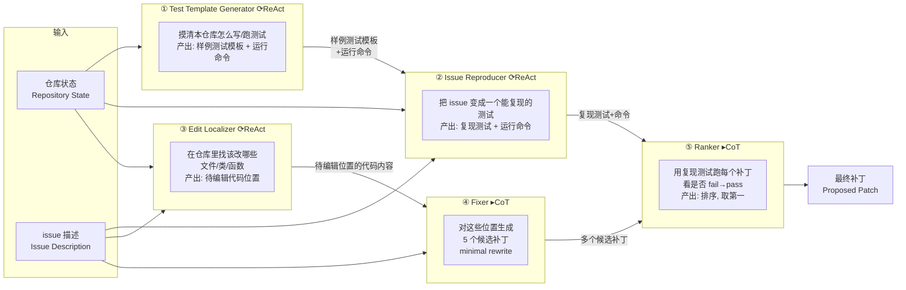

# MASAI：把一个软件工程 agent 拆成五个各司其职的子代理

> **本篇定位**：这是 agent-harness 库 **E 组（编码集成系统）** 的一篇，但它的贡献几乎全落在 **T 层（工具/动作空间）** 与 **L 层（控制循环：给每个子任务选 ReAct 还是 CoT）**。读它时请始终带着本库的中心命题——`Agent = Model + Harness`：MASAI 全程只用一个模型（GPT-4o），**5 个子代理换的只是 harness 的结构**，却把解决率从 SWE-agent 的 18% 抬到 28.33%。这是"同模型、换脚手架"最干净的一个例子。

---

## §1　TL;DR（一页讲清这篇在干嘛）

> 主讲提示：开场先抛一个人类工程师都懂的直觉——"面对复杂 bug，你不会一口气从头想到尾，而是拆步骤：先复现、再定位、再改、再验"。MASAI 就是把这个拆法做成了 agent 架构。

**一句话**：软件工程里解决复杂问题的常规办法是**分而治之**（divide-and-conquer）——把大问题拆成子问题各个击破。MASAI（**M**odular **A**rchitecture for **S**oftware-engineering **AI**）照搬这个思路，把"解决一个 GitHub issue"拆给 **5 个 LLM 驱动的专门子代理**，每个子代理有**自己的目标、自己的动作集、自己的求解策略**，最后线性组合出一个补丁（patch）。在 **SWE-bench Lite**（300 个真实 GitHub issue，来自 11 个 Python 仓库）上，MASAI 取得 **28.33% 解决率**（resolution rate），与 CodeR 并列当时榜首（Figure 1、Table 1）。

- **五个子代理各是谁（§2.3）**：**① Test Template Generator（测试模板生成器）** 摸清这个仓库怎么写、怎么跑测试；**② Issue Reproducer（问题复现器）** 写一个能复现 bug 的测试；**③ Edit Localizer（编辑定位器）** 找出该改哪些文件/类/函数；**④ Fixer（修复器）** 对定位到的代码生成**多个**候选补丁；**⑤ Ranker（排序器）** 用复现测试跑一遍候选补丁、挑出最可能对的那个。
- **属于 harness 的哪一层（Θ1）**：本篇是 **E 组（集成系统）**，但真正的技术内容落在 **T 层**（自定义了 7 个动作 `READ/EDIT/ADD/WRITE/LIST/COMMAND/DONE`，§2.2）与 **L 层**（**为不同子任务选不同控制循环**：定位/复现/模板用 ReAct，修复/排序用 CoT，§2.3）。它的诊断还触及 **C 层**——论文反复强调"避免超长轨迹带来的上下文膨胀"（§1 第 3 条优势）。
- **回扣全库论点（Θ2）**：MASAI 是 `Agent = Model + Harness` 的一个干净样本——**模型固定为 GPT-4o**，唯一变的是 harness 的**模块化结构**，解决率相对同期单 agent（SWE-agent 18%、ACR 19%）几乎翻倍（Table 1）。它把"结构本身是能力来源"这件事，用一张排行榜坐实了。
- **够权威吗（Θ4）**：Microsoft Research 出品，2024-06 提交 SWE-bench Lite 官方排行榜（带完整轨迹日志可复核）。它是 **2024 年模块化 SWE agent 的代表作**之一，位于 SWE-agent（单 ReAct 循环，2024)之后、Agentless（去 agent 化极简，2024 稍晚）之前，是"编码 agent 该多模块化"这场辩论的一个关键锚点。

**三条带走的结论**：
1. **分工 > 单干（在 2024 的模型水平下）**：把定位、复现、修复、排序拆成独立子代理，各自用最合适的策略与最小动作集，比让一个 ReAct 循环全包更强（28.33% vs 18%）。
2. **多样采样 + 用测试排序 = 关键增益**：Fixer 一次生成 5 个候选补丁（多样性），Ranker 再用复现测试筛选，比"迭代修一个补丁"更容易命中正解（Table 2：1 样本→5 样本，Oracle 23.33%→35%）。
3. **诚实的边界**：模块化的代价是**协调开销**与**误差级联**（上游定位错，下游全错），且论文**没做**"同一套子代理换单体架构"的严格 A/B 消融——所以"模块化本身值多少分"仍是被间接论证的（见 §14）。

---

## §2　问题与动机：为什么要"拆"（Why 三连·问题层）

> 主讲提示：这一页讲清"单一大 agent 到底卡在哪"，为后面的模块化埋因果。

**Why（问题层）——不拆会卡住什么？**

软件工程是一项需要**同时**动用多种技能的活动：写代码、推理、测试、调试（§1 开篇）。LLM 已经能写代码（Chen et al. 2021）、能推理（Kojima et al. 2022）、能规划（Huang et al. 2022），把这些能力用思维链（CoT, Wei et al. 2022）或思维树（ToT, Yao et al. 2024）串起来，再配上工具与环境反馈（Yao et al. 2023 的 ReAct、Shinn et al. 2024 的 Reflexion），就能造出能自主达成目标的 agent（§1）。

但关键的一句动机在 §1 末：

> "随着问题复杂度上升，**很难设计出一个放之四海皆准的、包打天下的单一策略**（single, over-arching strategy that works across the board）。真实的软件工程师面对复杂问题时，会把它拆成子问题、对不同子问题用不同策略。"（§1，笔者据原文转述）

具体到"解决一个仓库级 issue"，agent 要自主完成一串**性质迥异**的子任务（§1 倒数第二段列举）：
1. 读懂这个仓库的**测试基础设施**与代码组织；
2. **写新测试**（复现 bug）；
3. **定位 bug**（在成百上千个文件里找到该改的那几行）；
4. **编辑大文件**而不引入语法/语义错误；
5. **综合修复** + 写新代码。

**这些子任务对 agent 的要求完全不同**——定位需要"多步探索、灵活回溯"，最适合 ReAct；而"给定要改的代码、生成候选补丁"是一个相对封闭的推理，用 CoT 一次成型更省。如果把它们全塞进**一个** ReAct 循环（像 SWE-agent 那样），会有三个后果（§1 三条优势的反面）：

1. **策略被一刀切**：整条链只能用一种策略，无法对定位用 ReAct、对修复用 CoT 各取所长。
2. **信息被"就近"喂**：单条链只能顺着当前上下文走，难以主动去仓库四处（README、测试文件、其它模块）**搜集散落的信息**。
3. **轨迹越拖越长**：一个大循环容易越滚越长，**推高推理成本**，还把无关上下文塞进 prompt，反而**拖累性能**（§1 明确引 Shi et al. 2023"LLM 易被无关上下文干扰"作为依据）。

> **读出什么**：MASAI 的动机不是"造一个更聪明的模型"，而是"给同一个模型换一套**更符合任务结构**的脚手架"。这正是 harness 研究的立身之本——**结构即能力**。第 3 条（长轨迹伤性能）尤其重要，它是本篇与后来 **Agentless（极简、去掉 agent 自由度）** 共享的隐忧，只是两者开的药方相反（见 §13、Inspires-Us e）。

**Why（设计层）——这是本篇最核心的设计抉择，必须讲透：为什么"拆成多个专门子代理"，而不是"把单一大 agent 调好"？**

把这场对比摆成三段式（对应本库 Θ 规范要求的"设计层 Why 三连"）：

- **朴素方案（单一大 agent 什么都干）**：一个 ReAct 循环，从读 issue 到复现、定位、修复、验证一条链走到底（**SWE-agent 就是这个范式**）。→ **三个失败点**：(1) **上下文杂**——一条链的 prompt 里混着"仓库测试怎么跑""issue 说了啥""刚才读过的十几个文件""要不要回溯"，无关信息互相干扰，正撞 Shi et al. (2023) 的"LLM 易被无关上下文分心"；(2) **策略被一刀切**——整条链只能用一种策略、一套温度/步数超参，无法对"需探索的定位"用 ReAct、对"封闭的补丁生成"用 CoT 各取所长；(3) **难调、难归因**——链一旦变长，出错时你根本不知道是"定位错了"还是"补丁写错了"还是"验证挑错了"，无法对单个环节独立优化。
- **MASAI 方案（拆成专门子代理）**：把链切成 5 段，每段一个子代理，**目标收窄、上下文隔离、策略与动作集与超参各自定制**。→ **换来三点好处**：(1) **各自聚焦**——每个子代理的 prompt 只含自己那摊事，上下文干净；(2) **可独立优化**——能对定位配 ReAct+25 步、对修复配 CoT+温度 0.5×5 采样，还能（原则上）给不同子代理换不同模型；(3) **可归因、可复现**——失败能定位到具体环节（这也是 §4 能拆出 RQ3/4/5/6 逐环节分析的前提）。
- **代价（诚实标注）**：模块化**不是免费**的——(1) **协调开销**：多了子代理间的接口设计、信息传递、以及"总共跑 5 段"的调用成本（虽被短上下文抵消，净成本 1.96 USD/issue 仍务实）；(2) **误差级联**：单向流水线上游错则下游全错（§14 重点批判）；(3) **拆分本身要靠人设计**："切成哪 5 段、边界画在哪"是人工决定的，没有被搜索验证最优。

> **一句话记住这个抉择**：**单一大 agent 什么都干 → 上下文杂、策略一刀切、难调难归因；拆成专门子代理 → 各自聚焦、可独立优化、可归因，代价是协调开销 + 误差级联 + 拆分靠人设计。** MASAI 赌的是"在 2024 的模型水平下，前者的三个失败点比后者的三个代价更致命"——Table 1 的 28.33% vs SWE-agent 18% 就是这个赌注的回报。

---

## §3　核心 intention 与四条贡献（§1 末）

**把 intention 形式化成一句话**：

> 能否**分别优化**每个子任务的求解器（各选各的策略、各给各的最小动作集、各自独立调参），再**线性组合**它们，来解决一个**端到端**的复杂软件工程任务，并且比"单条大链包打一切"更强？

论文的四条贡献（§1 末逐条）：
1. **提出模块化架构 MASAI**：允许**分别设计/调优子代理**，再组合起来解决更大的端到端软件工程任务。
2. **实证有效性**：在 SWE-bench Lite 上取得**最高解决率**（28.33%）。
3. **拆解关键设计决策**：不只报分，还系统研究了 MASAI 与现有方法在各子任务（定位、复现、修复）上的表现差异，为后续研究提供参考。
4. **贡献到排行榜**：把结果与完整日志提交 SWE-bench Lite 官方 leaderboard 供社区复核验证。

> 主讲提示：强调第 3 条——这篇不是"我最高分"的炫耀，而是把"**为什么这样拆能赢**"拆成 6 个研究问题（RQ1–RQ6，§4）逐个回答。这份"设计决策的说明书"才是它对 harness 领域最耐读的部分。

---

## §4　方法总览（big picture）：五子代理的流水线

> 主讲提示：先给一图流，让大家看清"信息怎么从一个子代理流到下一个"。强调这是**线性组合**（前一个的 Output 直接当后一个的 Input），不是多 agent 群聊。

MASAI 把"解决 issue"建模成一条**有向流水线**。下图对应论文 Figure 2（以 `scikit-learn` 的 `GaussianMixture` bug 为例）：



**直觉对照人类工作流**：TTG = "先搞懂这个项目的测试怎么跑"；Issue Reproducer = "写个能稳定复现 bug 的测试用例"；Edit Localizer = "顺着报错和继承链找到病根在哪个文件"；Fixer = "针对病灶写几版候选补丁"；Ranker = "把候选补丁一个个跑复现测试，谁能把 fail 变 pass 就选谁"。

**与"多 agent 框架"的关键区别（§2.1 末，很重要）**：

> "相比 AutoGen（Wu et al. 2023）、ChatDev（Qian et al. 2023）、MetaGPT（Hong et al. 2024）这类多 agent 框架，MASAI **更简单**：子代理只被赋予模块化目标，**不需要子代理之间显式的一对一或群体对话**（no explicit one-to-one or group conversations）。子代理靠**把一个的 Output 传给另一个的 Input** 来组合。"

> **读出什么（Θ1）**：这句话把 MASAI 从"对话式多 agent"里切出来了。它不是让 agent 们**聊**出答案，而是一条**装配线**——每个工位有明确的进料口和出料口。这也是它归 **E 组（集成系统）** 而非"多智能体协作"组的原因：模块化的是**软件架构**，不是**社会协作**。

---

## §5　子代理的形式规格：⟨Input, Strategy, Output⟩（§2.1）

> 主讲提示：这是理解 MASAI 的"底层数据结构"。每个子代理都被压成一个三元组，讲清这三格分别管什么。

**直觉**：要让"分别优化每个子代理"成为可能，先得给"子代理"一个统一的**规格接口**——就像定义一个函数签名，规定它吃什么、按什么策略算、吐什么。MASAI 把每个子代理定义成一个三元组：

$$\text{sub-agent} \;=\; \langle\, \textit{Input},\; \textit{Strategy},\; \textit{Output} \,\rangle$$

逐格定义（§2.1，先定义后用）：
- **Input（输入）**：给该子代理的进料，包含——代码仓库、**从其它子代理拿到的必要信息**、一组**被允许的动作**（allowed actions）、以及任务指令（task instructions）。→ 注意"被允许的动作"是 per-agent 定制的：定位器能 `EDIT/ADD`，模板生成器却不能（见 §6 表）。
- **Strategy（策略）**：该子代理用 LLM 求解其子问题时遵循的**求解策略**。可以是 vanilla completion（直出）、CoT（Wei et al. 2022）、ReAct（Yao et al. 2023）、RAG（Lewis et al. 2020）等。→ **这是模块化最值钱的一格**：不同子任务配不同策略。
- **Output（输出）**：该子代理完成时必须返回的**内容规格与格式**（what content + what format）。→ 因为下游要直接消费它，格式必须约定死。

> **Why（设计层）——为什么要"三元组 + 线性组合"，而不是一个共享记忆的黑板系统？**
> 朴素替代方案 A：让所有子代理读写**同一块共享记忆/黑板**（blackboard），谁有想法就往上写。→ 会退化成"上下文全局膨胀"，正是 §2 第 3 条要躲的坑，且难以对单个子代理独立调参。
> 朴素替代方案 B：让子代理**群聊**协商（AutoGen 式）。→ 引入大量对话 token、协调不确定性，且难复现。
> MASAI 选**三元组 + 单向传递**：每个工位只看它需要的 Input、只吐约定的 Output，**上下文被天然隔离**（各自 prompt 只含自己那摊事），既能独立优化、又不膨胀。代价是**表达力受限**——无法处理"需要来回协商"的子任务（论文默认这些子任务可被切成单向流水线，这个假设本身没被证明，见 §14）。

**把"agent"与"sub-agent"讲清楚（§2.1 的层级关系）**：论文对术语做了严格区分——一个 MASAI **agent** 是若干 MASAI **sub-agent** 的**组合**（composition）；每个 sub-agent 才是那个 ⟨Input, Strategy, Output⟩ 三元组。换句话说，MASAI 这个"agent"本身**没有**独立的推理循环，它就是"把 5 个 sub-agent 按固定顺序接起来"这条装配线。**这一点极关键**：它意味着 MASAI 的"智能"完全分布在 5 个子代理里，编排层（orchestration）是**静态、无学习**的——没有一个"总控 agent"在运行时决定下一步派谁上场，顺序是**写死**的。这与"由一个 planner agent 动态调度 worker" 的编排（如许多多 agent 框架）截然不同，也是它"简单"的根源与代价所在（简单=可复现、易调试；代价=不能自适应地跳过/重排环节）。

---

## §6　符号与术语表（一张表定住后文所有记号）

> 主讲提示：这一页是"字典"。后面 §7–§12 会反复用到这些词，先在这里一次性定义清楚，讲的时候可快速带过、供听众回查。

本篇几乎不含数学符号（是一篇偏系统/工程的论文），但有一批**核心术语与实体**必须先钉死，否则后文的流水线与结果会读乱：

| 记号 / 术语 | 英文 | 定义（出处） | 在本文里怎么用 |
|---|---|---|---|
| **agent** | MASAI agent | 若干 sub-agent 的**组合**（§2.1） | 指整条 5 段流水线这个整体 |
| **sub-agent** | sub-agent | 一个 ⟨Input, Strategy, Output⟩ 三元组（§2.1） | 五个专门角色中的任意一个 |
| ⟨Input, Strategy, Output⟩ | — | 子代理的**规格接口**（§2.1） | 定义"一个子代理吃什么、按什么算、吐什么" |
| **Strategy** | ReAct / CoT / RAG / vanilla | 子代理求解时的推理策略（§2.1） | MASAI 里只用到 **ReAct** 与 **CoT** 两种 |
| **ReAct** | Reason+Act（Yao et al. 2023） | 交替"生成动作→执行→用观察作下一步输入"的循环（§2.3） | 给**需探索**的子任务（模板/复现/定位）用 |
| **CoT** | Chain-of-Thought（Wei et al. 2022） | 让 LLM 生成中间推理步再出答案（§2.3） | 给**相对封闭**的子任务（修复/排序）用 |
| **动作空间** | action space | 7 个动作 `READ/EDIT/ADD/WRITE/LIST/COMMAND/DONE`（§2.2） | 每个子代理只开其中一个**子集** |
| **懒惰表示** | lazy representation | `READ` 分级返回签名/成员/函数体（§2.2） | 控制上下文长度的 T 层机制 |
| **minimal rewrite** | 最小重写 | Fixer 只输出改动最小片段 `pre`→`post`（§2.3(4)） | 降低语法错、省 token |
| **fuzzy matching** | 模糊匹配 | `pre` 精确匹配失败时找最接近片段替换（§2.3(4)） | 缓解 LLM 行号/复制错误 |
| **复现测试** | reproduction test | 修好前 fail、修好后 pass 的测试（§2.3(2)） | Ranker 用它给候选补丁排序的"裁判" |
| **resolution rate** | 解决率 | 通过 issue 特定隐藏测试的 issue 占比（§3） | **核心指标**，越高越好 |
| **localization rate** | 定位率 | 补丁文件在**文件层**完全覆盖 ground-truth 的占比（§3） | 衡量"改对地方" |
| **application rate** | 应用率 | 补丁能被 `patch` 干净应用的占比（§3） | 衡量"补丁语法合法" |
| **SWE-bench Lite** | — | 300 个真实 issue / 11 个 Python 仓库（§3） | 唯一评测数据集 |
| **hints_text** | — | SWE-bench Lite 附带的开发者讨论转录（§4.2） | OpenDevin 用它、MASAI 不用（自主性差异） |

> **读出什么**：注意最后三行——resolution / localization / application 三个 rate 构成一条**递进链**："能不能干净打上（application）→ 有没有改对地方（localization）→ 是不是真修好了（resolution）"。一个方法可能应用率、定位率都很高，却解决率平平（如 Starship：定位 90.67%、应用 99%，解决只有 23.67%）——**三者不能互相替代**，这正是 §9 主结果最反直觉的那个读点的根基。

---

## §6.1　把 Figure 2 的具体例子走一遍（`scikit-learn` GaussianMixture bug）

> 主讲提示：抽象的流水线讲完，用论文 Figure 2 的**真实例子**把五个子代理"跑一遍"，让听众看到数据在管子里怎么流。

论文 Figure 2 用 `scikit-learn__scikit-learn-13142`（id: 13142）当例子，把五个子代理**在一条真实 issue 上的协作**画了出来。走一遍：

- **issue 长这样**：`GaussianMixture` 的 `predict` 和 `fit_predict` 在指定 `n_init>1` 时**结果不一致**（本该一致）。issue 里给了复现步骤、"期望：无异常"、"实际：`AssertionError: Arrays are not equal`"。
- **① Test Template Generator** 先不管这个具体 bug，而是探索 `scikit-learn` 仓库**怎么写一个标准测试**，产出一个能跑通的样例（图中示意 `sklearn/tests/test_standalone.py` 里 `def test_simple_addition(): assert 1+1==2` 这种"能跑起来的骨架"）+ 运行命令 `pytest sklearn/tests/test_standalone.py`。
- **② Issue Reproducer** 拿到这个模板当范例，写出**针对本 issue** 的复现测试 `sklearn/tests/test_gaussian_mixture_n_init.py`：`from sklearn.mixture import GaussianMixture ... def test_gaussian_mixture_n_init(): ... assert_array_equal(c1, c2)`，并给出运行命令。这个测试在 bug 未修时会失败。
- **③ Edit Localizer** 用 ReAct 在仓库里追踪：从 issue 提到的 `GaussianMixture` 出发，顺着 `sklearn/mixture/...gaussian_mixture.py → base.py` 的**继承链**（图中"Localization Trace"），定位到真正要改的 `base.py` 里的类/函数。
- **④ Fixer** 拿到"要改的代码位置 + issue 描述"，用 CoT 以 minimal rewrite 生成**多个**候选补丁（图中 "Possible Patches"）。
- **⑤ Ranker** 把每个候选补丁应用上去、跑②的复现测试，观察到**其中一个补丁能让测试从 fail 变 pass、其余仍 fail**，于是把"通过的那个"排第一，作为最终 Proposed Patch 输出。

> **读出什么**：这个例子把"分工"讲活了——**没有任何一个子代理独自能解这个 issue**：模板生成器不懂 bug、复现器不改代码、定位器不写补丁、修复器不验证、排序器不定位。**是这条装配线的组合**产出了正确补丁。同时也暴露了**级联依赖**：若③定位到错的文件，④⑤再努力也白费（见 §14 的误差级联批判）。

---

## §7　动作空间（Action Space）：7 个动作 + "懒惰表示"（§2.2）

> 主讲提示：这是 **T 层（工具）** 的正题。重点讲两个设计：动作怎么定义、READ 的"懒惰表示"为什么省 token。

**直觉**：agent 要和仓库交互，就得有一套"手"。MASAI 定义了 7 个动作，构成所有子代理**可选**的动作全集（每个子代理只开其中一个子集）：

| 动作 | 语义（§2.2 原文精炼） | 关键设计点 |
|---|---|---|
| `READ(file, class, function)` | 读特定函数/类/文件；三个参数都可选 | **懒惰表示 (lazy representation)**：读文件只给顶层定义的**签名**；读类只给类签名+成员签名；读函数才给**完整函数体**。多个匹配时先返回名字让你细化查询。→ 控制输出长度、省上下文。 |
| `EDIT(file, class, function)` | 标记一段代码待编辑 | 同 READ，唯一匹配才标记；否则返回部分匹配供细化。 |
| `ADD(file)` | 标记一个文件用于新增代码 | 文件须已存在才成功。 |
| `WRITE(file, contents)` | 把内容写入指定文件 | 文件可新建，或写 agent 早先创建的文件。 |
| `LIST(folder)` | 列目录内容 | 目录存在才列。 |
| `COMMAND(command)` | 在 shell 里执行命令 | 带**超时**与**大结果截断**（timeout + truncation）。 |
| `DONE` | agent 声明已完成其目标 | 终止信号。 |

**Why（设计层）——为什么要"懒惰表示"而不是把文件整篇喂进去？**
朴素做法是 `READ` 直接返回整个文件内容。→ 大文件动辄上千行，一次就把上下文塞爆（正撞 §2 第 3 条的"无关上下文伤性能"）。MASAI 的懒惰表示按"文件→只给签名 / 类→给类+成员签名 / 函数→才给全体"**分级展开**，让 agent **按需下钻**，把 token 花在真正要看的那段代码上。这是把"上下文管理（C 层）"下沉进了"工具设计（T 层）"——**工具本身就在替上下文省钱**。

> **读出什么（Θ2）**：懒惰表示是一个典型的"harness 层优化"——**模型没变**，只是"手"给的信息更精炼，agent 就能在更少 token 内做更多事。这与 SWE-agent 的核心洞见（"给 LLM 设计专门的 Agent-Computer Interface"）一脉相承，也预示了后来"上下文工程"的整条线。

---

## §7.1　五个子代理逐个拆解（§2.3，全篇核心）

> 主讲提示：这是最该停留的一页。对每个子代理，按"目标→Input→Strategy→Output→为什么这样配"讲。可把下面这张总表先亮出来，再逐个展开。

**一张表看全五子代理**（据 §2.3 汇总；Strategy 一列是模块化的精华）：

| # | 子代理 | 目标（干什么） | Strategy | 开放的动作 | Output |
|---|---|---|---|---|---|
| 1 | **Test Template Generator** | 分析本仓库的测试设置，学会怎么写/跑一个新测试 | **ReAct** | READ, LIST, COMMAND, WRITE, DONE | 一个**issue 无关**的模板测试 + 运行命令 |
| 2 | **Issue Reproducer** | 写一个能复现 issue 所述行为的测试 | **ReAct** | READ, LIST, COMMAND, WRITE, DONE | 复现测试（修好后会 fail→pass）+ 运行命令 |
| 3 | **Edit Localizer** | 在仓库里定位需要编辑的位置（文件/类/函数） | **ReAct** | READ, LIST, EDIT, ADD, COMMAND, DONE | 待编辑代码位置列表（经 EDIT/ADD 标记） |
| 4 | **Fixer** | 对定位到的代码生成多个候选补丁 | **CoT** | **无动作**（不与环境交互） | 多个候选补丁 |
| 5 | **Ranker** | 用复现测试给候选补丁排序 | **CoT** | **无环境动作** | 补丁排序（取第一个作为最终解） |

**用伪代码把整条装配线写死**（据 §2.3 各子代理的 Input/Output 依赖关系整理；论文以文字描述，此处笔者据原文逻辑组织，便于组会讲解）：

```text
输入: repo_state R, issue 描述 D
────────────────────────────────────────────
# ① 学会本仓库怎么写/跑测试（issue 无关）
template, cmd_t ← TestTemplateGenerator.ReAct(R)          # ≤25 步; ≤3 次重试; 温度 0→+0.2/次
     └─ 循环: 探索文档/现有测试 → 写模板 → 跑 → 若报异常则重试

# ② 写复现该 issue 的测试
repro_test, cmd_r ← IssueReproducer.ReAct(R, D, template, cmd_t)   # ≤25 步; 温度 0
     └─ 目标: 该测试在 bug 未修时 fail、修好后 pass

# ③ 定位要改哪些代码位置
locs ← EditLocalizer.ReAct(R, D)                          # ≤25 步; 温度 0
     └─ 用 READ(近似匹配)/LIST/grep 追踪继承链与 callee
     └─ 兜底: 若结束时未标记任何位置, 从"读过的所有位置"里选一组

# ④ 对定位到的代码生成多个候选补丁（无环境交互）
candidates ← Fixer.CoT(D, code_at(locs), n_samples=5, 温度=0.5)   # minimal rewrite: pre→post
     └─ 系统用行号找 pre; 精确匹配失败则 fuzzy matching; 语法非法的补丁丢弃

# ⑤ 用复现测试给候选补丁排序, 取第一
if repro_test 存在:
    ranking ← Ranker.CoT(D, candidates, repro_test, cmd_r)    # 跑每个补丁看 fail→pass 是否翻转
else:
    ranking ← Ranker.CoT(D, candidates)                       # 兜底: 只凭 issue 描述排序
patch ← ranking[0]

# 后处理
patch ← auto_import(patch)         # 补缺失 import
patch ← drop_edits_to_existing_tests(patch)   # 丢弃对既有测试的改动（防污染）
────────────────────────────────────────────
输出: 单个补丁 patch
```

> **读出什么**：把流水线写成伪代码后，两件事一目了然——(1) **依赖是严格单向的**：①→②、③→④→⑤，没有回边（no feedback loop），这就是"误差级联"风险的来源（§14）；(2) **每个子代理的超参是独立设的**（步数上限、温度、采样数各不相同），这正是"分别优化"这句 intention 的落地——**模块化让每个工位能独立调参**，而单一大循环做不到（全局只能设一套温度/步数）。

### 7.1.1　① Test Template Generator（测试模板生成器）

- **为什么需要它**：不同仓库的测试框架五花八门（有的用 pytest，有的自定义测试基类）。直接让"复现器"写测试，常因不懂本仓库测试怎么跑而卡住。所以先派一个 agent**专门摸清测试设置**。
- **怎么工作**：用 ReAct 探索仓库文档与现有测试，**反复尝试**直到得出一个"能不报错跑通"的模板 + 运行命令。它用自己的 ReAct 循环**评估生成的测试是否无异常通过**，最多重试到指定上限（实现里是 **3 次重试**，§3）。
- **产出**：一个**与具体 issue 无关**的样例测试模板 + 命令，专门喂给下游的 Issue Reproducer。

### 7.1.2　② Issue Reproducer（问题复现器）

- **为什么需要它**：修复的前提是"能复现"。有了复现测试，才能在 §7.1.5 用它判断补丁对不对。
- **Input**：仓库状态 + issue 描述 + **①产出的样例测试与命令**。
- **Strategy**：ReAct。
- **产出**：一个复现 issue 的测试——**issue 没修时该测试失败，修好后通过**（状态从 fail→pass）；同时输出运行该测试的 shell 命令。

### 7.1.3　③ Edit Localizer（编辑定位器）

- **为什么需要它 + Why（设计层）**：定位（localization）是全流程最难的一步——issue 描述往往含糊、只描述现象不指病根。**朴素做法**是让修复器"边找边改"（定位与修复耦合）。→ 会让一个 CoT 一次要同时干"找病根"和"开药方"两件难事，容易两头都做不好。MASAI 把**定位单独拆出来**，且**专门配 ReAct**（需要多步探索、读代码、追继承链、必要时回溯），目标收窄到"只找出要改哪里"。
- **Input**：仓库状态 + issue 描述；开放 READ, LIST, EDIT, ADD, COMMAND, DONE。
- **产出**：一批经 `EDIT`/`ADD` 标记的代码位置。**兜底逻辑**：若 ReAct 循环结束时一个位置都没标记，定位器就从"它到目前为止读过的所有位置"里**选一组**（§2.3 末，避免空手而归）。

### 7.1.4　④ Fixer（修复器）

- **为什么单独拆 + 为什么用 CoT 而非 ReAct**：给定"要改哪些代码"后，生成补丁是一个相对**封闭**的推理任务，不需要再和环境交互。所以 Fixer **不给任何动作**，纯 CoT。
- **关键技巧：minimal rewrite（最小重写）+ fuzzy matching（模糊匹配）**（§2.3 (4)，也是 RQ6 的答案）：
  - **直觉**：让 LLM 重写整段代码，既费 token 又容易在无关行上手滑。所以只让它写"**改动的最小片段**"。
  - **做法**：仿 Deligiannis et al. (2023)，把待改位置**带行号**给 LLM；LLM 对每处编辑，输出**原片段 `pre`** 和**改后片段 `post`**（每行都带行号）。系统用行号在目标文件里找 `pre`，找到就替换成 `post`；**若精确匹配失败，就用模糊匹配找最接近的片段**。替换 `post` 后计算与改前文件的 `diff`；**语法非法的编辑被丢弃**，合法补丁进入下游。
- **多样性设计**：Fixer 用**温度 0.5**、**采样 5 个**候选补丁（§3）——故意制造多样性，好让下游 Ranker 有得挑。
- **产出**：多个候选补丁。

### 7.1.5　⑤ Ranker（排序器）

- **为什么需要它 + Why（设计层）**：Fixer 给了 5 个候选，怎么选？**朴素做法**是"让 LLM 自己看代码选一个"（对应 Table 2 的 "LLM w/o test"）。→ 论文实测这样只有 23.33%，**LLM 光看补丁选不准**。MASAI 让 Ranker **真的把每个补丁应用上去、跑一遍②的复现测试**，看补丁是否让测试**状态翻转**（fail→pass 或反之），据此排序。
- **Input**：issue 描述 + Fixer 的候选补丁 + Issue Reproducer 的复现测试与命令；**不允许任何环境动作**。
- **Strategy**：CoT。
- **产出**：候选补丁的排序，**取第一名**作为最终解。**兜底**：若②没能生成复现测试，Ranker 就**只凭 issue 描述**排序。

> **读出什么（Θ1，跨 T/L 层）**：五个子代理里，**前三个（模板/复现/定位）用 ReAct + 环境动作**（要探索、要试跑），**后两个（修复/排序）用 CoT + 极少或无动作**（是相对封闭的推理）。这就是本篇"跨 T/L 层"的具体含义——**动作集（T）与控制循环（L）是逐子任务定制的**，而非全局一套。这正是模块化最直接的收益：**每个工位都用最省、最贴合的脚手架**。

---

## §8　实验设置：数据集、指标、超参、成本（§3，写全）

> 主讲提示：这一页把"怎么评的、花了多少钱"讲全，尤其三个指标要给精确定义。

**数据集**：**SWE-bench Lite**（Jimenez et al. 2024）——300 个软件工程任务（**以 bug 修复为主**），来自 **11 个开源仓库**。每个任务 = 一段 issue 描述 + issue 提出时的仓库状态。目标是产出一个补丁，使打上补丁后的仓库能通过**issue 特定的、对 agent 全程不可见的**测试（§3）。

**三个指标（§3，给精确定义）**：

1. **Resolution rate（解决率）**——核心指标。
   > 直觉：真正"修好了"的比例。定义：**成功解决的 issue 数 ÷ 总 issue 数**，其中"成功解决"= 该 issue 对应的、评测时才揭示的**目标测试套件全部通过**。
   $$\text{Resolution rate} \;=\; \frac{\#\{\text{issue}: \text{patched repo 通过 issue 特定测试}\}}{\#\{\text{全部 issue}\}}$$
   > 读出什么：这是最严的端到端指标——补丁必须**功能上真的对**，不是"看起来像"。

2. **Localization rate（定位率）**。
   > 定义：MASAI 提出的补丁**在文件层面完全覆盖了 ground-truth 补丁文件**（file-level recall = 100%）的 issue 占比。
   > 读出什么：衡量"有没有改对地方"，是"改对内容"的必要前提。

3. **Application rate（应用率）**。
   > 定义：方法提出的补丁能被 `patch` 命令**成功应用**（Linux `patch` 不报错）的 issue 占比。
   > 读出什么：衡量补丁的**语法/格式合法性**——能不能干净地打上去（与内容对不对无关）。

**竞争方法（§3 列了 8 类）**：SWE-agent（单 ReAct + 多工具环境接口，GPT-4-1106）、AutoCodeRover/ACR（一个 ReAct 定位 + 一个生成补丁，GPT-4-0125）、OpenDevin（CodeAct 框架，可跑任意 bash；其最高分版本用了 `hints_text`）、Aider（静态分析给紧凑仓库视图 + 有限 ReAct 编辑，GPT-4o/Claude-3-Opus 交替）、CodeR（多 agent + 测试覆盖率做定位，GPT-4-1106）、Moatless（ReAct 定位 + 语义搜索工具）、RAG（BM25 检索 + Claude-3-Opus）、以及商业方案 Amazon Q-Developer / Bytedance MarsCode / OpenCGS Starship / IBM Research Agent-101（后面这些因无详细日志，仅列分不深比）。**Devin 不比**——因它报的是与 SWE-bench Lite 不同的子集。

**实现与超参（§3，齐全）**：
- **模型**：全程 **GPT-4o**（所有子代理同一模型）。
- **懒惰表示实现**：用 `tree-sitter==0.21.1`。
- **温度/采样**：TTG 起始温度 **0**，每次尝试 **+0.2**；Issue Reproducer / Edit Localizer / Ranker 温度 **0**；Fixer 温度 **0.5**、采样 **5 个**候选补丁。
- **步数/重试上限**：Test Template Generator / Issue Reproducer / Edit Localizer 的 ReAct 循环限 **25 步**；Test Template Generator 限 **3 次重试**。
- **后处理**：Ranker 选定补丁后，跑一个**自动 import 工具**补缺失的 import；**丢弃对既有测试的任何编辑**（防作弊/防污染）。
- **成本**：**每个 issue 平均 1.96 USD**；整套实验估计**总成本 < 10k USD**。

> **读出什么（成本视角）**：1.96 USD/issue 是个务实的数字——模块化虽然跑了 5 个子代理，但因为**每个子代理上下文短、且 §1 第 3 条刻意避免长轨迹**，总成本反而被压住了。这与"单条超长 ReAct 轨迹烧 token"形成对比，是模块化的一个隐性收益。

---

## §9　主结果（RQ1）：28.33% 解决率，并列 SOTA（§4.1，Table 1）

> 主讲提示：这是全场最该停留的数字页。先报三项指标，再解读"定位率不是最高、但解决率最高"的反差。

**Table 1（SWE-bench Lite，全 300 题）核心行**（最优加粗）：

| 方法 | 解决率(%) | 定位率(%) | 应用率(%) |
|---|---:|---:|---:|
| RAG | 4.33 | 48.00 | 51.67 |
| SWE-agent | 18.00 | 61.00 | 93.67 |
| ACR | 19.00 | 62.33 | 80.00 |
| Q-Dev | 20.33 | 71.67 | 97.33 |
| MarsCode | 22.00 | 67.00 | 83.67 |
| Moatless | 23.33 | 73.00 | 97.00 |
| Starship | 23.67 | **90.67** | **99.00** |
| OpenDevin（含 hints） | 25.00 | 77.00 | 90.00 |
| OpenDevin（– hints） | 16.00 | 63.00 | 81.33 |
| Aider | 26.33 | 69.67 | 96.67 |
| Agent-101 | 26.67 | 72.67 | 97.33 |
| CodeR | **28.33** | 66.67 | 74.00 |
| **MASAI** | **28.33** | 75.00 | 95.33 |

**四个读点（§4.1 逐条 + 解读）**：
1. **解决率并列第一（28.33%）**：MASAI 与 CodeR 并列榜首。注意 OpenDevin 的 25% 是**用了 `hints_text`**（开发者在 GitHub 上讨论的转录，等于额外线索）；去掉 hints 只剩 16%——所以在"不吃额外信息"的公平口径下，MASAI 的优势更大（见 §10 RQ2）。
2. **RAG 惨败（4.33%）**：纯检索+生成在 SWE-bench Lite 上几乎不работает，印证这个数据集之难（§4.1 第 2 点）。
3. **定位率反差（75%，非最高）**：定位率最高的是 OpenCGS Starship（约 **90.67%**），但它解决率只有 23.67%——**定位对了 ≠ 修得对**。MASAI 定位 75%、却把解决率做到最高，说明它在"定位之后的修复+验证"环节更强（这条直接引出 RQ4）。
4. **应用率普遍高（MASAI 95.33%）**：LLM agent 的补丁大多能干净打上；MASAI 靠 minimal rewrite + fuzzy matching 拿到 95%+（§4.1 第 4 点、RQ6）。

> **Why（结果层）——为什么 MASAI 能在"定位不是最高"的情况下解决率最高？**
> 机制上，赢点不在"找得最准"，而在**"找到后的修复多样性 + 用测试排序"**这套组合拳（RQ4）：Fixer 生成 5 个多样候选，Ranker 用真实复现测试筛掉假阳性。Starship 定位 90% 却只解 23.67%，正是因为它缺这套"多样采样 + 测试验证"的下游。这把 §1 的论点具体化了：**模块化的价值不在单点最优，而在让每个环节都能独立上最合适的招**。

---

## §10　RQ2：不同方法"偷偷假设"了多少额外信息（§4.2）

> 主讲提示：这页是判断力页——比"谁分高"更重要的是"谁在同一起跑线"。

**Why（问题层）**：高自主性、少依赖外部信号（如专家 hints）是软件工程 agent 的理想。标准 SWE-bench Lite 只给 issue 描述 + 仓库，但**不同方法偷偷用了不同的额外信息**（§4.2）：
- **除 RAG / Moatless 外**，多数方法需要**预先装好仓库依赖**才能跑代码。
- **OpenDevin** 用了 SWE-bench Lite 提供的 `hints_text`（等于额外线索）。
- **Aider** 跑 pre-existing tests 时，用到了(1) 仓库特定的测试框架命令、(2) 针对 issue 代码的**特定单元测试**——后者相当于**间接泄露了"哪部分仓库与 issue 相关"**。
- **CodeR** 用覆盖率做定位，也需要仓库特定命令跑既有测试、并给全仓库插桩取覆盖率（虽然从日志看它没自主发现这些）。

**MASAI 的立场**：只依赖 Jimenez et al. (2024) 提供的**原始 setup**，不吃额外输入，追求**高自主性**。SWE-agent 和 ACR 处于与 MASAI 相似的自主级别。**结论（§4.2 末）**：MASAI 在**不做额外假设**的前提下超过所有方法。

> **读出什么（Θ5 的影子）**：这一段是本篇最诚实、也最有 harness 判断力的地方——它提醒我们，**排行榜分数不可直接比**，得先对齐"每个 harness 吃了多少信息"。这与本库 Harness-Bench 的核心方法论（固定外部条件、只比结构）同源。

---

## §11　RQ3：模块化如何带来更好的定位（§4.3）

> 主讲提示：这页论证"把定位单拆 + 配 ReAct"确实换来了更好的定位。

**论点（§4.3）**：更好的定位来自三件事——(1) 选 **ReAct** 作策略、(2) 目标**收窄**到"只找要编辑的文件"、(3) 动作设计（尤其 `READ` 返回近似匹配、可用 `grep` 等 shell 命令）让"多步、灵活、鲁棒"的定位推理成为可能。其中 (1)(2) 正是**模块化的产物**。数字：不设独立定位子代理的 SWE-agent / OpenDevin 定位率 61% / 63%，而 MASAI 的 Edit Localizer 达 **75%**。

**与 Aider 的头对头（§4.3，很有说服力）**：Aider 用**单步 CoT** 定位，MASAI 用 **ReAct**。
- 在"MASAI 解出但 Aider 没解"的 **27** 个 issue 中，Aider 有 **10（37%）** 是**定位失败**；
- 反过来"Aider 解出但 MASAI 没解"的 **21** 个里，MASAI 只有 **3（14%）** 定位失败。
- 二者都解出的题，平均搜索步数 10.9；只有 MASAI 解出的题，平均 12.8 步——**说明 ReAct 的灵活性让它能 scale 到更复杂的定位挑战**。

**三个定性例子（§4.3，展示 ReAct + 工具的威力）**：
- **[例1] 多步推理**：`scikit-learn__scikit-learn-13142`——Edit Localizer 找到 issue 提到的类，再**追踪符号与继承链**定位病根。
- **[例2] `READ` 返回近似匹配**：`astropy__astropy-14995`——LLM 想读一个**不存在的** `NDDataRef.multiply`，`READ` 返回近似匹配 `NDArithmeticMixin.multiply`（在另一个文件），子代理再顺着 **3 个 callee 链**找到真正的病灶函数。
- **[例3] shell 命令**：`matplotlib__matplotlib-25332`——用 `grep` 在大文件 `figure.py` 里搜 `FigureBase._align_label_groups`，从 grep 输出发现属性由 `cbook.Grouper()` 设置，据此定位要改的类。
- 对照：Aider 和 CodeR 在这 3 例**全部定位失败**；OpenDevin 对了例2；SWE-agent 对了例2、例3。

> **读出什么（L 层）**：这三个例子是"给定位子任务配 ReAct"的直接证据——ReAct 的"行动-观察-再行动"循环，配上"近似匹配 READ + grep"这类工具，能完成单步 CoT 做不到的**多跳探索**。这是 T 层（工具）与 L 层（循环）协同的教科书示例。

---

## §12　RQ4 & RQ5 & RQ6：采样排序、复现、可应用编辑（§4.4–4.6）

> 主讲提示：这三页是"MASAI 为什么赢在下游"的实证。RQ4 的 Table 2 是重点。

### 12.1　RQ4：多样采样 + 用测试排序 >> 迭代修复（§4.4，Table 2）

**Table 2（不同候选数与选择策略下的解决率）**：

| 选择策略 | 1 个样本 | 5 个样本 |
|---|---:|---:|
| **Oracle**（上帝视角，只要 5 个里有对的就算对） | 23.33% | **35.00%** |
| Random（随机选一个） | - | 22.28% |
| LLM w/o test（LLM 光看补丁选） | - | 23.33% |
| **LLM w/ test（Ranker，用复现测试选）** | - | **28.33%** |

**三个读点**：
1. **多样采样确有天花板收益**：Oracle 从 1 样本 23.33% → 5 样本 **35%**——"生成多个候选"把"可能对的补丁"的上限抬高了近 12 个点（§4.4）。
2. **光靠 LLM 选不准**：`LLM w/o test` 只有 23.33%，**几乎等于 1 个样本**——说明"让 LLM 自己看代码挑"没从多样性里捞到好处。
3. **用测试排序才吃到红利**：`LLM w/ test`（即 Ranker，跑复现测试看状态翻转）做到 **28.33%**，把 5 个候选里的对的**捞出来了一大半**（离 Oracle 35% 还有差距，但远超 23.33%）。

> **Why（结果层）——为什么"用测试排序"是关键？**
> 机制：Fixer 的 5 个候选里往往**只有 1 个真对**（§4.4 举例 `django__django-14787`：CodeR/Aider/OpenDevin/MASAI 都定位对了，但只有 MASAI 修对——因为它采样 5 个、且 Ranker 用复现测试挑出唯一对的那个）。迭代式方法（采一个、不行就改）容易在错误方向上打转；MASAI 的"**多样生成 + 客观测试筛选**"把"选择"这一步从"主观判断"变成"可执行验证"。Aider 曾提交一个"能过既有测试但其实错"的补丁，正说明**复现测试对消除假阳性的价值**（§4.4 末）。

**控制"定位"再比"修复"——Table 3（§4.4，很重要的一张公平对照表）**：直接比解决率不公平，因为不同方法定位能力不同。MASAI 于是**只在"某方法与 MASAI 都定位对"的 issue 子集上**，比较"这个方法修好了几个" vs "MASAI 修好了几个"，从而**隔离出"修复能力"这一维**：

| 方法 | 两者都定位对（/300） | 该方法修好 | MASAI 修好（同一子集） |
|---|---:|---:|---:|
| RAG | 126 | 12 | **52（+31.7%）** |
| ACR | 166 | 51 | **73（+13.2%）** |
| Q-Dev | 191 | 55 | **75（+10.5%）** |
| SWE-agent | 166 | 48 | **65（+10.2%）** |
| Starship | 220 | 62 | **81（+8.6%）** |
| OpenDevin | 187 | 60 | **74（+7.5%）** |
| OpenDevin（– hints） | 164 | 39 | **67（+17.1%）** |
| Moatless | 193 | 62 | **75（+6.7%）** |
| MarsCode | 182 | 59 | **71（+6.6%）** |
| Agent-101 | 193 | 69 | **72（+1.6%）** |
| Aider | 189 | **71** | 71（=） |
| CodeR | 174 | **77** | 72（− 0.3%） |

> **读出什么（Θ2，把"修复能力"从"定位能力"里摘出来）**：在**控制了定位**之后，MASAI 的修复能力**几乎对所有方法都占优**（行内最大值大多在 MASAI 列，加粗），最大领先 RAG +31.7%。**唯二例外**是 Aider（打平）和 CodeR（略负 0.3%）——这两个恰恰也是当时最强的方法。这张表是"MASAI 赢在下游修复+验证、而非赢在定位"的**最硬证据**：它把 §9 那个反直觉现象（定位率非最高、解决率却最高）拆开、量化到了"修复"这一维。

### 12.2　RQ5：两步式测试复现（§4.5）

**Why（问题层）**：能生成"复现 issue 的测试"是 Ranker 选补丁的前提，但很多仓库用**不常见的测试框架**，让这步很难。例：`django__django-14672` 需要新测试类继承某个基类才能跑；OpenDevin 试图装 pytest、**跑爆预算**都没解决。

**MASAI 的解法**：把复现拆成两步——**① Test Template Generator** 先读文档/现有测试，产出一个"能正确跑通"的模板（如正确用上 `django.test.TestCase`）；**② Issue Reproducer** 拿模板当范例，再写 issue 特定的测试。**结论**：靠这个两步分解，MASAI 能在 OpenDevin 卡住的地方**正确复现**。

> **读出什么**：这是"再拆一层"的胜利——把"写复现测试"进一步拆成"先学会本仓库怎么写测试（TTG）"+"再写这个 issue 的测试（Reproducer）"。**分工可以递归**：当一个子任务仍然太难，就再切一刀。

### 12.3　RQ6：可成功应用的编辑（§4.6）

**Why（问题层）**：编辑的**表示方式**极大影响成败。让 LLM 重写整段，既易出语法错、又爱在无关行手滑。

**MASAI 的解法**（呼应 §7.4）：**minimal rewrite（只写改动最小片段，pre→post）+ fuzzy matching（模糊匹配定位 pre）**。两者合起来把**编辑应用率做到 96.33%**（§4.6，属最高之列；与 Table 1 的 95.33% application rate 一致）。

> **读出什么（T 层）**：这是又一个"harness 层不碰模型也能提分"的例子——编辑的**表示与匹配机制**（纯工程）就能把"补丁打不上"这类低级失败大幅压低。

---

## §13　相关工作定位：MASAI 站在谁肩上、和谁不同（§5）

> 主讲提示：用一张对比表把 MASAI 钉在坐标系里，尤其讲清它与"多 agent 对话框架"和"分而治之"两条线的关系。

| 维度 | 对话式多 agent（AutoGen / MetaGPT / ChatDev） | 分而治之（MCR / SwiftSage / 本 MASAI） | 单 agent SWE（SWE-agent / OpenDevin） |
|---|---|---|---|
| 组合方式 | 子 agent **群聊/协商** | 子问题**独立解 + 合成** | **一个** ReAct 循环包干 |
| 评测场景 | 多在生成任务（几百行代码，NL2Code） | MASAI 在**真实仓库级 issue**（SWE-bench Lite） | 真实仓库级 issue |
| 上下文管理 | 对话累积，易膨胀 | **各子代理上下文隔离** | 单条长轨迹，易膨胀 |
| 与 MASAI 的关键差异 | MASAI **不需要子代理对话**（§2.1） | MASAI 是这条线在 SWE 上的实例 | MASAI 用**多个专门子代理**替代单一大循环 |

**几个精确对照（§5 原文）**：
- **AlphaCodium**（Ridnik et al. 2024）：也用测试做过滤，但 (1) 它用**公开 + AI 生成**的测试筛，(2) 评在**代码生成（NL2Code）**设定；MASAI 用**自己生成的复现测试**、评在**仓库级修复**。
- **CodePlan**（Bairi et al. 2023，同组）：LLM + 静态分析做仓库级规划，但依赖编译器反馈与依赖图来引导编辑定位；MASAI 更**自主**、要**自己发现**定位策略。
- **SwiftSage**（Lin et al. 2024）：受双过程认知启发，用小模型快思考（Swift）+ 大模型慢规划（Sage）；与 MASAI 同属"分而治之"，但 MASAI 的拆分是**按软件工程子任务**、不是按"快/慢思考"。

> **读出什么（Θ4，canon 坐标）**：MASAI 把"分而治之"这个古老的软件工程原则，**具体实例化到了仓库级 issue 修复**上，并用一套统一的 ⟨Input, Strategy, Output⟩ 规格 + 定制动作集把它工程化。它是 2024 年"模块化 SWE agent"的代表设计之一。

---

## §14　局限与批判（§7–8 + 笔者补充）

> 主讲提示：这页要诚实。既讲论文自陈的局限，也讲笔者对"模块化本身值多少分"的质疑。

**论文自陈的局限（§7 Limitations、§8 Broader Concerns）**：
- **只在 SWE-bench Lite 上评**：这个数据集**只覆盖"能用测试验证"的 issue**——排除了大量无法用测试判定的真实任务。作者说未来要扩到更多样的场景。
- **所有子代理都用 GPT-4o**：因时间/成本，没做"不同子代理用不同 LLM（含小模型 SLM）"的探索——而这本是模块化最诱人的自由度。**"固定求解策略下不同 LLM 的直接对比"仍是开放问题**。
- **只支持英文 issue**：SWE-bench Lite 与 GPT-4o 都以英文为主，把非英语开发者排除在外。
- **安全**：能跑 shell 的 agentic 框架可能对用户系统产生**意外副作用**、引入安全漏洞；作者呼吁加护栏、沙箱，且代码改动应经专家审阅后再上生产（§8）。

**笔者补充的批判（区分"宣称 vs 未证"）**：
- **缺"同子代理 × 单体架构"的严格 A/B**：论文有力地论证了**每个组件**的价值（RQ3 定位、RQ4 采样+排序、RQ5 两步复现、RQ6 编辑表示），但**没有**一个"把这 5 个子代理的能力塞回单一大 agent"的对照实验。所以"**模块化结构本身**贡献了多少分"是被**间接**论证的——很多增益（多样采样、测试排序、懒惰表示）其实**不依赖**"分成 5 个 agent"这件事，理论上也能装进一个大 agent。这是本篇最该被追问的方法学缺口。
- **误差级联（error cascade）**：线性流水线的固有风险——**上游定位错，下游 Fixer/Ranker 全错**。论文的 Table 3（按"两者都定位对"的子集比修复）**已隐含承认**需要"控制定位"才能公平比修复，但**没有量化**整条链因级联损失了多少（如"定位对但最终没解"的占比拆分）。
- **协调开销与"拆得对不对"**：MASAI 把任务拆成 5 块是**人工设计**的，"为什么恰好是这 5 个、边界画在这里最优"没有被搜索/消融验证——换一种切法可能更好或更差，**这个设计空间没被探索**。
- **外推性**：结论绑定 2024 的 GPT-4o。随着模型变强，"单个大 agent 能不能自己在内部完成这种拆分、从而让外部模块化变得多余"是本篇无法回答的（正是 Agentless 一线的赌注，见下节 Θ5）。

---

## ★ 对我们的启发（Inspires Us）

> 这一节是组会高潮，也是本库相对 auto-research 的独门优势：**我们（Claude Code / 本课 m9.* 的 agent）本身就是一个 harness**——而且我们**已经在用子代理（Agent 工具）分工**。MASAI 是"如何切分子代理、如何给每个子代理配专属策略与动作集"的一份现成蓝图。下面每条都能"打到自己身上"。

➤ **a. 可直接借用的招（method we can reuse）**：**"多样采样 + 用可执行测试排序"这套组合拳（§7.4–7.5、Table 2）**可整体搬到我们任何"生成补丁/改动"的管线里。关键三步：(1) 让生成器**升温采样多个候选**（MASAI 用温度 0.5 × 5 个）；(2) **不要让 LLM 光看着选**（实测只有 23.33%，几乎等于不采样）；(3) 用一个**客观可执行的验证器**（MASAI 用复现测试看 fail→pass 翻转）来排序。我们可以把"复现测试"替换成"我们自己的 verification-before-completion / 单测跑通"，把"选哪个改动"从主观判断变成**可执行验证**。

➤ **b. 可迁移到我们的子代理编排（transfer）**：MASAI 的 **⟨Input, Strategy, Output⟩ 三元组 + 单向传递**是一份"如何定义一个子代理"的规格模板。迁移到**我们的 Agent 工具编排**上：与其起一个"什么都干"的通用子代理，不如按 MASAI 的思路切成**目标收窄、动作集受限、策略专属**的几个——例如把一个"修 bug"任务显式拆成 `localizer 子代理（只读、只找位置）→ fixer 子代理（不碰环境、只出 diff）→ verifier 子代理（只跑测试、只排序）`。**迁移时要改的前提**：MASAI 假设子任务能被切成**单向流水线**（无需来回协商）——若我们的任务需要 localizer 与 fixer 反复对话，就得退回"带反馈边"的编排，MASAI 的极简线性组合不再适用（这正是它 §2.1 相对 AutoGen 的取舍）。

➤ **c. 它暴露的开放问题 = 我们的机会（open problem → opportunity）**：MASAI **没做**"同子代理 × 单体架构"的 A/B（见 §14），也**没量化误差级联**。**机会**：我们可以在自己的 harness 上补这个实验——同一套能力（多样采样、测试排序、懒惰读取），分别用"多子代理分工"和"单 agent 全包"两种编排跑同一批任务，**量化模块化结构净贡献了几分**，以及**上游定位错导致下游全废的占比**。可下手的第一步：给流水线每一环加一个"该环是否成功"的探针（定位对没对/复现测试有没有生成/补丁应用成没成），把最终失败**归因到具体环节**——这正好接上本库 Harness-Bench 的"五类失败症状"体检思路。

➤ **d. 与本库其它论文/模块的连接（connect the dots）**：
- 与 **Harness-Bench（2605.27922）** 正面呼应——MASAI 是"同模型换 harness 结构"的一个具体正例（GPT-4o 不变、结构从单 agent→5 子代理，18%→28.33%），恰好是 Harness-Bench 想统计的那类现象；且 MASAI §4.2 的"各方法偷偷假设了多少额外信息"与 Harness-Bench"固定外部条件才能公平比"同源。
- 与 **SWE-agent（Yang et al. 2024a，本库 canon）** 是"**单 ReAct 循环** vs **多专门子代理**"的直接对照——SWE-agent 押注"给单 agent 设计好 ACI"，MASAI 押注"把任务拆开分给多个 agent"。
- 与 **Agentless（去 agent 化极简）** 构成**正反辩论**（见下条 e）：MASAI 说"多拆几个专门 agent 更好"，Agentless 说"别给 agent 那么多自由度、固定流程反而更稳"——两者都在攻 §2 第 3 条"长轨迹伤性能"，药方却相反。
- 与本库 **H 组（工具失败恢复）** 呼应——MASAI 的 `COMMAND` 带超时截断、Fixer 丢弃语法非法补丁、定位器"空手时兜底选已读位置"，都是朴素的 robustness/recovery 设计，可与专测恢复的论文对照。

➤ **e. 如果我来做下一步（my next move，第一人称、可执行）**：我会在我们现有的 Agent 工具编排里，**挑一个"修 bug"型任务，显式实现 MASAI 的三段式子代理**（localizer → fixer[采样 5 个] → verifier[用现成单测排序]），并与我们当前"单个通用子代理全包"的做法在**同一批 10 个任务**上对跑。**先验证一个最小假设**：`fixer 升温采样 5 个 + verifier 用测试排序` 是否比 `单 agent 一次成型` 显著提高修对率——若显著，就把"多样采样 + 可执行排序"固化成我们子代理编排的**默认修复模式**；若不显著（可能因为我们的底座模型已足够强，单 agent 内部就能自我纠错），那本身就是一条**支持 Agentless 方向**的证据，值得记进本库的 regime 账本（见 §15 Θ5）。

---

## §15　版图定位（canon/前沿坐标 + 在本库的位置）

> 主讲提示：这页把 MASAI 钉在时间轴与本库坐标系上，并诚实标出"模块化 vs 极简"的 regime 边界。

- **时间坐标（Θ4）**：**2024 canon 级**。它相对基石推进了哪一步——**SWE-agent（2024 初）** 确立"给 LLM 设计 Agent-Computer Interface + 单 ReAct 循环"的范式；**MASAI（2024-06）** 在其后主张"**把单循环拆成多个各配专属策略/动作集的子代理**"，并用 SWE-bench Lite 早期 SOTA（28.33%，并列 CodeR）为"模块化"背书。它是"编码 agent 该多模块化"这条辩论轴上的**正方奠基之一**。
- **E/T/C/L 归属（Θ1）**：本篇坐 **E 组（集成系统）**，技术内容主要在 **T 层**（7 动作 + 懒惰表示 + minimal rewrite/fuzzy matching）与 **L 层**（逐子任务选 ReAct/CoT），诊断触及 **C 层**（刻意避免长轨迹的上下文膨胀）。
- **回扣 `Agent = Model + Harness`（Θ2）**：MASAI 是这条命题的一个**干净正例**——**模型恒为 GPT-4o**，唯一改变的是 harness 的**模块化结构**，解决率相对同期单 agent（SWE-agent 18%、ACR 19%）近乎翻倍到 28.33%（Table 1）。按机制拆：增益来自(a)定位单拆+配 ReAct（RQ3，61/63%→75%）、(b)多样采样+测试排序（RQ4，Oracle 5 样本 35% 的上限被 Ranker 兑现到 28.33%）、(c)两步复现（RQ5）、(d)minimal rewrite+fuzzy matching（RQ6，应用率 96.33%）。**这四点没有一处改了模型，全是 harness 层的结构与工具设计。**
- **regime 诚实（Θ5，不把"模块化 > 单体"绝对化）**：MASAI 证明的是"**在 2024 的 GPT-4o 水平下、在能用测试验证的仓库级修复上**，模块化分工优于单条大链"。但这**不是普适真理**：
  - **反方证据**：稍后的 **Agentless** 一线主张"给 agent 的自由度越少、流程越固定，反而越稳"，在类似基准上也拿到有竞争力的分数——即"**极简固定流程**"可能与"**多子代理分工**"打平甚至更省。
  - **随模型变强的衰减风险**：更强的模型也许能在**单个 agent 内部**完成 MASAI 外部化的那种"先复现-再定位-再修-再验"的拆分，使外部模块化的边际价值下降（§14 已埋此隐忧）。
  - **诚实表述**：**"模块化是否值得"分 regime**——任务越复杂、子任务性质越异质、模型越需要外部结构来聚焦，模块化收益越大；模型越强、任务越能一次成型，模块化的协调开销越可能得不偿失。MASAI 给了"模块化有用"这一侧一个**强正例**，但它不能单独裁定这场辩论。
- **在本库的位置**：**E 组 ⭐⭐**，是"模块化 vs 极简"辩论轴的**正方锚点**。读完它，再看 SWE-agent（单循环正方）、Agentless（极简反方），就能对每一个新编码 agent 追问一句："它把任务拆成了几块？每块配了什么策略/动作集？拆分本身值几分、还是增益其实来自某个可搬进单体的工具技巧？"

---

## §16　组会讨论问题（留给大家吵）

1. **模块化的"净值"**：MASAI 没做"同能力 × 单体架构"的 A/B。你觉得 28.33% 里，有多少来自"分成 5 个 agent"这件结构，多少来自"多样采样 + 测试排序 + 懒惰读取"这些**可搬进单体**的技巧？该怎么设计消融把它俩拆开？
2. **拆分粒度**：为什么恰好是这 5 个子代理？如果把 Fixer 和 Ranker 合并、或把 TTG 并进 Reproducer，会更好还是更差？"最优拆分"能不能自动搜索出来？
3. **误差级联**：线性流水线里上游定位错就全废。若给流水线加**反馈边**（Ranker 发现全错时回退让 Localizer 重定位），会不会更强？代价是什么（回到 AutoGen 式的协调开销）？
4. **与 Agentless 对决**：同一批任务、同一个底座模型，MASAI（多子代理）和 Agentless（极简固定流程）谁赢？在什么模型强度下天平会翻转？
5. **评委/验证器的可信度**：Ranker 用"自己生成的复现测试"排序——如果这个复现测试本身是错的（假阳性），整套排序就被带偏。怎么给"复现测试"本身上一道质量闸门？
6. **搬到我们自己**（承接 Inspires-Us e）：把三段式子代理接进我们的 Agent 编排后，先跑哪 10 个任务、用什么指标判断"多样采样+测试排序"是否真的赢过"单 agent 一次成型"？

---

## §17　一页速记（takeaways）

- **命题**：解决复杂 issue = 分而治之——把单一大 agent 拆成**5 个各司其职的子代理**，每个 ⟨Input, Strategy, Output⟩ 三元组、配专属策略与最小动作集，**线性组合**（前者 Output → 后者 Input，无群聊）。
- **五子代理**：① Test Template Generator（ReAct，学会本仓库怎么跑测试）② Issue Reproducer（ReAct，写复现测试）③ Edit Localizer（ReAct，定位病灶）④ Fixer（CoT，采样 5 个候选补丁，minimal rewrite）⑤ Ranker（CoT，用复现测试排序取第一）。
- **跨 T/L 层**：前三个用 **ReAct + 环境动作**（要探索/试跑），后两个用 **CoT + 少/无动作**（相对封闭推理）；动作集 7 个（`READ/EDIT/ADD/WRITE/LIST/COMMAND/DONE`），`READ` 用**懒惰表示**省上下文。
- **铁证（Θ2）**：**GPT-4o 不变**，结构从单 agent→5 子代理，解决率 **18%（SWE-agent）→ 28.33%（MASAI）**，并列 CodeR 当时 SOTA（Table 1）。
- **赢在下游**：定位率 75%（非最高，Starship 90.67%），但靠**多样采样 + 测试排序**把解决率做到最高（Table 2：Oracle 5 样本上限 35%，Ranker 兑现到 28.33%，而 LLM 光看只有 23.33%）。
- **工程亮点**：minimal rewrite + fuzzy matching → **编辑应用率 96.33%**；两步复现（TTG→Reproducer）解决"不常见测试框架"难题；成本 **1.96 USD/issue，总 <10k USD**。
- **诚实（Θ5）**：**没做**"同能力 × 单体"A/B，故"模块化本身值多少分"是间接论证；只在"可测试"的 SWE-bench Lite、只用 GPT-4o、只英文；**误差级联**未量化。"模块化 > 单体"**分 regime**——它是正方强证据，但 Agentless（极简）与更强模型可能让天平反转。
- **对我们**：把"多样采样 + 可执行验证排序"和"⟨Input,Strategy,Output⟩ 子代理规格"搬进我们的 **Agent 工具编排**；下一步先在 10 个"修 bug"任务上对跑"三段式子代理 vs 单 agent 全包"，量化模块化在**我们自己 harness** 上的净收益。
