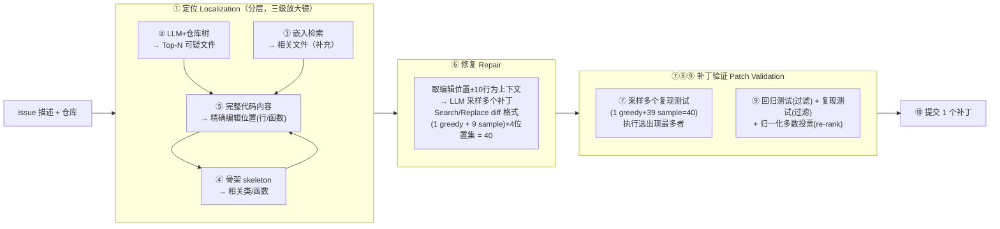

# Agentless：拆穿『LLM 软件工程 Agent』——无 agent 反而更强的三阶段管线

> **本篇是 agent-harness 库 E 组（编码集成系统）的头号「反方」范文**。库里其余编码论文（SWE-agent 的 ACI、
> MASAI 的模块化架构、OpenHands 的 SDK、AutoCodeRover 的代码图搜索）都在**加厚 harness**——给 agent 更强的
> 工具、更灵活的循环、更复杂的编排。Agentless 反其道而行：**把控制循环（L 层）几乎砍到零**，用一条固定管线证明
> 「同一个模型 GPT-4o，套一个便宜十倍的简单脚手架，反而在 SWE-bench Lite 上超过所有开源 agentic 系统」。
> 它是全库中心命题 `Agent = Model + Harness` 的一个**反向压舱石**：harness 确实决定能力，但「更复杂 ≠ 更强」——
> 在**结构化、可验证**的任务上，「少即是 agent」。读它请对齐 Harness-Bench 标杆范文的密度与诚实度。

---

## §1　TL;DR（一页讲清这篇在干嘛）

> 主讲提示：开场先抛出这篇的挑衅——「Do we really have to employ complex autonomous software agents?」（原文 Abstract 原句）。它是一篇**反潮流**的论文，先讲清它反的是谁、赢在哪、赢得多便宜。

**一句话**：2024 年 SWE-bench 排行榜被各种「autonomous LLM agent」刷屏（Devin、SWE-agent、AutoCodeRover…），它们让 LLM **自主决定下一步、调用复杂工具、循环几十轮**。Agentless 提出一个尖锐的反问：**我们真需要这么复杂的自主 agent 吗？** 它给出的答案是一个**固定的三阶段管线**——① **定位（localization）** 找到该改哪、② **修复（repair）** 生成补丁、③ **补丁验证（patch validation）** 选出提交哪个——**全程不让 LLM 自主规划、不给复杂工具、不搞几十轮循环**。结果（原文 §5 / Table 1）：在 SWE-bench Lite 上解决 **96/300 = 32.00%**，是当时**所有开源方案里的最高分**，而平均每题成本仅 **\$0.70**——比多数 agentic 方案便宜**一个数量级**（对比 SWE-agent \$1.62、AutoCodeRover-v2 无公开成本但 GPT-4 版 \$0.45 解 19%、CodeR \$3.34）。

**三条带走的结论**：

1. **反潮流的实证**：在 SWE-bench 这类**结构化、可自动验证**的任务上，「固定简单管线」不但更便宜、更可复现，**准确率还更高**——因为它规避了 agentic 方法的三大顽疾（工具设计易错、决策规划易跑偏、自反思能力弱，原文 §1）。
2. **被工业界背书**：Agentless 已被 **OpenAI 采纳**为展示 GPT-4o 和 **o1 模型族**真实编码能力的**默认方案**（原文 Abstract / §5.1.4），并且它对 SWE-bench Lite 的问题诊断**直接催生了 SWE-bench Verified**（OpenAI 沿同一方向发布，原文 §1 贡献三 / §6.2）。这是一篇「学术小组用一辆旧自行车（致谢里的梗）做出、却重塑了整个领域基线」的论文。
3. **附带一把手术刀**：它人工复核了 SWE-bench Lite 的全部 300 题，发现 **4.3% 题目描述里直接含 ground-truth 补丁**、**9.7% 含精确修复步骤**、**5.0% 含误导性方案**、**10.0% 信息不足**（原文 §6.1 / Figure 8）——于是剔除问题题目、构造出更严格的 **SWE-bench Lite-S（249 题）**。

- **属于 harness 的哪一层（Θ1）**：本篇是 **E 组（编码集成系统）**，但它的手法**横跨 T（Tools）与 L（Loop）两层，且都是「做减法」**——T 层：不给复杂工具 API，只用「LLM 提示 + 嵌入检索 + 一个 diff 格式」；L 层：**把自主控制循环几乎砍到零**，换成一条人写死的三阶段流水线。它对 C（Context）层反而**做加法**：用「仓库树结构」「文件骨架（skeleton）」等**精心压缩的上下文**替代「让 agent 自己去 grep/read 探索」。
- **回扣全库论点（Θ2）**：它是 `Agent = Model + Harness` 的**关键反例侧**——证明「harness 决定能力」的同时，「更复杂的 harness 未必更好」。同一个 GPT-4o，套 SWE-agent 的 ACI 脚手架解 18.33%（原文 Table 1 GPT-4o 行），套 Agentless 的固定管线解 **32.00%**——**模型没变，换的只是脚手架，摆了 13.67 分，且方向与「重 agent」派相反**。
- **够新够权威（Θ4）**：2024 里程碑，**首次证明** agentless 管线可在竞争性基准上击败 agentic 脚手架；权威性来源不只是分数，更是 **OpenAI 的官方采纳**（GPT-4o/o1 展示方案 + SWE-bench Verified 沿其诊断方向）。

---

## §2　问题与动机：为什么要「拆穿」自主 Agent（why，核心）

> 主讲提示：这一段用 Why 三连的「问题层」。别急着讲管线，先讲清 2024 年的 agentic 潮流有哪三个「看着自然、其实致命」的毛病。

**Why（问题层）——不解决会卡住什么？**
2024 年，受 Devin（AI 软件工程师）启发，学界与工业界涌现大量 **agent-based** 方法解 SWE-bench（原文 §1 / §2.1）。它们的共同范式是：**给 LLM 一组工具**（开/写/建文件、搜代码、跑测试、执行 shell），**让 agent 多轮自主地**执行动作、观察反馈、规划下一步（原文 §1）。这看着「很自然」——人类程序员不也是这样迭代调试的吗？但作者指出，**人与当前 LLM 的能力落差**让这套范式暴露三个系统性缺陷（原文 §1，逐条给原文论据）：

1. **复杂的工具用法/设计（Complex tool usage/design）**：为让 agent 用工具，要在 agent 与环境之间加一层**抽象**（把真实动作映射成 API 调用）。但这类 API 规范**难设计**，输入/输出格式稍有不慎就导致「工具用错/用得不精确」，尤其动作空间一复杂就更糟。而 agent 是**迭代**的——这一步依赖上一步——一个定义模糊的工具会**既降性能、又在废查询上烧钱**（原文 §1 第一条）。
2. **缺乏对决策规划的控制（Lack of control in decision planning）**：agentic 方法把**决策权下放给 agent**，让它自己决定何时、做什么。由于动作空间和反馈都极大，agent **极易困惑、陷入次优探索**；解一道题动辄 **30–40 轮**，使得「理解 agent 的决策」和「定位到底哪一轮做错了」都**极其困难**（原文 §1 第二条）。这是「难复现、难 debug」的根源。
3. **自反思能力有限（Limited ability to self-reflect）**：现有 agent 难以有效**自我反思**——它们倾向于「照单全收所有信息/反馈」，不会过滤或纠正无关、错误、误导的信息（原文 §1 第三条，引 [69,41]）。后果：**一步错，步步错**——一个错误步骤会被放大，污染其后**所有**决策。

> **读出什么**：这三条不是「agent 不行」，而是「**在当前 LLM 能力下**，把这么大的自主权+这么复杂的工具循环交给它，收益不稳、成本高、还难复现」。于是作者提出全篇的**引子问句**（原文 §1 斜体原句）：
>
> > *Do we really have to employ complex autonomous software agents?*
>
> 这句就是本篇在库里的「反方」身份证。它主张：**先退一步**，别急着造更复杂的 agent，而是问——一个**不自主、不复杂**的固定管线能走多远？（这与 Harness-Bench §5.2 的抽象「harness 优劣不在工具多不多，而在有没有把推理忠实搬运到可验证动作」**遥相呼应**——见 §13。）

**Why（问题层）——谁受影响、证据是什么？**
受影响的是**整个「用 LLM 自动解真实 GitHub issue」的方向**：SWE-bench（原文 [44]）把问题定义为「给定 issue 描述 + Python 仓库，改仓库解决问题」；其子集 SWE-bench Lite（[23]，300 题）聚焦 bug 修复。2024 年排行榜上**多为闭源/商用、且多数不放轨迹**（原文 §4 baselines 脚注），导致「到底是模型强还是脚手架强、贵在哪、能不能复现」都成谜。Agentless 要做的，正是给这团迷雾**立一个简单、开源、可复现、便宜的新基线**（原文 Abstract 末：「help reset the baseline, starting point, and horizon」）。

---

## §3　研究问题 / 核心 intention（形式化成一句话）

> 主讲提示：把动机压成一句可证伪的命题，这样后面每个实验都在「证/伪」它。

**核心 intention（一句话）**：**在结构化、可自动验证的软件工程任务上，一个「不含自主 agent」的固定三阶段管线（localization → repair → validation），能否在解决率上匹敌甚至超过复杂 agentic 脚手架，同时把成本压低一个数量级、并保持简单可复现？**

**隐含假设（后面会逐一验证或诚实标注）**：
- **H1（结构可用假设）**：SWE-bench 类任务**结构清晰**——「找位置→改代码→验证」是稳定的三步，不需要 agent 临场规划。→ §5–§8 验证。
- **H2（简单胜复杂假设）**：把「自主决策」换成「人写死的流程 + 每步各自采样」，能**规避** §2 的三大顽疾，从而**更准更省**。→ §8 主结果 + §10 消融验证。
- **H3（成本不对称假设）**：agentic 方法的多轮循环带来**大量废 token**；固定管线用**并行采样 + 廉价验证**能用更少 token 拿更高分。→ Table 1 成本列验证。
- **边界（诚实前置）**：H1 只在**结构化 + 有客观验证**的 regime 成立；一旦任务**无位置线索、需复杂代码搜索**，agentic 工具反而占优——作者自己在 §6.2 / Figure 9c 承认（见 §13 regime 诚实）。

---

## §4　相关工作定位：它站在谁肩上、和谁对立（一张对比表）

> 主讲提示：这页把「重 agent 派」和「Agentless」摆成两军对垒。库里 E 组的其它论文基本都在左栏，Agentless 独在右栏。

Agentless **不发明任何单点新技术**（原文 §3 末原话：「none of the techniques used by Agentless in isolation are revolutionary」），它的贡献是**把已有技术组合成一个「去 agent 化」的简单管线**。定位如下（原文 §2.1–§2.3）：

| 维度 | 「重 agent 派」（本组多数：SWE-agent / AutoCodeRover / MASAI / OpenHands / Aider / Moatless / SpecRover） | **Agentless（本篇，反方）** |
|---|---|---|
| **控制循环（L 层）** | LLM **自主**决定下一步动作，多轮（常 30–40 轮）迭代 | **固定三阶段**流水线，人写死流程，LLM 不做规划 |
| **工具（T 层）** | 复杂 ACI / 代码搜索 API / shell 执行等（抽象层） | **不给复杂工具**：仓库树 + 骨架 + 嵌入检索 + 一个 diff 格式 |
| **上下文（C 层）** | agent 自己去探索、读文件、拼上下文 | **精心压缩**的上下文（repo tree、skeleton、±10 行窗口） |
| **可复现/可 debug** | 差（多轮决策难追溯，很多闭源不放轨迹） | **好**（流程固定、每步可查、全开源） |
| **成本** | 高（多轮废 token） | **低一个数量级**（并行采样 + 廉价验证） |
| **代表定位** | Devin[7]/OpenDevin[17]、SWE-agent[101] 的 ACI、Aider[37] 的 repo map、AutoCodeRover[108] 的代码搜索 API、SpecRover[81] 的规格推断、MASAI[27] 的模块化 | **首次**证明 agentless 可打败上述全部开源方案 |

**它和 Fault Localization / APR 传统的关系**（原文 §2.2）：
- **定位**：传统故障定位（FL）分**动态**（谱系 SBFL、变异 MBFL——需要跑测试）与**静态/IR-based**（把 FL 当检索问题，比对代码与 bug 报告的文本相似度）。近来有 LLM-based FL，但**多数做不了仓库级**（受上下文窗口限），或**依赖昂贵的 agentic 导航**。→ Agentless 用「LLM + IR」的**简单分层 FL**兼顾仓库级与低成本（原文 §2.2 末）。
- **修复**：LLM-based APR「每 bug 采样多个补丁」是 SOTA 做法；Agentless 沿用**多采样**，但用**简单 diff 格式**（而非生成整段代码）来降成本、降幻觉（原文 §2.2 末）。
- **验证/复现测试**：不少 agent（SpecRover 等）**生成复现测试并让 LLM 判断测试对不对**；Agentless 不让 LLM 判断，而是**直接执行多个采样测试、看输出信号**来筛（原文 §2.3 末）。

> **读出什么**：Agentless 是「**站在 FL/APR 二十年积累的肩上，把它们重新包装成一条不需要 agent 的流水线**」。它对立的不是「LLM 编码」，而是「**必须用自主 agent**」这个 2024 年的默认假设。

**「无一项技术是革命性的」——逐项溯源（原文 §2.2–§2.3 + §3 末原话）**：Agentless 明确自陈「none of the techniques used by Agentless in isolation are revolutionary」。把它的三阶段拆开，每一件都能在文献里找到源头：

| Agentless 的部件 | 传统对应 / 来源 | Agentless 的「重新包装」 |
|---|---|---|
| 分层定位（文件→类/函数→行） | 静态/IR-based 故障定位（把 FL 当检索问题，比对代码与 bug 报告文本相似度，[87,82,88]）+ LLM-based FL | 用「LLM 提示 + 嵌入检索」做**分层**收窄，兼顾仓库级与低成本（多数 LLM-FL 做不了仓库级或依赖昂贵 agent） |
| 多采样补丁 | LLM-based APR「每 bug 采样多补丁」是 SOTA（[94]） | 沿用多采样，但换成**简单 diff**（Search/Replace，源自 Aider[37]）降本降幻觉 |
| 复现测试 | LLM 测试生成 / 单元测试合成（CodaMosa[52]、ChatTester 等）+ bug 复现（[46]） | 不让 LLM 判断测试对错，改**多采样 + 纯执行**筛（区别于 SpecRover[81] 让 LLM 判断） |
| 补丁选择 | Generate-and-Validate 修复范式（[62]）+ 多数投票 | **回归+复现双闸门 + AST 归一化投票**，且**不依赖** bug-triggering 测试（真实 SWE 设定下没有） |

> **读出什么（本篇最反直觉的「元结论」）**：一篇能重塑领域基线的论文，**核心贡献可以是「架构判断」而非「新技术」**——把二十年的 FL/APR 积累，用「去 agent 化」的思路**重新组织**成一条简单管线，就打败了一堆用了复杂新工具的 agent。这对我们的启示是：**「怎么组织已有部件」（harness 的架构选择）本身就是一等的创新**，未必要发明新算法。

---

## §5　方法总览（big picture）：三阶段一图流

> 主讲提示：先给「一张图看懂全流程」，再逐阶段展开。强调编号 ①–⑩ 对应原文 Figure 1 的十个步骤。

**直觉**：把「解一个 issue」想成一条**装配线**——先用越来越细的三级放大镜**定位**到该改的几行（①–⑤），再在这些位置**并行地生成一堆候选补丁**（⑥），同时**造一批复现测试**（⑦–⑧），最后用「回归测试 + 复现测试 + 多数投票」**筛选**出一个补丁提交（⑨–⑩）。全程**没有一个「agent 决定下一步」的环节**——流程是人写死的，LLM 只在每个格子里干「定位/生成/造测试」这类**局部**活。

**三阶段各自解决 §2 的哪个顽疾**（这是「why 固定管线能打败 agent」的核心）：
- **分层定位** 解掉「**决策规划失控**」：不让 agent 在几百个文件里自主 grep 探索（易困惑、烧 token），而是**三级确定性收窄**——文件→类/函数→行，每级用**压缩上下文**喂给 LLM 做一次**局部**判断。
- **简单 diff 修复 + 多采样** 解掉「**工具设计易错 + 自反思弱**」：不生成整段代码（易幻觉），只产**小改动 diff**；不靠 agent「反思上一步对不对」，而是**并行采样一堆候选**，把「对不对」的判断**外包给执行**。
- **执行式验证** 解掉「**自反思弱**」：不问 LLM「你这补丁对吗」，而是**跑回归测试 + 跑复现测试**，用**客观执行信号**筛——把「判断」从「LLM 自省」换成「机器验证」。

---

## §5.5　核心追问：为什么「固定简单管线」能打败「复杂自主 agent」（把三阶段讲透）

> 主讲提示：这是全篇最该讲透的「思想页」。别把它讲成「简单就是好」的口号——要**逐条对上 §2 的三害**，说清「固定管线用什么机制替换了 agent 的哪个易错环节」。这也是本组「反方」立论的骨架。

Agentless 的胜利**不是靠更强的模型、也不是靠某个新算法**（原文 §3 末明确：单看每项技术都不 revolutionary），而是靠一个**架构层面的判断**：把 agentic 方法里「**交给 LLM 自主决定**」的每一个环节，**换成一个「人写死的确定性步骤 + 高度压缩的上下文 + 一次局部判断」**。下表把「agent 的三害」与「固定管线的对治」一一对上——这就是「为什么它能赢」的完整机制解释：

| agentic 方法的顽疾（§2） | 它为什么在当前 LLM 上易错 | Agentless 用什么**替换**它 | 为什么替换后更省/更准/更可控 |
|---|---|---|---|
| **① 复杂工具用法/设计** | 工具 API 抽象难设计，输入输出格式一错就「工具用错+烧废 token」；动作空间越大越糟 | **不给复杂工具**——定位只用「仓库树文本 + 骨架 + 嵌入检索」，修复只用「一个 Search/Replace diff 格式」 | 没有工具接口就没有工具误用；LLM 只需产**文本/小 diff**，格式极简、幻觉少（原文 §3.2） |
| **② 决策规划失控** | agent 自主决定下一步，动作/反馈空间巨大，易困惑、陷次优；解一题 30–40 轮，难 debug | **固定三阶段流水线**——流程由人写死（定位→修复→验证），LLM **从不决定「下一步做什么」**，只在每格做局部活 | 没有自主决策就没有跑偏；流程固定 ⇒ 每步产物可查、可复现、可 debug（原文 §1/§3） |
| **③ 自反思能力弱** | agent 照单全收所有反馈、不会过滤纠错；一步错、步步错、错误被放大 | **把「判断对错」外包给执行**——不让 LLM 反思补丁/测试对不对，而是**跑回归+复现测试**用客观信号筛 | 「对不对」由机器裁决，不受 LLM 自省不可靠之累；多采样 + 投票进一步稀释单次错误（原文 §3.3） |

**三个「反直觉」的设计选择，逐一给出「为什么反而更好」**：

1. **「不让 agent 探索，改用压缩上下文一次判断」为何更准？** 直觉上「让 agent 自己去读代码、grep、逐步探索」信息更全。但原文消融（Table 2）反复证明：**给 LLM 完整/大量上下文反而 confuse 它、定位更差**（完整文件 53.67% < 骨架 58.33%；直接跳级 47.00% < 分层 50.67%）。机制：当前 LLM 处理长上下文能力有限，**噪声淹没信号**；而「三级压缩」每一步都把上下文**裁到恰好够做一次判断**，信噪比最高。→ **「少而精的上下文」胜过「多而杂的自主探索」**。

2. **「不迭代改一个补丁，改并行采样一堆」为何更省又更准？** agentic 方法常「生成补丁→跑→看错→反思→再改」多轮串行，**每轮都烧 token 且可能越改越偏**。Agentless 改为**一次性并行采样 40 个候选**，再用执行信号选。机制：并行采样**不累积错误**（每个候选独立），且**总 token 可控**（Table 1：78K vs SWE-agent 498K）；「对不对」交给测试而非「反思」。→ **「广撒网 + 客观筛」胜过「串行改 + 自省判」**。

3. **「不问 LLM 补丁对不对，改跑测试」为何是胜负手？** §9 消融（Table 4）显示，去掉验证阶段只有 25.67%，加上回归+复现验证到 32.00%——**+6.33 分几乎全来自「用执行代替自省」**。机制：LLM 判断自己产物对错**系统性乐观**（§2 第三害），而测试给的是**不可辩驳的客观信号**。→ **「机器验证」胜过「模型自评」**。

> **读出什么（本组反方的立论核心）**：把这三条合起来，Agentless 的主张不是「agent 无用」，而是——**在当前 LLM 能力下，凡是「能被固定流程结构化 + 能被机器客观验证」的环节，交给自主 agent 都是「用不确定性换灵活性」的亏本买卖**。它把这些环节**逐一换成确定性机制**，于是同一个模型、更少的钱、拿了更高的分。这正是对全库命题的补充：`Agent = Model + Harness`，而**「Harness 该多复杂」取决于任务能被结构化/验证到什么程度**——能结构化的部分，harness 越简单越好。

---

## §6　符号与术语表

> 主讲提示：这页把后文要用的记号一次定义清，方便讲公式时直接引用。

| 记号 / 术语 | 定义 |
|---|---|
| **issue** | 一个真实 GitHub 问题描述（bug 或功能请求），SWE-bench 的输入之一 |
| **仓库结构格式 (repository structure format)** | 类似 Linux `tree` 的仓库文件/目录层级文本表示，只含路径名不含代码（原文 §3.1.1） |
| **骨架格式 (skeleton format)** | 一个文件的**压缩表示**：只留类/函数**声明头**（签名）+ 类字段名 + 模块/类级注释，**不含函数体**（原文 §3.1.2 / Figure 2） |
| **Search/Replace 编辑格式** | 一种**简单 diff**：给出「要替换的原代码片段（search）」+「替换成的新片段（replace）」，直接字符串匹配替换（原文 §3.2 / Figure 3） |
| **Top-N 可疑文件** | 定位第一级选出的、最可能要改的 N 个文件 |
| **编辑位置 (edit locations)** | 定位最终产物：具体的行号 / 函数 / 类，供修复阶段生成补丁 |
| **复现测试 (reproduction test)** | LLM 合成的、**试图复现 issue 所述 bug** 的测试文件；bug 未修则输出 `Issue reproduced`，修好则输出 `Issue resolved`（原文 §3.3.1 / Figure 4） |
| **回归测试 (regression test)** | 仓库里**原本就通过**、且**不该被本次修复破坏**的测试（原文 §3.3.2） |
| **greedy / sample** | greedy = 温度 0 贪心解码取 1 个；sample = 温度 0.8 采样取多个（原文 §4 Implementation） |
| **% Resolved** | 解决率 = 解决题数 / 总题数（主指标，定义见 §7） |
| **% Correct Location** | 补丁覆盖了 ground-truth 编辑位置的题目占比（line/function/file 三粒度，定义见 §7） |
| **SWE-bench Lite / Lite-S / Verified** | Lite=300 题子集[23]；Lite-S=作者剔除问题题后的 249 题；Verified=OpenAI 沿同方向发布的过滤集[34] |

---

## §7　方法细节 A：分层定位（三级放大镜）

> 主讲提示：这是全篇「上下文工程」最见功力的地方——每一级都在「**用尽量压缩的上下文让 LLM 只做一次局部判断**」。逐级讲：解决什么难题→怎么压缩→读出什么。

**总难题（原文 §3.1）**：仓库可能有**成百上千个文件、每个数千行**，而要改的只是**少数几行/几函数**。若把全仓库塞给 LLM——超长上下文既贵又会**把模型搞糊涂**（原文 §5.2.1 消融实测：用完整文件内容反而定位更差、成本更高）。Agentless 用**三级收窄**破解。

### 7.1　第一级：定位到可疑文件（file level）

**Why（设计层）——为什么用「仓库树」而不是「把所有代码喂进去」？**
朴素做法是把全仓库代码丢给 LLM 让它指认文件。→ 超上下文、贵、且噪声淹没信号。Agentless 改用**仓库结构格式**（类 `tree`，只有路径名、按层级缩进，原文 §3.1.1）：它**保留了文件路径 + 邻近文件名的组织信息**，却**不含任何源码**，极其紧凑。把它 + issue 描述喂 LLM，让 LLM 输出 **Top-N 可疑文件**。

**再加一路嵌入检索做补充**（原文 §3.1.1）：因为「只看文件名」会漏掉「名字看不出但内容相关」的文件。做法：① 先让 LLM 根据仓库结构列出**不相关文件夹**并剔除（缩小检索面）；② 把剩余文件切成代码块（chunk），用嵌入模型算 embedding；③ 用 issue 描述做 query，算**余弦相似度**，检索出内容最相关的文件。**最后合并两路**——取「提示法」与「嵌入法」**共同命中最多的 Top-N** 文件为最终文件集。

> **读出什么（消融佐证）**：原文 Table 2「File level」显示——**提示法单独** 命中 GT 文件 **78.67%**、**嵌入法单独**（带无关文件夹过滤）**70.33%**、**两者合并 81.67%**（成本 \$0.06）。而**嵌入法若不做无关文件夹过滤**只有 67.67% 且**更贵**（\$0.05→说明过滤既提准又降本）。**两路互补**是关键：它们命中的是**不同的**相关文件集（原文 §5.2.1 原话）。

### 7.2　第二级：定位到相关元素（类/函数）

**Why（设计层）——为什么用「骨架」而不是「完整文件」？**
拿到可疑文件后，若把这些文件的**完整内容**喂 LLM 去挑类/函数——上下文又会 >3000 行（原文 §5.2.1），贵且confuse。Agentless 改用**骨架格式**（原文 §3.1.2 / Figure 2）：把每个文件压成「**只有类/函数声明头（签名）+ 类字段 + 注释、没有函数体**」的紧凑表示。把**所有可疑文件的骨架一次性**喂 LLM，让它**通盘**判断、输出「该细看的相关类/函数列表」。

> **读出什么（消融佐证）**：原文 Table 2「Related element localization」——**完整文件**命中 GT **53.67%**、成本 **\$0.15**；**骨架格式**命中 **58.33%**、成本仅 **\$0.02**。**骨架又准又便宜**（贵 7.5 倍的完整文件反而更差）——原文解释：**LLM 处理长上下文能力差，完整内容会 confuse 模型；紧凑表示反而能有效定位**（§5.2.1）。这是「**少即是更准**」在上下文层的直接证据。

### 7.3　第三级：定位到精确编辑位置（行/函数）

拿到相关类/函数后，此时**只把这些元素的完整代码**（而非整个文件）喂 LLM，输入已**小得多**，让 LLM 敲定**最终编辑位置**（行号/函数/类，原文 §3.1.3）。为「最大化找对位置的概率」，这一步**采样 4 组**编辑位置集（原文 §4 Implementation：the third localization step draws four samples）。

**分层的价值（消融，原文 Table 2「Edit integration localization」+ §5.2.1）**：
- **Greedy**（贪心 1 组）命中 GT **50.67%**、LoC 189、\$0.06；
- **Direct from file-level**（跳过第二级、从文件直接到编辑位置）命中 **47.00%**、LoC 208、**\$0.18**——**又贵又差**，证明**中间那级（骨架）不可省**：直接给大上下文会 confuse 模型（原文 §5.2.1）。
- **Multi-samples merged**（多组合并成一组）56.33%；**Multi-samples**（4 组各自保留、不合并）单组命中 49–49.67% 但**合起来覆盖更广**（\$0.07）——Agentless **默认用「各自保留、分别拿去修复」**而非合并，因为「每组定位到不同的 GT 位置，能给修复提供不同的有用上下文」（原文 §5.2.1 末）。

> **读出什么**：三级放大镜的每一级都在贯彻同一条设计律——**「给 LLM 恰好够用、且高度压缩的上下文，让它只做一次局部判断」**。这正是对 §2「决策规划失控」的**釜底抽薪**：不让 agent 自主探索，而是**用确定性流程 + 压缩上下文**逐级收窄。

---

## §8　方法细节 B：修复（简单 diff + 多采样）

> 主讲提示：这页讲「为什么不生成整段代码、而是生成小 diff」，以及「为什么并行采样一堆而不是让 agent 反复改一个」。

**取上下文窗口（原文 §3.2）**：对每个编辑位置（比如「第 40–78 行的某类」），取其**前后各 ±x 行**（实现里 x=10，原文 §4）构成上下文窗口 `[40−x, 78+x]`；多个编辑位置的窗口用 `...` 连接（表示中间省略）。直觉：给 LLM **周边上下文**有助于生成更贴合程序行为的补丁（原文 §3.2 引 [96]）。

**Search/Replace 简单 diff（原文 §3.2 / Figure 3）**：
**Why（设计层）——为什么不让 LLM 直接产出「替换整段的完整新代码」？**
朴素做法是让 LLM 输出「把这段代码整体换成这段新代码」。→ 生成整段代码**token 多、成本高、且幻觉概率大**（越长越容易写错）。Agentless 改用 **Search/Replace**：只输出「① search：要替换的原片段」+「② replace：新片段」，应用时**直接字符串匹配替换**即可（原文 §3.2）。它**只聚焦小改动**，因此**更省、更可靠、更少幻觉**（原文 §3.2 原话：more cost-efficient... less chances for hallucination）。

**机制细节（原文 Figure 3 的读法）**：一个 Search/Replace 块长这样——在 `<<<<<<< SEARCH` 与 `=======` 之间给出**原文件里一字不差的片段**，在 `=======` 与 `>>>>>>> REPLACE` 之间给出**替换后的新片段**；应用时只需在原文件里**精确匹配 search 段、整段替换为 replace 段**。相比「让 LLM 生成带行号的 unified diff」（行号一偏就 patch 失败）或「输出整个新函数」（长、易幻觉），这种「**贴原文片段 + 贴新片段**」的格式对 LLM 最友好——它只需**复述一小段已知代码 + 写出小改动**，出错面最小。这也是 Aider[37] 验证过的做法，Agentless 直接沿用。

**多采样（原文 §3.2 / §4）**：对每个 issue，**先 greedy 1 个，再高温采样多个**。结合前述「4 组编辑位置集 × 每组 10 个补丁（1 greedy + 9 sample）」= **每 bug 共 40 个候选补丁**（原文 §4 Implementation：40 patches per bug）。

**补丁归一化（为投票做准备，原文 §5 开头 / §3.3.2 末）**：把每个补丁**解析成 AST → 去 docstring/注释/多余空格 → 反解析回规范源码 → 算与原码的规范 diff**，抹掉表层差异，好让「多数投票」比较的是**语义**而非「空格/注释」。

> **读出什么（消融，原文 Table 3「repair setups」）**：
> - 只用 greedy 那 1 组位置生成 40 个补丁 → 已解 **88/300 = 29.33%**、\$0.22；
> - 4 组位置合并成 1 组 → 85（28.33%）；
> - **4 组各自保留、各生成 10 个补丁（=40）→ 96（32.00%）**、\$0.29。
> 即「**多组编辑位置分别修复**」比「合并」更好——因为不同位置集提供**不同的有用上下文**，能修不同的题（原文 §5.2.2）。

---

## §9　方法细节 C：补丁验证（用执行信号选补丁，不靠 LLM 自省）

> 主讲提示：这是「把自反思外包给机器」的关键页。核心公式是「归一化多数投票 + 两道测试闸门」。

有了 40 个候选补丁，得**选一个提交**。Agentless 的验证**完全用执行信号**，不让 LLM 判断补丁对错。

### 9.1　合成复现测试（reproduction test，原文 §3.3.1 / Figure 4）

**难点**：SWE-bench 的真实设定下，issue 刚提出、开发者**还没写触发 bug 的测试**——所以原仓库**只有回归测试、没有 bug-triggering 测试**（原文 §3.3.1）。Agentless 于是**让 LLM 合成复现测试**：给 LLM issue 描述 + 一个测试格式范例，让它写一个测试——**bug 未修则打印 `Issue reproduced`、修好则打印 `Issue resolved`、异常则 `Other issues`**。同样**多采样 40 个**（1 greedy + 39 sample，原文 §4），在**原仓库上执行**、**只保留能输出 `Issue reproduced` 的**（即在有 bug 的原码上确实复现了），再**归一化后取出现次数最多者**为该 issue 的最终复现测试。

**Why（设计层）——为什么不像 SpecRover 那样让 LLM 判断「测试对不对」？**
朴素做法（部分 agent 用）：生成测试后**让 LLM 判断这个测试是否正确**。→ 又引入一次「LLM 自省」，而 §2 已指出自反思不可靠。Agentless 改为**纯执行**：不问对错，只看「在有 bug 的原仓库上跑，是否真的复现了 bug」这个**客观信号**来筛（原文 §2.3 末 / §3.3.1）。

**一个具体例子（原文 Figure 4 的读法）**：以 sqlfluff 的一个 issue 为例，LLM 合成的复现测试 `test__rules__std_L060_raised()` 会**构造一段触发 bug 的输入**（一条 `IFNULL/NVL` 的 SQL），先 `try` 执行——若连基本执行都失败就 `print("Other issues")` 提前返回；否则再 `try` 一组断言（期望修好后应把 `IFNULL` 建议成 `COALESCE`），**断言失败（AssertionError）就 `print("Issue reproduced")`（说明 bug 还在）、断言通过就 `print("Issue resolved")`（说明修好了）**。这个「**三态输出**（reproduced / resolved / other）」的模板，让 Agentless 无需 LLM 判断，仅凭**测试的打印输出**就能机械地判定「这个补丁修没修好」。

### 9.2　补丁选择：两道测试闸门 + 归一化多数投票（原文 §3.3.2）

**直觉**：一个好补丁应当**既不破坏原有功能（过回归测试）、又真的修好了 bug（过复现测试）**，在此前提下再用**多数投票**求稳。

**回归测试闸门**：先跑全仓库测试得到「原本通过的测试集」；但**不能全当回归测试**——因为修 bug 可能**本就该改动某些功能**。于是**让 LLM 从通过测试里剔除「修好后不该再跑的测试」**，得到最终回归测试集；对 40 个补丁跑回归测试，**保留回归失败最少的补丁**（原文 §3.3.2）。（注意：作者**不直接用** SWE-bench 自带的 `PASS_TO_PASS` 字段，而是自己重跑筛选——遵守 SWE-bench 维护者要求；脚注实测：若直接用 `PASS_TO_PASS`，SWE-bench Lite 分数会到 **98**。）

**复现测试闸门**：在过了回归闸门的补丁里，**跑复现测试、只留输出 `Issue resolved` 的**。若**没有补丁能过复现测试**（因为复现测试是 LLM 生成的、可能不准），就**回退到只用回归测试结果**选（原文 §3.3.2，一个诚实的 fallback）。

**归一化多数投票（re-rank，原文 §3.3.2 末）**：
**直觉**：在通过闸门的补丁里，「**很多次采样都收敛到的那个改法**」更可能对。
记号（先定义后用）：设通过闸门的补丁集为 $\mathcal{P}=\{p_1,\dots,p_m\}$；$\mathrm{norm}(p)$ = 对补丁 $p$ 做「AST 解析→去 docstring/注释/空格→反解析→规范 diff」后的**归一化形式**；$\mathrm{count}(p)$ = 与 $p$ 归一化后**相同**的补丁个数。选择：

$$ p^\star \;=\; \arg\max_{p\in\mathcal{P}} \; \mathrm{count}\big(\mathrm{norm}(p)\big) $$

**读出什么**：$p^\star$ 是「**归一化后出现次数最多**」的补丁——即多次独立采样最常收敛到的改法。归一化保证「只差空格/注释」的补丁被算作同一个，投票投的是**语义**（原文 §3.3.2 末 + §5 开头 AST 归一化描述）。

> **读出什么（消融，原文 Table 4「patch selection」——全篇最能说明「验证阶段值多少」的表）**：
> - **只用多数投票**（无测试闸门）→ 解 **77/300 = 25.67%**、\$0.00（不额外跑测试）；
> - **+回归测试闸门** → **81（27.00%）**、\$0.01；
> - **+复现测试闸门** → **96（32.00%）**、\$0.25。
> 即：**从 25.67% 到 32.00%（+6.33 分）几乎全靠「验证阶段」**——尤其复现测试贡献最大（27.00%→32.00%）。这印证了「**把补丁选择做扎实**」比「让 agent 反复自省」更有效。代价：复现测试要额外生成，带来 \$0.25 的主要成本。

**一个关键上界（原文 §5.2.2 / Figure 6）**：若「**每题的 40 个补丁里，只要有一个对就算对**」（即完美选择器），Agentless 能解 **126/300 = 42.0%**。这说明**修复能力其实够强，瓶颈在「选补丁」**——留给未来更好的 re-ranking 很大空间。

---

## §10　实验设置：数字怎么来的（setting / metrics / params 全）

> 主讲提示：这页把可复现所需的一切参数摆全。强调「一个 GPT-4o + 死流程」就能打——凸显反方立场。

**数据集**（原文 §4 Datasets）：主战场 **SWE-bench Lite**（[23]，300 个自包含 bug 修复题）；另做 SWE-bench Lite 的问题诊断（§6.1）→ 构造 **SWE-bench Lite-S（249 题）**；并在 **SWE-bench Verified（500 题，OpenAI [34]）** 上验证。

**实现与关键超参**（原文 §4 Implementation，可复现要点）：
- **模型**：**GPT-4o**（`gpt-4o-2024-05-13`）——**全程只用这一个模型**（无多模型编排）。
- **解码**：默认 **greedy**；采样温度 **0.8**。
- **嵌入**：OpenAI `text-embedding-3-small`，chunk size 512、overlap 0，用 **LlamaIndex**[60] 实现检索。
- **补丁预算**：先定位到 top-3 可疑文件、再定位不限数量的可疑类/函数；编辑位置**采样 4 组**，每组 ±10 行上下文、每组 **10 个补丁（1 greedy + 9 sample）→ 共 40 补丁/题**。
- **复现测试预算**：**40 个/题（1 greedy + 39 sample）**。
- **AST**：用 Python 内置 `ast`[18] 做归一化解析。
- **回归测试**：自己重跑筛选、**不直接用** `PASS_TO_PASS`（守 SWE-bench 规则）；修改了官方评测 setup 以能自由跑任意回归/复现测试。

**Baselines**（原文 §4）：对比 **26 个 agentic 方法**（开源 + 闭源/商用，闭源多不放轨迹只放补丁），外加 SWE-bench 自带的**简单 agentless 基线 RAG**（BM25 检索最相关文件的完整内容 → LLM 直接生成补丁）。

**指标定义式（原文 §4 Metrics，逐个给定义）**：
1. **% Resolved（主指标）**——解决率。记基准题集为 $\mathcal{B}$、被工具解决（提交补丁通过官方判定）的题集为 $\mathcal{S}\subseteq\mathcal{B}$：
$$ \%\text{Resolved} \;=\; \frac{|\mathcal{S}|}{|\mathcal{B}|}\times 100\% $$
读出什么：越高越好；SWE-bench Lite 里 $|\mathcal{B}|=300$。
2. **Avg. \$ Cost**——平均每题推理美元成本（越低越好）。
3. **Avg. # Tokens**——平均每题查询 LLM 的输入+输出 token 数。
4. **% Correct Location**——**定位正确率**。对每个粒度 $g\in\{\text{line, function, file}\}$，设 $L_g^{\text{gt}}$ 为 ground-truth 补丁在粒度 $g$ 上的编辑位置集、$L_g^{\text{tool}}$ 为工具补丁在该粒度的编辑位置集；**当且仅当工具补丁编辑了 GT 全部位置的一个超集**（$L_g^{\text{gt}}\subseteq L_g^{\text{tool}}$）才算「该题定位正确」。三粒度分别统计占比（原文 §4 原话：a patch contains the correct location if it edits a superset of all locations in the ground truth）。

---

## §11　主要结果：更简单、更便宜、还更准（SWE-bench Lite）

> 主讲提示：这是全场最该停留的表。先报「开源最高分 + 便宜一个数量级」，再用「同模型对比」把反方立场钉死。

**Table 1（SWE-bench Lite 主结果）关键行节选**（原文 Table 1，$\odot$=用 GPT-4o，$\lambda$=闭源）：

| 工具 | LLM | % Resolved | Avg. \$ | Avg. #Tokens | Loc-Line | Loc-Func | Loc-File |
|---|---|---:|---:|---:|---:|---:|---:|
| CodeStory Aide（闭源） | GPT-4o+Claude3.5S | **43.00%** (129) | – | – | 41.7% | 58.7% | 72.0% |
| Bytedance MarsCode（闭源） | NA | 39.33% (118) | – | – | 42.7% | 58.0% | 79.7% |
| Honeycomb（闭源） | NA | 38.33% (115) | – | – | 44.3% | 57.0% | 69.3% |
| SWE-agent | Claude 3.5 S | 23.00% (69) | \$1.62 | 521,208 | 40.7% | 54.3% | 72.0% |
| SWE-agent | **GPT-4o** | **18.33%** (55) | \$2.53 | 498,346 | 29.3% | 42.3% | 58.3% |
| CodeR | GPT-4 | 28.33% (85) | **\$3.34** | 323,802 | 35.7% | 52.3% | 67.0% |
| AutoCodeRover-v2 | GPT-4o | 30.67% (92) | – | – | 35.0% | 52.3% | 69.3% |
| Moatless | GPT-4o | 24.67% (74) | \$0.14 | – | 36.0% | 52.0% | 73.0% |
| MASAI | NA | 28.00% (84) | – | – | 38.7% | 56.3% | 75.0% |
| OpenDevin+CodeAct v1.8 | Claude 3.5 S | 26.67% (80) | – | – | 38.0% | 49.7% | 67.3% |
| RAG（agentless 基线） | Claude 3 Opus | 4.33% (13) | \$0.25 | – | 22.0% | 30.0% | 57.0% |
| **AGENTLESS** | **GPT-4o** | **32.00% (96)** | **\$0.70** | **78,166** | 35.3% | 52.0% | 69.7% |

**读出什么（三层解读）**：
1. **开源最高分**：Agentless 32.00%（96/300）是**当时所有开源方案的最高解决率**（原文 §5.1 原话 + 加粗结论）。榜首几个更高分（CodeStory Aide 43%、MarsCode 39%…）**全是闭源/商用、不放源码或轨迹**，无法复现验证（原文 §5.1）。
2. **便宜一个数量级**：Agentless 单题 **\$0.70**、**78K token**；而 SWE-agent（GPT-4o）\$2.53 / 498K token、CodeR \$3.34 / 324K token。**Agentless 用不到 1/6 的 token、约 1/3.6 的钱，拿了更高的分**。
3. **`Agent = Model + Harness` 的反向铁证（Θ2）**：看**同为 GPT-4o** 的行——**SWE-agent(GPT-4o)=18.33%**，**Agentless(GPT-4o)=32.00%**。**模型完全相同，只换脚手架，解决率从 18.33 跳到 32.00（+13.67 分），且成本从 \$2.53 降到 \$0.70**。这就是全库中心命题的一个**反例侧实锤**：harness 决定能力，但**「把 L 层砍简单」反而赢过「把 L 层做复杂」**。（对照 Harness-Bench：那篇「换 harness 摆 23.8 分」是正向证明「harness 重要」；本篇「砍掉 agent 反而 +13.67 分」是反向证明「更复杂的 harness 未必更好」——两篇一正一反，共同撑起 §17 的命题。）

**定位性能的一个反直觉点（原文 §5.1.2）**：**% Correct Location 与解决率高度相关**（定位越准越能修）。但有个例外——闭源 **OpenCSG StarShip 的 file-level 定位高达 90.0%**，却只有 **23.67%** 解决率；因它不放源码/轨迹，**「定位准但修不好」的巨大落差难以解释**（原文 §5.1.2）。Agentless 的定位（Line 35.3 / Func 52.0 / File 69.7）在开源里很有竞争力。

**独特修复能力（原文 §5.1.1 / Figure 5）**：即便和**顶尖闭源/商用**方法比，Agentless 仍能**修出别人都修不出的题**（开源里独修 2 题）。它「独修数不高」的部分原因是——**已经有工具建在 Agentless 早期版本之上（如 Isoform）或受其启发（如 Bytedance MarsCode）**，稀释了它的「独占」题（原文 §5.1.1）。原文 Figure 5 用两张韦恩图（对闭源、对开源分别画）展示：Agentless 与其它方法**大量重叠**（比如与开源方法共解约 60 题），但仍各有一小块**独占**——说明它**既有竞争力、又与现有 agent 互补**。

**关键对照：Agentless vs「朴素 agentless 基线」RAG（原文 §5.1 / Table 1）——「去 agent」不等于「随便去」**：
SWE-bench 自带一个**最朴素的 agentless 基线 RAG**：用 BM25 检索最相关文件的**完整内容**，直接让 LLM 生成补丁（原文 §4 末）。它的成绩惨淡——**Claude 3 Opus 版仅 4.33%、GPT-4o 版仅 2.67%**（Table 1）。**Agentless（32.00%）比它高近 8 倍**。
> **读出什么（极重要，堵住一个常见误读）**：这条对照证明——**Agentless 的胜利不是「因为去掉了 agent」这么简单**。RAG 也「没有 agent」，却几乎不能用。差距全在**Agentless 那套精心的工程**：分层压缩定位（而非 BM25 塞完整文件）、简单 diff 多采样（而非一次直出）、执行式验证选补丁（而非不选）。所以本篇的正确表述是：**「去掉 agent」+「把每个环节用确定性机制做扎实」= 又省又准**；只做前半句（像 RAG）会输得很惨。这也回应了「简单就是好」的口号式误读——**是「对的简单」而非「任何简单」**。

---

## §12　消融汇总：每个部件值多少分

> 主讲提示：把散落在 §5.2 各表的消融**汇成一张账**，这样一眼看清「简单管线的分是怎么攒出来的」。

| 阶段 | 配置 | 效果 | 出处 |
|---|---|---|---|
| **定位·文件级** | 提示法 78.67% / 嵌入法 70.33% / **合并 81.67%** | 两路互补，合并最优；无关文件夹过滤既提准又降本 | Table 2 |
| **定位·元素级** | 完整文件 53.67%(\$0.15) vs **骨架 58.33%(\$0.02)** | **骨架又准又便宜**（长上下文 confuse 模型） | Table 2 |
| **定位·编辑级** | Greedy 50.67% / **直接跳过中间级 47.00%(\$0.18，更差更贵)** / 多组各留最广 | **分层不可省**；多组分别修复优于合并 | Table 2 |
| **修复** | greedy 位置 29.33% / 合并 28.33% / **4 组各修 32.00%** | 不同位置集提供不同上下文，分别修更好 | Table 3 |
| **验证** | 多数投票 25.67% → +回归 27.00% → **+复现 32.00%** | **+6.33 分几乎全来自验证阶段**（复现测试贡献最大） | Table 4 |
| **补丁样本数** | 1 样本已 80；~40 样本**饱和**；全样本理想上界 **42.0%** | 加样本会饱和（多数投票会盖过后来样本）；瓶颈在「选补丁」 | Figure 6 |
| **复现测试样本数** | 1 样本 90；增到 40 → 96；plausible 测试数 1→5 后基本不再涨 | 复现测试也会饱和；受限于 issue 描述信息量 | Figure 7 |

> **读出什么**：Agentless 的分**不是靠某个神技**，而是**每一级都做对了「压缩上下文 + 分层 + 采样 + 执行式筛选」**这套朴素组合。最贵、最提分的是**验证阶段**——这恰好说明：**把「判断补丁对错」从 LLM 自省换成机器执行，是这条反方路线的胜负手**。

---

## §13　讨论：什么 regime 下「固定管线」胜、什么 regime 下「agentic」胜（Θ5 regime 诚实）

> 主讲提示：这页是判断力高地，也是本篇作为「反方」最诚实的地方。**千万别把「agentless > agentic」讲成绝对真理**——作者自己划了清楚的适用边界。

**Why 三连的「结果层」——为什么在 SWE-bench 上固定管线能赢？**
不是「agent 不行」，而是 **SWE-bench 的任务结构恰好落在固定管线的甜区**：任务可拆成稳定的「定位→修复→验证」三步、且**有客观的测试可验证**。此时 agent 的「自主规划」不但用不上，反而带来 §2 的三害（工具易错、决策跑偏、自省不可靠）。固定管线**把这些环节全部换成确定性流程 + 压缩上下文 + 执行式筛选**，于是**更省、更可控、反而更准**（原文全篇论证 + §8 主结果）。

**但作者亲手划出「agentic 反而更强」的 regime（原文 §6.2 / Figure 9c，极其诚实）**：
按「issue 描述里是否含位置线索」把题分类后发现——
- 描述里**含自然语言位置 / 栈迹 / 关键词**时：Agentless 与闭源 agent **相当**。
- 描述里**完全没有任何位置线索**时：**闭源 agent 明显优于 Agentless**——因为它们能**用复杂的代码搜索工具**去主动挖位置（原文 §6.2 原话：agent-based tools... use complex code search tools... perform better... where no location clue is provided）。作者明确把这标为 **Agentless 的未来工作方向**。

> **读出什么（分 regime 的量化坐标）**：把这条和 Harness-Bench §9/§12 并读，得到一张一致的地图——
> - **固定管线胜出的 regime**：任务**结构化**（可拆成稳定阶段）+ **有客观验证**（测试/oracle）+ **描述含位置线索**。→ 便宜、可控、反而更准。
> - **agentic 胜出的 regime**：任务**开放、无明确位置线索、需主动探索/复杂搜索**；或需**临场适应、长程状态**。→ 复杂工具+自主循环的回报才显现。
>
> 所以诚实表述是：**「agentless 还是 agentic」分 regime**。Agentless 的贡献不是「agent 没用」，而是**证明了「在结构化+可验证的编码任务上，复杂自主 agent 是过度设计」**，并给这个 regime 立了便宜可复现的强基线。这与库里「重 agent 派」（OpenHands/MASAI/SWE-agent）**不是谁对谁错，而是各占一段 regime**——见 §「对我们的启发」d 项。

---

## §14　附带贡献：SWE-bench Lite 的问题诊断 + Lite-S（一把手术刀）

> 主讲提示：这是很多人忽略、但影响最深远的一节——它直接催生了 SWE-bench Verified。

作者人工复核 SWE-bench Lite 全部 300 题，沿三个维度分类（原文 §6.1 / Figure 8）：

**① 描述质量（Figure 8a）**：含足够自然语言信息 54.3% / 含可复现失败样例 8.7% / 含部分可复现样例 27.0% / **信息不足 10.0%**。→ 「信息不足」的题（如需实现一个描述里没给名字的新函数、或描述有多种解读只有一种能过测）**即便功能正确也会因名字/字符串不匹配而判失败**。
**② 描述中是否含解法（Figure 8b）**：**4.3% 的题描述里直接含 ground-truth 补丁**、另 **9.7% 含精确修复步骤**（→ 这些题「作弊般容易」）；**5.0% 含误导性方案**（→ 照描述做反而错，会误导工具）。
**③ 位置信息（Figure 8c）**：<10% 的题给了精确行；约一半给了文件级位置。

**→ SWE-bench Lite-S（原文 §6.2）**：剔除「描述含精确补丁 / 误导方案 / 信息不足」的问题题，得 **249 题** 的更严格子集。作者强调：**OpenAI 后来发布的 SWE-bench Verified [34] 正是沿同一方向**，证实了这一诊断。在 Lite-S 上（原文 Table 5），各方法排名大体不变但有微调；Agentless 在 Lite-S 上解 **84/249 = 33.73%**（原始 Lite 上 32.00%）。

**这三类脏数据分别怎么污染评测（逐类给危害，原文 §6.1）**：
- **描述含 GT 补丁 / 精确步骤（4.3% + 9.7%）**：这些题「**作弊般容易**」——工具照抄描述就能过，**虚高**了所有方法的分，也让「谁更强」失真。
- **描述含误导方案（5.0%）**：**照描述做反而错**——描述给的方案与开发者真实补丁不一致，会**主动误导**工具走错路，**虚低**了「本可做对」的方法。
- **信息不足（10.0%）**：如「实现一个描述里没给名字的新函数」或「描述有多种解读、只有一种能过隐藏测试」——**即便功能正确也会因名字/字符串不匹配而判失败**，这是**不公平的失分**。
- **位置信息（Figure 8c）**：<10% 的题在描述里给了精确**行号**；但升到**函数/文件**粒度时，约**一半**的题描述里已含位置线索。这解释了为什么「有位置线索 vs 无位置线索」会把 agentless 与 agentic 的优劣分成两个 regime（§13）。

**在 SWE-bench Verified 上（原文 §6.3 / Table 6）**：Agentless（GPT-4o）解 **194/500 = 38.80%**——**开源第二高**、且**优于许多闭源/商用**、并且是**所有用 GPT-4o 的方法里最高**。作为对照，同表里 Anthropic 官方 Tools（Claude 3.5 Sonnet）达 49.00%、SWE-agent（Claude 3.5 Sonnet）33.60%——**Agentless 用更弱的 GPT-4o 打到 38.80%，仍稳居 GPT-4o 阵营第一**。

> **读出什么**：Agentless 不只提出方法，还**顺手把评测基准本身的脏数据揪出来**——而且**分门别类地指出每种脏数据「虚高还是虚低、误导哪个方向」**。这份「先怀疑基准、再改进基准、还讲清污染机制」的态度，与 Harness-Bench 的 Integrity 准则、auto-research 库「独立验证收口」是同一种科学警惕——见「对我们的启发」。它的实际影响力也最大：**OpenAI 的 SWE-bench Verified 正是沿这条诊断线诞生的**，等于把一个学术小组的「基准体检」升级成了全领域的评测标准。

---

## §15　局限与批判（Threats to Validity + 我的补充）

> 主讲提示：诚实区分「论文自陈」与「我/社区补充」。

**论文自陈（原文 §7 Threats to Validity）**：
- **内部效度·数据泄漏**：SWE-bench Lite 的 ground-truth 补丁**可能在 GPT-4o 训练数据里**（GPT-4o 闭源，无法查训练集）。作者的缓解论证：① 先前工作几乎都用同类闭源 LLM，Agentless **用同模型仍能超过所有开源方案**；② SWE-bench 作者比较过「知识截止前后」收集的 issue，**未见显著差异**（原文 §7 Internal，引 [44]）。彻底解决需「从头重训 GPT-4o」，学术项目不可行。
- **外部效度·数据集单一**：性能可能**不泛化到其它数据集**（主要在 SWE-bench Lite 上测）。缓解：SWE-bench Lite 是最流行、覆盖多样的评测集；且 **OpenAI 独立在 Lite/full/Verified 上评过 Agentless，确认它超过所有开源 agent**（原文 §7 External，引 [34]）。

**我的补充批判（诚实）**：
- **「简单」是有前提的简单**：Agentless 的简单**建立在「任务结构化 + 有客观验证」之上**。它把「该改哪」的难题**外包给了「issue 描述+仓库结构本身就暗示了位置」**——一旦位置线索缺失（作者自己承认的 §6.2 regime），这套就不灵。所以它不是「agent 无用」的普遍证明，而是「**在这个 regime 里 agent 是过度设计**」的局部证明。
- **验证阶段依赖 LLM 生成的复现测试**：复现测试是 LLM 造的、**可能不准**——原文实测「300 题里能生成有效复现测试的只有 213 题，其中用 GT 补丁验证后仅 94 题的测试真正正确」（原文 §5.1.3）。虽有回归测试兜底 + fallback，但**「测试本身对不对」这层不确定性未被根治**（与 Harness-Bench「谁 judge the judge」同源隐忧）。
- **成本对比不完全对等**：很多闭源 baseline **不放成本/token**（表里是「–」），\$0.70 vs \$2.53 的对比只在**有公开成本的少数方法**之间成立；「便宜一个数量级」是对**这部分**的准确陈述，不宜外推到全体。
- **上界 42% 暴露「选补丁」是硬瓶颈**：修复能力足够（40 补丁里常有对的），但**选不出来**——这说明 Agentless 的「验证/re-rank」虽是胜负手，仍远未触顶。

---

## ★ 对我们的启发（Inspires Us）

> 这一节是组会高潮。**我们（Claude Code / 本课 m9.* 的 agent）自己就是一个「重 agent」harness**——有真实的 ReAct 自主循环、工具预算、上下文压缩、子代理编排。Agentless 是一记正面的耳光：**在某些任务上，把我们这套循环关掉、换成固定管线，可能又快又准又便宜。** 下面每条都「打到自己身上」。

➤ **a. 可直接借用的招（method/trick we can reuse）**：
  1. **分层压缩定位** 三级放大镜（仓库树 → 骨架 → ±10 行）——这套「**每一步只给 LLM 恰好够用的压缩上下文**」可**直接**替换我们 agent 里「让模型自己反复 `read`/`grep` 探索」的开销。骨架格式（只留签名+注释、去函数体）尤其可复用：任何「先纵览再细看」的场景都能用。
  2. **执行式补丁选择**（多采样 40 + 回归闸门 + 复现测试闸门 + 归一化多数投票）——把「补丁对不对」的判断**从 LLM 自省换成机器执行**。这套 `TaskScore`-无关、纯执行信号的选择器，可整体接到我们任何「生成候选→选一个」的管线。
  3. **AST 归一化投票**（解析→去注释/空格→反解析→规范 diff 再投票）——让「多数投票」比的是**语义**而非表层。凡我们做 self-consistency / 多采样投票的地方都该加这一步。

➤ **b. 可迁移到我们的模块（transfer）**：把 Agentless 的「**固定管线 + 每步采样**」范式迁移到 auto-research 库的 **`m9.6`（评测沙箱）** 与我们的 **coding 子代理**：对「结构化、可自动验证」的子任务（跑测试能判对错的那类），**加一个「固定管线」开关**——绕过 ReAct 自主循环，直接走「定位→改→跑测试选」。迁移前提（什么不再成立）：① 任务必须**可拆成稳定阶段**且**有客观验证**；② 位置线索不能全缺（否则回退到 agentic 探索）。**不满足这两条就不该关循环**。

➤ **c. 它暴露的开放问题 = 我们的机会（open problems → our opportunity）**：
  - **上界 42% vs 实得 32%**：修复够强、**选补丁是瓶颈**（§9 / Figure 6）。机会：设计**更强的 re-ranker**（不止多数投票）——例如「用轻量模型对 40 个候选做成对比较 + 执行特征打分」。**可下手的第一步**：在我们的 coding 管线里，对候选补丁除「过测试数」外，再加「归一化后聚类规模 + diff 最小性」两个特征做加权排序，量化能否把「选对率」往 42% 上界逼。
  - **复现测试可靠性**（213 生成→仅 94 真正确）：机会 = 给 LLM 生成的验证器加「**在有 bug 的原码上必须复现、在已知修好的参考补丁上必须转绿**」的**双向自检闸门**（Agentless 只做了前半个方向）。

➤ **d. 与本库其它论文/模块的连接（connect the dots）——这是本组的「正反对立」戏眼**：
  - **正面对立「重 agent 派」**：与 **SWE-agent（2405.15793，ACI）**、**MASAI（2406.11638，模块化多 agent）**、**OpenHands（2511.03690，agent SDK）**、**AutoCodeRover（代码图搜索）** 构成**同一 regime 的两条对立路线**。同为 GPT-4o，SWE-agent 18.33% vs Agentless 32.00%（Table 1）——**这是「更复杂 harness 未必更好」最锋利的一刀**。但 §13 也划清了边界：**无位置线索时 agentic 反超**，所以两派不是对错而是**各占一段 regime**。
  - **与「反方友军」呼应**：与 **`less-is-more-function-calling`（2411.15399）**、**`less-context-better-agents`（2606.10209）**、**`inside-the-scaffold`（2604.03515）** 同属「**做减法**」阵营——都在证明「工具/上下文/自主性砍一刀反而更好」。
  - **与实证锚点呼应**：与 **Harness-Bench（2605.27922）** 一正一反：那篇证「换 harness 摆 23.8 分（harness 重要）」，本篇证「砍掉 agent 反而 +13.67 分（复杂 harness 未必更好）」。
  - **共享隐忧**：复现测试可靠性问题，与 auto-research 的 `m9.8`（独立验证收口 / 谁验证验证者）**同源**。

➤ **e. 如果我来做下一步（my next move，第一人称、可执行）**：
  我会在我们 coding 子代理里加一个 **`--agentless-lane` 开关**：对「有测试可判对错」的结构化修复任务，**关掉 ReAct 自主循环**，改走「三级压缩定位 → Search/Replace 多采样(40) → 回归+复现双闸门 → AST 归一化投票」这条死管线，先跑 **10 个 SWE-bench Lite 任务**，对比**同模型下 agentic 循环 vs 固定管线**的三项：解决率、\$成本、token。**验证假设**：在这个 regime 里固定管线是否复现「更省且不弱于（甚至强于）自主循环」；若成立，就把「**任务先分诊 regime、结构化可验证的走 agentless lane**」写进我们 harness 的路由策略。

---

## §16　组会讨论问题（留给大家吵）

1. Agentless 用**同一个 GPT-4o** 把 SWE-agent 的 18.33% 拉到 32.00%——这 13.67 分里，多少来自「分层定位更省上下文」、多少来自「执行式选补丁」？消融（Table 2/3/4）把它们**分开测了**，你会怎么把两者的贡献**加总核对**（会不会有交互项）？
2. 作者自己承认「**无位置线索时 agentic 反超**」（§6.2）。那么随着模型变强、代码搜索能力内化，「固定管线的甜区」会**扩大**还是**缩小**？我们该赌哪边？
3. 复现测试「213 生成→仅 94 真正确」（§5.1.3）却仍能把分从 27% 拉到 32%——一个**大部分不准**的验证器为何还有效？这对「用不完美验证器筛选」有何一般启示？
4. 上界 42% vs 实得 32%：如果你只能改**选补丁**这一个环节，你的第一个 re-ranker 设计是什么？
5. Agentless 顺手做的 SWE-bench Lite-S / 催生 Verified，说明「**先怀疑基准**」多重要。我们评自己 agent 时，哪些「脏题」正在虚高/虚低我们的分？
6. 把「agentless 固定管线」搬到**非编码**任务（如深研、数据分析）——哪些任务结构化到足以关掉 agent 循环？哪些绝不能关？

---

## §17　版图定位（canon/前沿坐标 + 在本库的位置）

- **时间坐标（Θ4）**：**2024 里程碑**（非基石 canon、亦非 2025–2026 前沿，而是 2024 年重塑基线的关键节点）。它相对基石推进了什么——**SWE-bench[44] / SWE-agent[101] 定义了「用 agent 解真实 issue」这条赛道**，Agentless **反过来证明这条赛道上「不用 agent 反而更强、更便宜」**，从而**重置了整条赛道的基线与成本预期**（原文 Abstract：reset the baseline, starting point, and horizon）。权威性来源：**OpenAI 采纳它做 GPT-4o/o1 的 SWE-bench 官方展示方案**，并沿其诊断方向**发布 SWE-bench Verified**（原文 §5.1.4 / §6.2）——一篇学术论文能**同时影响工业界展示口径与领域评测标准**，权威性不在分数而在**这份采纳**。
- **E/T/C/L/O/V 归属（Θ1）**：本篇坐 **E 组（编码集成系统）**，手法**横跨 T（Tools，做减法：无复杂工具）与 L（Loop，做减法：砍掉自主循环）**，并对 **C（Context，做加法：精心压缩上下文）** 有强依赖。它是全库**唯一一篇「靠把 L 层砍到近零来立论」**的编码系统。
- **回扣「Agent = Model + Harness」（Θ2）**：本篇是这条命题的**关键反例侧**。它**不否认** harness 决定能力（换脚手架同模型摆 13.67 分正是明证），但**否认「更复杂的 harness 更好」**——在结构化可验证 regime 里，**把 harness 简化**（去 agent 化）反而赢。它与 Harness-Bench（正向证「harness 重要」）、与库里「重 agent 派」（OpenHands/MASAI/SWE-agent）共同定义了命题的**两个极**：`Agent = Model + Harness`，但 **Harness 的最优复杂度是 regime 的函数**。
- **regime 诚实（Θ5）**：**固定管线胜在**「结构化 + 可验证 + 有位置线索」；**agentic 胜在**「开放 + 需主动搜索 + 无位置线索」（作者亲自划界，§6.2）。**不把「agentless > agentic」绝对化**是本篇最该被继承的判断力。
- **在本库的位置**：**E 组头号「反方」⭐⭐**，与「重 agent 派」正面对立、与「做减法友军」（less-is-more / less-context / inside-the-scaffold）结盟、与 Harness-Bench 互为正反实证。读完它，再看 E 组任何一篇「加厚 harness」的论文，都该先问一句：「**这个任务真需要 agent 吗？换 Agentless 的固定管线，是不是又快又准又便宜？**」

---

## §18　复现与可用性

- **开源**：代码全开源 `https://github.com/OpenAutoCoder/Agentless`（原文 Abstract）。
- **单卡可跑**：不训练任何模型，**只调 GPT-4o API + 一个嵌入模型**；主要成本是 API（\$0.70/题）与跑测试的沙箱，**无需 GPU 训练**。
- **可复现性强（相对 agentic）**：流程**固定、每步产物可查**（定位集/骨架/补丁/测试都可落盘），比「多轮自主决策」的 agent 好复现得多——这本身就是它相对「重 agent 派」的一大卖点。
- **坑**：① 需修改官方 SWE-bench 评测 setup 才能自由跑回归/复现测试（原文 §4）；② 若直接用 `PASS_TO_PASS` 会「作弊般」到 98 分，作者刻意不用以守规则（§3.3.2 脚注）——复现时别踩这个口径差；③ 复现测试质量受 issue 描述信息量制约，别期待它总能生成有效测试（§5.1.3）。

---

## §19　一页速记（takeaways）

- **命题**：`Agent = Model + Harness`，但**更复杂的 harness 未必更好**——本篇是「**去 agent 化反而更强**」的关键反例（E 组反方）。
- **反问**：Do we really need complex autonomous software agents?（原文引子）→ 在**结构化+可验证**任务上，答案是**不需要**。
- **做法**：固定三阶段管线——① **分层定位**（仓库树→骨架→±10行，三级压缩上下文）② **修复**（Search/Replace 小 diff，每题采样 40 候选）③ **验证**（回归闸门 + 复现测试闸门 + AST 归一化多数投票）。**全程不让 LLM 自主规划、不给复杂工具、不搞几十轮循环**。
- **铁证（Θ2）**：SWE-bench Lite 解 **32.00%（96/300）= 开源最高**，单题 **\$0.70 / 78K token**（便宜一个数量级）；**同为 GPT-4o，SWE-agent 18.33% → Agentless 32.00%（+13.67 分、成本 \$2.53→\$0.70）**。
- **消融账**：验证阶段贡献最大（多数投票 25.67%→+回归 27.00%→+复现 **32.00%**）；骨架比完整文件又准又便宜（58.33% vs 53.67%，\$0.02 vs \$0.15）；上界 42%（选补丁是瓶颈）。
- **regime 诚实（Θ5）**：**固定管线胜在**「结构化+可验证+有位置线索」；**agentic 胜在**「无位置线索、需复杂搜索」（作者亲划，§6.2）。**不是谁对谁错，是各占一段 regime。**
- **附带手术刀**：诊断出 SWE-bench Lite 的脏题（4.3% 含 GT 补丁 / 9.7% 含步骤 / 5.0% 误导 / 10.0% 信息不足）→ 造 **Lite-S(249)**，**直接催生 OpenAI 的 SWE-bench Verified**。
- **权威性**：被 **OpenAI 采纳**为 GPT-4o/o1 的 SWE-bench 官方展示方案。
- **对我们**：给 coding 子代理加 `--agentless-lane`——结构化可验证任务**关掉 ReAct 循环、走固定管线**，先跑 10 题对比「同模型下 agentic vs 固定管线」的解决率/成本/token；成立就写进 harness 的**「先分诊 regime 再路由」**策略。
