# ToolACE：用『自进化数据合成管线』赢下 LLM 函数调用

> **本篇定位**：这是 agent-harness 库 **C 组（工具接口 / T 层）** 的一篇精读。它和标杆 [Harness-Bench（2605.27922）](2605.27922-harness-bench-measuring-harness-effects.md) 是"互补的两面"——
> Harness-Bench 在**运行期**证明"换脚手架，同一模型摆 23.8 分"；ToolACE 则从**训练期**回答"那模型侧的工具调用能力本身，怎么用数据把它拉满"。
> 全文对齐标杆的密度与诚实度：每个公式先给直觉→定义符号→读出什么；指标给定义式；数字标 §/Table/Eq 出处；区分"论文宣称 vs 批判"；缺失写"原文未给出"。

---

## §1　TL;DR（一页讲清这篇在干嘛）

> 主讲提示：开场先给一句最狠的结论——"8B 模型，靠数据登顶 BFCL"，再点明它靠的三支柱 + 一条自进化。别急着展开管线，先让大家记住"数据 = 能力"这条主线。

一句话：**函数调用（function calling，即让 LLM 会调用外部工具/API）能力的天花板，很大程度由训练数据的『准确、复杂、多样』决定**。ToolACE 是华为诺亚方舟提出的一条**全自动 agentic 数据合成管线**，它不去人工标注真实调用数据（贵、窄、慢），而是：

- **多样（Diversity）**：用 **Tool Self-Evolution Synthesis（TSS，工具自进化合成）** 造出一个 **26,507 个 API、390 个域** 的池子（Table 1）——比 ToolLLM 的 16,464 API / 49 域还大一个量级，且**结构上**独家同时支持嵌套（Nested）、并行（Parallel）、依赖（Dependent）、多类型（Multi-type）四种复杂调用（Table 1 打钩栏）。
- **复杂（Complexity）**：用 **Self-Guided Dialog Generation（SDG，自引导对话生成）**——一个多智能体（user/assistant/tool）role-play 生成对话，外加一个**用『待训模型自己』当复杂度评估器**的闭环，把数据难度**动态卡在"略高于模型当前能力"**（呼应 Du et al. 2023 的 zone-of-proximal-development 直觉）。
- **准确（Accuracy）**：用 **Dual-Layer Verification（DLV，双层验证）**——规则检查器（rule checker）先卡语法/可执行性，模型检查器（model checker）再卡幻觉/一致性，人工兜底。

**结果（§3.2, Table 2）**：把这批数据 SFT 进 LLaMA-3.1-8B-Instruct，得到 **ToolACE-8B**，在 **BFCL-v3 榜（2024-09-20 快照）Overall 59.22、Rank 3**，仅次于 GPT-4-turbo-2024-04-09（59.49）与 GPT-4o-2024-08-06（59.29）——**一个 8B 开源模型，和当时最强两个 GPT-4 打成平手**。

- **属于 harness 的哪一层（Θ1）**：本篇打的是 **T（Tools）层**——工具接口/函数调用能力。但它和 B 组（Loop）、E 组（集成系统）走的路不同：那些论文改**运行期脚手架**（ReAct 循环、重试、上下文压缩），**ToolACE 完全不碰运行期，它在训练期把"会调工具"这件事灌进模型权重**。这是"提升 T 层"的另一条正交路径。
- **回扣全库论点（Θ2）**：`Agent = Model + Harness`。Harness-Bench 证明"Harness 侧一变，分数大摆"；ToolACE 则给出"**Model 侧的工具能力也能被独立地、数据驱动地拉满**"的证据——它把 LLaMA-3.1-8B-Instruct 的 BFCL Overall 从 raw 的约 49.55（Table 2 Rank 21，Meta-Llama-3-70B 那行是 70B；8B 的 raw 见 Figure 7 的 75.06 是另一口径，详见 §11 澄清）显著抬升。**两篇合起来才是完整故事：工具调用质量 = 数据（本篇）× 脚手架（标杆）。**
- **够新够权威（Θ4）**：**ICLR 2025 接收**（顶会），华为诺亚方舟 + 上海交大出品；是"agentic 自进化合成 function-calling 数据"这一路线的代表作之一。

---

## §2　问题与动机：为什么"造 function-calling 数据"值得单独做一条管线

> 主讲提示：这一页用 Why 三连的"问题层"。核心是把"人工造数据"的三宗罪讲清楚——少、窄、不可验证——这样后面三支柱才有靶子。

**Why（问题层）——不解决会卡住什么？**
函数调用把 LLM 从"只会说"升级成"会办事"：查实时信息、做精密计算、调第三方服务，撑起工作流自动化、财报、旅行规划等一大片应用（§1 开篇引 Zhong 2023 / Theuma&Shareghi 2024 / Hao 2024）。但真实世界的调用**又杂又难**（§1）：

1. **API 频繁更新** → 需要模型有强 **zero-shot 泛化**（没见过的新 API 也能调对）。
2. **用户需求复杂/歧义** → 要能处理**并行**（一次调多个）、**依赖**（后一个调用要用前一个的结果）、**多轮**交互。

而现有的工具增强 LLM（§1 末段直陈痛点，引 Qu et al. 2024）**主要停在"简单、单轮、低多样性"**——因为它们**依赖现有公开 API 造数据**，这就把 zero-shot 能力和可用性**钉死在了这些 API 的窄范围里**，忽略了依赖/多轮等复杂场景。

**这就是"人工/半人工造数据"的三宗罪**（本篇用它反衬三支柱）：
- **少**：真实调用数据收集 + 标注昂贵，量上不来。
- **窄**：只覆盖手头那几个公开 API 的域和调用形态。
- **不可验证**：合成数据若无严格校验，"格式对不对、参数是不是编的"没人管，脏数据反而拖累模型。

> **读出什么**：ToolACE 的整篇动机可以浓缩成一句——**"人工造 function-calling 数据→少而窄；agentic 自进化合成→广而可验证"**（这正是本篇的 Why 主线，也是 Θ 规范要求的"设计层 Why"要害）。它不是"再训一个更强模型"，而是**"补一套能持续产出高质量工具数据的工厂"**。

---

## §3　核心 intention：一句话形式化 + 三支柱假设

> 主讲提示：这页把散落的动机收成一个可检验的命题。强调三支柱是"AND"关系——缺一支柱，后面消融会证明它掉多少分。

**把问题形式化成一句话**（§1.2 三个 Bold 段落 + 贡献列表）：

> 给定一个"待调优的目标 LLM $\mathcal{M}$"，**自动**合成一个函数调用数据集 $\mathcal{D}$，使得 $\mathcal{D}$ 同时满足 **准确（accurate）× 复杂（complex）× 多样（diverse）**，从而用 $\mathcal{D}$ 对 $\mathcal{M}$ 做 SFT 后，$\mathcal{M}$ 的函数调用能力（尤其 zero-shot 泛化）最大化。

**三支柱假设**（对应管线三大模块，§2）：

| 支柱 | 模块 | 核心机制 | 直觉 |
|---|---|---|---|
| **多样 Diversity** | TSS（工具自进化合成，§2.1） | Speciation→Adaptation→Evolution 造 API | API 越广、调用形态越全 → 模型见世面越多、zero-shot 越强 |
| **复杂 Complexity** | SDG（自引导对话生成，§2.2） | 多智能体 role-play + 复杂度评估器闭环 | 数据难度**略高于**模型当前能力 → 学得最有效（Du 2023） |
| **准确 Accuracy** | DLV（双层验证，§2.3） | 规则检查 + 模型检查 + 人工 | 一次成功调用**必须严格匹配** API 定义的格式 → 脏数据零容忍 |

**关键洞察（这是 ToolACE 区别于前作的"设计层假设"）**：数据难度**不是越难越好，也不是越多越好**，而应**匹配（甚至略微超过）目标模型的当前能力**（§2.2 引 Du et al. 2023）。这句话直接决定了 SDG 为什么要"拿待训模型自己当评估器"——见 §7。

> **读出什么**：三支柱是**乘法关系**（类比标杆的乘法打分哲学）——多样但不准确 = 脏而广的噪声；准确但不复杂 = 干净但学不到东西；复杂但不多样 = 难而窄。§9 的消融会逐一验证：抽掉任一支柱，BFCL 分都塌一块。

---

## §4　相关工作定位：ToolACE 站在谁肩上、和谁不同

> 主讲提示：一张对比表打完收工。重点让大家看清 Table 1 那几个"打钩栏"——ToolACE 是唯一四种复杂调用全打钩的。

**Table 1（原文，工具增强 LLM 的数据统计对比）**：

| 模型 | #API | #域 | Nested | Parallel | Dependent | Multi-type |
|---|---:|---:|:---:|:---:|:---:|:---:|
| Gorilla (Patil 2023) | 1,645 | 3 | ✗ | ✗ | ✗ | ✗ |
| ToolAlpaca (Tang 2023) | 3,938 | 50 | ✗ | ✗ | ✗ | ✗ |
| ToolLLM (Qin 2023) | 16,464 | 49 | ✗ | ✗ | ✓ | ✗ |
| Functionary (Meetkai 2024) | n/a | n/a | ✗ | ✓ | ✗ | ✗ |
| xLAM (Liu 2024) | 3,673 | 21 | ✗ | ✓ | ✗ | ✗ |
| Granite (Abdelaziz 2024) | n/a | n/a | ✗ | ✓ | ✗ | ✓ |
| **ToolACE** | **26,507** | **390** | **✓** | **✓** | **✓** | **✓** |

术语对照（先定义 Table 里的四个"调用形态"，这是全篇最关键的概念）：
- **Nested（嵌套）**：参数本身是复杂结构，如 list of lists、list of dicts（§2.1 末）。
- **Parallel（并行）**：一条用户请求要**同时**调用多个（同名或异名）函数，如"分别查 Theatre/Dance/Music 的活动"→ 同一函数带不同 `category` 调三次（Figure 10 案例）。
- **Dependent（依赖）**：后一个调用的入参**依赖**前一个调用的返回，如"先拿 token 再设闹钟"（Figure 14 API-Bank 案例）。
- **Multi-type（多类型）**：数据里**混入**"不该调用工具"的样本（irrelevance）——工具都不相关、或缺关键参数时，模型应**拒答/追问**而非硬调（Figure 12 案例）。

**两条谱系（§4 相关工作）**：
- **Tool Learning（工具学习）**：两支——tuning-free（ReAct/Toolformer 这类，靠 in-context 教工具，不训练）vs tool-augmented tuning（Gorilla/ToolLLM/xLAM/Granite 这类，直接训模型）。**ToolACE 属后者**，但指出前作"缺乏鲁棒的数据生成与验证系统"——这正是它要补的洞。
- **Data Synthesis（数据合成）**：随着人造数据见顶（Bauer 2024），合成成主流；但既有工作（ToolLLM/xLAM）**依赖公开 API、多产出单轮基础调用**。**ToolACE 独家做"工具合成 + 对话生成 + 验证"一条龙**。

> **Why（设计层）——为什么非得自造 API，而不复用公开 API？**
> 朴素做法：直接爬 RapidAPI/公开 API 库来造数据（ToolLLM 路线）。→ 会因为**公开 API 的域和调用形态有限**，把模型 zero-shot 能力**天花板锁死**在这些 API 上，且几乎产不出 Nested/Dependent 这类复杂形态。ToolACE 改用 **TSS 自进化合成**，从预训练语料里"长"出 API 树，可控地注入多样性与复杂结构（§2.1）——代价是合成 API 可能"不真实/不可执行"，所以必须配 DLV 兜底（§2.3）。这是 ToolACE 三支柱**互为前提**的第一处体现。

---

## §5　方法总览（big picture）：三模块一图流

> 主讲提示：先让大家把三个模块的"输入→输出"串起来，再逐个钻进去。强调箭头方向：TSS 产 API 池 → SDG 采样 API 造对话 → DLV 过滤 → 回流。

```mermaid
flowchart LR
    subgraph TSS["① Tool Self-Evolution Synthesis（多样）"]
        PT[预训练语料<br/>技术手册/API文档/教程] --> CT[API Context Tree<br/>层级域-功能树]
        CT --> SP[Speciation 物种化<br/>广覆盖域/功能]
        SP --> AD[Adaptation 适配<br/>采子树定单API功能]
        AD --> EV[Evolution 进化<br/>多样性指标变异+示例buffer]
        EV --> POOL[(API 池<br/>26507 API / 390 域)]
        EV -.回流.-> POOL
    end
    subgraph SDG["② Self-Guided Dialog Generation（复杂）"]
        POOL --> SAMP[采样 Tool List]
        SAMP --> MAG[Multi-Agent Generator<br/>user + assistant + tool]
        EVAL[Complexity Evaluator<br/>待训模型M当评估器<br/>用 loss H_M 量难度] <-->|Data / Guidance| MAG
        MAG --> COMP[Self-Guided Complication<br/>太简单→加难 / 太难→变简单]
        COMP --> FOUR[四类对话<br/>Single/Parallel/Dependent/Non-tool]
    end
    subgraph DLV["③ Dual-Layer Verification（准确）"]
        FOUR --> RC[Rule Checker 规则层<br/>定义清晰/可执行/对话正确/一致]
        RC --> MC[Model Checker 模型层<br/>幻觉/一致性/工具响应]
        MC --> HV[Human Validation 人工兜底]
        HV --> DATA[(ToolACE 数据集)]
    end
    DATA -->|SFT + LoRA| MODEL[ToolACE-8B]
```

**一句话读图（§2 开篇）**：ToolACE 是一个 **agentic framework**——多个 agent **递归地合成多样 API**、**协作地构造合适复杂度的对话**、**严格地反思数据质量**，全程"以待调优 LLM 的能力为导向（guided by the capability of the given LLM）"。下面三节逐模块钻进去。

---

## §6　TSS：工具自进化合成——多样性支柱怎么造出 2.6 万 API

> 主讲提示：这页讲"多样"。类比生物进化的三步（物种化/适配/进化）好记。核心 Why：多样性从哪来？——从预训练语料这个"最全的人类语料库"里长出来，而不是从有限公开 API 里抠。

**直觉**：要让模型"见多识广"，就得喂它**尽可能广**的 API。ToolACE 的巧思是：**预训练语料本身就是最多样的人类知识源**（技术手册、API 文档、产品说明、用户指南、教程），所以从这里"提炼"出 API 的域和功能，覆盖面天然最大（§2.1 第 2 段）。三步走：

**① Speciation（物种化）——先铺开广度**。
造一棵 **API Context Tree（API 上下文树）**：以 API 相关原始文档为起点，prompt 一个 frontier LLM 抽取"API 域 + 该域所有可能的 API 功能/用例"。树的子节点递归生成，每个节点是一个可能的 API 功能（如"查天气""查股价""发邮件"）。Figure 9（Appendix A）给了 *Entertainment* 域的子树例：`API Domain → Entertainment → Music/Anime/Books → Music Streaming / Live Music`。

**② Adaptation（适配）——再定深度/独特性**。
为每个具体 API 指定其域与多样度：**采一棵子树**、从上下文树取该 API 的**独特功能**。有的 API 覆盖多个节点（更专、更细），有的只占单节点（简单直接）。→ 保证不同 API 有**不同**的功能画像。

**③ Evolution（进化）——持续变异求新**。
按"结果与新需求"持续改进 API：拿一棵采样子树 + 一个 API 示例，让 LLM 合成新 API，要求"清晰、详尽"；再套一组**多样性指标（diversity indicators）**——加新功能/参数、加约束、改参数类型、更新返回结果——来"变异"。维护一个 **API example buffer**，迭代地从中采样、适配到当前功能子树、生成下一代 API。

> **Why（设计层）——为什么要"进化 + buffer"，而不是一次性生成一大堆 API？**
> 朴素做法：让 LLM 一口气生成 2 万个 API 定义。→ 会**同质化严重**（LLM 倾向复读高频模式），且无法系统注入 Nested/多约束等结构多样性。ToolACE 用"示例 buffer + 多样性指标变异"的**进化式**生成，让每一代都在前代基础上"定向突变"，从而稳定产出带**嵌套类型（list of lists / list of dicts）**的复杂 API 文档（§2.1 末句明确点出 TSS 能产 nested types）。这是"广度（Speciation）× 深度（Adaptation）× 持续新颖（Evolution）"三者叠加，才有 Table 1 的 26507/390。

**成果**：**26,507 个 API、390 个域**（Table 1），是对比表里**唯一** Nested/Parallel/Dependent/Multi-type 四栏全 ✓ 的。

> **读出什么（Θ2 呼应）**：这就是本篇对"工具调用质量"的第一处贡献——**T 层能力的上限，被训练数据里"工具的多样性/结构复杂度"直接决定**。§9 的 diversity 消融（Figure 5）会给出量化：API 从 6/14/30 个簇扩到更多，Overall 单调上升。

---

## §7　SDG：自引导对话生成——复杂度支柱怎么"卡"在模型能力线上

> 主讲提示：这是全篇第一个该讲透的"公式页"。先讲多智能体怎么造对话，再讲复杂度评估器（Eq.1）——这是 ToolACE 最独特的"self-guided"闭环。反复强调那句：难度要"略高于"模型当前能力。

### 7.1　多智能体对话生成（§2.2.1）

**直觉**：一条真实的函数调用对话，涉及"用户提需求 / 助手决定调不调、调哪个 / 工具返回结果"三方博弈。ToolACE 就**用三个 LLM 分别扮演**：

- **User Agent（用户）**：发起 + 补充信息的请求；带一个 **self-complication（自我复杂化）** 过程按目标复杂度调节 query 难度。
- **Assistant Agent（助手）**：面向给定 API 回应用户。其动作空间 = {调 API、追问信息、总结工具反馈、给非工具回答}。**关键质控**：每个助手动作**生成多次**，只采纳"多次采样间决策一致"的响应；再叠加一个**专门的结构化思考（structured thinking）过程**强化工具调用决策。
- **Tool Agent（工具）**：当 API 执行器，吃"API 描述 + 助手给的入参"，吐**模拟**的执行结果。

**流程（§2.2.1 末）**：user 就采样到的 API 发起请求 → assistant 审查并决定"调 API 还是要更多信息" → 若需调用，tool 给模拟结果、assistant 总结后回给 user → user 再问/再答，直到达到**目标轮数（target turn length）**。四种对话类型都这么产：**Single / Parallel / Dependent / Non-tool**（§2.2.1 首句 + Figure 1 底部）。

> **Why（设计层）——为什么助手动作要"多次生成取一致"？**
> 朴素做法：助手每步只采样一次。→ 单次采样**方差大**，容易产出"该调却没调 / 参数瞎填"的坏样本，脏了训练集。ToolACE 让每个动作**多采样、取跨样本一致的决策**（§2.2.1 原文 "generated multiple times, and only responses with consistent decisions ... are adopted"），相当于**自洽性投票（self-consistency）**做数据端质控——把"生成即质检"前移，减轻后面 DLV 的负担。

### 7.2　复杂度评估器：用"待训模型自己"当尺子（§2.2.2，Eq.1）

**直觉（这是 ToolACE 最妙的一招）**：不同 LLM 知识/能力不同，"合适的训练数据"也不同——0.5B 模型啃不动长依赖的复杂调用，70B 模型又觉得简单调用太 trivial（§2.2 首段）。所以**"数据难不难"必须相对"这个要训的模型"来量**。怎么量？——**用模型对该样本的 loss** 当难度代理：loss 高 = 模型觉得难。

记号（先定义，后给式）：
- $\mathcal{M}$：待调优的目标模型，同时充当**复杂度评估器**；
- $(x, y)$：一条数据样本，$x$ 是输入 query，$y=[t_1,\dots,t_{n_y}]$ 是含 $n_y$ 个 token 的回复；
- $t_i$：$y$ 的第 $i$ 个 token（$i=1,\dots,n_y$）；
- $p(t_i \mid x, t_1,\dots,t_{i-1})$：模型 $\mathcal{M}$ 预测下一个 token 的概率；
- $H_{\mathcal{M}}(x,y)$：样本 $(x,y)$ 对模型 $\mathcal{M}$ 的**数据复杂度**。

$$H_{\mathcal{M}}(x, y) = -\frac{1}{n_y}\sum_{i=1}^{n_y} \log p(t_i \mid x, t_1,\dots,t_{i-1}) \tag{Eq.1}$$

读出什么：这就是**回复 $y$ 的平均负对数似然（= 每 token 交叉熵损失）**。**loss 越高 ⟹ 该样本对 $\mathcal{M}$ 越难学**（§2.2.2 末句原文 "A higher loss implies that the data sample ... has been found harder to learn"）。

**这个尺子准不准？作者用 Figure 2 验证**——loss 与三个直觉难度信号**正相关**：
- (a) **候选 API 数量**越多 → loss 越高（选对的越难）；
- (b) **实际用到的 API 数量**越多 → loss 越高（query 越复杂）；
- (c) **query 与 API 描述的不相似度（dissimilarity）**越高 → loss 越高（越要复杂推理才能定位对的函数）。

三条都对上 → **loss 可作 function calling 的数据复杂度度量**（§2.2.2 中段结论）。

**怎么定"合适难度区间"（§2.2.2 末两段）**：
- 造一个跨各难度的**小先验数据集**，喂给 $\mathcal{M}$；
- 被 $\mathcal{M}$ **正确生成**的样本 → 说明已掌握，**无需再训**，其 loss 作**复杂度下界（lower bound）**；
- 微调后 loss **仍高**的样本 → **太难**，其 loss 作**复杂度上界（upper bound）**；
- 评估器输出这个"[下界, 上界]"区间 + 当前样本 loss，作为**导引信息**交给多智能体生成器。

### 7.3　自引导复杂化（§2.2.3）

**闭环（呼应 Figure 1 中部的 Data/Guidance 双向箭头）**：拿到评估器给的当前复杂度后，**动态调 user agent 的指令**——
- 样本**太简单**（loss < 下界）→ 指示 user 生成**更复杂**的 query（需要更多 API，或与 API 描述偏离更远）；
- 样本**太难**（loss > 上界）→ 指示 user 生成**更简单**的 query。

> **Why（设计层）——为什么用"待训模型自己"当评估器，而不用一个更强的独立模型？**
> 朴素做法：拿 GPT-4 或 Qwen-14B 这种更强模型评难度。→ 强模型眼里"简单"的样本，对**弱一些的待训模型**未必简单，会**误把有用样本剔掉**。论文 **§E.3（Table 8）做了这个消融**：用 Qwen-7B/Qwen-14B/LLaMA-8B 三种评估器训 LLaMA-8B，**评估器 = 待训模型本身（LLaMA-8B）时 Overall 最高（59.22）**，> Qwen-7B（57.61）、> Qwen-14B（57.67）。作者解读：评估器比 learner 强时，会剔掉"评估器觉得易、learner 其实还没掌握"的样本，导致 Non-live AST 退化；评估器比 learner 弱时，留下的样本偏易，Live AST 又退化。**"模型给自己出题"才最贴合其 zone of proximal development**——这是 self-guided 的精髓。

> **读出什么（Θ2）**：这条闭环是本篇对"Agent = Model + Harness"的一个微妙贡献——它说明**"最优训练数据"不是一个绝对量，而是模型的函数**。换 Model，"合适的数据"就变；这与 Harness-Bench "换 Model，最优 Harness 配置也可能变"是同构的洞察（都在讲"能力与其配套物是耦合的"）。

---

## §8　DLV：双层验证——准确性支柱怎么零容忍脏数据

> 主讲提示：这页讲"准确"。核心 Why：为什么 function-calling 数据比一般 QA 数据"更该、也更能"被严格验证？——因为一次成功调用必须**严格匹配 API 定义的格式**，这是可机器判定的。

**直觉（§2.3 首段）**：不一致/不准确的数据会直接损害模型的调用与执行能力。而 function-calling 数据有个**独特优势**——不像开放 QA"对错难判"，**一次成功的调用必须严格匹配 API 定义指定的格式**，所以**可验证性天然更强**。ToolACE 据此上**双层**验证（Figure 1 右部），最后由人类专家兜底。

### 8.1　规则验证层（Rule Checker，§2.3）

deploy 一个规则检查器，卡四个方面（Table 4 给了具体规则例）：

| 方面 | 规则例（Table 4 节选） |
|---|---|
| **API 定义清晰性** | 是否符合 JSON Schema；是否含所有必要字段 |
| **函数调用可执行性** | API 名是否在工具列表里；必填参数是否都给了；**用正则**核参数格式/模式是否合 API 文档 |
| **对话正确性** | 是否含必要字段；助手回复是否过长；是否有非法字符；是否有混合语言；回复是否完整 |
| **数据样本一致性** | 调用与工具响应的 API 名是否一致；是否违反 system prompt 里的格式约束；对话角色顺序是否正确；工具响应是否跟在函数调用之后 |

> **Why（设计层）——为什么规则层能"不实际执行就验可执行性"？**
> 朴素做法：真去把每个合成 API 部署起来执行，看能不能跑通。→ 合成 API 大多**没有真实后端**，无法执行；且成本极高。ToolACE 的规则层用"API 名匹配 + 必填参数齐全 + 正则核格式/模式"**静态地**校验可执行性（§2.3 "For instance, to verify function calling executability ..."），**无需真实执行**即验证正确性与可执行性——省算力、降部署开销。这解决了 §4 埋下的"合成 API 可能不可执行"的隐患。

### 8.2　模型验证层（Model Checker，§2.3）

规则层管不了的**内容质量**问题，交给 LLM 专家 agent。但**"把整条样本直接丢给 LLM 判对错"太复杂、结果差**（§2.3 原文），所以**分解成三个子查询**，每个由一个独立专家 agent（LLM）负责：

- **Hallucination Detection（幻觉检测）**：函数调用里的**参数值是否是编造的**——即 user query 和 system prompt 里**都没提到**的值。
- **Consistency Validation（一致性验证）**：回复是否**真的完成了**用户任务、是否**遵守** query 与 system prompt 里的约束和指令。
- **Tool Response Check（工具响应检查）**：模拟的工具响应是否**符合 API 定义**。

外加其它验证 prompt，消除重复回复与无意义 token。最后**人工兜底（human validation）**。

> **Why（设计层）——为什么模型层要"拆子查询"而非"一把梭"？**
> 朴素做法：一个 prompt 让 LLM"判断这条数据对不对"。→ 任务**太综合**，LLM 顾此失彼，"often result in unsatisfactory outcomes"（§2.3 原文）。ToolACE 把它**分解成幻觉/一致性/工具响应三个窄任务**，各由专职 agent 判——这与标杆 Harness-Bench 把 Process 拆成 Robustness/ToolUse/Consistency 三个 rubric、以及 auto-research 库"窄任务 critic 更可靠"是同一方法论：**把宽泛的质量判断拆成可判定的窄子任务**。

> **读出什么（Θ1）**：DLV 是 ToolACE 里最像"**V（Validation）层**"的部分——但注意，它是**训练期的数据验证**，不是运行期的 agent 输出验证。这是一个有意思的错位：**运行期该做的验证（标杆 Harness-Bench 的 Security/Completion/Process），ToolACE 把它的一部分"前置"到了训练数据生产环节**。§9 的 DLV 消融（Figure 3）会证明这层有多值钱。

---

## §9　实验设置与指标定义（BFCL 各子项给定义式）

> 主讲提示：这是"指标定义式"页，Θ 规范硬要求。BFCL 的五个子项每个都要给精确定义，别只报数。先讲两个 benchmark，再逐条给指标。

### 9.1　训练设置（§3.1 + Table 5）

- **底座**：LLaMA-3.1-8B-Instruct（主实验）→ 记为 **ToolACE-8B**；另验 Qwen 系列。
- **训练法**：**LoRA**（参数高效微调），rank=16、alpha=32（所有模块统一）；SFT。
- **超参（Table 5）**：Learning Rate $10^{-4}$、WarmUp Ratio 0.1、LR Scheduler cosine、Batch Size 48、Epochs 3、LoRA rank 16、LoRA alpha 32。
- **对比基线**：SOTA API-based（GPT 系列、Claude 系列、Gemini 等）+ 开源 function-calling 微调模型（Gorilla-OpenFunctions-v2、xLAM 系列、Functionary 等）。

### 9.2　两个 benchmark（§3.1 + Appendix C.1）

- **BFCL（Berkeley Function-Calling Leaderboard，Yan et al. 2024）**：综合评测 LLM 函数调用，跨语言/域/复杂用例；含 4,951 测试样本（3,951 单轮 + 1,000 多轮）。主结果用 **BFCL-v3**，后续消融只用 non-live 类（样本多、更稳）。
- **API-Bank（Li et al. 2023）**：314 个工具使用对话、753 次 API 调用（363 单调 + 122 多调），评规划/检索/调用。

### 9.3　BFCL 五个子项指标定义式（Appendix C.1，逐条给精确定义）

先给通用记号：设测试集有 $N$ 个样本；$\mathbb{1}[\cdot]$ 为指示函数（真=1）。

- **AST（抽象语法树评估）**：把模型输出的函数调用解析成 AST，与 ground truth + 函数定义**结构比对**，核"函数名 / 必填参数 / 参数类型 / 参数值"是否都对。它**不需真实执行**。
- **Exec（可执行函数评估）**：**真去执行**生成的 API 调用，把执行输出与 ground-truth 输出比对——比 AST 更严，直接看"跑出来对不对"。
- **Irrelevance（不相关检测）**：衡量"给了不相关 query 时，模型能否**克制不调**函数"。定义式——
  $$\text{Irrelevance} = \frac{\#\{\text{正确的"非调用"预测}\}}{\#\{\text{全部（不相关）测试样本}\}}$$
  即：该拒答的样本里，模型真的没瞎调的比例。
- **Relevance（相关检测）**：衡量"给了相关 query 时，模型能否**输出相关的函数调用**"（此项**不计**参数值是否正确）。定义式——
  $$\text{Relevance} = \frac{\#\{\text{正确的"函数调用"预测}\}}{\#\{\text{全部（相关）测试样本}\}}$$
- **Overall（总体准确率）**：**所有子类准确率的非加权平均（unweighted average）**（Appendix C.1 原文）。

API-Bank 的指标是 **accuracy = 正确预测数 / 总预测数**（Appendix C.1），分 Call / Retrieval+Call / Plan+Retrieval+Call 三档能力。

> **读出什么**：BFCL 用 **AST + Exec 两条正交轴**（一条查结构、一条查执行）+ **Relevance/Irrelevance 一对**（该调时调、不该调时忍），是一个**"既测会调、又测会忍"**的设计。ToolACE 特意在数据里放 Multi-type（non-tool）样本，正是冲着 Irrelevance 这一项去的——见 §10 它 Irrel 高达 83.81。

---

## §10　主结果：8B 模型登顶 BFCL

> 主讲提示：全场最该停留的数字页。先报 Rank 3 / Overall 59.22，再点出它在哪几个子项**反超 GPT-4**，最后用 xLAM 同尺寸对照坐实"不是靠大"。

### 10.1　BFCL-v3 榜（Table 2，2024-09-20 快照，节选 Top 榜）

| Rank | Overall | Model | Non-live(A) | Non-live(E) | Live(A) | Multi-turn | Hallu.Rel | Hallu.Irrel |
|---:|---:|---|---:|---:|---:|---:|---:|---:|
| 1 | 59.49 | GPT-4-turbo-2024-04-09 (FC) | 82.65 | 83.80 | 73.39 | 21.62 | 70.73 | 79.79 |
| 2 | 59.29 | GPT-4o-2024-08-06 (FC) | 85.52 | 82.96 | 71.79 | 21.25 | 63.41 | 82.91 |
| **3** | **59.22** | **ToolACE-8B (FC)** | **89.27** | **90.07** | **73.21** | **14.37** | **85.37** | **83.81** |
| 4 | 59.13 | xLAM-8x22b-r (FC) | 89.75 | 89.32 | 72.81 | 15.62 | 97.56 | 75.23 |
| 5 | 58.45 | GPT-4o-mini-2024-07-18 (FC) | 82.83 | 81.80 | 67.53 | 25.75 | 82.93 | 71.83 |
| … | … | … | … | … | … | … | … | … |
| 21 | 49.55 | Meta-Llama-3-70B-Instruct (Prompt) | 87.21 | 87.41 | 63.39 | 1.12 | 92.68 | 50.63 |

**Why（结果层）——8B 凭什么排到第 3？机制在哪？**
- **强在 AST/Exec（结构 + 执行）**：Non-live(A)=**89.27**、Non-live(E)=**90.07**，**双双高于两个 GPT-4**（GPT-4-turbo 82.65/83.80；GPT-4o 85.52/82.96）。这直接反映"准确 + 复杂 + 多样"数据把**调用格式与结构**练得极扎实（§3.2 归因原句）。
- **强在拒答平衡（Relevance/Irrelevance）**：Rel=**85.37**、Irrel=**83.81**，两项都高且**均衡**——作者强调它不像别的模型"某一项失衡"（如 xLAM-8x22b Rel 97.56 但 Irrel 只 75.23，明显偏向"总想调"）。这正是 Multi-type 数据的功劳（§3.2）。
- **弱在 Multi-turn（14.37）**：多轮明显低于 GPT-4o-mini（25.75）等。这是 8B 模型 + SFT 数据在**长程多轮**上的短板（本篇未深究，见 §12 批判）。

**同尺寸对照坐实"不是靠大"**：ToolACE-8B **持续且显著超过 xLAM-7b-fc-r**（同为 function-calling 微调的 ~7B，Table 2 Rank 18 Overall 51.45）——**同量级下，数据质量差出 ~7.8 分**（§3.2 原文 "consistently and significantly outperforms xLAM-7b-fc-r ... of similar size"）。

### 10.2　API-Bank（Table 3）

| 类别 | 模型 | Call | Retrieval+Call |
|---|---|---:|---:|
| API-based | gpt-3.5-turbo-0125 | 70.43 | **52.59** |
| API-based | gpt-4-turbo-2024-04-09 | 72.43 | 39.26 |
| API-based | gpt-4o-2024-05-13 | **76.19** | 42.96 |
| Open-source | LLaMA-3.1-8B-Instruct（raw） | 71.18 | 37.04 |
| Open-source | **ToolACE-8B** | **75.94** | **47.41** |

读出什么：ToolACE-8B 的 Call=75.94（**逼近 gpt-4o 的 76.19**）、Retrieval+Call=47.41，在**所有开源模型里最强**，与 GPT-4 系列**可比**（§3.2）。相对自己的 raw 底座（71.18 / 37.04）分别 **+4.76 / +10.37**——纯数据带来的增益。

> **读出什么（Θ2 —— 抓住"同模型/同尺寸换数据的数字摆动"）**：这是本篇给 `Agent = Model + Harness` 的**训练期版铁证**——
> **底座固定为 LLaMA-3.1-8B-Instruct，只换训练数据**，API-Bank Retrieval+Call 从 **37.04 → 47.41（+10.37）**；BFCL 上（Figure 7）LLaMA-3.1-8B 从 raw 的 **75.06 → 91.41**（这是 AST 口径，见 §11 澄清）。这与标杆"换 Harness 摆 23.8 分"是一对**镜像证据**：一个说"运行期脚手架决定能力"，一个说"训练期数据决定能力"——**T 层的工具调用质量，两侧都能撬。**

---

## §11　消融与分析：三支柱各值多少分 + 规模律

> 主讲提示：这页把三支柱逐一"拆开验证"。每个消融对应一支柱，能直接回答组会最常见的追问——"你这三件套，哪件最关键？"

### 11.1　准确性消融：DLV 值多少（Figure 3，§3.3.1）

三组数据训 LLaMA-3.1-8B：**w.o. dual（无任何验证）/ w.o. model（只规则、无模型检查）/ Final（双层全开）**。结果（Overall）：**89.59 / 90.47 / 91.41**（此为 AST 类 Overall 口径）。读出：
- 只加规则检查（w.o. model 90.47）就已 > 无验证（89.59）→ **规则层有效**；
- 双层全开（91.41）在 AST 与 Overall 上**显著优于**两个消融 → **模型检查层不可或缺**（§3.3.1 原句）。
- 一个诚实的注脚：验证层越多，被过滤掉的数据越多（数据量更小），Final 仍胜出，说明**"质 > 量"**。

### 11.2　复杂度消融：难度要"刚刚好"（Figure 4，§3.3.2）

按 Eq.1 的复杂度给全数据集打分排序，取**最低/中间/最高各 60,000** 条 → ToolACE$_{easy}$ / $_{medium}$ / $_{hard}$，等量训练。结果：**ToolACE$_{medium}$ 在 Overall 与 tool-use 上略优**于 easy 和 hard 两端。读出：**数据太简单或太难都学不满，最优复杂度居中**——直接验证 §3 那条"难度略高于模型能力"的核心假设。

### 11.3　多样性消融：API 越多样越好（Figure 5，§3.3.3）

把 API 聚成 6 / 14 / 30 个簇 → 分别构造 ToolACE$_{low}$ / $_{medium}$ / $_{high}$，各约 30,000 样本等量训练。结果：**训练数据多样性与 Overall 正相关**；且**不相关检测（irrelevance）提升尤其明显**。读出：见过更多样的 API → 模型更能**分辨 API 间的细微差异** → 更会"该拒就拒"（§3.3.3 原句）。这是"多样性→泛化"最直接的量化。

### 11.4　数据类型消融：并行/多类型最关键（Table 7，§E.2）

同量 25,000 样本，逐一抽掉某类型再训：

| 抽掉的类型 | Overall | Non-live(A) | Live(A) | Multi-turn | Rel | Irrel |
|---|---:|---:|---:|---:|---:|---:|
| w.o. Parallel | 50.60 | 74.75 | 72.19 | 1.75 | 78.05 | 85.05 |
| w.o. Dependent | 57.97 | 87.63 | 71.17 | 15.50 | 80.49 | 85.62 |
| w.o. Nested | 57.19 | 85.46 | 70.19 | 15.38 | 78.05 | 86.45 |
| **w.o. Multi-type** | **42.71** | 89.46 | 47.89 | 1.75 | **95.12** | **6.99** |
| **ToolACE（全）** | **58.19** | 86.96 | 71.35 | 16.50 | 75.61 | 86.42 |

读出（§E.2）：
- **抽掉 Multi-type 最致命**：Overall 塌到 42.71，**Irrel 崩到 6.99**（几乎完全丧失"拒答"能力，Rel 却飙到 95.12——变成"逢 query 必调"的莽夫）。→ **Multi-type（non-tool）样本是 Irrelevance 能力的命根子**。
- **抽掉 Parallel 次致命**：Overall 50.60，Non-live(A) 大跌（并行调用能力依赖并行样本），Multi-turn 也垮（1.75）。
- **Nested/Dependent 影响相对小**（因为测试集里嵌套/依赖样本本就少），但仍贡献多样性 → 略升 Overall。

### 11.5　规模律 + 底座 + 通用能力（§3.4–3.6）

- **规模律（Figure 6，Qwen-1.5 0.5B→7B）**：raw 小模型（0.5B/1.8B）几乎不会函数调用；**ToolACE 微调后全尺寸一致提升**，且模型越大越强 → 数据能"放大"大模型潜力。**这里 LLaMA-3.1-8B 的 raw vs fine-tuned AST 见 Figure 7 的 75.06 → 91.41**（澄清：§10.1 Table 2 里 8B 未单列 raw；Figure 7 的 75.06 是 raw LLaMA-3.1-8B 的 AST 口径，91.41 是 ToolACE-8B 的 AST 口径——两者不是 Overall，勿与 Table 2 的 Overall 59.22 混淆）。
- **换底座（Figure 7）**：Qwen1.5-7B（49.12→86.47）、LLaMA-3-8B（53.25→…）、LLaMA-3.1-8B（75.06→91.41）**普遍大涨**；raw 差距在微调后**收窄**。
- **通用能力不塌（Figure 8）**：在 MMLU/HumanEval/GSM8K/CommonSenseQA 上，ToolACE-8B 相对 raw LLaMA-3.1-8B **几乎无退化**，函数调用却大涨 → **专精不牺牲通用**（§3.6）。相较 GPT-4 仍在推理/理解上落后（诚实承认）。
- **胜过其它训练数据（Table 6，§E.1）**：同 25,000 样本、同底座，**ToolACE(2.5w) Overall 58.19 ≫ xLAM(2.5w) 40.51 ≫ ToolLLM(2.5w) 24.90**——**同量数据，ToolACE 配方赢一大截**（ToolLLM 偏多步/依赖，泛化到 BFCL 差；xLAM 缺多样样本，Irrel 弱）。

> **读出什么**：四个消融拼起来是一句完整的话——**准确（DLV）保底、复杂（medium）保学习效率、多样（high）保泛化、类型齐全（尤其 Multi-type/Parallel）保"会调 + 会忍 + 会并行"**。三支柱缺一不可，且各自可量化。

---

## §12　局限与批判（论文 §H + 我的补充）

> 主讲提示：这页守诚实底线。先报作者自陈的两条，再补三条社区视角的追问，尤其"评估器/验证器自身也是 LLM"的循环隐忧。

**论文自陈（Appendix H，诚实）**：
- **复杂度评估的可扩展性**：Eq.1 的复杂度计算**受待训模型规模制约**——模型越大、样本越多，算 loss 越贵，**难扩到超大规模**。且**非均匀采样可能引入偏差**——一轮训练后模型可能"卡在 comfort zone"（舒适区）啃不动难样本。未来想做**多轮迭代训练+采样**渐进加难。
- **通用能力仍逊 GPT-4**：函数调用可比，但其它能力（推理/理解）落后，"专精 + 全能兼得"仍是开放问题；作者提议"多个小的领域专精 agent 协作"作方向。

**我的补充批判**：
- **验证器/评估器自身都是 LLM——"谁来验证验证者"**：DLV 的模型检查层、SDG 的复杂度评估器、多智能体生成器**全是 LLM**。合成数据的质量上界，被这些 LLM 自己的能力/偏好**封顶**；LLM 的系统性盲点（如某类幻觉）**验证器同样看不见**。这与标杆 Harness-Bench "用 sonnet 当固定评委"的"judge the judge"、auto-research 库 m9.8 的红队收口，是**同一个未解隐忧**。人工兜底（human validation）缓解但不根治——原文**未给出人工核验的覆盖率/比例**（"原文未给出"）。
- **"登顶"的时间与口径依赖**：Table 2 是 **2024-09-20 单次快照**，BFCL-v3 榜滚动更新；且 ToolACE 强在 **AST/Exec（结构类）**、弱在 **Multi-turn（14.37）**——若换个更看重多轮/live 的口径，排名未必稳。**"8B ≈ GPT-4" 只在"函数调用、这个榜、这个时刻、这些子项"成立**，不可外推成"8B 全面追平 GPT-4"（§3.6 作者自己也划了这条线）。
- **合成 API 的"真实性"缺口**：TSS 造的 26507 API 大多**没有真实后端**，Tool Agent 的执行结果是**模拟**的。规则层能验"格式可执行"，但**验不了"语义正确"**（一个格式完美却逻辑荒谬的 API 调用可能漏网）。**Exec 评测在 BFCL 上用的是真实可执行子集**，但训练数据本身的语义保真度**原文未量化**。

---

## ★ 对我们的启发（Inspires Us）

> 这一节是组会高潮。ToolACE 和标杆是"训练期 vs 运行期"的两面——**我们（Claude Code / 本课 m9.* 的 agent）既是一个运行期 harness，也持续在被『用数据训出来的工具调用能力』所决定**。所以下面每条都要能"打到我们自己的 T 层"。

➤ **a. 可直接借用的招（method/trick we can reuse）**：
1. **"用待训模型自己当复杂度评估器"（Eq.1 + §E.3）**——这套 `loss = 难度、把数据难度动态卡在模型能力线略上方` 的机制，可整体搬到**我们给 agent 造/筛训练或评测样本**的场景：给候选任务算一遍 target 模型的 per-token loss，**只留 [下界,上界] 区间内的**，剔掉"太易（已会）"和"太难（学不动）"。§E.3 证明**评估器=learner 本身**比用更强模型好，这条反直觉结论能帮我们省掉"non-uniform sampling"的坑。
2. **"生成即质检"的多次采样取一致（§2.2.1）**——助手每个动作多采样、只留决策一致的。可直接接到**我们合成工具调用轨迹**的管线：每步 tool call 采样 k 次，投票不过半就丢弃，把脏样本挡在训练集外。
3. **DLV 的"规则层 + 模型层拆窄子任务"（§2.3, Table 4）**——那张"API 清晰/可执行/对话正确/一致"的规则表，几乎可**逐条抄成我们工具输出的 CI 校验器**（JSON Schema 合规、必填参数齐、正则核格式、角色顺序、tool 响应跟在 call 之后）。

➤ **b. 可迁移到我们课题的思路（transfer）**：把 ToolACE 的三支柱映射到 **auto-research 库的 `m9.6`（评测沙箱）/ `m9.2`（research-agent-core）**——
- **多样（TSS）** → 给 m9.6 的任务库做"任务上下文树 + 进化式扩充"，避免任务同质化；
- **复杂（SDG 评估器）** → 给 m9.2 的自评估加一个"用自己 loss 卡任务难度"的档位；
- **准确（DLV）** → 把 §2.3 的三窄子查询（幻觉/一致性/工具响应）接成 m9.6 每条合成任务的准入闸门。
  **迁移前提**：我们的任务/轨迹要先**结构化**（工具调用/参数/返回分字段存），否则规则层无从校验——这与标杆 Inspires-Us b 提的"先做 instrumentation"是同一前置条件。

➤ **c. 它暴露的开放问题 = 我们的机会（open problems → our opportunity）**：
- **"验证器/评估器都是 LLM，谁验证它们"原文未解**（§12）。机会：给我们的 DLV 式校验器**加一层"只认外部可机器判定证据"的硬约束**——例如工具输出必须过**真实 JSON Schema 校验器 + 真实沙箱执行**（而非再叫一个 LLM 判），量化它能否比"纯 LLM 检查"进一步降错。可下手的第一步：在我们的工具层挂一个 schema validator，测 contract 类失败能否下降（正好接标杆 Table 3 "契约/格式 36.4%" 那条最大失败线）。
- **合成 API 语义保真度未量化**（§12）。机会：设计一个"语义 sanity 探针"，对合成工具调用做**可满足性/单位/量纲**检查，补上规则层验不了的语义洞。

➤ **d. 与本库其它论文/模块的连接（connect the dots）**：
- 与**标杆 Harness-Bench（2605.27922）** 是**训练期 ↔ 运行期的一对镜像**：标杆说"运行期换 Harness 摆 23.8 分"，本篇说"训练期换数据摆 +10 分（API-Bank Retrieval+Call 37→47）"——**合起来才是"T 层能力 = 数据 × 脚手架"的完整等式**。
- 与 **C 组其它工具接口论文** 呼应：它们多在**运行期**优化 ACI（工具描述/接口设计），ToolACE 在**训练期**优化"模型对工具的内化"——正交互补。
- 与 **auto-research 库 m9.8（独立验证收口 / 天真评审被造假骗过）** 共享"LLM 验证器会被骗"的隐忧；与 **fix-algo-to-match-paper 记忆里的"可验证奖励 grounding"** 同源（都靠"可机器判定的验证"收口质量）。

➤ **e. 如果我来做下一步（my next move，第一人称、可执行）**：我会先在我们 `m9.*` 的**工具层**落地 ToolACE 的**规则验证层**——把 Table 4 那 15 条规则实现成一个 `tool_call_linter`（JSON Schema 合规 + 必填参数 + 正则核格式 + 角色顺序 + tool 响应位置），挂在**每次工具调用产出后**；跑 10~20 条我们自己的多步任务，统计"契约/格式"类失败（对齐标杆的 36.4% 基线）能否被压下来。若有效，再叠第二步——把 §2.2.2 的"用待训模型自己 loss 卡难度"用到我们**为 agent 造评测任务**上，做一个最小验证：看"medium 难度子集"训出来的自评估器是不是比"全量"更准。

---

## §13　版图定位（canon/前沿坐标 + 在本库的位置）

> 主讲提示：收尾定坐标。一句话——它是"用 agentic 自进化合成 function-calling 数据"这条路的代表作，和标杆构成训练/运行两面。

- **时间坐标（Θ4）**：**2024 前沿，ICLR 2025 接收**（顶会背书 + 华为诺亚方舟出品，权威性来源清楚）。它相对基石推进了哪一步——相对 Gorilla/ToolLLM/xLAM（都**依赖公开 API、少复杂形态**），ToolACE 第一次把**"工具合成（TSS）+ 复杂度自引导（SDG）+ 双层验证（DLV）"做成一条龙**，并**首次强调"合成多样 API 提升 function-calling 泛化"这一收益**（§1 贡献列表原句 "to our knowledge, this is the first work to highlight the benefits of synthesizing diverse APIs"）。它把 function-calling 数据合成从"爬公开 API"推进到"可控自进化 + 可验证"。
- **E/T/C/L/O/V 归属（Θ1）**：本篇主坐 **T（Tools）层**——但走的是"训练期灌能力"这条**正交于运行期脚手架**的路径；其 DLV 借用了 **V（Validation）** 的方法论，只是**前置到了数据生产端**。
- **regime 诚实（Θ5）**：**别把"数据 > 一切"绝对化**。ToolACE 证明的是——**在"函数调用"这一 T 层能力上，训练数据质量能把 8B 拉到 GPT-4 同台**；但它**同时诚实承认**：(i) 多轮（Multi-turn 14.37）仍弱、(ii) 通用推理仍逊 GPT-4、(iii) 合成/验证全靠 LLM 有天花板。所以诚实表述是：**"高质量合成数据主导 T 层能力"分 regime**——在**结构化、可验证的单/并行调用**上主导性强；在**长程多轮、语义深依赖、需真实世界反馈**的场景里，数据合成的收益递减，仍需运行期脚手架（标杆那一侧）补位。**两篇合起来，才是对 `Agent = Model + Harness` 最完整的回答。**
- **在本库的位置**：C 组（工具接口）代表作；与标杆 Harness-Bench 并列构成"**训练期造能力 ↔ 运行期用能力**"的双子锚点。读完它再回看任何一篇 C/E 组论文，都能追问一句："它提升工具调用，是靠**运行期脚手架**（改接口/循环）还是靠**训练期数据**（本篇这条路）？两者能不能叠加？"

---

## §14　组会讨论问题（留给大家吵）

1. **§E.3 说"评估器=待训模型本身"最好**——但这会不会让模型"永远只学自己舒适区略上方"的样本，长期**天花板受限于初始能力**？（作者 §H 自己也担心 comfort zone。）你会怎么设计"跳出舒适区"的课程式采样？
2. Table 7 显示**抽掉 Multi-type，Irrel 从 86 崩到 6.99**——这说明"会拒答"几乎完全靠数据里的负样本教。那么**"该调 vs 该忍"的边界**，能不能不靠数据、而靠运行期一个"相关性 gate"来守？（接标杆的 execution-alignment 思路。）
3. DLV / SDG 评估器 / 生成器**全是 LLM**——如果底座 LLM 有某类系统性幻觉，这条管线会不会**把该幻觉"洗白"成训练数据**再喂回模型，形成**自我强化的错误**？怎么设计一个"外部可机器判定"的断路器？
4. ToolACE-8B 强在 **AST/Exec、弱在 Multi-turn**。这是**数据分布问题**（多轮样本不够）还是 **8B 容量问题**？如果只补多轮数据，能补上多少？（可设计一个"只加多轮"的消融。）
5. 本篇（训练期）与标杆（运行期）对 T 层的增益**能否线性叠加**？给同一个 8B，先用 ToolACE 数据训、再套一个强 Harness——总增益 > 各自之和 还是 < ？

---

## §15　一页速记（takeaways）

- **命题**：function-calling 能力的上限，很大程度由训练数据的**准确 × 复杂 × 多样**决定；三者可自动合成。
- **管线（三支柱 + 一闭环）**：
  - **多样 = TSS**：从预训练语料长出 **API Context Tree**，Speciation（广）→Adaptation（专）→Evolution（进化+buffer 变异）→ **26507 API / 390 域**（Table 1，唯一四种复杂调用全 ✓）。
  - **复杂 = SDG**：user/assistant/tool **三智能体 role-play**；**用待训模型自己的 loss（Eq.1）当复杂度尺子**，把难度动态卡在能力线略上方（§E.3 证明评估器=learner 最优）。
  - **准确 = DLV**：规则层（JSON Schema/可执行/一致，Table 4）+ 模型层（幻觉/一致性/工具响应三窄子查询）+ 人工兜底。
- **铁证（Table 2）**：**ToolACE-8B BFCL-v3 Overall 59.22、Rank 3**，AST/Exec（89.27/90.07）**反超两个 GPT-4**；同尺寸超 xLAM-7b-fc-r ~7.8 分。
- **同底座换数据的摆动（Θ2）**：LLaMA-3.1-8B 固定，只换数据 → API-Bank Retrieval+Call **37.04→47.41（+10.37）**；BFCL AST（Fig.7）75.06→91.41。**训练期版的 "Agent=Model+Harness"。**
- **消融四连**：DLV（Fig.3，91.41>90.47>89.59，质>量）；复杂度 medium 最优（Fig.4）；多样性越高越好、尤其提 Irrel（Fig.5）；**抽 Multi-type 最致命，Irrel 崩到 6.99**（Table 7）。
- **诚实（Θ5）**：多轮弱（14.37）、通用逊 GPT-4、**验证器/评估器全是 LLM 有天花板**（"谁验证验证者"未解，人工覆盖率原文未给出）。"8B≈GPT-4"只在"函数调用/此榜/此刻/这些子项"成立。
- **对我们（Inspires-Us e）**：先把 DLV **规则层实现成 `tool_call_linter`** 挂在工具输出后，测"契约/格式"类失败（标杆基线 36.4%）能否降；再把"用自身 loss 卡难度"用到我们造评测任务上做最小验证。
- **坐标（Θ1/Θ4）**：**T 层**、2024 前沿（ICLR 2025）、"agentic 自进化合成 function-calling 数据"代表作；与标杆 Harness-Bench 构成**训练期造能力 ↔ 运行期用能力**双子锚点。
