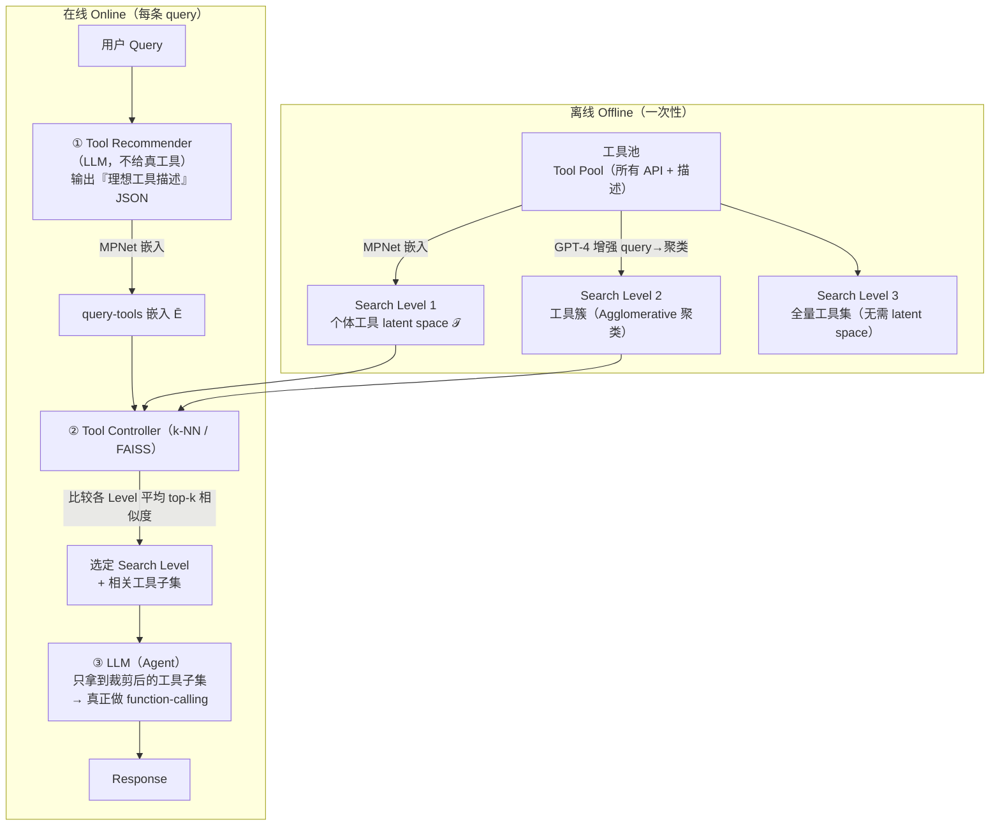

# Less-is-More：为边缘设备上的 LLM 执行优化函数调用

> **本篇属于 agent-harness 库 C 组（工具接口 / T 层）**。它回答一个我们每天都在碰的工程问题：**该给 agent 塞多少工具？**
> 直觉上"工具越多越全能"，本文用边缘设备上的硬数据给出反直觉答案——**给全量工具会让小模型『被选项淹没』而选错**，
> 先把工具裁到相关子集，反而**准确率升、延迟降、功耗降**。这正是 Harness-Bench 标杆（2605.27922）里被当作业界轶事引用的
> Vercel"砍 80% 工具、成功率 80%→100%"现象的**受控学术版**。请对齐标杆范文的密度与诚实度阅读。

---

## §1　TL;DR（一页讲清这篇在干嘛）

> 主讲提示：开场先把"反直觉命题"抛出来——**更少的工具 = 更高的准确率**；再点明它打的是 harness 的 **T（工具）层**，且是免微调的 plug-and-play。

一句话：**不要把所有 API 工具一股脑塞进 LLM 的 prompt**。本文提出 **Less-is-More（简称 LiS）**——一个**免微调（fine-tuning-free）**的**动态工具选择**方案：运行时先让 LLM"凭空"描述它**觉得**该用什么工具（不给任何真工具），再用一个轻量的**相似度检索**把这些"理想工具描述"匹配到真实工具库里最近的子集，**只把这个小子集**交给 LLM 去真正做 function-calling（原文 §III、Fig. 1）。

- **打的是 harness 的哪一层（Θ1）**：本篇死死打在 **T（Tools/工具接口）层**——它不改模型、不改控制循环、不动上下文压缩策略，**只改『提供给模型的工具集合』这一个变量**。这使它成为全库里对"工具层设计"最纯粹的一次消融。
- **反直觉核心命题**：对边缘/小模型（<10B），**减少可用工具数会显著提升其决策能力**（原文 §III 开头 "key insight"：*selectively reducing the number of tools available to the LLM significantly improves its decision-making ability*）。给全量工具 → 上下文噪声大、选项互相"confusing" → 小模型选错；裁到相关子集 → 模型能 focus → 选对、跑通。
- **一张最有说服力的表（Θ2 实锤）**：Table II，Llama3.1-8b-q4_K_M 在 Nvidia Jetson AGX Orin 上跑同一条 GeoEngine 查询——**16K 上下文 + 46 个工具 → 失败（✗）**；**16K + 19 个工具 → 成功（✓）**；**8K + 19 个工具 → 成功（✓）且 17s/22W**。模型权重一字未改，**只把工具从 46 砍到 19**，就从失败变成功，还顺带省了时间和电。
- **面向什么场景（Θ4/Θ5）**：**边缘设备 + 量化小模型 + 工具库较大**。这三个条件叠加时增益最大；工具本就少、或模型本就强时，增益会收窄（见 §13 regime）。
- **权威性来源**：**DATE 2025**（Design, Automation & Test in Europe，EDA/嵌入式系统的旗舰会议之一）录用；作者来自 SIU 与 UT Austin，通讯作者 Dimitrios Stamoulis 长期做边缘 LLM / 硬件高效部署（本文多篇自引如 GeoEngine、Single-path NAS 均出自该线）。

**三条带走的结论**：
1. **"工具多"对小模型是负担不是福利**——tool-space 复杂度会吃掉小模型本就紧张的推理预算（Table I/II）。
2. **不必微调也能大幅提升 function-calling**——用一个 pretrained 句嵌入模型（MPNet）+ k-NN 检索就够，边缘上就能跑（§III-B/C）。
3. **裁工具是"一石三鸟"**：准确率↑、执行时间↓最多 70%、功耗↓最多 40%（Abstract + §IV），因为更少工具 ⟹ 更短上下文 ⟹ 更小 context window ⟹ 更快更省电。

---

## §2　问题与动机：为什么"给 LLM 全量工具"在边缘上是个坏主意

> 主讲提示：这一页用 Why 三连的"问题层"，讲清边缘 function-calling 的三重夹击——小模型能力弱、工具多噪声大、硬件预算紧。

**Why（问题层）——不解决会卡住什么？谁受影响？**

大模型（70B、400B）的 function-calling 已经很强，但**部署到边缘**（手机、Jetson 这类端侧）时，出于隐私（用户数据不能上云）、成本、延迟的考虑，往往只能换成 **<10B 的小模型**（1.5B、3.8B、7B、8B）（原文 §I）。问题是：

1. **小模型 + 量化后，function-calling 能力显著掉档**。原文 **Table I** 给了铁证：

| Benchmark | Full precision | q4_0 | q4_1 | q4_K_M | q8_0 |
|---|---:|---:|---:|---:|---:|
| **BFCL** [11] | 63.04% | **20.43%** | 34.35% | 39.57% | 44.35% |
| **GeoEngine** [12] | 63.91% | 43.04% | 59.57% | 56.96% | 53.04% |

   Llama3.1-8b 在 **BFCL** 上全精度成功率 **63.04%**，一旦量化到 **q4_0 就崩到 20.43%**（掉了 42.6 个百分点、近乎腰斩再腰斩）；在 **GeoEngine** 上全精度 63.91% → q4_0 43.04%。**量化让 off-the-shelf 小模型的 agentic 能力大幅劣化**（§I 原文："significant performance drop"）。
   - **两个有意思的细节**：① **量化位宽与成功率并非单调**——BFCL 上 q8_0(44.35%) > q4_K_M(39.57%) > q4_1(34.35%) > q4_0(20.43%) 大致单调，但 GeoEngine 上 **q4_1(59.57%) 反而高于 q8_0(53.04%)**，说明 function-calling 对量化方案的敏感度**依基准而变**，不能简单认为"位越多越好"。② **BFCL 掉得比 GeoEngine 惨**（q4_0 时 BFCL 20.43% vs GeoEngine 43.04%）——原文未解释，笔者推测因 BFCL 工具更多（51 vs 46）、单步任务对"一次选对"更敏感，量化引入的噪声更易致命。
   - **这张表对全文的作用**：它**先证明了"病"**（量化小模型 function-calling 崩），§IV 的 LiS 才是"药"。注意 LiS **不修模型**（不改量化），而是通过**改工具界面**把成功率救回来——这是"harness 侧"与"模型侧"两条正交路线的分工。
2. **工具一多，小模型直接被"选项淹没"**。原文用一个 GeoEngine 的真实查询开场：*"Plot the fmow VQA captions in UK from Fall 2009"*。GeoEngine 给每条 query 配了 **46 个工具**让 LLM 挑。结果（Table II）：Llama3.1-8b-q4_K_M 虽然有 16K 上下文**装得下**全部 46 个工具，**却选不对、任务失败**——"because of the large number of available options confusing the LLM"（§I 原文）。
3. **硬件预算被"长上下文"吃光**。工具越多 → 塞进 prompt 的 tool-description 越长 → 需要越大的 context window → **执行时间和功耗越高**（§I）。边缘设备最缺的恰恰是这两样。

**Why（问题层）的关键观察句（原文直引，作为动机锚点）**：
> "when only 19 tools are passed, the LLM chooses the correct tool and completes the query successfully. This reduction in tools helps the LLM focus and results in a higher success rate. Moreover, it significantly decreases execution time. In essence, providing **fewer** options enables the LLM to make more accurate and faster decisions."（§I）

于是作者把要解决的事一句话形式化（§I 末）：**设计一个机制，动态地把可用工具集裁小、并相应调小上下文窗口，以同时优化边缘上的性能与能效**（*dynamically reduces the set of tools available to the LLM while adjusting the context window accordingly*）。

> **读出什么**：这篇的动机**不是**"让模型更聪明"，而是"**别用工具噪声把小模型本就有限的注意力预算浪费掉**"。这是一个非常"harness 工程"的视角——**同一个模型，改改它的输入界面（少给点工具），就能把它从『失败』救回『成功』**。这正是本库 T 层的核心命题。

---

## §3　核心 intention 与形式化：一句话 + 一个反直觉假设

> 主讲提示：把命题浓缩成一句可证伪的假设，方便后面用实验去打。

**核心 intention（原文 §III 首段）**：`Less-is-More` 的核心思想是 **"avoid presenting the LLM with all tools upfront"（不要一上来就把所有工具摆给 LLM）**。

**可证伪假设 H**：对于能力受限（小 / 量化）的 LLM，存在一个"甜点"工具子集大小 —— 把工具从"全量 N"裁到"相关子集 k′"（k′ ≪ N），能**同时**：
- 提升工具选择准确率与任务成功率（因为减少了 tool-space 的干扰）；
- 降低执行时间与功耗（因为上下文更短、context window 更小）。

**关键工程约束 C**：整个裁剪机制必须**免微调、免重训**，且**轻到能在边缘设备本地跑**（§I 贡献❶、§III-B："negligible overhead"）。这排除了两类看似显然的替代（见下 Why 设计层）。

> **读出什么**：H 的反直觉之处在于——常识认为"工具召回越全越安全"，但在**弱模型 regime** 下，"多召回"带来的**噪声惩罚**超过了"漏召回"的风险。本文赌的是前者。§IV 的四项指标全面变好，就是在为 H 背书。

---

## §4　相关工作定位：它站在谁肩上、和谁不同

> 主讲提示：用一张对比表把"工具选择/压缩"这条线的前人一次性摆清，突出本文"免微调 + 边缘可跑 + 多粒度检索"三个差异点。

本文把相关工作分成三簇（§II），逐一说明"为什么它们在边缘上不够用"：

| 方法 / 系统 | 核心做法 | 为什么在**边缘 + 小模型**上不够用（本文的批评） | 本文如何不同 |
|---|---|---|---|
| **Gorilla** [1] | RAG-based 工具检索，把 query 匹配到工具本体 | 检索**遍历整个工具本体**，近似"只用 Level 1（个体工具）"，粒度单一 | 本文引入**多粒度**（个体/簇/全量三级 Search Level），按 query 复杂度自适应选粒度 |
| **TinyAgent** [10] | 训一个 transformer 分类器做工具选择 | **需要训练/微调**，换新工具就要重训，不 scalable across function spaces | 本文**免微调**，换工具只需把新工具嵌入进 latent space（一次性 offline） |
| **Octopus** [30] | 微调小 LLM + token-masking 纠正响应错位 | 同样**依赖微调**，绑定特定数据集，泛化差 | 同上，本文用相似度检索替代微调 |
| **Tool "compilation" / LLMCompiler** [31][32] | 用一个**独立的全精度 GPT** 当 compiler，优化每次 LLM 调用执行的工具数 | 需要**standalone 全精度模型**跑 compiler 逻辑，算力/功耗受限的边缘**跑不起**；[33]–[35] 亦然 | 本文的匹配用**部署的 LLM 自身 + 一个廉价 pretrained 嵌入 tokenizer** 就能完成，无需额外大模型 |
| **ToolLLM** [29] | 树搜索（DFSDT）最小化所需工具数 | 需要**在整个工具集上多次 LLM 调用**做树搜索 → 边缘上**延迟/功耗不可接受**；作者实测**"塞不进板子"**（§IV："its tree-based exploration could not fit on the board"） | 本文用一次"Recommender 描述 + 一次 k-NN 检索"，开销可忽略 |
| Tool/query caching [27][28] | 缓存并复用近期/高频 LLM 输出 | 收益主要在**存储不受限的云端**；边缘存储紧张 | 本文不依赖缓存 |
| Edge-LLM / Routerbench [23][24] | 自适应层电压 / 本地-远程路由（MoE、级联） | 涉及**远程执行**，隐私敏感场景（API 会碰用户数据）不适用 [26] | 本文全程**端侧**，无远程调用 |

**Why（设计层）——为什么不直接用 ToolLLM 的树搜索 / 或用一个 GPT compiler？**
> 朴素替代 A：**用 ToolLLM 那样的树搜索**在全工具集上找最小工具集。→ 会因为**在整个 tool ontology 上反复 LLM 调用**，在边缘造成**不可接受的延迟与功耗**；作者亲测**装不进 Jetson 板子**（§IV）。
> 朴素替代 B：**用一个独立的全精度 GPT 当 tool compiler**（LLMCompiler 路线）。→ 边缘设备**没有算力/功耗预算**再养一个全精度大模型专门做工具编排（§II）。
> 本文改用 **"部署的 LLM 先描述理想工具 + 一个 pretrained MPNet 嵌入做 k-NN 检索"**：匹配这一步**不跑任何额外大模型**，只用一个廉价嵌入器 + FAISS，开销可忽略（§III-B/C）。这就是它能"落到边缘"的根本原因。

> **读出什么**：本文的差异化不在"检索工具"这件事本身（Gorilla 已经在做），而在三点叠加——**① 免微调**（vs TinyAgent/Octopus）、**② 边缘可跑 / 无额外大模型**（vs LLMCompiler/ToolLLM）、**③ 多粒度自适应**（vs Gorilla 的单一 Level-1）。

---

## §5　方法总览（big picture）：三大部件 + 离线/在线两阶段

> 主讲提示：先给一图流的直觉——离线把"工具地图"画好，在线让 LLM 先"凭空许愿"再按图索骥找最近的真工具。

`Less-is-More` 由三个部件组成（§III、Fig. 1）：

1. **Search Levels（搜索层级，离线构建）**：把工具组织成**三种粒度**的表示——① 个体工具（Level 1）、② 工具簇（Level 2）、③ 全量工具集（Level 3）。前两级的 latent space 都在**离线**一次性建好。
2. **Tool Recommender（工具推荐器，在线）**：运行时**不给任何真工具**，只让 LLM 根据 query 去"推理"该用什么工具、需要几个、什么类型，输出一份 **JSON 格式的"理想工具描述"**。
3. **Tool Controller（工具控制器，在线）**：把 LLM 的"理想工具描述"嵌入到 latent space，用 **k-NN** 在 Level 1/2 里检索最近的真工具/簇，比较各 Search Level 的平均相似度分，**选定粒度**并最终确定"要真正交给 LLM 的工具子集"。



**Why（设计层）——为什么让 LLM 先"凭空描述理想工具"，而不是直接拿 query 去检索工具？**
> 朴素做法是：**直接用 query 文本**去工具库里做相似度检索（最原始的 RAG 工具选择）。→ query 的措辞（如 "Plot the fmow VQA captions..."）和工具的**函数式描述**（如 `plot_geospatial(...)`）在词面/语义上**未必对齐**，检索容易偏。
> 本文改用 **Recommender 先让 LLM 生成"理想工具的功能描述"**（例如 query "纽约天气顺便翻译成法语" → LLM 生成 `weather_information()` 与 `text_translation()` 两个理想工具的定义，§III-B）。→ 这些"理想描述"天生就长得像**工具描述**，再用**同一个 tokenizer** 去匹配真工具，**同构对齐**，检索更准。而且因为**没有真工具被 append 进 prompt**，这一步的 token 开销可忽略（§III-B："negligible overhead"）。

> **读出什么**：这套"**先许愿（generate ideal tools）→ 再按图索骥（match to real tools）**"的两步，本质是把"query→tool"的**跨模态检索**，转成了"ideal-tool-desc→real-tool-desc"的**同模态检索**，用 LLM 自己的语言能力当"翻译桥"。这是本文最精巧的一招。

---

## §6　符号与术语表

> 主讲提示：一次性把后文要用的记号钉死，看表时不用回翻。

| 记号 / 术语 | 中文 | 定义（原文出处） |
|---|---|---|
| **LiS** | Less-is-More | 本文方法简称（§IV） |
| **Recommender** | 工具推荐器 | 运行时不给真工具、让 LLM 生成"理想工具描述"的 LLM 角色（§III-B） |
| **Controller** | 工具控制器 | 用 k-NN 在 latent space 里把"理想工具"匹配到真工具、并选定 Search Level 的部件（§III-C） |
| **Search Level 1** | 搜索层级 1（个体工具） | latent space $\mathcal{T}$，由所有 API 工具描述经 MPNet 嵌入得到（§III-A） |
| **Search Level 2** | 搜索层级 2（工具簇） | 由 GPT-4 增强 query → 映射到"增强 latent space" $\hat{\mathcal{A}}$ → Agglomerative 聚类得到的工具簇（§III-A） |
| **Search Level 3** | 搜索层级 3（全量工具集） | 默认 function-calling，把**全部** API 以 JSON 塞进 prompt，无 latent space（§III-A） |
| $\mathcal{T}$ | 个体工具 latent space | 所有工具描述的 768 维嵌入集合（§III-A） |
| $\hat{\mathcal{A}}$ | 增强 latent space | 用 GPT-4 生成的"上下文相近的额外 query"映射进的 latent space，用于聚类（§III-A） |
| $\bar{\mathcal{E}}$ | query-tools 嵌入 | LLM 推荐的"理想工具描述"+用户任务，经 MPNet 映射得到的 728 维嵌入（§III-B/C） |
| **MPNet** | Masked & Permuted Net [37] | pretrained 句嵌入模型，充当 embedding tokenizer；生成 768/728 维向量 |
| **k / top-k** | 检索的近邻数 | Controller 用 k-NN 检索的 top-k 个工具/簇；实验测了 **k=3、k=5**（§III-C、§IV） |
| **Search Mode Parameter** | 搜索模式参数 | 决定用哪个 Search Level 的参数（Fig. 1 里的输入之一） |
| **Fallback** | 回退机制 | 若两个 Level 的平均 top-k 分**都 < 0.5**（低置信），或函数调用重试后仍失败，则回退到 **Level 3（全量工具）**（§III-A/C） |
| **BFCL** [11] | Berkeley Function-Calling Leaderboard | 通用 function-calling 基准；本文用其 51 个函数、mini-batch 230 条 query（§IV） |
| **GeoEngine** [12] | 地理空间 copilot 基准 | 面向应用、需**顺序**多步调用（后一步依赖前一步）；46 个函数（§IV） |
| **Tool Accuracy** | 工具准确率 | LLM 从可用选项中**选对工具**的频率（§IV，指标 i） |
| **Success Rate** | 成功率 | 不仅选对、还**用对**（正确参数类型等）、任务完成（§IV，指标 ii） |
| **Normalized Exec. Time** | 归一化执行时间 | 完成一条 query 的平均耗时，**相对 baseline 归一化**（§IV，指标 iii） |
| **Normalized Power** | 归一化功耗 | 处理一条 query 的平均功耗，**相对 baseline 归一化**（§IV，指标 iv） |

---

## §7　方法细节 A：离线构建三级 Search Level

> 主讲提示：这页讲"离线把工具地图画好"。重点讲为什么要三种粒度、Level 2 的簇为什么不能用朴素文本聚类。

**总原则（§III-A 首）**：为应对不同复杂度的 query 与性能需求，设三种粒度的搜索空间；构建时**尽量把运行时开销压到最小**，灵感来自 RAG 的相似度检索 [36]。所有工具描述先用 **MPNet**（基于 [37]）映射成 **768 维** latent space。

**Search Level 1 —— 个体工具（$\mathcal{T}$）**
- 做法：把**每个** API 工具的描述单独嵌入，构成 latent space $\mathcal{T}$。这一步是**预处理、离线**完成，确保运行时实时查询高效（§III-A）。
- 适用：**简单、单工具**的 query（如单函数任务）。优先速度——直接把 LLM 生成的"理想工具描述"匹配到个体工具。
- 局限：只看"工具间的 latent 邻近"，对需要**多工具协作**的复杂 query 可能不准 → 引出 Level 2。

**Search Level 2 —— 工具簇（$\hat{\mathcal{A}}$ + 聚类）**
- **Why（设计层）为什么不直接对工具文本描述做聚类？**
  > 朴素做法：直接拿工具的**文本描述**去跑聚类。→ 会得到**poorly capture tool-usage patterns**（不能反映"工具怎么被一起用"）的簇。举例（§III-A 原文）：一个"翻译文档然后在浏览器里打开"的任务，需要**文档类**工具 + **UI 类**工具协作，但朴素文本聚类会把它们**分到不同簇**——因为文本上不相似，可用法上相关。
  > 本文改用**基于任务的增强聚类**：借鉴 benchmark augmentation [26][38]，先用 **GPT-4（Turbo 0125）** 对已有 query 做增强——生成"上下文相近的额外 query"（每类别从 training set 抽 10 条，仿 ToolQA [38]），因为 BFCL/GeoEngine 都给了 query 类别（wiki/document/math…）。这些增强 query 是"noisy"的、只用于聚类，其"事实正确性"不重要（§III-A 原文明说），质量用 **ROUGE 分**度量以保证多样、不冗余。
- 做法：把增强 query 映射进"增强 latent space" $\hat{\mathcal{A}}$，再跑 **Agglomerative Clustering（凝聚层次聚类）** [39]——每条 query 起初自成一簇，按 $\hat{\mathcal{A}}$ 里的相似度距离**递归合并**最相似的簇。这样得到的簇能**捕捉工具间的协同关系**（synergistic relationships）。
- 适用：需**多工具协作**的复杂 query。

**Search Level 3 —— 全量工具集**
- 做法：就是**默认 function-calling** —— 把**全部** API 以完整 JSON 塞进 LLM 调用，**不建 latent space、不做检索**（§III-A）。
- 角色：既是 **baseline**，也是 LiS 的 **fallback 目标**（低置信时回退到这里，保证不比默认差）。

**补一个指标定义：增强 query 的"质量"怎么量（ROUGE）**

原文用 **ROUGE 分** [12][38] 衡量 GPT-4 生成的增强 query 的质量，以"确保多样、无冗余"（§III-A）。原文未展开 ROUGE 公式，按本库规范补齐：

> 直觉：我们要的增强 query 是"**与原 query 相关、但措辞不同**"的 noisy 变体——既不能跑题、又不能是原句复读。ROUGE 通过"n-gram 重叠召回"来度量两段文本的内容重合度，太高说明只是复读（冗余）、太低说明跑题。

记号：设候选 query 为 $c$、参考 query 为 $r$；$\text{gram}_n(\cdot)$ 为文本的 n-gram 集合。**ROUGE-N 召回**定义为：

$$\text{ROUGE-N}(c, r)\;=\;\frac{\big|\text{gram}_n(c)\cap \text{gram}_n(r)\big|}{\big|\text{gram}_n(r)\big|}$$

**读出什么**：本文把它当"多样性闸门"——用 ROUGE 筛掉与已有 query 过度重叠的生成结果，保证聚类阶段的增强样本**覆盖不同工具组合**（§III-A "diverse tool combinations without redundancy"）。注意这里 ROUGE 的用途**不是评生成质量的对错**（原文明说增强 query 的"factual correctness is less critical"），而是**保多样**。

> **读出什么**：三级粒度对应"query 复杂度阶梯"——单工具走 Level 1（快），多工具协作走 Level 2（准），拿不准就 Level 3（全给，安全兜底）。**Level 2 的"用 GPT-4 增强 + 凝聚聚类"是全文最重的离线工程**，目的就一个：让簇反映"工具协同用法"而非"文本相似"。

---

## §8　方法细节 B：Tool Recommender —— 让 LLM 先"凭空许愿"

> 主讲提示：这页讲在线第一步。关键卖点：不给真工具，所以几乎零 token 开销。

**做法（§III-B）**：运行时，给定 user query 但**不提供任何工具**，提示 LLM（充当 Recommender）去**生成"完成任务所需的理想工具"的描述**，返回一份**结构化 JSON**，逐个说明每个推荐工具的功能。

**例子（§III-B 原文）**：query = *"What's the weather like in New York and can you translate that information into French?"* → LLM 生成两个理想工具定义：`weather_information()`（取天气）与 `text_translation()`（翻译文本），并解释各自功能。

**关键性质**：因为**此时没有任何真工具 API 被 append 进 prompt**，这一步引入的开销**相对后续 function-calling 可忽略**（§III-B 原文："negligible overhead compared to the subsequent function calling"）。随后用**同一个 pretrained MPNet tokenizer**，把这些"理想工具描述 + 对应用户任务"一起映射成 **728 维嵌入** $\bar{\mathcal{E}}$，供下一步高效工具匹配。

> **Why（结果层）——为什么这一步"几乎不要钱"却很关键？**
> function-calling 的 token 成本大头是"把 N 个工具的完整 JSON schema 塞进 prompt"。Recommender 阶段**一个真工具都不塞**，只让 LLM 输出一小段"理想工具描述"，所以**上下文极短**。它却撬动了后面最关键的一步：把"用户措辞"翻译成"工具措辞"，让检索同构对齐。**用最小的 token 代价，换最大的检索对齐收益**——这是本文"less is more"在 token 层面的第二重含义。

> **读出什么**：注意这里有个微妙的维度差——工具 latent space $\mathcal{T}$ 是 **768 维**（§III-A），而 query-tools 嵌入 $\bar{\mathcal{E}}$ 写作 **728 维**（§III-B/C）。原文两处数字不一致，**原文未给出解释**（可能是笔误，MPNet-base 标准输出为 768 维）。汇报时可诚实标注为"疑似 typo，以 768 为准"。

---

## §9　方法细节 C：Tool Controller —— 按图索骥 + 自适应选粒度

> 主讲提示：这页讲在线第二步，也是"less is more"真正落地的地方——k-NN 检索出小子集 + 比较各 Level 分数自动选粒度。

**做法（§III-C）**：给定 LLM 推荐的 query-tools 嵌入 $\bar{\mathcal{E}}$ 与工具空间表示（$\mathcal{T}$ 和 $\hat{\mathcal{A}}$），Controller 遵循 RAG 原则，用 **k-Nearest Neighbors（k-NN）**、在 **FAISS 相似度** [40] 下、对 **Search Level 1 和 Level 2** 各检索 **top-k** 个"与 LLM 工具选择推理最接近"的（个体工具 / 簇）。然后**比较各 Search Level 的 top-k 相似度值**，**选平均分最高的那个 Level**。

**把"选粒度"写成式子（直觉 → 符号 → 公式 → 读出什么）**：

> 直觉：我们手里有一份 LLM"许愿"出来的理想工具向量 $\bar{\mathcal{E}}$，想知道它"更像一堆散装的个体工具"还是"更像一个成套的工具簇"。办法是分别在两级里找出 **top-k 最近邻**、看**哪一级的近邻整体更贴**（平均相似度更高），就用哪一级。

记号（先定义后用式）：
- $\bar{\mathcal{E}}$：LLM 推荐的 query-tools 嵌入（§III-B）；
- $\mathcal{T}$：Level 1 的个体工具嵌入集合；$\hat{\mathcal{A}}$（对应的簇代表）：Level 2 的簇表示集合；
- $\operatorname{sim}(\bar{\mathcal{E}}, x)$：$\bar{\mathcal{E}}$ 与候选 $x$ 的 FAISS 相似度（$x$ 为工具或簇）；
- $\operatorname{topk}_{x\in S}$：在集合 $S$ 中取相似度最高的 $k$ 个候选（$k\in\{3,5\}$，§IV）。

定义每级的"平均 top-k 相似度分"：

$$\text{score}(\ell) \;=\; \frac{1}{k}\!\!\sum_{x\in\,\operatorname{topk}_{x'\in S_\ell}\operatorname{sim}(\bar{\mathcal{E}},\,x')}\!\!\operatorname{sim}(\bar{\mathcal{E}},\,x),\qquad S_1=\mathcal{T},\;\; S_2=\hat{\mathcal{A}}$$

再据此选粒度（含 fallback）：

$$\ell^\star \;=\;
\begin{cases}
3\ (\text{全量工具}) & \text{if } \max\big(\text{score}(1),\text{score}(2)\big) < 0.5\\[4pt]
\arg\max_{\ell\in\{1,2\}}\text{score}(\ell) & \text{otherwise}
\end{cases}$$

**读出什么**：① 阈值 **0.5** 是"置信闸门"——两级都不够贴（都 <0.5）就**不敢裁**，退回 Level 3 全量（§III-A/C 原文）。② $\arg\max$ 体现自适应：简单单工具 query 通常 $\text{score}(1)$ 高、复杂协作 query 通常 $\text{score}(2)$ 高，于是分别路由到个体/簇。③ 这套式子把"该裁到多细"这个决策，**完全交给相似度分这个数据信号**，没有任何硬编码的"该给几个工具"。

**直觉（§III-C 原文）**：
- 对**简单、单工具** query：LLM 大概只推荐一个理想工具描述 → 它与**个体工具**（Level 1）的相似度会更高 → 选 Level 1。
- 对**多工具** query：LLM 的推荐更可能整体匹配一个**工具簇**（Level 2）→ 选 Level 2。
- 最后：只把 Controller 选出的**工具子集**交给 LLM，真正做 function-calling（**只用这个子集**，不用全量）。

**Fallback（低置信兜底，§III-A/C）**：
- 若**两个 Level 的平均 top-k 分都 < 0.5**（表示对选 Level 1/2 都没信心）→ **回退到 Level 3（全量工具）**，即默认行为。
- 提示里还指示 LLM：若某步 function-calling 失败，就**返回错误信息**；若重试后仍失败 → 下一次调用也**默认回退到 Level 3**（§III-A）。

**与 Gorilla 的关键区别（§III-C 末）**：Gorilla [1]（及 [29]）也用相似度做工具选择，但它的检索是**在整个工具本体上进行**——这**近似于本文只用 Level 1**。本文**据作者所知是首个**考虑"多粒度 latent 检索"、且**不诉诸复杂树搜索**、从而在"任务复杂度 / 工具多样性 / 边缘硬件开销"之间取得平衡的方案（§III-C 原文自述 "to our knowledge, we are the first…"）。

> **Why（设计层）——为什么要"比较各 Level 分数自动选"，而不固定用某一级？**
> 朴素替代：永远用 Level 1（像 Gorilla）。→ 遇到多工具协作 query 会**漏掉需要一起用的工具**（回到 §7 那个"文档+UI"的例子）。永远用 Level 2？→ 简单单工具 query 上，簇会**带进无关工具**，反而稀释。
> 本文让 Controller **用 top-k 相似度分当"置信信号"**，query 简单则 Level 1 分高、query 复杂则 Level 2 分高，**自动路由**；两边都没把握就 Level 3 兜底。这是把"该裁多细"这个决策**交给数据（相似度分）**而非硬编码——既拿裁剪的收益，又用 fallback 兜住风险下限。

> **读出什么**：整条在线链路 = **Recommender（LLM 许愿，几乎零开销）→ Controller（k-NN 找最近真工具 + 比分选粒度）→ Agent（只拿小子集做 function-calling）**。"less"发生在最后一步：交给 LLM 的工具数从"全量 N"降到"top-k 子集"。而 fallback 保证了**下限不低于默认**（最坏情况退回 Level 3）。

**把整条 pipeline 写成伪代码（综合 §III-A/B/C；原文以文字 + Fig. 1 描述，此处按其语义整理）**：

```text
# ---------- 离线 OFFLINE（一次性）----------
Build_Search_Levels(tool_pool):
    T  = { MPNet(desc(tool)) for tool in tool_pool }          # Level 1: 个体工具嵌入 (768-d)
    Q+ = GPT4_augment(train_queries, per_category=10)         # 生成上下文相近的 noisy query
    Q+ = filter_by_ROUGE(Q+)                                  # 保多样、去冗余
    A_hat = { MPNet(q) for q in Q+ }                          # 增强 latent space
    clusters = AgglomerativeClustering(A_hat)                 # Level 2: 反映"工具协同用法"的簇
    return T, clusters                                        # Level 3 = 全量工具，无需索引

# ---------- 在线 ONLINE（每条 query）----------
LessIsMore(query, T, clusters, all_tools, k):               # k ∈ {3, 5}
    # ① Recommender：不给任何真工具，让 LLM"许愿"
    ideal_tools_json = LLM_recommend(query, tools=NONE)      # 输出理想工具描述 (JSON)，开销可忽略
    E_bar = MPNet(ideal_tools_json + query)                  # query-tools 嵌入

    # ② Controller：k-NN 检索 + 比分选粒度
    top1 = FAISS_kNN(E_bar, T,        k)                     # Level 1 的 top-k 个体工具
    top2 = FAISS_kNN(E_bar, clusters, k)                     # Level 2 的 top-k 簇
    s1, s2 = mean_sim(top1), mean_sim(top2)

    if max(s1, s2) < 0.5:                                    # 低置信 → fallback
        subset = all_tools                                  # Level 3（全量，等于默认）
    elif s1 >= s2:
        subset = top1                                        # Level 1（个体工具子集）
    else:
        subset = expand_tools(top2)                         # Level 2（把选中簇展开成工具集）

    # ③ Agent：只用裁剪后的子集做真正的 function-calling
    try:
        return LLM_call(query, tools=subset)                # 上下文更短 → 窗口可降到 8K
    except FunctionCallError:                                # 重试仍失败 → 退回全量
        return LLM_call(query, tools=all_tools)
```

> **读出什么（复杂度视角）**：在线阶段的**额外开销**只有"一次 Recommender LLM 调用（短上下文）+ 两次 FAISS k-NN 检索"。相比之下，ToolLLM [29] 要在**整个工具集上做树搜索**（多次 LLM 调用），LLMCompiler [31] 要**额外养一个全精度 GPT**。本文把工具裁剪的在线成本压到"**一次短调用 + 两次向量检索**"，这正是它能落到 Jetson 边缘板的根本原因（§III-B "negligible overhead"）。

---

## §10　实验设置：两个基准、六个模型、四个量化、四项指标

> 主讲提示：这页把 setting 一次性讲全——尤其两个基准的"难度差异"和四项指标的定义。

**基准（§IV）**：
- **BFCL** [11]（Berkeley Function-Calling Leaderboard）：通用 function-calling。**每条 query 主要是单函数调用**（即便 query 含无关子问题，也是各子问题独立处理，不需跨函数传状态）→ **较简单**。用 **51 个函数**，mini-batch **230 条 query**。
- **GeoEngine** [12]：面向应用的地理空间 copilot。需要**顺序多步**函数调用，**后一步依赖前一步结果** [41] → **较难**。用 **46 个函数**，同样 mini-batch **230 条 query**。
- **有趣发现（§IV）**：BFCL 上 **Search Level 1**（个体工具）给出更好的工具匹配分；GeoEngine 上则是 **Search Level 2**（簇）更好——**印证了"简单任务走个体、复杂协作任务走簇"的设计直觉**。

**硬件（§IV）**：**NVIDIA Jetson AGX Orin** [13] 作为边缘设备。

**四项指标（§IV）——先给直觉，再给定义式**：

原文对四项指标只给了文字定义（§IV），未写公式。下面按本库规范，把文字定义**补成精确的定义式**（记号先定义），并标注"式子为笔者按原文语义补齐、非原文直给"。

记号（先定义后用式）：设评测集有 $N$ 条 query，第 $i$ 条记为 $q_i$；$\mathbb{1}[\cdot]$ 为示性函数（真取 1、假取 0）。

**(i) Tool Accuracy（工具准确率）** [1] —— 直觉：只问"**选没选对**工具"，不管后续用得对不对。

$$\text{ToolAcc} \;=\; \frac{1}{N}\sum_{i=1}^{N}\mathbb{1}\big[\hat{t}(q_i)=t^\star(q_i)\big]$$

其中 $\hat{t}(q_i)$ 是 LLM 为 $q_i$ 实际选中的工具，$t^\star(q_i)$ 是标注的正确工具。**读出什么**：这是最宽松的一档——选对就算对，哪怕参数填错、任务最终没跑通。

**(ii) Success Rate（成功率）** [12] —— 直觉：**又选对、又用对、任务真完成**才算。比 ToolAcc 严格得多。

$$\text{SuccRate} \;=\; \frac{1}{N}\sum_{i=1}^{N}\mathbb{1}\big[\hat{t}(q_i)=t^\star(q_i)\;\wedge\;\text{args valid}\;\wedge\;\text{task completed}\big]$$

**读出什么**：$\text{SuccRate}\le\text{ToolAcc}$ 恒成立（选对是成功的必要条件）。二者的**差**恰好度量"**选对了却用错**"（参数类型错、多步状态传递错）的比例——在 GeoEngine（多步）上这个差会更大。

**(iii) Normalized Execution Time（归一化执行时间）** —— 直觉：完成一条 query 平均要多久，**相对默认基线归一化**（消除设备绝对速度的影响，只看相对改善）。

$$\text{NormExecTime} \;=\; \frac{\overline{T}_{\text{method}}}{\overline{T}_{\text{baseline}}},\qquad \overline{T}=\frac{1}{N}\sum_{i=1}^{N}T(q_i)$$

其中 $T(q_i)$ 是处理 $q_i$ 的墙钟时间，$\overline{T}_{\text{baseline}}$ 是 default（全量工具、16K）的平均耗时。**读出什么**：$<1$ 即比默认快；文中"↓80%"等价于 $\text{NormExecTime}\approx0.2$。

**(iv) Normalized Power Consumption（归一化功耗）** —— 直觉与 (iii) 同构，把"时间"换成"功耗"。

$$\text{NormPower} \;=\; \frac{\overline{P}_{\text{method}}}{\overline{P}_{\text{baseline}}},\qquad \overline{P}=\frac{1}{N}\sum_{i=1}^{N}P(q_i)$$

其中 $P(q_i)$ 是处理 $q_i$ 时设备的平均功耗（W）。**读出什么**：$<1$ 即比默认省电；"↓40%"等价于 $\text{NormPower}\approx0.6$。

> **读出什么（四项指标的内在关系）**：(i)(ii) 是"**质量轴**"、(iii)(iv) 是"**代价轴**"。本文的卖点是**两轴同时改善**——通常"提准确率"要靠"更大模型/更长上下文"，是拿代价换质量；而裁工具是**罕见的双赢**：少给工具**既**减少了干扰（质量↑）**又**缩短了上下文（代价↓）。这就是"less is more"能成立的结构性原因。

**被测模型（6 个，§IV）**：
- Hermes2-Pro-8b [42]（为 NLU + function-calling 优化的 LLaMA 变体）
- Llama3.1-8b [43]（SOTA 语言微调模型）
- Mistral-8b [44]（主打速度与效率）
- Phi3-8b [7]（面向特定任务）
- Qwen2-1.5b [45]（更小、面向受限资源）
- Qwen2-7b（更大、处理更复杂语言任务）

**量化变体（每个模型 4 种，§IV）**：q4_0（4-bit，省内存）、q4_1（改进精度版）、q4_K_M（引入混合精度求平衡）、q8_0（8-bit，高精度但更耗内存）。

**LiS 配置（§IV）**：测了 **k=3** 与 **k=5** 两档。

**Baselines（§IV）**：
- **default**：通过 Ollama [9] 用默认全量工具（context window 设 **16K**）。
- **Gorilla** [1]：相似度检索选"最相似单一工具"的方法。
- （尝试对比 **ToolLLM** [29] 但**其树搜索塞不进板子**，无法上机 → 只能定性提及。）

**Context window 设定（§IV，关键公平性细节）**：为各模型确定"装下所有工具 + 通信"所需的**最小上下文窗口**。default 模型走 Ollama 用 **16K**；**Gorilla 与 LiS 因为工具少，统一降到 8K**（跨所有 k 值）。作者还试过给 default 用 >16K，发现**成功率无明显提升、执行时间反而显著上升**，故 default 定在 16K。

> **读出什么（一个公平性张力）**：LiS 在 **8K** 上下文上跑，default 在 **16K** 上跑。这既是 LiS 的**收益来源**（工具少→窗口小→更快更省电），也是一个**混杂因素**——"变好"里有多少来自"工具选得准"、多少来自"上下文更短"，论文没有严格拆开。汇报时要诚实点出（见 §14 批判）。

---

## §11　主结果 A：Table II —— "46 工具失败 / 19 工具成功"的实锤

> 主讲提示：这是全场最该停留的一张表。先报"失败→成功"的定性翻转，再报省时省电的定量。

**Table II（Llama3.1-8b-q4_K_M 在 Jetson AGX Orin 上跑同一条 GeoEngine 查询）**：

| Context window | # Tools | Successful | Exec. time (s) | Power (W) |
|---|---:|:---:|---:|---:|
| 16K | **46** | **✗（失败）** | 30 | 27 |
| 16K | **19** | ✓（成功） | 20 | 26 |
| 8K | **19** | ✓（成功） | **17** | **22** |
| **Max drop** | | | **↓ 43%** | **↓ 19%** |

**读法（§I 配合 Table II）**：
- **第 1 → 第 2 行**：上下文**同为 16K**（都装得下 46 工具），**只把工具从 46 砍到 19**——结果从**失败翻转为成功**，且执行时间 30s→20s、功耗 27W→26W。**这一行单独就证明了核心命题**：不是"装不下"，而是"选项太多把模型搞晕了"。
- **第 2 → 第 3 行**：工具都是 19，**再把上下文从 16K 降到 8K**——仍成功，且 20s→17s、26W→22W。说明"工具少了之后，上下文也能跟着降，进一步省时省电"。
- **Max drop**：相对 baseline，执行时间最多降 **43%**、功耗最多降 **19%**（这张表内的极差；全实验里更大的降幅见 §12 Fig. 2/3）。

> **Why（结果层）——为什么"同样 16K、只砍工具"就能从失败变成功？**
> 因为**装得下 ≠ 用得好**。16K 上下文物理上容纳 46 个工具没问题，但 46 个工具描述构成的**巨大 tool-space** 会让 q4_K_M 这个量化小模型的**注意力被无关选项稀释**、决策被"confusing options"干扰（§I）。裁到 19 个**相关**工具后，模型的有效注意力集中在正确候选上，于是选对、跑通。这就是"less is more"最干净的一次实证——**收益来自『减少干扰』，而非『腾出空间』**。

> **读出什么（Θ2 直连）**：这张表就是 `Agent = Model + Harness` 的**微观实锤**——**Model 一字未改（同一个 q4_K_M 权重），只动了 Harness 的 T 层（工具集从 46→19），能力就从『失败』跃到『成功』**。它和 Harness-Bench 标杆里"NanoBot vs OpenClaw 差 23.8 分"是同一命题的两个尺度：宏观（换整个 harness）与微观（只换工具集大小）。

---

## §12　主结果 B：Fig. 2（BFCL）与 Fig. 3（GeoEngine）—— 六模型四指标全面变好

> 主讲提示：这两页图信息量极大，逐模型报"成功率/工具准确率/时间/功耗"四个数，突出"even 小模型也受益"。

**Fig. 2（BFCL，较简单基准；对比 default / Gorilla / LiS k=3 / LiS k=5）逐模型摘要（§IV 正文数字）**：

| 模型 | 成功率变化 | 工具准确率 | 执行时间 ↓ | 功耗 ↓ | 备注 |
|---|---|---|---:|---:|---|
| **Hermes2-Pro-8b** | → ~**71%** | → **89%** | **↓ 80%** | **↓ 45%** | Gorilla 也超 default，但低于 LiS；LiS 选/用工具都更准 |
| **Llama3.1-8b** | baseline → **44.2%** | → **93.8%** | **↓ 72%** | **↓ 30%** | 工具准确率跳到 93.8% 是亮点 |
| **Mistral-8b** | 无明显 success/tool 增益 | ~持平 | **↓ 77%** | **↓ 18%** | 压缩后 Mistral 能力有限；Gorilla 在 success/tool 上最差 |
| **Phi3-8b** | → **55%** | → **78%** | **↓ 55%** | **↓ 20%** | 全面提升 |
| **Qwen2-1.5b** | → ~**40%** | → **76%** | **↓ 48%** | **↓ 20%** | **最小模型也大幅受益**（"even lightweight models can benefit greatly"） |
| **Qwen2-7b** | → **68%** | → **87%** | **↓ 70%** | **↓ 27%** | 远超其 default，能更好处理复杂任务 |

BFCL 总结（§IV 原文）：**四项指标（成功率、工具准确率、执行时间、功耗）在所有 LLM 上全部改善**；机制是"减少可用工具 → 降低 confusion → 决策更准"，同时"更小上下文 + 更快决策 → 时间/功耗降"。**Gorilla 在多数情况提升成功率乏力**，因为它**只比工具相似度**（单一 Level-1 粒度）。

**Fig. 3（GeoEngine，较难基准；对比 default / Gorilla / LiS k=3 / LiS k=5）逐模型摘要（§IV 正文）**：

| 模型 | 成功率 | 工具准确率 | 执行时间 ↓ | 功耗 ↓ | 备注 |
|---|---|---|---:|---:|---|
| **Hermes2-Pro-8b** | → **63%** | → **64%** | **↓ 15%** | **↓ 6%** | GeoEngine 更难，增益幅度整体小于 BFCL |
| **Llama3.1-8b** | → **56%** | ~同步提升 | **↓ 40%** | **↓ ~12%** | |
| **Mistral-8b** | → **46%** | → **47%** | 部分变体 **↑10%**（更慢） | **↓ 9%** | 少数配置执行时间反升，但被成功率大增抵消 |
| **Qwen2-7b** | → **35%** | 类似趋势 | **↓ 21%** | 显著降 ~**13%** | |
| ~~Phi3-8b / Qwen2-1.5b~~ | **default 仅 ~10%** | — | 测量不可靠 | — | **两者被剔除出 GeoEngine 分析**（default 太低，时间/功耗测量 unreliable，§IV） |

GeoEngine 总结（§IV 原文）：GeoEngine 比 BFCL 更复杂（需顺序依赖调用），**Gorilla 在多数情况难以提升成功率**（它只查工具相似度，而 GeoEngine 需要"前后步依赖"）。**LiS 因为有 Level 2 簇检索**，更能覆盖"需要一组工具协作"的场景，故仍普遍改善。

> **Why（结果层）——为什么 GeoEngine 上增益幅度整体小于 BFCL？**
> 因为 GeoEngine 需要**顺序、有状态**的多步调用（后步依赖前步 [41]），"选对工具"只是成功的**必要非充分**条件——即便工具子集裁得准，模型仍可能在**多步状态传递**上出错。而 BFCL 多为单函数、无跨步状态，"选对工具"几乎就等于"成功"，所以裁工具的收益在 BFCL 上更直接、更大。**这条差异恰好回扣 Harness-Bench §12 的结论：越是"要串多步、要保状态"的任务，越吃 harness 的其它层（C/L），单靠 T 层裁工具的边际收益越有限。**

> **读出什么**：两张图合起来支持两个结论——**(1)** 裁工具在**简单单工具基准（BFCL）**上收益巨大且稳（六模型全绿）；**(2)** 在**复杂多步基准（GeoEngine）**上收益变小、个别配置执行时间还会升，因为"选对工具"不再等价于"任务成功"。这是一个**诚实且重要的 regime 边界**（见 §13）。

---

## §13　Regime 诚实：什么时候"少给工具"值得，什么时候不（Θ5）

> 主讲提示：这页是判断力的高地。**不要**把"less is more"讲成放之四海皆准——它有明确的适用边界。

把全文证据按"什么条件下裁工具值得"归纳，得到一张 **regime 地图**：

| 维度 | 裁工具**收益大**的一侧 | 裁工具**收益小 / 可能反噬**的一侧 | 证据 |
|---|---|---|---|
| **工具库规模** | 工具多（GeoEngine 46、BFCL 51）→ tool-space 噪声大，裁剪空间大 | 工具本就少 → 没什么可裁，Recommender/Controller 的开销可能不划算 | §I（46 工具致混淆）；§III 全文的前提假设 |
| **模型能力** | 小 / 量化模型（1.5b、q4_0/q4_K_M）→ 注意力预算紧，最怕干扰 | 强 / 全精度模型 → 本就能从大 tool-space 里选对，裁剪边际收益低 | Table I（量化后大幅掉档）；§I（fewer options 帮 focus） |
| **任务结构** | 单工具 / 无状态（BFCL）→ 选对≈成功，裁工具直接兑现 | 多步顺序 / 有状态（GeoEngine）→ 选对≠成功，收益被"多步误差"稀释；个别配置**执行时间反升** | Fig. 2 vs Fig. 3 的增益差；§IV（Mistral 部分变体 +10% 时间） |
| **粒度选择** | query 简单→Level 1；复杂协作→Level 2，自动路由到位时 | 若 Recommender 描述不准 / 两 Level 分都<0.5 → 退回 Level 3（等于没裁） | §III-A/C fallback；§IV（BFCL 偏 L1、GeoEngine 偏 L2） |

**与本库 G 组批判的呼应**：Harness-Bench（2605.27922）§9 发现"**强模型更不挑 harness**（跨 harness 方差更低）"；本文 Table I 从另一侧印证——**弱/量化模型对『工具界面』极其敏感**（量化即崩、工具多即错）。两篇拼出同一条 regime 律：**模型越弱、任务越需动手/多步，harness 的 T 层（工具集设计）越主导；模型越强、任务越偏单步，T 层越退居其次。**

> **读出什么（Θ5 诚实表述）**：本文标题 "Less is More" 是**有前提的真理**——前提是"**大工具库 + 弱模型 + 偏单步任务**"。抽掉任一前提，结论就会弱化甚至反转（GeoEngine 多步任务上已见执行时间反升的苗头）。这正是本库要求的 regime 诚实：**不把"少给工具更好"绝对化**。

---

## §14　局限与批判（原文 + 我的补充）

> 主讲提示：这页把"论文宣称"与"独立质疑"分开列，体现判断力。

**原文自陈 / 隐含的边界**：
- **Recommender 会犯错**：LLM 生成的"理想工具描述"可能失准；作者用 **fallback（两 Level 分<0.5 → 退 Level 3）** 兜底（§III-A/C），但这等于**放弃裁剪收益**。
- **多步任务收益有限**：GeoEngine 上部分配置**执行时间反升 ~10%**（Mistral），成功率增益也小于 BFCL（§IV）。
- **对比不完整**：想比 **ToolLLM** [29] 但**塞不进板子**，只能定性提及（§IV）——即缺一个"同为工具裁剪"的强 baseline 的正面对撞。

**我的补充批判（论文未充分回应）**：
- **"变好"的归因未拆开（最大方法学漏洞）**：LiS 在 **8K** 上下文跑、default 在 **16K** 跑（§IV）。于是"成功率↑/时间↓/功耗↓"里，**有多少来自『工具选得准』，多少来自『上下文本就更短』**？论文**没有做"同为 8K、只变工具数"的严格消融**（Table II 第 1↔2 行倒是控住了 16K，但那只是**单条 query 的案例**，不是整批统计）。这是汇报时最该被追问的点。
- **数字维度不一致**：latent space 一处写 **768** 维（§III-A）、query-tools 嵌入一处写 **728** 维（§III-B/C），**原文未解释**，疑似 typo。
- **Recommender 用哪个 LLM 未完全交代**：运行时"许愿"的 Recommender 是否就是最终做 function-calling 的那个边缘小模型？§III 读起来像是"部署的 LLM 自身"，但**离线 Level-2 增强明确用了 GPT-4（Turbo 0125）**（§III-A）——这带来一个**隐性依赖**：虽然在线不需大模型，但**离线聚类阶段依赖 GPT-4 增强**。若换全新工具域、无 GPT-4 可用，Level 2 的构建会受影响。
- **成功率绝对值仍不高**：即便优化后，GeoEngine 上多数模型成功率仍在 **35%–63%**（§IV）——**裁工具能"救回一部分"，但离"可靠部署"仍远**。它是"止血"，不是"治愈"。
- **无公开代码链接**：正文与参考未给 LiS 的 repo（对比 Gorilla/BFCL/GeoEngine 都有），**复现门槛偏高**（离线增强+聚类+多级检索需自行搭）。
- **稳健性/方差未报**：所有数字是 mini-batch 230 条 query 的均值，**没有报置信区间或多种子方差**——q4 量化本身随机性不小，极差型结论（如"↓80%"）需谨慎看。

---

## ★ 对我们的启发（Inspires Us）

> 这一节是组会高潮。**我们（Claude Code / 本课 m9.* 的 agent）本身就是一个 harness**——我们每天都在决定"给子代理/工具调用暴露多少工具"。
> 本文正是 Harness-Bench 标杆里被当作业界轶事引用的 **Vercel"砍 80% 工具、成功率 80%→100%"** 现象的**受控学术版**，对"该给 agent 多少工具"这个我们天天遇到的决策**极有直接指导**。下面每条都打到我们自己的工具层（T 层）。

➤ **a. 可直接借用的招（method/trick we can reuse）**：那套 **"Recommender 先许愿 → Controller 按图索骥"** 的两步工具裁剪（§III-B/C）可整体搬到我们的工具层——**在把工具集交给主模型前，先让一个廉价步骤（甚至用一个小模型/嵌入检索）根据当前 query 预测『大概要用哪几类工具』，只暴露 top-k 相关工具**。关键可复用点有三：**① 免微调**（只要一个 pretrained 句嵌入 + FAISS，我们现成就能接）；**② 同模态对齐**（让 LLM 先生成"理想工具描述"再匹配真工具，比拿原始 query 去检索更准）；**③ fallback 兜底**（相似度分<阈值就退回全量工具，保证下限不低于现状）。这三点让"动态裁剪"成为一个**低风险增量**，可以灰度上线。

➤ **b. 可迁移到我们的模块（transfer）**：把它接到我们**工具集较大的场景**——比如一个挂了几十个 MCP 工具 / 几十个子命令的 agent 会话。迁移映射：本文的"46 个 GeoEngine 工具"↔ 我们"一屏塞不下的 MCP 工具清单"；本文的"Level 1/2/3 自适应"↔ 我们可以做"**单工具任务只暴露该工具、多工具任务暴露一个工具簇、拿不准就全暴露**"。**迁移时要改的前提**：本文面向"弱/量化边缘模型"，收益主要来自"救回被淹没的注意力"；我们主模型更强，**收益点会从『提准确率』转向『省 token / 提速 / 降干扰』**（对应 §13 regime 里"强模型侧收益小"那一栏）——所以我们要测的**主指标应是 token 消耗与工具误调用率，而非成功率跃升**。

➤ **c. 它暴露的开放问题 = 我们的机会（open problems → our opportunity）**：本文**没把"变好"的归因拆开**（8K vs 16K 混杂，§14）。这正是我们的机会——**做一个我们自己 harness 上的"干净消融"**：固定上下文预算，只变"暴露工具数（全量 vs top-k 裁剪）"，测**工具误调用率、无效工具调用轮数、总 token**。可下手的第一步：在我们某个多工具 agent 上，加一个 `--tool-budget k` 开关（暴露与 query 最相关的 k 个工具），跑一批任务，量化"裁到 k=8 相比全量"能否**降低误调用、省 token 而不掉成功率**——这直接把本文的案例级结论升级成我们自己的受控统计。

➤ **d. 与本库其它论文/模块的连接（connect the dots）**：
- 与 **Harness-Bench 标杆（2605.27922）** 正面互锁——标杆把 Vercel"砍工具 80%→100%"当**业界轶事**引用来论证 `Agent=Model+Harness`；**本文就是那条轶事的学术版实证**（Table II：同模型、只砍工具、失败→成功）。可以把本文作为标杆命题在 **T 层的定量脚注**。
- 与标杆 **§10 失败症状表** 呼应——标杆里"tool/recovery 24.6%"这一类失败，本文提供了一个**上游预防手段**：从源头少给几个易混工具，降低"工具选错/用错"的发生率。
- 与本库 **G 组 regime 批判** 一致——本文 Table I（量化即崩）从"弱模型极度依赖工具界面"这一侧，补强了"强模型更不挑 harness"的对称结论。

➤ **e. 如果我来做下一步（my next move，第一人称）**：我会在我们某个**挂了 ≥20 个工具**的 agent 配置上，加一个**"工具预筛"前置步**——先用一个廉价嵌入检索（sentence-transformer + FAISS，完全照本文 §III-C）把工具裁到与当前用户 query 最相关的 **top-8**，并保留"相似度全<阈值就暴露全量"的 fallback；然后在 10–20 个真实任务上做 A/B，**主测三项：总 token、无效/错误工具调用次数、任务成功率**。如果结果是"token 明显降、误调用降、成功率不掉"——就把这个"动态工具裁剪"做成我们工具层的一个可配置默认项。**这正是把"该给 agent 多少工具"从直觉变成我们 harness 里一个可调、可量化的旋钮。**

---

## §14b　复现与可用性（能不能在单板上复刻、坑在哪）

> 主讲提示：这页对应 v1 骨架第 18 项。诚实交代"想复现要自己补什么"。

- **硬件门槛（低）**：目标平台就是 **Nvidia Jetson AGX Orin**（一块可买到的边缘开发板，§IV），非数据中心 GPU。在线推理走 **Ollama** [9]，量化模型即插即用；相似度检索用 **FAISS** [40] + **MPNet** [37]（sentence-transformer，CPU 即可），资源需求很低。**这是本文最实的价值——真的能在边缘板上跑。**
- **代码可得性（差）**：正文与参考文献**未给出 Less-is-More 的公开 repo**（对照之下，Gorilla [1]、BFCL [11]、GeoEngine [12]、FAISS [40] 都有链接）。因此要复现，**离线部分需自行搭建**：GPT-4（Turbo 0125）增强 query → MPNet 嵌入 → 凝聚聚类 → 建 FAISS 索引；在线部分需自写 Recommender 提示模板与 Controller 的选级逻辑。
- **隐性外部依赖**：离线 **Level 2 聚类依赖 GPT-4**（§III-A）。虽然**在线不需大模型**，但换一个全新工具域、若无 GPT-4 可用，Level 2 的构建质量会打折——这点复现者要留意。
- **待补的实现细节**：原文**未给** Recommender 的具体提示词、聚类的簇数/停止阈值、"expand_tools(簇→工具集)"的具体展开规则、以及 fallback 阈值 0.5 是否对 BFCL/GeoEngine 各自调过。这些都需要复现者自行确定，可能显著影响结果。
- **单卡可跑性**：在线链路（一次短 LLM 调用 + 两次 FAISS 检索 + 一次 function-calling）**完全能在单块 Jetson 上跑**；离线增强/聚类是一次性的，可在任意有 GPT-4 API 访问的机器上预先算好、把索引拷到板子上。

---

## §15　版图定位（canon/前沿坐标 + 在本库的位置）

- **时间坐标（Θ4）**：**2024 前沿**（DATE 2025 录用，2024-11 预印本）。它相对基石推进了什么——
  - 相对 **Gorilla [1]（2023，RAG 工具检索的奠基之一）**：把"单一粒度、遍历全本体"的相似度检索，升级为**多粒度（个体/簇/全量）自适应检索**，并明确面向**边缘硬件的时间/功耗预算**。
  - 相对 **ToolLLM [29] / LLMCompiler [31]（用树搜索 / 独立大模型做工具编排）**：把工具裁剪从"**服务器端、需额外大模型/多次调用**"搬到"**边缘端、免微调、开销可忽略**"——这是它最实的工程增量（前者"塞不进板子"，本文"能跑"）。
  - 相对 **量化/剪枝这类"改模型本身"的效率工作 [14][15]**：本文**一字不改模型**，只改**工具界面**就拿到时间↓70%/功耗↓40%，是"harness 侧优化"与"模型侧优化"**正交、可叠加**的证明。
- **E/T/C/L/O/V 归属（Θ1）**：本篇死死坐 **T（Tools）层**——它是全库里对"**提供给模型的工具集合**"这一单一变量最纯粹的一次消融；对 **C（Context）层**有下游影响（工具少→上下文短→窗口小），但它不主动改上下文压缩策略。
- **回扣 `Agent = Model + Harness`（Θ2）**：本篇是这条命题在 **T 层的微观实证**——**Model 不变（同一 q4_K_M 权重），只把 Harness 的工具集从 46→19，能力从『失败』跃到『成功』**（Table II）。它与 Harness-Bench 的宏观实证（换整个 harness 摆 23.8 分）是**同一命题的两个尺度**，且本文正是标杆所引 Vercel 轶事的学术版。
- **在本库的位置**：**C 组（工具接口 / ACI）代表作**。读完它，回看任何"给 agent 配工具"的设计，都该先问一句："**我是不是给多了？有没有一个廉价的前置裁剪能把它降到 top-k？**"

---

## §16　组会讨论问题（留给大家吵）

1. **归因拷问**：LiS 的增益里，"工具选得准"与"上下文从 16K 降到 8K"各占多少？你会怎么设计一个"固定上下文、只变工具数"的消融把它俩拆开？（论文没做，这是最大的空。）
2. **强模型上还成立吗**：本文全在 <10B 量化模型上测。若换成我们用的强模型，"少给工具"的**主收益点**会从"提成功率"变成什么？（提示：token / 干扰 / 速度。）此时值得为它引入 Recommender+Controller 的额外一跳吗？
3. **多步任务的天花板**：GeoEngine（多步、有状态）上增益明显小于 BFCL，个别配置执行时间还反升。这说明"裁工具"这一 **T 层**手段，在需要 **C/L 层**（状态/循环）的任务上边际递减——那对多步 agent，工程力气更该投在哪一层？
4. **Recommender 的鸡生蛋**：让 LLM"凭空描述理想工具"要求它**已经隐约知道有哪些工具**。对一个完全陌生的工具域，这个"许愿"会不会系统性偏差？换成"给工具名清单（不给 schema）让它先粗选"会不会更稳？
5. **fallback 的代价**：一旦两 Level 分都<0.5 就退回全量——那在"最需要裁剪的困难 query"上，是不是恰恰最容易触发 fallback、从而享受不到裁剪收益？这是不是一个"晴天借伞、雨天收伞"的机制？
6. **与缓存/路由的组合**：把 LiS 的工具裁剪与 tool-caching [27]、本地-远程路由 [24] 叠加，会 1+1>2 还是相互抵消？

## §17　一页速记（takeaways）

- **命题**：对边缘/小模型，**少给工具反而更准** —— tool-space 噪声会淹没弱模型的注意力（§I "key insight"）。
- **打哪一层**：harness 的 **T（工具）层**；`Agent=Model+Harness` 的**微观实证**（同模型、只砍工具→失败翻成功）。
- **做法**：**Recommender**（LLM 不给真工具、先"许愿"输出理想工具 JSON，零开销）→ **Controller**（MPNet 嵌入 + FAISS k-NN，在三级 Search Level〔个体/簇/全量〕里检索 top-k、比分自动选粒度）→ **Agent** 只拿裁剪后的小子集做 function-calling；低置信/失败则 **fallback 到全量（Level 3）**。**全程免微调、边缘可跑**。
- **铁证（Table II）**：Llama3.1-8b-q4_K_M 同一条 GeoEngine query——**16K+46 工具→失败；16K+19 工具→成功；8K+19 工具→成功（17s/22W）**。模型没变，只砍工具。
- **主结果（Fig. 2 BFCL / Fig. 3 GeoEngine，六模型四指标）**：四项指标（成功率/工具准确率/时间/功耗）**普遍改善**；BFCL 上尤甚（Hermes 成功率~71%、工具准确率89%、**时间↓80%、功耗↓45%**；Llama 工具准确率93.8%；连 Qwen2-1.5b 都受益）；GeoEngine 更难，增益变小、个别配置时间反升。
- **量化的痛（Table I）**：Llama3.1-8b 全精度 BFCL 63.04% → q4_0 骤降 20.43%——量化让小模型 function-calling 大幅掉档，正是本文要救的场景。
- **regime 诚实**：**"大工具库 + 弱/量化模型 + 偏单步任务"** 三条件叠加时裁工具收益最大；工具本少 / 模型本强 / 任务多步有状态时，收益弱化甚至反转（GeoEngine 已见时间反升）。
- **主要漏洞**：**8K vs 16K 混杂未拆归因**；无公开代码；768/728 维不一致（疑 typo）；成功率绝对值仍不高（GeoEngine 35%–63%）；无方差报告。
- **对我们（第一人称下一步）**：在某个挂 ≥20 工具的 agent 上加"**工具预筛→top-8 + fallback 全量**"前置步，A/B 测 **token / 误调用次数 / 成功率**——把"该给 agent 多少工具"从直觉变成 harness 里一个可量化的旋钮。
