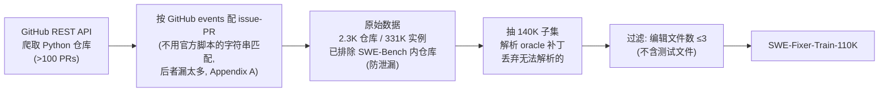

# SWE-Fixer：只用两次模型调用的开源 GitHub Issue 修复管线

> **本篇定位（先说一句人话）**：SWE-Fixer 不发明新算法，它做的是一个**工程判断**——
> 解一个真实的 GitHub issue，到底需不需要让模型在代码库里"自主逛来逛去、逛几十步"？
> 作者的答案是：**大多数情况不需要**。把任务钉死成"先找到该改的文件、再把补丁写出来"两步，
> 各训一个开源模型，**全程只调用模型两次**，就够打过一堆基于 GPT-4/Claude 的多轮 agent。
> 这篇因此是本库 **E 组（集成系统）** 里"极简派"的样本，也是回答"`Agent = Model + Harness` 里
> 那个 Harness 到底能简到什么程度"的一个具体数据点。

> 主讲提示：开场就把全场的张力立住——这不是"更强的 agent"，是"**更笨但更省、更可复现的 harness**"。
> 组会的核心争论应该落在："什么时候，两步的笨管线，反而是对的选择？"

---

## §1　TL;DR（一页讲清这篇在干嘛）

> 主讲提示：先给三句话结论，再展开。听众记住这三句就够回去转述了。

一句话：**SWE-Fixer = BM25 检索器（7B）+ 代码编辑器（72B），两个开源模型串成一条流水线，每个 GitHub issue 只需两次模型调用，即拿到开源模型阵营的最优解决率。**

- **是什么（管线结构）**：把"解 issue"拆成两个**互相独立、显式定义**的子任务（§3.1）——
  ① **代码文件检索**：给 issue 描述，从整个仓库里定位"该改哪几个文件"；
  ② **代码编辑**：给定这几个文件，直接生成能解 issue 的补丁（patch）。
  一次推理 = 调检索器一次 + 调编辑器一次 = **共 2 次模型调用**（Abstract；Table 2 的 `#Model Calls=2`）。
- **成绩（§5.3, Table 1）**：**SWE-Bench Lite 22.0% / Verified 30.2%**（Best@1，不加过滤）；
  加 **P2P（Pass-to-Pass）过滤**后 **Lite 24.7% / Verified 32.8%**，是**开源模型方法里的 SOTA**（Table 1 下半区）。
  并且在 Verified 上**压过多个基于 GPT-4/GPT-4o/Claude-3-Opus 的闭源+agent 方案**（Abstract、§5.3）。
- **卖点（效率与开源）**：**仅 2 次模型调用**（Table 2：SWE-Search 要 ≥200 次、SWE-SynInfer 要 6 次），
  且**模型、数据（110K）、代码全部开源**——主打"简单、便宜、可复现"（Abstract、§6）。

**属于 harness 的哪一层（Θ1）**：本篇打的是 **E 组（集成系统）**，但它的"料"集中在两层——
**T（Tools/工具·此处即"检索"这个动作）** 与 **L（Loop/控制循环，此处是被砍到极致的两步定长循环）**。
它几乎不碰 O（可观测）/ V（评测协议本身，它用现成的 SWE-Bench）。换句话说，它的创新不在"造更强的工具"，
而在**把控制循环从"不定长的多轮探索"压成"定长两步"**，再用**训练**把每一步做扎实。

**够新够权威（Θ4）**：2025 年 1 月首发、5 月三修的前沿工作，出自 **InternLM（上海 AI Lab）+ 港校**，
模型/数据/代码全开源（GitHub: InternLM/SWE-Fixer）。它的权威性来源是"**开源可复现**"这一稀缺属性——
在一堆"贴着 GPT-4o、无法复现"的 SWE 榜单条目里，它给出了一条**能被任何人从头训、从头跑**的强基线。

---

## §2　问题与动机：为什么要"开源 + 极简"地解 GitHub issue

> 主讲提示：这一页用 Why 三连的"问题层"。要讲清两个缺口：**闭源不可复现**、**agent 循环贵且难训**。

### Why（问题层）——不解决会卡住什么？

LLM 在代码任务上进步很快，但早期基准（HumanEval、LiveCodeBench）**只测单文件、上下文受限**的场景，
抓不到真实软件开发里的"跨文件依赖、仓库级复杂度"（§1 开头）。为补这个缺口，SWE-Bench（Jimenez et al., 2023）
出现了：给一个**真实 GitHub issue + 整个代码库**，要模型**生成补丁**，再用 issue 专属的单元测试验证对错（§1、§2）。

在 SWE-Bench 上，现有解法分两大范式（§1）：
1. **Agent 派**（SWE-agent、OpenHands、Moatless Tools…）：让 LLM **动态决定下一步动作**，自主在代码库里探索、定位、修改。
2. **Pipeline 派**（Agentless、AppMap、SWE-Fixer 自己…）：把流程**拆成预定义的固定步骤**，一步步走。

作者点出这个领域的**两个真实痛点**（§1）：

- **痛点一：几乎都依赖闭源模型 → 不可复现、不透明。** 大多数强方案跑在 GPT-4o / Claude-3.5-Sonnet 上，
  "effective 但 costly 且缺乏透明度，阻碍了对问题求解能力的深入理解和进一步改进"（§1 原文）。
  → 这是**科学层面的缺口**：你没法研究一个你无法打开、无法重训的系统。
- **痛点二：想用开源模型走 agent 派，训练极难。** §1 列了两条硬骨头：
  (a) 开源模型**本身缺乏 agent 能力**（自主决策、长程规划、有效工具使用），复杂任务上更吃亏；
  (b) agent 派的训练数据**需要一个真实可执行环境**去采轨迹，"既贵又低效"——就算搭好了环境，
  最强模型的解决率也不够高，导致**轨迹采集又贵又难**（§1）。

### Why（设计层）——为什么选"极简管线"而不是"更强 agent"？

> **Why（设计层）**：朴素做法是"训一个更强的开源 agent，让它像 SWE-agent 一样多轮自主探索"。
> → 会因为上面痛点二失败：**agent 轨迹数据难采、训练贵、开源底座 agent 能力弱**。
> 本文改用**极简两步管线**，因为把任务**显式拆成两个定义清晰的子任务**后：
> ① 训练数据变好构造（不需要采多轮轨迹，只要"issue→该改的文件""文件→补丁"这种**静态对**）；
> ② 每一步的目标明确，**监督信号干净**，开源模型更容易学；
> ③ 推理时**步数固定（两步）**，成本可控、结果可复现（§1 倒数第 2 段原文：pipeline 派虽"less flexible"，
> 但"simplifies data construction and model training by explicitly defining each subtask"）。
> **代价明说在前**：牺牲了 agent 派的**灵活性**——遇到需要多轮反复试错、动态改变计划的疑难 issue，
> 两步管线没有"再看一眼、再改一版"的机会（这条批判我们在 §12、§13 展开）。

### 与最近亲 Agentless 的区别（§1、§2）

SWE-Fixer 和 **Agentless（Xia et al., 2024）** 哲学相同（都砍掉 agent 循环），但**Agentless 的设计"过于精巧"**：
它用**多阶段、依赖强闭源模型**的复杂定位流程（LLM 先筛文件、再跑 BM25+稠密检索、再定位类/函数/行）。
作者认为这套精巧设计**难以迁移去训练开源模型**（§2、§5.4 实验佐证）。SWE-Fixer 的选择是**更简单、更"robust"的设计**，
让它**更适合 fine-tune 开源模型**——这正是它区别于 Agentless 的核心 intention。

> **读出什么**：这篇的动机不是"再造一个更聪明的 agent"，而是"给开源社区一条**能自己训、自己跑、还够强**的最短路径"。
> 它把"可复现性"本身当成一等目标——这在满是闭源榜单条目的 SWE-Bench 生态里，是一种方法论上的洁癖，也是它的价值所在。

---

## §3　相关工作定位：它站在谁肩上、和谁划清界限

> 主讲提示：这页用一张对比表把 SWE-Fixer 放进 SWE-Bench 解法谱系。核心是三个坐标轴——
> **范式（agent/pipeline）× 底座（开源/闭源）× 调用次数（贵/便宜）**。SWE-Fixer 占的格子是"pipeline × 开源 × 极便宜"。

SWE-Bench（Jimenez et al., 2023）自 2023 年提出后，围绕它的解法可按**两个维度**铺开——
**范式**（agent 动态探索 vs pipeline 固定步骤）与**底座模型**（闭源强模型 vs 开源可训模型）。SWE-Fixer 的定位是这个
2×2 里最"反主流"的一格：**pipeline + 开源 + 极少调用**。下表把 §2 提到的代表系统填进坐标（数字取自 Table 1/2）：

| 系统 | 范式 | 底座 | 调用次数 | Verified / Lite | 与 SWE-Fixer 的关系 |
|---|---|---|---:|---|---|
| **SWE-agent**（Yang 2024） | Agent | 闭源(Claude-3.5) | 多轮 | 33.6 / 23.0 | 定义了 agent 派（ACI 界面）；SWE-Fixer 反其道砍掉循环 |
| **OpenHands**（Wang 2024b） | Agent | 闭源(Claude-3.5) | 多轮 | **53.0 / 41.7** | agent 派最强之一；靠强闭源底座，SWE-Fixer 不与其争"绝对最高" |
| **Agentless**（Xia 2024） | **Pipeline** | 闭源(Claude/GPT-4o) | 少 | 50.8 / 40.7 | **最近亲**：同为极简派；但定位精巧到类/函数，难训开源 |
| **AutoCodeRover**（Zhang 2024） | Agent | 闭源/开源 | 4 | 28.8 / 22.0 | agent 派 + 代码结构检索；调用比 SWE-Fixer 多 |
| **SWE-SynInfer**（Ma 2024） | Agent | **开源(72B)** | 6 | 30.2 / 22.0 | 开源 agent 派；同分但要 6 次调用 |
| **SWE-Gym**（Pan 2024） | Agent | **开源(32B)** | 29 | 29.8 / **26.0**(Best@8) | 开源 + RL + 专训 verifier；靠 Best@8 略高，但依赖可执行环境采轨迹 |
| **SWE-Search**（Antoniades 2024） | Agent | **开源(72B)** | **≈200** | — / 24.7 | 开源 + 蒙特卡洛树搜索；**同分但贵 100 倍** |
| **SWE-Fixer（本文）** | **Pipeline** | **开源(7B+72B)** | **2** | 30.2→**32.8** / 22.0→24.7 | **本格独占**：pipeline×开源×2 次调用 |

**读出三件事**：
1. **闭源 agent 派（OpenHands 53.0）仍是绝对最高**——SWE-Fixer 不挑战这个，它挑战的是"**在开源里、在省钱前提下**谁最强"。
2. **开源 agent 派普遍"要么调用多、要么依赖可执行环境采轨迹"**（SWE-Gym 要 RL 环境、SWE-Search 要 200 次搜索）——
   SWE-Fixer 用"pipeline + 训练前置"绕开了这两个负担。
3. **最近亲是 Agentless**：哲学相同（都砍循环）、分数相近（Agentless 用闭源 50.8），但走向不同——
   Agentless 追"定位精巧"（靠强闭源模型），SWE-Fixer 追"训练友好"（为开源模型让路）。二者是"极简派"的一体两面。

### 与最近亲 Agentless 的区别（§1、§2）——展开

SWE-Fixer 和 **Agentless（Xia et al., 2024）** 哲学相同（都砍掉 agent 循环），但**Agentless 的设计"过于精巧"**：
它用**多阶段、依赖强闭源模型**的复杂定位流程（LLM 先筛文件、再跑 BM25+稠密检索、再定位类/函数/行，§2 原文描述）。
作者的核心论断是：**这套精巧设计难以迁移去训练开源模型**（§2 原文 "challenging to adapt for training open-source models"；§5.4 用 Table 5 佐证——
让检索器额外去检索类/函数名，反而让 P/R 和解决率都降）。SWE-Fixer 的选择是**更简单、更"robust"的设计**——
**检索只到文件级、编辑吃全文**，让它**更适合 fine-tune 开源模型**。这是它区别于 Agentless 的核心 intention，也是理解全篇一切设计取舍的钥匙：
**凡是让"训练开源模型"变难的精巧，一律砍掉。**

> **读出什么**：这篇的动机不是"再造一个更聪明的 agent"，而是"给开源社区一条**能自己训、自己跑、还够强**的最短路径"。
> 它把"可复现性 + 训练友好"当成一等目标——这在满是闭源榜单条目的 SWE-Bench 生态里，是一种方法论上的洁癖，也是它的价值所在。

---

## §3b　三个核心贡献（论文 §1 末）

1. **SOTA 开源方案**：提出一个 pipeline-based 方法，用开源模型在 SWE-Bench Lite / Verified 上（加 P2P 过滤）
   取得**开源模型阵营的 Best@1 SOTA**。
2. **大规模数据集**：整理并开源 **110K** 实例的训练集 `SWE-Fixer-Train-110K`，配严格过滤保证质量与规模。
3. **详尽的配置分析**：对两个子任务分别做数据/训练配置的深入消融（§5.4），给"怎么训好检索与编辑"提供可操作洞见。

> 主讲提示：贡献 1 是"结果"，贡献 2 是"资产"（这才是开源社区最能直接受益的），贡献 3 是"know-how"。
> 讲的时候强调：**数据集 + 消融 = 让别人能复现并改进**，这正是它区别于闭源榜单条目的地方。

---

## §4　方法总览：一图看懂两步管线

> 主讲提示：这页把整条流水线用一张图讲完，先不进数学。让听众先有"检索→编辑"的整体骨架。

**直觉**：一个人类工程师修 bug 也是两步——**先在几百个文件里找到"病灶在哪几个文件"**，
**再打开这几个文件把代码改对**。SWE-Fixer 就是把这两步各交给一个训练好的模型（§3.1）。

```mermaid
flowchart LR
    I["Issue 描述<br/>（如：改进默认日志格式…）"] --> BM25
    C["整个 Codebase<br/>（几百上千文件）"] --> BM25
    subgraph 模块① 代码文件检索 (7B, coarse-to-fine)
      BM25["① BM25 粗检索<br/>取 Top-30 候选文件<br/>（§3.2, Robertson 2009）"] --> RET["② 检索器模型精排<br/>从 30 个里挑出<br/>真正要改的文件"]
    end
    RET --> FILES["目标缺陷文件<br/>（通常 1–3 个）"]
    FILES --> ED
    I --> ED
    subgraph 模块② 代码编辑 (72B)
      ED["③ 编辑器模型<br/>读 issue + 文件全文<br/>直接生成补丁"] --> PATCH["生成的 Patch<br/>（结构化 JSON → 转 diff）"]
    end
    PATCH --> EVAL["SWE-Bench<br/>单元测试判定"]
```

**两次模型调用具体是哪两次**（对齐 Table 2 的 `#Model Calls=2`）：
- **第 1 次**：调**检索器（7B）**——注意 BM25 是**传统信息检索算法、不是模型调用**（不花模型 token），
  所以"coarse-to-fine"里只有"fine"这一步是模型调用。
- **第 2 次**：调**编辑器（72B）**——一次性读入 issue + 选中文件的全文，直接吐出补丁。

> **读出什么**：这张图最该记住的是——**BM25 免费打底、模型只在"精排文件"和"写补丁"两处出手**。
> 这就是"只需两次调用"的来源。对比多轮 agent 动辄几十次 LLM 调用（Table 2：SWE-Search ≥200），
> 成本差是**两个数量级**。这条"成本护城河"是全篇最硬的卖点。

---

## §5　符号与术语表（后文要用的记号先定义清楚）

| 记号 / 术语 | 含义 | 出处 |
|---|---|---|
| **issue** | 一个真实 GitHub 问题的自然语言描述（bug 报告 / 功能请求） | §1 |
| **patch（补丁）** | 解决 issue 的代码改动，最终以 `diff` 格式提交给 SWE-Bench 判分 | §1、§3.3 |
| **BM25** | 经典词频检索算法（Robertson et al., 2009），此处做**粗检索**，取 Top-30 文件 | §3.2 |
| **coarse-to-fine（粗到精）** | 先 BM25 粗筛 30 个候选，再用检索器模型精排出真正要改的文件 | §3.2 |
| **file documentation（文件骨架）** | 文件的"摘要视图"：模块 docstring + 类头 + 方法签名 + 函数首尾各 5 行（Fig 5） | §3.2、Appendix G |
| **retriever（检索器）** | 7B 模型，输入 issue + 文件骨架，输出"要改哪些文件"的列表 | §5.1 |
| **editor（编辑器）** | 72B 模型，输入 issue + 文件全文，输出补丁（含推理链 CoT） | §5.1 |
| **JsonTuning** | 一种把任务输入/输出都结构化成 JSON 的指令微调法（Gao et al., 2023） | §4.1 |
| **CoT（Chain-of-Thought）** | 编辑任务的"推理链"，由教师模型 GPT-4o 经 rationalization 生成 | §4.2 |
| **rationalization** | STaR（Zelikman et al., 2022）的技巧：把**标准答案（gold patch）也喂给教师**，让它"倒推"出合理推理 | §4.2 |
| **P2P（Pass-to-Pass）过滤** | 用仓库里"打补丁前后都该通过"的回归测试，筛掉会破坏无关功能的补丁 | §5.1、Appendix C |
| **Best@1 / Best@8** | 采样 1 个 / 8 个候选补丁，取最好的那个来判分（本文主结果基本是 Best@1） | Table 1 脚注 |
| **Precision / Recall（检索）** | 检索出的文件里"确实该改"的比例 / 该改的文件里"被检索到"的比例 | Table 3 |
| **Resolve (%)** | 解决率：被单元测试判为"成功修复"的 issue 占比（SWE-Bench 主指标） | §5.1 |

---

## §6　模块①：代码文件检索——为什么是"BM25 粗筛 + 模型精排"

> 主讲提示：这页讲清检索为什么要"两段式"，以及为什么输入用"文件骨架"而不是"文件全文"。每个选择都有 Why。

### 6.1 直觉与形式化

**直觉**：仓库里有几百上千个文件，让模型直接读完再挑"太贵、上下文也塞不下"。
所以先用**便宜的 BM25** 把范围从"全仓库"砍到"Top-30 个最相关文件"，再让**模型**在这 30 个里精挑（§3.2）。

**指标定义式（先定义符号，Table 3 用到）**：设某个 issue 的**真正该改文件集合**为 $G$（gold files），
检索器**输出的文件集合**为 $P$（predicted files）。则

$$\text{Precision} = \frac{|P \cap G|}{|P|}, \qquad \text{Recall} = \frac{|P \cap G|}{|G|}$$

- **Precision（精确率）**：你挑出来的文件里，有多少是真该改的（挑得准不准，**惩罚多挑无关文件**）。
- **Recall（召回率）**：真该改的文件里，有多少被你挑到了（漏没漏，**惩罚漏掉关键文件**）。

> **读出什么**：编辑器只能改"检索器交给它的文件"。所以**检索的 Recall 是整条管线的天花板**——
> 一旦关键文件在检索阶段就被漏掉，编辑器再强也无力回天。这解释了为什么作者在检索上下这么多功夫。

### 6.2 Why（设计层）：为什么选 BM25，而不是稠密检索？

> **Why（设计层）**：朴素做法是上**稠密向量检索（dense retrieval）**——像 Agentless、Moatless Tools 那样，
> 把文件嵌入成向量再算相似度。→ 稠密检索**需要额外的嵌入模型、索引、算力**，在"仓库文件极多"时**又重又不易 scale**。
> 本文选 **BM25**，因为它"**轻量、可扩展、鲁棒**，尤其在仓库文件数很大时"（§3.2 原文），
> 作为**初始检索**又快又稳，再用一个语言模型精排一步收窄到最相关文件。
> 这是典型的"**便宜的召回打底 + 贵的精排收口**"两段式设计。

### 6.3 Why（设计层）：为什么输入"文件骨架"而不是"文件全文"？

> **Why（设计层）**：朴素做法是把候选文件的**全部内容**塞给检索器。→ 上下文爆炸（几十个文件全文），
> 而且**文件级检索根本不需要那么细的信息**。本文借鉴 Agentless，改用 **file documentation（文件骨架，Fig 5 / Appendix G）**：
> 只保留**模块 docstring、类头、类方法名、函数签名 + 函数首尾各 5 行**。
> 这样"**大幅压缩上下文，同时保住文件级检索所需的关键信息**"（§3.2 原文）。
> **这条 later 被消融打脸式验证了**（§7、Table 3："Add file content"反而让 Precision 掉 5.7）——
> 给检索器塞全文**有害无益**，因为检索是粗粒度任务，细节是噪声。

> **读出什么**：检索这一步的核心工程判断是"**给刚刚好的信息**"——多了（全文）是噪声、少了（只有类/函数名）漏关键。
> 文件骨架是这个平衡点。这也呼应 Harness-Bench 的抽象：harness 的优劣不在"给多少信息/工具"，而在"给对"。

---

## §7　模块①的消融：检索到底该怎么喂（Table 3）

> 主讲提示：这是检索部分最该停留的一页。四个消融结论，每个都能独立当一条"训练 tips"。

**实验设置（Table 3 脚注）**：base 模型 Qwen2.5-7B，64K 上下文，输入含 readme + BM25 检索的文件骨架（限 30 个文件），
训练目标是"预测该改的文件列表"。base setting 在 `SWE-Fixer-Train-10K` 上训。

| 方法 | 训练数据 | Precision(%) | Recall(%) | 读出什么 |
|---|---|---:|---:|---|
| **BM25 Top-3** | — | 18.9 | 56.7 | 纯 BM25 挑前 3：准一点但**召回只有 56.7**（漏太多） |
| **BM25 Top-30** | — | 2.9 | **86.7** | 纯 BM25 挑前 30：召回高，但**精确率崩到 2.9**（30 个里大多没用） |
| **Base（模型精排）** | Train-10K | **65.4** | 67.3 | 模型在 30 候选上精排：**Precision 从 2.9 飙到 65.4**——精排这一步是关键 |
| − Remove readme | Train-10K | 65.2 (↓0.2) | 66.7 (↓0.6) | 去掉 readme：略降 → **readme 有用**（提供项目级上下文） |
| − 32K context | Train-10K | 64.3 (↓1.1) | 64.7 (↓2.6) | 上下文砍到 32K：召回掉更多 → **小窗口装不下足够文件，漏召回** |
| − Add file content | Train-10K | 59.7 (↓5.7) | 60.3 (↓7.0) | 给检索器塞**文件全文**：**双降最狠** → 无关细节有害（§6.3 佐证） |
| **Base（全量数据）** | Retrieval-80K | 68.5 (↑1.7) | 69.0 (↑1.7) | 训练数据 10K→80K：**双升** → 数据规模有效 |
| **Default（+编辑数据）** | Retrieval-80K + 100K 编辑数据 | **69.4 (↑4.0)** | **69.7 (↑2.4)** | 混入**编辑任务数据**一起训：**再升** → 编辑数据帮助检索 |

**四条可带走的结论**（§5.4.1 原文对应）：
1. **"BM25 粗 + 模型精"确实必要**：BM25 Top-30 的 Precision 只有 2.9，模型精排把它提到 65.4——**精排是主贡献**。
2. **无关信息有害**（"Irrelevant information adversely affects performance"）：加文件全文让 P/R 双降 5.7/7.0。
3. **上下文窗口越小越差**（"Smaller context windows reduce effectiveness"）：32K 比 64K 明显掉召回，因为装不下足够多的候选文件。
4. **数据越多越好 + 编辑数据反哺检索**（"Larger datasets improve model performance"）：
   10K→80K 有效，且把编辑任务数据混进来一起训，**检索指标还能再涨**——作者推测编辑数据让模型更懂"issue 与代码的关系"（§5.4.1）。

> **读出什么**：这张表把"喂检索器"这件事讲成了一门手艺——**readme 要留、窗口要够大、全文别塞、数据要多、还能借编辑数据的力**。
> 这四条对我们自己做"检索式定位"极有参考价值（见 Inspires-Us）。

---

## §8　模块②：代码编辑——结构化输出 + CoT，让 72B 一次写对补丁

> 主讲提示：这页讲编辑器怎么被训出来。两个关键设计：**JsonTuning 结构化输出**、**CoT 的 rationalization 造数**。

### 8.1 为什么把"编辑"单列为主瓶颈

作者明说：**编辑是整条管线的主瓶颈**（§3.3、§5.4.2 原文 "the primary bottleneck"）。
证据在 Table 4：即使**直接给编辑器 gold 缺陷文件**（oracle，等于检索 100% 正确），解决率也只有 **20.0%**——
说明"就算文件找对了，把补丁写对仍然很难"。所以本文"explicitly focus on improving its effectiveness"（§3.3）。

### 8.2 结构化输出（JsonTuning）：三段式补丁

**直觉**：让模型直接生成标准 `diff` 格式**很难**——diff 要求在输出里**算好新的行号**（哪一行加、哪一行删），
这个"行号计算"对模型是额外负担、极易出错（§3.2 末原文）。

**设计**：改用**结构化 JSON 输出**（§3.2、Appendix H），每处修改含**三个字段**：
1. **file**：要改的文件路径；
2. **code snippet to be modified**：原始代码块，**带行号**（帮模型定位，输入侧有行号）；
3. **edited code snippet**：改后的代码块，**不带行号**（因为"新行号模型难算"，输出侧就不要求算）。

生成后**自动转成标准 patch** 去评测（§3.2 末）。Appendix H 给了个真实例子——修 Flask 的
`src/flask/blueprints.py`，给 blueprint 的 name / endpoint / view_func 加"不能含点号 `.`"的校验（一个真实 SWE-Bench Verified 实例）。

> **Why（设计层）——为什么不直接生成 diff？**
> 朴素做法是让模型直接吐 `git diff`。→ 标准 diff 格式**要求在 hunk 里算准新行号**，"adds complexity"（§3.2 原文），
> 训练难、易错。本文用"**输入带行号（便定位）、输出不带行号（免计算）**"的结构化 JSON，
> 既让模型**能精准定位**要改的行，又**免掉最容易错的行号计算**，事后再机械地转成 diff。
> 这是一个把"模型不擅长的活（算行号）"外包给"确定性后处理"的经典分工。

### 8.3 CoT 造数：rationalization（给答案倒推推理）

**直觉**：编辑要强推理，最好有 CoT 训练数据。但真实数据只有"issue + gold patch"，**没有中间推理过程**（§4.2）。

**朴素做法的困难**：直接让教师模型（GPT-4o）"看 issue 猜补丁 + 写推理"，再做 rejection sampling（留对的）——
但**两个问题**（§4.2）：① 编辑任务太难，连强闭源模型**都难做对**；② **没有可执行环境**，无法通过跑测试来验证补丁对错，
**标准 rejection sampling 因此不可行**。

**本文解法（§4.2）**：借 **STaR 的 rationalization**（Zelikman et al., 2022）——
**把 gold patch 也放进输入**，让教师模型"**在已知正确答案的前提下，倒推出一段合理的推理过程**"，
但要求它**假装不知道答案**地写（prompt 见 Appendix F，明确要求"simulate reasoning independently… avoid statements like 'The edited code makes sense because…'"）。
用 GPT-4o 生成，"resulting reasoning chains are generally coherent and sound"（§4.2）。

> **Why（设计层）——为什么用 rationalization 而不是直接生成？**
> 朴素做法是"教师自己猜答案 + 拒绝采样"。→ 因为**任务太难 + 无执行环境验证**，采不到足够多的正确轨迹。
> rationalization 把"生成正确补丁"这个**难问题**，转化成"给定正确补丁、编一段通向它的推理"这个**易问题**——
> 答案已知，教师只需补上"路"。代价：这段推理是**事后编的**，未必是模型真实的思考路径（这是 STaR 一族的固有隐忧，见 §12）。

> **读出什么**：编辑器的两个设计（结构化输出 + rationalization CoT）都在解同一个元问题——
> **"在没有可执行环境、没有轨迹数据的约束下，如何把一个开源模型训成合格的补丁生成器"**。
> 这正是"pipeline 派比 agent 派好训"的具象体现。

### 8.4 训练方式：JsonTuning 结构化指令微调（§4.1）

整条管线用 **JsonTuning（Gao et al., 2023）** 训练：**输入 JSON**（任务输入 + 指令 + **输出控制信息** output control）→ **输出 JSON**（任务输出）。
Fig 2 画得很清楚：**检索任务**（Fig 2a）输入 = issue + readme + 检索到的文件骨架，输出控制指定"files for editing 是个 string 数组"，输出 = 文件名列表；
**编辑任务**（Fig 2b）输入 = issue + 文件内容，输出控制指定"reasoning_process(string) + edited_code(数组，每项含 file / code_snippet_to_be_modified / edited_code_snippet)"，输出即按此结构填。
好处（§4.1）：① 显式的结构帮模型理解**关键任务元素及其相互关系**、提升泛化；② 代码本身就结构化，JSON 契合；
③ 结构化输出比直接生 patch **更鲁棒**（patch 语法更严、更难解析）。配套一个后处理流程（Appendix B）保证输出合法。

### 8.5 一个真实例子：编辑器到底输出什么（Appendix H 的 Flask 案例）

> 主讲提示：这页把抽象的"结构化输出"落到一个**真实 SWE-Bench Verified 实例**上，让听众看清"输入带行号、输出不带行号"长什么样。

Appendix H 给了个真实补丁例子——修 Flask 的 `src/flask/blueprints.py`，issue 要求给 blueprint 的
**name / endpoint / view_func 名字加"不能含点号 `.`"的校验**（点号在 Flask 里有路由分隔语义，含点会出 bug）。编辑器的输出是一个 JSON，`edited_code` 数组里有两处修改：

**修改一**（在 `Blueprint.__init__` 里，给 name 加校验）：
- `code_snippet_to_be_modified`（**带行号**，帮定位）：
  ```
  188        template_folder=template_folder,
  189        root_path=root_path,
  190    )
  191    self.name = name
  192    self.url_prefix = url_prefix
  193    self.subdomain = subdomain
  ```
- `edited_code_snippet`（**不带行号**，免算行号）：在 `self.name = name` 之前插入
  ```
      if "." in name:
          raise ValueError("'name' may not contain a dot '.' character.")
  ```

**修改二**（在 `add_url_rule` 里，给 endpoint / view_func 加校验）：把原来的
`assert "." not in endpoint, "..."` 断言，改写成显式的 `if "." in endpoint: raise ValueError(...)`，
并对 `view_func.__name__` 同样加点号校验。

**从这个例子读出三件事**：
1. **"输入带行号、输出不带行号"是真的**——`code_snippet_to_be_modified` 每行前挂着 188/189/…（模型据此精确定位），
   而 `edited_code_snippet` 是干净代码（模型不必去算插入后的新行号，§8.2 的设计在此兑现）。
2. **一个 issue 可含多处修改**——`edited_code` 是**数组**，编辑器一次调用就能吐出跨位置的多段改动（这里是两处），
   事后由后处理**机械地拼成一个 diff**。
3. **编辑器做的是"语义级改写"而非"字符级 diff"**——它把 `assert` 换成 `raise ValueError`（语义等价但更规范），
   说明它理解了 issue 的**意图**，而不只是模式匹配。这也是为什么编辑是"主瓶颈"（§8.1）——它要真读懂代码。

> **读出什么**：这个例子把"两次调用"里的**第二次**具象化了——**编辑器一次就要读懂 issue、定位多处、写出语义正确的多段改动**。
> 它没有"先改一版、跑测试、看报错、再改"的机会（无反馈回路，§12），所以**必须一次到位**。这既是它省调用的原因，也是它能力上限的来源。

---

## §9　消融②：编辑到底该怎么喂（Table 4、Table 5、Fig 3）

> 主讲提示：这页把编辑器的关键消融讲完。核心结论：**行号是命根子、上下文要够、CoT 对强模型才划算**。

### 9.1 编辑输入配置（Table 4，均用 gold 缺陷文件 + Qwen2.5-72B + Train-10K）

| 方法 | Resolve (%) | 读出什么 |
|---|---:|---|
| **Default（文件全文 + 行号）** | **20.0** | 基线：给全文 + 行号 |
| − Only Cls&Func Content（只给类/函数，无全文） | 18.0 (↓2.0) | 只给类/函数骨架**不够**——编辑需要**全文细节**才能改对 |
| − Add readme | 19.0 (↓1.0) | 给编辑器加 readme：**反而降**——readme 是高层抽象，对"改具体代码"是**噪声** |
| − Remove Line Number | **14.0 (↓6.0)** | **去掉行号：暴跌 6 分**——行号是编辑器**定位的锚点**，最关键 |

**三条结论**（§5.4.2 原文对应）：
1. **行号是命根子**（"Enhanced location information improves performance"）：去行号掉 6.0，**是所有消融里最大的降幅**。
2. **编辑要全文、不要 readme**（"Redundant or insufficient information reduces performance"）：
   注意这与检索**相反**——**readme 帮检索、害编辑**；**全文害检索、帮编辑**。因为两个任务的粒度需求不同：检索要"粗"、编辑要"细"。
3. **信息不足也有害**：只给类/函数（omit 全文）掉 2.0，说明编辑确实吃全文上下文。

### 9.2 检索训练法对整体管线的影响（Table 5，72B 编辑器 + Train-10K）

| 方法 | Pre/Recall(%) | Resolve(%) |
|---|---|---:|
| Base setting | 65.4 / 67.3 | **16.3** |
| − Also retrieve Cls&Func（让检索器还去检索类/函数名） | 54.0 / 56.0 | 15.7 (↓0.6) |

> **Why（设计层）——为什么不做更细粒度检索（连类/函数一起检索）？**
> 朴素直觉是"检索越细越好，连该改的类/函数都定位出来"（像 Agentless 那样）。→ 实测**反而更差**：
> P/R 和最终 Resolve 都降（Table 5、Appendix E）。因为**更细的检索让检索任务变复杂、更易错**，
> 错误又会**级联**到编辑。本文的判断：**检索只管到"文件级"就好，把"改哪几行"留给编辑器**——分工要干净。

### 9.3 编辑任务的 scaling（Fig 3）

Fig 3 画了 5 条曲线（Llama3.1-70B / Qwen2.5-72B / Qwen2.5-Coder-32B，各含 Direct 与 CoT 两种），
横轴训练数据量（对数），纵轴 Lite 解决率。**三条趋势**（§5.5）：
1. **数据越多越好、且未见饱和**：从 10K 到 70K 仍在涨，"increasing the training data size may still yield gains"（§5.5）——暗示更多数据还能更强。
2. **强模型 scaling 更陡**：Qwen2.5-Coder-32B 起点低于 Llama3.1-70B，但随数据增多**反超**（§5.5）。
3. **CoT 对强模型才划算**：Qwen2.5-Coder-32B / 72B 上 CoT 持续优于 Direct；但 Llama3.1-70B（能力不足）上，
   加 CoT 数据**不带来持续提升**（§5.5）——**CoT 需要底座有足够容量才吃得下**。

> **读出什么**：Fig 3 给了一条重要的"规模—方法"交互规律——**CoT 不是免费午餐，弱底座上白搭**。
> 这对"要不要给我们的子任务加推理链"是直接指导：先看底座扛不扛得住。

---

## §10　实验设置：数据、算力、评测（§5.1–5.2 + 附录）

> 主讲提示：这页把"复现所需的一切"列全。开源库的价值就在这些细节都给了。

**底座与规模（§5.1）**：微调 **Qwen2.5** 系列 → **7B 检索器 + 72B 编辑器**。

**训练算力（§5.1）**：**96 张 NVIDIA A800**，`xtuner-lite` 框架，**global batch = 96**，**64K 上下文窗口**。

**数据集家族（§5.2 + Appendix A/C）**：
- `SWE-Fixer-Train-110K`：主训练集，**110K** 实例（从 2.3K 仓库、331K 原始实例过滤而来，**已排除 SWE-Bench 内的仓库防泄漏**，Appendix A）。
- `SWE-Fixer-Retrieval-80K`：检索子集（过滤掉"gold 文件不在 BM25 Top-30"或"总长超 64K"的实例；后者单列为 `-Retrieval-80K` 的一部分说明）。
- `SWE-Fixer-Editing-70K` / `-70K-CoT`：编辑子集 70K，及其 CoT 版本。
- `SWE-Fixer-Train-10K`：消融用小集（200 仓库 × 各 50 实例）。

**数据采集管线（Appendix A，"贡献 2"的具体过程）**：这套数据是全篇最能直接惠及社区的资产，值得单列讲清——



关键取舍：
- **防泄漏**：原始 2.3K 仓库里**排除了 SWE-Bench 内的仓库**（Appendix A）——保证评测不作弊，这是可复现基线的底线。
- **为什么不用官方脚本配 issue-PR**：SWE-Bench 官方抽取脚本靠**字符串匹配**认 issue-PR 对，"有很大概率漏掉很多实例"（Appendix A 原文），
  故本文改用 **GitHub events** 来爬，覆盖更全。
- **数据过滤（Appendix A）**：只留**编辑文件数 ≤ 3**（不含测试文件）的实例。

**真实数据统计（Fig 4，支撑"≤3 文件"这个决定）**：
- **Fig 4a（改几个文件）**：**54.7% 只改 1 个文件**、16.9% 改 2 个、8.1% 改 3 个 → **近 80% 改 ≤3 文件**；改 >10 文件的仅 5.9%。
- **Fig 4b（改几行）**：**73.7% 的实例只改 0–99 行**、超 85% 改 ≤200 行 → 真实修复大多是**小改动**。
- **Fig 4c（改几个 hunk/代码块）**：28.5% 改 1 个 hunk、16.8% 改 2 个 → 修改**高度局部化**。

这三张图是"极简两步管线为何够用"的**数据学依据**：既然近 80% 的真实 issue 只改 ≤3 个文件、大多只改 <100 行、集中在 1–2 个代码块，
那么"一步定位文件、一步写补丁"这个范式**天然贴合真实分布**。改 >3 文件的复杂实例"引入过高复杂度、有碍有效训练"（Appendix A），故砍掉——
**这是一个由数据分布驱动的、诚实的能力边界选择**（代价见 §12：系统性放弃大改动）。

**评测基准（§5.1）**：
- **SWE-Bench Lite**：官方 300 个精选实例。
- **SWE-Bench Verified**：OpenAI 提出的**人工校验**子集，评测更可靠。
- **指标**：**Resolve (%)** = 生成补丁被 issue 专属单元测试判为成功的比例。
- **P2P（Pass-to-Pass）过滤（§5.1、Appendix C）**：可选。用仓库里"打补丁前后都该过"的回归测试筛补丁——
  补丁若打破任何 P2P 测试就丢弃、重采。采样策略：**温度先 0（确定性），失败则升到 0.7（更有创意），最多 5 次**（Appendix B）。
  在最终能过的实例上，**平均生成尝试次数：Lite 1.15、Verified 6.73**（Appendix C）。作者**同时报告过滤 / 不过滤两版**以求透明。

> **读出什么**：这套设置里最值得注意的是**"≤3 文件"的数据裁剪**——它既是"贴合真实分布"的合理选择，
> 也**内在地限定了 SWE-Fixer 的能力边界**：它天生不擅长需要大范围跨文件改动的 issue（见 §12 批判）。

---

## §11　主结果：开源 SOTA，且压过一批闭源 agent

> 主讲提示：这是全场最该停留的两张表。先报解决率，再报"只用两次调用"的成本对比。

### 11.1 解决率（Table 1 节选）

| 方法 | 模型 | 类型 | Verified | Lite |
|---|---|---|---:|---:|
| *— 基于闭源模型的方法 —* | | | | |
| Agentless | Claude-3.5-Sonnet-20241022 | Pipeline | 50.8 | 40.7 |
| OpenHands | Claude-3.5-Sonnet-20241022 | Agent | 53.0 | 41.7 |
| SWE-agent | Claude-3.5-Sonnet | Agent | 33.6 | 23.0 |
| Agentless | GPT-4o | Pipeline | 38.8 | 32.0 |
| SWE-agent | GPT-4o | Agent | 23.0 | 18.3 |
| *— 基于开源模型的方法 —* | | | | |
| SWE-Gym (Best@8 w/ Verifier) | SWE-Gym-32B | Agent | 29.8 | **26.0** |
| SWE-SynInfer | Lingma-SWE-GPT-72B | Agent | 30.2 | 22.0 |
| SWE-Search | Qwen2.5-72b-Instruct | Agent | — | 24.7 |
| **SWE-Fixer** | SWE-Fixer-72B | Pipeline | 30.2 | 22.0 |
| **SWE-Fixer + P2P Filtering** | SWE-Fixer-72B | Pipeline | **32.8** | 24.7 |

**读出什么**（§5.3）：
- **开源阵营 SOTA（Best@1）**：SWE-Fixer+P2P 的 **Verified 32.8** 是开源模型方法里最高；Lite 24.7 与 SWE-Search 持平、
  仅次于 SWE-Gym 的 Best@8（26.0，但那是**采 8 个 + 专门训的 32B verifier**，非 Best@1，不完全可比，§5.3 明说）。
- **压过多个闭源 agent**：它**超过了基于 GPT-4/GPT-4o/Claude-3-Opus 的多个方案**（Abstract、§5.3）——
  一个全开源的两步管线，打过了贴着强闭源模型的多轮 agent。**唯一没超过的闭源基线是 Agentless(GPT-4o)**（§5.3 诚实点名）。
- **诚实的差距**：作者也明说**基于 Claude-3.5-Sonnet 的方案（Agentless 50.8 / OpenHands 53.0）仍明显更强**——
  "our approach still lags behind such systems"（§5.3）。即：**换上最强闭源底座，agent/pipeline 都还能更高**——这是 §13 regime 之辩的伏笔。

### 11.2 成本：只用两次模型调用（Table 2）

| 方法 | 模型 | Verified | Lite | **#Model Calls** |
|---|---|---:|---:|---:|
| RAG | SWE-Llama-13B | 1.2 | 1.0 | 1 |
| AutoCodeRover | Qwen2-72B-Instruct | — | 9.3 | 4 |
| SWE-Gym (Best@1) | SWE-Gym-32B | 20.6 | 15.3 | 29 |
| SWE-SynInfer | Lingma-SWE-GPT-72B | 30.2 | 22.0 | 6 |
| SWE-Search | Qwen2.5-72b-Instruct | — | 24.7 | **≈200** |
| **SWE-Fixer** | SWE-Fixer-72B | 30.2 | 22.0 | **2** |
| **SWE-Fixer + P2P** | SWE-Fixer-72B | **32.8** | 24.7 | **2** |

> **Why（结果层）——为什么"两次调用"这件事这么重要？**
> 看 SWE-Search：它和 SWE-Fixer 在 Lite 上**同为 24.7**，但它要 **≈200 次**模型调用（蒙特卡洛树搜索 + 价值模型评估，Appendix D 估算），
> SWE-Fixer 只要 **2 次**——**同样的分，成本差约 100 倍**。SWE-SynInfer 30.2 分要 6 次，SWE-Fixer 同样 30.2 分只要 2 次。
> 机制上：SWE-Fixer 把"探索"这件事**用训练前置消化掉了**——模型在训练时已经学会"一步定位、一步修"，
> 推理时**不需要再用多轮调用去在线搜索**。这就是"pipeline 派用训练换调用次数"的本质。

> **读出什么（Θ2 直接呼应）**：Table 1 + Table 2 合起来，是 `Agent = Model + Harness` 的一个**反向注脚**——
> 前面 Harness-Bench 证明"换更强 harness 能加分"；SWE-Fixer 证明"换更**简**的 harness 能在**几乎不掉分**的前提下把成本砍两个数量级"。
> 二者不矛盾：**harness 的正确复杂度，取决于任务与预算**。SWE-Fixer 是"在给定预算下，把 harness 简化到刚好够用"的范例。

### 11.3 核心追问：为什么"两次调用"就够了？（把全篇最反直觉的点讲透）

> 主讲提示：这是全场最该被追问、也最能体现"读懂没读懂"的一页。多轮 agent 动辄几十次调用，凭什么两次够？
> 别急着说"因为简单"，要把"多轮 agent 的调用花在哪、这些花费如何被 SWE-Fixer 用别的方式抵消"逐条拆开。

**先看多轮 agent 的调用都花在哪。** 一个 SWE-agent/OpenHands 式的循环，几十次 LLM 调用大致消耗在四类动作上：
① **探索**（在代码库里 ls/cat/grep，一步步找病灶）；② **在线定位**（读几个文件、推断该改哪里）；
③ **试错**（改一版→跑测试→看报错→再改，反复迭代）；④ **反思/重规划**（Reflexion 式地总结失败、调整计划）。
**SWE-Fixer 的主张是：这四类里，前两类可以被"训练前置"消化，后两类在"任务足够局部"时可以省略。** 逐条看：

| 多轮 agent 的调用去向 | 占多轮循环的份额（定性） | SWE-Fixer 如何抵消 | 抵消的证据 |
|---|---|---|---|
| ① **探索代码库** | 大头（几十步里多数） | **BM25 免费粗筛** Top-30，把"逛全库"换成"一次词面检索" | Table 3：BM25 Top-30 Recall 86.7，已把该改文件基本兜住 |
| ② **在线定位文件** | 中等 | **训练好的 7B 检索器一次精排**到文件级 | Table 3：精排把 Precision 从 2.9→65.4，一次调用完成 |
| ③ **试错迭代**（改-测-改） | 中大头 | **不做**（无反馈回路）；靠**编辑器一次到位** + **CoT 训练**把推理内化 | §8.3 CoT + Fig 3：CoT 让强模型编辑更准，减少"需要重试"的场景 |
| ④ **反思/重规划** | 小到中 | **不做**；靠"≤3 文件的局部任务"本就不太需要重规划 | Fig 4：近 80% 只改 ≤3 文件、73.7% 只改 <100 行 |

**所以"两次调用"的等式是这样成立的**：

$$\underbrace{\text{几十次多轮调用}}_{\text{探索+定位+试错+重规划}} \;\xrightarrow{\text{SWE-Fixer}}\; \underbrace{\text{BM25(0次模型)}}_{\text{替代探索}} + \underbrace{\text{检索器(1次)}}_{\text{替代定位}} + \underbrace{\text{编辑器(1次)}}_{\text{一次到位，省去试错}}$$

> **Why（设计层）——把"探索/试错"外包给"训练 + BM25"，代价是什么？**
> 朴素做法（多轮 agent）是**推理时**用大量 LLM 调用去在线探索和试错——**灵活**，但**贵、慢、且轨迹难复现**（每次跑可能走不同的路）。
> SWE-Fixer 把这些**挪到训练时**：用 110K 静态数据把"该看哪、该改哪"教进模型，推理时就不必再搜。
> **代价有三**：(a) **放弃试错**——一次没改对就没有第二次机会（无反馈回路，§12）；
> (b) **放弃动态性**——遇到"必须先跑一下才知道错在哪"的 issue 束手无策；
> (c) **能力被数据分布锁死**——训练数据砍到 ≤3 文件，模型就学不会大改动。
> 但在**"任务局部 + 预算受限 + 要可复现"**的 regime 里，这个交换是**划算**的：Table 2 里同为 24.7 分、成本却差 100 倍就是明证。

> **读出什么**：**"两次调用够不够"不是一个绝对判断，而是一个 regime 判断。** 当任务落在"局部改动 + 可静态拆解"的分布里（真实 issue 的大多数），
> 探索和试错的边际价值很低，两步管线就够；一旦任务需要动态反馈（"必须跑起来才知道哪错了"），第二次调用之后缺的那个"反馈回路"就会变成硬伤（§13）。
> **这正是 SWE-Fixer 教给我们做 harness 的核心一课：先问"这个任务真的需要多轮吗"，再决定循环要不要展开。**

---

## §12　局限与批判（论文 §6 Limitations + 我的补充）

> 主讲提示：这页要诚实。SWE-Fixer 的强，恰恰以放弃某些能力为代价。把"卖点的另一面"讲清楚。

**论文自陈的局限（§6 Limitations，诚实）**：
- **训练规模仍受限**：受算力约束，没能在更大数据上训；作者认为**扩大数据仍有提升空间**（呼应 Fig 3 未饱和）。
- **缺 test-time 优化（无 reward model）**：未来想引入 **reward model**——用训练数据里的负样本训一个"判断补丁是否解决 issue"的打分器，
  接进 **Best-of-N** 选择策略来精修结果（§6 明确列为 future work）。**这等于承认：当前只靠两步、没有"择优"机制。**

**我的补充批判**：
- **能力天花板被"两步定长"锁死**：管线**没有反馈回路**——补丁生成后不跑测试、不看报错、不迭代（P2P 只是"过滤重采"，
  不是"根据失败原因改补丁"）。遇到**需要多轮试错、动态改计划**的疑难 issue，SWE-Fixer 结构上就无能为力。
  这正是它相对 agent 派让渡的"灵活性"（§1 自己也承认 pipeline "less flexible"）。
- **检索 Recall 是硬上限**：整条管线的分**受限于检索召回**（Table 3 的 Recall ≈69）——凡关键文件在第一步被漏掉，
  后面全白搭。而**BM25 是词面匹配**，对"issue 描述用词与代码用词不一致"（同义、跨语言、语义级关联）的情形天然吃亏。
- **"≤3 文件"裁剪 = 主动放弃大改动**：为了好训，数据里砍掉了改 >3 文件的实例（§10）。这让 SWE-Fixer**系统性地不擅长**
  需要大范围重构 / 跨模块协同修改的 issue——它的强，部分是"挑软柿子捏"挑出来的。
- **CoT 是 rationalization 造的、非真实推理**：§8.3 的推理链是"**给定答案倒推**"，未必反映模型真实思考路径（STaR 一族固有隐忧）。
  作者说"generally coherent and sound"，但**没有对 CoT 质量做定量核查**（原文未给出 CoT 忠实度的评估）。
- **P2P 过滤的争议**：作者自己提到"社区对推理阶段是否该用 P2P 尚有讨论"（Appendix C），故两版都报——
  这诚实，但也意味着**32.8 这个最高分是"带过滤"的**，不带过滤是 30.2。引用时要说清是哪一版。

---

## §13　regime 诚实：极简管线"何时够用、何时不够"（Θ5）

> 主讲提示：这页是判断力的高地。**别把"两步管线 SOTA"讲成"多轮 agent 没用"**。要讲清分界线。

把 SWE-Fixer 放进本库的 regime 之辩（对齐 Harness-Bench §6、METR/SWE-Atlas 一侧）：

- **极简管线够用的 regime**：任务**结构清晰、可静态拆解**（"先定位文件、再改代码"这种两阶段范式本就贴合大多数 bug 修复）；
  且**预算敏感、要求可复现**（学术复现、大规模离线批处理、成本受限的生产环境）。此时 SWE-Fixer 的"2 次调用 + 全开源"是**压倒性优势**。
  Fig 4a 的数据支撑了这一点：**近 80% 的真实 issue 只改 ≤3 个文件**——大多数任务确实"没那么需要多轮探索"。
- **极简管线不够用的 regime**：任务**需要动态探索**（先跑一下看报错、再决定改哪 / 需要多轮 reproduce→fix→verify）；
  或**需要大范围跨文件协同改动**（被"≤3 文件"裁剪排除在外）；或**手头就有最强闭源底座**（Claude-3.5-Sonnet 上
  Agentless/OpenHands 到 50+，远高于 SWE-Fixer 的 32.8——**此时投资更强模型 + 更灵活 harness 的回报更大**）。

**诚实的表述**：SWE-Fixer 没有证明"agent 循环无用"，它证明的是——**在"开源底座 + 预算受限 + 任务可静态拆解"这个 regime 里，
把 harness 简化到两步是帕累托最优（近乎不掉分、成本砍百倍）**。一旦离开这个 regime（要动态反馈、要大改动、或有顶级闭源模型可用），
天平就会重新向"更复杂的 harness / agent 循环"倾斜。这与 Harness-Bench "**强模型降低对脚手架依赖、但仍需可靠执行基底**"的结论是**同一枚硬币**——
**harness 的正确复杂度是任务与预算的函数，不存在放之四海的最优。**

---

## §13b　深挖 P2P 过滤：那 +2.6 分是怎么来的、算不算作弊

> 主讲提示：32.8 这个最高分是"带 P2P 过滤"的。这页把 P2P 讲清楚——它是什么、加了多少、为什么有争议。

**P2P（Pass-to-Pass）是什么（§5.1、Appendix C）**：一个 **P2P 测试**是仓库里"**打 gold 补丁前后都应该通过**"的测试用例——
它检查的是"**补丁有没有破坏无关功能**"（回归）。SWE-Bench 为每个 issue 提供了一批这样的测试。

**P2P 过滤怎么用（Appendix C）**：在推理阶段，把生成的补丁打进仓库、跑一遍 P2P——
**若补丁打破任何 P2P 测试，就丢弃它、重新采一个补丁**；通过则保留。这不是"改补丁"，而是"**换补丁**"（重采）。
配套采样策略（Appendix B）：**温度先 0（确定性），失败则升到 0.7（更有创意），最多 5 次尝试**。

**效果（Table 1、Appendix C）**：
- Lite **22.0 → 24.7（+2.7）**、Verified **30.2 → 32.8（+2.6）**。
- 平均生成尝试次数：**Lite 仅 1.15、Verified 6.73**（Appendix C）——Lite 大多一次就过，Verified 因更难而多试。

> **Why（设计层）——P2P 过滤为什么有争议？它是"作弊"吗？**
> 争议点（作者在 Appendix C 主动挑明）：P2P 过滤**要跑仓库测试**，这等于在推理时**用到了"部分测试信号"**——
> 有人认为这偏离了"纯靠模型解 issue"的设定，社区对"推理阶段该不该用 P2P"**尚有讨论**。
> 但它**不算读答案作弊**：P2P 测的是"别弄坏别的"（回归），**不是** issue 专属的"是否修好了"那批测试（后者才是判分依据、始终不可见）。
> 作者的处理很诚实——**两版都报**（过滤 22.0/30.2、不过滤对应更低），让读者自己判断。
> **对我们的启示**：P2P 本质是"**用一个便宜的确定性校验（回归测试）在多个候选里择优**"——这正是 Inspires-Us ➤c 想借的招。

> **读出什么**：+2.6 分不是"模型更强了"，而是"**加了一层轻量校验去筛候选**"。这说明——即便在极简管线里，
> **一点点确定性验证（哪怕不改补丁、只是重采择优）也能榨出可观增益**。这为"2+1 次调用"的中间态提供了直接证据（§13、Inspires-Us）。

---

## §13c　复现与可用性（标准骨架 item 18）

> 主讲提示：这页回答"我能不能自己跑起来、坑在哪"。这是开源工作最该被追问的部分。

- **开源程度（Abstract、§6）**：**模型 + 数据（110K）+ 代码全部开源**（GitHub: InternLM/SWE-Fixer）。这是它区别于闭源榜单条目的**根本价值**——
  可从头训、可从头跑、可改进。
- **训练成本（§5.1）**：**96 张 A800**、`xtuner-lite`、64K 上下文、global batch 96。**72B 编辑器的训练门槛不低**——
  普通实验室未必有 96 卡，但**推理只需两次调用**、门槛远低于训练；且模型权重已开源，**多数人可以只用不训**。
- **推理可复现性**：**步数固定（2 次）+ 温度可设 0（确定性）** → 相比多轮 agent"每次走不同路"，SWE-Fixer 的输出**高度可复现**。
  这正是 pipeline 派相对 agent 派的一大隐性优势（agent 轨迹随机性大，难复现）。
- **潜在的坑**：
  - **BM25 依赖仓库能被词面检索**——若 issue 描述与代码用词差异大，Recall 会掉（§12）。
  - **P2P 过滤要能跑仓库测试**——需要把目标仓库的测试环境搭起来（对某些复杂依赖的仓库是负担）。
  - **"≤3 文件"的训练偏置**会带到推理：拿它去解需要大改动的 issue，表现会明显下滑（§12）。
- **模块可复用（§1 末）**：作者明说，训好的**检索器和编辑器可作为"模块化组件"插进别的 agent 系统**，增强其效率——
  即 SWE-Fixer 不只是一个端到端管线，它的**两个部件也能被单独拆出来用**（这对我们"借部件"很友好，见 Inspires-Us ➤a）。

---

## ★ 对我们的启发（Inspires Us）

> 这一节是组会高潮。**我们（Claude Code / 本课 m9.* 的 agent）自己就是一个多轮 agent harness**——
> SWE-Fixer 恰恰是"把多轮砍成两步"的极端对照。所以它对我们最大的价值，是逼我们问一句：
> **我们那些多轮循环，有多少步其实可以被'训练前置 + 定长管线'替换掉？**

➤ **a. 可直接借用的招（三个能拆下来就用的机制）**：
   1. **"BM25 粗召回 + 模型精排"的两段式定位**（§6）——凡是"从大集合里定位少数相关项"的场景（检索文件、检索记忆、检索工具），
      都可以**先用便宜的词面/向量召回打底、再用一次模型调用精排**，而不是让模型在线逐个翻。这能把"定位"从多轮压成一次调用。
   2. **"输入带行号、输出不带行号 + 事后转 diff"的编辑范式**（§8.2）——把"模型不擅长的确定性计算（算行号）"外包给后处理，
      模型只做它擅长的（定位 + 写新代码）。这是一条通用的"**能确定性做的别让模型做**"原则。
   3. **rationalization 造 CoT**（§8.3）——当我们想给某个子任务蒸馏推理链、但**只有"输入→正确输出"对、没有推理过程**时，
      可以把正确答案也喂给教师、让它"倒推"出推理（要加"假装不知道答案"的约束，Appendix F 的 prompt 可直接借鉴）。

➤ **b. 可迁移到我们的模块（transfer）**：把 SWE-Fixer 的"**两步定长管线**"思路，接到 auto-research 的 `m9.*` 上——
   我们有些子任务（如"给定问题→定位相关论文/代码→产出"）现在是**多轮 agent 在线搜**，其实可以**改造成"检索器 + 生成器"两步**跑个 A/B：
   看"两步定长版"能否在**几乎不掉质量**的前提下，把调用次数 / token 成本砍下来。
   **迁移前提要说清**：SWE-Fixer 能砍到两步，是因为它**有 110K 训练数据把探索能力前置进了模型**；
   我们若不训模型、只靠 prompt，就得确认"**不训练的两步管线**"是否仍够强——这是迁移时最可能不成立的前提。

➤ **c. 它暴露的开放问题 = 我们的机会（open problems → our opportunity）**：
   SWE-Fixer **最大的缺口是"没有反馈回路"**（§12：补丁生成后不看测试结果、不迭代；reward model 只是 future work）。
   机会：设计一个**"两步管线 + 一次轻量验证回路"的中间态**——在"两步"之后加**一步**"跑 P2P/单测→若失败，把失败信息喂回编辑器重写一次"，
   看能否用"2+1 次调用"逼近多轮 agent 的分，同时守住成本。**可下手的第一步**：在我们的 pipeline 里，
   给"生成"之后接一个**确定性校验器**（schema/编译/单测），失败则触发**恰好一次**带反馈的重试，量化它能提升多少解决率、代价几次调用。

➤ **d. 与本库其它论文/模块的连接（connect the dots）**：
   - 与 **Agentless（Xia et al., 2024）** 是**同一脉的两个样本**——都属"砍掉 agent 循环的极简派"。区别是：Agentless 定位更精巧（到类/函数/行）但**难训开源模型**；
     SWE-Fixer 定位只到**文件级**、把"改哪几行"留给编辑器，**换来可训性**。两者并读，正好界定"极简派内部"的设计谱系（Θ5 的 d 项）。
   - 与 **Harness-Bench（2605.27922）** 构成"**一枚硬币的两面**"：Harness-Bench 证"换更强 harness 能加 23.8 分"；
     SWE-Fixer 证"换更简 harness 能省 100 倍调用而几乎不掉分"。合起来给"harness 复杂度该多高"提供了两个方向的边界。
   - 与本库 **F 组（上下文/状态）** 呼应：SWE-Fixer 用"文件骨架"压缩检索上下文、用"全文"喂编辑（§6.3 vs §9.1），
     是"**按子任务粒度裁剪上下文**"的具体实践——粗任务给摘要、细任务给全文。

➤ **e. 如果我来做下一步（第一人称、可执行）**：
   我会在我们某条现在"多轮在线搜索"的 `m9.*` 子管线上，**复刻 SWE-Fixer 的"检索器 + 生成器"两步结构**，
   先**不训练、纯 prompt** 跑 20 个任务，记录"两步定长版 vs 现有多轮版"的**解决质量 & 调用次数**两条曲线；
   若质量掉太多，就按 ➤c 加**恰好一次**带确定性校验反馈的重试（"2+1"），看能否在"成本仍远低于多轮"的前提下把质量追回来。
   一句话赌注：**我赌我们至少有一条子管线，能用"2 步（或 2+1 步）"拿到多轮 80% 以上的质量、却只花 <20% 的调用。**

---

## §14　版图定位（canon/前沿坐标 + 在本库的位置）

- **时间坐标（Θ4）**：**2025 前沿**（arXiv 2501.05040v3，2025-05）。它"相对基石推进了哪一步"——
  在 **SWE-agent（2024，定义了 agent 派）** 和 **Agentless（2024，开了极简派头）** 之后，
  SWE-Fixer 把"极简派"**推进到"完全开源可复现 + 只两次调用"**：不仅砍循环，还**把整套（模型+数据+代码）交给社区**，
  证明"开源底座 + 两步管线"能达到甚至超过一批闭源 agent。它**收紧了**"必须用闭源强模型 + 多轮 agent 才能解 SWE-Bench"这个隐含假设。
- **E/T/C/L/O/V 归属（Θ1）**：坐 **E 组（集成系统）**，创新集中在 **T（工具/检索）+ L（控制循环，被压成定长两步）**；
  不碰 O（可观测）、复用现成 V（SWE-Bench 评测）。
- **回扣 `Agent = Model + Harness`（Θ2）**：SWE-Fixer 是这条命题的**"极简侧"数据点**——
  它把 Harness 简到不能再简（两步、无循环、无反馈），却靠**把能力灌进 Model（训练前置）**守住了分数。
  它抓出的关键"数字摆动"是**成本维度**的：**同样 24.7 分，SWE-Search 用 ≈200 次调用、SWE-Fixer 只用 2 次**（Table 2）——
  即"**harness 的复杂度可以用模型训练来置换**"。这是对全库论点的一个重要补充：harness 工程不只有"加法"（加工具/加循环），
  也有"减法"（把循环外包给训练），**而减法在特定 regime 下是帕累托最优**。
- **在本库的位置**：**E 组"极简派"锚点**，与 Agentless 组成"砍循环"一脉；也是 regime 之辩里**"简管线够用"一侧**的最强开源证据。

---

## §15　组会讨论问题（留给大家吵）

1. SWE-Fixer 靠"110K 数据把探索前置进模型"才敢砍到两步。**如果不训练、只靠 prompt**，两步管线还能剩多少分？我们能不能做个"零训练两步 vs 多轮 agent"的对照？
2. 检索 Recall ≈69 是硬天花板，而 BM25 是词面匹配。**换成语义/稠密检索或混合检索**，Recall 能上去吗？作者说 BM25 更 scalable——在我们的场景里这个权衡还成立吗？
3. "≤3 文件"的数据裁剪让 SWE-Fixer 主动放弃了大改动 issue。**这算"挑软柿子"还是"合理聚焦"？** 若要覆盖大改动，管线要怎么改（还能保持两步吗）？
4. reward model + Best-of-N 是作者的 future work。**如果只允许再加一次模型调用**（变成"2+1"），你会把它花在哪：择优（Best-of-2）？还是带反馈的重试？
5. rationalization 造的 CoT 是"给定答案倒推"的，未必是真实推理。**这种 CoT 训出来的编辑器，泛化性会不会比真实推理差？** 怎么设计实验检验？
6. Table 1 显示换上 Claude-3.5-Sonnet，agent 派能到 50+。**那么"极简管线 + 强闭源模型"会不会比"极简管线 + 开源模型"更值得做？** 极简派的价值是否本质绑定"开源/省钱"这个前提？

## §16　一页速记

- **命题**：解 GitHub issue 不必多轮 agent——**拆成"检索文件 + 编辑代码"两步、各训一个开源模型、只调模型 2 次**就够拿开源 SOTA。
- **结构**：BM25 粗筛 Top-30（免费）→ 7B 检索器精排到文件级 → 72B 编辑器读全文直接写补丁（结构化 JSON→diff）。
- **成绩（Table 1）**：Lite 22.0 / Verified 30.2；+P2P 过滤 → **Lite 24.7 / Verified 32.8**（开源 Best@1 SOTA，压过多个 GPT-4/GPT-4o/Claude-3-Opus agent）。
- **成本（Table 2）**：**只 2 次模型调用**；同为 24.7 分的 SWE-Search 要 ≈200 次——**成本差约 100 倍**。
- **训练招式**：JsonTuning 结构化微调 + rationalization 造 CoT（给答案倒推推理，绕过"无执行环境、难拒绝采样"）+ "输入带行号/输出不带行号"免掉 diff 行号计算。
- **消融铁律**：检索——**去 readme↓、塞全文↓↓、窗口小↓、数据多↑**；编辑——**去行号↓↓↓（最狠 −6.0）、塞 readme↓、只给类/函数↓**（检索要粗、编辑要细，正好相反）。
- **数据**：110K 训练集（排除 SWE-Bench 仓库防泄漏）；只留改 ≤3 文件的实例（因近 80% 真实 issue 就改 ≤3 文件）。
- **诚实**：无反馈回路（生成完不迭代）、Recall 是硬上限、"≤3 文件"放弃大改动、CoT 是倒推的、最高分 32.8 是"带 P2P"版；换 Claude-3.5-Sonnet 的 agent 仍更强（50+）。
- **regime**：**开源 + 预算受限 + 任务可静态拆解** → 两步管线帕累托最优；**要动态反馈 / 大改动 / 有顶级闭源模型** → 天平重回复杂 harness。
- **对我们（Θ3）**：把某条多轮 `m9.*` 子管线改成"检索器+生成器"两步跑 A/B；缺口在"无反馈"→加**恰好一次**带确定性校验的重试（"2+1"），赌用 <20% 调用拿 80%+ 质量。
