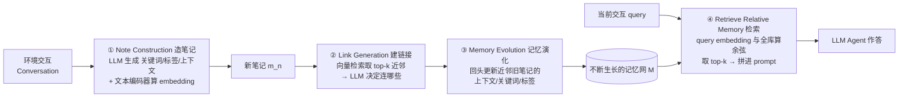

# A-MEM：给 LLM Agent 装一个会自己长链接、会自我演化的『卡片盒』记忆

> **本篇属于 agent-harness 精读库 D 组（记忆）**。按库规范，它对齐标杆范文
> [Harness-Bench](2605.27922-harness-bench-measuring-harness-effects.md) 的密度与诚实度：每个公式先给直觉、
> 再定义符号、再读结论；数字标 §/Table/Eq 出处；区分「论文宣称」与「批判」；缺失写「原文未给出」。
> 本篇的三个 harness 专属动作：**Θ1** 标 harness 六层归属（本篇 = **C 层**）；**Θ2** 回扣 `Agent = Model + Harness`；
> **Θ3** 的 Inspires-Us 直接打到**我们自己的 harness**——我们的 `MEMORY.md` 已经在用 `[[name]]` 手动链接，
> 简直是 Zettelkasten 雏形，A-MEM 的「自动建链 + 演化」正好是它的下一步。

---

## §1　TL;DR（一页讲清这篇在干嘛）

> 主讲提示：开场先给一句大白话——「把 agent 的记忆从一堆散落的便签，变成一本会自己连线、会自己改旧笔记的活页笔记本」；再点明它属于 harness 的哪一层。

**一句话**：A-MEM（Agentic Memory）是一套**受卡片盒笔记法（Zettelkasten）启发**的 LLM agent 记忆系统。它做三件别的记忆系统不做的事——(1) 把每条交互写成一张**结构化笔记**（不只是原文，还带 LLM 生成的关键词、标签、上下文摘要、以及"与哪些旧记忆相连"的链接集）；(2) 新笔记进来时，**自动**在它与语义相近的旧笔记之间**建链接**（无需人预先定义 schema）；(3) 建完链接后，**回头更新旧笔记**——旧笔记的上下文描述、关键词、标签会随新知识"进化"。三者合起来，记忆不再是一张只增不改的平铺列表，而是一张**不断重组、越用越有结构的知识网**（§3；Figure 2）。

**它属于 harness 的哪一层（Θ1）**：本篇打的是 harness 六层里的 **C（Context / 记忆状态）层**——它不改模型、不换工具集、也不重写控制循环，而是专门解决"agent 跨会话记住什么、如何组织、如何随新经验重构"。库内分组 **D=记忆** 正对应此层。它对 **L 层（控制循环）** 有依赖（每一步交互触发"写笔记 → 建链 → 演化 → 检索"这套子流程），也对 **T 层（工具/检索）** 借力（用向量检索做初筛）。

**够新够权威（Θ4）**：**NeurIPS 2025** 论文（PDF 附带 NeurIPS Paper Checklist），Rutgers 大学 + AIOS Foundation 出品；arXiv 已到 v11（2025-10-08）。它在版图上的位置：把学界"agentic RAG"的 agency（自主决定"何时检索、检索什么"）**从检索侧推进到记忆的组织与演化侧**——记忆自己会长链接、会改写自己（§2.2 原文明说这是与 agentic RAG 的根本区别）。

**三条带走的结论**：
1. **机制上**——A-MEM 用三个 LLM 调用（`P_s1` 造笔记、`P_s2` 建链、`P_s3` 演化）把"卡片盒"里人做的"手动连线 + 手动重整"自动化（Eq. 2/6/7）。
2. **效果上**——在长对话数据集 LoCoMo 上，A-MEM 在**多跳推理（Multi-Hop）**类问题上比无记忆/主流记忆基线**至少好 2 倍以上**（§4.3；Table 1/5/6），且**只花 ~1,200–2,500 token/次操作**，相对 LoCoMo/MemGPT 的 16,900 token 省了 **85–93%**（§4.3 Cost-Efficiency）。
3. **诚实边界**——增益**分任务 regime**：多跳/需要跨会话综合的题增益大；纯事实检索类（Open Domain、Adversarial）上 GPT 系里 A-MEM 未必赢强基线（Table 1）。记忆网的质量还受底座 LLM 能力影响（§6 原文承认）。

---

## §2　问题与动机：为什么"平铺的记忆列表"不够用

> 主讲提示：这一页用 Why 三连的"问题层"。核心矛盾一句话——现有记忆系统的结构和操作是**预先钉死**的，知识长出来它却动不了。

**Why（问题层）——不解决会卡住什么？**
LLM agent 要在真实世界干多步任务，光有"强推理"不够，还需要**长期记忆**去积累历史经验、维持跨会话的一致性（§1 原文引 [35]）。但现有记忆系统有两处系统性硬伤（§1、§2.1）：

1. **结构和时机要人预先写死**。主流做法（如 [25,39,21] 这类）要求"agent 开发者**预先定义**记忆存储结构、指定存储点、约定检索时机"（§1 原文）。工作流一固定，记忆的写入/读取就固定，换个新环境就水土不服。
2. **图数据库路线依赖预设 schema**。为改进结构化，Mem0 [8] 沿 RAG 思路引入**图数据库**做存储检索。但"图数据库对结构的组织**根本上依赖预定义的 schema 与关系**，这从根本上限制了适应性"（§1 原文）。

**一个把痛点讲活的例子**（§1 原文亲自举）：当 agent 学到一个**新颖的数学解法**时，现有系统只能把它塞进**预设框架**里归类和链接，**无法**为这条新知识**锻造出新的连接、发展出新的组织模式**——知识在演化，记忆的骨架却是死的。

**Why（这为什么现在才紧要）**：任务越复杂、越开放、越长程，"记忆的组织能不能跟着知识一起长"就越是成败关键。作者把这句提炼成全文的研究问题（§1 斜体原文）：

> *how to design a flexible and universal memory system that supports LLM agents' long-term interactions*（如何设计一个**灵活、通用**、支撑 agent 长期交互的记忆系统）。

**Why（对比 RAG / agentic RAG）**（§2.2）：标准 RAG [18] 把文档切块、按相似度检索、拼进 prompt。agentic RAG [4,14,38] 更进一步——**自主决定何时检索、检索什么**，甚至生成假设性回答来引导检索。但作者点出关键区别：agentic RAG 的 agency **只在检索阶段**；其底层知识库**依旧是静态的**。A-MEM 的 agency 在**更根本的层面**——让记忆**自己生成上下文描述、自己与相关记忆建连、并随新经验演化内容与关系**（§2.2 原文）。

> **读出什么（Θ2 呼应）**：这篇动机不是"再训一个更强的模型"，而是"给 agent 的**记忆这一层 harness** 换一套会自己长结构的骨架"。对应 `Agent = Model + Harness`——**模型没换，换的是记忆 harness 的组织方式**，看能不能让同一个底座 agent 在长对话里表现更好。这正是 C 层作为 harness 组件的意义。

---

## §3　卡片盒笔记法（Zettelkasten）：本篇的思想母体

> 主讲提示：先讲清楚 A-MEM 抄的是什么"人类方法"，读者才懂它三个机制的动机。这页不含数学。

**卡片盒是什么**（§3 引 [15] Kadavy 的《Digital Zettelkasten》、[1] Ahrens 的《How to Take Smart Notes》）：Zettelkasten 是一套"原子笔记 + 灵活链接"的知识管理法。它的两条核心原则：

- **原子性（atomicity）**：每张卡片只承载**一个自成一体的知识单元**（§3.1 原文"a single, self-contained unit of knowledge"）。
- **灵活链接（flexible linking）**：卡片之间**不靠预设分类树**，而是靠"有意义就连一条"的方式，让知识网**有机地长出来**（§3.2 原文"emerges organically"）。

A-MEM 的设计口号（§3）：**atomic note-taking（原子笔记）+ flexible linking（灵活链接）+ continuous evolution（持续演化）**。它把"卡片盒里由人手动完成的连线与重整"交给 LLM 自动做。

**架构总览（Figure 2）**——三个组成部分 + 一个检索：

> **读出什么**：把这张图和标杆 Harness-Bench 的"评测三步（Setup→Execution→Judge）"并读——两者都是把一个笼统能力**拆成可命名、可分析的子步骤**。A-MEM 的贡献正是把"记忆管理"拆成**造/连/演化/检索**四步，每步都能单独讲透、单独消融（§4.4 就消了"连"和"演化"两步）。

**Figure 2 里的 "box" 概念（§Figure 2 caption 原文，务必讲清）**：图中"box i / box j"是一个比喻——**语义相近、上下文描述相似的记忆会"互相连通"，就像被放进同一个盒子**（类比 Zettelkasten 的盒子）。但 A-MEM 的关键差异是：**同一条记忆可以同时存在于多个不同的盒子里**（原文"individual memories to exist simultaneously within multiple different boxes"）。检索时，一旦某条记忆被取回，**与它在同一盒子里链接的相似记忆也会被自动带出**（原文"similar memories that are linked within the same box are also automatically accessed"）——这就是链接的"检索红利"。

---

## §4　符号与术语表（后文所有记号先在这里定义）

> 主讲提示：这页是"字典页"。方法一节的四组公式全部复用这里的记号，讲的时候可以随时翻回来。

| 记号 | 含义 | 出处 |
|---|---|---|
| $\mathcal{M}=\{m_1,\dots,m_N\}$ | 记忆集合（$N$ 张笔记） | §3.1 Eq.(1) |
| $m_i$ | 第 $i$ 张记忆笔记（七元组） | Eq.(1) |
| $c_i$ | 原始交互内容（content，卡片承载的原文） | Eq.(1) |
| $t_i$ | 交互时间戳（timestamp） | Eq.(1) |
| $K_i$ | LLM 生成的**关键词**集合（keywords，抓核心概念） | Eq.(1)(2) |
| $G_i$ | LLM 生成的**标签**集合（tags，用于分类） | Eq.(1)(2) |
| $X_i$ | LLM 生成的**上下文描述**（contextual description，富语义摘要） | Eq.(1)(2) |
| $e_i$ | 该笔记的**稠密向量表示**（embedding） | Eq.(1)(3) |
| $L_i$ | 该笔记的**链接集合**（linked memories，与之有语义关系的记忆） | Eq.(1)(6) |
| $f_{\text{enc}}(\cdot)$ | 文本编码器（text encoder，本文用 all-minilm-l6-v2，[27]） | Eq.(3)(8) |
| $\text{concat}(\cdot)$ | 字符串拼接 | Eq.(3) |
| $\|$ | prompt 内的分隔/拼接（把内容与模板拼在一起喂 LLM） | Eq.(2)(6)(7) |
| $P_{s1},P_{s2},P_{s3}$ | 三个精心设计的 prompt 模板（造笔记 / 建链 / 演化） | §B.1–B.3 |
| $s_{n,j}$ | 新笔记 $m_n$ 与旧笔记 $m_j$ 的**余弦相似度**（link 阶段） | Eq.(4) |
| $\mathcal{M}^n_{\text{near}}$ | 与 $m_n$ 最相似的 **top-$k$** 近邻记忆集合 | Eq.(5) |
| $m_j^{*}$ | 经"演化"后被更新的旧记忆（替换回 $\mathcal{M}$） | Eq.(7) |
| $q$ | 当前交互的查询文本（query） | §3.4 |
| $e_q$ | 查询的向量表示 | Eq.(8) |
| $s_{q,i}$ | 查询 $q$ 与记忆 $m_i$ 的余弦相似度（检索阶段） | Eq.(9) |
| $\mathcal{M}_{\text{retrieved}}$ | 检索阶段取回的 top-$k$ 记忆 | Eq.(10) |
| $k$ | top-$k$ 的截断数（默认 10，见 §4.2 / Table 8） | §4.2 |

---

## §5　机制一 · 笔记结构（Note Construction）：把交互写成一张带属性的卡片

> 主讲提示：这是三大机制的第一个。核心直觉——**别只存原文，要存"原文 + LLM 对它的理解"**。理解（关键词/标签/上下文）就是让后面能"建链、能演化"的钩子。

**Why（问题层→设计层）**：如果记忆里只有原始对话文本 $c_i$，那么"两条记忆该不该连"就只能靠字面相似，很脆。A-MEM 的设计是：进来一条交互，就**让 LLM 先把它读懂**，产出三样结构化"理解"——关键词 $K_i$、标签 $G_i$、上下文描述 $X_i$——外加时间戳和链接集，凑成一张卡片（对应 Zettelkasten 的"原子笔记"）。

**定义（§3.1，Eq.1）——先给每个符号，再给式子**：每张记忆笔记是一个七元组：

$$m_i = \{\, c_i,\ t_i,\ K_i,\ G_i,\ X_i,\ e_i,\ L_i \,\}$$

其中（逐个先定义，见 §4 术语表）：$c_i$=原始内容、$t_i$=时间戳、$K_i$=LLM 生成关键词、$G_i$=LLM 生成标签、$X_i$=LLM 生成上下文描述、$e_i$=embedding、$L_i$=链接集合。

**读出什么**：一条记忆同时携带"**它是什么**（$c_i,t_i$）+ **机器怎么理解它**（$K_i,G_i,X_i$）+ **怎么算相似**（$e_i$）+ **它连着谁**（$L_i$）"。这比"只存一段文本"信息密度高得多，也正是后两个机制能运转的前提。

**语义组件怎么来（Eq.2）**：用 prompt 模板 $P_{s1}$ 让 LLM 一次性抽出关键词、标签、上下文：

$$K_i,\ G_i,\ X_i \leftarrow \text{LLM}\big(c_i \,\|\, t_i \,\|\, P_{s1}\big)$$

- 直觉：把"原文 + 时间 + 模板指令"拼起来喂给 LLM，让它当"笔记整理员"，产出结构化字段。
- $P_{s1}$ 具体长什么样（§B.1 原文）：要求 LLM 输出一个 JSON，含 `keywords`（≥3 个、按重要性排序、不含说话人名/时间、别冗余）、`context`（一句话摘要，覆盖主题/关键论点/目标受众）、`tags`（≥3 个、含 domain/format/type 标签）。

**embedding 怎么算（Eq.3）**：把笔记的**全部文本组件**拼起来过一遍编码器：

$$e_i = f_{\text{enc}}\big[\ \text{concat}(c_i, K_i, G_i, X_i)\ \big]$$

- 直觉：让 embedding 不只反映原文，还反映"LLM 抽出来的关键词/标签/上下文"，这样相似度匹配更贴语义。
- 读出什么：$e_i$ 是后面**建链初筛（Eq.4）**和**检索（Eq.9）**的公共货币。原子笔记（自成一体的知识单元）+ 稠密向量（高效相似匹配）——语义与算力两头都照顾到了（§3.1 末原文）。

> **Why（设计层）——为什么要 LLM 生成 $K_i/G_i/X_i$，而不是只存原文 embedding？**
> 朴素做法：直接 `e_i = f_enc(c_i)`，省一次 LLM 调用。→ 问题：原始对话里的口语、指代、噪声会让相似度不稳，且"标签/关键词"这种**可供 LLM 推理的显式线索**根本不存在，后面的"建链/演化"就没有抓手。A-MEM 让 LLM 先把隐含知识**显式化**成 $K_i/G_i/X_i$（§3.1 原文"autonomous extraction of implicit knowledge"），代价是每条记忆多一次 LLM 调用——但换来了可链接、可演化的结构。

---

## §6　机制二 · 链接生成（Link Generation）：让新笔记自己长出连线

> 主讲提示：这是"卡片盒自动连线"的核心。两步走——**先用向量检索粗筛出候选近邻，再让 LLM 精判该连谁**。强调"embedding 只是初筛，LLM 才是决策者"。

**Why（问题层）**：Zettelkasten 的灵魂是链接，但人手动连线不可扩展。A-MEM 要**无需预设规则**地自动建链（§3.2 原文"without predefined rules"）。

**第一步：相似度初筛（Eq.4）**。新笔记 $m_n$ 进来，先算它与每条旧笔记 $m_j$ 的余弦相似度：

$$s_{n,j} = \frac{e_n \cdot e_j}{|e_n|\,|e_j|}$$

- 直觉：先用"向量夹角"快速量出"谁跟新笔记像"。余弦相似度对向量长度不敏感，只看方向（语义朝向）。
- 符号：$e_n,e_j$ 是两条笔记的 embedding；分子是点积，分母是模长积——归一化到 $[-1,1]$。

**取 top-$k$ 近邻（Eq.5）**：

$$\mathcal{M}^n_{\text{near}} = \{\, m_j \mid \text{rank}(s_{n,j}) \le k,\ m_j \in \mathcal{M} \,\}$$

- 读出什么：只保留最像的 $k$ 条作为"连线候选"，把 LLM 的判断范围从"全库"收窄到"最相关的一小撮"——这正是**用 embedding 做可扩展初筛**（Eq.4 附近原文"efficient scalability"），避免在大记忆库里做穷举比较。

**第二步：LLM 精判连谁（Eq.6）**。把新笔记和它的近邻集一起喂给 LLM，让它决定链接集：

$$L_i \leftarrow \text{LLM}\big(m_n \,\|\, \mathcal{M}^n_{\text{near}} \,\|\, P_{s2}\big)$$

- 每条生成的链接结构为 $L_i=\{m_i,\dots,m_k\}$（原文）。
- $P_{s2}$ 干什么（§B.2 原文）：以"AI memory evolution agent"的身份，读新笔记的 context/content/keywords 和近邻记忆，判断"该不该演化、和其它记忆的关系如何"。

> **Why（设计层）——为什么"embedding 初筛 + LLM 精判"，不直接用相似度阈值连线？**
> 朴素做法：谁的 $s_{n,j}$ 超过阈值就连谁。→ 问题：纯 embedding 相似只能抓"字面/表层语义像"，抓不到**因果关系、概念从属、微妙关联**（§3.2 原文"subtle patterns, causal connections, and conceptual connections that might not be apparent from embedding similarity alone"）。A-MEM 用 embedding 做**召回**（保住可扩展性），用 LLM 做**精排/决策**（保住关系质量）——这套"召回 + 精排"分工，和现代检索/推荐系统一个思路。代价：每条新笔记多一次 LLM 调用。

> **读出什么**：链接不是对称的死表，而是"由内容与上下文有机生长出来的网络"（§3.2 末原文"emerges organically"）。这与 §3 讲的 Zettelkasten "灵活链接"原则闭环。

---

## §7　机制三 · 记忆演化（Memory Evolution）：新知识回头改写旧笔记

> 主讲提示：这是全篇**最有辨识度、最该讲透**的机制——别的记忆系统只"增"，A-MEM 会"**改旧的**"。直觉一句话：**人学到新东西，会回头修正对旧事的理解**；A-MEM 让记忆也这样。

**Why（问题层）**：静态记忆的根本缺陷是"写下去就不动了"。但真实学习是**动态的**——新经验会让你重新理解旧经验。A-MEM 要模拟这一点（§3.3 原文"mimicking human learning processes"）。

**定义（§3.3，Eq.7）**：建完链接后，对新笔记的**每一条近邻旧记忆** $m_j \in \mathcal{M}^n_{\text{near}}$，系统判断要不要更新它的上下文、关键词、标签：

$$m_j^{*} \leftarrow \text{LLM}\big(m_n \,\|\, \mathcal{M}^n_{\text{near}} \setminus m_j \,\|\, m_j \,\|\, P_{s3}\big)$$

- 逐符号：$m_n$=触发演化的新笔记；$\mathcal{M}^n_{\text{near}} \setminus m_j$=近邻集里**除 $m_j$ 之外**的其它近邻（给 LLM 提供邻域上下文）；$m_j$=待演化的那条旧笔记；$P_{s3}$=演化模板。
- 输出 $m_j^{*}$ **替换回** $\mathcal{M}$ 里原来的 $m_j$（原文"then replaces the original memory $m_j$"）。

**读出什么**：这就是"卡片盒重整"的自动化——一张新卡片进来，不只自己找位置，还**促使邻近的旧卡片更新它们的标签、关键词和上下文摘要**。随着处理的记忆越来越多，系统会"发展出越来越复杂的知识结构，跨多条记忆发现高阶模式与概念"（§3.3 原文"higher-order patterns"）。

**$P_{s3}$ 到底让 LLM 决定什么（§B.3 原文，值得逐条看，因为这决定了"演化"的具体动作空间）**：它要求 LLM 返回一个 JSON，字段包括：
- `should_evolve`: true/false（要不要演化）；
- `actions`: 从 `["strengthen", "merge", "prune"]` 里选（**强化连接 / 合并 / 剪枝**）；
- `suggested_connections`: 建议连到哪些 neighbor 的 id；
- `tags_to_update`: 新笔记自己要更新的标签；
- `new_context_neighborhood`: 给近邻记忆更新后的上下文列表；
- `new_tags_neighborhood`: 给近邻记忆更新后的标签列表（二维，每个近邻一组）。

> **Why（设计层）——为什么演化只改"上下文/关键词/标签"，不改原始内容 $c_i$？**
> 这是一个克制而聪明的设计边界：原始交互内容 $c_i$ 是**事实底稿**，改它等于篡改历史；而 $K_i/G_i/X_i$ 是**对事实的解释层**，随新知识更新解释层是安全且有益的。所以演化动词是 strengthen/merge/prune（连接与解释层面），**不碰底稿**。原文虽未用这句话明说边界，但从 Eq.7 只更新"context, keywords, tags"（§3.3 首句）可读出这一设计意图。
>
> **另一个朴素替代**：每来一条新记忆就把**全库**都重算一遍。→ 计算爆炸且大多无意义。A-MEM 只演化**近邻 $\mathcal{M}^n_{\text{near}}$**（top-$k$），把演化限制在"最可能相关"的局部——既省算力，又符合"新知识主要影响相关旧知识"的直觉。

> **读出什么（三机制闭环）**：**造笔记（§5）产出结构 → 建链（§6）用结构找关系 → 演化（§7）用新关系反过来改结构**。这是一个正反馈：记忆用得越多，结构越丰富，检索与推理的抓手越多（§3.3 末"autonomous memory learning"）。

---

## §8　机制四 · 检索（Retrieve Relative Memory）：把相关历史喂回当前交互

> 主讲提示：这页最轻，但要点明——检索用的 embedding 与写入用的是**同一个编码器**，保证 query 与记忆在**同一语义空间**里比。

**流程（§3.4，Eq.8–10）**：

1. 查询编码（Eq.8）：$e_q = f_{\text{enc}}(q)$——用**同一个** $f_{\text{enc}}$（与 Eq.3 一致），把当前查询 $q$ 编码。
   - Why：写入和检索必须用同一编码器，否则 query 向量和记忆向量不在一个空间，相似度无意义。
2. 算相似度（Eq.9）：$$s_{q,i} = \frac{e_q \cdot e_i}{|e_q|\,|e_i|},\quad \forall m_i \in \mathcal{M}$$ 查询对全库每条记忆算余弦相似度。
3. 取 top-$k$（Eq.10）：$$\mathcal{M}_{\text{retrieved}} = \{\, m_i \mid \text{rank}(s_{q,i}) \le k,\ m_i \in \mathcal{M} \,\}$$ 取最相关的 $k$ 条，拼成"上下文合适的 prompt"喂给 agent。

**检索红利（回扣 §3 的 box）**：因为记忆之间有链接，取回一条时，**同盒子里的链接记忆也被自动带出**（Figure 2 caption）。所以 A-MEM 的检索不只是"top-k 相似"，还叠加了"链接扩散"，能把**语义相关但字面不相似**的记忆也牵出来——这正是链接机制对多跳推理的贡献路径。

> **读出什么**：检索本身是标准的向量 top-k，但**前三个机制把记忆库"养"得更有结构**，所以同样的检索能捞出更有用的上下文。这解释了为什么 A-MEM 的增益在**多跳（需要串联多条记忆）**任务上最明显（见 §11）。

---

## §9　实验设置：数据集、基线、指标、超参、成本

> 主讲提示：这页把 setting/metrics/params 一次报全，指标全给定义式。强调两个数据集一"长"一"更长"，正好压测长期记忆。

**数据集（§4.1）**：
- **LoCoMo** [22]：超长对话记忆评测集。相比旧数据集（~1K token、4–5 会话），LoCoMo **平均 9K token、跨 35 个会话**，专测长程依赖与一致性。含 5 类问题：**单跳（single-hop）/ 多跳（multi-hop，需跨会话综合）/ 时序（temporal）/ 开放域知识（open-domain，需外部知识）/ 对抗（adversarial，测能否识别"不可答"）**。共 **7,512 个 QA 对**。
- **DialSim** [16]：从热门美剧（Friends、The Big Bang Theory、The Office）派生的长期多方对话 QA。**覆盖 5 年、1,300 个会话、约 350,000 token**，每会话 >1,000 个问题（来自粉丝问答与时序知识图）。比 LoCoMo **更长、更"多人"**。

**基线（§4.1，详见 §A.1）**：
- **LoCoMo（方法）** [22]：**无记忆机制**，直接把完整历史对话拼进 prompt，纯靠模型自身推理。
- **ReadAgent** [17]：三步法——分页 → gisting（把每页蒸成要点）→ 交互式查阅。
- **MemoryBank** [39]：基于**艾宾浩斯遗忘曲线**动态调整记忆强度 + 用户画像。
- **MemGPT** [25]：借操作系统内存层级思想，分**主上下文（≈RAM）**与**外部上下文（≈磁盘）**。

**底座模型（§4.2，共 6 个）**：GPT-4o-mini、GPT-4o、Qwen2.5-1.5B、Qwen2.5-3B、Llama3.2-1B、Llama3.2-3B。附录另报 DeepSeek-R1-32B [11]、Claude 3.0 Haiku [2]、Claude 3.5 Haiku [3]（Table 7）。
- 小模型（Qwen/Llama）用 **Ollama** 本地部署 + **LiteLLM** 管结构化输出；GPT 用官方结构化输出 API。
- **文本编码器**：**all-minilm-l6-v2**（全实验统一）。
- **top-$k$**：主用 **k=10**；部分类别按需调（Table 8：GPT 系在 Multi-Hop/Temporal 用 40、Open Domain/Single Hop 用 50、Adversarial 用 40；小模型多数 k=10）。§4.2 原文：已在 k=10 达 SOTA 的就不再调。

**评测指标（§4.1 + §A.2，全部给定义式）**：

**① F1（Eq.11–13）**——精确率与召回率的调和平均，衡量答案与参考的 token 级重合：
$$\text{F1}=2\cdot\frac{\text{precision}\cdot\text{recall}}{\text{precision}+\text{recall}},\quad \text{precision}=\frac{TP}{TP+FP},\quad \text{recall}=\frac{TP}{TP+FN}$$
读出：$TP/FP/FN$=真正例/假正例/假反例；span 式 QA 里 F1 兼顾"答准"和"答全"。

**② BLEU-1（Eq.14–16）**——unigram（单词级）精确率，带简短惩罚 $BP$：
$$\text{BLEU-1}=BP\cdot\exp\!\Big(\sum_{n=1}^{1} w_n \log p_n\Big),\quad BP=\begin{cases}1 & c>r\\ e^{1-r/c} & c\le r\end{cases},\quad p_n=\frac{\sum_i\sum_k \min(h_{ik},m_{ik})}{\sum_i\sum_k h_{ik}}$$
读出：$c$=候选长度、$r$=参考长度、$h_{ik}$=候选 $k$ 中 n-gram $i$ 的计数、$m_{ik}$=参考中该 n-gram 的最大计数。$BP$ 惩罚"答太短"。

**③ ROUGE-L（Eq.17–19）**——基于**最长公共子序列（LCS）**的 F 值：
$$\text{ROUGE-L}=\frac{(1+\beta^2)R_l P_l}{R_l+\beta^2 P_l},\quad R_l=\frac{\text{LCS}(X,Y)}{|X|},\quad P_l=\frac{\text{LCS}(X,Y)}{|Y|}$$
读出：$X$=参考、$Y$=候选；LCS 抓"顺序上的重合"，对语序敏感。

**④ ROUGE-2（Eq.20）**——bigram 重合率：
$$\text{ROUGE-2}=\frac{\sum_{\text{bigram}\in\text{ref}}\min(\text{Count}_{\text{ref}},\text{Count}_{\text{cand}})}{\sum_{\text{bigram}\in\text{ref}}\text{Count}_{\text{ref}}}$$
读出：抓"局部词序"（相邻两词的重合）。

**⑤ METEOR（Eq.21–23）**——考虑同义/释义的对齐分：
$$\text{METEOR}=F_{\text{mean}}\cdot(1-\text{Penalty}),\quad F_{\text{mean}}=\frac{10PR}{R+9P},\quad \text{Penalty}=0.5\cdot\Big(\frac{\text{ch}}{m}\Big)^3$$
读出：$P$=精确率、$R$=召回率、$\text{ch}$=chunk 数、$m$=匹配 unigram 数；对"换了同义词但意思对"更友好。

**⑥ SBERT Similarity（Eq.24–25）**——句向量余弦，抓深层语义（即使字面不重合）：
$$\text{SBERT\_Sim}=\cos\big(\text{SBERT}(x),\text{SBERT}(y)\big),\quad \cos(a,b)=\frac{a\cdot b}{\|a\|\|b\|}$$

> **读出什么（指标组合的用意）**：F1/BLEU/ROUGE 抓**字面重合**，METEOR 抓**同义**，SBERT 抓**深层语义**——六个指标从"死抠字面"到"看意思"层层递进。这套组合能避免"只用字面指标把'意思对但措辞不同'的答案误判为错"，对**生成式长对话 QA** 尤其重要。

---

## §10　主结果：多跳推理上的碾压，加上极致的省 token

> 主讲提示：全场最该停留的两个数字——**多跳"至少 2 倍"**（能力）和 **"85–93% token 削减"**（成本）。一个讲"更聪明"，一个讲"更便宜"。

**结果一 · LoCoMo 五类 QA（Table 1，F1/BLEU-1；Table 5 补 ROUGE；Table 6 补 METEOR/SBERT）**。作者结论（§4.3 Performance Analysis）：
- **非 GPT 底座（Qwen/Llama）**：A-MEM **在所有类别、所有指标上一致超过全部基线**。
- **GPT 底座**：在 **Open Domain / Adversarial**（偏简单事实检索）上，LoCoMo（全历史入 prompt）和 MemGPT 靠强预训练知识表现也很强；但 **A-MEM 在 Multi-Hop（多跳）上达到"至少 2 倍"于基线的表现**（§4.3 原文"at least two times better ... that require complex reasoning chains"）。

几个可复述的具体数字（均来自 Table 1/5/6，标注类别）：
- **GPT-4o-mini · Multi-Hop**：A-MEM ROUGE-L **44.27** vs LoCoMo **18.09**（§A.3 原文点名"超过 LoCoMo 的两倍多"）；同格 METEOR **23.43** vs 7.61；SBERT **70.49** vs 52.30（Table 5/6）。
- **Qwen2.5-1.5B · Multi-Hop**：A-MEM ROUGE-L **27.23** vs LoCoMo 4.68 / ReadAgent 7.14——**近 6 倍**（§A.3 原文"nearly six-fold improvement"）。
- **Qwen2.5-3B · Multi-Hop**：A-MEM F1 **12.57**、BLEU **9.01**，全面高于三个记忆基线（Table 1）。

**结果二 · DialSim（Table 2，更长更难的数据集）**：A-MEM **在全部 6 个指标上一致超过 LoCoMo 与 MemGPT**——F1 **3.45** vs LoCoMo 2.55（**+35%**）vs MemGPT 1.18（**+192%**）；SBERT **19.51** vs 15.76 / 8.54（§4.3 原文明确给出这两个百分比）。

**结果三 · 成本效率（§4.3 Cost-Efficiency Analysis，这是它的"隐藏杀招"）**：
- **每次记忆操作仅 ~1,200 token**（§4.3 正文；§A.3 给区间"1,200–2,500 token"），相对 LoCoMo/MemGPT 的 **16,900 token**，**削减 85–93%**——原因是 A-MEM 用**选择性 top-k 检索**只喂相关记忆，而非把整段历史塞进 prompt。
- **每次操作成本 < \$0.0003**（商用 API 价），作者称"让大规模部署经济可行"。
- **处理时延**：GPT-4o-mini 平均 **5.4 秒**；本地 Llama3.2-1B **仅 1.1 秒**（单卡 GPU）。

**Table 1 节选（LoCoMo，GPT-4o-mini，F1/BLEU-1，%）**：

| Method | Multi-Hop F1 | Multi-Hop BLEU | Open Domain F1 | Adversarial F1 | Token Length |
|---|---:|---:|---:|---:|---:|
| LoCoMo | 25.02 | 19.75 | 40.36 | **69.23** | 16,910 |
| ReadAgent | 9.15 | 6.48 | 5.31 | 45.05 | 643 |
| MemoryBank | 5.00 | 4.77 | 5.94 | 12.73 | **432** |
| MemGPT | 26.65 | 17.72 | **44.66** | 50.03 | 16,977 |
| **A-MEM** | **27.02** | **20.09** | 12.14 | 49.47 | 2,520 |

> **读出什么（诚实分 regime，为 §13 埋线）**：这张表把话说清了——**A-MEM 在 Multi-Hop 最强、在 token 上远比全历史法省**；但在 **Open Domain / Adversarial** 这两类"直接事实检索/判不可答"上，把全历史塞进 prompt 的 LoCoMo（69.23 / 44.66）反而更高。这不是矛盾，而是**任务 regime 不同**：需要"跨会话把线索串起来"时，A-MEM 的链接 + 演化才发力；纯查事实时，堆全上下文反而更直接（但贵 6 倍 token）。

---

## §11　消融与分析：链接是地基，演化是精装修

> 主讲提示：这页回答"三机制里，谁贡献大？"。一句话结论——**Link Generation 是地基（拿掉塌得最狠），Memory Evolution 是精装修（再拔高一截）**。

**消融（Table 3，GPT-4o-mini，LoCoMo）**：`w/o LG & ME`（连和演化都拿掉）→ `w/o ME`（只保留连、拿掉演化）→ 完整 A-MEM。

| 配置 | Multi-Hop F1 | Multi-Hop BLEU | Single-Hop F1 | Adversarial F1 |
|---|---:|---:|---:|---:|
| w/o LG & ME | 9.65 | 7.09 | 13.28 | 15.32 |
| w/o ME（有 LG，无演化） | 21.35 | 15.13 | 39.17 | 44.16 |
| **A-MEM（完整）** | **27.02** | **20.09** | **44.65** | **50.03** |

**读出什么（§4.4 原文）**：
- **拿掉两者（w/o LG & ME）性能塌陷最严重**——尤其 Multi-Hop（9.65）和 Open Domain。说明"结构化的链接"是记忆组织的**根本基石**。
- **只加回 LG（w/o ME）就能把 Multi-Hop 从 9.65 拉到 21.35**——link generation 是"临界地基"。
- **再加回 ME（完整）继续拔到 27.02**——memory evolution 提供"必要的精修"（原文"essential refinements"），两模块**互补**。

**其它分析**：
- **超参 k（Figure 3，§4.5）**：k 从 10→50，性能总体先升后**趋于平台、偶尔略降**（在 Multi-Hop / Open Domain 尤为明显）。解读：k 太小上下文不够，k 太大引入噪声、且挑战模型处理长序列的能力——**中等 k 是甜点**（"context richness vs. information processing efficiency"的权衡）。
- **可扩展性（Table 4，§4.6）**：三系统空间复杂度都是 $O(N)$（向量检索的应有代价，A-MEM 无额外存储开销）。**检索时延**：记忆规模 1K→1M（×1000），A-MEM 检索时间仅从 **0.31µs 升到 3.70µs**——增长极缓，证明大规模下依然高效（MemoryBank 更快一点，但 A-MEM 提供更丰富的记忆表示）。ReadAgent 则从 43.62µs 飙到 120,069µs，完全不在一个量级。
- **结构可视化（Figure 4/5，§4.7）**：t-SNE 显示——A-MEM（蓝）的记忆 embedding 比"无链接无演化的 Base"（红）**聚类更清晰**（Dialogue 2 尤其明显，中心区形成清晰簇）。这是"链接 + 演化确实把记忆组织出了结构"的经验证据。

> **读出什么**：消融把"卡片盒三机制"的**因果权重**量了出来——**链接 > 演化 > 无**。这对我们迁移时的**优先级**是直接指导：**先做自动建链，再做演化**（见 Inspires-Us）。

---

## §12　一个把机制讲活的具体例子（§B.4）

> 主讲提示：抽象讲完，用论文自带的 Q/A 例子落地，让大家"看见"一条记忆长什么样。

论文 §B.4 给了一个真实问答样例（Question 686：Dave 在 2023 年 10 月捡起了什么爱好？答案：photography）。它展示了两条被检索出的记忆笔记，每条都带**四个字段**：

- **memory content**（原文）：如 *"Speaker Dave says: ... I've taken up photography and it's been great ..."*
- **memory context**（$X_i$，LLM 生成摘要）：*"The main topic is the speaker's new hobby of photography, highlighting their enjoyment ..."*
- **memory keywords**（$K_i$）：`['photography', 'scenery', 'conversation', 'experience', 'hobby']`
- **memory tags**（$G_i$）：`['hobby', 'photography', 'personal development', 'conversation', 'leisure']`

> **读出什么**：注意 `'photography'` **同时出现在 content、keywords、tags 三处**（原文用红色标出）——这正是 §5 说的"$K_i/G_i/X_i$ 让隐含知识显式化"的作用：即便查询措辞不同，多路字段都能命中，检索鲁棒性因此提升。这个例子也直观展示了"卡片"的样子，是把三机制从公式落回工程的最好锚点。

---

## §13　讨论：什么时候"记忆 harness"真的值？（regime 诚实，Θ5）

> 主讲提示：这页是判断力的高地。别把"A-MEM 全面吊打"当结论——它有清晰的 regime 边界。

把 §10 的结果拆开看，A-MEM 的增益**强烈依赖任务类型**：

- **A-MEM 明显更好的 regime**：**多跳推理（Multi-Hop）**、**需要跨会话把碎片线索综合起来**的题（§4.3 原文点名 Multi-Hop 是它的主场）。机制解释：链接 + 演化把"散落多个会话的相关记忆"织成网、检索时又能顺链扩散，正好服务"串联式推理"。
- **A-MEM 未必更好的 regime**：GPT 系底座下的 **Open Domain（靠预训练知识的事实检索）/ Adversarial（判不可答）**——把全历史塞进 prompt 的 LoCoMo 反而更高（Table 1：69.23 vs 49.47 的 Adversarial F1）。机制解释：这类题不吃"记忆间的关系"，堆全上下文更直接（代价是 token 贵 6 倍）。
- **底座越弱，记忆 harness 越关键**：非 GPT 的小模型（Qwen/Llama）上 A-MEM **一致全胜**，且 Multi-Hop 提升可达近 6 倍（§A.3）。这呼应一个更普适的规律——**弱模型更依赖外部记忆/脚手架来补足能力，强模型则部分自足**。

> **读出什么（Θ5，不绝对化）**：诚实的表述是——**"结构化 + 演化的记忆是否值得"分 regime**：任务越需要跨会话综合、底座越弱，A-MEM 这套 C 层 harness 的边际价值越大；任务越偏单点事实、底座越强，堆上下文或直接检索可能就够了。这与标杆 Harness-Bench 的核心洞见（harness 的价值不均匀分布、强模型更"不挑" harness）**同构**——只不过 Harness-Bench 讲的是"控制循环/工具" harness，A-MEM 讲的是"记忆" harness。

---

## §14　局限与批判（论文 §6 + 我的补充）

**论文自陈（§6，诚实）**：
- **记忆网质量受底座 LLM 能力制约**：不同 LLM 生成的上下文描述、建立的连接**会有差异**（原文"may still be influenced by the inherent capabilities of the underlying LLMs"）——即"演化的好坏"上限由底座决定。
- **仅限文本**：当前只处理文本交互；多模态（图像/音频）留作未来工作。

**我的补充批判（区分于论文宣称）**：
- **三次 LLM 调用的隐藏成本**：每条新记忆要触发"造笔记 + 建链 + 对每个近邻演化"多次 LLM 调用。§4.3 报的"~1,200 token/操作"是**检索侧**的省，但**写入 + 演化侧**的 LLM 调用成本，论文**未单独给出总账**（原文未明确拆分写入阶段的累计 token/延迟）。在高吞吐写入场景，这可能是真实瓶颈。
- **演化的稳定性未评估**：`P_s3` 允许 `merge`/`prune`——但**反复演化会不会导致旧记忆语义漂移、甚至把正确信息"改坏"**？论文没有"演化前后事实一致性"的评测，也没有防止"级联误改"的机制说明（原文未给出）。这是"会自我改写的记忆"最该被追问的安全性问题。
- **基线口径的可比性**：把"LoCoMo（全历史入 prompt，无记忆机制）"当基线时，它 token 花 16,900、A-MEM 花 2,520——**两者不是同一 token 预算下的公平对比**。A-MEM 的"更省"是真的，但"在同等上下文预算下谁更强"这个问题，论文没有正面回答。
- **可视化证据偏软**：Figure 4/5 的 t-SNE"更聚类"是**定性**观察，没有给聚类质量的**定量指标**（如轮廓系数），"结构更好"的强度难以量化（原文未给出定量聚类指标）。
- **"高阶模式涌现"缺直接证据**：§3.3 宣称演化会让系统"发现高阶模式/概念"，但正文没有一个实验**直接**展示"哪个高阶概念是被演化涌现出来的"——这一条更接近愿景而非实证（原文未给出对应实验）。

---

## ★ 对我们的启发（Inspires Us）

> 这一节是组会高潮，也是本库相对纯"读论文"的独门优势：**我们自己就活在一个 harness 里**——而且我们**已经有一个手工版的 Zettelkasten**：`C:\Users\ericp\.claude\projects\...\memory\MEMORY.md`，它现在就用 **`[[name]]` 语法手动在记忆条目间建链接**（例如 `[[runbook-verification-task]]`、`[[fix-algo-to-match-paper]]`）。A-MEM 干的，正是把"我们手动连线、手动重整"这件事**自动化**。所以下面每条都能直接落到我们自己的记忆 harness 上。

➤ **a. 可直接借用的招（method we can reuse）**：把 A-MEM 的**"embedding 初筛 top-k + LLM 精判建链"两步法**（Eq.4–6）搬到我们的 `MEMORY.md` 维护流程。现在我们的 `[[name]]` 链接是**人肉判断**该连谁；可以做一个"记忆整理员"子流程：新增一条记忆条目时，先用向量检索从现有条目里召回最相似的 top-k，再让一个 LLM 判断"该给新条目补哪些 `[[...]]` 链接"。**关键 trick**：链接决策交给 LLM（能抓因果/从属这类 embedding 抓不到的关系），embedding 只做召回——这正是消融证明的"LG 是地基"（Table 3：加回 LG 把 Multi-Hop 从 9.65→21.35）。

➤ **b. 可迁移到我们模块的思路（transfer）**：把 A-MEM 的**七元组笔记结构**（Eq.1：content+timestamp+keywords+tags+context+embedding+links）作为我们记忆条目的**标准 schema**。我们现在的 `MEMORY.md` 条目大多只有"标题 + 一句话 + `[[链接]]`"，缺 `keywords/tags/context` 这三个**可供 LLM 检索与推理的显式字段**。迁移时要改的前提：我们的记忆写入不是高频对话，而是**任务级里程碑**（如 auto-research 库那条"built 74-paper report library ... complete"），所以**演化频率可以很低**——不必每次都全量演化，可在"一个大任务收口时"批量跑一次演化，重整相关旧条目的 tags/context。

➤ **c. 它暴露的开放问题 = 我们的机会（open problems → our opportunity）**：论文**没有评估"演化的安全性"**（§14 我的批判）——反复 merge/prune 会不会把正确记忆改坏、级联误传？这对我们尤其要命，因为 `MEMORY.md` 是**跨会话的事实源**，改错会污染后续所有会话。**可下手的第一步**：给我们的演化流程加一条 A-MEM 没有的硬约束——**演化只允许改 `keywords/tags/context`（解释层），永不改条目的核心事实断言（底稿层）**，并在每次演化后做一次"事实一致性 diff"（新旧 context 若与原始事实冲突就拒绝）。这正好把 A-MEM 那个隐忧变成我们的一个可交付改进。

➤ **d. 与本库其它论文/模块的连接（connect the dots）**：与标杆 **Harness-Bench**（2605.27922）呼应——它证明"换 harness 分数摆 23.8 分"，A-MEM 则是"换**记忆这层** harness"的一个具体实例，二者共同支撑 `Agent = Model + Harness`；与 **MemGPT / MemoryBank**（本篇的基线）对立——它们是"预设结构 + 固定操作"的记忆，A-MEM 是"自生长结构 + 自演化"的记忆，正好是同一 C 层的两代方案；与我们记忆里的 **`[[fix-algo-to-match-paper]]`** 政策呼应——那条政策讲"发现矛盾就动手改"，A-MEM 的"演化"就是记忆层的"发现新知就改旧解释"。

➤ **e. 如果我来做下一步（my next move，第一人称、可执行）**：我会先给我们的 `MEMORY.md` 维护写一个**最小自动建链脚本**——读现有条目、对每个条目算 embedding（用本地 all-minilm-l6-v2，正是论文的编码器）、为新条目召回 top-5 近邻、让一个 LLM 产出建议的 `[[...]]` 链接和 3 个 tags，**先只输出建议、不自动改写**（人审后再落盘）。跑一周，量一个指标：**我（下一次会话的 agent）靠这些自动补的链接，能否更快跳到相关历史条目**（用"检索命中相关条目所需的步数"近似 A-MEM 的 Multi-Hop 增益）。若有效，再考虑加"低频批量演化 + 事实一致性护栏"（承接 c）。

---

## §15　版图定位（canon/前沿坐标 + 在本库的位置）

- **时间坐标（Θ4）**：**2025 前沿**（NeurIPS 2025，含 NeurIPS Paper Checklist）。它相对基石推进了什么——**MemGPT**（2023，[25]）把记忆做成"OS 内存层级（主/外部上下文）"、**MemoryBank**（AAAI 2024，[39]）加"遗忘曲线 + 用户画像"，但两者的**结构与操作都是预设的**；A-MEM 反过来，把记忆的**组织（建链）与内容（演化）都交给 agent 自主生成**，是这条线上"从静态结构 → 自生长结构"的一步。相对 **agentic RAG**（[4,14,38]），它把 agency **从"检索侧"搬到"记忆的组织与演化侧"**（§2.2 原文明说这是根本区别）。
- **harness 六层归属（Θ1）**：本篇坐 **C（Context / 记忆状态）层**——库内 **D 组（记忆）** 正对此层；它依赖 **L 层**（每步交互触发造/连/演化/检索子流程）、借力 **T 层**（向量检索初筛）。
- **回扣 `Agent = Model + Harness`（Θ2）**：A-MEM 是"**只换记忆 harness、不换模型**，看长对话表现能不能变好"的一个受控实例。它给全库中心命题贡献的证据是——**同一底座模型，配上'会建链 + 会演化'的记忆层，多跳推理提升 ≥2 倍、token 省 85–93%**（§4.3；Table 1）。这与标杆 Harness-Bench"换控制循环/工具 harness 摆 23.8 分"是**同一命题的不同切面**（记忆 vs 循环）。
- **在本库的位置**：**D 组（记忆 / C 层）代表作之一**。读完它，再回看 F 组（上下文折叠/状态重建）会发现它们攻的是同一类"长程状态"问题的不同侧面——A-MEM 攻"跨会话记忆的组织与演化"，F 组攻"单次长任务内的上下文压缩/重建"。

---

## §16　组会讨论问题（留给大家吵）

1. A-MEM 的"演化"允许 `merge/prune` 旧记忆——**如何防止反复演化把正确信息改坏（级联误传）**？你会设计什么"事实一致性护栏"？（承接 §14）
2. §10 显示 GPT 系里 A-MEM 在 Open Domain/Adversarial 输给"全历史入 prompt"的 LoCoMo。**在同等 token 预算下**（都给 2,500 token），谁会赢？该怎么设计这个公平对比实验？
3. 写入侧（造笔记 + 建链 + 对每个近邻演化）的**累计 LLM 调用成本**论文没给总账。你估计在高频写入场景，这会不会反噬"省 token"的卖点？怎么测？
4. "强模型更不挑记忆 harness"——若把底座换成最强模型，A-MEM 相对"直接塞上下文"的边际收益会不会衰减到误差范围内？哪类任务（多跳？）最抗衰减？
5. 把我们的 `MEMORY.md`（手动 `[[name]]` 链接）升级成"自动建链 + 低频演化"，**第一个该量的指标**是什么？（提示：Inspires-Us e 给了一个"检索命中步数"的近似）
6. Zettelkasten 强调"原子性（一卡一知识点）"。我们的记忆条目现在偏"一任务一大段"，**要不要拆成更原子的卡片**才能让自动建链发挥威力？拆的代价是什么？

---

## §17　一页速记（takeaways）

- **命题**：把 agent 记忆从"平铺列表"变成"卡片盒（Zettelkasten）式、会自动建链 + 会自我演化的知识网"。属 harness 的 **C 层（记忆）**。
- **三机制**：① **造笔记**（Eq.1–3，$m_i=\{c,t,K,G,X,e,L\}$，LLM 生成关键词/标签/上下文）→ ② **建链**（Eq.4–6，embedding 初筛 top-k + LLM 精判连谁）→ ③ **演化**（Eq.7，新知回头改旧笔记的 context/keywords/tags，动作 strengthen/merge/prune）。外加 ④ **检索**（Eq.8–10，query 余弦 top-k + 链接扩散）。
- **数据/设置**：LoCoMo（7,512 QA，~9K token，35 会话）+ DialSim（~350K token，1,300 会话，5 年）；6 底座模型；6 指标（F1/BLEU-1/ROUGE-L/ROUGE-2/METEOR/SBERT，全给定义式）；编码器 all-minilm-l6-v2；默认 k=10。
- **铁证**：Multi-Hop **≥2 倍**于基线（GPT-4o-mini ROUGE-L 44.27 vs 18.09；Qwen1.5B 近 6 倍）；DialSim F1 3.45（+35% / +192%）；**token ~1,200–2,500 vs 16,900，省 85–93%**；<\$0.0003/操作；5.4s / 1.1s 时延。
- **消融**：**LG（建链）是地基**（加回把 Multi-Hop 9.65→21.35），**ME（演化）是精修**（再到 27.02）；k 中等最佳；$O(N)$ 空间、1M 记忆检索仅 3.70µs。
- **诚实（regime）**：多跳/跨会话综合、弱底座 → A-MEM 大胜；纯事实检索、强底座 → 堆上下文可能更直接。记忆网质量受底座 LLM 制约；演化安全性未评估；写入侧成本未拆账。
- **对我们（Θ3）**：我们的 `MEMORY.md` 已在用 `[[name]]` 手动建链——A-MEM 的"自动建链（embedding+LLM）+ 低频演化"直接可迁移；下一步先写"只出建议、人审落盘"的自动建链脚本，量"检索命中步数"，再加"只改解释层、护事实底稿"的演化护栏。
