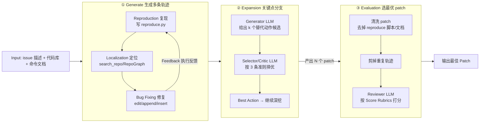

# DARS：动态动作重采样——用自适应树遍历在推理时给编码 Agent 更多试错机会

> **本篇定位**：这是 agent-harness 库 **E 组（集成/编码系统）**的一篇前沿论文精读，对齐标杆范文
> [`Harness-Bench`](2605.27922-harness-bench-measuring-harness-effects.md) 的密度与诚实度，并落实本库 Θ1–Θ5
> 与 v2 的 Why 三连 + Inspires-Us。**全篇要讲透的一句话**：一条 agent 轨迹如果"一条道走到黑"，在某个关键动作
> 上做错了就再也回不来；DARS 的做法是**在少数几个高杠杆的决策点上分支、重采样若干条替代动作、择优前进**——
> 这本质上是把"推理时算力(inference-time compute)"当成 harness 的一个旋钮，用 token 换成功率。

---

## §1　TL;DR（一页讲清这篇在干嘛）

> 主讲提示：开场先把全库中心命题抛出来——`Agent = Model + Harness`；DARS 不换模型，它给编码 agent 的 harness
> 加了一个新旋钮叫"推理时算力扩展"。然后一句话说清它在 SWE-Bench Lite 上把开源解决率推到了 47%。

**一句话**：DARS（**Dynamic Action Re-Sampling**，动态动作重采样）是一个面向编码 agent 的**推理时算力扩展**方法。传统 agent 要么走**单条线性轨迹**（ReAct，错了没救），要么**独立重采样多条完整轨迹再投票/排序**（Large Language Monkeys、Agentless，彼此不共享知识、极其浪费算力）。DARS 走中间路线：**先深度优先跑完一条轨迹，把途中的"关键决策点"存进一个优先队列；然后只在这些关键点上分支**——给定"到此为止的历史 + 上一次尝试的执行反馈"，重采样 $k$ 个替代动作，用一个 Selector/Critic LLM 择优，继续深挖。跑完多条轨迹后，再用一套 rubric + 微调过的 reviewer 模型选出最终 patch。在 **SWE-Bench Lite（300 个真实 GitHub issue）** 上，用 **Claude 3.5 Sonnet V2** 作骨干 + **DeepSeek R1** 作 reviewer，DARS 拿到 **pass@1 = 47.0%**（Table 1），是提交时的**开源 SOTA**；pass@5 达 **55%**（Abstract）。

**三条带走的结论**：
1. **"在哪分支"比"分支多少"更关键**：作者用因果分析（Table 13）锁定 4 个高杠杆动作——**edit / append / create / submit**——在这些点分支，"单位算力换来的解决率"最高；在 open/goto 这类低杠杆动作上分支基本是烧钱（§A.9.1）。这是全篇最该讲透的设计判断。
2. **"长程反馈(long-horizon feedback)"是它跑赢 MCTS/BFS 的关键**：DARS 在分支前把**整条前序轨迹 + 执行反馈**喂给模型，让它"看着自己上次怎么错的"再改；消融显示**保留完整轨迹上下文的成功率最高（10/20），砍成 5-lookahead 反而最差**（Table 3）。这与 SWE-Search 依赖"标量价值函数 + 回溯"形成对比。
3. **推理时算力扩展 = harness 的一个旋钮，但有明确的收益递减**：coverage 随迭代数/分支深度**饱和**（Figure 5/4，在 300 iters、depth 50 处趋平），且每类动作分支超过 1 次基本不划算（Figure 7）。DARS 的贡献不是"无脑加算力"，而是"**把算力花在刀刃上**"。

- **属于 harness 的哪一层（Θ1）**：本篇主体归 **E 组（集成/编码系统）**——它是一个完整的 SWE agent 系统；但它真正动刀的是 **L 层（控制循环）**（把线性 ReAct 循环改造成"深度优先 + 关键点分支"的树遍历）和 **T 层（工具集）**（为提升分支收益，先给 SWE-Agent 加了 Aider 式 diff 编辑、append/insert、execute_server、execute_ipython、search_repo/RepoGraph 等动作）。所以标题里写"**跨 T/L 层**"。
- **回扣全库论点（Θ2）**：DARS 给 `Agent = Model + Harness` 补的证据是——**"推理时算力"本身就是 harness 的一个可配置维度**。同一个 Claude 3.5 Sonnet V2，单条轨迹（Single Rollout）解决率 21.67%，套上 DARS 的分支重采样后 coverage 抬到 43.34（Table 4，GPT-4o 数据行），这是"模型没变、只变了脚手架的算力策略"的又一个摆动。
- **够新够权威（Θ4）**：**2025 前沿**，MPI-IS（马普智能系统所）+ Toronto + 两家工业实验室出品，Schölkopf 组共同指导；相对 SWE-Search(MCTS)、Large Language Monkeys(重复采样) 提出了"只在关键点分支 + 长程反馈"这条更省的中间路线，并开源了完整代码 + 500M-token 执行反馈 critique 数据集 + 7B/14B/32B checkpoint。

---

## §2　问题与动机：为什么线性 agent 会"一条道走到黑"

> 主讲提示：这一页用 Why 三连的"问题层"。核心矛盾是——SWE 任务是长程的，早期一个错误决策会顺着单条轨迹放大，
> 而受上下文长度所限，agent 很难自己爬出来。

**Why（问题层）——不解决会卡住什么？**
论文 §1/§2 把现有三类 SWE agent 的做法和各自的病列得很清楚：

1. **顺序型（Sequential / ReAct 循环）**：SWE-Agent、OpenDevin 用一条 ReAct 轨迹迭代"思考→动作→读执行反馈→改"。病根：**难以从次优决策中恢复**，因为"受上下文长度约束(context length constraints)"（§1 原文点名 Kuratov et al. 2024、Li et al. 2024）——错误一旦发生，后续步骤都建立在错误之上，而窗口塞满后模型的推理能力反而退化。论文附录给了活生生的失败模式：**edit-python 死循环**（模型生成语义错的代码→跑→报错→再改→再错，反复加同一个括号也修不好，见 §A.12 Figure 15/16）。
2. **多解型（Multi-solution）**：Large Language Monkeys（Brown 2024）证明"采样 250 个解能把准确率抬 250%"，但这些解是**独立生成**的——彼此不共享中间知识，**冗余巨大、算力极其低效**（§2）。
3. **树搜索型（Tree search / MCTS）**：SWE-Search（Antoniades 2024）用蒙特卡洛树搜索系统性探索解空间。病根有二：(a) **依赖标量价值函数(scalar value function)** 来指导——只给一个数，丢掉了"上次错在哪"的丰富文本反馈；(b) **执行慢**，且**频繁重置环境(frequent environment resets)** 拖累速度，对长程规划不利（§1）。

**后果**：我们缺一个方法，既能像多解型那样"给 agent 多次试错机会"，又不像它那样浪费；既能像树搜索那样"系统性探索"，又不丢掉文本执行反馈、也不被环境重置拖垮。

> **读出什么**：DARS 的动机不是"造一个更聪明的模型"，而是"给编码 agent 一个**会拐弯**的控制循环"——在关键处
> 分支，用推理时算力买回"试错-回溯"的机会，同时把每一分算力都尽量花在能改变结局的地方。这正是 harness 工程
> （L 层控制循环）的典型命题：**同一个模型，循环结构变了，能力就变**。

---

## §3　研究问题 / 核心 intention（形式化成一句话）

> 主讲提示：把问题压成一句可证伪的话，再列出 DARS 的三个赌注（bet）。

**核心 intention（§3 开篇原文）**：*"enhance the agent's ability to recover from suboptimal decisions by taking alternative actions while minimizing redundancy."*（在**最小化冗余**的前提下，增强 agent 从次优决策中恢复的能力。）

**形式化成一句话**：给定一个 SWE issue，与其押注"单条轨迹一次做对"，不如把 agent 的执行建成一棵树——**只在少数高杠杆决策点分支、重采样替代动作、并用前序轨迹的执行反馈引导择优**，从而在**相同或更低的额外算力**下显著提高"至少有一条轨迹解决了问题"的概率（coverage），再由一个可靠的选择器把最优 patch 提交。

DARS 押的三个赌注（后文逐一验证）：
- **赌注 A（在哪分支）**：并非所有动作都值得分支；存在少数"关键决策点"，在它们上分支的**解决率/算力比**远高于其它（§3.2.1 + Table 13）。
- **赌注 B（怎么引导）**：分支时给模型**完整的前序轨迹 + 执行反馈**（长程反馈），比只给标量分数或短窗口更有效（§5.3 + Table 3）。
- **赌注 C（怎么收口）**：多条轨迹产出的多个 patch，可以用"清洗 patch + rubric 打分 + 微调 reviewer"两阶段选出最优，且**只看最终 patch**就够（§3.3 + Table 14）。

**假设的边界**：DARS 用**静态、固定深度、无早停(no early stopping)** 的方式分配算力（§Limitations 自陈）——它不像 MCTS 那样用价值模型动态决定"还值不值得再探"，这是它诚实承认的局限，也是后文批判的靶子。

---

## §4　相关工作定位：DARS 站在谁肩上、和谁不同

> 主讲提示：一张表讲清 DARS 与三条技术路线的取舍。重点是它"既要（试错机会）又要（省算力）还要（文本反馈）"。

| 维度 | 顺序型 ReAct（SWE-Agent/OpenDevin） | 多解重采样（LLM Monkeys/Agentless） | 树搜索 MCTS（SWE-Search） | **DARS（本文）** |
|---|---|---|---|---|
| 探索结构 | 单条线性轨迹 | N 条**独立**完整轨迹 | 蒙特卡洛树 | **深度优先 + 关键点分支**的树 |
| 从错误恢复 | 差（上下文受限，易死循环） | 靠"多抽几次撞运气" | 靠回溯 + 价值函数 | **在关键点重采样 + 长程反馈** |
| 反馈信号 | 文本执行反馈 | 无（各解独立） | **标量**价值函数 | **完整前序轨迹 + 文本执行反馈** |
| 算力效率 | 最省但最弱 | 极浪费（Monkeys 需 250× 算力，§5.2） | 中，但环境频繁重置拖慢 | **在关键点才花算力**；深度优先复用当前环境状态 |
| 知识共享 | — | 各解**不共享** | 树内共享 | 树内共享（分支挂在同一前缀上） |
| 收口方式 | 单条直接交 | 排序 / 多数投票 | 价值最高路径 | **两阶段 pruning + rubric reviewer** |

**与本库 B 组的血缘（Θ 连接，见 Inspires-Us d）**：DARS 与 **LATS（Language Agent Tree Search）、ToT（Tree of Thoughts，Yao 2024，本文 §A.1 引用）** 同属"把树搜索/分支思想搬进 LLM agent"这一脉；区别在于 ToT 在"思维步"上分支、LATS 在通用 agent 决策上用 MCTS，而 **DARS 专门在编码域、在"具体工具动作(edit/append/...)"这一粒度上分支，并放弃标量价值函数、改用长程文本反馈 + 独立 Selector**。可以说 DARS 是"**ToT/LATS 的树搜索精神在 SWE 编码 agent 上的一次务实落地**"。

---

## §5　方法总览（big picture）：Generate → Expansion → Evaluation

> 主讲提示：一张图讲清三阶段。先给直觉：Generate 造多条轨迹（其中 Expansion 负责"分支"），Evaluation 从
> 一堆 patch 里挑最好的那个交出去。

**直觉**：把 DARS 想成"让一个编码 agent 在关键路口**开分身**去试不同走法，全程录下每个分身遇到的报错，最后请一位
只看最终改动的评审挑出最靠谱的那份 patch"。三阶段对应论文 Figure 1：

**三阶段各干什么（对应论文各节）**：
- **① Generate（§3.1 + Figure 1 左）**：骨干是改进版 SWE-Agent，一条轨迹走"复现 issue → 定位相关代码 → 修 bug"三步，每步吃执行反馈迭代。DARS 会跑出**多条**这样的轨迹（靠 Expansion 分叉出来）。
- **② Expansion（§3.2，DARS 的心脏）**：在关键决策点，Generator LLM 采样 $k$ 个替代动作，Selector/Critic LLM 择一，深度优先继续。**这是"分支重采样"发生的地方**——§6/§7 会把它拆到底。
- **③ Evaluation（§3.3）**：多条轨迹 → 多个候选 patch → 两阶段选择（先剪枝去重、再用 rubric + 微调 reviewer 打分）→ 交出最优 patch。

---

## §6　符号与术语表（先定义，后面公式/流程都要用）

> 主讲提示：这一页把后面要反复出现的记号钉死，避免讲机制时符号满天飞。

| 记号 / 术语 | 含义（定义在使用之前） |
|---|---|
| **轨迹 (trajectory)** $\tau$ | 一次从 issue 到 submit 的完整动作-反馈序列；每一步是一个（thought, action, observation）三元组 |
| **节点 (node)** | 轨迹树上的一个状态；论文按角色分 System / User(=环境观察) / Assistant(=模型动作) 三类节点（Figure 22-24） |
| **关键决策点 (key decision point)** | 论文定义（§3.2 原文）：*"those actions that significantly enhance the resolve rate at minimal cost"*——即在此分支能以最小算力换来最大解决率提升的动作；实测为 **edit/append/create/submit**（Table 13） |
| **深度 (depth)** $d$ | 节点在轨迹里的步数；DARS 用它排优先队列、也用它做"lowest-depth-first"遍历 |
| **扩展 (expansion)** | 在某关键节点分支的动作：采样 $k$ 个替代动作、选一个，长出一条新分支 |
| $k$ = **Num Expansion Sampling** | 每次扩展时采样的替代动作个数；论文设 **3**（§4.1） |
| **Num Expansions** | 每个决策点允许扩展的次数；论文设 **2**（§4.1） |
| **Expansion Temperature** | 采样替代动作时的温度；论文设 **0.8**（§4.1） |
| **Num Iterations** | 整个搜索跑的迭代上限；论文设 **300**（§4.1） |
| **Max Branch Depth** | 一条分支的最大深度；论文设 **50**（§4.1） |
| **Num Lookahead** | 扩展时"回看/纳入前序轨迹的步数"；论文设 **50**（§4.1）——即基本"看完整条前序轨迹" |
| **Expansion Limit (Edit/Append/Submit/Create)** | 一条分支内每类动作最多被扩展几次；论文各设 **1**（§4.1），防止树指数爆炸 |
| **coverage（覆盖率）** | 在某算力预算下，"至少有一条生成的轨迹解决了该 issue"的比例——衡量搜索"够不够到解" |
| **pass@1 / pass@k** | 见 §9 指标定义式：单次尝试 / $k$ 次尝试内解决的期望比例 |
| **Selector / Critic LLM** | 一个**只负责从 $k$ 个候选动作里选最优、不负责产出**的独立模型角色（§3.2 + §A.14.2 Critic Prompt） |
| **Reviewer LLM** | Evaluation 阶段给每个 patch 按 rubric 打分、挑最优 patch 的模型（可微调，§3.3/§4.2） |

---

## §7　方法细节 · 分支重采样机制讲透（本篇最该停留的部分）

> 主讲提示：这是硬性要求"把在关键决策点分支重采样讲透"的主战场。分四问回答：**① 何处分支？② 如何选？
> ③ 算力如何分配（遍历顺序 + 深度 + 二度扩展剪枝）？④ 多条轨迹怎么收口？** 每一问都给原文出处。

### 7.1 何处分支？——用因果分析找"关键决策点"

**Why（设计层）——朴素做法为什么不行？**
> **Why（设计层）**：朴素做法 A 是"**在每个动作都分支**"（穷举树）。→ 会**指数级爆炸算力**，而且冗余会拖垮后面的
> 轨迹选择（§3.2.1 原文："branching out trajectory at all actions, which costs exponential compute and its
> redundancy leads to a low accuracy for the trajectory selection pipeline"）。朴素做法 B 是"**随机挑动作分支**"
> （即 0-lookahead 随机采样）。→ 消融显示这类无引导策略解决数明显更低（Table 3）。DARS 改用**因果分析**先锁定
> 少数高杠杆动作，只在它们上分支——这是"把算力花在刀刃上"的第一刀。

DARS 通过**因果分析(causal analysis)**（Table 13 + §A.9.1）度量"在动作 $X$ 上分支时，解决率的提升 vs 迭代数（算力）的增加"，据此锁定 4 个关键动作。Table 13 给出"每类动作分支的 coverage 与平均迭代数(Avg Iter，代表算力)"：

| 分支动作 | Coverage | Avg Iter（≈算力） | 读出什么 |
|---|---:|---:|---|
| **Edit（编辑）** | **31.3** | 272 | coverage 最高，但也最烧算力——修复阶段的核心杠杆 |
| **Append（追加）** | **22.3** | 88 | 第二高 coverage、算力适中——改进复现脚本的杠杆 |
| Find File | 16.7 | 58 | 中等 |
| Search File / Goto | 15.3 | 44 / 47 | 偏低 |
| Open / Search Dir | 14.3 | 49 / 38 | 最低——**在这些点分支基本是烧钱** |
| Insert | 14.7 | 39 | 偏低 |

再叠加 §3.2.1 对 edit/append/**create**/**submit** 的定性解释（附录 §A.12 有配图）：
- **Create（创建复现脚本）**：复现脚本是调试之本；脚本细节不足会导致错误修复。**早在 create 阶段采样多种复现方案**，能让 agent 更好地探索、避免被"先入为主的坏脚本"套牢（Figure 10/11：好脚本→好定位，坏脚本→误解 bug）。
- **Append（补充复现脚本）**：模型常常**不肯refine复现脚本**、或过度自信地重复坏脚本。在 append 分支能加速复现阶段、减少定位所需轮数，从而腾出更多迭代给"编辑+测试"（Figure 13/14：好的 append→更完整测试→更准定位）。
- **Edit（修改源码）**：模型常陷入 **edit-python 死循环**（语义错→报错→反复无效编辑，如反复加同一个括号），上下文越长推理越弱、无清晰出口。在 edit 分支给它一个"跳出循环重来"的机会（Figure 15/16：模型在扩展分支里**意识到**自己在重复并改用正确的 `$'...'` 转义）。
- **Submit（提交）**：模型会**过早提交**、引入回归。在 submit 分支强制它"再核一遍改动、跑测试"，能在提交前抓回回归（Figure 12：re-evaluate 后发现并修了 corner case）。

> **读出什么**：这 4 个动作恰好卡在 SWE 三阶段的关键接缝上——create/append 管"复现质量"、edit 管"修复不死循环"、
> submit 管"别带病提交"。DARS 的洞见是：**分支的价值不均匀分布，它集中在这几个"决定成败的接缝"上**（与 Harness-Bench
> §12"哪类任务最吃 harness"是同一种"价值非均匀"的判断力）。

**二度扩展剪枝（§3.2.1 末，进一步省算力）**：这几个动作在轨迹里通常按 create→append→edit→submit 的**固定先后**出现，"越靠前的动作，在此扩展的影响越大"。于是 DARS 规定：**若一条分支已在 create 扩展过，下次只在其后的 append/edit/submit 扩展**；已在 edit 扩展的，下次只在 submit 扩展（唯 append 因经验上"高解决率"而例外保留）。再对每类动作的扩展次数**设上限（各 = 1，§4.1）**，杜绝指数爆炸。

### 7.2 如何选？——Generator 采样 + Selector/Critic 择优（长程反馈是关键）

一次"扩展"分两步（§3.2 + §A.14.2 的 Expansion / Critic 模板）：

1. **Generator LLM 采样 $k=3$ 个替代动作**：输入是**"上一次的动作 + 其后的完整前序轨迹（含执行反馈）"**（见 Edit/Append/Insert Expansion Template：`<previous_action>{action}</previous_action>` + `<previous_trajectory>{prev_traj}</previous_trajectory>`），要求模型"**建议一个能更好解决问题的替代动作**"，用温度 0.8 采样出 3 个候选。**关键**：这里喂进去的是**长程反馈(long-horizon feedback)**——不是一个标量分数，而是"你上次一步步是怎么走到错的"，让模型能针对性地改。

2. **Selector/Critic LLM 从 3 个候选里择一**（§A.14.2 Critic Prompt Template）：这是一个**只负责质疑与选择、不负责产出**的独立角色。它按 3 条准则打分：(a) 候选必须**不同于**上一个动作；(b) 它应该**替换**上一个动作、而非追加在其后；(c) 它应**比上一个动作更有效**。对每个候选逐条判定是否满足，给 1–10 的 effectiveness 分，最后用 `<best_action_index>` 标签返回最优候选的下标。

**Why（设计层）——为什么用"长程反馈 + 独立 Selector"而非"标量价值函数 + 回溯"（即 MCTS）？**
> **Why（设计层）**：朴素做法是 SWE-Search 式 MCTS——给每个节点一个**标量价值** $V$，靠回溯挑高价值路径。→ 两个问题：
> (a) 标量丢掉了"上次错在哪"的**丰富文本信息**，模型无法"看着自己的错去改"；(b) 回溯要**频繁重置环境**、执行慢
> （§1）。DARS 改用"喂完整前序轨迹 + 文本执行反馈 → 让模型自己提替代动作 → 独立 Selector 择优"，好处是**保住了
> 文本反馈的信息量**、且深度优先遍历**复用当前环境状态、不必模拟未来状态**（§1 b)Efficiency 原文："Depth-first
> search reduces memory overhead by reusing the current environment state without simulating complete future
> states"）。代价：DARS 因此**没有**一个可用来"早停/动态分配算力"的价值模型——这正是它 Limitations 里承认要补的。

**长程反馈有多重要？消融给了硬数字（Table 3，§5.3，在 20 个 issue 上）**：

| Lookahead 配置（分支时给多少前序上下文） | Overall（coverage 相关） | Pass@1（解决数/20） | Precision |
|---|---:|---:|---:|
| **Complete（完整轨迹）** | 10 | **9** | 0.51 |
| Path Summary（轨迹摘要） | 9 | 5 | 0.54 |
| 10 look-aheads | 8 | 5 | 0.68 |
| Only Sibling Action（只给兄弟动作，无前序） | 8 | 5 | **0.72** |
| **5 look-aheads（最短窗口）** | 5 | 2 | 0.54 |

**Why（结果层）——为什么"完整轨迹"赢、"5-lookahead"最惨？**
完整轨迹让模型看到"复现/定位/修复各阶段到底发生了什么"，能针对性地跳出 edit-python 循环、修正误解（§5.3 原文："maintaining full trajectory context for effective problem-solving"）。而 **5-lookahead 最差**，因为它只给"阶段局部"信息（比如只看到 append 阶段的错），**看不到前序轨迹的结果**，模型缺乏推理与决策所需的上下文（§5.3 原文点名 5-lookahead "performs the worst"）。注意一个有意思的张力：**Only Sibling Action 的 precision 最高（0.72）但 pass@1 偏低（5）**——只给兄弟动作会让选择很"精"（选出来的多半对）但**适应性差、覆盖不到需要大改的情形**；DARS 追求的是"生成多样且有效的 patch"，所以宁要 Complete 的高 pass@1（§5.3 原文对此有明确取舍说明）。

### 7.3 算力如何分配？——深度优先 + 优先队列 + 最低深度优先 + 收益递减

DARS 用一套**自适应深度优先树遍历**来决定"先扩谁、扩到多深、什么时候停"（§3.2 + §3.2.2）：

- **深度优先完成 + 优先队列(priority queue)**：先把一条轨迹**深度优先**跑到终止态（submit 或到 Max Branch Depth=50），途中把遇到的关键决策节点**存进一个按深度升序排列的优先队列**（§3.2 原文："storing key decision nodes in a priority queue, sorted in ascending order by node depth"）。到达终止态后，从队列里取**深度最低**的节点来扩展。
- **为什么"最低深度优先(Lowest Depth First)"？**（§3.2.2 + §A.9.2，对比 FIFO/LIFO）：因为"**灵活性(flexibility)随深度增加而降低**"（§3.2.2 原文，Figure 8）——越靠近根的决策，改动它能撬动的后续空间越大。Figure 8 显示 Lowest-Depth-First **早期探索更充分、更快涨 coverage**；但若跑得足够久，三种遍历顺序（FIFO/LIFO/Lowest-Depth）**最终会收敛到同一点**（所有状态终将被探索）。
- **每类动作扩展次数设上限（各=1）+ 二度扩展剪枝**（见 7.1）：这两条把"树的分叉"摁在可控范围。
- **兜底**：若到 Max Depth 仍没有分支提交代码，则**自动提交**（auto-submit，§3.2）；因运行时错误/异常没跑完预期轨迹的，**重跑(re-run)**。

**收益递减（Why·结果层，为什么不能无脑加算力）**：
- **深度/迭代都会饱和**：coverage 随 **Max Branch Depth** 在 50 附近趋平（Figure 4）、随 **Num Iterations** 在 300 附近趋平（Figure 5）——两条曲线都"衰减并饱和"，作者据此认定 50/300 是最优取值（§A.5）。
- **同类动作分支 >1 次基本不划算**：Figure 7 显示，除 open 外，几乎所有动作"每增加一次分支，算力增速 > 解决率增速"（cost-performance 比随 $k$ 上升）；对 open 甚至"连一次分支都不值"。这就是为什么 **Num Expansions 只设 2、每类动作 Expansion Limit 只设 1**。

> **读出什么**：DARS 的算力哲学可以一句话概括——"**在少数高杠杆点、从最靠根处、只分叉一两次、看着完整反馈改**"。
> 它不是"更多算力=更好"，而是"**把有限算力放到边际收益最高的地方，并在收益递减处主动收手**"。

### 7.4 一个具体的分支走查：astropy issue 的树长什么样

> 主讲提示：抽象讲完，用论文自带的轨迹分析工具(Figure 20-25)给一个"活的例子"，让大家看到"一次分支重采样"
> 到底在树上留下了什么。

论文的 trajectory 工具（§A.13 + Figure 20）以 **ASTROPY__ASTROPY-6938** 这个 issue 为例，把 DARS 跑出的整棵树可视化，左上角的统计牌写着：**Total Patches Submitted: 12 ｜ Total Paths Explored: 13 ｜ Total Accepted Patches: 10 ｜ Total Iterations: 116**（Figure 20）。读出这四个数就能理解 DARS 一次运行的"体量"：为一个 issue **探索了 13 条路径、提交了 12 个 patch、其中 10 个被接受**，总共花了 116 次迭代（≈算力）。

树的每个节点分三类（Figure 21-24）：
- **Problem Statement / System Node（根，绿）**：issue 原文 + 系统提示（含全部命令文档，Figure 22 就是 §A.14.1 那份 System Prompt 的渲染）。
- **User Node（蓝）**：一次**环境观察**，如 Figure 23 里"`search_file "D" in format`"返回"在 fitsrec.py:1263 找到 1 处匹配"。
- **Assistant Node（紫）**：一次**模型动作**，如 Figure 24 里模型决定"`open astropy/io/fits/fitsrec.py 1263`"并附上 thought。

**分支点长什么样（Figure 25）**：图里画了两个并列的 Assistant 节点，各自往下接一个 User 节点，标着 **User node: 115** 和 **User node: 110**——这正是"**在一个关键决策点分支出两条替代动作、各自往下走出不同深度**"的可视化。左边分支跑到第 115 步、右边到第 110 步，两条分支挂在**同一段前缀轨迹**上（这就是"知识共享"：分支不必从头重跑，复用了分叉点之前的全部历史与环境状态）。

> **读出什么**：这张图把前面所有抽象落了地——**"关键点分支"= 在同一棵树的某个内部节点上，让两个(或k个)替代动作
> 各领一条子分支往下探**；"深度优先复用环境"= 子分支共享分叉点以上的前缀，不重置；"多个候选 patch"= 每条到达
> submit 的分支产出一个 patch(这里 13 条路径→12 个 patch)。

### 7.5 分支到底"救回"了什么？——三个执行反馈驱动的翻盘例子

> 主讲提示：用附录的 before/after 对照(Figure 12/15/16)讲清"分支重采样"救回的**具体失败模式**，这是"用推理时
> 算力换成功率"最直观的证据。

论文附录 §A.12 给了三组"扩展前(Before) vs 扩展后(After)"的对照，正好对应 §7.1 那几个关键动作救回的病：
1. **submit 分支救回"过早提交引入的回归"（Figure 12）**：某分支修好 bug 但引入回归；在 submit 处分支、强制"re-evaluate + 跑测试"后，模型**发现并补了 sympy 幂运算的 corner case**（复数非实指数、`TypeError` 兜底），把带病 patch 拦下。
2. **edit 分支救回"edit-python 死循环"（Figure 15）**：模型在 Django app_label/migration 上反复"改→跑→同样报错→再改"，上下文越滚越长、无出口；在 edit 处分支后，模型**跳出循环、系统性列出 3 个 Key Issues 并给出对齐的修法**。
3. **edit 分支救回"重复输出同一个坏动作"（Figure 16）**：模型反复用错误的 `$"..."` 转义、导致同一条 edit 一直"No exact match"；在扩展分支里模型**意识到 `$"..."` 会字面处理转义、改用正确的 `$'...'`**，一次就匹配成功。

**但分支不总是赢（诚实，Figure 18/19）**：在 create/append 上分支，扩展分支有时**造了更复杂的复现脚本反而定位失败**——左路(扩展前)先到了结论、右路(扩展后)反而绕不出来（§A.7）。这印证了 §11 左右分支分析的结论：**分支是"多一次机会"，不是"保证更好"**。

> **读出什么（Why·结果层）**：这三个翻盘例子解释了 Table 15"No Expansion 31 → 全开 54.7"那~24 个点从哪来——
> **不是模型突然更聪明，而是分支给了它"看着自己上次的报错、换条路重来"的机会**，尤其在 edit-python 死循环这种
> 线性 agent 最容易卡死的地方。这就是"推理时算力换成功率"的微观机制。

### 7.6 多条轨迹怎么收口？——两阶段 pruning + rubric reviewer

> 主讲提示：分支制造了"多个候选 patch"，谁来拍板？这一节讲收口，也是 Θ2"独立验证"的影子。

Evaluation 阶段（§3.3 + Figure 1 下）分两阶段：
1. **轨迹剪枝(trajectory pruning)**：先**清洗 patch**——去掉 bug 复现脚本、readme/文档改动、pycache 等，只留"真正的 bug 修复部分"（Patch Preparation）；再**剪掉产出相同 cleaned patch 的重复轨迹**。
2. **轨迹选择(trajectory selection)**：用一个 reviewer 模型按 3 条 rubric——**reproduction（复现）/ fix（修复）/ potential to introduce new bugs（是否引入新 bug，即回归风险）**——给每个 patch 打分选最优（§A.14.3 的 Patch Analysis Guidelines：Bug Fixing Score 0–2 + Regression Risk 0–2）。为**给模型的判断"落地(ground)"**，评审时会**附上"应用该 patch 后跑测试的执行输出"**（§3.3）。

**"只看最终 patch"就够（Table 14，§A.10.2 的重要发现）**：DARS 试了多种"喂给 reviewer 的轨迹内容组合"（RS=复现脚本 / EF=编辑过的文件 / RO=复现输出 / **FP=最终 patch**）× 两种排序法（pairwise knockout vs global ranking）。结果：**只用 FP（最终 patch）的 global ranking 得分最高（34.67）**。这有两个含义（§A.10.2 原文）：(a) 让"轨迹选择器"**适用于任何编码 agent**（因为 patch/git diff 是所有 agent 的通用输出格式）；(b) 让选择**更高效**（只需看最终 patch）。

**reviewer 也可以微调（§4.2 + Table 2/6）**：作者用 GPT-4o 为 42K 独立 patch 生成 critique，得到 **150K 训练样本、约 500M token** 的执行反馈 critique 数据集，微调 DeepSeek-R1-Distill-Qwen 的 7B/14B/32B。微调后 reviewer 分类准确率**平均+2.6%、14B 上最高+4.15%**（Table 2）；但作者诚实地补一句：**40% 的 issue 所有 patch 都对（perfect precision），微调的增益在这些 case 上被稀释**（§5.1）。

---

## §8　对骨干 SWE-Agent 的改造（T 层：先把工具磨好，分支才有得赚）

> 主讲提示：DARS 强调"errors also scale with scaling trajectories"——你分支越多，坏工具带来的错误也被放大。
> 所以它先把 SWE-Agent 的工具层(T 层)升级，再上分支。这一页是 Θ1 里"跨 T 层"的实锤。

**Why（问题层）**：§3.1 原文——*"errors also scale with scaling trajectories, therefore, we optimize our backbone SWE-Agent first."* 分支是"放大器"，既放大好决策也放大坏工具的毛病，所以要先降低单步动作的出错率。改造清单（§3.1.1–3.1.2）：

- **编辑：whole-edit → diff-edit（用 Aider）**：SWE-Agent 默认让模型给"起止行号 + 整段内容"，常出**语法/缩进/语义错**（§A.3 Table 8：diff 式比 whole 式**语法错更少、pass@1 高 36%**）。改用 Aider 的 diff 编辑：模型给 `to_replace` 和 `replace_with`，各以 `$` 前缀正确转义换行/引号等特殊字符（§A.14.1）。
- **新增 append / insert**：append 在文件末尾加内容、insert 在指定行插入（强迫模型"考虑既有代码"），便于"只加不换"。
- **execute_server（持久后台执行）**：沙箱限制迭代/长跑脚本，execute_server 把命令跑在后台、用 `get_logs` 取执行日志——尤其利于**复现阶段**高效复现 bug（§A.14.1）。
- **execute_ipython（持久 IPython）**：在 IPython 里跑 Python，省掉"另建文件再执行"，简化 bug 复现。
- **search_repo（基于 RepoGraph）**：查一个函数/类，返回它的 **def/ref 关系**（用缓存的 RepoGraph——节点是代码定义、边是依赖，子图检索 ego-graph），辅助**精准定位**。
- **undo_edit（撤销上次编辑）**：模型常写出语法错的编辑、拖累后续推理与算力预算；undo 让它高效撤回上一次编辑（§A.14.1）。

**改造有多大用（§6.1 + Table 5）**：仅"Improved SWE-Agent"（未上 DARS 分支）就比 base SWE-Agent **平均+14.7% 解决率、成本相近**。例如 GPT-4o：18.33%→21.67%；Gemini 1.5 Pro：14.33%→18.67%（Table 5）。

> **读出什么（Θ2）**：这一页本身就是一个"同模型换 harness 的数字摆动"——**模型没变，只把工具层(T)从 whole-edit
> 换成 diff-edit + 一堆新动作，解决率就抬了近 15 个点**。它提醒我们：**推理时算力扩展的前提是"单步动作足够可靠"**，
> 否则分支只会放大噪声。DARS 是"先修 T 层、再上 L 层分支"的两步走。

---

## §9　实验设置：数据集 / baseline / 指标定义式 / 超参 / 算力

> 主讲提示：这一页把 setting/metrics/params 一次性交代全，指标给定义式。

**数据集**：**SWE-Bench Lite**（Jimenez 2023），SWE-Bench 的常用子集，**300 个真实 GitHub issue，来自 12 个真实软件项目**，每个含 issue 报告 + 对应代码库（§4.1）。

**Baselines（§4.1，Table 1 罗列）**：SWE-Agent、Moatless Tools、Aider、MASAI、Agentless-1.5、OpenHands（CodeAct）、**SWE-Search（MCTS）**、Kodu-v1、**Large Language Monkeys** 等；覆盖 GPT-4o、Claude 3.5 Sonnet V2、Gemini 2.0 Flash、Gemini 1.5 Pro 等模型。

**评测指标（§4.1 原文定义，逐个给定义式）**：

- **Resolve Rate / Pass@1（解决率）**：*"measures the fraction of instances fixed on the first attempt."*
  记号：$N$=总 issue 数；$\mathbb{1}[\cdot]$=指示函数；$s_i\in\{0,1\}$=第 $i$ 个 issue 在**单次尝试**下是否通过其官方测试。
  $$\text{Pass@1} \;=\; \frac{1}{N}\sum_{i=1}^{N} \mathbb{1}[\,\text{issue } i \text{ 首次尝试即通过测试}\,]\;=\;\frac{1}{N}\sum_{i=1}^{N} s_i$$
  读出什么：这是"一次就交对"的比例——对应真实部署"只交一版"的场景，是本文的主指标（DARS=47.0%）。

- **Pass@k**：*"represents the expected success rate within $k$ attempts."*
  直觉：允许 $k$ 次尝试，只要有一次对就算对，取期望。设某 issue 的单次成功率为 $p_i$，则常用无偏估计（Chen et al. 形式）：
  $$\text{Pass@}k \;=\; \frac{1}{N}\sum_{i=1}^{N}\Big(1-\binom{n_i-c_i}{k}\big/\binom{n_i}{k}\Big)$$
  记号：$n_i$=为 issue $i$ 生成的样本总数，$c_i$=其中通过的样本数。读出什么：$k$ 越大越宽松；DARS pass@5=55%（Abstract）。
  > 注：论文正文未逐符号写出 pass@k 的组合式，此处按其"expected success rate within k attempts"的定义补上业界标准无偏估计式，供理解；**具体实现细节原文未给出**。

- **coverage（覆盖率）**：随 $k$/迭代/深度变化的"至少一条轨迹解决该 issue"的比例（Figure 2/4/5、Table 4 的 Coverage 列）——衡量"搜索够不够到解"，是 pass@k 的上界侧写。**注**：coverage 的精确归一化定义原文未以公式给出，均以曲线/表格呈现。

- **效率三件套（§4.1）**：**Average Cost per Instance（美元/issue）**、**Cost Scaling Factor（相对单条轨迹 base agent 的算力倍数）**、**Number of Attempts（成功所需尝试数）**。

- **reviewer 相关**：**Precision（选出的 patch 里真正解决 issue 的比例）**、**Accuracy（reviewer 分类准确率，Table 2/6）**。

**关键超参（§4.1，DARS Scaling）**：Num Expansions=**2**、Expansion Temperature=**0.8**、Num Iterations=**300**、Max Branch Depth=**50**、Expansion Limit(Edit/Append/Submit/Create) 各=**1**、Num Expansion Sampling(每次采样候选数)=**3**、Num Lookahead=**50**。

**模型训练设置（§4.2，针对 reviewer）**：训练数据来自 **Nebius 轨迹集**（80K 轨迹 / 3K issue / 1077 仓库，与 SWE-Bench Lite **完全不相交**）；清洗后 42K 独立 patch（7.3K 正 / 34.7K 负）；GPT-4o 生成 critique → 150K 样本 / ~500M token。基座 = DeepSeek-R1-Distill-Qwen-2.5（7B/14B/32B），**8×H100**、LoRA（rank $r=8$、alpha=32、dropout 0.1）、DeepSpeed + FlashAttention-2、AdamW + cosine、BF16、ZeRO-3、max seq len 14K、1 epoch。reviewer 推理用 **vLLM**、温度扫 {0, 0.5, 0.6}、top-p 0.95。

---

## §10　主要结果：SWE-Bench Lite 解决率 vs 算力

> 主讲提示：这是全场最该停留的两张表——Table 1（谁最强）与 Table 4/5（多花的算力值不值）。先报数，再解读机制。

**Table 1（SWE-Bench Lite 各 agent pass@1，节选）**：

| Framework | Base Model | Pass@1 |
|---|---|---:|
| SWE-Agent | GPT-4o | 18.3 |
| SWE-Agent | Claude 3.5 Sonnet V2 | 23.0 |
| Moatless Tools | Claude 3.5 V2 | 38.3 |
| Agentless-1.5 | Claude 3.5 V2 | 40.7 |
| OpenHands | CodeAct v2.1 | 41.7 |
| SWE-Search（MCTS） | Claude 3.5 Sonnet V2 | 31.0 |
| Kodu-v1 | Claude 3.5 Sonnet V2 | 44.7 |
| **DARS（Ours）** | **Claude 3.5 Sonnet + DeepSeek R1** | **47.0** |

**Table 2（不同 reviewer 模型下 DARS 的 pass@1，节选——展示"分支+择优"随模型规模的表现）**：Claude 3.5 Sonnet 骨干下，reviewer 用 **R1 时最高达 47.0**；7B/14B/32B 的 vanilla→FT 普遍小涨（如 14B 39.7→41.7）。

**Why（结果层）——为什么 DARS 能上 47%？**
不是换了更强的模型（骨干仍是 Claude 3.5 Sonnet V2，单条轨迹只有 ~23–32%），而是**推理时算力扩展 + 关键点分支 + 长程反馈**把"至少有一条轨迹解决"的 coverage 抬起来，再靠 reviewer 把最优 patch 挑出来。对照 SWE-Search 同模型只有 31.0——**同是"树/搜索"路线，DARS 靠"长程文本反馈 + 只在关键点分支 + 深度优先复用环境"跑赢了"标量价值函数 + 频繁重置"的 MCTS**（呼应 §7.2 的设计取舍）。

**Table 4（算力效率对比，GPT-4o 行为主）——"多花的算力值不值"**：

| Framework | Model | Cost Scaling Factor | #Attempts | Single Rollout | Coverage | Δ | Precision |
|---|---|---:|---:|---:|---:|---:|---:|
| Agentless | GPT-4o | – | 40 | – | 42 | – | – |
| MASAI | GPT-4o | – | 5 | 23 | 35 | 34.28 | – |
| **Large Language Monkeys** | DeepSeek-Coder | **250** | 250 | 15.9 | **56** | 71 | 14 |
| SWE-Search | GPT-4o | 14.00 | 5.00 | 25.70 | 34.00 | 24.41 | 20.00 |
| **DARS（Ours）** | GPT-4o | **7.60** | 5 | 21.67 | 43.34 | **50.00** | **75.00** |

**Why（结果层）——这张表说明 DARS 的算力"性价比"最优**：
- **DARS 的 Cost Scaling Factor=7.60**，远低于 SWE-Search 的 14、更远低于 **Large Language Monkeys 的 250**（§5.2 原文："Large Language Monkeys achieve the highest coverage, this comes at an impractical compute cost"）。DARS 用 **~7.6 倍算力**换到 43.34 coverage，且 **Precision=75.00（最高）**——说明它选 patch 的能力最强（trajectory selection pipeline 更有效）。Monkeys 虽 coverage 更高(56)但要 250 倍算力、且 precision 仅 14，**不实用**。
- **Table 5（三档对比，选段）**：Claude 3.5 Sonnet V2 上，DARS **Score 47、Cost \$12.24**；同模型 Improved SWE-Agent 单条只有 32.67、\$1.61。即：**约 7.6× 的算力，换来约 14 个点的解决率提升**——这就是"用推理时算力换成功率，代价是 token"的定价单。

> **读出什么（Θ2）**：把 Table 4/5 并读，DARS 给 `Agent = Model + Harness` 补的是一条**"算力旋钮的性价比曲线"**：
> 同一个模型，harness 里"分支重采样"这个旋钮从 1×（单条）拧到 ~7.6×（DARS），解决率显著上台阶，而且比"无脑重
> 采样 250 条(Monkeys)"和"MCTS(SWE-Search)"都更划算。**推理时算力，确实是 harness 的一个可调、且有最优工作点的维度。**

---

## §11　消融与分析：每个部件贡献多少

> 主讲提示：这一页把"哪个分支动作最值、算力怎么花最省、长程反馈多重要"三条消融汇总。前两条已在 §7 展开，
> 这里补 Table 15（各动作组合的贡献）与左右分支分析。

**① 各扩展动作组合的贡献（Table 15，§A.11）**：按"扩展哪些动作"看 coverage / 算力(Avg Iter) / #Attempts / Precision：

| 扩展动作组合 | Cov | Avg Iter | #Att | Prec |
|---|---:|---:|---:|---:|
| Edit+Append+Submit+Create（全开） | **54.7** | 194 | 10.72 | 0.72 |
| Edit+Append+Create | 54.3 | 177 | – | 0.72 |
| Append+Create | 51.0 | 146 | – | 0.70 |
| Edit+Create | 49.3 | 81 | – | 0.70 |
| Edit+Append | 47.6 | 96 | – | 0.70 |
| Append（单开） | 42.7 | 80 | – | 0.66 |
| Create（单开） | 41.3 | 51 | – | 0.66 |
| Edit（单开） | 39.3 | 44 | – | 0.66 |
| **No Expansion（不分支）** | **31.0** | 27 | – | 0.57 |

读出什么：**从"不分支(31.0)"到"全开(54.7)"，coverage 几乎翻倍**——这是"分支重采样"整体价值的直接量化。其中 **edit/create（修复+复现）贡献 coverage 涨幅最大**；**append 单开 coverage 最高但也最烧算力**；**submit 分支对 coverage 贡献最小、但也不太增加冗余**（§A.11 原文）。综合看 **edit + create 是"性能/成本"最平衡**的组合。

**② 左右分支分析（§A.7 + Table 10/11 + Figure 9）**：DARS 分析"扩展后左右分支谁更容易到达结论"。发现**双路结论时右路(扩展后)迭代数通常更少**，印证"扩展减少错误"；但在 edit/create/append 上**左路(扩展前)常常先到结论**——原因是扩展分支有时**造了更复杂的复现脚本反而报错、或在扩展分支里定位失败**（Figure 18/19）。Figure 9 的甜甜圈图显示：**多数扩展在两条分支上都能解决**（说明仍有可观冗余，§A.11 诚实承认），edit/append 扩展效率最高、submit 最低。

**③ 长程反馈（Table 3，见 §7.2 已详述）**：Complete 轨迹 pass@1=9/20 最高，5-lookahead=2/20 最差。

**④ 误差随算力如何 scale（Table 12，§A.8）——分支买回了什么**：DARS 相对 base SWE-Agent 把算力 scale 上去后，各类动作的**成功次数(Success)** 大幅增加，而**错误次数并未按比例爆炸**。选段（SWE-Agent → DARS 的 Success 计数）：

| 动作 | Search File | Create | Append | Edit | Search Repo | Insert | Execute Server |
|---|---:|---:|---:|---:|---:|---:|---:|
| SWE-Agent Success | 727 | 361 | 359 | 1296 | 528 | 114 | 131 |
| **DARS Success** | **2635** | **1276** | **2518** | **7206** | **2581** | **1857** | **1542** |

读出什么：Edit 成功从 1296 涨到 **7206**（≈5.5×）、Append 从 359 到 **2518**（≈7×）——这正是"7.6× 算力"花在了哪里的微观账本：**大量额外算力变成了更多"成功执行的关键动作"**。同时错误类(如 Edit 的 Syntax Error 422→1820)虽也增长，但**成功/错误比整体改善**（呼应 §8"先修好 T 层再上分支"——若单步动作不可靠，这些额外算力只会放大错误）。

**④ coverage vs k（Figure 2，§6.3）**：对 reviewer 取 top-$k$ patch（$k$=1,3,5），**$k=5$ 时 coverage 已近饱和**——再多给候选收益有限。

**⑤ 收口的两阶段各值多少（Table 7，§A.10）——patch 过滤是有效的**：Table 7 对比"过滤前(Original) vs 过滤后(Filtered)"的 #Attempts 与 Precision（清洗+去重那一步）。选段：

| Reviewer 骨干 | Cov | #Att(原始) | Prec(原始) | #Att(过滤后) | Prec(过滤后) |
|---|---:|---:|---:|---:|---:|
| GPT-4o | 43.33 | 8.00 | 0.70 | **4.00** | 0.71 |
| Claude 3.5S | 55 | 10.07 | 0.71 | **6.62** | **0.72** |

读出什么：**清洗+去重把"需要 reviewer 分辨的候选数(尝试数)几乎砍半"**（GPT-4o 8→4、Claude 10.07→6.62），而 precision **不降反微升**。这说明"两阶段收口"里**第一阶段(pruning)不是可有可无的预处理**——它先把冗余/等价 patch 摘掉，让第二阶段(rubric reviewer)在**更干净、更小**的候选集上做选择，既省算力又不损精度。这条对我们"多候选选优"管线是个直接教训：**先去重再打分，别让评审在一堆等价候选上空转**。

---

## §12　局限与批判（论文 §Limitations + 我的补充）

> 主讲提示：这一页是判断力高地。区分"论文自陈"与"我/社区的质疑"，并回扣 Θ5（别把 harness>model 绝对化）。

**论文自陈的局限（§Limitations，很诚实）**：
- **静态算力分配、固定深度、无早停**：DARS 用"固定深度、无 early stopping"分配算力，**限制了效率**。作者明说：一个**奖励模型（类似 MCTS）** 本可评估并优先探索有希望的路径、实现更聪明的探索与**早停**；他们提议未来做"**绝对路径打分(absolute path scoring)**"来指导探索深度与停止决策，同时保留深度上限。
- **BFS 在此不实用**：作者说 BFS 看着直观，但在"lookahead 有限 + path history"下**低效**，故未采用。
- **未穷举模型×框架组合**（Table 1 脚注）：因算力昂贵，只报了各方法作者用过的模型，**没有跑满所有"模型×框架"组合**——所以跨模型的普适性结论要留余地。

**我的补充批判**：
- **仍有可观冗余**：Figure 9 显示"多数扩展的左右两路都能解决"——即很多分支是"重复劳动"。DARS 比 Monkeys 省，但**离"零冗余"还远**；"如何只在真正会改变结局处分支"仍是开放问题（这正是它没有价值模型的代价）。
- **Selector/Reviewer 也是 harness 里的模型，"谁来验证验证者"未解**：择优靠 Critic LLM、收口靠 Reviewer LLM——它们自己也会误判（Table 6 显示 reviewer 分类准确率远非 100%，如 R1-Distill-7B 仅 53.73%）。用 GPT-4o 造 critique 训 reviewer，还引入了"教师模型偏好"的系统偏差（与 Harness-Bench §14"用单模型当固定评委"、auto-research `m9.8` 红队收口同一隐忧）。
- **外推性存疑**：结论建立在 **SWE-Bench Lite 300 题 + 少数几个骨干模型**上；换更强模型（如后续 Claude/GPT），"关键点分支"的边际价值是否衰减？**原文未在更强模型上验证**（这正好通向 Θ5）。
- **Table 3 只有 20 题**：长程反馈那张关键消融样本量很小（20 issue），"Complete=9 vs 5-lookahead=2"的差距有多稳、置信区间多宽，**原文未给出**。

**Θ5（regime 诚实）**：DARS 属于"**harness 增益明显**"的一侧——在**弱到中等骨干 + 长程编码任务**上，加"分支重采样"这个算力旋钮回报很大（No Expansion 31 → 全开 54.7）。但这**分 regime**：作者自己也承认强模型可能降低对脚手架的依赖（呼应 Harness-Bench §9"强模型更不挑 harness"、METR/SWE-Atlas 一侧"harness 选择在误差内"）。所以诚实表述是：**任务越长程、越易陷 edit-python 死循环、骨干越弱，DARS 这类推理时算力扩展越主导；骨干越强、任务越短，其边际价值越可能衰减。** 不宜把"推理时算力扩展永远划算"绝对化。

---

## ★ 对我们的启发（Inspires Us）

> 这一节是组会高潮，也是本库相对 auto-research 的独门优势：**我们（Claude Code / 本课 m9.* 的 agent）本身就是一个
> harness**——有真实的 ReAct 循环、工具预算、上下文压缩、子代理编排。DARS 恰好告诉我们"**在控制循环里加一个
> 分支重采样旋钮**"能带来什么、代价是什么。下面每条都力求"打到自己身上"。

➤ **a. 可直接借用的招（能拆下来用的具体机制）**：
1. **"因果分析选关键点 + 只在高杠杆动作分支"**（§7.1 / Table 13）：这套"先量出每个动作的解决率/算力比、再只在 top-N 上花算力"的方法论可整体搬来——**别在每步都重试，只在真正撬得动结局的动作上重试**。
2. **"分支时喂完整前序轨迹(长程反馈) + 独立 Selector 择优"**（§7.2 / Table 3）：不要只给一个标量分数让循环回溯，**把"上次一步步怎么错的"整段喂回去**，再用一个"只质疑不产出"的 Selector 从 $k$ 个候选里挑。Table 3 证明 Complete 轨迹 > 短窗口。
3. **"收口只看最终产物(FP)"**（§7.6 / Table 14）：多条轨迹选优时，**只用最终 patch/diff 打分**就够、且让选择器**跨 agent 通用**——这条能直接简化我们任何"多候选选优"的评审管线。

➤ **b. 可迁移到我们课题的思路（映射到 m9.* 与本课 agent）**：
把 DARS 的"关键点分支"迁到 **auto-research 的 `m9.*` 自动研究 agent** 上——研究流程也有它自己的"关键决策点"（选题假设、实验设计、结果解读）。可以在这几个接缝上做"分支重采样"：给定"到此为止的研究轨迹 + 上次实验的失败反馈"，重采样几条替代设计，用 Critic 择优。**迁移时要改什么**：DARS 的"执行反馈"是代码报错/测试输出（可确定性验证），而研究 agent 的"反馈"往往是**噪声更大的实验结果**——所以 Selector 的准则要从"语法/测试通过"换成"是否被外部可验证证据支持"，且**收益递减点会更早到**（研究实验比跑测试贵得多，Num Expansions 可能要设 1 而非 2）。

➤ **c. 它暴露的开放问题 = 我们的机会（从局限里挑可下手的缺口）**：
DARS 最大的短板是**静态算力分配、无早停、无价值模型**（§Limitations 自陈）+ **仍有可观冗余**（Figure 9）。机会：**给分支重采样加一个"在线早停/预算控制器"**——不必是完整 MCTS 价值网络，可以先做一个**轻量启发式**：若某分支的执行反馈与前序"高度相似"（说明陷入 edit-python 式重复）或"reviewer 对当前 best patch 的置信已很高"，就**提前停止该关键点的继续分支**，把省下的算力挪给更有希望的节点。**可下手的第一步**：在我们循环里加一个"分支反馈相似度检测器"，量化它能否在不掉 coverage 的前提下把 Cost Scaling Factor 从 ~7.6 压下来。

➤ **d. 与本库其它论文/模块的连接（connect the dots）**：
- **与 B 组 LATS / ToT 直接同源**：DARS = "ToT/LATS 的树搜索/分支思想在**编码域、工具动作粒度**上的务实落地"。三者都在"分支探索多条路径"，但 **ToT 在思维步分支、LATS 用 MCTS+价值函数、DARS 放弃价值函数改用长程文本反馈 + 只在关键点分支**——正好可以做一次"B 组树搜索三姐妹在编码任务上的对照"组会。
- **与标杆 Harness-Bench 呼应**：Harness-Bench 证明"harness 一换分数摆 23.8 分"、并抽象出 execution alignment；DARS 则给出**一个具体的 harness 旋钮（推理时算力/分支重采样）**去改善"从失败恢复(Robustness)"这一项——后者正是 Harness-Bench Process 分里的 Robustness 子项。**DARS 是"在 Harness-Bench 的 Robustness 维度上动刀"的一个具体手术**。
- **与 SWE-Search（MCTS）对立**：同为搜索路线，DARS 用 Table 4 给出"7.6× vs 14× 算力、且 precision 75 vs 20"的反证——**"标量价值函数 + 频繁重置"未必优于"长程文本反馈 + 深度优先复用环境"**。
- **与 auto-research `m9.8`（独立验证收口）共享隐忧**：DARS 的 Reviewer/Critic 也会误判（Table 6），"谁来验证验证者"两边都没解。

➤ **e. 如果我来做下一步（第一人称、可执行）——Θ3 打到我们自己 harness**：
我会在**我们自己的编码/研究 agent 的 ReAct 控制循环(L 层)里**加一个**"关键点分支重采样"开关**，最小实现如下：(1) 先复刻 DARS 的**因果分析**——在我们跑过的 10–20 条轨迹上，量一量"在哪种动作(edit/工具调用/子任务提交)上重试，单位 token 换来的成功率最高"，锁定我们自己的"关键决策点"；(2) 只在这 1–2 类动作上，触发"**带完整前序轨迹反馈**的 $k=3$ 重采样 + 一个独立 Critic 择优"；(3) 收口时**只用最终产物(patch/报告)**打分选优。**验证目标**：在我们的评测集上，看 pass@1 能否像 DARS 那样从"单条(≈No Expansion)"抬到"分支版"，同时用上面 (c) 的相似度早停把 Cost Scaling Factor 摁在个位数。**具体接入点**：我们控制循环里"决定是否重试当前工具调用"的那段逻辑——现在是"失败就线性重试同一条"，我要把它换成"在关键动作上分支重采样 + Critic 择优"。这正是把"推理时算力"从一个隐性行为，变成 harness 里一个**显式、可调、有最优工作点**的旋钮。

---

## §13　版图定位（canon/前沿坐标 + 在本库的位置）

> 主讲提示：收尾。标清时间坐标、E/T/C/L 层归属、回扣全库命题。

- **时间坐标（Θ4）**：**2025 前沿**（arXiv 2025-03，MPI-IS + Toronto + Sprinklr + Mirelo，Schölkopf 组指导）。它相对基石推进了哪一步：在"推理时算力扩展 for 编码 agent"这条线上，**SWE-Search(MCTS)** 用价值函数、**Large Language Monkeys** 用无脑重采样，DARS 提出并实证了**第三条更省的中间路线——"只在关键点分支 + 长程文本反馈 + 深度优先复用环境"**，并把开源解决率推到 pass@1 47%（提交时 SOTA）。它没有证伪谁，但**收紧了"推理时算力该怎么花"的答案**：花在少数高杠杆点、看着完整反馈改、在收益递减处收手。
- **E/T/C/L/O/V 归属（Θ1）**：主体归 **E 组（集成/编码系统）**；机制**跨 T 层（先把 SWE-Agent 工具从 whole-edit 升级到 diff-edit + append/insert/execute_server/search_repo）与 L 层（把线性 ReAct 循环改造成关键点分支的自适应深度优先树遍历）**。它对 **V 层（验证/收口）** 也有依赖（Reviewer + rubric 选 patch）。
- **回扣全库命题（Θ2）**：DARS 是"**推理时算力 = harness 的一个可调旋钮**"这一论断的实证。同一个 Claude 3.5 Sonnet V2，单条轨迹 ~23–32%，套上 DARS 的分支重采样后 pass@1 到 47%——**模型没变，变的是 harness 里"算力策略 + 循环结构"这两个旋钮**。它和 Harness-Bench（换 harness 摆 23.8 分）一道，把 `Agent = Model + Harness` 从"换脚手架"扩展到"换算力策略"。
- **在本库的位置**：**E 组前沿 ⭐**，是"编码域推理时算力扩展"的代表作；读完它再回看 **B 组（LATS/ToT/控制循环）** 任一篇，都能问一句："它的树搜索/分支，如果只在'关键决策点'上做、且改用长程文本反馈而非标量价值，会不会更省？"——这正是 DARS 给全库留下的一把尺子。

---

## §14　复现与可用性

- **完全开源**：代码 [github.com/darsagent/DARS-Agent](https://github.com/darsagent/DARS-Agent)、数据/checkpoint [huggingface.co/AGENTDARS](https://huggingface.co/AGENTDARS)、trajectory 分析工具 demo [darsagent.github.io/DARS-Agent](https://darsagent.github.io/DARS-Agent/)（§1 脚注）。
- **放出的资产（§1 贡献 3）**：完整 codebase + **500M-token 执行反馈 critique 数据集** + reviewer checkpoint（7B/14B/32B）+ 轨迹分析工具（Figure 20-25 展示其可视化：System/User/Assistant 节点 + 分支树）。
- **算力门槛**：主实验骨干是 API 模型（Claude 3.5 Sonnet V2 / GPT-4o 等），**推理时算力约为单条轨迹的 7.6×**（Table 4），单 issue 成本约 \$8–12（Table 5）——**分支重采样是"用 token 换成功率"，跑全 300 题有真金白银的成本**。reviewer 微调需 **8×H100**（§4.2）。
- **坑（从论文自陈推断）**：静态固定深度(50)/迭代(300)/每类动作扩展上限(1) 都是**写死的超参**，换数据集/骨干可能要重调；沙箱环境异常需 re-run（§3.2），复现时要处理这类非确定性。

---

## §15　组会讨论问题（留给大家吵）

1. DARS 靠"因果分析(Table 13)"选出 edit/append/create/submit 四个关键点——这套因果分析本身有多稳？换个模型/数据集，关键点会不会变？（原文只在其 setting 下给了一次结果。）
2. §7.2 的 Table 3 说"完整轨迹 > 短窗口"，但样本只有 20 题、且 Only-Sibling 的 precision 反而最高。若把"高 precision 的 sibling"和"高 pass@1 的 complete"**混合**（先 sibling 精挑、必要时再放宽到 complete），能否两头都要？
3. 作者最大的坦白是"**无早停、无价值模型**"。如果给 DARS 补一个轻量奖励模型做早停/绝对路径打分，能不能在**不掉 coverage** 的前提下把 Cost Scaling Factor 从 7.6 再压一半？最小可行方案是什么？
4. Figure 9 显示"多数扩展左右两路都能解决"=仍有大量冗余。有没有办法**在分支前就预测"这个关键点值不值得分"**（而不是分完才发现两路都行）？这是不是又回到了"需要一个价值模型"？
5. Θ5：随着骨干模型变强（Claude 3.5→更强），"关键点分支重采样"的边际价值会不会衰减到不值那 7.6× 算力？哪些任务类型（易陷 edit-python 死循环的？）最抗衰减？

---

## §16　一页速记 takeaways

- **命题**：`Agent = Model + Harness`；**推理时算力(inference-time compute)是 harness 的一个可调旋钮**。DARS 拧的就是这个旋钮。
- **痛点**：线性 ReAct 一条道走到黑、易陷 edit-python 死循环；重采样(Monkeys)太浪费(250×)；MCTS(SWE-Search)靠标量价值 + 频繁重置、慢。
- **做法**：**深度优先跑完 → 关键节点入优先队列(按深度升序) → 最低深度优先取出 → 在 edit/append/create/submit 上分支**，Generator 采 $k=3$ 候选、**喂完整前序轨迹(长程反馈)**、Selector/Critic 择优；每类动作扩展上限=1、二度扩展剪枝、深度/迭代饱和处收手。
- **收口**：多条轨迹 → 清洗去重 patch → Reviewer 按 reproduction/fix/regression rubric 打分，**只看最终 patch(FP)** 即可（Table 14）。
- **铁证**：SWE-Bench Lite，Claude 3.5 Sonnet V2 + DeepSeek R1，**pass@1 = 47.0%**（Table 1，提交时开源 SOTA）；pass@5=55%。No Expansion 31 → 全开 54.7 coverage（Table 15）。
- **性价比**：Cost Scaling Factor **7.6×**（vs SWE-Search 14×、Monkeys 250×），Precision 75（最高）——**用 token 换成功率，且有最优工作点**（Table 4）。
- **关键设计**：**"在哪分支" > "分支多少"**（因果分析选关键点）；**长程文本反馈 > 标量价值函数**（Complete 9/20 vs 5-lookahead 2/20，Table 3）。
- **诚实**：静态固定深度、无早停、无价值模型；仍有可观冗余；只在少数骨干/300 题上验证；Reviewer 自身会误判。harness 增益**分 regime**，强模型上边际价值可能衰减。
- **对我们（Θ3）**：把"关键点分支重采样 + 长程反馈 + 独立 Critic 择优 + 只看最终产物收口"接进我们自己的控制循环(L 层)；先做因果分析找我们的关键点，再加"分支反馈相似度早停"把算力摁在个位数。与 **B 组 LATS/ToT** 同源、与 **SWE-Search** 对立、与 **Harness-Bench Robustness** 维度呼应。
