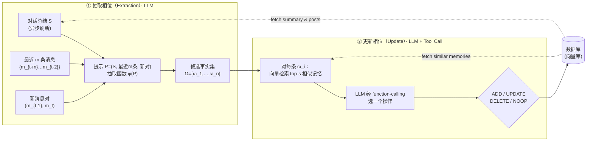

# Mem0：给生产级 AI Agent 造一层可扩展的长期记忆

> **本篇属 agent-harness 库 D 组（记忆），打的是 harness 的 C（Context / 上下文）层。**
> 报告完全沿用 v1 硬规范（公式前给直觉、符号先定义、指标给定义式、数字标 §/Table/Eq 出处、区分宣称 vs 批判）、
> v2 增量（Why 三连 + 强制 `## ★ 对我们的启发`）、以及 harness 库的 Θ1–Θ5（E/T/C/L/O/V 分层、回扣 `Agent = Model + Harness`、
> Inspires-Us 打到我们自己 harness、canon/前沿坐标、regime 诚实）。密度对齐标杆
> [Harness-Bench（2605.27922）](2605.27922-harness-bench-measuring-harness-effects.md)。

---

## §1　TL;DR（一页讲清这篇在干嘛）

> 主讲提示：开场先把全库中心命题（Agent = Model + Harness）落到"上下文层"——记忆就是 harness 帮模型**记住昨天**的那层软件。再抛出这篇的核心取舍：**结构化事实 vs 整段历史**。

一句话：LLM 有强推理，但**上下文窗口是固定的**——对话一长，早期信息就"掉出窗口"、被模型当作从没发生过（§1 原文把这称作 LLM 会 "reset"）。Mem0 的答案不是"把窗口撑更大"，而是给 agent 外挂一层**记忆写入流水线**：从每一轮新对话里**抽取（extract）**要点事实 → 拿它和已有记忆比对、**消解冲突（consolidate）**（该加就加、该改就改、该删就删）→ 存进库；回答时只**召回（retrieve）**与当前问题相关的少量事实喂给模型。它还给了一个图变体 **Mem0^g**，把记忆存成"实体-关系-实体"的有向标注图，让跨实体的多跳推理更顺。

- **属于 harness 的哪一层（Θ1）**：**C（Context / 上下文）层**。它不改模型、不加新工具类别，而是重构"喂给模型的上下文从哪来"——把"贴整段历史"换成"贴抽出来的结构化事实"。对 **L（控制循环）** 有依赖：抽取/巩固发生在每一轮交互的间隙（增量处理，§2.1）。
- **回扣全库论点（Θ2）**：这是 `Agent = Model + Harness` 在**上下文层**的一个直接注脚——**模型不变（全程 GPT-4o-mini），只换"记忆 harness"，LOCOMO 上的 LLM-as-a-Judge 分从 OpenAI 记忆的 52.90 一路摆到 Mem0^g 的 68.44**（Table 2）。同一底座模型，换一层记忆管理，端到端质量差 15 分以上。
- **核心取舍一句话**：相比"全上下文"基线（J=72.90，但 p95 总延迟 17.117 秒、每问吃 ~26k token），Mem0 的 J=66.88 只低约 6 分，却把 p95 总延迟压到 1.440 秒（约 −91.6%）、记忆只占 ~7k token（§4.3–4.5、Table 2）。这就是"生产级"三个字的含义：**用可接受的一点点准确率，换回工程上必需的延迟与成本**。
- **够新够什么来头（Θ4 / 权威性）**：2025-04 预印本，出自 **Mem0.ai**——一个把该记忆层做成开源库 + 托管服务的公司（代码见 https://mem0.ai/research）。它的权威性不来自顶会光环，而来自**生产落地导向**：全篇的评价轴是"延迟 / token / 构建时间"这些部署指标，而非只看准确率。

> **读出什么**：这篇不是"再造一个更聪明的 agent"，而是"给 agent 的记忆这件事，做一个**能上线**的工程答案"。它最该被记住的不是某个 SOTA 数字，而是那条取舍曲线——**把整段历史塞上下文是最准的，但也是最贵最慢的；抽成结构化事实，准确率掉一点点，成本却降一个数量级**。

---

## §2　问题与动机：为什么"记忆"要单独做一层，而不是把窗口撑大

> 主讲提示：这一页用 Why 三连的"问题层"。先讲清"固定上下文窗口"这个根病，再说清"撑大窗口"为什么只是止痛、不是治病。

**Why（问题层）——不解决会卡住什么？**
人类记忆是"智能的地基"（§1 引 Craik & Jennings 1992）：我们记住过去的交互、推断偏好、维护对对方演化中的心智模型。但 LLM 驱动的 agent"从根上受限于固定上下文窗口"（§1 原文 "fundamentally limited by their reliance on fixed context windows"）——信息一旦掉出窗口，系统就**无法天然地跨会话或在上下文溢出后保留信息**。后果很具体（§1 + Figure 1 的例子）：

- 用户第一次说"我吃素、不吃奶制品"；隔天新开一个会话问"今晚吃什么"，**没有记忆的系统会推荐 Chicken Alfredo**——直接违背已确立的饮食约束（Figure 1 左）。
- 有记忆的系统则记住这条约束，推荐"素食、无奶"的方案（Figure 1 右）。
- 一句总结（§1）：**记忆失效会从根本上侵蚀用户体验与信任**（"memory failures can fundamentally undermine user experience and trust"）。

**Why（设计层）——那"把窗口撑大"不就行了？为什么不是显而易见的解法？**

> **Why（设计层）**：朴素做法是"用超长上下文模型，把整段历史一股脑塞进去"（GPT-4 128K、o1 200K、Claude 3.7 Sonnet 200K、Gemini 至少 10M——§1 逐一点名）。→ 会因为**两个现实原因**失败（§1 原文给了这两条）：
> 1. **关系是按周/月长出来的**：有意义的人-AI 关系随时间累积，对话史"必然超过再慷慨的上下文上限"（"inevitably exceeds even the most generous context limits"）。撑大窗口只是**推迟**而非**解决**（"merely delay rather than solve"）。
> 2. **真实对话很少主题连续**：用户可能先说饮食偏好，然后聊几小时不相关的编程，再回来问吃饭——全上下文方法就得在"成千上万 token 的编程讨论"里去捞那条关键的饮食约束（"buried among thousands of tokens"）。而且，**光把上下文变长并不保证有效检索/利用**：注意力机制在远距离 token 上会退化（§1 引 Guo et al. 2024 的 "active-dormant attention"）。

所以正确的方向不是"更大的窗口"，而是一层**会挑重点、会巩固、会按需召回**的记忆——它"选择性地存重要信息、把相关概念巩固、需要时取回相关细节"，去**镜像人类的认知过程**（§1 原文 "mirroring human cognitive processes"）。

> **读出什么**：这一节把整篇的 intention 钉死了——**上下文窗口是一个"容量"问题，但真正的病是"相关性 + 持久性"问题**。撑大容量解决不了"如何在海量历史里只留下并取回该留的那几条"。这正是记忆层作为独立组件存在的理由：它是 harness 里专门负责"跨时间保住相关信息"的那块。

---

## §3　研究问题与两条技术路线（论文 §2 开篇）

把问题形式化成一句话：**给定一个持续进行的多会话对话流，如何在不把整段历史塞进上下文的前提下，维护一份"精炼、结构化、可扩展"的长期记忆，使 agent 能在任意后续时刻准确召回相关事实、且延迟与 token 成本可控？**

论文给了两条并列的架构（§2）：

1. **Mem0（基础版）**：一套**增量处理**范式，用两个专门模块——**记忆抽取（extraction）** 与 **记忆更新（update）**——从对话里抽出、评估、管理要点信息。处理单位是"一对消息"（两个用户之间，或用户与助手之间）。记忆以**自然语言事实**存储。
2. **Mem0^g（图变体）**：在基础版之上，把记忆表示成**基于图的结构**——实体作**节点**、关系作**有向标注边**。它显式建模"实体 + 实体间关系"，因此更擅长**需要在多条记忆间穿越复杂关系路径**的查询（如多跳、时序）。

> **读出什么**：两条路线不是二选一，而是**同一记忆层的两种"表示精度"**——基础版用扁平的自然语言事实（省、快），图版用结构化三元组（对关系型/时序型查询更准，但更重）。全篇的实验最终会告诉你：**表示越结构化，不是"总是更好"，而是"在特定查询类型上更好"**（见 §9）。这是本篇最反直觉、也最诚实的一条主线。

---

## §4　方法一 · Mem0 基础版：抽取 → 更新 两相流水线

> 主讲提示：这是全篇最该讲透的地方（对应硬性要求"把抽取→冲突消解→巩固写透"）。先给一图流的直觉，再拆两个相位，每个相位先讲 why 再讲 how。

**一图流（Figure 2 的结构，重画为 mermaid）**：



### §4.1　抽取相位（Extraction）：从"两条消息 + 双重上下文"里抽要点

**直觉**：要从一轮新对话里抽"值得记住的事实"，光看这一轮不够——你需要知道"整段对话大致在聊什么（全局主题）"和"刚刚几句在说什么（近处细节）"，才能判断哪句话是要点。所以 Mem0 给抽取喂**两路互补的上下文**。

**触发时机（§2.1）**：抽取在一个**新消息对** $(m_{t-1}, m_t)$ 进来时启动——$m_t$ 是当前消息、$m_{t-1}$ 是上一条，通常是"一条用户消息 + 一条助手回复"，构成一个完整的交互单元。

**两路上下文（§2.1，先定义符号再看它怎么组合）**：
- $S$：一份**对话总结（conversation summary）**，从数据库取，浓缩了整段对话史的语义内容。它由一个**异步的总结生成模块**周期性刷新——**独立于主流水线运行**，这样抽取总能用上"最新的上下文"，又**不给主流程引入处理延迟**（§2.1 明确点出这条工程设计）。
- $\{m_{t-m}, m_{t-m+1}, \dots, m_{t-2}\}$：对话史里**最近 $m$ 条消息**，$m$ 是控制"回看多近"的**近因窗口（recency window）**超参。它提供总结里可能没浓缩进去的**细粒度时序细节**。

**抽取函数（§2.1）**：把上面两路 + 新消息对拼成一个综合提示

$$P = \big(S,\ \{m_{t-m}, \dots, m_{t-2}\},\ m_{t-1},\ m_t\big)$$

再由一个 LLM 实现的抽取函数 $\phi$ 作用其上，产出候选事实集合

$$\phi(P) \;=\; \Omega \;=\; \{\omega_1, \omega_2, \dots, \omega_n\}$$

符号（先定义后用）：$P$ = 抽取提示；$\phi$ = LLM 抽取函数；$\Omega$ = 从**这次新交换**里抽出的一组**要点记忆（salient memories）**候选，$\omega_i$ 是其中第 $i$ 条候选事实；$n$ = 本轮抽出的候选条数（不定）。

> **Why（设计层）——为什么要"全局总结 + 近处消息"双路，而不是只喂其一？**
> 朴素做法 A：只喂"整段总结 $S$"。→ 会**丢近处细节**——总结是压缩的，可能没把"刚刚这两句里的新事实"消化进去。
> 朴素做法 B：只喂"最近几条消息"。→ 会**丢全局主题**——不知道这段对话整体在聊什么，抽出来的事实可能脱离语境、判不准要点。
> Mem0 两路都要（§2.1 原文：$S$ 给"全局主题理解"，近处消息给"granular temporal context"），因此 $\phi(P)$ 抽出的事实是"**在意识到更广语境的前提下、专门针对新交换**"的候选。代价：提示更长、多一个异步总结模块要维护。

> **读出什么**：抽取相位的产物 $\Omega$ **只是候选**——它还没进库。要不要进、以什么形式进，全交给下一相位判定。这个"抽取与写入分离"的设计，是后面能做冲突消解的前提。

### §4.2　更新相位（Update）：把候选事实和已有记忆做"冲突消解与巩固"

**直觉**：抽出的每条新事实，可能是**全新的**（该存）、可能是**已有事实的补充**（该改）、可能**和已有事实矛盾**（该删旧的）、也可能**根本是重复**（啥也别干）。谁来判？——**不另训一个分类器，而是直接让 LLM 用它的推理能力判**。

**流程（§2.1，逐步）**：对每条候选事实 $\omega_i \in \Omega$——
1. **取相似记忆**：用向量嵌入从数据库检索 **top-$s$** 条语义最相似的已有记忆（$s$ 是超参）。
2. **交给 LLM 判操作**：把"这条候选事实 + 那 $s$ 条相似记忆"通过一个 **function-calling 接口（论文称之为 'tool call'）** 一起喂给 LLM，让**LLM 自己**从四种操作里选一个：

| 操作 | 触发条件（语义关系） | 效果 |
|---|---|---|
| **ADD** | 库里**没有**语义等价的记忆 | 新建一条记忆 |
| **UPDATE** | 已有记忆可被**补充/增强** | 用互补信息扩充已有记忆 |
| **DELETE** | 新信息**否定/矛盾**了某条已有记忆 | 删除被矛盾的旧记忆 |
| **NOOP** | 候选事实**无需改动**知识库（已存在或不相关） | 什么都不做 |

3. **执行操作**：LLM 定完操作后，系统**执行**它，从而"维护知识库的一致性与时序一致性"（§2.1 原文 "maintaining knowledge base coherence and temporal consistency"）。

**形式化（Appendix B / Algorithm 1）**——论文把这套"冲突消解"写成了伪代码：

```
Algorithm 1  Memory Management System: Update Operations
输入: 检索到的事实集合 F；已有记忆库 M = {m_1,…,m_n}
输出: 更新后的记忆库 M'

procedure UpdateMemory(F, M):
  for each fact f ∈ F:
    operation ← ClassifyOperation(f, M)      # 由 LLM 判定
    if operation = ADD:    id ← 生成唯一ID;  M ← M ∪ {(id, f, "ADD")}
    else if operation = UPDATE:
        m_i ← FindRelatedMemory(f, M)
        if InformationContent(f) > InformationContent(m_i):   # 只在更"信息量大"时才替换
            M ← (M \ {m_i}) ∪ {(id_i, f, "UPDATE")}
    else if operation = DELETE:
        m_i ← FindContradictedMemory(f, M);  M ← M \ {m_i}
    else if operation = NOOP:  不做操作
  return M

function ClassifyOperation(f, M):
  if ¬SemanticallySimilar(f, M):  return ADD      # 新信息，库里没有
  else if Contradicts(f, M):       return DELETE   # 与已有冲突
  else if Augments(f, M):          return UPDATE   # 增强已有
  else:                            return NOOP     # 无需改动
```

> **读出什么（Algorithm 1 的两个关键细节）**：
> 1. **UPDATE 有个"信息量闸门"**：第 11 行 `if InformationContent(f) > InformationContent(m_i)`——**只有当新事实比旧记忆信息量更大时，才用它替换**。这防止"用一条更空洞的表述覆盖掉更具体的旧记忆"。
> 2. **DELETE 是"逻辑删"服务于时序推理**：正文 §2.1 补了一句——update resolver 把过时关系**标记为无效（invalid），而不是物理删除**（"marking them as invalid rather than physically removing them to enable temporal reasoning"）。即：旧事实不真删，只是打上"已失效"的时间戳，这样"某时刻之前 X 成立、之后不成立"这类时序问题还能答。

> **Why（设计层）——为什么用 LLM 判操作，而不是单独训一个分类器？**
> 朴素做法是"训一个四分类器（ADD/UPDATE/DELETE/NOOP）"。→ 需要标注数据、泛化差、对"矛盾/增强"这种需要**语义推理**的判定很吃力。Mem0 改用 LLM 直接判（§2.1 原文 "we leverage the LLM's reasoning capabilities to directly select the appropriate operation"）——因为判"这条新事实和那条旧记忆是矛盾还是补充"**本质是一个语义推理任务**，正是 LLM 的强项。代价：每条候选事实都要过一次 LLM 调用（延迟/成本的来源），但可以靠"只对 top-$s$ 相似记忆比对"把范围收窄。

> **这一节读完，"抽取→冲突消解→巩固"的完整回路就闭合了**：抽取相位产出候选事实（不入库）→ 更新相位对每条候选取 top-$s$ 相似记忆、让 LLM 判 ADD/UPDATE/DELETE/NOOP → 执行操作、维护一致性。**这就是"记忆写入流程"的全貌。**

---

## §5　方法二 · Mem0^g 图变体：把记忆存成"实体-关系"图

> 主讲提示：这页讲图版。核心是"同一套抽取→更新回路，但表示从'自然语言事实'换成'有向标注图'"。先给图的定义，再讲两个专门模块。

**图的定义（§2.2，先把符号定清）**：记忆表示为一个**有向标注图** $G = (V, E, L)$——
- $V$：**节点**，表示实体（如 `ALICE`、`SAN_FRANCISCO`）；
- $E$：**边**，表示实体间关系（如 `LIVES_IN`）；
- $L$：**标签**，给节点赋语义类型（如 `ALICE - Person`、`SAN_FRANCISCO - City`）。

每个实体节点 $v \in V$ 带三样东西（§2.2）：(1) 实体类型分类（Person / Location / Event…）；(2) 一个**嵌入向量 $e_v$**（捕捉语义）；(3) 元数据，含**创建时间戳 $t_v$**。关系存成**三元组** $(v_s, r, v_d)$——$v_s$ 源节点、$v_d$ 目标节点、$r$ 是连接二者的带标签的边。

**抽取：两阶段流水线（§2.2）**——
1. **实体抽取器（entity extractor）**：从输入文本识别一组实体及其类型（人、地点、物体、概念、事件、属性等）。举例：一段旅行对话里，实体可能是目的地（城市/国家）、交通方式、日期、活动、参与者偏好。
2. **关系生成器（relationship generator）**：在抽出的实体两两之间，判断"是否存在有意义的关系"，若有则给它分类打标签（如 `lives_in`、`prefers`、`owns`、`happened_on`）。它靠"检查语言模式、上下文线索、领域知识"来判定，产出的三元组构成图的边。

**更新：冲突检测 + 更新消解（§2.2，图版对应基础版的 update 相位）**——
- 新三元组进来时，先给源、目标实体各算嵌入，检索"语义相似度超过阈值 $t$ 的已有节点"；据此决定是"两个节点都新建 / 只建一个 / 复用已有节点"，再带元数据建立关系。
- **冲突检测（conflict detection）**：识别新信息可能与哪些已有关系冲突。
- **更新消解器（update resolver）**：一个 LLM 模块，判断某些关系是否该"作废"——**标记为 invalid 而非物理删除**（和基础版同一逻辑，服务时序推理）。

**检索：双路策略（§2.2）**——
- **实体中心法（entity-centric）**：先从 query 里找关键实体 → 用语义相似度定位图中对应节点 → 系统性地遍历这些锚点的**入边和出边**，构造一个"相关上下文子图"。擅长**定向的、以实体为中心**的问题。
- **语义三元组法（semantic triplet）**：把整个 query 编码成一个 dense 向量 → 和图中**每条关系三元组的文本编码**逐一算细粒度相似度 → 只返回超过可配置相关性阈值的、按相似度降序排列的三元组。擅长**更宽泛的概念型**查询。

> **Why（设计层）——图版凭什么在"关系/多跳"上更强？**
> 朴素做法（基础版）把事实存成扁平的自然语言字符串。→ 要回答"A 认识 B，B 住在 C，那 A 的朋友住哪"这类**跨多条记忆的关系路径**问题时，扁平事实要靠 LLM 在检索到的一堆句子里"隐式地拼关系"，容易断链。图版把关系**显式建成边**（§2 原文 "supports more advanced reasoning across interconnected facts, especially for queries that require navigating complex relational paths"），多跳时可以**顺着边走**。代价：抽取要多跑"实体抽取 + 关系生成"两阶段、存储要维护图、token 占用翻倍（§4.5 会看到 7k → 14k）。

> **读出什么（埋一条批判线）**：图版**理论上**该在所有关系型查询上赢，但 §9 的实测会打脸——它只在**时序/开放域**上真赢，在**多跳**上反而没占到便宜（甚至可能因图导航的开销/冗余而略降）。记住这个反差，它是本篇最值得组会争论的点。

**图版的实现细节（§2.2 末）**：图数据库用 **Neo4j**；实体抽取与更新模块用 **GPT-4o-mini** 配 function-calling。

---

## §6　符号与术语表（一页速查）

| 记号 / 术语 | 含义 | 出处 |
|---|---|---|
| $(m_{t-1}, m_t)$ | 新消息对（上一条 + 当前），抽取的触发单元 | §2.1 |
| $S$ | 对话总结（异步刷新，喂给抽取的全局上下文） | §2.1 |
| $m$ | 近因窗口大小（回看最近多少条消息）；实验取 **10** | §2.1 |
| $\phi,\ P,\ \Omega=\{\omega_i\}$ | LLM 抽取函数 / 抽取提示 / 候选事实集 | §2.1 |
| $s$ | 更新相位为每条候选事实检索的相似记忆条数；实验取 **10** | §2.1 |
| ADD/UPDATE/DELETE/NOOP | 四种记忆管理操作（由 LLM 经 tool call 判定） | §2.1 / Alg.1 |
| $G=(V,E,L)$ | Mem0^g 的有向标注记忆图（节点/边/标签） | §2.2 |
| $(v_s, r, v_d)$ | 关系三元组（源实体、关系、目标实体） | §2.2 |
| $e_v,\ t_v,\ t$ | 节点嵌入 / 节点创建时间戳 / 建图时的相似度阈值 | §2.2 |
| $F_1$ / $B_1$ / $J$ | F1 分 / BLEU-1 分 / LLM-as-a-Judge 分（评价指标） | §3.2 |
| p50 / p95 | 延迟的中位数 / 95 分位 | Table 2 |
| LOCOMO | 长期对话记忆基准（10 段长对话、多会话） | §3.1 |
| GPT-4o-mini | 全系统统一的 LLM 推理引擎 | §2.1 |

---

## §7　实验设置：数据集、指标定义式、baseline、超参

> 主讲提示：这页把 setting/metrics/params 一次讲全，重点是**指标的定义式**（尤其为什么要引入 LLM-as-a-Judge）。

### §7.1　数据集：LOCOMO（§3.1）

- **来源**：LOCOMO（Maharana et al., 2024），为评"长期对话记忆"而设计。
- **规模**：**10 段**扩展对话；每段约 **600 轮对话（dialogues）**、平均 **~26000 token**，分布在多个会话里。
- **任务**：每段对话平均配 **~200 个问题**及标准答案；问题分四类——**single-hop（单跳）/ multi-hop（多跳）/ temporal（时序）/ open-domain（开放域）**。
- **一处诚实说明**：原数据集还有一类 **adversarial（对抗，测"该识别为不可答"的能力）**——本文**排除**了它，因为"标准答案不可得，且这类问题的期望行为是 agent 应识别其不可答"（§3.1 末）。

### §7.2　评价指标（§3.2）——两组：质量 + 部署

**(1) 质量指标**。传统做 **F1（$F_1$）** 与 **BLEU-1（$B_1$）**（词汇重叠类）。但论文点出它们的**致命缺陷**（§3.2 原文举例）：标准答案是"Alice was born in **March**"，系统答"Alice is born in **July**"——**月份完全错了，但因为 'Alice''born' 等词重叠，F1/BLEU 仍给高分**。词汇相似度**度量不了语义正确性**。

> 于是引入 **LLM-as-a-Judge（$J$）** 作补充。直觉：请一个更强的 LLM 当裁判，看"问题 + 标准答案 + 生成答案"，从**事实准确、相关性、完整性、语境恰当性**多维度判对错，"比人类判断对得更齐"（§3.2）。
>
> **$J$ 的定义（§3.2 + Appendix A 的裁判 prompt）**：裁判读〔question, gold answer, generated answer〕，输出 **CORRECT / WRONG** 的标签（JSON，key 为 `label`）。prompt 里明确要求裁判**宽松**：只要生成答案"touch on the same topic as the gold answer"就算 CORRECT；时间类问题只要"指向同一日期/时段"，即使格式不同（"May 7th" vs "7 May"）也算 CORRECT。$J$ 即在整个数据集上的 CORRECT 比例（百分数）。
>
> **随机性控制**：因 $J$ 有随机性，每个方法在整个数据集上**独立跑 10 次**，报**均值 ± 1 个标准差**（§3.2）。

**(2) 部署指标（§3.2）**——这是本篇区别于"只看准确率"论文的地方：
- **Token Consumption（token 消耗）**：用 `tiktoken` 的 `cl100k_base` 编码，数"检索时作为回答上下文的 token 数"。对记忆类系统 = 从库里取的记忆 token；对 RAG = 取的文本块 token。
- **Latency（延迟）**：分两个——
  - **search latency（检索延迟）**：搜记忆（记忆类）或搜块（RAG 类）所花的时间；
  - **total latency（总延迟）**：生成回答的总时间 = 检索时间 + LLM 生成答案时间。
  - 均报 **p50（中位）与 p95（尾部）**。

> **读出什么**：这套指标本身就是一份"记忆系统体检表"——**质量看 J（不是 F1），成本看 token，速度看 p50/p95**。三者天然冲突（更复杂的记忆→更准，但更贵更慢，§3.2 末点明这个 trade-off）。全篇的贡献，正是在这三维空间里找一个"生产可用"的点。

### §7.3　六类 baseline（§3.3）

| 类别 | 代表系统 | 一句话定位 |
|---|---|---|
| ① 已有记忆增强系统 | LoCoMo、ReadAgent、MemoryBank、MemGPT、A-Mem | LOCOMO 上已被基准化的记忆架构 |
| ② 开源记忆方案 | **LangMem**（Hot Path） | 之前未在 LOCOMO 上测过，本文适配后纳入 |
| ③ RAG（多配置） | text-embedding-3-small + 定长分块 | 块大小 ∈ {128…8192}，$k \in \{1,2\}$ |
| ④ 全上下文 | Full-Context | 把整段对话史（~26k token）直接塞进窗口 |
| ⑤ 专有模型记忆 | **OpenAI**（ChatGPT memory 功能） | 用 gpt-4o-mini，喂整段对话让它抽记忆 |
| ⑥ 记忆管理平台 | **Zep**（商业平台，Rasmussen et al. 2025） | 保留时间戳的时序知识图，专为 agent 记忆做的商业实现 |

- **RAG 细节（§3.3）**：块大小 128/256/512/1024/2048/4096/8192（8192 是 embedding 上限）；$k=1$ 只用最相关的一块，$k=2$ 拼两块（最多 16384 token）；**故意不设 $k>2$**——因为平均对话 26000 token，$k>2$ 会几乎全覆盖、抹掉"选择性检索"的意义。
- **统一控制**：除非另说，**温度设 0** 以尽量可复现（§3.3）。
- **给 OpenAI 的"特权"**：OpenAI baseline 被**授予了所有记忆的访问权**（而非只给问题相关的），以适配其无外部 API 做选择性检索的现实（§3.3 末）——这其实是**给了它一个偏优的设置**，后面它仍然分不高，反衬记忆质量的重要。

### §7.4　关键超参与实现（§2.1 末）

- **$m = 10$**（近因窗口）、**$s = 10$**（更新相位检索的相似记忆数）。
- **LLM 引擎**：全系统统一 **GPT-4o-mini**（含抽取、更新、图版的实体/关系抽取）。
- **向量库**：dense embeddings 做相似检索；图库用 **Neo4j**。

> **读出什么（Θ2 的实验前提）**：注意**底座模型全程钉死在 GPT-4o-mini**。所以后面所有 baseline 的分差，**不来自"谁用了更强的模型"，而来自"谁的记忆 harness 更会挑/存/取"**——这正是把"记忆"当作可控变量的干净实验设计。

---

## §8　主结果一 · 按问题类型看质量（Table 1）

> 主讲提示：这是"质量维度"的核心表。先报 Mem0 / Mem0^g 各在哪类问题赢，再点出"图版不是全能赢"的反差。

**Table 1（LOCOMO，按问题类型，$F_1$ / $B_1$ / $J$，↑ 越高越好）关键行节选**：

| 方法 | 单跳 $J$ | 多跳 $J$ | 开放域 $J$ | 时序 $J$ |
|---|---:|---:|---:|---:|
| OpenAI（全记忆） | 63.79±0.46 | 42.92±0.63 | 62.29±0.12 | 21.71±0.20 |
| LangMem | 62.23±0.75 | 47.92±0.47 | 71.12±0.20 | 23.43±0.39 |
| Zep | 61.70±0.32 | 41.35±0.48 | **76.60±0.13** | 49.31±0.50 |
| **Mem0** | **67.13±0.65** | **51.15±0.31** | 72.93±0.11 | 55.51±0.34 |
| **Mem0^g** | 65.71±0.45 | 47.19±0.67 | 75.71±0.21 | **58.13±0.44** |

（$F_1$/$B_1$ 列见原文 Table 1；上表聚焦最能反映语义正确性的 $J$。）

- **单跳（§4.1）**：**Mem0 最强**（$F_1$=38.72、$B_1$=27.13、$J$=67.13）。图版在这里**没占到便宜**——单跳答案就在一轮对话里，关系结构"用处有限"（§4.1 原文 "relational structure provides limited utility when the retrieval target occupies a single turn"）。而且，很多老 baseline（如 A-Mem）在 $J$ 上**落后 25 分以上**，说明"哪怕是简单检索，也需要细粒度、结构化的记忆索引"。
- **多跳（§4.1）**：**Mem0 明显领先**（$F_1$=28.64、$J$=51.15）。反直觉的是：**图版 Mem0^g 在多跳上反而没帮上忙**（$J$=47.19 < 51.15），论文归因于"结构化图表示在复杂整合任务上可能有**低效或冗余**，不如稠密的自然语言记忆"（§4.1 原文 "potential inefficiencies or redundancies in structured graph representations"）。
- **开放域（§4.1）**：**Zep 险胜**（$F_1$=49.56、$J$=76.60），比 Mem0^g 的 75.71 高 0.89 分、比 Mem0 的 72.93 高 3.67 分。Mem0^g 是强力次席。作者诚实承认"Zep 保持一个小但有意义的领先"。
- **时序（§4.1）**：**Mem0^g 全面最强**（$F_1$=51.55、$J$=58.13）——结构化关系图在"事件排序、时序落地"上确实有用。基础版 Mem0 也有不错的 55.51。**OpenAI 在时序上惨败**（$J$<15），因为它生成的记忆**大多缺时间戳**（尽管 prompt 里明确要求带时间戳）。

> **Why（结果层）——为什么"图版不是全能赢"？**
> 机制上：图的价值在于**显式的关系路径**。当查询的成功**依赖穿越多个实体的关系**（时序里的"事件先后"、开放域里的"跨实体关联"），显式边就帮上忙（时序 +2.6 分、开放域逼近 Zep）。但当查询是**单跳**（答案就在一处，不需要关系）或**多跳但可靠稠密语义拼合**（自然语言事实的表示已足够丰富），图的额外结构就成了**开销与冗余**，反而拖累（§4.2 原文对多跳的解读）。**结论：表示的结构化程度要匹配查询类型，"更结构化"不等于"更好"。**

> **读出什么（宣称 vs 事实）**：摘要说"Mem0^g 比 Mem0 总体高约 2%"（overall J：68.44 vs 66.88，≈ +2.3%，见 Table 2）——这是**总体平均**的宣称。但拆开看（Table 1），这 2% 几乎**全来自时序 + 开放域**，在单跳/多跳上图版是**输的**。汇报时必须把"总体 +2%"和"分项互有胜负"分开讲，否则会误导。

---

## §9　主结果二 · 部署维度：延迟与 token（Table 2）

> 主讲提示：这是全篇最有"生产味"、也最该停留的表。质量看 §8，成本/速度看这里。核心叙事：**Mem0 在延迟上碾压所有人，质量只离全上下文一点点。**

**Table 2（LOCOMO 全集，延迟单位=秒，Overall $J$）关键行节选**：

| 方法 | 配置 | 记忆/块 token | 检索 p50 | 检索 p95 | 总 p50 | 总 p95 | Overall $J$ |
|---|---|---:|---:|---:|---:|---:|---:|
| A-Mem | — | 2520 | 0.668 | 1.485 | 1.410 | 4.374 | 48.38±0.15% |
| LangMem | — | 127 | 17.99 | 59.82 | 18.53 | 60.40 | 58.10±0.21% |
| Zep | — | 3911 | 0.513 | 0.778 | 1.292 | 2.926 | 65.99±0.16% |
| OpenAI | — | 4437 | — | — | 0.466 | 0.889 | 52.90±0.14% |
| **Full-context** | — | **26031** | — | — | 9.870 | **17.117** | **72.90±0.19%** |
| **Mem0** | — | **1764** | **0.148** | **0.200** | **0.708** | **1.440** | 66.88±0.15% |
| **Mem0^g** | — | 3616 | 0.476 | 0.657 | 1.091 | 2.590 | 68.44±0.17% |
| RAG（best，k=2, 512） | — | 512 | 0.247 | 0.746 | 0.829 | 1.729 | 58.19±0.18% |

（RAG 全 14 行见原文 Table 2；其"最佳" overall J 约 60.97%（k=2, 256），仍显著低于 Mem0。）

**逐条读出（对应 §4.3–4.5）**：

- **质量对比（§4.3）**：Mem0 的 J=66.88 > 最强 RAG 的 ~61%（相对 +~10%）；Mem0^g 的 J>68%（相对 +~12%）。全上下文最高（~73%），但**Mem0 只落后它约 6 分**。机制：Mem0 把对话史转成"精炼结构化表示"，**过滤了噪声、给 LLM 更精准的线索**，所以质量能逼近全上下文（§4.3 原文 "mitigate noise and surface more precise cues"）。
- **延迟对比（§4.4，全篇最亮的数字）**：
  - **Mem0 检索延迟最低**：p50 **0.148s**、p95 **0.200s**——**全场最低**。总延迟 p50 0.708s、p95 **1.440s**。
  - **全上下文极慢**：总 p95 **17.117s**（每次都要读整段 26k token）。**Mem0 相对全上下文，p95 总延迟降约 91.6%**（1.440 vs 17.117；摘要口径"91% lower p95 latency"）。
  - **LangMem 不可用于交互**：检索 p95 高达 **59.82s**（§4.4 原文 "impractical for interactive applications"）。
  - **Mem0^g 略慢于基础版**（检索 p50 0.476s、总 p95 2.590s），是"图的关系建模能力"换来的适中代价，但仍**远快于全上下文**。
- **token / 构建时间（§4.5）**：
  - **Mem0 ~7k token/对话**（自然语言编码整段对话轮次）；**Mem0^g ~14k**（图的节点+边，约翻倍）。
  - **对照**：原始整段对话 **~26k token**；**Zep 的记忆图竟 >600k token**——因为 Zep 在每个节点缓存"完整的抽象总结"、还把事实存到连接边上，导致**跨图大量冗余**（§4.5 原文 "in excess of 600k tokens … extensive redundancy"）。Mem0 比 Zep 省 **~20 倍**以上 token。
  - **构建/可用性**：Zep 加记忆后"立即检索常常答不对，隔几小时再搜才明显变好"——说明其**建图靠大量异步 LLM 调用+后台处理，不适合实时**；反观 **Mem0 建图最坏也 1 分钟内完成**，新记忆**可即刻用于回答**（§4.5）。

> **Why（结果层）——为什么 Mem0 能"质量近全上下文、延迟碾压全上下文"？**
> 关键在**输入长度**。全上下文每问都要让 LLM 读 ~26k token，随对话变长**延迟/成本指数级涨**（§4.3 原文 "exponential growth"）；Mem0 只喂 ~1764 token 的相关记忆（Table 2 的 memory tokens 列），输入短→检索快、生成快、便宜。而质量之所以只掉一点点：抽取+巩固已经把"该记的事实"沉淀下来了，噪声被滤掉，**短而精的上下文对回答质量的损失很小**。这就是"结构化事实 vs 整段历史"取舍的量化答案。

> **读出什么（Θ2 实锤）**：把 Table 2 的 Overall J 列竖着读——**模型全是 GPT-4o-mini，只有"记忆 harness"在变**：OpenAI 52.90 → A-Mem 48.38 → LangMem 58.10 → Zep 65.99 → Mem0 66.88 → Mem0^g 68.44。**同一底座，换一层记忆管理，端到端质量摆动约 20 分**。这就是 `Agent = Model + Harness` 在**上下文层**的直接证据——只不过这里"换的不是脚手架，而是记忆策略"。

---

## §10　摘要里的核心宣称 vs 表格实据（一张对照表）

> 主讲提示：这页专门做"宣称 vs 实据"对齐，是判断力的体现——把摘要的漂亮话逐条落到 Table。

| 摘要宣称 | 精确出处与实据 | 诚实解读 |
|---|---|---|
| "比 OpenAI 相对提升 **26%**（J）" | Mem0 J≈66.88 vs OpenAI 52.90 → 相对 +26.4%（Table 2） | 属实。但 OpenAI 那 52.90 是"给了全记忆特权"下取得的，仍偏低 |
| "Mem0^g 比 Mem0 总体高 **~2%**" | 68.44 vs 66.88（Table 2） → +2.3% | 属实但**误导**：拆开看图版只在时序/开放域赢，单跳/多跳输（Table 1） |
| "p95 延迟低 **91%**（vs 全上下文）" | Mem0 总 p95 1.440 vs Full-context 17.117 → −91.6%（Table 2） | 属实，且是全篇最硬的卖点 |
| ">**90%** token 节省（vs 全上下文）" | 记忆 ~7k / 原始 ~26k 或按检索 token 1764 vs 26031 → 约 −93%（§4.5 / Table 2） | 属实 |
| "在四类问题上**一致超越所有已有方法**" | Table 1 | **不完全属实**：开放域上 **Zep 险胜**（76.60 vs 75.71/72.93）；这是原文自己在 §4.1 承认的 |

> **读出什么**：摘要写"consistently outperform all existing memory systems"，但正文 §4.1 自己承认"Zep 在开放域保持小幅领先"。这不是造假，而是**摘要的口径比正文乐观**——组会汇报时应以正文 + Table 为准。这也是本库"区分宣称 vs 批判"训练的一个现成案例。

---

## §11　局限与批判（原文承认的 + 我的补充）

**原文承认/隐含的局限**：
- **图版的延迟开销未根除**：§5 明说未来工作要"优化图操作以降低 Mem0^g 的延迟"——即当前图版的适中延迟仍是个已知痛点。
- **图版不是全能**：多跳上图反而不如基础版（§4.1 自陈"低效/冗余"），说明"更结构化"未必更好，边界没被完全刻画。
- **只在 LOCOMO 单一基准**：全部结论建立在**一个**数据集（10 段对话）上；§5 未来工作提到要扩到"程序推理、多模态"等**对话之外**的域——暗示当前外推性未验证。
- **裁判是 LLM**：$J$ 由 LLM-as-a-Judge 给出，且 prompt 明确要求裁判"宽松"（topic 沾边即算对）——这会**系统性抬高所有方法的分**，也把"谁对"的判定权交给了另一个模型。

**我的补充批判**：
- **"谁来 judge the judge"**：所有方法都用同一个 LLM 裁判且要求"宽松打分"，对**时序/事实精确度**要求高的场景可能**掩盖真实错误**（"March vs July"若都 topic 沾边可能都算 CORRECT？prompt 对时间类要求"同一日期"，但对事实类只要"same topic"）。这和标杆 Harness-Bench 用固定 LLM 评委的隐忧同源。
- **抽取/巩固本身的错误率没被单独测**：全篇报的是"端到端问答质量"，但"抽取漏了关键事实 / 冲突消解误删了对的记忆"这类**记忆层内部错误**没有独立的召回率/精确率指标。Algorithm 1 的 `InformationContent(·)` 怎么算、DELETE 误删率多少，**原文未给出**。
- **超参 $m=10, s=10, t$（图阈值）** 的敏感性**没做消融**——这几个数直接决定"回看多远/比对多少/建不建新节点"，但论文没报"改了会怎样"。
- **成本只报了推理侧 token，没报"写入侧"总成本**：每轮都要跑抽取 LLM + 对每条候选跑更新 LLM，这部分**离线写入的 token/费用**没进 Table 2（Table 2 数的是"检索时作为上下文的 token"）。生产上写入成本同样要紧。

---

## ★ 对我们的启发（Inspires Us）

> 这一节是组会高潮，也是本库的"第一人称"优势：**我们（Claude Code / 本课 m9.* 的 agent）本身就是一个 harness，而且我们已经有一份活着的"事实记忆"——就是 `MEMORY.md`**。Mem0 的"抽取→巩固→召回"回路，正是我们该拿来改进这份记忆的现成蓝图。下面每条都落到具体组件与第一步。

➤ **a. 可直接借用的招（method/trick we can reuse）**：
1. **四操作 + LLM 判定的巩固回路（ADD/UPDATE/DELETE/NOOP，Algorithm 1）**——把"往记忆里写"从"无脑追加"升级成"先取 top-$s$ 相似旧记忆、让模型判该加/改/删/跳过"。这直接能治我们 `MEMORY.md` 的**陈旧与重复**：现在它只增不减，Mem0 给了一套"该删就打 invalid、该改只在信息量更大时才覆盖"的成熟规则。
2. **UPDATE 的"信息量闸门"（`InformationContent(f) > InformationContent(m_i)` 才替换）**——一条防止"用更空洞的新表述覆盖更具体旧记忆"的护栏，可原样搬进任何"自动更新的知识文件"。
3. **DELETE=逻辑删（标 invalid 不物删）以保时序**——我们的 ledger / 记忆若要回答"某任务当时是什么状态"，这招能同时满足"当前视图干净"和"历史可追溯"。

➤ **b. 可迁移到我们课题的思路（transfer）**：把 Mem0 的"抽取相位（全局总结 $S$ + 近处消息双路上下文）"迁移到我们的**上下文压缩 / compaction 策略**。我们现在的 compaction 更像"截断+摘要"；Mem0 的思路是"**抽成结构化事实条目**再存"。迁移时要改的前提：Mem0 面向"用户偏好/生活事实"这类**慢变、可去重**的信息；而 agent 的工作记忆里有大量**一次性的中间状态**（某次 grep 的结果），对这类不该"巩固进长期库"——所以迁移时要先分流"**该长期记住的事实**"和"**该用完即弃的工作状态**"，只把前者送进 Mem0 式回路。

➤ **c. 它暴露的开放问题 = 我们的机会（open problems → our opportunity）**：
- **缺口 1：记忆层内部没有独立的错误指标**（§11）。机会：给我们的记忆写入回路加一个**"巩固审计"探针**——每次 DELETE/UPDATE 记一条 trace，事后能算"误删率/误覆盖率"。可下手的第一步：在一次 `MEMORY.md` 更新里，把"抽取到的候选事实 + 判的操作 + 命中的旧条目"打成结构化日志，人工抽查 10 条看有没有误删。
- **缺口 2：写入侧成本没被计量**（§11）。机会：在把 Mem0 式回路接进来前，先测"每轮抽取+巩固要多少次 LLM 调用、多少 token"，避免记忆层反而变成新的成本大头。

➤ **d. 与本库其它论文/模块的连接（connect the dots）**：
- **与标杆 Harness-Bench（2605.27922）互补**：Harness-Bench 的失败症状表里有一类 **"state/continuation 9.3%"（多轮里没保住进度）**——Mem0 正是攻这条线的 C 层武器（抽取+巩固让"进度"以事实形式持久化）。可以把 Mem0 接进 Harness-Bench 的沙箱，量化它能否压低这类失败。
- **与 D 组其它记忆工作（MemGPT / A-Mem / Zep）成谱系**：MemGPT 是"OS 式分页"（把记忆当 RAM/disk 换页）、A-Mem 是"演化式笔记网络"、Zep 是"时序知识图"——Mem0 的独特点是**把"低延迟/低 token 的生产可用性"当第一目标**，并用 Table 2 证明 Zep 那种"富图"会 600k token 爆表。读这四篇要横着问："**同样是长期记忆，各自把成本花在哪、省在哪？**"
- **与 auto-research 库的 `fix-algo-to-match-paper` 政策呼应**：Mem0 给了 Algorithm 1 的清晰伪代码——如果我们要在自己代码里实现它，正好可用那条政策"代码/测试/文档都对齐论文算法"。

➤ **e. 如果我来做下一步（my next move，第一人称、可执行）**：我会先在我们的 `MEMORY.md` 维护流程上**做一个最小验证**——把 Algorithm 1 的 `ClassifyOperation` 用一个轻量 prompt 实现（输入：一条新学到的事实 + `MEMORY.md` 里 top-3 语义最近的旧条目；输出：ADD/UPDATE/DELETE/NOOP），先**只跑不写（dry-run）**、把它的判定和我手工的判定比对 10 条，看它能不能正确识别"这条其实是旧条目的补充（UPDATE）而非新条目（ADD）"。若命中率够高，再让它真正接管 `MEMORY.md` 的去重与失效，量化记忆文件的"重复条目数"能否下降。

---

## §12　版图定位（canon/前沿坐标 + 在本库的位置）

- **时间坐标（Θ4）**：**2025 前沿**，生产落地导向的记忆层。它相对本库/领域已有工作推进了哪一步——**MemGPT（2023）** 奠基了"LLM 当 OS、记忆分页"的范式（canon），**Mem0（2025）** 不追求"分页管理无限上下文"的宏大叙事，而是把**"抽取成结构化事实 + 低延迟/低 token"做成可上线的工程**，并用 LOCOMO 上的 Table 2 给出"质量 vs 成本"的量化取舍。它对 **Zep（2025，同期商业时序图）** 是**直接的对照与批评**——用实测指出 Zep 的富图会 600k token 爆表、实时不可用。
- **E/T/C/L/O/V 归属（Θ1）**：本篇坐 **C（Context / 上下文）层**——它重构"喂给模型的上下文从哪来"。依赖 **L（控制循环）**（抽取/巩固发生在每轮交互间隙的增量处理）。它**不碰** T（不加新工具类别，虽用 function-calling 但那是内部机制）、不碰模型本身。
- **回扣全库论点（Θ2）**：这是 `Agent = Model + Harness` 在**上下文层**的一个干净注脚——**底座全程 GPT-4o-mini 不变，只换记忆策略，LOCOMO 端到端 J 摆动约 20 分**（OpenAI 52.90 → Mem0^g 68.44，Table 2）。它把 Harness-Bench 那种"换脚手架分数变"的现象，**具体到了"换记忆管理策略"这一子维度**。
- **regime 诚实（Θ5）**：记忆层的价值**分 regime**。**对话越长、越跨会话、越需要跨实体关系**（时序/开放域），记忆（尤其图版）价值越大；但**单跳/简单检索**里，图版的额外结构反而是负担（§4.1），而**全上下文在质量上仍略胜**（只是慢/贵到不可用）。所以诚实的表述是：**"该不该上记忆层、上扁平还是图"，取决于查询类型与部署约束**——不能把"Mem0 > 全上下文"写成绝对真理，它赢的是**性价比**，不是**峰值质量**。
- **在本库的位置**：**D 组（记忆）· C 层**的一块**"生产工程"拼图**。读完它，再回看 D 组其它篇（MemGPT/A-Mem/Zep），都能问一句："它把长期记忆的成本花在哪、省在哪，实时可用吗？"——Mem0 是这组里**把成本/延迟当第一公民**的那个答案。

---

## §13　组会讨论问题（留给大家吵）

1. Mem0^g 在**多跳**上反而输给基础版（47.19 vs 51.15，Table 1）——你信"图导航有冗余/低效"这个解释吗？该怎么设计消融把"图带来的收益"和"图带来的开销"拆开？
2. $J$（LLM-as-a-Judge）的 prompt 要求裁判"topic 沾边就算对"。这对**事实精确度**要求高的场景公不公平？如果把裁判换成"必须逐字段对"，Table 1 的排名会怎么变？
3. Mem0 只报了**检索侧** token（Table 2 的 memory tokens 列）。若把**写入侧**（每轮抽取 LLM + 每条候选的更新 LLM）成本也算进去，Mem0 相对 RAG 的"省"还剩多少？
4. 摘要说"一致超越所有已有系统"，但开放域上 Zep 险胜。这种"摘要比正文乐观"的写法，作为读者你会怎么在组会上核对？（这题练"宣称 vs 实据"）
5. `InformationContent(f) > InformationContent(m_i)` 这个"信息量闸门"具体怎么实现的？**原文未给出**——你会用什么代理指标（长度？实体数？困惑度？）来近似，风险是什么？
6. 把 Mem0 的"抽取→巩固"接到我们自己的 `MEMORY.md` 上，最大的风险是"误删对的记忆"。你会设计什么护栏/回滚机制，让自动巩固**可逆、可审计**？

---

## §14　一页速记（takeaways）

- **命题**：LLM 的固定上下文窗口是根病；撑大窗口只是止痛。治法 = 一层"抽取→巩固→召回"的长期记忆（C 层 harness）。
- **两条路线**：**Mem0**（自然语言事实，扁平、省、快）+ **Mem0^g**（实体-关系有向图，对时序/开放域更准，但 token 翻倍）。
- **写入回路（本篇核心）**：抽取相位（全局总结 $S$ + 近处 $m$=10 条 → LLM 抽候选 $\Omega$）→ 更新相位（每条候选取 top-$s$=10 相似记忆 → LLM 经 tool call 判 **ADD/UPDATE/DELETE/NOOP** → 执行）。UPDATE 有"信息量闸门"，DELETE 是"标 invalid 逻辑删"以保时序（Algorithm 1）。
- **质量（Table 1，看 $J$）**：Mem0 拿**单跳(67.13)/多跳(51.15)** 最强；Mem0^g 拿**时序(58.13)** 最强、开放域(75.71)逼近 Zep；**Zep 在开放域险胜(76.60)**。图版**不是全能赢**。
- **成本/速度（Table 2）**：Mem0 检索 p95 **0.200s**（全场最低）、总 p95 **1.440s**，记忆 ~**7k** token；相对全上下文（总 p95 **17.117s**、~**26k** token）**降约 91% 延迟、>90% token**，质量只低约 6 分（66.88 vs 72.90）。Zep 富图 **>600k** token、实时不可用。
- **实锤（Θ2）**：底座全程 GPT-4o-mini 不变，只换记忆策略，LOCOMO 端到端 $J$ 从 OpenAI 52.90 摆到 Mem0^g **68.44**——`Agent=Model+Harness` 在上下文层的证据。
- **诚实（Θ5）**：Mem0 赢的是**性价比**不是**峰值质量**；图版只在需要关系路径的查询上值当；裁判是"宽松的 LLM"，记忆层内部错误率、写入侧成本、超参敏感性**原文均未给出**。
- **对我们**：把 ADD/UPDATE/DELETE/NOOP + 信息量闸门搬去治我们 `MEMORY.md` 的陈旧与重复；第一步——用轻量 prompt 实现 `ClassifyOperation`，dry-run 比对 10 条判定，再让它接管记忆去重。
