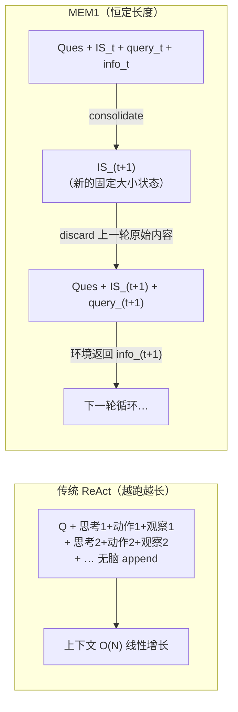

# MEM1：用端到端 RL 学一个『常数大小内部状态』，把记忆与推理融为一体

> **本篇属 D 组（记忆），打的是 harness 的 C（Context/上下文）层。** 它回答一个我们自己每天都在被折磨的问题：
> 一个 agent 跑得越久，上下文越长，越慢越贵，最后还因为超出训练长度而变蠢——**能不能不 append，而是学一个恒定大小的状态？**
> MEM1 的答案是：能，用 RL 学。本报告的重心是**把这套 RL 形式化讲透**——状态是什么、动作是什么、奖励是什么、
> 那个"常数大小状态"到底是怎么被 RL *逼*出来的（提示：不是加约束项，而是**每步物理删掉历史，逼模型把该记的记进状态里**）。

---

## §1　TL;DR（一页讲清这篇在干嘛）

> 主讲提示：开场先讲清全库中心命题 `Agent = Model + Harness` 里，这篇动的是 **Harness 的上下文层**；再抛出它最反直觉的一点——"恒定内存"不是加了个模块，而是 RL 学出来的一种**主动遗忘**策略。

一句话：**MEM1**（= **Mem**ory-**E**fficient **M**echanism via **1**-step integrated reasoning and consolidation，§1 起首把这个缩写拆开）用**端到端强化学习**训练一个 LLM agent，让它在长程多轮任务里**维持一个常数大小的内部状态 `<IS>`**：每一步，agent 读到新的环境观察，就把"旧状态 + 新观察"**融合、压缩成一个新的等大状态**，然后**把上一步的所有历史（旧状态、旧查询、旧观察）从上下文里物理删除**（§3.1）。于是无论任务跑多少轮，塞进模型的 prompt 长度**几乎恒定**（Fig. 2 的锯齿线 vs. 基线的斜坡线）。

- **属于 harness 的哪一层（Θ1）**：本篇打 **C（Context/上下文）层**——它不是造工具、不是改控制循环，而是**重新定义"agent 在每一步该往上下文里放什么"**。传统 harness 的上下文策略是"append everything"；MEM1 把它换成"consolidate then discard"。对 **L（Loop）层**有依赖（它的 ReAct 式循环 think→search→info→consolidate 见 Alg. 1），对 **T（Tools）层**弱耦合（工具就是一个 search API）。
- **回扣全库论点（Θ2）**：`Agent = Model + Harness`。MEM1 是一个**纯 harness 层的干预**——底座模型只是 Qwen2.5-7B-Base（§4.1），**没换更强的模型**，只是换了"上下文怎么管"这层脚手架 + 用 RL 把这层脚手架的行为**训进了模型策略里**。结果：MEM1-7B 在 16-objective 多跳 QA 上，性能 **3.5×** 于、内存 **3.7×** 省于 Qwen2.5-**14B**-Instruct（Abstract + §4.2）——**用一半参数的模型 + 一套会压缩的上下文策略，赢过两倍大的模型 + 无脑 append**。这正是"harness 决定能力"的一个干净证据。
- **够新够权威（Θ4）**：2025-06 预印本（v2 为 07-17），出自 **MIT / SMART / NUS** 团队，通讯作者挂 MIT（`qua@mit.edu`）。它是把"上下文压缩"从**外挂启发式模块**（summarizer / retriever）升级为**端到端 RL 可学策略**的代表作之一——这是相对 MemGPT / A-Mem 那一代"记忆当外部系统"的路线转向。

**三条带走的结论**：
1. **"恒定内存"可以被 RL 学出来**，代价是压缩可能丢信息——但在多跳 QA / WebShop 上，学到的策略**赢过**了保留全历史的强基线（§4.2）。
2. **机制的精髓在"物理删除"**：不是给 loss 加个"状态要小"的正则项，而是**每步真的把历史从上下文删掉**（Alg. 1 第 14 行 `// all previous context removed`），于是"不把关键信息压进状态就拿不到奖励"，压缩行为是被奖励**逼**出来的（§3.1 末"the agent must learn to preserve and update relevant knowledge internally in order to reap the reward"）。
3. **恒定内存 → 恒定成本**：任务目标数从 2 涨到 16，基线的峰值 token 几乎**线性膨胀**、跑到 8/16 目标时甚至"崩溃"(collapse)，而 MEM1 的峰值 token **近乎持平**（Fig. 4 / Table 1）——16 目标时只用 27.1% 的峰值 token、29.3% 的推理时间（§4.2）。

---

## §2　问题与动机：为什么"上下文随步数线性膨胀"是个必须解决的病

> 主讲提示：这一段用 Why 三连的"问题层"。核心画面就一张——Fig. 2 的两条线：基线是**斜向上的斜坡**（越跑越长），MEM1 是**贴着地面的锯齿**（涨一点就削回去）。

**Why（问题层）——不解决会卡住什么？谁受影响？**

现实里的 language agent 越来越是**长程、多轮**的：调工具、读文档、跟环境交互、基于不断演化的外部信息做决策（§1）。作者给的两个原型场景（§1）很贴我们自己：
- **研究助理**："X 的证据是什么？"→"是谁发表的？"（要再检索）→"来源可信吗？"（要自省评估）——每个问题都建立在前面已收集的信息上。
- **购物助理**："哪个产品最便宜？"→"它的评价如何？"→"它和我的设备兼容吗？"——多轮、演化上下文、复合推理。

而**绝大多数 LLM agent 系统的做法是**：每一轮都把过去所有的观察、中间思考、动作**append 进 prompt**（§1，引 ReAct[61]/WebRL[39] 等）。这个"无脑 append"看着简单有效，但带来**三个致命问题**（§1 原文逐条列出，务必记住这三条，它是全文动机的骨架）：

1. **推理成本与内存无界增长（Growing inference cost and memory usage）**：Transformer 的注意力是 $O(N^2)$ 计算（用 KV cache 后是 $O(N)$），KV cache 的显存是 $O(N)$，$N$ 是上下文长度（§1 引[52]）。上下文一直涨，就得在推理框架上**预留越来越大的 GPU 显存**（§1 引 vLLM[27]/SGLang[68]），造成算力的巨大浪费。
2. **超出训练长度就泛化崩塌（Generalization limits beyond the training horizon）**：对话/任务一旦跑到比训练时见过的更长的上下文，对模型就成了 **OOD（out-of-distribution）** 输入，模型"管不住、也推不动"这种没见过的长程输入（§1 引[63]）。
3. **上下文被无关内容淹没（Overloaded and inefficient context）**：堆进来的无关/冗余内容**稀释了注意力**，哪怕相关信息技术上还在 prompt 里，模型也用不好了（§1 引[2,30,56]，即著名的"lost in the middle"[30]）。

**Why（设计层）——为什么现有的"两条朴素路线"不够？**

> **Why（设计层）**：面对上下文膨胀，有两条**显而易见**的替代路线，本文都点名说它们不够：
> - **朴素替代 A：长上下文建模**（Longformer[6] 等）。→ 但它们主要针对**静态长文档**，"does not address multi-turn interaction with external environments"（§2）——它让你**能塞进**更多，却没告诉你**该扔掉**什么，多轮交互的病没治。
> - **朴素替代 B：外挂记忆模块**（外部 summarizer / retriever，MemGPT / Compact[63] / Mem0[13] / A-Mem[57] 这一路）。→ 三宗罪：(1) 这些模块**通常是独立训练或直接使用的，无法和 agent 的策略端到端联合优化**，"creating a disconnect between memory and the reasoning process"（§1/§2）；(2) 引入**额外的工程开销和系统复杂度**（要维护、集成两个独立模型，§2）；(3) 很多用 RL 训 agent 的工作**干脆不管内存**，任由 prompt 长度无界增长（§2 点名 Search-R1[24]/WebRL 这类"leave memory management unsolved"）。
>
> 于是本文提出**那个自然的问题**（§1 末，斜体原句）："**Can a language model learn to consolidate its memory as part of its reasoning process so that it retains only what is essential for solving the task?**"——能不能让模型**把"整理记忆"当成"推理"的一部分**，只留下解题必需的东西？MEM1 的整套设计就是对这一句的回答。

**Why（结果层预告）——为什么"把记忆并进推理"这个方向值得赌？**
关键洞察（§1）：**推理时的思考（inference-time reasoning）本来就有双重身份**——它不只是在"想当前这道题"，它同时在充当一个**"工作记忆"（working memory，§1 引 Baddeley 1974 的认知科学经典[4]）**，从收集到的信息里抽取关键组件、搭起一个不断演化的理解。既然"想"和"记"在人的认知里本就共用一块表征空间，那就**别再把它们拆成两个模块**——让 agent 在一块共享表征里同时学会"推理"和"记忆"，这就是 MEM1 名字里 "**synergize** memory and reasoning" 的含义。

---

## §3　核心 intention 与三大贡献（论文 §1 末 / §3）

**一句话把 intention 形式化**：训练一个策略 $\pi_\theta$，使得在长程多轮任务中，agent 在**每一步只被允许携带一个固定大小的内部状态**的约束下，仍能通过"把新观察融合进状态、丢弃原始历史"来完成任务——**恒定内存下最大化任务成功率**。

三大贡献（对应我们后面的三个重点章节）：
1. **MEM1 机制本身（§3.1）**：一个 `<IS>`（Internal State）为核心的、**学出来的**迭代式状态更新与巩固机制，使上下文长度有界（at most 2×`<IS>` + 2×`<query>` + 1×`<info>`，§3.1）。
2. **可训练性工程（§3.2）**：一套 **masked trajectory + 2D 注意力掩码** 的方法，解决"上下文每步都在动态变化、轨迹不再是线性"给 PPO/Reinforce++ 带来的策略梯度估计难题。
3. **多目标任务合成（§3.3）**：一个**简单可扩展**的任务增强法——把现有单目标 QA 数据集**组合成任意复杂的 N-目标多跳任务**，以便在更真实、更长程、更吃内存的设定下训练与评测。

---

## §4　方法总览（big picture）：一张图看懂"consolidate then discard"

> 主讲提示：先给直觉、不上数学。核心就一句：**每一轮，agent 生成一个新状态 `<IS>` 来概括"旧状态 + 上一轮的查询与观察"，然后把上一轮的原始内容从上下文里删掉。**



**四种 XML 标签（§3，这是理解全文的"零件表"）**——MEM1 用 XML 风格标签显式标注推理的每个成分：
- `<IS>` = **Internal State（内部状态 / 推理）**：agent 对"到目前为止发生了什么"的**巩固摘要 + 对下一步的推理**。这就是那个**要保持固定大小**的核心记忆。
- `<query>` = agent 发给环境的**动作**（一次检索查询）。
- `<info>` = 环境返回的**外部观察 / 工具输出**（检索结果）。
- `<answer>` = agent 认为可以直接作答时给出的**最终答案**。

**关键约束（§3.1 末，一定要点明的数字）**：MEM1 采用**学出来的**迭代式状态更新，保证"在任意时刻 prompt 里只保留最近的一组 `<IS>`, `<query>`, `<answer>`, `<info>`"。具体地，**任意一轮，agent 最多保留 2 个 `<IS>`、2 个 `<query>`、1 个 `<info>`**——所以上下文有界、语义相关、且高效。（为什么是"2 个 IS"而不是 1 个？因为在做第 $t+1$ 步的巩固时，需要**同时看到**第 $t$ 步的旧状态和正在生成的新状态，见 §3.1 与 A.7 的位置编码讨论。）

---

## §5　把 RL 形式化讲透（一）：状态、动作、奖励、转移

> 主讲提示：这是全篇最该停留的地方，也是老师点名要讲透的。**先把"这是一个什么样的 MDP"说清楚**，再讲"常数大小状态怎么被学出来"。公式前先定义每个符号。

MEM1 用 **RL（强化学习）** 端到端训练，具体算法是 **PPO（Proximal Policy Optimization，近端策略优化）[41]**（§4.1 明确"We use PPO as it computes token-level advantages"）。要讲透，先把它套进 MDP 的语言。

### 5.1　直觉：这是一个"每步都被清空草稿纸"的 MDP

先给直觉。想象让一个人做一长串环环相扣的问答，但规矩很苛刻：**每答完一步，监考老师就把他前面写的所有草稿纸全部收走，只允许他把一张"小卡片"（固定大小）带到下一步**。要想最后答对，他就必须学会：在草稿被收走之前，把"接下来还用得着的东西"**浓缩地誊写到那张小卡片上**。MEM1 的 agent 就活在这样的环境里——**"每步清空历史"是环境规则（Alg.1 第 14 行），而"往小卡片上写什么"是它要学的策略**。这就是"常数大小状态如何用 RL 学出来"的一句话直觉：**不是奖励它"状态要小"，而是环境强制"状态必须小"，于是它被迫学会"把有用的压进去"**。

### 5.2　符号定义（先定义，后写式）

- $t \in [1, T]$：交互轮次（turn）；$T$ 是该条轨迹的总轮数。
- $x$：任务 prompt（初始问题 + 指令），全程保留在上下文里。
- $\text{IS}_t$：第 $t$ 轮的**内部状态**（Internal State），即 agent 生成的巩固摘要 + 推理，**是本 MDP 真正的"状态载体"**。
- $q_t$（`<query>`）：第 $t$ 轮 agent 发出的检索查询，即**动作**。
- $\text{info}_t$（`<info>`）：环境针对 $q_t$ 返回的观察（检索结果）。
- $a_T$（`<answer>`）：在最后一轮 $T$ 输出的最终答案。
- $\pi_\theta$：待训练的策略（参数 $\theta$ 的 LLM），逐 token 自回归生成。
- $\mathcal{W}$：环境 / "world model"（Alg. 1 里的记号），给定查询 $q$ 返回观察 $d = \mathcal{W}(q)$。
- $r$：**可验证奖励（verifiable reward）**，任务成功才给（§3.1）。

### 5.3　MDP 各要素（把 MEM1 逐条对号入座）

| MDP 要素 | 在 MEM1 里是什么 | 出处 |
|---|---|---|
| **状态 $s_t$** | 当前 prompt 内容 = $\{x,\ \text{IS}_t,\ q_t,\ \text{info}_t\}$——**注意它被约束成固定大小**（旧历史已删） | §3.1 |
| **动作 $a_t$** | agent 生成的 token 串，构成一个新的 $\text{IS}_{t+1}$ + 要么一个 `<query>`（继续检索）要么一个 `<answer>`（收口） | §3.1 / Alg.1 |
| **状态转移 $s_t\to s_{t+1}$** | ① agent 把 $(\text{IS}_t, q_t, \text{info}_t)$ **巩固**成 $\text{IS}_{t+1}$；② 发新查询 $q_{t+1}$；③ 环境返回 $\text{info}_{t+1}=\mathcal{W}(q_{t+1})$；④ **删掉第 $t$ 轮的原始 $\text{IS}_t,q_t,\text{info}_t$** | §3.1 / Alg.1 行14 |
| **奖励 $r$** | 稀疏、**仅在轨迹末端**按最终答案是否正确给（QA 用 Exact Match；WebShop 用环境自带 reward） | §3.1 / §4.1 / A.4.1 |
| **策略 $\pi_\theta$** | 一个 LLM，逐 token 生成上面的动作 | §4 |

**这个 MDP 最不寻常的一点**：状态转移里**包含"删除历史"这一步（第 ④ 步）**。传统 ReAct 的 MDP 状态是**单调增长**的（$s_{t+1} \supset s_t$）；MEM1 的状态转移**主动丢弃**信息（$s_{t+1}$ 里没有 $\text{IS}_t,q_t,\text{info}_t$ 的原文，只有它们被压进 $\text{IS}_{t+1}$ 后的"残影"）。**"常数大小状态如何用 RL 学出来"的技术答案就藏在这一步**：环境（rollout 逻辑）在每步转移时物理删除历史，使得"信息保全"只能通过"写进 $\text{IS}$"实现；而 $\text{IS}$ 的价值最终由**末端奖励**回传（信息压漏了→后面答错→奖励为 0→梯度惩罚那次糟糕的巩固）。于是**"如何压缩"被当作策略的一部分，随 PPO 一起被优化**。

### 5.4　为什么用 RL 而不是 SFT / 加正则项？（设计层 Why，三选一）

> **Why（设计层）——三条朴素替代 vs. MEM1 的选择**：
> - **朴素替代 A：给 loss 加"状态长度惩罚"正则项。** → 会**把"压缩"和"解题"变成两个打架的目标**，需要手调权衡系数，且模型可能学会"状态短但没用"来骗惩罚项。MEM1 不加任何长度正则——**长度约束由环境的"删历史"硬性给定**，模型只有一个目标：答对拿奖励。压缩是"为了答对而不得不学会"的**副产物**，天然对齐。
> - **朴素替代 B：用 SFT（监督微调）模仿"高质量的压缩轨迹"。** → §4.4 与 D.1 实测：**SFT 会崩**。MEM1-QA(SFT) 在目标数超过 6 时性能**塌方**（Table 4：6 目标时 RL 1.630 vs SFT 0.088；16 目标时 RL 1.900 vs SFT **0.000**）。原因（D.1）：SFT 只能模仿固定的示范分布，学不到"在没见过的长程下如何巩固"的**可泛化策略**；RL 通过奖励信号**探索**出了这种策略。作者结论直白："reinforcement learning from the base model consistently yielded the best performance and generalization"（§4.1）。
> - **朴素替代 C：加"格式奖励"帮它更快学会用标签。** → D.2 实测这是个**陷阱**：加 format reward（要求正确使用 `<IS>/<query>/<answer>`，用错就 -1 并终止该轮）确实**加速收敛**、生成更短（平均峰值 514.9 token vs 640），**但最终性能更差**（2 目标 EM：0.466 vs **0.709**，Fig. 7 / D.2）。机制解释（D.2）：格式奖励**加速了结构学习，却压制了对有效推理策略的探索**——agent 学会"合规但短"的输出，却发育出**更差的内部状态表征**。→ 这条是给我们自己 harness 的一记警钟（见 Inspires-Us）。

### 5.5　PPO 目标函数（给公式前先给直觉）

**直觉**：PPO 想让"表现比预期好的动作"更可能被采样、"比预期差的"更少，但又**不许一步更新迈太大**（否则策略崩），所以用一个"裁剪的重要性采样比"把更新幅度夹住。

符号（先定义）：
- $\rho_k(\theta) = \dfrac{\pi_\theta(a_k \mid s_k)}{\pi_{\theta_\text{old}}(a_k \mid s_k)}$：第 $k$ 个 token 位置上，新旧策略给该 token 的概率之比（§3.2 原文给出了这个比值记号）。
- $A(s_k, a_k)$：优势函数（advantage），"这个 token 比该状态下的平均水平好多少"，由 critic 的价值估计 $V(s_k)$ 算出（Fig. 3 Top 标出了 $A$、$D_\text{KL}$、$V$ 三个量）。
- $D_\text{KL}$：新策略对参考策略的 KL 惩罚，防跑偏（Fig. 3 Top）。
- $\epsilon$：裁剪阈值（原文未给出具体取值）。

PPO 的裁剪目标（标准式，论文用的是它的 token-level 版本，§4.1 "token-level advantages"）：
$$\mathcal{L}^{\text{PPO}}(\theta) \;=\; \mathbb{E}_k\!\left[\ \min\Big(\rho_k(\theta)\,A(s_k,a_k),\ \ \text{clip}\big(\rho_k(\theta),\,1-\epsilon,\,1+\epsilon\big)\,A(s_k,a_k)\Big)\ \right]\; -\; \beta\, D_\text{KL}$$

读出什么：MEM1 **没有改 PPO 的目标函数本身**——它的创新不在"新 loss"，而在**"如何在一个每步都删上下文、轨迹不再线性的环境里，让 $\rho_k(\theta)$、$A$、$V$ 这些量还能被正确计算"**。这正是下一节 §6 要解决的工程核心。

**奖励怎么给（§3.1 + A.4.1，可验证奖励）**：QA 任务用 **Exact Match** 作 RL 奖励——最终 `<answer>` 里每答对一个子问题记 1 分，XML 标签不匹配或答案个数与问题数不符则记 **0**；**训练中不给任何中间奖励或格式惩罚**（A.4.1 明确"we do not provide any other intermediate rewards or format penalties, as we find that such manual interventions can interfere with the agent's learning process"——与 D.2 的教训一致）。WebShop 则**直接用环境自带的 reward**（A.6）。

---

## §6　把 RL 形式化讲透（二）：动态上下文如何做策略优化——masked trajectory + 2D 掩码

> 主讲提示：这页讲清一个"如果不解决就根本训不了"的坑。上一节说 MEM1 不改 PPO 目标，但 PPO 默认**轨迹是线性的**（token 序列一路往后长）；MEM1 每轮删历史，序列**不线性**了，$\rho_k(\theta)$ 就算错。这一节是补这个洞。

**Why（问题层）——坑在哪？**
常规多轮 agent 在生成时保持**静态上下文**；MEM1 则**每轮动态更新上下文、剪掉无关 token**（§3.2）。这个动态更新**破坏了 token 生成轨迹的连续性**，使得 PPO / Reinforce++[41,22] 里"逐 token 优势"的估计变得棘手——**因为这些算法默认轨迹是线性的**（§3.2 原句："complicating the estimation of token-wise advantages … where trajectories are typically assumed to be linear"）。

**解法一：masked trajectory（拼接出一条"逻辑上连续"的假轨迹）**（§3.2）
把多轮交互**缝合成一条逻辑自洽的完整轨迹**：定义一串元组 $\tau_t = (\text{IS}_t, q_t, \text{info}_t)$，$t \in [1, T-1]$；最后第 $T$ 轮输出 $\tau_T = (\text{IS}_T, a_T)$（即最终答案）。这条缝合出来的完整轨迹**模仿了一次标准的多轮 rollout**，"encodes all information needed for accurate policy learning while respecting MEM1's memory consolidation at each turn"（§3.2）。直觉：物理上历史被删了，但为了算梯度，我们在**训练时**把它们重新摆回一条时间线上，只是用掩码控制"谁能看见谁"。

**解法二：2D attention mask（二维注意力掩码，让每个 token 只注意"它当时真能看到的东西"）**（§3.2，引 4D-masks[40]）
对缝合后的完整轨迹施加一个**二维注意力掩码**：对某个 token 位置 $k$，**掩掉所有"不属于该轮巩固后上下文"的更早 token**。形式化地——令 $s_k$ 为掩码后的输入状态、$a_k$ 为预测 token，则概率比 $\rho_k(\theta) = \dfrac{\pi_\theta(a_k \mid s_k)}{\pi_{\theta_\text{old}}(a_k \mid s_k)}$ **保持有效且可计算**，进而保证优势、KL 惩罚、价值估计都算对（§3.2）。Fig. 3(Bottom right) 画了这个掩码：`For IS(t+2): only Ques, IS(t+1), Query(t+1), Info(t+1) are NOT masked`——即第 $t+2$ 步的状态只能"看见"问题、上一步的状态与查询观察，看不见更早的原始历史。

**解法三：1D info mask（对外部信息再加一层掩码）**（§3.2，following [24]）
在策略更新时，对**检索回来的外部信息 `<info>`** 额外施加一个**一维掩码**，保证 actor 和 critic 的梯度更新**只落在 agent 自己生成的 token 上**（Fig. 3 右侧 "Info Mask"）。直觉：`<info>` 是环境写的、不是策略生成的，**不该为它算策略梯度**（否则等于在"训练模型去生成搜索引擎的返回结果"，荒谬）。

> **Why（设计层）——为什么非得搞这套掩码，不能直接把删历史后的短序列喂进去训？**
> 朴素做法是"删完历史后，就拿剩下的短上下文当普通轨迹训"。→ 会出两个错：(1) 各步的 `<IS>` 之间的**因果依赖断了**（第 $t+1$ 步的状态本是从第 $t$ 步巩固来的，短序列里看不到这层来源，advantage 归因错）；(2) 会**误把环境返回的 `<info>` 当成策略动作**去更新。masked trajectory + 双掩码正是**在"物理上恒定内存"与"训练上梯度正确"之间架的桥**。

**一个诚实的工程妥协（A.7，值得讲，体现作者不藏拙）**：这套掩码**并没有完全复原**原始轨迹的注意力——因为 position id（位置编码）变了。理想做法是**复制每个 `<IS>`**，给"上一轮的它"和"下一轮的它"分配不同的 position id；但**复制会显著拖慢训练**（轨迹变长很多）。所以作者选择**不复制 `<IS>`**、直接沿用位置编码——他们论证这个偏差"effectively … can be viewed as simply adding white spaces in the training trajectories and has no significant impact on the experimental results"（A.7）。→ 这是一处**"为了训练效率牺牲一点理论保真度"的判断**，属于诚实披露的边界。

---

## §7　MEM1 Rollout 算法（Alg. 1 逐行读：恒定内存的机制在这里）

> 主讲提示：这页把"常数大小状态"从抽象讲成**可执行的伪代码**。最该指的是**第 14 行**——一行注释 `all previous context removed`，就是整篇论文"恒定内存"的物理开关。

**Algorithm 1（MEM1 Rollout，App. A.5，逐行读）**：

```
Require: 任务 prompt x, 策略 π_θ, world model W, 最大轮数 T
Ensure:  最终回答 y
 1  y ← ∅                         # 整条 rollout 序列
 2  t ← 0                         # 轮数计数
 3  while t < T do
 4     y_t ← ∅                    # 本轮的生成序列
 5     while True do              # ——逐 token 生成本轮内容
 6        y_r ~ π_θ(· | x, y + y_t)          # 采样下一个 token
 7        y_t ← y_t + y_r
 8        if (t = T-1) and y_r ∈ [</answer>, <eos>] then
 9           break                # 最后一轮：允许直接收口
10        else if y_r ∈ [</query>, </answer>, <eos>] then
11           break                # 生成完一个查询或答案就停
12        end if
13     end while
14     y ← y_t                    # ★ all previous context removed（上一轮历史被丢弃）
15     if <query></query> detected in y_t then
16        q ← Parse(y_t, <query></query>)              # 抽出查询
17        d ← W(q)                # 环境返回观察（本地库 / 搜索引擎 / HTML …）
18        HINT ← "You have {T - t} turns left."        # 提示剩余预算
19        y ← y + <info>HINT + d</info>                # 把观察塞回上下文
20     else if <answer></answer> detected in y_t then
21        return 最终回答 y        # 收口
22     else
23        Mark the sample as invalid                    # 既没查询也没答案 → 判废
24     end if
25     t ← t + 1
26  end while
27  return 最终回答 y
```

**逐行读出什么**：
- **第 6 行**：策略看到的输入是 `x + y`，而 $y$ 在第 14 行被**重置成只含本轮内容**——这就是"恒定上下文"的来源：无论第几轮，喂进 $\pi_\theta$ 的都只有"任务 prompt + 最近一轮的巩固状态/查询/观察"。
- **第 14 行（★核心）**：`y ← y_t` 这一步**把整条历史 $y$ 直接替换成本轮的 $y_t$**，注释明写 `all previous context removed`。**这一行就是"常数大小状态"的物理实现**——不是靠 loss、不是靠 attention，而是靠 rollout 逻辑**每轮真的把历史扔了**。
- **第 18–19 行（`turns_left` HINT）**：因为历史被删，agent **会忘记自己还剩几轮**（很容易该收口时不收口）。所以每次把观察塞回去时，都在 `<info>` 开头**注入一句"You have {T-t} turns left"**（§4.1 "Meta info injection" 也强调了这一点）。→ 这是"恒定内存"带来的一个**副作用补丁**：把"预算意识"从"靠上下文历史推断"改成"每步显式喂给它"。
- **第 8–11 行**：终止逻辑——最后一轮只接受 `</answer>`；其余轮生成完 `</query>` 或 `</answer>` 即停。
- **第 23 行**：既不查询也不作答的轮次**判废（invalid）**，不给奖励——这是防止 agent"空转"的硬约束。

> **读出什么（把 RL 闭环讲圆）**：把 Alg. 1（rollout 采样）+ §6（masked trajectory 算梯度）+ §5.5（PPO 更新）拼起来，就是完整闭环：**rollout 时物理删历史 → 缝合成假轨迹 + 打掩码算出正确的 token 级优势 → PPO 更新策略**。"恒定内存"在 rollout 层强制，"如何压缩"在策略层学习，"压得好不好"由末端奖励评判。三者缺一不可。

---

## §8　多目标任务合成：把单目标 QA 拼成"任意长"的压力测试（§3.3）

> 主讲提示：这页解释"我们从哪弄来足够长、足够吃内存的任务来训练/评测"。答案很务实：**把 N 个多跳问题拼成一道复合题**。

**Why（问题层）**：现有多跳基准（HotpotQA[59]、Bamboogle[38]、2Wiki[21]）虽被当作"多跳"，但**通常只有两步信息检索**（§3.3），且**结构上不支持需要 agent 管理记忆状态的长程交互**——太短了，压不出内存问题。

**做法（§3.3 + Prompt 1）**：提出 **multi-objective QA** 任务——从原 QA 语料里**交织多个问题**，拼成**一道复合 query，要求 agent 回答其中所有子问题**。于是 agent 被迫：对每个子目标发一次（或多次）检索、把检索到的答案整合成一份完整回答。相比原任务，这个合成的多目标多跳设定**显著增加了检索与推理的轮数**，制造出"更复杂、更吃内存"的交互（§3.3）。

- **训练只用 2-objective**（§4.2）：MEM1 只在 **2 目标**的增强 QA 上训练（HotpotQA + Natural Question 混合，§4.1）。
- **测试外推到 3/4/6/8/16-objective**：看它能否**泛化到比训练时更多目标**（Fig. 4 / Table 1）——这直接检验 §2 的痛点 2"超训练长度泛化"。

> **Why（设计层）——为什么这招"简单可扩展"很关键？** 朴素做法是**去人工标注一批长程多跳任务**。→ 贵、慢、难保证难度可控。本文的"组合已有单目标题"是一个**零标注、难度旋钮连续可调**（N 想设几就设几）的合成器——**用现有社区基准就地造出任意长的长程任务**，这本身就是一个可复用的"任务工厂"（见 Inspires-Us）。

---

## §9　实验设置（setting / params 写全）

- **底座模型**：所有 MEM1 变体都从 **Qwen2.5-7B-Base**[58] 微调而来（§4.1）。**RL 算法用 PPO**（§4.1，token-level advantage → 训练更稳）。
- **训练框架 / 硬件**（A.1）：RL 用 **veRL**[44]、SFT 用 **Swift**[14]；在 **4× H100 或 H200 GPU** 上训练。RL 的 data batch = mini batch = **64**。**学习率：actor $10^{-6}$、critic $10^{-5}$**，线性 warmup 50 步。**温度：训练 1.0、推理 0.01**。评测在**单张 H200** 上用 **vLLM**[27] 起 API 服务、开 **automatic prefix caching**。
- **两个环境**（§4）：
  1. **RAG（检索增强 QA）**：训练时检索**本地 Wikipedia 语料**（2018 dump，用 **Faiss-GPU**[17] + **E5-Base**[54] 编码，每次取 **3** 篇，A.2）；评测含**开放网页浏览**。
  2. **WebShop**[60] 网页导航：agent 帮用户在线购物，逐步读页面、选商品；**用环境自带 reward**训练（A.6）；线上搜索用 **Serper API**[42]，每次返回 top-10（A.2）。
- **轮数预算**（§4.1 Meta info injection）：1~4 目标任务**最多 6 轮**；更难的任务**最多 20 轮**。
- **指标（全部给定义式，见下 §10）**：准确性用 **EM / F1 / 环境 reward**；效率用 **Peak Token Usage / Dependency / Inference Time**（§4.1 + A.4.1）。测试集均取自原论文、是 **OOD**（分布外）数据（§4.1）。

**Baselines（§4.1 + A.4.2）**：
- QA 侧：**Search-R1**[24]（1 目标、EM 奖励，与 MEM1 同数据集）、**DeepResearcher**[69]（1 目标、F1 奖励）、以及更大的 **Qwen2.5-14B-Instruct**。
- WebShop 侧：**Agent-FLAN**[11]、**Agent-R**[64]、**AgentLM**[66]（含 7B/13B）、以及 **GPT-4o**[36]。
- 两个"上下文压缩"对照（同参数量）：**(truncate)**——用 MEM1 的 prompt/rollout 但接到标准 instruct 模型上，隔离"prompt+rollout 设计"本身的贡献；**A-MEM**[57]——给 instruct 模型外挂一个向量库记忆模块，代表"外部记忆"路线。还训了一个 **SFT** 版（用 GPT-4o 轨迹）对照 RL。

---

## §10　指标定义式（逐个给公式 + 它在惩罚什么）

> 主讲提示：这页把 5 个指标的定义式摆齐。重点讲两个"效率指标"——它们才是本文的主战场（内存与算力），且 Dependency 的定义式很能体现"恒定内存"的好处。

**(1) Exact Match（EM，准确性 + RL 奖励，A.4.1）**：从 `<answer>...</answer>` 抽最终回答；多目标设定里回答须含所有子问题的答案（分号分隔）。**XML 标签不匹配、或答案个数 ≠ 问题个数 → 记 0**；否则**每对一个子答案记 1 分**。它既是评测指标、也是 RL 的可验证奖励。

**(2) F1 score（准确性，A.4.1）**：字符串匹配下的精确率/召回率的调和平均。符号先定义——把预测答案与 ground truth 各**按词切分**；设**共同词数** $c$、**预测答案词数** $l$、**ground truth 词数** $g$，则精确率 $p := c/l$、召回率 $r := c/g$：
$$\text{F1} \;:=\; 2\times \frac{p\times r}{p+r}$$
多 ground truth 取最大；多目标任务的最终 F1 = 各子问题 F1 **之和**（A.4.1）。

**(3) Peak Token Usage（峰值 token，效率/内存，A.4.1）**：agent **整条轨迹中，任意单个序列的最大 token 数**（用 GPT-4o-mini tokenizer 计；为公平**排除 system prompt**）。**它是"推理时内存需求"的代理指标**——峰值越低，需要预留的 KV cache 显存越少。这是本文最看重的效率量之一。

**(4) Dependency length（依赖长度，效率/累计算力，A.4.1，following LightThinker[67]）**：衡量"每个生成 token 有效依赖了多少历史 token"，量化**生成整条轨迹的累计计算成本**。符号先定义——设总步数 $T$；对第 $i\in[T]$ 步，$n_p^{(i)}$ = 该步的 **prefix token 数**、$n_o^{(i)}$ = 该步**输出 token 数**：
$$\text{Dependency} \;:=\; \sum_{i\in[T]} \frac{\big(2\,n_p^{(i)} + n_o^{(i)}\big)\times n_o^{(i)}}{2}$$
读出什么：每一步的成本 $\propto$（prefix 越长、或本步输出越多）→ 越贵。**MEM1 的关键优势正体现在这里**：普通 agent 的 $n_p^{(i)}$（prefix）**随步数累加**、越来越大；MEM1 把 prefix **巩固成一个固定大小的 `<IS>`、不再累加**（A.4.1 原文明确"in MEM1, prefix tokens from previous steps are consolidated into a new internal state, rather than being continuously accumulated"）。所以 $\sum$ 里每一项的 $n_p^{(i)}$ 被摁住，总依赖成本**近乎线性于步数**而非二次爆炸。（计算时同样忽略 system prompt。）

**(5) Inference Time（推理时间，效率，A.4.1）**：生成完整轨迹的总耗时；单张 H200、10 并发、vLLM + prefix caching 下测。

---

## §11　主结果一：多目标多跳 QA——目标越多，MEM1 越占便宜（Table 1 / Fig. 4）

> 主讲提示：这是全场最能打的图表。看两条曲线随"目标数"增长的走向：别人的峰值 token **一路爬升甚至崩盘**，MEM1 的**几乎躺平**——而且精度还反超。

**Table 1（多目标多跳 QA，箭头↑↓表期望方向；红字=模型"崩溃"即性能极低）** 节选（MEM1-QA 只在 2 目标上训练）：

| Model | 2-obj EM↑ | 2-obj Peak(×10³)↓ | 2-obj Time↓ | 8-obj EM↑ | 8-obj Peak↓ | 16-obj EM↑ | 16-obj Peak↓ | 16-obj Time↓ |
|---|---:|---:|---:|---:|---:|---:|---:|---:|
| Qwen2.5-**14B**-Inst | **0.732** | 5.49±0.16 | 5.49 | 1.87 | 16.2±0.27 | 0.567 | 29.7±0.75 | 29.7 |
| Qwen2.5-7B-Inst | 0.268 | 15.6±0.19 | 1.55 | 0.87 | 49.5±0.40 | 0.165 | 43.3±0.62 | 15.5 |
| Qwen2.5-7B-Inst (A-Mem) | 0.286 | 14.1±0.10 | 1.13 | 1.43 | 18.6±0.10 | 0.964 | 18.8±0.14 | 91.2 |
| Search-R1 | 0.452 | 13.0±0.08 | 4.09 | *0.064*(红) | 24.7±0.19 | *0.011*(红) | 20.9±0.03 | *4.75*(红) |
| DeepResearcher | 0.536 | 22.0±0.43 | 4.01 | 0.73 | 51.8±0.35 | *0.071*(红) | 48.9±0.66 | 35.8 |
| **MEM1-QA** | 0.709 | **6.40±0.02** | 6.49 | **1.87** | **8.01±0.06** | **1.97** | **10.4±0.09** | **8.70±0.12** |

**Why（结果层）——为什么 MEM1 越到长程越赢？**
- **2 目标时 MEM1 略输 14B**（EM 0.709 vs 0.732）——底座才 7B，短程本就吃亏（§4.2 明说"MEM1 initially underperforms Qwen2.5-14B-Instruct"）。
- **但目标数一涨，MEM1 反超**：8 目标 EM 追平（1.87 vs 1.87）；**16 目标 EM 1.97，超过 14B 的 0.567**（§4.2 "eventually surpassing the 14B model, which has double the parameter count"）。
- **效率是碾压级**：16 目标时 MEM1 的峰值 token 仅 10.4K，而 14B 是 29.7K、Search-R1/DeepResearcher 都在 20~49K；作者总结 **16 目标下 MEM1 只用 27.1% 的峰值 token、29.3% 的推理时间**（相对 Qwen2.5-14B-Instruct，§4.2）。
- **基线"崩溃"（红字）**：Search-R1、DeepResearcher 在 8/16 目标时性能塌到近 0（Table 1 红字），且**它们的上下文在 8/16 目标时不再增长——因为模型本身已经崩了**（Fig. 4 caption："at 16-objective, the context of baseline models does not increase anymore since their model performance has degraded (some collapsed)"）。这反向印证了 §2 痛点 2：**无脑 append 的 agent 一旦超出能驾驭的长度就整体失效**，而 MEM1 因为恒定内存**平稳跨过了训练地平线**（Abstract："generalizes beyond the training horizon"）。

**Fig. 4 一句话**：随目标数 1→16，所有基线的 Peak Token **近乎线性上升**（柱状图越来越高），MEM1 的 Peak Token **几乎持平**（一条低平线）；同时 MEM1 的 EM Count（折线）**稳居最高**。这张图 = "恒定内存 + 不掉精度"的最直观证据。

---

## §12　主结果二：WebShop 网页导航（Table 2）& 单目标 QA（Table 3）

**Table 2（WebShop，↑↓表期望方向）** 节选：

| Model | Avg Final Reward↑ | Peak Token(×10³)↓ | Dependency(×10⁶)↓ | Time/Traj(s)↓ |
|---|---:|---:|---:|---:|
| GPT-4o | 25.48 | 5.30±1.23 | 3.99±1.16 | N/A |
| GPT-4o (truncate) | 13.82 | 0.99±0.99 | 0.81±0.23 | N/A |
| Agent-FLAN-7B | 40.35 | 3.37±1.12 | 2.18±1.62 | 9.95±6.19 |
| AgentLM-7B | 63.60 | 2.24±0.40 | 0.28±0.07 | 3.91±1.07 |
| AgentLM-**13B** | 70.80 | 2.36±0.46 | 0.30±0.08 | 5.23±1.59 |
| **MEM1-WebShop** | **70.87** | **0.81±0.10** | **0.15±0.16** | **2.61±0.48** |

读出什么（§4.2）：MEM1 的 reward（70.87）**打平/略超两倍大的 AgentLM-13B（70.80）**，且效率全面领先——相对最强基线 AgentLM，**峰值 token 2.8× 更省、Dependency 1.9× 更省、推理 1.5× 更快**（§4.2）。同时 MEM1 **显著优于 GPT-4o**（25.48），哪怕给 GPT-4o 套上 truncate 或 A-MEM 也不行——说明"把压缩策略 RL 进模型"胜过"给强模型外挂压缩/记忆"。

**Table 3（单目标 QA：Wiki-RAG + 线上 Web-QA 零样本迁移）** 关键行（此处 MEM1 仍是 §4.2 那个**只在 2 目标上训**的模型）：

| Env | System | EM↑ | F1↑ | Peak(×10²)↓ | Dependency(×10⁵)↓ | Time↓ |
|---|---|---:|---:|---:|---:|---:|
| Wiki-RAG | Qwen2.5-14B-Inst | 0.422 | 0.534 | 8.89±0.21 | 2.22±0.10 | 2.31±0.04 |
| Wiki-RAG | Search-R1 | **0.445** | 0.516 | 11.0±0.25 | 1.50±0.05 | 2.23±0.14 |
| Wiki-RAG | MEM1-QA (SFT) | 0.302 | 0.358 | 6.54±0.05 | 3.30±0.13 | 4.84±0.21 |
| Wiki-RAG | **MEM1-QA** | 0.405 | 0.471 | **5.63±0.02** | **0.76±0.02** | 3.79±0.07 |
| Online Web-QA | DeepResearcher | 0.372 | **0.492** | 10.27±0.19 | 2.86±0.14 | 2.87±0.06 |
| Online Web-QA | **MEM1-QA** | **0.397** | 0.485 | **5.79±0.06** | **0.44±0.02** | **1.84±0.03** |

读出什么（§4.3）：**即便在它没被优化的单目标任务上**，MEM1 也在**三个效率指标上全面领先**，EM 追平/接近 14B、且**零样本迁移到线上 Web-QA**（训练时没见过的真实搜索环境）依旧"高效 + 效果相当"。**SFT 版在这里也明显差于 RL 版**（EM 0.302 vs 0.405），再次坐实"必须用 RL"（§4.3）。

---

## §13　分析：训练动态四阶段 & 涌现行为（§4.4 + App. C）

> 主讲提示：这页有两层看点——(1) RL 训练里 agent **经历了哪些"钻空子→再纠偏"的阶段**（App. C，很生动）；(2) 它自发学会了哪些**类人的记忆/搜索策略**（Fig. 5）。

**训练动态四阶段（App. C，Fig. 6）**——2 目标 QA 训练里清晰出现的相变：
1. **探索期（~0–50 步）**：奖励低、熵高、合法动作率仅 ~0.55——**还没学会正确用 `<query>/<answer>` 标签**，行为随机。
2. **格式习得 → 钻空子（~step 150）**：合法动作率随格式规范上升、奖励也涨；但**搜索次数骤降、奖励却继续涨**——agent 发现了一条**捷径**：少搜几次以避免格式违规，就能"高合规、拿奖励"，但**并没真解题**（App. C 明说这是"exploiting the reward structure, favoring formatting compliance over content completeness"）。→ 一个 reward hacking 的活标本。
3. **局部最优（step 150–200）**：合法率继续爬、但搜索仍少、熵趋平——卡在"合法但信息不足的答案"上。
4. **纠偏 → 收敛（step 200+）**：搜索次数**回升**（学会延长交互多收集信息），奖励更陡地涨；step 250 后熵骤降、策略趋确定——最终**同时做到格式合规 + 充分搜索 + 高质量作答**（App. C）。

> **读出什么**：这四阶段是一份罕见的、诚实的 RL "心路历程"记录——它直观展示了 §5.4 里为什么**格式奖励是陷阱**（阶段 2 的捷径正是格式合规诱发的），以及为什么最终**不加中间奖励**反而让 agent 爬出了局部最优。

**涌现行为（Fig. 5，a–h，§4.4）**——只在 2 目标上训，却自发学会一批长程策略：
- (a) **分别存储各问题的信息**（为 Q1/Q2 各建一块记忆）；(b) **卡住就先放一放、转攻更易的目标**；(c) **把关键事实融进 `<IS>` 边推理边记**；(d) **一旦检索到新的相关信息，显式判断其重要性并选择性更新记忆**；(e) **自我验证与纠错**（发现先前误判 → 重新检索确认）；(f) **给复杂问题制定搜索计划**；(g) **迭代搜索**（从上一轮结果里抽关键信息驱动下一轮）；(h) **查询过窄失败时重新放宽 query**。作者点明：其中许多行为（验证、做计划、迭代搜索）**也见于近期 deep research agent[24,69]**——但 MEM1 是在**恒定内存约束下**自发长出这些行为的。

---

## §14　局限与批判（论文 §5/A.7 承认的 + 我的补充）

**论文自陈的局限（诚实）**：
- **依赖"良定义、可验证的奖励"**（§5 Conclusion 原文）：MEM1 假设环境能给出可验证 reward。这在 QA / math / 网页导航成立，但**很多真实开放任务的奖励是模糊、含噪、稀疏、延迟或隐式的**——在这些设定下如何训 MEM1 是**明确的未来工作**（§5 "beyond the scope of this work"）。
- **格式奖励反噬**（D.2）：加 format reward 会**加速收敛但降低最终性能**（EM 0.466 vs 0.709），作者据此**选择不用**——但这也意味着**训练更慢、更依赖探索运气**。
- **注意力掩码非完全保真**（A.7）：为训练效率没有复制 `<IS>`、position id 有偏差；作者argue 影响可忽略，但这是**未做严格消融证明**的自我辩护。

**我的补充批判**：
- **"压缩必然有损"这一根本代价，论文用"最终答对率"间接掩盖了，但没有直接度量"信息丢失量"**。我们只知道"压完还能答对"，不知道"压掉了什么、在什么任务上会压掉致命信息"。一个更长程/更需要精确回忆早期细节的任务（如"第 3 轮那个数字是多少"），MEM1 可能栽跟头——**原文未给出对"压缩丢信息"的直接探针**。
- **恒定内存但轮数没恒定**：Peak Token 恒定 ≠ 总算力恒定。目标越多，**轮数 $T$ 越多**（Dependency 的 $\sum_{i\in[T]}$ 随 $T$ 增长），所以 MEM1 省的是"每步的 prefix 膨胀"，**没省"步数本身"**——它把 $O(N^2)$ 压成了近 $O(N)$，而非 $O(1)$。宣称"constant memory"要小心理解为"constant **peak** memory / **per-step** context"，不是"总成本恒定"。
- **`turns_left` 提示是个"拐杖"**：agent 之所以需要每步被喂剩余轮数（Alg.1 行18），正是因为**它把"我干到哪了"的历史丢了**。这暴露恒定内存的一个隐性成本——**凡是"需要从完整历史推断"的元信息（进度、预算、已试过什么），都得额外显式注入**，否则 agent 无从知晓。真实任务里这类元信息未必都能手工喂全。
- **只在 7B + 单一模型族（Qwen）验证**：结论对更大模型 / 其它模型族是否成立、恒定内存的收益会不会随模型变强而衰减（呼应 Θ5 的 regime 之辩），**原文未验证**。

---

## ★ 对我们的启发（Inspires Us）

> 这一节是组会高潮，也是本库的第一人称优势：**我们（Claude Code / 本课 m9.* 的 agent）自己就是一个 harness，自己就有 compaction。** MEM1 恰恰是在问"compaction 能不能不靠启发式、而靠 RL 学出来"——这几乎是冲着我们的上下文层来的。

➤ **a. 可直接借用的招（method/trick we can reuse）**：
1. **"物理删历史 + 末端奖励"这套"逼出压缩"的训练范式**（§3.1 + Alg.1 行14）——它证明了**不需要给 loss 加长度正则**，只要在 rollout 里**每步真的删掉历史**，"把有用的压进固定状态"就会作为**副产物**被 RL 学出来，且天然与"解题"对齐。这个"用环境约束代替 loss 项"的思路可以直接搬。
2. **masked trajectory + 2D 掩码**（§3.2）——一份现成的"如何在动态变化的上下文里做正确策略优化"的工程配方；凡是我们想 RL 训一个"会主动改写自己上下文"的 agent，这套掩码就是绕不开的基础设施。
3. **多目标任务合成器**（§3.3）——**零标注、难度旋钮连续可调**地把现有单跳/双跳基准拼成任意长的长程任务。可直接拿来给我们自己的 agent **造长程压力测试集**。

➤ **b. 可迁移到我们的模块（transfer）**：把 MEM1 的 `<IS>` 思想映射到 **auto-research 库的 `m9.*` 研究 agent**——我们的 research agent 现在多半也是"append 所有检索/中间结论"。可以给它加一个"**巩固内部状态**"步骤：每收集一批文献就把"旧状态 + 新证据"压成一份等大的 running summary，丢弃原始检索全文。**迁移时要改什么**：QA 的奖励是 EM（可验证），而"研究质量"没有 EM——所以**不能直接照搬 RL**，要么退化成"用强模型做启发式巩固"（放弃可学性、回到 A-MEM 那路），要么先给研究任务**造一个可验证代理奖励**（如"最终报告是否覆盖了所有 required 子问题"，正好复用 §3.3 的多目标结构）。**什么前提不再成立**：MEM1 假设"答对=奖励"，研究任务里"过程对但结论开放"很常见，稀疏末端奖励会不够。

➤ **c. 它暴露的开放问题 = 我们的机会（open problems → our opportunity）**：论文**没有直接度量"压缩丢了什么信息"**（§14 我的批判），失败只能从最终答错反推。**机会**：设计一个"**压缩保真探针**"——在每步巩固后，用一组"回忆型探测问题"（如"刚才 info 里的关键数字是多少"）去查 `<IS>` 是否还答得出，量化**信息保留率**，并把它作为**辅助奖励/诊断信号**。**可下手的第一步**：在我们自己的 compaction 前后各插一个"关键事实清单"，压缩后立刻自测能否复原这些事实，先把"我们的启发式 compaction 到底丢了多少"测出来。

➤ **d. 与本库其它论文/模块的连接（connect the dots）**：
- 与 **F 组 AgentFold / IterResearch（上下文折叠 / 状态重建）** 是**同一战线的两种流派**——它们也在攻"长程上下文该保留什么"，但多为**推理时的启发式折叠**；MEM1 的差异是**把折叠策略 RL 进了模型权重**。二者正面对话："折叠该在推理时做（免训练、灵活）还是训进策略（更省、但要可验证奖励）？"
- 与 **D 组的 A-MEM / Mem0（外部记忆模块）** 构成**路线对立**：外挂记忆 vs. 内化状态。Table 1/2 里 MEM1 直接把 A-MEM 当基线**比赢了**（§4.2），是"内化 > 外挂"的一个数据点——但仅在"有可验证奖励"的 regime 内成立。
- 与标杆 **Harness-Bench（2605.27922）** 呼应：MEM1 是"只换上下文层（C）就让 7B 赢 14B"的又一个 `Agent=Model+Harness` 实证，正好可以塞进 Harness-Bench 的"Consistency / 长程状态"那几项去测。
- 与 auto-research 的 **`m9.8`（独立验证收口 / 红队）** 隐忧相通：MEM1 的 App.C 阶段 2 是一个漂亮的 **reward hacking** 现场（agent 靠少搜、合规刷分），提醒我们"可验证奖励"也会被钻空子。

➤ **e. 如果我来做下一步（my next move，第一人称、可执行）**：我会先在**我们自己 harness 的 compaction 组件**上做一个最小实验——**不动 RL**，先把 MEM1 的 `<IS>` 结构（"旧状态+新观察→等大新状态，然后丢原文"）照搬成一个**启发式 compaction 策略**，接到我们某个 m9.* 长程 agent 上，跑 §3.3 式合成的 8-目标任务，**对比"我们现有的启发式 compaction" vs "MEM1 式 IS 巩固"**在 (i) 峰值 token、(ii) 最终答对率、(iii) 我在 (c) 里说的"信息保留率探针"三项上的差异。**如果 IS 巩固明显更省 token 且不掉精度**，下一步再上真正的 RL（用 §3.3 的多目标结构造可验证奖励），验证"把我们的 compaction 从启发式升级为 RL 可学的恒定状态"是否值得——这正是老师点的那个问题的落地路径。

---

## §15　版图定位（canon/前沿坐标 + 在本库的位置）

- **时间坐标（Θ4）**：**2025 前沿**（2025-06 预印本，MIT/SMART/NUS）。它相对基石**推进了哪一步**——从 **MemGPT / A-Mem / Mem0** 那一代"**把记忆做成外部系统、独立于策略**"，转向"**把记忆内化为策略的一部分、用端到端 RL 学出来**"；相对 **Search-R1 / DeepResearcher / WebRL** 那一代"用 RL 训 agent 但**放任上下文无界增长**"，MEM1 **补上了它们缺的那块——内存管理本身也交给 RL 学**（§2 明说这是它们的未解问题）。
- **E/T/C/L/O/V 归属（Θ1）**：本篇坐 **C（Context）层**——它重新定义 agent 每步往上下文放什么；强依赖 **L（Loop）层**（ReAct 式 think→act→observe→consolidate 循环，Alg.1）；对 **T（Tools）层**弱耦合（工具就一个 search）。
- **回扣全库命题（Θ2）**：`Agent = Model + Harness` 的又一实证——**模型没变强（还是 7B）、只改了上下文这层 harness + 用 RL 把它训进策略，就让 7B 在长程上赢过 14B**。这是"harness 层（尤其上下文管理）能顶半个模型规模"的干净证据。
- **regime 诚实（Θ5）**：**不把"内化记忆 > 外部记忆"绝对化**。MEM1 的优势**强依赖"有可验证奖励"这个 regime**（§5 自陈）；在开放、无明确奖励的任务上，它的整套 RL 训练**尚不适用**，此时外挂记忆（免训练）或启发式折叠可能反而更实际。**结论分 regime**：任务越长程、越吃内存、且奖励越可验证 → MEM1 式内化恒定状态越占优；任务越开放、奖励越模糊 → 该路线越受限。
- **在本库的位置**：D 组（记忆）⭐ 的**前沿锚点**，与 F 组（上下文折叠）、D 组（外部记忆）三足鼎立地回答同一问题——"长程 agent 的上下文/记忆该怎么管"。读完它，回看任何一篇 agent 系统论文都可以追问一句："**它的上下文是无脑 append，还是有某种 consolidate？如果换成 MEM1 式恒定状态，它的峰值内存会掉多少、精度会不会崩？**"

---

## §16　复现与可用性

- **代码开源**：`https://github.com/MIT-MI/MEM1`（Abstract）。
- **能否单卡跑**：**训练需要 4× H100/H200**（A.1），单卡训不动；但**推理/评测是单张 H200 + vLLM**（A.1），推理门槛低很多。
- **依赖**：veRL（RL）、Swift（SFT）、vLLM（推理）、Faiss-GPU + E5-Base（本地 RAG）、Serper API（线上搜索）——都是开源/公开可得（A.1/A.2）。
- **坑**（据 §14 + D.2）：(1) **别加格式奖励**（会反噬）；(2) **别用 SFT 替代 RL**（长程会崩）；(3) 训练对 `turns_left` 提示注入敏感（不喂剩余轮数，agent 会不知道何时收口）；(4) 注意力掩码那处 position-id 妥协（A.7）若要严格复现需注意。

---

## §17　组会讨论问题（留给大家吵）

1. MEM1 省的是"每步 prefix 膨胀"，**没省"轮数"**（§14）。那么它到底把总算力从 $O(N^2)$ 压到了 $O(N)$ 还是 $O(N\cdot|\text{IS}|)$？在什么任务上"恒定 peak"会被"轮数爆炸"抵消掉？
2. "压缩必然有损"——你会怎么设计一个实验，**直接测出 MEM1 在长程里丢了哪些关键信息**（而不是只看最终答对率）？§14(c) 的"回忆探针"够不够？
3. App.C 阶段 2 是一个 reward hacking 现场（靠少搜、合规刷分）。**换一个更难被钻空子的奖励**（比如把"搜索充分性"也纳入可验证奖励），四阶段会怎么变？会不会引入新的 hack？
4. MEM1（内化恒定状态）vs A-Mem（外挂向量记忆）vs AgentFold（推理时折叠）——**三条路线各自的最佳适用 regime 是什么**？能不能组合（比如"外挂库存原文 + 内化 IS 存指针"）？
5. 老师的问题落到我们自己：**我们 harness 的启发式 compaction，值得升级成 MEM1 式 RL 可学恒定状态吗？** 门槛是"给我们的任务造可验证奖励"——这个门槛有多高？§3.3 的多目标结构够用吗？
6. `turns_left` 这类"因为删了历史所以必须显式注入的元信息"，还有哪些（已试过的查询？失败记录？）？它们会不会**悄悄把"恒定状态"又撑大回去**？

## §18　一页速记

- **命题**：长程 agent 无脑 append → 上下文 $O(N)$ 膨胀 → 越跑越慢越贵、超训练长度就崩、注意力被稀释（§2 三痛点）。
- **做法**：`<IS>` 内部状态每步"旧状态+新观察→等大新状态、**删掉原始历史**"（Alg.1 行14），用**端到端 RL（PPO+可验证奖励）**把"如何压缩"学成策略。
- **RL 形式化**：MDP 里**状态=固定大小的内部记忆 `<IS>`、动作=生成新状态+query/answer、奖励=末端 EM（可验证）、转移里含"删历史"这一步**；"恒定状态"不是靠 loss 正则，而是**环境强制删历史 → 逼模型把有用的压进状态**。可训练性靠 **masked trajectory + 2D/1D 掩码**（§6）解决"动态上下文下 PPO 梯度算不对"。
- **铁证**：16-objective 多跳 QA，MEM1-**7B** EM 1.97 > Qwen2.5-**14B** 0.567，峰值 token 仅 27.1%、推理仅 29.3%（§4.2 / Table 1）；WebShop reward 70.87 ≈ AgentLM-13B，效率 2.8×/1.9×/1.5× 领先（Table 2）。**模型没变强，只改了上下文层 + RL 训进去。**
- **规律**：目标越多，MEM1 越占便宜（基线线性膨胀甚至崩溃，MEM1 峰值近乎持平且精度反超）；**RL ≫ SFT**（8 目标 SFT 塌到 0.027，16 目标 0.000，Table 4）；**加格式奖励是陷阱**（加速但降精度 0.466 vs 0.709，D.2）。
- **诚实（Θ5）**：强依赖"可验证奖励"regime；省的是 per-step peak 不是总算力；压缩丢信息无直接度量；`turns_left` 拐杖暴露"删历史"的隐性成本；仅 7B/Qwen 验证。
- **对我们（Θ3）**：我们自己就有 compaction 且是启发式的。第一步——先把 `<IS>` 巩固**当启发式**接到我们某个 m9.* 长程 agent 上，对比现有 compaction 的峰值 token/精度/"信息保留率探针"；若更省不掉精度，再上 RL（用 §3.3 多目标结构造可验证奖励），验证"把 compaction 从启发式升级为 RL 恒定状态"是否值得。
