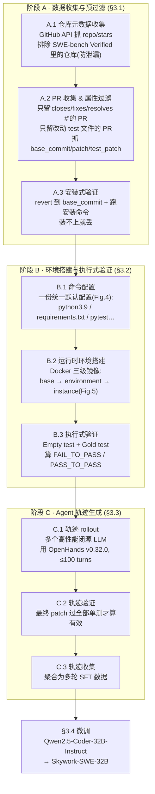

# Skywork-SWE：揭示大模型软件工程的『数据规模定律』

> **本篇属 agent-harness 库 E 组（编码 / SWE Agent 集成系统），是一篇偏『数据 / 训练』的前沿工作。**
> 它和本组的 OpenHands-SDK、CodeAct、KAT-Coder 不同：不去动脚手架（harness）内部，而是回答一个更靠 **model 侧**的问题——
> "开源 SWE agent 一直打不过闭源，是不是因为**训练数据太少太脏**？如果我能自动化地大规模造出**执行验证过**的数据，
> 性能会不会随数据量单调涨、涨到什么程度？" 结论是一条清晰的 **log-linear 数据规模定律**（Figure 1 上），
> 以及一个开源 32B SoTA。写作对齐本库 v1+v2+Θ 规范：公式前给直觉与符号、指标给定义式、数字标 §/Table/Fig 出处、
> Why 三连、`## ★ 对我们的启发`、Θ1–Θ5 分层与 regime 诚实。

---

## §1　TL;DR（一页讲清这篇在干嘛）

> 主讲提示：先抛"开源 SWE 弱在数据"这个诊断，再把三件事说清——① 一条自动造数据的管线；② 一条数据规模定律；③ 一个开源 32B SoTA。最后点明它在本库的坐标：这是从 **model 侧**给 `Agent=Model+Harness` 添的证据。

**一句话**：软件工程（SWE，software engineering——定位 bug、改源码、跑单测验证修复）已成为下一代 LLM agent 的关键试炼场，它同时压两种硬能力——**持续多轮问题求解**（>50 轮交互）和**长上下文依赖解析**（>32k tokens）（摘要 & §1）。但 SWE 训练数据的制备"臭名昭著地耗时"，重度依赖人工标注代码文件筛选、以及为跑单测而搭专用运行时环境，导致现有数据集大多只有"几千条 GitHub 来源实例"（摘要）。Skywork-SWE 做三件事：

1. **一条增量式、自动化的数据管线**（§3）：系统性地同时扩**量**（volume）与**多样性**（diversity），产出 **10,169** 条真实 Python 任务实例，来自 **2,531** 个不同 GitHub 仓库，每条都配一段自然语言任务 + 一个**专用运行时镜像**做自动单测验证（摘要 & Table 1/2）。
2. **一条数据规模定律**（Figure 1 上 & §4.2）：在 OpenHands v0.32.0 脚手架上微调，随训练轨迹数增加，模型 SWE 能力**持续单调上升、到 8,209 条仍无饱和迹象**——把 Kaplan/Hoffmann 的 scaling law 首次**明确验证到 SWE 语境**。
3. **一个开源 SoTA 模型 Skywork-SWE-32B**（§4）：基于 Qwen2.5-Coder-32B-Instruct 微调，在 **SWE-bench Verified** 上拿 **38.0% pass@1**（无 verifier / 无多次 rollout，N=1）；加 test-time scaling（TTS，N=8）到 **47.0%**——刷新 sub-32B 参数量级的开源 SoTA。

**属于 harness 的哪一层（Θ1）**：本篇是 **E 组（编码集成系统），横跨 T（工具/ACI，它用 OpenHands 的编辑器/shell/测试工具）与 L（控制循环，多轮 rollout 到 100 turns）**，但**发力点在 model 侧的训练数据**——它不改 harness 内部机制，而是"喂给同一套 harness 一个被大规模数据强化过的 model"。

**回扣全库论点（Θ2）**：本库中心命题是 `Agent = Model + Harness`。Skywork-SWE 是从 **Model 这一侧**补的证据——它证明"**同一个 harness（OpenHands v0.32.0 固定）下，只把 model 换成'吃过更多执行验证数据'的版本，分数就沿一条 log-linear 曲线爬**"（Figure 1 上）。它和 Harness-Bench"固定 model、换 harness"恰好是**同一等式的两条正交切片**：一个动 harness、一个动 model 的训练数据。

**够新够权威（Θ4）**：2025-06 预印本，工业界（昆仑万维 Skywork）出品，公开释放 32B 权重。它相对基石的推进：SWE-Gym/SWE-bench-extra 等前作要么规模小（~2k）、要么缺严格执行验证；本篇把"执行验证过的 SWE 训练数据"推到 **10,169 实例 / 2,531 仓库**（Table 1），并**第一次**明确画出 SWE 的数据规模定律。

> **一句话读出**：这篇的贡献不是"更聪明的 agent 循环"，而是"**把造数据这件脏活自动化，并证明数据本身能买到能力**"。对本库而言，它提醒我们——`Agent=Model+Harness` 里的 **Model 项，本身可以被'数据规模'这个旋钮往上推**。

---

## §2　问题与动机：开源 SWE agent 为什么一直打不过闭源？

> 主讲提示：这一页用 Why 三连的"问题层"。核心是三条数据侧缺口（§1 的三个 bullet），要一条条讲清"不解决会卡住什么"。

**Why（问题层）——不解决会卡住什么？**
SWE 任务与传统代码生成（写个函数解竞赛题）根本不同：它要在真实仓库里**跨多轮**用代码工具、**管长上下文**依赖来改真实 issue（§1、§2.1）。SWE-bench / SWE-bench Verified 已成为这一域的"标准考卷"（§2.1）。但要把开源模型训成能考高分的 SWE agent，卡点全在**数据**。论文在 §1 明确列了三条系统性缺口（对应 Table 1 的三列判据）：

1. **环境与验证支持不足（Insufficient environment and validation support）**：现有基准/数据集普遍**缺**"可配置可执行运行时环境"或"标准化的代码执行套件"来自动验证生成的补丁。例如 SWE-bench-extra、SWE-Fixer 要么完全没有可执行环境、要么缺严格测试验证，导致评测"不一致、不可复现"（§1）。
2. **高质量训练数据稀缺（Scarcity of high-quality training data）**：有些数据集规模大，但**极少**同时提供"经严格验证的高质量实例"。缺公开的验证过的数据，直接导致开源 LLM 在 SWE 上**持续跑输**闭源模型。如 SWE-Dev 缺严格验证过的训练实例、SWE-Gym 仓库覆盖有限（§1）。
3. **数据规模定律是否适用不明（Unclear applicability of data scaling laws）**：SWE 任务的训练数据量"明显小于其它 LLM 领域"（§1）。Kaplan(2020)/Hoffmann(2022) 的 scaling law 在**软件工程语境是否还成立，尚不确定**——回答这个问题对"该不该继续扩数据、怎么扩"是关键指导（§1）。

**Table 1（原文，SWE 数据集三维对照）** —— 这张表把缺口量化了：

| 数据集 | 可执行环境 | 验证过的单测 | 代码执行套件 | #Instances | #Repos |
|---|:---:|:---:|:---:|---:|---:|
| SWE-bench | ✓ | ✓ | ✗ | 2,294 | 12 |
| SWE-bench Lite | ✓ | ✓ | ✗ | 300 | 12 |
| SWE-bench Verified | ✓ | ✓ | ✗ | 500 | 12 |
| SWE-bench Extra | ✗ | ✗ | ✓ | 6,376 | 1,974 |
| SWE-Fixer | ✗ | ✗ | ✗ | 115,406 | 856 |
| SWE-Smith | ✓ | ✓ | ✗ | 50,137 | 128 |
| SWE-Gym | ✓ | ✓ | ✗ | 2,438 | 11 |
| **Skywork-SWE** | **✓** | **✓** | **✓** | **10,169** | **2,531** |

> **读出什么**：SWE-Fixer 虽有 11.5 万实例，但三列判据全"✗"（无环境、无验证、无执行套件）——**量大但不可执行验证**；SWE-bench 系列质量高但只有 12 个仓库、几百到两千实例——**质高但量与多样性都小**。Skywork-SWE 是表中**唯一三列全 ✓**、且在"量（10,169）× 多样性（2,531 仓库）"上都拉开的——它要同时买到"可执行验证 + 规模 + 多样性"。

> **Why（这为什么是 E 组该关心的）**：本库 E 组是"把 LLM 变成能改真实仓库的 SWE agent"的集成系统。前作大多在**harness 侧**发力（Agentless 砍流程、SWE-Agent 造 ACI）。Skywork-SWE 提出一个**正交的杠杆**——从 model 的训练数据侧发力。这条杠杆此前被"造数据太贵"堵住，本篇把它自动化了。

**背景补充：从"写函数"到"改仓库"的能力断层（§2.1）**。论文把代码类 LLM 分两支：
- **代码生成（Code Generation）**：从自然语言合成功能程序。函数级基准 HumanEval / MBPP 奠基，催生 AlphaCode / Code Llama / WizardCoder / StarCoder / DeepSeek-Coder；这些模型"已近传统代码生成的性能天花板"，于是又出 LiveCodeBench / BigCodeBench 这类"无污染、更难"的基准来续命（§2.1）。这一支的共同特征是**静态、单轮**。
- **软件工程（SWE）**：在真实仓库里定位 bug、改源码、按执行结果验证——**动态、多轮、交互式**。SWE-bench 及其 human-filtered 子集 SWE-bench Verified 是本域标准考卷（§2.1）。

> **读出什么（能力断层）**：从代码生成到 SWE 是一次**范式跃迁**（§2.2 原文 "a shift ... from static, single-turn code generation to dynamic, interactive coding workflows"）。跃迁的代价是**数据制备难度陡增**：单轮代码生成的数据只要"题+解"，而 SWE 数据要"题+仓库快照+可执行环境+验证测试+多轮解题轨迹"。这正是开源 SWE 一直缺数据的根因——本篇要攻的就是这个断层。

**§2.2 作者归纳的三条 harness 趋势**（本库最该记的一段）：SWE agent 已从"玩具级代码生成"走向"仓库级调试与构建编排"，作者总结出三条：
1. **精简管线（lean pipelines）** + 专用工具：Agentless 证明 *localise–repair–validate* 三步管线能超过许多复杂 agent 且成本低一个数量级；Moatless 主张"有效的 context retrieval 比复杂推理循环更是补丁生成的关键"（§2.2）。
2. **retrieval-aware 微调**：SWE-Fixer 把粗到细的文件检索与编辑解耦，训开源 LLM 高效补丁合成（§2.2）。
3. **rich ACI（丰富的 Agent-Computer Interface）**：SWE-Agent 把编辑器/shell/测试器形式化为结构化动作；OpenHands 提供事件驱动、可迭代编辑/跑 shell/浏览器的全栈仓库操作平台（§2.2）。

> **Why（本篇的选择）**：Skywork-SWE **选了第 (iii) 条的 OpenHands 作底座**（"因其强经验性能 + 开源社区广泛采用"，§2.2 末），但**没有在这三条趋势里再卷 harness**，而是加了**第四条正交杠杆——训练数据的大规模自动化生产**。这是它区别于全组其它 E 组论文的定位：**别人卷 harness，它卷数据**。

---

## §3　研究问题与核心 intention（形式化成一句话）

> 主讲提示：把三条缺口收成一个可检验的命题，并埋下"数据是可以自动化生产的"这个赌注。

**核心 intention（一句话）**：*能否用一条**全自动、执行感知（execution-aware）**的数据管线，大规模生产"经运行时单测验证过"的 SWE 训练实例与 agent 轨迹，从而（a）证明 SWE 存在数据规模定律，（b）仅靠数据把开源 32B 模型推到 SWE SoTA？*

**两个可检验的子假设**：
- **H1（scaling 假设）**：SWE 能力 $\text{Resolve Rate}$ 随训练轨迹数 $N_{\text{traj}}$ 单调上升，且在对数轴上近似线性（log-linear），在可及数据规模内不饱和。→ 由 Figure 1 上 + §4.2 检验。
- **H2（数据 > 复杂 agent 设计 假设）**：在固定 harness 下，"扩高质量数据"带来的增益可以**匹配甚至超过**"设计更复杂 agent"带来的增益。→ 由 §4.2 "Code agent frameworks matter more than model size" + "Data scaling laws" 两段 + Table 3 检验。

> **读出什么**：H2 是本篇最有 harness 味道的赌注——它其实在说"**在同一 harness 里，model 侧的数据规模，是与 harness 设计并列的一个能力来源**"。这正好把它接进 `Agent=Model+Harness`：Model 的强弱不是天生的，可以用数据买。

---

## §4　相关工作定位：站在谁肩上、和谁不同

> 主讲提示：一张对比表讲清 Skywork-SWE 相对三类前作的位置：SWE 数据集、SWE agent 框架、scaling law。

论文 §2 把领域分两块梳理：**代码任务的 LLM**（§2.1）与 **SWE 中的 code agent 框架**（§2.2）。抓关键定位：

| 维度 | 代表工作 | 它做了什么 | Skywork-SWE 的不同 |
|---|---|---|---|
| SWE 数据集 | SWE-Gym（§2.1）| 可执行环境 + 单测，但规模 ~2k、仓库有限 | 同样执行验证，但推到 10,169 / 2,531 仓库 |
| SWE 数据集 | SWE-bench-extra / SWE-Fixer / SWE-Dev / SWE-Smith | 或省环境、或缺严格验证、或注入合成 bug（§2.1）| **三列判据全 ✓**（Table 1），真实 PR 来源 + 执行验证 |
| SWE agent 框架 | OpenHands（§2.2）| 开源、事件驱动、迭代编辑/跑 shell/浏览器（rich ACI）| **采用**它作 harness（不改内部），发力在数据 |
| SWE agent 框架 | Agentless（§2.2）| localise→repair→validate 精简管线，反而超过许多复杂 agent | 佐证 H2："精简/数据 > 复杂 planning" |
| SWE agent 框架 | Moatless / SWE-Fixer / SWE-Agent（§2.2）| 分别押注 context retrieval / retrieval-aware 微调 / rich ACI | Skywork 押注**训练数据规模** |
| scaling law | Kaplan 2020 / Hoffmann 2022（§2.1）| 通用 LLM 的 loss-compute/data 幂律 | **首次**把 data scaling 明确验到 SWE 的 resolve-rate |

> **读出什么**：§2.2 作者自己总结出三条趋势——(i) 精简管线 + 专用工具（Agentless/Moatless）、(ii) retrieval-aware 微调（SWE-Fixer）、(iii) rich ACI 全栈操作（OpenHands/SWE-Agent）。Skywork-SWE **选了 (iii) 的 OpenHands 作底座**（因其经验性能强、社区采用广，§2.2 末），然后**在这三条之外加了第四条：训练数据的大规模自动化生产**。

---

## §5　方法总览（big picture）：三阶段数据管线一图流

> 主讲提示：这页给全景。强调"三阶段是一条**漏斗**"——从 15 万仓库层层过滤到 1 万实例、再到 8 千验证轨迹，每一步都靠**执行**而非人工把关。

Skywork-SWE 的方法核心是**一条三阶段增量式数据管线**（§3、Figure 2），产出物是"数据集 + 轨迹"，最后拿去微调（§3.4）。三阶段：



**这条漏斗的量级（Figure 3 的 Sankey 流）**——直觉先行：**执行是最狠的过滤器**。
- 起点：**151,472** 个纠正后的仓库元数据 → 缺必填字段的占 **94.41%（143,000）**被丢，只剩 **8,472** 个仓库有全字段（§3.1 & Figure 3）。
- PR 收集后得 **146,568** 条初始任务实例（§3.1）。
- **安装式验证**：revert 到 base_commit 跑安装命令，装不上的 **123,179（84.04%）**被丢，剩 **23,389** 条（§3.1 & Figure 3）。
- **执行式验证**：在这 23,389 里，成功安装后再跑单测，最终"至少有一个 FAIL_TO_PASS 测试"的只剩 **10,169**（Test-Passed 占初始的 6.94%），另 13,220（9.02%）Test-Failed 被丢（§3.2.3 & Figure 3）。

> **Why（设计层）——为什么要"执行式验证"而不是像 SWE-Fixer 那样只靠启发式留下 11 万条？**
> 朴素做法：用规则/相似度过滤 PR，攒尽量多实例（SWE-Fixer 走这条，得 115,406 条但 Table 1 三列全 ✗）。→ 会因为**没有"补丁真的修好了 bug"的执行证据**，混入大量噪声实例，训出来的模型学到的是"看起来像修复"而非"真能通过测试"。Skywork-SWE 改用**执行式验证**（§3.2.3）：一条实例必须能装上、且存在"打补丁前失败、打补丁后通过"的测试，才留下——代价是**保留率极低（6.94%）、算力昂贵**（要为每条实例搭 Docker 环境跑测试），换来的是**每条数据都有可验证的正确性证据**。这与 auto-research 库"独立验证收口"是同一种警惕：**只信执行过的证据，不信看起来对**。

---

## §6　符号与术语表

> 主讲提示：后面 §7–§9 会反复用这些记号，先一次性定义清楚。

| 记号 / 术语 | 定义 |
|---|---|
| `base_commit` | 仓库在"解决 issue 的 PR 被应用之前"的 HEAD commit 哈希（§3.1）|
| `patch`（gold patch）| 解决 issue 的 PR 生成的**标准修复补丁**（§3.1）|
| `test_patch` | 解决 PR 里附带的**测试文件补丁**（§3.1）|
| **Empty test** | 只把 `test_patch` 应用到 `base_commit` 后跑测试；失败记 `empty-FAIL`、通过记 `empty-PASS`（§3.2.3）|
| **Gold test** | 把 `test_patch` **和** `patch` 都应用后再跑测试；失败记 `gold-FAIL`、通过记 `gold-PASS`（§3.2.3）|
| **FAIL_TO_PASS** | 在 Empty test 里失败（`empty-FAIL`）、但在 Gold test 里通过（`gold-PASS`）的测试集合——即"这条补丁修好的测试"（§3.2.3）|
| **PASS_TO_PASS** | 在两个阶段都通过的测试集合——即"补丁没搞坏的既有测试"（§3.2.3）|
| $N_{\text{traj}}$ | 训练用的 agent 轨迹数量（Figure 1 上的横轴、§4.2 的自变量）|
| **Resolve Rate（解决率）** | 评测指标：在 SWE-bench Verified 500 题上，agent 最终补丁**通过该题全部指定单测**的题目占比（§4.1 Benchmark）|
| **pass@1** | 每题只做**一次尝试**（N=1，single rollout，无 verifier）时的解决率（摘要 & §4.1）|
| **TTS（test-time scaling）** | 测试时扩算力：每题生成 N=8 条独立 rollout，用 OpenHands critic 选最高分那条（§4.1）|
| **turn（rollout turn）** | agent 与环境的一轮交互（一次"思考+动作+观察"）；本文轨迹每条 ≤100 turns（§3.3、§4.1）|

---

## §7　方法细节 · 阶段 A/B：把"造一条可执行验证的实例"自动化

> 主讲提示：这两阶段是全篇工程含量最高处。要讲清两件事：① 统一默认配置怎么把"每仓库手配环境"变成"一份配置打天下"；② FAIL_TO_PASS 的定义式，这是判"实例有效"的机器判据。

### 7.1 阶段 A：收集与预过滤（§3.1）

三步（对应 Figure 2 左列 & Figure 3 前三格）：
- **A.1 仓库元数据收集**：用 GitHub API 抓 `repo`（owner/name）与 `stars`，**优先高 star 仓库**；**关键防泄漏**——"排除已在 SWE-bench Verified 里的仓库"（§3.1 原文斜体强调 *To avoid data leakage*）。151,472 → 有全字段的 8,472（§3.1）。
- **A.2 PR 收集与属性过滤**：沿用 SWE-bench 做法，只留"用 closes/fixes/resolves #… 关键词链接并解决某 issue"的**已 merge PR**；且**只留改动 test 相关文件（路径/文件名含 "test"/"testing"）的 PR**。抽取 `base_commit / patch / test_patch`。得 146,568 条初始实例（§3.1）。
- **A.3 安装式验证**：把仓库 revert 到 `base_commit`、在 base 环境跑预定义安装命令，**装不上就丢**（123,179 被丢，剩 23,389）（§3.1）。

> **Why（设计层）——为什么"只留改了 test 文件的 PR"？**
> 朴素做法：留下所有修 bug 的 PR。→ 但没有测试文件变更的 PR，**无法构造 FAIL_TO_PASS 判据**（没有"新增/修改的测试"来证明 bug 被修好）。只留改 test 的 PR，等于**要求每条实例自带可执行的验收标准**——这是后面执行式验证能跑起来的前提。

### 7.2 阶段 B：统一默认配置 + Docker 三级镜像 + 执行式验证（§3.2）

**(1) 命令配置（§3.2.1，Figure 4）**——一份统一默认配置打天下。直觉：SWE-bench 传统做法要**给每个仓库手写单独配置命令**，因为不同仓库环境天差地别，"资源密集且难扩"（§3.2.1）。Skywork-SWE 借鉴 SWE-bench-extra，设计一份**通用默认配置**（Figure 4 的 JSON），最大化跨仓库兼容：

```json
{
  "python": "3.9",
  "packages": "requirements.txt",
  "pip_packages": ["pytest", "hypothesis", "mock", "setuptools", ...],
  "install": "pip install -e . || true; pip install -e .[test] ...",
  "pre_install": "apt update && apt install -y make gcc g++ pkg-config",
  "test_cmd": "pytest --no-header -rA --tb=no ..."
}
```
它固定 Python 3.9、装 make/gcc/g++/pkg-config 等系统包、从 requirements.txt 装依赖并补 pytest/hypothesis/mock/setuptools；为兼容命名差异，还给 `[test]/[tests]/[dev]` 等可选 extra 留了 fallback 安装命令；测试统一用禁用缓存、抑制 deprecation 警告的 pytest 命令以求可复现（§3.2.1）。

**(2) Docker 三级镜像（§3.2.2，Figure 5）**——增量构建、复用基镜像省算力。三级层次：
- **base-level**：Ubuntu 22.04 + `linux/x86_64`，装 build-essential/git/wget + Miniconda + conda-forge（Figure 5）。
- **environment-level**：在 base 上跑 `setup_env.sh`——`conda create -n testbed python=3.9`、装 requirements.txt + pytest/mock（Figure 5）。
- **instance-level**：在 env 上跑 `setup_repo.sh`——`git clone` + `git reset --hard <commit_id>` + 装系统依赖 + `pip install -e .`（可带 extra）（Figure 5）。

> **Why（设计层）——为什么要三级镜像而不是每实例从头 build？**
> 朴素做法：每条实例独立 build 一个完整镜像。→ 会**大量重复**装 Ubuntu/conda/python 这些公共层，磁盘与时间双爆炸（§5 "Runtime Environment Reuse" 提到 500 题 Verified 的镜像就要 ~1,000 GB）。三级镜像让 base/env 层**被大量实例复用**，只有 instance 层随仓库变——这是"能大规模跑起来"的工程关键。数据集最终每镜像约 1.2 GB、总存储约 **11.9 TB**（§3.2.4）。

**(3) 执行式验证（§3.2.3）——FAIL_TO_PASS 的定义式**。这是判"实例是否有效"的机器判据，先给直觉：一条好实例，必须存在"**打补丁前挂、打补丁后过**"的测试，才能证明"这个补丁确实修好了某个真实坏掉的行为"。

记号（先定义）：设 $T$ 为该实例测试套件里的测试集合；对测试 $t\in T$，$\text{empty}(t)\in\{\text{FAIL},\text{PASS}\}$ 表示只打 `test_patch` 后 $t$ 的结果，$\text{gold}(t)$ 表示同时打 `test_patch`+`patch` 后 $t$ 的结果。

$$
\text{FAIL\_TO\_PASS} = \{\, t\in T \mid \text{empty}(t)=\text{FAIL} \ \wedge\ \text{gold}(t)=\text{PASS} \,\}
$$
$$
\text{PASS\_TO\_PASS} = \{\, t\in T \mid \text{empty}(t)=\text{PASS} \ \wedge\ \text{gold}(t)=\text{PASS} \,\}
$$

**保留判据**：仅保留 $|\text{FAIL\_TO\_PASS}|\ge 1$ 的实例——即"该补丁至少解决了一个先前失败的测试用例、且真的纠正了失败行为"（§3.2.3 原文）。23,389 候选里 13,220 被这一步刷掉，**最终 10,169 条**（§3.2.3 & Figure 3）。

> **读出什么**：FAIL_TO_PASS 是整条管线的"验收闸门"。它把"补丁质量"这个模糊概念，硬化成一个**可自动判定**的集合非空条件。PASS_TO_PASS 则是"回归安全网"——保证补丁没把原来好的测试搞坏。这两个集合也正是 SWE-bench 评测判"解决"的依据，所以训练数据与评测标准**同源**。

### 7.3 数据集统计画像（§3.2.4，Table 2 & Figures 6/7/8）

**Table 2（原文，per-instance 平均，除 Size 与 #Hints 外）** 节选对照：

| 类别 | 指标 | Skywork-SWE | SWE-Gym Lite | SWE-bench Verified |
|---|---|---:|---:|---:|
| Size | # Instances | **10,169** | 230 | 500 |
| Size | # Repos | **2,531** | 11 | 12 |
| Issue Text | # Words | 140.3 | 186.2 | 189.3 |
| Hints Text | # Words / # Hints | 62.2 / 2,459 | 151.4 / 155 | 151.5 / 338 |
| Gold Patch | # Files / Func / Hunks / Lines edited | 2.5 / 2.3 / 6.0 / 74.2 | 1.0 / 1.4 / 1.6 / 10.6 | 1.2 / 2.1 / 2.4 / 14.3 |
| Tests | # Fail→Pass / Pass→Pass / Total | 10.2 / 86.2 / 96.4 | 2.0 / 99.9 / 101.9 | 3.0 / 120.3 / 123.3 |

配套分布（用于讲"多样性 + 复杂度"）：
- **规模**：10,169 实例是 SWE-Gym Lite/Verified 的 **20 倍以上**；覆盖 **2,500+ 仓库**（前作最多 12 个）（§3.2.4 Scale）。
- **多样性 & 长尾**（Figure 6 词云 + Figure 7a）：~450 个仓库（约 4.4%）贡献 66%+ 实例，其余 9,719 个仓库贡献 <34%；9,000+ 仓库每个 <3 条实例——**长尾极显著**（§3.2.4 Diversity）。热门仓库如 pydantic/dvc/sqlglot/pennylane（Figure 6）。
- **时间分布**（Figure 7b）：2013–2025，2020 峰值 1,678 条，2021–2023 每年 >1,500；**89.5%+ 实例来自 2018–2024**——强偏近期开发活动（§3.2.4 Temporal）。
- **编辑复杂度**（Figure 8）：41.6% 实例只改单文件、但 80%+ 改动 ≤3 文件；64.7% 改动 <2 个函数；~50% 是 1–3 个 hunk；70.3% 改动 <50 行——**"简洁修改与非平凡修改的混合"**（§3.2.4 Edit Complexity）。注意 Skywork 的 gold patch 平均改动（2.5 文件 / 74.2 行）**明显比 Verified（1.2 / 14.3）更大**，即结构更丰富。

> **读出什么**：Table 2 有个反直觉点——Skywork-SWE 的 **Issue Text（140.3 词）与 Hints（62.2 词）都比 Verified 更短**，但 **gold patch 改动更大（74.2 行 vs 14.3）**。这意味着它的实例"**描述更省、但修复更重**"，对模型的"从少信息定位并做大改"能力要求更高——这与它作为**训练**数据（要覆盖难例）而非精挑评测集的定位一致。

> **Why（设计层）——为什么"多样性/长尾"对 scaling 至关重要，而不只是"量大"？**
> 朴素想法：数据规模定律只看"轨迹数"这个标量，那把同 12 个仓库刷到 1 万条不也行？→ 会因为**仓库多样性不足**导致模型过拟合到少数几个仓库的代码风格/依赖习惯，泛化到新仓库时崩掉（这正是 §5 "Data Leakage" 警告的"同仓库训练+测试虚高"的反面）。Skywork 刻意做**长尾覆盖**（Figure 7a：9,000+ 仓库各 <3 条实例），让模型见到"**尽可能多的不同仓库结构**"而非"同一仓库的很多变体"。→ 机制上，这才是 §9.1 的 log-linear 曲线**不饱和**的深层原因：每新增一批来自新仓库的轨迹，都在给模型补一块**没见过的分布**，边际信息量不衰减。**"数据规模定律"在 SWE 里其实是"数据规模 × 多样性"的联合定律**——原文虽只画了轨迹数单轴（Figure 1），但 §3.2.4 的长尾设计是这条曲线成立的隐含前提。

> **时间偏近期的隐含代价**：89.5% 实例来自 2018–2024（§3.2.4）虽贴合"当前开发实践"，但也意味着模型对**老代码库/老 API 风格**的覆盖弱；且近期仓库更可能与闭源模型的预训练数据**时间重叠**，潜在污染风险更高（§5 也提到泄漏隐患）。这是"偏近期"这把双刃剑的另一面（原文未量化此风险）。

---

## §8　方法细节 · 阶段 C + 训练：从"验证过的实例"到"验证过的轨迹"再到模型

> 主讲提示：讲清"数据 vs 轨迹"两级验证——实例验证保证"题是好题"，轨迹验证保证"解题过程真的解出来了"。再给训练超参。

### 8.1 阶段 C：Agent 轨迹生成（§3.3）

三步（Figure 2 右列）：
- **C.1 轨迹 rollout**：用**多个高性能闭源 LLM**（见 Table 4）在每条实例上用 **OpenHands v0.32.0** 跑 agent，**每条轨迹 ≤100 rollout turns**（§3.3）。
- **C.2 轨迹验证**：把轨迹**最终 patch** 应用回实例、跑测试套件，**只有全部测试通过**才算有效轨迹（§3.3）。
- **C.3 轨迹收集**：把验证过的轨迹聚合为**多轮 SFT 数据**，只留最终 patch 过全部测试的（§3.3）。

**Table 4（原文，各闭源 LLM 的 rollout 产出）** 节选——**造数据本身效率很低**：

| Model | Temperature | 成功轨迹 | Resolve Rate (%) |
|---|---:|---:|---:|
| Gemini-2.0-Flash | 0.0 / 1.0 | 482 / 87 | 5.59 / 3.63 |
| Qwen-2.5-Max | 0.0 / 0.5 / 1.0 | 717 / 153 / 520 | 8.29 / 6.38 / 8.32 |
| Doubao-1.5-Thinking-Pro | – | 23 | 10.60 |
| DeepSeek-V3 | 0.0 / 1.0 | 1071 / 760 | 12.92 / 12.18 |
| DeepSeek-V3-0324 | 0.0 / 1.0 | 684 / 631 | 17.49 / 17.10 |
| o3-mini | – | 1908 | 15.94 |
| GPT-4.1 | 0.0 | 142 | 18.54 |
| Gemini-2.5-Pro | 0.0 | 1269 | 20.23 |
| **(累计) Total** | | **8,447** | |

累计 **8,447** 条成功轨迹（§3.3 说 "over 8,000"）；即便最强的 Gemini-2.5-Pro 在 Skywork-SWE 实例上 resolve rate 也只有 **20.23%**（§4.3 "Data collection efficiency is low"）——作者归因于"GitHub 仓库多样性极大 + 单测数量多"，所以"**跑 SWE 任务本身很难，数据收集效率相对低**"（§4.3）。

> **Why（设计层）——为什么用多个闭源 LLM 而不是单一最强模型来造轨迹？**
> 朴素做法：只用最强模型（Gemini-2.5-Pro）造全部轨迹。→ 但单模型 resolve rate 仅 20%，且**风格单一**，覆盖的解题路径窄。用多模型（从 Gemini-Flash 到 o3-mini 到 DeepSeek）**并联造数据**，既提高总产出（各自解出不同子集），又增加轨迹**多样性**——这对 SFT 数据的泛化有利。代价：不同模型质量参差，需靠 C.2 的执行验证统一把关。

### 8.2 训练配置（§3.4 & §4.1）

- **基座**：Qwen2.5-Coder-32B-Instruct（§3.4）。
- **数据**：轨迹经**格式一致性过滤**后从 8,447 降到 **8,209** 条，作为多轮长上下文 SFT 数据（§3.4）。
- **框架 & 算力**：TorchTune，**8× NVIDIA H800，12 小时**（§4.1）。
- **超参**：AdamW，weight decay 0.01，cosine LR schedule，**峰值 LR 5e-5，3 epochs**（§4.1）。
- **上下文长度**：模型支持到 **32,768 tokens**；作者注意到交互轮数 >50 时轨迹会超 32K 限制，未来需 sequence parallelism（VeRL / 360-LLaMA-Factory）扩到 128K（§5 "Training the Agent Model"）。
- **未做 RL**：作者明确说 RL 是"有前景的方向"，但需在运行时镜像里做实例级验证拿 reward，"这一工程密集的任务留给未来"（§3.4）。

> **读出什么**：训练侧极其"朴素"——纯 SFT、8 卡 12 小时、无 RL、无花哨技巧。**所有的力气都花在数据管线上**。这正是本篇的论点：**能力主要来自数据，而非训练技巧**。

---

## §9　主结果 · 核心：数据规模定律 + 开源 SoTA

> 主讲提示：全场最该停留的两张图表——Figure 1 上（scaling law）与 Table 3（SoTA 对比）。先讲曲线的形状与"无饱和"，再讲 38%/47% 的位置。

### 9.1 数据规模定律（Figure 1 上 & §4.2 "Data scaling laws"）

**直觉**：如果 SWE 能力真随数据涨，那把"训练轨迹数"当横轴、"SWE-bench Verified 解决率"当纵轴，点应连成一条向上的线；若在对数横轴上近似直线，就是 log-linear scaling。

**结果（Figure 1 上，SWE-GYM 红点 + Skywork-SWE 红星）**：解决率随 $N_{\text{traj}}$ 呈**清晰的 log-linear 上升**，几个关键点（Figure 1 标注）：

| $N_{\text{traj}}$（训练轨迹数）| ~0 | 125 | 250 | 500 | 1000 | 2000 | 4000 | 6000 | 8209 |
|---|---:|---:|---:|---:|---:|---:|---:|---:|---:|
| Resolve Rate (%) | 6.4 | 10.8 | 16.1 | 18.4 | 20.8 | 25.2 | 28.8 | 32.0 | **38.0** |

且**在 8,209 条仍无饱和迹象**（摘要 & Figure 1 caption "no signs of saturation"）。几个横线基准（Figure 1）：SWE-Dev-32B=25.2、OpenHands-LM-32B-v0.1=31.6、SWE-Agent-LM-32B=32.2——Skywork-SWE 在 $N_{\text{traj}}=2000$ 就超 SWE-Dev-32B、6000 超 OpenHands-LM-v0.1、8000 超 SWE-Agent-LM-32B（§4.2）。

**把"log-linear 趋势"写成式子**（直觉先行）：原文只用文字与图描述这条趋势为 "clear log-linear trend"（§4.2），未给出拟合公式。为便于组会讨论，这里把它形式化——直觉是"解决率随**数据量的对数**线性增长"，即数据量每翻一番、解决率涨一个固定增量。

记号（先定义）：$N_{\text{traj}}$ = 训练轨迹数（自变量）；$R(N_{\text{traj}})$ = 对应的 SWE-bench Verified 解决率（%）；$a$ = 斜率（每 e 倍数据的涨幅）；$b$ = 截距。则 Figure 1 上的趋势可写作：

$$
R(N_{\text{traj}}) \;\approx\; a\,\log N_{\text{traj}} + b
$$

用原文标注点粗估斜率（**本文作者的估算，非原文给出**）：从 $N_{\text{traj}}=1000$（20.8%）到 $8209$（38.0%），$\Delta R \approx 17.2$ 分、$\log(8209/1000)\approx 2.1$，故 $a \approx 8.2$ 分/e倍 ≈ **约每翻一番数据涨 ~5.7 分**。

> **读出什么**：这个斜率是"**买能力的汇率**"——在当前 regime 下，数据每翻一番约值 5.7 分解决率。它把 §2 第三条缺口（H1）从"定律成不成立"升级为"**定律的斜率是多少、还能爬多久**"。当然这只是局部拟合，能否外推见 §12/§14 的批判（成本非线性、蒸馏天花板）。

> **Why（结果层）——为什么会得到这条 log-linear 线，它意味着什么？**
> 机制上，这印证了 Kaplan/Hoffmann 幂律**在 SWE 语境同样成立**（§4.2 引这两篇）：高质量、执行验证过的多样轨迹越多，模型见过的"真实仓库 × 真实修复模式"覆盖越广，泛化越好。"无饱和"是最有价值的信号——它意味着**继续扩数据仍有明确回报**，把"该不该继续投钱造数据"从直觉变成了有斜率的曲线。这直接回答了 §2 的第三条缺口（H1 成立）。

### 9.2 开源 SoTA（Table 3 & Figure 1 下 & §4.2）

**Table 3（原文，SWE-bench Verified 解决率）** 关键行：

| 分组 | Approach | #Params | Framework | Model | Resolve Rate (%) |
|---|---|---:|---|---|---:|
| 闭源 | OpenHands + Claude v3.7 | – | OpenHands | Claude-3-7-Sonnet | **56.0** |
| 闭源 | OpenHands + Claude v3.5 | – | OpenHands | Claude-3-5-Sonnet | 46.0 |
| 开源 | Devstral | 24B | OpenHands | Mistral-Small-3.1-24B | 46.8 |
| 开源 | OpenHands + Qwen（基座裸跑）| 32B | OpenHands | Qwen2.5-Coder-32B-Instruct | **6.4** |
| 开源 | SWE-Gym-32B | 32B | OpenHands | Qwen2.5-Coder-32B-Instruct | 20.6 |
| 开源 | SWE-Dev-32B | 32B | OpenHands | Qwen2.5-Coder-32B-Instruct | 36.6 |
| 开源 | SWE-smith-LM-32B | 32B | SWE-Agent | Qwen2.5-Coder-32B-Instruct | 40.2 |
| 开源 | OpenHands + DeepSeek-V3-0324 | 671B | OpenHands | DeepSeek-V3-0324 | 38.8 |
| **Ours** | **Skywork-SWE-32B** | 32B | OpenHands | Qwen2.5-Coder-32B-Instruct | **38.0** |
| **Ours** | **Skywork-SWE-32B (+ TTS)** | 32B | OpenHands | Qwen2.5-Coder-32B-Instruct | **47.0** |

**读数**：
- **同基座对比最关键**：裸的 Qwen2.5-Coder-32B-Instruct 在 OpenHands 上只有 **6.4%**；Skywork 的数据把它推到 **38.0%**（+31.6 分，纯靠数据+SFT）。同基座下比 SWE-smith-LM-32B **高 6.8 分**（§4.2 原文）。
- **加 TTS 到 47.0%**——刷新 32B 量级开源 SoTA，且**超过 671B 的 DeepSeek-V3-0324（38.8%）**（Table 3 & Figure 1 下）。
- **模型大小不是主因（H2 证据）**：72B 的 Qwen2.5-72B 只有 30.2%、671B 的 DeepSeek-V3 也就 38.8%——"**模型大小并非 SWE 表现的主导因素**；任务专用的高质量训练数据 + 精心设计的 code agent 框架**更关键**"（§4.2 "Code agent frameworks matter more than model size"）。

> **读出什么（Θ2）**：Table 3 是从 **model 侧**给 `Agent=Model+Harness` 的实锤——**harness 固定为 OpenHands，只把 model 从'裸 Qwen'换成'吃过 8,209 条验证数据的 Skywork'，6.4%→38.0%**。这与 Harness-Bench"固定 model 换 harness 摆 23.8 分"正交互补：**能力可以从两侧买——训 model 的数据，或换更好的 harness**。而 §4.2 那句"code agent frameworks matter more than model size"甚至直接把 harness 抬到和 model-size 并列——这是本库论点在一篇**数据/训练**论文里的独立佐证。

**深挖 H2：为什么"framework/数据 > model size"？把 Table 3 竖着读三组对照**：

| 对照 | 低分方 | 高分方 | 差异变量 | 结论 |
|---|---|---|---|---|
| 同基座、只变数据 | 裸 Qwen2.5-Coder-32B（6.4）| Skywork-SWE-32B（38.0）| **训练数据** | 数据 +31.6 分 |
| 同基座、不同数据配方 | SWE-Gym-32B（20.6）、SWE-Dev-32B（36.6）、SWE-smith-LM-32B（40.2）| Skywork-SWE-32B（38.0）| 数据规模/质量 + harness（SWE-smith 用 SWE-Agent 而非 OpenHands）| 数据配方决定名次，同量级内差 ~20 分 |
| 只变模型大小 | Qwen2.5-72B（30.2）、DeepSeek-V3-671B（38.8）| Skywork-SWE-32B+TTS（47.0）| **参数量 vs 数据+TTS** | 32B+好数据+TTS > 671B 裸跑 |

> **Why（结果层）——机制上为什么参数量不主导？** SWE 任务的瓶颈不在"模型有多少知识/参数容量"，而在"**是否见过足够多真实仓库的修复模式、并学会在多轮交互里把推理落成能过测试的补丁**"。参数量买的是前者（容量），而 SWE 缺的是后者（**执行对齐的经验**）。DeepSeek-V3-671B 参数远超 32B，但没在"执行验证过的 SWE 轨迹"上专门训过，所以 38.8% 也就和 32B 的 Skywork（38.0%）打平——**多出的 20 倍参数没换来 SWE 的边际能力**。这与 §11 的核心概念呼应：SWE 能力是"执行对齐"能力，靠**对齐数据**而非**参数容量**来买。这也解释了 §4.2 的判断"model size alone is not the dominant factor"。

> **一句话（对本库论点）**：这张竖读表把 `Agent=Model+Harness` 里的 Model 项进一步拆成 **`Model = 基座容量 × SWE 对齐数据`**——而在 SWE 这个 regime，**对齐数据的边际回报远高于基座容量**。这是本篇最反直觉、也最该带回组会的结论。

### 9.3 Test-time scaling 的两个旋钮（§4.3 & Figure 9）

作者拆了 TTS 的两条子曲线：
- **Best-of-N 采样**（Figure 9a）：N=1/2/4/6/8 → 解决率 **38.0 / 42.4 / 43.2 / 45.2 / 47.0**。更多独立 rollout 缓解输出方差、把模型潜在推理能力"解锁"出来（§4.3，引 Brown 2024 "large language monkeys"）。
- **最大 rollout 轮数**（Figure 9b）：10/25/50/75/100 turns → **28.2 / 32.8 / 35.4 / 37.0 / 38.0**。早期涨得猛（10→25 涨 4.6 分），后期边际递减（75→100 只涨 1.0 分）。**SWE 任务本质需要多轮交互**，所以延长交互预算收益显著（§4.3）。

> **读出什么**：这两条曲线是**推理时**（L 层，控制循环的 rollout 预算）的 scaling，与 §9.1 的**训练时**数据 scaling 相互独立、可叠加——最终 38.0（训练 scaling 到头）→ 47.0（叠加推理 scaling）。对我们 harness 的直接含义：**turn 预算与 N 都是可调的 harness 旋钮**，且各有明确的边际收益曲线（见 Inspires-Us）。

---

## §10　消融与分析：数据收集效率、TTS 拆解、时间序采样

> 主讲提示：本篇没有传统"去掉某模块掉几分"式消融（因为方法是数据管线不是模型结构），它的"分析"集中在 §4.3——把它当作"对管线与 TTS 的敏感性分析"来讲。

- **数据收集效率低（§4.3）**：最强闭源模型在自家实例上 resolve rate 也仅 20.23%（Gemini-2.5-Pro），归因于"仓库多样性极大 + 单测多"。→ 这解释了为何 10,169 实例只造出 8,447 条成功轨迹——**造数据的瓶颈是任务本身难，不是管线漏**。
- **时间序采样偏差（Table 4 caption）**：数据集是**按时间构造**的，部分轨迹来自更早的子集——即不同模型看到的实例子集不完全同分布，比较 resolve rate 时需留意（Table 4 caption 明说）。
- **TTS 双旋钮拆解**（§9.3 已述）：Best-of-N 与 max-turns 各自单调、后者边际递减。

> **批判补充（方法学）**：本篇缺一个关键消融——**"数据质量 vs 数据数量"的解耦**。它证明了"更多验证数据→更高分"，但没做"同样数量、去掉执行验证 vs 保留执行验证"的对照，因此"执行验证到底贡献了几分"无法从曲线里读出（原文未给出该消融）。这是它下一步最该补的实验（见 §12 与 Inspires-Us c）。

---

## §10.5　核心抽象：execution-grounded data 是 SWE 的"第一瓶颈"

> 主讲提示：这页把全篇最有迁移价值的一句话抽出来讲透——它藏在 §6 结论里，是本篇真正的"命题"。

论文在 §6 用一句话点破了它的世界观（原文）：*"high-quality, **execution-grounded** data remain the primary bottleneck for SWE code agents, and ... systematic data expansion can substantially close the gap with proprietary LLMs."* 把这句话拆开，是三个层层递进的判断：

1. **瓶颈不在模型、不在 harness，而在"执行接地的数据"**（execution-grounded data）——即每条数据的正确性都由**运行时执行**（跑单测）背书，而非人工标注或启发式相似度。这是它区别于 SWE-Fixer（11 万条但无执行验证）的本质。
2. **系统性扩这类数据，能实质性缩小与闭源的差距**——由 §9 的 6.4→38.0→47.0（超 671B DeepSeek）实证。
3. **执行环境本身就是数据的一部分**——没有可复现的 Docker 环境，就没有"执行接地"（§3.2）。所以本篇一半的工程量花在**造环境**（三级镜像、统一配置）而非造模型。

**为什么"execution-grounded"比"more data"更本质？** 对照两条路线：

| 路线 | 代表 | 数据正确性来源 | 风险 |
|---|---|---|---|
| **量优先** | SWE-Fixer（115,406 条）| 启发式/相似度过滤 | 混入"看起来像修复"的噪声，模型学到伪相关 |
| **执行接地优先** | Skywork-SWE（10,169 条）| **运行时跑测试（FAIL_TO_PASS）** | 保留率极低（6.94%）、算力昂贵 |

> **Why（设计层，为什么值得为执行接地付 84% 的丢弃率）**：朴素想法是"数据越多越好，先攒 11 万条再说"。→ 但 SWE 的失败模式恰恰是"**推理看起来对、补丁其实没修好**"（这正是 Harness-Bench §10 里 contract/tool-recovery 类失败的根源）。若训练数据里混入这类伪修复，模型会**放大**这个失败模式。Skywork 宁可把保留率压到 6.94%，也要保证每条数据"**打补丁前挂、打补丁后过**"有执行证据——用**数据的正确性密度**换掉**数据的绝对数量**。这与本库反复出现的收口逻辑一致：**只信执行过的证据**（auto-research 的 m9.8 独立验证、Harness-Bench 的 Security 硬闸门，同一种警惕的不同化身）。

> **读出什么（迁移价值）**：把"execution-grounded"这个词换成任何领域的"可执行验收判据"，本篇的方法论就能平移——研究 agent 的"接地"是"可复现的数值/断言"，数据分析 agent 的"接地"是"可重跑的查询结果"。**凡是能给数据配一个'机器可判的执行验收'的领域，都能照 Skywork 的漏斗造高质量数据。** 这是本篇给全库最通用的一课。

---

## §11　实验设置汇总（setting / metrics / params 一次性列全）

> 主讲提示：这页把散在各处的设置收拢，方便复现讨论。

- **评测基准**：SWE-bench Verified（500 题，§4.1 Benchmark），指标 = **Resolve Rate**（补丁通过该题全部指定单测的题目占比）。
- **harness**：OpenHands **v0.32.0**，最大 **100** 交互轮（§4.1）。作者强调 OpenHands **不同版本**的 system prompt / 执行管线差异会带来"实质性能差异"，故推荐固定用最新版评 SWE-bench（§5 "Code Agent Framework"）。
- **两种推理设置**：Skywork-SWE-32B（N=1，SWE-Bench 推荐设置）；Skywork-SWE-32B (+TTS)（N=8，用 OpenHands critic 选最高分轨迹）（§4.1）。
- **评测口径**（Figure 1 caption 强调）：**全部 in-house 评测、每题单次尝试、无 verifier / 无多 rollout**（除标 TTS 者）——即数字是**保守**口径。
- **baseline 池**（Table 3）：闭源（GPT-4o/4.1、Gemini-2.0-Flash、Qwen-2.5-Max、Claude-3.5/3.7、o1/o3-mini 等 + AutoCodeRover/Agentless/Moatless 等框架）；开源（SWE-Gym/SWE-Dev/SWE-Fixer/SWE-smith/Devstral/DeepSeek-V3/R1 等）。
- **训练**：见 §8.2（8×H800 / 12h / AdamW / LR 5e-5 / 3 epoch / 8,209 轨迹）。
- **数据存储**：每 Docker 镜像 ~1.2 GB，总 ~**11.9 TB**（§3.2.4）；500 题 Verified 的镜像即 ~1,000 GB（§5）。

---

## §12　局限与批判（§5 discussion + 我的补充）

> 主讲提示：这页保持诚实。区分"作者自陈"与"我/社区质疑"。

**作者自陈（§5 Discussions）**：
- **数据泄漏风险**：从 PyPI 造新数据时必须排除 SWE-bench Verified 已含仓库；且"同仓库同时训练+测试会因代码库级部分污染或 PR 相似度而**虚高**性能"——作者已排除 Verified 仓库，但承认这是普遍隐患（§5 "Data Leakage"）。
- **运行时配置的数据损失**：统一默认配置虽经人工核过覆盖率，但"不可能为所有 PR 配好环境"，**大量实例因装不上被丢**（回看 Figure 3 的 84% 安装失败）——高质量数据源被浪费，呼唤更精细的环境搭建方案，乃至"能自动搭环境的 agent"（§5 "Runtime Environment Configuration"）。
- **运行时镜像重用的磁盘压力**：500 题 Verified 镜像 ~1,000 GB，磁盘不够只能 rollout 完即删、验证时重建，造成冗余；改用 mini-batch（先 rollout 再验证再删）缓解（§5 "Runtime Environment Reuse"）。
- **上下文长度天花板**：模型仅 32K，>50 轮交互的轨迹会超限，需 sequence parallelism 扩到 128K（§5 "Training the Agent Model"）。
- **仅 Python / 仅 SFT**：SWE-bench 几乎只覆盖 Python，限制了对更广软件开发的评估（§6，指向 Multi-SWE-Bench）；且**未做 RL**（§3.4）。

**我的补充批判**：
- **"数据 scaling" 与 "数据质量" 未解耦**（§10 已述）：曲线证明了"更多验证数据涨分"，但"执行验证本身贡献几分"缺对照消融——有可能一部分增益来自"数据量"而非"验证"，原文未给出。
- **scaling 曲线的外推性存疑**：8,209 条仍无饱和是好消息，但**造数据成本随规模非线性上升**（安装失败率 84%、造轨迹要闭源模型 rollout），"无饱和"不等于"经济上可持续继续扩"——曲线的**成本轴**没画。
- **轨迹来自闭源模型 = 蒸馏天花板**：训练轨迹由 Gemini/DeepSeek/o3-mini 等造（Table 4），Skywork-SWE 本质是**多教师蒸馏**，其上限受这些教师约束；§9.1 的 log-linear 是否会在"逼近教师能力"时弯折，原文未探。
- **评测只有 Verified 单一基准**：resolve rate 只在 SWE-bench Verified 上报，泛化到其它 SWE 分布（如 SWE-bench Full、Multi-SWE-Bench）未验证。

---

## ★ 对我们的启发（Inspires Us）

> 这一节是组会高潮。本库的独门优势：**我们（Claude Code / 本课 m9.* 与 agent-harness 各模块）本身就活在一个 harness 里**，
> 有真实的 ReAct 循环、工具、rollout 预算、子代理编排。Skywork-SWE 虽是"训 model"的论文，但它的**数据管线思想**与**两条 scaling 旋钮**能直接打到我们自己 harness 的**数据侧与推理侧**。

➤ **a. 可直接借用的招（method/trick we can reuse）**：
1. **"FAIL_TO_PASS 非空"作数据验收闸门**（§3.2.3）——凡是我们要为 agent 造"修复类"训练/评测数据，一律要求实例**自带一个'补丁前挂、补丁后过'的可执行测试**，否则丢。这把"补丁好不好"从人判变成机判，可整段搬到我们任何"生成-验证"数据管线。
2. **统一默认配置 + 三级 Docker 镜像**（§3.2.1–3.2.2, Figure 4/5）——用**一份 base/env/instance 三级镜像**复用公共层，是"大规模跑执行验证"的工程模板；我们给 agent 搭沙箱（对应 auto-research 的 m9.6 评测沙箱）时可照抄这套分层，省算力。
3. **两条 TTS 旋钮的边际曲线**（§9.3, Figure 9）——Best-of-N（缓方差）与 max-turns（够多轮）**各有明确边际收益**：turns 10→25 涨 4.6 分、75→100 只涨 1.0 分。这直接告诉我们**该把 rollout 预算花在哪**：先保证够轮数（到边际拐点），再上 Best-of-N。

➤ **b. 可迁移到我们的模块（transfer）**：把"**执行感知的数据管线**"迁到 auto-research 的 `m9.*`——我们造"研究 agent"的训练/评测数据时，同样面临"看起来对但没验证过"的噪声。迁移要改的前提：research 任务的"FAIL_TO_PASS"不是单测，而需换成**可执行的验证脚本**（如"复现某数值结果""某断言可被独立核验"）。一旦有了这个可执行验收判据，Skywork 的整条漏斗（收集→安装验证→执行验证→轨迹验证）就能平移过来。

➤ **c. 它暴露的开放问题 = 我们的机会（open problems → our opportunity）**：
- **数据质量 vs 数量未解耦**（§10/§12）——机会：做一个"**去执行验证 vs 保执行验证**、同数量"的对照实验，**量化执行验证值几分**。可下手的第一步：在我们某个数据管线里各造 500 条"验证过 / 只启发式过滤"的实例，各微调一次，比 resolve rate 差。
- **"能自动搭环境的 agent"**（§5 明说这是 promising 方向）——84% 实例因装不上被丢，是巨大浪费。机会：让**我们的 agent 自己去修 Dockerfile / 装依赖**，把安装成功率从 16% 往上抬。第一步：在我们 harness 里加一个"环境修复子任务"，agent 读安装报错→改配置→重试。

➤ **d. 与本库其它论文/模块的连接（connect the dots）**：
- **与同组 KAT-Coder（2510.18779）正面呼应**——两者都在做"**为 agent 而训模型**"这件事，是本库 E 组"model 侧发力"的一对：Skywork 押注**数据规模自动化**（大规模造执行验证数据 + SFT），KAT-Coder 则是另一条"训 coding 模型"的技术路线。二者共同构成"**Agent=Model+Harness 里 Model 项如何被工程化增强**"的证据簇：不是等更大的基座，而是**用数据/训练把现有基座在 SWE 上打穿**。组会可对照问："KAT 与 Skywork 谁的增益更多来自数据、谁更多来自训练技巧/RL？"
- **与 Agentless / Less-is-More（C 组 2411.15399）呼应**——它们证明"harness 精简也能强"，Skywork 证明"数据够多也能强"，两者都在削弱"必须堆复杂 agent 设计"的迷信（§2.2、§4.2 "matter more than model size"）。
- **与 Harness-Bench（G 组 2605.27922）正交互补**——Harness-Bench 固定 model 换 harness（摆 23.8 分），Skywork 固定 harness 换 model 的训练数据（6.4→38.0）；两篇合起来才是 `Agent=Model+Harness` 的**完整二维切片**。
- **与 SWE-bench（G 组 canon）同源**——Skywork 的训练数据判据（FAIL_TO_PASS/PASS_TO_PASS）与 SWE-bench 评测判据同源，是"训练-评测同标准"的范例。

➤ **e. 如果我来做下一步（my next move）**：我会先在**我们自己 harness 的 rollout 循环**上复刻 §9.3 的两条 TTS 曲线——固定一批任务，先扫 max-turns（10/25/50/75/100）找到我们 harness 的**边际拐点**，再在拐点处叠加 Best-of-N（N=1..8）用一个 critic 选优，量出"我们这套 harness 的 turns 与 N 各自值几分"。产出一张"**我们 harness 的 TTS 收益曲线**"，作为"给多少 rollout 预算最划算"的配置依据——这是纯 harness 侧、不用训模型、当周就能跑的最小验证。

---

## §12.5　复现与可用性（能不能自己跑起来、坑在哪）

> 主讲提示：这页评估"这篇的产物我们能拿来用吗"。区分"开源了什么"与"没开源什么"。

**开源了什么**：
- **模型权重**：Skywork-SWE-32B checkpoint 公开在 HuggingFace（首页 Model Weights 链接）——**可直接下载做推理**，这是最有价值的产物。
- **完整的管线描述**：§3 + Figure 2/3/4/5 把三阶段管线、统一默认配置 JSON、三级 Dockerfile 脚本都写到"照着能复刻"的粒度。
- **评测口径透明**：OpenHands v0.32.0、100 turns、N=1/N=8、in-house 单次尝试（§4.1、Figure 1 caption）——可对齐复现。

**没开源 / 复现门槛**（诚实）：
- **数据集本身**：论文正文未明确给出 10,169 实例数据集的公开下载（原文未在正文给出数据集链接，仅给模型权重）；即便给出，**总存储 11.9 TB**（§3.2.4）对个人复现是硬门槛。
- **训练成本**：8×H800 / 12h 属工业级算力（§4.1），个人难复现训练，但**推理可单机多卡跑**（32B 模型）。
- **造数据成本**：要用多个闭源 LLM（Gemini/o3-mini/DeepSeek 等）做 rollout（Table 4），**API 成本高**；且安装失败率 84%（Figure 3），大量算力"打水漂"。
- **上下文限制的坑**：模型仅 32K，>50 turns 的长轨迹会被截断（§5）——用它跑超长任务时要注意这个天花板。

> **读出什么**：对**我们**最实用的是"**下权重直接用 + 照 §3 复刻管线思想**"这两条；而"复刻整个 11.9 TB 数据集 + 8 卡训练"对个人不现实。好在本篇的**核心价值是方法论（execution-grounded 漏斗 + 数据 scaling 结论）**，这部分是纯知识、零成本可迁移。

---

## §13　版图定位（canon/前沿坐标 + 在本库的位置）

> 主讲提示：收尾。标清时间坐标、E/T/C/L 层归属、以及它给全库论点添了哪块砖。

- **时间坐标（Θ4）**：**2025 前沿**，工业界（Skywork/昆仑万维）出品并**开源 32B 权重**。相对基石的推进——SWE-Gym/SWE-bench-extra 把 SWE 训练数据做到 ~2k–6k、但或缺执行验证或缺多样性；Skywork-SWE 把"**执行验证过的 SWE 训练数据**"推到 10,169 实例 / 2,531 仓库（Table 1），并**首次明确画出 SWE 的 log-linear 数据规模定律**（Figure 1 上），把 Kaplan/Hoffmann 定律**验证进 SWE 语境**。
- **E/T/C/L 层归属（Θ1）**：坐 **E 组（编码集成系统）**，横跨 **T（借 OpenHands 的编辑器/shell/测试 ACI）与 L（多轮 rollout ≤100 turns）**，但**发力点在 model 侧的训练数据**——它不改 harness 内部，而是"把同一 harness 喂给一个被数据强化过的 model"。
- **回扣 `Agent = Model + Harness`（Θ2）**：本篇是从 **Model 一侧**补的压舱证据——同一 harness（OpenHands v0.32.0 固定）下，只把 model 换成"吃过 8,209 条执行验证轨迹"的版本，**6.4%→38.0%→47.0%**（Table 3）。它证明 **Model 项本身可以被"数据规模"这个旋钮系统性抬升**，且 §4.2 直言"framework matter more than model size"，把 harness 抬到与 model-size 并列。
- **regime 诚实（Θ5）**：不要把结论读成"数据万能"。数据 scaling 主导的 regime 是——**任务分布够广、有可执行验收判据、且愿意付昂贵的执行验证/蒸馏成本**时；一旦（i）没有可执行的 FAIL_TO_PASS 判据（纯主观任务）、（ii）造数据成本随规模爆炸到不可持续、或（iii）逼近蒸馏教师上限，这条 log-linear 曲线就未必成立（§12 批判）。所以诚实表述是：**"数据规模能买 SWE 能力"是分 regime 的，其适用边界由"是否有廉价可执行验证 + 成本可持续性"决定。**
- **在本库的位置**：E 组 ⭐ 的"数据/训练侧"代表，与 KAT-Coder 组成"为 agent 训模型"的一对；是"能力从 model 侧来"的实证，与 Harness-Bench（能力从 harness 侧来）互为二维坐标。

---

## §14　组会讨论问题（留给大家吵）

1. **数据质量 vs 数量**：Skywork 只证了"更多验证数据涨分"，没解耦"执行验证本身值几分"。你会怎么设计这个对照消融？（提示：同数量、验证 vs 不验证各训一次）
2. **log-linear 无饱和 vs 蒸馏天花板**：训练轨迹全由闭源模型造（Table 4，最强 Gemini-2.5-Pro 也才 20% resolve）。当数据量继续扩、模型逼近教师能力时，§9.1 的直线会不会弯折？"无饱和"能外推多远？
3. **成本轴缺失**：安装失败率 84%、总存储 11.9 TB、要闭源模型 rollout。把"成本"画进 scaling 曲线后，最优的"停止扩数据"点在哪？
4. **framework > model size（§4.2）**：72B/671B 都输给"32B+好数据+OpenHands"。这句话对本库论点意味着什么？harness 与"model 侧数据"哪个的边际回报更高、在什么 regime？
5. **TTS 两旋钮**：max-turns 的边际拐点（§9.3 约在 25–50 turns）对**我们自己 harness** 的 rollout 预算设定有何直接指导？我们该先扩 turns 还是先上 Best-of-N？
6. **迁到 research agent**：把 FAIL_TO_PASS 判据换成"可执行的研究验证脚本"，Skywork 的漏斗能平移到造"研究 agent"数据吗？最大障碍是什么？

---

## §15　一页速记（takeaways）

- **命题**：开源 SWE agent 弱，主因是**训练数据少、脏、缺执行验证**（§1/§2，Table 1）。解法 = **自动化造执行验证过的数据**。
- **管线**：三阶段漏斗（§3）——A 收集+预过滤 → B 统一配置+三级 Docker 镜像+执行验证 → C 多闭源模型造轨迹+轨迹验证。执行是最狠过滤器：151,472 仓库 → **10,169** 实例（保留率 6.94%，Figure 3）。
- **判据**：`FAIL_TO_PASS = {t | empty(t)=FAIL ∧ gold(t)=PASS}`，非空才留（§3.2.3）——把"补丁好不好"变成机器可判。
- **数据集**：10,169 实例 / **2,531 仓库**（前作最多 12）、总 11.9 TB、89.5% 来自 2018–2024（§3.2.4，Table 2）。
- **训练**：Qwen2.5-Coder-32B-Instruct + **8,209 验证轨迹** SFT，8×H800 / 12h / LR 5e-5 / 3 epoch，**无 RL**（§3.4/§4.1）。
- **规模定律**：resolve rate 随 $N_{\text{traj}}$ **log-linear 上升、8,209 仍无饱和**（Figure 1 上，§4.2）——首次把 scaling law 验进 SWE。
- **SoTA**：同基座裸跑 6.4% → Skywork **38.0%**（N=1，无 verifier）→ **47.0%**（+TTS，N=8），超 671B DeepSeek-V3-0324（38.8%）（Table 3）。
- **反迷信**：**"framework/数据 matter more than model size"**——72B/671B 输给"32B+好数据+OpenHands"（§4.2）。
- **诚实**：数据 scaling **分 regime**（需可执行验收判据 + 成本可持续）；质量/数量未解耦、成本轴缺失、轨迹是蒸馏（§12）。
- **对我们**：搬 FAIL_TO_PASS 验收闸门 + 三级镜像；复刻 §9.3 两条 TTS 曲线找**我们 harness 的 turns/N 边际拐点**（纯 harness 侧、当周可跑）。与 KAT-Coder 同为"为 agent 训模型"一对；与 Harness-Bench 互为 `Model↔Harness` 二维切片。
