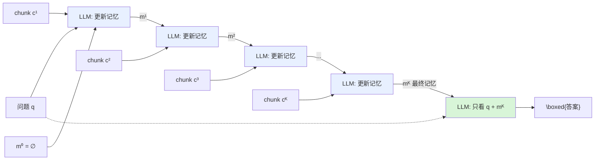

# MemAgent：用多会话 RL 训练一块"覆写记忆"，把长上下文 LLM 重塑为线性复杂度的记忆 Agent

> **本篇定位**：D 组（记忆，打 **C=Context 层**）的一篇 2025 前沿。它回答一个很硬的问题——**不改注意力核、不加外挂模块、不重训底座架构**，能不能让一个只有 8K 窗口的普通 LLM 稳定读完几百万 token 还不掉分？MemAgent 的答案是：能，办法是把"记忆怎么写"这件事本身**交给 RL 去学**。读的时候请始终扣住三件事：**分段读入（streaming）＋ 覆写记忆（overwrite）＋ 多会话 DAPO（RL）**——本文的全部功夫都在把这三者讲透。

---

## §1　TL;DR（一页讲清这篇在干嘛）

> 主讲提示：开场先把"长上下文三难困境"抛出来，再用一句话说 MemAgent 怎么同时解掉三个。别急着讲公式。

一句话：**MemAgent 把"处理超长文本"从"扩大注意力窗口"重新定义成"训练一个会做笔记的 agent"**。文档不再被当成一整块塞进上下文，而是被切成一段段 chunk 顺序读入；每读完一段，模型就把**上一版记忆覆写**成一版新的（overwrite），这块记忆长度**固定**（实验里 1024 token）；读完全部段落后，模型**只看问题 + 最终记忆**产出 `\boxed{}` 答案。因为记忆长度不涨、每段计算是 $O(1)$，端到端复杂度对段数**严格线性**（§3.1）。

- **它属于 harness 的哪一层（Θ1）**：本篇主打 **C（Context / 上下文）层**——它不发明新工具（非 T 层），也不改控制循环骨架（非 L 层），而是把"**上下文里放什么、怎么在段与段之间传递状态**"做成一个**可被 RL 优化的写记忆策略**。它对 **L 层**（一个天然的"读-写-读"多轮循环）和 **V 层**（用可验证奖励 RLVR 打分）有依赖。
- **回扣全库论点（Θ2）**：这是 `Agent = Model + Harness` 的一个**极端而干净的样本**——底座模型完全不动（Qwen2.5-7B/14B-Instruct 的原始权重、原始注意力、原始 tokenizer），**只**在外面加了一层"分段 + 覆写记忆"的 harness 结构 + 一个教它怎么写记忆的 RL，能力就从"896K 前崩到 0"变成"3.5M 仍有 78 分"（Table 2）。**变的是脚手架（含它的策略），不是底座架构。**
- **够新够权威（Θ4）**：2025-07 预印本，出自 **ByteDance Seed × 清华 AIR**——正是训练 Doubao/Seed 系列与做 RLVR 基础设施的团队。它是**首批把"记忆覆写"整体当作 RLVR 优化目标、并配套提出多会话 DAPO 的工作之一**。
- **一句话记住机制**：`记忆_新 = LLM(问题, 记忆_旧, 新一段文本)`，循环到读完；最后 `答案 = LLM(问题, 最终记忆)`。这块记忆**是普通 token、人类可读、可打印甚至可手改**（§3.4）——不是隐向量。

> **读出什么**：MemAgent 最反直觉的一点是——**记忆就是一段自然语言笔记，写在上下文窗口里，用底座模型自己生成**。没有额外的记忆网络、没有 KV cache 魔改、没有向量库。它把"长上下文能力"从"架构问题"降维成了"**要不要教模型好好记笔记**"的**训练问题**。

---

## §2　问题与动机：长上下文的"三难困境"，以及为什么要向人类记笔记学习

> 主讲提示：这一段用 Why 三连的"问题层"。先讲清现有三条路各撞了什么墙，再引出本文的"人类记笔记"直觉。

**Why（问题层）——不解决会卡住什么？**
工业级 LLM 面对三类天然超长的任务：读完一整本书、跨很多步的复杂推理链、维护一个 agent 系统的长期记忆——这些都会生成**溢出**当前上下文窗口的文本（§1 原文）。现有做法**三管齐下，各有硬伤**（§1、§2 Related Work）：

1. **长度外推（length extrapolation）**：改 RoPE 的底频/位置索引（NTK [12]、PI [13]、YaRN [14]、DCA [15]）+ 继续预训练 [16–18]，把窗口撑大。**硬伤**：外推后**性能掉**，且注意力天生 $O(n^2)$，处理极长文本又慢又贵。
2. **稀疏 / 线性注意力（sparse / linear attention）**：稀疏注意力 [19–21] 按预定义 pattern（如滑窗）砍掉部分注意力计算；线性注意力 / RNN / SSM（Mamba [37]、RWKV [38]…）[22,23,36–40] 换架构做到 $O(N)$。**硬伤**：通常**要从头训练**（线性注意力难并行训练、稀疏注意力依赖人工设计的 pattern）。
3. **上下文压缩（context compression）**：把信息压到 token 级或外部记忆插件里 [24–27]。**硬伤**：往往**外推能力差**，且需要引入额外模块 / 上下文操作，**打断标准生成流程、破坏并行与兼容性**。

作者把成功的长上下文 LLM 需要的东西总结成一个**"三难困境（trilemma）"**（§1 原文）：**(1) 能处理无限长文本；(2) 扩展时不掉分（no performance drop）；(3) 解码是线性复杂度**。上面三条路**没有一条同时满足三者**。

**Why（设计层）——为什么向"人类怎么读长文"学？**
作者回到最朴素的直觉（§1）：人读长文档时，**不会逐字背下每一句**，而是**抽取要义、记速记笔记（shorthand stenography）、丢掉冗余与干扰**，把精力集中在更重要的部分。这种"**选择性注意**"既省力又更能抓住任务本质。MemAgent 就是把这套**拟人化的记笔记流程**用 RL 装进 LLM：读一段 → 更新一版固定长度的"笔记"（记忆）→ 读下一段……最后只凭"笔记"作答。

> **读出什么（Θ2 呼应）**：注意这里的动机**不是"再造一个更强的注意力核"**，而是"**换一种把上下文喂给模型的方式**"。这正是 C 层（上下文工程）的精神——不动模型内部，改的是"外面这层怎么组织、怎么传递上下文"。这与本库 D 组另一条主线（MemGPT 式的分层内存、外部记忆库）同源，但 MemAgent 把"记什么"从**手工规则**升级成了**RL 学出来的策略**。

---

## §3　三个核心贡献（论文 §1 末）

1. **一种新机制**：让 LLM 在**受限上下文窗口**内、以**推理期线性时间复杂度**处理**任意长**输入，克服了长上下文处理的一个关键瓶颈（§1）。
2. **一套 agent 工作流 + 端到端训练法**：设计了 MemAgent 工作流来落地该机制，并用**多会话 DAPO（multi-conversation DAPO）** 做端到端 RL 训练（§3.2 / §A）。
3. **实证**：RL 训练后的模型能外推到**极长**文档且性能几乎不降，推进了当前长上下文 LLM 系统的能力边界（§1、§4）。

> 主讲提示：三条贡献分别对应"机制层 / 训练层 / 实证层"。下面 §4–§7 逐层拆开讲。

---

## §4　MemAgent 工作流：把文档当"流"，用覆写记忆滚动读

> 主讲提示：这是全篇第一根支柱——**分段读入 + 覆写记忆**。先给直觉、先定义符号，再上流程图，最后才给复杂度公式。

**直觉（先建图像）**：把一份几百万 token 的文档想成一条**传送带**上不断送来的纸箱（chunk）。你（模型）手边只有**一张便签纸（记忆）**，纸的大小固定（写满 1024 token 就那么大）。每来一个纸箱，你读一遍、结合手里便签上已有的内容，**把便签整张重写一遍**（保留有用的、补上新发现的、丢掉没用的），然后处理下一个纸箱。传送带走完，你**只拿着这张便签**去回答问题——原始纸箱早扔了。

**符号定义（公式前先定义清楚）**：
- **文档流**：长文档被切成 $K$ 个连续 chunk $c^1, c^2, \dots, c^K$，每段长度 $\le C$（实验里 $C = 5000$ token）。
- **记忆 $m$**：一块**固定长度**的普通 token 序列，$m \in \mathbb{V}^M$（$\mathbb{V}$ 是词表，$M$ 是固定记忆长度 = 1024 token）。$m^k$ 表示读完第 $k$ 段后的记忆版本；基态 $m^0 = \varnothing$（空）。
- **问题 $q$**：任务的 problem statement（实验里预留 1024 token）。
- **答案 $a$**：最终 `\boxed{}` 里的答案。

**覆写动作（overwrite）——本文第一根支柱**：读完第 $k$ 段后，模型执行

$$m^{k} \;=\; \mathrm{LLM}\big(q,\; m^{k-1},\; c^{k}\big)$$

即：**用一版全新的 $m^k$ 覆盖掉 $m^{k-1}$**（不是 append、不是拼接）。作者原话（§3.1）——"After reading a new chunk, the model **overwrites** the previous memory with an updated one." 这个动作"看起来蠢到过分（seems almost too simple）"，但**恰恰是它让系统能 scale**：因为记忆长度**永不增长**，每段的总计算保持 $O(1)$，端到端复杂度对段数**严格线性**（§3.1 原文）。

**两个模块（Table 1 给了两套 prompt 模板）**：
- **① Context-Processing（上下文处理）模块**——对每一段 chunk 迭代，用 Table 1（top）的模板更新记忆。模板要点（原文）：给模型 **problem + 上一版 memory + 当前 section**，指令是"**读这一段、用新信息更新记忆，同时保留上一版记忆里所有相关细节（retaining all relevant details）**"。
- **② Answer-Generation（答案生成）模块**——流读完后调用一次，用 Table 1（bottom）的模板，此时模型**只看 problem + memory**（不再看任何原文），产出 `\boxed{}` 答案。

**Why（设计层）——为什么"覆写"而不是"追加/拼接/滑窗"？**
- **朴素替代 A：拼接（concatenate）历史**（很多多轮 agent / Search-R1 [33]、Agent-R1 [32] 这么干）。→ 上下文**单调膨胀**，很快撞回 $O(n^2)$ 的墙，无限长文本根本装不下。
- **朴素替代 B：滑动窗口（sliding window）**（GiGPO [34] 一类）。→ 只保留最近 $w$ 段，**早期关键信息被无脑丢弃**；作者明说滑窗"在实践中缺乏灵活性与可扩展性（lacks flexibility and scalability）"（§1）。
- **朴素替代 C：把摘要压到特征空间**（线性注意力 / 压缩插件）。→ 摘要是**隐式、不透明的**（implicit and opaque），无法检查、无法作为 RL 的可验证信号。
- **本文选覆写**：记忆长度**恒定** → 满足线性复杂度；记忆是**明文 token** → 可读、可作 RL 奖励对象；"保留什么、丢什么"由**模型自己在覆写时决定** → 比任何固定规则都灵活。代价是：一旦某轮覆写误删了后面才用得上的信息，就**再也找不回来**（原文没有 rollback 机制）——所以"**该记什么**"必须靠 §5 的 RL 教会。

**三个收益（§3.1 原文点名）**：(1) **Unlimited length**——文档可达数百万 token，因为按流处理；(2) **No performance cliff**——RL 鼓励记忆**恰好保留后续需要的信息**，产生近乎无损的外推（Figure 1）；(3) **Linear cost**——窗口大小恒定 → 解码时间与内存随输入线性 $O(N)$。作者称这是"**把任意中等窗口 LLM 变成高效长上下文 reasoner 的实用配方，几乎零工程改造**"（§3.1）。

> **读出什么**：这一节最关键的一句——"**记忆是上下文窗口内一串普通 token，所以底座 LLM 的核心生成过程原封不动（remains unchanged）**"（§3.1）。因为位置编码从不被重新缩放或打补丁，**同一套 tokenization 与 attention layout 在两个模块里都适用**，模型潜在的长度外推能力被"免架构改造"地解锁。这是 MemAgent 能即插即用的根因。

---

## §5　用多会话 DAPO 训练：本文第二根支柱（把"写记忆"变成 RL 目标）

> 主讲提示：这是全篇最该讲透、也最容易讲糊的一页。路线是：先说"为什么非 RL 不可"→ 复习 GRPO（Eq 1-3）→ 讲清 MemAgent 的"多会话"结构为什么打破了标准 RL 假设 → 给出多会话 DAPO（Eq 4-5）→ 说清奖励怎么算（Eq 6-7）。每个公式前先定义符号。

### 5.1　为什么必须用 RL？（Why RL Essential，§3.4 原文有专门小节）

**Why（问题层）**：记忆 token 是**潜变量**、且通过一个**离散的覆写规则**更新——**光靠反向传播根本没法教模型"该留什么、该扔什么"**（§3.4 原文："because memory tokens are latent and updated via a discrete overwrite rule, back-propagation alone cannot teach the model *what* to keep and what to discard"）。因为"一版好记忆"没有逐 token 的监督标签——你只知道**最终答案对不对**，不知道中间第 3 段该把哪句话记进便签。这是一个典型的**"显式监督（答案）与隐式结构（好记忆）之间的鸿沟"**。RL 正好填这个沟：把每一次"读-写-读"循环当成一个 RL transition，**直接奖励那些能导向正确最终答案的记忆**（§3.4）。

### 5.2　基座算法 GRPO（Eq 1–3，先复习后改造）

MemAgent 采用 **RLVR（可验证奖励强化学习）** 配方 [3,51,60]，基座算法是 **GRPO（Group Relative Policy Optimization）** [56]，因其简洁有效。

**符号**：策略模型 $\pi_\theta$；对一个输入 $x$，旧策略 $\pi_{\theta_{\text{old}}}$ 采样一组 $G$ 个回答 $\{o_i\}_{i=1}^{G}$；$\{R_i\}_{i=1}^{G}$ 是它们的序列级奖励。

**组内归一化优势（Eq 1）**——GRPO 不用价值网络，而是拿**同组回答的奖励均值/标准差**当基线：

$$\hat{A}_{i,t} \;=\; \frac{r_i - \mathrm{mean}(\{R_i\}_{i=1}^{G})}{\mathrm{std}(\{R_i\}_{i=1}^{G})} \tag{1}$$

> 直觉：一个回答比"同组平均"好多少（以组内波动为尺度），就给它多大的正向推力。省掉 critic，省显存、更稳。

**GRPO 的裁剪目标 + KL 惩罚（Eq 2）**：

$$\mathcal{J}_{\text{GRPO}}(\theta) = \mathbb{E}\!\left[\frac{1}{G}\sum_{i=1}^{G}\frac{1}{|o_i|}\sum_{t=1}^{|o_i|}\Big(\min\big(r_{i,t}(\theta)\hat{A}_{i,t},\ \mathrm{clip}(r_{i,t}(\theta),1-\varepsilon,1+\varepsilon)\hat{A}_{i,t}\big) - \beta D_{\text{KL}}(\pi_\theta\|\pi_{\text{ref}})\Big)\right] \tag{2}$$

其中重要性采样比（Eq 3）：

$$r_{i,t}(\theta) = \frac{\pi_\theta(o_{i,t}\mid q, o_{i,<t})}{\pi_{\theta_{\text{old}}}(o_{i,t}\mid q, o_{i,<t})} \tag{3}$$

> 符号：$\varepsilon$ 是 PPO 式裁剪半径（防单步更新过猛）；$\beta$ 是 KL 系数（把新策略拴在参考策略 $\pi_{\text{ref}}$ 附近，防训崩）。

### 5.3　核心难点：MemAgent 一条样本产生"多段独立会话"，标准 RL 用不了

**Why（设计层）——朴素做法为什么失效？**
标准多轮 RL（Search-R1、Agent-R1、RAGEN [59]）的做法是：把多轮工具调用/环境反馈**交替拼接成一整条会话**，再对拼出来的长序列**加 tool-mask** 做优化——本质上仍是"**单条会话**"的优化（§2、§3.2 原文）。**但 MemAgent 不一样**：如 Figure 3，对**同一个 query**，它会生成**多段彼此上下文独立（context-independent）** 的会话——第 1 段读 chunk1 更新记忆是一次生成、第 2 段读 chunk2 又是一次**独立**生成（它们不共享上下文，只共享那块被传递的记忆）。这些会话**不能靠 tool-mask 拼成一条**来优化，因为它们本就分属不同的上下文。

**解法（§3.2 原文）——把每段会话当独立优化目标，但共享同一个终局奖励**：
- **符号**：对样本 $(q_i, a_i)$，它生成 $n_i$ 段会话 $(o_{i,1}, o_{i,2}, \dots, o_{i,n_i})$，合起来算**一组**；每段会话 $o_{i,j}$ 再拆成 token 级输出 $(o_{i,j,1}, \dots, o_{i,j,|o_{i,j}|})$。
- **关键设计**：**只用"含最终答案的那段会话"算 outcome reward $R_i$**，然后把这个组归一化后的优势**均匀地分发给该样本下所有关联会话**（§3.2 原文："compute an outcome reward $R_i$ per sample by the final conversation that contains the final answer, and distribute group-normalized advantages across all associated conversations"）。

> **读出什么（这是全篇最巧的一步）**：中间那些"更新记忆"的会话**没有自己的标签**——但它们的好坏**只体现在"最终答案对不对"**。所以本文把终局奖励**反向摊派**给沿途每一次记忆更新：某条轨迹最后答对了，那它沿途每一次覆写都算"做对了"，都获得正优势；答错了则一起受罚。这正是"**用最终可验证结果，隔空监督中间的隐式记忆**"——填上了 §5.1 说的那道鸿沟。

### 5.4　多会话 DAPO 的优势与损失（Eq 4–5）

**优势（Eq 4）**——沿用 DrGRPO [58] 的做法，**不除以奖励标准差**（避免长度/难度偏置），优势来自"含最终答案的会话"，再摊到同源所有会话：

$$\hat{A}_{i,j,t} \;=\; r_i - \mathrm{mean}(\{R_i\}_{i=1}^{G}) \tag{4}$$

**损失（Eq 5）**——类比 DAPO [35]，把损失计算的维度从常规的 `(group, token)` 扩到 **`(group, conversation, token)`** 三维，并用 DAPO 的**非对称裁剪** $(\varepsilon_{low}, \varepsilon_{high})$：

$$\mathcal{J}_{\text{DAPO}}(\theta) = \mathbb{E}\!\left[\frac{1}{\sum_{i=1}^{G}\sum_{j=1}^{n_i}|o_{i,j}|}\sum_{i=1}^{G}\sum_{j=1}^{n_i}\sum_{t=1}^{|o_{i,j}|}\Big(\mathcal{C}_{i,j,t} - \beta D_{\text{KL}}(\pi_\theta\|\pi_{\text{ref}})\Big)\right] \tag{5}$$

$$\text{其中}\quad \mathcal{C}_{i,j,t} = \min\!\Big(r_{i,j,t}(\theta)\hat{A}_{i,j,t},\ \mathrm{clip}\big(r_{i,j,t}(\theta), 1-\varepsilon_{low}, 1+\varepsilon_{high}\big)\hat{A}_{i,j,t}\Big)$$

> 直觉：Eq 5 和 GRPO 的 Eq 2 长得像，但**多了一层对会话 $j$ 的求和**——这就是"多会话"三个字落到公式里的样子。分母 $\sum\sum|o_{i,j}|$ 做的是 token 级平均。非对称裁剪 $\varepsilon_{high} > \varepsilon_{low}$ 是 DAPO 的招（给正优势留更大上探空间，缓解熵坍缩）。

### 5.5　奖励怎么算（Eq 6–7，RLVR 的"可验证"落地）

奖励是**规则打分器（rule-based verifier）** 给的**终局 outcome reward**（§3.3），分两种任务：

**（a）单答案 / 多个等价答案（Eq 6）**——如问答，多个 ground-truth 视为等价：给定答案集 $Y=\{y_1,\dots,y_n\}$、预测 $\hat{y}$，

$$R(\hat{y}, Y) = \max_{y\in Y}\big(\mathbb{I}(\texttt{is\_equiv}(y, \hat{y}))\big) \tag{6}$$

> 符号：$\mathbb{I}(\cdot)$ 是指示函数，$\texttt{is\_equiv}$ 判两答案是否等价。只要预测与集合里**任一**等价即得 1 分。

**（b）多值任务（Eq 7）**——如"Multi-Value Needle in a Haystack"（"XXX 的所有 magic number 是哪些？"），要求答案集里**每个都命中**才满分：

$$R(\hat{y}, Y) = \frac{|y\in Y \mid \mathbb{I}(y\in\hat{y})|}{|Y|} \tag{7}$$

> 符号：$|\cdot|$ 是集合基数。命中比例即得分——漏一个扣一点。

> **读出什么（Θ2）**：整条 RL 里**没有任何"这块记忆好不好"的直接标注**，奖励只认**最终答案**（Eq 6/7 都是终局的、可用规则确定性验证的）。"好记忆"这个概念**完全是被最终答案的可验证信号隔空塑造出来的**——这就是 RLVR 的精髓，也是本文能"用答案教记忆"的关键。

---

## §6　把 MemAgent 重看成"自回归分解"：本文第三根支柱（为什么它在数学上站得住）

> 主讲提示：这页把 MemAgent 抬到理论高度——它本质是"给自回归语言模型引入一个潜变量记忆，从而把联合似然拆成一串读/写步骤"。给 Eq 8 前先讲清标准自回归的"病根"。

**标准自回归的病根**：一个普通自回归 LLM 把序列 $\mathbf{x}_{1:N}$ 的联合似然分解为

$$p(\mathbf{x}_{1:N}) = \prod_{n=1}^{N} p(x_n \mid \mathbf{x}_{1:n-1})$$

这**隐含假设"每个过去 token（或至少它的隐藏状态）都必须留在活跃上下文里"**——正是这条假设把二次注意力变成了长上下文瓶颈（§3.4 原文）。

**MemAgent 的重构（Eq 8）**：用一个**固定长度潜变量记忆** $\mathbf{m}\in\mathbb{V}^M$ 替换无界历史（Figure 4 把它画成 Neural-Turing-Machine 式的 Controller + Read/Write Head + Memory）。引入潜序列 $\mathbf{m}^{1:K-1}$ 后，原似然被分解为**读路径 × 写路径**的乘积：

$$p(\mathbf{x}_{1:N}) = \sum_{\mathbf{m}^{1:K-1}} \prod_{k=1}^{K} \underbrace{p(\mathbf{c}^{k}\mid \mathbf{m}^{k-1})}_{\text{read 读}} \; \underbrace{p(\mathbf{m}^{k}\mid \mathbf{c}^{k}, \mathbf{m}^{k-1})}_{\text{write 写}} \tag{8}$$

基态 $\mathbf{m}^0 = \varnothing$。**读路径**在每段内仍按 token 逐个分解 $p(\mathbf{c}^k\mid\mathbf{m}^{k-1}) = \prod_{i=(k-1)C+1}^{kC}p(x_i\mid \mathbf{x}_{1:i-1}, \mathbf{m}^{k-1})$；**写路径**以同样的自回归方式生成下一版记忆。**每段内部**仍跑一个**普通 transformer decoder**，只是被**限制在一个恒定上下文窗口** $(\mathbf{c}^k, \mathbf{m}^{k-1})$ 上。因为 $|\mathbf{m}^k| = M$ 恒定，**每段的计算与内存都是 $O(C+M)$，整体线性 $O(N)$**（§3.4）。

**Why（设计层）——为什么这个分解比"隐向量摘要"更本质？**
局部/线性注意力模型也压缩长上下文，但它们压在**特征空间（feature space）**里，摘要**隐式、不透明**；MemAgent 的摘要**驻留在 token 空间**——**每一版中间记忆都人类可读、可检查、甚至可手动编辑**（§3.4 原文，这也是它能拿来当 RL 奖励对象的前提）。概念上，Eq 8 把 transformer **变成了一个状态大小由用户控制的循环网络（a recurrent network whose state size is user-controllable）**。

> **读出什么**：这一段回答了"MemAgent 到底改了什么"——它**没改**训练配方（保留 vanilla decoder 的训练）、**没引入**奇异注意力核、**没加**新架构；它改的是**把长文本的联合似然显式地分解成"读一段/写一版记忆"的交替过程**，从而在数学上同时满足"任意长 + 无损外推 + 线性成本"这个三难困境（§3.4 结尾）。

---

## §7　实验设置：5,194 …不，这篇是"8K 训、几百万测"的外推实验

> 主讲提示：这页把"训练配置"讲清楚，尤其那个"故意只给 8K 窗口"的设计，是全篇外推奇迹的前提。

**数据（§4.1）**：
- **训练**：从 **HotpotQA [2]**（多跳 QA）合成长文本样本——把含答案的"golden paragraph"埋进大量从同数据集采样的干扰段落里（NIAH 范式的真实版）。合成语料共 **200 篇文章、约 28K token/条**。先用"Qwen2.5-7B-Base/Instruct 不给上下文也能 100% 答对"过滤掉**常识题**（约 50% 被滤掉），从 HotpotQA 训练集 80,000 条里筛出**前 32,768 条**用于训练。
- **测试**：主评测基准是 **RULER [1]**（可控上下文长度的合成任务集）。从 HotpotQA 验证集合成 128 条测试题，用同一批问题合成**不同上下文长度**的测试集——文章数从 50、100 直到 6400，对应上下文长度约 **7K、14K … 直到 3.5M token**。

**训练细节（§4.2，关键在"故意限窗"）**：
- **基座**：**Qwen2.5-7B-Instruct** 与 **Qwen2.5-14B-Instruct**（为与前作可比）。框架基于 **verl [61]** 实现多会话独立上下文。
- **8K 窗口的预算切分（本文外推奇迹的前提）**：训练时**故意把模型限制在 8K 上下文窗口**以凸显外推能力。8K 这样分配——**query 1024 + context chunk 5000 + memory 1024 + output 1024**，剩余留给 chat 模板；因此处理整篇文档**通常要 5–7 个会话轮次**。
- **超参**：GRPO 训练，**KL 系数 1e-3**、**关闭 entropy loss**；AdamW，学习率 **1e-6**（常数 + 线性 warm-up）；rollout batch = 128（7B）/ 256（14B）；**group size = 16**；样本 batch 与反传 batch 之比 = 16。

**基线（§4.2 Model Configuration）**：**DeepSeek-R1-Distill-Qwen [51]**（推理模型，7B/14B/32B，128K 窗口）、**Qwen2.5-Instruct-1M [62]**（7B/14B，用 DCA 外推到 1M）、**QwenLong-L1-32B [63]**（长上下文 RL 后训练，128K）。给 128K 模型喂 120K 输入 + 10K 输出；给 1M 模型喂 990K 输入 + 10K 输出。

> **Why（设计层）——为什么故意只给 8K 窗口训练？**
> 朴素做法是"训练窗口尽量开大（如 128K）"，让模型见过长样本。→ 但那样**证明不了"外推"**——你无法区分"它是真会外推"还是"它只是在训练见过的长度上插值"。本文反其道而行：**只在 8K 窗口内训练**（每次只见 5000 token 的一段），测试时却把它扔到 3.5M——**训练长度与测试长度差了约 400 倍**。若此时仍不掉分，就**干净地证明了外推来自机制（分段+覆写记忆），而非"见过长样本"**。这是一个非常漂亮的实验设计。

---

## §8　主结果：8K 训练，3.5M 仍有 78 分，几乎无损外推

> 主讲提示：这是全场最该停留的一张表。先报"别人怎么崩的"，再报 MemAgent"怎么没崩"，最后解释机制。

**Table 2（主结果，准确率 %，横轴是上下文长度 7K→3.5M）** 节选：

| Model | 7K | 14K | 28K | 56K | 112K | 224K | 448K | 896K | 1.75M | 3.5M |
|---|---:|---:|---:|---:|---:|---:|---:|---:|---:|---:|
| QwenLong-L1-32B | 72.66 | 75.00 | 72.66 | 60.94 | 31.25 | 17.19 | 13.28 | 11.72 | N/A | N/A |
| Qwen2.5-Instruct-14B-1M | 60.16 | 60.94 | 50.00 | 57.03 | 50.00 | 37.50 | 8.59 | **0.00** | N/A | N/A |
| Qwen2.5-Instruct-7B-1M | 61.72 | 56.25 | 53.91 | 55.47 | 51.56 | 33.59 | 12.50 | **0.00** | N/A | N/A |
| DS-Distill-Qwen-32B | 70.31 | 66.41 | 65.62 | 46.88 | 23.44 | 13.28 | 7.81 | 7.03 | N/A | N/A |
| DS-Distill-Qwen-14B | 64.06 | 64.84 | 57.03 | 40.62 | 14.84 | 8.59 | 3.12 | 6.25 | N/A | N/A |
| DS-Distill-Qwen-7B | 30.47 | 12.50 | 3.12 | **0.00** | **0.00** | 0.78 | **0.00** | **0.00** | N/A | N/A |
| **RL-MemAgent-14B** | **83.59** | **82.03** | **84.38** | **80.47** | 76.56 | **81.25** | **75.00** | **77.34** | **76.56** | **78.12** |
| **RL-MemAgent-7B** | 82.03 | 79.69 | 78.91 | 77.34 | **79.69** | 72.66 | 74.22 | 76.56 | 75.78 | 71.09 |

**Why（结果层）——为什么 MemAgent 不崩而别人崩？**
- **别人怎么崩的**：DS-Distill 系列（推理模型）**在窗口内就快速退化**；QwenLong-L1 在其训练长度 60K 内尚可，之后大幅掉；最刺眼的是 **Qwen2.5-Instruct-1M 系列——在 896K 掉到 0.00**，**远早于其号称的 1M 容量**（§4.3 原文点名）。这说明"**扩大了窗口 ≠ 会用窗口**"：模型有 1M 的位置容量，却**无法在超长上下文里有效利用信息**（effective information utilization）。
- **MemAgent 怎么没崩的**：**RL-MemAgent-14B 从 7K 到 3.5M 全程 75–84 分，极差不到 9 分**；14B 在 3.5M 仍有 **78.12**、7B 仍有 **71.09**。这是因为它**根本不依赖"把全文塞进窗口"**——它每步只看 5000 token 的一段 + 1024 的记忆，**上下文长度对它是常数**，所以再长也只是"多滚几轮"，不触发注意力退化。
- **机制上**：Figure 1 直观展示——所有长上下文外推基线（含继续预训练 + 外推技巧的）都随长度**塌陷**，唯有 RL-MemAgent 近乎水平线。摘要（abstract）给的总结数字是：**8K 训练可外推到 3.5M，性能损失 < 5%；在 512K RULER 上 95%+**。

> **读出什么（Θ2）**：这张表就是 `Agent = Model + Harness` 在**记忆维度**的实锤。**底座是同一族 Qwen2.5**——Instruct-1M 版拼命把窗口撑到 1M 却在 896K 归零；而 MemAgent 版（同为 Qwen2.5、甚至窗口只有 8K）在 3.5M 仍稳。**差别全在外面那层"分段+覆写记忆"的 harness 结构 + 教它写记忆的 RL。** 这比"换 scaffold 分数摆 20 分"更极端：这里是"**从 0 到 78**"。

---

## §9　消融：记忆给"结构支撑"，RL 才教会"怎么用记忆"

> 主讲提示：这页拆开"记忆机制"和"RL 训练"两个变量，回答"到底哪个在起作用"。

**设置（§4.4）**：对照三组——(1) 纯 vanilla Qwen2.5-Instruct（无记忆）；(2) 有记忆机制**但没经 RL 训练**（MemAgent w/o RL）；(3) 完整 RL-MemAgent。结果见 **Figure 5**（RULER-HotpotQA，28K→896K）：

- **纯 vanilla**：随长度**严重退化**，尤其过 **112K**（输入被窗口截断）后直接崩。
- **有记忆但无 RL**：在超过窗口的任务上**明显好于 vanilla**、能维持"尚可"的表现，**但随输入变长仍整体下滑**。
- **完整 RL-MemAgent**：**全程高位、退化极小**。

**Why（结果层）——两个变量各自的贡献**：作者的结论很干脆（§4.4 原文）——"**记忆机制提供了处理长上下文的结构性支撑（structural support），但强化学习才是教模型正确利用记忆的关键（RL is essential for teaching models to properly leverage the memory）**"。即：**光有便签纸（记忆结构）不够，还得教会你怎么记笔记（RL）**。只加记忆结构能防"截断即死"，但"记什么、怎么覆写"若不训，长文里仍会记乱、记漏。

> **读出什么**：这条消融正好呼应本库 Harness-Bench 的核心洞见——**"给了工具/结构" ≠ "会用工具/结构"**。MemAgent 的记忆结构像 harness 给的"便签位"，RL 像把"会用便签"训进模型。两者缺一不可，而**RL（可学习的写策略）是把结构盘活的那一半**。

---

## §10　泛化：换成 needle/变量追踪/词频等异构任务，仍然稳（OOD）

> 主讲提示：这页证明"它不是只会 HotpotQA"，而是学到了可迁移的记忆能力。

**设置（§4.4 Out-of-Distribution + Appendix B）**：在 **RULER 的 OOD 任务**上测——**needle-in-a-haystack 变体（NIAH：single/multi-key/multi-value/multi-query）、变量追踪（Variable Tracking, VT）、频繁词抽取（Frequent Words Extraction, FWE）、以及从 SQuAD [65] 合成的 QA**（长度 8K→512K，SQuAD 因文档长度限制只到 256K）。这些任务的格式与训练用的 HotpotQA **完全不同**。

**结果（Figure 6 热图 + Appendix B 的 Figure 8–11）**：
- **MemAgent-14B 在 8K–512K 的平均 RULER 任务上 > 95% 准确率**（Figure 6a）；**MemAgent-7B 甚至超过没经 RL 训练的 32B 模型和长上下文后训练模型**。
- 在 SQuAD-based QA 上，MemAgent-7B/14B **性能稳定**，而基线在 128K 后**全线大幅退化**（§4.4）。
- Appendix B 的细粒度热图（NIAH single/multi-key、VT、FWE）显示：**MemAgent（尤其 RL 版）在几乎所有任务 × 长度格上保持绿色（高分），而 reasoning / long-context 基线大面积泛红（趋 0）**。

> **读出什么（§4.4 原文结论）**："跨异构任务的一致强表现，验证了**记忆机制学到的是"泛化到长上下文场景"的能力，而非过拟合到某种具体格式**（generalizes ... rather than overfitting to specific formats）。" 这很关键——它排除了"MemAgent 只是背下了 HotpotQA 的套路"的质疑。

---

## §11　案例研究：一次"记忆滚动"的完整回放（看它到底怎么做笔记）

> 主讲提示：这页把抽象机制落到一个具体轨迹上，是最好懂、最适合现场演示的一页。

**问题（§4.5，一个 2-hop 题）**：*"浪漫喜剧《Big Stone Gap》的导演是基于纽约的哪个城市？"* 需要两跳：先找到导演（Adriana Trigiani），再找她 based 在哪（Greenwich Village, NYC）。关键 Wikipedia 条目有两条，散落在不同 chunk 里。轨迹（Table/Figure 里的 Chunk1–3 + Memory1–3）：

- **Chunk1**：出现一个**干扰项** *Ghost*（一支瑞典音乐制作团队，也 based 在 New York City）。→ 模型**主动判断"这条可能跟 query 沾边（都提到 New York City）"，先把它记进记忆备用**（Memory1 写下 Ghost 的信息，并明确注明"本段没有直接回答导演问题"）。**（能力：从 query 关键词预估相关性，preemptive storing）**
- **Chunk2**：**没有相关文档**。→ 模型**保持记忆不变**（Memory2 几乎照抄 Memory1），不被无关内容干扰。**（能力：抗干扰 robustness against distraction）**
- **Chunk3**：**两条关键条目同时出现**（Big Stone Gap 由 Adriana Trigiani 导演；Adriana Trigiani based 在 Greenwich Village, NYC）。→ 模型**立即识别关键信息、更新记忆**，把两跳串起来，**得出正确答案 Greenwich Village, New York City**（Memory3 用红字标出关键结论）。此后剩余轮次记忆**保持不变**，最终用它作答。**（能力：命中即更新、完成推理后冻结记忆）**

> **读出什么（§4.5 原文最重一句）**：这条轨迹展现了三种被 RL 学出来的记忆行为——**从 query 关键词预估潜在相关内容并预先存储、一旦遇到匹配 query 的上下文立即更新记忆、不受无关信息影响**。而作者强调："**这些记忆行为不是架构注意力机制的产物，而是通过 RL 强化出来的"文本生成能力"（emerge as text generation abilities reinforced through RL, not the result of architectural attention mechanisms）。**" 换句话说——**"会做笔记"是被 RL 训出来的一种"写作技能"，而非某种硬件式的记忆结构。**

---

## §12　复杂度实测：$O(n^2)$ vs $O(n)$，4M token 处画出天壤之别

> 主讲提示：这页把"线性成本"从口号变成一张 FLOP 曲线。给公式前先说清怎么估的。

**做法（Appendix A）**：用 verl [61] 的 Qwen2Model **FLOP 估计器**分别算基线与 MemAgent 的浮点运算量，长度从 8K 扫到 4M（Figure 7）。

**基线的 token 量**：处理 $q + c + o$（$q$=问题长、$c$=上下文长、$o$=输出长），注意力使其呈 **$O(n^2)$**。

**MemAgent 的 FLOP** = 各阶段之和（$q=1024,\ o=1024,\ N=5000,\ c$ 从 8K 到 4M）：
- **Initializing**：处理 $q + 200 + o$（200 是引导模型进入 MemAgent 工作流的常数提示）。
- **Memory Updating**：重复 $k = \lceil c/N \rceil$ 次，每次输入 $q + 200 + N + o$。
- **Final Answering**：处理 $q + 100 + o$（含前面累积的输出）。

**结果（Figure 7）**：基线 FLOP 在 512K 后**急速上翘**，到 **4M 时约 $2.1\times10^{19}$**；MemAgent 全程**贴着近水平线**（几乎与横轴重合）。作者结论：**baseline 是 $O(n^2)$，MemAgent 是 $O(n)$**（Appendix A）。

> **读出什么**：这张图是 §4/§6 那套"线性成本"论证的**经验闭环**——不仅数学上分解成线性（Eq 8），FLOP 实测也确认了。这是"无限长 + 无损 + 线性"三难困境里，**第三条（线性）**的硬证据。

---

## §13　讨论与批判（含"宣称 vs 独立反证"的诚实边界，Θ5）

> 主讲提示：这页守判断力的高地。既要认它的强，也要点出它没说清/没保证的地方。别把"覆写记忆 > 长窗口"讲成绝对真理。

**作者明确的宣称（可信、有实验支撑）**：
- 8K 训练 → 3.5M 外推、损失 < 5%（Table 2 / Figure 1）；512K RULER 95%+（Abstract）。
- 记忆 = 明文 token、人类可读可改（§3.4）；机制免架构改造、保留 vanilla 训练配方（§3.1/§3.4）。
- 记忆行为（预存/抗扰/命中即更）是 RL 学出来的，非架构产物（§4.5）。

**我的补充批判（原文未展开或未给出）**：
- **覆写是"有损且不可逆"的**：一旦某轮误删了"当时看着没用、后面才要用"的信息，**没有回溯机制**能找回（§3.1 只说记忆恒长，未给 rollback）。对**需要在极远处回指早期细节**的任务（如全书级伏笔回收），单块固定记忆可能是硬瓶颈——**原文未测"记忆容量 M 与任务信息量"的关系曲线**（M 一直固定 1024）。
- **强依赖"可验证奖励"**：Eq 6/7 的奖励要求答案**能被规则确定性判等**（is_equiv / 集合命中）。对**开放式、长文生成、无唯一答案**的长上下文任务（如"总结这本书的主题演变"），这套 RLVR 配方**未必适用**——**原文只在有确定答案的 QA/检索/追踪类任务上验证**。
- **"记忆压缩"与"多跳深度"的上限未探**：案例是 2-hop；**更深的多跳（5-hop、跨十几个 chunk 的链式依赖）能否靠单块记忆稳住，原文未给出**。
- **训练成本与稳定性**：多会话 DAPO 每条样本要跑 5–7 轮生成再摊派优势，**采样成本比单会话 RL 高**；原文**未报训练总算力/收敛曲线/失败率**，只给了最终超参。
- **Θ5 的 regime 诚实**："覆写记忆 > 长窗口"是**分 regime**的——在**信噪比低、需从超长文里捞稀疏 needle**的场景（RULER/HotpotQA），MemAgent 完胜；但在**上下文本身就短、或需全局稠密交叉引用**的场景，直接用大窗口注意力可能**既够用又更简单**。MemAgent 的价值随"文档长度 / 信息稀疏度"上升而上升，不是无条件更优。

---

## §14　局限（论文视角 + 边界重述）

- **评测集中在合成长上下文任务**：RULER（含 NIAH/VT/FWE/QA）虽逼近真实检索，但**仍是合成**——对真实生产级长文档（法律卷宗、代码仓、长对话历史）的覆盖有限。
- **记忆长度固定为超参**：$M=1024$ 是选定值，**没做"$M$ 扫描"** 看"记忆容量—任务难度"的权衡。
- **只在 Qwen2.5-7B/14B 上验证**：换更小/更大/别族底座（Llama、Mistral、MoE）是否同样能"被 RL 教会记笔记"，**原文未测**。
- **奖励只认终局答案**：中间记忆质量**无直接监督**——虽是本文巧思，但也意味着"**坏记忆但侥幸答对**"的样本会被误强化（RLVR 通病，原文未讨论此类噪声的影响）。

---

## ★ 对我们的启发（Inspires Us）

> 这一节是组会高潮，也是本库相对 auto-research 的独门优势：**我们（Claude Code / 本课 agent）自己就活在一个 harness 里**——我们每天都在做 MemAgent 做的事：**读大文件、读长会话历史，然后压缩/传递上下文**。MemAgent 等于把我们现在"靠固定规则 compaction"的那一步，换成了"**可以被 RL 学出来的写记忆策略**"。所以下面每条都能打到自己身上。

➤ **a. 可直接借用的招（method/trick we can reuse）**：**"固定长度记忆 + 每段覆写 + 只在覆写模板里强制'保留所有相关细节'"** 这套 §4 的机制，可以**原样搬进我们读大文件/长会话的上下文管理**。具体三点可拆下即用：(1) 把"读一个大文件 / 一段长 tool 输出"当成一次 chunk，读完**覆写**一块**定长 running notes**（明文、可打印），而不是把原始内容整段塞进上下文；(2) 覆写指令照抄 Table 1 的措辞——"用新信息更新笔记，**保留上一版里所有相关细节**"，这一句是防"越压越丢"的关键；(3) 最终作答只喂"问题 + notes"，把原始长内容全部丢出上下文。**好处**：我们的上下文占用从"随读入内容单调增长"变成"**恒定**"，长会话不再撞窗口。

➤ **b. 可迁移到我们的模块（transfer）**：把 MemAgent 的 **overwrite-memory 思想接到我们的 compaction / 上下文压缩策略**上。现在我们的 compaction 多是**启发式截断/摘要**（丢最老的、或让模型概括一下）；MemAgent 提示我们**可以把"压什么、留什么"训成一个策略**——迁移前提要改的是：我们大多没有"可验证终局奖励"，所以**不能直接照搬 RLVR**。折中方案：先**不训、只借结构**（用 §4 的定长覆写 running-notes 替换现有 compaction），把它当**无参 baseline**；若某类任务（如"多文件里找出满足某契约的实现"）**恰好有可自动验证的成功信号**，再考虑用 MemAgent 式的多会话优势摊派去**微调"写 notes"的行为**。

➤ **c. 它暴露的开放问题 = 我们的机会（open problems → our opportunity）**：MemAgent 的记忆是**有损不可逆**的（§13）——**误删了就找不回**。这正是我们的机会：设计一个**"覆写 + 轻量回指索引"的混合记忆**——主体仍是定长明文 notes（省上下文），但**额外维护一个极小的"原文位置指针表"**（chunk_id → 一句话摘要 + 偏移），当后续发现 notes 里缺了早期细节时，**可以按指针把那一段原文重新拉回来读一遍**。可下手的第一步：在我们读大文件的流程里，**给每个 chunk 存一行"指针 + 20 字摘要"**，量化"带指针回指"相对"纯覆写"能否降低"早期细节丢失"类失败。

➤ **d. 与本库其它论文/模块的连接（connect the dots）**：MemAgent 是本库 **D 组"RL 学记忆三兄弟"** 之一，正好和另两兄弟对照——**MEM1（2506.15841，synergize memory & reasoning）** 把"记忆"和"推理"**在同一条链里协同**、每步既推理又更新一块内部状态；**Mem-α（2509.25911，RL for memory construction）** 则专攻"用 RL **构建**结构化记忆"。三者共享"**用 RL 教模型管理自己的记忆**"这一内核，区别在**记忆形态**：MemAgent = **单块定长明文、覆写式**；MEM1 = **推理-记忆一体的内部状态**；Mem-α = **可结构化的记忆构造**。对照着读能看清一条 2025 的技术演化线：**从"手工规则记忆（MemGPT/MemoryBank）"→"RL 学记忆（这三兄弟）"**。此外，它与本库 **F 组 AgentFold / IterResearch（上下文折叠/状态重建）** 呼应——都在攻"长会话里状态怎么不丢"；与 **Harness-Bench（2605.27922）** 的 §9 消融同构——都在证"给了结构 ≠ 会用结构，得训"。

➤ **e. 如果我来做下一步（my next move，第一人称）**：我会先在**我们读大文件的工具链**里加一个**"定长覆写 running-notes"开关**（完全不训，只搬 §4 的结构 + Table 1 的覆写措辞），选 5 个"需要跨多个大文件回答一个问题"的真实任务，A/B 对比：**开关 ON（覆写 notes，只喂 notes 作答）vs 现状（直接把文件塞上下文 + 现有 compaction）**，测两件事——(1) 峰值上下文 token 是否显著下降；(2) 答案正确率是否**不降**（理想是持平甚至因"去噪"而升）。若两者都成立，再考虑把"写 notes"的行为在有可验证信号的子集上做一次 MemAgent 式微调。

---

## §15　版图定位（canon/前沿坐标 + 在本库的位置）

- **时间坐标（Θ4）**：**2025 前沿**（2025-07，ByteDance Seed × 清华 AIR）。它相对基石推进了哪一步——**MemGPT / MemoryBank / RET-LLM**（[44–48]）用**手工规则 / 外部数据库**做记忆读写；MemAgent 把"**记什么、怎么覆写**"从规则**升级成 RL 学出来的策略**，并配套提出**多会话 DAPO** 来端到端训练。它同时**收紧**了"扩大窗口就能处理长文"这一路线——Table 2 显示 Qwen2.5-1M 在 896K 归零，实证"**有窗口 ≠ 会用窗口**"。
- **E/T/C/L/O/V 归属（Θ1）**：本篇主坐 **C（Context / 上下文）层**——把"上下文如何被写入/覆写/传递"做成可学习策略；依赖 **L 层**（天然的读-写-读多轮循环）与 **V 层**（RLVR 可验证奖励）。
- **回扣全库论点（Θ2）**：这是 `Agent = Model + Harness` 在**记忆维度**的一个**极端样本**——**底座架构完全不动**（同族 Qwen2.5、原始注意力/tokenizer、甚至窗口只有 8K），**只**换外面"分段+覆写记忆"的 harness 结构 + 教它写记忆的 RL，长上下文能力就从"896K 归零"变成"3.5M 仍 78 分"。它给全库命题贡献的证据是：**"上下文如何被组织与传递"（C 层）本身就能决定能力的数量级，且这层可以被 RL 优化**——这比"换 scaffold 摆 20 分"更狠，是"从 0 到 78"。
- **在本库的位置**：D 组（记忆）⭐ 前沿样本、"RL 学记忆三兄弟"之一（配 MEM1 / Mem-α 对照读）。读完它再回看 C 组（工具/ACI）、E 组（编码系统）任何一篇，都可以追问一句："它有没有把'上下文/状态怎么写'也做成**可学习**的，而不是写死的规则？"

---

## §16　组会讨论问题（留给大家吵）

1. 覆写是**有损不可逆**的。对"全书级伏笔回收 / 深多跳（10-hop）"这类需要回指极早期细节的任务，单块 1024-token 记忆会不会是硬天花板？该怎么设计消融去测"记忆容量 $M$ × 任务信息量"的相变点？
2. 奖励只认**终局答案**（Eq 6/7）。这会不会强化"**坏记忆但侥幸答对**"的轨迹？如果给中间记忆加一个"信息保真度"的过程奖励，会更好还是会引入 reward hacking？
3. §4.5 说记忆行为（预存/抗扰/命中即更）是**RL 学出来的"写作技能"**。那么**不训、只用强底座 + 好 prompt**（把 §4 结构照搬）能逼近多少？"结构"和"RL"各自的边际贡献，在更强的 2026 底座上会不会此消彼长（呼应 Θ5）？
4. 把 MemAgent 用到**开放式长文生成**（无唯一答案）上，RLVR 的"可验证奖励"该换成什么？用 LLM-as-judge 当奖励会不会把"谁 judge the judge"的老问题又引进来？

---

## §17　一页速记

- **命题**：长上下文的"三难困境"= 无限长 + 无损外推 + 线性成本；三条老路（外推/稀疏线性注意力/压缩）没一条同时满足。
- **机制（三支柱）**：**① 分段读入**（文档当流，每段 ≤5000 token）；**② 覆写记忆**（读完一段 → 用定长 1024-token 明文记忆覆盖上一版，`m^k=LLM(q,m^{k-1},c^k)`，故 $O(1)$/段、整体线性）；**③ 多会话 DAPO**（同一 query 产生多段独立会话，只用"含最终答案的会话"算奖励，再把优势摊派给沿途每次覆写）。
- **为什么非 RL 不可**：记忆是**潜变量 + 离散覆写**，反传教不了"留什么/丢什么"；RLVR 用**终局可验证答案**（Eq 6/7）隔空监督中间记忆。
- **理论**：Eq 8 把自回归似然分解成"读 $p(c^k|m^{k-1})$ × 写 $p(m^k|c^k,m^{k-1})$"，等价于**状态大小可控的 RNN**；记忆驻留 **token 空间**（可读可改），非隐向量。
- **铁证**：8K 窗口训练 → **3.5M 仍 78.12（14B）/ 71.09（7B）**，损失 < 5%，512K RULER 95%+（Table 2 / Fig 1）；对照 Qwen2.5-1M **896K 归零**。
- **消融**：记忆给"结构支撑"，**RL 才教会"怎么用记忆"**（Fig 5）；OOD（NIAH/VT/FWE/SQuAD）仍稳（Fig 6，14B >95%）——学到的是能力不是格式过拟合。
- **复杂度**：FLOP 实测 baseline $O(n^2)$（4M 处 $2.1\times10^{19}$）vs MemAgent $O(n)$ 近水平线（Fig 7）。
- **诚实（Θ5）**：覆写**有损不可逆**、奖励**只认可验证答案**、只测 Qwen2.5、记忆容量固定——"覆写记忆 > 长窗口"**分 regime**（文档越长/信息越稀疏越赢）。
- **对我们**：把"**定长覆写 running-notes（明文，只喂 notes 作答）**"搬进我们读大文件/长会话的上下文管理，先当**无参 baseline** A/B 测"峰值上下文 ↓ 且正确率不降"；缺陷（有损不可逆）留给"覆写 + 轻量原文指针"去补。
