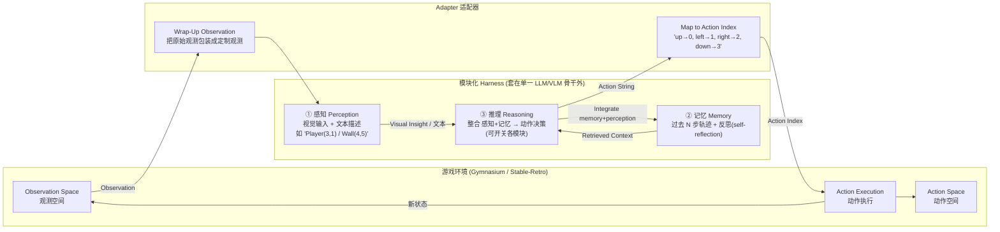

# General Modular Harness：让单一 LLM/VLM 骨干靠模块化 感知/记忆/推理 通吃多种多轮游戏

> **本篇定位**：这是 agent-harness 库 **B 组（控制循环 / L 层）** 的一篇 2025 前沿。它和标杆 Harness-Bench（2605.27922）互为镜像：Harness-Bench 站在 **V/O 层**问"怎么公平**度量** harness"；本文站在 **L 层**问"怎么**设计**一个能被度量、能被拆开消融的 harness"。读的时候请始终扣住一条主线——**"每个游戏手搓一个 agent" 不可复用；"模块化 harness" 让一个骨干通吃、且每个模块可单独消融**。
>
> 本文严格遵循库内 v1 硬规范（公式前给直觉、符号先定义、指标给定义式、数字标 §/Table/Eq 出处、区分宣称 vs 批判）、v2 增量（Why 三连 + 强制 Inspires-Us）与 harness 专属 Θ1–Θ5。

---

## §1　TL;DR（一页讲清这篇在干嘛）

> 主讲提示：开场先讲"痛"——现在每换一个环境就得手搓一套 agent workflow；再讲这篇的"解"——把 harness 拆成三块可插拔模块，一个骨干通吃四款游戏，还能逐块消融。最后点明层归属和权威性来源。

**一句话**：本文提出一套 **通用模块化 harness（General Modular Harness）**——把"让模型会干活"的那层软件，显式拆成**感知（Perception）/ 记忆（Memory）/ 推理（Reasoning）**三个**即插即用（plug-and-play）**模块，套在**单一 LLM/VLM 骨干**外面，就能在 **Sokoban、2048、Tetris、Candy Crush** 四款风格迥异的多轮游戏上跑，**无需为每个游戏写领域特定工程**（§1、Abstract）。因为模块可以逐个开关，它天然支持**消融**：把每个模块单独打开/关闭，就能量化"这个模块到底贡献了多少"（§3.3、§4.2、Table 2）。

**三条带走的结论**：
1. **有 harness 就是比没有强，且统计显著**：在全部 4 款游戏上，"全模块 harness"相对"无 harness 的裸 LLM 基线"**一致提升平均胜率/得分**，配对 t 检验 **p<0.05**（§4.1）——Candy Crush +217.50 分（p=0.0022）、2048 +17.81（p=0.0424）、Sokoban +1.97（p=0.0144）、Tetris +5.60（p=0.0490）。
2. **不同模块有不同"专长"（本文最有价值的消融结论）**：**感知主宰"大棋盘、强空间"的游戏**（Sokoban、Tetris）；**记忆主宰"长程规划、时序依赖"的游戏**（2048、Candy Crush），对**不会自我评估的非推理模型**尤其关键（帮它们不再重复无效动作）；**两者同开**收益普遍最大、甚至出现乘性叠加（§4.2、Table 2）。
3. **它是 `Agent = Model + Harness` 的结构性正例**：同一个骨干，**只加装 harness 模块**，分数就大幅摆动（如 Candy Crush 平均 +224.8%，Sokoban 平均 +337.5%，§4.1 / Figure 2）——这正面印证"能力不只来自模型，也来自脚手架"。

**属于 harness 的哪一层（Θ1）**：本篇主打 **L（Loop / 控制循环）**——它的本体是"感知→记忆→推理→动作"的**迭代交互循环**（Figure 1 的 "iterative interaction loops"）；同时**深度耦合 C（Context/记忆）层**（Memory 模块管"过去 N 步 + 反思"）与**感知层**（Perception 模块把 UI 变成文本/图像观测）。用库内六层坐标：**L 为主，C 与"感知"为辅**。

**权威性来源（Θ4）**：**ICML 2025 正式接收**（PMLR 267），出自 **UCSD**（Hao Zhang 组，vLLM/系统与 LLM agent 方向），并非预印本轶事，是**同行评审过的前沿**。

---

## §2　问题与动机：为什么"给游戏 agent 造一套通用 harness"值得做

> 主讲提示：这一页是 Why 三连的"问题层"。核心痛点一句话——"每个环境手搓 agent"三宗罪：不可复用、模块贡献混作一团、还要专家知识才能评。

**Why（问题层）——不解决会卡住什么？**
LLM/VLM agent 在 web/桌面自动化的多轮任务上已有不错结果（WebArena、Mind2Web、OSWorld；§1 开篇）。但这些成功**几乎都依赖领域定制的 workflow**——像 AutoGPT、LangGraph、Graph-of-Thoughts 这类系统，是"把几十个工具调用、UI 启发式、提示模板**手工串起来、且专为某个特定环境裁剪**"（§1 原文点名这三者）。这带来**三宗罪**（§1 三个 "First/Second/Third"）：

1. **不可复用（限制泛化）**：为 OSWorld 的 office 宏、或 WebArena 的站点特定交互**硬编码**的 workflow，**换个任务就废**（"fail to transfer across tasks"，§1 引 Research 2024 / Shen 2024）。
2. **模块贡献混作一团（无法隔离）**：这些 workflow 在结构上**盘根错节**，感知、记忆、推理组件**深度纠缠**，"几乎不可能把每个模块对整体表现的贡献摘出来"（"nearly impossible to isolate each module's contribution"，§1 引 Wang 2024 / Tan 2024）。
3. **要专家知识才能评（抬高门槛）**：这些任务常需领域专长（管 Excel、PowerPoint、系统工具），**同时抬高了 agent 的能力门槛和人工评估门槛**（§1）。

**后果**：领域缺一个**有原则、成体系**的方法，去研究"通用多轮环境里的模块化 agent 设计"（"the field lacks a principled, systematic method for studying modular agent design"，§1）。

**Why（设计层）——为什么用"游戏"当试验台，而非再堆真实任务？**
> 朴素替代方案：继续用 OSWorld / WebArena 这类真实任务基准。→ 会**重蹈上面三宗罪**——真实任务要专家知识、外部状态漂移、评估昂贵，且难以把模块拆开干净消融。
> 本文改用**经典 + 现代游戏套件**作"低门槛、高多样性"试验台，理由有三（§1 三个 "First/Second/Third"）：
> - **① 统一控制接口**：四款游戏都架在标准化的 **Gymnasium API**（Towers 2024）之上，另集成 **Stable Retro**（经典主机 ROM）走同一 Gym 接口——于是 pipeline 能**无缝扩展**，从网格类（Tetris）一路到富动画 IP（Pokémon），**几乎零集成开销**。
> - **② 干净抽象、共享结构**：游戏是"多轮交互任务的干净抽象"——机制/目标/动态各异，却共享同一"多轮交互结构"，天然适配通用 agent。
> - **③ 为快速人类可学而设计**：不像真实域要专业知识，游戏**规则简单直观、非专家也能玩**——这保证评估主要反映 agent 的**核心认知能力（感知/记忆/推理）**，而非"领域黑魔法"（domain-specific hacks）。

> **读出什么**：这篇的动机**不是**"造一个更能打的游戏 AI"，而是"给'模块化 agent 设计'这件事，造一把能**干净拆解、可复现**的**手术刀 + 标尺**"。游戏在这里是**受控实验台**，不是目的。这与 Harness-Bench 用"离线沙箱"换可复现性是同一种方法论洁癖。

**理论依据（为什么恰好是这三个模块）**：本文明确以 **Newell 的《统一认知理论》（Unified Theories of Cognition, 1990）** 为纲——该理论把**感知、记忆、推理**设为"核心、互锁的官能"（core, interlocking faculties）。于是作者在单一骨干上搭一个**三模块** harness，与认知科学的三分法对齐（§1）。

---

## §3　核心 intention 与研究问题（形式化成一句话）

> 主讲提示：把全篇 intention 压成一句可证伪的命题，再列出它要回答的三问。

**中心命题（可证伪）**：*存在一套**领域无关**的模块化 harness，使**同一个** LLM/VLM 骨干，在多款结构迥异的多轮游戏上，都**显著优于**无 harness 的裸模型；且通过开关模块，可将总提升**归因**到具体模块。*

它要回答三个问题（对应实验三节）：
- **Q1（有没有用）**：装上"全模块 harness"，相对裸 LLM，提升是否**一致且统计显著**？（§4.1，配对 t 检验 + Glass's δ）
- **Q2（谁的功劳）**：把 harness 拆成 **仅记忆 / 仅感知 / 两者都开**，各模块在**哪类游戏**上贡献大？（§4.2、Table 2 —— 本文核心消融）
- **Q3（够不够稳/可迁移）**：手工提示的**方差**能否用自动提示优化（DSPy/SIMBA）压下去，使结论不被"提示玄学"污染？（§4.3、Appendix D）

---

## §4　相关工作定位：它站在谁肩上、和谁不同

> 主讲提示：一张表讲清"游戏基准"与"带 harness 的 agent"两条脉络，点明本文的空位。

本文把相关工作分两脉（§2）：

**脉络 A：把游戏当基准（但多不带'思考'机制）**

| 代表工作 | 做什么 | 与本文的差别 |
|---|---|---|
| AlphaGo / TD-Gammon（Silver 2016；Tesauro 1994）| 棋类/双陆棋的规划与序列决策奠基 | 非 LLM，非通用语言 agent |
| OpenAI Gym（Towers 2024）| 统一游戏接口 | 本文**复用**它作统一控制接口 |
| GameBench / GameEval / GameArena / LMGame-Bench（Costarelli 2024；Qiao 2023；Hu 2024/2025）| 用游戏评 LLM 的策略/对话/推理 | 多为**评测**，本文重"**模块化 harness 设计**" |
| BALROG（Paglieri 2024）| 评 agentic LLM/VLM 玩游戏，含/不含视觉与历史 | **不含显式 thinking 机制**；本文纳入"思考"带来的显著增益 |
| LMAct（Ruoss 2024）| 多模态游戏的**上下文模仿学习** | 强调"喂观测-动作轨迹"；本文强调"**喂环境反馈让模型反思、从失败改进**" |

**脉络 B：带 harness / 反思 / 感知的 agent**

| 代表工作 | 机制 | 本文如何取用 |
|---|---|---|
| **Voyager**（Wang 2023）| Minecraft 里从环境反馈**炼技能、靠记忆复用** | 本文**受其开放式方法启发**（§1 明写 "Inspired by … Voyager"）|
| **Reflexion**（Shinn 2023）| **言语强化**：提示 agent 反思过往错误、迭代改进 | 本文 Memory 模块的**反思**信号即"akin to the Reflexion paradigm"（§1）|
| **ReAct**（Yao 2023）| 推理与行动交错（CoT + 环境反馈）| 本文推理循环的思想底座 |
| Factorio 学习环境（Hopkins 2025）| 迭代程序合成 + 符号记忆 | 同属"harnessed agent"谱系 |
| AgentBench / WebVoyager / AppAgent（Liu 2023；He 2024；Zhang 2025）| 多轮/真实 web/App 上的感知+决策 | 佐证"模块化 agent 设计"趋势 |

> **读出什么（空位）**：脉络 A 有"游戏基准"但多不测 thinking；脉络 B 有"反思/感知"但多为**单环境定制**。本文的**空位**正是二者交集——一个**跨游戏、可插拔、可消融**的三模块 harness，把 Reflexion 式反思、感知 grounding、ReAct 式循环，统一到"一个骨干通吃"的框架里。

---

## §5　方法总览（big picture）：三模块 + 适配器的一图流

> 主讲提示：先不碰数学。用 Figure 1 讲清"一次决策"怎么在四个部件间流转——感知把画面变文字/图；记忆塞进"过去 N 步 + 反思"；推理拍板出动作；适配器把动作字符串翻成环境能吃的整数索引。

**架构（据 Figure 1 重绘）**：单一 LLM/VLM 骨干被三模块包裹，与游戏环境（Custom GymEnv 或 RetroEnv）通过**迭代循环**交互；一个 **Adapter（适配器）**负责两端的"翻译"。

**一次决策的直觉走一遍**（§3.3 + Figure 1）：
1. **感知**拿到环境观测（原始画面），产出**文本化的结构表**（"Box at (2,3)"、"Wall at (4,5)"）或**叠加网格线/坐标标注的图像**，喂给骨干；
2. **记忆**把**过去 N 个游戏状态+动作**取回，并附上一段**反思**（"上一步 up 没能促成合并，效果有限；建议下一步…"），作为 **Retrieved Context** 一并塞给推理；
3. **推理**（骨干本体）**整合感知+记忆**，输出一个**动作字符串** + 思考（thought）；
4. **适配器**把动作字符串（"up"）**映射成环境动作索引**（0），交给环境执行；新状态回流，进入下一轮循环。

> **读出什么**：三个模块的接口非常"干净"——**感知的输出 = 观测的文本/图像表征；记忆的输出 = Retrieved Context（N 步历史 + 反思）；推理的输入 = 感知输出 ⊕ 记忆输出，输出 = 动作字符串**。正因为接口干净，**任何一个模块都能被单独摘掉**（例如关掉记忆 = 不提供 Retrieved Context），这就是**可消融性**的工程根源（下节详解每个接口）。

---

## §6　符号与术语表

> 主讲提示：这页是后文所有公式的字典，先立规矩。

| 记号 / 术语 | 含义（首次出现给中英对照）|
|---|---|
| **骨干 (backbone)** | 单一的 LLM 或 VLM（视觉语言模型），三模块共享同一个 |
| **感知模块 (Perception Module)** | 把 UI 输入转成文本/图像观测；三模式：text / vision / combined |
| **记忆模块 (Memory Module)** | 存"过去 $N$ 状态+动作" + 生成"反思 (self-reflection)" |
| **推理模块 (Reasoning Module)** | 通用控制器，整合感知+记忆 → 动作决策；负责模块开关 |
| **适配器 (Adapter)** | 观测包装 + 动作字符串↔动作索引的映射 |
| $\mathcal{S},\mathcal{A}$ | 状态空间、动作空间 |
| $\mathcal{R}:\mathcal{S}\times\mathcal{A}\times\mathcal{S}\to\mathbb{R}$ | 奖励函数：在状态 $s$ 执行动作 $a$ 转移到 $s'$ 得到的收益（§3.2）|
| $N$ | 记忆窗口：保留的历史状态-动作对数量（§3.3）|
| $\mathcal{J}_{[\min(0,i-N):i-1]}$ | 从第 $\max(0,i-N)$ 到 $i-1$ 步的**轨迹**（历史状态/动作/奖励），$i$ 为当前步（§3.4）|
| $R_{i-1}$ | 记忆模块在第 $i-1$ 步生成的**反思摘要**（reflective summary，§3.4）|
| $s_i$ | 当前（第 $i$ 步）状态（§3.4）|
| **ZS (Zero-Shot)** | 零样本：无任何模块支持、无记忆提示（Table 2 表头）|
| $\delta$ | Glass's δ 效应量（把成绩相对随机基线的偏离标准化，Eq.(1)）|
| $\bar X_{\text{model}},\bar X_{\text{rand}},s_{\text{rand}}$ | 模型均分、随机基线均分、随机基线标准差（§4.1.1）|
| **DSPy / SIMBA** | 声明式提示编译框架（Khattab 2023）/ 其自改进优化器（Wu 2019）|
| $\mathcal{P}^\star$ | 经优化选出的**最佳提示模板**（Algorithm 1）|
| $\mathcal{M}_o,\mathcal{M}_t$ | 优化器 LM 集合、目标 LM 集合（Algorithm 1）|

---

## §7　方法细节 · 感知模块：把"看画面"变成"读坐标"

> 主讲提示：这是三模块里最"VLM"的一块。核心直觉——网格游戏别让模型去"看图数格子"，直接把后端的确定性布局喂成文本坐标，省掉感知误差；真要看图，就叠网格线+坐标降低 VLM 出错。

**Why（问题层）**：视频游戏本质多模态（§3.3）。若直接把渲染图丢给模型，VLM 常在"这个方块在第几行第几列"上**数错格子**——**感知误差**会污染下游一切推理。

**接口（输入→输出）**：**输入** = 环境的原始 UI 观测；**输出** = 骨干可读的**游戏状态表征**。三种模式（§3.3）：

- **text（纯文本）模式**：对网格类游戏（Sokoban / Candy Crush / 2048 / Tetris），**直接从游戏后端**抽取视觉布局，输出一张**结构化坐标表**——如 `Box at (2,3)`、`Wall at (4,5)`。这让模型能"**无需依赖原始图像**就对空间关系推理，从而**最小化感知误差**"（§3.3 原文）。
- **vision（视觉）模式**：把渲染的 UI 图像交给 VLM 的感知能力去转文字描述；**为提高准确率，在图上叠加网格线与坐标标注**（overlay grid lines and coordinate labels），以降低 VLM 感知误差（§3.3）。
- **combined（组合）模式**：**同时**给"美化过的图像 + 后端来的确定性文本表征"——给模型**更丰富也更可靠**的输入（§3.3）。

**Why（设计层）——为什么要给三种模式，而非只给图或只给文？**
> 朴素做法① 只喂图：→ VLM 数格子出错，感知误差污染推理（尤其小网格、密排布局）。
> 朴素做法② 只喂文：→ 丢掉了 VLM 的视觉能力，也无法研究"感知 grounding 对空间任务到底多重要"。
> 本文给**三档可切换**：既能用 text 模式做"感知几乎无误差"的干净基线，又能用 vision/combined 去**度量视觉 grounding 的边际价值**——这正是 §4.2 能得出"感知主宰空间型游戏"结论的**实验前提**。

> **读出什么**：感知模块的可切换性，本身就是一个**消融旋钮**——把 text↔vision 一换，就能看"当感知从'近乎完美'退化到'要 VLM 自己看'时，成绩掉多少"。这把"感知有多重要"变成了**可测量的量**。

---

## §8　方法细节 · 记忆模块：过去 N 步 + 反思，当成"内部奖励"

> 主讲提示：这是本文与 Reflexion 血脉最近的一块，也是长程游戏的胜负手。核心直觉——不会自我评估的模型会**一遍遍重复同一个无效/非法动作**；给它一段"回看过去、点评自己"的反思，就能跳出死循环。

**Why（问题层）**：有些游戏（如 2048）要**多步规划**（§3.3）。裸模型没有"回看自己刚才干了啥、有没有效"的机制，于是**卡在重复的无效/非法动作里**出不来（§4.2 明确点出这是非推理模型的通病）。

**接口（两个组件，§3.3）**：
1. **存储近期轨迹**：维护**过去 $N$ 个**游戏状态与动作；
2. **反思（self-reflection）**：对近期动作**生成反思**——把当前状态与先前状态**对比**，**鼓励模型点评自己上一步的对错**，作为一种**短期记忆**。

**把反思形式化为"内部奖励"**（§3.3）：与 Gymnasium 一致，作者把这个反思过程当作一个**内部奖励函数**
$$\mathcal{R}:\mathcal{S}\times\mathcal{A}\times\mathcal{S}\to\mathbb{R}$$
- 直觉：为什么要这个式子？——它把"模型对自己上一步好坏的判断"**显式建模成一个奖励信号**，从而让模型**识别并纠正**次优/非法动作，而不是傻乎乎重复。
- 符号（先定义）：$\mathcal{S}$ 状态空间、$\mathcal{A}$ 动作空间；$\mathcal{R}(s,a,s')$ 给出"从 $s$ 执行 $a$ 到 $s'$"的**自评收益**。
- 读出什么：这是一个**自我评估（self-evaluation）**信号，目标是"增强连贯决策、适应游戏动态变化，让 agent 去**优化策略**而非**困在重复无效动作**里"（§3.3 原文）。

**记忆如何进入提示（Prompt 结构，§3.4）**：第一阶段的提示结构化为
$$\big[\;\{\mathcal{J}_{[\min(0,\,i-N):\,i-1]}\},\; R_{i-1},\; s_i\;\big]$$
- 直觉：为什么这样拼？——把"**最近 N 步的轨迹** + **上一步的反思摘要** + **当前状态**"三样一起喂给推理，模型才既知道"我从哪来"、又知道"我刚才被点评了啥"、还知道"我现在在哪"。
- 符号（先定义）：$\mathcal{J}_{[\min(0,i-N):i-1]}$ = 从第 $\max(0,i-N)$ 步到第 $i-1$ 步的历史轨迹（状态/动作/奖励）；$R_{i-1}$ = 记忆模块在上一步生成的**反思摘要**；$s_i$ = 当前状态；$i$ = 当前步序号，$N$ = 记忆窗口。
- 读出什么：**关掉记忆模块 = 把 $\{\mathcal{J}\}$ 与 $R_{i-1}$ 从这个三元组里抽走，只剩 $s_i$**。这就是 Table 2 里 "ZS" 与 "+Memory Only" 的机制差别——**可消融性再次落到接口层面**。

（附录 B.2 的 GPT-4o vs o3 案例佐证：在 2048 上，GPT-4o 的反思只关注"这一步的即时效果"（"up 增加了空格但没合并"），而 o3 的反思会**拆解到底哪些 tile 合并了、合并阶梯怎么形成、空格数怎么变**，并**把局部结果接回长期的"角落主宰"策略**——说明**同一个记忆接口，强模型能榨出更有用的反思**。)

---

## §9　方法细节 · 推理模块：通用控制器 + 消融总开关

> 主讲提示：这块最短但最关键——它是"大脑皮层"，把感知和记忆的信息汇总成最终动作；更重要的是，**它掌管所有模块的开关**，这正是全文"可消融"的实现处。

**接口与职责**（§3.3）：推理模块是一个**通用控制器（general-purpose controller）**，**整合来自感知与记忆模块的信息**，**决定 agent 的最终动作**。

**它为什么是"消融"的枢纽**：原文明写——推理模块"**允许对模块集成做灵活控制**——使我们能在评估中**激活或停用特定模块**。这一设计支持**系统性地分析每个组件对整体表现的贡献**"（§3.3 原文）。

> **读出什么（Θ1 落点）**：这正是"**L 层**"的心脏——**控制循环**不仅决定"下一步做什么"，还决定"这一步用哪些模块"。把推理模块视作 orchestrator，它对感知/记忆的开关，就等价于我们自己 harness 里"要不要注入工具结果 / 要不要压缩上下文 / 要不要调子代理"的编排决策（见 Inspires-Us）。

**Why（设计层）——为什么把"开关"放进推理模块，而不是外挂一个实验脚本？**
> 朴素做法：在外面写脚本，跑之前决定"这次带不带记忆"。→ 可行，但**耦合在实验框架里**，换游戏就要重写。
> 本文把开关内建进控制器：于是"消融"成为 harness 的**一等公民**——任何新接入的 Gym 游戏，都天然继承"可开关、可消融"的能力，零额外工程。这与 §2 的核心动机（可复用 + 可隔离）首尾呼应。

---

## §10　游戏与指标设计：四款 NP-硬/完全的游戏 + 归一化得分

> 主讲提示：先说清为什么挑这四款（都难、且各考不同认知维度），再把每款的打分口径讲准——附录 A 给了确切定义，务必标出处。

**四款游戏为何是它们**（§3.1）：都**计算上困难**且**各有认知侧重**——

| 游戏 | 复杂度 | 主要考察（§3.1）|
|---|---|---|
| **Sokoban（推箱子）**| NP-hard（Dor & Zwick 1999；Culberson 1997 PSPACE-complete）| 视觉感知 + 空间推理 + 长程规划避死锁；**容错极低**，多数动作不可逆，一步错即失败 |
| **Tetris（俄罗斯方块）**| NP-complete（Demaine 2003）| 视觉模式识别（7 种形状）+ 空间推理（旋转匹配）+ 部分可观测下的长程规划 |
| **2048（合并方块）**| NP-complete（Abbasi & Saffidine 2018）| 视觉追踪 tile 值 + 空间推理管合并路径 + 长程规划最大化合并潜力 |
| **Candy Crush（三消）**| NP-hard（Walsh 2014）| 视觉辨色 + 空间推理预判连锁 + 有限步数下的长程规划 |

> **读出什么**：四款覆盖了"**强空间/大棋盘**（Sokoban、Tetris）"与"**长程/时序依赖**（2048、Candy Crush）"两个维度——这个**刻意的二维覆盖**，正是后面能得出"感知 vs 记忆各有专长"的原因。

**指标口径（§3.2 + Appendix A，务必标准确）**：把游戏内建分数**归一化到连续线性刻度**，以敏感捕捉差异。逐款（Appendix A）：
- **Sokoban**：**推上目标点的箱子总数**，跨所有关卡累加，直到**首次死锁**为止。
- **Tetris**：**落下的方块总数 + 消除的行总数**，测到 game over。
- **2048**：所有合并 tile 值之和（合并两个 2 得 +2），记到棋盘"停滞"（连续十步无有效合并/移动）为止；再报
$$\mathrm{Score}_{2048}=10\times\log_2(\text{total merged sum})$$
  - 直觉：为什么取 $\log_2$？——2048 的分数天然按 2 的幂增长（tile 值翻倍），取 $\log_2$ 把"指数级增长"压回"线性刻度"，让不同水平的差异可比、可做统计。
- **Candy Crush**：**固定 50 步**内消除的糖果总数。

奖励类型分两种（§3.2）：**进程奖励（progression rewards）**——稠密、逐步（如 Tetris 的 running score、2048 的累计合并、Candy Crush 的累计消除）；**长程奖励（long-horizon rewards）**——稀疏、仅在完成多步目标时给（如 Sokoban 把箱子多步引导到目标，细节见 Appendix A）。

---

## §11　实验设置：13 个模型、有/无 harness 对照、三次运行

> 主讲提示：把 setting 一次报全——测了哪些模型、跑几次、随机基线怎么估、成本几何。强调"高成本 → 只能小规模三次跑"，这是诚实的局限伏笔。

- **模型池（§4，Table 1）**：**13 个 SOTA 模型**，含推理型与非推理型——claude-3-5/3-7-sonnet（3-7 带 thinking）、deepseek-r1、gemini-2.5-flash/pro-preview（thinking）、grok-3-mini-beta（thinking）、llama-4-maverick、gpt-4.1、gpt-4o、o1、o1-mini、o3、o4-mini。
- **对照**：每个模型**有 harness / 无 harness** 两跑，外加 **Random（随机策略）**行作参照（Table 1 末行）。
- **重复与成本**：**每个模型每款游戏跑 3 次**取平均；**标 * 者仅单次**（o1、o3），因"截至 2025-05-01 成本过高"（Table 1 脚注）——作者坦承这是**小规模（small-scale）**设置，结论"preliminary 但已强而一致"（§4.1）。
- **随机基线估计（§4.1.1）**：模拟 **30 次随机游戏**估其均值 $\bar X_{\text{rand}}$ 与标准差 $s_{\text{rand}}$；**Sokoban 随机方差为 0**（随机几乎推不动箱子），故 Glass's δ 分析**排除 Sokoban**，只在其余三款算。
- **消融配置（§4.2、Table 2）**：4 档——**ZS（零样本，无模块）/ +Memory Only（仅记忆）/ +Perception Only（仅感知）/ +Both（都开）**；消融在 **6 个模型 × 4 款游戏**上做（o4-mini、gemini-2.5-pro、claude-3-7-sonnet、llama-4-maverick、claude-3-5-sonnet、gpt-4o）。
- **提示标准化（§3.4、§4.3、Appendix D）**：两阶段——① 经验性提示工程；② 用 **DSPy + SIMBA** 自动优化，跨目标模型选平均奖励最高的模板 $\mathcal{P}^\star$（Algorithm 1/2），把 $k=20$ 步内的提示方差压下去。

---

## §12　主结果 Q1：装上 harness，四款全赢、且统计显著

> 主讲提示：这是"有没有用"的定论页。先报四个 p 值全 <0.05，再报效应量把"离随机多远"量化。别只念数，讲清"为什么 Candy Crush 涨得最猛"。

**配对 t 检验（§4.1.2）**——有 harness vs 无 harness，跨全部游戏：
| 游戏 | 平均提升 Δ | t 值 | p 值 |
|---|---:|---:|---:|
| **Candy Crush** | **+217.50** | 4.22 | **0.0022** |
| Sokoban | +1.97 | 3.02 | 0.0144 |
| 2048 | +17.81 | 2.36 | 0.0424 |
| Tetris | +5.60 | 2.27 | 0.0490 |

四款**全部 p<0.05**——"modular harness 显著改进无 harness 设计"（§4.1.2）。Figure 2 的**逐模型**差值（Harness − No Harness）显示 **Candy Crush 中位增益最高**，Sokoban 平均相对增幅达 **+337.5%**、Candy Crush **+224.8%**、2048 **+22.4%**、Tetris **+27.1%**（Figure 2 标注）。

**效应量：Glass's δ（§4.1.1，Eq.1）**——
> 直觉：为什么要 δ 而非只看原始分差？——不同游戏分数量纲天差地别；用"相对随机基线波动的标准化距离"才能跨游戏比较"离随机有多远"。

符号（先定义）：$\bar X_{\text{model}}$ = 某模型-游戏-条件的均分；$\bar X_{\text{rand}}$、$s_{\text{rand}}$ = 随机基线的均值与标准差（由 30 次随机跑估计）。
$$\delta=\frac{\bar X_{\text{model}}-\bar X_{\text{rand}}}{s_{\text{rand}}}\tag{1}$$
读出什么：δ 越大越"远离随机"。结果（§4.1.1）——**30 个有 harness 的 δ 里 29 个为正**（仅 1 负），无 harness 只有 **17/30** 为正；有 harness 在 **23/30（≈76.7%）** 的情形跑赢无 harness。平均效应量：
$$\bar\delta_{\text{harness}}=2.757,\quad \bar\delta_{\text{no}}=0.009,\quad \Delta^\star=\bar\delta_{\text{harness}}-\bar\delta_{\text{no}}=2.748$$
即**有 harness 的模型，行为远离随机的程度是无 harness 的数百倍**（0.009→2.757）。

**Why（结果层）——为什么 Candy Crush 涨得最猛（+217.50 / +224.8%）？**
Candy Crush 是"**复杂时序依赖 + 延迟奖励**"的典型（§4.2）——裸模型看不到"这一步布局对后续连锁的影响"，几乎在瞎点；一旦记忆模块把"过去布局 + 反思"喂进来，模型才能**预判连锁、保存空间**，于是提升幅度远超以"即时进程奖励"为主的 Tetris（+5.60）。这条把"提升幅度"和"游戏的时序结构"直接挂钩，为下一节的模块归因埋好伏笔。

---

## §13　主结果 Q2（本文核心）：消融——感知主宰空间，记忆主宰长程

> 主讲提示：这是全场最该停留的一页。Table 2 是本文的"命门"。逐游戏讲"谁的功劳大"，并给机制解释。切记讲"combined 常出现乘性叠加"这个反直觉点。

**Table 2（4 档 × 6 模型 × 4 游戏，节选关键行）**——ZS / +Memory Only / +Perception Only / +Both：

| 游戏 | 模型 | ZS | +Mem | +Perc | +Both |
|---|---|---:|---:|---:|---:|
| **Sokoban** | o4-mini | 1.3 | 1.3 | **5.3** | 5.3 |
| （空间型）| gemini-2.5-pro | 1.0 | 1.0 | **6.0** | 4.3 |
| | claude-3-7-sonnet | 0.0 | 0.3 | 0.7 | **2.3** |
| **Tetris** | o4-mini | 14.7 | 14.7 | **38.0** | 23.3 |
| （空间型）| gemini-2.5-pro | 12.3 | 15.0 | **21.3** | 23.3 |
| | claude-3-7-sonnet | 13.0 | 15.7 | **20.0** | 16.3 |
| **2048** | gpt-4o | 70.4 | **107.0** | 73.3 | 106.7 |
| （长程型）| claude-3-5-sonnet | 57.8 | **102.5** | 66.3 | 106.0 |
| | llama-4-maverick | 44.6 | **98.1** | 73.7 | 106.0 |
| **Candy Crush** | o4-mini | 110.7 | 202.3 | 32.0 | **487.3** |
| （长程型）| claude-3-7-sonnet | 126.3 | 187.3 | 270.3 | **484.0** |
| | gemini-2.5-pro | 177.3 | 93.7 | 386.7 | **416.3** |

**逐条读出什么（§4.2 原文归纳）**：

- **感知模块 → 空间型游戏（Sokoban / Tetris）大赢**：在 Sokoban，"视觉脚手架尤其帮到 Gemini、O4-mini"（如 o4-mini Sokoban 1.3→**5.3**、Tetris 14.7→**38.0**，全由感知带动）；这些**结构化空间输入解锁了原本被'裸 token 级输入'埋没的规划行为**（§4.2）。→ **感知 grounding 对几何/空间环境是关键。**

- **记忆模块 → 长程型游戏（2048 / Candy Crush）大赢，且对弱/非推理模型尤甚**："在 2048，**零样本表现弱**的模型（Claude-3.5、GPT-4o）**靠记忆大幅改善**"（如 GPT-4o 2048 70.4→**107.0**，claude-3-5 57.8→**102.5**）；在 Candy Crush 更戏剧化——**记忆不仅拉高均分，还降低方差、稳住跨局表现**（§4.2）。机制：**非推理模型缺自我评估，会重复无效动作；记忆的反思正好补上这一课**（§4.2 明写）。→ **记忆对长程规划是命门。**

- **两者同开 → 普遍最强，甚至"加性乃至乘性"叠加**："最强增益出现在两模块都开时……在 Candy Crush，Gemini 与 Claude-3.7 在**全支持**下取得巨大提升"（如 o4-mini Candy Crush 110.7→**487.3**、claude-3-7 126.3→**484.0**）；作者称组合支持产出"**additive or even multiplicative improvements**"，并揭示单模块下**被掩盖的能力差异**——"双模块设置成了一个**更高分辨率的基准**"（§4.2）。

**Why（设计层/结果层）——为什么"感知/记忆各有专长"是可信的，而非噪声？**
> 因为它**与游戏的认知结构严丝合缝**（§10 的二维覆盖）：空间型游戏的瓶颈在"看没看准棋盘"，所以补感知立竿见影、补记忆几乎没用（Sokoban 的 +Mem 列几乎不动，如 o4-mini 1.3→1.3）；长程型游戏的瓶颈在"记不记得住、会不会自评"，所以补记忆立竿见影、补感知有时甚至**帮倒忙**（Candy Crush 的 o4-mini +Perc 反而 110.7→32.0，被作者归入"感知输入过载/干扰长程决策"一类现象）。**这种"瓶颈-模块"对应关系的可预测性**，正是"模块化 + 可消融"的价值兑现。

> **读出什么（反直觉点，务必强调）**：**+Both ≠ 两个单模块之和**——有时远超（Candy Crush 乘性放大），有时低于最好的单模块（Sokoban/Tetris 上 o4-mini 的 +Both 23.3 反低于 +Perc 38.0，提示"记忆在纯空间任务里可能引入噪声"）。**模块之间存在交互（interaction），不是简单线性可加**——这本身就是"必须做消融、不能只看全开"的最强论据。

---

## §14　主结果 Q3：用 DSPy/SIMBA 把"提示玄学"的方差压下去

> 主讲提示：这页回答"结论会不会只是提示运气好"。核心——手工提示方差能超一个标准差；用自动优化把两个候选提示的差距砍掉 33.8%–63.5%，让结论更稳。

**Why（问题层）**：提示工程对 LLM 表现影响巨大，"**即便精心设计的提示，方差也能超过一个标准差**"（§4.3、§3.4）——若不控制，模块消融的结论可能被"提示运气"污染。

**做法（§3.4、Algorithm 1/2、Appendix D）**：两阶段——① 先按 agentic 实践做**经验性提示工程**；② 用 **DSPy** 标准化，套 **SIMBA** 优化器，在 $k$ 步内**跨目标 LM 联合优化**，选平均奖励最高的 $\mathcal{P}^\star$。优化器 LM 集合 $\mathcal{M}_o=\{$o3, gemini-2.5-pro, claude-3.7, deepseek-R1, grok3-mini$\}$，$k=20$（Algorithm 1；D.3）。

**结果（Table 5，2048）**：定义 $|\Delta_e|$、$|\Delta_p|$ 为"两个候选提示模板（P1 vs P2）在经验优化 / DSPy 优化下的表现差距"（越小越稳）：

| 模型 | 经验 P1 | 经验 P2 | $\|\Delta_e\|\downarrow$ | DSPy P1 | DSPy P2 | $\|\Delta_p\|\downarrow$ |
|---|---:|---:|---:|---:|---:|---:|
| gemini-2.5-flash-preview | 1697.3 | 1478.7 | 218.6 | 1746.0 | 1601.3 | **144.7** |
| claude-3-5-sonnet | 2624.0 | 2235.3 | 388.7 | 2786.0 | 2928.0 | **142.0** |
| o4-mini | 4432.0 | 3680.0 | 752.0 | 3851.3 | 4320.0 | **468.7** |

读出什么：三个模型上，DSPy 优化把"两候选提示的表现差距"**降低 33.8%–63.5%**（§D.3 原文），即**大幅降低对'具体提示写法'的敏感性**——这让"模块消融"的结论更可信：分数的摆动来自**模块**，而非**提示玄学**。

**附带的能力相关性（§4.4、Figure 3、Appendix C）**：把"harness 加持的游戏得分"与 **20 个公开基准**（跨 factual/physics/math/code/vision/language/puzzle 七类）做 **Spearman 相关**——Sokoban 与数学/编码强相关；Tetris、2048 与模式识别类（EnigmaEval、NYT-connections）对齐；Candy Crush 与编码显著相关（"algorithmic reasoning"）。→ **游戏得分并非孤立玩具指标，而可作更广模型能力的代理。**

---

## §15　局限与批判（原文承认的 + 我的补充）

> 主讲提示：诚实是判断力。先念作者自陈的小规模/初步，再补几条社区式质疑，最后接 Θ5 的 regime 诚实。

**原文自陈（诚实）**：
- **小规模、初步**：每模型每游戏仅 **3 次**（部分单次），因**成本高**（Table 1 脚注、§4.1）；作者称结果 "preliminary" 但已"strong and consistent"。
- **随机基线的边界**：Sokoban 随机方差为 0，被排除出 δ 分析（§4.1.1）——即效应量结论只覆盖 3 款。
- **提示仍有残余方差**：即便 DSPy 优化，也只是**降低**而非消除对提示的敏感（§4.3、Table 5 的 $|\Delta_p|$ 仍非 0）。

**我的补充批判**：
- **只有 4 款游戏、且都是网格/谜题类**：Sokoban/2048/Tetris/Candy Crush **全是确定性、离散、网格**游戏——结论对"实时、连续、对抗性"游戏（如即时战略、FPS）能否外推，**原文未给出**证据。"通吃多种游戏"的"多种"其实是**同一族**。
- **"感知 text 模式"其实偷了后端**：text 模式**直接从游戏后端**抽坐标（§3.3），这在真实世界（无法访问后端渲染树）**不成立**——它度量的是"若感知近乎完美，推理能到多好"，而非"端到端感知有多难"。这点作者未点破，是"感知贡献"结论的**边界**。
- **模块交互未被系统建模**：§13 已见 +Both 有时低于最好单模块（记忆在纯空间任务帮倒忙），但原文**未给"何时该关某模块"的判据**——只报了现象，没给**在线的模块门控（gating）策略**。这是留给后续的坑（见 Inspires-Us c）。
- **无开源链接**：正文/附录**未提供代码仓库**（原文未给出），复现依赖自建 Gym 封装 + 各家 API，成本与工程量都不低。
- **评估用"游戏内建分"**：归一化分数（Appendix A）是**进程/结果分**，未含"过程质量/安全/契约"等 Harness-Bench 式维度——它测"打得多好"，不测"打得多稳/多守规矩"。

---

## ★ 对我们的启发（Inspires Us）

> 这一节是组会高潮，也是本库相对 auto-research 的独门优势：**我们（Claude Code / 本课 m9.* 的 agent）本身就是一个 harness**——有真实的 ReAct 循环、工具预算、上下文压缩/compaction、子代理编排。本文"把 harness 拆成可开关模块、逐块消融"的做法，**正对应我们该怎么拆分并评估自己的组件**。下面每条都落到自己身上。

➤ **a. 可直接借用的招（method we can reuse）**：**"接口干净 → 模块可开关 → 逐块消融"这套工程范式**可整体搬来。本文的关键不是三个模块本身，而是**把每个模块的接口收窄到一处**（感知=观测表征；记忆=Retrieved Context=$\{\mathcal{J}\}\oplus R_{i-1}$；推理=前两者的整合），于是"关掉某模块"= "从提示三元组 $[\{\mathcal{J}\},R_{i-1},s_i]$ 里抽掉对应项"（§3.4）。→ 我们可以照此，把自己 harness 的**上下文压缩、工具结果注入、子代理召回**各自收成"一个可开关的注入点"，用**同一个总开关（对应本文的推理模块）**统一控制。

➤ **b. 可迁移到我们的模块（transfer）**：把本文"**感知主宰空间 / 记忆主宰长程**"的**瓶颈-模块对应表**，迁移成我们自己的"**任务类型 → 该重投哪个组件**"决策表。迁移时要改的前提：本文的"感知"靠**访问游戏后端**拿确定性坐标（真实世界拿不到），所以映射到我们这儿，"感知"应换成"**检索/上下文 grounding 质量**"这一可控旋钮。可接到 auto-research 的 `m9.6`（评测沙箱）：给每个研究任务先分类"重感知(检索) 还是 重记忆(长程状态)"，再决定把工程力气投在 RAG 还是 状态/记忆压缩。

➤ **c. 它暴露的开放问题 = 我们的机会（open problem → our opportunity）**：§13 发现 **+Both 有时低于最好的单模块**（记忆在纯空间任务里帮倒忙），但原文**只报现象、没给"何时关哪个模块"的在线判据**。机会：设计一个**在线模块门控器（module gating）**——在循环每一步，依据"当前任务/状态特征"动态决定"这一步启用感知/记忆/子代理中的哪些"。**可下手的第一步**：在我们的 ReAct 循环里加一个轻量分类器，判"这一步更需要 检索 还是 历史反思"，只注入需要的那一路，量化它能否在不掉准确率的前提下省 token。

➤ **d. 与本库其它论文/模块的连接（connect the dots）**：与 **标杆 Harness-Bench（2605.27922）正面互补**——Harness-Bench 从 **V/O 层**问"怎么**度量** harness"，本文从 **L 层**问"怎么**设计成可度量/可消融**的 harness"；两者拼起来就是"**设计-度量闭环**"：本文的"逐模块消融"正好给 Harness-Bench 的"配置级比较"提供了**更细的粒度**（不只比 harness A vs B，而是比 harness 内部某模块 on vs off）。与本文血脉最近的是 **Reflexion（记忆反思）** 与 **ReAct（推理循环）**、**Voyager（记忆复用）**——它把三者收编进"一骨干通吃"的可消融框架。与 auto-research 的 `m9.2`（带 critic 的 research-agent）呼应：本文的"记忆反思 = 内部奖励"与 critic 的"独立质疑"是**同一类自评机制**的两种实现。

➤ **e. 如果我来做下一步（my next move，第一人称）**：我会先在我们某个 `m9.*` agent 上**复刻这套"模块开关 + 逐块消融"**——把"上下文压缩"和"子代理召回"各做成一个可开关的注入点，在 10 个任务上跑 **ZS / +压缩 / +子代理 / +Both** 四档，看是否也出现本文那种"**+Both 有时低于最好单模块**"的交互效应；若出现，就据此写一个**最小的模块门控规则**（例如"短任务默认关子代理"），再测它能否在保住成功率的同时压低 token/turns。

---

## §16　版图定位（canon/前沿坐标 + 在本库的位置）

> 主讲提示：收口三件事——时间坐标(Θ4)、命题回扣(Θ2)、层归属(Θ1) + regime 诚实(Θ5)。

**时间坐标（Θ4，前沿）**：**2025 前沿，ICML 2025 正式接收**。它相对本库基石推进了**一步关键的"可消融性"**——ReAct（2023）定义了"推理+行动"的循环、Reflexion（2023）给了"言语反思"、Voyager（2023）给了"记忆复用"，但它们**各自嵌在单一环境的定制 agent 里**；本文把这三条**统一进一个跨游戏、可插拔、可逐块消融**的模块化 harness，**首次把"每个模块贡献多少"做成了可测量的量**（§4.2）。

**命题回扣（Θ2）——`Agent = Model + Harness` 的正面结构性例证**：本文是这条命题的**"结构侧"证据**（Harness-Bench 是"度量侧"证据）。它抓出的"同模型换 harness 的数字摆动"包括——**Candy Crush 平均 +224.8%、Sokoban +337.5%**（Figure 2），以及消融里 **o4-mini 的 Candy Crush 110.7→487.3（+Both）、Sokoban 1.3→5.3（+Perc）、GPT-4o 的 2048 70.4→107.0（+Mem）**（Table 2）——**模型没变，变的只是挂了哪个 harness 模块**。按库内机制解释：这些提升分别来自"感知补齐空间 grounding"与"记忆补齐自我评估/长程状态"，正是"**模块化 harness 让单一模型通吃多任务**"这一命题的**教科书式正例**。

**E/T/C/L/O/V 归属（Θ1）**：**主 L（控制循环）**——本体是"感知→记忆→推理→动作"的迭代循环 + 推理模块的模块开关（orchestration）；**辅 C（Context/记忆）**（Memory 模块的 N 步窗口 + 反思）与**感知层**（Perception 三模式）。

**regime 诚实（Θ5，不绝对化）**：本文**不能**被读成"harness 永远碾压 model"。恰恰相反，它的消融给出了**分 regime 的量化坐标**——
- **harness 增益巨大的 regime**：**弱/非推理模型 + 长程时序游戏**（如 GPT-4o/Claude-3.5 在 2048/Candy Crush，靠记忆翻盘）、**任一模型 + 强空间游戏**（靠感知解锁规划）。
- **harness 增益有限甚至为负的 regime**：**纯空间任务上叠加记忆**（Sokoban/Tetris 的 +Mem 几乎不动、+Both 有时反低于 +Perc）——说明**模块与任务不匹配时，harness 会引入噪声**。
- 与库内另一侧证据（METR / Scale AI 发现某些强模型族里 harness 选择落在误差内）并读：诚实表述是 **"哪个模块、在哪类任务、对多强的模型"三者共同决定 harness 的边际价值**——本文的 Table 2 正是这张"三维价值地图"的一角。

**在本库的位置**：**B 组（控制循环）⭐ 前沿样本**；是全库命题的**结构性压舱石**之一。读完它，再回看 C 组（工具/ACI）、D 组（上下文/记忆）的任何一篇，都能问一句："它动的是本文三模块里的哪一个（感知/记忆/推理）？它有没有把那个模块做成**可消融**的？"

---

## §17　组会讨论问题（留给大家吵）

1. **"感知 text 模式偷后端坐标"**（§3.3）让感知近乎无误差——若强制只用 vision 模式（VLM 自己看图），§13 的"感知主宰空间型"结论还成立多少？我们该如何设计一个"端到端感知难度不可绕过"的消融？
2. §13 出现 **+Both 低于最好单模块**（记忆在纯空间任务帮倒忙）。这是"记忆注入了噪声"还是"上下文变长挤占了推理预算"？你会怎么设计消融把这两种解释分开？
3. 本文四款游戏**全是确定性网格谜题**。把这套三模块 harness 搬到**实时/对抗**游戏（星际、Atari 动作类），你预期**哪个模块最先失效**？为什么？
4. 记忆模块把反思形式化为**内部奖励** $\mathcal{R}:\mathcal{S}\times\mathcal{A}\times\mathcal{S}\to\mathbb{R}$（§3.3），但反思由**同一个骨干**生成——这会不会"自己给自己打分、自我强化偏见"？和 auto-research 的"谁来 critic the critic"是不是同一隐忧？
5. §4.4 说游戏分与 20 个通用基准相关。这是"游戏是好代理指标"的证据，**还是**"强模型到处都强"的平凡相关？如何证伪后者？
6. 若把本文的"模块开关"接进**我们自己的 harness**（上下文压缩/子代理），你预测会不会复现"+Both 有时更差"的交互？该用什么最小实验验证？

---

## §18　一页速记 takeaways

- **命题**：存在**领域无关**的模块化 harness——**感知/记忆/推理**三个可开关插件，套在**单一 LLM/VLM 骨干**外，通吃 Sokoban/2048/Tetris/Candy Crush，且**可逐块消融**（ICML 2025，UCSD）。
- **三接口（可消融的工程根源）**：感知=观测的文本坐标/叠标注图（三模式 text/vision/combined）；记忆=Retrieved Context=$[\{\mathcal{J}_{[\,i-N:i-1]}\},R_{i-1}]$（N 步轨迹 + 反思，反思被形式化为内部奖励 $\mathcal{R}:\mathcal{S}\times\mathcal{A}\times\mathcal{S}\to\mathbb{R}$）；推理=整合前两者 + **掌管模块开关**（消融枢纽）。
- **Q1 有没有用**：四款**全赢**、配对 t 检验 **全 p<0.05**（Candy Crush +217.50/p=0.0022…）；效应量 $\bar\delta_{\text{harness}}=2.757$ vs $\bar\delta_{\text{no}}=0.009$。
- **Q2 谁的功劳（核心消融，Table 2）**：**感知主宰空间型**（Sokoban o4-mini 1.3→5.3、Tetris 14.7→38.0）；**记忆主宰长程型**（2048 GPT-4o 70.4→107.0，对弱/非推理模型尤甚）；**+Both 普遍最强、甚至乘性**（Candy Crush o4-mini 110.7→**487.3**）——但**+Both≠单模块之和**，存在**模块交互**（记忆在纯空间任务有时帮倒忙）。
- **Q3 稳不稳**：DSPy/SIMBA 把两候选提示差距压 **33.8%–63.5%**（Table 5），排除"提示玄学"污染；游戏分与 20 个通用基准正相关（§4.4）。
- **诚实边界**：小规模（3 次/单次）、四款全是确定性网格谜题、text 感知偷后端坐标、无开源链接、模块门控判据缺失。
- **对我们（Θ3）**：把自己 harness 的**上下文压缩/子代理**各做成"可开关注入点"，用统一总开关跑 **ZS/+压缩/+子代理/+Both** 消融，看是否复现"+Both 更差"的交互；据此写**最小模块门控规则**省 token。
- **版图（Θ1/Θ2/Θ4/Θ5）**：**L 层为主（辅 C/感知）**；`Agent=Model+Harness` 的**结构性正例**（同模型换模块，Candy Crush +224.8%）；**2025 前沿**（把 ReAct/Reflexion/Voyager 收编进"可消融"框架）；**不绝对化**——harness 增益**分 regime**（弱模型+长程/强空间任务最吃 harness；纯空间叠记忆反受损）。
