# 上下文工程综述：把『喂什么进上下文窗口』升级为一门工程学科

> **本篇定位**：这是 agent-harness 库 **C（上下文）层的纲领性综述**。它不提新方法，而是做三件事：(1) 给 "context engineering" 一个**形式化定义**（不再是 prompt = 一个静态字符串，而是 `C = A(c1,…,cn)` 的动态装配）；(2) 把这门学科切成 **三块基础组件 × 四类系统实现** 的分类法；(3) 扫 1400+ 篇文献后下一个判断：**当前 LLM「理解复杂上下文」的能力，已远超「生成同等复杂的长输出」的能力**——这条不对称（comprehension–generation asymmetry）是全篇的"题眼"。
> 本报告对齐库内 v1/v2/Θ1–Θ5 规范：每个公式前给直觉+先定义符号、数字标 §/Table/Eq 出处、区分宣称 vs 批判，并在末尾把它**打回我们自己这个 harness 身上**。

---

## §1　TL;DR（一页讲清这篇在干嘛）

> 主讲提示：开场先把"范式升级"这句话说死——prompt engineering 是手艺，context engineering 是工程；再点出全篇最值钱的那条不对称结论。

一句话：**这篇把"往上下文窗口里塞什么、怎么塞、怎么管"从零散的工程技巧，正式收编为一门叫 Context Engineering 的学科**，给它立了定义、优化目标、分类法，并用 1400+ 篇文献把整张地图填满（摘要原文 "over 1400 research papers"）。

它的骨架只有两层（§1 引言 + Figure 1 taxonomy）：

- **基础组件（Foundational Components，§4）**——上下文的"原料加工三道工序"：
  1. **上下文检索与生成（Context Retrieval & Generation，§4.1）**：prompt 构造、外部知识检索（RAG/KG）、动态装配；
  2. **上下文处理（Context Processing，§4.2）**：超长序列、自我精炼、多模态、结构化数据的"加工";
  3. **上下文管理（Context Management，§4.3）**：内存层级、压缩、上下文窗口的"调度与存储"。
- **系统实现（System Implementations，§5）**——把组件装成能干活的系统：**RAG（§5.1）/ 记忆系统（§5.2）/ 工具集成推理（§5.3）/ 多智能体（§5.4）**。

**属于 harness 的哪一层（Θ1）**：本篇是 **C（上下文）层**的纲领。在我们 `Agent = Model + Harness` 的解剖里，harness 那层的"上下文管理"——给模型看什么、保留什么、压缩什么、从记忆里捞什么——正是这篇要系统化的对象。它的诊断对象还外溢到 **T（工具，§5.3）/ L（控制循环，§5.4 编排）/ E（环境，§5.3.3）/ O+V（评测，§6）**。

**回扣全库论点（Θ2）**：这篇是 `Agent = Model + Harness` 的**"C 层施工图"**。它不像 Harness-Bench 那样给出"换 harness 摆 23.8 分"的实证数字，而是从**机制侧**论证：模型外面那层上下文工程（assembly function `A`、检索 `Retrieve`、压缩、记忆）本身就是一个可被形式化、可被优化的对象 `F* = argmax_F E[Reward]`（Eq.3）——**它把"harness 的上下文那部分"写成了一道优化问题**。

**够新够权威（Θ4）**：2025-07 预印本，是**首篇**把 prompt engineering / RAG / 记忆 / 工具 / 多智能体这五个"各自为政"的子领域，收编进**单一横向 taxonomy** 的综述（§2 "Our Contribution" 自述：现有综述都是 vertical/某一垂直域，本文提供 horizontal unifying taxonomy）。出品方为中科院计算所等。

**三条带走的结论**：
1. **范式升级是真的**：prompt = 静态字符串 `C = prompt` → context = 动态装配 `C = A(c1,…,cn)`（Eq.2；Table 1 七维对比）。这不是修辞，而是把"信息物流"变成可优化的系统工程。
2. **地图是 3×4**：三块组件（检索生成/处理/管理）× 四类系统（RAG/记忆/工具/多智能体）。本库 C–H 组的论文几乎都能在这张图上找到坐标。
3. **题眼是一条不对称**：**LLM 读得懂、却写不出**——理解复杂上下文的能力远超生成同等复杂长文的能力（§7.1.2 "fundamental asymmetry"）；GAIA 上人类 92%、GPT-4 仅 15%（§6.3.1）是它最刺眼的注脚。

---

## §2　问题与动机：为什么 "prompt engineering" 这个词不够用了（Why 三连·问题层）

> 主讲提示：这一页讲"为什么现在要造一个新词"。别讲成"prompt 不好"，要讲成"系统变复杂了，旧词覆盖不了新事物"。

**Why（问题层）——不解决会卡住什么？**
论文 §3 开篇给的动机句很直接：当 LLM 从"会跟着指令走的系统"演化成"复杂应用的核心推理引擎"，**"prompt engineering"这个词已不足以刻画现代 AI 系统所需的『设计、管理、优化信息载荷』的全部工作**（§3 原文 "no longer sufficient to capture the full scope"）。原因有三（§3 + §3.2.1）：

1. **系统不再操作一个静态字符串**：现代 agent 看到的上下文是"动态的、结构化的、多源的信息流"（§3 "dynamic, structured, and multifaceted information stream"）——里面同时有系统指令、检索来的知识、工具定义、跨会话记忆、世界/多智能体状态、用户当前请求。把这些都叫"prompt"，等于把"整条供应链"叫成"一张便利贴"。
2. **底层有硬约束在逼你做工程**：自注意力的 **O(n²)** 计算/内存开销（§3.2.1），让"塞更多上下文"不是免费的——把 Mistral-7B 输入从 4K 加到 128K，**算力涨 122 倍**；Llama-3.1-8B 处理 128K 请求要吃到 **16GB**（§4.2.1）。于是"塞什么、塞多少、怎么压"成了真问题。
3. **可靠性短板逼你精修上下文**：LLM 有幻觉、对输入不忠实、对措辞过敏、"看着对但没有语义深度"（§3.2.1）；还有著名的 **"lost-in-the-middle"**——关键信息放在长上下文中段时，性能最高可掉 **73%**（§4.3.1）。这些都不是换个更大模型就能消的，得靠上下文工程精修。

**领域还很碎**：§1 指出这些子领域（RAG / 记忆 / 工具 / prompt / 多智能体）"基本是各自孤立研究的"（"predominantly studied in isolation"），彼此的内在联系被掩盖，新人很难看清全貌。**这篇的使命就是给这片碎地修一张统一的地图。**

> **读出什么**：这篇的动机不是"教你写更好的 prompt"，而是"承认 prompt 这个抽象已经撑不住现代系统了，需要一个更大的容器"。这正对应我们自己的处境——我们这个 harness 每天在做 compaction、维护记忆文件、做子代理隔离，这些**根本不是"prompt 工程"能装下的**，而恰恰是这篇说的"context engineering"。

---

## §3　核心 intention：把上下文写成一道优化题（形式化定义）

> 主讲提示：这是全篇地基。先用一句大白话说清"它想干嘛"，再上 6 个式子。每个式子都先给直觉、再定义符号。这一页讲透，后面都好讲。

### 3.1　从"静态字符串"到"动态装配"（Eq.1 → Eq.2）

**直觉**：标准自回归 LLM 就是"给定上下文 `C`，逐字预测下一个词"。问题不在这个式子本身，而在**我们怎么理解 `C`**。

记号（先定义，后用式）：
- $\theta$：LLM 的参数；
- $C$：输入上下文（context）；
- $Y=(y_1,\dots,y_T)$：模型生成的输出序列，$y_t$ 是第 $t$ 个 token；
- $y_{<t}$：第 $t$ 步之前已生成的 token。

$$P_\theta(Y\mid C)=\prod_{t=1}^{T} P_\theta\big(y_t \mid y_{<t},\,C\big)\tag{1}$$

**读出什么**：式 (1) 是所有 LLM 的共同底座，没新意。新意在论文紧接着的一句话——**历史上 prompt engineering 把 `C` 当成一个铁板一块的静态字符串 `C = prompt`，"这个视角对现代系统已经不够用了"**（§3.1 原文）。

于是论文把 `C` **重新概念化**为一组动态结构化的信息组件，由一个高层**装配函数 `A`** 来编排：

记号：
- $c_1,c_2,\dots,c_n$：$n$ 个信息组件（系统指令、知识、工具、记忆、状态、查询……）；
- $\mathcal{A}$：**装配函数（assembly function）**——把各组件来源、过滤、格式化后拼成最终上下文。

$$C=\mathcal{A}(c_1,c_2,\dots,c_n)\tag{2}$$

**读出什么**：这一步是**全篇的范式宣言**。`prompt` 从"一个你手写的字符串"，变成"一个由函数 `A` 在运行时动态拼出来的产物"。**写 prompt 是手艺；设计 `A` 是工程。** 这就是 "prompt engineering → context engineering" 升级的数学表达。

论文进一步把 $n$ 个组件**钉死映射到本综述的六大技术域**（§3.1，这是连接"定义"与"分类法"的关键）：

| 组件 | 含义 | 对应章节 |
|---|---|---|
| $c_{\text{instr}}$ | 系统指令与规则 | Context Retrieval & Generation（§4.1） |
| $c_{\text{know}}$ | 外部知识（RAG / 知识图谱检索来的） | RAG（§5.1）+ Context Processing（§4.2） |
| $c_{\text{tools}}$ | 可用工具的定义与签名 | Function Calling & TIR（§5.3） |
| $c_{\text{mem}}$ | 跨会话的持久信息 | 记忆系统（§5.2）+ Context Management（§4.3） |
| $c_{\text{state}}$ | 用户/世界/多智能体的动态状态 | 多智能体 & 编排（§5.4） |
| $c_{\text{query}}$ | 用户的当前请求 | —— |

> **读出什么**：这张表是这篇综述"自洽"的关键——它的**分类法不是拍脑袋分的，而是从形式化定义里"长"出来的**：每个上下文组件 $c_i$ 对应一类技术域。这比很多"为分类而分类"的综述更有说服力。

### 3.2　上下文工程 = 找最优的"上下文生成函数集"（Eq.3）

> 主讲提示：这是"为什么叫工程/为什么是优化问题"的核心一式。强调约束 `|C| ≤ L_max`——这才是 harness 上下文工作的本质张力。

**直觉**：既然上下文是函数装配出来的，那"做好上下文工程"就等于"**找到一组最好的上下文生成函数，使模型输出的期望质量最高**"。

记号：
- $\mathcal{F}=\{\mathcal{A},\text{Retrieve},\text{Select},\dots\}$：所有上下文生成函数的集合（装配、检索、筛选……）；
- $\mathcal{T}$：任务分布；$\tau\sim\mathcal{T}$：一个具体任务实例；
- $C_{\mathcal{F}}(\tau)$：用函数集 $\mathcal{F}$ 为任务 $\tau$ 生成的上下文；
- $Y^*_\tau$：任务 $\tau$ 的理想/真值输出；
- $\text{Reward}(\cdot,\cdot)$：输出质量的打分；
- $L_{\max}$：模型的上下文长度上限。

$$\mathcal{F}^*=\arg\max_{\mathcal{F}}\ \mathbb{E}_{\tau\sim\mathcal{T}}\Big[\text{Reward}\big(P_\theta(Y\mid C_{\mathcal{F}}(\tau)),\,Y^*_\tau\big)\Big]\quad\text{s.t.}\ \ |C|\le L_{\max}\tag{3}$$

**读出什么**：式 (3) 把 context engineering **正式定义成一个带硬约束的优化问题**。约束 $|C|\le L_{\max}$ 是灵魂——**正因为窗口有限，你才必须"取舍"：检索哪些、保留哪些、压缩哪些、丢弃哪些。** 这恰恰是我们这个 harness 做 compaction 时每一步在算的账。

### 3.3　三个理论视角：信息论 / 贝叶斯 / 决策论（Eq.4–6）

> 主讲提示：这三式是论文给上下文工程"补理论"的尝试，不必逐字抠，但要讲清"它们各自把上下文工程看成什么"。这是组会上能体现你读懂深度的地方。

**(a) 信息论视角——检索的本质是"最大化互信息"（Eq.4）**

直觉：检索不该只找"语义最像"的，而该找"对答出正确答案最有用"的。

记号：$Y^*$ 真值答案；$c_{\text{know}}$ 检索来的知识；$c_{\text{query}}$ 查询；$I(\cdot;\cdot\mid\cdot)$ 条件互信息。

$$\text{Retrieve}^*=\arg\max_{\text{Retrieve}}\ I\big(Y^*;\,c_{\text{know}}\mid c_{\text{query}}\big)\tag{4}$$

读出什么：这是对"相似 ≠ 有用"的精确表达——**好的检索最大化"知识对答案的信息增益"**，而非表面相似度。这给"为什么有时检索一堆相关文档反而帮倒忙"提供了理论解释。

**(b) 贝叶斯视角——上下文是被"推断"出来的，不是拼出来的（Eq.5）**

直觉：与其确定性地拼上下文，不如在"查询 + 历史 + 世界"条件下，**推断**一个最优的上下文后验。

记号：$P(C\mid c_{\text{query}},\text{History},\text{World})$ 给定查询/历史/世界时上下文的后验；$P(c_{\text{query}}\mid C)$ 似然；$P(C\mid\text{History},\text{World})$ 先验。

$$P(C\mid c_{\text{query}},\dots)\ \propto\ P(c_{\text{query}}\mid C)\cdot P(C\mid\text{History},\text{World})\tag{5}$$

读出什么：贝叶斯框架让上下文工程能**处理不确定性、按新证据更新先验、在多步推理中维护"信念状态"**（§3.1 原文）——这正是"自适应检索 / 多轮记忆更新"的理论母版。

**(c) 决策论视角——选上下文 = 最大化期望回报（Eq.6）**

$$C^*=\arg\max_{C}\ \int P(Y\mid C,c_{\text{query}})\cdot \text{Reward}(Y,Y^*)\,dY\cdot P(C\mid c_{\text{query}},\dots)\tag{6}$$

读出什么：把"选哪个上下文"显式写成"对所有可能答案积分后的期望回报最大化"。三式合起来，论文想说：**上下文工程不是玄学，它有信息论的目标、贝叶斯的更新机制、决策论的优化形式。**

> **Why（设计层）——为什么要费劲给它套三层数学？**
> 朴素做法是：综述就罗列方法、画个分类树就完事（多数综述如此）。→ 问题是分类树**没有"判据"**，读者无法判断一个新方法好在哪、缺什么。本文补上 Eq.3–6，等于给这门学科一把**尺子**：任何上下文方法都可以问——它在优化 Eq.3 的哪一项？它的检索逼近 Eq.4 的互信息了吗？**代价**是：论文在 §7.1.1 也诚实承认，这套理论目前还是"框架性"的、缺乏统一的数学基础（"operates without unified theoretical foundations"），Eq.4–6 更多是**视角**而非可直接计算的算法。这点要在批判里点出（见 §13）。

---

## §4　相关工作定位：横向 taxonomy vs 垂直综述（§2）

> 主讲提示：一张对比表讲清"它站在谁肩上、和谁不同"。重点：别人都竖着切（某一垂直域），它横着切。

论文 §2 "Our Contribution" 的自我定位很清楚：现有综述虽多，但**几乎都聚焦某个垂直域**（专门讲 RAG 的、专门讲 prompt 的、专门讲 agent 的、专门讲记忆的）；它们"本质上呈现了一个碎片化的视野"，RAG 作为外部记忆、工具用作上下文获取、prompt 作为编排语言——这些**连接常被留在隐含处**。本文的差异化贡献：

| 维度 | 已有垂直综述 | 本文（Context Engineering 综述） |
|---|---|---|
| 切法 | **纵向**：深挖某一垂直域（RAG / prompt / agent / memory 各一篇） | **横向**：一张统一 taxonomy 贯穿所有域 |
| 核心抽象 | 各域各自的术语 | 统一抽象：**组件（components）× 实现（implementations）** |
| 想回答的问题 | "这个域里有哪些方法" | "**这些域之间怎么连**——上下文如何被生成/处理/管理/利用" |
| 产物 | 某域的 SOTA 清单 | **领域地图 + 优化目标 + 一条关键开放问题（生成-理解不对称）** |

> **读出什么**：把它放进本库——它是 **A 组（综述/框架）** 的"目录页"。读完它，再去读 C 组（工具/ACI）、D 组（记忆/MemGPT/AgentFold）、E 组（编码系统）任何一篇，都能先在这张 3×4 地图上定位"它在改哪一格"。

---

## §5　方法总览（big picture）：3 块组件 × 4 类系统的一图流

> 主讲提示：把 Figure 1/Figure 3 的 taxonomy 用一张 mermaid 复现，让听众一眼看到全貌。这是 PPT 的"主图"。

```mermaid
flowchart TB
    CE[Context Engineering<br/>C = A&#40;c_instr, c_know, c_tools, c_mem, c_state, c_query&#41;]

    subgraph FC[基础组件 Foundational Components · §4]
      R[① 检索与生成 §4.1<br/>Prompt/CoT/ToT/GoT · RAG/KG · 动态装配]
      P[② 处理 §4.2<br/>长序列&#40;Mamba/FlashAttn/StreamingLLM&#41;<br/>自我精炼 · 多模态 · 结构化]
      M[③ 管理 §4.3<br/>内存层级&#40;MemGPT&#41; · 压缩&#40;ICAE 4x&#41;<br/>上下文窗口调度]
    end

    subgraph SI[系统实现 System Implementations · §5]
      RAG[RAG §5.1<br/>Modular/Agentic/Graph-RAG]
      MEM[记忆系统 §5.2<br/>短期/长期 · MemGPT/MemoryBank]
      TIR[工具集成推理 §5.3<br/>Function Calling · ReAct/PAL/ToRA<br/>MCP/A2A/ACP/ANP]
      MAS[多智能体 §5.4<br/>通信/编排/协同]
    end

    CE --> FC
    FC --> SI
    R --> RAG
    M --> MEM
    P --> TIR
    SI --> EVAL[评测 §6<br/>组件级 + 系统级 + 安全鲁棒]
    SI --> GAP[★ 题眼 §7.1.2<br/>理解 &gt;&gt; 生成 的不对称]
```

**直觉**：上半是"加工上下文的三道工序"，下半是"用加工好的上下文搭出来的四种系统"，最后所有系统都要面对一个共同的天花板——**会读不会写**。

---

## §6　符号与术语表（后文要用的所有记号）

| 记号 / 术语 | 含义 | 出处 |
|---|---|---|
| $C$ | 上下文（context），模型看到的全部信息载荷 | Eq.1 |
| $\mathcal{A}$ | 装配函数：把各组件拼成最终上下文 | Eq.2 |
| $c_{\text{instr/know/tools/mem/state/query}}$ | 六类上下文组件（见 §3.1 表） | §3.1 |
| $\mathcal{F},\ \mathcal{F}^*$ | 上下文生成函数集 / 其最优解 | Eq.3 |
| $L_{\max}$ | 上下文窗口长度上限 | Eq.3 |
| RAG | 检索增强生成（Retrieval-Augmented Generation） | §5.1 |
| TIR | 工具集成推理（Tool-Integrated Reasoning） | §5.3 |
| MAS | 多智能体系统（Multi-Agent Systems） | §5.4 |
| lost-in-the-middle | 关键信息位于长上下文中段时性能骤降的现象 | §4.3.1 |
| comprehension–generation asymmetry | "理解 ≫ 生成"的基础不对称（全篇题眼） | §7.1.2 |
| KV cache | 注意力的键值缓存（长上下文的内存大头） | §4.2.1 |

---

## §7　基础组件①：上下文检索与生成（§4.1）

> 主讲提示：这是"上下文从哪来"。讲三条线——怎么写指令（prompt/CoT 家族）、怎么取外部知识（RAG/KG）、怎么把它们拼起来（动态装配）。给一两个有数字的代表点。

§4.1 把"上下文从哪来"拆成三块：

**(1) Prompt 与上下文生成**。CLEAR 框架（简洁/逻辑/明确/适应/反思）管 prompt 构造；推理结构家族是重点——
- **CoT（Chain-of-Thought）**：把"Let's think step by step"插进去，MultiArith 准确率 17.7%→78.7%（§4.1.1）；
- **ToT（Tree-of-Thoughts）**：把推理组织成可探索/回溯的树，Game-of-24 成功率 4%→74%（§4.1.1）；
- **GoT（Graph-of-Thoughts）**：把推理建成任意图，相比 ToT 质量+62%、成本−31%（§4.1.1）。

> **读出什么**：CoT/ToT/GoT 本质都是**"往上下文里注入一种推理结构"**——它们是 context engineering 在"生成"侧的代表。注意这些数字都来自原文引用的各自论文，是"宣称"。

**(2) 外部知识检索**。RAG 把"参数化知识 + 非参数化外部知识"结合（§4.1.2）；Self-RAG 让模型**自己决定何时检索**并生成特殊 token 控制检索时机与质量；进阶有 RAPTOR（层级文档）、HippoRAG（记忆启发检索）、KG 集成（KAPING/KARPA/Think-on-Graph/StructGPT）。

**(3) 动态上下文装配**。装配函数 $\mathcal{A}$ 做模板格式化、按优先级筛选、自适应组合（§4.1.3）；多组件集成要解决跨模态、结构化数据（KG 三元组/表/库）"言语化（verbalization）"成自然语言的问题——有意思的一点：**用 Python/SQL 这种程序语言表示结构化数据，在复杂推理上常优于自然语言**（§4.1.3，因为保留了固有结构属性）。

> **Why（设计层）·为什么需要"动态装配"而不是固定模板**：朴素做法是写死一个 prompt 模板，把检索结果直接 `format` 进去。→ 在多源、多模态、变长输入下会失败（格式冲突、超长、优先级错乱）。本文强调 $\mathcal{A}$ 必须**自适应任务需求、模型能力、资源约束**（§4.1.3）——这正是我们 harness 里"system prompt + 工具定义 + 记忆 + 当前对话"动态拼装那段逻辑的学术名字。

---

## §8　基础组件②：上下文处理（§4.2）——长序列、自我精炼、多模态、结构化

> 主讲提示：这一页技术族最密，挑"长上下文"这条主线讲透（有最硬的数字），其余三条点到。给 O(n²) 的痛点和几条解法的量化收益。

**核心痛点（Why·问题层）**：自注意力 **O(n²)**。Mistral-7B 从 4K→128K = **算力 122 倍**；Llama-3.1-8B 跑 128K = **16GB/请求**（§4.2.1）。所以"处理长上下文"是 context engineering 绕不开的硬骨头。四条技术线（§4.2）：

**(1) 长上下文处理（§4.2.1）**——四类解法：

| 思路 | 代表 | 量化收益（原文宣称） |
|---|---|---|
| **改架构（线性复杂度）** | Mamba（SSM，线性+常数内存）、LongNet（扩张注意力，>10 亿 token）、线性注意力 | 长序列最高 ~4000× 加速 |
| **位置插值/外推** | YaRN、LongRoPE（2048K 窗口）、PoSE（→128K）、Self-Extend | 无需微调扩窗 |
| **高效注意力** | FlashAttention(-2)（线性内存）、GQA、Ring Attention、稀疏注意力(S²-Attn) | FA-2 约 2× 速度；S²-Attn 达全注意力 92% 困惑度且省算力 |
| **内存管理/压缩** | StreamingLLM（attention-sink）、Infini-attention、Heavy-Hitter Oracle (H2O) | StreamingLLM 22.2× 加速、4M token；H2O 吞吐 29×、延迟降 1.9× |

**(2) 自我精炼与适应（§4.2.2 + Table 2）**：Self-Refine（同一模型当 generator/feedback/refiner，GPT-4 约 +20% 绝对性能）、Reflexion（episodic 反思缓冲）、N-CRITICS（集成评审）、ISR-LLM（先转形式规范再用 validator 精炼）。Table 2 列了 16 种自我精炼方法。**关键直觉**：发现并修错，往往比一次性产出完美解更容易（§4.2.2 原文）。

**(3) 多模态上下文（§4.2.3）**：视觉/音频/3D 经 Q-Former/MLP 对齐进 LLM 嵌入空间；核心难题是**模态偏置（modality bias）**——模型偏好文本线索、对多模态信息"不接地"，导致细粒度时空推理弱。

**(4) 关系与结构化上下文（§4.2.4 + Table 3/4）**：表/库/KG 因"线性化丢结构"而难处理；解法有 KG 嵌入、GraphFormers、GraphToken（图推理任务最高 +73 个百分点）、verbalization、程序化表示。

> **读出什么**：§4.2 是整篇里**离我们 harness 最近的一节**——"长上下文 + 压缩 + 自我精炼"这三样，正是我们做 compaction、做"工具反馈回灌后再纠错"时天天在打交道的工序。H2O/StreamingLLM 这类"只保留重要 token"的思路，和我们"压缩历史只留要点"是同一种哲学。

---

## §9　基础组件③：上下文管理（§4.3）——窗口、记忆层级、压缩

> 主讲提示：这一页讲"上下文的内存管理"，是 D 组（记忆）的总纲。三个关键词：根本约束、内存层级、压缩。把 lost-in-the-middle 73% 这个数字钉在这里。

**(1) 根本约束（§4.3.1）**——为什么"管理"是必须的：
- **有限窗口 + O(n²)**：长文档处理代价高（§4.3.1）；
- **lost-in-the-middle**：关键信息在中段时，性能相比"放首尾"最高掉 **73%**（§4.3.1，这是位置偏置的经典证据）；
- **无状态性（statelessness）**：LLM 每次交互独立，**天然没有跨轮维护状态、自我校验的机制**（§4.3.1 把它追溯到哥德尔不完备性的类比）。这条直接催生了"记忆系统"。

**(2) 内存层级与存储架构（§4.3.2）**——把操作系统的虚拟内存搬给 LLM：
- **MemGPT**：OS 启发的分层内存，在"有限上下文窗口（主存）"与"外部存储"之间**分页（paging）**，靠 function-call 自主决定换页（§4.3.2）。**这是 D 组的奠基件**，也是"把记忆当 OS 管"的范式原型。
- **MemoryBank**：用**艾宾浩斯遗忘曲线（Ebbinghaus）**按时间与重要性动态调整记忆强度（§4.3.2/§5.2）；
- **PagedAttention**：虚拟内存/分页思想管 KV cache（§4.3.2）。

**(3) 上下文压缩（§4.3.3）**：
- **ICAE（In-context Autoencoder）**：把长上下文压成紧凑 memory slot，**4× 压缩**，模型可直接 condition（§4.3.3）；
- **RCC（Recurrent Context Compression）**：受限存储里扩窗，配指令重构；
- **ACRE（Activation Refilling）**：双层 KV cache，L1 抓全局、L2 抓细节，按 query 动态回填。

> **读出什么（Θ2 直连）**：§4.3 几乎就是**我们这个 harness 的"上下文子系统设计文档"**。MemGPT 的"主存/外存分页" = 我们的"对话窗口 + 记忆文件"；MemoryBank 的"按重要性遗忘" = 我们 compaction 时"保要点、丢琐碎"；ICAE 的"压成 memory slot" = 我们把长历史压成摘要。**这一节最该被我们逐条对照自己的实现来读。**

---

## §10　系统实现：把组件装成 RAG / 记忆 / 工具 / 多智能体（§5）

> 主讲提示：四个系统快讲，每个给"它是哪些组件的组合 + 一两个代表 + 一个关键趋势"。重点放在 §5.3 工具（连 T 层）和 §5.4 多智能体（连 L 层）。

**§5.1 RAG**：从单管线 → **Modular RAG**（即插即用）→ **Agentic RAG**（把检索当 agent 的动态操作，带规划/反思）→ **Graph-Enhanced RAG**（GraphRAG/LightRAG/HippoRAG，用结构化知识做多跳）。趋势：检索从"一次性"变成"agent 在循环里反复决定要不要查、查什么"。

**§5.2 记忆系统（+ Table 6）**：把无状态 LLM 变成"能跨会话学习"的 agent。分类：
- **时间维**：感官记忆（输入 prompt）/ 短期（上下文窗口内的 KV/隐状态，会话结束即消失）/ 长期（外部 DB/参数）；
- **实现维**：参数化（权重里）/ 激活（运行时状态）/ 明文（RAG 取的文本）。
- 代表：**MemGPT**（分页）、**MemoryBank**（遗忘曲线）、**MemOS**（参数/激活/明文三分）、SCM、REMEMBERER、A-MEM、Mem0。Table 6 用"完整/最近/检索/外部 × 微调/编辑"六个维度，给 30+ 记忆系统打了采纳矩阵。
- **关键警示数字**：商用 AI 助手在**持续交互**中准确率掉 **30%**（LongMemEval，500 题，§5.2.3/§6.3.1）——记忆做不好，长程就崩。

**§5.3 工具集成推理（TIR，+ Table 7）**：把 LLM 从"文本生成器"变成"世界交互器"（Figure 6 标语）。
- **Function Calling**：意图识别→选函数→填参→执行→生成回应（§5.3.1）；
- **范式族**：Toolformer（自监督学 API）、ReAct（thought-action-observation 循环）、PAL（生成代码交 Python 算）、ToRA（数学+符号求解器）、**ReTool**（RL 优化代码解释器用法，**AIME2024 67.0% vs 文本 RL 基线 40.0%**，且仅需 400 训练步，§5.3.3）；
- **协议层**：**MCP**（"AI 界的 USB-C"，标准化 agent-环境交互的 JSON-RPC）、**A2A**（Agent Card，peer-to-peer 任务委派）、**ACP**（RESTful）、**ANP**（W3C DID 开放互联）。趋势：**渐进分层**——MCP 给工具、ACP 给消息、A2A 给对等、ANP 给全网（§5.4.1 原文）。

> **读出什么（连 T 层）**：§5.3 是本库 **C 组（工具/ACI）** 的总纲。MCP/A2A 这套协议正是我们 harness 工具层"对外接口标准化"的方向；ReTool 的"RL 学会更省地用工具"对我们"该不该调这个工具"的决策有直接启发。

**§5.4 多智能体（+ Figure 7）**：通信协议 / 编排机制 / 协同策略。
- 编排有 a priori（执行前定）vs posterior（多 agent 并发后按置信度选，如 3S orchestrator）；
- **关键批判（§5.4.3）**：LangGraph/AutoGen/CAMEL 等**事务完整性不足**——缺原子性、缺补偿机制，**很多框架完全依赖 LLM 自我校验、没有独立验证**，于是暴露在推理错误/幻觉/智能体间不一致下；部分失败会在分布式子任务里**级联放大**。解法方向：SagaLLM（事务支持 + 独立验证）、CodeAct（Python 解释器 + 多轮纠错）。

> **读出什么（连 L 层 + Θ5 伏笔）**：§5.4 的"依赖 LLM 自我校验、缺独立验证"这条批判，和 Harness-Bench 的 Integrity 准则、auto-research 库的"独立验证收口"是**同一个隐忧的三处回响**——谁来验证验证者。这条是 §13/Inspires-Us 的引线。

---

## §11　实验设置与指标：综述怎么"评测"，关键指标的定义式（§6）

> 主讲提示：综述本身没跑实验，但 §6 系统梳理了"该怎么评上下文工程系统"。把几个关键指标的定义式给清楚，这是 v1 硬要求。

综述 §6 不给新实验，而是梳理**评测方法学**，分组件级（§6.1.1）与系统级（§6.1.2），并列出代表 benchmark（§6.2，Figure 1 列了 GAIA/GTA/WebArena/ToolHop/BFCL/τ-bench/SWE-bench 等）。几个**有定义式的指标**（§5.2.3/§6）：

**(1) 记忆系统的两个核心指标（§5.2.3）**：

直觉：评记忆，要同时看"取回的对不对"和"取回的全不全"。

记号：$N_{\text{correct}}$ 基于历史消息答对的题数；$N_{\text{total}}$ 总题数；$\text{rel@5}$ 指前 5 个检索结果里相关消息的占比。

$$\text{Accuracy}=\frac{N_{\text{correct}}}{N_{\text{total}}},\qquad \text{Recall@5}=\frac{|\{\text{相关消息}\}\cap\{\text{top-5 检索}\}|}{|\{\text{相关消息}\}|}$$

读出什么：Accuracy 测"答得对"，Recall@5 测"捞得全"。外加效率指标：response time（检索+利用耗时）、adaptation time（存新信息耗时）。

**(2) 长上下文检索的评测范式**：**"needle in a haystack"（大海捞针）**——把一条关键信息埋进超长上下文，测能否取回（§6.1.1）；多文档推理测跨源综合。

**(3) 工具/agent 的评测**：BFCL（2000 用例，测 call accuracy / pass rate / win rate）、T-Eval（553 用例，多轮+嵌套调用）、API-Bank（73 API、314 对话）、ToolHop（995 query、3912 工具）。

**代表 benchmark 一览（§6.2 / Figure 1）**：

| 类别 | 代表 benchmark | 测什么 |
|---|---|---|
| 通用 agent | GAIA、GTA | 真实助手任务、隐式工具使用 |
| Web agent | WebArena、Mind2Web、VideoWebArena | 跨 137 站点的复杂网页交互 |
| 工具调用 | BFCL、T-Eval、API-Bank、ToolHop、StableToolBench | 函数调用准确率、多跳工具链 |
| 记忆 | LongMemEval、NarrativeQA、MEMENTO、MADail-Bench | 长期/情景记忆、跨会话推理 |
| 编码 | SWE-bench | 真实代码库修复 |

---

## §12　主要结果：那条刺眼的"理解 ≫ 生成"不对称（§6.3 + §7.1.2）

> 主讲提示：全篇最该停留的一页。综述没有"主结果表"，但它从 1400 篇里**萃取出一个统一判断**——这就是它的"主结果"。把三个数字并排砸下来。

综述的"主结果"不是某张实验表，而是一条**横贯全领域的诊断结论**（§7 开篇 + §7.1.2 原文）：

> **"LLM 卓越的理解能力 vs 其显著的生成局限，二者之间的根本不对称，是 Context Engineering 研究最关键的挑战之一。"**（§7.1.2）

它的三个最刺眼的注脚（都标了出处，属"实测/引用"而非综述自己的宣称）：

| 证据 | 数字 | 出处 | 读出什么 |
|---|---:|---|---|
| **GAIA**（通用助手任务） | 人类 **92%** vs GPT-4 **15%** | §6.3.1 | 任务一旦需要"多工具协同 + 长程执行 + 把理解落成正确产出"，模型断崖式落后人类 |
| **GTA**（隐式工具使用真实 query） | GPT-4 完成 **< 50%** | §6.1.2 | "会推理"不等于"会在真实工具环境里把事做完" |
| **WebArena** 榜首 | 最高仅 **61.7%**（IBM CUGA） | Table 8 | 即便最强系统，复杂网页多步任务也只到六成 |
| **商用助手长程记忆** | 持续交互准确率掉 **30%** | §6.3.1 | 长程一致性 = 生成侧短板的另一种表现 |

**Why（结果层）——为什么会"读得懂、写不出"？** 论文 §7.1.2 给的机制解释：
- **理解**是"把已有信息映射到答案"，本质受益于注意力对长上下文的并行检索能力（哪怕有 lost-in-the-middle，整体仍强）；
- **生成长输出**则要求"**跨数千 token 维持规划连贯、事实一致、逻辑自洽**"——这是一个**多步、状态累积**的过程，而 LLM **天然无状态**（§4.3.1），缺乏内建的规划与自我校验机制。于是越长的生成越容易"散架"。
- 论文据此点名：**SSM（如 Mamba）的线性扩展**或许是长生成的架构出路，但当前实现还追不上 transformer 的通用性能（§7.1.2）。

> **读出什么（Θ2 收口）**：这条不对称对 `Agent = Model + Harness` 的意义是——**模型侧（理解）已经很强，瓶颈大量落在"把理解可靠地转成长程、有状态、可验证的产出"这一侧；而这一侧恰恰是 harness（上下文管理 + 记忆 + 控制循环 + 验证）的主场。** 换句话说：**这篇综述从"能力诊断"侧，论证了 harness 工程的必要性**——它和 Harness-Bench 从"实测摆动"侧的论证，殊途同归。

---

## §13　局限与批判（§7.1.1 自陈 + 我的补充，Θ5 regime 诚实）

> 主讲提示：这页是判断力高地。先讲论文自己承认的缺口，再补三条独立批判，最后做 regime 诚实——别把"上下文工程"吹成万灵药。

**论文自陈的局限（诚实，主要在 §6.3 + §7.1.1）**：
- **缺统一理论**：§7.1.1 明说当前"没有统一的理论基础"把各技术连起来、给出有原则的设计指南——**Eq.3–6 是框架性的，不是可直接算的算法**。这等于自己承认 §3 那套数学目前更像"愿景"。
- **评测方法学落后于系统**：§6.3.1 指出 BLEU/ROUGE/perplexity 这些静态指标**根本测不了**多步推理、涌现行为；多组件系统的**归因极难**（一个错误是检索的锅还是生成的锅，方法学上难拆）。
- **记忆评测缺标准 + 隔离难**：§6.3.1 指"不同记忆测试阶段难以有效隔离，导致评测不可靠"。

**我的补充批判**：
1. **"1400 篇"的广度 vs 深度张力**：横扫 1400 篇必然牺牲单点深度——很多方法只给一句"宣称 +X%"，**数字的可比性存疑**（不同 baseline、不同设定）。报告里凡引这类数字，我都标注了"宣称"。
2. **分类法的边界会漏气**：3×4 看着干净，但很多前沿系统是**跨格的**（Agentic RAG 同时是"检索 + 工具 + 记忆 + 多智能体"）。taxonomy 是地图，不是世界本身。
3. **"生成-理解不对称"的因果未定**：§7.1.2 自己也列了三种可能成因（架构约束 / 训练方法 / 根本计算边界）却**未能定论**。所以"上下文工程能补这条不对称"目前是**信念**，不是已证结论。

**Θ5 · regime 诚实——上下文工程什么时候主导、什么时候退居其次？**
- **主导侧**：任务越**长程、越要保状态、越要把理解落成可验证产出**（GAIA/WebArena/长程记忆），上下文工程（记忆/压缩/检索/编排）回报越大——因为瓶颈就在这条不对称的"生成/执行"侧。
- **退居侧**：任务越偏**单轮、纯理解、短输出**，上下文工程边际价值越小——模型本身的理解能力已经够用，精修上下文收益有限。
- 与本库证据对照：这条与 Harness-Bench 的"动手/状态类任务最吃 harness、纯语言任务几乎不吃"完全同构；也与 METR/Scale 一侧"强模型可能降低对脚手架依赖"不冲突——**上下文工程的价值分 regime**，不是绝对真理。

---

## §14　复现与可用性

- **可复现性**：这是综述，无代码实验可复现；但配套 **Awesome-Context-Engineering** 列表（github.com/Meirtz/Awesome-Context-Engineering）把 1400+ 篇按 taxonomy 索引，是**极好的"按图索骥"入口**。
- **对我们的可用性**：它的**最大可用资产是那张 3×4 地图 + 六组件定义**——可以直接拿来给我们 harness 的上下文子系统"分模块、对标 SOTA"。比如把我们的 compaction 对到 §4.3.3（压缩）、记忆文件对到 §4.3.2（内存层级）、子代理对到 §5.4（多智能体编排）。

---

## §15　组会讨论问题（留给大家吵）

1. Eq.3 把上下文工程写成 `argmax_F E[Reward] s.t. |C|≤L_max`。**这个优化问题真的可优化吗？** `F`（所有检索/装配/筛选函数的组合）是个天文级搜索空间——我们 harness 现在的 compaction 策略，算不算在做一个"贪心近似"？
2. "理解 ≫ 生成"这条不对称（§7.1.2），有多少是**架构**的锅、多少是**训练目标**的锅、多少是 **harness（缺状态/缺验证）**的锅？哪一份能靠上下文工程补、哪一份补不了？
3. §4.3.1 的 **lost-in-the-middle（中段掉 73%）**——它对我们"把重要信息放 system prompt 头部 vs 压进历史中段"有没有直接的工程结论？我们该不该按"重要性"重排上下文位置？
4. §5.4.3 说多数多智能体框架"完全依赖 LLM 自我校验、缺独立验证"。**我们的子代理编排，有没有独立验证层？** 还是也在裸奔？
5. 综述把 **MCP/A2A/ACP/ANP** 列为协议层趋势。我们 harness 的工具接口要不要向 MCP 靠拢，换取生态互通？代价是什么？
6. 这篇用"信息论/贝叶斯/决策论"三个视角包装上下文工程（Eq.4–6）。**哪个视角对我们最有操作性**？（我赌信息论那条——"检索要最大化对答案的信息增益"最能指导"该不该把这段塞进上下文"。）

---

## ★ 对我们的启发（Inspires Us）

> 这一节是组会高潮。**关键认知（Θ3）：这篇综述描述的"上下文工程"，就是我们这个 harness 每天在干的活**——compaction = §4.3.3 压缩，记忆文件 = §4.3.2 内存层级，子代理隔离 = §5.4 多智能体编排，工具反馈回灌后纠错 = §4.2.2 自我精炼。所以下面每条都直接"打到自己身上"。

➤ **a. 可直接借用的招（method/trick we can reuse）**：把 **Eq.4 的"信息增益式检索"判据**搬进我们的上下文装配。现在我们决定"要不要把某段历史/某个文件塞进上下文"基本靠启发式（最近、相关）；改成问一句 **"这段对当前 query 的答案有多少信息增益 $I(Y^*;c\mid c_{\text{query}})$"**——哪怕用一个轻量代理打分近似，也比"语义相似度"更接近"有用"。第二招：**H2O / StreamingLLM 的"只留 heavy-hitter token"**（§4.2.1）可直接启发我们的 compaction——压缩时优先保留"被后续高频引用"的内容，而非简单截断。

➤ **b. 可迁移到我们的模块（transfer）**：把综述的 **3×4 地图当成我们 harness 上下文子系统的"模块对标表"**。逐格自查：我们的"压缩"相比 §4.3.3 的 ICAE（4× 压缩 + 可重构）做到哪一步？我们的"记忆文件"相比 §4.3.2 的 MemGPT（自主分页）差在哪——**我们的记忆是"被动写入"还是"模型自主决定换页"？** 迁移前提：要先把我们的上下文操作**结构化打点**（哪段被压、哪段被检索、哪段被丢），否则无从对标。

➤ **c. 它暴露的开放问题 = 我们的机会（open problems → our opportunity）**：综述 §7.1.2 把 **"理解 ≫ 生成"** 立为头号开放问题，却**没给出"在 harness 侧补它"的具体方案**——它把希望寄托在架构（Mamba）。机会在这里：**这条不对称的"生成/执行"侧，正是 harness 能发力的地方**。可下手的第一步——在我们的长输出任务里加一个 **"生成期一致性探针"**：每生成一段，回检"是否与已落盘的产出/约束矛盾"，不一致就触发局部重写（这等于把 §4.2.2 的自我精炼从"事后"提到"生成中"）。量化它能否把长程生成的"散架率"压下来。

➤ **d. 与本库其它论文/模块的连接（connect the dots）**：
- 与 **D 组（记忆）**直接同源——§4.3.2/§5.2 的 **MemGPT / MemoryBank / AgentFold**（上下文折叠）就是 D 组主角；这篇是它们的"总纲"，读完这篇再读 MemGPT 能秒懂"它在补 §4.3.1 的无状态性"。
- 与 **G 组 Harness-Bench** 形成**"机制侧 vs 实测侧"的互补**：本篇从能力诊断（理解≫生成）论证 harness 必要性，Harness-Bench 从换 harness 摆 23.8 分实测它；两篇并读 = `Agent=Model+Harness` 的双重证据。
- 与 **auto-research 的 m9.8（独立验证收口）**呼应——§5.4.3"多智能体缺独立验证"和 m9.8"天真评审被造假骗过"是同一隐忧。

➤ **e. 如果我来做下一步（my next move，第一人称）**：我会先做 **b 的最小版本**——给我们 harness 的上下文装配加一层**结构化打点**（记录每轮"塞了什么 / 压了什么 / 从记忆捞了什么"），跑 10 个长任务，画出我们自己的"上下文流"。然后对照 §4.3 三节，找出**最弱的一格**（我赌是"压缩"——我们大概率在做"简单截断"而非 ICAE 式可重构压缩），针对那一格做一次改造（比如压缩时按"信息增益/被引用频率"保留），测长程任务成功率是否改善。一句话：**先给自己的上下文子系统"拍 CT"，再按这篇的地图做靶向手术。**

---

## §16　版图定位（canon/前沿坐标 + 在本库的位置）

> 主讲提示：收尾，把它在时间轴和本库地图上钉死。

- **时间坐标（Θ4）**：**2025 前沿综述**。它"相对基石推进了哪一步"——以前 prompt engineering（canon：CoT/ReAct）、RAG、记忆（MemGPT）、工具（Toolformer）、多智能体（CAMEL/AutoGen）是**五条平行河**；这篇第一次给它们修了一条**统一河道**（横向 taxonomy + 形式化定义 Eq.2/3 + 六组件映射），并立了一个**前瞻靶子**（理解-生成不对称，§7.1.2）。它是**目录与路标**，不是新方法。
- **E/T/C/L/O/V 归属（Θ1）**：本篇坐 **C（上下文）层**，是该层的纲领性综述；诊断对象外溢到 T（§5.3 工具）、L（§5.4 编排）、E（§5.3.3 环境）、O+V（§6 评测）。
- **回扣全库论点（Θ2）**：它给 `Agent = Model + Harness` 贡献的是**"C 层的施工图 + 一条能力诊断证据"**——把 harness 里"上下文"那部分写成可优化问题 `F*`（Eq.3），并用"理解≫生成"指出 harness 主战场在"生成/执行/状态/验证"侧。
- **在本库的位置**：**A 组 ⭐ 定位锚**。它是 C 组（工具/ACI）、D 组（记忆/MemGPT/AgentFold）、E 组（编码系统）、G 组（评测/Harness-Bench）的**共同上游目录页**——任何一篇下游论文，都能先在这张 3×4 图上问一句："它在改哪一格、补哪条不对称？"

---

## §17　一页速记（汇报当天速览）

- **命题**：prompt engineering（写一个静态字符串 `C = prompt`）→ **context engineering**（动态装配 `C = A(c1,…,cn)`，Eq.2）。手艺升级成工程。
- **定义**：上下文工程 = 求最优上下文生成函数集 `F* = argmax_F E[Reward] s.t. |C| ≤ L_max`（Eq.3）；三视角：信息论（检索=最大互信息 Eq.4）/ 贝叶斯（推断上下文后验 Eq.5）/ 决策论（Eq.6）。
- **地图（3×4）**：组件 = 检索生成(§4.1) / 处理(§4.2) / 管理(§4.3)；系统 = RAG(§5.1) / 记忆(§5.2) / 工具(§5.3) / 多智能体(§5.4)。
- **六组件**：c_instr / c_know / c_tools / c_mem / c_state / c_query——**分类法从定义里长出来**。
- **硬约束与痛点**：O(n²)（Mistral 4K→128K = 122×）、lost-in-the-middle（中段掉 **73%**）、无状态性 → 逼出记忆/压缩/检索。
- **关键技术族**：长上下文（Mamba/FlashAttn/StreamingLLM 22.2×/H2O 29×）、记忆（MemGPT 分页/MemoryBank 遗忘曲线/MemOS）、压缩（ICAE 4×）、工具（ReAct/PAL/ToRA/ReTool 67%；协议 MCP/A2A/ACP/ANP）。
- **题眼（主结果）**：**理解 ≫ 生成**的不对称（§7.1.2）——GAIA 人类 92% vs GPT-4 **15%**；GTA GPT-4 **<50%**；WebArena 榜首 **61.7%**；长程记忆掉 **30%**。
- **诚实**：缺统一理论（Eq.3–6 是框架非算法）；评测方法学落后；不对称成因未定；**价值分 regime**（长程/状态类主导，纯理解类退居）。
- **对我们（Θ3）**：我们就是一个 harness——compaction=§4.3.3、记忆文件=§4.3.2、子代理=§5.4。下一步：给上下文子系统"拍 CT"（结构化打点），按 3×4 地图找最弱一格（大概率是"压缩"），做靶向改造。
