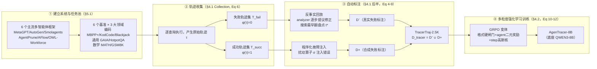

# AgenTracer：是谁在 LLM Agentic 系统里制造了失败？

> arXiv 2509.03312v2｜NUS · CUHK · OPPO · NTU｜2025-09-04｜分组 H・O 层｜前沿
> 本篇聚焦一个此前被本库反复提及、却从未正面拆解的问题：**当一个多智能体系统跑砸了，"跑砸了"这三个字本身不是终点，而是起点**——
> 谁该负责、错在哪一步，才是能被修的东西。本文用一句话概括自己：把这件事从"人工读日志"变成"可自动生产训练数据 + 可训练成一个 8B 专用模型"的流水线。

---

## §1　TL;DR（一页讲清这篇在干嘛）

> 主讲提示：先给出这篇论文的"位置感"——它不是又一个更强的 agent，而是给"agent 系统失败之后怎么办"这件事补上一个可自动化、可训练的诊断层。

一句话：多智能体系统（multi-agent system, MAS）比单体 agent 更强，但也更脆弱——**当它失败时，定位"是哪个 agent、在哪一步"造成了最终失败，是一个此前基本靠人工的活**，现有最强的推理模型直接拿来做这件事，准确率普遍低到令人意外（摘要原文："accuracy generally below 10%"）。AgenTracer 提出两件东西：

1. **AgenTracer（流水线）**：一套全自动的失败轨迹标注框架，用**反事实回放**（counterfactual replay，对失败轨迹搜索"改哪一步能让结局反败为胜"）+ **程序化故障注入**（programmatic fault injection，对成功轨迹主动注入错误制造"构造性已知答案"的失败样本），产出 **TracerTraj-2.5K**——横跨 6 个主流多智能体框架、6 个基准、3 大领域、2,000+ 条高精度"轨迹→错误步"标注对（Table 3，§4.1）。
2. **AgenTracer-8B（模型）**：在 TracerTraj-2.5K 上用**多粒度强化学习**（格式硬闸门 + agent 二元奖励 + step 高斯核奖励）微调 QWEN3-8B 得到的轻量级失败追踪器。

**核心数字**（本报告已用 `pdftotext -raw` 对 Table 1/2 逐行核对，详见 §12）：在 Who&When 基准的 handcraft 子集、w/ G 设置下，AgenTracer-8B 的 agent-level 准确率比 GPT-4.1 高 **26.0 个百分点**、比 CLAUDE-4-SONNET 高 **12.2 个百分点**（§5.2 原文）；在 TracerTraj-agentic 子集 step-level 上，比它自己的**同一个**未训练底座 QWEN3-8B 高 **22.68 个百分点**（13.49%→36.17%，w/ G），比 DEEPSEEK-R1 高 **9.04 个百分点**，比 GEMINI-2.5-PRO 高 **17.57 个百分点**（§5.2）。归因结果反哺下游系统后，还能给 MetaGPT/MaAS/OWL 这类现成多智能体系统带来 **4.8%–14.2%** 的任务表现提升（摘要 + §5.3），而同期两个经典自我反思基线（Self-Refine、CRITIC）在部分设置下甚至是**负收益**（CRITIC+MaAS+GAIA 迭代 2/3 轮分别下降 4.9%/5.5%，§5.3）。

- **属于 harness 的哪一层（Θ1）**：本篇打的是 **O（Observability，可观测）层**——它不改变被诊断系统本身的 E（环境）/T（工具）/C（上下文）/L（控制循环），而是站在这些层**production 出来的轨迹之上**做事后（或反事实模拟意义上的"近似事后"）诊断；但它的输入天然依赖 L 层（τ 里"谁在第 t 步行动"这个调度信息 μ(t)）和 T/E 层（环境反馈 F：代码报错、工具报错，见 §4.1）。
- **回扣全库论点（Θ2）**：这篇给 `Agent = Model + Harness` 补了一个此前没被点破的推论——**即便你把整条 harness 执行轨迹原原本本喂给一个顶级模型，"看懂这条轨迹哪里错了"本身仍然是一项需要专门训练的技能，不会因为模型足够强就自动免费获得**。Table 1/2 里 GEMINI-2.5-PRO、CLAUDE-4-SONNET、GPT-4.1、DEEPSEEK-R1 全部在场，但 step-level 准确率大多数格子仍在 10%–40% 区间挣扎。这意味着"harness 需要什么样的组件"这张清单上，除了执行/工具/记忆，还应该有一格写着**诊断/可观测性本身也是一个需要被工程化、被训练的 harness 组件**，而不是模型足够强就自动送上门的副产品。
- **够新够权威（Θ4）**：2025-09（v2 修订于 09-04）的前沿工作，是 MAST（2503.13657，2025-03，首次给多智能体失败定性分类）→ Who&When（2505.00212，2025-05，首次探索自动化归因、发现 SOTA 模型 <10% 准确率）之后的**第三级台阶**：不再满足于"发现现有方法不行"，而是正面造一个"行"的方案。

---

## §2　问题与动机：为什么"知道任务失败了"不够，非要精确定位到具体哪一步

> 主讲提示：这是全篇的 Why 三连主场——不要停在"失败率高"这个表层事实，要讲清楚"知道失败"和"知道哪步失败"之间隔着一道质变的鸿沟。

**Why（问题层）——不解决会卡住什么？证据是什么？**
多智能体系统正在被大规模采用，因为集成多个 LLM agent 能带来更强的子任务编排、更长上下文处理、更广的环境感知（§1，引 Zhang et al. 2025d、Zhang et al. 2024d、Jiang et al. 2024）。但代价随之而来：UC Berkeley 的一项实证研究（Cemri et al., 2025，即 MAST）发现，OpenHands、MetaGPT 这类主流多智能体框架的失败率**最高可达 86.7%**（§1 原文 "reaching up to 86.7%"），失败模式从任务分解不当到角色不服从（role disobedience）不一而足。面对这么高的失败率，"失败归因"（failure attribution，精确定位系统失败时的责任组件）本该是一项日常刚需，但论文原文明确指出："this process is predominantly left as a manual endeavor, requiring considerable human effort to analyze verbose trajectory logs"（§1）——**目前基本靠人工去读冗长的轨迹日志**。而当研究者尝试用现成的强推理模型自动化这件事，Zhang et al.（2025c，Who&When 论文）用 OpenAI-o1 和 DeepSeek-R1 在 GAIA 轨迹上做归因，**准确率低于 10%**（§1）。

**Why（设计层）——为什么"知道任务失败了"（一个 bit）不够，非要精确到"哪个 agent、哪一步"？朴素做法会怎样失败？**
朴素做法是：任务失败后，把整条轨迹丢给一个反思模块（比如经典的 Self-Refine 或 CRITIC），让它生成一段"哪里可能有问题"的模糊反馈，再让系统重试。论文自己给了三条理由说明这条路走不通，并在 §5.3 用实验正面证伪（§1 原文列出三点）：

1. **系统调试（system debugging）**：没有精确定位，"重试"就是盲目重试——你不知道该改哪个 agent 的 prompt、哪一步的工具调用逻辑。
2. **数据效率（data efficiency）**：想把失败轨迹变成有用的训练数据，必须知道**具体哪个动作错了**，否则没法构造正确标注的反事实训练对——这恰恰是 §4.1 整套标注流水线得以存在的前提。
3. **有据自我改进（grounded self-improvement）**：自我修正循环要往系统里注入的反馈必须"落地"到具体的 agent credit assignment，模糊反馈等于噪声。

这第三条不是空谈——§5.3 的实验直接证伪了"模糊反馈也总比没有强"这个直觉：即便用 GPT-4.1 驱动，经典自我反思基线 CRITIC 在 CRITIC+MaAS+GAIA 设置下，迭代 2 轮、3 轮的准确率反而**下降 4.9%、5.5%**（§5.3 原文），也就是说**不精确的失败反馈不是"没有帮助"，而是"帮倒忙"**——这比"知道失败了但不知道哪错了"更糟，因为它会把系统的下一次尝试引向错误的修正方向。这构成了本文最有力的设计层论证：失败归因的价值不是锦上添花，而是**没有它，"自我修正"这件事本身可能是负期望**。

**Why（结果层）——为什么 agent-level 准确率普遍远高于 step-level？**
这个现象在 Table 1、Table 2 全表贯穿（详见 §12），先在这里点破直觉：一次多智能体协作里，涉事 agent 通常只有个位数（N 通常是 3–6 个角色，如 Manager/Coder/Web Surfer），"猜对是哪个 agent"接近一道小范围单选题；而一条轨迹动辄几十步，"猜对是哪一步"则是大海捞针。这也解释了为什么论文要**分别报告两个粒度**而非只报告一个综合分——粗粒度（agent-level）的高分可能掩盖细粒度（step-level）的彻底失败，这正是 §14 案例研究要具体展开的"表面诊断 vs 真根因"问题。

---

## §3　背景：这篇站在谁的肩膀上——MAST 与 Who&When（§2 相关工作）

> 主讲提示：把这篇放进一条清晰的三级台阶时间线，讲清"分类→尝试自动化→做出能用的自动化系统"这条演进逻辑。

论文把自己放进两条相关工作脉络（§2）：

**多智能体系统的自动化程度谱系**：论文按"系统配置由谁决定"把现有多智能体框架分三类——① **全手工（Handcrafted）**：AutoGen、AutoGPT、CAMEL、ChatDev，agent 角色/提示词/通信协议都人工指定；② **部分自动化（Partially Automated）**：AutoAgent、LLMSelector、MasRouter 自动化角色分配，DSPy/TextGrad 自动化提示词设计，GPTSwarm/G-Designer 自动构建 agent 间拓扑；③ **全自动化（Fully Automated）**：所有模块自主设计和演化。AgenTracer 的野心是**横跨这整个谱系做归因**，所以 TracerTraj-2.5K 的六个源框架（MetaGPT、AutoGen、Smolagents、AgentPrune、AFlow、OWL-Workforce）刻意覆盖了三个自动化档位（§2、§5.1）。

**失败归因这条线索的三级台阶**：
- **第一级・MAST**（Cemri et al., 2025，即前述 UC Berkeley 研究）：**首次系统性地给多智能体失败定性**，识别出 14 种常见失败模式，从任务不服从到"推理-行动不匹配"（reasoning-action mismatches）。这是一次"把混沌命名"的工作，产出一套失败分类学和 200 条人工标注轨迹，但没有回答"能不能自动做这件事"。
- **第二级・Who&When**（Zhang et al., 2025c）：**探索自动化归因的可行性**，结果是一次警钟——即便用 DeepSeek-R1 这样的顶级推理模型，在这个任务上依然"灾难性失败"（§2 原文 "fail catastrophically"）。Who&When 贡献了 127 条人工标注轨迹（分 handcraft 和 automated 两个子集），并提出了 AgenTracer 沿用至今的核心定义——"决定性错误"（decisive error，§3，详见 §4）与 agent-level/step-level 双粒度评测协议。
- **第三级・AgenTracer**（本文）：**从"发现现有方法不行"推进到"造一个真正行的方案"**——一手抓训练数据（自动标注流水线，把 127 条人工标注规模化到 2,000+ 条自动标注），一手抓方法论（专用 8B 模型 + 多粒度 RL），两手都要硬（§1 原文 "substantial research gaps remain along two critical axes: ① training resources ... ② methodology"）。

论文还提到两支相关但正交的研究线（§2）：**LLM-as-a-Judge**（用 LLM 做评委，但在多 LLM 系统上"效果有限"，同样引用 Zhang et al. 2025c 的发现）；**credit assignment**（多智能体强化学习里"把长期结果归因到具体历史动作"的经典问题，用时序邻近性、价值分解、元学习等手法），并指出该问题"在 LLM 多智能体系统语境下基本还没被探索"，与之最接近的 CollabUIAgents（He et al., 2025）靠 LLM 生成二元 0/1 标量奖励，"可靠性存疑"（§2）——这为 AgenTracer 的"用反事实回放做**有据**归因"提供了对照组：不是让 LLM 凭感觉打分，而是真的去做"改这步、重新跑一遍、看结局是否翻盘"的实证验证。

---

## §4　形式化：多智能体系统与"决定性错误"的定义（§3 Preliminary，Eq 1–5）

> 主讲提示：这是全篇最需要"先给直觉、再上符号"的一页。核心一句话——决定性错误 = 让轨迹从失败翻盘为成功的最早那个动作。

**直觉**：把一次多智能体协作想象成接力赛——多个 agent 轮流"发言/行动"，赛跑到终点后裁判判定成功或失败。如果失败了，你想找的不是"哪些棒次跑得不够快"（那可能有很多个），而是**"如果只把某一棒换成理想选手重跑，最早在哪一棒开始换人就能让整场比赛翻盘为胜"**——这一棒的接棒人，就是"失败责任 agent"；这一棒本身，就是"决定性错误步"。

**符号定义（先定义后用）**：一个基于 LLM 的多智能体系统形式化为四元组加一个转移核：

$$M = \langle I, S, A, \mu, P \rangle \tag{1}$$

- $I = \{1, 2, \ldots, N\}$：$N$ 个 agent 的索引集合；
- $S$：系统状态空间；
- $A$：整体动作空间，每个 agent $i$ 拥有自己的局部动作空间 $A_i \subseteq A$；
- $\mu(t) \in I$：**调度函数**，指定第 $t$ 步由哪个 agent 行动（回合制协议，每步只有一个 agent 活跃——这本身就是一个 **L（控制循环）层**的构造）；
- $P(s_{t+1} \mid s_t, a_t, \mu(t))$：给定当前状态、动作、行动 agent 的状态转移动态。

第 $t$ 步，活跃 agent $\mu(t)$ 依据自己的策略 $\pi_{\mu(t)}$ 选择动作：

$$a_t = \pi_{\mu(t)}(s_t, H_t, Q), \quad H_t \subseteq \{a_0, a_1, \ldots, a_{t-1}\} \tag{2}$$

其中 $Q$ 是用户查询，$H_t$ 是历史交互的一个子集——**这个子集怎么取是实现相关的**（原文明确举例：LLM Debate 式框架里 $H_t$ 是上一轮所有 agent 的输出；软件开发系统里测试 agent 可能只看程序员 agent 最新提交的代码片段，§3）。系统完整执行轨迹记为：

$$\tau = (s_0, a_0, s_1, a_1, \ldots, s_T) \tag{3}$$

**"决定性错误"的形式化**：设 $\varphi(\tau) \in \{0, 1\}$ 为二元评判函数（$\varphi(\tau)=0$ 表示失败，$\varphi(\tau)=1$ 表示成功），$R(\tau, t, a'_t)$ 为**oracle 修正算子**——把第 $t$ 步的原始动作 $a_t$ 替换为一个理论上完美的 oracle 动作 $a'_t$，并重新模拟所有后续步骤。决定性 agent-步对集合：

$$C(\tau) = \{(i, t) \mid i = \mu(t) \text{ 且 } \varphi(\tau) = 0 \wedge \varphi(R(\tau, t, a'_t)) = 1\} \tag{4}$$

$$(i^*, t^*) = \operatorname*{arg\,min}_{(i,t) \in C(\tau)} t \tag{5}$$

即：**在所有"改这一步就能让原本失败的轨迹翻盘成功"的候选 $(i,t)$ 里，取时间最早的那一个**，作为唯一的失败责任 agent $i^*$ 与决定性错误步 $t^*$。

> **提取方法说明（诚实标注）**：Eq (4) 在 PDF 文本层里 $\varphi(\cdot)/\tau/\wedge$ 等符号提取为空白（arXiv 数学字体常见的文本层缺陷，`pdftotext` 的 `-layout` 与 `-raw` 两种模式给出完全相同的缺失模式，说明不是版式错位而是符号本身没有可提取的文本编码）。上面的重建版本并非猜测，而是双重交叉验证的结果：① 紧邻的正文原话——"the earliest action in the trajectory whose correction is sufficient to steer the system from failure to success"（必须是"原失败→修正后成功"，逻辑上只能是 $\varphi(\tau)=0 \wedge \varphi(R(\cdot))=1$）；② Algorithm 1 第 6 行伪代码明确写着 `if φ(τ') = 1 then`，且这段循环是在 `for each trajectory τ ∈ T_fail do` 内部（即 $\tau$ 本身已知为失败），二者完全吻合，因此按"忠于原文定义、拒绝编造"的要求采用此重建式。

**读出什么**：这个定义有两个不那么直观但很重要的隐含设计：① $C(\tau)$ 可能不是单点集合——一条轨迹可能有多个"改了就能翻盘"的候选步骤（比如错误影响链很长），Eq (5) 用 **arg min t** 强制选择最早的一个，这是一个**明确的定义选择**而非自然事实（"root cause = 最早的翻盘点"这一等价关系本身是可以被质疑的，见 §15 批判）；② oracle 修正算子 $R$ 依赖"重新模拟所有后续步骤"，这意味着判定"是否翻盘"不是主观判断，而是要求**真的把改过的轨迹往前重新跑一遍**，用真实的（或近似真实的）后续执行结果说话——这正是"反事实"三个字的分量所在，也是它区别于"LLM 读一遍日志、凭印象给出一个判断"的关键。

---

## §5　方法总览：AgenTracer 三段流水线（Figure 2）

> 主讲提示：先给全景图，再逐段拆解（§6–§9 分别对应流水线的后三段）。

Figure 2 把整套方法画成三段：① **Framework Establish**（收集多样化的系统与任务）→ ② **Trajectory Collection**（跑出成功/失败轨迹）→ ③ **Automatic Construction**（自动标注 + 训练 AgenTracer-8B）。用一张示意图串联：

Figure 2 中还给了两个具体案例帮助理解"什么是成功轨迹/失败轨迹"：
- **成功轨迹案例**："定位 Scikit-Learn 2017 年 7 月的第一次修复"——Reasoner Agent 分析材料 → Web Agent 搜索并定位 "sklearn july 2017 git log" → Coordinate/Planner Agent 协调 → Code Agent 分析日志、提取所有 bug fix，最终正确完成。
- **失败轨迹案例**："苹果股票哪一年首次突破 50 美元？"——Planner Agent 分派任务，Web Agent 依次尝试三个数据源：Google Finance 给出 2018、Yahoo Finance 也给出 2018，但 agent 并未采信这两个一致的结果，转而尝试第三个来源 Kayfin DB 得到 2015，Reason Agent 在中途曾表达不确定（"I am not sure. Let another web agent verify this."），但最终却采信了与前两个信源不一致的 Kayfin DB 结果（"After interacting with kayfin DB, I think it is 2015"），导向错误答案。

这个案例本身就是一次极佳的"决定性错误"教学示范：如果只看最终答案，你只知道"错了"；但真正的决定性错误很可能不在"选择相信 Kayfin DB"这个显式动作本身，而在于**更早的某一步没有建立起"两个独立信源一致时应优先采信"这个校验机制**——这与 §14 案例研究里 AgenTracer-8B 追溯到远早于表面症状的根因，是同一种模式。

---

## §6　自动标注①：反事实回放如何定位真实失败的决定性错误（§4.1 前半，Eq 6–7，Algorithm 1 Part 1）

**收集与切分（Eq 6）**：AgenTracer 从 $M(=6)$ 个多智能体系统 $\{\mathcal{M}_m\}_{m=1}^{M}$ 出发，每个系统配一组查询 $\mathcal{D}_m = \{Q_j^{(m)}\}$，执行后得到原始轨迹，按成败切分：

$$\mathcal{T}_{succ}^{(m)} = \{\tau_j^{(m)} \mid \varphi(\tau_j^{(m)}) = 1\}, \quad \mathcal{T}_{fail}^{(m)} = \{\tau_j^{(m)} \mid \varphi(\tau_j^{(m)}) = 0\} \tag{6}$$

全体成功/失败集合分别是各系统对应集合的并集：$\mathcal{T}_{succ} = \bigcup_m \mathcal{T}_{succ}^{(m)}$，$\mathcal{T}_{fail} = \bigcup_m \mathcal{T}_{fail}^{(m)}$。

**反事实回放的具体实现（Eq 7）**：对每条失败轨迹 $\tau \in \mathcal{T}_{fail}$，一个 **analyzer agent**（$\pi_{analyzer}$，底座为 DEEPSEEK-R1，§5.1）拿到失败的全部上下文——轨迹 $\tau$、环境反馈 $F$（代码执行报错、工具报错）、该查询的标准答案 $G$——针对轨迹里的每一步 $t$，提议一个**最小侵入式**的修正动作：

$$a'_t \leftarrow \pi_{analyzer}(s_t, a_t, H_t, F, G) \tag{7}$$

然后依次对 $t = 0, 1, \ldots, T$ 施加干预 $R(\tau, t, a'_t)$，评估 $\varphi(\cdot)$，**搜索满足 Eq (5) 的最早翻盘点**——找到第一个让轨迹由败转胜的 $t$，就把此刻的活跃 agent $i^* = \mu(t)$ 标记为问题 agent，产出标注三元组 $(\tau, i^*, t^*)$，汇入 $\mathcal{D}^-$（Algorithm 1 第 1–8 行）。

**Why（设计层）——为什么修正动作必须"最小侵入、不能透露完整答案"，朴素做法会怎样失败？**
> 朴素做法是：既然 analyzer 已经拿到标准答案 $G$，干脆让它在候选步骤直接把正确答案喂给系统——这样"改了就成功"几乎必然成立。→ 但这样一来，**几乎任何一步都会变成"决定性错误"**（因为无论在哪一步喂答案，后续都能顺理成章地导向成功），Eq (4)/(5) 定义的"最早翻盘点"就失去了区分度，退化成一个平凡的重言式（tautology），根本测不出"这一步本身有没有实质性错误"。本文的解法是明确约束 analyzer 的修正必须"minimally invasive"、"without revealing the complete solution"（§4.1 原文）——Appendix B 给出的 analyzer 提示词把这条约束写得极具体："DO NOT provide the complete solution in the suggested_fix. Only provide guidance on how to fix the error"，并要求诊断结果落盘为结构化 JSON（`{mistake_step, mistake_agent, reason, suggested_fix}`）。代价是这类"只给指导、不给答案"的修正判断本身依赖 analyzer（DeepSeek-R1）的能力上限——但换来的是"最早翻盘点"这个概念不再是平凡重言式，而是真正在测"这一步的局部错误有没有被恰当修正就足以让全局翻盘"，这是让反事实回放具备诊断意义的必要前提。

这一段搜索的计算代价不小：最坏情况下要对每条失败轨迹做 $O(T)$ 次"修正 + 重新模拟 + 重判定"的循环（Algorithm 1 第 3–7 行的 for 循环逐步尝试、命中即 break），这也解释了为什么最终产出的标注规模是"2,000+ 条"而非无限扩张——每一条都不便宜。

---

## §7　自动标注②：程序化故障注入——用成功轨迹反向合成"构造性已知答案"的失败样本（Eq 8–9，Algorithm 1 Part 2）

**核心原理**：拿一条已知成功的轨迹 $\tau \in \mathcal{T}_{succ}$，挑一个注入点 $t$，用扰动算子 $\sigma$ 把原动作 $a_t$ 主动破坏成一个错误动作 $\tilde{a}_t = \sigma(a_t)$，再用同一个修正算子 $R$ 生成一条新轨迹：

$$\tilde{\tau} = R(\tau, t, \tilde{a}_t) \tag{8}$$

如果这次注入真的导致轨迹失败（$\varphi(\tilde{\tau}) = 0$），那么 $(\mu(t), t)$ **依定义**就是 $\tilde{\tau}$ 的决定性错误——因为错误是我们自己在第 $t$ 步亲手种下的，不需要再搜索：

$$\mathcal{D}^+ = \{(\tilde{\tau}, i^*, t^*) \mid \tau \in \mathcal{T}_{succ},\ \tilde{\tau} = R(\tau, t, \sigma(a_t)),\ \varphi(\tilde{\tau}) = 0,\ i^*, t^* = \mu(t), t\} \tag{9}$$

Algorithm 1 第 9–17 行给出具体流程：对每条成功轨迹，随机采样 $K$ 个候选注入点 $\mathcal{J}_{sample}$，逐个尝试注入，**一旦某个注入点成功导致失败就停止**（"Stop after first successful injection for this trajectory"）——即每条成功轨迹最多贡献一条合成失败样本。

**Why（设计层）——为什么已经有反事实回放（§6）了，还要多此一举地做故障注入？两者互补在哪？**
> 朴素做法是：既然反事实回放已经能给真实失败轨迹打标签，直接把这条产线扩大规模（多采集更多失败轨迹）不就够了？→ 会遇到两个现实约束：① **真实失败轨迹本身有限**——多智能体系统虽然失败率不低，但要凑够覆盖面广的失败案例仍需要大量执行预算；② 更关键的是，反事实回放的标签是**搜索出来的**，依赖 analyzer 在每一步"提出修正、重新模拟、评判成败"的能力，如果 analyzer 本身在某一步误判（比如过早地宣布某个不够好的修正"已经成功"），标签就会带噪声。本文用程序化故障注入构造 $\mathcal{D}^+$ 作为补充：注入点是我们自己选的，错误是我们自己种的，因此标签在**构造意义上（by construction）** 是精确的（§4.1 原文 "creating a synthetic failure instance where the decisive error is known by construction"），不需要搜索、不依赖 analyzer 的判断质量。代价是这类样本天然"人工痕迹"更重——真实世界的错误很少是"某一步的动作被单独替换成一个具体错误版本"这么干净利落的形态，注入型错误的分布未必完全代表真实失败的分布。**两者互补**：$\mathcal{D}^-$ 真实但标注更贵更可能带噪，$\mathcal{D}^+$ 廉价精确但分布上有人工偏置，合并成 $\mathcal{D}_{tracer} = \mathcal{D}^- \cup \mathcal{D}^+$ 时用彼此的长处补对方的短板。

从 Appendix B 的"故障注入 analyzer"提示词看，这一步的具体执行也被约束得很具体——要求扰动内容必须"SPECIFIC and IMPLEMENTABLE"、给出可直接执行的具体代码改动（提示词里给了正反例：好的注入是"把 `return tup + (dct,)` 改成 `return list(tup) + [dct]`"，坏的注入是笼统地说"返回错误类型"），并且要求把注入分析结果真正落盘为 `Editor.create_file`/`Editor.write` 工具调用后才能结束——即扰动本身也是一次被工具约束的、可执行的、可复现的操作，而不是一句模糊的文字描述。

**汇总产出——TracerTraj-2.5K（Table 3，Appendix A）**：

| 领域 | 编码 Coding | 数学推理 Mathematical Reasoning | 通用 Agentic 任务 |
|---|---:|---:|---:|
| 基准 | MBPP+ / KodCode / Blackjack | MATH / GSM8K | GAIA / HotpotQA |
| 涉及多智能体系统 | MetaGPT / AutoGen / AgentPrune | AgentPrune / AFlow / AutoGen | Smolagents / OWL-Workforce |
| 采集到的原始轨迹总数 | 2,170 | 1,185 | 1,300 |
| TracerTraj-2.5K（已标注对） | 1,288 | 630 | 558 |
| held-out 测试集 | 147 | 63 | 56 |

三个领域合计：采集轨迹 **4,655** 条，标注对 **2,476** 条（对应论文反复强调的"2,000+"/"TracerTraj-2.5K"），held-out 测试集 **266** 条（对应 §5.1 "9:1 比例采样出held-out测试切分"）。相比 MAST 的 200 条、Who&When 的 127 条人工标注轨迹，这是**一到两个数量级的规模跃升**，这正是 §3 提到的"training resources"研究缺口被正面填补的地方。

---

## §8　训练 AgenTracer-8B：强化学习目标（§4.2 前半，Eq 10）

有了 TracerTraj-2.5K，下一步是把它训练进一个专用模型里。底座选择 **QWEN3-8B**，算法是 **GRPO**（Group Relative Policy Optimization, Guo et al. 2025）的一个变体（论文强调"方法与具体 RL 算法正交"，§4.2 原文 "our approach is orthogonal to the RL algorithm"，选 GRPO 只是因为它是当下常用的在线 RL 方法）。

**直觉**：对同一条轨迹 $\tau$，让当前策略采样出 $G$ 个候选"决定性错误"猜测 $\{(\hat{i}_k, \hat{t}_k)\}_{k=1}^{G}$，每个候选都会依据它与真值 $(i^*, t^*)$ 的接近程度换算成一个奖励，再用 GRPO 式"组内相对优势"去更新策略——猜得比组内平均好的候选被强化，猜得差的被抑制。

**目标函数**：

$$\mathcal{L}_{RL} = -\mathbb{E}_{\tau, \{\hat{p}_k\}_{k=1}^{G}}\left[\frac{1}{G}\sum_{k=1}^{G} \min\big(\rho_k A_k,\ \mathrm{clip}(\rho_k,\, 1-\varepsilon_s,\, 1+\varepsilon_s)\, A_k\big)\right] \tag{10}$$

符号定义：$\hat{p}_k = (\hat{i}_k, \hat{t}_k)$ 是第 $k$ 个候选预测；$\rho_k = \dfrac{\pi_{tracer}(\hat{p}_k \mid \tau)}{\pi_{old}(\hat{p}_k \mid \tau)}$ 是新旧策略概率比；优势估计 $A_k = \dfrac{R_k - \mathrm{mean}(\{R_j\})}{\mathrm{std}(\{R_j\}) + \delta}$（$\delta$ 为避免除零的微小常数，原文取 $1\times10^{-6}$，是标准的组内标准化优势，不依赖单独的价值网络）。**与标准 GRPO 的两点差异**（§4.2 明确标出）：① 省略了 KL 散度正则项；② 引入**动态裁剪参数** $\varepsilon_s$（原文引用 Liu et al., 2025 的做法，"已被证明能更好地平衡探索与利用"）：

$$\varepsilon_s = \max\Big(0.2\cdot\varepsilon_0,\ \varepsilon_0\big(1 - \tfrac{s}{S_{total}}\big)\Big)$$

其中 $s$ 为当前训练步、$S_{total}$ 为总训练步数。

**Why（设计层）——为什么裁剪范围要随训练进程收缩，而非用固定的 $\varepsilon$？**
> 朴素做法是用 PPO/GRPO 教科书式的固定裁剪范围 $\varepsilon_0$ 全程不变。→ 训练初期，策略几乎是随机的，固定的小裁剪范围会过度限制更新幅度，探索不充分；训练后期，策略已经收敛到较优区域，若裁剪范围仍然很宽，反而容易被少数噪声样本带偏，破坏已经学到的好策略。本文让 $\varepsilon_s$ 从 $\varepsilon_0$ 开始、随训练步数线性衰减到 $0.2\varepsilon_0$ 这个下限，直觉上是"训练前期允许更大胆的策略更新（鼓励探索），后期收紧到更保守的更新（鼓励稳定利用）"（§4.2 原文 "encourages broader exploration in the initial stages ... gradually shifts to more stable exploitation as the policy converges"）——这是把"探索-利用权衡"这个 RL 里的经典主题，直接编码进了裁剪超参数的调度里，而不是留给学习率或熵正则去隐式处理。

---

## §9　多粒度奖励设计：格式硬闸门 + agent 二元奖励 + step 高斯核（§4.2 后半，Eq 11–12）

> 主讲提示：这是全篇最值得停留的设计页，和本库 G 组标杆 Harness-Bench 的"乘法 + 硬闸门"打分法是同一个工程直觉的两次独立复现。

**直觉**：一个候选预测要拿高奖励，必须**同时**满足三件事——格式对（能被程序解析出 agent 和 step）、agent 猜对、step 猜得准（哪怕没完全猜中，猜得越近也该有部分奖励）。总奖励是一个"格式硬闸门 × 内容加权和"的门控组合：

$$R(\hat{p}_k) = \mathbb{I}_{format} \cdot \big[\beta \cdot r_{step}(\hat{t}_k) + (1-\beta)\cdot r_{agent}(\hat{i}_k)\big] \tag{11}$$

三个组件（先给定义式，再说它在测什么）：

- **格式奖励 $\mathbb{I}_{format}$（硬闸门，二元）**：当且仅当模型输出严格遵循要求的结构——推理内容包在 `<think>…</think>` 标签内，随后是包在 `<answer>…</answer>` 标签内的最终答案，且答案本身必须写成 `agentID | stepID` 格式——才取 1，否则取 0。**它是乘在最外层的**，格式不对，无论内容猜得多准，总奖励直接归零。
- **agent 级奖励 $r_{agent}$（粗粒度，二元）**：$r_{agent}(\hat{i}_k) = \mathbb{I}(\hat{i}_k = i^*)$，猜没猜对是哪个 agent。
- **step 级奖励 $r_{step}$（细粒度，连续）**：用高斯核让奖励随预测步与真值步的距离平滑衰减：

$$r_{step}(\hat{t}_k) = \exp\left(-\frac{(\hat{t}_k - t^*)^2}{2\sigma^2}\right) \tag{12}$$

$\sigma$ 控制惩罚随距离增长的陡峭程度（§5.1 给出具体取值：$\beta = 0.5$，$\sigma = 1$）。

**Why（设计层）——为什么 step 级奖励要用高斯核给"部分奖励"，而不是像 agent 级一样直接用二元精确匹配？**
> 朴素做法是 step 级也采用二元奖励：猜中真值步给 1，猜偏一步和猜偏十步都给 0，一视同仁。→ 一条轨迹动辄几十步，"精确命中某个整数"是一个极度稀疏的奖励信号——对随机初始化的策略而言，命中概率极低，绝大多数 rollout 拿到的都是 0 奖励，梯度信号几乎消失，RL 训练会陷入"探索不到有效信号"的困境（这与经典 RL 里"用勢函数塑形（reward shaping）缓解稀疏奖励"是同一类思路，论文正文未直接引用这一术语，但机制同源）。本文用高斯核给"猜偏一点点"也发放递减但非零的部分奖励，让奖励地形从"处处是悬崖"变成"有连续坡度可以爬"——原文明确点出这个设计意图："the partial credit from $r_{step}$ stabilizes training"（§4.2）。同时**格式硬闸门不能也做成软的**——如果格式错了也能拿到部分分数，模型会有捷径去学"内容乱猜但格式凑合"而不会被淘汰，这与 Harness-Bench（本库 G 组标杆 2605.27922）"Security 作为 0/1 硬闸门、其余因子才连续打分"的设计是同一个工程直觉的独立复现：**结构性/合规性要求用硬闸门一票否决，内容质量才用连续信号精细引导**。

---

## §10　实验设置：数据、环境、基线、超参数全记录（§5.1）

- **数据构建**：6 个多智能体框架（MetaGPT、AutoGen、Smolagents 代表全手工；AgentPrune 代表部分自动化；AFlow、OWL-Workforce 代表全自动化）× 6 个基准，横跨 3 大领域——编码（MBPP+、KodCode、Blackjack）、通用 agentic 任务（GAIA，另据 Table 3 还含 HotpotQA）、数学推理（MATH、GSM8K）。
- **算力环境**：单机 8× NVIDIA H100（80GB），RL 训练用 `verl` 训练平台。
- **模型与超参配置**：Eq (7) 的 analyzer 与 Eq (9) 的扰动算子 $\sigma$ 均以 **DEEPSEEK-R1** 为底座（Appendix B 给出具体提示词）；$\beta = 0.5$（Eq 11）；$\sigma = 1$（Eq 12）；AgenTracer-8B 训练底座为 **QWEN3-8B**；批大小 32，rollout 数 8，学习率 $1\times10^{-6}$。
- **评测基准与协议**：主评测用 **Who&When**（Zhang et al., 2025c），含 handcraft（源自 Magnetic-One）与 automated（源自 AG2/AutoGen）两个子集，**均是 AgenTracer-8B 训练时未见过的分布外轨迹**；此外从 TracerTraj-2.5K 按 9:1 切出 held-out 测试集，按领域分为 TracerTraj-code / TracerTraj-math / TracerTraj-agentic 三个子集。两个评测维度：**agent-level 准确率**（是否识别对责任 agent $i^*$）与 **step-level 准确率**（是否定位对错误步 $t^*$）；两种设置：**w/ G**（归因时可访问标准答案 $G$）与**w/o G**（不可访问，更贴近真实部署、也更难）。评测沿用 MAST 提出的 **"all-at-once" 设置**——整条轨迹一次性喂给模型，原文引用 Who&When 论文的发现，称这是"最稳定有效"的方式（§5.1）。
- **基线覆盖三个量级**：小模型 QWEN3-8B、LLAMA-3.2-3B；中等模型 QWEN3-32B、QWEN3-CODER-480B-A35B-INSTRUCT；大模型 GPT-4.1、GEMINI-2.5-PRO、CLAUDE-4-SONNET、DEEPSEEK-R1。

---

## §11　评测协议深挖：怎么验证"归因归得准不准"（本篇最该细读的一节）

> 主讲提示：任务要求把"评测协议如何验证归因是否准确"讲透，这里不只复述指标定义，还要正面追问"这套评测协议本身有多可信"。

**协议的三层结构**：① **粒度**——agent-level（回答"谁的责任"）与 step-level（回答"哪一步"）分开报告，不合并成一个综合分（原因见 §2 结果层 Why：两者难度悬殊，合并会互相掩盖）；② **信息量**——w/ G 与 w/o G 两种设置对照，前者更像"开卷考"，后者是真实部署时的常态（归因时通常拿不到标准答案）；③ **呈现方式**——"all-at-once"，整条轨迹一次性交给被测模型，不做逐步交互式追问，理由是复用 Who&When 论文已经验证过的稳定性结论，而非本文自行重新论证。

**这套协议本身经得起几层追问**：

1. **"标准答案"从哪来，会不会自我循环？** Who&When 子集的 ground truth 是由**另一篇论文**（Zhang et al., 2025c）独立人工标注的，与 AgenTracer 的训练/标注流水线无关，因此在 Who&When 上的评测具备真正的外部有效性（out-of-distribution validity）——这也是为什么论文反复强调 Who&When 是"unseen trajectories with respect to AgenTracer-8B"（§5.1）。但 TracerTraj 系列（code/math/agentic）的 held-out 测试集，其 ground truth 标签是用**与训练集完全相同的自动标注流水线**（反事实回放 + 故障注入，analyzer 同样基于 DeepSeek-R1）产出的——这意味着在 TracerTraj 子集上的评测，某种程度上测的是"AgenTracer-8B 能否复现这套标注流水线自身的判断逻辑"，而非一个完全独立于该流水线定义之外的客观真值。论文并未在正文中讨论这一点，**这是我在 §15 要展开的一处补充批判，而非论文自陈的局限**。
2. **"给不给标准答案"这个开关本身是不是也是一种有效性检验？** 一个自然的期待是：既然 w/ G 提供了更多信息，归因准确率应该"给了 G 只会更好、不会更差"。但 Table 1/2 的实测数据（§12 详列）反复出现**反直觉现象**——不少模型在 w/o G 设置下反而比 w/ G 更准（例如 CLAUDE-4-SONNET 在 TracerTraj-math 上 46.03%[w/G] vs 50.79%[w/o G]；QWEN3-CODER 在 Who&When handcraft 上 51.72%[w/G] vs 60.35%[w/o G]，均见 §5.2 原文并经本报告核实）。这从侧面说明这套双设置协议**不是走过场**——它确实捕捉到了一个真实存在、值得关注的现象："标准答案有时会误导归因过程"（§5.2 原文，与 MAST 中的既有发现一致），而不是简单的"更多信息→更高分"的单调关系。
3. **step-level 的判定容差是多少？** 正文只说"评估是否定位到具体错误步 $t$"，但 Eq (12) 训练用的高斯核奖励是**连续**的（近似命中也有部分奖励），而 Tables 1–2 报告的"step-level accuracy"看起来是一个**单一准确率数字**——训练奖励的"软"评分标准，和评测报告的"准确率"这个通常意味着精确匹配的措辞之间，具体的判定容差（是否允许 $\pm 1$ 步之类的宽容窗口）**原文未给出**，这是一处需要谨慎对待、不能替原文下判断的空白。

**读出什么**：这套评测协议整体设计是审慎的（外部基准 + 自建基准并用、双粒度、双信息量设置），且它意外验证了自己的敏感性（G 有时反而添乱这个反直觉发现，恰恰说明协议没有被"喂了标准答案就应该分数更高"这种朴素假设架空）。但它也继承了整个自动化标注范式共有的一个结构性张力——**当"标准答案"本身是由和被测系统同源的流水线生产出来的时候，"评得准不准"和"学得像不像标注流水线"这两件事很难被完全剥离**，这是下一步工作可以着力的方向（呼应 §15、Inspires-Us c）。

---

## §12　主结果：Table 1（Who&When）与 Table 2（TracerTraj）逐表核对

> 主讲提示：这一页先讲"我怎么核对出正确的表"，这本身就是一次小型的失败归因实践——原始 PDF 文本层的表格因版式提取错位，"AgenTracer" 这一行的模型名标签在 `-layout` 模式下丢失且导致后续 8 行标签整体错位一行，必须用 `-raw` 模式重新提取并与正文数字交叉验证才能拿到正确对照。

**核对方法（诚实记录）**：用 `pdftotext -layout` 首次提取 Table 1/2 时，"AgenTracer"这一模型名整行标签在版式还原过程中丢失，导致其余 8 个模型标签（QWEN3-8B…CLAUDE-SONNET-4）与数据行整体错位了一行——即打印出来的"QWEN3-8B"标签实际对应的是 LLAMA-3.2-3B 的数据，以此类推，最后一行印着"CLAUDE-SONNET-4"标签的数据其实是 AgenTracer 自己的成绩。本报告用 `pdftotext -raw`（不做版式还原、按文档原始顺序线性提取）重新提取，两种模式交叉比对，并用正文 §5.2 明确给出的数字——"AgenTracer-8B outperforms GPT-4.1 and CLAUDE-4-SONNET on Who&When (handcrafted) by 26.0% and 12.2%"、"improves step-level accuracy on TracerTraj-agentic by 22.68% over its backbone QWEN3-8B"、"surpassing DEEPSEEK-R1 (+9.04%) and GEMINI-2.5-PRO (+17.57%)"、"DEEPSEEK-R1 suffers a 9.21% drop without G [on TracerTraj-math]"——逐一代入两种候选对齐方式反向验算，六条独立数字全部与 `-raw` 提取结果精确吻合（其中一条在四舍五入误差内吻合），确认下表为正确对照。

**Table 1（Who&When 基准，每格 "w/G / w/o G"，单位 %，§5.2）**：

| 模型 | Handcraft Agent-level | Handcraft Step-level | Automated Agent-level | Automated Step-level |
|---|---:|---:|---:|---:|
| QWEN3-8B | 42.10 / 39.50 | 1.72 / 3.45 | 58.73 / 60.32 | 3.97 / 5.56 |
| LLAMA-3.2-3B | 37.93 / 50.00 | 1.72 / 3.45 | 37.30 / 45.23 | 2.38 / 8.73 |
| QWEN3-32B | 44.80 / 44.80 | 1.72 / 1.72 | 63.49 / 57.93 | 9.52 / 8.73 |
| QWEN3-CODER | 51.72 / 60.35 | 8.62 / 13.79 | 42.86 / 36.50 | 34.13 / 32.54 |
| GPT-4.1 | 43.10 / 37.93 | 3.44 / 3.44 | 55.55 / 59.52 | 29.52 / 21.90 |
| DEEPSEEK-R1 | 56.90 / 53.44 | 13.29 / 6.90 | 66.67 / 65.08 | 31.32 / 29.52 |
| GEMINI-2.5-PRO | 51.72 / 51.72 | 9.72 / 6.90 | 61.11 / 57.14 | 29.52 / 25.86 |
| CLAUDE-SONNET-4 | 56.90 / 50.00 | 17.24 / 18.97 | 57.93 / 51.11 | 40.65 / 38.83 |
| **AgenTracer-8B** | **69.10 / 63.82** | **20.68 / 20.68** | **69.62 / 63.73** | **42.86 / 37.30** |

**Table 2（TracerTraj 三子集，每格 "w/G / w/o G"，单位 %，§5.2）**：

| 模型 | Code Agent | Code Step | MATH Agent | MATH Step | Agentic Agent | Agentic Step |
|---|---:|---:|---:|---:|---:|---:|
| QWEN3-8B（底座，未训练） | 45.35 / 32.99 | 2.36 / 1.15 | 31.74 / 33.58 | 9.52 / 12.96 | 27.93 / 30.16 | 13.49 / 15.31 |
| LLAMA-3.2-3B | 13.38 / 11.81 | 2.36 / 3.93 | 15.87 / 14.28 | 4.76 / 3.17 | 8.11 / 13.15 | 2.18 / 5.09 |
| QWEN3-32B | 62.99 / 63.78 | 2.36 / 1.75 | 17.46 / 17.46 | 4.76 / 7.93 | 30.55 / 30.55 | 18.60 / 15.31 |
| QWEN3-CODER | 69.29 / 66.92 | 14.96 / 14.17 | 28.57 / 33.58 | 11.11 / 22.22 | 40.67 / 43.12 | 24.99 / 25.69 |
| GPT-4.1 | 59.84 / 53.54 | 12.59 / 11.02 | 39.55 / 35.18 | 35.81 / 26.63 | 43.61 / 40.67 | 24.99 / 25.69 |
| DEEPSEEK-R1 | 11.81 / 11.81 | 10.23 / 10.23 | 42.68 / 38.58 | 29.52 / 18.51 | 45.12 / 46.19 | 27.13 / 21.80 |
| GEMINI-2.5-PRO | 70.07 / 66.92 | 11.02 / 6.29 | 58.79 / 58.79 | 32.22 / 27.40 | 37.16 / 32.18 | 18.60 / 17.04 |
| CLAUDE-SONNET-4 | 65.98 / 63.78 | 15.51 / 11.02 | 46.03 / 50.79 | 38.10 / 46.03 | 55.20 / 49.13 | 30.33 / 29.80 |
| **AgenTracer-8B** | **72.95 / 72.21** | **18.85 / 18.85** | **59.32 / 66.10** | **57.63 / 57.63** | **53.28 / 50.61** | **36.17 / 35.55** |

**观察①：主流模型普遍不胜任失败归因（§5.2 原文 Observation ①）**。小模型（QWEN3-8B、LLAMA-3.2-3B）在 Who&When handcraft 子集 step-level 准确率都在 10% 以下（1.72%）；即便是 DEEPSEEK-R1、GPT-4.1 这类大模型，在 Who&When automated 子集 step-level（w/ G）也只有 31.32%、29.52%（§5.2）——注意这里"generally below 10%"这句摘要级表述，最贴合 Who&When 原论文用 o1/DeepSeek-R1 在 GAIA 轨迹上的原始发现、以及本文 Table 1 中小模型在 handcraft 子集上的表现，但**并不能逐字套用到 Table 1 全表**——CLAUDE-SONNET-4 在部分子集已能到 37%–43%，把"generally below 10%"理解成"当时最先进推理模型给人的整体印象"比逐格套用更准确。更值得注意的反直觉发现：**给不给标准答案 $G$ 不总是帮倒忙就是帮正忙**——CLAUDE-SONNET-4 在 TracerTraj-math 上 46.03%(w/G) vs 50.79%(w/o G)，QWEN3-CODER 在 Who&When handcraft 上 51.72%(w/G) vs 60.35%(w/o G)，与 MAST 已有发现一致（§5.2）。

**观察②：AgenTracer-8B 全面超越参数量大得多的专有模型（§5.2 原文 Observation ②）**。w/ G 设置下，AgenTracer-8B 在 Who&When handcraft 的 agent-level 上比 GPT-4.1 高 **26.0** 个百分点、比 CLAUDE-4-SONNET 高 **12.2** 个百分点；在 TracerTraj-agentic 的 step-level 上，比自己**未经强化学习的同一个底座** QWEN3-8B 高 **22.68** 个百分点（13.49%→36.17%），比 DEEPSEEK-R1 高 **9.04** 个百分点，比 GEMINI-2.5-PRO 高 **17.57** 个百分点。更能打的是 w/o G（更贴近真实部署）设置：TracerTraj-math 上 DEEPSEEK-R1 掉了 **9.21** 个百分点（35.81%→26.63%），而 AgenTracer-8B 在 w/ 与 w/o G 之间**完全没有波动**，稳稳保持在 **57.63%**（§5.2 原文 "AgenTracer-8B maintains 57.63%"）。

**Why（结果层）——同一个底座 QWEN3-8B，RL 训练前后为什么差这么多？** Table 2 里没经过 RL 的 QWEN3-8B（底座）与训练后的 AgenTracer-8B 是**完全相同的初始参数**，唯一变量是有没有在 TracerTraj-2.5K 上跑过 §8–§9 那套多粒度 RL——MATH 领域 step-level（w/G）从 9.52% 涨到 57.63%（约 6 倍），Agentic 领域 step-level（w/G）从 13.49% 涨到 36.17%（约 2.7 倍）。这是全文最干净的"消融"式证据：**巨大的性能差距不是来自"QWEN3 这个底座架构本身秘密很强"，而是来自 TracerTraj-2.5K 数据 + 多粒度 RL 这一整套训练配方**——这也回应了 §1 Θ2 里提出的论点："看懂一条 harness 执行轨迹哪里错了"是一项需要专门训练才能获得的技能，而不是底座模型规模到了自然就会的能力（否则 QWEN3-32B、QWEN3-CODER-480B 这些更大的同族模型不至于全面落后一个 8B 模型这么多）。

（题外话：DEEPSEEK-R1 在 Table 2 的 Code Agent-level 上只有 11.81%/11.81%，甚至低于 LLAMA-3.2-3B 的 13.38%/11.81%，是全表最反直觉的单元格之一——原文未对此单独展开解释，本报告如实呈现，不做过度解读。）

至于摘要里的峰值宣称"outperforms giant proprietary LLMs like Gemini-2.5-Pro and Claude-4-Sonnet by up [to] **18.18%**"——本报告尝试用上表所有可核对的差值逐一验算，最接近的是 TracerTraj-agentic step-level 上超越 GEMINI-2.5-PRO 的 **17.57** 个百分点（§5.2 已核实），但未能精确复现 18.18 这个数字本身，它更可能来自 Figure 1 的柱状图对比（该图在文本层只提取到坐标轴分类标签，没有可提取的柱高数值）——**这一具体数字的精确出处原文未给出可核对的表格来源**，如实标注，不做编造性对齐。

---

## §13　归因转化为战斗力：能不能真正帮下游系统自我修正（§5.3，Figure 3）

**实验设计**：当一个多智能体系统 $M$ 完成一轮问题求解并产出失败轨迹 $\tau$ 后，把 $\tau$（w/o G 设置）交给 AgenTracer-8B 或两个经典自我反思基线——**Self-Refine**（Madaan et al., 2023）、**CRITIC**（Gou et al., 2024，均用 GPT-4.1 驱动）。每种方法各自生成一段反思式反馈（对 AgenTracer-8B 而言，就是从 `<think>…</think>` 里提取的推理轨迹本身），注入下一轮问题求解，迭代 **3 轮**，覆盖三套现成系统（MaAS、OWL Workforce、MetaGPT）与三套基准（GAIA、HumanEval+、MATH-500）。

**核心数字（§5.3 原文，Figure 3 对应四个子图中三个给出了具体数值）**：
- **CRITIC+MaAS+GAIA**：迭代 2 轮、3 轮的准确率分别**下降 4.9%、5.5%**——即便用 GPT-4.1 驱动，通用反思式基线在复杂 agentic 轨迹上"持续退化"（§5.3 原文 "conventional reflection-based approaches fail to deliver meaningful insights ... CRITIC consistently degrades performance"）。
- **AgenTracer + OWL + GAIA**：提升 **+4.8%**——OWL 在原文写作时点（2025 年 6 月）是 GAIA 开源 SOTA，AgenTracer 依然能在这个已经很强的系统上再挤出提升。
- **AgenTracer + MaAS + MATH-500**：提升 **+14.21%**，是四组实验里增益最大的一组，"substantially surpassing both Self-Refine and CRITIC"（§5.3）。
- （MetaGPT + HumanEval-Plus 子图正文未给出具体数值，原文未给出，本报告不做编造性补全。）

**Why（结果层）——为什么"通用反思"不只是没帮上忙，反而是负收益？** 直觉上"多一轮自我反思"至少应该"无害"，最坏也就是没用。但 CRITIC 在 CRITIC+MaAS+GAIA 上却是持续下降的。机制上的合理解释（论文未展开机制分析，以下为本报告基于全篇论证脉络的推断，非原文直接陈述）：通用反思模块生成的反馈是"泛泛而谈、缺乏精确指向"的（呼应 §2 的设计层 Why），如果这类模糊反馈恰好把系统的下一轮尝试引向了一个**看似合理但实际上偏离真正问题**的修正方向（就像 §14 案例研究里 CLAUDE-4-SONNET 把责任错误地归到 Manager 身上打补丁，而不是修复 Web Surfer 的取数据源问题），那么"修正"本身就在往错误的方向使劲，效果自然比"什么都不做"更差。这与 AgenTracer-8B 精确到 agent+step 级的反馈形成鲜明对比——后者提供的是"改哪里"的确定性信号，前者提供的更接近"哪里可能有问题"的猜测性噪声。

---

## §14　案例研究：三个模型看同一条失败轨迹（§5.4，Figure 4）

**任务**：从公司 2024 年 Q1 季度销售数据中找出婴儿配方奶粉销量最高的地区。系统最终给出的（错误）答案是"North"。轨迹大致流程：Manager 派发任务→ File Surfer 从公司门户获取 `quarterly_sales.csv` 并保存 → Manager 指示 Coding Agent 找出销量最高地区 → 脚本因为"列名不正确"报错（"Script fails due to incorrect column name"）→ Manager 提供正确列名（"Region Name"）后重跑脚本，识别出 "North" 为最高销量地区 → Manager 指示 File Surfer 再次核实 → 最终确认 "North" 为答案。

三个诊断者看同一条轨迹，给出三种截然不同的归因（§5.4）：

- **QWEN3-8B**：诊断"错误发生在第 6 步，责任 agent 是 Coding Agent"，理由是日志里那条明确的报错信息（"Script fails due to incorrect column name"）——这是**表面诊断**：把"报错发生的地方"直接等同于"错误的根源"，属于典型的"只看最显眼的症状"。
- **CLAUDE-4-SONNET**：判断更进一步，认为关键错误在第 7 步，责任 agent 是 Manager——理由是 Manager 把"列名不对"这个信号当成了一个可以简单打补丁修复的小 typo，而没有意识到这其实是"底层数据源根本不是预期的那个"这一更严重的警示信号，只是在表面打补丁而没有深挖问题为什么会出现。这比 QWEN3-8B 更深一层，但**依然定位到的是一个下游的、被动响应式的环节**，而不是问题真正开始的地方。
- **AgenTracer-8B**：精确定位到**第 2 步**，责任 agent 是 **Web Surfer**——真正的根因是它在最开始就下载了一份**过期的、存档版本**的报告文件，而不是最新数据；这一判断的证据来自第 11 步日志里的文件校验信息，显示"最后编辑时间：2021-08-19"，证明这份最初获取的数据从一开始就是错的。这次最初的数据获取错误，从源头上污染了后续整条分析链——所有后续步骤（列名报错、重跑脚本、识别地区）其实都是在一份错误数据上"正确地"执行，表面上每一步都合乎逻辑，却建立在一个早已错误的地基上。

**读出什么**：这个案例把"agent-level 容易、step-level 难"（§2 结果层 Why）具体化成了一条完整的因果链——三个诊断者其实都不是"瞎猜"，都能给出言之成理的理由，差别在于**能不能追溯到足够早的地方**。QWEN3-8B 停在"最吵闹的报错"，CLAUDE-4-SONNET 更进一步但仍停在"离报错最近的决策点"，只有 AgenTracer-8B 追到了"沉默的、看起来毫无问题的最初一步"——这正是决定性错误定义（Eq 4–5，"最早的翻盘点"）里"最早"二字的分量所在：**真正的错误往往早就发生了，只是当时没有报错，直到很多步之后才以一种看似无关的形式爆发出来**。这与本文摘要"errors are often subtle, originate early, and remain hidden behind seemingly correct outputs"的收束陈述完全对应（§5.4）。

---

## §15　局限与批判（论文自陈 + 我的补充）

**关于论文自陈局限的诚实说明**：与本库标杆 Harness-Bench（2605.27922）设有独立的 §6 Limitations 小节不同，本文（§1–§6 + Appendix）**没有设置单独的局限性章节**，§6 Conclusion 通篇是成果总结与展望性陈述，未见对方法边界的正面自我批判。以下局限主要是本报告基于全篇论证脉络的**独立补充批判**，而非论文自陈：

- **标注流水线与评测标签的潜在同源性（§11 已展开）**：TracerTraj held-out 测试集的 ground truth 由与训练集完全相同的反事实回放 + 故障注入流水线产出，其中 analyzer 底座固定为 DEEPSEEK-R1——这意味着在 TracerTraj 子集上的评测，某种程度上是在测"能否复现这条流水线自身的判断逻辑"，而非完全独立于流水线定义之外的客观真值。Who&When 子集因为是第三方独立标注，不受此影响，但这也意味着**论文最具冲击力的部分数字（TracerTraj 系列上的领先幅度）比 Who&When 上的领先幅度更需要留一份保留**。
- **潜在的循环依赖**：DEEPSEEK-R1 既是标注流水线里 analyzer 与扰动算子 $\sigma$ 的底座（§5.1），同时又是 Table 1/2 里被评测的基线模型之一——如果 DeepSeek-R1 构造"错误"和识别"错误"的内在倾向存在某种一致的偏好模式（比如它偏好把错误归结到某一类特定症状），那么它作为基线在 TracerTraj 系列上的相对表现可能受到这种自相关性的影响，原文未讨论这一点。
- **"最早翻盘点 = 根因"是一个定义选择，不是被发现的事实**（Eq 4–5，§4 已指出）：多个 $(i,t)$ 都可能让轨迹翻盘时，论文选择"最早"作为唯一根因，这是一种类似经典调试里"揪出第一张倒下的多米诺骨牌"的直觉，但**有时候更晚、但更具行动力（actionable）的修正点可能才是实践中真正值得优先修的地方**（比如 §14 案例里，虽然"根因"是第 2 步的错误数据源，但如果系统在后续任何一步能对"一份数据来自 2021 年却被当作 2024 年 Q1 数据使用"做出常识性校验，同样能避免最终错误）——这个替代视角，原文未讨论。
- **规模与架构单一**：目前只验证了 QWEN3-8B 这一个底座、一个参数规模，没有做跨底座、跨参数规模的扩展研究，"多小的模型依然能学会这项技能""多大的模型收益会饱和"这些问题原文未涉及。
- **覆盖面边界**：训练与评测均围绕**纯文本的多智能体协作轨迹**（工具调用、代码执行、网页信息检索），不涉及 GUI/像素级操作轨迹（本库 F 组 Mind2Web/WebArena/UI-TARS 这类场景）或单 agent 长程工具使用轨迹（没有 μ(t) 多方切换的场景）——归因方法论能否直接迁移到这些场景，原文未讨论，不应不加限定地外推。
- **step-level 判定容差未明确（§11 已指出）**：训练奖励是连续的高斯核，但报告的"step-level accuracy"呈现为单一准确率数字，具体判定窗口原文未给出。
- **Figure 2 图注与正文命名存在细微出入**：图例文字（依 OCR 提取）出现"AgenTracer-3k"字样，与正文反复使用的"TracerTraj-2.5K"不完全一致，考虑到图表文字提取本身容易受版式影响失真，本报告不据此做进一步引申，仅如实记录。

---

## ★ 对我们的启发（Inspires Us）

> 这一节的份量比通常更重——因为本篇论文讨论的问题，恰恰是我们刚刚在**这次报告撰写任务本身**里正面遭遇过的问题：协调方一度把我们标记为"stopped"，而"stopped"这三个字本身，和 AgenTracer 想要打破的"任务失败了"这个粗粒度信号，是同一种东西。

**a. 可直接借用的招**：§9 那套"格式硬闸门 $\times$（agent 二元奖励 + step 高斯核奖励）"的多粒度门控奖励（Eq 11–12），可以直接搬来给**我们自己子代理产出的评分**定标准——例如给"写一篇论文报告"这个任务定义类似的门控奖励：`Reward = 结构合规硬闸门（标题格式/Why三连是否齐全，0/1）× [β·内容准确性 + (1-β)·覆盖完整性]`，格式不达标直接归零，内容层面允许"接近正确"拿部分分——这比我们目前"人工 grep 检查标题格式"的做法更有可操作的打分结构，也解释了为什么"结构自检通过"不等于"内容忠实"（这一点在本库 agentswing 报告的 Inspires-Us 里也被提出过，AgenTracer 从强化学习奖励设计的角度给出了一个更具体的可操作模板）。

**b. 可迁移到我们课题的思路**：Eq (4)–(5) 的"决定性错误 = 最早的翻盘点"这个定义，本质上提供了一把**给任意多步骤流程做根因定位的通用尺子**——不只适用于多智能体系统，也适用于我们的论文报告生产流水线本身（PDF 提取 → 交叉核对 → 撰写 → 结构自检 → 落盘 → 通知协调方，是一条有明确阶段划分、有明确"活跃执行者"切换的轨迹，与 Eq (1)–(3) 的 $M=\langle I,S,A,\mu,P\rangle$ 形式化框架结构同构）。迁移时要注意的前提差异：AgenTracer 的 oracle 修正算子 $R$ 依赖"重新模拟"一条完整轨迹的能力（可以真的把某一步换掉重跑），而我们的流水线里"重跑"的代价往往不对称（PDF 提取可以廉价重跑，但已经消耗的 API 配额、已经产生的子代理会话不能真正意义上"重新模拟"）——这意味着直接照搬反事实回放会成本过高，更适合我们的是 §6 Why 里提到的"轻量替代品"思路，见下一条。

**c. 它暴露的开放问题 = 我们的机会**：论文没有讨论"在线（online）失败归因"——它整套流水线都是**事后**离线分析已经跑完的轨迹，AgenTracer-8B 拿到的输入也是一条完整轨迹，而不是"正在执行中、还没到终点"的半成品。机会在于：如果能设计一个**运行时**就持续追踪"当前是否已经偏离正轨"的轻量探针（不必是完整的反事实回放，而是某种更便宜的实时一致性检查），就能在错误刚发生、代价还很小的时候介入，而不必等到任务彻底失败、跑完全程之后才做事后归因。可下手的第一步：在我们自己的子代理调度循环里，为"派发任务 → 子代理执行 → 落盘 → 汇报"这条链路的每个阶段转换点都打一个可独立校验的状态戳（而不仅是等最终汇报消息），使得"归因"不需要等到"stopped"发生之后才开始做。

**d. 与本库其它论文/模块的连接**：与 G 组标杆 **Harness-Bench**（2605.27922）构成一组精巧的互补——Harness-Bench 的 Table 3 给出的是**失败症状的事后分类学**（契约/格式 36.4%、工具/恢复 24.6%、证据/grounding 14.6%、产物提交 11.1%、状态/续跑 9.3%，回答"这次失败**是什么类型**"），而 AgenTracer 回答的是"这次失败**具体在哪一步、哪个组件**"——前者是横切面的统计画像，后者是纵深的单案例溯源，二者结合起来才是一套完整的可观测性方案：先用 Harness-Bench 式的症状分类知道"我们最该防哪类失败"，再用 AgenTracer 式的归因方法在具体案例里揪出"这一次究竟是哪个组件干的"。与本库 H 组尚未撰写的姊妹篇 **Hell-or-High-Water**（2508.11027，聚焦 agent 工具失败后的恢复机制）也是自然衔接——AgenTracer 负责"定位错在哪"，Hell-or-High-Water（据 PROGRESS.md 的选题方向）负责"定位之后如何恢复"，是同一个"失败处理"大问题的定位与修复两端。与 F 组 **AgentSwing**（2603.27490，本库另一篇由主线程撰写的报告）的 $\eta \times \rho$ 分解也有隐约呼应——AgentSwing 把成功率拆成"搜索效率"和"终止精度"，而失败归因某种意义上是**终止精度低（$\rho$ 低）时，到底是哪个环节在拖后腿**这个问题的显微镜版本。

**e. 如果我来做下一步（第一人称，紧扣本次任务的真实经历）**：这份报告的撰写过程本身，就是一次现成的失败归因实践。协调方在任务执行中途发来消息："你之前的任务因上层进程中断被标记为 stopped，但你的进度可能还在，请检查 1) 是否已读过 PDF 2) 目标文件是否已存在"——这条指令的结构，与 AgenTracer §4.1 里"不要相信 agent 自己叙述的成败，要用环境反馈 $F$ 和 ground truth $G$ 去验证"完全同构：**"stopped" 这个标签本身，是来自控制层/进程调度层的一个粗粒度信号，它自己无法告诉我们错误到底出在"内容真的没做完"（agent-level 意义上的真失败）还是"内容做完了，只是返回消息在传输链路上丢失"（一种更靠后的、communication 层面的假失败）**——而要区分这两者，唯一可靠的办法是去检查独立于该标签之外的环境证据：PDF 是否已被完整读取（对应轨迹中已完成的动作）、目标 `.md` 文件是否已经落盘（对应最终产物的状态）。我执行检查后发现：PDF 已完整读取并交叉核对完毕，但目标文件确实不存在——这次"stopped"归因为真失败（工作确实没做完，需要继续），而不是假失败。这与 PROGRESS.md 记录的另一实例形成了直接对照：批次 4a 的 8 篇 D 组报告"均撞 5h 限额但已落盘"——那一次，磁盘状态检查揭示的是**相反**的结论：内容早已正确产出，只是控制层的完成信号没能顺利送达协调方，若不做磁盘核验、只看"撞限额"这个表面标签，就会误判为需要整篇重做，造成不必要的重复劳动（这正是 §14 案例研究里"表面诊断 vs 真根因"在我们自己工作流里的真实重演）。下一步：我会把"先看控制层的 stopped/error 标签，但绝不止步于此，必须独立核查磁盘/产物这一层的 ground truth 状态，只有两者都指向'未完成'才真正判定为需要重做"这套检查顺序，从目前依赖临时 `ls`/`git status` 的人工习惯，固化成 PROGRESS.md 账本里每个批次开工前的标准前置步骤——本质上是把 AgenTracer 用反事实回放 + 环境反馈做"有据归因"（而非让模型凭空猜测）的原则，编码成我们自己子代理调度协议里的一条强制规则。

---

## §16　版图定位：H 组开篇之作 + 前沿坐标

**Θ1 归层**：本篇主打 **O（Observability）层**——它不参与被诊断系统的实际执行（不碰 E/T/C），而是消费执行过程留下的轨迹与环境反馈来做诊断；但其输入结构天然依赖 **L 层**（Eq 1 的调度函数 $\mu(t)$，即"谁在第 $t$ 步行动"这一控制循环层构造）与 **T/E 层**（analyzer 依赖的环境反馈 $F$——代码执行报错、工具报错）。这提醒我们：O 层从来不是独立存在的诊断插件，它的诊断精度上限，取决于 L/T/E 层能否提供结构清晰、可回放、带时间戳的轨迹——这本身也是对 harness 设计的一条隐性要求（"你的 harness 记不记轨迹、记得多细"，直接决定了下游能不能做失败归因）。

**Θ2 回扣论点**：`Agent = Model + Harness` 这个命题在本文里获得了一个新的推论侧面——**"看懂 harness 执行轨迹哪里出了问题"本身也是需要被专门建模、专门训练的能力，而不是模型规模到了自动就有**。Table 1/2 里横跨大中小三个量级的通用模型全线落后一个专门训练的 8B 模型，且 §12 的"同底座训练前后对比"（QWEN3-8B 13.49%→AgenTracer-8B 36.17%，TracerTraj-agentic step-level w/G）证明这个差距主要来自训练配方而非底座规模。换句话说，一套完整的 harness 除了负责"把事情做成"的执行组件，还应该配一套负责"事情没做成时定位为什么"的诊断组件——后者不会免费搭载在前者或更强的底座模型上。

**Θ4 前沿坐标**：2025-09（v2: 09-04）的前沿工作，是 MAST（2503.13657，2025-03，失败分类学奠基）→ Who&When（2505.00212，2025-05，证伪"通用强模型能直接胜任归因"）→ AgenTracer（本文，2025-09，正面给出"能行"的方案）这条约半年内三级递进链条上的最新一环，推进的具体方向是**从"发现问题"到"用自动化数据+专用小模型解决问题"**。在本库内部坐标上，本篇是 **H 组（可靠性/安全/可观测/沙箱）的开篇之作**——建库账本 PROGRESS.md 记录 H 组此前 6 篇（LlamaFirewall guardrail、AgentDojo prompt injection、fault-tolerant sandboxing、systems security foundations、Hell-or-High-Water、以及本文）**全部处于 ⬜ 未做**状态，本文是第一篇完成的 H 组报告，为后续 5 篇（尤其是同样聚焦"失败后怎么办"的 Hell-or-High-Water）打了一个关于"失败如何被精确命名"的基础地基。

**Θ5 regime 诚实**：AgenTracer-8B 战胜巨型通用模型这个结论，**成立的范围是明确且有边界的**——它是"用一个结构清晰、可验证（reward 可自动计算）、可 RL 化的窄任务上，用领域数据训练出的专用小模型，反超没有针对该任务专门优化过的通用大模型"，这是一个在强化学习 + 可验证奖励范式下并不罕见的模式（类似专用 reward model、专用代码评审模型的既有经验），**不能被泛化成"小模型什么诊断任务都能吊打大模型"**。更值得强调边界的是覆盖面：Table 1（Who&When）确实是跨框架（训练用的 6 个系统之外的 Magnetic-One/AG2）的分布外泛化测试，AgenTracer-8B 依然领先，这是一个真实的、有说服力的泛化证据；但泛化验证的范围仍局限在"纯文本多智能体协作轨迹"这一大类场景内，尚未跨越到 GUI/像素级操作轨迹或非多智能体（单 agent 长程工具使用）场景——把"AgenTracer 式失败归因"当成能覆盖一切 agent 系统可观测性问题的银弹，是本文没有做出、也不应该被替它做出的宣称。

---

## §17　组会讨论问题（留给大家吵）

1. §11 指出 TracerTraj held-out 测试集的 ground truth 与训练集同源于同一套自动标注流水线（analyzer 均为 DeepSeek-R1）。如果要设计一个真正独立于该流水线的第三方验证——比如引入人工抽检，或用另一个完全不同架构的模型族重新生成一遍标签做交叉验证——你预期 TracerTraj 系列上 22.68%/9.04%/17.57% 这类领先幅度会打多少折扣？
2. Eq (4)–(5) 选择"最早翻盘点"作为唯一根因。§15 提出了一个替代视角——"更晚但更 actionable 的修正点"有时更值得优先修。如果要把这个替代视角也形式化进 $C(\tau)$ 的选择规则里，你会怎么改写 Eq (5) 的目标函数？
3. §13 显示通用反思基线（CRITIC）在部分设置下是负收益。如果我们现在要给自己的子代理调度系统加一层"失败后自动反思重试"机制，AgenTracer 这个案例给你的最大警示是什么——应该优先投入精力把"反馈做精确"，还是应该在"反馈不够精确时干脆不触发重试"上加一道门槛？
4. 结合 Inspires-Us(e)：如果要把"先查控制层标签、再核查磁盘/产物层 ground truth"这套流程真正自动化（而不是人工 `ls` 检查），最小可行的实现会是什么样子？它与 AgenTracer 的反事实回放相比，可以省略掉哪些环节（因为我们的"产物"通常是确定性可检查的文件，而不需要"重新模拟"）？

---

## §18　一页速记

- **问题**：多智能体系统失败率可达 86.7%（Cemri et al. 2025），但"定位是哪个 agent、哪一步"导致失败，此前基本靠人工，SOTA 推理模型直接上手准确率普遍不到 10%（Who&When 原始发现）。
- **定义**：决定性错误 = 轨迹中"改正它就能让失败翻盘为成功"的**最早**动作（Eq 4–5），由失败责任 agent $i^*$ 与错误步 $t^*$ 唯一确定。
- **数据流水线**：反事实回放（对真实失败轨迹搜索最早翻盘点，§6）+ 程序化故障注入（对成功轨迹主动注入构造性已知错误，§7）→ TracerTraj-2.5K（4,655 条采集轨迹提炼出 2,476 条标注对，覆盖编码/数学/通用 agentic 三大领域）。
- **训练**：QWEN3-8B 底座 + GRPO 变体（省略 KL、动态裁剪 $\varepsilon_s$，Eq 10）+ 多粒度门控奖励（格式硬闸门 × [agent 二元 + step 高斯核]，Eq 11–12）→ AgenTracer-8B。
- **铁证**：Who&When handcraft agent-level(w/G) 领先 GPT-4.1 **26.0**pp、CLAUDE-4-SONNET **12.2**pp；TracerTraj-agentic step-level(w/G) 领先自己未训练的同底座 **22.68**pp、DEEPSEEK-R1 **9.04**pp、GEMINI-2.5-PRO **17.57**pp（§5.2，本报告已用 `-raw` 提取交叉核对）。
- **战斗力验证**：反哺 MetaGPT/MaAS/OWL 等下游系统 **+4.8%–14.2%**，而通用反思基线 CRITIC 在部分设置下反而**倒退 4.9%–5.5%**（§5.3）——精确归因不是锦上添花，是"自我修正"能不能有正收益的分水岭。
- **案例**：三模型看同一条失败轨迹，QWEN3-8B 停在最吵闹的报错（第 6 步），CLAUDE-4-SONNET 更进一步但仍是下游节点（第 7/9 步），只有 AgenTracer-8B 追到沉默的、看似无关的真根因（第 2 步下载了过期文件，§5.4）。
- **批判**：TracerTraj 测试集 ground truth 与训练标注同源、analyzer 底座与被评测基线存在潜在循环、"最早=根因"是定义选择而非事实、规模与场景覆盖有边界（§15）。
- **对我们**：多粒度门控奖励可直接搬来给自己的子代理产出打分；"决定性错误"的形式化框架可迁移成我们流水线的根因定位模型；本次任务被协调方标记"stopped"又要求核查磁盘状态的真实经历，就是一次现场版的失败归因——先看控制层粗粒度标签，再核查产物层 ground truth，两者都指向"未完成"才是真失败。
- **定位**：H 组开篇之作（此前 6 篇全部未做），MAST→Who&When→AgenTracer 三级递进链条最新一环；与 G 组标杆 Harness-Bench 构成"是什么失败 vs 在哪失败"的互补关系。
