# Memory-as-Action：把上下文编辑当作可学的策略动作

> **本篇属 D 组（上下文/记忆），打 harness 的 C 层。** 它回答一个我们自己每天都在踩的问题：agent 的工作记忆（working memory）该由谁来管、怎么管？
> 主流做法是在策略**外面**挂一套启发式规则（滑窗、定期摘要、外部记忆控制器）来裁剪上下文；本文的主张是——**把"删哪几条历史、写什么摘要"本身当成策略的一个动作**，和"搜索/浏览"这些任务动作放进**同一个策略** $\pi_\theta$，用强化学习端到端地学出来。为了让这件"会改历史"的事能在标准 RL 框架里训得动，作者又造了 **DCPO（动态上下文策略优化）**。
> 对齐库内标杆 [Harness-Bench](2605.27922-harness-bench-measuring-harness-effects.md) 的密度与诚实度：公式前先给直觉+定义符号、指标给定义式、数字标 §/Table/Eq 出处、区分"论文宣称 vs 批判"。

---

## §1　TL;DR（一页讲清这篇在干嘛）

> 主讲提示：开场先把"痛点—一句话方案—一个铁证数字"三件事甩出来，再展开。

**一句话**：长程 agent（deep research、软件工程 agent）的成败越来越不取决于"底座模型多强"，而取决于**它的工作记忆里装了什么**。上下文一旦被无关信息塞满，注意力被稀释，就会出现"lost-in-the-middle"（关键信号被埋在中间读不到，§1 引 Liu et al., 2024）。本文把这件事命名为 **Context Curation（上下文策展）**：*策略性地选择、整合、修剪信息，以维持一条聚焦且切题的推理轨迹*（§1 原文）。做法是把上下文编辑（**删除 + 插入**）设为策略动作，让 agent 自己学"何时该留、该压、该丢、该合成"，而不是被外部规则牵着走。

**铁证数字**：**MemAct-RL-14B 在多目标任务上到 59.1% 准确率**，**超过 16× 大的 Qwen3-235B（53.1%）** 和专用的 Tongyi-DeepResearch（56.0%），同时**平均每步上下文只有 3,500 token（比 Qwen3-235B 短约 50%、比 Search-R1-14B 短 60%）**，总 token 成本 $8.2\times10^4$（比 Qwen3-235B 的 $16.7\times10^4$ 省 51%、比 Search-R1-14B 的 $19.3\times10^4$ 省 57%）（§4.4 / Table 1 / Fig 3）。

**属于 harness 的哪一层（Θ1）**：本篇打 **C（Context/上下文）层**——它的全部动作都作用在"工作记忆 $H_t$"这个数据结构上。但它对 **L（Loop/控制循环）** 有强依赖（因为记忆动作被交织进 ReAct 循环的每一步），也顺带改造了 **T（Tools）层**（记忆操作以一个名叫 `prune_context` / `Prune&Write` 的**函数调用**形式暴露，见 Appendix A.5.1 的工具 schema）。

**回扣全库论点（Θ2）**：这篇是 `Agent = Model + Harness` 里 **"Harness 决定能力"的一个建设性证据**——它没有换更强的模型（底座还是 Qwen2.5-14B），只是**给 harness 的上下文层换了一套"可学的策展策略"**，就把一个 14B 模型顶到了 235B 的水平。这正是 Harness-Bench 里 `Consistency`（动作/观察/状态/产出是否一致）这一维度**被主动优化**的样子。

**够新够权威（Θ4）**：2026-05 预印本（v3），是把"上下文管理"从**外挂启发式**改写为**策略内生的可学动作 + 专用 RL**的**首批工作之一**（§1、§2 自述"reconceptualizing context management as an intrinsic, learnable primitive rather than a policy-agnostic mechanism"）。代码与数据集开源（github.com/ADaM-BJTU/MemAct）。

**三条带走的结论**：
1. **范式**（§3.1）：上下文管理不该是策略外面的一层"清洁工"，而应是策略**动作空间的一部分**——`A = A_task ∪ A_mem`，让 agent 在"干活"和"整理记忆"之间自由切换。
2. **训练难点与解法**（§3.3）：一旦允许删历史，轨迹就**非单调**（$H_{t+1}\not\supseteq H_t$），破坏了因果 LM 的"历史只增不减"假设 → 朴素反传会算错梯度。DCPO 用**轨迹分段（trajectory segmentation）**在"每个记忆编辑点"把轨迹切成若干个"前缀固定"的独立片段，从而在标准 RL 基建上稳定训练。
3. **涌现的策略是"自适应"的**（§4.6 / Fig 5）：7B 模型学会"猛删"（每次约删 6 条以腾出容量），14B 模型学会"精细+粗放双峰"（细粒度 ~2 条边研究边清、子目标完成后粗粒度 ~6 条清中间步）——**策展强度随模型容量自动调节**，且这些策略能**从低复杂度训练任务泛化到高复杂度（训练最多 3 目标 → 8 目标仍有效，54.3% vs Search-R1 的 39.3%）**。

---

## §2　问题与动机：为什么"上下文该被主动策展"值得单独立一个范式

> 主讲提示：这一段用 Why 三连的"问题层 + 设计层"，讲清现有两条路（token 压缩 / 外部控制器）各自的病根。

### 2.1 问题层 Why——不解决会卡住什么？

**证据链（§1 原文动机句）**：
- LLM 的工作记忆 = 它的**输入上下文**（一段编码了交互历史的 token 序列），是每一步决策时唯一能看到的东西。
- 但**放任不管**，这段上下文会**不可避免地被无关信息饱和**，触发**注意力稀释（attention dilution）**，把关键信号埋掉——即"lost-in-the-middle"。
- 一句话点破瓶颈（§1）："The critical bottleneck thus shifts from merely expanding memory capacity to actively curating its contents."（关键瓶颈已经从"把记忆做大"转向"主动策展记忆里装什么"。）
- 佐证反面：单纯把**上下文窗口做大**（long-context）**并不保证**推理变好——长上下文模型的有效性"根本上由 Context Engineering 决定"（§1 引 Mei et al., 2025）。

**读出什么**：这篇的动机不是"再造一个更强模型"或"把窗口撑到 1M"，而是**把'该记什么'当成一等公民**。这条动机对我们（一个真实 harness）尤其扎心——我们的 compaction/上下文压缩现在正是"外挂规则"，正对应它要批判的对象。

### 2.2 设计层 Why——现有两条路各自的病根（一张对比表）

作者把现有工作切成**两个范式**（§2 Related Work），并逐一指出其"结构性缺陷"：

| 路线 | 代表 | 机制 | 病根（原文） |
|---|---|---|---|
| **① 把上下文当"受限资源"来压** | LongLLMLingua(Jiang 2024)、H2O(Zhang 2023)、Recurrent 摘要(Lu 2025 / Wu 2025) | token 级压缩、选择性剪枝、周期性摘要，塞进固定窗口 | 计算高效，但**对 agent 的推理状态无感知（without awareness of the agent's reasoning state）**，可能丢掉语义上关键的依赖（§2） |
| **② 把记忆外包给"外部控制器"** | MemGPT(Packer 2023)、A-MEM(Xu 2025)、Mem0(Chhikara 2025) | 由一个外部系统负责记忆的结构化形成、演化、检索 | **解耦架构阻止了"信息保留"与"下游任务性能"的联合优化（prevents joint optimization）**（§2） |
| **③（新兴）用 RL 把记忆当能力学** | Memory-R1(Yan 2025)、MEM1(Zhou 2025)、Memagent(Yu 2025) | 让 agent 学记忆操作 | 但**通常强加刚性约束**：强制每步压缩、或把上下文当"单块 buffer"做粗粒度检索（§2） |

> **Why（设计层）——朴素替代方案为何都不够？**
> - **朴素做法 A（滑窗 / 定期摘要）**：无脑保留最近 8K、或每 N 步摘要一次 → **会因为"和推理状态无关"而误删关键依赖**（§2）。本文 Table 1 里 `Sliding Window`、`Summarization`、`Fixed-Interval` 三个 baseline 就是这条路，多目标 avg 分别只有 0.495 / 0.501 / 0.582，全面低于 MemAct 的 0.591。
> - **朴素做法 B（外部控制器 MemGPT/A-MEM）**：把"何时触发记忆、如何操作记忆"交给一个 heuristic controller（见 Fig 1 上半：Memory Trigger + Memory Operator 是策略外面的两个盒子）→ **记忆决策和任务表现被两套目标各自优化，无法端到端对齐**。Table 1 里 `A-MEM` 虽然 token 成本最低（$3.9\times10^4$）但准确率只有 39.9%（§4.4 原文点名）。
> - **本文改用 ③ 的升级版**：不是"每步都压"（MEM1）也不是"整块检索"，而是**细粒度、可寻址（addressable）的编辑动作 + 统一策略**，让 agent 做"外科手术式"的选择性删除，且删/插的时机与内容都跟着"演化中的推理需求"走（§2 末）。

**这就是这篇的核心 intention 一句话（§2 中段原文）**：把上下文管理**重新定义为一种内生的、可学的原语（intrinsic, learnable primitive）**，而非一个"与策略无关的机制（policy-agnostic mechanism）"。作者自己也承认这"并非平凡（non-trivial）"——因为要让 agent 学会在"任务表现"与"上下文效率"之间**导航固有的权衡**。

---

## §3　核心 intention 与研究问题（形式化成一句话）

> 主讲提示：把上一页的动机压成一句可检验的命题 + 两个假设。

**命题（一句话）**：*若把"上下文编辑（删除 + 插入）"纳入策略的动作空间，并用端到端 RL 联合优化"信息保留 × 任务成功"，则 agent 能自主学出比任何固定启发式都更优的上下文策展策略——代价是需要一套能容忍"非单调轨迹"的训练算法。*

**两个假设**（对应两个贡献）：
- **H1（范式假设）**：把 `A_mem`（记忆动作）和 `A_task`（任务动作）**放进同一个策略** $\pi_\theta$，比"策略 + 外挂控制器"能拿到更好的"准确率–效率"权衡（→ §4 用 Pareto 前沿验证）。
- **H2（可训练性假设）**：删历史带来的"训练-推理不匹配（train-inference mismatch）"，可以靠**把轨迹在编辑点切成前缀固定的片段**来消解，从而**无需魔改推理引擎**就能在标准 RL 基建上训（→ §3.3 DCPO + Table 7 的 PPO 变体验证）。

**两个技术贡献（§1 末原文）**：
1. 一个**基于 ID 可寻址决策序列**的 **MDP 形式化** + `Prune&Write` 算子，实现精确、细粒度的工作记忆编辑；
2. **DCPO**——一个**轨迹分段算法**，把"动态上下文更新"和"高效 RL 训练"调和到**标准 RL 基建**上（无需定制修改）。

---

## §4　相关工作定位：它站在谁肩上、和谁划清界限

> 主讲提示：这页用一张"坐标图"把 MemAct 钉在"内生 + 细粒度 + 联合优化"这个角落。

- **站在谁肩上**：GRPO（Shao et al., 2024，DeepSeekMath）——DCPO 的 loss 就是 GRPO 的 clipped surrogate（Eq 6）；Search-R1（Jin et al., 2025）——本文的**消融基线正是"去掉记忆动作的 MemAct"**，同一训练管线、同一数据、同用 GRPO，只是**不能做记忆动作**（§4.3）。
- **和谁划清界限**（三条边界）：
  - vs **token 级压缩（H2O / LongLLMLingua）**：它们**对推理状态无感知**；MemAct 的删除由策略**基于当前推理需求**决定。
  - vs **外部控制器（MemGPT / A-MEM / Mem0）**：它们**解耦**了记忆与任务；MemAct **统一进一个策略**做联合优化。
  - vs **同期 RL 记忆（MEM1 / Memagent / Memory-R1）**：它们**每步强制压缩或整块检索**；MemAct 是**可寻址、细粒度、时机自选**的选择性编辑。

**一句话坐标**：MemAct = **（内生可学）×（细粒度可寻址编辑）×（任务-记忆联合 RL）** 这三者的交点，是同组"RL 学记忆"族里把"编辑粒度"和"联合优化"同时做到位的一支。

---

## §5　方法总览（big picture）：两种范式的对照一图流

> 主讲提示：先讲清 Fig 1 上下两半的差别——"记忆决策在策略里还是在策略外"，这是全篇的分水岭。

**直觉**：把一次 agent 交互想成"读当前上下文 → 决定下一步"。传统做法里，"下一步"只能是任务动作（搜索、点网页）；有个**外部控制器**在旁边偷偷决定"要不要触发一次记忆整理、怎么整理"。MemAct 的改动只有一句话：**把"整理记忆"也变成"下一步"可选的动作之一**，于是同一个策略既能"干活"也能"整理"。

```mermaid
flowchart TB
    subgraph CONV["传统范式（Fig 1 上）：记忆管理在策略之外"]
      direction LR
      PC[Policy Model<br/>a_t ~ π_θ&#40;·&#124;s_t&#41;<br/>只出任务动作 a_t∈A_task] -->|a_t,o_t| WMc[Working Memory<br/>s_t = s_&#123;t-1&#125; ⊕ &#40;a_t,o_t&#41;]
      WMc --> Ctrl[外部 Controller]
      Ctrl --> MT[Memory Trigger<br/>启发式：何时整理]
      Ctrl --> MO[Memory Operator<br/>启发式：怎么整理]
      MT -. 独立地改上下文 .-> WMc
    end

    subgraph MEM["MemAct 统一策略（Fig 1 下）：记忆管理进策略动作空间"]
      direction LR
      PU[Policy Model<br/>a_t ~ π_θ&#40;·&#124;s_t&#41;<br/>A = A_task ∪ A_mem] -->|若选 a_t∈A_mem| EX[Executor<br/>&#40;s_t,o_t&#41; ← M&#40;a_t, s_&#123;t-1&#125;&#41;<br/>执行 Prune&Write]
      PU -->|若选 a_t∈A_task| ENV[Environment]
      ENV -->|a_t,o_t| WMu[Working Memory<br/>s_t = s_&#123;t-1&#125; ⊕ &#40;a_t,o_t&#41;]
      EX --> WMu
      WMu --> PU
    end

    CONV -.->|"把 Trigger+Operator 收进策略"| MEM
```



**三步工作流（§3.1 / Fig 2）**——一次记忆动作到底发生了什么：
1. **动作选择（Action Selection）**：给定当前状态 $s_t$，从**增广动作空间** $A = A_{\text{task}}\cup A_{\text{mem}}$ 里采样 $a_t\sim\pi_\theta(a|s_t)$。这一步是**隐式**的——模型在生成时自己决定这一步是"推理/任务"还是"整理记忆"。
2. **操作参数化（Operation Parameterization）**：如果选了记忆动作，模型**同时生成它的参数**：一组要删的索引 ID（`delete_ids`）+ 一段要写入的记忆文本（`memory`，用于摘要/反思）。
3. **执行（Execution）**：系统按目标 ID 执行剪枝；**关键**——这条 $a^{\text{mem}}$ 动作记录本身（含新写入的记忆内容）会被**就地追加（appended in-place）**回上下文，使"策展后的摘要"**在未来仍可被寻址、可被再次更新**。

Fig 2 给了个具体例子：在第 $t$ 步，策略生成一个 `Prune&Write` 动作，指定 (1) 删掉历史第 1、3 轮，(2) 合成一段记忆笔记（`{'memory': 'Summarized Context'}`）；动作执行后，原来的长上下文被压成紧凑的 $s_{t+1}$ 供后续推理。

---

## §6　符号与术语表（后文全部记号一次定义清楚）

> 主讲提示：这页是"字典页"，讲稿里可以一句带过，但后面每个公式都回来查它。

| 记号 | 含义（首次出现处） | 备注 |
|---|---|---|
| $H_t$ | 时刻 $t$ 的**工作记忆** = 状态 $s_t$，一串交互记录 $[z_1,z_2,\dots,z_t]$（§3.2） | 状态即"当前上下文" |
| $z_i=(a_i,o_i,\mathrm{id}_i)$ | 第 $i$ 条交互记录 = (动作, 观察, 唯一标识符)（§3.2） | **id 是可寻址的关键**：即使上下文位置变了也能精确定位 |
| $A=A_{\text{task}}\cup A_{\text{mem}}$ | 增广动作空间（§3.2） | 任务动作 ∪ 记忆动作 |
| $A_{\text{task}}$ | 标准环境交互（搜索、web 浏览器…）（§3.2） | |
| $A_{\text{mem}}$ | 上下文管理算子（§3.2） | 即 `Prune&Write` |
| $a^{\text{mem}}=(\mathcal{I}_{\text{target}}, c)$ | 一次记忆动作 = (要删的 ID 集合, 生成的记忆内容)（§3.2） | $c$ 承载摘要/反思/续跑连续性 |
| $\mathcal{I}_{\text{target}}$ | 要移除的记录 ID 集合（§3.2） | |
| $c$ | 生成的记忆文本内容（§3.2） | |
| $\mathrm{id}_{\text{new}},\mathrm{id}_{\text{mem}}$ | 新任务记录/记忆记录的标识符（Eq 1） | |
| $o_{\text{status}}$ | 记忆动作执行后的状态观察（Eq 1，如 ACK） | |
| $\pi_\theta(a\mid H_t)$ | 待学策略（§3.2 Objective） | 目标：最大化期望累计奖励 |
| $\tau$ | 一条完整轨迹（§3.3.2） | |
| $R(\tau)$ | 轨迹 $\tau$ 的**稀疏终局奖励**（Eq 3） | 只在结束时给 |
| $t^{\text{mem}}_1,\dots,t^{\text{mem}}_K$ | $K$ 个记忆编辑点的时间步（§3.3.1） | 约定 $t^{\text{mem}}_0=0,\ t^{\text{mem}}_{K+1}=T$ |
| $\sigma_i=(C_i,\mathbf{y}_i)$ | 第 $i$ 个**逻辑一致片段** = (固定前缀, 后续 token 序列)（Eq 2） | 轨迹被重组成 $K{+}1$ 段 |
| $C_i=H_{t^{\text{mem}}_i}$ | 该片段起点处的**固定上下文前缀**（§3.3.1） | 段内 $C_i$ 恒定不变 |
| $\mathbf{y}_i=\mathbf{y}_{t^{\text{mem}}_i+1:t^{\text{mem}}_{i+1}}$ | 该片段的后续生成 token（§3.3.1） | |
| $A(\tau)$ | 轨迹级优势（Eq 4，组相对归一化） | 段内继承 |
| $\mathcal{R}_u$ | 对同一 prompt $u$ 采样的全部 $N_{\text{traj}}$ 条轨迹的奖励集合（Eq 4） | |
| $\Sigma(\tau)$ | 从 $\tau$ 重构出的逻辑一致片段集合（Eq 6） | |
| $\mathcal{G}(u)$ | prompt $u$ 的（分段后的）训练组（Eq 5） | |
| $r_{\text{task}},r_{\text{pen}}$ | 成功奖励 / 违规惩罚（Eq 3） | 实验取 $+1.0$ / $-0.1$ |
| $N_{\text{traj}},N_{\text{seg}}$ | 每 prompt 采样的轨迹数 / 每 prompt 抽的片段数（§4.3.1） | 实验取 5 / 12 |

---

## §7　方法细节 A：MDP 形式化 + Prune&Write 算子（§3.2）

> 主讲提示：这页把"上下文"正式建成一个 MDP 的状态，把"删/插"建成一个**带参数的动作**。先给直觉，再上 Eq(1)。

### 7.1 状态、动作、目标（先定义直觉）

**直觉**：传统 RL agent 的"状态"是环境给的观察；这里的"状态"就是**agent 自己的输入上下文** $H_t$。而"动作"除了对环境做事（搜索），还多了一类——**对自己的状态动手术**（删几条、写一段）。因为上下文会因删除而"位置漂移"，所以每条记录都带一个**唯一 ID**，保证无论上下文怎么变都能被**精确寻址**（§3.2 原文 "ensures precise addressing regardless of context shifts"）。

- **State**：$s_t=H_t=[z_1,\dots,z_t]$，$z_i=(a_i,o_i,\mathrm{id}_i)$。
- **Action Space**：$A=A_{\text{task}}\cup A_{\text{mem}}$。记忆动作 $a^{\text{mem}}=(\mathcal{I}_{\text{target}}, c)$。
- **Objective**：学 $\pi_\theta(a\mid H_t)$ 使**期望累计奖励最大**。

### 7.2 转移动力学（给公式前先讲它在干什么）

**直觉**：任务动作 = 上下文**只增不减**（把新的 (动作, 观察) 追加到末尾）；记忆动作 = 上下文**先删后加**（按 ID 滤掉要删的，再把"这次记忆动作本身 + 它写的摘要"追加进来，让摘要以后还能改）。

**任务动作**（单调增长）：
$$H_{t+1}=H_t\oplus(a_t,o_t,\mathrm{id}_{\text{new}})$$
（$\oplus$ 表示"追加一条记录到序列末尾"。）

**记忆动作**（先按 ID 过滤，再就地追加）——**Eq (1)**：
$$H_{t+1}=\{\,z_i\in H_t \mid \mathrm{id}_i\notin\mathcal{I}_{\text{target}}\,\}\ \oplus\ (a_t,o_{\text{status}},\mathrm{id}_{\text{mem}})$$

**逐符号读**：$\{z_i\in H_t\mid \mathrm{id}_i\notin\mathcal{I}_{\text{target}}\}$ = 保留"ID 不在删除集合里"的所有旧记录；再 $\oplus$ 上"这次记忆动作的记录（动作 $a_t$、状态观察 $o_{\text{status}}$、新 ID $\mathrm{id}_{\text{mem}}$）"。

**读出什么（关键设计点）**：记忆动作**不是**把摘要塞进某个外部存储，而是**就地写回上下文**且**带自己的 ID**——这意味着"上一次策展出的摘要"**在未来还能被再次删/再次改**（§3.2 原文 "ensuring the curated summary remains addressable"）。这就是"working memory 是**可变的（mutable）**"这层意思，也是它区别于"一次性摘要"的地方。

> **Why（设计层）——为什么记忆内容 $c$ 不只是"摘要"，还要含"反思/续跑连续性"？**
> 朴素做法是删完历史只留一句"摘要"。→ 会在**长链多轮**里丢掉"我现在做到哪、下一步要验证什么"的**过程状态**，导致删完就"断片"（§4.1.2 提到 frontier 模型的典型失败正是"losing track of the flow after a memory update"）。本文让 $c$ **显式合成 summarization + reflection + continuity**（§3.2 原文），并在系统提示里把记忆结构化成 `[OBJECTIVE]/[CONCLUSIONS/FACTS]/[STATUS]/[ASSUMPTIONS]` 四段（Appendix A.5.2），把"目标/已证事实/下一步/假设"分开存，专治"删完断片"。

> **Why（设计层）——为什么非要给每条记录一个 ID？直接按"第几条 / 位置"删不行吗？**
> 这是 §3.2 一个容易被略过但很关键的设计。**朴素做法是按位置索引删**（"删第 1、3 条"）。→ 一旦发生过一次删除，**后面所有记录的位置都会平移**——第 4 条变成第 2 条，模型下一次再想删"那条 2024 年的搜索结果"时，它记住的位置早就失效了，极易**误删**。更糟的是，DCPO 训练时轨迹会被**重构成不同前缀的片段**（§8.3），位置在不同片段里根本对不齐。**本文改用稳定 ID $\mathrm{id}_i$**：无论上下文怎么删、怎么平移、怎么被重构成训练片段，"要删的那条"都能被**内容无关地精确寻址**（§3.2 原文 "ensures precise addressing regardless of context shifts"）。可以说，**ID 可寻址性是"Prune&Write 能被可靠执行"和"DCPO 能被正确分段"两件事共同的前提**——没有它，删除动作既不可靠、也没法训。Appendix A.5.1 的工具 schema 里 `delete_ids: array[string]` 收的正是这些 ID，而非位置下标。

---

## §8　方法细节 B（核心）：DCPO——为什么普通 RL 训不动，怎么修（§3.3）

> 主讲提示：**这是全篇最该讲透的一页**。先把"为什么会坏"讲清楚（因果 LM 假设被破坏），再讲"为什么不能用注意力掩码这个看似简单的招"，最后讲修法（轨迹分段）。

### 8.1 为什么普通 RL 训不动？——非单调轨迹破坏因果假设

**直觉**：因果语言模型（causal LM）默认"历史只增不减"——第 $t$ 个 token 的隐状态，是在"它前面所有 token"的条件下算出来的，且这个前缀**以后不会变**。但 `Prune&Write` 会**删掉中间的历史**，于是 $H_{t+1}\not\supseteq H_t$（§3.3 原文，见 Fig 2 那种"中间被剪掉"的轨迹）——**轨迹变得非连续（non-continuous）**。

**后果（§3.3 原文）**：常规策略梯度目标**预设了严格单调、增量式的历史**；`Prune&Write` 引入的非连续轨迹，会让**朴素反传去对着"历史上不匹配的状态"算梯度**，造成**严重偏置的信用分配（severely biased credit assignment）**。说人话：你训练时看到的上下文，和当初真正生成那些 token 时看到的上下文，**对不上**——梯度算的是一个"从没真正发生过"的历史。

### 8.2 为什么不能用"注意力掩码"这个看似简单的招？（§3.3 专门一小节）

> 这是设计层 Why 的高光，组会最容易被问："删几条历史，直接在注意力里把它们 mask 掉不就行了？"

**朴素做法**：把"被删的 token"在注意力里 mask 掉，假装它们不存在。→ **和因果 LM 的本质不兼容**，原因有二（§3.3 原文）：
1. **KV 缓存已被污染**：在因果 LM 里，每个 token 的隐表示**已经吸收了它前面整段序列的信息**。于是一个"语义上被删"的 token，它的影响**早已被编码进它之后所有 token 的 key-value 状态里**。你事后 mask 它，但后续 token 的内部状态**仍然条件在"这个物理上还在、语义上已删"的信息上**——形成**不可调和的失配（irreconcilable mismatch）**。要真正从"删后历史"学习，**必须物理重构轨迹**来斩断这些因果依赖。
2. **推理引擎不支持**：生产级推理引擎（如 vLLM/SGLang）**为"单调上下文扩张"做了架构级优化**，**非线性地改 KV cache 或频繁重算在计算上不可行（computationally prohibitive）**。

**读出什么**：这一小节是这篇"为什么需要 DCPO 而不是普通 RL / 简单掩码"的**题眼**——问题不在"逻辑上能不能表达删除"，而在"**物理上 KV cache 和推理引擎都假设历史只增不减**"。所以解法必须在"不魔改推理引擎"的前提下，**把'删'翻译成一堆'各自前缀固定、各自单调'的小段**。

### 8.3 修法：轨迹分段（Trajectory Segmentation，§3.3.1）

**直觉**：既然"跨越删除点"的长轨迹是坏的，那就**在每个删除点把它切开**——切成若干个**内部前缀恒定**的小段，每一段内部又回到了"历史只增不减"的乖巧状态，就能用标准反传了。

**做法**：设记忆编辑点为 $t^{\text{mem}}_1,\dots,t^{\text{mem}}_K$，约定 $t^{\text{mem}}_0=0$、$t^{\text{mem}}_{K+1}=T$。把轨迹重组成 $K+1$ 个**独立片段** $\{\sigma_i\}_{i=0}^{K}$——**Eq (2)**：
$$\sigma_i=(C_i,\mathbf{y}_i),\qquad C_i=H_{t^{\text{mem}}_i},\quad \mathbf{y}_i=\mathbf{y}_{t^{\text{mem}}_i+1:\,t^{\text{mem}}_{i+1}}$$

**逐符号读**：$C_i$ = 第 $i$ 段起点处的上下文前缀（在这一段里**固定不动**）；$\mathbf{y}_i$ = 从这个前缀往后**一直生成到下一个编辑点**的 token 串。**关键洞见（§3.3.1 原文加粗）**：*在任何一个片段 $\sigma_i$ 内部，上下文前缀 $C_i$ 保持固定*，于是"顺序依赖"在**段内局部成立**——段内又变回了标准的自回归训练。

> **Why（设计层）——为什么切成"前缀固定的段"就够了？**
> 因为坏事只发生在"跨删除点"处（前缀变了）。把每个删除点设为切口后，**每段内部前缀不变 → KV cache 在段内是自洽的 → 标准反传成立**；段与段之间的"全局信用"再靠 §8.4 的"共享优势"缝回来。这样**既恢复了因果结构、又不用碰推理引擎**（§3.3 反复强调"on standard, highly optimized infrastructure without bespoke modifications"）——正好绕开 §8.2 的两个不可行。

### 8.4 奖励设计（§3.3.2）

**直觉**：长程任务里，"中间某一步删得好不好"很难即时打分，所以只在**终局**给一个稀疏奖励——成了就奖、违规就罚、其它为 0。这个信号同时逼策略去平衡"做对"和"省资源"（因为"超上下文/超步数"会触发惩罚）。

**Eq (3)**（终局稀疏奖励）：
$$R(\tau)=\begin{cases} r_{\text{task}} & \text{任务成功}\\ r_{\text{pen}} & \text{违反约束（如超最大上下文长度）}\\ 0 & \text{其它}\end{cases}$$

符号：$r_{\text{task}}>0$（成功激励），$r_{\text{pen}}<0$（违规惩罚，如超 token 上限或步数上限）。实验取 $r_{\text{task}}=+1.0$、$r_{\text{pen}}=-0.1$（§4.3.1，约束 = 20K token 上限或 40 步阈值）。

**读出什么**：奖励里**没有**给"每次删除"单独打分——这既是优点（不需要人工设计"好删除"的规则），也是它 §6 承认的**局限之源**（稀疏奖励难把功劳/过错精确摊到某一次记忆动作上，见 §14）。

### 8.5 信用分配与优化（§3.3.3）

**直觉**：既然一条轨迹的成败取决于"整串记忆编辑 + 生成"的**集体**行为，就用**全局信用分配**——同一条轨迹切出来的**每个片段，都继承整条轨迹的优势值**（好轨迹里的每一段都算"好"）。优势用 GRPO 式的**组相对归一化**（在同一 prompt 的一组轨迹里，用均值和标准差把奖励标准化）。

**Eq (4)**（组相对优势）：
$$A(\tau)=\frac{R(\tau)-\mathrm{mean}(\mathcal{R}_u)}{\mathrm{std}(\mathcal{R}_u)+\epsilon}$$

符号：$\mathcal{R}_u$ = 对 prompt $u$ 采样的全部 $N_{\text{traj}}$ 条轨迹的奖励集合；$\epsilon$ = 防除零小量。**读出什么**：这就是 GRPO 的"无需 critic、用一组样本的相对好坏当基线"的思路——把"这条轨迹比同组平均好多少"作为它每个片段的学习信号。

**Eq (5)(6)**（分段后的策略损失，用 clipped GRPO 目标 $\mathcal{J}_{\text{clip}}$）：
$$\mathcal{L}(\theta)=-\,\mathbb{E}_{u\sim\mathcal{D}}\Big[\tfrac{1}{|\mathcal{G}(u)|}\textstyle\sum_{\tau\in\mathcal{G}(u)}\mathcal{L}_\tau\Big],\qquad \mathcal{L}_\tau=\sum_{(C,\mathbf{y})\in\Sigma(\tau)}\mathcal{J}_{\text{clip}}\big(\mathbf{y}\mid C,\,A(\tau)\big)$$

符号：$\Sigma(\tau)$ = 从 $\tau$ 重构出的逻辑一致片段集合；$\mathcal{J}_{\text{clip}}$ = GRPO（Shao et al., 2024）的裁剪代理目标；$\mathcal{G}(u)$ = prompt $u$ 的分段训练组。**读出什么**：梯度是**对"正确重构出的、每段各自映射到其固定前缀 $C$ 的上下文"**来计算的——从而"在保持因果正确的同时保持简洁"（§3.3.3 原文）。

### 8.6 DCPO 训练环（Algorithm 1，把上面拼起来）

> 主讲提示：这页把伪代码讲成"采样 → 算组内优势 → 在每个编辑点切段并造 mask → 只对生成 token 反传"。

**关键步骤**（Appendix A.1 Algorithm 1，逐行直觉）：
- 第 8–12 行：对每个 prompt $u$，采 $N_{\text{traj}}$ 条完整轨迹 $\tau$ 并拿到 $R(\tau)$；
- 第 13–18 行：算组内均值 $\mu_u$、标准差 $\sigma_u$，给每条轨迹赋优势 $A_{\text{map}}[\tau.\mathrm{id}]\leftarrow(R-\mu_u)/\sigma_u$（即 Eq 4）；
- 第 20–30 行：对每条轨迹，**找出所有记忆编辑点** $\{t^{\text{mem}}_k\}$，逐段构造 $C_i=H_{t^{\text{mem}}_i}$、$\mathbf{y}_i$，并造一个 **loss mask** $m^{\sigma_i}=[\underbrace{0,\dots,0}_{|\text{tokenize}(C_i)|},1,\dots,1]$——**把前缀 $C_i$ 的位置 mask 成 0，只在生成部分 $\mathbf{y}_i$ 上算 loss**；
- 第 31 行：从该 prompt 的片段池里**抽 $N_{\text{seg}}$ 个片段**（§3.3.1 提到"trajectory-based round-robin"轮转策略保证覆盖均衡）；
- 第 34–35 行：`ComputePolicyLoss` 后更新 $\pi_\theta$。

**读出什么**：整套算法的巧劲全在"**把一条会删历史的轨迹，翻译成一批各自前缀固定、只在生成段算 loss 的普通样本**"——于是"会改历史"这件反常的事，被塞回了标准 GRPO/PPO 的模具里（Table 7 验证换成 PPO 也 work，见 §13）。

### 8.7 一个手推例子：一条会删历史的轨迹，是怎么被 DCPO"翻译"成能训的（自造示例，帮助理解）

> 主讲提示：这页不是原文的图，是我照 §3.3 的定义手推的一个玩具例子——把抽象的 Eq(2)/Eq(4)"演"一遍。组会上如果有人对"分段到底切成什么样"发懵，就讲这一页。

**假设一条轨迹 $\tau$ 长这样**（$T=6$，中间在第 3 步做了一次记忆动作）：

```
步1: (a1=search, o1, id1)        ← 任务动作
步2: (a2=search, o2, id2)        ← 任务动作
步3: (a3=Prune&Write,            ← 记忆动作！I_target={id1}，写入摘要 c
       删 id1, 写 memory=c, id_mem=m1)
步4: (a4=search, o4, id4)        ← 任务动作（此时 id1 已不在上下文里）
步5: (a5=search, o5, id5)        ← 任务动作
步6: (a6=answer, o6, id6)        ← 终局，得 R(τ)
```

**朴素反传为什么错**：如果把整条 $\tau$ 当一条连续序列去算梯度——步 4/5/6 生成时，模型看到的上下文是"**已经删掉 id1**"的版本 $H_4=[z_2, (a_3,\cdot,m_1), z_4,\dots]$；但如果你按"完整历史"喂给模型算 log-prob，喂进去的却是"**id1 还在**"的 $[z_1,z_2,z_3,\dots]$。**训练看到的前缀 ≠ 当初生成时的前缀** → log-prob 对不上 → 梯度错（§3.3 的 "biased credit assignment"）。

**DCPO 怎么切**（按 Eq 2，编辑点只有一个：$t^{\text{mem}}_1=3$，故 $K=1$，约定 $t^{\text{mem}}_0=0$、$t^{\text{mem}}_2=T=6$）：

| 片段 | 固定前缀 $C_i=H_{t^{\text{mem}}_i}$ | 生成 token $\mathbf{y}_i$ | loss mask $m^{\sigma_i}$ |
|---|---|---|---|
| $\sigma_0$ | $C_0=H_0=[\text{Query}]$（起点，尚无历史） | 步 1–3 的生成（含**产出那次 Prune&Write 的决策**：删谁、写什么摘要） | 前缀位置=0，$\mathbf{y}_0$ 位置=1 |
| $\sigma_1$ | $C_1=H_3=$ **删完 id1、且已写回摘要 $m_1$ 的上下文**（$=[z_2,(a_3,\cdot,m_1)]$） | 步 4–6 的生成 | 前缀位置=0，$\mathbf{y}_1$ 位置=1 |

**关键**：$\sigma_1$ 的前缀 $C_1$ **就是"删完之后"那个真实上下文**——所以在 $\sigma_1$ 内部，"模型训练时看到的前缀"**恰好等于**"步 4/5/6 当初生成时看到的前缀"，log-prob 对得上了，梯度正确。而 $\sigma_0$ 里，那次 Prune&Write 的**决策 token（删 id1、写摘要 c）本身也在 $\mathbf{y}_0$ 里被当作"被学习的动作"**——这正是"记忆动作是可学策略动作"落到梯度上的地方。

**信用怎么分**（按 Eq 4）：假设对同一 prompt 采了 $N_{\text{traj}}=5$ 条轨迹，奖励 $\mathcal{R}_u=\{+1,+1,-0.1,0,+1\}$，则 $\mathrm{mean}=0.58$、$\mathrm{std}\approx0.53$；这条成功轨迹 $R(\tau)=+1$ 的优势 $A(\tau)=(1-0.58)/(0.53+\epsilon)\approx+0.79$。**这个 $+0.79$ 同时贴给 $\sigma_0$ 和 $\sigma_1$ 两段**（段间共享轨迹级优势）——也就是说，"那次删 id1 的决策（在 $\sigma_0$）"和"删完后步 4–6 的推理（在 $\sigma_1$）"**拿到同一个正信号**：好轨迹里的每一步（包括那次删除）都被一起强化。

**读出什么（把 §8.1–8.6 串起来）**：DCPO 的三步——(1) **切段**让每段前缀固定（修因果）、(2) **只对生成段 mask 反传**（避免对着固定前缀算无意义梯度）、(3) **段间共享轨迹优势**（把"整条轨迹成不成"的稀疏信号，摊给包括记忆动作在内的所有决策）——合起来就实现了"**让'会改历史'的策略，在只支持'历史只增不减'的标准基建上，被正确地训练**"。这也解释了 §13 为什么换 PPO 仍 work：真正起作用的是"切段 + 共享优势"这套**轨迹重构**，而不是 GRPO 这个具体外壳。

---

## §9　方法细节 C：冷启动 SFT 的"分阶段提示"数据构造（Appendix A.2）

> 主讲提示：这页解释一个很现实的坑——为什么不能直接上 RL，要先 SFT 冷启动；以及冷启动数据怎么"逼"出记忆行为。

**Why（问题层）**：预实验发现，**连 frontier 模型（OpenAI o3、DeepSeek-V3.1）都不会自发管理工作记忆**（§4.1.2）——典型失败是"**完全无视记忆工具 / 反复无效调用 / 记忆更新后就断片**"。所以直接 RL 会因为"根本采不到有效的记忆轨迹"而学不动。

**做法（Algorithm 2，分阶段提示 Staged Prompting）**：用 teacher 模型（DeepSeek-V3.1）合成冷启动轨迹，按**当前上下文长度**注入不同强度的干预：
- 上下文 $L<\tau_{\text{soft}}$：让模型**自主**行动（不提示）；
- $\tau_{\text{soft}}\le L<\tau_{\text{hard}}$（原文举例 8K–16K）：**追加一句"软提醒"**，建议考虑是否需要记忆更新；
- $L\ge\tau_{\text{hard}}$（原文举例 >16K）：**追加"强指令"**，强制优先做记忆更新。
- 只保留**最终答案正确**的成功轨迹，且**在最终 SFT 数据里删掉注入的提示**——让模型学会**独立**触发记忆动作，而非依赖提示线索（§4.1.2 原文）。

**读出什么**：这是一个很聪明的"**用课程式提示教会自主行为、再抹掉拐杖**"的冷启动配方。它也侧证了本文命题的反面——"上下文管理"确实是个**得专门教**的能力，不是大模型天生就会的。

---

## §10　实验设置：数据、baseline、指标、超参（§4）

> 主讲提示：这页把 setting/metrics/params 一次交代全，指标给定义式。

### 10.1 数据集（§4.1.1 / A.3）

- **多目标任务**（测长程推理 + 记忆管理）：基于 HotpotQA 自建的**多目标 QA**（构造法follow Zhou et al., 2025）——一个任务要答**若干个独立子问题**，汇成一个最终答案；测试集覆盖 **up to 8 个目标，每档 200 样本**。
- **单目标任务**（测跨推理长度的鲁棒性）：2WikiMultihopQA、Bamboogle、HotpotQA、Musique，以及更难的 **Frames、BrowseComp-Plus**。
- **训练数据**：SFT 用 HotpotQA + Asearcher（Gao 2025），**930 条正确样本 → 切成 3,000 个训练片段**；RL **scale 到 10,240 条轨迹**。**故意把训练任务限制在最多 3 个目标**（Table 3：SFT 1-obj 779 / 2-obj 113 / 3-obj 38；RL 1-obj 8,192 / 2-obj 1,025 / 3-obj 1,023）——**这样 4–8 目标上的增益就能归因于"学到通用记忆管理策略"而非"记住了训练模式"**（§4.1.1 原文，这是一个漂亮的泛化实验设计）。

### 10.2 指标（给定义式，§4.2）

- **Task Accuracy（主指标）**：用 **LLM-based evaluator（三过一致协议 three-pass consensus）**判对错——**三次检查里任一失败即判错**。
  - 单目标：**success rate**（成功率）。
  - 多目标：**各子目标成功率的平均**（average success rate across all sub-objectives）。
- **Solved Sub-objective Count**：解决的子目标数（衡量推理深度）。
- **效率**：记录**总 token 数**与**工具调用频次**。
- **补充指标**（A.4）：还报了 **rule-based F1**（Table 6），验证排名在两种评测协议下一致。

> **读出什么**：主指标用"LLM-judge + 三过一致"，这和 Harness-Bench 用固定 LLM 评委是同一路子——**方便但引入"评委偏好"系统偏差**（见 §14 批判；作者用 rule-based F1 做交叉验证以缓解，Table 6 显示排名一致）。

### 10.3 Baseline（§4.3）

| 类别 | 方法 | 定位 |
|---|---|---|
| 全上下文上界 | **Qwen3-235B-A22B-Instruct** | 不剪枝，性能上界参照 |
| 外挂固定规则 | **Sliding Window**（只留最近 8K）/ **Summarization**（滑窗+自摘要）/ **A-MEM**（动态链接的记忆网络） | 启发式策展 |
| RL 学记忆 | **MEM1**（每步压缩，固定 schedule）/ **Tongyi-DeepResearch**（30B 专用 web research）| 同族对比 |
| **关键消融** | **Search-R1**（**= 去掉记忆动作的 MemAct**，同管线同数据同 GRPO，但**不能做记忆动作**）| 隔离"记忆动作"的贡献 |

除 Qwen3-235B 外，**所有方法都用 Qwen2.5-14B-Instruct** 做底座以保证公平（Table 1 脚注）。

### 10.4 超参与算力（§4.3.1）

- **底座**：Qwen2.5-7B-Instruct / Qwen2.5-14B-Instruct。
- **SFT**：6 epochs，batch 256，lr $5\times10^{-5}$，cosine decay + 10% warmup → 得 **MemAct-SFT**。
- **RL（DCPO）**：batch 128，**恒定 lr** $1\times10^{-6}$ → 得 **MemAct-RL**。两阶段都用 AdamW。
- **采样/预算**：$N_{\text{traj}}=5$，$N_{\text{seg}}=12$，每任务**最多 40 步**（含记忆动作）。
- **奖励**：$r_{\text{task}}=+1.0$，$r_{\text{pen}}=-0.1$，约束 = **20K token 上限** 或 **40 步阈值**。
- **算力**：全程 **NVIDIA H100 GPU**；推理引擎 **SGLang**（§4.4 延迟实验）。

---

## §11　主要结果：14B 用一半上下文追平 235B（§4.4 / Table 1 / Fig 3）

> 主讲提示：这是全场最该停留的两张图表。先报"Pareto 前沿"，再报"极端省 token 还更准"这个反直觉点。

### 11.1 Pareto 前沿（Fig 3）

**MemAct 变体（图中五角星）稳占左上角 Pareto 前沿**——**更高准确率 + 显著更小上下文**。关键数字（§4.4 原文 + Table 1）：

| 方法 | 多目标 avg 准确率 | 平均每步上下文 | 总 token 成本（$\times10^4$） |
|---|---:|---:|---:|
| **MemAct-RL-14B（本文）** | **0.591**（59.1%） | **~3,500 token/步** | **8.2** |
| Qwen3-235B（16× 大，全上下文上界） | 0.531 | ~7,000（≈ 长约 2×） | 16.7 |
| Tongyi-DeepResearch（30B 专用） | 0.560 | — | — |
| Search-R1-14B（去记忆动作的消融） | 0.514 | ~8,750（长约 2.5×） | 19.3 |
| A-MEM（固定规则，最省） | 0.399 | — | 3.9 |

**Why（结果层）——为什么 14B 能追平 235B？**
- 机制上**不是"14B 突然变聪明"**，而是**上下文更干净 → 注意力不被稀释 → 长程推理不"lost-in-the-middle"**。MemAct 平均每步只吃 3,500 token（比 Qwen3-235B 短 ~50%、比 Search-R1-14B 短 ~60%，§4.4 原文）。
- 且**省 token 与更准是同时发生的**：MemAct-RL-14B 总成本 8.2 比 Qwen3-235B 的 16.7 **省 51%**、比 Search-R1-14B 的 19.3 **省 57%**（§4.4）。反观最省的 A-MEM（3.9）**准确率塌到 39.9%**——说明"省"不能靠**无脑固定规则**，得靠**学出来的、跟推理走的**策展。

### 11.2 Table 1 细读（单目标 + 多目标）

- **多目标**：MemAct(SFT+RL) 全面第一（2/4/6/8-obj = 0.660/0.591/0.570/0.543，avg **0.591**）；`w/ Fixed Update`（强制每 5 轮更新的固定 schedule）avg 只有 0.582，**尤其在 8-obj 上（0.516）落后于 MemAct 的 0.543**——固定 schedule 会**误删关键信息**（§4.5 原文）。
- **单目标**：MemAct(SFT+RL) avg **0.537**，与 Search-R1 的 0.535 基本持平、略高——说明**简单任务上记忆动作不吃亏**（2Wiki 这类"简单到不需要记忆"的任务上，Search-R1 略高，见 §4.6 domain transfer 讨论）。
- **RL 的必要性**：**MemAct 从 SFT → RL，多目标 avg 0.485 → 0.591**（§4.5 原文）——**+10.6 个百分点**，证明"记忆决策必须靠 RL 优化"，SFT 只教会了基本规则、没学会跟推理同步。

### 11.3 延迟与效率（§4.4 Latency）

- **MemAct-RL-7B 端到端总时长比 Search-R1 快 40%**（SGLang 实测），**即便 Search-R1 的工具调用更少**。加速来自两点：(1) 上下文小 → **prefill 更快、解码不被拖慢**；因记忆更新稀疏，历史大体稳定 → **prefix cache 命中率高**；(2) MemAct **无需额外推理 pass**（不像 A-MEM 要重新处理整段上下文去生成摘要/评估状态），记忆动作是**内联在推理流里**的。
- **KV-Cache 视角（A.4）**：主结果里 MemAct-RL-14B 平均活跃上下文仅 3,500 token/步；因记忆编辑相对整条轨迹**稀疏**（8-obj 上 MemAct-RL-14B 只有 3.9 次记忆动作 vs 20.2 次任务工具调用），**多数生成阶段仍在稳定前缀上进行 → cache 复用基本保住**，故延迟优势主要来自"降低平均 prefill 负担"。

---

## §12　分析：涌现的策略是"自适应"的（§4.5–4.6 / Table 2 / Fig 5）

> 主讲提示：这页最有"洞察味"——不同大小的模型，自己学出了不同的记忆风格。

### 12.1 主动策展 > 单纯省 token（Ablation，§4.5）

**Search-R1 = MemAct 去掉记忆动作**。虽然 Search-R1 也用 RL 增强推理，但**缺了记忆管理 → token 无谓膨胀、上下文噪声大**。**MemAct 反而用更多工具调用换来更高准确率**：8-obj 上 MemAct-RL-7B 做 **28.9 次总工具调用**（>Search-R1-7B 的 23.5 次），却**靠主动删无关历史拿到更高准确率**（Table 2）——说明**价值不在"少调工具/省 token"本身，而在"把无关历史清出去，保住推理质量"**。

### 12.2 模型特异的记忆策略（§4.6 / Table 2 / Fig 5）

- **7B 模型**：RL 后**记忆动作更频繁**（8-obj 上频次 2.8→3.7），**每次约删 6 条**——因**容量有限，得更激进地清场**才能维持专注（§4.6 原文）。Table 5 佐证：7B-RL 在 8-obj 上"Pruned Actions"= 7.0，且 CoT 更短（记忆记录反而更长 198.7 token，靠"外部记忆"补容量）。
- **14B 模型**：学出**双峰策略（bimodal，Fig 5）**——**细粒度剪枝（~2 条）**边研究边清无关噪声、**粗粒度剪枝（~6 条）**在一个子目标做完后清掉中间步。这**平衡了"保细节"与"省空间"**（§4.6 原文）。Table 5：14B RL 每次删得更少（8-obj Pruned Actions 5.2），CoT 更长（reasoning 更深）。
- **RL 让策略更"收敛/一致"**：Fig 5 显示 **RL 训练后的剪枝粒度方差比 SFT 更低**——说明模型收敛到了**稳定一致**的策展策略（§Fig 5 caption）。

**五种被学出来的策展"招式"（Table 9 案例研究，Appendix A.6）**——这是"记忆动作到底在做什么"的最具体证据。作者把 14B 模型的 `Prune&Write` 行为归纳成五类，每一类对应一个真实的推理阶段（引号内为模型自己写进 memory 的 CoT/结构化内容摘录）：

| 招式（原文命名） | 触发的推理阶段 | 模型做了什么 |
|---|---|---|
| **Final Answer Preparation**（备答） | 快要给最终答案时 | 剪掉所有中间搜索步，只在结构化 memory 里保留"合成结论 + 已建立的实体链接"（如 Groundation 乐队名与牙买加文化的关联） |
| **Phase Transition**（阶段切换） | 一个识别子任务完成、要进下一问 | 清掉上一子任务的上下文，memory 里**显式列出剩余的验证需求**（如"Bargain Booze 是否 1981 成立、还需查 date+store count"） |
| **Information Consolidation**（信息固化） | 需要跨实体做时间比较时 | 删掉原始搜索噪声，只留"具体日期 + 出版信息"以支撑后续的时序比较（如 Josquin/Palestrina 的作品年份） |
| **Research Refocusing**（研究重聚焦） | 初次搜索没找到、要换方向 | 清掉无效搜索路径，把"负结果"和"新假设（如聚焦 Roger Tilling 这个名字）"写进 memory 引导下一轮 |
| **Multi-Query Management**（多问管理） | 一个任务里并行多个子问题 | 移除已完成的搜索段，memory **按问题编号分区**存放，并区分"已确认事实（地点）"与"未验证声明" |

> **读出什么**：这五招不是人工设计的规则，而是 RL **自己涌现**出来的、**和推理阶段对齐**的策展模式——这正是 §2.2 想要而滑窗/定期摘要给不了的东西："删除的时机与内容**跟着演化中的推理需求走**"。它也把 §11 的"14B 追平 235B"落到了机制上：**不是删得多，而是删得准（每次删的正是"这个阶段已经用不上"的那部分）**。反面即 Table 10 的两个失败招（Ambiguity Ignored / Hallucination in Memory，见 §13）——同一套"边推理边写 memory"的机制，写对了是"信息固化"，写错了就是"把幻觉固化"。

### 12.3 泛化与迁移（§4.6）

- **复杂度泛化（Fig 4）**：baseline 在**任务超过 4 个目标时性能饱和/触顶**（连大模型 Tongyi-DeepResearch 也是）；**MemAct-RL 曲线更稳**，**8-obj 达 54.3%，显著超 Search-R1 的 39.3%**——**训练只到 3 目标，泛化到 8 目标**，验证了 §10.1 的泛化设计。
- **域迁移**：在 2Wiki 这类"简单到无需显式记忆"的任务上 MemAct 稳定；随复杂度上升优势变明显；**BrowseComp-Plus 上即使底层 web 语料陌生，MemAct 也能泛化到新工具环境**（§4.6 原文）。
- **底座泛化**：Qwen3-4B-2507 上（Table 8），MemAct-SFT→RL avg 0.517→0.565，**框架在 Qwen2.5 之外仍迁移**。

---

## §13　消融补充：DCPO 换成 PPO 也 work（Table 7）+ 工具/CoT 画像（Table 5）

> 主讲提示：这页回答"DCPO 是不是绑死 GRPO"——不是；以及"记忆动作长什么样"的定量画像。

- **DCPO-PPO 变体（Table 7）**：把底层 RL 从 GRPO 换成 PPO、**保留同一套"上下文分段"机制**，多目标 2/4/6/8-obj = 0.655/0.583/0.561/0.551，**略低于 DCPO(GRPO) 版但仍稳定高于 Search-R1**。**结论（A.4 原文）**：DCPO 的有效性**不依赖具体 RL 算法**，而**来自"对动态上下文重构的处理"**——这把 DCPO 定位成一个**可插在任何策略梯度上的"轨迹分段适配层"**，而非又一个 RL 变体。
- **动作画像（Table 5）**：给出各复杂度下 **CoT 长度 / 记忆内容长度 / 每次删除条数（Pruned Actions）**。规律：**14B 的 CoT 普遍比 7B 长**（RL 进一步加深推理）；**7B 靠更长的记忆记录（up to 198.7 token）+ 更多删除**补容量。这从"动作统计层面"印证了 §12 的"容量自适应"。
- **失败案例（Table 10）**：两类典型——**(1) Ambiguity Ignored**：遇到同名不同实体，没进一步核实就"塌缩歧义"、把错误假设写进 `[ASSUMPTIONS]`，带偏后续推理；**(2) Hallucination in Memory**：反复搜索无果时，模型**编造一个无证据的连接并当事实写进记忆**，之后被这个假事实牵向自信但错误的答案。**读出什么**：一旦"错误/幻觉被固化进记忆"，**污染是持久的**——这正是"可变记忆"的双刃（好处是可复用，坏处是错误也被复用）。

---

## §14　局限与批判（§6 原文 + 我的补充）

> 主讲提示：这页是判断力高地。诚实区分"论文自陈"与"我/社区的追问"。

**论文自陈局限（§6，诚实）**：
1. **稀疏奖励 → 信用分配难**：奖励来自最终输出，**难以把功劳/过错精确摊到某一次具体记忆动作**（§6 原文）。长程任务里"某次删除删掉了'当时没用、后来才要'的信息"这种错，很难被稀疏信号纠正——**模型可能误删"later-relevant"的信息**。作者认为 MemAct 范式**反而可能最终帮助解决 agent 工作流的信用分配问题**（因为它把"记忆行为"与"推理"内在耦合起来了）。
2. **随机采样，视所有记忆操作同等重要**：当前优化用**随机片段采样**，**没用后验方法去识别关键步**，可能把资源分给"信息量低"的段，**限制复杂场景下的训练效率**（§6 原文）。
3. **有损压缩，不可逆**：工作记忆管理是"上下文长度 vs 密度"的权衡，**这个压缩过程是有损的（lossy）——一旦细节被摘要掉，系统无法复原原始数据**（§6 原文）。这界定了本方法的**边界与未来**：作者定位它为"系统级基础设施的**补充**"，未来可**扩动作空间**（如加"从外部存储选择性检索"、分层缓存）把"学出来的策展"和"可扩展的高精度检索基建"结合。

**我的补充批判**：
- **评委也是一个模型**：主指标用 LLM-judge（三过一致），虽用 rule-based F1 交叉验证（Table 6 排名一致），但**评委偏好的系统偏差**仍在——"谁来 judge the judge"未解（与 Harness-Bench 用固定 sonnet 评委、与 auto-research `m9.8` 红队收口同一隐忧）。
- **"追平 235B"的可比性**：MemAct-14B 与 Qwen3-235B **底座不同代/不同族**（Qwen2.5 vs Qwen3），"16× 更小追平"混入了**代际/训练数据**差异，不是纯粹"harness 增益"的干净对照——干净的对照是**同底座的 Search-R1（0.514）vs MemAct（0.591）**，这才是"记忆动作"本身的贡献（+7.7 分）。报告时应以后者为准，把"追平 235B"当**冲击力叙事**而非**受控证据**。
- **错误固化（error lock-in）**：Table 10 揭示的"幻觉写进记忆 → 持久污染"是**可变记忆的结构性风险**，本文**未给"记忆自纠/回滚"机制**——一旦写错就一路错到底。这是一个明确的开放问题（见下节 c）。
- **外推性**：任务集以 **HotpotQA 系多跳 QA** 为主，动作空间只有"删 + 写摘要"；换到**代码/GUI/长文档**这类"删了就真回不来"的域，`Prune&Write` 的有损性风险更高，23.8 类结论未必稳定。

---

## ★ 对我们的启发（Inspires Us）

> 这一节是组会高潮，也是本库相对 auto-research 的独门优势：**我们（Claude Code / 本课 m9.\* 的 agent）本身就是一个 harness**——我们**每天都在做 compaction / 上下文压缩**，而且现在用的正是本文要批判的"**外挂启发式**"（到长度阈值就摘要）。MemAct 等于把我们这层"清洁工"**升格成一个可学的策略动作**。所以下面每条都能"打到自己身上"。

➤ **a. 可直接借用的招（method we can reuse）**：三样能拆下来即用——
  1. **可寻址的记忆记录 `z=(a,o,id)` + `Prune&Write` 算子**（Eq 1）：给我们上下文里每条工具调用/观察**打一个稳定 ID**，压缩时不再"整段摘要"，而是**按 ID 精确删除 + 就地写回一段结构化摘要**（保留 `[OBJECTIVE]/[FACTS]/[STATUS]/[ASSUMPTIONS]` 四段，Appendix A.5.2）。好处：摘要**以后还能被再删/再改**（mutable），治我们现在"一次摘要定终身、断片"的毛病。
  2. **DCPO 的"轨迹分段"作为训练适配层**（§8.3, Eq 2）：如果哪天我们要**RL 微调自己的 compaction 策略**，这套"在每个编辑点切段、段内前缀固定、只对生成 token 反传、段间共享轨迹优势"的做法，**能让'会改历史'的策略在标准 GRPO/PPO 上训（不魔改推理引擎）**——Table 7 证明它**不绑 GRPO**，可当通用组件。
  3. **冷启动"分阶段提示再抹拐杖"配方**（§9, Algorithm 2）：先用"按上下文长度注入软/强提醒"的 teacher 蒸馏出"会主动压缩"的轨迹，**再从 SFT 数据里删掉提醒**，让模型学会自主触发——正好可以拿来 bootstrap 我们自己 agent 的"何时该 compact"。

➤ **b. 可迁移到我们课题的思路（transfer）**：把"**上下文管理 = 策略动作**"这条主张，迁到 auto-research 的 `m9.*` 上——尤其 **`m9.6`（评测沙箱）** 可以新增一个**"上下文效率"评测轴**（每步平均活跃 token、记忆动作频次、Pruned Actions），像本文 Fig 3 那样把我们各 agent 画到"准确率–上下文"Pareto 图上。**迁移要改什么**：本文任务是多跳 QA（删了影响小），我们若迁到**代码/长文档**域，`Prune&Write` 的**有损性**风险更高，得先给"被删内容"配一个**冷存**（可检索回来）再删——即把作者 §6 说的"未来加分层缓存"**提前做进来**，把"删除"变成"降级到冷层"而非"物理丢弃"。

➤ **c. 它暴露的开放问题 = 我们的机会（open problems → our opportunity）**：两个明确缺口——
  1. **信用分配（§6 承认）**：稀疏终局奖励**无法告诉模型"哪一次删除是坏删除"**。机会：设计一个**"记忆动作级"的密集探针**——比如在删除后若后续步骤**又去重新搜索了被删掉的信息**，就回溯给那次删除一个**负 credit**（"你删早了"）。可下手第一步：在轨迹里检测"删除的 id 内容 ↔ 之后 5 步内的重复检索"的对应，量化能否降低"误删 later-relevant"。
  2. **错误固化 / 记忆自纠（Table 10 未解）**：幻觉一旦写进 `[ASSUMPTIONS]` 就一路带偏。机会：给记忆动作加一个**"写入前置信度闸门"**——`[ASSUMPTIONS]` 里的每条须标注"证据支持度"，低于阈值不得晋升为 `[FACTS]`；并允许**回滚**（记忆记录既然可寻址、可变，就能"撤销一次错误写入"）。第一步：复刻 Table 10 那两个失败案例，测"置信度闸门 + 回滚"能否救回。

➤ **d. 与本库其它论文/模块的连接（connect the dots）**：
  - **与同组"RL 学记忆"族正面对话**：本文自己就把 **MEM1（每步强制压缩）/ Memagent / Memory-R1** 列为同族并划界——MemAct 的差异是**"编辑时机自选 + 细粒度可寻址 + 联合优化"**。同组若还有 **Mem-α**（RL 学记忆的另一支），可与本文并读："都在用 RL 学记忆，但**动作粒度**（整块 vs 可寻址片段）和**训练稳定性方案**（每步压缩规避非单调 vs DCPO 正面处理非单调）各走一路"——这正是 D 组内部的一条**主轴**。
  - **与标杆 Harness-Bench（2605.27922）无缝对接**：Harness-Bench 把 `Consistency`（动作/观察/状态/产出一致性）当**评测维度**，本文正是**主动去优化它**——MemAct 的 `Prune&Write` 就是在"保持推理与可验证状态的对应"（Harness-Bench 称 **execution alignment**）。**一句话缝合**：Harness-Bench 提出"上下文一致性该被度量"，MemAct 回答"上下文一致性可以被**学成一个动作**"。
  - **与 F 组上下文折叠工作呼应**：AgentFold/IterResearch 那类"上下文折叠/状态重建"攻的正是 Harness-Bench §10 里 "state/continuation" 失败线；MemAct 是同一战场的**"可学动作"版本**。

➤ **e. 如果我来做下一步（my next move，第一人称）**：我会**先在我们自己 harness 的 compaction 上做一个最小改造**——把现在"到 token 阈值就整段摘要"换成**"可寻址删除 + 结构化四段摘要（OBJECTIVE/FACTS/STATUS/ASSUMPTIONS）+ 被删内容降级到可检索冷层"**，在 10 个我们真实的长程任务（多步工具链）上，量三件事：**(1) 平均活跃上下文降了多少（对标本文 51%）；(2) "断片/丢状态"类失败降了多少；(3) 是否出现 Table 10 那种"幻觉写进记忆"**。若冷层 + 结构化摘要能显著降"断片"又不引入错误固化，**下一步再上 DCPO 把"删哪几条"从启发式变成 RL 学出来**——这是把本文从"读过"变成"用上"的最短路径。

---

## §15　复现与可用性

- **开源**：代码 + 数据集在 **github.com/ADaM-BJTU/MemAct**（§1 摘要 + §1 末）。
- **可跑规模**：底座 Qwen2.5-**7B/14B**、Qwen3-4B，**单机 H100** 级即可（非千卡）；RL 用 GRPO/DCPO，batch 128、$N_{\text{traj}}=5$、$N_{\text{seg}}=12$——**对学术组友好**。
- **依赖**：推理/rollout 用 **SGLang**（§4.4）；RL 走"标准、高度优化的基建，无需定制修改"（§3.3 卖点），这是**可复现性的加分项**。
- **坑**：(1) **必须先 SFT 冷启动**（Algorithm 2 的分阶段提示），否则 RL 采不到有效记忆轨迹；(2) 记忆动作需要 harness 支持**按 ID 删上下文 + 就地写回**（工具 schema 见 A.5.1 `prune_context`：参数 `memory: string` + `delete_ids: array[string]`）——**接入方要先把"上下文记录"改造成"带稳定 ID 的可寻址结构"**；(3) 主指标依赖 **LLM-judge**，复现需配同款评委或用 rule-based F1 兜底。

---

## §16　组会讨论问题（留给大家吵）

1. **"追平 235B" vs "同底座 +7.7 分"**：哪个才是"记忆动作有效"的干净证据？如果只信同底座对照（Search-R1 0.514 → MemAct 0.591），你会怎么设计一个**完全控制底座/数据**的实验去把"记忆动作"的净增益钉死？
2. **注意力掩码真的完全不行吗？**（§8.2）作者说"KV cache 已被污染 + 引擎不支持"。有没有**折中**——只在**训练**时物理重构、**推理**时仍用掩码近似？这会引入多大的 train-inference gap？
3. **稀疏奖励下的"误删"**：MemAct 可能删掉"当时没用、后来才要"的信息（§6）。你会用什么**密集信号**去惩罚"删早了"？（提示：检测"删除内容 ↔ 之后重复检索"）
4. **错误固化**（Table 10）：可变记忆让"幻觉写进 memory → 持久污染"。**记忆自纠/回滚**的最小可行设计是什么？谁来判定"这条记忆是错的"？
5. **有损压缩的域依赖**：多跳 QA 里"删了影响小"，但代码/长文档里"删了真回不来"。`Prune&Write` 在哪些域会**从收益变风险**？"降级到冷层"能救多少？
6. **DCPO 是不是被高估了？** Table 7 说换 PPO 也 work、增益主要来自"分段"。那"分段"本质上是不是等价于"把一条长轨迹拆成几条短 rollout 分别训"？它和普通 multi-turn RL 的边界在哪？

---

## §17　版图定位（canon/前沿坐标 + 在本库的位置）

- **时间坐标（Θ4）**：**2026 前沿**（v3, 2026-05）。它把"上下文管理"从 **canon 时代的外挂启发式**（MemGPT 2023 的外部控制器、H2O 2023 的 token 剪枝、滑窗/定期摘要）**向前推了一步**——**改写为"策略内生的可学动作 + 专用 RL（DCPO）"**。相对同期"RL 学记忆"族（MEM1/Memagent/Memory-R1），它的增量是**把'编辑粒度做到可寻址片段级'并'正面解决非单调轨迹的训练'**（而非靠"每步强制压缩"来回避）。
- **E/T/C/L/O/V 归属（Θ1）**：本篇坐 **C（Context）层**——所有动作都作用在工作记忆 $H_t$ 上；强依赖 **L（Loop）**（记忆动作交织进 ReAct 循环）；顺带改造 **T（Tools）**（`Prune&Write` 以函数调用暴露）。
- **回扣 `Agent = Model + Harness`（Θ2）**：这是"**Harness 的 C 层被主动优化能顶多大用**"的一个建设性证据——**底座不变（Qwen2.5-14B），只把上下文层从'外挂规则'换成'可学动作'，就把 14B 顶到 235B 级**（干净对照是同底座 Search-R1 0.514 → MemAct 0.591，+7.7 分）。它对应 Harness-Bench 里 **Consistency / execution alignment** 这一维度**从"被度量"走向"被学习"**。
- **regime 诚实（Θ5，不绝对化）**：本文自己给了 regime 边界——**简单任务（2Wiki、单目标、≤3 目标）上记忆动作收益小甚至略负**（Search-R1 在 2Wiki 上单目标略高）；**任务越长程、目标越多（4→8）、越需要"保状态/串多步"，记忆动作收益越大**（8-obj 54.3% vs 39.3%）。这与 Harness-Bench §12 "越动手/越保状态的任务越吃 harness、纯语言任务几乎不吃"**完全同构**。所以诚实表述是：**"把上下文编辑当动作"是否值得，取决于任务是否长程/多状态**——不是放之四海皆更优。
- **在本库的位置**：**D 组（上下文/记忆）⭐ 代表作之一**，也是全库"**Harness 的某一层可以被 RL 端到端优化**"这一命题的**方法论样板**。读完它，再回看 Harness-Bench 的 Consistency 维度、F 组的上下文折叠、H 组的失败恢复，都能问一句："**这件事能不能也做成一个'可学的动作'？**"——MemAct 给了肯定的、可复现的答案。

---

## §18　一页速记 takeaways

- **命题**：上下文管理不该是策略外的"清洁工"，而应是**策略动作空间的一部分**——`A = A_task ∪ A_mem`，让 agent 自己学"何时删/写"。
- **算子**：`Prune&Write`（Eq 1）——按 **ID 可寻址**地删历史 + **就地写回**一段结构化摘要（`[OBJECTIVE]/[FACTS]/[STATUS]/[ASSUMPTIONS]`），摘要**可变、可再删**。
- **训练难点**：删历史 → 轨迹**非单调**（$H_{t+1}\not\supseteq H_t$）→ 破坏因果 LM 假设 → 朴素反传**信用分配严重偏置**；**注意力掩码也不行**（KV cache 已被污染 + 推理引擎只支持单调扩张）。
- **解法 DCPO**：在**每个记忆编辑点切段**（Eq 2，$\sigma_i=(C_i,\mathbf{y}_i)$，段内前缀固定）→ 段内恢复因果 → 只对生成 token 反传、段间**共享轨迹级组相对优势**（Eq 4）→ **在标准 GRPO/PPO 基建上训，不魔改引擎**（Table 7 证明不绑 GRPO）。
- **奖励**：终局稀疏（Eq 3，$r_{\text{task}}{=}{+}1.0$ / $r_{\text{pen}}{=}{-}0.1$，约束 20K token / 40 步）。
- **铁证**：**MemAct-RL-14B 多目标 59.1%，超 16× 大的 Qwen3-235B（53.1%）与专用 Tongyi-DeepResearch（56.0%）**，且**每步上下文 ~3,500 token（短约 50–60%）、总成本省 51–57%**（Table 1 / Fig 3）。**干净对照**：同底座 Search-R1 0.514 → MemAct 0.591（**+7.7 分**，记忆动作净增益）。
- **涌现策略**：**7B 猛删（每次~6 条）、14B 双峰（细~2 + 粗~6）**；**RL 让策略更收敛**；**训到 3 目标、泛化到 8 目标**（54.3% vs 39.3%）。
- **诚实**：稀疏奖励**难精确归因到某次删除**、可能**误删 later-relevant**；压缩**有损不可逆**；Table 10 揭示**幻觉写进记忆 → 持久污染**；"追平 235B"混入代际差异，**净证据应看同底座对照**。
- **对我们（harness）**：把我们的 compaction 从"到阈值就整段摘要"换成"**可寻址删除 + 四段结构化摘要 + 被删内容降级到冷层**"，先量"活跃上下文↓/断片↓/是否幻觉固化"，再考虑上 DCPO 把"删哪条"从启发式变 RL 学出来。这是把 Harness-Bench 的 **execution alignment / 上下文一致性**从"被度量"变成"**被学习的动作**"——直接连到我们自己的上下文层。
