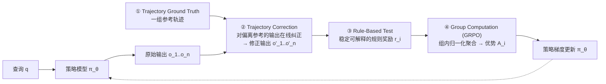

# KAT-Coder 技术报告：用四阶段课程把通用大模型训成『为 harness 而生』的编码 Agent

> **本篇定位（读前须知）**：本库中心命题是 `Agent = Model + Harness`。此前 G 组的 [Harness-Bench](2605.27922-harness-bench-measuring-harness-effects.md) 从 **harness 一侧**做文章——固定模型、只换脚手架，证明分数摆 23.8 分。**KAT-Coder 站在对面**：它固定 harness 的存在、**改造 model 本身**，问的是「如果我知道这个模型将来要活在一个真实的编码 harness（有工具、有多轮、有上下文压缩、有失败恢复）里，我该怎么**训**它，才能让它在那个 harness 里跑得又稳又省？」——所以本篇是把命题的**另一半（model 侧）也向 harness 对齐**的一次系统实践。它不是一篇「新 harness」论文，而是一篇「**为 harness 而训**」的训练配方报告。

---

## §1　TL;DR（一页讲清这篇在干嘛）

> 主讲提示：开场先把全库命题摆出来，再点明这篇打的是「model 侧为 harness 优化」这个我们之前一直缺的角度。然后一句话交代四阶段是什么、各解决什么。

一句话：**KAT-Coder 用一条四阶段的分层课程（four-stage hierarchical curriculum），把一个通用大模型逐级改造成面向真实编码 agent 场景的「agentic 编码模型」**——四阶段依次是 **Mid-Term Training（中期训练）→ SFT（监督微调）→ RFT（强化微调）→ Agentic RL（智能体强化学习）**（原文 §1 Figure 1）。核心痛点用原文一句话概括：「bridging the gap between **static, text-based training** and **interactive, real-world execution**」——传统代码模型在**静止的文本语料**上训练，缺乏在**活的 IDE / agent 环境**里可靠运作所需的「自适应推理与上下文控制」（§1）。四阶段就是**把 agentic 能力一层一层注入**的过程。

- **属于 harness 的哪一层（Θ1）**：本篇归 **E 组（编码集成系统）**，但它特殊——**不造 harness，而是造给 harness 用的 model**。就分层影响面看，它主要在 **T（Tools，工具使用）** 与 **L（Loop，Plan–Action–Observation 控制循环）** 两层上「隔着一层训练」发力：Mid-Term 的「Agentic Interaction Simulation」直接合成 Plan–Action–Observation 轨迹（§2）、SFT 覆盖 10 种任务原型含工具调用、RFT/RL 优化的是多轮轨迹级行为。它还触到 **V（Validation）**——RFT 用 rule-based test 当奖励、SFT 用 EM-SFT 屏蔽错误工具调用的梯度。
- **回扣全库论点（Θ2）**：这篇给 `Agent = Model + Harness` 补的是**长期被 Harness-Bench 那类工作「按住不动」的那一项——model**。Harness-Bench 固定 model、动 harness；KAT-Coder 固定「会有个 harness」这一前提、动 model，且**动的方向就是对准 harness 的执行形态**（§2.1 明说数据来自 Claude Code / Cline / Roo Code / CodeFlicker 这些**生产级 IDE harness**）。最能点题的一处证据：**SWE-Bench-Verified 73.4 这个数字，是「when evaluated under Claude Code」拿到的**（§5 原文）——即**报告出来的能力，本身就是 model×harness 的联合读数**，不是模型的孤立属性。这正是命题「能力不属于 model 或 harness 单独一方，而属于二者的配对」的一次自证。
- **够新够权威（Θ4）**：**2025-10 预印本，快手 Kwaipilot 团队出品**（大厂 agentic-coding 训练报告），开源了 32B 的 KAT-Dev。它的权威性来源是「**产线视角**」——数据直接取自 Claude Code / Cline 等**真实在用**的 agent 系统（§2.1），而非纯学术沙箱；这也是它相对 SWE-Agent 那类「单会话、线性对话」研究框架的增量（§2.1 原文点名 SWE-Agent 的局限）。

> **读出什么**：如果说 Harness-Bench 是「给 harness 装游标卡尺」，KAT-Coder 就是「**按照 harness 的形状去打磨 model 这块料**」。两篇合起来，才把 `Agent = Model + Harness` 的两个自变量都摸了一遍。

---

## §2　问题与动机（why）：为什么「通用模型直接上 agent 任务」会不适配

> 主讲提示：这页用 Why 三连的「问题层」。核心是讲清「静态文本训练」与「动态执行」之间那道缝，以及现有 agent 数据集为什么补不上。

**Why（问题层）——不解决会卡住什么？**
原文开篇给的动机链条很清楚（§1）：

1. **范式已经变了**：LLM 正从「静态文本生成」转向「agentic intelligence」——模型要在交互环境里**自主推理、规划、行动**；在软件工程里这体现为 **agentic coding**，模型从「被动的代码生成器」变成「协作式问题求解者」（§1 原文 "from passive code generators into collaborative problem solvers"）。
2. **可老的训练方式没跟上**：「Conventional code models, typically trained on **massive but inert text corpora**, lack the adaptive reasoning and contextual control required to operate reliably in **live IDEs**」（§1）。关键词是 **inert（惰性/静止）** 对 **live（活的）**——在文本里学会写函数，不等于在一个有工具报错、有上下文被截断、有多轮往返的真实 IDE 里能把活干完。
3. **早期框架的三个硬伤**：Codex[3]、CodeLlama[9]、DeepSeekCoder[10] 这些奠基者「remain limited to **single-turn, instruction-following** behavior」——单轮、只会跟指令（§1）。更近的 SWE-Agent[1]、OpenHands[7]、Claude Code[6] 引入了规划与工具使用，但仍受制于「**narrow domain coverage, short reasoning horizons, and homogeneous datasets**」——领域窄、推理跨度短、数据同质，抓不住真实软件工程工作流的多样性（§1）。**后果**：一旦从 benchmark 环境搬到「异构工具、长期依赖、频繁上下文切换」的生产级系统，性能就掉（§1 原文 "performance deteriorates when transferred from benchmark environments to production-grade systems"）。

**Why（设计层）——为什么用「分阶段课程」，而不是「一把梭」？**
> **Why（设计层）**：朴素做法有两个。**朴素做法 A**：直接拿通用大模型、套个 agent 脚手架就上真实编码任务（zero-shot agentic）。→ 会因为模型没见过「工具报错后怎么恢复、上下文被压缩后怎么接续、多轮里怎么保状态」而**行为脆弱、频繁失败**——这正是 §1 说的「transferred → deteriorates」。**朴素做法 B**：只做一轮大规模 agentic SFT，把所有能力一次性灌进去。→ 会因为**能力维度耦合**（§2 原文列出 agentic 能力是「tool use, instruction following, long-context reasoning, code generation, and multi-turn dialogue」的**复合体**）而互相打架，且生产级轨迹里充斥**噪声工具调用与断裂链路**，直接模仿学习会「degrade convergence and overfit to spurious behaviors」（§2.1）。**本文改用四阶段课程**：先 Mid-Term 把「推理/规划/反思」这些**基础认知**广谱铺开，再 SFT 上**结构化的多维监督**，再 RFT **稳住策略**，最后 Agentic RL 做**多轨迹探索**——一句原文点破设计哲学：「**cognitive enrichment precedes structured supervision, which in turn grounds reinforcement alignment and culminates in real-world adaptation**」（§1）。即**认知在前、监督居中、强化收口、部署适应压轴**，逐级抬升，而非一步到位。

**代价（诚实标注，Θ5 的味道）**：分阶段课程的代价是**数据与算力**——四个阶段各自要专门的语料（20B token 真实 SWE 数据 + 百万级 SFT + 轨迹 ground-truth + RL rollout）和专门的训练系统（Trie-Packed 自定义 kernel）。原文没有给出总算力/成本数字（**原文未给出**训练 GPU 时、总 token 预算、各阶段耗时），这是它作为「技术报告」而非「可复现论文」的一处留白。

> **读出什么**：这就是本篇 Why 三连在**设计层**的骨架——「通用模型直接上 agent 任务 → 不适配（脆弱/失败）；分阶段课程逐步注入 agentic 能力 → 更强（稳、可部署），代价是数据/算力」。后面每一节都是这条主线的展开。

---

## §3　研究问题 / 核心 intention：一句话形式化

> 主讲提示：把整篇的目标压成一句可反驳的命题，方便组会围绕它吵。

**核心 intention（把 §1 目标形式化成一句话）**：

> 给定一个通用底座 LLM，以及一个**已知形态的真实编码 harness 族**（Claude Code / Cline / Roo Code / CodeFlicker 等，具备工具、多轮、上下文压缩、失败恢复），设计一条**分阶段训练课程 $\mathcal{C} = (\text{Mid} \to \text{SFT} \to \text{RFT} \to \text{RL})$**，使得训练后的模型 $\pi_\theta$ 在**这些 harness 内**的 agentic 编码任务上，成功率、鲁棒性、跨语言/跨上下文泛化都显著优于「未经课程、直接套 harness」的同底座模型。

**隐含假设（写清楚才好批判）**：
- **H1（可注入假设）**：agentic 能力可以被**拆解**成若干可分别训练的维度（推理/规划/反思/工具/多轮/长上下文），并**逐级注入**——这是「分阶段」的前提。
- **H2（分布对齐假设）**：只要训练数据取自**生产级 harness 的真实轨迹**（而非学术沙箱），就能缩小「research benchmark ↔ production workflow」的分布鸿沟（§2.1 明写这个 gap）。
- **H3（噪声可屏蔽假设）**：生产轨迹里的错误工具调用/断裂链路是**可识别、可屏蔽**的（EM-SFT），屏蔽后剩下的信号足以支撑稳定学习（§2.1）。

> **读出什么**：这三条假设都不是自明的——H1 可能过度乐观（能力真能干净拆开吗？）、H2 依赖「那几个 harness 是否代表性」、H3 依赖「错误检测器本身准不准」。这些正是 §12 批判要回来敲打的点。

---

## §4　相关工作定位：它站在谁肩上、和谁不同

> 主讲提示：一张表讲清 KAT-Coder 在「代码模型 / 编码 agent」谱系里的位置——它不是又一个 harness，而是「为 harness 而训的 model」。

| 谱系 | 代表 | 能力形态 | 与 KAT-Coder 的关系 |
|---|---|---|---|
| **早期代码模型** | Codex[3]、CodeLlama[9]、DeepSeekCoder[10] | 单轮、指令跟随、静态文本训练 | KAT-Coder 要**超越**的起点：它们「single-turn」，不会多轮 agent（§1） |
| **编码 agent 框架（harness）** | SWE-Agent[1]、OpenHands[7]、Claude Code[6]、Cline[5]、Roo Code[4]、CodeFlicker[8] | 有规划/工具/多轮的**执行层** | KAT-Coder **依赖并复用**它们：§2.1 直接从这些生产 harness 里**采数据**、并在 Claude Code **里评测** |
| **SWE 数据/RL 配方** | SWE-Swiss[11]、SWE-Gym[14]、SWE-Smith[15]、SWE-rebench[13] | 造 agent 训练数据/评测的管线 | KAT-Coder 与之**同类但更广**：它自称现有开源 agentic 语料「强分布偏向 Python bug-fixing」，故重做三轴覆盖（§2） |
| **RL 算法底座** | GRPO / DeepSeekMath[29]、HiPO[23]、AceReason[21]、Skywork-OR1[22] | 策略优化方法 | KAT-Coder **在 GRPO 上加料**：RFT 的 group computation 用 GRPO 归一化，RL 再叠 Trie-Packed + 难度/熵感知 rescaling（§3、§4） |

**和谁最不同（一句话）**：SWE-Agent/OpenHands 那类是**给模型穿的「衣服」（harness）**；KAT-Coder 是**按衣服的版型去练的「身材」（model）**。这正是它值得进本库 E 组、又能反照 Θ2 的原因。

> **读出什么**：本篇的「新」不在某个单点算法，而在**把四阶段串成一条「为部署而训」的闭环**，且**训练目标显式对准真实 harness 的形态**。这在「训练配方」层面是 2025 大厂 agentic-coding 的一个代表切面。

---

## §5　方法总览（big picture）：四阶段管线一图流

> 主讲提示：先给整条流水线的直觉，不展开数学。强调「每一阶段解决前一阶段留下的什么问题」，这是四阶段最该讲透的骨架。

```mermaid
flowchart LR
    subgraph S1["① Mid-Term 中期训练"]
      A1["20B token 真实 SWE 语料<br/>PR/issue/commit/diff"]
      A2["推理+反思增强<br/>合成 CoT 轨迹"]
      A3["Agentic 交互模拟<br/>Plan-Action-Observation 环"]
      A4["复杂指令跟随<br/>可验证结构约束"]
    end
    subgraph S2["② SFT 监督微调"]
      B1["20+ 语言"]
      B2["10 开发上下文"]
      B3["10 任务原型"]
      B4[">1M 样本, 三轴均衡"]
      B5["§2.1 部署适应:<br/>EM-SFT 屏蔽错误工具梯度<br/>+ Tree-Structured 轨迹训练"]
    end
    subgraph S3["③ RFT 强化微调"]
      C1["轨迹 Ground Truth"]
      C2["轨迹修正 Trajectory Correction"]
      C3["Rule-Based Test → 奖励 r_i"]
      C4["Group Computation (GRPO)<br/>相对评估, 非绝对奖励"]
    end
    subgraph S4["④ Agentic RL 智能体强化"]
      D1["Trie-Packed Training<br/>共享前缀只算一次"]
      D2["Gradient Scaler<br/>保证前缀梯度正确"]
      D3["自定义 kernel<br/>前缀掩码注意力"]
      D4["难度+熵感知优势重标定<br/>A' = α·β·A"]
    end
    S1 --> S2 --> S3 --> S4 --> OUT["可部署的 agentic 编码模型<br/>KAT-Coder / KAT-Dev-32B"]
```

**四阶段各自「补的洞」（这是全篇的中枢，务必记住）**：

| 阶段 | 它假设「前一步已给了什么」 | 它**新解决**的问题 | 一句话作用 |
|---|---|---|---|
| **① Mid-Term** | 通用预训练给了语言/世界知识 | 底座缺「深推理/规划/反思/交互」的**认知底座** | **拓宽认知与交互的上界**，为 agentic SFT 铺地基（§2） |
| **② SFT** | Mid-Term 给了认知底座 | 缺「跨语言/跨上下文/跨任务」的**结构化监督**；且生产轨迹有**噪声** | 用三轴均衡的百万样本教「怎么按规矩干活」；EM-SFT/TST **稳住脏数据**（§2、§2.1） |
| **③ RFT** | SFT 给了会干活的策略 | 绝对奖励**尺度敏感、样本低效、训练不稳** | 换成**相对评估**（比 ground-truth 差多少），稳住并提效（§3） |
| **④ Agentic RL** | RFT 给了稳定策略 | 多轨迹训练**吞吐低**、GRPO **探索坍缩**（易/难任务被忽视、熵坍缩） | Trie-Packed 提吞吐、难度/熵感知 rescaling **保探索多样性**（§4） |

> **读出什么（Why·设计层，贯穿）**：四阶段不是「四个平行技巧」，而是一条**依赖链**——认知（Mid）→ 规范（SFT）→ 稳定（RFT）→ 探索（RL）。每一步都在「消化」上一步的产物、并补它的短板。这也解释了为什么不能省阶段：跳过 Mid，SFT 就在「没认知底座」的模型上教规范，学不动；跳过 RFT 直接 RL，策略未稳就上高方差探索，容易崩。

---

## §6　符号与术语表

> 主讲提示：一次性把后面 RFT/RL 公式要用的记号钉死，讲公式时不再岔开解释。

| 记号 / 术语 | 含义 | 出处 |
|---|---|---|
| $q$ | 输入查询 (query)，一次 agent 任务的起点 | §3 |
| $\pi_\theta$ | 参数为 $\theta$ 的策略模型 (policy model) | §3 |
| $o_1,\dots,o_n$ | 策略产出的 $n$ 条轨迹输出 (trajectory outputs) | §3 |
| $o_i'$ | 第 $i$ 条输出经**轨迹修正**后的版本 (corrected output) | §3 |
| $r_i$ | 第 $i$ 条（修正后）输出经 rule-based test 得到的规则奖励 (rule-based reward)；在 §4.2 里 $r_i$ 复用为**第 $i$ 个任务组的平均成功率** | §3 / §4.2 |
| $A_i$ / $A_{ij}$ | GRPO 组内归一化后的优势 (advantage)；$A_{ij}$ 指第 $i$ 组第 $j$ 个样本 | §3 / §4.2 |
| $D_i$ | 第 $i$ 个任务组的**难度** (difficulty) | §4.2 |
| $\bar D$ | 当前 batch 的**平均难度** | §4.2 |
| $\lambda>0$ | 难度缩放幅度系数 | §4.2 |
| $H_{ij}$ | 第 $i$ 组第 $j$ 个样本的**策略熵** (policy entropy) | §4.2 |
| $\bar H_i$ | 第 $i$ 组的**平均熵** | §4.2 |
| $\mu>0$ | 熵缩放幅度系数 | §4.2 |
| $\alpha_i^{\text{group}}$ | 组级难度缩放因子 | §4.2 |
| $\beta_{ij}^{\text{sample}}$ | 样本级熵缩放因子 | §4.2 |
| $A_{ij}'$ | 难度+熵感知重标定后的**最终优势** | §4.2 |
| Trie / 前缀树 | 把共享前缀的多条轨迹组织成的树 (prefix tree) | §4.1 |
| EM-SFT | Error-Masked SFT，错误屏蔽监督微调 | §2.1 |
| TST | Tree-Structured Trajectory Training，树结构轨迹训练 | §2.1 |
| Plan–Action–Observation | agentic 交互的规划-行动-观察循环 | §2 |

---

## §7　阶段一 · Mid-Term Training：把「认知底座」广谱铺开

> 主讲提示：这是四阶段的第一根柱子。核心一句——**在正式喂 agentic 监督数据之前，先把模型的「推理/规划/反思/交互」范围撑大**。四个配方成分要逐条讲它「激活了什么」。

**这一阶段在解决什么（Why·问题层）**：原文 §2 开门见山——「Agentic capability 是一种**复合智能**，整合了 tool use、instruction following、long-context reasoning、code generation、multi-turn dialogue 多个维度」。这些维度共同决定模型在真实编码环境里「自主决策、自适应交互」的能力。**所以在上真实 Agentic 监督之前，先做一轮广谱的 Mid-Term，把这些维度的上界撑开**，为后续 Code-Oriented SFT 打地基（§2 原文 "establishing a solid foundation for subsequent Code-Oriented SFT"）。

**四个配方成分（Training Recipe，§2，逐条给「激活了什么」）**：

1. **Real-World Software Engineering Corpus（真实软件工程语料）**：约 **20B token** 的真实用户编程数据，取自 GitHub 的 **pull requests / issues / commits / 对应 code diff patches**（§2）。→ 激活的是「真实人–码交互与演化模式」，即**协作式开发工作流**的分布，而非教科书式孤立函数。
2. **Reasoning and Reflection Enhancement（推理与反思增强）**：用「先进开源推理模型」生成 **chain-of-thought 轨迹**，覆盖复杂 SWE 问题、竞赛级 STEM、逻辑谜题（§2）。→ 激活「多域推理与系统化思考」。**这是把『会想』这件事显式教进去**——注意它是**合成数据**（synthetic CoT），来源模型未具名（**原文未给出**具体是哪些开源模型、CoT 数据量）。
3. **Agentic Interaction Simulation（智能体交互模拟）**：构造**模拟环境**，合成反映 **Plan–Action–Observation 循环**的轨迹（§2）。→ 直接激活 **L 层（控制循环）**能力：「train the model to dynamically adapt its plans and decisions based on environmental feedback」——教模型**根据环境反馈动态调整计划**。这是四成分里**最贴 harness 的一条**，因为 Plan–Action–Observation 正是 ReAct 式 agent 循环的骨架。
4. **Complex Instruction Following and Constraint Alignment（复杂指令跟随与约束对齐）**：策划带**可验证逻辑/结构约束**的指令数据，提升在「多条件复杂指令」下的一致性、可控性、鲁棒性（§2）。→ 激活「按契约办事」的能力，为后面 SFT/RFT 里「产出要满足机器可验格式」埋伏笔。

**Mid-Term 的净效果（原文自评）**：「substantially strengthens the model's foundational reasoning, reflection, and interaction capabilities, providing a crucial **bridge between general pretraining and Agentic SFT**」（§2）。一句话——它是**通用预训练与 agentic 微调之间的那座桥**。

> **Why（设计层）——为什么要单开一个 Mid-Term，而不直接 SFT？**
> 朴素做法是跳过 Mid-Term，拿通用底座直接做 agentic SFT。→ 会因为底座**没有被激活的规划/反思/交互回路**，导致 SFT 阶段「既要教认知、又要教规范」，两件事挤在一轮里学不动、且 agentic 监督数据（更贵、更稀）被浪费在补基础认知上。本文把「撑认知上界」**前置且用更便宜的语料+合成 CoT** 完成，再让 SFT 专注「结构化规范」——**分工更干净、数据更省**。

> **读出什么**：Mid-Term 是四阶段里最「隐形」但最关键的一步——它决定了后面三阶段的**天花板**。原文原话："serves as a **decisive stage** for expanding the upper limit"（§2）。缺失项要诚实标注：**原文未给出** Mid-Term 后的独立 ablation 数字（它对最终分贡献几分，没有单列）。

---

## §8　阶段二 · SFT：三轴均衡的百万级监督 + 「为部署」的两把脏数据手术刀

> 主讲提示：SFT 分两块讲。前半：为什么要「三轴均衡」的百万样本（对抗数据偏斜）。后半（§2.1，本篇最贴 harness 的技术）：怎么从生产级 harness 的**脏轨迹**里安全学习——EM-SFT + TST。

### 8.1　三轴均衡的数据集重设计（对抗「Python-bug-fixing 偏斜」）

**Why（问题层）**：原文 §2 直言现有开源 agentic 语料有「strong distributional bias，majority focusing on **Python-based bug-fixing**」——绝大多数样本挤在「Python 改 bug」这一小块。但真实编程远不止于此。**于是沿三条正交轴（three orthogonal axes）重做数据集**，保证覆盖与多样：

- **编程语言轴（Programming Language Dimension）**：覆盖 **20+ 主流语言**——高频的 Python/Java/TypeScript/JavaScript/C/C++/C#/Kotlin/Go/Rust/PHP/Ruby，再扩到 Swift/Objective-C/Scala/R/Shell-Bash/SQL/MATLAB/Dart/Lua/Elixir/Haskell/Perl（§2）。跨「脚本 ↔ 系统编程」，保异构语言范式的泛化。
- **开发上下文轴（Development Context Dimension）**：**10 个代表性上下文**——应用开发、系统与基础设施开发、UI/UX 工程、数据科学与工程、数据库系统、机器学习与 AI、算法设计与分析、测试与调试、系统架构与维护、专门编程领域（§2）。均衡采样防某一领域过度代表。
- **任务类型轴（Task Type Dimension）**：**10 个基本原型**——实现、修改与功能增强、调试与修 bug、重构、性能优化、代码解释与文档、代码分析、代码生成、测试用例生成、配置与部署（§2）。覆盖从「问题形成」到「方案部署」的完整开发生命周期。

**数据规模**：三轴交叉，得到 **>1M（超百万）样本**的 SFT 语料（§2 "Dataset Scale and Distribution"）。数据源是 GitHub + Stack Overflow 的大规模挖掘（commit 历史、code diff、review comment、Q&A 线程），据此做「principled sampling and categorization」（§2 "Data Sources and Statistical Analysis"）。

> **Why（设计层）——为什么是「三轴正交均衡」而不是「多爬点数据」？**
> 朴素做法是无脑扩大爬取量。→ 数据越多**偏斜越被放大**（Python-bugfix 本来就多，爬得多它占比更高），模型在长尾语言/上下文/任务上仍然弱。本文改用**三轴显式配额均衡采样**——把「语言×上下文×任务」当成一个立方体，往每个格子里塞样本，**用结构对抗偏斜**。代价：需要先做统计分析（§2 明写要先从 commit/diff/review/Q&A 里「extract and summarize patterns of user activity and developer intent」）来定配额，工程量更大。

### 8.2　§2.1 部署适应：从生产级 harness 的脏轨迹里安全学习（本篇最贴 harness 的一节）

> 主讲提示：这是 Θ3 的富矿。这一小节的动机就是「研究框架的干净数据 ≠ 真实 harness 的脏数据」，解法是两把手术刀。慢慢讲。

**Why（问题层）——研究数据的干净掩盖了真实的脏**：原文 §2.1 "Motivation"——现有 SFT 阶段的 code-agent 数据主要来自 **SWE-Agent[1] 这类研究框架**，依赖「**linear, single-session dialogues** 和 homogeneous operation pipelines」（线性、单会话、同质流水线）。这对「受控学术评测」有效，但**抓不住真实 agentic 环境的复杂性**——真实里 agent 要在「异构工具链、长程依赖、非线性会话轨迹（频繁上下文切换 + 多轮推理）」中运作。**这道 research↔production 的分布鸿沟，限制了 agentic 代码模型部署时的泛化**（§2.1）。

**解法的数据来源（Θ3 关键证据）**：为了弥合这道缝，作者**用早期 KAT-Coder 模型 × 生产级 IDE 系统**去生成新一代 Agentic Workflow 训练数据——点名的生产 harness 是 **Claude Code[6]、Cline[5]、Roo Code[4]、CodeFlicker[8]**（§2.1 "Data Construction across Production Environments"）。这些环境提供**真实执行 trace、工具调用、迭代式人–agent 交互**。→ **这就是「model 为 harness 而训」的字面实现**：训练数据本身就长在真实 harness 里。

**但真实轨迹带来两个新训练挑战（§2.1 "Training Challenges"）**：
1. **工具谱系爆炸（Expanded Tool Spectrum）**：真实 agent 要跟**几十种异构工具**（debugger、linter、package manager…）打交道，导致**频繁的错误或冗余工具调用**。
2. **非线性上下文边界（Non-Linear Context Boundaries）**：压缩检查点（compression checkpoints）、上下文截断、模式切换（coding/planning/execution 之间）引入**分支点**，打断依赖链的连续性。

**后果**：这些让**直接模仿学习不稳定**——从「噪声工具调用或断裂轨迹」来的梯度会「degrade convergence and overfit to **spurious behaviors**」（学到假模式）（§2.1）。

**两把手术刀（Methodology，§2.1）**：

- **① EM-SFT（Error-Masked SFT，错误屏蔽监督微调）**：利用**执行反馈日志**识别工具使用失败，**选择性地屏蔽来自错误工具调用的梯度**（selectively mask gradients from erroneous tool calls）。→ 直觉：**别让模型「学会」它自己犯过的错**，但**保留**从错误里「自我纠正」的推理信号（"while retaining the model's exposure to self-corrective reasoning signals"）。这是一处很妙的平衡——不是把错误轨迹整条丢掉，而是**只掐掉「错误动作」那一段的梯度、留下「意识到错并改」的那一段**。
- **② TST（Tree-Structured Trajectory Training，树结构轨迹训练）**：把**多分支轨迹**按「上下文压缩边界 + 模式切换」分解成**局部连贯的子树（locally coherent subtrees）**；在**每棵子树内部独立做标准 SFT**（§2.1）。→ 直觉：非线性的长轨迹如果当成一条直线来训，分支点会污染依赖链；**切成子树、树内单独训**，保证「稳定优化 + 更好的时序一致性」。

**净效果（原文自评）**：这两招让策略模型能从「真实、生产级轨迹」里学习而**不牺牲训练稳定性或语义连贯**，是「aligning the model's behavior with human engineering workflows」通向「fully deployable agentic coding systems」的**基石一步**（§2.1）。

> **Why（设计层）——为什么不干脆只用干净的研究数据（如 SWE-Agent 轨迹）？**
> 朴素做法就是继续用 SWE-Agent 那种线性单会话干净数据。→ 模型在**分布内**（学术评测）好看，一旦进真实 harness（异构工具、上下文压缩、模式切换）就**分布外崩**——这正是 §2.1 开头点破的 gap。本文宁可要**更脏但更真**的生产轨迹，再用 EM-SFT/TST 把脏的部分「外科手术式」处理掉。代价：需要**执行反馈日志**（要能拿到工具成功/失败信号）和**轨迹结构解析**（要能识别压缩边界/模式切换）——这两样都要求 harness 本身**可观测（O 层）**，否则手术无从下刀。

> **读出什么（Θ3 预告）**：这一节几乎是给「我们自己的 harness」写的说明书——**如果我们想从自己 agent 的真实运行日志里回训模型，EM-SFT（屏蔽错误工具调用梯度）+ TST（按 compaction 边界切子树）就是现成配方**。详见 §13 Inspires-Us。缺失项：**原文未给出** EM-SFT 屏蔽了多大比例的 token、TST 切出多少子树、以及去掉这两招后的 ablation。

---

## §9　阶段三 · RFT：把「绝对奖励」换成「相对评估」，稳住并提效

> 主讲提示：这页讲 RFT 的核心 intention——用「离 ground-truth 有多远」代替「拿了多少绝对奖励」。先给直觉，再走 Figure 2 的四步流水线。

**Why（问题层）——绝对奖励为什么坑**：原文 §3 开门——传统 RL 直接从模型输出算**绝对奖励 (absolute reward)**，它「**highly sensitive to the reward scale**，常导致不稳定优化或低效样本利用」。即奖励一旦尺度漂移（今天满分是 10、明天是 100），策略梯度就抖，样本也用不高效。

**解法（§3 核心 intention）**：提出**相对评估框架 (relative evaluation framework)**——模型的优化基于「**生成样本与 ground-truth 轨迹之间的差异 (discrepancy)**」，而非绝对奖励幅度。这个变换「稳定训练过程、显著提升采样效率」（§3）。这里引入了本篇一个反复出现的关键设计——**multi-ground-truth（多重轨迹 ground truth）**：不是拿一条标准答案卡，而是**一组** ground-truth 轨迹当参考信号。

**Figure 2 的四步流水线（RFT method overview，§3）**：给定输入 $q$，策略 $\pi_\theta$ 产出 $n$ 条轨迹 $o_1,\dots,o_n$——

四步逐条（§3，Figure 2 图注）：
1. **Trajectory Ground Truth（轨迹 ground truth）**：为生成轨迹提供**评估与纠正信号**的一组参考轨迹。
2. **Trajectory Correction（轨迹修正）**：对「偏离参考轨迹」的输出做**在线纠正**，得修正输出 $o_i'$。→ 直觉：不是简单打个低分就完事，而是**把跑偏的轨迹往正确方向掰回来**再评估，等于给策略更强的「怎么改对」的信号。
3. **Rule-Based Test（规则测试）**：对修正后输出跑规则，产出**稳定、可解释**的规则奖励 $r_i$（§3 "stable and interpretable rule-based reward signals"）。→ 用规则（如单测通过、格式校验）而非模型打分，**奖励更硬、更可复现**。
4. **Group Computation（组计算）**：在 **GRPO[29]** 框架下**归一化并聚合**样本组，得最终优势 $A_i$ 用于策略梯度（§3）。

**训练稳定性与样本效率（§3）**：用「相对差异估计」替「绝对奖励」，有效缓解「模型波动或奖励尺度漂移」带来的不稳定；此外，对**显著偏离 ground-truth 的轨迹**做**早停 + 重采样 (early termination and resampling)**，提升整体样本利用与 rollout 效率。

**Empirical Insights（原文自评，§3）**：这套设计带来——(1) 更稳的奖励信号（减 scale drift、增收敛）；(2) 更高样本效率（靠 correction + resampling 过滤无效 rollout）；(3) 更好语义对齐（生成轨迹更贴人工验证的 ground truth）。

> **Why（设计层）——为什么要「修正 + multi-ground-truth」，而不只用规则奖励打分？**
> 朴素做法是：只跑 rule-based test 给个 0/1 奖励，标准的 RLVR。→ 会因为**奖励稀疏**（很多轨迹全错、信号全 0）和**单一 ground-truth 太严**（略微偏离就判负）而样本效率低、探索受挫。本文加**轨迹修正**（把跑偏的掰回来，制造「近似正确」的中间信号）+ **multi-ground-truth**（多条参考，容忍多解），把「离对有多远」做成**连续、可塑**的相对信号——**稳定性和采样效率都来自这层「相对化 + 可纠正」**。代价：要**准备/维护一组 ground-truth 轨迹**（数据成本），且「纠正」本身要有可靠机制（原文未给出 correction 的具体算法细节——**原文未给出** correction 是用规则、模型、还是编辑距离实现）。

> **读出什么**：RFT 的角色在四阶段里是**「稳定器」**——它承接 SFT 给的策略，在上 Agentic RL 的高方差探索之前，先把「奖励尺度/样本效率/语义对齐」这三件事捋顺。缺失项：**原文未给出** RFT 用了多少任务/多少 ground-truth 轨迹、GRPO 组大小 $n$、以及具体规则集。

---

## §10　阶段四 · Agentic RL（上）：Trie-Packed Training——让共享前缀只算一次

> 主讲提示：这页讲 RL 的第一大招，是纯工程但很硬核的吞吐优化。核心直觉：agent 轨迹是「树」不是「线」，树上大量公共前缀重复算了 → 只算一次。

**Why（问题层）——agent 轨迹是树，不是线**：原文 §4.1——在 agentic LLM 训练里，一个 agent 的行为**高度多样**，其轨迹历史通常**不是**线性的 `prompt1→response1→prompt2→response2`；相反，**同一个任务能产出多条轨迹，很多共享公共前缀**（Figure 3：5 条轨迹从根 `r` 出发、经 `u` 分叉，Trajectory 1/2/3 共享 `v1`、4/5 共享 `v5`，天然是一棵**前缀树 Trie**）。

**关键洞察（§4.1）**：既然多条轨迹共享前缀，**这些共享前缀的计算可以只做一次**，能大幅提升训练吞吐——「类似 LLM 推理里的 prefix caching」。**但训练里有个推理没有的坎**：训练要**反向传播**，不能直接复用缓存结果——那样会**忽略后缀 token 对前缀 token 的梯度贡献**，导致计算错误（§4.1）。目标遂定为：**在前向和反向里都只算每个共享前缀一次**，从而提升 agentic LLM 训练吞吐。

**Trie-Packed Training 的三根支柱（§4.1，引用作者自己的 notion 说明[30]）**：

1. **Maximize shared prefix reuse through Trie Packing（用 Trie Packing 最大化共享前缀复用）**：轨迹合成一棵树后，**整棵树往往塞不进一个 batch 的 GPU 显存**。作者用**动态规划 + 贪心**的组合算法，在显存约束下**打包这棵树、最大化共享前缀复用**（§4.1）。→ 直觉：这是个「带约束的装箱问题」——在显存上限内，尽量把「能共享前缀的轨迹」装进同一 batch，省得重算。
2. **Design Gradient Scaler to ensure correct gradient computation（设计梯度缩放器保证梯度正确）**：反向传播时，**一个共享前缀在不同轨迹里的梯度贡献是不同的**；作者实现了一个**树结构梯度缩放器 (tree-structured gradient scaler)**，从数学上保证每个共享前缀**正确地**贡献梯度（§4.1）。→ 这是「只算一次」在数学上成立的关键补丁：前缀被 $k$ 条轨迹共享，它的梯度必须按这 $k$ 条的贡献正确加权，不能算一次就当一份。
3. **Develop custom kernels（开发自定义 kernel）**：实现了高效的**共享前缀掩码注意力 (shared-prefix mask attention)** 与**为「压平的 trie pack 数据」改造的 position embedding**，同时保证**训练正确性与高吞吐**（§4.1）。

> **Why（设计层）——为什么不直接照搬推理的 prefix caching？**
> 朴素做法是把推理里成熟的 prefix caching 搬到训练。→ 会因为训练**有反向传播**而**算错梯度**（忽略后缀对前缀的贡献），这是原文明确点破的坑（§4.1）。本文的三根支柱正是逐一堵这个坑：Trie Packing 解决「装不下」、Gradient Scaler 解决「梯度算错」、custom kernel 解决「掩码/位置编码要为压平的树数据改造」。三者缺一，「只算一次」要么装不进、要么算错、要么跑不快。

> **读出什么**：Trie-Packed 是**纯吞吐/系统优化**，不改变学习目标——它让 Agentic RL 在「一任务多轨迹」的天然树结构上**训得起、训得快**。这是把「多轨迹探索」从「理论上想要」变成「工程上跑得动」的使能器。缺失项：**原文未给出** Trie-Packed 的**加速比数字**（提了几倍吞吐？没给）、也未给硬件规格。

---

## §11　阶段四 · Agentic RL（下）：难度 + 熵感知优势重标定——把探索资源投到该投的地方

> 主讲提示：这页是全篇公式最密的一段（§4.2），也是 RL 的第二大招。逐个公式走「直觉→符号→式子→读出什么」。核心 intention：标准 GRPO 会把探索资源偏给「中等难度」任务、还会熵坍缩；这里按**难度**和**熵**动态重标定优势，把资源投给「还没学会的难任务」和「更有探索价值的高熵样本」。

**先回顾优势的作用（§4.2 起手式）**。

> 直觉：策略梯度里，每个样本对参数更新的「话语权」由它的**优势 $A(s,a)$** 决定——优势大，这个样本被更用力地学。

记号：$\theta$ 策略参数；$\eta$ 学习率；$\nabla_\theta\log\pi_\theta(a|s)$ 对数似然梯度；$A(s,a)$ 状态 $s$ 下动作 $a$ 的优势。

$$\theta \leftarrow \theta + \eta\,\nabla_\theta\log\pi_\theta(a|s)\,A(s,a)$$

读出什么：**优势越大的样本，越主导更新方向**。所以「如何分配优势」= 「如何分配训练资源」——这正是下面要动手的地方。

**问题（Why·问题层，§4.2）**：标准 GRPO 有个毛病——它**倾向把最大的优势分给「中等难度」任务**，从而**限制了对「很易」和「很难」任务的探索，并可能引发熵坍缩 (entropy collapse)**。直觉：中等难度任务奖励方差最大、组内归一化后优势最显眼，于是模型只顾着啃中间那批，**太易的不学（浪费）、太难的也不学（正是最该突破的）**，久而久之策略越来越确定、熵坍缩、失去探索。

**修一：按难度重标定（组级）**。

> 直觉：**越没学会的任务，越该加大优化力度**。先量化「难度」。

对第 $i$ 个任务组，难度定义为「1 − 平均成功率」：

记号：$r_i$ 此处指第 $i$ 组的**平均成功率**（average success rate）。

$$D_i = 1 - r_i$$

读出什么：$D_i$ 越大 = 成功率越低 = 越难 = **越没被掌握、越需要强优化**；$D_i$ 越小 = 越易 = 该**减少强调**（§4.2 原文）。

再据难度定**组级缩放因子**：

记号：$\bar D$ 当前 batch 的平均难度；$\lambda>0$ 控制缩放幅度。

$$\alpha_i^{\text{group}} = 1 + \lambda\,(D_i - \bar D)$$

读出什么：**比 batch 平均更难的组**（$D_i>\bar D$），$\alpha>1$，优势被**放大**；**比平均更易的组**，$\alpha<1$，优势被**压小**。这就把资源从「中等/容易」往「更难」的组倾斜。

**修二：按熵重标定（样本级）**。

> 直觉：在同一组内，**动作选择更不确定（高熵）的样本，探索价值更高**，该被更强调；**很确定（低熵）的样本**探索价值低。

记号：$H_{ij}$ 第 $i$ 组第 $j$ 样本的**策略熵**；$\bar H_i$ 该组平均熵；$\mu>0$ 控制熵缩放强度。

$$\beta_{ij}^{\text{sample}} = 1 + \mu\,(H_{ij} - \bar H_i)$$

读出什么：**高于组均熵的样本**（$H_{ij}>\bar H_i$），$\beta>1$，优势被**放大**（鼓励探索）；低熵样本 $\beta<1$，被压小。这直接对抗**熵坍缩**——给高熵样本更多话语权，维持策略多样性。

**合并：最终重标定优势**。

$$A_{ij}' = \alpha_i^{\text{group}}\,\beta_{ij}^{\text{sample}}\,A_{ij}$$

读出什么：最终优势 = 组级难度因子 × 样本级熵因子 × 原始优势。**难 × 高熵**的样本被最放大、**易 × 低熵**的被最压制。原文一句总结其效果（§4.2）："dynamically allocates training resources to **amplify high-difficulty tasks** and **emphasize high-entropy samples**，maintaining policy diversity, preventing entropy collapse, and enhancing exploration, robustness, and generalization."

> **Why（设计层）——为什么要「难度 × 熵」两层，而不只调一个？**
> 朴素做法 A：只按难度加权。→ 能把资源投向难任务，但**组内**仍可能坍缩到少数确定动作（熵坍缩没解决）。朴素做法 B：只按熵加权。→ 维持了多样性，但**跨组**的资源分配仍偏中等难度（易/难两端仍被忽视）。本文**两层正交相乘**：$\alpha$ 管**组间**（哪类任务多投）、$\beta$ 管**组内**（哪个样本多投），一个治「投给谁」、一个治「别坍缩」——**分工正交、故相乘**。代价：多了 $\lambda,\mu$ 两个超参要调（**原文未给出** $\lambda,\mu$ 的取值，也未给这两招的独立 ablation/敏感性）。

> **读出什么（Θ2 呼应）**：这套「难度/熵感知 rescaling」在**机制上**回答了 Harness-Bench §9 的一个观察——「强模型更不挑 harness、跨 harness 方差更低」。KAT-Coder 是**从 model 侧**主动去补「难任务 + 高熵探索」，正是想把模型练成那种「更鲁棒、更泛化、不那么依赖外部脚手架兜底」的强模型。两篇一个测现象、一个造现象。

---

## §12　实验设置与主要结果：七个 benchmark 上的「均衡强」

> 主讲提示：先把每个 benchmark 的指标定义讲清（尤其 SWE-Bench、pass@1 类），再读 Table 1。重点抓两条：一是「均衡」而非单点爆表，二是 SWE-Bench 73.4「在 Claude Code 下」——这是 Θ3 的题眼。

### 12.1　评测覆盖与指标定义式（§5）

原文在 6 类能力上评（§5，含引用）：**指令跟随** IFEval[31]、**工具调用** TAU2-Bench Retail[32]、**数学推理** AIME 2025、**代码生成** LiveCodeBench V6[33] / HumanEval[34]、**通用知识** GPQA-Diamond[35]、**agentic 编码** SWE-Bench-Verified[36]。对比对象是 **Qwen3-Coder-480B[37,38]、Kimi-k2-0905[39]、Claude 4 Sonnet[40]**（§5）。

**关键指标定义式（原文未逐一给出，此处补标准定义，供组会读数——均为社区标准口径，非 KAT-Coder 独创）**：

- **SWE-Bench-Verified（%解决率）**：给定真实 GitHub issue + 仓库快照，agent 生成 patch，**当且仅当 patch 使「该 issue 对应的隐藏测试集」全部通过**才算解决。
  记号：$\mathcal{I}$ 任务集（Verified 子集为人工确认可解的 500 题），$\mathbb{1}[\cdot]$ 指示函数，$\text{tests}_i$ 第 $i$ 题的隐藏测试。
  $$\text{Resolved\%} = \frac{1}{|\mathcal{I}|}\sum_{i\in\mathcal{I}} \mathbb{1}\big[\text{patch}_i \text{ 通过全部 } \text{tests}_i\big]\times 100$$
  读出什么：这是**端到端**指标——要真读懂仓库、定位、改对、且不弄坏别的测试。它**天然是 model×harness 的联合读数**（agent 得靠 harness 提供的工具去浏览/编辑/跑测），所以「在哪个 harness 下测」至关重要。
- **pass@1（HumanEval / LiveCodeBench）**：每题生成 1 个解，**通过该题全部单元测试**记 1。$\text{pass@1}=\frac{1}{N}\sum_{i}\mathbb{1}[\text{sol}_i \text{ 通过 } \text{tests}_i]$。读出：一次成型的功能正确率。
- **IFEval（指令跟随准确率）**：一组带**可程序化验证约束**的指令（如「输出恰好 3 段」「含关键词 X」），按满足约束的比例计分。读出：**按契约办事**的能力——正好呼应 Mid-Term 的「复杂指令跟随」成分。
- **AIME 2025（%）**：竞赛数学题，答对比例。**GPQA-Diamond**：研究生级、抗搜索的科学多选题正确率。**TAU2-Bench Retail**：双控（dual-control）对话 agent 在零售场景的任务成功率，测**工具调用 + 多轮**。

### 12.2　Table 1（§5 主结果，粗体=该行最优；引原文数字）

| Benchmark | 能力维度 | **KAT-Coder** | Qwen3-Coder-480B | Kimi-k2-0905 | Claude 4 Sonnet |
|---|---|---:|---:|---:|---:|
| IFEval | 指令跟随 | 86.0 | 84.8 | **89.3** | 88.2 |
| TAU2-Bench Retail | 工具调用 | 62.3 | 57.9 | 56.5 | **64.2** |
| AIME 2025 | 数学推理 | **72.5** | 44.3 | 49.5 | 70.5 |
| LiveCodeBench V6 | 代码生成 | 48.2 | 48.2 | **48.9** | 46.5 |
| HumanEval | 代码生成 | 96.3 | 95.1 | 88.4 | **98.2** |
| GPQA-Diamond | 通用知识 | 68.2 | 60.6 | **70.2** | 68.7 |
| **SWE-Bench-Verified** | **agentic 编码** | **73.4** | 69.6 | 65.8 | 72.7 |

**Why（结果层）——为什么是「均衡领先 + agentic 编码夺魁」这个画像？**
1. **SWE-Bench-Verified 73.4，全表最高**（>Claude 4 Sonnet 72.7、>Qwen3-Coder-480B 69.6、>Kimi-k2 65.8）——**这正是四阶段课程最该兑现的地方**：SWE-Bench 是**端到端 agentic 编码**，恰好是 Mid-Term（交互模拟）+ SFT（生产轨迹 EM-SFT/TST）+ RFT/RL（多轨迹优化）**联合注入的能力**的靶心。原文明说这 73.4 是「**when evaluated under Claude Code**」拿到的（§5）——**model 是为 Claude Code 这类 harness 而训、又在其中评测**，闭环自洽。
2. **AIME 2025 72.5，断层第一**（Qwen3-Coder 仅 44.3、Kimi-k2 49.5）——反映 Mid-Term「reasoning & reflection enhancement」（竞赛级 STEM CoT）确实把**数学推理**这条线拉起来了。
3. **「均衡」而非单点**：原文自评「consistently strong and balanced」——它在 IFEval/GPQA/LiveCodeBench/HumanEval 上**不一定每项第一**（IFEval 输给 Kimi-k2、HumanEval 输给 Claude 4 Sonnet、GPQA 输给 Kimi-k2、LiveCodeBench 略输 Kimi-k2），但**没有明显短板**，且在两个「最吃 agentic 能力」的项（SWE-Bench、AIME）上领先。**这与四阶段「逐维注入」的设计目标一致**——追求的是复合能力的均衡，不是刷单一榜。

**四阶段各自的贡献（原文 §5 定性归因，注意是叙述性、非 ablation 数字）**：
- **Mid-Term** → broadens reasoning depth（拓宽推理深度）
- **SFT** → enhances cross-language generalization（跨语言泛化）
- **RFT** → stabilizes policy learning through relative rewards（相对奖励稳住策略）
- **RL（Trie-Packed）** → yields high-efficiency multi-trajectory optimization（高效多轨迹优化）

> **读出什么（关键诚实标注）**：Table 1 是**唯一**的定量结果表——**原文未给出**：① 任何**逐阶段消融**（去掉 Mid-Term / EM-SFT / Trie-Packed / rescaling 各掉几分，全无数字，只有上面这段**定性**归因）；② KAT-Coder 的**参数规模**（正文只说开源版 KAT-Dev 是 32B，KAT-Coder 本体规模未明说）；③ 各 benchmark 的**评测 harness/采样温度/pass@k 的 k**（除 SWE-Bench 点了 Claude Code 外，其余未注明在什么 scaffold 下、怎么采样）；④ **随机种子/置信区间/多次运行方差**。这些留白使得「四阶段各自贡献几分」在本报告里**无法被验证**，只能采信作者叙述——这是它作为「technical report」而非「peer-reviewed paper」的典型特征，必须诚实指出（详见 §12 批判、Θ5）。

---

## §13　消融与分析：作者给了什么、没给什么

> 主讲提示：这页要非常诚实。四阶段设计很漂亮，但「哪个阶段贡献多少」原文**没有做受控消融**，只有定性归因。把「有的」和「缺的」摆清楚，是本报告判断力的体现。

**原文实际提供的「分析」**（都在 §5 末那段叙述里，属**定性归因**而非受控实验）：

| 阶段 | 原文声称的贡献 | 证据强度 |
|---|---|---|
| Mid-Term | broadens reasoning depth | **仅叙述**，无 with/without 对照 |
| SFT | enhances cross-language generalization | **仅叙述**（三轴均衡是设计，但没给「不均衡 vs 均衡」的对比数） |
| RFT | stabilizes policy learning（relative rewards） | §3 给了 "Empirical Insights" 三条，但**无数字**（无 loss 曲线、无稳定性指标） |
| RL | high-efficiency multi-trajectory optimization | **无加速比、无最终分增量** |

**缺失的关键消融（原文未给出，逐条列出——这是组会该追问的清单）**：
- **阶段级 ablation**：4 阶段全排列（如「只 SFT」「SFT+RFT」「全四阶段」）各得多少 SWE-Bench？→ **没有**。无法回答「四阶段是否都必要、边际递减在哪」。
- **组件级 ablation**：EM-SFT vs 普通 SFT、TST vs 线性训练、有/无难度-熵 rescaling、有/无轨迹修正 → **全无**。
- **超参敏感性**：$\lambda,\mu$（rescaling）、GRPO 组大小 $n$、ground-truth 轨迹条数 → **全无取值、全无扫描**。
- **系统指标**：Trie-Packed 的**吞吐加速比**、显存占用、EM-SFT 屏蔽的 token 比例 → **全无**。
- **成本**：总训练算力、各阶段 token 预算、时长 → **全无**。

> **读出什么（Θ5 诚实）**：本篇的**说服力主要来自「设计叙事的自洽」+ Table 1 的「均衡领先」**，而**非**「受控消融的因果证据」。所以对它的正确态度是：**四阶段课程是一个合理且可复用的工程范式**（尤其 §2.1 的 EM-SFT/TST、§4 的 Trie-Packed/rescaling 都有清晰机制），但**「各阶段贡献几何」在本报告内不可证**。要检验，得靠我们自己复现 ablation（正是 Inspires-Us 的机会点）。

---

## §14　局限与批判（原文承认的 + 我的补充）

> 主讲提示：这页把「技术报告」这一体裁的固有局限讲透，再叠加我的独立质疑。诚实是本库的护城河。

**原文自陈 / 隐含承认的局限**：
- **未来工作即当前缺口**（§6）：作者把「multi-modal agentic collaboration（代码执行 / GUI 操作 / 文档编辑）、long-horizon memory persistence、hierarchical planning」列为 future work——**反过来说，现版 KAT-Coder 在这些上还弱**：它主要是**文本-代码**的 agent，长时记忆与层级规划尚未解决。
- **数据来源的代表性依赖少数 harness**（§2.1）：生产轨迹取自 Claude Code / Cline / Roo Code / CodeFlicker **四个**系统——结论的外推性**绑死**在这四个 harness 的形态上；换一批 harness（不同工具接口/上下文策略），学到的行为未必迁移。

**我的补充批判（独立质疑，非原文）**：
1. **"technical report" 的证据等级低**：如 §13 所列，**零受控消融、零成本数字、多数超参未公开、多数评测 harness/采样设置未注明**。四阶段每一步都「听起来对」，但**没有一处被 with/without 验证**。这是最该扣分的地方——**宣称（四阶段各有贡献）远多于实测（一张 Table 1）**。
2. **SWE-Bench 73.4 的可比性存疑**：它是「under Claude Code」测的，而对比的 Claude 4 Sonnet 72.7、Qwen3-Coder 69.6 是否**在同一 harness、同一采样预算**下测？**原文未说明**。若各家在各自最优 scaffold 下测，则这张表**混入了 harness 差异**——恰恰犯了 Harness-Bench 警告的「把 model×harness 的联合读数当成 model 属性来比」的错。**这是本篇与全库命题最微妙的张力**：它一边受益于「为 harness 而训」，一边在评测呈现上没把 harness 变量控住。
3. **H1（能力可干净拆分并逐级注入）未被证明**：四阶段假设「推理/规划/工具/多轮」能分开训再叠加，但**没有证据表明后阶段不会遗忘/干扰前阶段**（如 RL 是否损害 Mid-Term 的通用推理？无「阶段前后同一 benchmark」的追踪）。
4. **EM-SFT 的「错误检测器」是单点故障**：屏蔽哪些梯度取决于「执行反馈日志判定的工具失败」——若失败判定本身有噪声（假阳/假阴），会**误屏蔽正确信号或漏屏蔽错误信号**。原文未评估该检测器的准确率。
5. **合成数据的循环风险**：Mid-Term 的 CoT 来自「先进开源推理模型」、§2.1 的轨迹来自「早期 KAT-Coder × harness」——**存在自蒸馏/分布自我强化**的风险（模型学自己/同类的输出），可能固化某类偏好。原文未讨论去偏或多样性保障。

> **读出什么（Θ5，不绝对化）**：不要把 KAT-Coder 读成「四阶段被证明有效」，而应读成「**四阶段是一个机制清晰、值得复现的工程假说**，其**部件（EM-SFT / TST / Trie-Packed / rescaling）各自都有独立可借的价值**，但**整体的因果贡献分解在本报告内缺证**」。它的价值在**配方与视角**（model 为 harness 而训），不在**已验证的因果结论**。

---

## ★ 对我们的启发（Inspires Us）

> 这一节是组会高潮，也是本库的第一人称优势：**我们（Claude Code / 本课 m9.* 的 agent）本身就是一个 harness**——而 KAT-Coder 恰恰是「**为 Claude Code 这类 harness 而训模型**」的报告。所以它的每一招，几乎都能反向落到「**我们的 harness 该暴露什么、以便将来能这样回训模型**」。**Θ3 要求打到我们自己 harness 的具体组件——下面 e 会给出下一步。**

➤ **a. 可直接借用的招（method/trick we can reuse）**：**三招**可拆下来即用。
   - **① EM-SFT 的「错误屏蔽」思想（§2.1）**：从**我们 agent 的真实运行日志**回训时，**只掐掉「错误工具调用」那一段 token 的梯度、保留「意识到错并纠正」的推理段**。这直接可用在任何「从自己轨迹做拒绝采样/回训」的管线里——避免模型学会自己犯过的错。
   - **② RFT 的「相对评估 + multi-ground-truth + 轨迹修正」（§3）**：把奖励从「绝对 0/1」换成「**离一组参考轨迹有多远**」，并对跑偏轨迹**先掰回正确方向再评分**——用来治我们 RL/DPO 里的**奖励稀疏与尺度漂移**。
   - **③ 难度-熵感知优势重标定（§4.2）**：$A' = [1+\lambda(D_i-\bar D)]\cdot[1+\mu(H_{ij}-\bar H_i)]\cdot A$——**组级按难度、样本级按熵**两层正交加权，防止只啃中等难度、防熵坍缩。这是个**即插即用的 GRPO 补丁**。

➤ **b. 可迁移到我们课题的思路（transfer）**：把 KAT-Coder 的**「三轴均衡数据集」**思想迁到 auto-research 的 `m9.*` 模块——我们造 research-agent 训练/评测数据时，也该沿「**任务类型 × 领域 × 难度**」三轴显式配额，而非无脑扩量（否则同样会偏斜到某类易任务）。**迁移时要改的前提**：KAT-Coder 的三轴是「语言/上下文/任务」，我们要换成「research 动作原型（检索/实验/写作/复现）× 学科 × 难度」；**不再成立的前提**：编码有 rule-based test 当硬奖励，而 research 产出（新颖性/正确性）**没有现成的确定性 validator**——这正是下面 c 的缺口。

➤ **c. 它暴露的开放问题 = 我们的机会（open problems → our opportunity）**：**两个缺口**最可下手。
   - **缺口①（原文最大留白）：零阶段级消融**。KAT-Coder 声称四阶段各有贡献却**从没做 with/without**（§13）。**机会**：在我们自己的一个小 agent 上，**复现「阶段级消融」**——「只 SFT」vs「SFT+相对奖励 RFT」vs「+rescaling」，看每一步在我们的任务上真实增量。**可下手第一步**：拿 10~20 个我们 `m9.6` 沙箱任务，跑「有/无 EM-SFT」两组，量 contract 类失败是否下降。
   - **缺口②：EM-SFT/TST 依赖 harness 可观测**。要屏蔽错误工具梯度、要按 compaction 边界切子树，前提是 harness **结构化记录了工具成功/失败信号与压缩边界**。**机会（也是对我们 harness 的直接改造）**：给**我们自己的 ReAct 循环加一层「训练就绪日志（training-ready trace）」**——每步显式落盘 `{tool_call, tool_result, is_error, compaction_boundary, mode_switch}`，为将来「从自己日志回训」铺路。

➤ **d. 与本库其它论文/模块的连接（connect the dots）**：
   - **与 G 组 [Harness-Bench](2605.27922-harness-bench-measuring-harness-effects.md) 互为镜像**：Harness-Bench 固定 model、动 harness（测出 23.8 分摆动）；KAT-Coder 固定「有 harness」、动 model（为 harness 而训）。**两篇拼起来才是 `Agent=Model+Harness` 的完整二维扫描**——这是本篇进库最大的价值。
   - **与 Harness-Bench §10 的「失败症状表」正面对接**：它那张表里 **contract/格式 36.4%、tool/recovery 24.6%** 居前两位——而 KAT-Coder 的 **EM-SFT（治 tool-recovery）+ 复杂指令跟随/rule-based test（治 contract）** 恰好是**从 model 侧**去压这两类失败。一个诊断（harness 侧）、一个开药（model 侧）。
   - **与 auto-research `m9.8`（独立验证收口）呼应**：KAT-Coder 的 rule-based test 当奖励，和 m9.8 「只认外部可验证证据」是同一种「用硬验证收口」的警惕。
   - **与 `m9.2-research-agent-core` 呼应**：KAT-Coder 的「多阶段逐维注入」可映射为「我们的 research-agent 也该分阶段培养（先会读/会想，再会用工具，再会多轮）」。

➤ **e. 如果我来做下一步（my next move，第一人称、落到我们 harness 具体组件）**：**我会先给我们自己的 ReAct 控制循环（L 层）加一个「training-ready trace」记录器**——在每一步的工具返回处，落盘 `is_error`（工具成功/失败）与 `compaction_boundary`（上下文压缩发生点）两个标记。**这一步不改模型、只改 harness 的可观测层**，但它是 EM-SFT 与 TST 能落地的**先决条件**。**验证方式**：先跑 20 个我们 `m9.6` 的任务，确认这两个标记被正确记录（错误工具调用能被 100% 打上 `is_error`）；一旦记录管道打通，就用这批带标日志做一次最小 EM-SFT（屏蔽 `is_error=true` 段的梯度）回训，**测我们自己 agent 的 contract/tool-recovery 类失败能否下降**——这正好把「为 harness 而训」这条本篇主线，在我们自己的 harness 上跑一次最小闭环。

---

## §15　版图定位（canon/前沿坐标 + 在本库的位置）

> 主讲提示：收口。讲清它的时间坐标、E 层归属、以及它如何补全 `Agent=Model+Harness` 的另一半。

- **时间坐标（Θ4）**：**2025 前沿**，快手 Kwaipilot 的 agentic-coding **训练配方技术报告**（非顶会 peer-reviewed，属大厂 tech report）。它相对本库基石推进的一步：SWE-Agent/OpenHands（canon 的 harness）把「怎么给模型穿脚手架」定了型；KAT-Coder 反过来问「**怎么按脚手架的版型去练模型**」，并**用生产 harness 的真实轨迹当训练数据**——把「为部署而训」显式化。它相对 SWE-Swiss/SWE-Gym 这些同期 SWE-RL 配方的增量：**四阶段闭环 + 生产轨迹的 EM-SFT/TST + Trie-Packed 系统优化**三者合一的完整叙事。
- **E/T/C/L/O/V 归属（Θ1）**：坐 **E 组（编码集成系统）**，但角色特殊——**它是「给 harness 供货的 model 侧」**。影响面主要落 **T（工具使用，靠 SFT/RL 注入）+ L（Plan-Action-Observation 循环，靠 Mid-Term 交互模拟 + RL 多轨迹）**；并触 **V（rule-based test 当奖励、EM-SFT 屏蔽错误）**，其可落地又**反向要求 harness 的 O（可观测）** 提供工具成败/压缩边界信号。
- **回扣中心命题（Θ2）——补全另一半**：本库反复用 `Agent = Model + Harness`。**大多数库内论文动的是 Harness 项**（换 scaffold、改上下文、调循环）；**KAT-Coder 是少数正面动 Model 项的**，且**动的方向就是对准 Harness 的形态**。所以它的独特贡献是：**证明了「Model 一侧也可以、且应该为 Harness 而优化」——这不是把命题的两项割裂，而是揭示二者可以协同设计（co-design）**。最锋利的自证：**SWE-Bench 73.4 是「in Claude Code」拿到的**——报告出来的「能力」本身就是 model×harness 的联合量，无法归给任何一方单独。这既支持命题（能力属于配对），又暴露一个方法论风险（跨模型比较时若不控 harness，就会把联合量误当模型量——见 §14 批判 2）。
- **regime 诚实（Θ5）**：不要把本篇读成「为 harness 而训 > 通用训练」的绝对结论——它**缺消融**，且**绑在四个特定 harness 上**。诚实表述是：**在「已知目标 harness 形态、且能拿到其生产轨迹」的 regime 下**，「为 harness 而训」是一条机制清晰、值得复现的路径；一旦目标 harness 未知或轨迹不可得，EM-SFT/TST 这类招就**失去前提**。

---

## §16　复现与可用性

- **开源情况**：**KAT-Dev（32B）** 已开源（HuggingFace: `Kwaipilot/KAT-Dev`，§Abstract）。**KAT-Coder 本体**（正文主角、Table 1 的被评对象）**是否等同于 KAT-Dev、参数多大——原文未明说**（只说 "Our KAT series 32B model, KAT-Dev, has been open-sourced"，正文主角 KAT-Coder 的规模未给）。
- **Trie-Packed 训练**：细节在作者 notion[30]（`kat-trie.notion.site/packing-tree-training`），正文只给三点纲要，**无代码、无 kernel 实现细节**。
- **能不能单卡跑**：**训练几乎不可能单卡**——四阶段 + 20B token Mid-Term + 百万 SFT + 多轨迹 RL + 自定义 kernel，是大规模分布式训练；**原文未给**任何硬件/算力规格。**推理**：32B 的 KAT-Dev 可在多卡或量化后单张大显存卡上跑（这属常识推断，原文未专门说明部署硬件）。
- **坑在哪**：① 复现四阶段需要**四套专门数据**，其中「生产 harness 真实轨迹」**外部难获取**（要有 Claude Code/Cline 的真实使用日志）——这是最大复现门槛；② EM-SFT 需要**执行反馈日志**（工具成败信号），TST 需要**上下文压缩边界标注**，二者都要求你的采数 harness **本身可观测**；③ **无消融**意味着复现者无法知道「省掉哪步影响多大」，只能全量复现。

> **读出什么**：本篇的**可复现性偏低**（技术报告体裁 + 数据/算力/超参多缺）。它更适合当**配方蓝图与视角来源**，而非「照着跑就能复现 73.4」的手册。真正可直接落地的是**部件思想**（EM-SFT / 相对评估 / Trie-Packed / rescaling），而非整条 pipeline 的数字。

---

## §17　组会讨论问题（留给大家吵）

1. **Θ2 的张力**：SWE-Bench 73.4 是「under Claude Code」测的。如果按 Harness-Bench 的规矩「固定 harness、只比 model」，把 KAT-Coder 和 Claude 4 Sonnet 放进**同一个** harness 再比，73.4 vs 72.7 这个反超还成立吗？我们该如何设计一个「控住 harness 变量」的公平对比？
2. **四阶段哪一步性价比最高**？原文零消融。若只允许做**一个**阶段（预算受限），你赌 Mid-Term（认知底座）还是 §2.1 的生产轨迹 SFT（分布对齐）？依据是什么？
3. **EM-SFT 的「错误检测器」错了怎么办**？如果工具「成功/失败」判定本身有 10% 噪声，会不会误屏蔽掉宝贵的「正确但少见」的工具用法？怎么给这个检测器加保险？
4. **难度-熵 rescaling 会不会过度奖励「难且高熵」的噪声样本**？$A'=\alpha\beta A$ 里，一个「又难又高熵」的样本可能只是**纯随机瞎试**——如何区分「有价值的探索」与「无意义的高熵」？
5. **「为 harness 而训」的自蒸馏循环风险**：§2.1 的轨迹来自「早期 KAT-Coder × harness」，Mid-Term 的 CoT 来自开源推理模型。长期迭代会不会把模型**锁进某一类偏好**？如何保持多样性？
6. **迁到 auto-research**：编码有 rule-based test 当硬奖励，research 没有。KAT-Coder 的「相对评估 + 轨迹修正」在**没有确定性 validator** 的 research 任务上还能用吗？「离参考轨迹多远」用什么度量（语义相似度？步骤对齐？）？
7. **co-design 的边界**：如果 model 和 harness 可以协同设计（本篇立场），那「一个为 harness A 训练的 model」换到 harness B 会掉多少？我们该追求「专为某 harness 训」还是「对 harness 鲁棒」？

---

## §18　一页速记 takeaways

- **命题补位**：`Agent = Model + Harness`；本库多数论文动 **Harness**，**KAT-Coder 正面动 Model，且方向对准 Harness**——补全命题另一半，主张 model×harness **协同设计**。
- **一句话**：用**四阶段课程**（Mid-Term→SFT→RFT→Agentic RL）把通用模型逐级练成「在真实编码 harness 里跑得稳的 agentic 编码模型」。
- **四阶段各补的洞**：Mid-Term 撑**认知底座**（推理/规划/反思/交互，含 Plan-Action-Observation 合成轨迹，20B token 真实 SWE 语料）；SFT 上**三轴均衡百万监督**（20+ 语言 ×10 上下文 ×10 任务）+ **EM-SFT/TST** 从生产 harness 脏轨迹安全学习；RFT 用**相对评估 + multi-ground-truth + 轨迹修正**稳住策略（GRPO 聚合）；Agentic RL 用 **Trie-Packed**（共享前缀只算一次）提吞吐 + **难度-熵感知 rescaling**（$A'=\alpha\beta A$）保探索、防熵坍缩。
- **最贴 harness 的一节**：§2.1——训练数据直接取自 **Claude Code/Cline/Roo Code/CodeFlicker** 真实轨迹；SWE-Bench **73.4 是「in Claude Code」测的** = 能力本身是 model×harness 联合读数。
- **主结果**：Table 1 七项**均衡领先**，**SWE-Bench-Verified 73.4（全表最高）**、**AIME 72.5（断层第一）**；但**其余项互有胜负**（IFEval/HumanEval/GPQA/LiveCodeBench 略输 Kimi-k2 或 Claude 4 Sonnet）。
- **关键诚实（Θ5）**：**零受控消融、零成本/算力数字、多数超参与评测 harness 未公开**——四阶段贡献「仅叙述、不可证」；SWE-Bench 跨模型比较**未控 harness 变量**（方法论风险）。价值在**配方与视角**，不在**已验证的因果**。
- **对我们（Θ3，落到自己 harness）**：可借 **EM-SFT / 相对评估 / 难度-熵 rescaling** 三招；**下一步 = 给我们 ReAct 循环（L 层）加「training-ready trace」记录器**（落盘 `is_error` + `compaction_boundary`），先在 `m9.6` 20 个任务上验证记录正确，再做最小 EM-SFT 回训，测 contract/tool-recovery 类失败能否下降。
