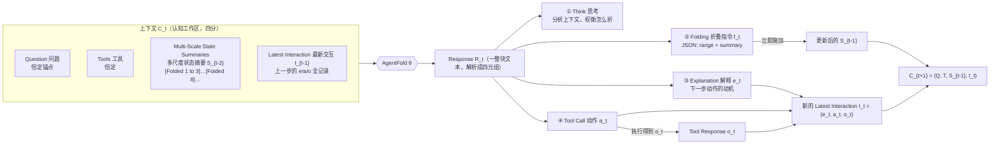

# AgentFold：用「多尺度主动折叠」把 100 轮 web-agent 的上下文压到 ~7k token

> **本篇属 agent-harness 库 D 组（记忆/上下文），主打 harness 六层里的 C 层（Context）。**
> 它回答一个我们（Claude Code / 本课 m9.* 的 agent）每天都被折磨的问题：**一个 web-agent 要跑几十上百轮工具调用时，历史该怎么装？**
> 主流有两个都会死的答案——**(a) ReAct 式全量追加**：观察-动作三元组一路 `append`，上下文越滚越胖，最后被噪声淹死（context saturation，上下文饱和）；**(b) 每步全量摘要**：把整段历史在每一步重写成一份摘要，上下文是干净了，但**任何一次摘要都可能永久删掉后面才用得上的关键细节**（irreversible loss，不可逆丢失）。
> AgentFold 的答案是第三条路——**别一刀切，学一个"多尺度折叠"动作**：每一步由 agent 自己决定"这次折不折、折哪些步、折到多细"。细节该留就留成"细摘要"，一整段跑偏的子任务该丢就整体压成"一句结论"。
> 这正是我们 compaction（上下文压缩）的"进阶版"——**从"到点了就一把截断/摘要"升级为"多尺度、按需、可学"的折叠**。所以本文 Inspires-Us 会把它直接落到我们自己的上下文压缩组件上。

---

## §1　TL;DR（一页讲清这篇在干嘛）

> 主讲提示：开场把"两难—新操作—惊人数字"三句话钉死，再点明它在 harness 六层里坐哪一层、权威性从哪来。

**一句话**：现有 web-agent 卡在一个**根本性两难（fundamental trade-off）**上——上下文要么"全（comprehensive）"要么"简（concise）"，二者不可兼得（§Abstract / §1）。ReAct 范式选"全"：把全部推理-动作-观察三元组累积起来，信息完整但被原始网页数据的**压倒性噪声**淹没，导致动作变差；反过来，"每步机械摘要整段历史"的方法选"简"：上下文干净，但**任何一次摘要都可能过早、不可逆地丢掉关键细节**（§1 第 2 段原文）。

AgentFold 的解法是**换范式、不换模型**：把上下文当成一个**动态认知工作区（dynamic cognitive workspace）**——"要被主动雕刻，而不是被动填满"（§Abstract 原文 "actively sculpted, rather than a passive log to be filled"）。它不在一个单一流水账（monolithic log）上工作，而是在一条由 **多尺度状态摘要（Multi-Scale State Summaries）** + **最新交互（Latest Interaction）** 组成的动态轨迹上工作。每一步，agent 同时产出两件事：**一个折叠指令（folding directive）** 和 **一个工具调用（tool call）**。折叠指令有**两个尺度（dual/two-scale）**：

- **粒度凝练（Granular Condensation）**：把"最新交互"晶化成一个**细粒度**的新状态摘要，追加进摘要序列——保留最高分辨率的关键细节；
- **深度合并（Deep Consolidation）**：把"最新交互"与**一串**旧摘要**融合**，用一个**更粗尺度**的抽象替换掉这些具体条目——把一个已完成（或已确认走不通）的多步子任务整体打包成一句结论。

靠"**折什么、折多少（what and how much to fold）**"这个可学的选择，AgentFold 越过了"留噪声 vs 冒灾难性丢失"的粗暴两难（§1）。

**三条带走的结论**：

- **属于 harness 的哪一层（Θ1）**：本篇死磕 **C 层（Context 上下文/记忆）**——它不造新工具（C 组是工具）、不改控制循环拓扑（B 组），而是**重新定义"每一步该往上下文里放什么、以及怎么改写已经放进去的东西"**。它对 **L 层（控制循环）** 有依赖：它把标准 `perceive→reason→act` 循环扩成 `perceive→reason→fold→act`，即**把"上下文管理"提升为循环里一个显式的、可学的步骤**（§3.1 原文），而非被动副产物。对 **T 层（工具）** 弱耦合：工具就是 web 检索/访问那一套（Search/Visit/Scholar/Python，与同门 WebSailor 一致）。
- **回扣全库论点（Θ2）**：这是 `Agent = Model + Harness` 里 **Harness 侧"上下文管理"这一格**的强证据——底座只是开源的 **Qwen3-30B-A3B-Instruct-2507**（30B 总参、推理时激活仅 **3B**，§4 Implementation），只做**普通 SFT**（无继续预训练、无 RL），却在 BrowseComp 上拿 **36.2%**，**超过 20 倍于它的 DeepSeek-V3.1-671B-A37B（30.0%）**，并**匹配/超过 OpenAI o4-mini（28.3%）** 这类闭源代理（§Abstract / Table 1）。模型没变强，变的只是"上下文怎么管"这层脚手架。
- **够新够权威（Θ4）**：**2025-10-29 预印本**，出自**阿里通义实验室 + 上海交大**，属通义深研 agent 家族（与本课 auto-research 库里的 **WebSailor / WebResearcher / Tongyi DeepResearch** 同门，参考文献密集自引）。它最抓眼的一句实证是 Figure 1 的标注：**"100 轮交互后上下文只有 ~7k token，且能扩到 500 轮而不撞上下文上限"**——这是 ReAct 那种线性堆叠**在结构上做不到**的。

---

## §2　问题与动机：为什么"全量追加"和"全量摘要"都是死路

> 主讲提示：这一页用 Why 三连的"问题层"。别急着讲折叠，先把"两条现成路线为什么都会死"讲到听众点头。这是全篇动机的骨架。

**Why（问题层）——不解决会卡住什么？谁受影响？证据是什么？**

信息检索与综合（web information seeking）是现代进步的基础能力，但人类受限于认知容量与耐力（§1 引 Marchionini 1995 / Given 2023）。LLM web-agent 的意义正在于**超越这些边界**——不知疲倦地在数字世界里导航、极大提升复杂信息任务的效率（§1，引 OpenAI 2025 / Comanici 2025）。但**长程（long-horizon）任务**上，一个关键挑战浮现：如何在**上下文的"全面"与"简洁"之间取得有效平衡**——这个 trade-off "显著影响性能，尤其在长程任务上"（§1 原文，引 Wei 2025 / Wong 2025）。论文把现有做法的失败**明确劈成两半**（§1 第 2 段，务必记住这两条）：

1. **ReAct 派——上下文饱和（context saturation）**：主流 ReAct 类 agent（§1 引 Yao 2023 / Wu 2025 / Li 2025b）**累积全部**推理-动作-观察三元组。它**保住了信息完整性（informational integrity）**，但**严重受害于原始 web 数据的压倒性噪声（overwhelming noise of raw web data）**，导致**次优动作（suboptimal actions）**。一句话：什么都留 → 关键信号被噪声埋掉。
2. **摘要派——过早不可逆丢失（premature and irreversible loss）**：近期一些方法（§1 引 Zhou 2025b=MEM1 / Yu 2025=MemAgent / Wang 2025）**在每一步机械地把整段历史摘要掉**。它**维持了干净的上下文**，但"**在任何一次摘要阶段都冒着过早、不可逆地丢失关键细节的风险**"（§1 原文）。一句话：每步全压 → 现在看着没用、后面才要命的细节被删了就再也回不来。

> **读出什么**：这两条路线的共同病根是——**它们都在用一个"固定的、一刀切的"上下文策略**。ReAct 是"永远全留"，摘要派是"每步全压"。而长程任务的真相是：**有的信息是关键细节（该留成高分辨率）、有的信息是一整段跑偏的探索（该整体丢掉）**——用**同一个粒度**去处理这两类信息，必然要么留太多噪声、要么删太多细节。这就是为什么作者说需要一个"下一代 agent 范式，带高级上下文管理"（§1 原文 "signaling the necessity for a next-generation agent paradigm with advanced context management"）。

**Why（设计层，先埋伏笔）——那么"人是怎么做的"？**
作者的设计灵感来自**人类认知**（§1 第 3 段，引 Miller 1956 的"神奇数字 7±2"工作记忆容量 + Newell & Simon 1972 的人类问题求解）：人在解决问题时，**既不是把所有信息都事无巨细地保留，也不是僵硬地逐步摘要**，而是一个"**有纪律的、回溯式的合并（disciplined, retrospective consolidation）在关键节点上进行**"的过程——一个动态的"回看（look-back）"机制：走了几步之后，**无关的步骤被丢弃、中间发现被蒸馏、关键洞见被抽象**。这个"自我纠正的合并动作"正是人能持续长程推理的关键。AgentFold 就是把这套"回看-合并"机制**架构化**成一个 agent 的可学操作——这条设计线索会贯穿 §3–§5。

**这和我们（Claude Code）有什么关系？** 我们自己就站在这个坑边：ReAct 循环里每一步 `观察` 都堆进上下文，长会话必须靠 **compaction** 续命；而我们现在的 compaction 更接近"摘要派"——到了阈值就把一大段历史压掉，**一刀切、且一旦压了就回不来**。本文相当于把"到底压成什么粒度、什么时候压、压哪几步"这件事，从一个工程 trick 上升成了一个**可学的、多尺度的架构组件**——见 §12 Inspires-Us。

---

## §3　三个核心贡献（论文 §1 末 + §3 铺陈）

1. **一个新范式（AgentFold paradigm）**：把 agent 的上下文重构为"多尺度状态摘要 + 最新交互"的动态工作区，并把**上下文管理提升为推理循环里一个显式的、可学的核心动作**（`perceive→reason→fold→act`），而非被动填充的副产物。核心是一个**双尺度折叠操作**（粒度凝练 / 深度合并）。
2. **一条数据合成管线（Fold-Generator）**：因为"同时做出情境动作 + 战略上下文雕刻"的高质量轨迹**此前不存在**，作者搭了一个基于开源 LLM 的数据收集流水线，配**拒绝采样（rejection sampling）**筛出格式合规、环境错误少的轨迹，再用它做 SFT。
3. **强实证**：在 Qwen3-30B-A3B 上仅用 SFT（无继续预训练、无 RL），AgentFold-30B-A3B 在 BrowseComp 36.2%、BrowseComp-ZH 47.3%、WideSearch 62.1%、GAIA 67.0%（Table 1），**超过 20 倍大的开源模型、匹配/超过 o4-mini 等闭源代理**；并给出上下文效率（100 轮 ~7k token）与交互轮数扩展性（扩到 256/500 轮）的完整曲线。

---

## §4　方法总览：把上下文当"认知工作区"，把折叠当"循环里的一步"

> 主讲提示：这一页给全局图（Figure 2）。先讲清"一次响应 = 想 + 折 + 说 + 做"四件事同时产出，再进公式。

AgentFold 做两件事，构成它的骨架（§3.1）：
1. **重定义上下文**：agent 的上下文**不是一个单一流水账（monolithic log），而是一个动态认知工作区**，被显式地**四分**——不变的用户问题、可用工具、代表长期记忆的**多尺度状态摘要**、以及作为即时工作记忆的**最新交互**。
2. **赋予 agent 主动雕刻它的能力**：把"操作与雕刻这个工作区"变成 agent 推理过程的**内在一环**。

**Figure 2 的一步长什么样**（中间步）：

**关键点（先记住，后面公式全在细化它）**：
- **折叠指令立即施加**在多尺度摘要上，供未来步骤使用；
- **解释 + 执行的动作 + 得到的观察** 一起构成**新的**"最新交互"，供下一轮用；
- 这个循环重复到 agent 认为信息足够、给出最终答案为止；**首步是特例**（没有历史，故省略折叠指令）。

**四分工作区，每一分各司其职（§3.2 逐条）**——这不是随意切四块，而是对应"稳定目标 / 能力边界 / 长期记忆 / 即时工作记忆"四种不同职能：
1. **问题 $Q$（锚点）**：恒定地提醒 agent 它的**最终目标**是什么——长程任务里最容易发生的偏航就是"走着走着忘了要答什么"，一个不变的问题锚点是最省事的对治。
2. **工具 $T$（能力边界）**：给每个工具**详尽的 schema**（名字、描述、必需参数），定义 agent 在环境里的**可执行动作全集**。
3. **多尺度摘要 $S$（长期记忆）**：保住轨迹的**顺序逻辑流**，各步按"对未来动作的感知效用"记在**不同尺度**——关键发现留成**独立细粒度**摘要，次要中间步合并成**更粗、更抽象**的块。于是它**保住连贯的历史叙事、同时最小化信息噪声**。
4. **最新交互 $I$（工作记忆）**：上一笔事务的**完整、逐字**记录（简短思考 + 工具调用 + 观察）。这份"对即时过去的全透明"，是做出**稳健决策**所必需的情境意识——决策同时需要"这条新信息怎么选择性地折"与"下一步做什么"。**整套架构照搬人类如何同时利用一个稳定目标、被合并的知识、一份易变的工作记忆**（§3.2 原文）。

> **Why（设计层）——为什么要把"折叠"塞进循环、而不是外挂一个 summarizer？**
> 朴素做法是：在 ReAct 循环外面挂一个独立的"摘要器"，每隔几步或到 token 阈值就把历史压一压（这正是很多工程实现、也是我们现在 compaction 的样子）。→ 这样"压不压、压什么"是**外部启发式**决定的，模型自己在推理时**看不到、也控制不了**这个决策，于是常常在"正需要某个细节时它已经被外部摘要器删了"。AgentFold 改用**内生（intrinsic）**设计：折叠指令由 agent 在**同一次推理**里和"下一步动作"一起产出（§3.3）。这带来一个作者反复强调的**认知共生（cognitive symbiosis）**——(1) 被迫写出折叠指令，逼 agent **批判性地复盘自己的轨迹、蒸馏最显著的信息**，反过来磨利它对当前状态的理解、让下一步动作更好；(2) 规划下一步动作又需要**有目的地审问最近历史、找出关键线索**，这恰好实时提供了"什么值得保留进折叠摘要"的信号（§3.3 末）。**行动与反思紧耦合**，形成一个自调节回路，同时提升动作质量与记忆连贯性——这是外挂 summarizer 拿不到的。

---

## §5　把"多尺度折叠"讲透（本篇核心）：上下文的形式化

> 主讲提示：这是全篇最该停留的两页。先把每个符号定义清楚，再上公式；把"何时折、折到多细、如何检索折叠块"三个问题逐一钉死。

### 5.1 上下文三元组与"多尺度"的确切含义（Eq. 1–2）

**先给直觉**：在第 $t$ 步，模型看到的上下文 = "**恒定的问题 + 工具**" + "**一叠折好的旧摘要**" + "**上一步的完整流水**"。前两样永远不变（锚点），中间那叠是"长期记忆"、且**不同块记在不同尺度上**，最后一条是"高保真的即时工作记忆"。

**符号定义（先定义后用）**：
- $Q$ = 不变的用户问题（invariant user question）；
- $T$ = 不变的工具集（tools，含每个工具的 schema：名字、描述、必需参数）；
- $S_{t-2}$ = **多尺度状态摘要（Multi-Scale State Summaries）**，一个被动态更新的、由"凝练摘要"组成的**有序序列**；
- $I_{t-1}$ = **最新交互（Latest Interaction）**，上一步完整事务的逐字记录。

**上下文三元组（Eq. 1）**：

$$C_t = (Q,\ T,\ S_{t-2},\ I_{t-1})$$

> 注意下标的错位：第 $t$ 步用的摘要是 $S_{t-2}$、最新交互是 $I_{t-1}$。这是因为**折叠指令要等"上一步的观察回来"才能施加**——第 $t$ 步生成的折叠会把 $S_{t-2}$ 更新成 $S_{t-1}$，供 $t+1$ 步用（详见 5.3）。

**"多尺度"到底是什么（Eq. 2）**——把 $S_t$ 写成一个**有序的摘要块序列**：

$$S_t = (s_{x_1,y_1},\ s_{x_2,y_2},\ \dots,\ s_{x_m,y_m})$$

- 每个 $s_{x,y}$ 是"从第 $x$ 步到第 $y$ 步这一**连续步区间**"的文本摘要；
- 这些步区间**恰好无缝划分**了到上一步为止的整段历史：$x_1=1$，$y_m=t-2$，且对所有 $i$ 有 $x_{i+1}=y_i+1$（即块与块首尾相接、不重不漏）；
- **这就是"多尺度"的精确定义**：
  - 一个**单步、独立**的摘要记作 $s_{x,x}$（即 $y=x$）——**细尺度**，保住某一步的高分辨率细节；
  - 一个把**多步过程合并**的摘要记作 $s_{x,y}$（$y>x$）——**粗尺度**，把一整段（比如"验证某条件跨了好几步"）抽象成一块。

**最新交互**（Eq. 1 里的 $I_{t-1}$）：把上一步的**解释、动作、观察**拼接而成：

$$I_{t-1} = (e_{t-1},\ a_{t-1},\ o_{t-1})$$

它是**逐字、完整**的记录——给 agent 做当前这一步"短期决策"所需的原始细节、不丢任何信息。

**边界情形**（§3.2 末）：
- 首步 $t=1$：$C_1 = (Q, T, \varnothing, \varnothing)$（只有问题和工具，无摘要、无交互）；
- 第二步 $t=2$：$C_2 = (Q, T, \varnothing, I_1)$（有了第一步的交互，但还没有折叠出的摘要）。

> **读出什么**：这套设计"取两家之长"（§3.2 原文 "best of both worlds"）——**最新交互 $I_{t-1}$** 给出无损的原始细节（管好短期、informed 决策），**多尺度摘要 $S_{t-2}$** 给出一个**无噪声、抽象过**的任务全貌（防止 agent 迷失在无关细节里、支撑连贯的长程推理）。这直接缓解了 §2 的两难：**细节留在细尺度块里不被误删、噪声被粗尺度块抽象掉**。

### 5.2 折叠操作的两个尺度（Eq. 3 的 $f_t$）：何时折、折到多细

> 这一节回答任务硬性要求的前两问：**何时折？折到多细？**

AgentFold 每步产出一个**响应四元组**（§3.3，Eq. 3）：

$$R_t = \mathrm{AgentFold}(C_t;\ \theta) \rightarrow (th_t,\ f_t,\ e_t,\ a_t)$$

- $th_t$ = **思考（thinking）**：一段详细的思维链，agent 在这里分析当前上下文 $C_t$、**权衡"怎么折"与"下一步做什么"**。另外三个结构化组件都从这段内部审议里派生出来。
- $f_t$ = **折叠指令（folding directive）**：agent 对多尺度摘要 $S_{t-2}$ 的**显式雕刻命令**，形如一个 JSON 对象：

$$f_t = \{\ \texttt{"range"}:\ [k, t{-}1],\quad \texttt{"summary"}:\ \sigma_t\ \}$$

其中 $k$ 是**开始折叠的步 ID**，$\sigma_t$ 是**替换用的新摘要文本**（由 AgentFold **自己主动决定**）。**同一个格式支持两种尺度的操作**（这是"多尺度"落到指令层的关键）：

- **① 粒度凝练（Granular Condensation，$k=t-1$）**：只折"最新交互"这**一步**，把它变成一个**新的、细粒度**摘要块。用于**增量步骤**，保住历史轨迹的最高分辨率——把一条冗长的原始记录压成一个紧凑摘要块（原文示例：`[Compressed Step 5] Found a new candidate XYZ that needs further exploration.`）。**"何时折到这个尺度"**：当这一步产出的信息**可能是关键细节、值得单独高保真留存**时。
- **② 深度合并（Deep Consolidation，$k<t-1$）**：做一次**尺度切换（change of scale）**——把"最新交互"与**一串旧摘要**（步区间 $[k, t-1]$ 内的所有摘要块）**融合成一个粗粒度摘要**。用于**把嘈杂的、中间的步骤抽象掉，尤其当一个子任务完成时**。原文给的画面很典型：agent 可能花了好几步去验证某个事实、在无关网站间穿梭、遇到失败的工具调用——**深度合并让它把这一整段冗长序列"回收"，替换成一句结论性摘要**（原文示例：`[Compressed Step 5 to 9] Confirmed that XYZ does not fit all criteria after checking several sources.`）。**"何时折到这个尺度"**：当一整段探索**已尘埃落定**（子任务完成 / 已确认此路不通）、中间细节**对后续求解不再关键**时。

> **Why（设计层，本篇最该被追问的一层）——为什么"折叠"要延迟到子任务结果明朗、而不是每步都压？**
> 这是 AgentFold 相对"摘要派"的**决定性差异**。摘要派（MEM1/MemAgent）每步都把整段历史压一遍，等于**在还不知道某细节有没有用的时候就先删/先抽象**。AgentFold 的关键设计是——**允许延迟合并（delay consolidation）直到一个子任务的结局清楚为止**（§3.5 原文 "the ability to delay consolidation until a sub-task's outcome is clear allows for more informed and less short-sighted curation decisions"）。粒度凝练把可能有用的细节**先单独封进一个块、豁免它被反复重处理**；只有当整段探索确认无关/已完成，才用深度合并**外科手术式地**把它剪掉。这样既不像 ReAct 那样留一堆噪声，也不像摘要派那样"短视地"提前删掉后面才要用的细节。**对比表**：

| 维度 | ReAct（全量追加） | 摘要派（每步全量摘要，MEM1/MemAgent） | **AgentFold（多尺度折叠）** |
|---|---|---|---|
| 上下文随轮数 | 线性膨胀 → 饱和 | 近似恒定 | **亚线性，100 轮 ~7k** |
| 关键细节 | 全留（被噪声埋） | **有被过早误删的风险** | **细尺度块单独高保真保留** |
| 一整段跑偏的探索 | 全留（持续干扰） | 被压掉（同一粒度） | **深度合并整体剪掉** |
| 决策时机 | 不决策 | 每步都压（短视） | **可延迟到子任务明朗（informed）** |
| 谁决定折什么 | —— | 固定策略/外部 | **agent 自己（可学）** |

### 5.3 折叠如何施加、以及"如何检索折叠块"（Eq. 3 的后半 + $e_t, a_t$）

> 这一节回答第三问：**折叠块如何被"检索"回来用？** —— 答案是：AgentFold **没有独立的检索器**，折叠块就**直接作为上下文的一部分**（多尺度摘要序列 $S$）被喂进模型，"检索"是隐式的——由 attention 在这条**已被结构化、去噪、按尺度组织**的序列上完成。

**折叠指令怎么把 $S_{t-2}$ 变成 $S_{t-1}$**（§3.3）：
- **深度合并**的施加规则：把步区间 $[k, t-1]$ 内**所有**摘要块**回撤（retract）**，用一个新块 $s_{k,t-1}=\sigma_t$ 替换它们；
- **解释 $e_t$**：从思考里蒸出的、对所选动作动机的**简明摘要**（key insights + why this action）；
- **动作 $a_t$**：要么是一个带工具名和参数的**工具调用**，要么是 agent 认为无需再交互时的**最终答案**。若是工具调用，则执行得到观察 $o_t$；
- **递推**：于是 $Q, T$、**新的**多尺度摘要 $S_{t-1}$、以及**新的**最新交互 $I_t=(e_t,a_t,o_t)$ 一起构成下一步上下文 $C_{t+1}=(Q,T,S_{t-1},I_t)$。

> **读出什么（关于"检索"）**：很多"记忆系统"（MemGPT/A-Mem/Mem0…）需要一个**显式检索**步骤（向量召回、分页调入）。AgentFold **刻意不这么做**——因为它的折叠把历史压得足够小（100 轮 ~7k token，见 §7），**整叠多尺度摘要可以全程留在上下文里**，模型每一步都能直接"看到"所有折叠块。所以它的"检索"= **让被折叠、被去噪、被按尺度组织好的摘要序列常驻上下文**，交给模型自注意力去用。代价是它没有"把某个折叠块无损展开回原始细节"的能力（一旦深度合并，原始步就真的没了）——这与摘要派共享"不可逆"的底色，但因为**折叠是延迟到子任务明朗后才做的**，被误删的概率低得多（见 §8 的存活率数学）。

**认知共生（cognitive symbiosis）再强调**（§3.3 末）：写折叠指令 ⟺ 复盘轨迹、蒸馏最显著信息 → 磨利对当前状态的理解 → 动作更好；规划动作 ⟺ 审问最近历史找关键线索 → 实时给出"什么值得折进摘要"的信号。二者互为因果，形成自调节回路。作者把这称为一次"从**静态、预定义上下文策略**的 agent 到**自我觉知的知识管理者（self-aware knowledge managers）**的概念跃迁"（§3.5 原文）——把上下文雕刻当成一个**可学、核心的动作**后，agent 学到的是**任务特定**的"记什么、抽象什么、丢什么"策略，而不是被一条写死的规则支配。这也解释了为什么它必须是**内生**的：只有 agent 在同一次推理里既看到轨迹全貌、又在规划下一步，它才能判断"这一步的细节对我接下来要做的事到底关不关键"——外挂 summarizer 既没有这个规划意图、也不在同一次前向里，天然做不到这种"带目的地保留"。

---

## §6　训练：Fold-Generator 数据管线 + 拒绝采样 + SFT

> 主讲提示：这页讲"这套多部件的结构化输出，怎么教会一个 30B 模型"。重点是"为什么必须造数据 + 拒绝采样把关"。

**Why（问题层）——为什么要专门造数据？**
训练 AgentFold 需要一种**此前不存在**的数据：**同时演示"情境动作"与"战略上下文雕刻"精妙互动**的轨迹（§3.4 原文 "a dataset that does not yet exist"）。现成的 agent 轨迹只有"想-做"，没有"想-折-做"。

**Fold-Generator 管线**（§3.4）：
- 基于强开源 LLM 搭一条专用数据收集流水线；为了和先前工作**公平且直接对比**，**复用 WebSailor 的同一套问题集**（§3.4 引 Li 2025a）。
- **关键发现**：即便最先进的 LLM，也**无法**仅靠提示工程（prompt engineering alone）可靠地产出 AgentFold 那种"准确、结构化、多部件"的响应。
- **对策——拒绝采样（rejection sampling）**：**丢弃**任何"未严格满足所需格式"的生成步、以及任何"含太多环境错误"的整条轨迹。于是留下的每个数据点都是**目标推理过程的干净范例**。
- 产物：一批高质量交互对 $\{(C_t, R_t^*)\}_N$，其中 $C_t$ 是结构化上下文、$R_t^*$ 是**经校验的、金标准（gold-standard）**响应，$N$ 是所有问题上的交互步总数。
- **训练**：在开源 LLM 上做**常规 SFT**，目标是把"这条计算密集的生成-筛选流水线的复杂多步推理"**蒸馏进一次高效前向**——即让模型**内在地**产出整套结构化输出。

**为什么这条路子重要（§3.4 末，两点关键优势）**：
1. **把"折"从脆弱的、依赖提示的指令，变成鲁棒的、内化的技能**——不再靠精心提示，而是长进了权重里。
2. **SFT 把"生成-筛选"这套算力密集策略蒸进最终模型的权重**——得到一个不仅能力强、而且**推理时比用来造数据的通用大模型更高效**的专用 agent；且全流程建在开源模型上，**数据与训练全透明、可迭代**。

> **Why（设计层）——为什么用 SFT 而不是直接 RL？**（呼应 §Conclusion 的 "What's next"）
> 作者明说本文**优先"演示这个范式的潜力"**，故用**直白的 SFT、不做繁重优化**（§Conclusion）。这是个诚实的取舍：SFT 只能模仿 Fold-Generator 造出的"金标准折叠决策"，**折叠策略的上限被数据管线的质量锁死**。作者把 **RL 明确列为下一步**——"让 agent 通过直接优化任务成功率，**自主发现最优、甚至反直觉的折叠策略**"（§Conclusion "What's next"）。这一步一旦做了，正好补上 §5 里"折什么、折多少"目前还只是被 SFT 模仿、而非被奖励优化的缺口（见 §10 批判）。

---

## §7　实验设置与主结果：30B 打赢 671B、匹配 o4-mini

> 主讲提示：先报设置（模型/基准/预算），再报 Table 1 的主分，最后专门停在"上下文效率"和"轮数扩展"两张关键图上。

**实现（§4 Implementation）**：
- 底座：**Qwen3-30B-A3B-Instruct-2507**（30B 总参、预测时激活 **3B**）；
- **最大工具调用数设为 100**，超过就**强制终止**该轨迹（这个"100 轮"是后面所有上下文曲线的实验边界）。

**基准（§4 Benchmarks，3 个信息检索 + 1 个通用）**：
- **BrowseComp**（Wei 2025）：找**难找**信息的能力；
- **BrowseComp-ZH**（Zhou 2025a）：中文版；
- **WideSearch-en**（Wong 2025）：**广度**搜索，报最细的指标 **Item-F1**；
- **GAIA**（Mialon 2023，text-only 子集）：通用 AI 助手能力。
- 样本 <200 的基准报 **3 次试验平均**。评委固定用各基准自带协议。

**Table 1 主结果（数字标 Table 1）**：

| Agent | BrowseComp | BrowseComp-ZH | WideSearch | GAIA |
|---|---:|---:|---:|---:|
| **闭源代理** | | | | |
| Claude-4-Sonnet | 14.7 | 22.5 | **62.0** | 68.3 |
| Claude-4-Opus | 18.8 | 37.4 | - | - |
| OpenAI-o4-mini | 28.3 | 44.3 | - | - |
| OpenAI-o3 | 49.7 | **58.1** | 60.0 | **70.5** |
| OpenAI Deep Research | **51.5** | 42.9 | - | 67.4 |
| **开源代理** | | | | |
| WebSailor-72B | 12.0 | 30.1 | - | 55.4 |
| Kimi-K2-Instruct-1T | 14.1 | 28.8 | 59.9 | 57.3 |
| GLM-4.5-355B-A32B | 26.4 | 37.5 | - | 66.0 |
| DeepSeek-V3.1-671B-A37B | 30.0 | 49.2 | - | 63.1 |
| **AgentFold-30B-A3B（本文）** | **36.2** | 47.3 | **62.1** | 67.0 |

**Why（结果层）——这些数字意味着什么（机制解释，不只复述）？**
- **对开源**：AgentFold-30B 在 BrowseComp 上 **36.2 vs DeepSeek-V3.1-671B 的 30.0**——**用约 1/20 的总参数、约 1/12 的激活参数**（3B vs 37B）反超。机制上不是"模型更聪明"，而是**上下文没被噪声饱和**：BrowseComp 是典型长程"难找信息"任务，正是 ReAct 类栈最容易被历史噪声拖垮的地方，AgentFold 的折叠让每一步推理都在一个**干净、聚焦**的工作区上进行（§4.1 原文 "how effective context management can bridge the performance gap with dramatically larger models"）。
- **对闭源**：BrowseComp 36.2 **超过 o4-mini（28.3）**；WideSearch 拿到**全场最高 62.1**（超过 o3 的 60.0、Claude-4-Sonnet 的 62.0），说明它的广度搜索能力顶格。仍**不敌 o3（49.7）/ OpenAI Deep Research（51.5）** 在 BrowseComp 上——作者未回避（Table 1 如实并列）。
- **一句话**：这是 `Agent=Model+Harness` 的又一实锤——**同一开源底座 + 一个新的上下文范式**，就把开源 agent 的 SOTA 往前顶了一大截。

---

## §8　上下文效率：为什么 100 轮只要 ~7k token（本篇最亮的曲线）

> 主讲提示：这是全场最该停留的量化证据。先报数字，再讲"折叠为什么必然带来亚线性增长"的机制，最后讲那段"存活率"数学。

**Token 占用动态（§4.1 "Dynamics of AgentFold's context: token count" + Figure 1 / Figure 3a）**：
- 分析 BrowseComp 上 200 条轨迹。定义**平均 token 数** $A_t$（给公式前先定义符号）：

$$A_t = \frac{1}{|\mathcal{T}_t|}\sum_{j\in \mathcal{T}_t}\mathrm{TokenCount}(C_{j,t})$$

其中 $\mathcal{T}_t$ = "跑了多于 $t$ 轮的存活轨迹"集合，$C_{j,t}$ 是轨迹 $j$ 在第 $t$ 轮的上下文。
- **结论**：AgentFold 维持一个**异常简洁**的上下文——平均 token 数以**极慢的亚线性（sub-linear）速率增长**，100 轮里从约 **3.5k 增长到 ~7k**（**不到翻倍**）（§4.1 + Fig 3a）。相对模型 128k 的最大上下文，这意味着**对更复杂、更长任务有巨大余量**。
- **存活曲线的观察**：实验限 100 轮，**超过 20% 的任务在此被强制终止**（通常记为失败）。但**关键**：在这个终止点，agent 的上下文**仍只有 ~7k token**——占底座模型 128k 容量的极小一部分。这指向两个推论：(1) 单纯**放宽轮数上限**就可能解锁更高成功率；(2) AgentFold 有攻克**极复杂长程问题**的潜力。

**块数动态（§4.1 "block count" + Figure 3b）**：
- 定义**块（block）**：多尺度摘要里的任一条目（如 `[Compressed Step 52 to 67]` 是一块）**加上**那一条最新交互。
- ReAct 这种 append-only 方法，块数**必然随轮数线性爆炸**（Fig 3b 的参考线）。AgentFold 的块数**亚线性增长**——由**深度合并**把多步并成一块驱动，从而维持一个**结构简单、认知可管理**的上下文。而且**两条曲线的分叉随时间拉大**：ReAct 结构复杂度失控增长，AgentFold 的合并把它摁住，**任务越长，AgentFold 相对 ReAct 的效率优势越大**（compounding efficiency）。

**AgentFold vs ReAct 的直接对比（§4.1 "Context comparison"）**：
- 同一批轨迹上，ReAct 上下文近似**线性**疯长，AgentFold **平坦受控**。到第 100 轮，AgentFold 的上下文**平均比 ReAct 小 84k token（92%）**——这还翻译成**每个推理实例约 7GB 显存节省**（§4.1 原文，对应 KV cache）。这不只是概念上的漂亮，是**实打实的算力/成本价值**：让长程 agent 更高效、可扩、便宜。

**Why（结果层）——为什么折叠能把"不可逆丢失"的风险量化地压下去？（那段存活率数学，§3.5）**
作者给了一个漂亮的算术来说明"每步全量摘要"有多危险：假设每次把整段历史重新摘要时，某个关键细节有 **1% 的概率被丢**，那么**一个第 1 步就出现的发现，能存活到第 100 步的概率只剩 $\approx 36.6\%$（即 $0.99^{100}$）**；跑到 500 步，同一细节的存活率**崩到 0.66%（$0.99^{500}$）**。这就是"摘要派"的**复利式（compounding）丢失风险**。AgentFold 的**粒度凝练**直接掐断这个复利——它把细节**封进一个独立块、豁免其被不必要地反复重处理**（每次全量摘要都是一次重处理、一次丢失机会；封块后就不再参与）。与此同时，ReAct 的 append-only 则面对**确定性的**上下文饱和（100 步后被全部历史的冗长压垮），**深度合并**外科手术式地剪掉这些无关轨迹，保上下文既聚焦又算力可控。

> **读出什么**：这段数学是 §2 两难的**定量收口**——它同时解释了"为什么全量摘要会丢细节（$0.99^{100}$）"和"为什么全量追加会饱和（线性膨胀）"，并说明多尺度折叠**两头都躲开了**：细节靠"封块豁免重处理"躲开复利丢失，噪声靠"深度合并"躲开饱和。

---

## §9　交互轮数扩展性 + 案例：能扩到 256/500 轮而不崩

> 主讲提示：这页讲"折叠解锁了什么别人做不到的事"——把交互轮数当成一个可扩的资源。

**轮数扩展（§4.1 "Scaling Properties of Interaction Turns" + Figure 4）**：
- 把轮数上限一路加到 **256**，用 30B 的 AgentFold 对比**大得多的 355B GLM-4.5**。两个清晰结论：
  1. **AgentFold（小 12 倍）在所有可比轮数上限上都稳定超过 355B 基线**；
  2. **GLM-4.5 在 64 轮后就饱和、失败**（append-only 上下文被填满），而 **AgentFold 的准确率一路稳定爬升到 256 轮**——展示"promising scaling property"。
- 进一步把上限推到 **500 轮**（Figure 1 的 Context vs Turn 曲线）：上下文**大体保持在 20k token 以下、且不单调增长**。这个"非单调"很关键——它是折叠能力的**直接体现**：当一整条探索线被证明走不通，agent 能对**整段失败子轨迹**做一次深度合并，把一大段无关历史抽象掉、同时转向新策略，**常常把上下文重置回一个更紧凑的状态**（§4.1 原文 "does not grow monotonically … resets the context to a more compact state"）——这是一种**自我纠正式（self-correcting）**的上下文管理。

**案例（§4.1 "Case study" + Figure 5）**：
- 抓 agent 在一个复杂任务**第 17 步**的快照，此时上下文已呈现多尺度结构：既有细粒度单步摘要（`[Compressed Step 5]`）、也有已合并块（`[Compressed Step 6 to 8]`）。
- 关键时刻：agent 认出**第 6 到 16 步是一连串失败尝试（a dead end）**，于是做一次**决定性的深度合并**——把整段 **11 步失败序列折成一句结论**（"No coordinates were found, hindering identification of the 7.8 km radius…"），从失败里**蒸出教训、剪掉噪声细节**；随后在"动机块（= 解释）"里**动态改计划**、转向新的调查方向，立刻反映到下一个工具调用里（换了检索 query）。
- 这个例子**具体演示**了 AgentFold 能**推理自己的轨迹、从长段失败中学习、通过主动雕刻工作区来战略性重规划**。

> **Why（结果层）——"非单调上下文"为什么是折叠范式的独有签名？**
> ReAct 的上下文曲线在数学上**只能单调不减**（append-only，只加不减），所以它**永远**会撞上下文上限、只是早晚。摘要派（MEM1/MemAgent）的曲线近似恒定（每步压回同样大小），但也**没有"主动回落"的能力**——它不会因为"发现前 11 步白干了"就把上下文缩得更小。**只有 AgentFold 的曲线会在长程里主动向下跳**（Fig 1，500 轮内 <20k 且非单调）：这正是**深度合并触发的可观测指纹**——一旦一条探索线被判定为 dead end，agent 把整段失败子轨迹抽象成一句结论，上下文**被重置到一个更紧凑的状态**（§4.1）。换句话说，**上下文曲线的"向下台阶"就是 agent 在做战略重规划的物理证据**。这也是为什么 §8 说"任务越长、优势越大（compounding）"：ReAct 的结构复杂度与噪声随轮数**复利式累积**，AgentFold 每次深度合并都把这个累积**清零一部分**，两条曲线的裂口只会越拉越大。

> **读出什么（Θ2 呼应）**：把 §8 + §9 并读，AgentFold 的贡献不只是"省 token"，而是**把"交互轮数"从一个会撑爆容器的负债，变成一个可以持续投入的资源**。这正是 `Agent=Model+Harness` 在 C 层的强形态——**同模型下，换上下文范式 ⇒ 可用的"思考深度/探索广度"直接跨了一个数量级（从 GLM 的 64 轮天花板到 AgentFold 的 256/500 轮）**。

---

## §10　相关工作定位：它在"上下文工程"里站哪、跟谁划清界限

> 主讲提示：这页把 AgentFold 放进 D 组的谱系，尤其要讲清它跟 MEM1/MemAgent 的**本质区别**——同组、同问题、不同解法。

论文 §2 把上下文管理（context engineering）分成两支（§2 "Context Management"）：
- **外部上下文增强（External Context Augmentation）**：从**任务轨迹之外**注入知识（用户画像、过往对话），如 Li 2025d(Memos)、Chhikara 2025(Mem0)、Xu 2025(A-Mem)、Yang 2024(Memory3)。目标是"更丰富、更个性化"的上下文。
- **任务内上下文雕刻（Intra-Task Context Curation）**——**AgentFold 属于这一支**：管理"任务自身生成的上下文"，在长程里保持相关性与效率。同支的两个近作是 **MEM1（Zhou 2025b）** 和 **MemAgent（Yu 2025）**——它们"在每一步压缩整段历史"。

**AgentFold 与 MEM1/MemAgent 的界限（§2 原文，本篇最该讲清的对立）**：
> "**与这些方法不同**，AgentFold 引入一个**灵活的回看（look-back）机制**，**避免僵硬的、逐步的压缩（rigid, step-wise compression）**，而是**回溯地评估、选择性地在不同尺度上折叠多步交互**——这一能力对复杂长程任务至关重要。"（§2）

且作者点出这两个近作**主要在更简单、以检索为主的任务（如 HotpotQA）上评测**，而 AgentFold 冲的是 BrowseComp 这类**难得多**的长程任务。

> **读出什么**：这就是本篇在 D 组里的坐标——**同一支（任务内雕刻）、同一个病（上下文饱和/丢失）、但换了粒度哲学**：MEM1/MemAgent 是"**恒定尺度、每步压**"，AgentFold 是"**多尺度、按需折、可延迟**"。这条对立会在 §13 版图定位里进一步接上"Less-Context 反方"。

---

## §11　核心概念小结：把 AgentFold 抽象成三句话

1. **上下文 = 可雕刻的认知工作区**（不是流水账）：四分为 问题 / 工具 / 多尺度摘要 / 最新交互（Eq. 1）。
2. **折叠 = 循环里一个可学的动作**：`perceive→reason→fold→act`，每步同产折叠指令 $f_t$ 与动作 $a_t$（Eq. 3），二者认知共生。
3. **多尺度 = 细尺度封细节 + 粗尺度剪噪声**：粒度凝练（$k=t-1$，封单步细节、豁免重处理）+ 深度合并（$k<t-1$，把已定案的多步子任务抽象成一块），可**延迟到子任务明朗**再合并（Eq. 2 + §3.3）。

---

## §12　★ 对我们的启发（Inspires Us）

> 这一节是组会高潮，也是本库相对 auto-research 的独门优势：**我们（Claude Code / 本课 m9.* 的 agent）本身就是一个 harness**——AgentFold 攻的正是我们每天靠 compaction 硬扛的那条上下文线。所以下面每条都能"打到自己身上"。**Θ3：这就是我们 compaction 的进阶版——从"一刀切截断/摘要"升级为"多尺度、按需、可学的折叠"。**

➤ **a. 可直接借用的招（method/trick we can reuse）**：把我们现在"到阈值就一把 compaction"的**单尺度、被动**策略，升级成 AgentFold 的**双尺度折叠 API**——(1) **粒度凝练**：对"可能有用但还不确定"的一步，压成一个**细摘要块并挂上稳定 ID**（如 `[Folded turn 42]`），**豁免它被后续每次 compaction 反复重处理**；(2) **深度合并**：只有当一整段探索**确认走完/走不通**时，才把这一区间 `[k, t-1]` 的块整体合并成一句结论。落地形态就是那个 JSON 指令 `{"range":[k,t-1], "summary":σ}`——**range + summary 两个字段**，既能表达"折一步"也能表达"折一段"，直接可抄进我们的 compaction 层。**关键收益**：§8 那段存活率数学（$0.99^{100}\approx36.6\%$）说明"每次全量重摘要"会复利式丢细节，而"封块豁免重处理"能把这个复利掐断——这正是我们当前 compaction 最痛的"压完就找不回关键细节"。

➤ **b. 可迁移到我们的模块（transfer）**：把 AgentFold 的 `perceive→reason→fold→act` 循环，映射到 auto-research 的 **m9.* 深研 agent** 与我们自己的 ReAct 循环上——**在"决定下一步动作"的同一次推理里，additionally 产出一个折叠决策**。迁移前提要改的点：(1) AgentFold 靠 **Fold-Generator 造数据 + SFT** 才让 30B 学会稳定输出这套多部件格式，我们若不训模型，得先用**提示 + 拒绝式自检**逼当前模型产出合规折叠指令（作者明说"最强 LLM 也难靠 prompt 单独可靠产出"，所以要配格式校验兜底）；(2) 它的"检索"是**隐式**的（折叠块常驻上下文、靠 attention），前提是折叠后总量足够小（~7k）——若我们的任务折不到这么小，就得补一个**显式检索**把冷块调出上下文（这点它没做，是我们要补的，见 c）。

➤ **c. 它暴露的开放问题 = 我们的机会（open problems → our opportunity）**：**(i) 折叠不可逆**——一旦深度合并，原始步就真没了，靠"延迟合并"降低但**没消除**误删风险；机会：给折叠块做**分层存储**（合并时把被剪掉的原始步落盘到一个冷存，块里存一个指针），需要时**按指针无损展开**——把"不可逆折叠"变"可逆折叠"，第一步就在我们 compaction 里给每个被压区间存一份原始快照 + 指针，量化"可展开"能否救回 §8 里那 20% 被强制终止的任务。**(ii) 折叠策略只被 SFT 模仿、未被优化**——作者把 RL 列为下一步；机会：用**可验证任务成功率**做奖励，让折叠策略"自主发现最优/反直觉的折法"（如"哪类子任务该早合并、哪类该晚"）。第一步：在我们某个 m9.* agent 上，把"折叠时机"设成一个可调开关，A/B 测"激进早合并 vs 保守晚合并"对成功率与 token 的影响。

➤ **d. 与本库其它论文/模块的连接（connect the dots）**：
- **与同门 IterResearch（2511.07327，D 组/C 层）是"同源双生、正好对立"**：两者都出自**通义**、都用**同一个底座 Qwen3-30B-A3B**、都攻"长程上下文窒息"。但 **IterResearch = 丢弃历史、每轮从零重建一个精简工作区（Markov）**；**AgentFold = 保留历史、多尺度按需折叠**。**这是 D 组里最值得并排讲的一对"记忆哲学之争"**：重建派赌"只留一份演化报告就够"、折叠派赌"细节该分尺度留着别全丢"。组会可直接把两者摆一起吵。
- **与 MEM1（2506.15841）/ MemAgent（2507.02259）是"同支、不同粒度"**：都在"任务内雕刻"这一支，但那两者是**恒定尺度、每步全压**，AgentFold 是**多尺度、可延迟**——§8 的存活率数学正是对"每步全压"的定量反驳。
- **与 Harness-Bench（2605.27922，标杆）呼应**：AgentFold 正是在攻 Harness-Bench 失败症状表里的 **"state/continuation"** 与 **"contract"** 两条线（长程里保住状态、别丢关键交付细节）；反过来，可以用 Harness-Bench 那套"乘法打分 + 五类失败标注"去独立体检 AgentFold 到底在哪类任务上靠折叠赢。
- **与 Less-is-More（2411.15399，反方）张力**：Less-Context 一侧主张"**给 agent 更少的东西**（砍工具/砍上下文）反而更好"，AgentFold 与之**同向但更精细**——它不是"少给"，而是"**把该少的少（噪声粗折）、该留的留（细节细封）**"，等于给"Less-Context"补了一个"多尺度"的执行机制。

➤ **e. 如果我来做下一步（my next move，第一人称、可执行）**：我会先在我们某个 m9.* 深研 agent 的 **compaction 层**做一个**最小折叠原型**——把现在"到 token 阈值就整段摘要"换成"**range+summary 双尺度折叠 + 每个被压区间落盘原始快照+指针**"，然后在 10 个长程任务上跑一个 A/B：对照组用现有一刀切 compaction、实验组用"多尺度折叠 + 可展开"，量三件事——(1) 100 轮时上下文 token（看能否逼近它的 ~7k 量级）、(2) "关键细节被过早删掉"导致的失败率（看可展开指针能救回多少）、(3) 端到端成功率。**若"可展开折叠"能显著降低细节丢失类失败**，就把它固化进我们的上下文压缩组件默认策略。

---

## §13　局限与批判（论文 §Conclusion/§3.5 自陈 + 我的补充）

论文自陈/隐含的边界（诚实）：
- **只做了 SFT、没做 RL**：作者本人把"折叠策略仅被 SFT 模仿、未被任务成功率优化"当作**明确的下一步**（§Conclusion "What's next"）——即当前折叠策略的**上限被 Fold-Generator 数据质量锁死**，可能不是"最优折法"。
- **折叠不可逆**：深度合并把多步压成一块后，原始细节**物理丢失**；它靠"延迟到子任务明朗"来降低误删，但**没有无损回滚**能力（与摘要派共享的底色）。
- **无独立检索**：整套依赖"折叠后总量足够小、可全程常驻上下文"（100 轮 ~7k）。若任务复杂到折不下去，缺一个显式检索层——论文未讨论这个失效点。

我的补充批判：
- **20% 强制终止的任务是失败**：§4.1 承认 100 轮上限下 >20% 任务被强制终止（记为失败）。作者乐观地说"放宽轮数就能解锁更高成功率"，但**没给"放宽到 256/500 轮后这 20% 到底救回多少"的直接数字**（Figure 4 只给了 BrowseComp 的整体准确率曲线、未单独拆这批）——"原文未给出"这批的救回率，属乐观外推。
- **存活率那段是"假设 1% 丢失"的算术演示、非实测**：$0.99^{100}\approx36.6\%$ 很有说服力，但 1% 是**假设值**；AgentFold 自己的粒度凝练在真实轨迹里**每次封块的丢失率是多少、封块后 attention 是否真能可靠取用**，论文**未实测**。
- **数据管线复用 WebSailor 问题集**：训练问题来自 WebSailor（§3.4），与 BrowseComp 等测试集的分布差异、以及"折叠范式是否只在这类深研问题上有效、能否迁到别的长程域（如长代码库维护）"——**原文未给出**跨域证据。
- **评委/协议沿用各基准自带**：好处是可比，但没有针对"折叠是否偷偷丢了会被判分的关键细节"做**对抗性检查**（谁来验证折叠没删掉答案要用的东西）——与 auto-research 库 m9.8 的"独立验证收口"同一隐忧。

---

## §14　版图定位（canon/前沿坐标 + 在本库的位置）

- **时间坐标（Θ4）**：**2025-10 前沿**，出自**阿里通义实验室 + 上海交大**，通义深研 agent 家族在 **C 层（上下文/记忆）** 的新范式。它"相对基石推进了哪一步"——相对 **ReAct（2210.03629，全库 canon）** 的 append-only，它把"上下文管理"从**无操作**升级为**循环里一个可学的多尺度折叠动作**；相对同支的 **MEM1/MemAgent** 的"恒定尺度每步压"，它推进到"**多尺度、可延迟、按需折**"，并把评测从 HotpotQA 级抬到 BrowseComp 级。
- **E/T/C/L/O/V 归属（Θ1）**：本篇坐 **C 层（Context）**，强依赖 **L 层**（把折叠塞进 `perceive→reason→fold→act` 循环）、弱耦合 **T 层**（web 工具那套）。
- **在本库 D 组的位置**：与 **IterResearch（2511.07327）** 构成"**保留-折叠 vs 丢弃-重建**"的**同门对照双子星**；与 **MEM1/MemAgent** 构成"**多尺度 vs 恒定尺度**"的粒度之争；与 **MemGPT/A-Mem/Mem0** 那种"外挂检索式记忆"构成"**内生折叠 vs 外部检索**"的路线对照。读完它，再回看 D 组任何一篇，都能问一句："它把历史存成了**几个尺度**？折叠/压缩**可不可逆**？决策是**外部启发式**还是**agent 自己学的**？"
- **回扣全库论点（Θ2）**：**同一开源底座 Qwen3-30B-A3B，只换上下文范式，就把开源 web-agent 的 SOTA 往前顶（BrowseComp 36.2 > 671B 的 30.0），并把可用交互轮数从 GLM 的 ~64 轮天花板扩到 256/500 轮**——这是 `Agent = Model + Harness` 在 C 层的一个干净且量级明显的证据。
- **regime 诚实（Θ5，不绝对化）**：别把"折叠范式 > 大模型"讲成绝对真理。它的增益**分 regime**：在 **BrowseComp/长程"难找信息"**这种"轮数多、噪声大、要保状态"的任务上，折叠带来的上下文纪律回报巨大（30B 反超 671B）；但在 BrowseComp 上它**仍不敌 o3/OpenAI Deep Research**——说明**够强的闭源模型 + 自家强栈**仍可更高。而且它跟同组的 **IterResearch（丢弃-重建）** 谁更优、以及跟 **Less-is-More（少即是多）** 一侧的张力都表明：**"该留多少上下文"没有单一最优解**——任务越长/噪声越大，主动上下文管理越主导；任务越短/越偏检索，这层的边际价值越小。**"折叠"是不是最优的上下文范式，取决于任务的长程性与噪声结构，而非放之四海皆准。**

---

## §15　组会讨论问题（留给大家吵）

1. **折叠 vs 重建**：AgentFold（保留历史、多尺度折叠）与同门 IterResearch（丢弃历史、Markov 重建）用**同一个底座**、攻**同一个病**，你赌哪条路更抗长程？在什么任务上折叠会输给重建（反之亦然）？
2. **不可逆的代价**：深度合并把 11 步失败压成一句话（§9 案例）——如果那段"失败"里其实藏着后面才有用的线索呢？"延迟到子任务明朗"真能兜住吗？怎么设计一个实验去逼出"折叠误删关键细节"的反例？
3. **存活率数学的可信度**：$0.99^{100}\approx36.6\%$ 很唬人，但 1% 是假设。你会怎么在真实轨迹上**实测** AgentFold 每次折叠的信息丢失率？
4. **没有检索层**：它赌"折完就 ~7k、全留上下文"。当任务复杂到折不下去时，最小可行的"显式检索 + 折叠"混合方案长什么样？
5. **SFT→RL 的那一步**：如果用任务成功率做奖励去优化折叠策略，你预期 agent 会**学出什么反直觉的折法**？会不会学成"少折甚至不折"（退回 ReAct）或"狂折"（退回摘要派）？

---

## §16　一页速记

- **命题**：`Agent = Model + Harness`；上下文管理是 C 层一个**可学的核心动作**，不是被动副产物。
- **两难**：ReAct 全量追加→**上下文饱和**（噪声埋信号）；每步全量摘要→**过早不可逆丢失**（删了后面才用的细节）。
- **新操作（多尺度折叠）**：上下文 = 认知工作区（Eq.1 `C_t=(Q,T,S_{t-2},I_{t-1})`）；每步同产**折叠指令 `f_t={range:[k,t-1], summary:σ}`** 与动作（Eq.3）。
  - **粒度凝练**（$k=t-1$）：折一步→细摘要块，**封细节、豁免重处理**（何时：细节可能有用）；
  - **深度合并**（$k<t-1$）：折一段→粗结论块，**剪噪声/剪失败子任务**（何时：子任务已定案），可**延迟到明朗再折**。
- **检索**：无独立检索器——折后 ~7k 全**常驻上下文**，靠 attention 隐式取用（代价：折叠不可逆）。
- **训练**：Fold-Generator 造数据 + **拒绝采样** + **SFT**（无 CPT/无 RL）；RL 列为下一步。
- **铁证**：Qwen3-**30B**-A3B（激活 3B）→ BrowseComp **36.2** > DeepSeek-**671B** 的 30.0、匹配 o4-mini；WideSearch **62.1** 全场最高（Table 1）。
- **效率**：100 轮上下文 **~7k token**（3.5k→7k 亚线性，Fig 1/3a）；比 ReAct 小 **84k(92%)**、省 **~7GB** 显存/实例；块数亚线性（Fig 3b）。
- **扩展**：扩到 **256/500 轮**不崩（Fig 4/1），GLM-4.5-355B 64 轮就饱和；500 轮上下文 <20k 且**非单调**（失败子轨迹被深度合并→上下文重置）。
- **诚实**：折叠**不可逆**、20% 任务仍被强制终止（救回率原文未给）、存活率是假设算术非实测、只 SFT 未 RL、训练问题复用 WebSailor（跨域证据缺）。
- **对我们（Θ3）**：这是 compaction 的进阶版——把"一刀切摘要"换成"**range+summary 双尺度折叠 + 被压区间落盘快照+指针（可展开）**"，先在 m9.* 上 A/B 测"关键细节丢失类失败"能否被压下去。
- **同组对照**：折叠（保留-多尺度）vs IterResearch 重建（丢弃-Markov）vs MEM1/MemAgent（恒定尺度每步压）vs Less-is-More（少即是多）。
