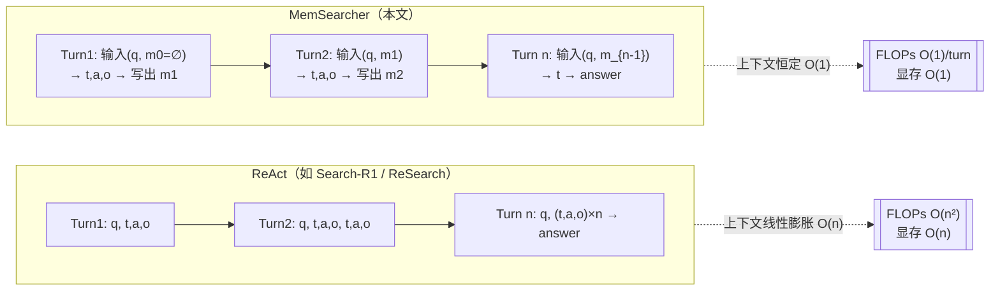

# MemSearcher：用端到端强化学习教 LLM 一边推理、一边搜索、一边管一块常数大小的记忆

> **本篇定位**：这是一篇**方法/系统**论文，不是 benchmark。所以密度按标杆 [Harness-Bench](2605.27922-harness-bench-measuring-harness-effects.md) 对齐，
> 但侧重点从"指标定义式"移到"**把一个训练目标讲透**"——即 **多上下文 GRPO**（multi-context GRPO）：为什么一条轨迹里"每一轮上下文都不同"会让标准 GRPO 失效，作者怎么用"轨迹级优势下发到每一轮"绕过去。
> 按 Θ规范，本篇打 harness 的 **C 层（Context/上下文）**，全文回扣 `Agent = Model + Harness`，Inspires-Us 的"下一步"落到**我们自己 ReAct 循环里的多步检索上下文压缩**。

---

## §1　TL;DR（一页讲清这篇在干嘛）

> 主讲提示：开场先把"痛点—做法—代价"三件事各一句话说完，再点出它在 harness 六层里坐哪一层。别一上来就写公式。

**一句话**：搜索 agent（search agent）的主流写法是 **ReAct**——把每一轮的"思考 thought / 动作 action / 观察 observation"全都**拼进上下文**再喂给下一轮。搜多几轮，上下文就线性变长，而且检索回来的段落又长又噪。MemSearcher 把这个"越滚越大的历史"换成**一块大小被硬性封顶（默认 ≤1024 token）的记忆 m**：每一轮骨干 LLM 只读"用户问题 q + 上一轮记忆 m_{i-1}"，先推理、再（可选）搜索、最后**把这一轮学到的东西重写进新记忆 m_i**。因为记忆大小恒定，**上下文长度在多轮里几乎不变**（原文 §4.2 称可稳定在 **<4K token**）。

- **属于 harness 的哪一层（Θ1）**：本篇打的是 **C 层（Context/上下文）**——它不换模型、不换搜索工具，而是**改造"上下文/状态怎么随交互轮数演化"这条线**。库内分组 D（记忆）恰好对应六层里的 C 层。它对 **L 层（Loop 控制循环）** 有依赖（多轮 ReAct 式循环仍在），对 **T 层（Tools 工具）** 复用现成搜索引擎接口。
- **回扣全库论点（Θ2）**：这篇是 `Agent = Model + Harness` 里**"改 harness 的上下文管理策略、模型底座不变，就能同时提精度又降成本"**的一个正例。它没有换更强的模型（就是 Qwen2.5-3B/7B/14B-Instruct），只把"历史怎么进上下文"这件 harness 的事换了写法：3B 版平均 EM **43.8**，反超 7B 参数的多个 baseline，甚至逼近 ReSearch 32B（原文 §4.2 观察(2)）。
- **最该被讲透的一点**：**多上下文 GRPO**。一条 MemSearcher 轨迹里，第 1 轮的输入是 `(q, m_0)`、第 2 轮是 `(q, m_1)`……**每一轮的上下文都不一样**，等于"一条轨迹里藏了 n 个互相独立的优化样本"。标准 GRPO 是"一条轨迹一个优势值"，直接套会错位。作者的解法：**先按整条轨迹算一个组相对优势 A_i，再把这个 A_i 原封不动下发给该轨迹的每一轮**（A_{i,j}=A_i，Eq 7），于是每一轮都能当成一个独立优化目标来更新策略（§3.1）。
- **够新够权威（Θ4）**：2026-05 预印本（v2），出自**中科院软件所 ICIP 实验室 + 小红书**，作者含 Yaojie Lu / Hongyu Lin / Xianpei Han 等（信息抽取与 LLM 方向的活跃组）。它站在 Search-R1 / ReSearch / R1-Searcher 这批"RL-搜索 agent"的肩上，但**把矛头对准了它们共同的软肋——都还在 ReAct 范式里，上下文线性膨胀**（原文 §5.1 明确点出 "current RL-based approaches predominantly adhere to the ReAct paradigm, lacking the exploration of more efficient paradigms"）。

**三条带走的结论**：
1. **痛点是"上下文"不是"能力"**：ReAct 搜索 agent 的瓶颈之一是**上下文随轮数线性膨胀 + 检索噪声**，导致 FLOPs 达 O(n²)、GPU 显存吃紧（Table 1）。
2. **解法是"让模型自己学会做笔记"**：把骨干 LLM 同时当"推理器 + 搜索器 + 记忆管理员"，用一块常数记忆替代全历史；训练靠**多上下文 GRPO** 端到端联合优化，**不需要**对"中间记忆该长什么样"做逐 token 标注（这正是它选 RL 而非 SFT 的核心理由，§4.3.1）。
3. **效果是"更小的模型、更省的上下文、不掉甚至更高的分"**：七个公开 QA benchmark 上全面超 ReAct 系 baseline，且 token 曲线随轮数几乎持平（Fig 4），3B 就能在 <4K 上下文里跑多轮，利好资源受限部署。

---

## §2　问题与动机：为什么"给搜索 agent 换一块常数记忆"值得做

> 主讲提示：这一页用 Why 三连的"问题层"。核心是让听众感到"上下文线性膨胀"不是小麻烦，而是决定能不能长程检索的硬约束。

### 2.1　Why（问题层）——不解决会卡住什么？

LLM 搜索 agent 近来进步很快，在知识获取类任务上大幅超越传统 RAG（原文 §1 引 Jin et al. 2025 / Chen et al. 2025b / Li et al. 2025）。与传统 RAG 不同，搜索 agent 把搜索引擎当**外部工具**，**自主决定何时、如何调用**，因此天然是**多轮交互**。而建模多轮交互最有代表性的范式就是 **ReAct**（Yao et al. 2023）。

ReAct 的写法很直白（原文 §2.1）：一条轨迹是一段多轮对话，第 i 轮 LLM 产生思考 t_i、执行动作 a_i、环境回一个观察 o_i，然后**把到目前为止所有的 (t, a, o) 全拼进下一轮的输入**。形式化地，第 i 轮输入是：

$$c_i = (q,\, t_1, a_1, o_1,\, \cdots,\, t_{i-1}, a_{i-1}, o_{i-1}) \tag{Eq.1}$$

其中 q 是用户问题、$t_k/a_k/o_k$ 是第 k 轮的思考/动作/观察。**这里的关键病灶是：输入长度随轮数 i 单调线性增长**。原文 §1、§2.1 把后果讲得很实：

1. **上下文线性膨胀（linear growth）**：随交互轮数增加，"所有 thought/action/observation 不断追加"使 LLM 上下文线性变长，直接压在推理开销上（引 Hsieh et al. 2024 / Wu et al. 2024 / Chen et al. 2025a）。
2. **检索噪声主导（noisy long context）**：搜索 agent 的 observation 是**检索引擎吐回来的段落**，往往含大量与用户问题无关的噪声。于是上下文很快被"又长又噪的 passage"占满，很多内容与问题无关。这不只拖慢，还**削弱 LLM 利用关键信息的能力**（引 Liu et al. 2023 "Lost in the middle" / Wu et al. 2024）。
3. **算力与显存二次开销**：token 数线性增长 → 计算与 GPU 显存开销上升（Table 1 给出 ReAct 总 FLOPs 为 **O(n²)**）。因此"更高效、可扩展的搜索 agent 构建方法亟待探索"（§2.1 结尾原句）。

> **读出什么**：这三条要连起来看——**问题不是"模型不够聪明"，而是"承载推理的那条上下文/状态通道被自己撑爆了"**。这正是 harness 的 **C 层**问题：同一个模型，只要把"历史怎么进上下文"换个写法，长程检索的可行性就变了。这也解释了为什么本篇归到 D 组（记忆）——记忆管理本质上就是**上下文管理的一种策略**。

### 2.2　一个 Figure 2 的具体病例：ReAct 会被"堆积的历史"带偏

原文 Figure 2 给了一个很说明问题的例子，值得在组会上讲：

- **问题**："谁演了《Homeward Bound》里 Chance 配音演员在《回到未来》中的女朋友？"（Who played the girlfriend of Chance's voice actor in Homeward Bound in Back to the Future?）
- **ReAct 的翻车**：它一路把 observation 堆进上下文，中途查到"Michael J. Fox 在《回到未来》里演 Marty McFly，Marty 的女友是 Jennifer Parker……但屏幕上还牵扯到 Lea Thompson 演的 Lorraine"，结果**把"角色的女友"和"演员在剧里的银幕关系"搞混**，最终错答成 Lea Thompson。
- **MemSearcher 的正解**：它每轮把关键事实压进一小块记忆——"Chance 的配音是 Michael J. Fox""在《回到未来》里他（Marty）的女友是 Claudia Wells 演的 Jennifer Parker"——**用一块干净的记忆帮它把实体/关系跨轮消歧**，最后正确答出 **Claudia Wells**。

> **Why（问题层，机制版）**：为什么"堆历史"反而更容易错？因为**长而噪的上下文里，正确线索被无关段落稀释，跨轮的实体绑定容易串**（Lost-in-the-middle 效应）。一块**被主动维护、只留任务相关事实**的记忆，等于给模型一个"去噪后的工作台"。这就是把"记忆管理"当成一等公民的直接收益——它不只省 token，还**提精度**（Fig 2 是定性证据，Table 2 是定量证据）。

---

## §3　核心 intention：把问题形式化成一句话

> 主讲提示：这页把整篇的"要解决的问题"压成一句可证伪的命题，后面所有方法都服务于它。

**一句话命题**：能否让**同一个骨干 LLM**在多轮搜索里**同时**扮演三个角色——**推理器（reasoner）、搜索器（searcher）、记忆管理员（memory manager）**——使得：

> 每一轮输入只含"用户问题 + 一块大小被封顶的记忆"，从而**上下文长度不随轮数增长**（成本恒定），**同时**多跳检索问答的准确率不降反升？

- **假设 1（可压缩性）**：一次长程检索里，真正决定答案的"任务相关事实"是**稀疏**的，可以被压进 O(1024) token 的自然语言记忆而不丢关键信息（Fig 6 的 memory-length 消融就是在验证这条）。
- **假设 2（可学习性）**："该往记忆里留什么、丢什么"这件事**不需要人工逐 token 标注**，可以由"最终答案对不对"这个稀疏奖励，经 RL 端到端地学出来（§4.3.1 用 SFT vs RL 对照验证）。
- **训练挑战（本篇技术核心）**：一条 MemSearcher 轨迹里**每一轮的上下文都不同**（`(q,m_0), (q,m_1), …`），使得"一条轨迹一个优势"的标准 GRPO 直接失配。**多上下文 GRPO** 就是为解决这个失配而生（§3.1）。

---

## §4　方法总览（big picture）：一图看懂 ReAct → MemSearcher 的改造

> 主讲提示：先给直觉图，不写数学。让听众记住"红色的历史堆积被换成了一块绿色的常数记忆"。

**核心改造**（原文 Figure 1）：ReAct 每轮 `q, t,a,o, t,a,o, …` 越滚越长；MemSearcher 每轮只有 `q` 和一块记忆 `m`，且 `m` 被反复**覆盖更新**而非追加。

**一次 MemSearcher 交互的循环**（原文 §2.2）：
1. **读**：第 i 轮，骨干 LLM 只收到两段简短输入——用问题 `q`（包在 `<question></question>` 里）和上一轮记忆 `m_{i-1}`（包在 `<memory></memory>` 里）。首轮记忆 `m_0` 为空。
2. **想 + 动**：LLM 在 `<think></think>` 里产生思考 `t_i`，在 `<tool_call></tool_call>` 里发出动作 `a_i`（按策略 $\pi(t_i, a_i \mid c_i)$）。动作要么是**发一次搜索查询**、要么是**在 `\boxed{}` 里给出最终答案并终止**（§2.2 末，搜索 agent 的两种 action 形式）。
3. **观察**：若发了搜索，环境把检索回的相关段落作为观察 `o_i` 放进 `<tool_response></tool_response>`。
4. **写记忆（本篇的灵魂动作）**：拿到 `o_i` 后，MemSearcher **覆盖**旧记忆——LLM 被要求"仔细读 `o_i`、把有助于回答问题的新信息**整合**进来、**同时保留** `m_{i-1}` 里所有相关细节"，产出新记忆 `m_i`。如此迭代，直到达到最大轮数或信息已足够、输出最终答案。

> **读出什么**：注意第 4 步的措辞——"整合新信息 + 保留旧的相关细节"。这是一个**读-改-写（read-modify-write）**的记忆更新语义，且**写多长受硬上限约束**（默认 1024 token）。正因为有这个硬上限，"往里塞什么、挤掉什么"才成了一个**非平凡、必须被学**的决策——这就是为什么必须上 RL（见 §6）。

---

## §4.5　相关工作定位：它站在谁肩上、和谁不同（原文 §5）

> 主讲提示：这页把 MemSearcher 放进两条谱系——"LLM+搜索引擎"和"上下文/记忆管理"。重点讲它精准地卡在两条线的**交叉空白**：既是 RL-搜索 agent，又第一次把"记忆管理"作为一等公民端到端训进去。

原文 §5 把相关工作分两条线，正好对应 harness 的 **T 层（工具/搜索）** 和 **C 层（上下文/记忆）**：

**线一：LLM + 搜索引擎（§5.1）**——三代演进：
1. **RAG 式**（Lewis et al. 2020 / Yue et al. 2024 / Yu et al. 2022）：用检索到的文档**增强 prompt**，一次性拼进去。缺点：不是交互式，不能"边想边补搜"。
2. **搜索即工具**（ReAct, Yao et al. 2023）：把搜索**交织进 Chain-of-Thought** 推理，边推理边发搜索。这是当下主流。
3. **agentic RL 增强搜索**（Search-R1 Jin et al. 2025 / ReSearch Chen et al. 2025b）：用 RL 进一步强化搜索能力。**但原文一针见血地指出其共病**：这些 RL 方法**"predominantly adhere to the ReAct paradigm, lacking the exploration of more efficient paradigms"**（§5.1 原句）——即它们只强化"搜得准"，却**没动"上下文线性膨胀"这个范式级软肋**。MemSearcher 正是补这个空白。

**线二：上下文/记忆管理（§5.2）**——作者把已有记忆机制归为三类（这是一份很好的 D 组分类法）：
1. **RAG 式记忆（RAG-style memory）**（Jimenez Gutierrez et al. 2024 / Zhong et al. 2024）：把记忆当**外部知识源**，需要时再检索（如 HippoRAG 类）。
2. **token 级记忆（token-level memory）**（Jin et al. 2024 / Zhou et al. 2025 / Orlicki 2025）：用 SFT 或 RL 来**调控上下文**——具体策略又分三支：维护**潜在 token（latent tokens）**（Wang et al. 2025）、**抗遗忘缓冲（forget-resistant buffers）**（Yang et al. 2024）、或**把长上下文压成摘要（compress into summaries）**（Yu et al. 2025）。**MemSearcher 就属于这一类里"压成摘要"的一支**，但把它和搜索、推理端到端联合训。
3. **结构化记忆（structured memory）**（Zeng et al. 2024 / Zhang et al. 2025a / Chhikara et al. 2025）：把信息组织成**结构化表示**，如 Zep 的知识图谱（Rasmussen et al. 2025）、A-MEM 的原子记忆单元（Xu et al. 2025）。

**一句话定位**（原文 §5.2 末）：本文**"利用搜索 agent 的骨干 LLM 本身作为一个内在的记忆管理员（intrinsic memory manager），并用端到端多上下文 GRPO 优化它"**。

| 维度 | ReAct 系（Search-R1/ReSearch） | RAG 式记忆（HippoRAG 类） | 结构化记忆（Zep/A-MEM/Mem0） | **MemSearcher（本文）** |
|---|---|---|---|---|
| 记忆载体 | 全历史拼接（无压缩） | 外部知识库/图 | 外部结构化表示（KG/原子单元） | **骨干 LLM 内维护的一块自然语言记忆** |
| 是否内化进模型 | 否（历史是外部拼接） | 否（外挂检索） | 否（外挂数据库） | **是（模型即记忆管理员）** |
| 上下文随轮数 | O(n) 线性膨胀 | 取决于检索量 | 取决于检索量 | **O(1) 常数（≤1024 token）** |
| 怎么学"记什么" | 不学（全留） | 靠检索规则/图构建 | 靠工程化的记忆写入规则 | **RL 端到端学（多上下文 GRPO）** |
| 是否需 per-turn 记忆标注 | — | 否 | 视方法 | **否（只用最终答案奖励反推）** |

> **读出什么（Θ2 呼应）**：这张表把 MemSearcher 的独特性钉死——它是唯一一个**"记忆内化 + 常数上下文 + RL 端到端学记忆策略 + 无需过程标注"**四者同时成立的方案。别的方案要么把记忆外挂（RAG/结构化），要么根本不压缩（ReAct）。这也解释了它为什么归到本库 D 组（记忆）而非 C 组（工具）——**它动的是"上下文/状态怎么随轮演化"这条 C 层主线，而非"工具接口"**。作者自陈的局限（§13 局限 1）恰恰是"没试线二的第 1、3 类（RAG 式/结构化记忆）"，这为后续留了明确接口。

---

## §5　符号与术语表（后文公式统一用这套记号）

> 主讲提示：先把记号钉死，后面 Eq.2–8 全靠它。花 30 秒念一遍，省得后面反复解释。

| 记号 | 含义 | 出处 |
|---|---|---|
| $q$ | 用户问题（query） | §2.1 |
| $t_i, a_i, o_i$ | 第 $i$ 轮的思考 / 动作 / 观察 | §2.1 |
| $c_i$ | 第 $i$ 轮喂给 LLM 的**输入上下文** | Eq.1 / Eq.2 |
| $m_i$ | 第 $i$ 轮**结束后**的记忆（$m_0=\varnothing$ 空） | §2.2 |
| $\pi_\theta$ | 参数为 $\theta$ 的策略（即骨干 LLM） | §3.1 |
| $\pi_{\theta_{old}}$ | 采样时用的旧策略（rollout 用） | Eq.3 |
| $\pi_{ref}$ | 参考策略（reference LLM，算 KL 用） | Eq.3/Eq.6 |
| $G$ | 一个 query 采样的**轨迹组大小**（group size，本文=5） | Eq.3 |
| $T_i$ | 组内第 $i$ 条**轨迹**（$i=1..G$） | Eq.3 |
| $n_i$ | 轨迹 $T_i$ 的**轮数**（turns） | Eq.5 |
| $T_{i,j}$ | 轨迹 $i$ 的第 $j$ 轮（$j=1..n_i$） | Eq.5 |
| $R_i$ | 轨迹 $T_i$ 的**标量奖励** | Eq.4/Eq.8 |
| $A_i$ | 轨迹 $T_i$ 的**组相对优势**（group advantage） | Eq.4 |
| $A_{i,j}$ | 下发到轨迹 $i$ 第 $j$ 轮的优势（本文令 $A_{i,j}=A_i$） | Eq.7 |
| $c_{i,j}=(q, m_{i,j-1})$ | 轨迹 $i$ 第 $j$ 轮的输入 | Eq.6/Eq.7 |
| $r_{i,j}(\theta)$ | 第 $(i,j)$ 轮的**重要性采样比**（policy ratio） | Eq.7 |
| $\epsilon$ | GRPO/PPO 的裁剪半径（clip ratio，本文=0.2） | Eq.3/Eq.6 |
| $\beta$ | KL 正则系数（本文 KL Loss Coefficient=0.001） | Eq.3/Eq.6 |

> **一句提醒**：`m` 是"轮末快照"，`c` 是"轮首输入"。ReAct 里 `c_i` 塞了全历史（Eq.1）；MemSearcher 里 `c_i` 只塞 `(q, m_{i-1})`（Eq.2）。**整篇的省钱魔法就浓缩在 Eq.1 → Eq.2 这一步**。

---

## §6　方法细节 A：迭代记忆整合——把 Eq.1 换成 Eq.2

> 主讲提示：这页讲清"上下文封顶"如何带来 O(1) 复杂度，以及 Table 1 那张复杂度对照表怎么读。

### 6.1　直觉：从"追加历史"到"覆盖一块笔记"

**为什么要这个式子**：ReAct 的 Eq.1 把上下文写成"全历史拼接"，长度 ∝ 轮数。我们想要一个"长度不随轮数涨"的输入。最简单的办法就是——**别存全历史，只存一份被反复改写、且大小封顶的摘要**。于是 MemSearcher 的第 i 轮输入直接简化为：

记号（已在 §5 定义）：$q$ 用户问题，$m_{i-1}$ 上一轮末的记忆。

$$c_i = (q,\, m_{i-1}) \tag{Eq.2}$$

**读出什么**：对比 Eq.1（长度随 i 线性增长）和 Eq.2（长度 ≈ |q| + |m|，而 |m| 有硬上限），**上下文长度从 O(n) 掉到 O(1)**。记忆更新是"读 o_i、整合、覆盖写 m_i"（§4 第 4 步），是一个**有状态的读-改-写**，而不是无脑截断。

### 6.2　复杂度对照（Table 1）：为什么 FLOPs 从 O(n²) 降到 O(1)

原文 Table 1 把两种范式的开销并排列清楚（n = 交互轮数）：

| 方法 | 上下文长度 Context | 每轮 FLOPs / Turn | 总 FLOPs | GPU 显存 Memory |
|---|---|---|---|---|
| ReAct | $O(n)$ | $O(n)$ | $O(n^2)$ | $O(n)$ |
| **MemSearcher** | $O(1)$ | $O(1)$ | $O(1)$ | $O(1)$ |

> **Why（设计层）——为什么总 FLOPs 是 O(n²) vs O(1) 这个量级差？**
> ReAct 第 i 轮要处理长度 ∝ i 的上下文，单轮 FLOPs 就是 O(n) 量级；n 轮累加即 $\sum_{i=1}^{n} O(i) = O(n^2)$。MemSearcher 每轮上下文封顶为常数，单轮 O(1)，而作者在 §2.2 的表述里把"总 compute 随轮数线性、每轮 O(1)"进一步理想化地写作总 FLOPs O(1)（更严格地说，每轮 O(1)、总计算随轮数线性 O(n)，但相对 ReAct 的 O(n²) 是一个数量级的下降）。**关键收益是每轮成本封顶**——这才是"能在 <4K token 上下文里跑多轮"（§4.2）的根因。
> **代价**：把全历史压成一块 ≤1024 token 的记忆，必然**有损**——若某轮该留的事实没被写进记忆，后面就再也拿不回来（这正是 Fig 6 max-memory 消融要量化的"信息容量 vs 冗余"权衡）。

> **读出什么（Θ2 呼应）**：这张 Table 1 是本篇对 `Agent = Model + Harness` 的贡献点——**模型不变（Qwen2.5-x-Instruct），只把 harness 的上下文管理从"追加"改成"覆盖一块常数记忆"，就把成本曲线从二次压到常数**。这与标杆 Harness-Bench "换 harness 分数摆 23.8 分"是同一类论点的不同侧面：那边证"换 harness 影响精度"，这边证"换 harness 的上下文策略同时影响成本与精度"。

---

## §7　方法细节 B（本篇灵魂）：多上下文 GRPO——把训练目标讲透

> 主讲提示：这是全篇最该停留的一页。分四步走：①标准 GRPO 是什么、②它为什么在 MemSearcher 上失配、③多上下文 GRPO 怎么补、④loss mask 这个易漏的工程点。每个公式前先给直觉、先定义符号。

### 7.1　先补背景：为什么用 RL、为什么用 GRPO

**为什么 RL（而非 SFT）**：MemSearcher 要学的是"该往记忆里留什么、丢什么、何时搜、何时停"——这些**没有现成的逐 token 标注**，而且"中间记忆的黄金写法"本身就难以定义。RL 允许模型**在没有标注轨迹的情况下自我演化**（§3.1 原句 "it allows models to evolve without annotated trajectories"），只用"最终答案对不对"这个稀疏信号反推。§4.3.1 会用 SFT vs RL 的对照实验坐实这条。

**为什么 GRPO（而非 PPO）**：GRPO（Shao et al. 2024，Group Relative Policy Optimization）在提升 LLM 能力的同时，**省掉了 PPO 的价值网络（critic）**，从而降低 GPU 显存开销（§3.1 原句）。它的核心思路是"**组内相对比较**"——同一个 query 采一组轨迹，用组内奖励的均值/方差把每条轨迹的奖励标准化成优势，不需要单独学一个 value function。

### 7.2　标准（vanilla）GRPO：一条轨迹一个优势

**直觉**：对一个 query `q`，采一组 G 条轨迹 $\{T_1,...,T_G\}$，谁的奖励比组内平均高就往上推、比平均低就往下压——用"组内相对好坏"当优势，天然免 critic。

记号（§5 已定义）：$\pi_\theta$ 当前策略、$\pi_{\theta_{old}}$ 采样策略、$\pi_{ref}$ 参考策略、$A_i$ 轨迹 $i$ 的优势、$\epsilon$ 裁剪半径、$\beta$ KL 系数、$D_{KL}$ 为 KL 散度。

$$\mathcal{J}(\theta) = \mathbb{E}_{q\sim D,\, \{T_i\}_{i=1}^{G}\sim \pi_{\theta_{old}}(\cdot\mid q)}\; \frac{1}{G}\sum_{i=1}^{G}\Big[\min\big(\tfrac{\pi_\theta(T_i\mid q)}{\pi_{\theta_{old}}(T_i\mid q)}A_i,\; \mathrm{clip}(\tfrac{\pi_\theta(T_i\mid q)}{\pi_{\theta_{old}}(T_i\mid q)}, 1-\epsilon, 1+\epsilon)A_i\big) - \beta\, D_{KL}(\pi_\theta\Vert\pi_{ref})\Big] \tag{Eq.3}$$

其中优势 $A_i$ 由组内奖励 $\{R_1,...,R_G\}$ 标准化得到——**这就是"组相对优势 (group relative advantage)"的定义式**：

**直觉**：把"这条轨迹好不好"表达成"它比组内平均好几个标准差"。

$$A_i = \frac{R_i - \mathrm{mean}(\{R_1, R_2, \cdots, R_G\})}{\mathrm{std}(\{R_1, R_2, \cdots, R_G\})} \tag{Eq.4}$$

**读出什么**：Eq.4 就是 GRPO 免 critic 的关键——**用组内 z-score 当优势**。分子"减均值"决定方向（比平均好就正、就往上推），分母"除标准差"做归一化（让不同 query 的优势尺度可比）。Eq.3 则是把这个优势套进 PPO 式的**裁剪 + KL 正则**目标里：`clip` 防一步更新太猛，`β·KL` 拉住别偏离参考策略太远。

### 7.3　失配点：为什么标准 GRPO 直接套在 MemSearcher 上会错位

**Why（设计层）——朴素做法会怎么失败**：
> Eq.3 的重要性比写的是 $\tfrac{\pi_\theta(T_i\mid q)}{\pi_{\theta_{old}}(T_i\mid q)}$——它把**整条轨迹 $T_i$ 当成"在同一个上下文 q 下生成的一个序列"**来算概率比。这在"上下文全程是 q + 逐步追加历史"的 ReAct 里是自洽的。但在 MemSearcher 里，**一条轨迹的每一轮上下文都不同**：第 1 轮输入 `(q, m_0)`、第 2 轮 `(q, m_1)`、……第 j 轮 `(q, m_{j-1})`。原文 §3.1 一针见血：**"a trajectory consists of multiple turns under different contexts, each of which is an independent optimization target for LLM RL training"**——即**一条轨迹其实是 n 个"上下文各异的独立优化样本"的集合**。若还按"整条轨迹一个概率、一个优势"处理，就把这 n 个本该独立计算的样本硬糊成一个，梯度错位。

原文 §3.1 把轨迹 $T_i$ 显式拆成 $n_i$ 轮 $\{T_{i,1}, ..., T_{i,n_i}\}$，每一轮的构成（据 §2.2）是：

记号：$m_{i,j-1}$ 上一轮记忆、$m_{i,j}$ 本轮新记忆、$t_{i,j}/a_{i,j}/o_{i,j}$ 本轮的推理/动作/工具响应。

$$T_{i,j} = \begin{cases} (q,\, m_{i,j-1},\, t_{i,j},\, a_{i,j},\, o_{i,j},\, m_{i,j}), & \text{若 } j < n_i \\[4pt] (q,\, m_{i,j-1},\, t_{i,j},\, a_{i,j}), & \text{若 } j = n_i \end{cases} \tag{Eq.5}$$

**读出什么**：Eq.5 说明了两件事——(1) **非末轮**（j<n_i）是"读 (q,记忆) → 想 → 搜 → 收到响应 → 写新记忆"的完整读-改-写；(2) **末轮**（j=n_i）不再搜、不再写记忆，直接在动作里给出 `\boxed{}` 答案。**每一轮都是一个可独立计算 loss 的单元**，这正是"多上下文"三个字的由来。

### 7.4　多上下文 GRPO：轨迹级优势 → 下发到每一轮

**直觉（本篇最核心的一招）**：奖励只在轨迹末端才知道（答案对不对）——所以**优势必须在轨迹级别算**（用 Eq.4 得到 $A_i$）；但更新又必须在**每一轮**上做（因为每轮上下文不同、是独立样本）。作者的桥接办法极简却关键：**把整条轨迹算出来的组相对优势 $A_i$，原封不动地下发给该轨迹的每一轮**，然后把每一轮当独立目标去优化。

记号：$c_{i,j}=(q, m_{i,j-1})$ 是第 $(i,j)$ 轮的输入；$r_{i,j}(\theta)$ 是该轮的重要性比；$A_{i,j}$ 是下发到该轮的优势。

$$r_{i,j}(\theta) = \frac{\pi_\theta(T_{i,j}\mid c_{i,j})}{\pi_{\theta_{old}}(T_{i,j}\mid c_{i,j})} \qquad\text{且}\qquad A_{i,j} = A_i \tag{Eq.7}$$

于是完整的**多上下文 GRPO 目标**（原文 Eq.6）——注意求和是"**先对组内 G 条轨迹、再对每条轨迹的 $n_i$ 轮**"两层展开，并用总轮数 $\sum_i n_i$ 归一化：

$$\mathcal{J}(\theta) = \mathbb{E}_{q\sim D,\, \{T_i\}_{i=1}^{G}\sim\pi_{\theta_{old}}(\cdot\mid c_{i,j})}\; \frac{1}{\sum_{i=1}^{G} n_i}\sum_{i=1}^{G}\sum_{j=1}^{n_i}\Big[\min\big(r_{i,j}(\theta)A_{i,j},\; \mathrm{clip}(r_{i,j}(\theta), 1-\epsilon, 1+\epsilon)A_{i,j}\big) - \beta\, D_{KL}(\pi_\theta\Vert\pi_{ref})\Big] \tag{Eq.6}$$

**读出什么（三点）**：
1. **和 Eq.3 的唯一实质差别**：Eq.3 是"对 G 条轨迹求和、比值按整条轨迹算"；Eq.6 是"对 G 条轨迹**再乘以每条的 n_i 轮**求和、比值按**每一轮各自的上下文 $c_{i,j}$** 算"。这就把"上下文各异的每一轮"各自摆正为一个独立的 PPO 式更新单元。
2. **优势下发 $A_{i,j}=A_i$（Eq.7）是"信用分配"的粗粒度选择**：整条轨迹里的每一轮共享同一个优势——答案对了，这条轨迹的每一轮（含每一次记忆写入）都被同等地"表扬"；答案错了，同等地"批评"。**它不区分"哪一轮的记忆写得好/坏"**，这是一个刻意的简化（好处是无需 per-turn 奖励、稳定；代价见 §11 的信用分配批判）。
3. **归一化用 $\sum_i n_i$（总轮数）**：而非 Eq.3 的 $1/G$（轨迹数）。因为现在的基本单元是"轮"，用总轮数平均才不会让"轮数多的轨迹"在梯度里权重被放大。

### 7.5　易漏的工程点：loss mask 只对模型生成的 token 算梯度

**Why（设计层）——不 mask 会怎样**：Eq.5 里每一轮 $T_{i,j}$ 既含**模型生成的 token**（think/action/memory），又含**环境塞进来的 token**（$o_{i,j}$，即检索回的段落）。原文 §3.1 末明确：$t_{i,j}$ 这些是策略模型 token，而**搜索引擎回来的 token 要用 loss mask 屏蔽**，"确保 policy gradient 只在模型生成的 token 上计算，从而稳定 RL 训练"（沿用 Jin et al. 2025 / Chen et al. 2025b）。

> **读出什么**：如果不 mask、把检索段落也当"模型该学着生成"的目标，模型会被逼去"背诵检索噪声"，梯度被外部文本污染，训练发散。**loss mask 是所有"工具增强 RL"（tool-augmented RL）的标配安全阀**——本篇复用了这条成熟工程实践。这条对我们自己的 harness 直接可抄（见 Inspires-Us）。

### 7.6　把多上下文 GRPO"数着走一遍"：一个玩具级例子

> 主讲提示：抽象公式讲完，用一个具体小例子把 Eq.4→Eq.7→Eq.6 的数据流走一遍，让听众彻底记住"轨迹级算优势、轮级下发更新"。

设某 query 采了 $G=4$ 条轨迹，最终奖励（经 Eq.8）为 $R=\{1.0,\, 0.1,\, 0.7,\, 0.1\}$，各自轮数 $n=\{3,\, 2,\, 4,\, 2\}$。

**第 1 步：轨迹级算优势（Eq.4）**。均值 $\bar R=0.475$，标准差约 $0.38$，于是：
- $A_1=(1.0-0.475)/0.38 \approx +1.38$（答得最好 → 强正优势）
- $A_2=(0.1-0.475)/0.38 \approx -0.99$（答错 → 负优势）
- $A_3=(0.7-0.475)/0.38 \approx +0.59$（答得不错 → 弱正优势）
- $A_4 \approx -0.99$（答错 → 负优势）

**第 2 步：下发到每一轮（Eq.7，$A_{i,j}=A_i$）**。轨迹 1 的 3 轮**都**拿 +1.38；轨迹 2 的 2 轮都拿 −0.99；以此类推。→ 这一步就是"把整条轨迹的成败，均摊给它经历的每一次'想-搜-写记忆'"。

**第 3 步：轮级 PPO 式更新（Eq.6）**。把所有 $\sum_i n_i = 3+2+4+2 = 11$ 个"轮"当 11 个独立样本，每个样本按自己的上下文 $c_{i,j}=(q,m_{i,j-1})$ 算 $r_{i,j}$、乘各自的 $A_{i,j}$、裁剪、减 KL，最后**用 11（总轮数）平均**。

> **读出什么（三个要点，直接呼应 §11 批判）**：
> 1. **为什么这是"合法"的信用分配**：REINFORCE/GRPO 家族的理论基础是"用整条轨迹回报当每个动作的（无偏但高方差）优势估计"。MemSearcher 把"每一轮"当一个动作，共享轨迹回报 $A_i$——这是**策略梯度里最标准的"轨迹回报下发到每步"的做法**，无偏。代价是**方差/信用错配**：轨迹 1 里若第 2 轮的记忆其实写坏了、靠第 3 轮补救才答对，它照样拿 +1.38（把坏动作也表扬了）。这正是 §13 说的"信用分配偏粗"的精确含义。
> 2. **为什么用总轮数 11 而非轨迹数 4 归一化**：若按 4 平均，轨迹 3（4 轮）的每轮梯度权重会被稀释、轨迹 2/4（2 轮）的每轮权重被放大——引入"轮数偏置"。按 11 平均让**每一轮权重相等**，与"每轮是独立样本"的设定自洽。（但注意：这也意味着**轮数多的轨迹整体贡献更大**，可能是作者承认的 length-bias 的一个来源，§13。）
> 3. **与"过程奖励（PRM）"的对比**：一个更贵的替代是给每一轮单独打分（process reward model），那样能精确定位"哪轮记忆写坏了"。作者**故意不这么做**——因为 PRM 需要过程标注/额外模型，违背"无需 per-turn 标注"的初衷（§7.1）。**这是一个明确的简洁性 vs 精确性的权衡**，不是能力缺失。

---

## §8　方法细节 C：奖励建模——一个"格式闸门 + F1"的三段式奖励

> 主讲提示：这页给出唯一的标量监督信号。强调它有多稀疏（只看最终答案），以及为什么要先卡格式。

**为什么要这个式子**：多上下文 GRPO 的优势 $A_i$（Eq.4）需要每条轨迹一个标量奖励 $R_i$。作者仿 DeepSeek-R1（Guo et al. 2025），奖励只由两部分构成——**格式奖励（format reward）** 和 **答案奖励（answer reward）**（§3.2）：

- **格式奖励**：检查 rollout 是否**正确遵循预定义格式**——标签（`<think>`/`<tool_call>`/`<memory>` 等）用得对不对、答案里有没有 `\boxed{}`。
- **答案奖励**：基于规则，用**最终 `\boxed{}` 里的答案与 ground truth 的 F1 分数**来度量对错。

记号：格式是否合规是一个硬前置条件；F1 score 是预测答案与标准答案在 token 级的 F1。

$$R = \begin{cases} 0, & \text{格式错误 (incorrect format)} \\ 0.1, & \text{格式正确且 F1 score} = 0 \\ \text{F1 score}, & \text{格式正确且 F1 score} > 0 \end{cases} \tag{Eq.8}$$

> **Why（设计层）——为什么要"格式作硬闸门"、还要留一个 0.1 的保底？**
> - **格式闸门**：若格式不对（比如没按 `<tool_call>` 发搜索、或没把答案放 `\boxed{}`），整条轨迹**直接 0 分**。因为格式错了，环境根本无法正确解析动作/答案——这一票否决，逼模型先学会"把话说进机器能解析的槽位"。这与标杆 Harness-Bench 的 **Security 硬闸门**（违规则总分归零，§3.4）是同一种"先过关卡再谈质量"的设计哲学。
> - **0.1 保底**：格式对了但答错（F1=0）仍给 0.1，是给一个**比"格式都不对"更高、但比"答对"低**的中间信号。它的作用是**塑形（reward shaping）**：告诉模型"你至少学会了正确交互流程，值得鼓励，只是答案还不对"，避免早期训练里"只要没答对就一律 0 分"导致的梯度稀疏、探索坍塌。

> **读出什么**：这套奖励**极其稀疏且只盯最终答案**——它**完全不直接监督"中间记忆写得好不好"**。也就是说，"记忆管理策略"是**纯靠最终答案的对错间接学出来的**。这既是它的优雅（无需 per-turn 记忆标注，呼应 §7.1 选 RL 的理由），也是它的软肋（信用分配粗糙，§11 会批判）。

---

## §9　实验设置：数据、模型、超参、算力全表

> 主讲提示：这页把可复现的关键参数一次性列清楚，方便别人抄。指标定义式单独强调。

### 9.1　Baselines（§4.1）
两类对手：
- **(1) 提示式多步推理搜索**：Search-o1（Li et al. 2025）。
- **(2) RL 训练的搜索 LLM**：Search-R1（Jin et al. 2025）、ReSearch（Chen et al. 2025b）、AutoRefine（Shi et al. 2025）、ZeroSearch（Sun et al. 2025）、O²-Searcher（Mei et al. 2025）、R1-Searcher（Song et al. 2025）。其中 **ZeroSearch 与 R1-Searcher 在评测时用真实 Google Web Search**（这点重要，见 §10 观察(3)）。

### 9.2　Benchmarks 与评测指标（§4.1）
七个公开 QA benchmark，覆盖"搜索 + 推理"挑战：**NQ**（Natural Questions, Kwiatkowski et al. 2019）、**TriviaQA**（Joshi et al. 2017）、**PopQA**（Mallen et al. 2022, 14k 长尾事实题）、**Bamboogle**（Press et al. 2022, 单次搜索答不出的多跳题）、**Musique**（Trivedi et al. 2022, 25k 多跳）、**HotpotQA**（Yang et al. 2018, 113k 需多文档推理）、**2WikiMultiHopQA**（Ho et al. 2020, 显式要求多跳）。

**指标定义式**：跟随 Search-R1，用 **Exact Match（EM）** 作评测指标。
> 直觉：EM 度量"预测答案与标准答案**逐字完全一致**的比例"，是问答里最严格的一种正确率。
记号：$N$ 为题数，$\hat{y}_k$ 为第 k 题预测（规范化后），$y_k^\*$ 为标准答案，$\mathbb{1}[\cdot]$ 为指示函数。
$$\mathrm{EM} = \frac{1}{N}\sum_{k=1}^{N}\mathbb{1}\big[\,\mathrm{normalize}(\hat{y}_k) = \mathrm{normalize}(y_k^\*)\,\big]$$
> 读出什么：EM 不给"部分正确"任何分（这与训练时用的 F1 奖励不同——**训练用 F1 更平滑好优化，评测用 EM 更严格**，是常见搭配）。原文正文只声明"用 EM"，EM 的具体规范化细节**原文未给出**，此式为该指标的标准定义，便于理解。

### 9.3　实现细节与超参（§4.1 + Appendix A.2 Table 5）
| 项 | 取值 | 出处 |
|---|---|---|
| 骨干模型 | Qwen2.5-**3B / 7B / 14B**-Instruct | §4.1 |
| 知识源 | 2018 Wikipedia dump（Karpukhin et al. 2020） | §4.1 |
| 检索器 | **E5**（Wang et al. 2022） | §4.1 |
| **最大记忆长度** | **1024 token**（默认；消融 256–2048） | §4.1 / Fig 6 |
| 训练数据 | 跟随 Search-R1，用其全开放训练集：NQ + HotpotQA 的训练划分 | §4.1 |
| **Rollout 组大小 $G$** | **5**（每个 prompt 采 5 条轨迹） | §4.1 |
| 训练框架 | **verl**（Sheng et al. 2025） | §4.1 |
| Rollout 温度 | **1.0** | §4.1 |
| 学习率 | **1e-6** | Table 5 |
| Train Batch Size | 256 | Table 5 |
| 训练 epoch 数 | 1 | Table 5 |
| KL Loss 系数 $\beta$ | 0.001 | Table 5 |
| Clip Ratio $\epsilon$ | 0.2 | Table 5 |
| 优化方式 | 全参数优化 + 梯度检查点（gradient checkpointing） | Table 5 |
| **算力** | 3B/7B：**8× H100**；14B：**2×8 H100** | Table 5 |

> **读出什么**：几个关键取舍——(1) **训练数据只用 NQ+HotpotQA 两个域**，但评测覆盖七个域，其中 TriviaQA/PopQA/2Wiki/Musique/Bamboogle 是**域外（out-of-distribution）**，用来考察泛化（§4.2 观察(1)）；(2) **组大小仅 5**，偏小（GRPO 常用 8–16），是显存/速度折中；(3) **只训 1 个 epoch**，说明 RL 收敛快（Fig 5 显示前 25 步 reward 就陡升）。

---

## §10　主要结果：更小的模型、更省的上下文、更高（或不掉）的分

> 主讲提示：这页三张牌打——精度表 Table 2、token 曲线 Fig 4、RL 必要性 Table 3。每张都先报数、再解释机制。

### 10.1　精度（Table 2，EM，七 benchmark + 平均）
按三档规模（best 加粗、次好下划线，此处摘 MemSearcher 行与几个强对手）：

| 规模档 | 方法 | NQ | TriviaQA | PopQA | HotpotQA | 2wiki | Musique | Bamboogle | **Avg** |
|---|---|---:|---:|---:|---:|---:|---:|---:|---:|
| **3B** | Search-R1 3B-base | 40.6 | 58.7 | 43.5 | 28.4 | 27.3 | 4.9 | 8.8 | 30.3 |
| 3B | AutoRefine 3B-base | 46.7 | 62.0 | 45.0 | 40.5 | 39.3 | 15.7 | 34.4 | 40.5 |
| 3B | **MemSearcher 3B (Ours)** | **47.0** | 63.8 | **47.9** | **43.9** | **43.5** | 17.9 | 42.4 | **43.8** |
| **7B** | Search-R1 7B-base | 48.0 | 63.8 | 45.7 | 43.3 | 38.2 | 19.6 | 43.2 | 43.1 |
| 7B | ReSearch 7B | 40.9 | 63.7 | 44.6 | 43.5 | 47.6 | 22.3 | 42.4 | 43.6 |
| 7B | **MemSearcher 7B (Ours)** | **52.7** | **68.1** | 47.8 | **50.8** | 48.6 | **25.8** | 48.8 | **48.9** |
| **>10B** | Search-R1 14B-base | 48.6 | 67.6 | 48.0 | 46.8 | 47.0 | 24.1 | 52.8 | 47.8 |
| >10B | ReSearch **32B** | 45.5 | 69.4 | 48.2 | 46.7 | 44.9 | 26.4 | 56.8 | 48.3 |
| >10B | **MemSearcher 14B (Ours)** | **53.7** | **71.1** | 48.8 | **51.8** | **51.5** | 27.2 | 57.6 | **51.7** |

**三条原文观察（§4.2）**：
1. **全面超 baseline，域内域外都稳**：MemSearcher 在每个规模档都拿到最高平均分，且在 NQ/HotpotQA（域内）和 TriviaQA/PopQA/2Wiki/Musique/Bamboogle（域外）上一致提升——说明学到的是**可迁移的"搜索+记忆"能力**，不是过拟合训练域。
2. **小模型反超大模型**（最亮眼）：**MemSearcher 3B 平均 43.8，超过多个 7B baseline**；**MemSearcher 7B 平均 48.9，甚至高于 ReSearch 32B（48.3）**。→ 说明它**更高效地用满了模型容量**（原文 "makes more effective use of model capacity"）。
3. **超过靠真实 Web 搜索的对手**：MemSearcher 用的是"2018 Wikipedia + E5"离线检索，却在成绩上超过评测时接**真实 Google Web Search** 的 ZeroSearch 与 R1-Searcher。

> **Why（结果层）——为什么"3B 能打 7B、7B 能打 32B"？**
> 机制上不是"参数更多"，而是**上下文里的信噪比更高**。ReAct baseline 的上下文被"又长又噪的检索段落"塞满（§2.1），模型的有效容量被浪费在"从噪声里捞信号"；MemSearcher 每轮只喂"问题 + 一块去噪后的记忆"，**把宝贵的上下文预算全花在任务相关事实上**，于是同样的参数量能解更难的多跳题（Musique/2Wiki 提升尤其明显）。这正是 §2.2 Figure 2 定性病例的定量印证。

### 10.2　效率（Fig 4）：token 随轮数几乎持平
Fig 4 对比 MemSearcher 与 ReAct 系 ReSearch 的"平均上下文 token 数 vs 轮数（Turn 2→10）"：
- **ReSearch**：token 随轮数**线性陡增**（3B/7B/32B 三条线都爬到 10k–16k）。
- **MemSearcher**：token **基本持平**在低位（几条线压在 ~2k–4k），原文强调可稳定在 **<4K token** 跑多轮。

> **读出什么（Θ2 实锤）**：Fig 4 是"改 harness 上下文策略 → 成本曲线从线性压到常数"最直观的一张图。配合 Table 2 的"精度还更高"，它证明了本篇最反直觉的卖点——**省上下文 ≠ 牺牲精度；把历史换成一块学出来的常数记忆，可以同时降本又提质**。这是对 `Agent = Model + Harness` 的一个"帕累托改进"式贡献。

### 10.3　RL 是否必要（Table 3）：不训练就崩
Table 3 对比"套上 MemSearcher 框架但**不做 RL 训练**（w/o training）" vs "做了 RL（w/ training）"：

| 模型 | 训练 | Avg（7 benchmark） |
|---|---|---:|
| Qwen2.5-3B-Instruct | w/o training | **14.4** |
| Qwen2.5-3B-Instruct | w/ training | **43.8** |
| Qwen2.5-7B-Instruct | w/o training | 25.8 |
| Qwen2.5-7B-Instruct | w/ training | 48.9 |
| Qwen2.5-14B-Instruct | w/o training | 27.7 |
| Qwen2.5-14B-Instruct | w/ training | 51.7 |

> **读出什么**：不训练时性能**断崖式下跌**（3B 从 43.8 → 14.4）。原文结论：**"当前 LLM 还没在 MemSearcher 框架下被优化过，因此天生不会玩这套（reason+search+manage memory 三合一）"**（§1 + §4.3.1）——即"一边搜一边维护一块记忆"是一种**需要被专门训出来的新技能**，光靠 prompt 提示现成模型远远不够。这条对"harness 决定能力"是有力佐证：**同一个模型，装进 MemSearcher 这个 harness 且经其配套 RL 训练后，能力被解锁了 ~3 倍**。

---

## §11　消融与分析：RL vs SFT、学习动力学、记忆长度

> 主讲提示：这页三个消融，重点讲 SFT vs RL（为什么 SFT 不行）和 memory-length 的容量-冗余权衡。

### 11.1　为什么 RL 而非 SFT（§4.3.1 + Table 4）
作者做了 SFT 对照：用 RL 训练数据的问题去 prompt **Qwen2.5-72B-Instruct** 当"教师"，只收集"最终答案正确"的轨迹来蒸馏微调 3B（distillation-based SFT）。结果（Table 4，3B）：

| 训练法 | NQ | TriviaQA | PopQA | HotpotQA | 2wiki | Musique | Bamboogle | Avg |
|---|---:|---:|---:|---:|---:|---:|---:|---:|
| SFT | 26.0 | 34.1 | 29.3 | 23.2 | 26.6 | 13.9 | **46.4** | 28.5 |
| **RL** | **47.0** | **63.8** | **47.9** | **43.9** | **43.5** | **17.9** | 42.4 | **43.8** |

> **Why（设计层）——SFT 为什么不行？**（§4.3.1 原文三条理由）
> 1. **SFT 要逐 token 监督、要标注"中间记忆状态"**，而这些标注**昂贵**且难以定义"黄金记忆"。
> 2. **很多更大的 LLM 自己也没在 MemSearcher 框架下优化过**，所以当"蒸馏教师"时它们本身就是**次优教师**——用次优教师的轨迹去 SFT，天花板被教师锁死。
> 3. **RL 直接奖励"导向正确最终答案的行为"**，让模型**自己学会该在交互中留什么、丢什么**——这恰恰是记忆管理最需要的自主决策。
> **读出什么**：这是本篇方法论上最重要的一条 Why——**"记忆该怎么写"这种没有 ground-truth 的过程性技能，只能用结果奖励反推着学（RL），而不能靠模仿一个本身也不会的老师（SFT）**。注意 SFT 唯独在 Bamboogle 上（46.4）反超 RL（42.4），可能因为该集偏"单点检索即可"、对复杂记忆管理需求低，蒸馏的直答风格反而占便宜——这是个诚实的例外。

### 11.2　学习动力学（§4.3.2 + Fig 5）：两阶段
在 HotpotQA 开发集随机抽 100 例、每 20 步验一次，训练/验证 reward 曲线（Fig 5）呈两阶段：
- **早期（前 25 步）**：reward **陡升**——模型**快速掌握"与搜索引擎和记忆交互"的基本能力**。
- **后期（25 步后）**：reward **缓升**——模型在**精炼策略、逐步提升"利用搜索 + 管理记忆"的水平**。
> 读出什么：两阶段说明"基本会用工具"和"用得好"是可分离的两层技能；前者几十步就学会，后者要慢慢磨。这也解释了为何"只训 1 个 epoch"就够（§9.3）——基本技能获取极快。

### 11.3　最大记忆长度的权衡（§4.3.3 + Fig 6）
在 {256, 512, 1024, 2048} 上扫最大记忆长度（7B/14B），结论：**中等记忆（~1024）性价比最高**。
- **太小**（256）：强制丢弃关键信息，削弱多跳搜索与推理。
- **太大**（2048）：能留更多信息，但**加剧冗余**（把噪声也留下）。
- **数据依赖**：**简单集**（Bamboogle）在 256 就已饱和/最优——说明 MemSearcher 能把关键信息压进极少 token；**复杂集**（Musique）则随记忆从 256→1024 稳步提升。故默认取 **1024**。
> **Why（结果层）**：这是一条经典的"信息容量 vs 冗余"U 型/饱和权衡——**记忆不是越大越好**，因为写记忆的模型也会把噪声一并留下。这条直接回应了 §2.1 的动机（ReAct 之病就是"留太多噪声"），并给"该给记忆开多大预算"一个可操作的经验值。

---

## §12　一个端到端案例（Appendix A.4, Table 6）：看记忆怎么一轮轮长出来

> 主讲提示：这页把抽象的"读-改-写记忆"落到一个具体 5 轮轨迹上，是组会上最直观的一张幻灯片。

- **问题**："Sylvester 这个姓来自的那门语言，在 Rotrude 的父亲那个时代，后来被称作什么？"（答案：**Medieval Latin / 中世纪拉丁语**）——一个需要多跳、且中途会遇到"同名干扰项"的题。
- **记忆随轮增长**（Table 6，摘 `<memory>` 演进）：
  - **Turn 1**：搜"Sylvester 姓来自哪门语言" → 记忆写入："The last name Sylvester comes from the Latin language."（注意：检索里混进了歌手 Sylvester James Jr. 的干扰信息，但记忆**只提炼出"来自拉丁语"这一相关事实**）。
  - **Turn 2**：搜"Rotrude 的父亲是谁" → 记忆**追加**："Rotrude 是法兰克公主、查理曼与 Hildegard 之女"（同时**保留** Turn 1 的拉丁语事实）。
  - **Turn 3**：搜"查理曼是谁" → 记忆再追加："查理曼后来被称为神圣罗马皇帝"。
  - **Turn 4**：搜"查理曼时代所用拉丁语的形式" → 记忆整合出："查理曼时代所用的拉丁语形式是 Medieval Latin"。
  - **Turn 5**：记忆已含答案所需全部链条 → 直接 `\boxed{Medieval Latin}`。

> **读出什么**：这个案例把三件事演示得很清楚——(1) **去噪**：Turn 1 从含歌手干扰的检索里只留下"拉丁语"这一相关事实；(2) **累积保留**：每轮记忆都在"整合新信息 + 保留旧相关细节"（正是 §4 第 4 步的读-改-写语义）；(3) **跨轮消歧后收敛**：多跳链条 Sylvester→拉丁语→Rotrude→查理曼→Medieval Latin 被一块小记忆稳稳串起来。这与 §2.2 Figure 2 的"ReAct 被堆积历史带偏"形成正反对照。

---

## §13　局限与批判（论文 §Limitations + 我的补充）

> 主讲提示：这页是判断力高地。先念作者自陈的三条，再补三条社区视角的质疑，保持 regime 诚实（Θ5），别把"常数记忆"吹成万能。

**论文自陈的局限（§Limitations，诚实）**：
1. **记忆形式单一**：MemSearcher 用的是"简单有效"的**单块自然语言记忆**；更复杂的记忆机制——**RAG 式外部记忆、结构化记忆（如知识图谱）**——在 RL-搜索 agent 里"仍需进一步研究"。
2. **多上下文 GRPO 仍是 vanilla GRPO 的扩展**：作者承认还需更多技术来**缓解潜在的 length bias（长度偏置）**、并更充分挖掘 RL 的潜力。
3. **（隐含）** 记忆是有损压缩：Fig 6 已显示过小记忆会丢关键信息——压缩的天花板受"记忆预算 + 写记忆模型的抽取能力"双重限制。

**我的补充批判（社区视角，区分宣称 vs 反证）**：
- **信用分配过粗（最该追问）**：Eq.7 令 $A_{i,j}=A_i$——**整条轨迹每一轮共享同一个优势**。这意味着"某一轮把关键事实错误地挤出了记忆"和"某一轮完美地保留了它"，只要最终答案相同就拿**一样的信用**。这对"精确定位哪一步记忆写坏了"是**盲的**，也可能是它 length-bias 隐忧的根源之一。**改进空间**：给记忆写入步骤设计更细粒度的过程奖励/信用分配（但作者刻意不这么做以换取"无需 per-turn 标注"的简洁——这是一个明确的权衡，不是疏忽）。
- **"O(1) FLOPs"的表述偏理想**：Table 1 把 MemSearcher 总 FLOPs 记作 O(1)，但每轮仍有 O(1)、n 轮累计更接近 O(n)（相对 ReAct 的 O(n²) 确是数量级下降，但"总 FLOPs O(1)"字面上略激进）。组会上应把它理解为**"每轮成本封顶"**而非"总成本不随轮数变"。
- **离线检索的外推性**：训练/评测用"2018 Wikipedia + E5"离线检索。虽然 §4.2 说它超过了接真实 Google 的对手，但**离线知识源冻结在 2018**，对时效性问题、开放 Web 的噪声分布覆盖有限——这与标杆 Harness-Bench 选"离线沙箱"换可复现性、牺牲 live 覆盖是同一种取舍（也同样是一处诚实边界）。
- **组大小仅 5 + 单 epoch**：GRPO 的优势估计（Eq.4 的 z-score）在 G=5 这么小的组里方差偏大；虽然结果好，但"再多采几条轨迹能否更稳/更高"原文未探索。
- **regime 诚实（Θ5）**：MemSearcher 的增益**分 regime**——在**多跳、检索噪声大、轮数多**的题上（Musique/2Wiki/HotpotQA）收益最大；在**单点检索即可、几乎不需要跨轮记忆**的题上（Bamboogle）优势收窄，甚至被 SFT 反超（Table 4）。所以正确的表述是：**"常数记忆 > 全历史"在"长程、噪声、多跳"regime 里成立；在"短程、单跳"regime 里，这套记忆管理的边际价值有限**。这与 Harness-Bench §12"越要动手/保状态的任务越吃 harness"的结论同构。

---

## ★ 对我们的启发（Inspires Us）

> 这一节是组会高潮。本库的独门优势：**我们（Claude Code / 本课 m9.* 的 agent）自己就是一个 harness**，有真实的 ReAct 循环、工具预算、上下文压缩/compaction、子代理编排。而 MemSearcher 打的正是我们**最痛的 C 层——多步检索时上下文怎么不爆**。所以下面每条都能"打到自己身上"。

➤ **a. 可直接借用的招（method/trick we can reuse）**：
1. **"读-改-写一块封顶记忆"替代"追加全历史"**（§4 第 4 步 + Eq.2）——把它做成我们 ReAct 循环里的一个**上下文压缩算子**：每次工具调用返回后，不把原始工具输出整段塞进上下文，而是让模型执行"读工具输出 → 整合进一块 ≤N token 的 running memory → 保留旧相关事实 → 覆盖写回"。N 用 Fig 6 的经验值起步（~1024）。
2. **奖励里的"格式硬闸门 + 0.1 保底"**（Eq.8）——若我们要对某个子 agent 做 RL/偏好优化，直接抄这套三段式：格式不合规（工具调用 schema 不对/没按约定收口）一票否决记 0；流程对但结果错给保底分；结果对给满分。它与标杆 Harness-Bench 的 Security 硬闸门是同一招，能挡"流程跑通但交付格式错"的漏网。
3. **tool-response 的 loss mask**（§7.5）——任何"让 agent 在含工具输出的轨迹上学习"的场景，都必须**只对模型生成 token 算梯度、屏蔽检索/工具返回 token**，否则模型会被逼去背诵工具噪声。这是可无脑复用的安全阀。

➤ **b. 可迁移到我们课题的思路（transfer）**：把 MemSearcher 的"常数记忆"接到 **auto-research 的搜索 agent（`m9.*` 里做文献检索/证据收集的那条链）** 上。我们的 auto-research agent 在"读 40+ 篇论文、逐篇提炼 why-triad / inspires-us"时，本质就是一个**长程检索 + 跨源信息累积**过程——正是 MemSearcher 的主场。迁移时要改的前提：(1) 我们的"记忆"内容不是 QA 事实，而是**结构化证据卡片**（claim + 出处 §/Table），所以记忆 schema 要从"自然语言段落"升级为"带出处的结构化条目"（这恰好接上 MemSearcher 局限 1 说的"结构化记忆待研究"）；(2) 我们的奖励不是 F1，而要换成"证据是否可溯源、是否无据宣称"的可验证奖励。

➤ **c. 它暴露的开放问题 = 我们的机会（open problems → our opportunity）**：
- **开放问题 1（信用分配盲区）**：$A_{i,j}=A_i$ 让每轮记忆写入共享一个优势，**无法定位"哪一轮把关键事实挤丢了"**（§11 批判）。**机会 + 第一步**：给我们的记忆压缩算子加一个**"关键事实保真探针"**——每轮压缩后，用一个轻量校验"上一轮记忆里的高价值条目（有出处的 claim）是否仍在新记忆里"，若被挤掉就记一条 penalty。这等于给"哪一步压坏了"打上可观测标签，是 MemSearcher 没做的过程级信用分配。
- **开放问题 2（记忆形式单一）**：作者只用单块自然语言记忆。**机会**：试"结构化记忆（证据条目表）+ 自然语言摘要"的**双层记忆**，量化它在多跳证据任务上能否比单块自然语言少丢事实。

➤ **d. 与本库其它论文/模块的连接（connect the dots）**：
- **同组"用 RL 学一块常数记忆"族**：MemSearcher 与 **MEM1**（Zhou et al. 2025, arXiv:2506.15841，"synergize memory and reasoning for efficient long-horizon agents"）几乎是孪生动机——都用 RL 把"推理 + 记忆"耦合训、都追求 long-horizon 的恒定成本；与 **MemAgent**（Yu et al. 2025, arXiv:2507.02259，"Reshaping long-context LLM with multi-conv RL-based memory agent"）在"多轮对话 + RL 记忆"上正面同族；与 **M+**（Wang et al., arXiv:2502.00592，扩展 MemoryLLM 的可扩展长期记忆）、**A-Mem**（Xu et al. 2025, arXiv:2502.12110，agentic memory）、**Mem0**（Chhikara et al. 2025, arXiv:2504.19413，生产级长期记忆）构成"记忆管理"这一 D 组的谱系。**分工差异**：M+/A-Mem/Mem0 偏"外部/结构化长期记忆的系统设计"，MemSearcher/MEM1/MemAgent 偏"用 RL 把记忆管理内化进骨干 LLM"——前者是"给 agent 配一个记忆数据库"，后者是"让 agent 自己学会做笔记"。
- **与 auto-research 库的搜索 agent 呼应**：MemSearcher 是"检索型 agent 的上下文治理"，正好补上 auto-research 里"读大量文献做综述"那条链最需要的 C 层能力。
- **与标杆 [Harness-Bench](2605.27922-harness-bench-measuring-harness-effects.md) 呼应**：Harness-Bench §10 的失败症状里有一条"**状态/续跑 9.3%**（多轮任务没保住进度）"——MemSearcher 正是**在攻这条失败线**（用常数记忆保住跨轮状态）；而 Harness-Bench §12 说"越需保状态的任务越吃 harness"，与本篇"多跳题收益最大"（§13 regime）互为印证。

➤ **e. 如果我来做下一步（my next move，第一人称、可执行）**：
> 我会在**我们自己 ReAct 循环的检索子链**里加一个开关式的 **"running-memory 压缩算子"**——把每次搜索/读取工具的原始输出，先经一个"整合进 ≤1024 token 记忆、保留带出处的旧事实、覆盖写回"的步骤，再进下一轮上下文；然后在一个 10-任务的多跳检索小集上做 A/B：**对照组 = 现在的"追加全历史 + 到阈值再 compaction"，实验组 = MemSearcher 式"每轮覆盖一块常数记忆"**，量两件事：(1) 平均上下文 token 是否像 Fig 4 那样随轮数持平；(2) 多跳答对率是否不降。若 token 显著下降且答对率不掉，就把这个算子接进我们的上下文压缩策略，并按开放问题 c-1 补一个"关键事实保真探针"防止压丢证据。

---

## §14　版图定位（canon/前沿坐标 + 在本库的位置）

> 主讲提示：这页把这篇钉在时间轴和六层图上，并回扣全库中心命题。

- **时间坐标（Θ4）**：**2026 前沿**（2026-05 v2 预印本，中科院软件所 ICIP + 小红书）。它**站在谁肩上**：Search-R1 / ReSearch / R1-Searcher / ZeroSearch 这批 2025 的"RL-搜索 agent"（都用 GRPO 家族训搜索能力）。它**相对基石推进了哪一步**：这批前作**全都还在 ReAct 范式里、上下文线性膨胀**（§5.1 原文点名），MemSearcher **第一步把"记忆管理"作为一等公民端到端训进搜索 agent**，并给出配套的多上下文 GRPO 解决"每轮上下文各异"的训练难题。它**收紧/证伪了谁**：证伪了"搜索 agent 必须靠堆全历史才能多跳"这一隐含假设——一块学出来的常数记忆足以（甚至更好地）支撑多跳。
- **E/T/C/L/O/V 归属（Θ1）**：本篇坐 **C 层（Context/上下文）**（库内 D 组=记忆）。依赖 **L 层**（多轮 ReAct 循环仍是骨架）、复用 **T 层**（现成搜索引擎工具）。它**不碰** O/V 层（可观测/验证）——奖励只看最终答案，中间记忆无独立验证（这也是 §13 信用分配批判的来源）。
- **回扣 `Agent = Model + Harness`（Θ2）**：本篇的贡献是一条**"改 harness 的上下文管理策略、模型底座不变，可同时提精度 + 降成本"**的帕累托证据。同模型（Qwen2.5-x-Instruct）下：装进"追加全历史"的 ReAct harness vs 装进"覆盖常数记忆"的 MemSearcher harness，后者 3B 反超前者 7B、且 token 从线性变常数（Table 2 + Fig 4）。这与标杆 Harness-Bench "同模型换 harness 摆 23.8 分"是同一命题的两面——**能力与成本都强烈依赖 harness 的上下文层设计**。
- **在本库的位置**：D 组（记忆，C 层）前沿代表作之一，是"用 RL 把记忆管理内化进骨干 LLM"这一支（与 MEM1 / MemAgent 同族）的清晰样本；也是把 auto-research 那条"长程检索/综述"链的 C 层痛点讲透的一篇。

---

## §15　组会讨论问题（留给大家吵）

1. **信用分配**：Eq.7 令 $A_{i,j}=A_i$（每轮共享优势）。如果给"记忆写入步骤"单独设过程奖励，会不会更好，还是会破坏"无需 per-turn 标注"的简洁、引入新的 reward hacking？你会怎么设计一个最小的过程奖励？
2. **记忆形式**：单块自然语言记忆 vs 结构化记忆（KG/证据表）——在"多跳且要求可溯源"的任务上，哪种更抗"丢关键事实"？作者把结构化记忆列为 future work，你会先试哪种？
3. **length bias**：作者承认多上下文 GRPO 有潜在长度偏置。它具体会怎样体现（模型倾向写更长/更短记忆？）？用什么指标能观测到？
4. **regime 边界**：MemSearcher 在 Bamboogle 上被 SFT 反超（Table 4）。这说明"常数记忆"在什么样的任务分布上其实不划算？我们该如何**自适应**决定"这道题要不要开记忆压缩"？
5. **O(1) 的诚实度**：Table 1 的"总 FLOPs O(1)"字面成立吗？把它精确重写成"每轮 O(1)、总 O(n)"会不会削弱卖点，还是更诚实且仍然有力？
6. **迁移到我们**：把"每轮覆盖一块常数记忆"接进我们的 ReAct 检索链，最大的风险是什么（压丢证据？记忆写入本身耗一次额外 LLM 调用？）？如何用一个探针把风险变可观测？

---

## §16　一页速记（takeaways）

- **痛点（C 层）**：ReAct 搜索 agent 把全历史 (t,a,o) 追加进上下文（Eq.1）→ 上下文 O(n)、总 FLOPs O(n²)、显存 O(n)，且检索段落又长又噪、稀释关键信息（§2.1）。
- **做法**：让骨干 LLM 兼任**推理器+搜索器+记忆管理员**；每轮只输入 `(q, m_{i-1})`（Eq.2），拿到检索响应后**读-改-写**一块 ≤1024 token 的常数记忆 → 上下文 O(1)、<4K token 跑多轮（Table 1）。
- **训练灵魂——多上下文 GRPO**：一条轨迹里每轮上下文各异（`(q,m_0),(q,m_1),…`），标准 GRPO（Eq.3，一轨一优势）失配；解法 = **先按整条轨迹算组相对优势 $A_i$（Eq.4），再原封下发给每一轮 $A_{i,j}=A_i$（Eq.7），把每轮当独立目标优化（Eq.6）**，并用 loss mask 屏蔽检索 token（§7.5）。
- **奖励**：`R = 0（格式错）/ 0.1（格式对但答错）/ F1（格式对且答对）`（Eq.8）——格式作硬闸门，只看最终答案，**不直接监督中间记忆** → 记忆策略靠结果奖励间接学出（故选 RL 非 SFT，§4.3.1）。
- **结果**：七 benchmark 全面超 ReAct 系；**3B 平均 43.8 反超 7B baseline，7B 平均 48.9 高于 ReSearch 32B**（Table 2）；token 随轮数几乎持平（Fig 4）；不训练则 3B 崩到 14.4（Table 3）。
- **消融**：SFT 蒸馏（28.5）远逊 RL（43.8，Table 4）——次优教师锁死天花板；记忆长度 ~1024 性价比最高，太小丢信息、太大留噪声（Fig 6）。
- **诚实（regime）**：增益在"长程/噪声/多跳"regime 最大，"短程/单跳"（Bamboogle）里优势收窄甚至被 SFT 反超；记忆是有损压缩；$A_{i,j}=A_i$ 的信用分配偏粗、有 length-bias 隐忧；"总 FLOPs O(1)"表述偏理想（更准确是每轮 O(1)）。
- **对我们**：把"每轮覆盖一块常数记忆"做成我们 ReAct 检索链的**上下文压缩算子**先跑 10-任务 A/B（token 是否持平、多跳答对率是否不掉），并抄它的"格式硬闸门奖励 + tool-response loss mask"；同组连 MEM1 / MemAgent / M+ / A-Mem / Mem0（记忆族），接 auto-research 的搜索/综述链。
