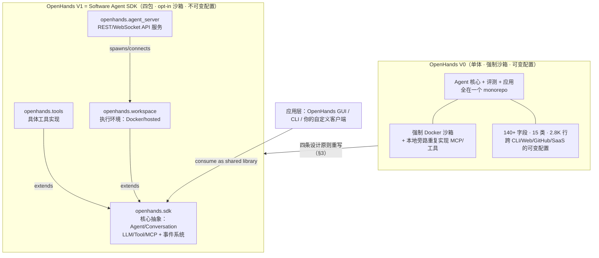
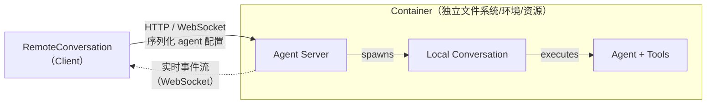

# OpenHands Software Agent SDK：把研究原型重构成可组合、可扩展的生产级软件 Agent 基础设施

> **本篇定位**：这是 agent-harness 库 **E 组（集成系统）的旗舰精读**。与 G 组标杆 [Harness-Bench](2605.27922-harness-bench-measuring-harness-effects.md)（它把 harness 当成**被测变量**）互为表里——Harness-Bench 证明"换 harness 分数摆 23.8 分"，而本篇是那些"被换来换去的 harness"里的一个**活体样本**：一个真实、开源、上了生产、被写成 MLSys 论文的**强 harness**。读它，等于读"如何把一个 harness 从研究原型工程化到生产级"的完整案例，也等于给我们（Claude Code）找了一面**最贴身的镜子**。
>
> 全篇严格遵循 v1 硬规范（公式/接口前给直觉 → 先定义符号 → 读出什么；指标给定义式；数字标 §/Table 出处；区分宣称 vs 批判）+ v2 增量（Why 三连 + 强制 Inspires-Us）+ 本库 Θ1–Θ5（分层、回扣 `Agent = Model + Harness`、Inspires-Us 打到我们自己 harness、canon/前沿坐标、regime 诚实）。

---

## §1　TL;DR（一页讲清这篇在干嘛）

> 主讲提示：开场先抛"研究原型 vs 生产系统"这道坎，再说这篇给出的是一份**可组合 SDK 的参照架构**，最后甩两个硬数字（生产故障 -61%、SWE-bench 72.8%）压场。

**一句话**：软件工程里 Agent 已经从"辅助工具"（GitHub Copilot、Cursor）走向"能异步跑几小时的自治系统"（Devin、Claude Code、OpenHands），但**可靠地把自治 Agent 部署到生产**需要一套"系统地基"——持久状态管理、沙箱里的安全执行、从本地到云容器的一致行为（§1 原文）。OpenHands 团队把自家框架从 **V0**（单体仓库、强制 Docker 沙箱、140+ 字段的可变配置、研究与生产耦合）**彻底重构**为 **V1 = OpenHands Software Agent SDK**：一套**事件溯源（event-sourced）+ 不可变配置 + 类型化工具系统 + 工作区抽象**的可组合基础设施（§1）。

**三条带走的结论**：

- **它是什么（Θ1，分层）**：本篇打的是 **E 组（集成系统）**，但它的贡献**横跨 harness 六层**——**T**（Action-Execution-Observation 工具系统 + MCP）、**C**（事件溯源上下文 + Condenser 压缩）、**L**（事件驱动控制循环 + 安全 interleaving）、**O**（结构化事件流 + 三层 CI）、**V**（内置学术 benchmark 评测 harness）、**E**nvironment（Workspace 抽象 + opt-in 沙箱）。它不是"某一层的新招"，而是"**如何把六层缝成一个生产级整体**"的参照设计。
- **Why 主线（设计层）**：研究原型追求"快速迭代"，于是把 agent 逻辑、评测、应用全塞进一个单体仓库 + 一个强制沙箱假设——**难上生产、难扩展**（§3 把 V0 的四组架构张力列得很清）。V1 的答卷是"**可组合 SDK**"：默认本地、按需沙箱；一切组件不可变、唯一可变的是会话状态；核心与应用严格解耦；类型化组件可声明式扩展。**代价**是工程复杂度显著上升（四包、事件层级、工厂模式、路由、条件器……），换来"生产级 + 保持能力"。
- **两个硬证据（Θ2，回扣 `Agent = Model + Harness`）**：① **系统级**——15 天生产 A/B（V0 与 V1 同时服务真实用户），V1 把**系统可归因故障**（system-attributable failures）从 **78.0/1k 降到 30.0/1k，降幅 61%**（Table 2）；② **能力级**——同一个模型（Claude Sonnet 4）在 V0 与 V1 上 SWE-bench Verified **都是 68.0%**（架构没削能力，Table 4），而 Sonnet 4.5 因 V1 天然支持 extended thinking **从 64.6% 涨到 72.8%（+8.2）**。**换 harness（V0→V1）不换模型，能力从"持平"到"因架构解锁新特性而+8.2"** —— 这就是 `Agent = Model + Harness` 在**同一个团队、同一个模型**上的干净演示。

**权威性来源（Θ4）**：All-Hands AI（OpenHands 母公司，原 OpenDevin）联合 **CMU**（Graham Neubig 组），**MLSys 2026 Accepted**；底座 OpenHands 18 个月 64k+ GitHub star、数百贡献者（§1）。这是**工业界 SDK 首批被系统写成 MLSys 论文、并给出生产遥测证据**的参照架构之一——不是学术玩具，是"跑在真实流量上、还回来写了论文"。

---

## §2　问题与动机：为什么"研究原型难上生产"值得重写一个 SDK

> 主讲提示：这一页用 Why 三连的"问题层"。核心矛盾一句话——**驱动早期原型成功的那些设计选择（单体、强制沙箱、可变配置），恰恰是它上不了生产的原因**。

**Why（问题层）——不解决会卡住什么？**

Agent 在软件工程里已广泛使用，但**造一个生产级软件工程 Agent 是难事**（摘要首句）。原文把"生产级"拆成四个必须同时满足的诉求（摘要 + §1）：

1. **灵活性（flexibility）**：实现与实验要方便——既能几行代码起一个默认 agent，也能扩展成带自定义工具、记忆管理的复杂 agent。
2. **可靠且安全的执行（reliable and secure execution）**：要有"无缝本地↔远程执行可移植性"、REST/WebSocket 服务。
3. **与用户交互的接口（interfaces for users）**：能直连多种界面——可视化工作区（VS Code、VNC、浏览器）、命令行、API。
4. **规模化可靠部署**：跨环境（本地 → 容器化云）行为一致。

**关键张力**（§1 原文）：这些"系统地基"对早期"以本地、用户驱动为主"的辅助工具是**不必要的**；可一旦要跑自治 Agent 就变成刚需。而"如何架构这些地基**没有共识**"——OpenAI/Claude/Google 各家 SDK 在隔离模型、状态管理、部署假设上**分歧巨大**，实践者手里没有一份"经过良好验证的参照设计"（well-validated reference design）。

**证据（原文动机数据）**：OpenHands V0 的成功本身成了负债——18 个月冲到 64k+ star、数百贡献者（§1 引 Neubig 2025），但"最初的单体架构（我们称之为 V0）暴露出越来越大的架构张力"：早期为了快速原型，把 **agent 逻辑、评测、应用揉进一个代码库**，久而久之导致——**刚性的沙箱假设、蔓延的可变配置、研究与生产的紧耦合**，最终"让一次彻底的架构重写变得不可避免"（§1 原文 "eventually making a full architectural redesign unavoidable"）。

> **读出什么**：这篇的动机**不是"再造一个更强的 agent 循环"**（那是 B 组 ReAct/Reflexion 的活），而是"**给生产级软件 Agent 补一份缺失的参照架构**"。它要回答的问题是工程学的：*当一个 agent harness 要从 demo 长成基础设施，哪些设计必须换？* 这正是 E 组（集成系统）作为方法论护城河的意义——单点招式好发论文，但"把所有招式缝成一个能上生产、还能被别人扩展的整体"才是真正难而稀缺的知识。

---

## §3　核心 intention 形式化：一句话 + 四条设计原则（论文 §3）

> 主讲提示：这页是全篇的"宪法"。V1 的一切设计都是这四条原则的推论。讲的时候，把每条原则都对着它要治的 V0 病来讲。

把 intention 形式化成一句话：

> **在"保持研究级灵活性"与"达到生产级可靠/安全/可扩展"之间，找到一个可组合的架构折衷——让同一份 agent 代码，既能在 notebook 里三行跑起来，又能不改代码地扩展到分布式、容器化、多租户的生产部署。**

论文 §3 把 V0 的架构张力诊断成**四对矛盾**，每对给出一条 **V1 设计原则**（Design Principle）。这是理解全篇的骨架，务必逐条读透（§3.1–§3.4）：

| # | V0 的病（架构张力） | V1 的药（设计原则，原文加粗句） | 治在哪一层 |
|---|---|---|---|
| §3.1 | **强制沙箱 vs 本地灵活**：V0 假设所有工具调用都在 Docker 里跑；跨两个进程（agent + sandbox）状态易分裂、崩溃即坏会话；多租户下一个用户的重活（如海量截图）能拖垮同容器其他 agent | **沙箱应 opt-in，而非 universal**：V1 默认在**单进程**里统一 agent 与工具执行（对齐 MCP 的假设）；需要隔离时同一套栈**透明容器化**。灵活不牺牲安全。 | E(环境)/L(循环) |
| §3.2 | **可变配置 vs 确定性状态**：V0 配置横跨 CLI/Web/GitHub/SaaS 多套并行层级，各有覆盖规则；同参数两次运行都可能微妙分叉；最终 **140+ 字段、15 个类、2.8K 行配置代码**，牵一发动全身 | **默认无状态、单一状态真源**：所有 agent 及其组件（tools/LLM 等）都是**构造时校验的不可变 Pydantic 模型**；唯一可变实体是 `conversation state`，作为单一状态真源。→ 确定性重放、强一致、稳定长程恢复。 | C(上下文)/L(循环) |
| §3.3 | **单体仓 vs 模块化 SDK**：V0 把前端/后端/CLI/评测塞进一个 monorepo；随学术界贡献大量 benchmark，重依赖与频繁版本冲突"漏"进主应用，部署又重又脆 | **严格分离关注点**：V1 把 agent 核心抽成独立的软件工程 SDK；应用通过 SDK API 集成，**研究可独立于应用演进**。 | (跨层/工程) |
| §3.4 | **单体逻辑 vs 可扩展架构**：V0 core 与 application 无清晰边界；加新行为常要改核心逻辑或给特定入口打分支，限制实验与维护 | **一切都应可组合、可安全扩展**：在**部署层**（SDK/Tools/Workspace/Server 四包灵活组合）与**能力层**（类型化组件模型：tools/LLMs/contexts…可声明式扩展、替换）**双层可组合**。 | (跨层/工程) |

**Why（设计层）——这四条为什么不是"过度设计"？**
朴素替代是"缝缝补补"：给 V0 加异常层、加配置覆盖、给单体拆几个子包。→ 论文 §1/§3 反复点明这条路**已经走过且失败**——"后来试图统一这些系统只是**增加了更多覆盖层和不一致**"（§3.2）；本地执行需求逼出的"例外与旁路层"让架构"越来越脆、且与 MCP 假设不对齐"（§3.1）。所以 V1 选择**推倒重来的四条原则**，而非补丁。这四条不是审美，是**被 V0 的具体崩溃症状逼出来的**——每一条都能指名道姓地对应一个 V0 的病。

> **读出什么（Θ2 埋线）**：注意第 §3.2 条"单一状态真源"和 §3.4 条"双层可组合"——它们恰恰是我们（Claude Code）作为 harness 也在处理的核心问题（我们的会话上下文、我们的工具/子代理扩展）。这张表本身就是一份"harness 工程化 checklist"，§14 会逐条打到我们身上。

---

## §4　方法总览（big picture）：一张图看懂 V0 → V1 的架构演化

> 主讲提示：先给一张"从单体到四包"的演化图（对应原文 Figure 1），让大家**在数学/接口之前先有骨架**。强调一个视觉隐喻：V0 是一团缠在一起的线，V1 是四个边界清晰、可插拔的盒子。

**直觉**：把 V0 想成"一栋所有房间打通、承重墙乱砌的老房子"——改任何一处都可能塌别处（§3 的四组张力）。V1 是"重新设计的四联体建筑"：地基（SDK 核心抽象）、水电（Tools 实现）、外墙（Workspace 执行环境）、门厅（Agent Server 远程 API），每栋独立可测、可换、可组合。



*（此图综合原文 Figure 1a/1b 与 §4.1 文字重绘。原文 Figure 1 标题明说：V0 各组件颜色"大致对应"其 V1 模块化后继者，即这是一次"解耦重构"而非"从零新写"。）*

**九个互锁组件（§4 开篇列表）**：SDK 由九个组件构成——事件溯源状态管理（§4.2）、LLM 抽象（§4.3）、工具系统（§4.4）、Agent（§4.5）、上下文窗口管理（§4.6）、本地会话（§4.7）、密钥注册表（§4.8）、安全与确认（§4.9）、部署架构（§4.10）。下面 §5–§13 逐一讲透——每处先直觉、再定义、再"读出什么"。

**最小示例（原文 Figure 2）——"三行起一个 agent"的灵活性证据**：

```python
from openhands.sdk import LLM, Conversation
from openhands.tools.preset.default import get_default_agent
llm = LLM(model="openhands/claude-sonnet-4-5-20250929", api_key="...")
agent = get_default_agent(llm=llm)
conversation = Conversation(agent=agent, workspace="/path/to/project")
conversation.send_message("Write 3 facts about this project into FACTS.txt.")
conversation.run()
```

> **读出什么**：这段代码是"灵活性"诉求的**可执行证明**——默认情况几行就能跑；而后面 §5–§13 每个组件都是"当你要更复杂时，如何安全地扩展这几行"。记住这个对比：**简单要简单，复杂要可能（simple things simple, complex things possible）**——这是贯穿全 SDK 的设计品味，也是我们评价任何 harness API 的黄金标准。

---

## §5　符号与术语表：先把后文要用的记号钉死

> 主讲提示：这页是"字典"。后面讲事件溯源、工厂模式、路由时会反复引用，先集中定义，避免边讲边猜。

| 记号 / 术语 | 定义（原文出处） |
|---|---|
| **V0 / V1** | OpenHands 旧架构（单体）/ 新架构（SDK）。V1 即本文的 Software Agent SDK（§1）。 |
| **Event（事件）** | 事件溯源的原子单位：不可变、带 ID/时间戳/来源、类型安全序列化（§4.2 Table 1 基类）。 |
| **`ConversationState`（会话状态）** | 系统里**唯一可变**的组件；含"可变元数据字段"+"仅追加的 `EventLog`"两类状态；单一状态真源（§4.2）。 |
| **`LLMConvertibleEvent`** | 可被送进 LLM 的事件（如 MessageEvent/ActionEvent/ObservationEvent）；含 `to_llm_message()`（Table 1）。 |
| **Action / Execution / Observation** | 工具三段式契约：Action=输入 schema（Pydantic 校验）；Execution=`ToolExecutor` 跑逻辑；Observation=输出→LLM 兼容格式（§4.4 Fig 4）。 |
| **MCP（Model Context Protocol）** | 外部工具协议；V1 把 MCP 工具当**一等公民**，其 JSON Schema 自动翻译成 `Action`（§4.4）。 |
| **`Condenser`（条件器/压缩器）** | 当历史撑爆上下文时，丢弃事件并替换为摘要的机制；结果作为 `CondensationEvent` 存回事件日志（§4.6）。 |
| **`RouterLLM`** | `LLM` 的子类，实现 `select_llm()` 按输入选不同模型做多 LLM 路由（§4.3 Fig 3）。 |
| **`Workspace`（工作区）** | 执行环境抽象；工厂按参数解析为 `LocalWorkspace`（本地进程）或 `RemoteWorkspace`（HTTP 到 Agent Server）（§4.10 Fig 7）。 |
| **`Conversation` 工厂** | 按传入 `LocalWorkspace`/`RemoteWorkspace` 透明返回 `LocalConversation` / `RemoteConversation`（§4.10）。 |
| **`SecurityAnalyzer` / `ConfirmationPolicy`** | 前者给每个工具调用评风险（low/med/high/unknown）；后者据风险决定是否需用户批准（§4.9）。 |
| **`SecretRegistry`（密钥注册表）** | 晚绑定、可远程管理的凭据；输出中出现即用 `<secret-hidden>` 掩码（§4.8）。 |
| **system-attributable errors（系统可归因故障）** | 可直接归因于 agent 基础设施或 SDK 逻辑的错误类，**排除**外部 LLM provider 错误——生产可靠性的核心度量（§5.1 Table 7）。 |

---

## §6　组件一 · 事件溯源状态管理（§4.2）：整个 V1 的心脏

> 主讲提示：这是全篇**最该讲透**的一节。一句话立骨——"把一切交互都当成追加到日志里的不可变事件；唯一可变的是那本日志所在的会话状态对象"。这直接兑现了 §3.2 的"单一状态真源"原则。

**直觉**：普通做法是把 agent 的状态散落在各处可变变量里（当前消息、工具结果、计数器……）——一旦要"崩溃恢复"或"确定性重放"就无从下手，因为你不知道状态是怎么一步步变成现在这样的。**事件溯源（event sourcing）** 反过来：状态 = 一串**不可变事件**按顺序回放的结果。想恢复？重放日志即可。想审计？读日志即可。想压缩？替换日志片段即可。

### 6.1　事件层级（Event Hierarchy，Table 1）

原文用一个多级层级组织所有事件（Table 1）。关键区分是：**能不能被送进 LLM**。

| 父类 | 子类 & 用途（Table 1 原文） |
|---|---|
| `Event`（基类） | *不可变结构、类型安全序列化*（通过 Pydantic discriminated unions） |
| `LLMConvertibleEvent`（可见于 LLM）↳ `Event` | `MessageEvent`（用户/助手文本）、`ActionEvent`（带 thought & reasoning 的工具调用）、`SystemPromptEvent`（系统提示 + 工具 schema）、`CondensationSummaryEvent`（被遗忘事件的摘要）、`ObservationBaseEvent`（工具响应基类） |
| `ObservationBaseEvent`↳ `LLMConvertibleEvent` | `ObservationEvent`（成功的工具执行结果）、`UserRejectObservation`（用户拒绝了动作）、`AgentErrorEvent`（agent/scaffold 错误） |
| `Event`（内部事件，**不可见于 LLM**） | `ConversationStateUpdateEvent`（状态字段变更）、`CondensationRequest`（触发历史压缩）、`Condensation`（压缩结果 + 被遗忘事件）、`PauseEvent`（用户请求暂停） |

> **读出什么**：这张表把"给模型看的"（action/observation/message）和"给系统内部记账的"（state update/pause/condensation）**在类型层面就分开**了。这是一个极其干净的设计：LLM 只应看到 `LLMConvertibleEvent`，内部控制流事件不污染上下文。**对照我们自己**——我们的对话历史里，"给模型看的内容"和"harness 内部的记账（比如 compaction 触发、子代理生命周期）"有没有在类型上分干净？还是混在一个消息数组里？这是 §14 要打的第一枪。

### 6.2　`ConversationState`：唯一的可变实体（单一状态真源）

**直觉 + 定义**：设计上 `Agent`、`Tool`、`LLM` 全部不可变且可序列化——所有"会变的变量"都住在 `ConversationState` 里，使它成为**唯一有状态**的组件（§4.2 原文）。它维护两类状态：

1. **可变元数据字段**（mutable metadata）：如 `agent_status`、`stats`、`confirmation_policy`，直接存在 Pydantic 模型里；
2. **仅追加的事件日志**（append-only `EventLog`）：记录所有 agent 交互。

**并发安全（原文明确机制）**：一把 **FIFO 锁**保证线程安全更新，走"双路径"模式——**只改元数据**的更新（state-only），与**追加到日志**的事件更新（event-based）分两条路走（§4.2）。

**持久化（双路径落盘，为什么高效）**：配置了持久化时，`ConversationState` 选择性写盘——元数据字段每次修改序列化到**单个 `base_state.json`**，而 `EventStore` 把事件作为**单独的 JSON 文件**持久化到对应目录。

> **Why（设计层）——为什么是"双路径落盘"而不是"每次全量写"？**
> 朴素做法是每次状态变了就把整个历史 dump 到磁盘。→ 会随着对话变长导致**O(n) 的重复写**，越到后面越慢。V1 的双路径设计让"只有新事件写盘"（增量持久化），避免重写大历史。**恢复**时：加载 `base_state.json` + 从目录回放事件，agent **自动检测未完成的对话并从最后处理的事件继续**（§4.2）。代价：多了一层文件管理与"元数据/事件一致性"的心智负担，但换来"崩溃恢复"这个生产刚需。

**开销证据（前瞻到 §9）**：原文在 agent trace 上实测——事件溯源开销相对 LLM 往返**可忽略**，持久延迟**亚毫秒**、崩溃恢复 **<20ms**（§4.2 末，详见 §5.2 / 本文 §9 的 Table 3）。

> **读出什么（Θ2）**：这一节是 §3.2 原则"单一状态真源"的完整兑现，也是 V1 生产可靠性 -61% 的**架构根因**——因为状态只在一个地方变、且可从日志确定性重建，V0 那种"两进程状态分裂→坏会话"的故障模式**从架构上被消除**（§5.1 会点明这一点）。

---

## §7　组件二 · LLM 抽象层（§4.3）：模型无关 + 原生推理 + 多 LLM 路由

> 主讲提示：这页讲"如何把 100+ 家模型、带/不带 function-calling、带/不带 extended thinking 都统一到一个 `LLM` 接口下"，并给出 `RouterLLM` 的伪代码。

`LLM` 类通过 **LiteLLM** 提供统一接口，支持 **100+ 提供商**，两套 API：标准 Chat Completions（广兼容）+ 较新的 OpenAI Responses API（面向最新推理模型）（§4.3）。四个要点：

- **原生推理 / extended thinking 支持**：SDK 捕获并处理前沿模型的原生推理字段——Anthropic extended thinking 的 `ThinkingBlock`、OpenAI 的 `ReasoningItemModel`。透明支持 OpenAI Responses API，使客户端能用上只在 Responses API 上可用的高级推理模型（如 GPT-5-Codex）。→ **这正是 Table 4 里 Sonnet 4.5 +8.2 分的来源**（见 §11）。
- **对非 function-calling 模型的内建支持**：`NonNativeToolCallingMixin` 把工具 schema 转成**文本提示指令**，再用结构化提示 + 正则从模型输出里**解析出工具调用**。→ 让不支持 function calling 的模型也能干 agent 活，"大幅扩展可用模型集合"（§4.3）。
- **多 LLM 路由**：`RouterLLM`（`LLM` 子类）让 agent 对不同请求用不同模型；自定义实现覆写 `select_llm()` 按输入选模型。

**`RouterLLM` 伪代码（原文 Figure 3）**：

```python
class RouterLLM(LLM):
    llms_for_routing: dict[str, LLM]   # 可用模型
    @abstractmethod
    def select_llm(self, messages: list[Message]) -> str:
        """返回要用的 LLM 在 llms_for_routing 里的 key。"""
    def completion(self, messages, ...) -> LLMResponse:
        selected_model = self.select_llm(messages)
        self.active_llm = self.llms_for_routing[selected_model]
        return self.active_llm.completion(...)

class MultimodalRouter(RouterLLM):        # 一个具体路由器
    def select_llm(self, messages) -> str:
        has_images = any(m.contains_image for m in messages)
        return "primary" if has_images else "secondary"
# 用法：文本走便宜模型，带图走多模态模型
router = MultimodalRouter(llms_for_routing={
    "primary": LLM(model="claude-sonnet-4-5"),
    "secondary": LLM(model="devstral-small")})
agent = Agent(llm=router, tools=tools)
```

> **Why（设计层）——为什么让 `RouterLLM` 继承 `LLM` 而不是包一层调度器？**
> 朴素做法是在 agent 外面写个 if/else 调度器决定调哪个模型。→ 会让 agent 代码知道"有多个模型"这件事，破坏"agent 只跟一个 `LLM` 打交道"的抽象。V1 让路由器**继承 `LLM`、保持统一接口**（Figure 3 caption 原文："Routers inherit from LLM to maintain a unified interface while delegating to selected models"）——agent 完全无感，`agent = Agent(llm=router, ...)` 和 `agent = Agent(llm=single_llm, ...)` 写法一致。这就是 §3.4"可组合"原则的微观体现：**新能力通过替换类型化组件获得，而非改核心**。

> **读出什么**：这一节对我们（Claude Code）最扎心——**模型无关 + 多 LLM 路由 + 非 function-calling 支持**，正是我们作为"绑定 Anthropic 模型的 harness"结构上**没有**的东西（Table 6 里 OpenAI/Claude SDK 这几项都是 ✗，只有 OpenHands 全 ✓）。这是"通用 SDK"与"单厂 harness"的根本分野，§14 详谈。

---

## §8　组件三 · 工具系统（§4.4）：Action-Execution-Observation 三段式契约

> 主讲提示：这页讲 V1 如何用一个统一抽象**同时**容纳自定义工具和 MCP 工具，并支持跨进程/网络的分布式执行。

**直觉**：工具是 agent 的"手"。要让"手"既类型安全（别让模型传乱参数）、又可扩展（自定义工具和外部 MCP 工具一视同仁）、还能跨网络（远程执行），就需要把"工具"拆成三个正交部件。

**Action-Execution-Observation 模式（§4.4 Fig 4）**——每个工具由三个良好分离的部件定义：

- **Action**：指定工具调用的**输入 schema**；LLM 生成的参数在执行前用 Pydantic 模型校验，保证类型安全、挡住畸形请求。
- **Execution**：通过 `ToolExecutor` 实现工具**实际逻辑**，接收已校验的 `Action` 并执行。
- **Observation**：捕获执行输出，定义**结构化返回 schema**，把结果（或错误）转成 LLM 兼容格式。

严格契约（Fig 4 文字）：LLM 提出 JSON 工具调用 → 校验解析成 `Action` → `execute` → 结果作为 `Observation` 返回。核心类结构（原文 Figure 4）：`Schema(BaseModel)` 提供 `to_mcp_schema()`/`from_mcp_schema()`；`Action(Schema)` 带 `visualize()`；`Observation(Schema)` 带 `to_llm_content()`；`ToolDefinition[ActionT, ObservationT]` 带 `to_mcp_tool()`/`to_openai_tool()`/`to_responses_tool()`；`ToolExecutor` 是 `__call__(action) -> Observation`。

**MCP 集成（一等公民）**：同一抽象让 MCP 无缝接入——MCP 工具的 JSON Schema **自动翻译**成 `Action` 模型，结果**浮现为结构化 `Observation`**。`MCPToolDefinition` 扩展标准 `ToolDefinition`，`MCPToolExecutor` 把执行委托给 FastMCP 的 `MCPClient`。结果：**外部 MCP 工具与原生工具行为完全一致**——输入校验、运行时类型安全、序列化给 LLM（§4.4）。

**工具注册表与分布式执行（为什么工具要能"变成纯 JSON 过网络"）**：SDK 解耦*工具规格*与*实现*，用**基于注册表**的解析机制。因为 Python executor 不可序列化，工具在跨边界时表示成**轻量 `Tool` 规格对象**（只含注册名 + JSON 可序列化参数）；通过 `register_tool(name, ToolDefinition)`，每个标识符绑定到一个 resolver，运行时**按会话上下文重建完整定义**（含 executor）。

> **Why（设计层）——为什么工具规格与实现要解耦？**
> 朴素做法是把工具对象（含 Python 函数）直接传给远程执行器。→ Python 函数**不可序列化**，过不了网络/进程边界。V1 让工具规格是**纯 JSON**（注册名 + 参数），到了远端再按注册表 + 会话上下文**懒实例化**（lazy instantiation，可带上环境特定状态如 workspace 路径）——这样"工具规格能跨进程/网络传，本地和远程用一套统一接口"（§4.4 原文）。这是 §4.10"本地↔远程无缝"的**工具层前提**。

> **读出什么**：Action-Execution-Observation 是一份**可直接抄的工具抽象模板**。它的价值不在"有多少工具"，而在"**新工具（含第三方 MCP）零特判地接入同一契约**"。这与 Harness-Bench 的核心抽象 execution alignment 遥相呼应——工具契约越统一、越类型安全，"推理→动作→可验证结果"的对应就越不容易断裂。

---

## §9　组件四 · Agent（§4.5）：无状态事件处理器 + 三大能力 + 子代理

> 主讲提示：这页讲 agent 本体为什么设计成"无状态"，以及 `on_event` 回调解锁的三件事（安全 interleaving / 增量执行 / 事件流）。这直接兑现 §3.2 的"无状态"原则。

**直觉 + 定义**：Agent 抽象把**配置**（configuration）与**执行状态**（execution state）分开。Agent 被定义成**无状态、不可变的规格**——含 LLM 设置、工具规格、安全策略、agent 内容——可序列化、可跨进程传输（§4.5）。

**事件驱动执行（Event-Driven Execution）**：Agent 通过事件驱动循环处理会话状态，**一步一步**推进。它不直接返回结果，而是通过回调 `on_event(event: Event) -> None` **发射**结构化事件（消息、动作、观察），把"事件生成"与"执行控制"分开。这个设计解锁三件事（§4.5 原文列举）：

1. **安全 interleaving（security interleaving）**：动作可在执行前**基于风险分析被审查或拦截**（§4.9）；
2. **增量执行（incremental execution）**：agent 一次只推进一步，支持**暂停/恢复、从上下文溢出恢复、长对话的 condensation**；
3. **事件流（event streaming）**：中间结果（观察、推理轨迹）**实时发射**给 UI 更新与监控。

**用 Skills 和 Prompts 定制 AgentContext**：`AgentContext` 集中所有塑造 LLM 行为的输入——系统/用户消息的前后缀、用户定义的 `Skill` 对象。Skills 可编程定义或从 markdown 文件加载（如 `.openhands/skills/`，或兼容格式如 `.cursorrules`、`agents.md`）。每个 skill 可**始终激活**（`trigger=None` 持久增广系统提示），或按关键词匹配**条件激活**；skill 还能带 MCP 工具。→ 在不改 agent 逻辑的前提下丰富上下文与行为定制。

**子代理委派（Sub-Agent Delegation）**：SDK 通过一个**委派工具**支持层级式协调——子代理作为**独立会话**运行，继承父代理的模型配置与工作区上下文，实现结构化并行与隔离，**不改核心 SDK**。当前实现提供**阻塞式并行执行**，作为 `openhands.tools` 里的标准工具（父代理 spawn 并监控子代理直到全部完成）。

> **Why（设计层）——为什么子代理编排要做成"一个普通工具"而不是核心特性？**
> 朴素做法是把"多 agent 协调"写进 SDK 核心。→ 一旦要改协调策略（异步委派、动态调度、容错恢复），就得动核心、影响所有用户。V1 把子代理委派做成 `openhands.tools` 里的**一个标准工具**——原文明说："高级 agent 编排**无需修改核心框架**"，异步委派/动态调度/容错恢复等复杂协调行为都能**完全作为用户定义工具实现**（§4.5 原文）。这是 §3.4"可组合/可扩展"原则最有力的一次演示：**连"多智能体"这种大特性都是插件，而非内建**。

> **读出什么（Θ3 直击）**：这一节几乎是我们（Claude Code）子代理机制的镜像——我们也有"父 agent spawn 子 agent、子 agent 独立上下文、阻塞直到完成"。差别在于**它把这做成了一个可替换的工具抽象**，而我们的子代理逻辑更接近内建。"编排即工具"是否值得我们借鉴？§14 深谈。另外 `AgentContext` 的 Skills（从 `.cursorrules`/`agents.md`/`CLAUDE.md` 类文件加载持久指令）**几乎就是我们的 CLAUDE.md 记忆机制**——一个强佐证：这类"项目级持久指令注入"已是生产 harness 的标配。

---

## §10　组件五–八 · 上下文压缩 / 本地会话 / 密钥 / 安全（§4.6–§4.9）

> 主讲提示：这页把四个"生产刚需但各自不大"的组件打包讲，重点是每个都体现"把某个生产关切做成一等抽象"。

### 10.1　上下文窗口管理 · Condenser（§4.6）——C 层

**直觉**：历史无限增长，早晚撑爆 LLM 上下文。`Condenser` 系统在历史过大时**丢弃事件并替换成摘要**。关键设计：压缩结果作为 `CondensationEvent` 存回**事件日志**；送 LLM 前，agent **应用**这些压缩事件（移除被遗忘事件、插入摘要）。→ SDK **保留完整事件日志**（不管压没压过），同时保持 condenser 实现**无状态**。

**证据**：`LLMSummarizingCondenser`（默认条件器）被证明可把 **API 成本降低最多 2×、且不降 agent 性能**（§4.6 引 Smith 2025）。

> **Why（设计层）**：朴素做法是"压缩时直接删历史"。→ 不可逆，审计/重放都完了。V1 让压缩**也是一个事件**（`CondensationEvent`），原始日志完整保留，压缩只在"送 LLM 前"临时应用——既省 token 又不毁审计链，还让 condenser 无状态可插拔。**对照我们**：我们的 compaction 是否也保留了"压缩前的完整轨迹"以便重放？还是压完就丢？

### 10.2　本地会话 · LocalConversation（§4.7）——L 层

`LocalConversation` 是 SDK 最简单直接的执行模式，为快速迭代/调试设计：**完全在进程内**跑完整 agent 循环（LLM 调用、工具调用、事件回调、状态更新），**无网络/容器开销**。API：`Conversation(agent, workspace)` 起会话，`send_message()` 送输入，`run()` 起执行，`pause()`/`run()` 暂停恢复，`.state` 直接查结果。**暂停自动持久化状态并发 `PauseEvent`**，允许稍后从同一点恢复。

### 10.3　密钥注册表 · SecretRegistry（§4.8）——安全/E 层

**直觉**：工具执行要用凭据，但凭据**绝不能泄进 LLM 上下文或日志**。`SecretRegistry` 提供**安全、晚绑定、可远程管理**的凭据：每个会话独立实例（严格 per-session 隔离），密钥**仅在执行时**被访问，所有出现在输出里的密钥值都被掩码防泄。例：Bash 工具扫描命令里引用的密钥、导出为环境变量、并把结果里的密钥出现替换成常量掩码 `<secret-hidden>`。密钥可以是静态值或**可调用**（如 token refresher），来自本地存储或 HTTP 源；序列化时脱敏、可用可配置密码加密；还能**会话中途更新**（本地或经 agent server API）——支持**热轮换、不重启 agent**。

### 10.4　安全与确认 · Security & Confirmation（§4.9）——安全/L 层

**直觉**：agent 能干危险动作，尤其跑在用户机器上时。V1 把安全当**控制循环内的一等关切**，两个抽象构成核心：

- **`SecurityAnalyzer`**：给每个工具调用评风险——low / medium / high / unknown；
- **`ConfirmationPolicy`**：据动作细节与评估风险决定**是否需用户批准**再执行。

需批准时，agent 进入特殊状态 **`WAITING_FOR_CONFIRMATION`** 直到用户显式批准/拒绝；被拒时可**用更安全的替代方案重试**。确认策略可**会话中动态更新**——如对安全的只读操作（`grep`）放宽限制，实现**自适应信任**（adaptive trust）。这套设计把"风险评估"与"执行"分离，开发者可自定义 `SecurityAnalyzer`/`ConfirmationPolicy` 而不碰工具执行器或核心逻辑。内建一对：`LLMSecurityAnalyzer`（给工具调用附 `security_risk` 字段）+ `ConfirmRisky` 策略（拦截超过可配置风险阈值的动作，**默认 high**）。

> **读出什么（Θ2 + Θ5）**：§10.4 是 Harness-Bench 打分公式里 **Security 硬闸门**（`TaskScore = Security · Completion · Process`）在**真实系统**里的落地——OpenHands 用 `WAITING_FOR_CONFIRMATION` + 风险阈值把"越权即否决"做进了控制循环。但要 Θ5 诚实：论文自己在 §7 承认"**LLM-based 安全分析受对抗提示影响、分类不一致，无法保证完全安全**"——所以这是"减少风险"而非"消除风险"，别把它当保险箱（§13 详批）。

---

## §11　组件九 · 部署架构（§4.10）：本地↔远程无缝切换（V1 的"关键创新"）

> 主讲提示：这页是 SDK 面向生产的"临门一脚"。核心卖点一句话——"同一份 agent 代码，换一个 workspace 类型就从 notebook 跑到分布式生产，其余代码一字不改"。

**直觉**：研究和生产的最大摩擦是"本地能跑的代码，上生产要重写"。V1 用两个工厂抹平这条缝——`Conversation` 工厂 + `Workspace` 抽象（§4.10 原文称此为 SDK 的 **key innovation**）。

**Conversation 工厂（本地 & 远程会话）**：`Conversation` 类是**工厂入口**，抽象本地与远程执行——传入字符串路径或 `LocalWorkspace` → 返回 `LocalConversation`（进程内跑完整循环、直接调工具、同步更新状态）；传入 `RemoteWorkspace` → 同一个调用**透明构造** `RemoteConversation`（把 agent 配置序列化、经 HTTP + WebSocket 委派给 agent server 执行）。两种实现**共享完全相同的 API**，实现"从本地原型到容器化多用户部署、**无需改代码**"（§4.10）。

**本地→远程只差一个 import（原文 Figure 5）**：

```python
--- local.py
+++ remote.py
  from openhands.sdk import LLM, Conversation
  from openhands.sdk.preset.default import get_default_agent
  llm = LLM(model="anthropic/claude-sonnet-4.1", ...)
  agent = get_default_agent(llm=llm)
- conversation = Conversation(agent=agent)
- conversation.send_message("Create hello.py")
- conversation.run()
+ from openhands.workspace import DockerWorkspace
+ with DockerWorkspace(...) as workspace:
+     conversation = Conversation(agent=agent, workspace=workspace)
+     conversation.send_message("Create hello.py")
+     conversation.run()
```

> Figure 5 caption 原文：本地→远程切换**只需 import 并实例化 `DockerWorkspace`，其余代码（agent 配置、LLM 设置、消息处理）全不变**。

**Agent Server**：`agent_server` 模块实现远程执行的 API 服务（Figure 6）——暴露 REST 端点（如 `POST /conversations`、`GET /conversations/id`）+ WebSocket 事件流。`RemoteConversation` 启动时把 agent 配置（LLM 设置、工具、上下文）序列化成 JSON 提交给 `/conversations`；服务器**重建 agent、起本地执行循环、实时把结构化事件流回**——无需轮询。官方提供 Docker 镜像打包整套 agent-server 栈（API 服务、VSCode Web、VNC 桌面、Chromium 浏览器），每个 agent 实例跑在**独立容器**（专属文件系统/环境/资源）→ SaaS 式多租户 + 工作区隔离。

**Workspace 抽象（Figure 7）**：`BaseWorkspace` 抽象类为 agent 提供沙箱——`LocalWorkspace`（进程内对宿主文件系统/shell 执行，几乎是"薄的 no-op wrapper"，无网络跳转、快原型）；`RemoteWorkspace`（同接口但把所有操作经 HTTP 委派给 Agent Server，具体如 `DockerWorkspace` 容器化服务、`APIRemoteWorkspace` API 托管运行时）。`Workspace(...)` 工厂：只给 `working_dir` → 解析为 local；给了 `host`/`runtime` 参数 → 解析为 remote，**保证 agent 代码跨环境不变**。



*（重绘自原文 Figure 6：客户端经 HTTP 序列化配置；服务器在容器内用 SDK 组件执行、经 WebSocket 流事件。）*

> **读出什么**：§11 是"E 组=集成系统"的精髓——它没发明新算法，而是用**两个工厂 + 一个共享 API**把"本地易用"和"远程可扩展"这对通常互相打架的诉求**缝成一体**。这正是 §3.1"opt-in 沙箱"、§3.4"可组合"两条原则在部署层的合流。

---

## §12　实验一 · 生产可靠性 & 系统开销（§5.1–§5.2）：V1 到底稳不稳

> 主讲提示：这是全篇最硬的两块证据。先给"系统故障 -61%"的生产 A/B，再给"事件溯源开销可忽略"的微基准，把"重构值不值"用数字钉死。

### 12.1　生产可靠性：V0 vs V1（§5.1）

**评估协议（务必讲清"公平在哪"）**：分析一次 **15 天的并行 rollout**——V0 与 V1 **同时服务真实用户**。从会话失败日志抽取异常，分三类（Table 7 错误分类法）：**Infrastructure**（运行时通信/编排失败，如 `HTTPStatusError`、`AgentRuntimeNotReadyError`、`ConnectionError`）/ **SDK**（内部 SDK 逻辑错误，如 `CondensationError`）/ **LLM Provider**（外部 API 失败，如 `RateLimitError`、`AuthenticationError`，**单独分析**）。为可比性，只报 **system-attributable errors**——直接归因于 agent 基础设施或 SDK 逻辑的错误类，**排除对两个架构都外部的 LLM provider 错误**（§5.1）。

**指标定义式**：设某架构在一段时间内处理 $N$ 个会话、发生 $E_{\text{sys}}$ 次系统可归因错误，则

$$\text{系统可归因故障率} = \frac{E_{\text{sys}}}{N} \times 1000 \quad (\text{每 1k 会话})$$

**结果（Table 2）**：

| 错误类 | V0（Legacy） | V1（SDK） |
|---|---:|---:|
| Infrastructure errors | 69.8 / 1k | **0.0 / 1k** |
| SDK errors | N/A | 29.7 / 1k |
| **系统可归因故障率** | **78.0 / 1k** | **30.0 / 1k** |

**Result（原文 §5.1）**：V1 把系统可归因故障**降低 61%**（78.0 → 30.0 每 1k 会话）。

**Why（结果层）——为什么恰好能把 Infrastructure 错误清零？**
被消除的 V0 基础设施错误主要是：`HTTPStatusError (401)` 43.0/1k（**跨 pod 认证失败**）、`AgentRuntimeNotReadyError` 18.8/1k（**运行时 pod 就绪竞态**）、连接/超时 3.1/1k（网络不稳）。这些故障**根源于 V0 会话管理器与执行运行时之间的跨 pod HTTP 通信**。V1 的**同址执行模型（co-located execution）** 通过**彻底移除这条依赖**消灭了这些故障模式（§5.1 原文）——这正是 §6 事件溯源 + §11 单进程 opt-in 沙箱的直接红利：**没有跨进程 HTTP，就没有跨进程 HTTP 故障**。剩下的 V1 SDK 错误（29.7/1k）主要来自一个 **extended thinking 上线时发现的 condensation bug**（LLM provider 对事件/消息接口加了新约束），**已在正式版修复**。

> **读出什么（Θ2 核心证据 A）**：这是 `Agent = Model + Harness` 里 **harness 那一项直接决定"生产可靠性"** 的干净证据——**模型没变、用户没变、只换了架构（harness），故障率腰斩还多**。它把"好架构=更可靠"从直觉变成了 15 天真实流量上的 61%。

### 12.2　事件溯源系统开销（§5.2）

**协议**：把 **433 个 SWE-bench Verified 会话（39,870 事件）** 的真实 payload，通过生产 `LocalFileStore` 路径**重放**，测 I/O 成本（Table 3）。

| 指标 | 中位数 | P95 | 最长会话（358 事件）时 |
|---|---:|---:|---:|
| 单事件持久延迟 | 0.20 ms | 0.31 ms | — |
| 动作周期持久（Action+Obs） | 0.40 ms | 0.56 ms | — |
| 全状态重放 | 4.1 ms | 9.7 ms | 18.9 ms |
| 崩溃恢复（重放 + 未匹配动作扫描） | 7.4 ms | 14.9 ms | 32.1 ms |
| 每会话存储 | 380 KB | 1.4 MB | 3.4 MB |

**Result（§5.2）**：所有持久/恢复延迟相对 LLM 往返（通常 1–30 s）**可忽略**，存储**线性增长**，崩溃恢复即使最长会话也 **<20 ms**（注：表内"崩溃恢复 P95=14.9ms、max=32.1ms"，正文 §4.2 概述为"<20ms"，指的是全状态重放本身 18.9ms；恢复含额外扫描故 32.1ms——讲的时候点一下这个细微出处差异）。

> **读出什么**：这块回答了对事件溯源最常见的质疑——"每步都写盘，会不会很慢？"答案：**亚毫秒级持久，相对动辄几十秒的 LLM 调用是噪声**。所以 §6 的"崩溃恢复/确定性重放"这些生产刚需，是**近乎免费**拿到的。

---

## §13　实验二 · 能力保持 & 多模型 benchmark（§5.3–§5.4）：重构没削能力，还上了 SOTA

> 主讲提示：这页回答"重写会不会让 agent 变笨"。答案：同模型能力持平（甚至因新特性变强），且在 5 类任务里 3 类拿 SOTA。

### 13.1　三层持续 QA（§5.3）——O/V 层

SDK 用**三层测试**平衡覆盖/成本/深度：① **Programmatic Tests**（每次 commit 跑，mock LLM 调用、验核心逻辑/数据流/API 契约，秒级）；② **LLM-based Tests**（每日 + PR 按需，用真实模型 Claude Sonnet 4.5 / GPT-5 Mini / DeepSeek Chat 验推理/工具调用/环境稳定，每次 $0.5–$3、<5 min）；③ **Benchmark Evaluation**（按需高成本，$100–$1000、每次数小时，测学术数据集上的综合能力）。集成测试覆盖多场景工作流（文件操作、命令执行、git、浏览），示例测试周期性跑所有 SDK 示例（自定义工具、MCP、持久化、异步、路由等）。

### 13.2　能力保持：V0 vs V1（§5.4，Table 4）

**协议**：用**匹配模型**在 SWE-bench Verified 上比 V0/V1，隔离出 SDK 重构的贡献。

| Model | V0 | V1（SDK） |
|---|---:|---:|
| Claude Sonnet 4.5 | 64.6% | **72.8%** |
| Claude Sonnet 4 | 68.0% | 68.0% |

**读法（§5.4 原文）**：Sonnet 4 上 V0=V1=**68.0%**，确认"架构重构**保持了基线 agent 能力**"（能力没被重写削掉）；Sonnet 4.5 上 V1 **+8.2 分**，归因于 **extended thinking 支持**——V1 的事件溯源架构**天然集成**它，而在 V0 的多组件设计里 retrofit 进去需要"显著工程努力"。

> **Why（结果层）——为什么同一次重构，对 Sonnet 4 是"持平"、对 Sonnet 4.5 是"+8.2"？**
> 因为 Sonnet 4 不吃 extended thinking，架构变化对它是**纯结构性**的（不加不减能力）→ 持平，恰好证明"没削能力"。Sonnet 4.5 吃 extended thinking，而 V1 的"一切皆不可变事件"让 `ThinkingBlock` 这种新推理字段**作为一种事件自然接入**（§4.3）→ 架构**解锁**了模型的新能力。**这就是"好 harness 能把模型的能力更充分释放出来"的显微镜级证据**（Θ2）。

### 13.3　多模型综合评测：5 类任务、SOTA on 3/5（§5.4，Table 5）

**协议**：评 **14 个语言模型**（7 闭源 Anthropic/OpenAI/Google + 7 开放权重 MiniMax/DeepSeek/Zhipu AI/Moonshot AI/Alibaba/NVIDIA），横跨 5 类软件工程任务。指标均为各 benchmark 的**解决率/准确率**（如 SWE-bench Verified = 在 Verified 子集上"生成的补丁通过官方隐藏测试"的实例占比；GAIA = 通用助手任务的答案正确率）。

| 任务类 | benchmark | Published SOTA | Best SDK（模型） | 2nd SDK（模型） |
|---|---|---:|---|---|
| Issue 解决 | SWE-Bench Verified | 79.2% | 76.6%（Opus 4.5） | 75.6%（GPT-5.4） |
| Greenfield 开发 | Commit0 | 12.5% | **56.2%（GPT-5.4）** | 56.2%（Opus 4.6） |
| Frontend 开发 | SWE-Bench Multimodal | –（注4） | **44.1%（Gemini 3.1 Pro）** | 41.8%（Opus 4.6） |
| 软件测试 | SWT-Bench Verified | 84.0% | 78.8%（Opus 4.6） | 78.5%（Opus 4.5） |
| 信息收集 | GAIA (test) | 74.6% | **80.0%（Opus 4.6）** | 78.8%（GPT-5.4） |

*（Table 5；加粗 = 超过已公开 SOTA。SWE-bench MM 用其 test set、暂无公开 SOTA，故注4。）*

**关键读法（§5.4 原文）**：SDK 在 **5 个 benchmark 中 3 个拿 SOTA**（Commit0 / SWE-bench MM / GAIA），另两个也**接近**（SWE-bench V. 差 2.6、SWT-Bench 差 5.2），而且是**用单模型**达成——尽管好些 SOTA 系统用**多模型编排**。SDK-enabled insight：统一评测 harness 让"模型有清晰的任务特化"这一观察成为可能——**Claude 系主导 issue resolution 与 testing，GPT-5.4 领跑长程 greenfield 开发（62.5%，领先第二名 +12.5 分）**。

> **读出什么（连接标杆）**：注意最后这个 "SDK-enabled insight" ——**一个模型无关的统一 harness，本身就成了一台"测模型任务特化的仪器"**。这与 G 组标杆 Harness-Bench 是**镜像关系**：Harness-Bench 固定任务/模型、**换 harness** 测脚手架；OpenHands 固定 harness、**换 14 个模型** 测模型。两者合起来正好覆盖 `Agent = Model + Harness` 的两个自由度——一个变 Model、一个变 Harness。**本篇给"Model 那一维"提供了受控测量平台，Harness-Bench 给"Harness 那一维"提供了受控测量平台**。

### 13.4　与主流 SDK 的特征对比（Table 6）：OpenHands 独有的四件事

**协议（Table 6 caption）**：从官方文档/公开仓库/release notes（截至 2025-10）比 5 家 SDK——OpenAI Agents SDK v0.4.2、Claude Agent SDK v0.1.6、Google ADK v1.17.0、LangChain v1.0.3/LangGraph v1.0.2、OpenHands Agent SDK v1.0.0（✓全支持 / ~部分 / ✗缺失）。

**OpenHands 独有（原文点名"uniquely combines"四项，多为唯一全 ✓）**：

1. **原生远程执行 + 环境沙箱**（Builtin Remote Agent Execution + Agent Environment Sandboxing 同时 ✓——LangGraph 有远程执行但沙箱是 ~/✗）；
2. **LLM 驱动的动作级安全分析**（Security Analyzer for Agent Action——仅 OpenHands + Google 部分）；
3. **模型无关的多 LLM 路由 + 一等支持非 function-calling 模型**（Multi-LLM Routing 仅 OpenHands ✓，LangChain ~，其余 ✗；Non-function-calling 支持仅 OpenHands ✓）；
4. **内建学术 benchmark 评测**（Built-in Academic Benchmark Evaluation——仅 OpenHands ✓）。

其他 OpenHands 独占 ✓（对我们尤其扎眼）：**Context Condensation**（仅 OpenHands + LangChain）、**Secrets Management with Auto-Masking**（仅 OpenHands）、**Agent Stuck Detection**（仅 OpenHands）。

> **读出什么（Θ3 预告）**：Table 6 是一张**"我们（Claude Code）vs 竞品"的现成对标表**——注意 "Claude Agent SDK" 那一列就是我们的近亲。它在 Multi-LLM Routing（✗）、Non-function-calling 支持（✗）、Builtin Remote Execution（✗）、Sandboxing（✗）、Benchmark Eval（✗）上都缺。**这不是"我们差"，而是"单厂 harness"与"通用 SDK"的定位分野**——§14 把这条对照打透。

---

## §14　★ 对我们的启发（Inspires Us）

> 这是组会高潮，也是本库相对 auto-research 的独门优势：**我们（Claude Code）本身就是一个 harness，而 OpenHands SDK 是我们最贴身的同类竞品/参照系**。下面每条都对着 Table 6 里 "Claude Agent SDK" 那一列、以及 §6–§13 的具体机制，"打到自己身上"。

➤ **a. 可直接借用的招（method/trick we can reuse）**：**"事件溯源 + 单一可变状态真源 + 压缩也是一个事件"** 这套状态模型（§6 + §10.1）可整体借鉴。三个可拆下来直接用的机制：① 把"给模型看的事件"与"harness 内部记账事件"在**类型层面分开**（`LLMConvertibleEvent` vs 内部 `Event`，Table 1）——我们的对话历史目前更接近"一个混合消息数组"，把内部记账（compaction 触发、子代理生命周期、工具预算变更）**从模型可见流里类型化剥离**，能让上下文更干净、审计更清晰；② **压缩 = `CondensationEvent`**：让我们的 compaction 不是"删了就没了"，而是"保留原始轨迹 + 送模型前临时应用摘要"，换来可重放/可回溯；③ **双路径增量落盘**（`base_state.json` + 事件目录），让"崩溃恢复/断点续跑"近乎免费（§9 实测亚毫秒）。

➤ **b. 可迁移到我们课题的思路（transfer）**：把 **§9 的"编排即工具（orchestration-as-a-tool）"** 迁到我们的子代理机制。OpenHands 把"子代理委派"做成 `openhands.tools` 里一个**可替换的标准工具**，从而"异步委派/动态调度/容错恢复无需改核心"。**迁移到我们**：我们的子代理逻辑更接近内建；若把"派生/监控子代理"抽象成一个**可插拔的委派工具接口**，就能让"换一种编排策略（如从阻塞并行改成流式聚合）"不必动核心循环。迁移前提要改的：我们的工具层需支持"工具在运行时按会话上下文懒实例化"（§8 的 `register_tool` + resolver 机制），否则子代理拿不到父上下文。**同时迁移 §9 的 `AgentContext`/Skills**——它从 `.cursorrules`/`agents.md` 加载持久指令，几乎就是我们的 CLAUDE.md；OpenHands 的做法（skill 可"始终激活/关键词条件激活"、还能挂 MCP 工具）比我们单一的"always-on 记忆注入"更细粒度，值得抄"条件激活"这一档。

➤ **c. 它暴露的开放问题 = 我们的机会（open problems → our opportunity）**：论文 §7 亲口承认两个缺口——① **"LLM-based 安全分析受对抗提示影响、分类不一致，无法保证完全安全"**（§10.4/§13）；② **"当前实现聚焦单 agent 会话，多 agent 协调机制仍需进一步设计"**。机会一（对着我们的安全层）：设计一个**"不只靠 LLM 判风险"的复合 `SecurityAnalyzer`**——LLM 风险分 + 确定性规则（如"写 `~/.ssh`/执行 `curl | sh` 直接高危"）双签，量化能否降低对抗提示绕过率。可下手第一步：在我们的工具确认闸门里加一层"确定性危险模式黑名单"，与现有判断做 AND。机会二（对着我们的子代理）：论文把"多 agent 协调"列为 future work，而我们已有多 agent 实践——**这正是我们能反向领先的点**，可把"事件溯源下的多 agent 事件 interleaving"做成一个最小验证。

➤ **d. 与本库其它论文/模块的连接（connect the dots）**：与 G 组标杆 **[Harness-Bench](2605.27922-harness-bench-measuring-harness-effects.md)** 是**镜像/互补**——Harness-Bench 固定任务换 harness 测脚手架、给出 `TaskScore = Security·Completion·Process` 打分法；OpenHands 固定 harness 换 14 模型、且把 **Security 硬闸门**（`WAITING_FOR_CONFIRMATION` + 风险阈值）真的实现进了控制循环。两者一个是"尺子"、一个是"被量的强样本"。此外 §6 事件溯源 + §10.1 Condenser 直接呼应 **D/C 组（上下文/记忆/压缩）** 的一切工作——OpenHands 是这些机制"缝进一个生产系统"后的样子；§10.4 安全闸门呼应 **H 组（可观测/安全）**；§12.1 生产 A/B 的"-61% 故障"是全库 `Agent=Model+Harness` 论点在**生产遥测**上的又一压舱石（与 Harness-Bench 的 23.8 分极差并列为两大实证支柱：一个来自受控 benchmark，一个来自真实流量）。

➤ **e. 如果我来做下一步（my next move，第一人称、可执行）**：我会先在我们（Claude Code）的**上下文/状态层**做一个最小复刻——把当前"混合消息数组 + 直接删式 compaction"改造成**"事件日志（LLM 可见事件 vs 内部事件分型）+ 压缩即事件"** 的原型，然后跑一个对照实验：在 10 个长会话任务上，测"崩溃后从事件日志重放恢复"能否 100% 还原状态、且 compaction 前的轨迹可完整回溯。若成立，第二步就把 §10.4 的"确定性危险模式黑名单 + LLM 风险分双签"接到我们的工具确认闸门上，测它对一批对抗性提示（诱导 `rm -rf` / 泄密）的拦截率。这两步都直接落在**我们自己 harness 的具体组件（上下文压缩策略 / 工具安全闸门）**上，不是泛泛感想。

---

## §15　局限与批判（论文 §7/附录 A + 我的补充）

> 主讲提示：这页是判断力的高地。要 Θ5 诚实——OpenHands 是"强 harness 的一个优秀工程样本"，但它的证据有明确边界，别把"重构=更好"过度外推。

**论文自陈的局限（诚实，§7 / Appendix A）**：

- **聚焦单 agent 会话**：事件溯源虽天然支持多 agent 事件 interleaving，但**多 agent 协调机制仍需进一步设计**（当前只有阻塞式子代理工具）。
- **安全不保证完全**：安全框架虽比 V0 大幅改进，但 **LLM-based 安全分析受对抗提示影响、分类不一致，无法保证完全安全**（§7 原文）。
- **多租户安全审计未完成**：容器化提供进程级隔离、事件溯源天然支持租户隔离（各会话独立日志），但共享资源（LLM API key、MCP server、密钥注册表）的访问控制仍需谨慎；`SecretRegistry` per-会话密钥 + agent server 会话级认证只是**基础**，**全面的多租户安全审计仍是 future work**（Appendix A）。

**我的补充批判（区分宣称 vs 独立反证）**：

1. **"-61% 故障"是"内部 A/B"，非独立复现**：Table 2 的生产对比全部来自 OpenHands 自家 15 天 rollout，**无第三方复现**；而且 V1 的 30.0/1k 里有一大块是"上线时才发现的 condensation bug"——换句话说，**分子在很大程度上取决于"上线那两周恰好踩到哪些 bug"**，把它当成稳定的架构指标要打折。诚实表述：这证明"移除跨 pod HTTP 依赖消灭了那一类故障"（机制清晰），但"61%"这个具体数字**不宜外推**到其他系统。
2. **能力评测的"SOTA on 3/5"含口径红利**：Commit0 的 SOTA 只有 12.5%（Table 5），SDK 的 56.2% 看似碾压，但这更可能说明"该 benchmark 的公开 SOTA baseline 太弱/太旧"，而非 SDK 架构本身带来 40+ 分增益——**架构层面的 Table 4（68.0%=68.0%）才是"重构不削能力"的干净证据**，Table 5 的漂亮数字更多是"强模型 + 好 harness"的合力，不能全记在 SDK 架构头上（Θ5：别把 harness 增益绝对化）。
3. **"参照架构"的普适性未被外部检验**：论文自称 "reference architecture for production agent systems"，但这套四包/事件溯源设计是否适合**非软件工程**的 agent（如纯 web 操作、具身），论文**未给出证据**（原文未评这些域）。它是"**软件工程 agent** 的优秀参照"，这个限定词不能丢。
4. **与我们（Claude Code）对比的定位诚实**：Table 6 里我们（Claude Agent SDK 列）在多项为 ✗，但这**不等于我们更差**——多 LLM 路由、非 function-calling 支持这些是"通用 SDK 要卖给所有人"的需求，对"绑定自家模型、深度优化单一模型体验"的 harness 未必是缺陷。**Θ5：harness 的"好"依 regime 而定**——通用平台 regime 下 OpenHands 的可组合性是巨大优势；单厂深度优化 regime 下，"少即是多"的紧耦合也可能更快更稳。

> **读出什么**：把批判 1+2 合起来看——OpenHands 的**架构主张（事件溯源消除跨进程故障、重构不削能力）证据扎实**，但**具体数字（-61%、SOTA on 3/5）含内部口径与 baseline 红利**，组会上要把"机制可信"与"数字可外推"分开讲。

---

## §16　组会讨论问题（留给大家吵）

1. **事件溯源 vs 数据库状态**：论文 §7 说因为"会耦合特定存储后端、且离线重放难"而弃用 DB-backed 状态。但事件日志无限增长（Table 3 每会话最多 3.4MB）、跨会话检索弱——什么规模/场景下，DB 或"事件溯源 + 定期快照"会反超纯事件日志？
2. **"编排即工具" vs 内建多 agent**（§9）：把子代理委派做成一个可替换工具，代价是"多 agent 协调仍是 future work"。我们已有多 agent 实践——是该学它把编排外置为工具（换灵活性），还是保持内建（换深度优化）？两条路的分水岭是什么？
3. **单模型 vs 多模型编排**（§13.3）：SDK 用**单模型**在 3/5 拿 SOTA，而对手常用多模型编排。RouterLLM 已支持多模型——如果 OpenHands 也上多模型编排，那 2.6/5.2 分的差距补得上吗？还是说"单模型可复现性"本身是它故意选的护城河？
4. **安全闸门的对抗鲁棒性**（§10.4/§15）：`LLMSecurityAnalyzer` 靠 LLM 判风险，论文承认怕对抗提示。加一层"确定性危险黑名单"能补多少？会不会因误报太多而被用户关掉（可用性 vs 安全的老矛盾）？
5. **与 Harness-Bench 联动**：如果把 OpenHands SDK 作为一个 harness 丢进 Harness-Bench 的 6-harness 矩阵，你预测它落在 NanoBot(76.2) 一档还是中游？它的"事件溯移 + 安全闸门"会在 Consistency/Robustness 上加分，但"重工程"会不会在 token/turns 上吃亏？
6. **"参照架构"的边界**：这套设计移植到非 SE 的 agent（web 操作/具身/研究 agent）需要改什么？四包里哪一包最不通用？

---

## §17　版图定位（canon/前沿坐标 + 在本库的位置）

> 主讲提示：收口三件事——它在时间轴的位置、在 E/T/C/L/O/V 六层的归属、它给全库中心命题添了什么砖。

- **时间坐标（Θ4）**：**2025–2026 前沿**，且是一个特殊物种——**工业界生产 SDK 首批被系统写成 MLSys 论文、并附生产遥测证据**的参照架构之一。它相对基石推进了哪一步？**ReAct/Reflexion/SWE-agent（canon）定义了"agent 循环长什么样"；OpenHands SDK 定义了"当那个循环要上生产、要被成千上万人扩展时，外面那层工程该怎么架"**——它把 canon 的"算法原型"补上了"生产基础设施"这一环。它也**收紧/证伪**了一个隐含假设：不是"强制沙箱才安全"，而是"opt-in 沙箱 + 单进程同址执行"反而更可靠（Table 2 用 -61% 反驳了 V0 的强制沙箱哲学）。

- **E/T/C/L/O/V 归属（Θ1）**：本篇坐 **E 组（集成系统）**，但它是**唯一一篇把六层全部缝进一个可运行整体**的——**T**（§8 Action-Execution-Observation + MCP）/ **C**（§6 事件溯源 + §10.1 Condenser）/ **L**（§9 事件驱动循环 + 安全 interleaving + §10.2 本地会话）/ **O**（§13.1 三层 CI + §9 事件流）/ **V**（§13 内建 benchmark 评测 harness）/ **E**nvironment（§11 Workspace 抽象 + opt-in 沙箱）。读完它再回看 C/D/F/G/H 组任何一篇，都能问一句："**它攻的那一层，在 OpenHands 这个生产系统里是怎么落地/被缝进去的？**"

- **回扣 `Agent = Model + Harness`（Θ2）**：这篇是该命题的**双重实证 + 一个活样本**。**双重实证**：① §12.1 同模型换架构（V0→V1）故障 -61%——harness 决定**可靠性**；② §13.2 同模型换架构 SWE-bench 68%→（Sonnet4.5）72.8%——harness 决定**能力释放**。**活样本**：它本身就是"一个强 harness"的完整解剖，是 Harness-Bench 里被换来换去的 OpenClaw/NanoBot 们的**同类**——只不过这一个开源、上生产、还回来写了论文。它与 Harness-Bench 一起，把 `Agent = Model + Harness` 的两个自由度（换 Model / 换 Harness）**各自配上了一台受控测量仪**。

- **在本库的位置**：**E 组 ⭐旗舰**，也是我们（Claude Code）**最贴身的参照系**——Table 6 的 "Claude Agent SDK" 列就是我们的近亲坐标。它的独门价值：不是"某层的新招"，而是"**如何把所有招缝成一个能上生产、且让别人也能安全扩展的整体**"，并用生产遥测 + 多模型评测把"值不值"钉死。

---

## §18　一页速记（takeaways）

- **命题**：研究原型（单体/强制沙箱/可变配置）**难上生产、难扩展**；用**可组合 SDK** 换生产级 + 保持能力，代价是**工程复杂度**（四包/事件层级/工厂/路由/条件器）。
- **四原则（§3）**：sandbox opt-in（非 universal）｜ 无状态 + 单一状态真源 ｜ 严格分离关注点 ｜ 双层可组合（部署层四包 + 能力层类型化组件）。
- **四包（§4.1）**：`openhands.sdk`（核心抽象+事件）｜ `.tools`（工具实现）｜ `.workspace`（执行环境）｜ `.agent_server`（REST/WS 远程 API）。
- **心脏（§6）**：事件溯源——一切皆不可变 `Event`；唯一可变是 `ConversationState`（元数据 + append-only EventLog）；双路径增量落盘 → 确定性重放、崩溃恢复 <20ms。
- **工具（§8）**：Action(校验输入)-Execution(跑逻辑)-Observation(转 LLM 格式)；MCP 一等公民；工具规格=纯 JSON 可跨网络、按注册表懒实例化。
- **模型（§7）**：LiteLLM 100+ 提供商；原生 extended thinking（ThinkingBlock/Responses API）；`NonNativeToolCallingMixin` 支持非 function-calling 模型；`RouterLLM` 多模型路由（继承 LLM 保持统一接口）。
- **部署（§11，关键创新）**：`Conversation`/`Workspace` 双工厂——本地↔远程**只差一个 import**（Fig 5）；Agent Server（REST/WS）+ 容器化多租户。
- **安全（§10.4）**：`SecurityAnalyzer`(评风险) + `ConfirmationPolicy`(定是否需批准) + `WAITING_FOR_CONFIRMATION`；默认拦 high；对应 Harness-Bench 的 Security 硬闸门。
- **铁证 A（生产，Table 2）**：15 天真实流量 A/B，同模型换架构，系统故障 **78.0→30.0/1k，-61%**（跨 pod HTTP 依赖被消灭）。
- **铁证 B（能力，Table 4/5）**：Sonnet4 上 V0=V1=68.0%（重构不削能力）；Sonnet4.5 因 extended thinking **64.6→72.8（+8.2）**；5 类任务 **SOTA on 3/5**（Commit0/SWE-MM/GAIA），SWE-bench Verified 72.8%、GAIA 80.0%。
- **开销（Table 3）**：事件溯源持久亚毫秒、恢复 <20ms、存储线性——相对 LLM 往返可忽略。
- **诚实（Θ5）**：-61% 是内部 A/B、含"上线期 bug"口径；SOTA 数字含 baseline 红利；架构主张（消除跨进程故障、不削能力）可信但**具体数字不宜外推**；它是"**软件工程 agent** 的优秀参照"，非万能。
- **对我们（Θ3）**：借"事件溯源 + 压缩即事件"重构我们的上下文/状态层；学"编排即工具"松耦合子代理；给工具安全闸门加"确定性黑名单 + LLM 双签"；Table 6 的 Claude SDK 列是我们现成的自我对标。
