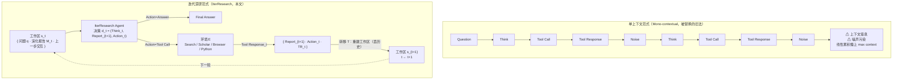

# IterResearch：把深研 Agent 重构为马尔可夫决策过程，用「周期性工作区重建」把交互扩到 2048 步

> **本篇属 agent-harness 库 D 组（记忆/上下文），主打 harness 六层里的 C 层（Context）。**
> 它回答一个非常"打到我们自己身上"的问题：**当一个 agent 要跑几百上千轮工具调用时，历史该往哪放？**
> 主流答案是"全塞进一个不断变胖的上下文窗口"（mono-contextual，单上下文范式）；本文的答案是——**别堆，重建**：
> 把深研形式化成马尔可夫决策过程（MDP），每一轮丢掉全部原始历史、只保留一个由 LLM 自己合成的**精简工作区**。
> 这正是我们 Claude Code compaction / 上下文压缩的"进阶版"，所以 Inspires-Us 一节会把它直接落到我们的循环组件上。

---

## §1　TL;DR（一页讲清这篇在干嘛）

> 主讲提示：开场先把"痛点—新范式—惊人数字"三句话钉死，再点明它在 harness 六层里坐哪一层。

**一句话**：现有深研 agent（deep-research agent）几乎都用**单上下文范式（mono-contextual paradigm）**——把每一次检索、每一步中间推理都**线性追加**到同一个不断膨胀的上下文窗口里。这会导致两个必然的病（§1 原文）：**(1) 上下文窒息（context suffocation）**——窗口被历史填满，留给"当前这一步推理"的空间越来越小，回答被迫草率收尾；**(2) 噪声污染（noise contamination）**——早期的无关搜索结果、探索错误被**永久焊死**在上下文里，级联干扰整条推理链。

IterResearch 的解法是**换范式，不是换模型**：把深研建成一个 **MDP**，核心是**周期性工作区重建（iterative workspace reconstruction）**——每一轮（round）都**从零重建**一个只含三样东西的精简工作区：① 恒定的问题 $q$；② 一份由 agent 自己持续改写的**演化报告 $\mathcal{M}_t$**（当作压缩记忆）；③ 上一步的即时交互 $\{a_{t-1}, \mathrm{TR}_{t-1}\}$。历史轨迹被**故意丢弃**，只有被报告吸收的知识才留下。配套用 **EAPO（Efficiency-Aware Policy Optimization，效率感知策略优化）** 做强化学习训练。

**三条带走的结论**：

- **属于 harness 的哪一层（Θ1）**：本篇死磕 **C 层（Context 上下文/记忆）**——它不是造新工具（C 组是工具）、不是改控制循环拓扑（B 组），而是**重新设计"状态里装什么"**。对其它层的依赖：它内建一个固定的 **L 层控制循环**（Algorithm 1 的 while 循环 + 自主终止）、一套固定的 **T 层工具**（Search / Scholar / Visit / Python，§C.2），但这些都是"载体"，真正的创新在 C 层的**状态表示**。
- **回扣全库论点（Θ2）**：这是 `Agent = Model + Harness` 里 **Harness 侧"上下文管理"这一格**的强证据——**同一个骨座模型（Qwen3-30B-A3B）**，只是把"历史怎么存"从线性堆叠换成 Markov 重建，六个 benchmark 平均涨 **+14.5pp**（Table 1）；更狠的是**免训练**地把 IterResearch 当**提示策略**套在 o3 / DeepSeek-V3.1 上，就能比 ReAct 高最多 **+19.2pp**（Figure 4）——**模型没动，动的只是"上下文范式"这个 harness 组件**。
- **够新够权威（Θ4）**：**ICLR 2026 会议论文**（首页 "Published as a conference paper at ICLR 2026"），出自**阿里通义实验室**的深研 agent 家族（与本课 auto-research 库里的 **WebSailor / WebResearcher / Tongyi DeepResearch** 同门，§2、参考文献）。它最大的"新"是**首次把交互扩到 2048 轮**并给出完整的"交互轮数-性能"曲线（§4.4）——这是单上下文范式在结构上**做不到**的。

---

## §2　问题与动机：为什么"线性堆历史"必然会崩

> 主讲提示：这一页用 Why 三连的"问题层"。别急着讲 MDP，先把"单上下文范式为什么是死路"讲到听众点头。

**Why（问题层）——不解决会卡住什么？谁受影响？证据是什么？**

深研 agent 代表 LLM 的一次范式转移：从"模型自己肚子里掏知识"转向"**通过对外部源的动态推理来构建知识**"（§1 原文）。前沿闭源系统（OpenAI Deep Research、Gemini、Perplexity、Anthropic）已在长程任务上показ出强能力。但当前主流开源做法（论文点名 WebThinker、Tao et al.、Li et al. 等，§1/§2）**都栽在同一个坑**——单上下文范式：把所有检索到的信息和中间推理步骤，**持续追加**到一个"单一、不断扩张的上下文窗口"。

这个看似最省事的做法，**从根上削弱了长程任务所需的"持续推理能力"**（§1 原文 "fundamentally undermines the sustained reasoning capabilities"），有两个具体病理：

1. **上下文窒息（context suffocation）**：随着窗口被所有历史交互填满，"留给当前这一步模型推理的可用空间逐步收缩，逼着模型给出越来越受限的回应，最终退化成过早或肤浅的结论"（§1 原文）。
2. **噪声污染（noise contamination）**：来自网页搜索的无关信息、早期探索的错误，会被**永久嵌入**上下文，形成级联干扰，"在整个推理过程中稀释信号质量"（§1 原文）。

> **读出什么**：这两个病的共同根源是——**单上下文范式把"记忆"等同于"完整流水账"**。流水账越长，(a) 当前推理越挤、(b) 噪声越多。而长程任务恰恰需要跑很多轮，于是"轮数越多 → 越崩"，形成一个**结构性上限**。这就是为什么本文说单上下文范式"结构上不可能"扩到 2048 轮（§1）——不是模型不够强，是**容器装不下**。

**这和我们（Claude Code）有什么关系？** 我们自己就活在这个坑边上：ReAct 循环里每一步的 `观察` 都堆进上下文，长会话必须靠 **compaction（上下文压缩）** 续命。本文相当于把"到底该压缩成什么、什么时候压"这件事，从工程 trick 上升成了一个**有 MDP 理论支撑的范式**——见 §12 Inspires-Us。

---

## §3　研究问题与核心 intention（形式化成一句话）

> 主讲提示：把整篇的赌注浓缩成一句可证伪的话，后面所有实验都在验它。

**核心 intention（论文 §1 的 key insight）**：**有效的长程研究，需要的是"周期性综合 + 策略性遗忘"（periodic synthesis and strategic forgetting）——而这恰恰是单上下文范式所缺的能力。**

把它形式化成一句可证伪的假设：

> **H：若把深研的"状态"从『线性累积的全历史』改为『每轮重建的、大小恒定的精简工作区（问题 + 演化报告 + 上一步交互）』，则 agent 的推理质量将不再随交互轮数增长而退化，从而使"交互轮数"成为一个可以一路加到几千、且性能单调上升的旋钮（interaction scaling）。**

- 若 H 真：应看到"轮数↑ → 性能↑"的曲线（§4.4 要验的），且这条曲线在单上下文范式里根本画不出来（会先 OOM/退化）。
- 若 H 假：重建工作区会因为"丢了历史细节"而掉分，长轮数不会带来收益。

论文用两组实验回答：**作为被训练的 agent**（Table 1 主结果、Table 2 消融）和**作为免训练的提示策略**（Figure 4）。

---

## §4　相关工作定位：它站在谁肩上、跟谁划清界限

> 主讲提示：一张表讲清"RAG → 单上下文深研 → IterResearch"的三级跳，以及和"显式记忆模块"路线的分野。

论文 §2 + 附录 A 把自己放进两条脉络里：

| 路线 | 代表工作（论文引用） | 怎么管"历史/记忆" | IterResearch 的差异 |
|---|---|---|---|
| **RAG（检索增强生成）** | Nakano 2021、Asai 2024、RankRAG… | 静态检索库（多为 Wikipedia），一次性取回拼进上下文 | RAG 探索空间受限、不适合"要动态多轮收集"的长程任务（§2） |
| **单上下文深研 agent** | WebThinker、Search-o1、DeepResearcher、Tao et al.、Li et al.（**同为通义/开源系**） | **线性追加**全部检索+推理到一个膨胀窗口 | 本文正面替换它：用 **MDP + 工作区重建**消掉"累积导致的退化"（§2 结尾） |
| **显式记忆模块/记忆 OS** | MemoryLLM、MEM1、Memory-R1、MemAgent、MemOS、MemGPT 系（附录 A） | 独立的记忆存储/检索模块、记忆操作系统，在**固定上下文窗口内**优化"存/取" | 本文**不外挂记忆库**：记忆就是那份**演化报告 $\mathcal{M}_t$**，"通过 agent 的结构化决策被无缝更新"，让记忆演化**内生地与研究轨迹对齐**（附录 A 原文） |
| **收敛式迭代范式（跨域）** | **AlphaEvolve**（Novikov 2025，编码/算法发现） | 维护"主目标 + 演化报告（高层想法）+ 即时上下文（代码）"，接收单测验证 | 附录 A 说这是**"收敛演化"的旁证**：两个完全不同的长程域（算法发现 vs 网页研究）**独立地**收敛到"演化报告式迭代综合"，强化了"这是通用解而非小众技巧"的论点 |

> **读出什么（对 D 组的意义）**：本库 D 组多是"给 agent 加一个记忆部件"的路线（MemGPT 式分页、外挂向量库）。IterResearch 是**另一种哲学**——**不加部件，改状态定义**：让"当前状态"本身就是"被压缩过的记忆"，从而在**架构层**就杜绝了膨胀。这与 auto-research 库的 WebSailor（`2507.02592`，同为通义系、专攻超难网页推理）是**同一支团队在"上下文/记忆"维度的推进**。

---

## §5　方法总览（big picture）：一图看懂"堆历史" vs "重建工作区"

> 主讲提示：这页只讲直觉，先不写公式。把 Figure 2 的"上下"两条路对照讲清就够了。

论文 Figure 2 把两种范式并排画（对照复刻如下）：

**直觉三句话**：
1. **旧法（上）**：一条越拉越长的链，`Think→Call→Response→Noise` 无限追加，直到撞上 `max context length` → 窒息 + 污染。
2. **新法（下）**：每一轮 agent 只面对一个**大小恒定**的工作区；它输出一个三件套决策 `(想什么, 改写后的报告, 下一动作)`；环境返回工具响应后，转移函数 $\mathcal{T}$ **把工作区重建**成"问题 + 新报告 + 这一步交互"——**上一轮的原始历史被扔掉**，只有被写进报告的知识活下来。
3. **为什么这叫 Markov（马尔可夫）**：因为"下一状态"只依赖"当前状态 + 当前决策 + 当前环境反馈"，**与更早的历史无关**（无记忆性）——这是 MDP 的定义性质，也是"可以无限往后跑"的数学根据。

---

## §6　符号与术语表（后文所有公式都用这套记号）

> 主讲提示：这页是"公式前先定义符号"的集中兑现。讲的时候可以只点 5 个核心记号（状态、报告、决策、转移、奖励），其余留作查阅。

论文把 IterResearch 定义为一个 MDP 五元组 $\langle \mathcal{S}, \mathcal{D}, \mathcal{E}, \mathcal{T}, R\rangle$（§3.1.1）。逐个定义：

| 记号 | 含义（先定义，后文才用） |
|---|---|
| $q$ | **问题（question）**，任务目标，全程恒定不变 |
| $t$ | **轮次（round）**下标，从 0 开始；一轮 = 一次"决策 + 环境交互" |
| $s_t \in \mathcal{S}$ | **状态 = 工作区（workspace）**：$s_t=(q,\ \mathcal{M}_t,\ \{a_{t-1},\mathrm{TR}_{t-1}\})$，即 agent 的"显式工作台"，是研究历史的**合成表示** |
| $\mathcal{M}_t$ | **演化报告（evolving report）**，充当"先前已验证发现的**压缩记忆**"；由 agent 自己在决策里改写 |
| $\{a_{t-1},\mathrm{TR}_{t-1}\}$ | **即时上下文**：上一步的动作与工具响应（只留一步） |
| $d_t \in \mathcal{D}$ | **决策（decision）**，策略 $\pi$ 生成的复合输出，含三段：$d_t=(\mathrm{Think}_t,\ \mathcal{M}_{t+1},\ a_t)$ |
| $\mathrm{Think}_t$ | **内部思考（internal thought）**，本轮推理草稿（不进入下一状态，属"一次性"） |
| $a_t$ | **外部动作（external action）**：要么是一次工具调用，要么是 `answer`（终止并给最终答案） |
| $\mathcal{E}$ | **环境（environment）**：沙箱化的工具集（Search/Scholar/Browser/Python）+ 其暴露的资源 |
| $\mathrm{TR}_t$ | **工具响应（tool response）**：$\mathrm{TR}_t \sim \mathcal{E}(\cdot\mid a_t)$，环境对动作 $a_t$ 的（随机）返回 |
| $\mathcal{T}$ | **转移函数（transition）**：$s_{t+1}=\mathcal{T}(s_t,d_t,\mathrm{TR}_t)$，**确定性地重建**工作区 |
| $R,\ R_T$ | **奖励**：仅在终止步 $T$ 给二元信号 $R_T\in\{0,1\}$（对 =1，错 =0） |
| $\gamma$ | **折扣因子（discount factor）**，$\gamma\in(0,1)$，本文取 $0.995$（§B.1） |
| $\pi_\theta$ | 参数为 $\theta$ 的**策略（policy）**，即被训练的 agent 模型 |
| $\tau$ | 一条**轨迹（trajectory）** $\tau=\{(s_0,d_0,\mathrm{TR}_0),\dots,(s_T,d_T)\}$，$a_T=\texttt{answer}$ 时终止 |
| $T_{\max}$ | **最大轮数上限**（forced termination 的闸门）；训练固定 32，推理按 benchmark 调 |

> **一句话记忆法**：**状态=工作区**，**记忆=报告**，**决策=(想, 改报告, 动作)**，**转移=把工作区重建（丢历史）**，**奖励=终点对错**。抓住这五个，后面公式全通。

---

## §7　方法细节 ①：MDP 形式化——把"状态"重新定义，是全篇的地基

> 主讲提示：这是全篇最该讲透的一组公式。每个式子都按"直觉→符号（已在 §6 定义）→公式→读出什么"来。核心就一句：**让状态大小恒定，且只依赖当前状态。**

### 7.1 决策空间 $\mathcal{D}$：一次输出"想 + 改报告 + 动作"

**直觉**：为什么要把"改写报告"塞进 agent 的**同一次输出**里？因为这样"记忆更新"就成了 LLM **原生生成能力的一部分**，不需要任何外挂算法去决定"该记什么"——报告是 LLM 自己顺手写出来的（§3.1.2 原文 "naturally generated by the LLM"）。

公式（Eq. 1）：

$$d_t = \big[\ \underbrace{\mathrm{Think}_t,\ \mathcal{M}_{t+1}}_{\text{Internal Thought}},\ \underbrace{a_t}_{\text{External Action}}\ \big] \sim \pi(\cdot\mid s_t)$$

**读出什么**：一次策略调用同时吐出三样——本轮思考 $\mathrm{Think}_t$、**下一轮要用的新报告** $\mathcal{M}_{t+1}$、外部动作 $a_t$。注意 $\mathrm{Think}_t$ 是"一次性草稿"（不进下一状态），而 $\mathcal{M}_{t+1}$ 是"要传下去的记忆"——这两者的**显式分离**，正是"内部思考更新"与"外部环境交互"解耦的关键（§3.1.1 原文 "explicitly separates internal thought updates from external environmental interactions"）。

### 7.2 环境与奖励：终点才给分

**直觉**：为什么奖励只在终点给（terminal-only）？因为在深研里，"某一次搜索查询到底值多少分"极难判定（§3.2.1 原文），与其瞎给中间奖励，不如只认最终答案对不对。

$$R(s_t,a_t)=1 \iff a_t \text{ 是被 oracle 判定为正确的终止答案}；\quad \text{否则 } 0$$

**读出什么**：这是一个**稀疏、二元**的奖励。它简单、无偏，但也带来"所有成功轨迹被一视同仁"的问题——这正是 §8 EAPO 要补的漏洞。

### 7.3 转移函数 $\mathcal{T}$：确定性地**重建**，而非追加

**直觉**：这是 IterResearch 的"心脏"。旧法是 `state ← state + 新历史`（追加）；本文是 `state ← 全新重建`（只装三样）。

公式（Eq. 2）：

$$s_{t+1}=\mathcal{T}(s_t,d_t,\mathrm{TR}_t)=\big(q,\ \mathcal{M}_{t+1},\ \{a_t,\mathrm{TR}_t\}\big)$$

**读出什么**：$s_{t+1}$ **只**依赖当前状态 $s_t$（经由决策 $d_t$）和即时反馈 $\mathrm{TR}_t$——**严格满足马尔可夫性**（§3.1.2 原文 "strictly adhering to the MDP intuition"）。历史轨迹 $(s_0,d_0,\mathrm{TR}_0,\dots,s_{t-1},d_{t-1},\mathrm{TR}_{t-1})$ 被**故意丢弃**，只有综合进 $\mathcal{M}_{t+1}$ 的知识保留。

### 7.4 完整过程：一个三步循环

论文把整条研究过程写成 Eq. 3（三步循环，$\mathrm{TR}_t=\mathcal{E}(a_t)$，初始 $s_0=(q,\mathcal{M}_0,\varnothing)$、空报告 $\mathcal{M}_0$）：

$$\begin{cases}\textbf{Policy Step:} & (\mathrm{Think}_t,\mathcal{M}_{t+1},a_t)\sim\pi(\cdot\mid s_t)\\[2pt]\textbf{Environment Step:} & \mathrm{TR}_t\sim\mathcal{E}(\cdot\mid a_t)\\[2pt]\textbf{State Update:} & s_{t+1}\leftarrow(q,\mathcal{M}_{t+1},\{a_t,\mathrm{TR}_t\})\end{cases}$$

### 7.5 关键对照：$O(t)$ 增长 vs $O(1)$ 恒定

**直觉**：把"两种范式的状态长什么样"并排写出来，一眼看清"膨胀 vs 恒定"。

公式（Eq. 4）：

$$\underbrace{s_t^{\text{mono}}=[q,a_0,\mathrm{TR}_0,\dots,a_{t-1},\mathrm{TR}_{t-1}]}_{\text{单上下文：}\ \mathcal{O}(t)\ \text{线性增长}}\quad \text{vs.}\quad \underbrace{s_t^{\text{iter}}=(q,\mathcal{M}_t,\{a_{t-1},\mathrm{TR}_{t-1}\})}_{\text{IterResearch：}\ \mathcal{O}(1)\ \text{恒定}}$$

**读出什么**：单上下文状态维度 $|s_t|\propto t$（轮数越多越胖），本文 $|s_t|\approx \mathcal{O}(1)$（恒定）。**这就是"理论上可无限探索"的根据**——只要报告大小有界，状态就永远撞不上上下文上限。

> **Why 三连 · 设计层（本篇必答的高价值一层）**
> **朴素替代方案 A：直接扩大上下文窗口**（把 40K 换成 128K/1M）。→ 会因为 §4.2 实测的**"workspace suffocation 根本不是窗口大小问题"**而失败：论文特意给单上下文基线用 **64K** 窗口（比 IterResearch 的 40K 还大），结果它仍比 IterResearch 平均低 **12.6pp**（Table 2）。**结论：扩窗口治标不治本**（§4.2 原文 "simply expanding the context window cannot resolve this limitation"）。
> **朴素替代方案 B：外挂一个记忆模块/向量库**（MemGPT / MemOS 式）。→ 会引入"独立记忆模块的存取开销"，且记忆演化与研究轨迹**不对齐**（附录 A 原文）。本文让报告 $\mathcal{M}_t$ **内生于 agent 的结构化决策**，消掉了这层开销，并保证"记忆演化 ⟺ 研究进展"天然对齐。
> **本文为何更优**：改的是**状态定义**（架构层），不是**容量**（工程层）或**外设**（模块层）。只有从状态定义上把 $|s_t|$ 压成 $\mathcal{O}(1)$，才能同时干掉窒息、污染、和轮数上限三件事。

---

## §8　方法细节 ②：EAPO——不仅要探得深，还要探得省

> 主讲提示：这页讲"训练层的 why"。核心：稀疏 0/1 奖励会纵容"绕远路的成功"，用几何折扣制造"越早做完越值钱"的隐式压力。

### 8.1 折扣奖励塑形（Discounted Reward Shaping）

**Why（问题层）**：终点二元奖励 $R_T\in\{0,1\}$ **把所有成功轨迹一视同仁**（§3.2.1 原文 "treats all successful trajectories equally regardless of their computational cost"）。可现实里，"5 步精准命中答案"应该远优于"20 步东绕西绕最后也蒙对"——因为每一次交互都烧 API 成本、加延迟。

**Why（设计层）**：朴素替代是**加一个显式长度惩罚项**（如 `reward − λ·步数`）。→ 会引入额外超参 $\lambda$、且和主奖励耦合、调不好会压制必要探索。本文改用**标准 episodic 强化学习的几何折扣**（Sutton & Barto 2018），**不加任何显式长度惩罚或辅助目标**（§B.1 原文），让"效率压力"作为几何折扣的**内生副产品**自然涌现。

公式（Eq. 5）：

$$r_t=\gamma^{\,T-t}\cdot R_T,\qquad \gamma\in(0,1)$$

符号：$T$ 终止步，$t$ 当前步，$\gamma$ 折扣因子（本文 $0.995$）。

**读出什么**：对成功轨迹（$R_T=1$），越靠近终点的步（$T-t$ 越小）拿到的折后奖励越高；轨迹越长，同一"步位置"拿到的奖励越低。于是策略被**隐式地**推向"更短、更直接"的探索。附录 B.1 给了个量化微例（Eq. 8-11）：两条成功轨迹 $\tau_A$（5 步）vs $\tau_B$（20 步），在同为第 $t=3$ 步时，$r_3^A=\gamma^{2}\approx0.99$、$r_3^B=\gamma^{17}\approx0.918$——**同一步位置差 7.8% 奖励**，这个持续的乘性优势，一路把策略往"高效"方向拽。

> **读出什么（机制）**：这套设计的妙处是"**用旧工具（几何折扣）解决新问题（效率）**"，代价仅是一个超参 $\gamma$；$\gamma$ 越接近 1 越鼓励探索，越小越逼直给。$\gamma=0.995$ 是作者调出的平衡点，其效果由 §4.3 消融验证——EAPO 比标准 GSPO **少用 5.7% 的平均轮数**却不掉准确率。

### 8.2 多轮轨迹的策略优化 + 自适应下采样

**Why（问题层）**：本文的迭代范式有个"甜蜜的副作用"——**一条轨迹天然拆成多个独立训练样本**（每轮一个 $(s_{i,t},d_{i,t})$ 对），而单上下文范式一条轨迹通常只出一个样本。这让训练语料暴涨，但也带来"每题样本数不定"的分布式训练难题。

**Why（设计层）**：朴素替代是**丢弃多余样本对齐**。→ 会浪费大量宝贵轨迹数据。本文用**自适应下采样（adaptive downsampling）**：把语料截到"数据并行规模的最大整数倍"，**保留 >99% 的样本**（§3.2.2 原文 "typically < 1%" 损失）。

公式（Eq. 6，下采样后语料量）：

$$|\mathcal{C}_{\text{train}}|=\Big\lfloor \frac{|\mathcal{C}|}{\mathrm{DP}_{\text{size}}}\Big\rfloor \times \mathrm{DP}_{\text{size}}$$

符号：$|\mathcal{C}|$ 原始语料量（对每题做 $G$ 次 rollout、每条轨迹 $T_i$ 轮，$\sum_{i=1}^G T_i$ 个样本），$\mathrm{DP}_{\text{size}}$ 数据并行大小。

最终目标函数建在 **GSPO（Group Sequence Policy Optimization，Zheng et al. 2025a）** 之上（Eq. 7）：

$$\mathcal{J}(\theta)=\mathbb{E}_{q\sim\mathcal{Q},\,\mathcal{C}_{\text{train}}\sim\pi_{\theta_{\text{old}}}(\cdot\mid q)}\left[\frac{1}{|\mathcal{C}_{\text{train}}|}\sum_{i=1}^{G}\sum_{t=1}^{T_i}\min\!\big(\rho_{i,t}(\theta)\hat A_{i,t},\ \mathrm{clip}(\rho_{i,t}(\theta),1-\varepsilon,1+\varepsilon)\hat A_{i,t}\big)\right]$$

符号：一个问题 $q$ 的 $G$ 条轨迹的全部 $\sum_i T_i$ 轮构成**一个 group**；组内归一化优势 $\hat A_{i,t}=\frac{r_{i,t}-\mu_r}{\sigma_r}$（$\mu_r,\sigma_r$ 为组内奖励均值/标准差）；$\rho_{i,t}(\theta)$ 是基于序列似然的重要性比（importance ratio）；$\varepsilon$ 为裁剪阈。**EAPO = 几何折扣奖励（Eq. 5）+ 自适应下采样（Eq. 6）搭在 GSPO 上**。

**读出什么**：这是一个 **PPO 家族**（min-clip 目标）的**组相对**变体——用组内归一化优势代替 critic，稳定且省显存。它专门被改造来"消化"迭代范式产出的**变长、多样本**轨迹结构。

---

## §9　实验设置：数据集 / baseline / 指标 / 超参 全表

> 主讲提示：这页是"setting/metrics/params 写全"的兑现。指标定义式一定要念出来（准确率、Tmax、token 预算的口径）。

**骨座模型**：**Qwen3-30B-A3B**（Yang et al. 2025，MoE，激活参数约 3B，故命名 30B-**A3B**），兼顾性能与算力（§4.1）。

**训练两阶段**（§4.1 + §C.3）：
- **Stage 1 · 监督预热（SFT / RFT）**：先用**拒绝采样微调（rejection sampling fine-tuning）**给模型装上迭代深研的行为。数据：从多个网页研究数据集（Li 2025a、Tao 2025、Chen 2025c、Qiao 2025）**筛出 30K 高质量 QA**（按答案质量、事实准确、需真多步调查过滤）→ 用 **Qwen3-235B-A22B** 合成 **110K 轨迹**（平均 **3.7 轮/条**）。SFT 超参（Table 4）：LR 1e-5、batch 512、3 epochs、**最大上下文 40960**、warmup 0.03、cosine 调度、框架用 **Slime**（THUDM/slime）。
- **Stage 2 · 强化学习**：从 30K 里做**难度校准**（每题 5 次独立试跑记成功率）→ **学习区间筛选**：只留成功率 **20%–60%**（5 次里对 1–3 次）的 **4,096 题**，落在模型的"最近发展区（zone of proximal development）"——太易（>60%）信号弱、太难（<20%）奖励稀疏训练不稳。RL 超参（Table 5）：LR 1e-6、batch 16、**组大小 $G$=16**、temperature 1.0、top-p 0.95、**KL 系数 λ=0、熵系数=0**、最大上下文 40960、**训练 $T_{\max}$=32**。

**指标定义（§4.1）**：
- **准确率（Accuracy, %）**：主指标，Table 1 报的就是各 benchmark 上"最终答案被判定正确的比例"。用 **LLM-as-judge** 判对错（§C.3，Eq. 12：$R_T=1$ 若答案正确，否则 0，评委用 **Qwen3-235B-A22B**）。
- **$T_{\max}$（最大交互轮数）**：**任务自适应**（Table 6）——训练=32；推理：GAIA=32、HLE=64、BC-zh=64、**BrowseComp=256**（越长程越放宽）。
- **平均生成 token（Avg. Tokens, Table 7）**：口径是**只算 agent 自己"Think + Report"消耗的生成 token，剔除工具返回内容**（网页/搜索结果不计），反映"内部推理的真实算力成本"。

**六个 benchmark**（§4.1，覆盖多步工具用、网页导航、复杂推理、跨语言综合）：
- **HLE**（Humanity's Last Exam，Phan 2025）— 极难学术推理
- **BrowseComp（BC）** / **BrowseComp-zh（BC-zh）**（Wei 2025a / Zhou 2025a）— 高强度网页浏览（英/中）
- **GAIA**（Mialon 2023）— 通用助手长程任务
- **Xbench-DeepSearch（Xbench-DS）**（Xbench-Team 2025）
- **SEAL-0**（Pham 2025）

**baseline 三类**（§4.1）：① **直接推理**（GPT-4o、GPT-4.1、o4-mini、DeepSeek-R1-0528，均无工具）；② **闭源深研系统**（OpenAI DeepResearch、Perplexity、Gemini DeepResearch、Grok3-ResearchSearch、Kimi-Researcher）；③ **开源 agent**（Search-o1、WebThinker、WebDancer、Asearcher、WebSailor-32B/72B、MiroThinker-14B/32B）。

---

## §10　主要结果：换范式 = +14.5pp；免训练当提示 = +19.2pp

> 主讲提示：这是全场停留最久的两张图表。先念 Table 1 的平均增益，再念 §4.4 的 2048 曲线，最后念 Figure 4 的"免训练也涨"。

### 10.1 Table 1（六 benchmark 主结果，准确率 %）

IterResearch-30B-A3B（"+Improvement" 为相对**最强开源基线**的涨幅）：

| Model | Tools | HLE | BC | BC-zh | GAIA | Xbench-DS | SEAL-0 |
|---|:---:|---:|---:|---:|---:|---:|---:|
| *（直接推理最好）* o4-mini | ✗ | 18.9 | 6.1 | 15.2 | 33.3 | 60.0 | 4.5 |
| *（闭源深研）* OpenAI DeepResearch | ✓ | 26.6 | **51.5** | 42.9 | **67.4** | - | - |
| *（闭源深研）* Kimi-Researcher | ✓ | 26.9 | - | - | - | **69.0** | 36.0 |
| *（开源最强之一）* MiroThinker-32B$_{v0.2}$ | ✓ | 19.1 | 17.2 | 29.4 | 64.1 | 56.0 | - |
| WebSailor-72B | ✓ | 9.8 | 12.0 | 30.1 | 55.4 | 55.0 | 19.8 |
| **IterResearch-30B-A3B** | ✓ | **28.8** | **37.3** | **45.2** | **72.8** | **71.0** | **39.6** |
| **+ Improvement（vs 最强开源）** | | ↑8.8 | ↑20.1 | ↑15.8 | ↑8.7 | ↑15.0 | ↑18.9 |

**Why 三连 · 结果层（为什么会得到这些数）**：
- **平均 +14.5pp、且在信息搜寻类（BC/BC-zh/SEAL-0）涨得最凶**（BC +20.1、SEAL-0 +18.9）。机制（§4.2）：这些任务要翻**大量网页**、边翻边综合，**最吃"上下文窒息"**；工作区重建把发现压进报告、保住推理空间，所以增益最大。
- **在复杂推理类（HLE/GAIA/Xbench-DS）也稳涨**。机制：这类任务的杀手是**噪声污染**——单上下文会把错误/无关信息一路累积；本文靠**周期性综合**提供"过滤噪声的天然断点"，只把已验证发现写进报告。
- **一个 30B 模型打平/超过闭源深研系统**：IterResearch 在 **HLE、BC-zh、Xbench-DS、GAIA、SEAL-0** 上都追平或反超 OpenAI DeepResearch / Kimi-Researcher 的部分项（§4.2 原文），**用远小的模型 + 更好的 harness 范式**逼近闭源第一梯队。

### 10.2 §4.4 交互扩展：2 → 2048 轮，3.5% → 42.5%（本篇的招牌数字）

在 **BrowseComp（200 题子集）**上，把 $T_{\max}$ 从 $2^1$ 指数增到 $2^{11}=2048$（Figure 3）：

| 最大轮数 $T_{\max}$ | 2 | 8 | 16 | 32 | 128 | 512 | 2048 |
|---|---:|---:|---:|---:|---:|---:|---:|
| 准确率 (%) | 3.5 | ~14.5 | 18.0 | 23.5 | 37.0 | 41.0 | **42.5** |

两条关键洞察（§4.4）：
1. **性能随交互预算优雅上升**：3.5%（2 轮）→ 50.1%（论文正文另称 2048 轮某设定达 50.1%；Figure 3 曲线终点标 42.5%），最陡增益在 $2^4$–$2^7$ 之间。**2048 轮对单上下文范式是结构性不可能**（灾难性上下文累积），而本文在**恒定 40K 工作区**里丝滑跑完。
2. **agent 学会"智能资源分配"**：虽给了 2048 轮预算，平均只用 **80.1 轮**——信息够了就**自主终止**，不把预算耗光；且平均轮数增长**次线性**于预算，说明"探索深度自然对齐任务复杂度"（越难才多探）。

> **读出什么（Θ2 实锤）**：这条曲线是 `Agent = Model + Harness` 里 **"上下文范式"这一 harness 组件价值**的最强单点证据——**从 3.5% 到 42.5%，模型一个参数没变，变的只是"历史怎么存"**。它把"harness 决定能力"从轶事升级成一条**可复现的量化曲线**（对照标杆 Harness-Bench 的 23.8 分极差，这里是 **39 个百分点的跨度**）。

### 10.3 Figure 4 免训练当"提示策略"：o3 / DeepSeek-V3.1 直接涨

把 IterResearch **不做任何训练**、纯当提示范式，套在前沿模型上对比 ReAct（Yao 2023）：

| 模型 | 任务 | ReAct（mono） | IterResearch（prompt） | 增益 |
|---|---|---:|---:|---:|
| **o3** | HLE | 20.2 | 24.6 | +4.4 |
| **o3** | BrowseComp | 49.7 | 62.4 | **+12.7** |
| **o3** | GAIA | 70.5 | 73.8 | +3.3 |
| **DeepSeek-V3.1** | BrowseComp | 30.0 | 49.2 | **+19.2** |
| **DeepSeek-V3.1** | GAIA | 55.7 | 70.9 | +15.2 |

**读出什么**：**最长程的 BrowseComp 上增益最大**（o3 +12.7、DeepSeek +19.2），且**跨两种截然不同的模型架构都涨** → 说明 IterResearch 攻的是"当前模型处理长推理链的**通用**缺陷"，而非某个模型的特性（§4.5 原文 "model-agnostic"）。**这条对 Θ2 尤其关键**：连训练都省了，光换个"上下文组织方式"的 harness 提示，就能给闭源前沿模型加成——**harness 组件的边际价值，在长程 regime 下不降反升**。

---

## §11　消融与复杂度分析：哪一块贡献多少

> 主讲提示：这页把"范式 vs 扩窗口""EAPO vs GSPO vs SFT"两组对照讲清，再用复杂度表收口"为什么理论上能无限跑"。

### 11.1 Table 2 上半：训练方法消融（EAPO 的价值）

| 方法 | HLE | BC | BC-zh | GAIA | Xbench-DS | SEAL-0 | **Avg** | 平均轮数 |
|---|---:|---:|---:|---:|---:|---:|---:|---:|
| **IterResearch-EAPO** | 28.8 | 37.3 | 45.2 | 72.8 | 71.0 | 39.6 | **49.1** | **18.04** |
| IterResearch-GSPO | 28.2 | 38.3 | 45.6 | 70.9 | 67.0 | 39.6 | 48.3 | 19.13 |
| IterResearch-SFT | 25.3 | 34.9 | 40.8 | 68.9 | 65.0 | 37.8 | 45.5 | 16.45 |

**读出什么**：EAPO vs GSPO 准确率相当（49.1 vs 48.3），但 **EAPO 平均少用 5.7% 轮数**（18.04 vs 19.13）——**验证"几何折扣真的把策略推向更高效的研究策略"**（§4.3）。SFT 打底（45.5）到 RL 有明显跃升。

### 11.2 Table 2 下半：范式消融（跨范式知识迁移，最有意思的意外发现）

用**完全相同的训练数据**，比"迭代范式 vs 单上下文范式（Mono-Agent）"：

| 设置 | HLE | BC | BC-zh | GAIA | Xbench-DS | SEAL-0 | Avg |
|---|---:|---:|---:|---:|---:|---:|---:|
| Mono-Agent（单上下文，**给 64K 窗口**） | 18.7 | 25.4 | 34.6 | 62.1 | 55.0 | 23.4 | 36.5 |
| **Mono-Agent + Iter（掺入迭代范式轨迹）** | 25.4 | 30.1 | 40.4 | 63.1 | 62.0 | 30.6 | 41.9 |
| **+ Improvement** | ↑6.7 | ↑4.7 | ↑5.8 | ↑1.0 | ↑7.0 | ↑7.2 | **↑5.4** |

**两个读点**：
1. **迭代范式 > 单上下文范式 平均 12.6pp**（IterResearch-EAPO 49.1 vs Mono-Agent 36.5），**且这是在给单上下文基线更大的 64K 窗口（vs 本文 40K）的情况下**——**铁证"扩窗口救不了 workspace suffocation"**（§4.2）。
2. **跨范式知识迁移（意外发现）**：把**迭代范式产出的轨迹**掺进单上下文 agent 的训练数据（总量不变），单上下文 agent 也涨 **+5.4pp**（§4.2）。说明**迭代范式诱导出的"探索行为"本身质量更高**，其训练信号**部分可迁移**到范式不同的 agent 上。

### 11.3 Table 3 计算复杂度：为什么"理论上无限"

论文用一张表把两范式的复杂度并列（$t$=轮数，$|\mathrm{TR}|$=平均工具响应大小，$|\mathcal{M}|$=有界报告大小，$L$=模型上下文上限）：

| 指标 | 单上下文 Mono | **IterResearch（本文）** |
|---|---|---|
| 已用上下文大小 | $O(t\cdot|\mathrm{TR}|)$ | $O(|\mathcal{M}|+|\mathrm{TR}|)$ |
| 注意力计算 | $O((t\cdot|\mathrm{TR}|)^2)$ | $O((|\mathcal{M}|+|\mathrm{TR}|)^2)$ |
| 有效推理窗口 | $O(\max(0,\ L-t\cdot|\mathrm{TR}|))$ | $O(L-|\mathcal{M}|-|\mathrm{TR}|)$ |
| 最大轮数 | $O(L/|\mathrm{TR}|)$（硬上限） | $O(\infty)$（理论无界） |

**读出什么**：单上下文的"有效推理窗口"随 $t$ **线性缩小**、$t\cdot|\mathrm{TR}|>L$ 时**直接溢出**；本文四项全是**与 $t$ 无关的常数**，只要 $|\mathcal{M}|+|\mathrm{TR}|<L$ 就能**无限往后跑**。§B.3 进一步指出：本文训练只用 $T_{\max}=32$，推理却能外推到 **2048（64× 外推）**，因为决策**只依赖重建状态、不依赖绝对位置 $t$**（position-agnostic），躲开了单上下文的三个外推杀手：**位置编码溢出、注意力模式坍塌、上下文饱和**。

---

## ★ 对我们的启发（Inspires Us）

> 这一节是组会高潮，也是本库相对 auto-research 的独门优势：**我们（Claude Code / 本课 m9.* 的 agent）本身就是一个 harness**——
> 而 IterResearch 攻的正是我们每天在用的东西：**长会话里"历史往哪放"**。我们现在靠 **compaction（上下文压缩）** 硬扛，而本文把 compaction 从"工程 trick"升级成了"有 MDP 理论根据的范式（周期性重建精简工作区）"。所以下面每条都能**直接打到我们自己的循环组件上**。

➤ **a. 可直接借用的招（Θ3 打到我们 harness 的具体组件）**：把 IterResearch 的**"每 N 步周期性重建工作区"**接到我们的 **compaction 策略**上。我们现在的 compaction 更像"上下文快满了才被动触发一次总结"；本文给的是**主动、周期性、且大小恒定**的重建——每一轮都强制把状态收敛成"**任务 + 一份 agent 自己维护的演化报告 $\mathcal{M}_t$ + 上一步交互**"三件套。**具体第一步**：在我们的 ReAct 循环里加一个 `WorkspaceReconstruct` 节点，让模型在每一步的输出里**除了 `think` 和 `action`，额外产出一段 `report`（结构化的"已确认发现 / 待验证 / 死胡同"）**，下一步的上下文**只喂这段 report + 上一条 tool 结果**，丢掉更早的原始 observation。这正是 Eq. 1 的三件套决策 $(\mathrm{Think}, \mathcal{M}_{t+1}, a)$ 搬到我们循环里。

➤ **b. 可迁移到我们课题的思路（transfer + 前提变化）**：把这套范式迁到 auto-research 库的 **`m9.*` 研究 agent**（尤其 `m9.6` 评测沙箱里的长程任务）。**迁移时要改什么**：本文奖励是**终点二元 + LLM-judge**，而我们很多研究任务**没有 oracle 判对错**——所以 EAPO 的几何折扣要能用，前提是我们先得有个"终点信号"（哪怕是"是否产出了合规产物"这种弱信号）。**什么前提不再成立**：本文 $|\mathcal{M}|$ 有界靠"LLM 顺手压缩"，但如果任务的"必须记住的事实数"本身超过报告容量（例如要综合 200 篇文献的细节），$O(1)$ 假设会破——这时得退化成"报告 + 外挂只读事实库"的混合，才是诚实的做法。

➤ **c. 它暴露的开放问题 = 我们的机会（open problem → 第一步）**：本文的**报告 $\mathcal{M}_t$ 是个"黑盒信任"——它假设 LLM 每轮都能忠实地把"该留的留下、该丢的丢掉"**，但论文**没有给"报告有没有丢掉关键信息"的任何度量**（原文未给出报告保真度指标）。这正是我们的机会：设计一个**"重建保真探针"**——在重建前后，用一组"关键事实 recall 探针"检查"上一轮工具响应里的关键实体，是否被写进了新报告"。**可下手的第一步**：在我们的 compaction 前后各跑一次"实体/数字抽取"，算 `重建后保留率`，若某类事实（如数值、URL）保留率低，就在 compaction 提示里显式要求"逐字保留数字与来源"。这直接呼应标杆 Harness-Bench 里 **36.4% 的失败是"契约/格式"类**——很可能就是重建时把"机器要验的字段"丢了。

➤ **d. 与本库其它论文/模块的连接（connect the dots）**：
- **与 auto-research 库的 WebSailor（`2507.02592`，同为通义系）** 正面呼应——WebSailor 解决"超难网页推理**要多聪明**"，IterResearch 解决"这么多轮推理**历史往哪放**"；两者是**同一支团队在"能力"与"上下文"两个正交维度上的组合拳**，合起来就是 Tongyi DeepResearch 技术栈（§2 引 Tongyi DeepResearch technical report）。
- **与本库 D 组的"记忆 OS"路线（MemGPT/MemOS 系、`2512.13564` memory-in-the-age-of-ai-agents）** 形成**哲学对立**：那条路"**外挂记忆模块 + 优化存取**"，本文"**取消模块、把记忆内生成状态**"。组会可吵：**长程 agent 的记忆，到底该"外挂"还是"内生"？**
- **与本库 F 组的 AgentFold / 上下文折叠** 呼应——都在攻标杆 Harness-Bench 点出的 **"state/continuation 9.3% 失败线"**（多轮里没保住进度）。

➤ **e. 如果我来做下一步（第一人称、可执行）**：**我会在我们某个跑长任务的 agent 上，加一个 `--workspace-reconstruct` 开关**，实现"每步产出 report、下一步只喂 report + 上一条 observation"，然后在 10 个我们自己的长程任务上，对比它与现有 compaction 的 **(1) 上下文峰值 token、(2) 任务成功率、(3) 数值/URL 保真率**。**赌注**：若本文结论成立，我应看到"峰值 token 基本恒定、成功率不降、且能跑更多轮"——若保真率掉了，就正好定位到 §c 那个"报告丢字段"的开放问题，落一个"逐字保留关键字段"的补丁。

---

## §12　局限与批判（论文自陈 + 我的补充）

> 主讲提示：这页守判断力底线。既要认它的强，也要点出"它没说的"和"它可能夸大的"。

**论文自陈/隐含的边界**：
- **报告有界性是"信仰"而非"保证"**：整套 $O(1)$ 复杂度都押在"$|\mathcal{M}|$ 有界且不丢关键信息"上（§B.2）。但**论文没给"报告丢没丢东西"的任何度量**（原文未给出保真度指标）——万一某轮 LLM 把关键线索压没了，Markov 性反而意味着"**再也捞不回来**"（历史已丢）。这是"策略性遗忘"的暗面：遗忘错了，无法回溯。
- **只在一个骨座（Qwen3-30B-A3B）上端到端训练**：主结果的"换范式 +14.5pp"是在这一个模型上得的；虽然 Figure 4 用 o3/DeepSeek 补了"免训练"证据，但**"训练版"在别的骨座上能否复现同等增益，原文未给出**。
- **评委是 LLM（Qwen3-235B-A22B）**：准确率靠 LLM-as-judge（Eq. 12），继承"裁判自身偏好"的系统偏差——与标杆 Harness-Bench "谁来 judge the judge" 同一隐忧。

**我的补充批判**：
- **2048 轮的"招牌数字"要看清口径**：它是在 **BrowseComp 200 题子集**上、且 $T_{\max}$=2048 但**平均只用 80.1 轮**——所以"2048"是**能力上限的展示**，不是"真跑了 2048 轮的常态"。Figure 3 曲线终点是 **42.5%**，正文另处提到某设定 50.1%，两个数**口径需读者自行对齐**（原文表述略有出入）。
- **"跨范式迁移 +5.4pp"虽亮眼，但样本受限**：只在"同数据、掺迭代轨迹"一种配置下测（Table 2 下半），**掺入比例的敏感性、以及是否只是"多样性增益"而非"范式增益"，原文未做进一步消融**。
- **报告即记忆 = 记忆瓶颈**：把"整段研究记忆"压进一份文本报告，对**需要海量离散事实**的任务（如"核对 500 条记录"）天然吃亏——这类任务里，"外挂只读事实库"的记忆 OS 路线可能反而更稳（与 §11.2 的乐观结论构成 regime 边界）。

---

## §13　版图定位（canon/前沿坐标 + 在本库的位置 + Θ 全打点）

> 主讲提示：收尾页。把五个 Θ 一次性点清，让听众带走"这篇在坐标系里的位置"。

- **时间坐标（Θ4）**：**2026 前沿**（ICLR 2026 会议论文，通义实验室）。相对本库基石推进了哪一步——**ReAct（`2210.03629`，canon）** 奠定了"推理+行动交替"的**单上下文**循环；**IterResearch 正面升级 ReAct 的"上下文范式"**：把"线性堆历史"换成"Markov 重建工作区"，并**首次给出交互扩到 2048 轮的完整曲线**。它不是否定 ReAct 的"思考-行动"，而是换掉 ReAct 隐含的"历史全留"假设。
- **harness 分层归属（Θ1）**：坐 **C 层（Context 上下文/记忆）**——创新在"状态里装什么 + 怎么重建"。依赖固定的 **L 层循环**（Algorithm 1）和 **T 层工具**（Search/Scholar/Visit/Python），但这些是载体不是主角。
- **回扣 `Agent = Model + Harness`（Θ2）**：本篇是"**Harness 侧·上下文管理**这一格"的强证据——(a) 同模型换范式 +14.5pp（Table 1）；(b) **免训练**把范式当提示套上 o3/DeepSeek 就 +最多 19.2pp（Figure 4）；(c) 2 → 2048 轮 3.5%→42.5%（§4.4）**模型没动、只动上下文范式**。三条都指向：**"历史怎么存"是一个能独立贡献几十个百分点的 harness 组件**。
- **regime 诚实（Θ5，不绝对化）**：本文增益**分 regime**——**越长程、越信息密集（BrowseComp 类）增益越大**（+20pp 级），**越短、越偏纯语言/单跳的任务增益越小**（GAIA/HLE 仅 +8pp 级）。且它有明确**失效边界**：当"必须记住的离散事实数"超过报告容量、或任务无终点奖励信号时，"报告即记忆 + EAPO"的优势会退化。所以诚实表述是：**IterResearch 的"周期性重建"在"长程 + 可综合 + 有终点信号"的 regime 里主导；在"海量离散事实 / 无 oracle"的 regime 里，外挂记忆或其它范式可能更稳。**
- **在本库的位置**：**D 组（记忆/上下文）⭐ 前沿锚点**，也是**全库 `Agent=Model+Harness` 命题在"上下文范式"维度的量化压舱石**（与标杆 Harness-Bench 在"评测"维度互补：一个证明"换 harness 摆 23.8 分"，一个证明"换上下文范式摆 39 分"）。

---

## §14　组会讨论问题（留给大家吵）

1. **遗忘的暗面**：Markov 重建意味着"丢了就捞不回"。如果某轮报告压掉了后来才发现关键的线索，agent 无法回溯——**该不该给它留一个"只读的原始轨迹备份"当保险？** 那还算不算 $O(1)$？
2. **报告保真度没有指标**：本文全押"LLM 会忠实压缩"。**你会怎么设计一个"重建保真探针"去量化"该留的有没有留"？**（呼应 Inspires-Us c）
3. **regime 边界**：对"要核对 500 条离散记录"这种**记忆密集**任务，"报告即记忆"会不会输给"外挂只读事实库"的记忆 OS 路线？**分界线在哪？**
4. **2048 的真实价值**：平均只用 80.1 轮，那"能扩到 2048"到底是**实用能力**还是**营销数字**？什么任务真的需要几百轮以上？
5. **跨范式迁移之谜**：�'掺迭代轨迹让单上下文 agent 也涨 5.4pp'——这到底是**"范式诱导的高质量探索"**，还是仅仅**训练数据多样性**带来的？怎么做消融把两者拆开？
6. **打到我们自己**：我们的 compaction 若改成"每步周期性重建 + 演化报告"，**最可能在哪类任务上翻车**（数值密集？多文件代码？），又在哪类上大赚？

---

## §15　一页速记（汇报当天速览）

- **命题**：长程深研的瓶颈不是模型不够强，是**单上下文范式"线性堆历史"→ 上下文窒息 + 噪声污染**，且轮数有**结构性上限**。
- **新范式**：把深研建成 **MDP $\langle\mathcal{S},\mathcal{D},\mathcal{E},\mathcal{T},R\rangle$**；**状态=工作区** $s_t=(q,\mathcal{M}_t,\{a_{t-1},\mathrm{TR}_{t-1}\})$，**记忆=演化报告** $\mathcal{M}_t$，**决策**三件套 $(\mathrm{Think},\mathcal{M}_{t+1},a)$（Eq.1），**转移=确定性重建**（Eq.2，丢历史），状态大小 **$O(1)$ 恒定**（Eq.4）。
- **训练**：**EAPO** = 几何折扣奖励 $r_t=\gamma^{T-t}R_T$（Eq.5，隐式效率压力，无显式长度惩罚）+ 自适应下采样（Eq.6，保 >99% 样本）搭在 **GSPO**（Eq.7）上；骨座 **Qwen3-30B-A3B**；两阶段（SFT 110K 轨迹 → RL 4096 题"最近发展区"，$T_{\max}$=32）。
- **铁证**：(1) 六 benchmark **平均 +14.5pp**（Table 1，同模型换范式）；(2) **2 → 2048 轮 = 3.5% → 42.5%**（§4.4，单上下文结构上做不到），平均只用 80.1 轮（会自主终止）；(3) **免训练当提示**套 o3/DeepSeek 比 ReAct 高最多 **+19.2pp**（Figure 4，model-agnostic）。
- **消融**：EAPO 比 GSPO **少 5.7% 轮数**不掉准（Table 2）；迭代范式比单上下文 **+12.6pp**——**且给单上下文更大 64K 窗口也追不上**（扩窗口治不了 workspace suffocation）；迭代轨迹掺进单上下文训练，后者也 **+5.4pp**（跨范式迁移）。
- **复杂度**：单上下文 $O(t\cdot|\mathrm{TR}|)$、轮数硬上限 $L/|\mathrm{TR}|$；本文 $O(|\mathcal{M}|+|\mathrm{TR}|)$、轮数 $O(\infty)$；训练 32 轮外推到 2048（64×，position-agnostic）。
- **诚实**：报告保真无指标（遗忘错了捞不回）、单骨座训练、LLM 评委；**增益分 regime**——长程/可综合/有终点信号 → 主导；海量离散事实/无 oracle → 未必。
- **对我们（Θ3）**：这就是 **compaction 的进阶版**——给我们的 ReAct 循环加 `WorkspaceReconstruct`（每步产 report、下一步只喂 report+上一条 observation），先在 10 个长任务上测"峰值 token / 成功率 / 数值·URL 保真率"，顺手落一个"逐字保留关键字段"的补丁去打契约类失败。
