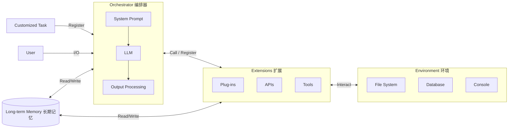
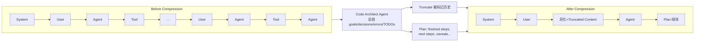

# Confucius Code Agent：面向真实大代码库的可扩展 Agent 脚手架

> **本篇属 agent-harness 库 E 组（编码集成系统），是本组的『构造端』旗舰**。它与 G 组标杆 [Harness-Bench](2605.27922-harness-bench-measuring-harness-effects.md) 恰好互补：Harness-Bench 把 harness 当**被测变量**去度量（"换 harness 摆 23.8 分"），本文则正面回答**"那到底怎么造一个能扩展到大代码库的 harness？"**。全文严格按 v1 硬规范（公式前给直觉、符号先定义、指标给定义式、数字标 §/Table/Eq 出处、区分宣称 vs 批判）+ v2（Why 三连 + Inspires-Us）+ 本库 Θ1–Θ5（E/T/C/L/O 分层、回扣 Agent=Model+Harness、Inspires-Us 打到我们自己 harness、canon/前沿坐标、regime 诚实）书写。

---

## §1　TL;DR（一页讲清这篇在干嘛）

> 主讲提示：开场先立本库中心命题——`Agent = Model + Harness`。然后一句话说清：这篇是"用同一个模型，把脚手架做到极致"的正面样板，而且它把结论钉在了一个业界最难的公开榜（SWE-Bench-Pro）上。

**一句话**：真实软件工程要在**海量仓库**里改多文件、跑长会话、协调复杂工具链；小 repo 上能跑的 agent 一到大 repo 就**爆上下文 / 迷路 / 重复踩坑**。本文提出 **Confucius Code Agent（CCA）**——一个建在 **Confucius SDK**（一个按 **AX/UX/DX** 三视角组织的 agent 开发平台）上的编码 agent，用四件套（分层工作记忆+上下文压缩、持久笔记、模块化 extensions、meta-agent 自造）把"可扩展性"当**一等设计目标**。结果：在 **SWE-Bench-Pro** 上 **Resolve@1 = 59%**（GPT-5.2 后端，Figure 1 / §3.2），**在相同仓库、相同模型后端、相同工具访问下**超过此前研究基线与 Anthropic/OpenAI 官方脚手架的公开成绩。

三条带走的结论：

- **属于 harness 的哪一层（Θ1）**：本篇是 **E 组（集成系统）**，一次打满 **T（工具/extensions）+ C（上下文/分层记忆+压缩+笔记）+ L（控制循环/orchestrator+meta-agent）+ O（可观测/Trace UI）** 四层；唯一没有自建的是 V（评测）——它**消费** SWE-Bench-Pro 这类评测而非造评测。它是 Harness-Bench 那六个被测 harness（OpenClaw/NanoBot…）的"同类实物"。

- **回扣全库论点（Θ2）**：本文用一句几乎逐字对齐本库中心命题的话下了结论——"*agent scaffolding*, not just model capability, is also a **primary determinant** of agent performance"（§1 贡献列表第 4 条）。它给出的**同模型换脚手架的摆动**是硬证据：Claude 4 Sonnet 上 SWE-Agent 42.7 → CCA **45.5**（Table 1）；更狠的是**弱模型+强脚手架反超强模型+弱脚手架**——Claude 4.5 Sonnet+CCA(52.7) > Claude 4.5 Opus+Anthropic 官方脚手架(52.0)（§3.2）。

- **够新够权威（Θ4）**：2026-02 预印本，**Meta × Harvard** 出品，代码挂在 `facebookresearch` 名下；把 SWE-Bench-Pro 这个"企业级、长程、跨数十文件"的新难榜（Deng et al., 2025）推到 59%，并**公开声称超过大厂官方系统卡数字**——这是它权威性与话题性的来源。

---

## §2　问题与动机：为什么"大代码库"逼出一套专门脚手架

> 主讲提示：这一页用 Why 三连的"问题层"。核心要讲清一句直觉——**"上下文窗口更大 / 模型更强"并不能自动解决大 repo 问题，缺的是一套"怎么组织、维护、与外部信息交互"的系统方法**。

**Why（问题层）——不解决会卡住什么？**
论文开篇给了一条能力演进线（§1）：LLM 从简单程序合成 → 代码补全 → 通用代码生成 → 理解代码执行 → 竞赛级编程，如今已能碰真实 issue 修复。但它紧接着点出一个经验事实（§1，引 Xia et al., 2025）：**即使底座模型相同，不同脚手架也会带来巨大性能差**——"the design of the agent's cognitive and operational environment is a **fundamental research dimension**"。现有编码 agent 常依赖三样东西：**扁平交互历史（flat interaction histories）、启发式 prompt 工程、紧耦合工具管线**——它们**难以扩展到**企业级软件工程那种"长程、多文件、多步"的工作流。

作者把这个 gap 收敛成**两条核心挑战**（§1）：

- **C1：长上下文推理（Long-context reasoning）**。Agent 必须在**海量仓库**里高效**定位**相关代码，并跨分散模块、长工具轨迹、深执行历史做**多跳推理**。
- **C2：长期记忆（Long-term memory）**。Agent 应跨任务、跨会话**累积持久知识**——可复用模式、失败模式、不变量——而不是每次都从零重新发现信息、重复犯同样的错。

> **读出什么**：这两条挑战的措辞很关键——它明说"scalability in agentic SE **requires more than longer context windows or larger models**"（§1）。也就是说，作者一开始就把自己和"等模型/等长上下文变强"这条路划清界限：**这是一个 harness 问题，不是一个 model 问题**。这正是本库存在的理由，也直接呼应 Harness-Bench 的 §5.2——"harness 优劣不在工具多不多，而在有没有把推理忠实搬到可验证动作"。

**Why（设计层）——为什么要引入 AX/UX/DX 这个新切分，而不是沿用"给 agent 更多工具"？**
> **Why（设计层）**：朴素做法是把"人看的日志/trace"直接塞进模型 prompt（很多框架就这么干）。→ 会造成三重伤害（§2.1）：**context bloat（上下文膨胀）**、**spurious anchors（被无关信息带偏的伪锚点）**、**brittle debugging（脆弱调试）**——即把 AX（agent 看什么）和 UX（人看什么）**混为一谈**。本文改用**三轴解耦**：AX 只喂给模型**蒸馏、结构化**的上下文；UX 给人**富仪表化**的可读 trace；DX 给开发者对 prompt/工具/记忆的**可观测+可控**能力。三者作为"first-class 且彼此独立"的设计目标，才为"可扩展、可分析、可复现"的 agent 行为打地基（§2.1）。

**三个视角的精确定义**（§2.1，后文反复用，先立清楚）：

| 视角 | 全称 | 面向谁 | 管什么（原文） |
|---|---|---|---|
| **AX** | Agent Experience | 模型（agent 的认知工作区） | 上下文如何被**蒸馏、组织、呈现**给 LLM 以稳定推理；应"concise and structured to avoid distraction or bias" |
| **UX** | User Experience | 人类用户 | 透明性、可控性、可解释性；靠 readable logs / traces / artifact previews |
| **DX** | Developer Experience | 研究者/工程师 | 对 prompt、工具、记忆的**可观测与控制**，能同时看到 AX 与 UX |

> **读出什么**：这张三轴表是全文的"世界观"。后面四大机制，每一个都被作者显式标注"它服务 AX / UX / DX 的哪几项"（见 §3）。这种"设计目标先行、再讲机制"的组织方式，本身就是给我们写 harness 设计文档的一个模板。

---

## §3　核心 intention：把"可扩展"形式化成四件套

> 主讲提示：这页是全文的"提纲挈领"。把两条挑战 C1/C2 和四大机制的对应关系一次讲清，后面各节只是逐个展开。

论文把"如何 scale 到大代码库"这个大问题，拆成**四个机制**，每个都明确挂到 AX/UX/DX 与挑战 C1/C2 上（§1 末尾编号列表，原文逐条标注）：

| # | 机制 | 服务视角 | 打哪条挑战 | 一句话 intention |
|---|---|---|---|---|
| 1 | **Context management（上下文管理）** | AX | **C1** | 分层工作记忆 + 上下文压缩，让 agent 在不撑爆窗口的前提下保住关键状态、支撑长程推理 |
| 2 | **Note-taking（记笔记）** | AX, UX | **C2** | 专门的记笔记 agent 把轨迹蒸馏成持久的分层 Markdown 笔记（含 **hindsight notes** 失败复盘），既是 agent 的耐久知识（AX）也是人可读产物（UX） |
| 3 | **Extensions（扩展）** | AX, DX | **C1** | 用带类型的回调把"工具使用/解析/prompt 塑形/交互策略"模块化，改善 agent 控制与推理稳定性（AX），并给开发者可观测/可组合性（DX） |
| 4 | **Meta-agent（元 agent）** | DX | — | 用一个 meta-agent 自动跑"build-test-improve"环，去**构造/评估/精炼**别的 agent，实现对新任务/新工具栈的快速适配 |

**Why（问题层，为什么恰好是这四件）**：C1（长上下文）由机制 1 直接扛、机制 3 辅助（extensions 决定 agent 每步只"看到/动到"什么）；C2（长期记忆）由机制 2 扛；机制 4 是"造 agent 的 agent"，把前三件的**工程调参**从人工试错变成自动进化。

> **读出什么（Θ2 呼应）**：注意机制 3 和 4 的存在——它们说明 CCA 不只是"一个更好的 prompt+工具集"，而是**一个开发平台（SDK）+ 一个用它造出来的具体 agent**。这正对上 Harness-Bench 的观察：真正拉开分数的是"orchestration + memory + tool abstractions"这一整层，而不是单点技巧。CCA 的野心是把这一整层**产品化、可复用化**。

**Confucius SDK 架构一图流**（Figure 2 复刻）：



> 主讲提示：这张图就是"harness 的解剖图"——**Orchestrator=L 层**、**Extensions=T 层**、**Long-term Memory + 上下文管理=C 层**、**Trace UI（后面 §12）=O 层**、**Environment=E 层（文件系统/数据库/终端）**。CCA = 这套 SDK + 一组"编码专用 extensions（文件搜索、文件编辑、CLI 工具）"的实例化。

---

## §4　符号与术语表（后文统一记号）

> 主讲提示：这篇公式不多，但概念密集。先把关键记号/术语钉死，后面讲机制时直接引用。

| 记号 / 术语 | 含义 | 出处 |
|---|---|---|
| **CCA** | Confucius Code Agent，面向大代码库的编码 agent | §1 |
| **Confucius SDK** | 承载 CCA 的 agent 开发平台（orchestrator + memory + extensions） | §1 |
| **AX / UX / DX** | Agent / User / Developer Experience 三轴设计目标 | §2.1 |
| **C1 / C2** | 两条核心挑战：长上下文推理 / 长期记忆 | §1 |
| **hierarchical working memory** | 基于文件系统的**分层工作记忆**：树形命名空间，内部节点=语义分组，叶子=带元数据标签的 Markdown | §2.2.1 |
| **Architect Agent（架构师 agent）** | 上下文逼近阈值时被**单独调用**，把历史压成结构化 plan（goals/decisions/errors/TODOs）的压缩 agent | §2.2.1 / Fig 3 |
| **note-taking agent** | 把轨迹**异步**蒸馏成持久分层 Markdown 笔记的 agent | §2.2.2 |
| **hindsight note（事后复盘笔记）** | 专门记录失败（编译错误/运行时异常/无效策略）及其最终解法/放弃原因的笔记 | §2.2.2 |
| **extension（扩展）** | 带类型的配置对象，注册**有序回调**（如 `on_input_messages`, `on_llm_output`），在 orchestrator 循环每步执行 | §2.2.3 |
| **Meta Agent（元 agent）** | 用 build-test-improve 环自动构造/精炼其它 agent 的 agent | §2.3.2 / App C |
| **Resolve Rate (Pass@1)** | SWE-Bench-Pro 官方指标：patch 一次性通过全部仓库测试的任务占比（定义式见 §11） | §3.1 |
| **thinking budget（思考预算）** | LLM 在产出答案前允许生成的最大推理 token 数 | App D |
| **edited-file bucket** | 按"被改文件数"给任务分桶，用来测多文件编辑鲁棒性 | §3.4.2 / Table 3 |

**相关工作定位（它站在谁肩上、和谁不同，§4 + App A）**：

| 代表工作 | 核心主张 | 与 CCA 的关系 |
|---|---|---|
| **SWE-Agent**（Yang 2024） | 首个证明"LLM+工具集（文件编辑/命令/测试）能迭代改真 repo"的奠基系统 | **基石/主 baseline**——CCA 把它的栈换成 Confucius 栈，其余保持一致 |
| **Live-SWE-Agent**（Xia 2025） | test-time 自进化：运行中按部分进度改策略/更新 prompt | 同代研究基线，CCA 在 Table 1 直接超过它 |
| **Satori-SWE**（Zeng 2025） | 推理时**种群式进化**多个 agent 实例提样本效率 | 同属"test-time scaling"路线，CCA 走的是"厚脚手架"而非"多实例进化" |
| **Agentless**（Xia 2024） | **反其道**：用固定三段管线（定位→生成 patch→生成测试）**减少** agent 复杂度 | **张力/对立面**——Agentless"少即是多"，CCA"该厚的地方做厚"，共同划出"脚手架复杂度"坐标轴两端 |
| **OpenHands**（Wang 2024） | 社区级平台，统一 file I/O + 代码执行 API，ReAct 式 planner | **最强开源对照**——SWE-Bench-Verified 上 CCA(74.6)>OpenHands(72.8)，同底座 |
| **SWE-ficiency**（Ma 2025）、**ECO**（Lin 2025）、**SWE-RL**（Wei 2025） | 分别探"优化真 repo 运行时性能""仓库级代码优化器""用 RL 从 commit 学修 bug" | App A 里 CCA 把自己接到"大规模 SE + 训练/优化"的更大图景，并在 App H 把 meta-agent 的富反馈信号指向未来 RL |

> **读出什么**：CCA 在这张图里的独特坐标是——**别人多在"改模型/改训练/改搜索策略"，它专注把"脚手架这一层"做成可复用的开发平台（SDK）+ 自造 agent（meta-agent）**。这与本库命题完全同频：能力增量不必来自模型，也可来自被工程化的 harness 层。

---

## §5　机制一 · 上下文管理（AX；打 C1）：分层工作记忆 + 压缩

> 主讲提示：这是"如何 scale 到大代码库"的第一根支柱，也是本库 C 层的核心。分两半讲：**(A) 分层工作记忆**（存什么、怎么组织）；**(B) 上下文压缩**（窗口要爆时怎么救）。每半都先给直觉、再给 Why 设计层。

### 5A　分层工作记忆（hierarchical working memory）

**直觉**：大 repo 上的一次长会话（长调试、多文件重构、嵌套工具调用）会让对话**无界增长**（§2.2.1）。与其把所有东西堆在一条扁平历史里，不如给 agent 一个**像文件系统一样的分层记忆**——语义相关的东西归到同一子树，需要时按路径检索。

**它长什么样**（§2.2.1 给了一个 CCA 在 SWE-Bench-Pro 实例上构造的真实记忆树）：

```
+-- instance_qutebrowser__qutebrowser-c09e1439...
    +-- hierarchical_memory_3a7488c6-bf8c-11f0-...
        +-- qutebrowser_process_cleanup
            |-- analysis.md
            |-- implementation_summary.md
            +-- todo.md
```

- **内部节点**（如 `qutebrowser_process_cleanup`）= 语义分组；
- **叶子**（`analysis.md` / `implementation_summary.md` / `todo.md`）= 带元数据标签的 Markdown 文档；
- agent 通过一组**原语操作**（search / read / write / edit / delete）与之交互，这些原语在生成期**作为可调用工具**暴露（§2.2.1）。

**Why（设计层）——为什么是"文件系统式分层"而不是"扁平历史"或"naive 截断/检索"？**
> **Why（设计层）**：现有做法有两类，都会失败（§2.2.1 原文）：
> 1. **单条扁平历史（single flat history）** → 撞硬上下文上限，或早期关键决策被"遗忘"；
> 2. **naive 截断 / ad-hoc 检索（naive truncation or ad-hoc retrieval）** → 会**悄悄丢掉重要信息**，且**难以针对不同工作负载调参**。
> 本文改用**显式的分层工作记忆**：它把"语义分组"编码进树结构，使"当上下文被裁剪时，重要洞见与中间产物仍能被高效存取"（§2.2.1）。代价：引入了一层需要 agent 主动读写的"记忆管理"负担（要靠 extensions 把这些原语可靠地暴露给模型）。

### 5B　上下文压缩（context compression）：Architect Agent

**直觉**：光有记忆树还不够——**当前对话本身**也会逼近窗口上限。这时需要有人"把前面聊过的一大段，压成一份结构化的进度纪要"，腾出空间，同时不丢关键信息。这个"人"就是 **Architect Agent**（架构师 agent）。

**机制**（§2.2.1 + Figure 3）：当上下文长度逼近**可配置阈值**时，Architect Agent 在**一次独立调用**里分析对话历史，构造一份**结构化摘要**，显式保留四类关键信息——**任务目标（goals）、已做决策（decisions）、开放 TODO、关键错误轨迹（error traces）**。系统随后用这份压缩摘要**替换**掉被标记的历史消息，同时**保留一个最近消息的滚动窗口（rolling window）**原样不动。摘要作为一条**新消息**插入，之后所有轮次都能同时看到"紧凑摘要 + 最近原始历史"。

**Figure 3 复刻（压缩前后）**：



**两个关键收益**（§2.2.1，作者明确列出）：
1. **只在需要时触发的结构化总结**保住了"语义上重要的信息"、维持了对长推理链的访问，**避免了固定窗口截断或简单检索的脆性**；
2. 分层记忆**同时**在存/精炼关键洞见——即便原始历史被压掉，重要状态仍靠记忆树**留存**，二者互补。

**Why（设计层）——为什么"只在逼近阈值时才压"，而不是每轮都压 / 从不压？**
> **Why（设计层）**：两个朴素极端都差——**从不压** → 长会话必爆窗口（脚注 2 原文：没有任何上下文控制时，"many trajectories exceed model token limits and fail to complete"）；**每轮都压** → 反复调用压缩 agent，既贵又会累积信息损耗。本文选择**阈值触发 + 保留最近滚动窗口**：平时零开销，逼近上限才花一次"总结调用"，且最近上下文永远是原样（保证细节不被过早抹掉）。作者还强调这套"不需要改动底层 orchestrator 或 extensions"（§2.2.1），是**可插拔**的——这点对可扩展性很关键。作者也点名这类技术在生产级 LLM（Anthropic 2025; OpenAI 2025 的 context engineering）里已有对应（§2.2.1）。

**AX vs UX 的具体差别（§2.2 的关键小例，Figure 3 下方）**：同一个"创建文件 config.py"的动作——
- **UX（人看到的）**：富流式更新，`Creating file at config.py` / `File created successfully` / 完整 diff（`+ PORT=8080` 等若干行）。
- **AX（agent 看到的）**：只有一条**压缩后的结果摘要**存进记忆管理器——`AI: <file_edit type="create" file_path="config.py">...</file_edit>` + `Human: <result>File created successfully</result>`，**不含冗长的 diff 消息**。

> **读出什么**：这就是 §2.1 那套 AX/UX 解耦的"落地证据"——人得到富信息以便理解与信任，agent 得到瘦身信息以免被 diff 噪声带偏。**同一事件，两套呈现**，是这篇最可直接抄的工程直觉之一。

---

## §6　机制二 · 记笔记（AX+UX；打 C2）：hindsight notes 与跨会话学习

> 主讲提示：这是第二根支柱，专攻 C2（长期记忆）。讲透两点：**(1) 为什么"聊天记录"不是好记忆**；**(2) hindsight note（失败复盘）为什么是这篇最有迁移价值的招之一**。

**Why（问题层）——为什么不能直接拿聊天记录当记忆？**
论文明说（§2.2.2）：扁平聊天日志作为长期记忆有两宗罪——**冗长（verbose）**、且**不重读整份 transcript 就难以复用**。典型框架里的跨会话"记忆"要么**根本没有**，要么是"whole turns 上的粗粒度 embeddings"，**倾向于丢掉重要结构**（架构、设计决策、失败模式）。

**机制**（§2.2.2）：SDK 把每个交互会话记成一条结构化 **trajectory（轨迹）**（含用户消息、工具调用、LLM 输出、系统事件）。一个专门的 **note-taking agent** 把这些轨迹**蒸馏成紧凑笔记**，且**不影响主 agent 的在线延迟**（异步）。持久笔记以 Markdown 存成文件系统树：每个会话有对应目录，agent 可在其下建 `research/findings.md`、`solutions/bug_fix.md` 之类路径；叶子是带轻量标签的 Markdown，作为**带类型的记忆节点（typed memory nodes）**维护。SDK 暴露 search / read / write / edit / delete / import 等结构化工具，笔记可被跨会话程序化更新与复用。

**hindsight notes（事后复盘笔记）——本节的灵魂**：
CCA 的记笔记有一个**显著特征**（§2.2.2）——鼓励 agent 不只记成功解法，还记**编译错误、运行时异常、无效策略**，连同它们最终的解决/放弃原因。久而久之，这形成一个**按"错误消息 / 栈轨迹 / 受影响组件"索引的失败案例语料**。当未来会话里出现相似失败，agent 可**直接检索**对应的 hindsight note、立刻套用已知修复/绕过，而不必从零重踩。作者说这把"日常在大代码库上的使用，变成一个稳步增长、人可读的耐久知识体，改善跨会话连续性、减少对复发问题的反复 thrashing"（§2.2.2）。

**Why（设计层）——为什么专门记"失败"，而不是只记"成功解法"？**
> **Why（设计层）**：朴素做法是只把"成功的解决方案"存进知识库。→ 会漏掉**最贵的信息**：真正拖慢 agent 的不是"重写一段会的代码"，而是"又一次撞上同一个编译错误/环境坑，再花半天重新诊断"。hindsight note 把"失败→诊断→解法/放弃"整条链按错误签名索引起来，命中一次就省一次重诊断。这条设计直接对应 Table 4 的实测收益（见 §8.2）。

**真实笔记长什么样（App F 复刻）**：一个 SWE-Bench-Pro 实例（`internetarchive__openlibrary`）产出的笔记树——

```
.
+-- projects
|   +-- openlibrary
|       +-- escaping_wildcards_in_infobase_queries.md
|       +-- multi_stage_author_matching_pipeline.md
|       +-- year_based_author_matching_strategy.md
+-- README.md
+-- shared
    +-- python
    |   +-- dict_copy_forgotten_field_update.md
    +-- string_manipulation
        +-- prefix_removal_empty_string_edge_case.md
```

- 笔记被井然分成 **`shared`**（仅放"跨多个项目都成立"的真正通用洞见）与 **`projects`**（仅放"主要适用于某一领域"的项目特定知识）；
- **`README.md`** 汇总所有笔记并给出导航说明（App F）；
- 每个 `.md` 带 YAML 前言（`id / title / description / keywords`）+ "Problem Context / Solution / Code Example / Key Insights / Related Files" 结构（App F 给了 `escaping_wildcards_in_infobase_queries.md` 与 `prefix_removal_empty_string_edge_case.md` 两份完整样例）。

> **读出什么**：这套"shared vs project 分区 + README 索引 + 结构化 md"其实是一份**给 agent 用的知识库规范**。它把"记忆"从"embedding 黑盒"变成"人能读、能审、能改"的工程产物——这既是 AX（agent 可检索）也是 UX（人可读），完全兑现了 §3 表里"机制 2 服务 AX+UX"的承诺。

---

## §7　机制三 · Extensions（AX+DX；辅助 C1）+ 机制四 · Meta-agent（DX）

> 主讲提示：这页把 T 层（extensions）和"造 agent 的 agent"（meta-agent）一起讲。前者是"把工具/解析/prompt 塑形模块化"，后者是"把调这些模块的活自动化"。

### 7A　Extensions：把感知/推理/动作做成可插拔回调

**机制**（§2.2.3）：Confucius SDK 用 **extensions** 实现输出解析、工具调用、副作用管理——它们是**模块化组件**，挂到 orchestrator 上、在**每个执行步都运行**。每个 extension 是一个**带类型的配置对象**，注册**有序回调**（如 `on_input_messages`, `on_llm_output`），在 orchestrator 循环内执行；回调共享一个**运行上下文**（提供 I/O、会话状态、记忆、产物），从而能塑形 prompt、把结构化输出解释成动作（XML 标签或原生 tool call）、并在维护本地状态的同时注入/过滤消息。

概念上，extensions 覆盖**感知、推理、动作**三段（§2.2.3）：(i) 把模型输出**解析并校验**成结构化动作；(ii) 在 LLM 调用前**改写/标注**输入；(iii) **执行工具**（shell、文件编辑），并把结果汇进记忆/产物。**由此 Confucius 把"编排"与"能力"干净地分开**——CCA 就是"一个 orchestrator + 一个特定 extension 束（file search / file editing / CLI tools）"。

**Why（设计层）——为什么把工具行为做成 first-class extensions，而不是硬编码进逻辑或 model-specific prompt？**
> **Why（设计层）**：朴素做法是把工具/解析/错误处理**硬编码**在 ad-hoc 逻辑或针对某模型的 prompt 里（很多框架如此）。→ 结果是**不可审计、不可组合、换模型就崩**。做成带类型的 first-class 模块后，它们"更易被 reuse、audit、adapt"（§2.2.3）；而且**消融只需换 extensions/配置、把循环钉死**，改进就能**跨所有 Confucius-based agent 迁移**（§2.2.3）——这句是关键：extensions 是"可迁移增益"的载体。

### 7B　Confucius Orchestrator（L 层）：一个极简可扩展循环

**Algorithm 1（Confucius Orchestrator Loop，§2.3.1 复刻）**：

```text
1:  Initialize session context, memory, extensions
2:  while iteration < max_iters do
3:      Invoke LLM with system prompt + memory
4:      Parse LLM output into actions
5:      for all actions a do
6:          Route a to its extension
7:          Execute extension; update memory
8:          if extension signals continuation then
9:              add observations (results, error, etc.) to memory
10:             continue
11:         end if
12:     end for
13:     Check for completion; break if done
14: end while
15: return final output and artifacts
```

- **两套 LLM 接口**（§2.3.1 Output Processing）：(1) 原生 tool-use 模型 → 结构化 tool call 路由到 extension handler；(2) 其它模型 → 发 XML 风格标签（如 `<bash>...</bash>`）被解析成同一套动作表示。→ **保住广泛模型兼容性**，同时在可用时利用原生 tool-use。
- **迭代控制**（§2.3.1）：执行受"最大迭代上限"约束，但**终止通常由 agent 驱动**（不再产出动作就结束）；extensions 也可**强制续跑**（如一次 bash 执行返回带命令输出的 interrupt，逼 orchestrator 用更新后的上下文重新调 LLM）。

> **读出什么（Θ1，L 层）**：这就是本库反复解剖的 **ReAct 式控制循环**的一个干净实现——"invoke→parse→route→execute→update memory→check completion"。它的可扩展点全在第 5–11 行（extensions 决定每步能感知/动到什么）。**同一个 orchestrator 被所有 Confucius agent 复用**，CCA 只是"开了编码 extensions"的一个配置（§2.3.1）。

### 7C　Meta-agent（DX）：build-test-improve，让"造 agent"也自动化

**Why（问题层）**：现有框架里 agent 行为**基本是静态的**（§2.3.2）——人手设计 prompt/工具接线/护栏，再靠试错周期性改，**费人力、且不随工具生态增长而 scale**。更糟：naive 的文件编辑/命令行工具**即便功能正确，也常因周边 prompt 与错误处理没对齐真实负载而表现不佳**。

**机制**（§2.3.2 + App C）：引入 **Meta Agent**——一个通过显式 **build-test-improve** 环**自动构造并精炼其它 agent** 的 agent，把"agent 设计"本身变成一个**agentic、评估驱动的自动过程**。它做两件事（App C.1）：
1. **Build**：开发者用自然语言描述"目标 agent 该干什么、受什么约束"（如"给我们 monorepo 做 CI 失败分诊""一个只读权限的重构 agent"）；Meta-agent 生成一份结构化配置表，追问更具体的需求（仓库范围、延迟/安全约束、挂哪些已有 extension、用什么评测任务/测试集），确认后**自动合成 agent 的配置与 prompt，并接线选中的 extensions 与记忆策略**。
2. **Test-Improve**：用**同一 SDK runtime** 在本地拉起候选 agent，在一套回归任务（代表性 GitHub issue / 内部 ticket）上驱动它，观察其输出/日志/工具轨迹；一旦发现失败或坏行为（脆弱工具选择、错误的文件编辑模式、编译错误后恢复差），Meta-agent **提出对 prompt/extension 配置/甚至新工具封装的具体修改**，打补丁后重跑，**增量改进直到达标**。

**关键事实**：**CCA 本身就是 Meta-agent 这个 build-improve-test 环的产物**（§2.3.2 末）——从"一个仓库级 SE 助手"的高层描述出发，让 Meta-agent 合成 orchestrator 配置/工具接线/prompt，再反复对着一个生产级测试集精炼，直到性能稳定。

**Listing 1 的微观样例（§3.3）**：meta-agent 精炼过的一段"文件编辑 chunk 匹配器"报错文案——当没有精确匹配时，抛出的 `ValueError` 被 meta-agent 迭代打磨成"对 LLM 最可操作"的形式：它**展示最接近的匹配 + 给出最小 unified diff + 给出显式约束**，强制 agent **继续用 `<file_edit>` 标签**、把 `<find>/<find_after>` 修成精确的 `<line_number>|<exact_line_content>` 格式，而**不是换工具或尝试 `sed`/`awk` 等不安全绕过**。

> **读出什么（Θ2）**：Listing 1 是"scaffolding > model"的最微观证据——**同一个模型、同一个工具，只是把报错文案从"人话"改成"对 agent 可操作的话"**，就把"编辑失败后乱换工具"的坏行为掐掉了。这与 Harness-Bench §5.2"harness 优劣在于有没有把推理搬到可验证动作"完全同频；也解释了 §8.3 里"去掉 meta-agent 学到的 tool-use 会大掉分"的结果。

---

## §7.5　一条真实执行轨迹：四件套在大 repo 上怎么协同（App E 复刻）

> 主讲提示：前面四件套是分开讲的，这页把它们**串成一条真实轨迹**看。App E 给了 CCA 在 SWE-Bench-Pro 实例 `tutao__tutanota-da4edb7375c10f` 上的完整执行 trace——它是"如何 scale 到大代码库"最具体的实物证据，值得逐步走一遍。

**任务背景**：让 `requestReadTokenArchive` / `requestReadTokenBlobs` 允许 `archiveDataType == null`（用于 owned archives），同时保持 non-owned archives 行为不变。这是一个**跨多文件、要动类型定义**的典型企业级改动。CCA 的行为流（App E，我按阶段归纳）：

```mermaid
flowchart TD
    A[① 定位<br/>Viewing directory / grep 'EntityRestClient'<br/>find+grep 定位相关文件] --> B[② 多跳检索<br/>grep 'requestReadTokenArchive|Blobs'<br/>顺藤摸到 BlobAccessTokenFacade / TypeRefs]
    B --> C[③ 问题分析<br/>Problem analysis: 现状 hardcode ArchiveDataType.MailDetails<br/>需求=允许 null]
    C --> D[④ 写 todo.md 到记忆<br/>Writing to memory node 'todo.md'<br/>系统化规划]
    D --> E[⑤ 写复现脚本<br/>Creating file 'reproduce.py'<br/>跑→Test1/2/3 FAIL 确认 bug]
    E --> F[⑥ 改多文件<br/>TypeRefs.ts / BlobAccessTokenFacade.ts / EntityRestClient.ts<br/>逐个 Replacing content + diff]
    F --> G[⑦ 再复现验证<br/>reproduce.py→Test1/2/3 PASS]
    G --> H[⑧ 收口<br/>git diff --name-only 核对 3 文件<br/>git add & commit]
```

**几个值得停留的细节**（都来自 App E 原文 trace）：
- **先写复现脚本卡住 bug、再改、再复现**（⑤→⑦）：这是"reproduce-first"的编码收口范式——`reproduce.py` 先跑出 `Test 1/2/3 FAIL` 确认问题存在，改完再跑出 `All tests passed`。
- **把规划落进记忆**（④）：面对"moderately complex, involves changes to multiple files"，agent **显式写 `todo.md` 到记忆节点**再动手——这正是 §5 分层工作记忆的实际用法。
- **安全护栏被 extensions 拦下**（trace 中）：agent 试图 `cd <REPO_ROOT> && git status` 时被 `Command rejected (disallowed): 'cd ...'`，随后改用 `git -C <REPO_ROOT> status`——**extensions 在动作层挡掉了不安全/越权命令**（对应 §7A"解析并校验成结构化动作"），也呼应 Harness-Bench 的 Security 硬闸门。
- **改动最小且精准**（⑥）：三处 diff 都是"把 `ArchiveDataType` 改成 `ArchiveDataType | null`"这类最小改动，还顺手删了变 unused 的 import——与 §13"CCA 偏好最小干预"的画像一致。

> **读出什么（Θ1，把四层串起来）**：这条 trace 是**一次把 C/T/L/O 四层同时点亮**的样本——**C**（写 todo.md 进分层记忆）、**T**（grep/find/file_edit/git 经 extensions 执行、越权命令被拦）、**L**（orchestrator 驱动"定位→分析→复现→改→再复现→提交"多步循环）、**O**（每步 `<SYSTEM>`/`<AI>` 结构化录制，正是 Trace UI 的数据源）。**这就是"如何 scale 到大 repo"的可操作答案：不是靠更大窗口，而是靠"先检索定位→把计划落进记忆→复现驱动→最小改动→收口验证"这套被脚手架固化下来的工作流。**

---

## §8　实验设置与主结果

> 主讲提示：这是全场最该停留的数字页。先讲 setup（模型/榜/指标定义式），再报 SWE-Bench-Pro 主表，重点解读"弱模型+强脚手架反超"。

### 8.1　Setup（§3.1）

- **底座模型**：Claude 4 Sonnet、Claude 4.5 Sonnet、Claude 4.5 Opus、GPT-5.2（选这几个是为了和已发布 baseline 可比）。
- **Baseline 脚手架**：**SWE-Agent**（Yang et al., 2024）是主 baseline——CCA 把 SWE-Agent 的栈换成 Confucius 栈、其余环境/基建**保持一致**；另报 **Live-SWE-Agent**（Xia et al., 2025）结果，工具环境与仓库 setup 相同。
- **主榜**：**SWE-Bench-Pro**（Deng et al., 2025）public split，**731 个任务**，沿用 SWE-Agent baseline 相同的环境配置与基建；另报 **SWE-Bench-Verified**（500 任务）以对比开源 agent（SWE-Agent、OpenHands）。
- **随机性控制**：每个 trial 用**不同随机种子**做轨迹采样以吸收工具调用/LLM 响应的随机性；**报三次运行的均值 Resolve Rate (Pass@1)**（§3.1）。
- **另有自建 PyTorch-Bench**（App G）：针对更大规模代码库的调试工作流做定性对比（对 Claude Code）。

### 8.2　主结果：SWE-Bench-Pro（Table 1 复刻）

| Backbone Model | Scaffold | Resolve Rate (Pass@1) |
|---|---|---:|
| Claude 4 Sonnet | SWE-Agent (Yang et al., 2024) | 42.7 |
| Claude 4 Sonnet | **CCA** | **45.5** |
| Claude 4.5 Sonnet | SWE-Agent | 43.6 |
| Claude 4.5 Sonnet | Live-SWE-Agent (Xia et al., 2025) | 45.8 |
| Claude 4.5 Sonnet | **CCA** | **52.7** |
| Claude 4.5 Opus | Anthropic*（官方专有脚手架，Opus 4.5 系统卡） | 52.0 |
| Claude 4.5 Opus | **CCA** | **54.3** |
| GPT-5.2 | OpenAI*（官方专有脚手架，GPT-5.2 报告） | 56.0 |
| GPT-5.2 | **CCA** | **59.0** |

（* = 大厂官方系统卡/报告里的专有脚手架数字，非本文复现。）

**Why（结果层）——这几个数字机制上意味着什么？**
1. **同模型换脚手架，稳定净增**：Claude 4 Sonnet 上 SWE-Agent 42.7 → CCA **45.5**（+2.8）；Claude 4.5 Sonnet 上 43.6/45.8 → **52.7**（比最强研究级 baseline Live-SWE-Agent 高 **+6.9**）。**模型没变，变的只是脚手架**——这是 `Agent=Model+Harness` 的直接复现（§3.2 原文："improvements arise **solely** from the agent scaffolds"）。
2. **超过大厂官方脚手架**：Opus 4.5 上 CCA 54.3 > Anthropic 官方 52.0；GPT-5.2 上 CCA 59.0 > OpenAI 官方 56.0，**在 SWE-Bench-Pro 上创下领先**（§3.2）。作者归因为"更强的 agentic scaffolding（增强的编排、上下文管理、工具扩展）"，而非模型或评测差异。
3. **最惊人的一条——弱模型+强脚手架反超强模型+弱脚手架**：**Claude 4.5 Sonnet + CCA（52.7）> Claude 4.5 Opus + Anthropic 官方脚手架（52.0）**（§3.2 原文明说 "even a weaker model equipped with a strong agent … can outperform a stronger model … with a stronger model"）。

> **读出什么（Θ2，本库压舱证据）**：第 3 条是本篇对全库命题最重的一块砝码。Harness-Bench 用"同模型池换 harness 摆 23.8 分"证明 harness 是**被测变量**；CCA 这里更进一步——**在一个公开难榜上，让脚手架的增益大到足以抹平一整档模型的差距（Sonnet 追平 Opus）**。这把"harness 重要"从统计现象，推到了"能改变模型选型决策"的实用强度。

### 8.3　跨会话记忆的实测收益（Table 4 复刻）

由于**没有公开榜专门评编码 agent 的记忆**，作者自造了一个"连续两遍跑同一批 SWE-Bench-Pro 实例、Run 2 带上 Run 1 笔记"的协议（§3.5）：Run 1 从零跑 151 个能蒸出有意义洞见的实例并写笔记；Run 2 把这些笔记喂回去重跑同样 151 个任务。

| Trial | Avg. Turns (↓) | Avg. Token Cost (↓) | Resolve Rate (Pass@1, ↑) |
|---|---:|---:|---:|
| Run 1（从零，无笔记） | 64 | 104k | 53.0 |
| Run 2（带 Run 1 笔记） | **61（-3）** | **93k（-11k）** | **54.4（+1.4）** |

（底座 = Claude 4.5 Sonnet；token 成本不含 system prompt tokens，§3.5。）

**Why（结果层）**：累积笔记同时降**轮数**（64→61）、降**token**（104k→93k）、升**解决率**（53→54.4）。机制上，Run 1 蒸出的"可操作、可复用知识"让 Run 2 少走弯路——这是一种**轻量的 cross-session learning**（§3.5）。App F 的两份 hindsight note（wildcards 转义 / prefix 移除空串边界）就是"帮 Run 2 省下重新发现同一坑"的实物。

> **读出什么**：+1.4 的解决率增益不大，但**三个指标同向改善**很有说服力——它不是"用更多算力换分"，而是"用记住的经验**同时**省算力+提分"。这正是 C2（长期记忆）该有的样子。

---

## §9　消融与分析：拆出每根支柱各值多少

> 主讲提示：这页把"到底哪个机制在出力"讲清。三块：上下文管理消融、meta-agent 学到的 tool-use 消融、多文件鲁棒性。

### 9.1　上下文管理 + tool-use 消融（Table 2 复刻，SWE-Bench-Pro 100 例子集）

| Backbone | Context Management | Tool Use | Resolve Rate (Pass@1) |
|---|---|---|---:|
| Claude 4 Sonnet | No | advanced | 42.0 |
| Claude 4 Sonnet | **Yes** | advanced | **48.6** |
| Claude 4.5 Sonnet | No | simple | 44.0 |
| Claude 4.5 Sonnet | No | advanced | 51.0 |
| Claude 4.5 Sonnet | **Yes** | advanced | **51.6** |

**读出什么（两条线索一起看）**：
- **上下文管理的贡献**（§3.4.1）：Claude 4 Sonnet 上开启分层记忆+压缩，Resolve@1 **42.0 → 48.6（+6.6）**；Claude 4.5 上（no→yes，advanced tool 固定）51.0 → 51.6，增益**较小但仍为正**。作者解释：结构化上下文压缩**不只防溢出，还靠"周期性巩固长程 plan"提升推理质量**（§3.4.1）。
- **meta-agent 学到的 tool-use 的贡献**（§3.3 + Table 2 的 simple→advanced）：Claude 4.5 Sonnet 上，把 tool-use 从 CCA 的"学习版"退回传统 SWE-Agent 式"naive 简单文件编辑+命令行"（simple），**即便上下文管理不变，Resolve@1 也大跌**（44.0 vs 51.0，即 advanced 带来 +7.0）。→ 证明"meta-agent 学到的 tool-use 约定"是 CCA 性能的**主要驱动之一**，且**独立于**（并互补于）分层记忆与压缩（§3.3）。

> **Why（设计层，为什么要用同一底座做压缩和主编排）**：为公平对照，所有实验里**上下文压缩 agent 与主 orchestrator agent 用同一个底座 LLM**（§3.4.1），避免"换更强的压缩模型"这种混淆变量。这条控制很重要——它保证 +6.6 是"压缩机制"的功劳，不是"偷偷加了个更强模型"。

### 9.2　多文件编辑鲁棒性（Table 3 复刻，按被改文件数分桶）

| Edited Files | Resolve Rate (Pass@1) | # Samples |
|---|---:|---:|
| 1–2 files | 57.8 | 294 |
| 3–4 files | 49.2 | 203 |
| 5–6 files | 44.1 | 86 |
| 7–10 files | 52.6 | 38 |
| 10+ files | 44.4 | 18 |

**读出什么**：随改动文件增多，解决率**只温和回落**（不是断崖），说明分层记忆+压缩确实撑住了多文件重构（§3.4.2）。作者诚实点名：回落"很可能来自累积的定位不确定性与叠加的 diff"，并把"更细粒度 diff 校验 + 多文件依赖追踪"列为 future work（§3.4.2）。注意 7–10 桶（52.6）反高于 5–6 桶（44.1）——样本量小（38 vs 86），不宜过度解读。

### 9.3　SWE-Bench-Verified 上对比开源脚手架（Table 5 复刻）

| Backbone | Scaffold | Resolve Rate (Pass@1) |
|---|---|---:|
| Claude 4 Sonnet | SWE-Agent | 66.6 |
| Claude 4 Sonnet | OpenHands (Wang et al., 2024) | 72.8 |
| Claude 4 Sonnet | **CCA** | **74.6** |
| Claude 4.5 Sonnet | mini-SWE-Agent | 70.6 |

**读出什么**：同底座（Claude 4 Sonnet）下，CCA **74.6 > 最强开源 OpenHands 72.8**；且 CCA(Claude 4 Sonnet, 74.6) **反超** mini-SWE-Agent(Claude 4.5 Sonnet, 70.6)——**又一次"强脚手架抹平模型代差"**（§3.6）。作者补一句诚实脚注：截至 2025-12，OpenHands 仍是 SWE-Bench-Verified 官方榜上最强开源编码 agent（脚注 3）；并指出 Verified 对 Claude 的"内部思考预算"敏感（详见 App D，见 §10）。

---

## §10　两个补充分析：上下文摘要质量 & 思考预算

> 主讲提示：这页讲两个 appendix 里的小而有料的实验，都是"harness 里某个旋钮到底多敏感"。

### 10.1　摘要模型的"质量"确实影响下游（App B）

**设置**：固定摘要**格式**、大致固定摘要**长度**与**触发节奏**，只换用来生成摘要的 LLM——比 **Claude 3.5 haiku** vs **Claude 4 Sonnet** 作摘要器（主编排都用 Sonnet 4，评在 SWE-Bench-Pro）。选 haiku 当"弱模型"是因为它能可靠产出**格式规整、schema 合规**的摘要，但推理明显更弱（SWE-Bench 上 haiku 40.6 vs Sonnet 72.7，App B），从而**排除"摘要畸形/不合规"这个混淆**。

**结果**：在 50 个"执行期至少触发一次摘要（最长的触发多达 5 次）"的长上下文实例上——**haiku 摘要解出 22/50，Sonnet 摘要解出 26/50**（App B）。

> **读出什么**：即便格式一样，**"更高保真、更能推理的摘要"带来更好的后续规划与更高解决率**（App B 原文）。这条很重要——它说明"上下文压缩"不是无损搬运，**压缩器本身的推理力是一个真实的性能旋钮**。App B 还并排贴了 haiku 与 Sonnet 4 对同一实例的 `<summary>` 实物：Sonnet 版的 `[CONVERSATION CONTEXT]` 保住了关键词、且**分阶段标出"Phase 1 done / Phase 2 mid-way / 下一步是 Run function"**，而 haiku 版把"用 error return 替换 fatal error"这种关键词丢了、进度不可操作（App B / p16-17 图）。

### 10.2　思考预算的收益递减（App D，Table 6 复刻）

**定义（App D）**：**thinking budget（思考预算）** = LLM 在产出答案前被允许生成的最大"思考"token 数。Claude 系列在推理时暴露 `thinkingBudget` 参数直接封顶推理长度。

| Thinking Budget | Resolve Rate (Pass@1) |
|---|---:|
| 8k | 67.3 |
| 16k | 68.4 |
| 32k | 68.7 |

（Claude 4 Sonnet，SWE-Bench-Verified 子集。）

**读出什么**：**16k 之后收益递减**（8k→16k +1.1，16k→32k 仅 +0.3）。作者诚实标注局限：`thinkingBudget` **无法精确控制内部真实思考长度**，且 Claude 推理时只返回**摘要版**推理、不暴露完整 trace，所以**拿不到 Resolve Rate 对"真实思考长度"的精确 scaling 曲线**（App D，原文明说）。

> **读出什么（Θ5 苗头）**：这是一个诚实的"负面/边界"结果——**不是所有旋钮都线性有效**。它提醒我们：脚手架增益有边际，堆思考预算到一定程度就该把工程力气转投别处（上下文/工具/记忆）。

---

## §11　指标定义式：Resolve Rate (Pass@1) 到底在算什么

> 主讲提示：v1 硬要求——指标必须给定义式。这页把 SWE-Bench-Pro 的主指标写成公式，并点明它的"一次性、全绿"严格性。

**直觉**：我们想知道"agent 到底把 issue 真修好了没有"。最不含糊的判据是——它提的 patch **一次性**让**该仓库全部相关测试**变绿。任何测试挂、或需要多次尝试，都不算。

**记号（先定义，后用式）**：
- $\mathcal{T}=\{t_1,\dots,t_N\}$：评测任务集合（SWE-Bench-Pro public split，$N=731$，§3.1）；
- $p_{t}$：agent 对任务 $t$ 单次（Pass@1）产出的补丁（patch）；
- $\text{tests}(t)$：任务 $t$ 附带的**仓库自带测试**集合（含 fail-to-pass 与 pass-to-pass）；
- $\mathrm{Pass}(p_t)\in\{0,1\}$：当且仅当 $p_t$ 应用后**无需人工干预地通过全部** $\text{tests}(t)$ 时取 1，否则 0（§3.1 脚注 1，官方定义）。

$$\mathrm{ResolveRate@1}(\mathcal{T}) \;=\; \frac{1}{N}\sum_{t\in\mathcal{T}} \mathrm{Pass}(p_t)$$

**读出什么**：这是一个**极严的 0/1 全通过**判据——"部分对"得 0 分。作者进一步用**三次不同种子的均值 Pass@1**（§3.1）吸收采样随机性。SWE-Bench-Pro 相比 SWE-Bench 的难点在于（App A.1）：它是**企业级、长程**任务，"可能需要跨一个代码库改动数十个文件"——这正是为什么"多文件鲁棒性"（Table 3）和"长上下文"（Table 2）在这个榜上格外吃脚手架。

> **读出什么（Θ4，榜的坐标）**：SWE-Bench-Pro 是 SWE-Bench 家族里**专攻"长程问题求解"**的一支（App A.1，Deng et al., 2025）；它和 SWE-Bench-Multilingual/Multimodal 是并列的难度/维度扩展。CCA 把这个新难榜顶到 59%，是它"够新"的核心。

---

## §12　可观测（O 层）：Trace UI 与 AX/UX/DX 落地工具

> 主讲提示：这页补齐 O 层。CCA 不只是"能跑"，还给开发者一整套看/调工具——这正是 DX 视角的兑现。

**开发周期工具（App C.2）**：Confucius SDK 提供一整套围绕 build-test-improve 的开发者工具——
- **Onboarding**：meta-agent 从零建 agent（多个编码 agent 模板 + 与开发者的多轮 Q&A 澄清需求 + E2E 测试能力，可现场造测试用例并优化 agent 代码/prompt）；
- **Trace UI**：对**调用栈、工具交互、记忆流**的细粒度可视化（Figure 5：一次 `Task #1234567` 的 tracing，展示层级调用栈 `CodeAssistEntry → Orchestrator → ClaudeChat / XMLOutputParser / pwd_cd …`、每步的**延迟**（如 4.182s）、**token 用量**（如 26k）、以及具体 tool call 的输入如 `{"command": "cd /data/repos/fbsource && ls -l"}`）；
- **Playground**：交互式 prompt 精炼 + 参数调优；
- **Eval UI**：内建回归测试 / A-B 对比 / benchmark 评测；
- **Centralized agent management**：规模化开发/集成/部署/监控 agent 的统一界面。

> **读出什么（Θ1，O 层）**：Trace UI 把"每步调了谁、花多久、烧多少 token、动了什么工具"全摊开——这是 §2.1 里 **DX（可观测+可控）** 的直接实物，也和 Harness-Bench 强调的"结构化录制 trace（model 调用/工具调用/工作区变更/用量）"完全对得上。**本篇是 E 组里少数把 O 层（可观测）也讲到实物级的论文**。

---

## §13　案例研究：单 agent（CCA）vs 多 agent（Claude Code）的行为分野

> 主讲提示：这页是全篇最有"判断力"的一段——它不是比分数，而是比**架构哲学**：CCA 的"单 agent 全局上下文" vs Claude Code 的"多 agent 委派子任务"，各自会怎么赢、怎么输。

**设置（App G）**：作者自建 **PyTorch-Bench**——从 PyTorch 仓库扒 2025-01～07 的真实 issue，选 **8 个**能在 **NVIDIA A100 80GB** 上复现、且带详细描述/复现脚本/修复说明的 issue；**固定模型能力（都用 Claude Sonnet 4.5）、只换 agent 框架**，比 **CCA（单 agent）** vs **Claude Code（CC，多 agent 委派）**，请领域专家评判两者解法。注意：因 CC 不暴露与容器化评测环境兼容的编程式工具接口，这组**只做定性对比、不与 SWE-Bench-Pro 直接可比**（§3.2 + App G）。

**三个代表性案例（App G.2）——同一个 issue，两种解法哲学**：

| Issue | CCA（单 agent）的解法 | CC（多 agent）的解法 | 谁的哲学 |
|---|---|---|---|
| **#161356** CUDA graph checkpoint + expandable segments 断言失败 | **移除**过严的 `TORCH_CHECK(curr_block->next==nullptr)` 断言（**-2 行**），保留其它安全检查 | **新增逻辑**在 block 拆分时显式把 `remaining->next=nullptr`（**+7 行**），让 expandable segment 满足断言 | CCA 极简/最小干预；CC 更"架构护栏式" |
| **#135837** Llama-2(70B) 训练内存反复分配/释放 | **单条 guard（+6 行）**：expandable segments 开启时彻底禁掉内存回收，严守用户意图 | **动态测内存压力（+63 行）**，把回收阈值从 87.5% 抬到 95% | CCA 最小修；CC 更"整体内存治理" |
| **#163072** 权重操作时数值精度回归测试挂 | 与 CC **同样**把容差从精确相等改成 `atol=1e-4, rtol=1e-4`（**+1 行**） | 除改容差外，**额外 +20 行**改 `RNNBase.__setattr__` 在手动赋权时自动 `flatten_parameters()` | CCA 只修眼前失败；CC 顺手治了底层 warning |

**关键观察——为什么 CC 更容易"过度工程"？**（App G.3）
作者用 #161356 的简化 trace（Figure 6）对比两者：
- **CCA（单 agent）**：在**原始上下文里直接**做探索，全程**保有对用户问题、系统指令、先前观察的觉知**——探索是"整条推理链的延续"。
- **CC（多 agent）**：把调查**委派给独立、无状态的子 agent**（图里 CC 甚至在主 agent 跑复现脚本时**并发**跑一个子 agent）；子 agent **不访问主 agent 上下文**，但被喂了"要彻底（use a thorough approach to find all relevant files）"的详细 prompt。

**Why（结果层）——为什么"彻底"的子 agent 反而导致过度工程？**（App G.3 原文论证）
子 agent 被赋予"thoroughness"指令 + **缺失原始上下文** → 它倾向于**过度分析问题、给出比实际所需更复杂的解**。主 agent **信任子 agent 的"专业"结论**、照单实现，**尽管它自己本来偏好更简单的解**。作者由此下判断：**对界定良好（well-scoped）的调试任务，委派的收益可能被"上下文丢失 + agent 间错位（inter-agent misalignment）导致的脱轨"风险抵消**（App G.3 末）。而且他们点名：**PyTorch 团队最终的官方修复，与 CCA 的最小干预方案一致**（#161356，App G.2）——给了 CCA"克制的工程风格"一个外部背书。

> **读出什么（Θ3 直击我们自己）**：这一段几乎是**冲着 Claude Code（也就是"我们"）来的批判**。它没有说"多 agent 一定差"，而是给了一个精确的失效条件：**当子任务界定良好、且子 agent 拿不到主上下文时，"委派+要求彻底"会诱发过度工程与脱轨**。这条对我们自己的子代理编排是一记警钟——见 §Inspires-Us。**这也是 Θ5（regime 诚实）的正面教材**：单 agent vs 多 agent 谁好，**分任务 regime**，不是绝对。

---

## §14　局限与批判（论文自陈 + 我的补充）

> 主讲提示：诚实区分"论文自己承认的"和"我/社区会追问的"。

**论文自陈的局限（散见各处，诚实）**：
- **多文件回落未根治**（§3.4.2）：改动文件多时解决率仍温和下滑，归因"累积定位不确定性 + 叠加 diff"，把"细粒度 diff 校验 + 多文件依赖追踪"列为 future work。
- **记忆评测是自造协议**（§3.5）：因无公开榜评编码 agent 记忆，用"跑两遍带笔记"自证；**n=151、增益 +1.4**，规模与幅度都有限，非独立第三方评测。
- **思考预算拿不到真实 scaling 曲线**（App D）：`thinkingBudget` 无法精确控制内部思考长度，Claude 只返回摘要版推理。
- **PyTorch-Bench 只做定性、不可与主榜比**（§3.2 + App G）：因 CC 无兼容容器评测的工具接口；n=8，样本极小。
- **CC 对比受工具接口所限**（§3.2）：无法在 SWE-Bench-Pro 上把 CCA 与 CC 直接同台，削弱了"单 vs 多 agent"结论的定量强度。

**我的补充批判**：
- **"超过大厂官方脚手架"是跨来源比较，非同台复现**：Table 1 里 Anthropic 52.0 / OpenAI 56.0 是**系统卡/报告里的数字**（星号标注），CCA 是本文自测。虽然作者强调"相同仓库/模型/工具访问"，但**大厂官方脚手架的完整实现并不公开**，这类"我超过了你系统卡的数"存在**评测细节不完全对齐**的风险，应谨慎解读为"在作者的复现设定下超过"。
- **SDK 的很多关键部件缺定量消融**：note-taking 的 hindsight 机制、meta-agent 的 build-test-improve 环，**都只有定性描述 + 单一 case**（Listing 1 / App C / App G），没有"去掉 hindsight 掉多少分""meta-agent 迭代 N 轮各阶段增益"这类曲线。**"meta-agent 到底贡献了多少"其实是被 Table 2 的 tool-use 消融间接代表的，原文未单独给出 meta-agent 的端到端消融**。
- **可复现性存疑**：代码库挂在 `facebookresearch/cca-swebench`，但**Confucius SDK 本身是否完整开源、meta-agent 是否可复跑，原文未明确交代**（只给了 GitHub 链接，未说 SDK 开放程度）。
- **压缩器质量旋钮的双刃**（App B）：既然"更强的摘要器→更高解决率"，那"用同一底座做压缩和主编排"（§3.4.1 为公平而设）在**实际部署里可能不是最优**——生产中大概率该给压缩器配更强模型，这会让论文报告的增益**低估**真实可达上限（但也让"纯脚手架增益"这一宣称更干净）。
- **regime 边界未系统刻画**（Θ5）：§13 给了"单 agent 在 well-scoped 调试上更优"的定性判断，但**"什么时候多 agent 反而更好"缺乏正面证据**——8 个 PyTorch issue 恰好都偏 well-scoped，样本可能**系统性偏向单 agent**。

---

## ★ 对我们的启发（Inspires Us）

> 这一节是组会高潮，也是本库相对 auto-research 的独门优势：**我们（Claude Code / 本课 m9.* 的 agent）本身就是一个 harness**——而本文 §13/App G 干脆**直接把 Claude Code 当对照组批了一顿**（"多 agent 委派在 well-scoped 任务上易过度工程/脱轨"）。所以下面每条都能"打到自己身上"，其中 c/e 直接落到我们自己 harness 的组件改动。

➤ **a. 可直接借用的招（method/trick we can reuse）**：三个能立刻拆下来用——
  1. **AX/UX 双通道呈现**（§2.2 那个 config.py 例子）：**同一事件，给人富 diff、给 agent 瘦身摘要**。可直接加进我们的工具层——工具执行后，UI 侧保留完整输出，但写进 agent 上下文的只留"结构化结果摘要"，把 diff/长 stdout 挡在模型视野外，防 context bloat。
  2. **hindsight note（失败复盘笔记）+ shared/project 分区**（§2.2.2 + App F）：把"失败→诊断→解法/放弃"按**错误签名**索引，命中即省一次重诊断。这套"`shared`（跨项目通用）/`projects`（项目特定）/`README` 索引 / 带 YAML 前言的 md"是一份**现成的 agent 知识库规范**，可直接套。
  3. **报错文案"对 agent 可操作化"**（Listing 1）：把工具报错从"人话"改成"最近匹配 + 最小 diff + 显式约束（继续用本工具、别乱换 sed/awk）"。这是**零模型成本**的增益，改的只是一段字符串。

➤ **b. 可迁移到我们课题的思路（transfer）**：把**"context management 作为可插拔层、且压缩器与主编排解耦"**（§2.2.1 + App B）迁到 auto-research 的 `m9.*`。我们的 research-agent 在长文献综述会话里同样会爆上下文；可照搬"**阈值触发的 Architect 式压缩 + 保留最近滚动窗口 + 分层记忆兜底**"。**迁移时要改什么**：App B 证明"压缩器的推理力是真旋钮"——所以在我们这边**别为省钱用弱模型压缩**（那会掉解决率），至少给压缩器配和主编排同档的模型。**什么前提不再成立**：CCA 面向"代码+测试可验证"，我们面向"文献/论证"，压缩摘要的四要素（goals/decisions/errors/TODOs）要换成研究版（claim/evidence/open-questions/citations）。

➤ **c. 它暴露的开放问题 = 我们的机会（open problems → our opportunity）**：本文最大的空白是——**meta-agent 与 hindsight 都只有定性/单 case，没有端到端消融**（见 §14）。机会：**"给一个多 agent harness 装一个『委派健康度』探针"**——因为 §13 精确诊断了失效条件（子 agent 缺主上下文 + 被要求"彻底"→ 过度工程/脱轨），却**没给在线检测它的指标**。**可下手的第一步**：在我们自己的子代理编排里，加一个"**上下文错位检测器**"——每次子 agent 返回方案时，用主 agent 上下文核对"这个方案的复杂度是否显著超过任务 scope / 是否引入了主 agent 没要求的改动"，超阈值就**打回让主 agent 复核**而非照单实现。这直接把 §13 的定性批判变成一个可量化的护栏。

➤ **d. 与本库其它论文/模块的连接（connect the dots）**：
  - 与 **G 组标杆 [Harness-Bench](2605.27922-harness-bench-measuring-harness-effects.md)** 是**度量端↔构造端的正反面**——Harness-Bench 说"换 harness 摆 23.8 分"，CCA 说"那我把 harness 做到能让 Sonnet 追平 Opus"；两篇合读就是本库命题 `Agent=Model+Harness` 的完整闭环。
  - 与 **auto-research 的 `m9.8`（独立验证收口）** 呼应——CCA 的"reproduce→fix→再 reproduce→git commit"流程（App E trace）就是"先写复现脚本卡住 bug、再改、再验"的编码版收口。
  - §13 的"单 vs 多 agent"分野，和本库任何讲**子代理编排**的篇目直接对话——它给了一个"多 agent 什么时候会输"的实证边界。

➤ **e. 如果我来做下一步（my next move，第一人称）**：我会先在我们自己的 harness 上做**两个最小验证**：(1) 把 **hindsight note 机制**接到我们 agent 的工具层——工具/命令失败时自动写一条"错误签名→尝试→结果"的 md，下次同类失败先检索；跑 20 个任务，看**平均重诊断次数/轮数**是否像 Table 4 那样同时下降。(2) 针对 §13 的批判，给我们的**子代理返回口**加那个"上下文错位检测器"，在一批 well-scoped 调试任务上量化它能否**把"过度工程/脱轨"的返工率压下来**。若 (1) 复现出"省算力+提分"、(2) 压住返工，我就把这两件正式并进我们的〔工具层 + 子代理编排层〕。

---

## §15　版图定位（canon/前沿坐标 + 在本库的位置）

> 主讲提示：收口——把这篇钉在时间轴与本库六层版图上，并明确它"把谁向前推了一步"。

- **时间坐标（Θ4）**：**2026 前沿**。Meta×Harvard 出品，站在 **SWE-Agent（Yang et al., 2024，奠基"LLM+工具集迭代改真 repo"）** 肩上，相对基石推进了三步：(1) 把脚手架从"一堆工具+prompt"升级为**AX/UX/DX 三轴解耦的开发平台（SDK）**；(2) 用 **meta-agent 把"造 agent"本身自动化**（build-test-improve）；(3) 在 **SWE-Bench-Pro 这个更难的长程新榜**上把 Resolve@1 顶到 59%、并公开声称超过大厂官方脚手架。它与 **Agentless（Xia et al., 2024，反其道简化 agent）** 构成张力——Agentless 说"少即是多"，CCA 说"该复杂的地方（记忆/压缩/工具/meta）要做厚"；两者共同划出"脚手架复杂度"这根坐标轴的两端。

- **E/T/C/L/O/V 归属（Θ1）**：本篇是 **E 组（集成系统）**，一次覆盖 **T（extensions 工具层）+ C（分层记忆+压缩+笔记）+ L（orchestrator+meta-agent 循环）+ O（Trace UI 可观测）**；**V（评测）是它的消费对象而非产出**（用 SWE-Bench-Pro/Verified 打分）。相对 Harness-Bench 坐 V+O、只度量不构造，CCA 是**把 C/T/L/O 都造出实物**的正面样板。

- **回扣全库论点（Θ2）**：本篇是 `Agent = Model + Harness` 的**构造端压舱石**。它给出的最强单点证据是 §3.2 的"**Claude 4.5 Sonnet + CCA(52.7) > Claude 4.5 Opus + 官方脚手架(52.0)**"——脚手架增益大到**抹平一整档模型差**。读完它，再回看本库 C 组（上下文/记忆）、T 组（工具/ACI）、L 组（控制循环）的任何一篇，都能问一句："CCA 的四件套里，它对应改的是哪一件？"

- **在本库的位置**：**E 组前沿旗舰 ⭐⭐**。它和 G 组的 Harness-Bench 是**天然配对**（构造↔度量），建议组会**连着讲**：先用 Harness-Bench 立"harness 是被测变量、能摆 23.8 分"，再用 CCA 回答"那怎么把这 23.8 分挣到手、甚至挣到能换模型选型的地步"。

---

## §16　组会讨论问题（留给大家吵）

1. **"超过大厂官方脚手架"该怎么信？** Table 1 里 Anthropic 52.0 / OpenAI 56.0 是系统卡数字、非同台复现，CCA 是自测。你会设计什么"最小可信复现"来验证这个"超过"是真的，而不是评测细节没对齐？
2. **meta-agent 到底值多少分？** 原文只有 Table 2 的 tool-use 消融间接代表它，没有 meta-agent 的端到端消融。你会怎么设计一个"去掉 meta-agent、纯手工调 CCA"的对照来隔离它的贡献？
3. **§13 的"单 agent > 多 agent（在 well-scoped 调试上）"能外推吗？** 8 个 PyTorch issue 恰好都偏 well-scoped，是否系统性偏向单 agent？什么样的任务（大范围重构？跨服务？）会反过来让多 agent 委派赢？
4. **hindsight note 会不会"记住错误经验"？** 如果 Run 1 的解法本身是错的/次优的，笔记会不会把坏模式固化、让 Run 2 更快地走向错误？谁来给笔记"祛魅/过期"？（对照 auto-research `m9.8` 的"谁来验证验证者"。）
5. **压缩器质量旋钮（App B）在生产里怎么权衡？** 既然强摘要器→更高解决率，那"为公平用同底座压缩"在部署时该不该打破？给压缩器配更强模型的性价比拐点在哪？
6. **AX/UX/DX 三轴是"真新框架"还是"旧东西换名"？** 它和已有的"关注点分离"相比，多提供了什么可操作的设计约束？（挑刺向。）

---

## §17　一页速记

- **命题**：`Agent = Model + Harness` 的**构造端**证明——同模型靠脚手架把 SWE-Bench-Pro 顶到 **59%**（GPT-5.2），并公开称超大厂官方栈（Table 1 / Fig 1）。
- **世界观**：**AX/UX/DX 三轴解耦**——agent 看瘦身结构化上下文、人看富 trace、开发者可观测可控（§2.1）。
- **四件套**：①上下文管理（分层工作记忆+Architect 压缩，打 C1）②记笔记（hindsight note+shared/project 分区，打 C2）③extensions（带类型回调、可迁移增益）④meta-agent（build-test-improve 自造 agent）。
- **铁证**：**Claude 4.5 Sonnet+CCA(52.7) > Claude 4.5 Opus+官方栈(52.0)**——脚手架抹平一整档模型差（§3.2）；SWE-Bench-Verified 上 CCA(Sonnet4,74.6)>OpenHands(72.8)、也>mini-SWE-Agent(Sonnet4.5,70.6)。
- **消融**：开上下文管理 +6.6（Claude4 Sonnet，42→48.6）；退回 naive tool-use 大掉分（44 vs 51，Table 2）；带笔记的 Run2 同时降轮数(64→61)/降 token(104k→93k)/提分(53→54.4)（Table 4）。
- **旋钮**：更强的**摘要器**→更高解决率（haiku 22/50 vs Sonnet 26/50，App B）；**思考预算 16k 后收益递减**（App D）。
- **判断力**：**单 agent（CCA）vs 多 agent（Claude Code）分 regime**——well-scoped 调试上，"委派+要求彻底"的子 agent 因缺主上下文而**过度工程/脱轨**，PyTorch 官方修复反而印证 CCA 的最小干预（§13/App G）。
- **诚实**：跨来源比大厂数字、meta-agent/hindsight 缺端到端消融、记忆评测 n=151 自造协议、PyTorch-Bench n=8 仅定性——增益方向可信，绝对强度需独立复现。
- **对我们**：搬 hindsight note + AX/UX 双通道 + 报错可操作化；给我们的**子代理返回口加"上下文错位检测器"**，把 §13 的批判变成可量化护栏——这是我下周就试的第一步。
