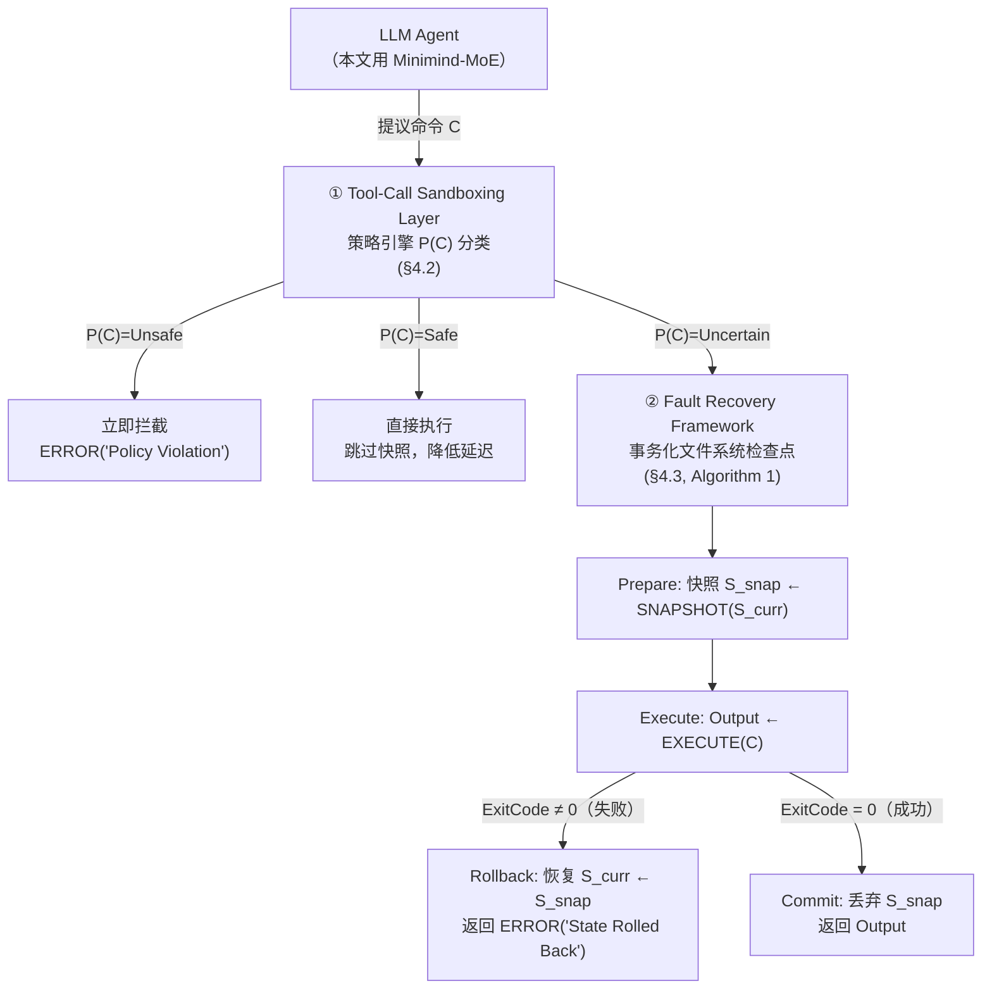

# 容错沙箱：用数据库"事务"语义给 AI 编码 Agent 的每一次工具调用穿上安全带

> **本篇定位**：这是 agent-harness 库 **H 组（可靠性/安全/可观测/沙箱）的开篇精读**。H 组此前 6 篇全部未做（PROGRESS.md），本篇是第一篇落地。它讨论的问题——"给 agent 多少权限、出错了怎么恢复"——正是 Θ3 要求我们"打到自己身上"的天然靶子：**我们（Claude Code）跑在一个真实存在沙箱开关、临时路径约定、git 安全协议的 harness 里，本文的每一个设计选择都能直接对照我们自己的组件**。
>
> 需要**提前诚实**的一点（Θ5/Θ4）：这不是一篇工业级或顶会论文——单作者、University of Virginia、arXiv 预印本、无 venue 信息、核心验证模型只有 **26M 参数**（比论文自己定义的"SLM"下限 1M 略高，但比论文自己经济学论证里用的参照物 7B 模型小两个数量级）、测试集是研究者自定义的 10 个场景。它更像一篇**扎实的本科/研究生系统课程项目报告**，价值在于**问题框架和设计直觉是对的、干净的**（三级策略分类 + 事务化快照回滚），但**证据强度（N、对照组、统计显著性）远不到生产级**。本文会**如实呈现原文的宣称**，同时**逐项标出证据边界**——这正是我们自己读论文时应该练的功夫，也是本库一贯的诚实标准。
>
> 全篇遵循 v1 硬规范（公式/算法前给直觉→先定义符号→读出什么；指标给定义式；数字标 §/Table/Eq/Algorithm 出处；区分宣称 vs 批判）+ v2 增量（Why 三连 + 强制 Inspires-Us）+ 本库 Θ1–Θ5。

---

## §1　TL;DR（一页讲清这篇在干嘛）

> 主讲提示：开场先给"两难"（权限 vs 安全）建立画面感，再甩三个数字压场，最后用一句话点出这篇论文的"体量诚实标签"。

**一句话**：LLM 编码 agent 已经从"帮你写代码"变成"直接执行 shell 命令改你的系统"（摘要）——这带来了新的安全风险：可能生成语法正确但逻辑错误的命令，从删除关键系统文件（`rm -rf /`）到引入安全漏洞（§1）。现有商业方案（如 Gemini CLI）靠"交互式登录墙"防住这类风险，但登录墙恰恰**打断了无人值守（headless）agent 需要的连续循环**（摘要）。本文提出一个**折中方案**：把每一次 agent 工具调用包装成数据库式的 **ACID 事务**——用**策略拦截层**（Safe/Unsafe/Uncertain 三级分类，§4.2）先过滤，再用**文件系统快照-回滚机制**（Algorithm 1，§4.3）兜底："不确定"的命令执行前先拍快照，命令失败就整体回滚，成功就提交。

**三个数字**（务必标出处）：
- **100% 拦截率**：20 次黑名单（destructive）命令尝试，全部被策略引擎挡下（Table 1）。
- **100% 回滚成功率**：20 次"状态损坏/失败"场景，全部成功恢复到执行前状态（Table 1）。
- **14.5%（约 1.82s）延迟开销**：把一次 `pip install` 操作的执行时间从裸机 4.69s 拉到本文原型 6.51s（§6.3）——但下文 §14 会指出这个百分比本身和它给出的两个绝对时间**对不上账**，这是我核对后发现的一处原文内部不一致，如实标出。

- **属于 harness 的哪一层（Θ1）**：本篇打的是 **E（Environment，环境/沙箱）层**——它不改 agent 的推理循环、不碰上下文管理，纯粹是"agent 的动作要落到真实系统之前，经过什么样的执行环境包装"。但它的两个子机制分别触达 **L（Loop，控制循环里的 Prepare→Execute→Commit/Rollback 状态机）** 和**安全/权限**这个跨 O/V 的关切——这和 OpenHands SDK（2511.03690）的 `SecurityAnalyzer`+`ConfirmationPolicy`、Harness-Bench（2605.27922）的 `Security` 硬闸门是同一个问题空间的三种不同解法（§18 详细对照）。
- **回扣全库论点（Θ2）**：这篇给 `Agent = Model + Harness` 提供了一个**极端样本**——它显式证明"harness 的安全机制和 model 的能力是两件独立的事"：Table 1 的 100/100/100/100 全部是策略引擎（规则匹配）+ 文件系统复制（`shutil`）的**确定性行为**，和 Minimind-MoE 这个 26M 参数模型自己聪不聪明**几乎无关**——即便换成一个完全随机生成命令的"模型"，只要命令落在测试的黑白名单范畴内，这几个数字大概率不变。这个观察本身就是一次对"harness 数字到底在测什么"的方法论提醒（§17 会展开批判）。
- **够新但不够权威（Θ4）**：2025-12 arXiv 预印本，主题（transactional sandboxing for coding agents）踩在 2025 年"agent 安全/沙箱"这个真实变热的方向上，但**证据规模和评审地位都是早期阶段**——这是本库第一次遇到"主题前沿、成熟度早期"的组合，要按 Θ5 诚实地把"问题意识"和"证据强度"分开评价。

---

## §2　问题与动机：为什么"限制权限"不够，非要"容错恢复"不可（Why 三连）

> 主讲提示：这一页要讲清楚全文的核心张力——不是"要不要给 agent 权限"，而是"给了权限之后出了错怎么办"。这正是任务里明确要求的 Why 三连题目，务必讲透。

**Why（问题层）——不解决会卡住什么？**

原文把核心问题拆成**两条并列的缺陷**（§1 末段）：

1. **Unsafe Execution（不安全执行）**：缺乏**实时的、基于策略的校验**——agent 想执行什么命令，系统当下没有一道"过滤网"去判断这条命令安不安全。
2. **Lack of Fault Recovery（缺乏容错恢复）**：缺乏在**工具调用失败时把状态恢复到一致状态**的机制——命令跑了一半失败，系统停在一个"半生不熟"的中间状态，没人知道怎么退回去。

背景证据：OpenInterpreter [13]、AutoGen [21] 这类工具已经允许 LLM 直接执行 shell 命令（§1）；LLM agent 实质上是一个"黑箱操作者"（black box operator）——它可能生成**语法正确但逻辑有缺陷**的命令，后果从删除关键系统文件到引入安全漏洞（§1）。而现有商业方案的应对方式（Gemini CLI 的交互式认证墙，§3.3/§6.4）是"以人为中心"的安全模型：需要人在场点"Sign in"才能继续——这对交互式使用没问题，但**从架构上排除了无人值守自治**这一整类场景（§3.3、§7.2）。

**Why（设计层）——为什么不能简单地把 agent 权限限制到最小，而要专门设计容错恢复机制？**

这正是任务要求深挖的一层，我们把它当成一个独立的小节来推演（原文材料 + 我的综合分析，下面会标清楚哪些是原文直接支持、哪些是我的推演）：

> **朴素替代方案 A：最小权限白名单**——只给 agent 一个固定的、人工审核过的安全命令子集（比如只能 `ls`、`cat`、`git status`），凡是不在名单里的一律拒绝。
> **为什么会失败**：① **真实编码任务的命令面无法穷举**——本文自己把"不确定"命令的例子举成 `pip install`、`sed -i`（§4.2 第 3 类），这类命令**在大多数上下文是必要且合法的**，但完全无法用静态白名单覆盖每一种参数组合（装哪个包、改哪一行）；把它们全部划入"禁止"会让 agent 完全干不了活，等价于走向 Gemini CLI 那种"安全但不能用"的死路（§3.3、§7.2 原文明确对比"Chat-with-Data"与"Agentic Automation"两种niche 的分野）。② **相关工作已经验证"环境隔离 ≠ 状态可恢复"**：Docker 容器提供优秀隔离，但**不天然支持回滚到运行会话中的某个历史状态**，需要额外的卷管理或外部快照工具（§3.1）；Python 的 venv/Conda 能隔离依赖包，却对库路径以外的文件系统改动**毫无防护**，且**没有原子回滚能力**——`pip install` 失败到一半，环境就停在一个腐坏的中间态，往往要人工清理（§3.2）。这两个例子共同说明：**"隔离"和"限制权限"解决的是"坏事能不能发生"，而不是"坏事发生后怎么退回去"——是两个正交的问题，缩小权限并不会让"退回去"这件事变得多余**。③ **真正的风险常常不来自"权限太大"，而来自"权限范围内的动作参数错了"**——一个 agent 被合法授权执行 `rm`、`sed -i`，风险不在于它有没有这个权限，而在于它会不会把路径/表达式写错；最小权限只能挡住"agent 尝试做被完全禁止的事"，挡不住"agent 被允许做的事，但做错了"。这一类错误**只能靠"执行后可检测、可撤销"来兜底**，而不是"执行前更严格地卡权限"能解决的。
> **本设计凭什么更优**：本文的答案是"两层防御"而不是"单层收紧"——**策略拦截层**（Safe/Unsafe/Uncertain，§4.2）先把"明确安全"和"明确危险"的两端切掉（分别放行/硬拦截），中间那一大块**无法被静态规则安全归类、但又是完成任务所必需**的命令（"Uncertain"），不是靠"更严格的白名单"去猜哪些参数是安全的，而是靠**执行时立一个可撤销的检查点**（Algorithm 1 的 Prepare→Execute→Commit-or-Rollback）来对冲"猜错了"的代价。这把安全设计从"事前精确预测"（本质上不可能对无穷参数空间做到完备）转移到"事后可逆"（结构上更容易做到完备——只要文件系统状态可以被完整快照，任意失败都能回滚）。这正是数据库事务理论（Jim Gray [9]，§1.1）几十年前解决"并发更新可能出错"问题的同一思路：不是不允许写，而是保证写要么完全成功要么完全没发生。

> **读出什么**：这层 Why 说明本文的贡献**不是一个新的安全策略语言**，而是一个**架构位置的选择**——把"安全"从"事前能不能做"这一个维度，拆成"事前粗筛（策略引擎）+ 事后可逆（事务快照）"两个维度的组合。理解这一点后，后面看到"为什么 Uncertain 命令不直接执行/也不直接拒绝，而要用一整套 Prepare/Commit/Rollback"就不会觉得多余——它正是在补最小权限模型天然的盲区。

---

## §3　三个贡献与论文定位（§1.1）

**主假设**（Hypothesis，§1.1 原文）：**事务化容错**（transactional fault-tolerance）可以被实现在 AI 编码 agent 上，用以保证状态一致性与安全性，**前提是接受一个可测量、不可忽略的性能代价**。

**设计谱系定位**（§1.1）：本文把自己放在两个极端之间的"中间地带"——
- 一端：**轻量、不安全的本地执行**（如直接用 Python `subprocess`）；
- 另一端：**重量、持久化的隔离**（如完整的虚拟机预置）；
- 本文提出的"中间地带"方案：受数据库事务 [9] 启发，把**每一次 agent 工具调用当作一个原子操作（ACID）**。

**五项贡献**（§1.1 原文列表）：
1. 为 LLM 工具使用给出**事务语义的形式化定义**；
2. 对自治 agent 场景下 **SLM vs. LLM 的权衡**做一次系统梳理；
3. 一个**预执行快照机制**的原型实现；
4. 在真实的 **Proxmox/EVPN 测试床**上、用 **Minimind-MoE** 模型做的评测；
5. 一次**对比分析**，说明为什么 Gemini 这类商业工具在无人值守场景会失败。

> **读出什么**：五项贡献里，**贡献 3+4**（快照机制+评测）是这篇论文真正的"系统"部分，也是本报告 §6–§14 的重点；**贡献 2**（SLM vs LLM）更像是"为什么用这么小的模型做验证"的背景论证，本报告放在 §11 集中处理，不喧宾夺主；**贡献 1**（形式化定义）其实只是一个三行的分段函数（Eq 1，§8），"形式化"程度不宜过度期待——原文没有给出关于该形式化的任何定理、证明或不变式检验，这是需要如实指出的边界（§17）。

---

## §4　相关工作：为什么 Docker、venv、Gemini CLI 都不够（§3）

> 主讲提示：这页用一张对照表把"沙箱隔离机制的系统架构"这条主线的**竞品坐标**先立住，后面讲本文方案时才知道它在补哪一块空。

原文 §3 分三类相关工作，逐类指出它们各自缺的那一块：

| 方案 | 隔离能力 | 回滚/恢复能力 | 无人值守可用性 | 原文出处 |
|---|---|---|---|---|
| **Docker 容器**（cgroups+命名空间） | 强（进程/文件系统级隔离） | **弱**——不天然支持回滚到会话内某历史状态，需额外卷管理/外部快照工具；且每条命令都起一个临时容器会带来明显编排开销 | 中——技术上可无人值守，但启动/编排成本影响高频循环 | §3.1 |
| **完整 VM 预置** | 强（硬件级隔离） | 中（可整机快照，但重） | 差——启动延迟常达"几十秒"量级，打断 think-act-observe 循环 | §3.1 |
| **Python venv/Conda** | **弱**——只隔离包依赖，对库路径以外的文件系统改动无防护 | **无**——`pip install` 失败到一半即留下腐坏中间态，常需人工清理 | 高（本身很轻） | §3.2 |
| **Gemini CLI**（商业 agent runtime） | 有 checkpoint/命令限制机制 | 有（但细节原文未展开） | **差**——设计哲学是"交互安全优先于无人值守自动化"，强制交互式认证 | §3.3、§6.4 |
| **本文方案**（策略拦截+事务快照） | 中（进程内 + 文件系统快照，非内核级隔离） | **强**——针对性设计的 Prepare/Commit/Rollback | 高——专为 headless 场景优化 | §4 |

> **读出什么**：这张表最有信息量的一格是 Gemini CLI 那一行——原文明确说 Gemini CLI **"begun incorporating checkpointing and command restrictions"**（§3.3），也就是说它**不是没有安全机制**，而是安全机制**建立在"人在场"这个假设上**。§6.4 的评测发现（下详）正是在验证这一格。**本文没有在任何维度上宣称"隔离性"比 Docker/VM 更强**——它清楚地把自己定位成"补 Docker/venv 缺的回滚能力 + 补 Gemini CLI 缺的无人值守能力"的交集，而不是"全面碾压"。这是一处值得肯定的诚实定位。

---

## §5　符号与术语表

> 主讲提示：这页是字典，后面讲形式化模型和算法时会反复用，先钉死。

| 记号/术语 | 定义（原文出处） |
|---|---|
| $S_t$ | agent 所处环境在时刻 $t$ 的**状态**（环境的完整可观测/可恢复状态，如文件系统内容）（§4.1）。 |
| $C$ | 一次**工具调用（tool-call）**，形式上是把 $S_t$ 映射到 $S_{t+1}$ 的函数（§4.1）。 |
| $P(C)$ | **策略函数**，把命令 $C$ 分类到 $\{\mathrm{Safe}, \mathrm{Unsafe}, \mathrm{Uncertain}\}$ 三者之一（§4.1）。 |
| $T(C)$ | **事务包装器（Transactional Wrapper）**，本文核心机制，把 $C$ 的执行结果按 Eq 1 的规则映射回状态转移（§4.1）。 |
| $S_{\text{snap}}$ | **快照状态**——在执行"Uncertain"命令前，对 $S_{\text{curr}}$ 做的一份副本（Algorithm 1 第 10 行）。 |
| `ExitCode` | 命令执行后的进程退出码；本文用它作为"命令是否成功"的唯一判据（Algorithm 1 第 12 行，标准 Unix 惯例：0=成功，非 0=失败）。 |
| **ACID** | 数据库事务四性质——原子性(Atomicity)/一致性(Consistency)/隔离性(Isolation)/持久性(Durability)，源自 Jim Gray 1981（引文 [9]）；本文只显式论证了**原子性**（要么完全生效要么完全不生效），其余三者原文未展开逐一对应（§17 批判）。 |
| **SLM / LLM** | Small/Large Language Model，本文用参数量做主要划分：LLM 常指 70B+（如 GPT-4、Llama 3），SLM 指 1M–10B（§2.1，引文 [7][20]）。 |
| **MoE（Mixture of Experts）** | 用门控网络把每个 token 路由到参数的一个子集（"专家"）计算，从而把**总参数量（容量）**与**每 token 实际计算量（active 参数）**解耦（§2.4，引文 [1][18]）。 |
| **Copy-on-write 模拟** | 本文用 `shutil` 做文件系统级复制来模拟写时复制，作为快照机制的具体实现（§4.3）；注意这不是真正内核级的 COW，是"整份复制"的简化模拟（§17 批判会展开）。 |

---

## §6　系统架构总览：两层防御（§4）

**直觉**：把这套系统想成机场安检 + 民航"黑匣子"的组合——**策略拦截层**是安检口（先把明显不该带的东西拦下，明显没问题的直接放行，剩下不确定的要开箱检查）；**容错恢复层**是黑匣子记录（万一飞行中出了状况，能靠记录把状态还原、定位问题），二者叠加，既不是"一刀切禁止"，也不是"放任自流"。

原文原话（§4）：Sandbox 框架施加**两层安全**——① **Tool-Call Sandboxing Layer**：预执行校验；② **Fault Recovery Framework**：利用事务化文件系统检查点。



**读出什么**：这张图把"沙箱隔离机制的系统架构"一句话讲完——它**不是一个统一的沙箱**，而是**先分流、再对不确定的那一支上保险**。这个设计的效率考量很直白：Safe 命令（如 `git status`、`ls`）**跳过快照机制以降低延迟**（§4.2 第 1 类原文明确写"These bypass the snapshot mechanism to reduce latency"）——因为对只读命令做快照是纯浪费；只有真正**会改状态、又不能事先断定安不安全**的命令，才值得付出快照的开销。这是一个"把 I/O 开销花在刀刃上"的朴素但有效的成本控制。

---

## §7　组件一·命令拦截策略：Safe / Unsafe / Uncertain 三分类（§4.2）

**直觉**：与其试图对每条可能命令做精细的风险打分（连续值），本文用一个**轻量策略引擎**把命令粗分成三档——这更像"绿色通道 / 黑名单 / 二次安检"，而不是一个连续的风险评分器。

三档定义（§4.2 原文）：

1. **Safe / Whitelisted**：只读或低风险命令（如 `git status`、`ls`）。**跳过快照机制**以降低延迟。
2. **Unsafe / Blacklisted**：破坏性命令（如 `rm -rf /`、`mkfs`）。**立即拦截**，返回 `ERROR("Policy Violation")`（Algorithm 1 第 2–4 行）。
3. **Uncertain / Requires Checkpoint**：会改变状态的命令（如 `pip install`、`sed -i`）。**触发事务化恢复流程**（下一节）。

**Why（设计层）——为什么恰好是三档，而不是二档（allow/deny）或者连续风险分？**

原文没有直接论证"为什么是三档"，但从架构效果看：**二档（allow/deny）**会强迫策略引擎对每条命令都做一次非黑即白的判断——那些"大概率安全但没法 100% 保证"的命令（`pip install` 装的包可能有问题、`sed -i` 可能改错文件）要么被误杀（伤害可用性），要么被误放（伤害安全性）。三档把这类"灰色地带"命令**单独引流到事务化恢复通道**，用"执行后可撤销"来化解"执行前判断不了"的两难——本质上是把**分类的不确定性，转换成了执行的可逆性**。这比 OpenHands SDK（2511.03690 §10.4）的**连续风险分**（low/medium/high/unknown，由 `SecurityAnalyzer` 打分 + `ConfirmationPolicy` 决定要不要停下来等人批准）更简单、更确定性（规则匹配 vs LLM 打分），代价是**颗粒度更粗**——它不像 OpenHands 那样能"对同一个 high risk 操作按上下文动态放宽"（OpenHands 举的例子是"对安全的只读操作 `grep` 放宽限制"，实现自适应信任），本文的三分类一旦命令落入 Unsafe 就**没有申诉或人工覆盖的余地**（Algorithm 1 第 2–4 行直接返回错误，没有确认环节）。

> **读出什么（Θ2 埋线）**：这里第一次能看到"harness 设计选择"如何独立于"model 能力"产生效果——无论 Minimind-MoE 输出什么，只要命令字符串匹配到黑名单模式，就会被拦下。这是 harness 给 agent 能力"设了一个模型无法逾越的地板"的例子，呼应 Harness-Bench（2605.27922 §3.4）里 `Security` 作为**硬闸门（0/1，一票否决）**而非可加权项的设计哲学——两篇论文分别在"评测协议"和"运行时系统"两个不同层面，做出了同一个判断：安全性不该是可以被完成度"对冲"掉的软指标。

---

## §8　组件二·事务化执行的形式化模型（§4.1，Eq 1）

**直觉**：普通的命令执行是"打了就打了"——万一命令执行到一半失败，文件系统可能停在一个既不是"之前"也不是"之后"的中间状态。本文借用数据库事务的思路：**要么完整地从 $S_t$ 走到 $S_{t+1}$，要么干脆稳稳地留在 $S_t$**，不允许停在中间。

**先定义符号**（重复强调，公式前必须先把符号钉死）：设 agent 环境在时刻 $t$ 的状态为 $S_t$；一次工具调用 $C$ 是一个把 $S_t$ 映射到 $S_{t+1}$ 的函数；命令的合法性由策略函数 $P(C) \to \{\mathrm{Safe}, \mathrm{Unsafe}, \mathrm{Uncertain}\}$ 判定；引入**事务包装器** $T(C)$，使得：

$$
S_{t+1} =
\begin{cases}
S_t + C & \text{若 } \mathrm{execution}(C) \text{ 成功} \\
S_t & \text{若 } \mathrm{execution}(C) \text{ 失败}
\end{cases}
\tag{Eq 1, §4.1}
$$

原文紧接一句结论：**"This ensures atomicity: the state is either successfully advanced or perfectly preserved."**（这保证了原子性：状态要么被成功推进，要么被完美保留。）

**读出什么**：这条公式本质上就是在说"**没有中间态**"——把执行结果压缩成两个离散分支，而不是让 agent 停在一个"部分改了一半"的模糊状态里。这与关系型数据库事务里 `COMMIT`/`ROLLBACK` 二选一的语义完全同构（引文 [9] Jim Gray 1981）。需要诚实指出（Θ5）：Eq 1 只是**描述了想要的效果（原子性）**，本身不构成一个可验证的形式化系统——它没有给出 $S_t + C$ 这个"加法"运算符的严格定义（状态到底是什么代数结构？文件系统的字节级差异？），也没有证明 Algorithm 1 的具体实现真的满足这条公式（比如并发场景下两个 agent 同时操作同一状态会怎样，原文完全没有讨论——本文全程假设**单 agent、串行执行**）。所以贡献 1"formal definition of transactional semantics"（§1.1）里的"formal"更准确的理解是"**用形式化记号写出了期望的行为契约**"，而不是"给出了可机器检验的形式化证明"。

---

## §9　组件三·快照-回滚算法：Algorithm 1 逐行精读（§4.3）

> 主讲提示：这是全篇工程实现的核心，逐行过一遍，讲清楚三段式（Prepare/Execute/Commit-or-Rollback）怎么和 §7 的三分类衔接起来。

**直觉**：把 Algorithm 1 想成"先分诊，再对需要开刀的病人先拍一张术前 CT（快照），做完手术（执行）看有没有并发症（退出码），没有就正常出院（提交，扔掉 CT 片），有并发症就照着术前 CT 把人还原（回滚）"。

原文给出 `shutil` 做的**写时复制模拟**（copy-on-write simulation）——在任何"Uncertain"命令执行前，先创建一个还原点（§4.3）。完整算法如下（Algorithm 1，Require: 命令 $C$，当前状态 $S_{\text{curr}}$；本报告已用 PDF 页面图像逐字核对，其中第 12 行的判断条件在正文的 PDF-to-text 抽取中曾丢失"≠"符号，经比对页面原图确认为"$\text{ExitCode} \neq 0$"，与 Eq 1、§4.3 文字描述及 Table 1 的"Rolled Back / Committed"两档完全自洽）：

```text
Require: Command C, Current State S_curr
 1: Classify C using Policy Engine P(C)
 2: if P(C) = Unsafe then
 3:     return ERROR("Policy Violation")
 4: end if
 5: if P(C) = Safe then
 6:     Execute C
 7:     return Output
 8: end if
 9: Prepare Phase:
10:     S_snap ← SNAPSHOT(S_curr)
11:     Output ← EXECUTE(C)
12: if ExitCode ≠ 0 then
13:     Rollback Phase:
14:         Restore S_curr ← S_snap
15:         return ERROR("State Rolled Back")
16: else
17:     Commit Phase:
18:         Discard S_snap
19:         return Output
20: end if
```

**分段解读**：
- **第 1–8 行 = §7 的三分类落地**：Unsafe 直接返回策略违规错误（无快照、无执行）；Safe 直接执行返回（同样无快照——呼应 §6 的延迟优化）。
- **第 9–11 行 = Prepare Phase**：只有走到这里（即命令被判为 Uncertain）才会付出快照代价；`SNAPSHOT(S_curr)` 是本文延迟开销的主要来源（§6.3 明确点名"dominated by the I/O operation of duplicating the 250MB workspace"）。
- **第 12–15 行 = Rollback Phase**：`ExitCode ≠ 0`（非 Unix 惯例里的"失败"）触发——恢复到快照、返回"State Rolled Back"错误。
- **第 16–19 行 = Commit Phase**：成功路径——丢弃快照（不再需要），返回真实输出。

**Why（设计层）——为什么用"进程退出码"而不是更语义化的判据来触发回滚？**

朴素替代方案是让系统去理解命令的**语义结果**是否符合预期（比如检查文件内容有没有被正确修改、代码有没有引入 bug）。但那需要一个理解代码/文本语义的额外判断层（本质上又要靠一个模型去"评审"结果，引入新的不确定性和开销）。本文选择了**最廉价、最确定性的信号——进程退出码**：Unix 惯例下 0=成功、非 0=失败，几乎所有命令行工具都会遵守，判据获取成本几乎为零。**代价**（原文没有主动讨论，这是我的补充批判，将在 §17 展开）：**退出码只能捕捉"崩溃型"失败，捕捉不了"语义型"失败**——一条 `sed -i` 命令可以把某一行改错但依然正常退出（`ExitCode = 0`），此时 Algorithm 1 会直接走向 **Commit Phase**，把这个"语义上错误但进程意义上成功"的状态**当成合法状态提交、丢弃了本可以回滚回去的快照**。这是本文容错机制**结构性覆盖不到**的一类风险，值得在讲台上明确提出来讨论（§19 讨论问题会把这个点抛给同学）。

> **读出什么（Θ2）**：Algorithm 1 是一个**完全不依赖模型能力**的确定性状态机——无论 Minimind-MoE 输出什么样的 `Output`，只要 `ExitCode` 相同，回滚/提交的行为就相同。这再次印证 §1 的判断：Table 1 的"100%"更多是在测**这段 Python 代码本身写对了没有**，而不是在测"agent 用得好不好"。

---

## §10　权限与安全性的权衡设计：三种"安全"哲学的分野

> 主讲提示：这页把 §2 的 Why-设计层论证落到一张对照表上，顺带把 §4 Related Work 里 Docker/venv/Gemini CLI 与本文方案的"权限-恢复"取舍摆在一起看。

把"给 agent 多大权限、怎么应对出错"这件事画成一个二维坐标——横轴是**执行前限制得多严**，纵轴是**执行后能不能撤销**：

| 方案 | 执行前限制 | 执行后可撤销性 | 无人值守可用性 | 对应哲学 |
|---|---|---|---|---|
| 完全放开（如裸 `subprocess`） | 无 | 无 | 高但极不安全 | "信任 agent" |
| Gemini CLI 式交互认证墙 | 高（每次高危操作要人确认） | 有 checkpoint 机制（细节原文未展开） | **低**（§6.4 实测 headless 场景 100% 失败） | "信任人，不信任机器" |
| 纯白名单最小权限 | 极高（只放行预审命令） | 通常无需要（因为压根不会执行危险命令） | 中（任务覆盖率受限） | "缩小攻击面" |
| **本文（策略三分类+事务恢复）** | 中（只硬拦截明确 Unsafe） | **高**（Uncertain 命令全部可回滚） | 高（§6.2 无需人工干预） | **"允许犯错，但保证错了能退回去"** |

**结果层 Why——为什么本文选的这个点位（中等限制+高撤销性）反而在 headless 场景下更可用？**

因为 headless（无人值守）场景的核心约束是：**系统不能在"卡住等人确认"和"什么都不敢做"之间选——它必须继续往前走**。"高限制、低撤销"（纯白名单）会让 agent 在很多合法任务上寸步难行；"高限制、有 checkpoint 但要人确认"（Gemini CLI）会让 agent 在 headless 环境里直接失败（§6.4）；只有"中等限制 + 事后可逆"能同时满足"任务能推进"和"错了能兜底"两个约束——这正是本文在设计谱系图（§3，"design spectrum"）里给自己找的那个中间位置的实际含义。

> **读出什么**：这张表也是理解 §17 局限的钥匙——本文的"权衡"是在**单机、单 agent、本地文件系统**这个相对简单的场景里做的；一旦引入多 agent 并发、外部有状态 API（§15.5 会讲这恰恰是原文自己承认的局限），这个"中等限制+高撤销性"的简单二维定位就不再够用了。

---

## §11　为什么用小模型跑 agent：SLM/LLM 权衡与 Minimind-MoE 选型（§2、§5.2）

> 主讲提示：这一部分是论文近一半篇幅的背景论证，但离本报告主线（沙箱架构/容错/权限权衡）更远，用较紧凑的篇幅带过，重点讲清楚"为什么小模型对 agent 循环友好"的三条论据和 MoE 的直觉。

**背景**：主流叙事是"越大越好"，模型冲向万亿参数（§2 开篇）。但本文认为，对**部署在生产环境里的自治 agent**，这条 scaling law 会遇到收益递减——原因不是"大模型不聪明"，而是**agent 的使用模式和聊天场景不一样**。

**LLM vs SLM 划分**（§2.1）：主要靠参数量和训练目标区分。LLM（GPT-4、Llama 3 70B+）是通用"知识引擎"，在海量无差别数据上训练以最大化广泛泛化能力 [20]；SLM 通常 1M–10B 参数 [7]，常在高度筛选的领域数据上训练/微调，为效率和特定任务执行（代码生成、网络配置）而设计。

**架构效率的两个来源**（§2.2）：
- **知识蒸馏**：用"teacher-student"框架，大模型生成合成训练数据，把推理能力转移给小模型 [5]；
- **量化**：SLM 常用激进量化（4-bit/8-bit 整数）而非 16/32-bit 浮点，降低内存占用、提升消费级硬件上的推理速度 [2]。

**Agent 为什么需要 SLM：三条优势**（§2.3，原文用"Observe→Think→Act"循环框定）：

1. **延迟与交互循环**：agent 跑在一个 Observe-Think-Act 循环里；云端 LLM 引入可变的网络延迟和排队时间（生成一次响应常要几秒）；本地跑的 SLM 能做到亚秒级推理 [4]——这对维持 agent 的"心流"、防止网络握手等时间敏感操作超时很关键。
2. **隐私与数据主权**：把专有代码库或敏感网络配置发给公共 LLM API 有显著安全风险 [3]；SLM 支持"气隙化（air-gapped）"智能——模型完全跑在本地基础设施内，敏感数据不出控制面；这对本文模拟关键基础设施的测试床环境尤其重要。
3. **经济可行性**：推理成本与激活参数量线性相关；跑一个 7B 参数 SLM 每 token 成本可比 70B LLM 低 10×–30× [10]；对一个可能产生成千上万行日志/代码试错的 agent，这个经济账是决定性的。

**MoE 架构的角色**（§2.4）：为在 LLM 的推理能力和 SLM 的效率之间搭桥，本文使用 **Mixture of Experts（MoE）**。直觉：把一个 MoE 模型想成一所大医院——医院的**总编制（总参数量）**可以很庞大，但每个病人（token）只会被分诊到**少数几个相关科室（激活的专家）**，而不是让全院医生都会诊一遍。门控网络（gating network）把每个 token 路由到"专家"（小型神经网络）子集的计算上（引文 [1][18] Shazeer et al. 2017 稀疏门控 MoE 开山作）。这样模型可以拥有很大的**总**参数量（知识容量高），但每步推理只计算一小部分（**激活**参数量），这种稀疏激活模式正是让高智能 agent 能跑在资源受限边缘硬件上的关键。

**模型选型：Minimind-v1-MoE（§5.2）**——一个约 **26M 参数**的轻量模型 [11]，用衍生自 DeepSeek-V2 [6] 的 MixFFN 设计，采用"共享专家 + 路由专家"结构（引文 [18]）。选择它的三条理由（§5.2 原文）：
1. **解耦推理成本**：把模型容量（总参数）和执行成本（激活参数）解耦，用远小于总参数量对应的 FLOPS 开销获得接近大模型的推理能力；
2. **低延迟执行**：每个 token 只激活一部分网络，token 生成速度显著高于同规模稠密模型，确保推理服务器不会在事务回滚检查期间成为瓶颈；
3. **边缘可行性**：稀疏激活模式特别适合测试床（以及未来的 MEC 边缘节点）里的消费级硬件，最大化有限内存带宽的利用率。

**SLM 的局限（§2.5，原文自陈，不是我加的批判）**：推理深度和知识广度相比大模型有明显下降 [20]；面对训练分布之外的任务更容易"幻觉"；参数少、存储的世界知识有限，可能难以应对需要整合多个不相关概念的复杂多步规划 [7]；上下文窗口通常更小，限制一次性摄入大代码库/长日志的能力，往往需要分块策略，而分块本身可能割裂上下文 [4]。原文由此得出一个诚实的结论：**SLM 适合执行边界清晰的任务，但在高层架构规划上可能仍需要监督或"交接"机制**（§2.5 末句）。

**Why（结果层）——这条选型论证和后面的经济账算得上吗？**

需要提醒一个规模落差（我的批判，非原文自陈）：§2.3 的经济论证用的参照物是 "7B 参数 SLM"，而本文**实际验证用的 Minimind-MoE 只有 ≈26M 参数**——比论证里的参照物小了约 **270 倍**，比论文自己给 SLM 划的下限（1M）高不了太多。这意味着 §2 那套"SLM 相对 LLM 省 10×–30× 成本"的论证，**并没有在与实际测试模型同一数量级上重新验证**——26M 模型的推理能力、经济账都可能与 7B 档位有质的差异（§17 会展开这一点）。

---

## §12　实验设置：Proxmox/EVPN 测试床与 10 场景测试集（§5.1、§6.1）

**为什么要搭一个这么"重"的测试床（Why·问题层）**：本文没有在笔记本上跑一个 Python 脚本就交差，而是特意搭了一套**模拟生产云环境**的私有数据中心测试床（§5.1）——目的是让"agent 被隔离在特定网络身份、拿不到宿主机权限"这件事，本身也是安全故事的一部分，而不仅仅是文件系统层面的沙箱。

**基础设施三要素**（§5.1）：
- **虚拟化层**：集群跑在 **Proxmox VE 9.0** [16] 上；agent 运行在一个专用 **LXC 容器**内，推理服务器跑在一台独立的、带 GPU 直通的虚拟机上。
- **网络隔离（EVPN/VXLAN）**：不用简单的 VLAN，而是用 **Ethernet VPN（EVPN）** [17] 配合 **VXLAN 封装** [14]；网络核心由 **VyOS 路由器**充当 VTEP（VXLAN 隧道端点），构成三层 leaf-spine 拓扑，确保 agent 被严格隔离在特定的虚拟网络标识符（VNI）内，**防止横向移动**到宿主机或其他关键基础设施。
- **存储**：快照机制跑在 **ZFS 支持的卷**上——原文特别说明：这为未来迭代（用 `zfs snapshot` 而非文件复制）留了做**更快快照**的空间，但**当前原型出于可移植性考虑，用的是文件系统级复制**（§5.1 明确自陈，不是我猜的）。

**测试集**（§6.1）：环境是一个标准 Python 项目目录（$P_{\text{size}} \approx 250\text{MB}$）；定义了 **10 个场景**——5 个 "Happy Path"（合法语法、安全逻辑）+ 5 个 "Adversarial"（语法错误、破坏性逻辑、依赖冲突）。

> **读出什么**：EVPN/VXLAN + LXC + GPU 直通这套基础设施本身，其实是**网络层/虚拟化层的隔离**（防止 agent 跳出自己的"格子"影响其他基础设施），和本文核心贡献（文件系统事务快照）是**两条不同的防线**——前者防"跳出沙箱"，后者防"沙箱内部把自己弄坏"。原文没有明确区分这两层防御各自的贡献度（比如没有做"只用 EVPN 隔离、不用快照机制"的对照实验），这是 §17 会指出的一处评测设计的局限。

---

## §13　评测结果一：安全性与可靠性（§6.2，Table 1）

原文原话：**"The system successfully intercepted all blacklisted commands and recovered from all induced failures."**（系统成功拦截了所有黑名单命令，并从所有诱发的失败中恢复。）

**Table 1: Safety Validation Results**（§6.2 原文表格，逐字核对页面图像无误）：

| Scenario Category（场景类别） | Attempts（尝试次数） | Success Rate（成功率） |
|---|---:|---|
| Whitelisted (Read-only) | 20 | 100% (Exec) |
| Blacklisted (Destructive) | 20 | 100% (Blocked) |
| State Corruption (Failure) | 20 | 100% (Rolled Back) |
| Valid State Change | 20 | 100% (Committed) |

**指标的含义（先给定义再读数）**：四个类别其实分别对应 Algorithm 1 的四条出口路径——"Exec" = 直接执行分支（第 5–7 行）、"Blocked" = 策略拦截分支（第 2–4 行）、"Rolled Back" = 回滚分支（第 12–15 行）、"Committed" = 提交分支（第 16–19 行）。也就是说，**Table 1 本质上是把 Algorithm 1 的四条控制流路径各跑了 20 遍，逐一确认每条路径都按预期走到底**。

**Why（结果层）——为什么会是干净的 100/100/100/100？**

因为这四个类别测的是**这段 Python 代码逻辑本身对不对**，而不是在测"面对未知输入，系统的鲁棒性如何"。策略引擎用规则/模式匹配识别"whitelisted"和"blacklisted"命令——如果测试命令就是研究者按这两个类别**设计出来**的样例（如 §4.2 举例的 `git status`/`ls` 属于白名单，`rm -rf /`/`mkfs` 属于黑名单），那么"匹配上预设规则、走到预设分支"本身**在功能正确的前提下是必然会发生的**，不是一个需要靠大样本统计去验证的"涌现"能力。同理，"State Corruption"和"Valid State Change"考的是 Prepare/Execute/Commit-or-Rollback 状态机对 `ExitCode` 的响应逻辑对不对——只要 `shutil` 复制和恢复的文件 I/O 操作本身没有 bug，回滚/提交的正确性也是工程实现层面的必然结果，而不是概率性的经验规律。

> **读出什么（对照 §17 批判）**：这不是说 100% 这个数字"没用"——它确实证明了**这个特定原型的四条控制流路径没有明显的实现 bug**，这本身是任何系统评测都该做、也值得写进论文的**单元测试/集成测试级别**的验证。但如果把它读成"这套沙箱在面对未知/对抗性命令时安全性达到 100%"，就**过度诠释**了——原文自己给的测试样例数量小（每类 20 次）、类别边界由研究者自己设计，且没有测试策略引擎面对**混淆/变形的危险命令**（例如用 base64 编码、命令拼接 `;`/`&&`、符号链接攻击绕过黑名单正则）时的表现——这类"对抗规避"测试，原文完全没有涉及（原文未给出）。

---

## §14　评测结果二：性能延迟与商业工具对比（§6.3–§6.4）

### 14.1　快照开销（§6.3）

方法：用一次 `pip install` 操作，在三种环境下计时——裸机（无沙箱）、本文原型、Gemini CLI。

- **基线（直接执行）**：平均 **4.69s**。
- **本文原型**：平均 **6.51s**。
- **开销分析**：沙箱引入约 **1.82s（14.5%）**的开销，主要来自复制 250MB 工作区的 I/O 操作；原文认为"亚 2 秒延迟对异步 agentic 工作流是可接受的"（§6.3）。

**核对后的一处发现（我的批判，需要如实标出）**：把 §6.3 给出的两个绝对时间相减——$6.51\text{s} - 4.69\text{s} = 1.82\text{s}$——这一步算术是对的，和"约 1.82s"一致；但如果按最直接的开销占比公式 $(\text{原型} - \text{基线}) / \text{基线}$ 计算，$1.82 / 4.69 \approx 38.8\%$，**并不等于原文反复重申的 "14.5%"**（摘要、§6.3、§7.4 三处一致写 14.5%）。我用两种独立方式（`pdftotext` 版面抽取 + 300dpi 页面图像目视核对）交叉确认了 4.69s / 6.51s / 1.82s / 14.5% 这四个数字本身没有抽取错误，但**14.5% 与另外三个数字之间，按最自然的百分比公式对不上账，原文没有说明这个百分比具体的计算口径（也许是相对某个未报告的更大基准，也许是笔误）**——这是本文数字层面唯一一处经交叉核对后仍存疑的不一致，如实呈现给读者，不代替原文猜测"正确答案"应该是多少。

### 14.2　与商业工具对比：Gemini CLI 在无人值守场景 100% 失败（§6.4）

方法：尝试自动化 Google Gemini CLI [8]。**结果：在无人值守（headless）环境下，执行 100% 失败**——CLI 抛出中断，请求交互式认证（"Please Sign in to continue..."）。

原文结论（§6.4）：这证实了**商业工具提供了健壮的沙箱机制，但它们是为"人在回路"（human-in-the-loop）的安全设计的**；本文的事务化方法则专门为**"机器在回路"（machine-in-the-loop）**的自治场景优化。

**Why（结果层）——这个对比说明了什么、又在多大程度上说明了这一点？**

这个对比确实**直接支持**了 §2 的核心问题陈述——"现有商业方案的安全模型和无人值守自治天然冲突"。但要注意对比的**公平性边界**（我的补充，非原文讨论）：Gemini CLI 的交互认证墙很可能是其**产品级安全策略的默认行为**，面向的是"人类用户在终端里使用"这个主要场景；原文没有说明是否尝试过 Gemini CLI 官方文档中可能存在的**非交互式/CI 模式**、API Key 直连等替代路径（引文 [8] 指向的是 "safety settings and sandboxing" 文档，原文没有引用是否存在专门的无人值守配置选项）。如果存在这样的路径而未被使用，"100% 失败"更准确的表述应该是"**Gemini CLI 的默认交互模式**不适配 headless 场景"，而非"Gemini CLI 完全不能支持无人值守"。这不影响本文的核心论点（专门为 headless 设计的方案确实有其位置），但作为"批判性阅读"的一部分值得指出——原文没有讨论这一层可能性（原文未给出）。

---

## §15　讨论六连：从"沙箱税"到"把安全信号变成学习信号"（§7）

> 主讲提示：这是全篇最有"研究品味"的一节，六个小节都是从原型实践里提炼出的洞察，逐条过，重点讲 7.4 的非对称成本论证和 7.6 的"倔强循环"发现——后者是本文少数几个**真正观察到、而非纯理论推演**的现象。

论文自陈：这个项目既是系统编程的技术探索，也是"AI 辅助开发"（俗称 "vibe coding"）的一次案例研究（§7 开篇）。

**§7.1 加速原型开发**：Minimind-MoE 与 AI 编码助手的组合显著加速了原型阶段——处理 `try/catch/rollback` 逻辑的 Python 上下文管理器的样板代码由 AI 生成，让研究者能专注于高层策略定义。原文的结论很克制："**对系统研究而言，LLM 擅长生成基础设施的'胶水代码'，前提是研究者自己定义好严格的约束（策略引擎）**"——这是一句诚实的自我定位：AI 辅助的是"实现"，不是"设计判断"。

**§7.2 工具的身份危机**：作者一开始担心 Gemini CLI 的发布会让这个项目变得多余，但发现"交互认证墙"之后，反而看到了一个市场空隙——**Chat-with-Data**（交互式、安全、需授权）与 **Agentic Automation**（无人值守、原子化、可回滚）是两类不同的产品定位，本文填补的是后一个 niche。

**§7.3 自治的经济学**：设 agent 走 10 步解决一个问题，每步 1000 输入 token + 200 输出 token；用商业 LLM API（如 GPT-4），单次 agent 运行成本约 $0.03–$0.06——单个用户看是九牛一毛，但一个每天跑成千上万次 CI/CD 流水线检查的自动化系统，这笔成本会膨胀到**每月数千美元**；相对地，自托管 SLM 方案只有电力和硬件摊销的**固定成本**——这种"固定成本模型"对系统管理里普遍化的 AI agent 的可行性是关键的。

**§7.4 "沙箱税" vs. 灾难性失败**：这是全篇论证最精彩的一段，值得完整复述其推理链——虽然报告了 14.5% 的性能开销，但作者认为这个数字需要更深的审视：在高频交易或实时游戏里，每次操作 1.8 秒的延迟是不可接受的；**但**作者把这种"沙箱税"类比成服务器里 ECC（纠错码）内存的开销——**为数据完整性付出性能代价**。在自治 agent 的语境下，不交这笔税的代价不只是一次崩溃，而可能是**灾难性的基础设施损坏**：如果一个产生幻觉的 agent 的配置改动搞垮了生产数据库，恢复成本相对 1.8 秒的校验延迟而言**近乎无穷大**。所以这个权衡是**不对称**的：安全的成本是**线性**的（时间），失败的成本是**指数级**的（系统清零）。这为任何拥有写权限的 agent 的开销买单提供了正当性。

> **Why（问题层，原文这段本身就是一次完整的问题层论证）**：这段论证的价值在于它没有停留在"14.5% 听起来还行"的直觉判断，而是明确指出**"性能开销"和"故障恢复成本"根本不是同一个量纲上可以线性比较的东西**——前者是确定性的、每次都发生的小额支出，后者是低概率但一旦发生就可能不可逆的大额支出。这正是保险/风险管理里"期望损失"的直觉：宁可确定付一笔小钱，也不要承担一个尾部风险极端厚的赌注。

**§7.5 超越文件系统：有状态 API 的挑战**（**原文自陈的核心局限**）：当前快照方案依赖**本地文件系统的原子性**。真实世界的 agent 常常要和外部有状态 API 打交道（通过 Terraform 部署云资源、通过 Netconf 改路由表、发邮件）——不像本地文件，一个 HTTP 请求**没法靠文件系统快照"撤回"**。原文认为未来迭代必须引入**补偿事务（Compensating Transactions）**的概念（分布式系统文献里常称为 **Saga**）——如果 agent 拉起一个 AWS EC2 实例、随后某个检查失败，回滚机制不能只恢复本地状态，还必须主动发出 `terminate-instance` API 调用给云厂商。这意味着沙箱必须从一个**被动的隔离层**，演化成一个**主动的编排管理器**——它需要理解自己放行的每一个 API 调用的"逆函数"是什么。

**§7.6 把安全信号变成学习信号**：作者观察到，沙箱起到了一种"粗糙版的**环境反馈强化学习**（Reinforcement Learning from Environmental Feedback, RLEF）"的作用——当 agent 尝试破坏性命令（如 `rm -rf`），沙箱的拒绝相当于一个**负奖励信号**。但作者也观察到一个真实的失败模式：当前的 SLM（受限于 §2.5 讨论的推理深度不足）往往**难以正确解读这个拒绝**，有时会陷入"**倔强循环（stubbornness loop）**"——不断重试同一段在语法上合法、但被策略判定违规的命令。这指向一个明确的需求：**"沙箱感知提示"（Sandbox-Aware Prompting）**——系统消息必须显式告诉 agent，它正运行在一个事务化沙箱里，这样 agent 才能学会把"Policy Violation"错误解读为**需要修改计划的边界约束**，而不是一个语法错误，从而随时间改善它的推理能力。

> **读出什么**：§7.6 这个"倔强循环"是本文**为数不多真正来自观察、而非纯理论演绎**的发现，价值不小——它说明**光有一套正确的策略引擎和回滚机制还不够，还得让 agent"读得懂"这套机制在向它传达什么**。这和 OpenHands SDK（2511.03690 §10.4）里 `WAITING_FOR_CONFIRMATION` 状态配合"被拒绝后可用更安全替代方案重试"的设计是同一个问题的呼应——区别在于 OpenHands 是把"重试引导"做进了控制循环本身，本文则停留在"提出这个需求、留给未来做"的阶段（§8 未来工作里其实**没有**把这一条列进去，是一个原文自己提出了问题但没有安排后续工作的空隙）。

---

## §16　未来工作：从沙箱到 AIOps、SLM 联邦学习（§8）

**§8.1 从沙箱到 AIOps**：本文开发的逻辑——原子执行 + 状态校验——可直接迁移到**蜂窝网络的 AIOps**。在 5G/6G 核心网里，一次配置变更就相当于一次"工具调用"；一个无效配置可能搞垮一个网络切片（引文 [22]）。计划把这套事务化沙箱改造成面向网络编排的 **Intent-to-Action 控制器**。

**§8.2 SLM 联邦学习**：转向 SLM 也为联邦学习打开了大门。既然 SLM 小到能跑在路由器、基站这类边缘设备上，未来的 agent 或许不仅能执行命令，还能从本地失败中"学习"——不必把所有数据送到中心云（隐私风险），agent 可以在本地计算梯度更新、只共享权重，让一支网络修复 agent 编队能集体改进"修复策略"，同时不把敏感的网络拓扑数据暴露给中心服务器。

> **读出什么**：这两条未来工作都是**从"agent 安全沙箱"这个具体系统，往"通用 AIOps 平台"方向的扩展设想**——原文没有给出任何原型或初步实验支持它们，纯粹是方向性展望（原文自己也没有伪装成已完成工作）。值得注意：这两条都没有回应 §7.5/§7.6 里作者自己提出的更紧迫的两个空缺（补偿事务/Saga、沙箱感知提示）——**未来工作列表和讨论部分暴露的问题之间没有完全对齐**，这提示读者：真正紧迫的下一步（有状态 API 的回滚、agent 对拒绝信号的正确解读）目前还只停留在"讨论"层面，没有进入研究计划。

---

## §17　局限与批判（原文 §7.5/自陈 + 我的补充）

> 主讲提示：这一页是判断力的高地。区分"论文自己承认的局限"和"我读完之后补充发现的局限"，两类都要给，且要给出处/证据，不要空泛下判断。

**原文自陈的局限**（诚实，主要集中在 §7.5）：
- **依赖本地文件系统原子性**：不能处理外部有状态 API（云资源、路由表、邮件）——HTTP 请求无法靠文件系统快照撤回；需要引入补偿事务/Saga 才能推广（§7.5）。

**我通读全文后核对出的补充批判**（区分于原文自陈，逐条标出证据）：

1. **评测样本规模小、类别由研究者自行设计，结论的外推性有限**：Table 1 每类仅 20 次尝试，四类合计 80 次；§6.1 描述的"10 个场景"（5 happy + 5 adversarial）与 Table 1 的四类 80 次尝试之间，**原文没有说明精确的对应关系**（每个场景被重复了多少次、是否每类 20 次都来自同一批场景的重跑）——这处映射关系原文未给出细节。样本量和"100%"的表述容易让人产生"这套系统在任意命令上都安全"的错觉，而实际验证的命令集合是研究者按类别**主动设计**出来验证控制流路径的，不是从真实、未知的 agent 行为分布里采样的（§13 已展开）。
2. **策略引擎对"对抗规避"的鲁棒性未被测试**：黑名单举例只有 `rm -rf /`、`mkfs`（§4.2），原文没有报告策略引擎是否被测试过面对**混淆过的**危险命令（命令拼接、编码转义、符号链接、别名/函数重定义等经典的黑名单绕过手法）——这在安全文献里是黑名单类防御最常见的失效模式，本文没有涉及（原文未给出）。
3. **回滚判据（ExitCode）只能捕捉"崩溃型"失败，捕捉不到"语义型"失败**：这是我在 §9 逐行读 Algorithm 1 时推导出的结构性缺口——一条命令可以"成功退出"（`ExitCode = 0`）但结果在语义上是错的（改错文件、写错配置但语法合法）；此时算法会直接 Commit，快照被丢弃，错误状态被永久保留。原文完整讨论了"崩溃恢复"，但没有讨论"静默错误"这一类风险（原文未提及）。
4. **性能开销数字存在内部不自洽，需要读者自行留意**：如 §14.1 所述，摘要/§6.3/§7.4 三处一致写"14.5%"，但按 §6.3 给出的两个绝对时间（4.69s→6.51s，差 1.82s）反推，最直接的占比公式给出的是约 38.8%，而非 14.5%——这不是抽取误差（已用两种独立方式核对），而是原文自身数字之间的不自洽，原文没有解释计算口径。
5. **SLM 论证的参照体量与实际验证模型不在同一数量级**：§2.3 的经济性论证以 "7B 参数 SLM" 为参照物，但实际部署验证的 Minimind-MoE 只有约 26M 参数，相差约两个数量级（§11 已展开）——论文没有在 26M 这个体量上重新给出对应的成本/延迟对比数据，§2 的论证与 §5 的实现之间存在一处未弥合的落差。
6. **"100% 安全"更准确的读法是"这段代码的控制流测试通过了"**：如 §13 分析，四类 100% 数字的机制来源主要是策略引擎的规则匹配和 `shutil` 复制/恢复操作本身的功能正确性，属于工程实现的必然结果而非概率性经验规律；本文没有做任何消融（例如去掉快照机制、或换一种更弱的分类规则）来定量说明"事务化设计"相对"没有它"到底带来多大边际收益——**"14.5% 开销换来了什么"这件事，原文是靠"没做的话会输给 Gemini CLI 的对比" + 定性论证（§7.4）来支撑的，没有做严谨的成本-收益消融**。
7. **评审地位与体量的诚实标注（Θ4）**：单作者、无 venue 信息、部分背景引用来自厂商博客而非同行评审文献（如 [1][2][3][4][5][7][10][20] 分别是 Epoch AI/Prem AI/CloverDX/Augment Code/DataCamp/Hugging Face/Hexaware/WEKA 的博客文章）——这类来源对"SLM vs LLM 趋势"这种业界观察类论证尚可接受，但论证力度显著弱于同行评审文献，§2 的整体说服力应打相应折扣。
8. **与 Gemini CLI 的对比可能不够对等**：如 §14.2 讨论，原文没有说明是否尝试过 Gemini CLI 可能存在的非交互 API 模式，"100% 失败"更准确应理解为"默认交互模式下 100% 失败"。

> **读出什么**：把这些批判放在一起看，一个统一的画像是——**本文的问题意识和架构直觉是干净、站得住脚的（三级策略分类+事务化回滚，确实精确地补上了 Docker/venv/Gemini CLI 各自的空缺），但证据链条的严谨度停留在"课程项目/早期原型"的水平**。这不是要否定这篇论文的价值——它的贡献 3（原型实现）和贡献 5（对比分析）都站得住——而是提醒我们：**读 harness 论文时，"设计思路值得学"和"数字可以直接引用"是两件要分开判断的事**，这恰恰是本库一贯要求的 Θ5 regime 诚实的另一种体现：不仅"harness 是否比 model 重要"要分场景讨论，"一篇论文的证据有多硬"同样要分场景判断，不能因为主题前沿就默认证据也强。

---

## ★ 对我们的启发（Inspires Us）

> 这是组会高潮：**我们（Claude Code）本身就活在一个 harness 里，而这个 harness 里已经有真实存在的沙箱开关、临时路径约定和 git 安全协议**——本文讨论的每一个设计选择，都能直接对照我们自己的组件来读。下面 a/b/c/d/e 逐条落到具体机制。

➤ **a. 可直接借用的招（method/trick we can reuse）**：**"三级策略分类 + 对中间态命令做事务化快照"**（§4.2+Algorithm 1）是一个足够轻量、可以直接抄的模式——不需要理解命令语义，只需要一个**规则引擎**把命令分成"明确安全直接放行""明确危险直接拦截""不确定则拍快照再执行"三档。这比"每条命令都上重量级容器"或"每条命令都要人确认"都更省成本。可以直接拆下来用在任何"agent 要对文件系统/工作区做有风险改动"的场景里，哪怕不搭配 LLM 也能用。

➤ **b. 可迁移到我们课题的思路（transfer）**：把 Algorithm 1 的 **Prepare→Execute→Commit-or-Rollback** 状态机映射到我们已有的 **`EnterWorktree`/`ExitWorktree`** 工具对上——两者结构惊人地同构：`EnterWorktree` ≈ Prepare Phase（`S_snap ← SNAPSHOT(S_curr)`，只不过快照的实现是 git worktree 而不是 `shutil` 整份复制）；worktree 内的实际改动 ≈ Execute（`Output ← EXECUTE(C)`）；`ExitWorktree(action="keep")` ≈ Commit Phase（丢弃"快照"、保留新状态）；`ExitWorktree(action="remove", discard_changes=true)` ≈ Rollback Phase（恢复到干净状态）。**关键差异**：本文的 Commit/Rollback 由 `ExitCode` **自动**触发（机器判据、逐命令粒度）；我们的 `ExitWorktree` 需要**agent/用户显式决策** keep 还是 remove（语义判据、任务/分支粒度）。这提示一个可迁移的思路：对于我们**明确需要自动化、无人值守跑通的子任务**（比如批量验证脚本、批量跑测试），可以借用本文"按退出码自动 commit/rollback"的模式，在 worktree 粒度之下再加一层**更细粒度、更自动化**的检查点——而不是每次都要等一个高层决策。**迁移前提要改的**：直接套用"ExitCode 判据"对我们不够——正如 §9/§17 指出的，coding agent 最容易犯的错恰恰是"命令成功退出但结果语义错误"，所以迁移时必须把判据从纯 `ExitCode` 升级成"`ExitCode` + 至少一层结果校验（测试是否通过、diff 是否符合预期）"，否则会重蹈本文的结构性盲区。

➤ **c. 它暴露的开放问题 = 我们自己 harness 里已经存在、且能具体展开的机制（Θ3 重点）**：本文的核心议题——"给多大权限、怎么应对出错"——不是抽象讨论，我们自己的运行环境里已经有三处真实存在的对应设计，值得逐一对照：

  1. **Bash/PowerShell 工具的 `dangerouslyDisableSandbox` 参数**：这本身就是我们 harness 里的"Safe/Unsafe/Uncertain"三分类的一个简化版——默认情况下命令跑在沙箱里（对应本文的"默认走策略引擎审查"），而 `dangerouslyDisableSandbox=true` 是一个**显式、具名、高摩擦**的逃生舱口（对应本文里"没有中间态、直接放行或直接拦截"的极端两端）。**和本文的关键差异**：本文的分类和回滚是**外部、确定性、agent 无法说服绕过**的拦截层（策略引擎是独立代码，不受 LLM 输出影响）；而我们当前的安全约束，很大程度上是**写在系统提示里、由模型自己（也就是我）在推理时遵守的软约束**（比如"避免使用 --no-verify"这类规则本质是自然语言指令，不是不可绕过的技术护栏）。这是一处诚实的差距：**外部的、代码级的策略引擎，天然比"写在提示词里指望模型自律"更接近本文论证的"不可绕过的安全带"**。
  2. **runbook/验证类任务必须写到 temp 路径、不能覆盖基线**（这条规则真实存在于本仓库 `learning/agent-harness-frontier/paper-reports/PROGRESS.md` 的"安全护栏"一节："harness 跑子进程 `--json-out/--md-out` 必指 temp，绝不覆盖基线"）：这正是本文"Prepare Phase 先拍快照、不确定就不直接改动权威状态"思路的一个**人工约定版**——只是我们目前靠的是"路径命名规范"这种流程纪律去实现"不确定操作不直接触碰基线"，而不是像本文那样有一层**机械的、自动强制执行**的保证。一个可执行的改进方向（呼应下面 e）：把这条"写 temp、不覆盖基线"的约定，从"讲道理让 agent 记住"升级成"验证类脚本的输出路径由外部包装器强制重定向，且只有校验通过才允许"合并"回基线"——这就是本文 Algorithm 1 的 Commit Phase 在我们这里的具体落地。
  3. **git 操作的安全协议**（本系统提示明确写出的规则：不 `--no-verify`、不强推 main、优先新建 commit 而非 amend、`git add` 用显式路径而非 `-A`/`.`）：这套规则可以直接映射进本文的三分类表——`git status`/`git diff`/`git log` 这类只读命令 ≈ **Safe/Whitelisted**（直接执行，无需额外保护）；`git push --force` 到 main、`--no-verify`、交互式 `rebase -i` ≈ **Unsafe/Blacklisted**（规则里明确写"绝不做，除非用户明确要求"，等价于策略引擎的硬拦截）；`git commit`（新建而非 amend）、`git add <显式路径>`、创建分支 ≈ **Uncertain/Requires Checkpoint**——而我们应对这一档的方式（"始终新建 commit 而不是 amend"）本身就是一种**天然自带撤销点的设计**：旧 commit 始终还在，等价于本文"执行前留一个快照"的效果，只是载体是 git 的不可变提交历史，而不是文件系统复制。这说明**版本控制系统本身，就是一种对"Uncertain 类操作"极其廉价的事务化快照机制**——比本文用 `shutil` 复制 250MB 工作区（带来 1.82s 开销）要轻量得多，这也是一个值得在 Inspires-Us e 里验证的具体假设。

➤ **d. 与本库其它论文/模块的连接（connect the dots）**：
  - 与 **E 组旗舰 OpenHands SDK（2511.03690 §10.4）**是"轻量原型 vs 生产系统"的一体两面——OpenHands 的 `SecurityAnalyzer`（连续风险分）+`ConfirmationPolicy`（是否需要人批准）+ `WAITING_FOR_CONFIRMATION` 状态，是本文"Safe/Unsafe/Uncertain 三分类 + 无人值守自动 Commit/Rollback"往生产级、往"人机协作"方向的进一步细化；OpenHands 论文自己也承认"LLM-based 安全分析受对抗提示影响、分类不一致，无法保证完全安全"（同一份局限，本文用规则引擎规避了"LLM 判风险"这一层不确定性，代价是牺牲了 OpenHands 式的上下文自适应能力，如"对安全只读操作放宽限制"）。
  - 与 **G 组标杆 Harness-Bench（2605.27922 §3.4）**呼应——Harness-Bench 的打分公式 $\mathrm{TaskScore} = \mathrm{Security} \cdot \mathrm{Completion} \cdot \mathrm{Process}$ 把 `Security` 设成 **0/1 硬闸门、一票否决**；本文的 Unsafe 分支（Algorithm 1 第 2–4 行）在**系统实现层面**正是这同一种"硬闸门"哲学的落地——两篇论文分别在"怎么评"和"怎么建"两端，独立走到了同一个判断：安全性不该被完成度"对冲"。
  - 与**本库 H 组尚待精读的姊妹篇**直接相关（PROGRESS.md 标记为⬜）：**Hell-or-High-Water（2508.11027，agentic recovery）**大概率会正面覆盖本文 §9/§17 指出的"退出码判据覆盖不到语义型失败"这个缺口；**AgentRacer（2509.03312，failure attribution）**呼应本文"回滚发生后怎么知道是谁的错"这一未被讨论的问题；**Systems Security Foundations for Agentic Computing（2512.01295）**很可能是本文"权限-恢复"这套朴素二分法的系统化、理论化版本；**AgentDojo（2406.13352，prompt injection）**和**LlamaFirewall（2505.03574，guardrail）**则补上本文完全没碰的"恶意输入/提示注入"这一类攻击面——本文的策略引擎只防"agent 自己生成的破坏性命令"，不防"外部输入诱导 agent 生成看似合法、实则有害的命令"，这是下一篇要专门处理的问题。
  - 与 **F 组 OSWorld/WebArena** 的沙箱是"同词不同义"的两种沙箱——那两篇的沙箱是**给评测提供可重置的干净环境**（评测基础设施），本文的沙箱是**给生产执行提供可撤销的安全垫**（运行时基础设施），提醒我们"沙箱"这个词在库里至少有两种不同的功能定位，读的时候要分清是哪一种。

➤ **e. 如果我来做下一步（my next move，第一人称、可执行）**：我会先在我们自己的 `learning/agent-harness-frontier/paper-reports/PROGRESS.md`"安全护栏"这条真实存在的"runbook 必须写 temp、不能覆盖基线"规则上，做一个最小复刻实验——写一个薄包装脚本，把"验证/统计类子任务"的执行流程改造成本文 Algorithm 1 的三段式：**Prepare**（先把要写入的目标从"基线路径"重定向到一个带时间戳的 temp 目录，等价于 `SNAPSHOT`）→ **Execute**（正常跑验证脚本）→ **Commit-or-Rollback**（不是只看 `ExitCode`，而是额外加一层"产物内容自检"——比如校验输出的 md/json 是否符合预期 schema、行数是否合理——通过才允许把 temp 目录的内容"合并"回基线路径，否则直接丢弃 temp 目录、基线路径保持原样不受任何影响）。做完这个最小实验后，我会用它去跑本库剩余的批次任务，量化对比"有这层自动 Commit-or-Rollback 包装"与"目前靠人工记住 temp 路径约定"这两种方式，在**误覆盖基线文件**这一具体事故上的发生率差异——这直接落在我们自己 harness 的具体组件（验证任务的执行包装层）上，不是泛泛感想。

---

## §18　版图定位（canon/前沿坐标 + 在本库的位置）

> 主讲提示：收口三件事——它在时间轴上的位置、它在 E/T/C/L/O/V 六层的归属、它给全库中心命题添了什么砖，同时诚实标出它和"权威"两个字的距离。

- **时间坐标与权威性（Θ4）**：**2025-12 前沿**（arXiv 预印本），主题踩在 2025–2026 年 agent 安全/沙箱这个真实变热的方向上，与 H 组其余 5 篇（LlamaFirewall guardrail、AgentDojo prompt injection、systems security foundations、Hell-or-High-Water recovery、AgentRacer failure attribution，均标记于 PROGRESS.md）共同构成本库对"可靠性/安全/可观测/沙箱"这一新兴子方向的覆盖。但必须诚实标注：**这不是一篇 canon，也未见同行评审信息**——单作者、University of Virginia、无 venue、26M 参数验证模型、10 个自定义测试场景。它相对本库已有的"重量级"E 组旗舰（OpenHands SDK）和 G 组标杆（Harness-Bench）而言，价值不在"更强的证据"，而在**用一个足够小、足够干净的原型，把"策略分类+事务化回滚"这个设计模式的直觉讲清楚**——这本身对我们（学习者）是有教学价值的，因为它的系统足够简单，逐行读 Algorithm 1 就能完全掌握。

- **E/T/C/L/O/V 归属（Θ1）**：本篇坐 **E（Environment）层**——它管的是"agent 的动作落到真实系统之前，被什么样的执行环境包装"，不碰上下文管理（C）、不改推理循环的结构（L 只在"Prepare→Execute→Commit/Rollback"这个局部状态机的意义上被触达）、不涉及可观测性的系统化设计（O，本文没有做任何 trace/日志的结构化讨论）。它和 OpenHands SDK 的 `Workspace` 抽象（2511.03690 §11，`opt-in` 沙箱、`LocalWorkspace`/`RemoteWorkspace`）、AgentFold 等 D 组论文完全不在一个抽象层次上——本文更底层、更聚焦在"单机文件系统状态的可逆性"这一个具体机制上。

- **回扣 `Agent = Model + Harness`（Θ2）**：这篇提供了一个**边界样本**——它几乎是"Harness 单独决定安全性、和 Model 能力解耦"这个命题的一次**极限展示**：Table 1 的四个 100% 数字全部来自策略引擎的规则匹配和文件复制操作的正确性，和 Minimind-MoE 这个 26M 模型自己"聪不聪明"关系不大（哪怕换一个更强或更弱的模型，只要它生成的命令落在测试类别范畴内，这几个数字大概率不变）。这提醒我们：`Agent = Model + Harness` 这个命题里，**"Harness 决定安全性下限"和"Harness 决定能力上限"是两件不同的事**——Harness-Bench（2605.27922）证明的是后者（同模型换 harness 分数摆 23.8 分，§8），本文更接近证明前者的一个简化案例（同 harness 下，安全性下限几乎不随模型摆动）。两者合起来说明：**好的 harness 既要能放大模型的能力上限，也要能兜住模型犯错时的安全下限**，这是两个需要分别设计、分别评测的目标。

- **在本库的位置**：**H 组开篇**，体量和证据强度都明显小于 E/G 组旗舰，但**问题意识干净、可教学性强**——适合作为"策略分类+事务化恢复"这个设计模式的入门读物，配合 OpenHands SDK 的 `SecurityAnalyzer`/`ConfirmationPolicy`（生产级、连续风险分、支持人工确认）一起读，能看清"同一个问题，从学生原型到生产系统会长出多少额外的复杂度"。

---

## §19　组会讨论问题（留给大家吵）

1. Algorithm 1 用 `ExitCode` 作为回滚判据，只能捕捉"崩溃型"失败。如果要补上"语义型"失败（命令成功退出但结果错误），最小可行的检测手段是什么？会引入多大的额外开销/复杂度？
2. §14.1 指出的"14.5%"与两个绝对时间对不上账——如果按 38.8% 的口径重新审视 §7.4 的"Sandbox Tax vs 灾难性失败"论证，这个非对称权衡的结论会变化吗（14.5% 和 38.8% 都远小于"灾难性失败"，论证的方向性大概率不变，但对"acceptable overhead"这句判断的说服力有影响吗）？
3. 本文的策略引擎是纯规则匹配（黑白名单）。如果换成 OpenHands 式的 LLM 打分（`SecurityAnalyzer`），会不会重新引入"LLM 判断本身不可靠"的问题？两种方案在"确定性 vs 上下文自适应"这条轴上，你会怎么选，为什么？
4. §7.5 提出"有状态 API 需要补偿事务/Saga"，但没有给出任何原型。如果要给我们自己 harness 里"调用外部 API 的工具"加一层可回滚性，第一步最小实验该怎么设计？
5. 本文完全没有讨论"提示注入/恶意输入诱导 agent 生成危险命令"这类攻击面（这是黑名单类防御的经典盲区）。策略引擎的黑名单如果要防这一类攻击，需要补什么？

---

## §20　一页速记（takeaways）

- **命题**：给 agent 权限 vs 保安全，不是"越少权限越安全"，而是"允许在中间地带犯错、但保证错了能撤销"——把安全设计从"事前精确预测"转移到"事后可逆"。
- **架构（§4/§6）**：两层防御——策略拦截层（Safe 直接放行/Unsafe 硬拦截/Uncertain 触发事务）+ 容错恢复层（Prepare 快照→Execute→ExitCode≠0 则 Rollback、否则 Commit，Algorithm 1）。
- **形式化（Eq 1，§4.1）**：$S_{t+1}=S_t+C$（成功）或 $S_t$（失败）——没有中间态，仿数据库事务原子性（引 Jim Gray 1981）。
- **铁证（Table 1，§6.2）**：白名单 100% 执行、黑名单 100% 拦截、故障场景 100% 回滚、合法变更 100% 提交（20 次/类）——但这更多是"控制流实现正确"的证明，不是"面对未知输入鲁棒"的证明（§13/§17）。
- **代价（§6.3）**：`pip install` 从 4.69s→6.51s，开销 1.82s；论文标注 14.5%，但按最直接公式应约 38.8%——数字内部不自洽，已交叉核对，如实标出（§14.1）。
- **对照实验（§6.4）**：Gemini CLI 在无人值守场景 100% 失败（交互认证墙），验证了"人在回路安全" vs "机器在回路安全"是两种不同的产品定位。
- **模型选型（§2/§5.2/§11）**：为 headless agent 循环选 SLM（延迟/隐私/经济三条理由）+ MoE 解耦容量与激活成本；但实际验证模型（≈26M）比经济论证的参照物（7B）小两个数量级，论证与实现之间有落差。
- **讨论亮点（§7）**："沙箱税"是线性成本换指数级风险对冲（§7.4）；有状态 API 需要补偿事务/Saga（§7.5，原文自认的核心局限）；"倔强循环"揭示 SLM 读不懂拒绝信号，需要"沙箱感知提示"（§7.6）。
- **诚实边界（Θ4/Θ5）**：单作者、无 venue、26M 玩具模型、80 次尝试、无对抗规避测试、无消融——问题意识和架构直觉可信，但证据强度是早期原型级别，不构成 canon。
- **对我们（Θ3）**：`EnterWorktree`/`ExitWorktree` 已经是 Prepare/Commit-or-Rollback 的一个语义判据版本；`dangerouslyDisableSandbox` 是我们自己的 Safe/Unsafe 二元开关，但目前更多是"模型自律的软约束"而非"外部不可绕过的硬闸门"；"runbook 写 temp 不覆盖基线"是本文思路的人工纪律版，下一步可以做成脚本级强制；git "新建 commit 而非 amend"本身就是一种极轻量的事务化快照。
