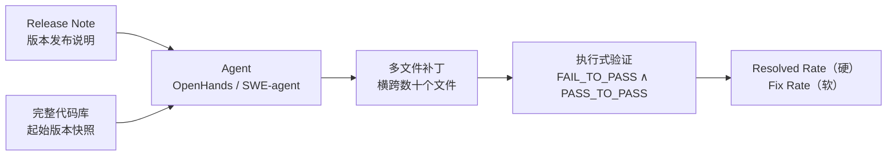
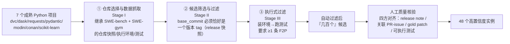

# SWE-EVO：面向长程软件演化场景的编码 Agent 基准

> 组会汇报文档 · ~20 页 · 50 分钟组会级 · PPT 风格。忠于 arXiv 2512.18470v6 原文，全篇数字均标注 §/Table/
> Figure/Appendix 出处；原文未给出的一律写明"原文未给出"，不编造。PDF 共 30 页，正文 1–11 页（含结论/局限），
> 参考文献 12–17 页，Appendix A–N 共 18–30 页。**提取方式**：Read 工具对该 PDF 报 `pdftoppm` 缺失，改用 Bash
> 调用 `pdftotext -f <start> -l <end> -layout` 先分段提取全文，凡遇跨列表格（Table 1/2/4/5/6/7/9、Figure 3/4
> 的双栏排版）在 `-layout` 模式下数字错位，一律改用 `pdftotext ... -raw` 对该单页重新提取、逐格核对，本文档中
> 所有表格数字均已完成这一交叉核对（含 Table 1 与 Figure 4 的 SWE-bench 对照列——已与本库同组 SWE-bench 报告
> 的 Table 1 独立核对，六项指标全部完全吻合，互为验证）。**特别说明**：原文 §3.2"Fix Rate: A Soft Metric"
> 一段确有编号公式 Equation (1)，但该页数学花体符号（$\mathcal F_i$、$\mathcal P_i$、$N$、$i$、$f$ 等）在两种
> 提取模式下均以空白/断裂形式呈现（推测是 arXiv GenPDF 的 tex2pdf 管线对数学花体字体的 ToUnicode 映射缺失，
> 不是本文档的提取失误）——本文档依据紧邻该公式的完整散文描述（"Let [F] denote the FAIL_TO_PASS tests and
> [P] the PASS_TO_PASS tests for instance [i]"）**重建**了公式的符号记法，语义与结构均无歧义，但符号本身
> （用 $F_i$/$P_i$ 而非原文可能使用的其它花体字母）属本文档的合理重建，非逐字符核对，如实标注。
>
> **本篇是本库首次系统精读『把 SWE-bench 评测单元直接放大』这一路径的论文**——不像 Harness-Bench 那样专门
> 设计跨 harness 对照实验，而是在做"长程 SE 基准"过程中**顺手**在 Table 2 里留下了迄今本库读到的**最大**单篇
> 内部 scaffold 摆动数字（35.41 个百分点），值得和 Harness-Bench 并读。

---

## §1　TL;DR（一页讲清这篇在干嘛）

> 主讲提示：开场先给出一句话定位——这不是一篇新 agent 方法论文，而是一篇 benchmark 论文，它的核心动作是把
> SWE-bench 的评测单元"放大一个数量级"，然后观察现有 agent 会不会在放大后集体失灵。

一句话：SWE-EVO 是一个**执行式（execution-based）**评测基准——从 **7 个成熟开源 Python 项目**的**版本发布
（release）迁移**中构造任务，要求 agent 阅读一份**版本发布说明（release note）**，在**完整代码库**上实现其中
描述的全部变更（可能同时包含多个 bug 修复、新特性、维护性改动），并让改动后的仓库通过一套**综合测试
套件**（摘要；Figure 1）。与 SWE-bench"一个 issue → 一个 PR → 一次判分"的最小单元不同，SWE-EVO 的
**48 个任务实例**平均要求跨 **20.9 个文件**做修改（Table 1，摘要取整为"21 个文件"）、平均要验证 **874.0**
条测试（Table 1，与摘要"874 tests per instance"完全一致）。核心发现：**当前最强的 agent 组合在这道题上依然
大面积塌方**——用 OpenHands 与 SWE-agent 两个既有 scaffold、18 个模型跑一遍，表现最好的组合（gpt-5.4）也
只解决 **25.00%**（Table 2）的实例；而做"同模型对照"时，gpt-5.2 从 SWE-bench Verified 的 **72.80%** 直接
腰斩到 SWE-EVO 的 **22.92%**（摘要；§4.2 正文）。论文同时提出 **Fix Rate**——一个"软"指标，专门应对"测试
数量动辄上千条时，二元的 Resolved Rate 会掩盖真实的部分进步"这一新问题（§3.2）。

- **属于 harness 的哪一层（Θ1）**：本篇主战场仍是 **V（Validation/评测）层**——它继承 SWE-bench 的
  FAIL_TO_PASS∧PASS_TO_PASS 执行式判据（§3.2），并在其上叠加 Fix Rate 软指标，这是它对评测方法论的实质
  增量。它在 **O（Observability）**层做了渐进式加固：Table 9 显示，相对 SWE-bench，SWE-EVO 的数据集 schema
  新增了 `*image`（每实例独立 Docker 镜像）、`*test_cmds`（显式记录测试命令）、`*log_parser`（显式记录日志
  解析器类型）三个字段——评测执行的"可复现性痕迹"比 SWE-bench 更显式。它**不**定义 E（沙箱抽象）/T（工具
  集）/C（上下文策略）/L（控制循环）——两个执行 agent（OpenHands 的 CodeActAgent、SWE-agent）都是**直接
  拿来用**的既有 scaffold（§4.1），但 §2.3 把"长程 agent 依赖有效的上下文管理"明确列为动机背景，并引用
  Meta Context Engineering 的 **89.1% vs 70.7%**（hand-engineered baseline，SWE-bench Verified 上）作为
  佐证——这是一条值得留意的、指向 C 层的间接线索。
- **权威性来源**：作者团队（FPT Software AI Center + University of Melbourne + VinUniversity）此前已产出
  HyperAgent（agent 系统）、AgileCoder（多智能体开发）、SWE-Synth（可验证 bug-fix 数据合成）、CodeMMLU/
  CodeWiki（代码理解评测）——SWE-EVO 是这条"agent 系统 → 数据合成 → 评测基准"研究线的最新一环，而非孤立
  产出。代码/数据/Docker 配置承诺全部开源（Appendix K）。**尚未见公开的会议/期刊接收信息**，本文档如实标注
  为 arXiv 预印本，不做 venue 推测。
- **本文带走的 3 条结论**：
  1. **"放大评测单元"本身就足以让分数集体塌方**——不需要设计新的刁钻任务，只需要把 SWE-bench 的"一个 issue"
     换成"一次 release"（可能揉合十几个 PR），现有最强 agent 的解决率就从四分之三掉到四分之一（详见 §8/§10）。
  2. **SWE-EVO 刻意不做"逐 PR 打勾"式的任务链评测，只判最终仓库状态**——这是一处需要读细的设计选择：它测的
     是"agent 能不能在一个更长的单一轨迹内部自己协调多个相互关联的变更"，而**不是**"agent 能不能在跨多个
     独立回合的链式任务里持续进步"（详见 §6，这是本报告要讲透的核心区分）。
  3. **同一模型仅换 scaffold，最大摆动达 35.41 个百分点（glm-4p7，本文档据 Table 2 计算）**——这是本库迄今
     读到的单篇论文内部**最大**的 harness 摆动数字，比 Harness-Bench 的头条极差 23.8 分还大，但**只出现在
     少数模型上**，多数模型的摆动在 0–8 个百分点区间（详见 §10，这是 Θ2/Θ5 的核心证据）。

---

## §2　问题与动机：为什么要评测"长程演化"，而不是继续刷"单次 issue 修复"（Why·问题层）

> 主讲提示：这页讲清楚"为什么 2025 年了还要再造一个 SWE-bench 类基准"——答案不是"SWE-bench 不好"，而是
> "SWE-bench 在测的东西，天生就不是软件工程最花时间的那部分"。

**Why（问题层）——不解决会卡住什么？**

论文开篇先承认 SWE-bench 的历史地位："SWE-Bench 已经是评测多智能体在实际编码场景中能力的事实标准"（§1
改写）。但紧接着给出两条并列的证据，指出这把尺子正在"够不着"新的现实：

1. **饱和信号（saturation）**：前沿模型在 SWE-Bench-Verified 上已能达到约 **75%**（如 GPT-5.2，§1），
   全榜（full leaderboard）上也有约 **40%**（OpenCSG Starship，**39.67%**，§1，引用 swebench.com 排行榜口径，
   原文行文中标注为"Jimenez et al., 2024"——这是论文对"swebench.com 排行榜"这一信息源的统一引用惯例，并非
   Jimenez 等人在某篇具体论文里报告了 OpenCSG Starship 的分数，本文档如实标注这一引用惯例，不代表数字来源
   有误）。§1 原文直接判断："benchmark 显示出在孤立任务上饱和的迹象"。
2. **范式盲区（scope gap）**："更重要的是，SWE-Bench 聚焦离散的 issue 解决，没有捕捉到 SE 的核心挑战：
   现有系统的持续演化"（§1 改写）。论文引用两篇软件工程成本研究给出量化支撑："实践中，多达 **80%** 的
   （软件工程）精力花在维护和演化遗留代码上，需要跨模块、版本、规格的协调变更"（Kaur and Singh, 2015;
   Singh et al., 2019，§1）。

**产业侧的佐证（§1）**：多智能体系统近年迅速扩展到长程 SE 挑战（导航、定位、打补丁、验证各角色分工协调，
引 Nguyen et al. 2025b=AgileCoder、Phan et al. 2024=HyperAgent、Wang et al. 2024d=OpenHands、Yang et al.
2024a=SWE-agent），而产业采纳的数字同步印证了这个方向的现实紧迫性："超过 **90%** 的工程团队现在已把生成式
AI 整合进 SE 工作流，较 2024 年的 **61%** 明显提升"（DORA Research Program, 2025，§1）。

**由此提出的中心研究问题（§1 原文逐字翻译）**："给定一个已有代码库，多智能体 LLM 系统能否根据动态输入的
需求自主演化这个系统，在长程任务中展现出持续的规划能力、适应性与创新性？"

> **读出什么**：这段动机和 SWE-bench 当年的动机（本库同组报告 §2："已有基准正在饱和，无法再刻画前沿模型
> 能力边界"）形成一个精确的历史重复——**同一句"饱和"判断，两年后被用来批评 SWE-bench 自己**。区别在于
> SWE-bench 当年是拿"自包含小题"（HumanEval）和"真实代码库"做维度切换，SWE-EVO 是拿"单 issue"和"整个
> release"做**尺度**切换——这是本报告要反复强调的一点：SWE-EVO 不是在质疑 SWE-bench 的判分方法论（F2P∧P2P
> 被原样继承，见 §7），而是在质疑它的**任务粒度**是否代表了软件工程里最费力的那 80%。

---

## §3　核心贡献与任务实例的一句话形式化

> 主讲提示：三句话记住这篇论文在交付什么，再给一眼"一道题长什么样"的直觉图。

论文的贡献可压缩为三件事（摘要 + §1 末）：

1. **一个评测基准 SWE-EVO**：48 个"release 尺度"的任务实例，来自 7 个成熟开源 Python 项目的版本迁移（§3）。
2. **一个软指标 Fix Rate**：应对"大测试集下二元 Resolved Rate 掩盖部分进步"这一新问题（§3.2，详见 §7）。
3. **一组系统性实证结果**：2 个 scaffold（OpenHands、SWE-agent）× 18 个模型的全因子评测 + 失败模式/难度
   分析（§4）。

（据 Figure 1 原图重绘：Input = release notes 指定的多处变更（bug fix/新特性/维护）+ 起始版本完整代码库；
Processing = coding agent 生成跨越数十个文件的多文件补丁；Evaluation = 用一套综合测试套件验证，套件包含
FAILPASS 测试（验证要求的变更）和 PASSPASS 测试（确保无回归），Figure 1 图注原文。）

> **读出什么**：这张图和 SWE-bench 的任务流程图（本库同组报告 §6）骨架完全一致——都是"输入描述 + 代码库 →
> 补丁 → 执行式判分"——SWE-EVO 没有改变**判分哲学**，只改变了输入框里"描述"与"代码库"两端的**尺度**。这也
> 意味着读这篇论文时，最值得警惕的问题不是"它的判分对不对"（继承自 SWE-bench，已被验证过），而是"放大
> 尺度这个操作本身，有没有引入新的评测设计问题"——这正是 §6 要展开的重点。

---

## §4　符号与术语表

> 主讲提示：后文统一用下表记号；沿用 SWE-bench 报告的记号习惯以便对照阅读。

| 记号/术语 | 含义 | 首次出现 |
|---|---|---|
| release note | 版本发布说明/更新日志，项目维护者发布的版本间变更描述文本 | §3.1 |
| $i$ | 任务实例下标 | §3.2 |
| $N$ | 任务实例总数（SWE-EVO = 48） | §3.2 |
| gold patch | 金标准补丁，起始版本到目标版本的真实代码变更 | §3.2 |
| model patch | 模型生成的预测补丁 | §3.2 |
| FAIL\_TO\_PASS / F2P，记 $F_i$ | 应用测试补丁后失败（FAILED/ERROR）、应用金标准补丁后转为通过（PASSED）的测试集合 | §3.2 |
| PASS\_TO\_PASS / P2P，记 $P_i$ | 应用金标准补丁前后均通过的测试集合，用作回归检查 | §3.2 |
| Resolved Rate / %Resolved | 硬指标：F2P∧P2P 全部通过才计 1，否则计 0 的实例占比 | §3.2 |
| Fix Rate | 软指标：在 P2P 全部保持通过的前提下，F2P 测试的修复比例 | §3.2 Eq.(1) |
| Patch Apply Rate / %Apply | 生成补丁语法合法且能无错应用到代码库的实例占比 | §3.2 |
| scaffold | 本文档中与"harness"同义使用，指 OpenHands/SWE-agent 这类具体的 agent 执行框架 | §4.1 |
| RepoLaunch | 原文仅在 Table 9 提及一次的"verify agent"，用于识别每实例的测试命令；原文未展开定义，如实标注 | Table 9 |

---

## §5　Benchmark 构建：继承 SWE-bench 环境的三阶段管线

> 主讲提示：这页讲清楚"SWE-EVO 不是从零造仓库/造环境，而是嫁接在 SWE-bench 的基础设施之上"——这个选择本身
> 就是一处值得点出的设计决策。

**三阶段管线（§3.1）**：

**Stage I · 仓库选择与数据抓取（§3.1）**："为最大化可复现性与可比性，我们继承 SWE-bench 的仓库与执行环境，
这让我们的基准对现有 SWE agent保持『即插即用（plug-and-play）』"（§3.1 原文改写）。具体做法：以 SWE-bench
（Jimenez et al., 2024）与 **SWE-gym**（Pan et al., 2024）的任务实例作为**种子池**——两者都已提供"真实仓库
快照 + 可执行环境 + 绑定人工变更的测试"三件套（§3.1）。

**Why（设计层）——为什么不自己重新抓仓库、装环境，而是直接嫁接 SWE-bench/SWE-gym？**
> 朴素做法：仿照 SWE-bench 当年的路子，重新从 PyPI 下载量榜单选仓库、重新抓 PR、重新为每个版本手工配置可
> 执行环境（本库同组 SWE-bench 报告 §5 记录过，这一步"平均刷掉候选任务的一半左右"，是极耗人力的一步）。
> → 会让 SWE-EVO 团队把大部分工程预算耗在"重新造轮子"（环境配置）上，而不是"验证长程演化能否被评测"这个
> 核心研究问题上；且两套独立环境体系会让后续 agent 论文需要**分别适配**两个基准的 Docker/依赖配置，抬高
> 生态整合成本。SWE-EVO 的选择：**直接复用**已经被 SWE-bench/SWE-gym 验证过可执行的仓库快照与环境定义——
> 代价是**仓库池被限定在 SWE-bench 的 12 个项目附近**（实际最终仅覆盖其中 7 个，见 §8），换来的是"对现有
> SWE agent 即插即用"（§3.1 原文用词）——任何已经适配过 SWE-bench Docker 环境的 agent，几乎不需要额外改造
> 就能跑 SWE-EVO。

**Stage II · 候选筛选与过滤（§3.1）**："不同于把任务框定为解决单个 issue 的 SWE-Bench，我们的目标是在两个
release 版本之间演化一个代码库"（§3.1）。具体准入线：候选实例的 `base_commit` 必须**恰好**对应仓库的一个
**版本 tag**（即一次 release 快照）；对每个这样的候选，**问题陈述（problem statement）被定义为该版本与其
下一个已打 tag 版本之间的 release-note 差量**；agent 的任务是把这份说明里指定的变更在代码库里全部实现
（§3.1）。这一步的详细设计选择——"为什么是 release 而不是逐 PR"——是全篇最值得深挖的一处设计决策，留到
§6 单独展开。

**Stage III · 执行式过滤（§3.1）**：沿用 SWE-bench 的方法——对每个候选，应用该实例的测试补丁内容，记录
"应用剩余补丁前/后"的测试结果；**只保留至少存在一条 FAIL_TO_PASS 测试**（即修复前失败、修复后通过）的
候选，确保有可归因于本次演化的**可测量行为变化**；同时**丢弃**触发安装或运行时错误的候选（§3.1）。

**人工质量核验（§3.1）**：自动过滤步骤跑完后产出"几百个"候选 release 迁移（"a few hundred candidate release
transitions"，§3.1 原文，未给精确数字，如实标注"原文未给出"），团队再投入人工把它**收缩到 48 个高置信度
实例**——这一遍"质量优先"的复核检查"release note、关联 PR/issue 上下文、gold patch、可执行测试"四者之间
是否**对齐**（§3.1）。Figure 3 报告了它们在 7 个仓库上的分布（见 §8），Table 1 汇总了关键特征（见 §8）。

> **读出什么**：和 SWE-bench 当年"93,139 条 PR → 2,294 道题（留存率 2.5%）"的巨型漏斗（本库同组报告 §5）
> 相比，SWE-EVO 的漏斗**在数量级上小得多**（"几百个候选"→48，留存率量级上可能在个位数到十位数百分比之间，
> 但**原文未给出候选池的精确起始规模**，因此无法像 SWE-bench 报告那样精确计算逐级留存率，如实标注"原文
> 未给出"）。这不是偷懒——恰恰相反，§8 会看到 SWE-EVO 的**单个**任务实例比 SWE-bench 的单个任务实例重
> 一个数量级，所以"任务少但每题重"是它有意识选择的规模化方向（§3.1 原文"we therefore treat benchmark
> scale along two axes: number of instances and scope per instance. SWE-EVO is smaller on the former, but
> much larger on the latter"）。

---

## §6　任务链设计：release 作为不可分割的演化单元——跨任务状态依赖测了什么、没测什么（★核心）

> 主讲提示：这是全篇需要讲得最细的一页。用户明确要求把"长程演化 vs 单次 issue 修复的本质区别 + 任务链设计
> + 跨任务状态依赖如何评测"讲透——这三件事在 SWE-EVO 里其实是**同一个设计选择**的三个侧面，讲清楚这一个
> 选择，三件事就都清楚了。

**直觉**：想象你是一名刚接手某开源项目维护工作的工程师，你收到的不是"请修复 issue #1234"，而是一份完整
的 `CHANGELOG`——里面混杂着 8 条不同来源的变更："修了 bug A""加了新命令行参数""处理了平台兼容性问题"……
你必须自己判断这些变更之间有没有相互依赖、要不要按某个顺序改、改完后整个仓库要不要能自洽地跑起来——没有
人会先告诉你"这是第几个 PR"，你只有这份**最终**要达成的效果描述。

**原文精确表述（§3.1）**："这个设定把一次 release 当作演化的单位，这也匹配了用户和维护者在开源项目中通常
接收到的一批混杂的修复、特性与维护性变更……重要的是，SWE-EVO **不打算**模仿单个干净的 pull request 或单个
原子提交。相反，它评测的是 agent 能否协调整个 release 级别的行为差量。**这个设定有意地不提供一个 oracle
式的分解——把它拆成一串分别指定的 PR 序列**：agent 在其执行轨迹中仍然可以迭代式地工作，但评测只基于**最终
演化出的仓库状态**"（§3.1 原文完整翻译，重点号为本文档所加）。

**紧接着的一句话，是理解本节标题"跨任务状态依赖测了什么"的关键**：

> "A sequential PR-by-PR variant is a useful future setting, but it would provide cleaner intermediate
> supervision and move closer to repeated single-issue repair."（§3.1 原文）
> ——"一个『按 PR 顺序』的变体是一个有用的未来方向，但那样做会提供更干净的中间监督，同时会更接近『重复的
> 单次 issue 修复』。"

**Why（设计层）——为什么不做"给一串子任务 + 每步打勾"的链式设计，这是不是显而易见的更优解？**
> 朴素做法 A：既然一次 release 里确实包含多个可辨认的 PR，为什么不直接把 release 拆成 PR1→PR2→…→PRk 的
> **有序子任务序列**，每完成一步就检查一次、给一次中间监督？→ 会得到"更干净"的诊断信号（哪一步失败一目
> 了然），但**代价是它在结构上退化回了 SWE-bench**——只是把"重复解 k 次单 issue"包装成了一个新名字，
> **不再测试**"agent 能不能在不被告知任务边界的情况下，自己从一整段自然语言描述里解析出有多少个变更点、
> 它们之间有没有依赖、该按什么顺序处理"这件事——而这恰恰是论文认定的、真实软件维护里最费力的那部分
> （§1"up to 80% of effort"引 Kaur and Singh 2015）。
> 朴素做法 B：给 agent 提供"内部检查点"，比如每隔 N 轮工具调用就跑一次部分测试，帮它自我纠偏。→ 论文没有
> 采用（§3.1 明确"evaluation is based on the final evolved repository state"）；这样做会让评测协议本身
> 变成"含提示的脚手架"，模糊了"agent 自主长程规划能力"与"评测协议主动提供的中途反馈"两者的贡献边界。
> SWE-EVO 的选择：**只暴露一份自然语言 release note（+ 默认设置下的关联 PR/issue 原文，见 §15），只在最终
> 状态上判分**；agent 可以在自己的执行轨迹里**内部**迭代（"agents may still work iteratively during their
> trajectory"，§3.1）——这不受限制，只是评测协议**看不见**、也**不奖励**中间步骤，只认最终仓库状态是否
> 同时满足全部 F2P 与全部 P2P。

**由此可以精确回答"跨任务状态依赖如何评测"这个问题**：

- **SWE-EVO 评测的是"任务内部（intra-instance）"的多变更耦合**：一个 release 可能揉合十几个 PR
  （Appendix F：**中位数 6.00** 条关联 PR/实例，Figure 8(a)），这些变更之间可能存在真实的代码依赖（例如
  一个 PR 新增的接口被另一个 PR 使用），agent 必须在**不知道"这里有几个独立 PR"**的情况下，自己在一次
  长轨迹里辨认、排序、协调这些变更——只有等它宣布完成，才用**最终**版本库状态一次性打分。
- **SWE-EVO 不评测"任务之间（inter-instance/跨 episode）"的顺序依赖**：48 个实例彼此**独立**评测，不存在
  "先解决 `v0.33→v0.34`，再在其产出状态基础上解决 `v0.34→v0.35`"这种链式协议；也不测试"agent 能不能把
  解决前一个 release 时学到的经验带到下一个 release"（这属于持续学习/continual learning 范畴，本库同组
  SWE-bench 报告 §19 提到过的 SWE-bench-CL 走的正是这条路——但 SWE-EVO **没有**做这件事，两者不要混淆）。
  作者自己把"逐 PR 有序变体"标注为"有用的未来方向"（§3.1），说明这条路径目前是**开放问题**而非已解决。

> **读出什么（Θ2 呼应）**：这个设计选择本质上是**主动放弃了一部分"可诊断性"，去换取"任务真实性"**——和
> §5 里"直接复用 SWE-bench 环境换取即插即用"是同一种"用某个维度的代价，换另一个维度的忠实度"的工程哲学。
> 这也直接解释了为什么论文后续需要额外设计 Fix Rate（§7）和失败模式分类法（§13）——**既然评测协议本身
> 不提供中间监督，就必须靠事后的软指标和轨迹分析去部分找补诊断粒度**，这是一条完整的因果链：拒绝 oracle
> 分解 → 只有终态二元信号 → 二元信号在大测试集下失真 → 引入 Fix Rate；拒绝 oracle 分解 → 不知道 agent 在
> 哪一步出错 → 引入 LLM-as-judge 失败分类法（§13）去做事后归因。

---

## §7　评测协议：Resolved Rate（硬指标）与 Fix Rate（软指标）（★核心）

> 主讲提示：这是本篇 benchmark 论文最该讲透的公式页——每个指标先给直觉，再给形式化，最后回答"为什么需要
> 两个指标而不是一个"。

**模型输入输出（§3.2）**：模型收到 (i) 以 release-note 为中心的变更说明（release note 本身 + 默认设置下
从该 release note 显式链接出去的 PR/issue 正文，见 Appendix N.1，详见 §15）；(ii) pre-release 提交点上的
**完整代码库**。模型必须生成实现该变更的代码编辑，实践中表示为一份补丁文件。论文把模型生成的补丁称为
**model patch**，把从起始版本到目标版本之间抽取出的真实变更称为 **gold patch**（§3.2）。

**三个指标，从严到软**：

**① Patch Apply Rate（%Apply）**——"衡量生成的补丁中，语法有效且能被无错应用到代码库的百分比"（§3.2 原文
散文定义，本文档形式化）：

$$\%\mathrm{Apply} = \frac{1}{N}\sum_{i=1}^{N} \mathbb{1}\big[\hat\delta_i \text{ 语法合法且可被应用到 } C_i\big] \times 100$$

**② Resolved Rate（%Resolved，硬指标）**——"沿用 SWE-Bench，这个指标聚焦测试结果里的两类：FAIL_TO_PASS
测试（原本失败、应用 gold patch 后转为通过）；PASS_TO_PASS 测试（应用 gold patch 前后均通过，用作回归检查
以确保无关功能被保留）。一个实例的 Resolved Rate 在 FAIL_TO_PASS 与 PASS_TO_PASS 中的**全部**测试都 PASSED
时等于 1，否则为 0——因此这个指标施加的是严格的二元判据：只有当**每一条**相关测试都成功时，实例才被计为
已解决"（§3.2 原文改写）。本文档形式化（原文该处为散文表述，未给编号公式）：

$$\mathrm{Resolved}(i) = \mathbb{1}\Big[\ \forall t\in F_i:\ \mathrm{status}(t)=\text{pass}\ \ \wedge\ \ \forall t\in P_i:\ \mathrm{status}(t)=\text{pass}\ \Big], \qquad \%\mathrm{Resolved} = \frac{1}{N}\sum_{i=1}^N \mathrm{Resolved}(i)\times 100$$

**③ Fix Rate（软指标，原文 Equation 1，本文档据紧邻散文重建符号）**——直觉先行："Resolved Rate 提供清晰的
通过/失败信号，但它可能掩盖有意义的部分进展，尤其是当实例包含成千上万条测试时（Table 1、Figure 4）。在
这种情况下，模型可能修好了许多失败测试却没有完全解决该实例"（§3.2 原文）。为捕捉这种进展，论文引入
**Fix Rate**："一个测量 FAIL_TO_PASS 测试被成功修复的比例的软指标"（§3.2）。它同时"施加一个回归约束：如果
任何 PASS_TO_PASS 测试在应用补丁后失败，该实例得分为 0——这样做是奖励部分修复，同时惩罚回归"（§3.2）。

符号（据原文散文重建，先定义后用式）：设 $F_i$ 为实例 $i$ 的 FAIL_TO_PASS 测试集合，$P_i$ 为其 PASS_TO_PASS
测试集合：

$$
\mathrm{FixRate}(i) =
\begin{cases}
\dfrac{\big|\{f \in F_i : f \text{ passes}\}\big|}{|F_i|}, & \text{若 } P_i \text{ 中所有测试都 pass}; \\[2mm]
0, & \text{否则}.
\end{cases}
\qquad (1)
$$

$$\text{Fix Rate}(\%) = 100\times\frac{1}{N}\sum_{i=1}^{N}\mathrm{FixRate}(i)$$

**读出什么**：Fix Rate $\in[0,1]$，且与 Resolved Rate **保持一致**——"实例被解决当且仅当其 Fix Rate 等于
1"（§3.2）。聚合到整个基准后，这个指标能捕捉"二元 Resolved Rate 反映不出的部分进展，同时与之保持对齐"
（Table 6，见 §11）。论文特意强调："我们保留严格版 Fix Rate 作为主软指标，因为有效的软件演化应当在**不
回归已有行为**的前提下取得进展"（§3.2）——即回归约束不是可选项，是这个"软"指标里唯一保留的"硬"部分。
诊断用途上，同样的测试日志还可以分别报告"放松版"的 F2P 进展与 P2P 保持率（不强制回归约束），用来区分
"实现不完整"与"引入了回归"两种失败（Appendix J，见 §12）。论文自己也划了边界："Fix Rate 是一个**执行式
进展信号**，不是代码质量、可维护性或补丁最小性的完整度量"（§3.2 原文自陈局限）。

**Why（设计层）——为什么用"乘法式的硬闸门"（回归约束）而不是简单地"F2P 修复比例"当软指标？**
> 朴素做法：直接用 $|\{f\in F_i: f \text{ passes}\}|/|F_i|$ 当软指标，不管 P2P 是否被破坏。→ 会给"拆东墙
> 补西墙"式的退化解开后门——一个模型完全可能靠"删掉某个复杂的旧功能"顺带让某些新测试碰巧通过，从而刷高
> 表面上的"修复比例"，却同时破坏了大量已有正确行为。SWE-EVO 的选择是把 P2P 全通过当作**门槛**（一票归零），
> 只有跨过这个门槛后才按 F2P 修复比例给连续分——这与 SWE-bench 的"F2P∧P2P 全部为二元判据"（本库同组报告
> §6）、以及本库 v2 标杆 Harness-Bench 的"`TaskScore = Security · Completion · Process`"乘法式硬闸门
> （本库同组报告 §6）**共享同一条设计公理**：**防刷分的关键不是把连续指标做得更精细，而是先用一个 AND/
> 乘法门槛把"虚假部分正确性"挡在外面，剩下的空间里再谈连续度量**。三篇论文各自独立地收敛到这一点，值得在
> 组会上专门提一句——这已经不是巧合，而是"执行式评测"这条方法论路线的共识底线。

---

## §8　SWE-EVO vs SWE-bench：规模化差距的精确读数（Table 1 / Figure 3 / Figure 4）

> 主讲提示：这页把"长程"两个字兑现成可以逐格核对的数字——不要停留在"更难"这种空泛判断。

**Table 1（§3.1，micro-average，不按仓库分组，本文档已用 `-raw` 模式逐格核对）**：

| 属性 | 均值 (Mean) | 最大值 (Max) |
|---|---:|---:|
| Issue Text Length（问题描述词数） | 2,390.5 | 22,344 |
| Codebase # Files（非测试文件数） | 363 | 1,046 |
| Codebase # Lines（非测试行数） | 78K | 272K |
| Gold Patch # Lines edited（编辑行数） | 610.5 | 4,113 |
| Gold Patch # Files edited（编辑文件数） | 20.9 | 105 |
| Gold Patch # Func. edited（编辑函数数） | 51.0 | 379 |
| Tests # Fail to Pass（F2P 测试数） | 81.4 | 2,774 |
| Tests # Total（总测试数） | 874.0 | 8,552 |

（20.9 与 874.0 分别对应摘要"an average of 21 files"与"averaging 874 tests per instance"——21 是 20.9 的
取整表述，非矛盾。793 条"额外的 PASS_TO_PASS 回归测试均值"（§3.3 原文）= 874.0 − 81.4 = 792.6 ≈ 793，
本文档验证内部算术自洽。）

**Figure 3（仓库分布，本文档已用 `-raw` 模式核对）**：conan (2)、dask (8)、dvc (26)、modin (3)、
requests (4)、pydantic (3)、scikit-learn (2)，合计 **7 个仓库、48 个实例**（2+8+26+3+4+3+2=48，自检通过）。

**Figure 4（SWE-EVO vs SWE-bench 头对头对比，§3.1，本文档已用 `-raw` 模式逐格核对；SWE-bench 一侧数字已与
本库同组 SWE-bench 报告 §7 Table 1 独立核对，六项全部吻合，互为验证）**：

| 属性 | SWE-EVO Mean | SWE-EVO Max | SWE-bench Mean | SWE-bench Max | 放大倍数（本文档计算） |
|---|---:|---:|---:|---:|---:|
| 问题描述长度（词） | 2,390.5 | 22,344 | 195.1 | 4,477 | **12.3×** |
| Gold Patch 编辑行数 | 610.5 | 4,113 | 32.8 | 5,888 | **18.6×** |
| Gold Patch 编辑文件数 | 20.9 | 105 | 1.7 | 31 | **12.3×** |
| Gold Patch 编辑函数数 | 51.0 | 379 | 3.0 | 36 | **17.0×** |
| F2P 测试数 | 81.4 | 2,774 | 9.1 | 1,633 | **8.9×** |
| 总测试数 | 874.0 | 8,552 | 120.8 | 9,459 | **7.2×** |

> **读出什么**：六项指标全部是 **7–19 倍**的放大，且不是靠个别极端值拉高均值——最大值一栏同样系统性地
> 更大。原文结论直白："这些差异解释了为什么 SWE-EVO 强调 release 级软件演化：agent 必须解读更宽泛的需求、
> 在更多代码上协调变更、满足实质上更重的验证套件"（§3.1）。**一处原文没有讨论、但值得指出的细节**：
> Figure 4 唯一没有纳入对比的是"代码库自身规模"（# 非测试文件/行数）——若按 Table 1 的 SWE-EVO 数字（均值
> 363 文件/78K 行）与本库同组 SWE-bench 报告 Table 1 的数字（均值 3,010 文件/438K 行）直接对照，SWE-EVO 的
> **代码库反而比 SWE-bench 平均更小**。原文未解释这处反差，本文档推测可能与两者选中的仓库子集不同有关
> （SWE-EVO 的 7 个仓库里没有 django/sympy/astropy 这类大型项目），但这只是本文档的推测，不代表原文有
> 方法论矛盾，如实标注"原文未讨论"。

**规模化的两个轴（§3.1 原文，呼应 §5 的"读出什么"）**："我们因此把基准规模沿两个轴看待：实例数量与每实例
的范围。SWE-EVO 在前者上更小，但在后者上大得多，所以我们避免过度解读接近的排行榜差距，同时把这些 release
尺度的任务当作软件演化能力的压力测试"（§3.1）。

---

## §9　实验设置：2 个 scaffold × 18 个模型

> 主讲提示：这页把"谁在跑、怎么跑"交代清楚，为下一页的主结果做铺垫。

**两个 agent scaffold（§4.1）**：
- **OpenHands**（Wang et al., 2024d）——用 **CodeActAgent**，**最多 100 次迭代**；
- **SWE-agent**（Yang et al., 2024a）——**最多 100 次 LLM 调用**。

**18 个模型，横跨 5 个厂商（§4.1，Table 3）**：
- **OpenAI（10 个）**：gpt-5.4、gpt-5.2、gpt-5-08-07、gpt-5-mini-08-07、gpt-5-nano-08-07、o3-2025-04-16、
  gpt-4.1-2025-04-14、gpt-4o-2024-11-20、gpt-oss-120b（开源权重）；
- **DeepSeek（3 个）**：deepseek-v3p2、deepseek-v3p1、deepseek-r1-0528（均开源权重）；
- **Zhipu AI（3 个）**：glm-5、glm-4p7、glm-4p5（均开源权重）；
- **Qwen（1 个）**：qwen3-coder-480b-a35b（开源权重）；
- **Moonshot AI（2 个）**：kimi-k2p5、kimi-k2-instruct（均开源权重）。

对所有推理模型统一使用**中等推理强度（medium reasoning effort）**设置，"平衡推理成本与准确率"（§4.1）。

**上下文设置（§4.2、Appendix N.1，详见 §15）**：默认设置下屏蔽互联网访问，直接把 release note 显式链接的
PR/issue 原文拼接进问题陈述（"release-note + PR/issue context"）；另设一个更难的"仅 release-note"对照组
（Table 4，Appendix E）。

> **读出什么**：全因子矩阵是 **2 scaffold × 18 model = 36** 个"模型–scaffold"配对，每个配对跑全部 48 个
> 实例，理论轨迹总数上限 **36×48=1,728** 条（原文未直接报告实际完成的轨迹总数，如实标注"原文未给出"，
> 但由 Table 2 每格都有 %Apply 数字可推断绝大多数配对已完整跑完 48 题）。这个矩阵设计和 Harness-Bench
> 的"6 harness × 8 model × 106 task"矩阵（本库 v2 标杆报告 §7）高度同构——都是"固定任务、扫模型×scaffold
> 两个维度"的协议，但 SWE-EVO 的初衷是测长程演化能力，Harness-Bench 的初衷是专门测 harness 效应，这组
> "同构协议、不同问题意识"的对照本身就说明：**只要协议里同时扫了模型和 scaffold 两个维度，harness 效应
> 几乎总会自己冒出来**（详见 §10）。

---

## §10　主结果：全线塌方，且同一模型换 scaffold 摆动最高达 35.41 个百分点（★核心，Θ2）

> 主讲提示：这是全场最该停留的一页。先报头条塌方数字，再引出本报告最重要的原创发现——scaffold 摆动表。

**Table 2（release-note + PR/issue context 默认设置，§4.2，本文档已用 `-raw` 模式逐格核对）**：

| 厂商 | 模型 | SWE-EVO(OpenHands) %Resolved | %Apply | SWE-EVO(SWE-agent) %Resolved | %Apply | SWE-Bench Verified %Resolved |
|---|---|---:|---:|---:|---:|---:|
| OpenAI | gpt-5.4 | **25.00** | 97.92 | **25.00** | 97.92 | -- |
| | gpt-5.2 | 18.75 | 100 | 22.92 | 97.92 | **72.80** |
| | gpt-5-08-07 | 18.75 | 100 | 20.83 | 100 | 65.00 |
| | gpt-5-mini-08-07 | 10.42 | 97.92 | 10.42 | 100 | 59.80 |
| | gpt-5-nano-08-07 | 4.17 | 85.42 | 4.17 | 100 | 34.80 |
| | o3-2025-04-16 | 4.17 | 93.75 | 6.25 | 100 | 58.40 |
| | gpt-4.1-2025-04-14 | 2.08 | 87.50 | 10.42 | 97.92 | 39.58 |
| | gpt-4o-2024-11-20 | 6.25 | 97.92 | 6.25 | 100 | 21.62 |
| | gpt-oss-120b | 2.08 | 100 | 6.25 | 100 | 26.00 |
| DeepSeek | deepseek-v3p2 | 20.83 | 95.83 | 23.40 | 95.83 | 70.00 |
| | deepseek-v3p1 | 16.67 | 97.92 | 10.42 | 100 | -- |
| | deepseek-r1-0528 | 10.42 | 100 | 8.33 | 100 | 57.60 |
| Zhipu AI | glm-5 | 8.33 | 97.92 | **37.50** | 100 | 72.80 |
| | glm-4p7 | 4.17 | 100 | **39.58** | 97.92 | -- |
| | glm-4p5 | 16.67 | 97.92 | 16.67 | 100 | 54.20 |
| Qwen | qwen3-coder-480b-a35b | 14.58 | 97.92 | 14.58 | 97.92 | 55.40 |
| Moonshot AI | kimi-k2p5 | 22.92 | 97.92 | 25.00 | 97.92 | 70.80 |
| | kimi-k2-instruct | 16.67 | 100 | 18.75 | 100 | 43.80 |

**头条塌方数字（§4.2）**："即便是最强模型 gpt-5.4，也只解决了约 **25%** 的 SWE-EVO 实例，配对模型比较
呈现同样的模式：gpt-5.2 从 SWE-bench Verified 的 **72.80%** 掉到 SWE-EVO 的 **22.92%**"（§4.2 原文）。
"表现总体仍遵循各模型家族内的直觉性放缩趋势（即模型越大越强）"（§4.2）。

**Why（结果层）——为什么会塌方到这个程度？**
> 机制上直接对照 §8 的规模表：agent 面对的不再是"195 词的 issue + 32.8 行的目标补丁"，而是"2,390.5 词的
> release note + 610.5 行的目标补丁"，且还要在 874.0 条测试的注视下不能有任何一条回归——这不是同一道题
> 的难度调高，而是把"单点修复"换成了"要在一次更长的轨迹里自主完成需求解析、多点定位、顺序规划、协调
> 编辑、自我核查"这一整套复合能力，而 OpenHands/SWE-agent 两个 scaffold 都是为"单 issue"场景调校出来的
> 既有系统（§4.1 未做任何针对长程场景的定制）——**塌方发生在"协议尺度"和"scaffold 能力"的错配处**，
> 而不是模型语言能力本身的塌方（gpt-5.4 依然是全场最强，排序基本保持，§4.2"performance still follows
> intuitive scaling trends"）。

**本报告的原创发现——scaffold 摆动表（本文档据 Table 2 逐模型计算 OpenHands→SWE-agent 的 Resolved Rate
差值，原文仅在正文点出一句，未给出这张对比表）**：

| 模型 | OpenHands | SWE-agent | Δ（本文档计算） |
|---|---:|---:|---:|
| **glm-4p7** | 4.17 | 39.58 | **+35.41** |
| **glm-5** | 8.33 | 37.50 | **+29.17** |
| gpt-4.1-2025-04-14 | 2.08 | 10.42 | +8.34 |
| gpt-oss-120b | 2.08 | 6.25 | +4.17 |
| deepseek-v3p2 | 20.83 | 23.40 | +2.57 |
| gpt-5.2 / o3 / kimi-k2p5 / kimi-k2-instruct | — | — | +2.08～+4.17 |
| gpt-5.4 / gpt-5-mini / gpt-5-nano / gpt-4o / glm-4p5 / qwen3-coder | 持平 | 持平 | 0.00 |
| deepseek-r1-0528 | 10.42 | 8.33 | −2.09 |
| deepseek-v3p1 | 16.67 | 10.42 | −6.25 |

> **读出什么（Θ2 核心证据）**：**glm-4p7 从 4.17% 到 39.58%，摆动 35.41 个百分点，模型权重一个字节没
> 变**——这个数字比本库 v2 标杆 Harness-Bench 的头条极差（NanoBot 76.2 vs OpenClaw 52.4 = **23.8 分**，
> 本库同组报告 §8）还要大，而且是在**同一篇论文、同一张表**里"顺手"出现的，不是专门设计出来验证 harness
> 效应的实验。原文自己的评注很克制："一个例外是 glm-5/glm-4p7，它们在 SWE-agent 上的表现远好于
> OpenHands，暗示存在超出基准难度本身的 **scaffold 敏感性**"（§4.2 原文改写）。**但必须同时诚实地看
> 完整表**（Θ5）：这不是普遍现象——**16 个模型里有 6 个摆动恰好为 0.00**，其余多数模型摆动在
> **2–8 个百分点**区间，甚至 deepseek 系的两个模型出现**反向**摆动（SWE-agent 反而更差）。**GLM 系的
> 两个模型是明确的离群点，不能把"scaffold 决定一切"泛化成全场结论**——这恰恰是 Θ5 要求的"regime 依赖"
> 的一个教科书级样本：harness 效应的大小本身**因模型而异**，而不是一个可以套用到任何模型上的常数。

**统计功效的诚实提醒（§4.2"Uncertainty from Benchmark Scale"）**：因为 SWE-EVO 只有 48 个实例，**一个
实例的解决与否就会让 Resolved Rate 变动 2.08 个百分点**。论文给出代表性的 95% Wilson 置信区间："[14.9,
38.8] 对应 25.00%，[10.2, 31.9] 对应 18.75%，[4.5, 22.2] 对应 10.42%，[0.4, 10.9] 对应 2.08%"（§4.2）——
**25.00% 这个头条数字的置信区间跨度接近 24 个百分点，几乎和点估计本身一样宽**。论文因此提醒"我们聚焦于
大的表现差距，而非小的排名差异"（§4.2）——这条提醒同样适用于本报告刚给出的 scaffold 摆动表：glm-4p7 的
35.41 分摆动远超置信区间宽度，可信；但 2–4 分级别的小摆动，在 48 题的样本量下**很可能落在噪声范围内**，
不宜过度解读为"scaffold X 系统性优于 Y"。

---

## §11　Fix Rate 的诊断价值：被 Resolved Rate 掩盖的差异

> 主讲提示：这页用一个具体的"双胞胎案例"说明软指标存在的必要性——呼应 §7 的设计动机。

**Table 6（Appendix I，本文档已用 `-raw` 模式核对，节选 OpenHands 列）**：

| 模型 | OpenHands Resolved(%) | OpenHands Fix(%) |
|---|---:|---:|
| gpt-4.1-2025-04-14 | 2.08 | **4.65** |
| gpt-oss-120b | 2.08 | **2.08** |

**具体案例（§4.2/Appendix I 原文）**："在 OpenHands 下，gpt-4.1 与 gpt-oss-120b 都只解决了 SWE-EVO 的
2.08%，但它们的 Fix Rate 分别是 4.65% 与 2.08%，说明 gpt-4.1 每个实例平均修复了更多失败测试"（§4.2 改写）。

**Why（结果层）——为什么两个 Resolved Rate 相同的模型，Fix Rate 差了一倍多？**
> 机制上，2.08% 的 Resolved Rate 对应 48 题里**恰好 1 题**被完全解决（§4.2"one resolved instance changes
> Resolved Rate by 2.08 percentage points"）——也就是说，这两个模型在"完全解决"这个维度上表现**看起来
> 一样差**，但 Fix Rate 是在**全部 48 题**上按"F2P 修复比例"取平均，它能看到"gpt-oss-120b 在那 47 道没
> 完全解决的题上几乎颗粒无收，而 gpt-4.1 在很多题上其实修对了不少测试，只是没能凑齐全部 F2P + 不破坏
> 任何 P2P 这两个条件"。这正是 §7 设计动机里讲的"实例包含成千上万条测试时，二元信号会掩盖有意义的部分
> 进展"（§3.2）的实锤案例。

> **读出什么**：论文总结"更广泛地看，我们在所有模型上都观察到 Fix Rate 与 Resolved Rate 之间存在一致的
> 差距，说明许多轨迹取得了部分但不完整的进展。这种更细的粒度在 SWE-EVO 上尤其重要，因为每个任务涉及大量
> 测试，二元结果否则会掩盖模型能力上的系统性差异"（Appendix I 原文改写）——这也再次印证 §6 的因果链：
> 正因为评测协议本身放弃了中间监督（只看最终态），才必须靠 Fix Rate 这类"细粒度但仍是终态度量"的软指标
> 去部分找补诊断力。

---

## §12　F2P/P2P 分解：修好新的会不会忘掉旧的

> 主讲提示：这页揭示一个"此消彼长"的经验规律，为后面的失败模式分析做铺垫。

**Table 7（Appendix J，本文档已用 `-raw` 模式核对，节选）**：

| 模型 | OpenHands F2P(%) | OpenHands P2P(%) | SWE-agent F2P(%) | SWE-agent P2P(%) |
|---|---:|---:|---:|---:|
| gpt-5-08-07 | 65.68 | 34.32 | 59.95 | 37.97 |
| gpt-5-nano-08-07 | 58.59 | 8.07 | 90.58 | 7.34 |
| o3-2025-04-16 | 85.20 | 8.55 | 82.11 | 15.81 |
| gpt-oss-120b | 95.83 | 4.17 | 86.91 | 11.00 |
| glm-4p5 | 68.64 | 29.28 | 62.57 | 35.35 |

（此处 F2P/P2P 百分比的精确定义，**原文 Appendix J 未重新给出公式**，据上下文应理解为"放松版"的诊断量——
F2P 列衡量目标失败测试被修复的比例、P2P 列衡量已通过测试被保留的比例，二者**分别**统计、不强制彼此的
硬闸门，用来把 §7 Fix Rate 里被合并在一起的两种失败原因拆开看。）

**趋势（Appendix J 原文）**："在多数模型上，更高的 PASS_TO_PASS 率往往伴随更低的 FAIL_TO_PASS 率，暗示
存在一种权衡：当模型花更多精力去解决新任务时，它可能更容易遗忘或破坏已有的代码库行为。然而，有效的软件
演化应当在不破坏已有行为的前提下满足所提出的变更。我们因此把这些比率当作诊断量，同时把严格版 Fix Rate
保留为主软指标"（Appendix J 原文改写）。

> **读出什么**：以 gpt-oss-120b 为例——它在 OpenHands 下 F2P 高达 **95.83%**（几乎把该改的都改了），但
> P2P 只有 **4.17%**（几乎把不该动的也动坏了）——这是一个"用力过猛"的典型画像：模型倾向于**大刀阔斧地
> 改动代码库**去满足显式要求，却几乎不检查这些改动有没有波及无关功能。这与本库同组 SWE-bench 报告
> §15 的发现（"模型倾向于写『原始（primitive）』的 Python 代码，贪婪地只求解决眼前问题，很少顾及代码库
> 隐含的逻辑约束"）指向同一种模型行为倾向——只是 SWE-EVO 因为 **P2P 测试数量放大了 8.9 倍**（Table 1：
> 均值 793 条回归测试），这种"用力过猛"的代价被数字化地放大、变得更容易被测量出来。

---

## §13　失败模式画像：强模型误读需求，弱模型死于工具关

> 主讲提示：这页把"agent 到底在长程任务里死在哪一步"讲成一份可分类的诊断表，别停留在"模型不够聪明"这种
> 空泛判断。

**方法（§4.3.1）**：对 SWE-agent 未解决的轨迹做 **LLM-as-a-judge** 分析（沿用 SWE-agent 论文的先例，
Yang et al., 2024a）；评判者（**gpt-5-mini**）为每条轨迹从 Table 8 的分类法里指派**唯一**的主要标签；
"这些标签是定性诊断，不是执行式评分，人工一致性验证仍是未来工作"（§4.3.1 原文自陈，Θ5 相关，见 §16）。

**Table 8（Appendix L，失败分类法，7 类）**：

| 类别 | 定义（§4.3.1/Appendix L 原文改写） |
|---|---|
| Syntax Error | 补丁引入解析/格式/导入/缩进/JSON-YAML 等阻止执行的错误 |
| Incorrect Implementation | 改动区域大致合理，但实现的行为不正确或不完整 |
| Instruction Following | agent 误读、忽略或偏离了 release note/关联需求，实际解的是错的任务 |
| Tool-Use | 因错误或失败的工具调用而卡住（坏编辑、漏测、路径错） |
| Stuck in Loop | agent 反复读/改/重跑测试，没有实质进展 |
| Gave Up Prematurely | agent 在仍有合理下一步可走时就停止或宣告失败 |
| Other | 少见或含糊、以上都不能归类的失败 |

**结果（Figure 5，§4.3.1，柱状分布图；本文档只能提取到原文行文描述的定性/半定量结论，具体每类的精确柱高
数字**原文未在正文以文本形式给出**，图内数值本身超出 pdftotext 文本提取能力，如实标注不臆测精确读数）**：

- **GPT 系列**：gpt-5 几乎不因语法或工具问题失败；相反，**超过 60% 的失败来自 Instruction Following**——
  "暗示其在解读复杂 release note 上存在困难"（§4.3.1 原文）。更小的变体（gpt-5-mini、gpt-5-nano）表现出
  递增的 Incorrect Implementation、Tool-Use、Syntax Error 失败；更老的模型（o3、gpt-4.1、gpt-4o）则更多
  表现出循环与过早终止问题。
- **开源/混合模型**：kimi-k2-instruct、qwen3-coder、gpt-oss-120b 主要因 Incorrect Implementation 失败，
  "表明较弱的语义推理能力，但工具使用相对稳定"；deepseek-r1 经常陷入循环或执行失败；glm-4p5 的错误更
  均匀地分布在各类别（§4.3.1 原文改写）。

**Why（结果层）——为什么强弱模型的失败模式会分化到这个地步？**
> 机制上，这条分化直接对应"长程演化任务"暴露出的两种**不同瓶颈层**：强模型（gpt-5）语言理解与代码生成
> 能力已经足够强，很少在"怎么写代码/怎么调工具"这层出错，它的瓶颈被推到了更上游的**需求理解**层——一份
> 2,390.5 词、混杂多条独立变更点的 release note（§8），比 195.1 词的单条 issue 描述更容易被**误读或遗漏
> 某个变更点**；而弱模型的瓶颈还停留在更下游的**执行**层——正确的语法、正确的工具调用序列本身就是它们
> 没跨过去的第一道坎，根本轮不到"有没有理解复杂需求"这个问题。这与 §10 的 F2P/P2P 权衡分析（gpt-oss-120b
> 的"用力过猛"画像）相互印证：不同能力档位的模型，在长程任务被放大的压力下，会在**不同的环节**先垮掉。

> **读出什么（Θ2 呼应）**：把这条"强模型死于 Instruction Following"的发现和 §2.3 的背景动机对照——论文
> 明确把"长程 agent 依赖有效的上下文管理"列为核心动机，并引用 Meta Context Engineering 在 SWE-bench
> Verified 上"89.1% vs 70.7%（hand-engineered baseline）"的数字作为佐证（§2.3）——这暗示了一条尚未被
> SWE-EVO 自己验证、但值得后续工作去检验的假设：**如果换一层专门做"长 release-note 解析/需求分解"的
> 上下文工程（C 层），强模型在 Instruction Following 上的失败率有没有可能显著下降？** 这是留给 C 层
> 研究（详见 ★对我们的启发 c 条）的一个具体、可操作的开放问题。

---

## §14　难度分析：PR 数量作为复杂度代理 + 强模型的自适应轮次分配

> 主讲提示：这页讲"任务难度不是一个模糊的直觉，SWE-EVO 给出了一个可量化的代理变量"。

**难度分组方法（§4.3.2）**：把 48 个实例按"有多少个『模型–scaffold』组合能解决它"分为四组——
$r=0$、$0<r\le5$、$5<r\le10$、$r>10$，分别覆盖约 **64%、15%、15%、6%** 的实例（§4.3.2）。

**Panel (a)：PR 数量与难度的关系（Figure 6a，§4.3.2）**："更难的组关联的 PR 明显更多：完全无人解决
（unresolved-by-all）的实例平均关联 **14.84** 条 PR，相比之下最简单的组只有 **1.67** 条——这支持了『PR
数量可作为 release 级复杂度的有效代理变量』这一判断"（§4.3.2 原文改写）。

**Panel (b)：轮次分配的自适应性（Figure 6b，§4.3.2）**："更强的模型倾向于在更难的实例上花更多轮次、在
更简单的实例上更早终止，而较弱的模型表现出较弱的自适应轮次分配"（§4.3.2 原文改写）。

**Appendix F 补充（Figure 8）**：PR 数量分布的**中位数为 6.00**（Figure 8a 累积分布图注）；按仓库拆分，
不同仓库关联的平均 PR 数差异很大（Figure 8b，"某些代码库需要远多于其它代码库的上游上下文才能解决"，
Figure 8 图注改写；具体逐仓库数值**原文图内未提供可提取的精确文本**，如实标注）。

> **读出什么**：这组分析把"长程演化到底难在哪"从"更多文件/更多测试"这类**静态规模**指标，进一步拆解到
> 了一个**动态**信号——PR 数量本质上衡量的是"这个 release 里独立变更点的数量"，14.84 vs 1.67 的对比（近
> **8.9 倍**，本文档计算）说明：真正让实例变难的，不是"改动量大"本身，而是"独立变更点多、彼此可能耦合"，
> 这与 §6 反复强调的"跨任务状态依赖体现在任务**内部**的多变更协调"完全对应——PR 数量某种意义上就是"任务
> 内部隐含子任务数"的一个可观测代理。Panel (b) 的发现也呼应 §13：强模型不是"无论难度都用同样力气"，而是
> 表现出**难度感知的资源分配**（更难就多想几步），这是一种和"能不能解出题"同样重要、但更容易被 Resolved
> Rate 这种终态二元指标忽略的**过程能力**信号——这条观察和本库 v2 标杆 Harness-Bench 的 Process 分项设计
> （Robustness/ToolUse/Consistency，本库同组报告 §6）在精神上是一致的：**光看结果对不对，看不出"会不会
> 看菜下饭"这件事本身也是能力的一部分**。

---

## §15　仓库构成、上下文消融与统计功效的诚实边界

> 主讲提示：这页把三个"容易被忽略但很重要"的附录发现放在一起讲，都是关于"这些数字的可信边界在哪里"。

**仓库构成偏斜（Table 5，Appendix H，本文档已用 `-raw` 模式核对）**：

| Repository | # Inst. | Share(%) | OpenHands Resolved/Fix | SWE-agent Resolved/Fix |
|---|---:|---:|---:|---:|
| dvc | 26 | 54.2 | 4.36 / 6.69 | 8.72 / 5.63 |
| dask | 8 | 16.7 | 2.68 / 1.14 | 2.57 / 0.83 |
| requests | 4 | 8.3 | 2.65 / 2.46 | 3.12 / 2.92 |
| pydantic | 3 | 6.2 | 0.00 / 0.00 | 0.01 / 0.00 |
| modin | 3 | 6.2 | 1.23 / 1.14 | 1.04 / 1.04 |
| conan | 2 | 4.2 | 0.38 / 0.38 | 0.31 / 0.21 |
| scikit-learn | 2 | 4.2 | 0.19 / 0.19 | 0.00 / 0.00 |

（份额加总 54.2+16.7+8.3+6.2+6.2+4.2+4.2=100.0，自检通过；3/48=6.25% 原文取整显示为 6.2%，应为截断而非
四舍五入，不影响解读。）

**原文自陈（Appendix H）**："我们严格的收集流程要求稳定的 release tag、可复现的环境与可执行的测试，这
提升了有效性，但也带来了一定的数量不均衡：48 个实例中有 26 个来自 dvc……然而结果指标并不集中在单一仓库
上，各仓库表现普遍偏低，且最高聚合值因 scaffold 而异。因此我们把仓库构成当作数据集警示，但该指标本身
似乎并未偏向任何单一仓库"（Appendix H 原文改写）。

**上下文消融：PR/issue 上下文有多少用（Table 4，Appendix E，本文档已用 `-raw` 模式核对，节选）**：

| 模型 | 仅 release-note (OpenHands/SWE-agent) | +PR/issue 上下文 (OpenHands/SWE-agent) |
|---|---:|---:|
| gpt-5-08-07 | 14.58 / 16.67 | 18.75 / 20.83 |
| gpt-4.1-2025-04-14 | 2.08 / 8.33 | 2.08 / 10.42 |
| gpt-oss-120b | 0.00 / 0.00 | 2.08 / 6.25 |
| glm-4p5 | 6.25 / 12.50 | 16.67 / 16.67 |
| kimi-k2-instruct | 8.33 / 12.50 | 16.67 / 18.75 |

**原文结论（§4.2/Appendix E）**："加入 PR/issue 上下文普遍提升了各模型的解决率，同时保持了整体排名与
相对趋势……这说明额外上下文提供了有用的信号"（Appendix E 原文改写）；同时"即便在更难的『仅 release-note』
设置下，性能下降是温和的，趋势保持一致，确认 SWE-EVO 无论说明细节多寡都构成实质性挑战"（§4.2 原文改写）。

> **读出什么（呼应 Θ1 的 C 层间接证据）**：这组消融是全篇**唯一**直接操控"喂给模型多少上下文"的实验，
> 结果是"有帮助，但不是决定性的"——多数模型提升在 **2–10 个百分点**区间（如 glm-4p5 从 6.25/12.50 到
> 16.67/16.67，kimi-k2-instruct 从 8.33/12.50 到 16.67/18.75），个别模型（gpt-oss-120b）从 0.00 直接
> 提到 2.08/6.25，相对提升虽大但绝对值仍然很低。这条结果和 §13 的"强模型死于 Instruction Following"合起来
> 看，指向一个尚待验证的假设：**当前的性能瓶颈更可能在"如何组织/呈现长上下文"（如何拆解、排序、突出关联
> 变更点）而不是单纯"给不给上下文"**——这正是 §2.3 引用 Meta Context Engineering 的 89.1% vs 70.7% 想要
> 表达的方向，但 SWE-EVO 自己没有做"不同上下文**组织策略**"的对照实验，只做了"给不给"的二元对照，如实
> 标注这是原文实验设计的边界，不代表方法论缺陷。

**统计功效的再次提醒**：§10 已经讨论过 Wilson 置信区间很宽（如 25.00% 的 CI 达 [14.9, 38.8]），这里
再叠加仓库分布不均——意味着 Table 4/5 这类**细分**到具体仓库或具体设置的百分比，样本量往往只有个位数
到十几个实例，比整体 48 题的统计功效更弱，读这些细分数字时应格外谨慎，只关注方向性趋势，不宜比较小数点
后的差异。

---

## §16　局限与批判（Θ5）

> 主讲提示：先讲论文自己承认了什么，再补充本文档的独立观察，态度克制——这不是在否定 SWE-EVO，而是在标定
> 它现阶段结论的可信边界。

**作者自陈的局限（§6 Limitations，诚实）**：

1. **仅覆盖 Python 库项目**："这个选择保持了基准的可复现性、并与 SWE-bench/SWE-gym 环境兼容，但多语言与
   下游应用型演化仍是未来工作"（§6 原文改写）。
2. **任务说明以 release-note 为中心**，默认设置下辅以关联 PR/issue 文本，"因此没有覆盖全部演化驱动因素，
   例如安全公告、依赖升级或设计文档驱动的重构"（§6 原文改写）。
3. **48 个精选实例 + 仓库分布不均，尤其偏向 dvc**（26/48=54.2%）："我们刻意优先选择大规模、经过执行验证
   的 release 迁移，而非数量更多但更浅的任务，但当前规模仍限制了细粒度比较的统计功效"（§6 原文改写，
   即前文 §10/§15 讨论的 Wilson CI 过宽问题，是作者自己承认的，而非本文档强加的批评）。
4. **Fix Rate 虽可执行式验证，但仍对所有测试等权重看待，不度量代码质量、可维护性或补丁最小性**（§6 自陈，
   与 §7 末尾的自我边界完全一致）。
5. **LLM-as-judge 失败分类法"人工一致性验证仍是未来工作"**（§4.3.1 自陈，见 §13）。

**本文档的独立补充观察**：

- **"逐 PR 链式变体"是作者亲手标出但没做的开放问题**（§3.1，见 §6 详述）——目前 SWE-EVO 测的是"任务
  内部多变更协调"，而非"跨 release 的持续演化/持续学习"；如果未来有人把这个方向做出来，与本库同组
  SWE-bench 报告 §19 提到的 SWE-bench-CL 会构成一组有趣的横向对照（内部协调 vs 跨 episode 持续学习，
  两种"长程"各测一半）。
- **失败分类法目前由 gpt-5-mini 单模型评判**（§4.3.1），除了"人工一致性未验证"这条作者自陈的局限外，
  还存在"评判模型自身也是被评测模型家族（GPT 系）的近亲"这一潜在系统偏差——用同厂商小模型评判可能对
  同厂商大模型的失败归因存在未知的系统性偏向，原文未讨论此点，本文档如实提出这一独立观察，不代表已被
  证实存在偏差。
- **"几百个候选 → 48 个实例"的人工核验环节，核验标准依赖人工主观判断**（"quality-first pass checks
  alignment"，§3.1）——不同于 Stage III 的执行式过滤（客观、可复现），这一步的具体操作细则（谁核验、
  依据什么清单、核验者之间是否有一致性检查）**原文未给出**，如实标注为方法论上相对不透明的一环。
- **样本量 48 与统计功效的张力，是作者自己最诚实的一条自我批评**（Wilson CI 宽达 24 个百分点）——这意味
  着 §10 的 scaffold 摆动表里，除了 glm-4p7/glm-5 这类远超置信区间宽度的离群点外，多数"小摆动"读数都应
  被当作**方向性提示**而非**精确测量**。

> **读出什么（Θ5，不绝对化）**：把这些局限放在一起看，得到的判断不是"SWE-EVO 的结论不可信"，而是
> "SWE-EVO 目前处于一个**样本量换任务真实度**的早期阶段"——48 道题里每一道都精心核验、执行验证过，这是
> 高置信度换来的代价就是统计功效偏弱。这与本库同组 SWE-bench 报告 §18/Θ5 讨论"静态基准的宿命"是同一类型
> 的诚实立场，但落点不同：SWE-bench 的风险是"题目会被后续模型训练语料污染"，SWE-EVO 现阶段的风险是
> "题量太小，排行榜上的名次差距可能只是噪声"——这是评测基准生命周期里两个不同阶段各自面对的典型风险。

---

## ★ 对我们的启发（Inspires Us）

> 这一节是组会高潮。SWE-EVO 本身是一个"评测 harness"，而我们自己这次为 agent-harness 精读库持续写作
> 40 余篇报告（含跨中断续写、子代理配额恢复等真实经历），本质上就是一个**长程、多批次、跨会话中断的软件
> 工程式任务**——和 SWE-EVO 想测的东西高度同构，值得逐条对照。

➤ **a. 可直接借用的招**：**Fix Rate 的"回归硬门槛 + 连续修复比例"设计**（§7 Eq.1）可以整体搬进我们评测
"多测试点/多知识点"任务的场景——比如一个教学 notebook 模块有 20 个断言式检查，不该只报"全过/不全过"的
二元结果，应该照抄 Fix Rate 的结构：先看"是否所有本该保持通过的检查依然通过"（P2P 门槛，一票归零），
门槛内再报"新增要求里通过了几成"（F2P 修复比例）。这比我们目前多数模块"能跑/不能跑"的粗粒度验证要
精细得多，且不需要额外发明新指标——直接复用这个公式结构即可。

➤ **b. 可迁移到我们课题的思路**：SWE-EVO"release 聚合多个 PR，只看最终状态"的任务链设计（§6），可以
映射到我们 `learning/` 系列"逐知识点深挖"批次教学模块的验收方式上——记忆条目 `feedback-function-by-
function-teaching` 提到 numpy/python-advanced/torch 三条系列已完成约 240 个知识点的验证；如果把"一批
新增的知识点"当作一次"release"，可以借鉴 SWE-EVO 的思路：不要求逐点打勾式的中间检查（那样退化成重复的
单点验证，测不出"这批知识点内部有没有相互矛盾/覆盖/依赖顺序错乱"），而是写一份"这批变更说明"（类似
release note），让另一个全新上下文的 agent 只凭这份说明 + 起始版本教材，尝试独立复现整批更新，最终只看
"复现出的教材版本"是否整体自洽——这样才能测出我们自己教学材料的"跨知识点协调质量"，而不只是逐点正确性。
**迁移前提**：需要先有"起始版本"和"目标版本"两个可对比快照（对 notebook 而言可以是"清空答案"与"标准
答案"两版），这是下一步要补的基础设施，与本库同组 SWE-bench 报告 Inspires-Us b 条提到的思路一脉相承。

➤ **c. 它暴露的开放问题 = 我们的机会**：§13/§15 合起来看，SWE-EVO 自己没有做"不同上下文**组织策略**"
的对照实验（只做了"给不给 PR/issue 上下文"的二元消融），但 §2.3 引用的 Meta Context Engineering
（89.1% vs 70.7%）已经暗示"怎么组织长上下文"比"给不给上下文"更关键。机会：可以设计一个最小实验——拿
SWE-EVO 已公开的某个高 PR 数（如 §14 提到 unresolved-by-all 组平均 14.84 条 PR）的实例，对比"把关联
PR 原始文本直接拼接"（SWE-EVO 现在的默认做法，Appendix N.1）vs"先用一个轻量 agent 把关联 PR 按依赖
关系聚类/排序后再呈现"两种上下文组织策略，看 Instruction Following 类失败（§13：gpt-5 系 >60% 失败源于
此）能不能被显著压低。这个第一步不需要重新构造数据集，可以直接在 SWE-EVO 现有的 48 个实例 + 公开的
release note/PR 文本上做。

➤ **d. 与本库其它论文/模块的连接**：与本库同组 **SWE-bench（2310.06770，canon）**：直接的方法论血缘
关系——SWE-EVO 的仓库/执行环境/F2P∧P2P 判据全部继承自 SWE-bench+SWE-gym（§3.1），是"任务尺度"维度上
最直接的后继工作，与 SWE-bench 报告 §19 演化图里的 SWE-bench Pro（Scale AI，2509.16941，标题同样含
"long-horizon software engineering tasks"，但本文档未独立读取该论文原文，仅从 SWE-EVO §2.1 引用列表
获知其存在，二者的具体差异原文未展开对比，留待后续精读）、SWE-bench-Live/SWE-rebench（去污染方向）
同属"SWE-bench 之后怎么办"这一波 2025–2026 后继工作，但各自选择了不同维度——SWE-EVO 选"任务粒度放大"，
Live/rebench 选"时间新鲜度"。与本库 v2 标杆 **Harness-Bench（2605.27922）**：§10 的 scaffold 摆动表
（glm-4p7 +35.41pp）与 Harness-Bench 的头条极差（23.8 分）是本库迄今读到的**两个最大**的"同模型换
harness"摆动证据，二者的方法论姿态不同（Harness-Bench 专门设计跨 harness 实验，SWE-EVO 是长程 SE 评测
"顺手"撞见的副产品），互为印证——这提示我们：**harness 效应可能比我们目前假设的更普遍，不需要专门设计
实验去找，只要评测协议里同时扫了模型和 scaffold 两个维度，就有很大概率浮现出来**。与本库讨论上下文
工程/长程记忆方向的论文（AgentFold/IterResearch/Re-TraC 等）：SWE-EVO §2.3 明确把这类工作列为背景动机，
但没有直接引入它们做对照实验，给这条研究线提供了一个现成的、真实代码演化场景下的"验证靶场"候选。

➤ **e. 如果我来做下一步（第一人称）**：我会先把 §10 这张"同模型换 scaffold 的 Resolved Rate 差值表"
的计算方法产品化成一份检查清单——以后我们精读任何"多 scaffold × 多模型"评测论文时，第一时间自动抓取
"同模型跨 scaffold/harness 的最大摆动"，作为验证 `Agent = Model + Harness` 这条全库中心论点的标准动作，
而不是每次现算。同时，我会挑一个我们已有"多知识点批次"验证记录的教学模块（numpy/python-advanced/torch
三条系列之一），尝试用 §7 的 Fix Rate 公式结构重新设计它的验收脚本——把现有"能跑/不能跑"的二元检查，
改成"新增断言修复比例（类 F2P）+ 既有断言全部保持通过（类 P2P 硬门槛）"的组合评分，跑一遍看能不能揪出
一些之前被二元指标掩盖的"部分正确但没有全对"的模块，验证这套评分结构在我们自己的场景里是否也一样有效。

---

## §17　版图定位：Θ1/Θ2/Θ4/Θ5 收口

> 主讲提示：收官页，把开篇立的四条线在这里集中回答一遍。

**Θ1・E/T/C/L/O/V 归属**：SWE-EVO 的重心和 SWE-bench 一样落在 **V（Validation）层**——它没有提出新的
沙箱抽象（E，直接继承 SWE-bench/SWE-gym 的 Docker 环境）、没有设计新工具集（T，OpenHands/SWE-agent 的
工具原样使用）、没有提出新的上下文管理策略（C，只做了"给不给 PR/issue 上下文"的二元开关，§15）、没有
设计新的控制循环（L，两个 scaffold 各自的循环上限——100 次迭代/100 次 LLM 调用——原样沿用）。它对 V 层
的实质增量是**引入 Fix Rate 软指标**（§7），应对"大测试集下二元指标失真"这一 SWE-bench 从未真正面对的
新问题（SWE-bench 的 F2P 均值只有 9.1 条，本库同组报告 Table 1；SWE-EVO 均值 81.4 条，Table 1，规模效应
本身催生了对软指标的方法论需求）。**O（Observability）层**上，Table 9 的三个"新增字段"（`*image`/
`*test_cmds`/`*log_parser`）表明它把评测执行的可复现痕迹做得比 SWE-bench 更显式——每实例独立 Docker
镜像、显式声明测试命令与日志解析类型，这是给"跑起来更稳、复现更可靠"的 O 层加固，虽然论文正文从未使用
"observability"这个词。

**Θ2・回扣"Agent = Model + Harness"**：SWE-EVO 同样没有使用"harness"这个词，但它在 Table 2 里留下了
本库迄今读到的**单篇论文内部最大**的 scaffold 摆动数字——**glm-4p7 从 OpenHands 的 4.17% 到 SWE-agent 的
39.58%，摆动 35.41 个百分点**（§10，本文档计算），超过本库 v2 标杆 Harness-Bench 的头条极差 23.8 分
（本库同组报告 §8）。这条证据的特殊价值在于：它**不是**专门设计出来验证 harness 效应的实验产物，而是一篇
"长程 SE 能力评测"论文在扫"模型×scaffold"矩阵时**顺手**撞见的副产品——这提示"harness 决定能力"这一命题
可能比目前证据显示的更普遍：只要评测设计里同时扫了模型和 scaffold 两个维度，这个效应就有很大概率浮现，
不需要像 Harness-Bench 那样专门立项去找。但同样重要的是**规模的另一半**：16 个模型里 6 个摆动恰好为
0.00，deepseek 系两个模型甚至反向摆动——**GLM 系是明确的离群点，不是普遍规律**，这是 Θ5 的直接素材。

**Θ4・前沿坐标**：SWE-EVO（arXiv 2512.18470，2025-12 提交，本文档读取版本 v6/2026-05 修订）是 SWE-bench
（2023-10，canon）之上"任务尺度延伸"这一分支的前沿样本。它相对 SWE-bench "推进了哪一步"很明确：把评测
单元从"一个 issue/一个 PR"（SWE-bench 均值 1.7 个文件/32.8 行）放大到"一次 release/可能十几个 PR"
（SWE-EVO 均值 20.9 个文件/610.5 行，放大 12–19 倍不等，§8），并证明**现有 SOTA agent 在这个放大后的
尺度上集体塌方**（最强模型仅 25%，同模型跨基准腰斩，§10）。它与同期的 SWE-bench-Live、SWE-rebench（去
污染方向）、SWE-bench Pro（Scale AI，2509.16941，标题同样提及"long-horizon"，但本文档未独立精读该文，
仅知其存在）共同构成 2025–2026"SWE-bench 之后怎么办"这一波后继工作，但各自选择了不同的演化维度——
SWE-EVO 选的是"任务粒度/长程演化"这一维，且是本库目前唯一一篇在这一维度上做系统实证的论文。

**Θ5・regime 诚实的最终版本**：SWE-EVO 在"用真实 release 迁移构造长程演化任务、继承 F2P∧P2P 判据、新增
Fix Rate 软指标"这几件事上是扎实、诚实的方法论贡献，这一点不因样本量小而褪色——就像一把新的更精细的
尺子，即便暂时只在 48 个点位上标定过刻度，标定方法本身依然是站得住的。但**头条结论的强度需要按证据颗粒
度分级看待**：①"最强 agent 组合也只能解决约四分之一的长程演化任务"——这条结论证据充分（塌方幅度远超
Wilson 置信区间宽度），可信；②"gpt-5.2 从 72.80% 腰斩到 22.92%"——这条"同模型跨基准对照"证据也扎实
（两个基准分数差距巨大，不会是采样噪声）；③"glm 系对 scaffold 极度敏感、其它模型不敏感"——这条证据本身
可信（35.41pp 远超置信区间），但**样本只有 2 个模型**，是否代表"GLM 架构/训练方式"的某种普遍特性，还是
这两个具体 checkpoint 的偶然现象，**原文未展开讨论，本文档也不做过度推断**；④仓库分布偏向 dvc（54.2%）、
LLM-as-judge 失败分类法未经人工验证——这两条局限意味着**细分到具体仓库/具体失败类别**的精确读数，可信度
明显低于头条塌方结论。分层看待，是读这篇论文最公允的立场。

---

## §18　组会讨论问题

1. §6 的核心设计选择是"只判最终仓库状态，不做逐 PR 的 oracle 分解"。如果我们要在这个基础上加一层**不
   破坏"最终态判分"原则**的中间诊断（比如：定期快照 agent 的中间代码库状态，事后离线比对哪些 F2P 测试
   在中途就已经转为通过、之后又被推翻），能不能在不引入"提示式中间监督"的前提下，拿到比 Table 7 的
   F2P/P2P 静态分解更细的过程信号？
2. §10 的 scaffold 摆动表里，glm-5/glm-4p7 是明确的离群点（+29.17/+35.41pp），其余模型摆动多在
   0–8pp。如果要设计一个后续实验去搞清楚"为什么偏偏是 GLM 系对 SWE-agent 这么敏感"，你会先控制哪个变量
   （工具调用格式？系统提示词长度？多轮记忆管理方式？）？
3. §13 的失败模式分类法用 gpt-5-mini 做单一评判者，人工一致性未验证（§4.3.1 自陈）。如果我们要低成本地
   验证这套分类法的可信度，最小的人工抽样验证方案该怎么设计（抽多少条、由几个人复核、用什么一致性指标）？
4. §14 发现 PR 数量是复杂度的有效代理（14.84 vs 1.67）。这个代理变量能不能在**数据集构造阶段**就用
   起来——比如提前用 PR 数量给候选任务分层，主动控制难度分布，而不是像现在这样事后才发现"64% 的实例
   完全无人能解"这种极端偏态分布？
5. §15 显示"给不给 PR/issue 上下文"帮助有限，但论文没有测试"怎么组织这些上下文"。如果要设计一个最小
   实验去验证"上下文组织方式 > 上下文数量"这个假设（呼应 Inspires-Us c 条），你会选哪个具体的组织策略
   作为第一个要测的备选项？

---

## §19　一页速记

- **是什么**：SWE-EVO——从 7 个成熟开源 Python 项目的 release 迁移中构造出的 **48 个**"release 尺度"
  长程软件演化任务（前沿，FPT/墨尔本大学/VinUniversity，arXiv 2512.18470v6）。
- **任务**：给 release note（+ 默认设置下关联 PR/issue 原文）+ 完整代码库，agent 生成跨多文件的补丁；
  执行式判分——继承 SWE-bench 的 FAIL_TO_PASS∧PASS_TO_PASS（§3.2）。
- **核心设计选择（★核心）**：release 作为不可分割的评测单元，**刻意不做**逐 PR 的 oracle 式任务分解
  （§3.1）——测的是"任务内部多变更协调"，不是"跨 episode 的持续演化"；作者自己把"逐 PR 链式变体"标为
  未来方向。
- **规模放大（★核心）**：相对 SWE-bench，问题描述长 12.3 倍、补丁行数多 18.6 倍、编辑文件多 12.3 倍、
  编辑函数多 17.0 倍、F2P 测试多 8.9 倍、总测试多 7.2 倍（Table 1/Figure 4，本文档计算倍数）。
- **两个指标**：Resolved Rate（硬，F2P∧P2P 全通过=1）+ Fix Rate（软，Eq.1，P2P 全通过为门槛、F2P 修复
  比例连续计分）——与 SWE-bench 的合取判据、Harness-Bench 的乘法硬闸门共享同一条"用 AND/乘法防刷分"设计
  公理。
- **主结果**：最强模型 gpt-5.4 仅解 **25.00%**（Table 2）；同模型 gpt-5.2 从 SWE-bench Verified 的
  72.80% 腰斩到 SWE-EVO 的 22.92%（摘要/§4.2）。
- **Θ2 铁证（★核心）**：同模型换 scaffold（OpenHands↔SWE-agent），glm-4p7 摆动 **35.41 个百分点**
  （本文档据 Table 2 计算）——比 Harness-Bench 头条极差（23.8 分）还大，但**只是离群点**（16 个模型里
  6 个摆动为 0），不能泛化。
- **失败画像**：强模型（gpt-5）>60% 失败源于 Instruction Following（误读复杂需求）；弱模型死于 Tool-Use/
  Syntax Error（§4.3.1）——瓶颈层随模型能力档位系统性迁移。
- **难度代理**：PR 数量是复杂度的有效代理——无人能解组平均关联 14.84 条 PR，最易组仅 1.67 条（§4.3.2）。
- **诚实边界（Θ5）**：48 题的统计功效有限（25.00% 的 95% Wilson CI 宽达 [14.9,38.8]）；仓库分布偏向
  dvc（54.2%）；LLM-as-judge 失败分类法未经人工一致性验证——头条塌方结论可信，细分到仓库/类别的精确
  读数需谨慎解读。
- **对我们的启发**：把 Fix Rate 的"回归硬门槛+连续修复比例"结构搬来评测我们自己的多测试点/多知识点
  教学模块；把"release 聚合多 PR、只判终态"的任务链思路映射到我们"逐知识点批次"教学材料的整体一致性
  验收上；把"抓取同模型跨 scaffold 最大摆动"产品化为读后续评测论文的标准检查动作。
- **一句话定位**：它是 SWE-bench 评测哲学在"任务尺度/长程演化"这一维度上的直接延伸——不挑战 F2P∧P2P
  判分方法论本身，而是证明"把评测单元放大到真实 release 级别"这一个操作，就足以让当前最强的 agent
  scaffold 集体塌方，并顺手留下本库迄今最大的一个"Agent = Model + Harness"摆动数字。
