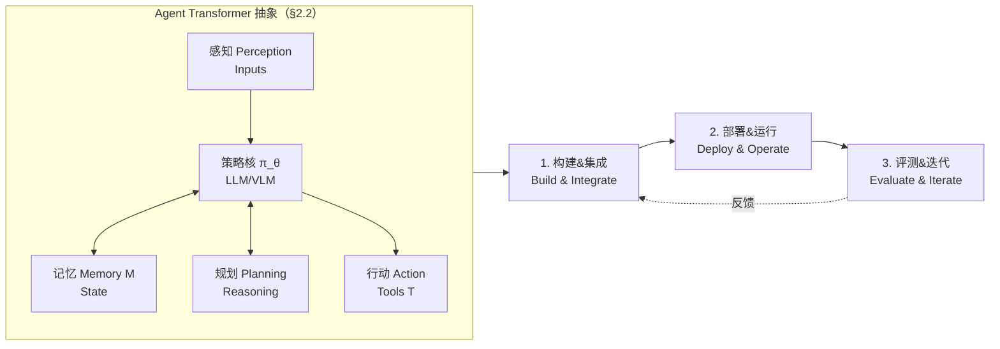
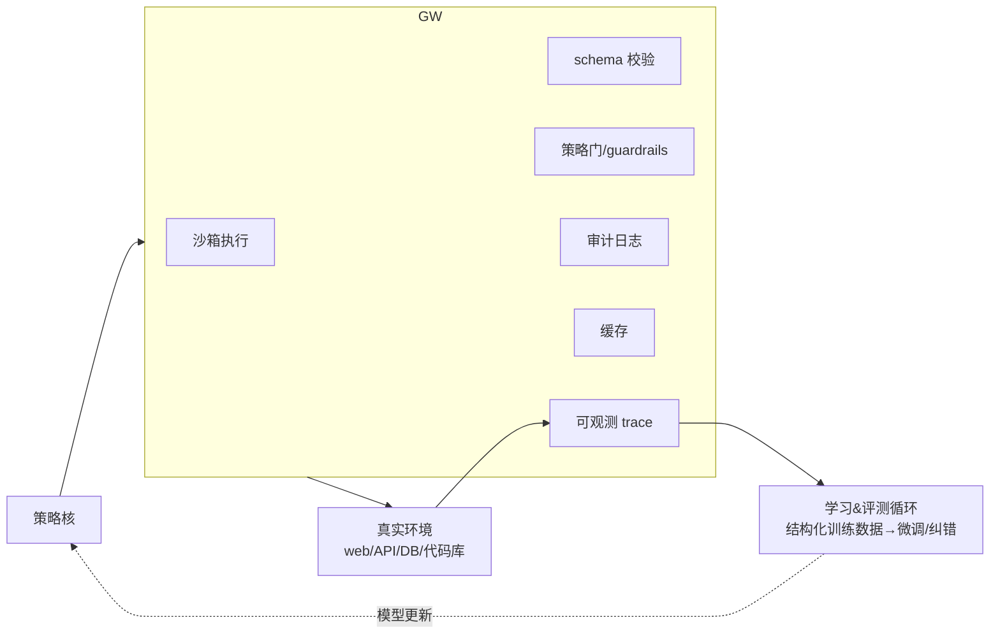

# AI Agent 系统：架构、应用与评测

> **本篇在 agent-harness 库里的角色 = 一张「全库地图」。** 它不造新系统、不出新基准，而是把
> 「把会推理的模型变成会干活的 agent」这件事，抽象成一个**可解剖的五元组**，并沿三条坐标轴把
> 几乎所有 agent 形态归了类。读它的正确姿势：**不要流水账地复述每一类**，而是抓住两根主干——
> ①「Agent Transformer」五元组 $\mathcal{A}=(\pi_\theta,\mathcal{M},\mathcal{T},\mathcal{V},\mathcal{E})$（§2，本库 E/T/C/L/O/V 的论文版前身）；
> ②六维评测的指标定义式（§6，把「成功率」一个数拆成向量）。其余（学习栈、按能力的分类、按任务的应用）都挂在这两根主干上。
> 对齐标杆范文 [Harness-Bench](2605.27922-harness-bench-measuring-harness-effects.md) 的密度与诚实度。

---

## §1　TL;DR（一页讲清这篇在干嘛）

> 主讲提示：开场点明这是**综述**——它的价值不在某个数字，而在「分类法 + 形式化 + 评测协议」三件套；并立刻把它接到全库中心命题上。

**一句话**：这篇综述把「AI agent」定义为「**把基础模型嵌进一个能观察环境、规划、调工具、更新记忆、验证结果的控制循环**」的系统（§1.1 原文："an agent is not just a generator of text; it is a controller that translates intent into *procedures*"），然后做三件事——

1. **给一个统一抽象**：`Agent Transformer`，即一个五元组 $\mathcal{A}=(\pi_\theta,\mathcal{M},\mathcal{T},\mathcal{V},\mathcal{E})$（策略/记忆/工具/验证器/环境），并把执行循环写成 Eq.(1)–(4)（§2.2）。
2. **给一套分类法**：沿三条轴——**交互位点**（文本/工具 vs 物理具身 vs 仿真）、**生成目标**（内容/世界/体验）、**推理基底**（知识/逻辑/情感/神经符号）——把 agent 归类（§4），再按**应用任务域**（编码/企业/浏览器/实时多模态/游戏/机器人/医疗/多模态/NLP）逐个分析（§5）。
3. **给一套评测框架**：主张 agent 评测必须是**端到端、多维**的——把「成功率」一个数拆成 6 个维度（端到端性能 / 效率成本 / 工具正确性 / 轨迹规划质量 / 鲁棒性 / 安全合规），每维给定义式 Eq.(5)–(24)（§6）。

- **属于 harness 的哪一层（Θ1）**：本篇是**跨层综述**——它的五元组把本库 E/T/C/L/O/V 六层一次性摆上台面：$\mathcal{E}$=Environment、$\mathcal{T}$=Tools、$\mathcal{M}$=Context/记忆、控制循环=Loop、$\mathcal{V}$=Validation、而它的 §6 评测+§3 infrastructure 的 audit-log/trace 正是 Observability。所以它在 §1 与 §17 都标"跨层"。
- **回扣全库论点（Θ2）**：这篇是 `Agent = Model + Harness` 的**形式化母本**。它在 §8 结论里把话说死："reliability and governance are properties of the **full stack (model + orchestration + tools)** rather than the base model alone"（§8 原文）——这正是 Harness-Bench 用 23.8 分极差去**实测**的那句话，本篇把它**写成了定义与公式**。
- **权威性与时间坐标（Θ4）**：2026-01 预印本，单作者综述（ASU，Bin Xu）。它的权威性不来自顶会接收（原文未标 venue），而来自**覆盖面与时效**：参考文献横跨 ReAct/Reflexion/Toolformer/MRKL/MemGPT/SWE-agent/WebArena/GAIA 等几乎全部 canon，并纳入 2025 的多篇「agent 分类法」姊妹综述（[48][49][66][10][41] 等）。它是本库 A 组里**最新、最全的一张地图**。

---

## §2　问题与动机：为什么"再写一篇 agent 综述"还值得做

> 主讲提示：这页用 Why 三连的「问题层」，讲清楚作者眼里现有 agent 研究的三个缺口——别把它讲成"又一篇 review"。

**Why（问题层）——不解决会卡住什么？**
基础模型让自然语言成了"计算的接口"，但**真实任务几乎都不是单轮问答**：要从多个源头收集信息、跨时间维护状态、在约束（延迟/权限/安全/成本）下调工具、执行多步动作（§1.1 原文）。纯对话系统在这些场景里"常因幻觉、缺乏 grounding、无法执行或验证动作而失败"（§1.2）。于是 agent = 基础模型 + 执行循环，成了"自然语言意图"与"真实世界计算"之间的实用接口（摘要原文）。

作者点出当前 agent 研究的**三类系统性缺口**（§1.4 + §3 引言）：

1. **可靠性/可复现性**：长程任务**放大复合误差**（compounding errors），加上非确定性（采样、工具抖动），没有标准协议与完整 trace 就难以调试与复现（§1.4）。
2. **治理/安全**：工具型 agent 引入新风险——不可信检索内容与 prompt injection 能操纵工具调用，有副作用的动作需要"超出文本审核"的更强约束（§1.4 原文 "require stronger constraints than text-only moderation"）。
3. **概念碎片化**：领域里"什么算 agent、什么算 agentic workflow""怎么把策略模型和编排分开""怎么表示环境/工具/记忆"——词汇尚未统一（§7.6 原文 "clearer conceptual frameworks ... are needed"）。

**Why（设计层）——为什么用"综述+形式化"而非"再造一个系统"？**
> 朴素替代：再发一个更强的 agent 框架。→ 会**加剧**碎片化（又多一套词汇/接口），且无法回答"不同设计之间怎么公平比较"。本文改用**统一抽象 + 分类法 + 评测协议**：把 agent 写成五元组、沿三轴归类、把评测做成指标向量——目标是给这个领域一套**可对照的坐标系**（§7.6 原文呼吁 "standardize agent interfaces ... allow apples-to-apples comparisons"）。代价：综述天然**不产生新实验证据**，所有"结论"都是对已有工作的归纳（这点是它的边界，见 §14）。

> **读出什么（Θ2 呼应）**：这篇的动机和 Harness-Bench 是**一体两面**——HarnessBench 出"卡尺"去量 harness，本篇出"地图"去定义 harness 由哪些部件构成。先有地图（知道要量什么），卡尺才量得准。

---

## §3　核心 intention：一句话 + 中心假设

把全篇压成一句**可证伪的主张**（§8 结论原文）：

> **"Agents are *budgeted* systems with structured tool interfaces and trace-first operation, where reliability and governance are properties of the full stack (model + orchestration + tools) rather than the base model alone."**
> （译：agent 是**带预算**的系统，有结构化工具接口、以 trace 为先；可靠性与治理是**全栈**的性质，而非底座模型独享。）

拆成三个可被后续论文检验的假设：
- **H1（预算假设）**：agent 应被当作"在时间/token/工具调用/可允许副作用上有显式预算的受控循环"，并**动态分配**思考（deliberation）只在难/险时才花（§2.1 原文 "dynamically allocates 'thinking' only when the task is hard or risky"）。
- **H2（接口假设）**：结构化动作空间（typed tool schema + 结构化输出）应作为**主控制面**——动作要先过 schema 校验与策略检查才执行，以压住自由文本幻觉（§2.1、§7.1）。
- **H3（全栈假设）**：能力/可靠性/安全是 `模型 + 编排 + 工具` 的联合性质；评测必须**端到端**，并同时报告隐藏成本（retries、context growth）（§1 摘要、§6）。

> 主讲提示：H3 就是本库的命题。把它念出来，后面 §17 再回扣。

---

## §4　相关工作定位：它站在谁肩上、和谁不同

> 主讲提示：一张表讲清"这篇综述相对 canon 与同期综述的增量"。

| 坐标 | 代表工作（原文引用） | 它们各自定了什么 | 本篇相对它们的增量 |
|---|---|---|---|
| **执行循环 canon** | ReAct [64]、Reflexion [53]、Tree-of-Thoughts [63] | 推理-行动交织 / 反思自纠 / 搜索式审议 | 本篇把三者**统一**为五元组里"$\mathcal{V}$ 验证 + test-time compute 分配"的特例（§2.2、§7.3） |
| **工具/路由 canon** | Toolformer [50]、MRKL [21]、Gorilla [40] | 自监督学工具 / 神经符号路由 / 大规模 API 调用 | 本篇把它们归到"$\mathcal{T}$ + 结构化接口"这一层，强调"接口稳定则 in-context 学习即可"（§3.1.4） |
| **记忆 canon** | RAG [24]、MemGPT [38] | 检索 grounding / LLM 当操作系统管记忆 | 归到"$\mathcal{M}$ 记忆子系统"，并点出记忆是**安全面**（可被注入污染）（§7.2） |
| **基准 canon** | SWE-bench [20]、WebArena [67]、ToolBench [44]、AgentBench [29]、GAIA [32] | 各自给一类任务的端到端评测 | 本篇把它们**编织进 6 维评测框架**，给统一指标向量 Eq.(24)（§6.7） |
| **同期 agent 综述** | Masterman 2024 [30]、Sapkota 2025 [49]、Zhou 2024 [66]、Luo 2025 [29-survey?]、Yehudai 2025 [65] | "架构选项""Agent vs Agentic AI 概念分类""评测综述" | 本篇的差异：**同时**给①形式化五元组、②三轴分类、③六维评测**指标定义式**——而非只做概念或只做评测 |

> **读出什么**：本篇的"卖点"不是某一块更深，而是**把"架构 / 应用 / 评测"三件事缝在同一套坐标系里**（标题三词即此）。它在 §7.6 明说目标是"把 systems / learning / evaluation 当成**耦合的栈**，而非独立话题"。

---

## §5　方法总览：Agent-centric 范式一图流

> 主讲提示：先给 big picture，不展开数学。强调"模型是嵌在循环里的策略核，不是终点"。

本篇的总图（Fig.1–2）把 agent 画成"基础模型（策略核）+ 四个外围接口（感知 / 记忆 / 规划 / 行动）+ 一个执行循环"。落到工程，是一条"构建-部署-评测-迭代"的实践 recipe（Fig.2 下半）。

**三大使能技术趋势**（§1.3，Fig.1 下半）——也是本库各组论文的来路：
- **基础模型 [9,36]**：强泛化 + 指令跟随 + 涌现的 in-context learning（免重训快速适配）。
- **对齐与偏好优化（RLHF）[11,37]**：提可用性、降有害行为。
- **工具调用 [40,50]**：把"语言"经 schema/API 变成"可执行动作"。
- **检索与记忆（RAG）[24,38]**：把决策 grounding 到外部证据与持久状态。
- **推理-行动编排（ReAct/Reflexion）[53,64]**：交织审议与环境交互、从失败恢复。
- **多模态感知 [26,28,45]**：把动作空间扩到 GUI、文档、具身设置。

> **读出什么**：这六个趋势**一一对应**本库的分组（C=工具、D=上下文/记忆、B=循环、F=环境、G/H=验证/可观测）。本篇相当于把"为什么会有这些组"讲了一遍来路。

---

## §6　符号与术语表（后文要用的所有记号）

> 主讲提示：先把五元组与循环里的符号定义清楚，§7 的四个公式才好读。

| 记号 | 含义（原文 §2.2 / §6） |
|---|---|
| $\mathcal{A}$ | 一个 agent transformer（整体），写成五元组 |
| $\pi_\theta$ | transformer **策略**（policy），参数 $\theta$；把观察映射到动作（plan / tool call / 文本） |
| $\mathcal{M}$ | **记忆**子系统：短期工作上下文 + 长期状态（检索、摘要、state） |
| $\mathcal{T}$ | **工具**集合：带 typed schema 的 API、代码执行、搜索、数据库 |
| $\mathcal{V}$ | **验证器/批评者**（verifiers/critics）：在产生副作用**前**检查动作提案 |
| $\mathcal{E}$ | **环境**：任务工作区、文件、本地服务、执行期暴露的资源 |
| $o_t$ | 第 $t$ 步从 $\mathcal{E}$ 得到的**观察** |
| $m_t$ | 第 $t$ 步从 $\mathcal{M}$ 检索到的**相关记忆** |
| $\hat a_t$ | 第 $t$ 步策略提出、且经 $\mathcal{V}$ 校验后的**候选动作** |
| $\mathcal{D}=\{1,\dots,N\}$ | 评测任务集合，$N$ 个任务（§6） |
| $\tau_i=(a_{i,1},\dots,a_{i,T_i})$ | 任务 $i$ 的**轨迹**，长度 $T_i$ 步 |
| $s_i\in\{0,1\}$ | 任务 $i$ 的**成功**指示（verifier 给出） |
| $R_i$ | 任务 $i$ 的标量分（若环境提供 reward/graded score） |
| $x_i,\,y_i$ | 任务 $i$ 的输入 / 输出 token 数；$K_i$=工具调用次数；$u_{i,k}\in\{0,1\}$=第 $k$ 次工具调用是否执行成功 |

---

## §7　方法细节①：Agent Transformer 的形式化（§2.2，全篇最该讲透的一页）

> 主讲提示：这是本篇唯一一组"硬"公式。逐式：直觉 → 符号 → 公式 → 读出什么。强调它把 agent 变成了"对交互轨迹建模的序列模型"。

**直觉**：作者要把"agent 行为"变成**可被序列模型刻画的东西**——一条由"观察、中间想法/计划、工具调用、结果"组成的**交互轨迹**（§2.2 原文 "make agent behavior a sequence model over *interaction traces*"）。所以先把 agent 拆成五个显式接口，再把"每一步发生了什么"写成循环。

**式 (1)：agent = 五元组。** 把"一个 agent"显式拆成五个部件，是为了让"该往哪改"有抓手——改记忆？改工具？还是加验证器？

$$\mathcal{A} \;=\; (\pi_\theta,\; \mathcal{M},\; \mathcal{T},\; \mathcal{V},\; \mathcal{E}) \tag{1}$$

读出什么：这就是 `Agent = Model + Harness` 的**论文版**——$\pi_\theta$ 是 Model，$(\mathcal{M},\mathcal{T},\mathcal{V},\mathcal{E})$ 合起来就是 Harness（记忆/工具/验证/环境）。本库的 D/C/G/F 组分别在动这四个分量。

**式 (2)：每步先观察、再取记忆。** 直觉：agent 行动前要先"看见现在"（环境状态）并"想起相关的过去"（记忆），否则就是闭眼乱动。

$$o_t \leftarrow \mathrm{Obs}(\mathcal{E}_t), \qquad m_t \leftarrow \mathrm{Retrieve}(\mathcal{M}_t, o_t) \tag{2}$$

符号：$\mathrm{Obs}$=从环境 $\mathcal{E}_t$ 读观察；$\mathrm{Retrieve}$=以当前观察 $o_t$ 为 query 从记忆 $\mathcal{M}_t$ 取 $m_t$。
读出什么：检索是**以"此刻观察"为条件**的——这解释了为什么 RAG 不是"一次性塞资料"，而是循环里每步都可能重检（D 组的活）。

**式 (3)：提案动作、再过验证。** 直觉：策略先"想"出一个候选动作，但**不直接执行**——先让验证器/schema 卡一遍。这一步是"把幻觉挡在副作用之前"。

$$\hat a_t \sim \pi_\theta(\,\cdot \mid o_t, m_t), \qquad \hat a_t \leftarrow \mathrm{Validate}(\mathcal{V}, \hat a_t) \tag{3}$$

符号：$\pi_\theta(\cdot\mid o_t,m_t)$=以观察+记忆为条件的动作分布（采样得候选）；$\mathrm{Validate}(\mathcal{V},\cdot)$=用验证器/工具 schema 约束检查/修正候选。
读出什么：$\mathcal{V}$ **不是可选插件，而是定义了 agent 的操作语义**（§2.3 原文 "verifiers are not optional add-ons but define the operational semantics"）。低风险动作可少审、高风险动作触发多步验证/人确认——这是 H1"预算"假设的落点。

**式 (4)：执行并更新环境与记忆。** 直觉：动作通过审查后才真正落到环境，并把"这一步发生的事"写回记忆，供下一步检索。

$$\mathcal{E}_{t+1} \leftarrow \mathrm{Exec}(\mathcal{E}_t, \mathcal{T}, \hat a_t), \qquad \mathcal{M}_{t+1} \leftarrow \mathrm{Update}(\mathcal{M}_t, o_t, \hat a_t, \mathcal{E}_{t+1}) \tag{4}$$

符号：$\mathrm{Exec}$=经工具 $\mathcal{T}$ 在环境上执行动作，得新环境 $\mathcal{E}_{t+1}$；$\mathrm{Update}$=把（观察、动作、新环境）写回记忆。
读出什么：这条把"环境状态"与"记忆状态"**双更新**写明了——agent 的"状态"同时活在世界里（$\mathcal{E}$）和脑子里（$\mathcal{M}$）。F 组（环境/状态重建）攻的就是这两者的一致性。

**Why（设计层）——为什么把它写成"风险感知的预算化控制器"？**
> 朴素替代：把 agent 当"一次把答案生成完"的函数。→ 长程任务下复合误差爆炸、且无法对高风险动作差异化对待。本文改用"循环 + 验证 + 预算"框架（§2.2 末原文 "risk-aware, budgeted controller"）：动作按**可逆性与潜在影响**分级——低风险（只读查询）可少审议，高风险（写/部署/支付）触发额外验证、多步取证或人审。这样 ReAct 轨迹的价值就不止"性能"，而是**把决策绑到证据与工具输出上、支持事后审计与可复现回放**（§2.3 原文）。

> **读出什么（Θ2）**：式 (1)–(4) 是本库所有"机制类"论文的**公共基座**。任何一篇 C/D/F/G 组论文，都可以问一句："它在改 (1) 的哪个分量、(2)–(4) 的哪一步？"——ReAct 改的是"交织"、Reflexion 在 $\mathcal{V}$ 上加反思通道、RAG 改 $\mathrm{Retrieve}$、ToT 在式 (3) 的采样上加搜索。

---

## §8　方法细节②：三层学习栈——"学什么"取决于"在哪一层"

> 主讲提示：这页讲 §3 的主干。核心 intention：能力提升越来越来自**系统设计**而非更大底座（§2.1 原文 "capability gains increasingly come from system design rather than only from bigger backbones"）。

本篇把 agent 的"学习"分成**三层**（§3 引言 + Fig.4），每层"该学什么"不同：

| 层 | 内容（§3.x） | 该学什么 / 关键机制 |
|---|---|---|
| **① 机制层** | RL / IL / 传统 RGB / in-context / 系统优化（§3.1.1–3.1.5） | 怎么优化策略、提示、控制器 |
| **② 系统层** | 模块（policy core/记忆/路由/critic）+ 基础设施（沙箱/schema/审计日志/可观测）（§3.2.1–3.2.2） | 怎么把"模型"变成"可依赖的执行器" |
| **③ 基础模型层** | 预训练（grounding/泛化）+ 微调（指令/偏好/trace-centric）（§3.3） | 怎么让工具用/规划/grounding 长进权重里 |

**机制层 5 条路线的一句话对照（§3.1）**：
- **RL [43,55]**：直接优化长程回报（MDP）；适合"学**行为**而非一步预测"——但工具型现实里 rollout 贵、奖励稀疏、安全约束限制探索，故转向 offline/constrained-safe RL（§3.1.1）。
- **IL [42,47]**：有专家轨迹时的务实路线；行为克隆易受**复合误差/分布漂移**，DAgger 用"在策略诱导状态上收集纠正"补救（§3.1.2，Fig.6）。
- **传统 RGB**（Rule/Graph/Behavior-tree）[12]：可预测、可审计、可显式编码约束；脆性（手写规则难泛化）是其软肋；现代栈**混合**——LLM 提目标，RGB 守安全/时序（§3.1.3，Fig.7）。
- **in-context learning [9,34]**：把 prompt 当"软程序"（动作格式/工具 schema/策略即 few-shot 范例），免重训快迭代；但有"上下文增长抬成本、长提示稀释约束、检索文本带 prompt injection"的系统级失效（§3.1.4，Fig.8）。
- **系统优化 [53,63]**：把 agent 性能当**系统优化问题**——可靠性/延迟/成本由编排策略（调几次工具、验证多深、何时回溯）决定（§3.1.5，Fig.9）。

**Why（设计层）——为什么强调"学习是模型与编排的 co-design"？**
> 朴素替代：把"提升 agent"等同于"换更大模型"。→ 纯底座 scaling **消不掉**工具用脆性（幻觉动作、弱 grounding、长程不稳）（§4.6 原文 "Pure backbone scaling does not eliminate tool-use brittleness"）。本文主张（§3.1.5 末 "co-design problem between models and orchestration"）：**最有冲击力的改进常来自改决策循环，而非改底座**——这与 H3 全栈假设、与 Harness-Bench 的实证完全同向。

> **读出什么（Θ2 + Θ5 伏笔）**：这页是本库命题的"机理解释"。但注意作者没把话说绝对——§3.3 末也承认"若 schema 弱，微调就得隐式学安全/接口约束，更不可靠"，即**编排与权重哪个更重要，取决于接口是否稳固**（regime 依赖，留到 §13）。

---

## §9　方法细节③：基础设施"决定了什么是可学的"（§3.2.2，最被低估的一句）

> 主讲提示：这页只讲一个反直觉点——基础设施不仅决定"能不能安全跑"，更决定"agent 能学到什么"。

作者一句话点破（§3.2.2 原文）："**infrastructure determines what is learnable**"——

- 若工具调用被**带参数与结果地记录**，它们就成了"工具用微调/错误恢复"的训练数据；若 trace 缺失，就只能退回更弱的信号（§3.2.2）。
- schema 校验与沙箱把"开放式动作"变成"受约束接口"，**降低灾难性幻觉参数**（§3.2.2）。
- 评测基础设施本身是学习的一部分：可复现基准 + 回归测试，使"跨 prompt/路由/记忆/验证深度的消融"成为可能（§3.2.2）。

> **读出什么（Θ1）**：这页把本库的 **O 层（Observability）** 的"母题"讲了——**trace 不是事后日志，而是数据飞轮的燃料**（§7.2 原文 "trace-first data flywheel"）。这正是 Harness-Bench Inspires-Us 里"先把 trace 结构化录制"那条的理论依据。

---

## §10　方法细节④：分类法——三条轴怎么把 agent 归类（§4）

> 主讲提示：综述的灵魂在这页。重点不是"有哪些类"，而是**为什么用这三条轴**（设计层 why）。

本篇的分类法不按"模型大小"或"任务难度"切，而沿**三条更本质的轴**（§4 引言原文）：

1. **交互的主导位点（dominant locus of interaction）**：文本/工具 vs 物理具身 vs 仿真环境。
2. **生成目标（generative target）**：内容 / 世界 / 体验。
3. **推理基底（reasoning substrate）**：知识 / 逻辑 / 情感 / 神经符号结构。

**Why（设计层）——为什么是这三条轴，而非"按应用领域"或"按模型"分？**
> 朴素替代 A：按应用领域分（编码/医疗/游戏…）。→ 同一套架构会在多个领域重复出现，分类**抓不住共性**。
> 朴素替代 B：按底座模型分（GPT 系/Claude 系…）。→ 模型迭代太快，分类**会过期**，且掩盖了"能力来自系统"这一事实。
> 本文选这三轴，理由是它们对应"**最强烈塑造系统设计的约束**：可观测性、安全、延迟、验证、评测"（§4 引言原文 "categories reflect the constraints that most strongly shape system design"）。即：分类轴 = 约束轴，这样归类才对"该怎么设计 harness"有指导。

按这三轴展开的**类目地图**（§4.1–4.6）：

| 大类（§4.x） | 子类 | 主导约束 / 怎么 build（原文要点） |
|---|---|---|
| **通用 agent** §4.1 | 编码/浏览/分析/企业 | 共享策略核 + 模块化工具/记忆；端到端评测（WebArena/SWE-bench/ToolBench/AgentBench） |
| **具身 agent** §4.2 | Action（重做） / Interactive（人在环） | 分层：LLM/VLM 规划器 + 经典/RL 控制器守时序安全；SayCan/PaLM-E/RT-2 式（Fig.13） |
| **仿真/环境 agent** §4.3 | 游戏/web 沙箱/合成世界 | 环境当显式观察/动作接口；防 reward hacking、防 sim-to-real gap；Voyager 式技能库 |
| **生成 agent** §4.4 | 故事/场景/角色/社会仿真；AR/VR | 长程**一致性**是核心难点；把开放生成变成"生成-校验-修订"的工具化循环（Fig.14-15） |
| **知识/逻辑 agent** §4.5 | 知识/逻辑/情感/神经符号 | 区分证据 vs 推测；逻辑型把正确性关键步**外包给 solver/verifier**（MRKL/Toolformer）（Fig.16-17） |
| **LLM/VLM agent** §4.6 | 以底座为主驱动 | 强调"底座 scaling 消不掉工具脆性"，仍需结构化接口+验证（§4.6） |

> **读出什么（Θ1）**：这张表里，**每一类的"主导约束"几乎都落在 E/T/C/L/O/V 某一层**——具身=环境+时序（E+Loop）、生成=一致性（C+V）、逻辑=验证（V+T）。所以本库的分组（B/C/D/F/G/H）其实是这张分类表"按约束层"的重排。

---

## §11　应用任务巡览：九个域，一条共同处方（§5）

> 主讲提示：§5 很长（9 个应用域），但**别逐个念**。抓"共同处方"——所有域的解决方案都长一个样。

本篇按任务域逐个分析（§5.1–5.7，Fig.18 全景），但**九个域收敛到同一条工程处方**：

> **检索 grounding（RAG）+ 模块化工具路由（MRKL）+ ReAct 式可追溯循环 + critic/反思或搜索（高不确定性时加深审议）+ 结构化接口/权限门**。

九域要点速记（每域只取"最痛的约束"，§5.1–5.7）：

| 应用域 | 最痛的约束（原文） | 处方落点 |
|---|---|---|
| 自治编码 §5.1.1 | 长程+工具富、隐式需求、失败延迟显现 | 工具化编码 agent + 显式验证循环（小 diff/跑测试/迭代修复）（Fig.- 编码） |
| 企业 CRM/IT §5.1.2 | 严格访问控制/审计/合规、prompt injection | 编排+多 agent、策略-as-code 门、不可变审计日志、verifier 模式（Fig.19） |
| 浏览器/GUI §5.1.3 | 部分可观测、动态布局、对抗页面 | 把 web 当环境（观察/动作+状态断言/重试）、ReAct + 回溯/重解析（Fig.20） |
| 实时多模态 §5.1.4 | 延迟、上下文管理、流式同步、视觉幻觉 | 感知拆成工具（OCR/检测/检索）+ LLM 编排 + 中间产物可检验（Fig.21） |
| 游戏 §5.2 | 实时预算、长会话一致性、对抗玩家 | 高层认知/低层控制分离、持久记忆、critic 查一致性（Fig.22） |
| 机器人 §5.3 | 部分可观测+随机、硬时序、物理伤害 | 分层编排：LLM/VLM 规划 + 专用控制器；执行前估风险/选更安全动作（Fig.23） |
| 医疗 §5.4 | 安全/隐私关键、漏诊比错句更危险 | 受约束工作流 agent（只读/模板化/最小权限）+ 验证步 + 审计日志，决策留给人 |
| 多模态（图/视频）§5.5 | 视觉幻觉、faithfulness、长上下文/时序 | VLM 感知 + LLM 规划分离；segment-retrieve-plan；引用绑定证据（Fig.24） |
| NLP/LLM agent §5.7 | 幻觉/过度自信、工具脆、长程误差复合 | ReAct + MRKL + verifier/critic；over-refusal vs unsafe-compliance 的张力（§5.7.3） |

> **读出什么（Θ2）**：九个域、一条处方，恰恰是 `Agent = Model + Harness` 的另一种说法——**换了任务域，模型可能换、但"harness 该长什么样"高度收敛**。这条处方就是本库 C/D/F/G/H 各组方法的"应用侧出口"。

---

## §12　评测：把"成功率一个数"拆成六维向量（§6，第二根主干）

> 主讲提示：这是本篇对本库最有用的一页。逐维给指标定义式。强调"单一 headline 成功率不够"（§6 原文 "a single headline success metric is insufficient"）。

**通用设定（§6）**：基准给任务集 $\mathcal{D}=\{1,\dots,N\}$；任务 $i$ 产出轨迹 $\tau_i=(a_{i,1},\dots,a_{i,T_i})$，验证器返 $s_i\in\{0,1\}$ 及可选标量 $R_i$。下面六维（§6.1–6.6），每维给定义式。

**维度① 端到端性能（primary，§6.1）**——直觉：先问"到底做完没"。
$$\mathrm{SuccessRate}=\frac1N\sum_{i=1}^N s_i \tag{5}\qquad \bar R=\frac1N\sum_{i=1}^N R_i \tag{6}$$
$$\bar t=\frac1N\sum_{i=1}^N t_i \tag{7}\qquad \bar T=\frac1N\sum_{i=1}^N T_i \tag{8}$$
符号：$t_i$=任务 $i$ 的墙钟耗时；$T_i$=轨迹步数（动作/工具调用数）。读出什么：成功率必须**配上时间/步数**一起看——否则"做完但慢到不可用"会被掩盖。

**维度② 效率与成本（§6.2）**——直觉："能解"不等于"解得起"。
$$\mathrm{Tokens}_i=x_i+y_i,\quad \overline{\mathrm{Tokens}}=\frac1N\sum_i (x_i+y_i) \tag{9}$$
$$\mathrm{Cost}_i=p_{\mathrm{in}}x_i+p_{\mathrm{out}}y_i,\quad \overline{\mathrm{Cost}}=\frac1N\sum_i \mathrm{Cost}_i \tag{10}\qquad \bar K=\frac1N\sum_i K_i \tag{11}$$
$$\text{（延迟分位）}\quad \mathrm{Quantile}_q(t)=t_{(\lceil qN\rceil)},\quad p95=\mathrm{Quantile}_{0.95}(t) \tag{12}$$
符号：$x_i/y_i$=输入/输出 token；$p_{\mathrm{in}}/p_{\mathrm{out}}$=单价；$K_i$=工具调用数；$t_{(1)}\le\dots\le t_{(N)}$=排序后的耗时。读出什么：要报**尾延迟 p95** 而非只报均值——agent 的长尾（retry/回溯）才是部署杀手。

**维度③ 工具用正确性（§6.3）**——直觉：不只看"用了哪个工具"，还看"调得对不对、错了能不能恢复"。
设第 $j$ 步有"正确工具标签"$\ell_{i,j}$、预测 $\hat\ell_{i,j}$：
$$\mathrm{ToolSelAcc}=\frac{\sum_{i=1}^N\sum_{j=1}^{T_i}\mathbf{1}\{\hat\ell_{i,j}=\ell_{i,j}\}}{\sum_{i=1}^N T_i} \tag{13}$$
设 $v_{i,k}\in\{0,1\}$=第 $k$ 次调用参数是否正确（schema 合法且语义对）：
$$\mathrm{ArgAcc}=\frac{\sum_i\sum_k v_{i,k}}{\sum_i K_i},\qquad \mathrm{ToolExecSucc}=\frac{\sum_i\sum_k u_{i,k}}{\sum_i K_i} \tag{14}$$
设 $F_i=1$ 表示任务 $i$ 至少经历一次工具失败：
$$\mathrm{RecoveryRate}=\frac{\sum_i \mathbf{1}\{F_i=1\}\mathbf{1}\{s_i=1\}}{\sum_i \mathbf{1}\{F_i=1\}} \tag{15}$$
读出什么：Eq.(15) **恢复率**是 H 组论文（工具失败恢复）的核心靶子——它专门量"出错后还能不能救回来"。

**维度④ 轨迹/规划质量（architecture-sensitive，§6.4）**——直觉：解释"为什么成/为什么败"，对编排选择最敏感。
设 $w_{i,j}\in\{0,1\}$=动作 $a_{i,j}$ 在环境中是否合法；$\mathrm{uniq}(\tau_i)$=轨迹访问的不同动作/状态数；参考计划 $P_i=(p_{i,1},\dots,p_{i,M_i})$：
$$\mathrm{ValidActRate}=\frac{\sum_i\sum_j w_{i,j}}{\sum_i T_i} \tag{16}$$
$$\mathrm{LoopRate}_i=1-\frac{\mathrm{uniq}(\tau_i)}{T_i},\quad \overline{\mathrm{LoopRate}}=\frac1N\sum_i \mathrm{LoopRate}_i \tag{17}$$
$$\mathrm{PlanAdh}_i=\frac{1}{\min(T_i,M_i)}\sum_{j=1}^{\min(T_i,M_i)}\mathbf{1}\{a_{i,j}=p_{i,j}\} \tag{18}$$
读出什么：**LoopRate（打转率）** 量"重复同一步/在状态间震荡"——这是 ReAct 循环最典型的病；本库 B 组（控制循环）直接对它负责。

**维度⑤ 鲁棒性与可靠性（§6.5）**——直觉：真实环境有噪声/扰动，要测最坏而非最好。
任务 $i$ 在扰动 $m=1,\dots,M$ 下结果 $s_{i,m}$；跑 $S$ 个种子结果 $s_{i,s}$：
$$\mathrm{RobustSucc}=\frac{1}{NM}\sum_i\sum_m s_{i,m},\qquad \mathrm{WorstSucc}=\frac1N\sum_i \min_m s_{i,m} \tag{19}$$
$$\mu_i=\frac1S\sum_s s_{i,s},\quad \mathrm{Var}_i=\frac1S\sum_s (s_{i,s}-\mu_i)^2,\quad \overline{\mathrm{Var}}=\frac1N\sum_i \mathrm{Var}_i \tag{20}$$
读出什么：$\mathrm{WorstSucc}$ 取 $\min_m$ 是因为"只要某个扰动下垮掉就算不鲁棒"——和 Harness-Bench 乘法打分的"任何一项垮掉就该塌"是同一种保守哲学。

**维度⑥ 安全与合规（§6.6）**——直觉：agent 有自主权后，安全要沿**整条轨迹**评，而非只看最终回答。
$q_i$=任务 $i$ 是否发生违规（不安全工具动作/泄露/越权生成）；$h_i$=是否需要人介入；$H_i$=介入次数：
$$\mathrm{ViolationRate}=\frac1N\sum_i q_i \tag{21}\quad \mathrm{InterventionRate}=\frac1N\sum_i h_i \tag{22}\quad \mathrm{InterventionsPerStep}=\frac{\sum_i H_i}{\sum_i T_i} \tag{23}$$
读出什么：安全要绑到**具体威胁模型**（prompt injection / 不可信工具输出 / 权限提升）并配 trace 证据报告（§6.6 原文）——这是 G 组（验证）+ O 组（可观测）的合流。

**指标向量（Eq.24，§6.7）**——把六维拍成一个**向量**，而非单一标量：
$$\mathbf{m}=\big(\mathrm{SuccessRate},\bar R,\bar t,\bar T,\overline{\mathrm{Tokens}},\overline{\mathrm{Cost}},\bar K,\mathrm{ToolSelAcc},\mathrm{ArgAcc},$$
$$\quad\;\;\mathrm{ToolExecSucc},\mathrm{RecoveryRate},\mathrm{ValidActRate},\overline{\mathrm{LoopRate}},\mathrm{RobustSucc},\mathrm{WorstSucc},\overline{\mathrm{Var}},\mathrm{ViolationRate},\mathrm{InterventionRate}\big) \tag{24}$$

> **读出什么（Θ1 + Θ2）**：Eq.(24) 是本篇给本库最实用的礼物——**一张可直接抄的"agent 体检表"**。把它和 Harness-Bench 的 `TaskScore=Security·Completion·Process` 并看：HarnessBench 是"把这 18 维**压成一个保守标量**去排序 harness"，本篇是"**把标量摊开成 18 维**去诊断"。二者互补：先用 Eq.(24) 诊断，再用乘法分排名。

**常用基准（§6.7）**：AgentBench [29]（多环境）、WebArena [67]（真实 web 端到端）、ToolBench [44]（工具选择/参数/执行）、SWE-bench [20]（软件 issue 端到端）、GAIA [32]（短可验证答案的通用助手）。

---

## §13　讨论：强模型会让 harness 变得不重要吗？（regime 诚实，Θ5）

> 主讲提示：这页是判断力高地。本篇是综述，态度比 Harness-Bench 更克制——它给的是"条件"，不是"结论"。

本篇没有用一个数字去断言"harness > model"，但它在多处给出了**分 regime 的条件**，把这事讲得很诚实：

- **一方面**（编排主导的 regime）：§2.1 + §3.1.5 明说"能力提升越来越来自系统设计而非更大底座""最有冲击力的改进常来自改决策循环"——这与 Harvey/CORE-Agent/Cursor 一侧（harness 增益巨大）一致。
- **另一方面**（接口/模型主导的 regime）：§3.3 末承认"**若编排强制了严格 schema 与验证器，微调就可聚焦高层规划；若 schema 弱，微调就得隐式学安全/接口约束，更不可靠**"——即 harness 的边际价值**取决于接口是否已稳固**。§4.6 也承认强底座带来"更广的覆盖与更好泛化"。
- **作者的收口姿态**（§7.6 + §8）：不站队，而是呼吁"把 systems/learning/evaluation 当**耦合栈**""**同时报告**模型与系统级指标"——这恰是 Harness-Bench §13"未来基准应同时报模型与 harness 条件"的综述版回声。

> **读出什么（与本库 G 组批判呼应）**：诚实表述是——**"harness 是否主导"分 regime**：任务越需要动手/保状态/串多步工具、接口越不稳、模型越弱 → harness 越主导；任务越偏纯语言、接口越标准化、模型越强 → harness 退居其次。本篇没给量化坐标（那是 Harness-Bench §9/§12 的活），但它把"决定 regime 的变量"（接口稳定性、任务的工具/状态强度、风险等级）一一点了出来。**不要把本篇读成"harness 必胜"的背书**——它给的是地图，不是站队。

---

## §14　局限与批判（综述固有边界 + 我的补充）

**综述固有的边界（作者在 §7/§8 隐含承认）**：
- **不产生新证据**：全篇结论是对已有工作的**归纳**，没有受控实验。所有"X 更优"都来自被引论文，本篇无法独立验证（这与 Harness-Bench"出实测数据"形成互补分工）。
- **公式是"协议模板"而非"实测结果"**：Eq.(5)–(24) 是作者**建议的评测口径**，论文里**没有填进任何具体数字**（无 Table 2 式的排行）。读者不能从本篇拿到"哪个 agent 多少分"。
- **分类法的边界**：三轴分类对"混合体"不友好——一个"会编码、会浏览、还带具身接口"的 agent 同时落在多类；作者 §7.6 自己也承认"什么算 agent vs agentic workflow"尚无定论。

**我的补充批判**：
- **单作者综述、无 venue 标注**：覆盖面强，但缺同行评审背书；参考文献里出现多篇 "Anonymous 2025"（如 [4] Aegis、[10] From Language to Action），引用稳定性存疑。
- **公式有"看上去精确、实则依赖标注"的隐患**：如 Eq.(13) ToolSelAcc 需要"正确工具标签 $\ell_{i,j}$"、Eq.(18) PlanAdh 需要"参考计划 $P_i$"——这些 ground truth 本身**难获取且主观**，落地时多半要退回 LLM-as-judge（于是又回到"谁评判评判者"的隐忧，与 Harness-Bench §14、auto-research `m9.8` 同病）。
- **"全栈论"可能被过度解读**：§8 说"可靠性是全栈性质"，但综述没区分"哪些层贡献多"——这正是它把接力棒交给 Harness-Bench（量极差）与消融类工作的地方。

---

## ★ 对我们的启发（Inspires Us）

> 这一节是组会高潮。**我们（Claude Code / 本课 m9.* 的 agent）本身就是一个 harness**——本篇的五元组 $\mathcal{A}=(\pi_\theta,\mathcal{M},\mathcal{T},\mathcal{V},\mathcal{E})$ 几乎就是我们自己架构的"出生证"。所以每条都能打到自己身上。

➤ **a. 可直接借用的招**：把 **Eq.(24) 的 18 维指标向量**整体搬过来当我们 agent 的"体检面板"。它比单一成功率有用得多——尤其 **LoopRate（Eq.17，打转率）**、**RecoveryRate（Eq.15，工具失败后救回率）**、**WorstSucc（Eq.19，最坏扰动下成功率）** 三项，恰好量我们 ReAct 循环最容易犯的三种病（震荡、不恢复、脆）。用法：在我们的 trace 上离线算这三个数，做成 dashboard。

➤ **b. 可迁移到我们的模块**：把 **式 (3) 的 $\mathrm{Validate}(\mathcal{V},\cdot)$"提案-验证两步"** 接到 auto-research 的 `m9.6`（评测沙箱）与我们的工具层之间——**让每个候选工具调用在执行前先过一道 schema/策略校验**，把"幻觉参数"挡在副作用之前。迁移前提：我们的工具得先有 typed schema（本篇 §3.2.2 "infrastructure determines what is learnable" 正是说这个）；没有 schema，这一步就退化成无效。

➤ **c. 它暴露的开放问题 = 我们的机会**：本篇 §7.1 把 **"tool contracts as first-class objects"**（工具契约作为一等对象：调用前**前置条件**、调用后要查的**后置条件**、要留作审计/回滚的**证据**）列为开放问题——**它只提了概念，没给实现**。机会：给我们的每个工具加一份"contract 三元组（pre/post/evidence）"，执行前查 pre、执行后查 post、把 evidence 写进 trace。可下手的第一步：先给我们最高频的 1 个工具（如 file-edit）写 contract，量它能否降低 Harness-Bench 那张失败表里占 36.4% 的"契约/格式"类失败。

➤ **d. 与本库其它论文/模块的连接**：本篇是**全库的"地图册"**——
  - 与 **Harness-Bench(2605.27922)** 是"地图 vs 卡尺"：本篇定义要量什么（Eq.24），HarnessBench 实测一个保守标量（23.8 分极差）。
  - 与 **H 组（工具失败恢复）** 在 Eq.(15) RecoveryRate 上正面对接。
  - 与 **F 组（环境/状态重建）** 在式 (4) 的"$\mathcal{E}$/$\mathcal{M}$ 双更新"上对接——它们攻的就是这两者一致性。
  - 与 **auto-research 的 `m9.8`（独立验证收口）** 共享"Eq.(13)/(18) 的 ground truth 难获取 → 退回 LLM-judge → 谁评判评判者"的隐忧。

➤ **e. 如果我来做下一步（第一人称）**：我会先在我们某个 `m9.*` agent 上**实现 Eq.(24) 里的三项最易算指标（LoopRate / RecoveryRate / WorstSucc）+ 式 (3) 的执行前 schema 校验门**，跑 10–20 个任务做基线；若 LoopRate 或 contract 类失败偏高，就给工具层加 §7.1 的"contract（pre/post/evidence）"，再测这两项能否同时下降。一句话：**把这篇的"定义"变成我们 harness 上可量、可改的"旋钮"**。

---

## §15　复现与可用性

- **代码/数据**：**原文未给出**配套代码库（纯综述）。它的"可用产物"是 Eq.(5)–(24) 这套**评测口径**与三轴分类法——可直接拿去组织自己的评测脚本。
- **可复现的是"协议"不是"数字"**：因为本篇没填具体实验数，要复现它的结论，得自己去跑被引基准（AgentBench/WebArena/ToolBench/SWE-bench/GAIA）并按 Eq.(24) 汇报。
- **落地坑**：Eq.(13)/(18) 等依赖"正确工具标签/参考计划"的指标，落地需先解决 ground truth 标注——否则退回 LLM-judge，引入裁判偏差。

---

## §16　组会讨论问题（留给大家吵）

1. 五元组 $\mathcal{A}=(\pi_\theta,\mathcal{M},\mathcal{T},\mathcal{V},\mathcal{E})$ 漏了什么？它没把"控制循环/编排策略"显式列为分量（只藏在 Eq.2–4 里）——要不要把"编排器 $\mathcal{O}$"提成第六个一等分量？
2. 本篇主张"评测要报 18 维向量（Eq.24）"，但维度越多越难比较与排名。Harness-Bench 反其道压成一个标量。**两条路线哪条更适合我们组的日常迭代**？能不能折中（核心 5 维 + 按需展开）？
3. §3.3 说"schema 强则微调聚焦高层规划、schema 弱则微调隐式学接口"。那么对我们这种"工具 schema 已较完善"的 harness，**微调的边际价值是不是更低**？力气该投在 schema 还是 verifier？
4. 三轴分类法对"混合体 agent"不友好。如果我们的 agent 同时会编码+浏览+调企业工具，它在本篇的分类里**应该落在哪一类**？分类法是否需要"多标签"而非"单选"？
5. Eq.(15) RecoveryRate 只统计"至少失败一次"的任务。这会不会**奖励那些"故意先制造一次失败再恢复"**的轨迹？该怎么设计反作弊的恢复指标？

---

## §17　版图定位（canon/前沿坐标 + 在本库的位置）

- **时间坐标（Θ4）**：**2026 前沿综述**（2026-01）。相对本库的 canon（ReAct/Reflexion/Toolformer/MRKL/MemGPT/SWE-agent/WebArena…）的增量是——它**把这些零散的 canon 缝进一张统一地图**（五元组 + 三轴分类 + 六维评测），并纳入 2025 的多篇 agent 分类法综述 [48][49][65][66] 做对照。它不"推进"某个机制，而是给整个领域**立坐标系**。
- **E/T/C/L/O/V 归属（Θ1）**：**跨层**。本篇的五元组一次性覆盖六层——$\mathcal{E}$=Environment、$\mathcal{T}$=Tools、$\mathcal{M}$=Context、Eq.(2)–(4) 循环=Loop、$\mathcal{V}$=Validation、§3.2.2+§6 的 trace/audit=Observability。它是本库**唯一一篇"把六层同时摆上台"的论文**。
- **回扣 `Agent = Model + Harness`（Θ2）**：本篇是这条命题的**形式化母本**——式 (1) 把 $\pi_\theta$（Model）与 $(\mathcal{M},\mathcal{T},\mathcal{V},\mathcal{E})$（Harness）显式分开；§8 结论"reliability/governance 是 full stack 的性质而非 base model 独享"是命题的**定义式表述**。它给命题贡献的是**词汇与公式**（Harness-Bench 贡献的是**实测数字**）。
- **在本库的位置**：**A 组的"地图与坐标系"**。读完它，再读任何一篇 B/C/D/F/G/H 组论文，都能问两句：①"它在动五元组 (1) 的哪个分量、Eq.(2)–(4) 的哪一步？"②"它改善了 Eq.(24) 的哪几维？"——这两个问题就是本篇给全库装的"导航仪"。

---

## §18　一页速记（汇报当天速览）

- **是什么**：2026-01 的 agent 综述（ASU, Bin Xu），把"架构/应用/评测"缝进一套坐标系。**跨层**，A 组地图。
- **形式化主干**：`Agent Transformer` 五元组 $\mathcal{A}=(\pi_\theta,\mathcal{M},\mathcal{T},\mathcal{V},\mathcal{E})$ + 执行循环 Eq.(1)–(4)（观察→取记忆→提案→验证→执行→双更新）。= `Agent = Model + Harness` 的论文版。
- **学习栈**：三层——机制（RL/IL/RGB/in-context/系统优化）/ 系统（模块+基础设施）/ 基础模型（预训练+trace-centric 微调）。中心论断：**能力越来越来自系统设计而非更大底座**。
- **分类法**：三轴=交互位点 / 生成目标 / 推理基底（轴=约束轴，故对"该怎么设计 harness"有指导）。
- **应用**：九个域、**一条共同处方**（RAG + MRKL 路由 + ReAct 循环 + critic/搜索 + 结构化接口/权限门）。
- **评测**：把成功率拆成 **18 维向量 Eq.(24)**——成功/效率/工具正确/轨迹质量/鲁棒/安全；关键给定义式（LoopRate Eq.17、RecoveryRate Eq.15、WorstSucc Eq.19、ViolationRate Eq.21）。基准：AgentBench/WebArena/ToolBench/SWE-bench/GAIA。
- **诚实（Θ5）**：harness 是否主导**分 regime**——本篇给"决定 regime 的变量"（接口稳定性/任务工具-状态强度/风险），不站队、不给量化坐标（那是 Harness-Bench 的活）。
- **边界**：综述不产生新证据；Eq.(5)–(24) 是协议模板、**无实测数字**；依赖 ground truth 的指标落地要退回 LLM-judge。
- **对我们**：搬 Eq.(24) 当体检面板（先算 LoopRate/RecoveryRate/WorstSucc）；把式 (3) 的"执行前 schema 校验门"接到工具层；按 §7.1 给高频工具加"contract（pre/post/evidence）"，打 contract 类失败。
