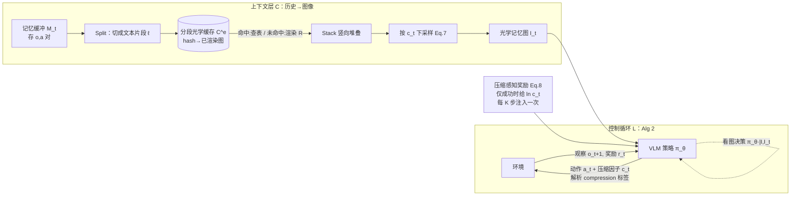

# AgentOCR：把 Agent 历史「渲染成图」的光学式自压缩

> **本篇属 agent-harness 库 D 组（上下文 / 记忆），主打 C（Context）层。** 它的反直觉核心只有一句：
> **别再把 agent 的历史当文本喂进模型——把它渲染成一张图，用视觉 token 来装历史。** 因为一张「文字排版图」
> 里的视觉 token，其信息密度显著高于把同样文字切成的文本 token（DeepSeek-OCR 实测约 10×）。本报告严格对齐
> 标杆范文 [`2605.27922-harness-bench`](2605.27922-harness-bench-measuring-harness-effects.md) 的密度与诚实度：
> 每个公式先给直觉 + 先定义符号，指标给定义式，数字标 §/Table/Eq 出处，宣称与批判分开，缺失写「原文未给出」。

---

## §1　TL;DR（一页讲清这篇在干嘛）

> 主讲提示：开场先把「反直觉」抛出来——**图像 token 竟然比文本 token 更省**——再说这篇把它用进了 agent 的历史管理。全场记住一个画面：agent 的历史不再是一大段文字，而是一张会随回合长大的「文字截图」。

一句话：**AgentOCR 把多轮 agent 的「观察-动作历史」$h_t$ 不再作为文本字符串塞进上下文，而是用一个确定性渲染器 $\mathcal{R}$ 把它画成一张 RGB 图像 $I_t$，让视觉-语言模型（VLM）看图做决策。** 因为视觉 token 的信息密度高于文本 token（论文引 DeepSeek-OCR，约 10× 压缩，§1），历史越长越省。为了让「渲染」不成为新瓶颈、也不让图像糊到丢信息，它再加两件套：**分段光学缓存（segment optical caching）** 复用已渲染的历史片段（Fig 2a），**agentic 自压缩（agentic self-compression）** 让 agent 自己在每一步输出一个压缩因子 $c_t$、用「压缩感知奖励」经 RL 学出「什么时候能压、压多狠」（Eq. 8）。

- **属于 harness 的哪一层（Θ1）**：本篇打的是 **C（Context / 上下文·记忆）层**——它换的是「历史这段上下文用什么模态承载」。但它深度耦合 **L（Loop / 控制循环）**（把「选压缩率」变成循环里的一个动作，Alg 2）与 **T（Tools / 工具）层**（把渲染器 $\mathcal{R}$ 暴露成一个可调用工具，§4.3）。它不改环境、不改验证协议。
- **回扣全库论点（Θ2）**：`Agent = Model + Harness`。AgentOCR 是一个**纯 harness 侧**的改造：**同一个底座模型（Qwen2.5-VL）**，只把「历史该以文本还是图像进上下文」这一 harness 决策换掉，就换来 token/step 从 ~1.0k 降到 ~0.38k（Table 1）、峰值省 80.9%（Table 2）。这正是「换 harness、模型不变、代价画像大变」的又一实证——只不过它动的不是脚手架代码，而是**上下文的物理载体**。
- **够新够权威（Θ4）**：2026-01 预印本（NTU × 阿里通义），是**首批**把 DeepSeek-OCR 式「光学压缩」从静态长文档搬进**动态、多轮、需 agentic RL 训练**的 agent 场景、并让「压缩率」本身成为可学习动作的工作之一。它的权威性来源：通义实验室（Qwen 系列出品方）+ NTU An Bo 组，代码开源。

**三条带走的结论**：
1. **反直觉但成立**：把文本历史「渲染成图」用视觉 token 承载，能砍 >50% token（Table 1/2）——因为视觉 token 单位信息密度更高，且 transformer 计算随序列长度**超线性**增长，省 token 直接省算力（§4 开头）。
2. **但天下没有白吃的午餐**：直接把历史渲染成图喂给现成 VLM（"OCR w/o RL"）会**掉大分**（ALFWorld 3B：16.2 vs 文本 79.9，Table 1）——VLM 读不好这种「压缩视觉历史」。**必须用 RL 把策略对齐到视觉模态**，AgentOCR 才追平文本基线（78.2 vs 79.9）。
3. **压缩率要「学」不能「拍」**：稠密地每步都给压缩奖励（$K{=}1$）会让 agent 贪婪地把压缩因子飙到 4.91、成功率崩到 45.3%；改成**间歇注入**压缩奖励（$K{=}5$）才学出温和的 $c_t{=}1.28$、保住 78.2% 成功率（Table 4）。

---

## §2　问题与动机：为什么多轮 agent 的「历史」是个大麻烦

> 主讲提示：这一段用 Why 三连的「问题层」。先讲清「历史膨胀」到底卡住了什么，为什么它对 RL 训练尤其致命。

**Why（问题层）——不解决会卡住什么？谁受影响？**

现代 agent 把感知、思考、行动紧耦合进一个**多轮决策循环**，并越来越多地用 **RL** 在长程轨迹上端到端优化工具使用、规划与控制策略（§1 引 Feng/Wang 等）。但 agent 通过多轮循环与环境交互时，**必须缓存一整条「过去的观察 + 动作」轨迹**作为决策依据（§1）。如 Fig 1(a) 所示，这段历史**无情地累积**，在**单条轨迹内**就能膨胀到海量 token——搜索式任务里一条轨迹动辄 >10k token（§3.2 引 Jin et al. 2025）。后果有两重（§1）：

1. **撑爆 token 预算**：现有 LLM 的有限上下文窗口被历史吃满。
2. **推理又慢又贵**：注意力的 prefill 与 KV-cache 管理成本高企；更狠的是 **transformer 计算随序列长度超线性增长**（§4 开头），历史每长一截，算力成本涨得比线性还快。

**这对 RL 训练尤其致命**（§3.2）：GRPO 这类算法要对**整条累积历史 $h_t$** 反传梯度（Eq. 2 里 $\pi_\theta(a_{t,i}\mid\mathcal{I},h_{t,i})$ 显式依赖 $h_t$）。既然计算复杂度与显存都随 token 数走，处理这种冗长文本轨迹在训练时**变得极其昂贵**——这不是推理时省点钱的问题，而是**多轮 agentic RL 能不能规模化**的问题。

**Why 会现在做？——两个「使能技术」刚成熟（§1）**：
- **VLM 成熟**：视觉-语言模型（Bai/Chen 等 2024–2025）能把图当一等输入。
- **光学压缩被验证**：OCR 方向的 **DeepSeek-OCR（Wei et al. 2025）** 给出关键证据——**视觉模态可以是比文本密度高得多的信息载体**：把文字内容渲染成图，token 足迹相比原始文本 token 可压缩约 **10×**（§1 原文）。VIST、Glyph 等也在探索「视觉-文本压缩」处理超长上下文。

> **读出什么**：这篇的动机不是「再造更强 agent」，而是**给 agent 的历史换一个更省的物理载体**。它把 OCR 界一个静态、离线的发现（渲染成图更省），搬到 agent 界一个**动态、在线、要训练**的战场——这正是它的新意所在，也是它必须额外解决「渲染开销」和「VLM 读不懂压缩图」两个新问题的原因（见 §5–§6）。

---

## §3　核心 intention 与形式化：一句话 + 符号地基

> 主讲提示：这页把问题钉成一句话，并把后文所有公式要用的符号一次性定义清楚。别急着上方法，先让听众记住 $h_t$、$\pi_\theta$、$c_t$、$\mathcal{R}$ 这几个字母。

**一句话 intention**：在不牺牲太多任务性能的前提下，**把 agent 决策所依赖的历史 $h_t$ 从「文本 token 序列」换成「一张（可被 agent 自己调节清晰度的）图像 $I_t$」，并让整套东西能用 agentic RL 稳定训练**。

**问题设定（§3.1）**：把「LLM agent × 环境（物理模拟器或外部工具 API）」的交互建模成一个**有限时域 $T\in\mathbb{N}$ 的序贯决策过程**。agent 是一个参数为 $\theta$ 的 LLM，行为建模为随机策略 $\pi_\theta$。先把符号一次讲清（定义在公式之前）：

- $t\in\{1,\dots,T\}$：决策步（回合）下标；
- $o_t\in\mathcal{O}$：第 $t$ 步的观察（如 API 输出、环境反馈）；
- $\mathcal{I}$：任务指令（task instruction）；
- $a_t$：第 $t$ 步的**文本动作**，$a_t\in\mathcal{V}^n$——即从词表 $\mathcal{V}$ 里抽的、最大长度 $n\in\mathbb{N}$ 的 token 序列；动作很灵活，可以显式含中间推理（chain-of-thought）或工具调用；
- $r_t$：执行 $a_t$ 后环境返回的标量奖励；
- $h_t$：到第 $t$ 步为止的**交互历史**。

**历史的定义式（Eq. 1）**。直觉：agent 每一步能看到的「记忆」，就是把从头到现在的所有观察与动作按时间拼起来。

$$h_t = (o_1, a_1, o_2, a_2, \dots, o_t). \tag{1}$$

读出什么：$h_t$ 随 $t$ **单调变长**；动作采样写作 $a_t\sim\pi_\theta(\cdot\mid\mathcal{I},h_t)$——即策略同时条件于「任务指令」和「全部历史」。**正因为 $\pi_\theta$ 显式吃 $h_t$，$h_t$ 一膨胀，条件上下文就跟着膨胀**，这是所有麻烦的根。论文明说：由于长时域或啰嗦的环境观察，$h_t$ 常常变得极长，给上下文处理带来严峻挑战（§3.1 末）。

> **读出什么**：Eq. 1 看似平凡，却是全篇的「病灶定位」——AgentOCR 要动的就是「$\pi_\theta$ 条件里的 $h_t$ 以什么形式出现」。文本 agent 让 $h_t$ 以文本 token 进上下文；AgentOCR 让它以图像 $I_t=\mathcal{R}(h_t)$ 进上下文。**病灶同一处，换的是敷什么药。**

### 符号与术语表（后文所有公式都用这些记号）

| 记号 | 含义 | 首次出现 |
|---|---|---|
| $t,\ T$ | 决策步下标 / 有限时域长度 | §3.1, Eq. 1 |
| $o_t,\ a_t$ | 第 $t$ 步观察 / 文本动作（$a_t\in\mathcal{V}^n$，可含 CoT 或工具调用） | §3.1 |
| $\mathcal{I}$ | 任务指令（task instruction） | §3.1 |
| $h_t$ | 到第 $t$ 步的交互历史 $=(o_1,a_1,\dots,o_t)$ | Eq. 1 |
| $\pi_\theta$ | 参数 $\theta$ 的（多模态）策略；文本版条件于 $h_t$，光学版条件于 $I_t$ | §3.1 |
| $r_t,\ \widetilde r_t$ | 环境原始奖励 / 加了压缩项的总奖励 $\widetilde r_t=r_t+\lambda r_t^{\text{comp}}$ | §3.1, §4.3 |
| $\mathcal{M}_t$ | 外部记忆缓冲，存 $(o,a)$ 对 | §4.1 |
| $\mathcal{R},\ \psi$ | 确定性渲染器 / 渲染超参（字体、字号、色码、宽高） | §4.1, Table 5 |
| $I_t$ | 第 $t$ 步的 RGB 光学记忆图像 $=\mathcal{R}(h_t;\psi)$ | §4.1 |
| $\ell_i,\ \text{Split}$ | 历史切出的第 $i$ 个文本片段 / 切分算子 | §4.2 |
| $k(\ell),\ \mathcal{C}^{(e)}$ | 片段内容键（hash） / 环境 $e$ 的分段缓存字典 | Eq. 3 |
| $K_t,\ U_t$ | 第 $t$ 步片段总数 / 其中缓存未命中数 | §4.2 |
| $c_t$ | 第 $t$ 步**压缩因子**（$\ge 1$，越大越糊，agent 自己输出） | Eq. 7 |
| $r_t^{\text{comp}}$ | 压缩感知奖励 $=\ln c_t$（仅成功时） | Eq. 8 |
| $\lambda,\ K$ | 压缩奖励权重（0.01） / 间歇注入周期（5） | §4.3, §5.1 |
| $\mathbb{I}_{\text{succ}}(\tau)$ | 轨迹 $\tau$ 成功指示 $\in\{0,1\}$ | Eq. 8 |
| $G,\ \hat A_i,\ \rho_{t,i},\ \epsilon$ | GRPO 组大小 / 组内优势 / 重要性比 / 截断超参 | Eq. 2 |

---

## §4　RL 地基：GRPO 目标与「为什么历史贵在训练」

> 主讲提示：这页给出本文采用的 RL 算法（GRPO），并把「历史贵」从直觉落到公式——梯度要过整条 $h_t$。

**为什么先讲 RL？** 因为 AgentOCR 的「自压缩」是**靠 RL 学出来的**（§4.3），不先立好 RL 目标，后面 Eq. 8 的压缩奖励就无处安放。作者声明方法**算法无关**（与各类 agentic RL 兼容），但选 **GRPO（Group Relative Policy Optimization, Shao et al. 2024）** 作代表，因其简单高效（§3.2）。

**GRPO 目标（Eq. 2）**。直觉：不训练单独的 critic，而是**对同一输入采样一组轨迹，用组内奖励的相对高低来估计优势**（谁比同组平均好就往谁那儿推），再用 PPO 式的截断保证稳定。先定义符号：

- $\{\tau_i\}_{i=1}^{G}$：对每个输入采样的一**组** $G$ 条轨迹（group）；
- $\hat A_i$：第 $i$ 条轨迹的**优势**，由组内奖励归一化得到（谁高于组均值谁为正）；
- $\rho_{t,i}=\dfrac{\pi_\theta(a_{t,i}\mid\mathcal{I},h_{t,i})}{\pi_{\theta_{\text{old}}}(a_{t,i}\mid\mathcal{I},h_{t,i})}$：**重要性采样比**（新旧策略在同一动作上的概率比）；
- $\epsilon$：PPO 式**截断超参**；
- $G,T$：组大小与时域长度（用于归一化）。

$$J(\theta)=\mathbb{E}\!\left[\frac{1}{GT}\sum_{i=1}^{G}\sum_{t=1}^{T}\min\!\big(\rho_{t,i}\hat A_i,\ \operatorname{clip}(\rho_{t,i},1\pm\epsilon)\hat A_i\big)\right]. \tag{2}$$

读出什么：为记号简洁，作者**略去了 KL 正则项**（§3.2）。关键在那句提醒——**优化 Eq. 2 必须对整条累积历史 $h_t$ 计算梯度**；真实 agent 场景里 $h_t$ 迅速堆到数千 token（搜索任务 >10k），而**计算复杂度与显存都随 token 数走**，于是处理这种冗长文本轨迹**在训练时变得代价高昂到令人却步**（§3.2 末）。

> **Why（结果层的前置逻辑）**：这就把「省 token」从「推理时省钱」升级成「**训练时能不能跑得动**」。AgentOCR 若能把 $h_t$ 的 token 足迹砍一半以上，等于把 agentic RL 的每步显存/算力砍一半以上——这是它真正想解决的痛点，也是它选择在 RL 框架里做（而非只做推理期压缩）的根本原因。

---

## §4bis　相关工作定位：它站在谁肩上、和谁不同

> 主讲提示：一张对比表把 AgentOCR 钉在坐标系里。三条脉络汇到它：**长上下文/记忆管理**、**文本压缩**、**光学压缩**——它是这三条的交叉点，且加了「可训练的自压缩」这一独有维度。

AgentOCR 处在三条研究脉络的交汇处（§2 Related Work 三小节：RL for LLM Agents / OCR / Agent Memory）：

| 脉络 | 代表工作（论文所引） | 它们怎么处理长历史 | AgentOCR 的差异 |
|---|---|---|---|
| **Agent 记忆 / 长上下文** | MemGPT（虚拟上下文分页）、Mem0、A-MEM、HiAgent、稀疏/层次注意力（Longformer）、RoPE 外推（LongRoPE）、prompt 压缩（ICAE, AdaComp, COMPACT） | 在**文本域**分页、检索、摘要、或改**模型内部**注意力/位置编码 | 换**物理载体**（文本→图像），**模型无关**、不改注意力，历史像素级保留 |
| **光学 / 视觉-文本压缩** | DeepSeek-OCR（约 10× 压缩）、Glyph、VIST、GOT-OCR2.0、Pix2Struct、Donut | 把**静态长文档**渲染成图，离线做一次性压缩 | 搬进**动态、多轮、在线 rollout**；历史随回合滚动生长 + 分段缓存 + **压缩率可学习** |
| **Agentic RL** | GRPO/PPO/DAPO/GSPO/GiGPO、Search-R1、SimpleTIR、RAGEN | 在长文本轨迹上端到端训练策略，历史越长训练越贵 | 用**光学历史**把训练时 $h_t$ 的 token 足迹砍半，让长轨迹 RL 更省 |

**一句话定位**：前人要么在**文本域**压历史（有损/靠检索）、要么在**模型内部**改注意力（要动模型）、要么只对**静态文档**做光学压缩；**AgentOCR 是第一批把「光学压缩」搬进「多轮 agentic RL 的动态历史」、并把「压缩率」变成一个可学习动作的工作**（§2.2 原文亦承认「OCR 作为视觉-文本压缩机制…研究仍处早期」）。

> **读出什么**：这张表也解释了为什么本文必须自带「分段缓存」和「RL 对齐」两件套——DeepSeek-OCR 那套是**静态一次性**的，搬到**动态多轮**就会撞上「每步重渲染」（→ 需缓存）和「现成 VLM 读不懂压缩历史」（→ 需 RL）两个新问题。**这两件套不是锦上添花，而是「把离线技术搬到在线」的必要过桥。**

---

## §5　方法总览：一图看懂 AgentOCR 的三块

> 主讲提示：先给 big picture，别上数学。三块：把历史画成图（光学编码）→ 复用画好的片段（分段缓存）→ 让 agent 自己决定画多清楚（自压缩 + RL）。

AgentOCR 把「不断增长的历史」这个瓶颈，重构为一段**光学记忆（optical memory）**：不处理原始文本日志，而是把累积历史**渲染成紧凑的视觉表示**（§4 引言）。为保证长程 rollout 的可扩展与动态适应，它加了两项创新：**分段光学缓存**（Fig 2a，消除重复渲染开销）与 **agentic 自压缩**（Fig 2b，让 agent 主动调节压缩率、平衡信息密度与 token 成本）。

**三块各自要回答一个问题**：
1. **光学记忆编码（§4.1）**：怎么把 $h_t$ 变成一张图 $I_t$？——用确定性渲染器 $I_t=\mathcal{R}(h_t;\psi)$。
2. **分段光学缓存（§4.2）**：每步重画整段历史太慢，怎么办？——把历史切成**内容可哈希的片段**，画过的进缓存、重复出现直接查表，只渲染没见过的片段。
3. **agentic 自压缩（§4.3）**：图画多清楚才划算？——把渲染器暴露成工具，让 agent 每步输出一个压缩因子 $c_t$，用「压缩感知奖励」经 RL 学会自适应地分配视觉 token。

---

## §6　把「历史渲染成图＝视觉 token 更省」讲透（本篇反直觉核心）

> 主讲提示：**这是全场最该停留、也最反直觉的一页。** 一定要讲清：为什么把文字画成图、再切成视觉 token，反而比直接把文字切成文本 token 更省？「明明多了一道渲染，还能更省？」——这正是组会会被追问的点。

### 6.1 反直觉在哪

朴素直觉是：文本本来就是最紧凑的信息载体，把它渲染成一张图（几十万像素）再交给模型，**听起来只会更浪费**。AgentOCR 偏偏反过来用——**因为「模型眼里的开销」不是按像素算的，而是按 token 算的**，而**同一段文字，「排版成图后切出的视觉 token 数」可以远少于「直接分词得到的文本 token 数」**。

### 6.2 为什么视觉 token 能更省——机制拆解

论文本身没有从头推导这个压缩比，而是**直接引用并复用 DeepSeek-OCR 的实证结论**（§1）：把文本渲染成图，token 足迹相比原始文本可压约 **10×**。把背后的机制讲透，需要三步：

**① 视觉 token 的「打包率」更高。** VLM 处理图像时，先把图切成固定大小的图块（patch），每个 patch 过视觉编码器变成**一个**视觉 token（本文流程见 Fig 1(b)：Text as Image → Patchify → Visual Patches → Visual Tokens）。一个 patch（比如 16×16 或更大像素）里可以容纳**多个字符甚至一整个词**的字形。反观文本侧：BPE 分词器把一段文字切成很多 subword token，一个常见英文词往往就吃掉 1–3 个文本 token，长的观察日志里满是重复样板、坐标、ID，token 数极其膨胀。**于是「一屏文字」对应的视觉 token 数，可显著少于同屏文字的文本 token 数**——这就是「视觉信息密度更高」的物理来源。

**② agent 历史里全是「低熵冗余」，特别吃这套。** 看 Fig 1(a) 里 ALFWorld 的真实观察：`you see a cabinet 19, a cabinet 18, ... a cabinet 1, a coffeemachine 1, ...`——大量结构高度重复的样板文字。文本分词对这种冗余**照单全收**、逐 token 计费；而渲染成图后，这些重复排版在像素/patch 层面被「摊薄」，加上 §7 的分段缓存还能整段复用。**历史越冗长、越重复，光学表示的相对优势越大**——这与 §2「历史无情累积」的病灶恰好正交互补。

**③ 省 token＝省超线性算力。** transformer 计算随序列长度**超线性**增长（§4 引言）。把承载历史的 token 数砍一半，注意力/KV-cache 的开销砍的**不止一半**。所以「视觉 token 更省」不是省了点上下文位置，而是**直接省在最贵的地方**。

**一个可对照的直觉账（用本文自己的数据）。** 看 Table 1 的 ALFWorld-3B：文本历史每步平均 **1.09k** token、峰值 **3.04k**；渲染成图后（OCR w/o RL）降到 **0.49k / 1.63k**——**同样一段历史内容**，换成视觉 token 后大约省了一半有余。再看搜索式 QA-7B（Table 2）：文本峰值 **10.96k** token，光学峰值降到 **2.65k**——**峰值处压掉 80.9%**。这两组数字就是「视觉 token 更省」最直接的经验证据：**不是理论许诺，而是同一历史两种载体的实测差**。注意它与「10× 压缩」的差距——本文端到端只报到 50–80%，而非 DeepSeek-OCR 声称的 10×，原因见 §14 批判（本文并未在自己渲染配置下重新量化逐 token 密度比，且 agent 历史里除样板外也有不可压的关键文本）。

### 6.3 Why 三连（设计层）——为什么是「渲染成图」，而不是别的省 token 手段？

> **Why（设计层）**：朴素替代有三条，本文逐一比它们更优或互补——
> - **替代 A：文本摘要 / prompt 压缩（如 In-Context Autoencoder、AdaComp）。** → 会**有损且不可逆地丢内容**，且摘要器本身要额外算力/训练；而光学表示**保留对历史细节的完整访问**（§4 引言原文 "maintaining full access to historical details"），信息以像素形式无损保存，需要时 VLM 可「读回」。
> - **替代 B：检索式外部记忆（RAG 式，MemGPT/Mem0）。** → 引入「检索什么」的新决策与检索误差；光学记忆是**把全历史随身带着**、按需看，不依赖检索命中。
> - **替代 C：稀疏/线性注意力、RoPE 外推（Longformer、LongRoPE）。** → 改的是**模型内部**如何处理长序列（要动模型/位置编码）；光学压缩改的是**喂进去的东西**（harness 侧、模型无关，§7 局限也强调 model-agnostic）。二者**正交**，可叠加。
>
> 一句话：其它手段要么有损丢内容、要么依赖检索、要么得改模型；**渲染成图是「保全历史、不改模型、还能省超线性算力」的独特组合**——代价是需要一个 VLM 来读图，且下采样过狠会糊掉文字（见 §8/§11 的性能塌陷）。

### 6.4 代价诚实标定（不把优点绝对化，Θ5 前哨）

**这套省法有明确代价，论文自己也承认**：① 需要 VLM（不是任意 LLM 都能用，§7 局限一）；② 现成 VLM **读不好这种压缩视觉历史**——不训练直接用（"OCR w/o RL"）会掉大分（§5.2、Table 1/2），必须用 RL 对齐；③ 压得太狠会**糊掉关键文字线索**，文本稠密任务尤其敏感（搜索任务在 $c_t{=}2.0$ 时性能塌到 66.8%，§5.3）。**所以「视觉 token 更省」是一句有前提的真话，不是免费午餐。** 这一点我们在 §11、§12 会反复回扣。

---

## §7　方法细节一：光学记忆编码与分段光学缓存（含公式）

> 主讲提示：这页把「历史变图」的两步落到公式。先讲怎么画（渲染器），再讲怎么不重复画（分段缓存）。缓存是让这套东西在长 rollout 里跑得动的关键工程。

### 7.1 光学记忆编码（§4.1）

**记忆缓冲**：AgentOCR 维护一个外部记忆缓冲 $\mathcal{M}_t$，存到第 $t$ 步为止的交互记录，每条是一个观察-动作对 $(o_t,a_t)$（或工具查询/结果等任务特定等价物）。历史由 $h_t=\text{Fetch}(\mathcal{M}_{t-1})$ 序列化为文本形式。

**渲染器**。直觉：要有一个**确定性**的「排版函数」，把文本历史稳定地画成同一张图（同输入同输出，才能缓存、才能训练稳定）。定义符号：

- $\mathcal{R}$：确定性渲染器；
- $\psi$：渲染超参（字体族与字号、颜色、padding、图像宽高上界等）；
- $I_t$：第 $t$ 步的 RGB 历史图像。

$$I_t=\mathcal{R}(h_t;\psi). \tag{—（§4.1 正文式）}$$

于是第 $t$ 步策略是一个**多模态策略**：把任务指令 $\mathcal{I}$ 与历史图像 $I_t$ 组合起来，采样动作 $a_t\sim\pi_\theta(\cdot\mid\mathcal{I},I_t)$；动作作用于环境得到 $o_{t+1}$，更新记忆缓冲。**具体渲染配置**（Appendix B.4 / Table 5）：等宽字体（Monospace），ALFWorld 用 10pt / 行距 1.2 / 最大宽 392px，搜索用 12pt / 行距 1.2 / 最大宽 560px；并用**语义色码**帮 VLM 解析——ALFWorld：任务与上下文黑、`[Observation]` 蓝(0,0,255)、`[Action]` 红(255,0,0)；搜索：`<search>` 蓝、`<information>` 红。

> **读出什么**：语义色码是个小而妙的设计——**用颜色给 VLM「打标注」**，让它更容易在图里区分「哪块是观察、哪块是动作/检索」，等于把结构信息编码进像素，降低读图难度。这也解释了为什么下采样过头会掉分：颜色/字形一糊，这些「视觉锚点」就失效。

### 7.2 分段光学缓存（§4.2）——让渲染不成为新瓶颈

**Why（问题层）**：每步都从头渲染整段 $h_t$ 极其浪费，会成为多轮 rollout 的**主要延迟瓶颈**（§4.2）。

**Why（设计层）——为什么不用「只渲染新增部分再拼接」的朴素缓存？**
> **Why（设计层）**：朴素替代是**增量渲染**——只画本步新追加的内容，接到上一张历史图后面。→ 它确实把每步渲染摊到近似常数，**但两个问题**：(a) 它**无法复用重复出现的内容**（把每条新到的行都当成全新的、永久追加），(b) 它的**缓存内存仍随 rollout 长度增长**（像素随累积轨迹线性膨胀）。本文改用**分段缓存**：以「片段」为粒度做内容键缓存，既能复用重复样板/工具输出，又让内存按**唯一片段数**而非**步数**增长（§4.2）。

**分段表示**：把历史切成片段 $\text{Split}(h)=(\ell_1,\dots,\ell_K)$，每个 $\ell_i$ 是一个文本片段（实现里按**换行级**切分，见 §5.4）；用同一套 $\psi$ 的确定性**片段渲染器** $\mathcal{R}(\ell;\psi)$ 把单个片段画成 RGB 图。

**分段缓存（Eq. 3）**。直觉：给每个环境实例 $e$ 维护一个「片段内容 → 已渲染图」的字典。定义 $k(\ell)$ 为片段的**快速内容键**（如归一化片段文本的哈希，可含样式元数据），$I(\ell)$ 为片段 $\ell$ 的渲染图：

$$\mathcal{C}^{(e)}=\{(k(\ell),\,I(\ell))\}. \tag{3}$$

与朴素缓存不同，它对**每个唯一片段最多渲染一次**，同片段再现即复用。$\mathcal{C}^{(e)}$ 在一个 episode 内持续、到 episode 边界重置。

**缓存查表与组装（Eq. 4–6）**。第 $t$ 步把 $h_t$ 切成 $\text{Split}(h_t)=(\ell_{t,1},\dots,\ell_{t,K_t})$，逐片段查缓存——命中查表、未命中现渲染并插入：

$$I(\ell_{t,i})=\begin{cases}\mathcal{C}^{(e)}[k(\ell_{t,i})], & \text{if } k(\ell_{t,i})\in\mathcal{C}^{(e)},\\[2pt]\mathcal{R}(\ell_{t,i};\psi), & \text{otherwise.}\end{cases} \tag{4}$$

$$\text{if miss:}\quad \mathcal{C}^{(e)}[k(\ell_{t,i})]\leftarrow I(\ell_{t,i}). \tag{5}$$

再把所有片段图**按序竖向堆叠**成整张光学记忆图：

$$I_t=\text{Stack}\big(I(\ell_{t,i})\big)_{i=1}^{K_t}. \tag{6}$$

**复杂度（§4.2 末）**。设 $U_t$ 为 $\{\ell_{t,i}\}_{i=1}^{K_t}$ 中**未命中（cache-miss）片段数**。则每步渲染成本降为 $O(U_t)$ 次片段渲染，命中的只需查字典 + 堆图。多数 agent 工作负载里交互日志**大量重复**，故通常 $U_t\ll K_t$，渲染开销大幅下降。空间上，缓存**每唯一片段存一张图**，得 $O(|\mathcal{C}^{(e)}|)$ 张图而非 $O(T)$ 张全历史图，避免跨时间步的重复存储。

> **读出什么**：这一节是纯工程，却是让「历史即图像」**在训练里真能跑**的关键——它把渲染从「每步 $O(T)$」压到「每步 $O(U_t)$」，把缓存内存从「随步数」压到「随唯一片段数」。§10 的 Table 3 会给出这套设计的实测收益（20.79× 加速、26.82% 省内存）。

---

## §8　方法细节二：agentic 自压缩与压缩感知奖励（含公式）

> 主讲提示：这页是本篇的「灵魂创新」——**把「压缩多狠」变成 agent 自己在循环里做的一个动作，并用 RL 教它。** 先讲怎么下采样（Eq. 7），再讲怎么给奖励（Eq. 8），最后讲那个防贪婪的「间歇注入」小技巧。

### 8.1 把渲染器变成一个「可调用的工具」（§4.3）

**Why（设计层）——为什么让 agent 自己选压缩率，而不是固定一个？**
不同步骤对「历史清晰度」的需求不同：有的步骤只需粗看场景（可狠压），有的步骤要抠某个关键文本线索（不能压）。固定压缩率必然**要么在简单步浪费 token、要么在关键步糊掉信息**。所以 AgentOCR 不把渲染器 $\mathcal{R}$ 当静态后台，而**把它暴露成一个可执行工具（T 层）**：策略在输出里生成一个结构化调用 `<compression>`$c_t$`</compression>`，其中**压缩因子** $c_t\ge 1$ 动态调节渲染清晰度（$c_t{=}1$ 不压，越大越糊）。这与标准工具使用范式对齐——agent 用可变精度显式「查询」自己的历史（§4.3）。

**下采样操作（Eq. 7）**。直觉：拿到 $c_t$ 后，系统按它对下一张图**空间降采样**，从而减少视觉 token 数。定义 $H_{t+1},W_{t+1}$ 为原始（未压）图像的高与宽：

$$\text{size}(I_{t+1})=\left(\left\lfloor\frac{H_{t+1}}{\sqrt{c_t}}\right\rfloor,\ \left\lfloor\frac{W_{t+1}}{\sqrt{c_t}}\right\rfloor\right). \tag{7}$$

读出什么：高、宽各除以 $\sqrt{c_t}$，故**面积（≈视觉 token 数）大约除以 $c_t$**——$c_t$ 直接近似「token 压缩倍数」。于是 agent 能按任务特性策略性地调压缩率，优化「token 成本 vs 信息密度」的取舍。

### 8.2 压缩感知奖励（Eq. 8）——怎么教它「该压才压」

**Why（设计层）——为什么奖励要「严格条件于成功」且取对数？**
若直接奖励「压得多」，agent 会为了省 token 把图压糊、牺牲任务——这是**目标错位**。所以设计两条约束（§4.3）：

- **严格条件于 episode 成功**：只有当整条轨迹成功（$\mathbb{I}_{\text{succ}}(\tau)=1$）才发压缩奖励，确保 agent 把压缩当**次要的成本优化目标**、而非首要目标。**先把事做成，再谈省。**
- **对数形式**：反映信息密度的**边际递减**——从 $c_t{=}1$ 压到 2 收益大，从 8 压到 16 收益就没那么值（$\ln$ 增长放缓），避免无脑冲高压缩。

定义 $\mathbb{I}_{\text{succ}}(\tau)\in\{0,1\}$ 为成功指示，第 $t$ 步压缩奖励：

$$r_t^{\text{comp}}=\begin{cases}\ln(c_t), & \text{if } \mathbb{I}_{\text{succ}}(\tau)=1,\\[2pt]0, & \text{otherwise.}\end{cases} \tag{8}$$

**总奖励**：$\widetilde r_t = r_t + \lambda\, r_t^{\text{comp}}$，其中 $\lambda\ge 0$ 是压缩奖励**权重**，控制「任务性能 vs 压缩效率」的取舍（实验取 $\lambda{=}0.01$，§5.1）。这个标量奖励喂给 GRPO（Eq. 2）更新 $\pi_\theta$。

> **Why（设计层）——三个「为什么不这么做」的替代对照**：
> - **替代：线性奖励 $r^{\text{comp}}=c_t$（而非 $\ln c_t$）。** → 线性会**无止境奖励更高压缩**（压到 8 比压到 4 多一倍奖励），诱导 agent 冲极端压缩率、糊图丢信息。对数把边际收益压平（$\ln 8-\ln 4=\ln 2$，与 $\ln 4-\ln 2$ 相同），**内建「压到一定程度就不太值」的饱和**，与「信息密度边际递减」的物理直觉对齐。
> - **替代：不条件于成功，任何 step 都给压缩奖励。** → agent 会发现「失败但压得狠」也能拿分，于是**牺牲任务去刷压缩**。加 $\mathbb{I}_{\text{succ}}$ 硬门槛后，**只有把任务做成的轨迹才配谈省**——把压缩牢牢钉成「次要目标」。这与标杆 Harness-Bench 的「Security 硬闸门」是同一种「一票前置」的设计哲学。
> - **替代：把 $\lambda$ 调大以更激进省 token。** → 会挤压任务奖励的主导地位。作者取极小的 $\lambda{=}0.01$，**明示压缩只是「轻推」而非「主驱」**——省 token 是搭便车，不是抢方向盘。
>
> 三条合起来，Eq. 8 的完整设计意图是：**「先把事做成（$\mathbb{I}_{\text{succ}}$），再温和地（$\ln$、小 $\lambda$、每 $K$ 步）鼓励省」**。Table 4 的 $K{=}1$↔$K{=}5$ 对照，就是这套哲学「有没有贯彻到调度层」的实证。

### 8.3 「间歇强化」防贪婪（§4.3 末）——一个关键小技巧

**Why（结果层）——为什么不能每步都给压缩奖励？**
若**每个训练迭代**都注入 $r_t^{\text{comp}}$，会诱发**过度贪婪**：agent 猛增压缩率去刷即时奖励，把图压糊、拖垮任务成功。为此采用**间歇强化调度（intermittent reinforcement schedule）**：**只在每 $K$ 个训练迭代注入一次**压缩奖励（$\mathbb{I}(t\bmod K=0)$，见 Alg 1 第 28 行）。这样周期性引入效率信号，同时**始终保持对任务完成的主优化压力**。实验取 $K{=}5$。§13 的 Table 4 会给出这个 $K$ 的消融——它是「学出温和压缩」还是「贪婪崩盘」的分水岭。

> **读出什么（Θ2 呼应）**：这三块（Eq. 7 下采样 + Eq. 8 条件对数奖励 + 间歇注入）合起来，是一个**纯 harness/训练侧**的机制——底座模型没换，换的是「循环里多了一个『选压缩率』的动作 + 一个教它的奖励塑形」。这正是「harness 决定能力」的细颗粒证据：**同一个 VLM，配上会自压缩的 harness，就能在保住性能的同时把 token 再往下压。**

### 8.4 两段伪代码（Appendix A）

- **Alg 1（环境包装器 Step）**：执行物理动作 → 更新记忆 → 取历史、切片段、逐片段 hash 查缓存（未命中才渲染，Eq. 4–5）→ Stack 成 $I_{\text{raw}}$ → 按 $c_t$ Resize（scale $=1/\sqrt{c_t}$，Eq. 7）→ 若成功则算 $r_t^{\text{comp}}=\ln c_t$（Eq. 8）→ 按 $\mathbb{I}(t\bmod K=0)$ 注入 $\widetilde r_t=r_t+\lambda r_t^{\text{comp}}$ → 返回 $(o_{t+1},I_{t+1}),\widetilde r_t$。
- **Alg 2（策略 Rollout）**：`while` 未到 $T_{\max}$：reset → 取初始 $(o_t,I_t)$ → episode 内循环：采样 $a_t\sim\pi_\theta(\cdot\mid\mathcal{I},I_t)$ → 解析 `<compression>` 标签得 $(a_t,c_t)$ → 调 `Step` 拿 $(o_{t+1},I_{t+1}),\widetilde r_t$ → 存转移 → 推进 → episode 末用 RL 优化器更新 $\pi_\theta$。

---

## §9　实验设置：数据集 / 基线 / 指标 / 超参（写全）

> 主讲提示：这页把可复现要素一次报全。特别强调两个基准的「交互画像」不同——一个具身、一个文本稠密——正好压测「压缩是否伤性能」在不同场景的差异。

**基准（§5.1 + Appendix B.1）**：
- **ALFWorld（Shridhar et al. 2021）**：具身家务环境，**3,827 个任务**，六类——Pick & Place、Look（Examine in Light）、Clean、Heat、Cool、Pick Two & Place。每步 agent 依当前观察与历史选动作、拿环境反馈验证完成。特点：长时域决策、偏**粗粒度场景理解**。
- **搜索式 QA（Jin et al. 2025，即 Search-R1 用的数据集）**：多轮工具使用 + 信息检索，agent 主动向搜索引擎发查询、迭代精炼、融合证据。含单跳（NQ / TriviaQA / PopQA）与多跳（HotpotQA / 2WikiMultiHopQA / MuSiQue / Bamboogle）；用 **E5 检索器**取 top-3 段落。特点：**文本稠密、web 风格**、上下文增长快。

**指标定义式**：
- ALFWorld 报**成功率（Success Rate, %）**——完成任务的比例。
- 搜索 QA 报**精确匹配（Exact Matching, %）**——预测答案与标准答案精确一致的比例。
- 两者都报 **Tokens/Step（Avg. 与 Max.）**——每步记忆上下文 token 成本的平均与峰值，这是**效率指标**。
- §5.3 的**相对性能** $=\dfrac{\text{某压缩率下成功率}}{\text{文本基线成功率}}\times 100\%$；**token 节省率** $=\big(1-\dfrac{\text{光学 token}}{\text{文本 token}}\big)\times 100\%$。

**基线（§5.1，四条，跨 prompting 与 RL 两个 regime）**：
1. **Text (w/o RL)**：原始文本历史喂纯文本模型，不训练。
2. **OCR (w/o RL)**：把历史渲染成图喂 VLM，**不训练**——**这是关键消融**：单看「换模态但不对齐」会掉多少。
3. **Text + GRPO**：对**原始文本上下文**直接上 RL 的**强基线**。
4. **AgentOCR**：对**光学记忆 agent** 上 GRPO——本文方法。

**骨架与超参（§5.1 + Appendix B.2/B.3）**：
- **骨架**：Qwen2.5-VL（Bai et al. 2025b）家族。文本变体用 Qwen2.5-3B/7B-Instruct，光学变体用 Qwen2.5-VL-3B/7B-Instruct。**所有方法训练设置/超参一致**以做受控比较。AgentOCR 额外设 $\lambda{=}0.01$、$K{=}5$。
- **ALFWorld 训练**（follow GiGPO 默认）：文本变体最大 prompt 长 **5120** token，光学变体 **2048** token；最大响应长 512；每 episode 最多 **50 步**、保全历史；学习率 **1e-6**；每迭代 16 samples × 8 trajectories；成功动作奖励 10、否则 0；rollout 温度 1.0、验证 0.4；mini-batch 256；**不加 KL 损失**。
- **搜索 QA 训练**：文本变体最大 prompt **14000** token，光学变体 **4096** token；最大响应 512；每 episode 最多 **4 步**、保全历史；学习率 1e-6；每迭代 128 samples × 8 trajectories；正确答案奖励 1、否则 0；rollout 温度 1.0、验证 greedy(0.0)；mini-batch 256；无 KL。
- **算力（B.3）**：3B 模型用 **2×H100**，7B 用 **4×H100**；训练 **150 iterations**。

> **读出什么**：注意光学变体的最大 prompt 长被压到文本变体的**约 1/3–1/7**（ALFWorld 2048 vs 5120；搜索 4096 vs 14000）却仍能训练——这本身就说明「历史渲染成图」把上下文预算需求砍下来了。这是「省 token」在**训练配置层面**的直接体现。

---

## §10　主结果一：省了多少 token、性能保住没有

> 主讲提示：这是主战场。分两步讲：先看「换模态但不训练」掉多少分（证明必须 RL），再看 AgentOCR 追平文本基线、同时砍一半以上 token。

### 10.1 ALFWorld（Table 1，成功率 %；Tokens/Step）

| 方法（Qwen2.5-(VL) 3B） | Pick&Place | Look | Clean | Heat | Cool | Pick2&Place | **Avg.** | Tok Avg. | Tok Max. |
|---|---:|---:|---:|---:|---:|---:|---:|---:|---:|
| Text (w/o RL) | 34.7 | 18.4 | 12.7 | 7.3 | 14.5 | 10.4 | 16.3 | 1.09k | 3.04k |
| OCR (w/o RL) | 42.8 | 21.8 | 10.1 | 6.2 | 6.2 | 9.9 | 16.2 | 0.49k | 1.63k |
| Text + GRPO | 92.6 | 85.7 | 70.6 | 86.6 | 79.3 | 65.0 | 79.9 | 1.02k | 3.13k |
| **AgentOCR** | 91.9 | 81.8 | 76.0 | 73.3 | 76.1 | 70.0 | **78.2** | **0.38k**（**↓61.7%**） | **1.14k**（**↓63.6%**） |

7B 同表：Text+GRPO 81.8 / AgentOCR **81.2**，Tok 0.43k（↓54.7%）/ 峰 1.22k（↓56.6%）。

### 10.2 搜索式 QA（Table 2，精确匹配 %；Tokens/Step）

| 方法（3B） | NQ | TriviaQA | PopQA | HotpotQA | 2Wiki | MuSiQue | Bamboogle | **Avg.** | Tok Avg. | Tok Max. |
|---|---:|---:|---:|---:|---:|---:|---:|---:|---:|---:|
| Text (w/o RL) | 9.4 | 31.3 | 19.8 | 15.0 | 14.8 | 4.7 | 16.8 | 15.9 | 0.48k | 7.34k |
| OCR (w/o RL) | 10.2 | 27.7 | 10.9 | 9.1 | 12.2 | 3.7 | 15.2 | 12.7 | 0.15k | 1.33k |
| Text + GRPO | 39.3 | 60.6 | 41.1 | 37.4 | 34.6 | 15.4 | 26.4 | 36.4 | 0.61k | 9.55k |
| **AgentOCR** | 38.6 | 56.5 | 41.7 | 33.6 | 30.7 | 14.6 | 24.0 | **34.2** | **0.26k**（**↓57.4%**） | **2.50k**（**↓73.8%**） |

7B 同表：Text+GRPO 41.9 / AgentOCR **40.1**，Tok 0.36k（↓50.7%）/ 峰 **2.65k（↓80.9%）**。

### 10.3 三个读数（Why 结果层）

**读数一：只换模态、不训练 → 掉分。** "OCR w/o RL" 相对 "Text w/o RL"：token 大降（ALFWorld 3B 0.49k vs 1.09k；搜索 0.15k vs 0.48k），但**性能明显下滑**——ALFWorld 3B 16.2≈16.3（打平，因文本无 RL 本就很弱），但搜索 3B 掉到 12.7 vs 15.9，7B 更明显（14.0 vs 17.5）。§5.2 原文：**现成 VLM 难以有效 ground 这种压缩视觉历史**。这就是 §6.4 那句「不是免费午餐」的实锤。

**读数二：AgentOCR 用 RL 补上了这道坎。** RL 把策略对齐到视觉模态后，AgentOCR **逼近文本基线**：ALFWorld 3B/7B 达 78.2 / 81.2（对 Text+GRPO 79.9 / 81.8，差 **~1%**）；搜索保住 Text+GRPO 的 **>95%**（3B 34.2 vs 36.4；7B 40.1 vs 41.9）。**机制上**：RL 让 VLM 学会「从压缩排版图里读回决策所需信息」，把 "OCR w/o RL" 那道模态鸿沟填平。

**读数三：省的是「最贵的部分」。** AgentOCR 相对 Text+GRPO **砍 token >50%**（峰值最高 80.9%，搜索 7B），却几乎不掉性能。§5.2 原文：这不只是「追平基线」，而是**从根上缓解推理瓶颈**——高密度视觉表示能支撑严谨的 agentic 推理，且开销大减。

> **读出什么（Θ2）**：把这三行并起来看，就是 `Agent = Model + Harness` 的一次干净演示——**模型（Qwen2.5-VL）不变**，只把 harness 的「历史载体 + 是否 RL 对齐」这两个旋钮拧一下：不对齐（OCR w/o RL）掉分，对齐（AgentOCR）追平且省 >50% token。**能力的摆动几乎全来自 harness 侧的决策。**

### 10.4 逐类别细读：光学历史在哪儿赢、哪儿轻微让步

把 Table 1（ALFWorld-3B）逐类别对照 Text+GRPO 与 AgentOCR，能看出一个**并非均匀**的画像（这层细节论文未逐条解读，属我方细读，数字均取自 Table 1）：
- **AgentOCR 反超的类别**：**Clean 76.0 vs 70.6**、**Pick Two & Place 70.0 vs 65.0**——这两类涉及**多物体、多步操作**，历史更长更冗。合理推测（机制层）：这正是「光学历史 + 缓存」最占便宜的地方——长而重复的历史被压/复用后，反而让策略更聚焦，故在最吃历史长度的类别上不掉反升。
- **AgentOCR 轻微让步的类别**：**Heat 73.3 vs 86.6**、**Cool 76.1 vs 79.3**、**Look 81.8 vs 85.7**——这些更依赖对**具体状态/物体属性**的精确读取，下采样对文字细节的损耗在这里更容易显形（与 §11「文本细节敏感度」一致）。
- **净效果**：均值 78.2 vs 79.9，**差 ~1.7 分却省掉 >60% token**——即「以极小性能换巨大效率」。7B 上更平（81.2 vs 81.8，差 0.6）。

> **读出什么**：这张逐类别图和 §11 的抗压曲线互为印证——**光学压缩的红利与代价都不是均匀分布的**：越是「长历史、粗粒度」的类别越占便宜，越是「抠具体属性/文字」的类别越要小心。这也正是 §8「自压缩」存在的理由：让 agent 按类别/步骤自适应地决定压多狠。

---

## §11　主结果二：压缩率–性能曲线与「稳健压缩带」（§5.3）

> 主讲提示：这页回答「能压到什么程度还不塌」。关键概念：存在一个 ~55% 的「安全压缩带」，越过它性能加速衰减；且不同任务的「抗压性」天差地别。

用训练好的 AgentOCR-7B，扫固定压缩因子 $c_t\in[1.0,2.0]$（Fig 3，左轴相对性能柱、右轴 token 节省线）：

- **存在「稳健压缩带」**：token 节省到 **~55%（$c_t{=}1.2$）** 时，模型仍保 **>95%** 文本性能（ALFWorld 99.5%、搜索 95.0%）。
- **越界即加速衰减**：继续压到 **~67%（$c_t{=}2.0$）**，平均性能显著下滑——**非线性张力**（信息密度 vs 推理精度）显现。
- **任务抗压性分化**：ALFWorld 高韧性，$c_t{=}2.0$ 仍保 **87.2%**（因其依赖**粗粒度场景理解**）；文本稠密的搜索**高度敏感**，塌到 **66.8%**（激进下采样**糊掉关键文本线索**）。

> **Why（结果层）+ 读出什么**：为什么两类任务抗压性差这么多？因为「视觉 token 更省」的红利**取决于任务对文字细节的依赖度**。ALFWorld 决策靠「屋里有哪些物体、我在哪」这种低分辨率也能读的粗信息，压糊一点无所谓；搜索 QA 要抠检索回来的**具体文本**（人名、地名、数字），一糊就错。这正回扣 §6.4——**「渲染成图更省」是有前提的真话**：前提是任务不吃那些被下采样抹掉的高频文字细节。**也正因如此，才需要 §8 的「自压缩」**：让 agent 在粗粒度步狠压、在抠文本步回到高清，**打破固定压缩率的「静态取舍天花板」**（§5.3 末原文）。

---

## §12　分析：缓存效率（Table 3）与自压缩消融（Table 4）

> 主讲提示：这页给两块「机制有没有用」的实证。缓存证明工程可扩展；自压缩消融是全篇最有判断力的一张表——它证明「压缩率必须学、而且要间歇地学」。

### 12.1 分段光学缓存（Table 3，步 1–50 的最小二乘斜率）

| 方法 | Render 平均(ms) | Render 增长(ms/step) | 加速↑ | Cache 峰值(MB) | Mem 增长(MB/step) | 省内存↑ |
|---|---:|---:|---:|---:|---:|---:|
| No Cache | 3509.39 | 115.43 | 1.00× | – | – | – |
| Naive Cache | 203.08 | 0.03 | 17.28× | 151.41 | 2.79 | 0.00% |
| **Ours（分段）** | **168.77** | **−1.23** | **20.79×** | **110.80** | **1.91** | **26.82%** |

**读数**：No Cache 每步重画整段历史→高延迟、强增长（3509ms、+115ms/step）。Naive Cache（只画新增后缀）达 17.28× 加速、每步 $O(1)$，**但内存随 rollout 长度涨**（峰 151MB、+2.79MB/step），因它把每条新行都当独特的、永久追加。分段缓存靠**换行级内容键字典**，新增内容常被缓存命中→无需渲染，故**负时间增长（−1.23ms/step）**、最佳平均延迟（168.77ms），且**片段级复用减冗余存储**（110.80MB，相对 naive **省 26.82% 峰值内存**），空间按**唯一片段数**而非**步数**缩放。

### 12.2 自压缩消融（Table 4，Qwen2.5-VL-3B / ALFWorld）

| 配置 | SR (%) | Avg. $c_t$ | Avg. Vis. Tok. |
|---|---:|---:|---:|
| **无 RL** — w/o Self-Comp | 12.1 | 1.00 | 441.2 |
| **无 RL** — Self-Comp | 11.8 | 1.05 | 436.9 |
| **有 RL** — w/o Self-Comp | 78.4 | 1.00 | 458.1 |
| **有 RL** — Self-Comp（$K{=}1$，稠密） | 45.3 | 4.91 | 193.2 |
| **有 RL** — Self-Comp（$K{=}5$，间歇） | **78.2** | 1.28 | **381.7** |

**读数（三连击）**：
1. **没 RL，自压缩几乎不动**：$c_t$ 只从 1.00→1.05，token 441→437，性能还略降——**缺少「何时能压」的先验知识**，自压缩机制形同虚设。
2. **稠密奖励（$K{=}1$）→ 贪婪崩盘**：agent 为刷即时压缩奖励把 $c_t$ 飙到 **4.91**，视觉 token 猛降到 193，但**成功率崩到 45.3%**——牺牲保真度换 token，得不偿失。
3. **间歇（$K{=}5$）→ 学出温和压缩**：$c_t{=}1.28$，token 从 458.1 降到 **381.7**，成功率 **78.2%**（对不压的视觉基线 78.5% 几乎无损）。**这是「学出来的、划算的压缩」。**

> **读出什么**：Table 4 是本篇「判断力」的落点——它把「自压缩」从一个听起来很美的机制，**证成了一个需要精细奖励塑形才能奏效的东西**。$K{=}1$→45.3% 的崩盘，是「reward hacking」的教科书案例：给了「压得多就奖励」的信号，agent 就真的把图压糊去骗奖励。间歇注入之所以有效，是因为它**大部分时间只优化任务、偶尔才提醒省 token**，从而把「省」压制成「次要目标」。

---

## §13　案例研究：它到底怎么「看图 + 调压缩」推理（Appendix C）

> 主讲提示：用一个真实轨迹让抽象落地。看 agent 如何在多轮搜索里一边累积「光学记忆」、一边调压缩因子。

Appendix C（Fig 8–9，HotpotQA：「Teide 与 Garajonay 国家公园在哪」）展示一条完整多轮轨迹：
- **第 1 步**：agent 看到的历史图是**一张空白画布**（还没有历史），它推理「图是空白、无信息可答」，于是发 `<search>Teide National Park and Garajonay National Park located?</search>`，并给 `<compression>1.2</compression>`。
- **中间步**：检索结果被渲染进光学记忆，agent 读图得知 Garajonay 在 La Gomera（加那利群岛），但**图里没提 Teide**，于是继续 `<search>Where is Teide National Park located?</search>`，压缩因子在 1.1–1.2 间调。
- **收口**：图里已含两园信息（Teide 在 Tenerife、Garajonay 在 La Gomera），agent 给出 `<answer>...The Canary Islands...</answer>` 并 `<compression>1.2</compression>`。

> **读出什么**：这条轨迹把 §8 讲活了——**压缩因子是 agent 在循环里逐步吐出的动作**，历史以图像形式滚动累积、复用（分段缓存）。同时暴露一个诚实的观察：训练后的 $c_t$ 大多落在 **1.1–1.2** 的温和区间（与 Table 4 的 $K{=}5$ 平均 1.28 一致）——**agent 学到的是「小心地压」，不是「使劲压」**，这与 §11「越 1.2 就掉分」的曲线严丝合缝。

**一个值得追问的细节**：这是 HotpotQA（**文本稠密**）的轨迹，agent 把 $c_t$ 稳稳压在 1.1–1.2、不敢再高——这**恰好印证** §11 的 regime 结论：在要抠具体地名/属性的搜索任务里，RL 训出的策略**自发地选择了保守压缩**，因为它「学过」压狠了会答错（成功奖励掉）。反过来推断：若把同一机制放到 ALFWorld 那种粗粒度任务，训出的 $c_t$ 理应更敢压（Table 4 的 ALFWorld $K{=}5$ 平均 1.28 已略高于此处）。**这说明「自压缩」确实学到了「任务越吃文字、越该少压」的隐性规律**——这正是固定压缩率给不了的自适应性。

---

## §14　局限与批判（论文 §7 + 我的补充）

> 主讲提示：这页保持诚实。论文自陈了三条，我再补三条独立质疑。

**论文自陈的局限（§7，诚实）**：
1. **依赖现成 VLM**：用 Qwen2.5-VL（**并非为 OCR 密集任务专门设计**），未在更广 VLM 架构（如 DeepSeek-OCR）、不同视觉分词策略/patch 分辨率上评估；**性能与压缩效率可能随视觉编码器的归纳偏置而变**。
2. **渲染器超参固定**：确定性渲染用固定字号、行距、配色、分辨率；**未系统探索 agent 对不同渲染设置的敏感性**——次优渲染可能降低文字可读性或扭曲布局线索，影响下游推理。
3. **假设历史「基本是文本」**：当前设计假定历史主要是可被「文本转图」的内容；但很多现实 agent 场景**天生含视觉元素**（复杂 GUI 截图、科学图表、结构化表格）——对这类**多模态历史**的压缩策略尚未探索。

**我的补充批判**：
- **压缩比 10× 是「借来的」结论**：本文的「视觉 token 更省」核心**直接引用 DeepSeek-OCR** 的 10× 压缩（§1），**并未在自己的渲染配置/字体/色码下重新量化**这个压缩比究竟是多少。Table 1/2 报的是端到端 token 节省（50–80%），但「视觉 token vs 文本 token」的**逐 token 密度比**在本文渲染设置下**原文未给出独立测量**——这是「反直觉核心」最该被自证却留白的一处。
- **「保留完整历史访问」是有前提的宣称**：§4.1 说光学表示「maintains full access to historical details」，但 §11 证明**一旦下采样（$c_t{>}1$）文字就会糊、搜索任务塌到 66.8%**——所以「完整访问」只在 $c_t{=}1$ 或粗粒度任务成立，**对文本稠密任务并不成立**。宣称与实证之间有张力。
- **规模与骨架单一**：只在 Qwen2.5-VL 3B/7B、两个基准上验证；**外推到更大模型、更长时域（>50 步 / >4 步）、真实 GUI/web-agent** 的证据缺失。§7 局限三其实已暗示：本方法目前**只擅长「文本历史」**，而 agent-harness 库最关心的 SWE/GUI 类恰恰是「视觉历史」重灾区。

---

## ★ 对我们的启发（Inspires Us）

> 这一节是组会高潮，也是本库相对 auto-research 的独门优势：**我们（Claude Code / 本课 m9.* 的 agent）本身就是一个 harness**——有真实的 ReAct 循环、上下文预算、compaction/上下文压缩、子代理编排。AgentOCR 改的正是我们天天在做的事——**长历史怎么塞进有限上下文**。所以下面每条都能「打到自己身上」。

➤ **a. 可直接借用的招（method/trick we can reuse）**：三样能拆下来即用——
  1. **「压缩率当动作 + 间歇奖励」的塑形法（Eq. 7–8 + $K$ 调度）**：把「压多狠」变成 agent 自己在循环里吐的一个参数，并**只在成功时、且每 $K$ 步才奖励省资源**，是一套通用的「防 reward-hacking 的效率塑形」。它可直接搬到**任何「既要做成、又要省」的管线**（省 token、省工具调用、省步数）——核心是那条「严格条件于成功 + 间歇注入」，Table 4 的 45.3%→78.2% 就是它有没有的差距。
  2. **分段内容键缓存（Eq. 3–6）**：以「换行级内容 hash」为键复用「已加工的历史片段」，让加工成本随**唯一片段数**而非**步数**增长。这对我们**任何要反复重建历史表示**的组件（不止渲染，也包括 re-embedding、re-summarize）都适用。
  3. **语义色码/结构锚点**（Table 5）：用颜色/标签给「历史里的观察 vs 动作 vs 检索」打视觉锚点，降低下游读取难度——可迁移成我们上下文里的**结构化分隔标记**。

➤ **b. 可迁移到我们课题的思路（transfer）**：把「历史即图像」映射到我们的 **auto-research `m9.*` 长历史模块**。我们的 research-agent 在多轮检索里也会堆起巨长的「查询-证据」历史（正是搜索式 QA 的同构场景）。**迁移时要改什么、什么前提不再成立**：(i) 我们得先有个 VLM 通道（现状多为纯文本 LLM）——这是硬前提；(ii) §11 证明**文本稠密任务对压缩极敏感**（搜索塌到 66.8%），而 research 恰是文本稠密，**所以不能激进压、只能停在 ~1.2 的稳健带**；(iii) 我们真正能白嫖的，可能不是「全历史渲染成图」，而是它的**思想**——「**把低熵、重复的样板历史换成更省的载体，把高价值文本留在原生模态**」。

➤ **c. 它暴露的开放问题 = 我们的机会（open problems → our opportunity）**：论文自己承认「**假设历史基本是文本**」、且「**未在自己配置下量化视觉 token 的压缩比**」。**机会**：(1) 做一个**「混合载体」历史管理器**——对低熵片段（重复工具输出、样板日志）走光学/摘要压缩，对高熵片段（关键证据文本）留原生 token；(2) **补上那个缺失的独立测量**——在我们自己的渲染/分词配置下，量出「视觉 token/文本 token」的真实密度比，验证 10× 是否成立。**可下手的第一步**：在我们一条真实 research 轨迹上，统计历史里「重复样板 token 占比」，先估算「只压重复部分」的理论 token 节省上界。

➤ **d. 与本库其它论文/模块的连接（connect the dots）**：
  - 与标杆 **Harness-Bench（2605.27922）** 正面呼应——AgentOCR 恰是 `Agent=Model+Harness` 的又一实证（同模型、换「历史载体」这一 harness 决策，token 摆 50–80%）；且它主攻 Harness-Bench 失败画像里的 **state/continuation（长历史保不住）** 与 **efficiency（token/turns）** 两条线。
  - 与 **F 组的 AgentFold / IterResearch（上下文折叠/状态重建）** 是**同一战场的两种打法**——它们在**文本域**折叠/重写历史，AgentOCR 换到**视觉域**压缩历史；可对照「哪种更省、哪种更保真」。
  - 与 auto-research 的 **`m9.6`（评测沙箱）** 呼应——可把「压缩率 vs 任务成功」做成一条我们自己沙箱里的标准曲线（复刻 Fig 3）。

➤ **e. 如果我来做下一步（my next move，第一人称、可执行）**：我会先在我们 **`m9.*` 的 research-agent 上做一个「历史压缩率消融」的最小验证**——不马上上视觉渲染（成本高），而是先用**文本侧的等价物**打样：给它加一个「历史加工预算」旋钮（比如对超过 N 步之前的历史做有损摘要），并**套用 AgentOCR 的间歇奖励塑形**（只在任务成功、且每 $K$ 步才奖励「历史更短」），跑 ~20 条轨迹，画出我们自己的「压缩–性能曲线」，看是否也存在一个「~55% 省、性能不掉」的稳健带。**若稳健带存在**，再评估是否值得上真正的「历史渲染成图」视觉通道；**若不存在**（很可能，因 research 文本稠密），就把结论沉淀为「我们的历史该走混合载体、而非一刀切压缩」。这一步能直接接力，也能证伪/证实「光学压缩对文本稠密 agent 到底值不值」。

---

## §15　版图定位（canon/前沿坐标 + 在本库的位置）

- **时间坐标（Θ4）**：**2026 前沿**。它相对基石推进了哪一步——**MemGPT（Packer 2023）** 把长历史当「操作系统式分页」在**文本域**管理、**In-Context Autoencoder / AdaComp / ACON** 做**文本压缩**、**DeepSeek-OCR / Glyph / VIST** 做**静态文档的光学压缩**；AgentOCR 是**首批**把「光学压缩」从静态文档搬进**动态、多轮、需 agentic RL 训练**的 agent 循环、并让**压缩率本身成为可学习动作**的工作之一。它把「视觉即压缩」从**离线**推进到**在线 + 可训练**。
- **E/T/C/L/O/V 归属（Θ1）**：主坐 **C（Context / 上下文·记忆）层**——换的是历史这段上下文的物理载体；深度依赖 **L（把选压缩率变成循环里的动作）** 与 **T（把渲染器暴露成工具）**。不碰 E/O/V。
- **回扣全库论点（Θ2）**：`Agent = Model + Harness`。AgentOCR 是**纯 harness 侧**改造的样本——同一个 Qwen2.5-VL，只换「历史载体 + 是否 RL 对齐」，能力（token 效率）大幅摆动（Table 1/2 省 50–80%）；且 Table 4 的 45.3%↔78.2% 进一步说明**harness 内部的奖励塑形细节**（$K$ 值）就能决定成败。
- **regime 诚实（Θ5）**：**别把「光学压缩更省」写成绝对真理**。它**分 regime**——**粗粒度、场景理解型任务（ALFWorld）**里光学压缩红利大、抗压强（$c_t{=}2.0$ 仍保 87.2%）；**文本稠密、要抠具体文字的任务（搜索 QA）**里则高度敏感、压狠必崩（66.8%）。所以诚实表述是：**「历史渲染成图更省」在低熵/粗粒度历史上成立且划算，在高熵/文本稠密历史上要么只能温和压、要么得走混合载体。** §11 的分化曲线正是这条 regime 边界的量化坐标。
- **在本库的位置**：D 组（上下文/记忆）前沿代表；与 F 组「文本域上下文折叠」互为镜像，与 G 组标杆 Harness-Bench 的「效率 + state 保持」失败线直接对接。

---

## §16　复现与可用性

- **代码**：开源 `https://github.com/langfengQ/AgentOCR`（顶部 YAML）。
- **能不能在小卡跑**：3B 需 2×H100、7B 需 4×H100，训 150 iters（B.3）——**门槛不低**，属研究级复现，非单卡玩具。
- **坑在哪（依原文推断）**：(i) 需 VLM 骨架（Qwen2.5-VL），换纯文本 LLM 不适用；(ii) 渲染超参 $\psi$（字体/色码/宽度，Table 5）与压缩调度 $K$、$\lambda$ 对结果敏感（Table 4 显示 $K$ 一变结果天壤），复现须严格对齐；(iii) 「视觉 token/文本 token」的独立密度比原文未给，复现者需自测才能验证「更省」的幅度。

## §17　组会讨论问题（留给大家吵）

1. 本文的「更省」核心（视觉 token 密度更高）**在自己的渲染配置下从未被独立测量**，只借了 DeepSeek-OCR 的 10×。你会怎么设计一个实验，量出**本文渲染器**下的真实密度比？
2. §11 显示搜索任务压到 66.8% 就塌，而 ALFWorld 到 87.2% 还稳。**「一个任务能安全压到多狠」能否事先预测**（比如用「历史里高频文字/数字占比」当特征）？
3. Table 4 里 $K{=}1$ 崩到 45.3%、$K{=}5$ 好到 78.2%。这条「间歇注入防贪婪」的思想，能不能推广成一个**通用的「次要目标奖励调度」理论**？$K$ 该怎么选？
4. 「历史渲染成图」和「文本摘要压缩」（F 组）**本质都在丢/压历史**。给定同样 token 预算，哪种在**保真**上更优？怎么设计一个公平对照？
5. §7 局限三说本方法只擅长「文本历史」。可 harness 库最关心的 SWE/GUI agent 恰恰是**视觉历史**。把 AgentOCR 反过来用（**压缩本就是图的历史**）会遇到什么新问题？

## §18　一页速记 takeaways

- **反直觉核心**：把 agent 的**文本历史渲染成一张图**，用**视觉 token**承载——因视觉 token 信息密度更高（借 DeepSeek-OCR 10×）、且省 token＝省 transformer 超线性算力。历史越冗长重复，越划算。
- **三块**：光学编码（$I_t=\mathcal{R}(h_t;\psi)$）+ 分段光学缓存（内容 hash 复用片段，Eq. 3–6）+ agentic 自压缩（压缩率当动作 Eq. 7，压缩感知奖励 Eq. 8，间歇注入防贪婪）。
- **必须 RL**：现成 VLM 读不好压缩视觉历史（"OCR w/o RL" 掉分）；用 GRPO 对齐后 AgentOCR 追平文本基线（ALFWorld 78.2 vs 79.9；搜索保 >95%）。
- **省了多少**：token/step 砍 **>50%**，峰值最高 **80.9%**（Table 1/2）。
- **缓存**：分段缓存 **20.79× 渲染加速、−1.23ms/step、省 26.82% 峰值内存**（Table 3）——空间随唯一片段数而非步数增长。
- **压缩率要学、且间歇学**：稠密奖励 $K{=}1$ 贪婪崩盘（$c_t$4.91 / SR45.3%）；间歇 $K{=}5$ 学出温和 $c_t{=}1.28$、SR78.2%（Table 4）。
- **稳健压缩带**：~55% 省（$c_t{=}1.2$）仍保 >95% 性能；越界加速衰减。**分 regime**：ALFWorld 抗压（87.2%@2.0）、搜索敏感（66.8%@2.0）。
- **诚实**：视觉密度比未自测、「完整历史访问」只在 $c_t{=}1$/粗粒度成立、只验证于文本历史 + Qwen2.5-VL + 两基准。
- **对我们（Θ3）**：把「压缩率当动作 + 间歇奖励」和「分段内容键缓存」搬进我们 `m9.*` 的历史管理；先用**文本侧等价物**打样一条「压缩–性能曲线」，验证 research 这类文本稠密 agent 是否存在稳健带——大概率要走**混合载体**（低熵压、高熵留原生）。
