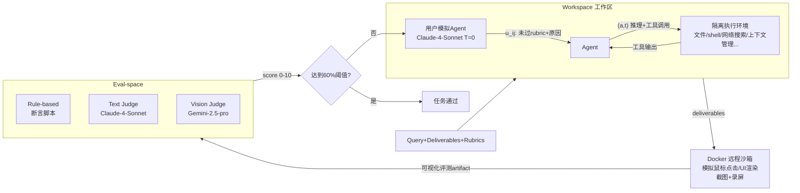

# AgencyBench：任务长到要烧一百万 token 时，"自主性"应该怎么量？（分组 G・Harness 评测/scaffold-aware eval・C/O 层・前沿 2026）

> arXiv 2601.11044v4｜SII · 上海交通大学(SJTU) · 香港理工大学(PolyU) · GAIR｜2026-01 提交 / 2026-04-23 修订｜代码：`github.com/GAIR-NLP/AgencyBench`｜时间坐标：本库 G 组第 3 篇，与标杆 Harness-Bench(2605.27922) 互补——后者"固定任务只换 harness"，本文"固定(近似)harness、把任务拉到百万 token 长程"，殊途同归地都在给 `Agent = Model + Harness` 找实证

---

## §1　TL;DR（一页讲清这篇在干嘛）

> 主讲提示：开场先立住一个反差——现有 benchmark 的"长程"到底有多短，AgencyBench 又把这根尺子拉到多长。

一句话：现有 agent benchmark 大多要么测单一能力（工具用得对不对/代码修得对不对），要么"长程"也就走到几万到二十万 token 就封顶；AGENCYBENCH 把交互跨度直接拉到**百万 token 级、数小时执行、平均 ~90 次工具调用**（摘要+Introduction），并且用**用户模拟 agent + Docker 远程沙箱**把整条评测流水线做成全自动，不再依赖人类在环反馈——这是它区别于"又一个 benchmark"的两个真正硬核设计。

核心数字（全部标出处，均已用 `pdftotext -raw` 与正文叙述交叉核对）：
- **6 大 agentic 能力 × 32 场景 × 138 任务**（§3.1.1，Table 5）：Game 10 场景/50 任务、Front-end 3/15、Back-end 3/15、Code 9/29、Research 5/19、MCP 2/10（Table 5，与 Figure 1 的 36.2%/10.9%/10.9%/21.0%/13.8%/7.2% 完全对得上）。
- **规模对比**（Figure 1 右表）：GAIA2 均 1 万 token/22.5 轮，Toolathlon(Tool Decathlon) 1.5 万 token/26.8 轮，连名字就叫"超长程"的 UltraHorizon 也只到 20 万 token/60 轮——AGENCYBENCH 是 **100 万 token/90 轮**，比"Ultra"Horizon 还长 5 倍 token。
- **主结果**（Table 1）：closed-source 均分 **48.4%**，open-source 均分 **32.1%**（摘要原文数字，我们用 Table 1 九个模型的 SAvg 独立复算验证一致）；GPT-5.2 最高 56.5%，Qwen-3-235B-A22B-Thinking 最低 27.0%。
- **换 harness 摆多少**（Table 4，§4.7）：Claude-4.5-Opus 从自研 scaffold 切到 **Claude-Agent-SDK**，同一模型分数从 50.8 跳到 71.3，**+20.5 分**；GLM-4.6 切到同一 SDK 也 **+10.6 分**。这是 AGENCYBENCH 自己给出的、独立于 Harness-Bench 的第二份 `Agent = Model + Harness` 实证。

- **属于 harness 的哪一层（Θ1）**：本篇挂在 **G 组**（scaffold-aware evaluation），但和"纯 V 层"的 Harness-Bench 不同——它的**诊断主轴是 C 层**（上下文/记忆能不能在百万 token、数十轮工具调用后还保持"没忘、没串、没糊"）和 **O 层**（Table 6 的工具调用频率画像、workspace→Docker sandbox→eval-space 三段式全量 trace，是一整套细粒度可观测性基建）；§4.7 的 scaffold 消融更接近 Harness-Bench 那种 V 层实验，但规模小得多（仅 10/138 场景、6 个模型），是全文的"附加验证"而非主线。
- **回扣全库论点（Θ2）**：论文自己在 §4.7/§5 得出的结论——"agentic performance is not solely a model-intrinsic property but a result of the coupling between the model and its agentic scaffold"（§4.7 原文）——和 `Agent = Model + Harness` 是同一句话的另一种表述，且它是**在没有读过 Harness-Bench 的情况下独立得出的**（两篇同为 2026 年上半年的工作），值得当作交叉验证证据。
- **够新够权威（Θ4）**：2026-01 提交、2026-04-23 修订到 v4，GAIR（Pengfei Liu 团队，以 O1 系列复现、多个高质量评测基准知名）出品，晚于本库标杆 Harness-Bench 约 4 个月，是"以 harness 为变量做评测"这条线在 2026 年的又一个独立样本。

---

## §2　问题与动机：现有基准的"长程"到底够不够长

> 主讲提示：这页要把"为什么必须做到百万 token"讲成一个有数字支撑的论证，而不是一句空洞的"更难更好"。

**Why（问题层）——不解决会卡住什么？**
论文开篇引用三篇 2025 年的"经济价值/长任务"研究（Pan et al. 2025《Measuring Agents in Production》、OpenRouter 2025《State of AI》、Kwa et al. 2025《Measuring AI Ability to Complete Long Tasks》，§1）说明背景：LLM agent 正在被大规模投入真实经济生产，这让"严格衡量其真实经济价值和表现"变得空前紧迫（§1 原文 "unprecedentedly urgent"）。但作者指出现有 agent benchmark 有两个**性质不同**的缺口（§1 明确列出两条）：

1. **长程任务稀缺 + 能力维度单一**：多数 benchmark 要么长程任务稀少（引 Li et al. 2025a=Tool Decathlon、Andrews et al. 2025=ARE），要么只测单一 agentic 能力——工具使用（Terminal-bench Team 2025、Wu et al. 2025b=MCPMark）、软件工程（Jimenez et al. 2023=SWE-bench）、或研究能力（Wei et al. 2025=BrowseComp、Xu et al. 2025=ResearcherBench）——"未能捕捉真实世界任务的长程本质和多样性"（§1 原文）。
2. **人类在环反馈造成规模化瓶颈**：真实任务往往需要"持续的人类反馈来引导 agent 完成多轮交互"，这种对 human-in-the-loop 的依赖本身就是一个瓶颈，**限制了 rollout 采集和评测的自动化程度**（§1 原文，这是与第 1 条完全独立的第二个问题——不只是"任务不够长"，还有"就算任务够长也评不动"）。

**用数字把第 1 条缺口钉死（Figure 1 右侧对比表，已用 `-raw` 模式核对数字列）**：

| Benchmark | Avg. Tok. | Avg. Turns |
|---|---:|---:|
| BrowseComp | 原文未给出 | 原文未给出 |
| Terminal-bench | 原文未给出 | 原文未给出 |
| SWE-verified | 原文未给出 | 15 |
| MCPUniverse | 原文未给出 | 7.5 |
| GAIA2 | 10K | 22.5 |
| Toolathlon（Tool Decathlon） | 15K | 26.8 |
| UltraHorizon | 200K | 60 |
| **AGENCYBENCH** | **1M** | **90** |

（注：原表右侧还有 Diverse Agentic / User Sim. / Docker Sandbox 三列勾叉符号，但这些图形符号在 PDF 文本层里没有留下可靠可提取的文本，我们没有把它们臆测还原为具体的√/×模式，只呈现能可靠读出的数字列。）

**读出什么**：即便是benchmark 名字里就写着"Ultra"（UltraHorizon，Luo et al. 2025，本库尚未收录该论文全文但可确认是 AGENCYBENCH 直接引用对比的同类工作）也只做到 20 万 token、60 轮——AGENCYBENCH 在 token 维度上仍比它长 **5 倍**，在轮数上长 1.5 倍。这不是"更卷一点"的量变，而是论文想证明的一个质变论点：**现有"长程"benchmark 的交互跨度，可能根本不够长到能把模型的上下文管理短板暴露出来**——这正是它选择把 C 层（上下文存活）当作诊断主轴的动机所在。

**Why（设计层）——为什么不干脆让 agent 连真实网络/真实人类反馈？**
朴素做法是像某些 web-agent benchmark 一样直接接真实网站、或者真找人类来给反馈。→ 会撞上第 2 条缺口本身：人类反馈没法规模化，跑一次评测要等人、要花钱、还没法复现（同类问题本库标杆 Harness-Bench §3.2 处理"离线沙箱 vs 真实联网"时给出的取舍完全一致）。AGENCYBENCH 的解法是**把"人类反馈"这一步单独训练/模拟成一个 agent**（§3.1.1、§3.2 的 User Simulation Agent，见 §8），代价是要额外做一轮"这个模拟人类靠不靠谱"的信度验证（§3.2 的 4.69/5.0 一致性研究，见 §8），换来的是整条 rollout 采集和评测流水线可以**完全自动化、可复现**地跑在 138 个任务上。

---

## §3　三个核心贡献（§1 末尾）

1. **Benchmark 资产**：138 个真实、高保真任务，横跨 32 个场景、6 大 agentic 能力，平均 rollout 超过 100 万 token、需要 90+ 次精确工具调用（§2 原文）。
2. **统一评测框架**：用户模拟 agent + Docker 远程沙箱，实现完全自动化评测（不需要人类介入）。
3. **前沿模型全面评测**：量化了闭源 vs 开源的能力差距，并挖出模型独特的行为模式（工具偏好、自我修正能力、scaffold 敏感度等）。

---

## §4　Benchmark 设计：能力→场景→任务的三层结构

> 主讲提示：这页讲清楚"6/32/138"这三个数字是怎么嵌套出来的，以及为什么要嵌套而不是拉平成 138 个互相独立的任务。

**直觉**：与其造 138 个互不相干的独立任务，不如把它们组织成"任务链"——像现实中做一个项目一样，先搭个架子，再一步步加功能，后面每一步都要在前面的基础上继续成立。

**层级定义（§3.1.1 Design Pattern）**：
- **能力（Capability）**：6 类——game development、front-end development、back-end development、code generation、research、MCP tool use（MCP = Model Context Protocol，agent 连接外部工具/数据源的通信协议标准）。
- **场景（Scenario）**：32 个真实世界场景，例如"从零开发一个五子棋游戏"（对应 game development 能力）、"做一次项目级代码调试"（对应 agentic debugging）、"做一次深度企业调研"（对应 research）。
- **任务（Task）**：每个场景内部是一条 **1–5 个任务组成、难度递增、按顺序执行**的逻辑链，且**前一个任务的完成结果会影响后续任务**（§3.1.1 原文），32 个场景合计展开成 **138 个具体任务**。

**数据集组成（Table 5，已用 `-raw` 核对）**：

| 能力 | 场景数 | 任务数 | 占比（Figure 1 甜甜圈图） |
|---|---:|---:|---:|
| Game | 10 | 50 | 36.2% |
| Front-end | 3 | 15 | 10.9% |
| Back-end | 3 | 15 | 10.9% |
| Code | 9 | 29 | 21.0% |
| Research | 5 | 19 | 13.8% |
| MCP | 2 | 10 | 7.2% |
| **合计** | **32** | **138** | 100% |

（Figure 1 甜甜圈图上还标了每个大类下更细的二级子类目，例如 Game 下有 Board Game / Puzzle Game / Arcade Game / Action Game / Casual Game 等，Research 下有 Dataset Research / Web Searching / Topic Research 等，MCP 下有 Github MCP / File MCP 等——但这些二级子类各自的具体任务数在图形符号提取时丢失，原文未给出可靠的精确映射，这里只做定性说明，不追加编造的百分比。)

**Why（设计层）——为什么要做成"链式任务"而不是"并列任务"？**
朴素做法是让 138 个任务各自独立、互不依赖，这样评测起来更干净（互不干扰、可并行跑）。→ 但这样就没法测"长程"这件事本身——如果每个任务都从一张白纸开始，agent 永远不需要在 30 轮之后还记得自己 5 轮前做过什么决定。AGENCYBENCH 故意让同一场景内的任务**递进依赖**（Task2 要接着 Task1 的产物改，Task5 要保证 Task1–4 的行为不回归），这样才能真正"要求 agent 在延长的周期内维持上下文并执行逻辑，以满足多轮、长程的真实世界需求"（§3.1.1 原文）——这正是 C 层（上下文管理）被推到诊断主轴位置的设计根源，也是为什么合计只有 32 个"评测单元"（场景）而不是 138 个。

**Game 类占比最高的原因（§A.1 原文解释）**：Game development 独占 36.2%的任务量，作者的解释是游戏场景天然要求"agent 同时管理连续状态、模拟物理规则、处理复杂逻辑交互"（§A.1 原文），是天然适合压测长程状态管理能力的载体；同时数据集特意在 Front-end / Back-end 之间做了 15/15 的**等量对半分配**（§A.1 原文明确说"explicitly balances full-stack development skills"），并单独留了 10 个 MCP 任务，为的是"保持与前沿 agent 接口标准的相关性"（§A.1 原文）。

---

## §5　具体任务怎么设计：以"从零做五子棋"这条 5 任务链为例

> 主讲提示：这是全篇最具体、最能体会"rubric 精细到什么程度"的一页，建议放慢讲，逐条读 Task 1 的验收标准。

**直觉**：一个"好的" agent 任务，光有一句自然语言需求是不够的——评测者需要知道"做到什么程度才算过"，而且这个"过不过"最好能写成脚本自动判断，不需要人盯着屏幕看。AGENCYBENCH 给每个任务配了严格的三元组，并用 Appendix A.3 完整摘录了一条真实的五子棋（Gomoku）5 任务链作示范。

**三元组定义（§3.1.2）**：
- **Query（查询）**：任务需求的自然语言描述。
- **Deliverables（交付物）**：期望产出的文件或终态描述。
- **Rubrics（评分细则）**：评估用的客观判定标准。

**Gomoku 场景 5 任务链（Appendix A.3，逐条已核对原文）**：

| Task | Query 要点 | Rubric 精度示例 |
|---|---|---|
| 1. 静态棋盘初始化 | 15×15 棋盘、A–O/1–15 坐标标注、Start 按钮、棋子图例，加载即自动调用 `initializeBoard()` | 棋盘尺寸 **640±4px**，居中误差 **±6px**，225 个 `.intersection` 元素，`describeLayout()` 坐标校验 |
| 2. 交互式落子逻辑 | 黑白轮流点击落子，状态栏 `#status-bar`，最近一步脉冲光圈高亮 | 依次点击 H8/H9/重复H9(应被拒)校验轮转；光圈 **26±3px** 动画，录制进 `moves_turns.webm` |
| 3. 胜负判定与回放 | 自动判胜、获胜横幅、undo/redo/回放 | 指定 9 步棋后 `checkWinner()` 须返回 "Black"；回放速度需 **>300ms/步**；`session.log` 与 `exportLog()` 必须逐字一致 |
| 4. 持久化层 | 存档/读档/重置面板，写入 `localStorage` | 存档 JSON 结构、`serializeState()`/`applyState()` 互逆、记分板胜负计数正确递增 |
| 5. 诊断侧栏与压力测试 | 显示深度/步数/耗时的诊断侧栏，从 `hard_cases.json` 加载脚本化场景回放 | 侧栏 **260±6px 宽**、距右边 **60±6px**；`estimateHeap()` 连续调用 5 次须给出非递减且 **<64,000,000** 的整数 |

**读出什么（rubric 的可执行性）**：这些 rubric 精细到像素级容差（±3px/±4px/±6px）、精确到毫秒级时序（>200ms、>300ms）、甚至精确到内存占用的数值上界（<64,000,000）——这种颗粒度是为了让 rubric 能被**自动化脚本直接断言**（§3.3 "the rubrics are directly translated into assertion logic within the evaluation scripts"），而不是留给主观判断。这也回应了 §2 的第二个动机：只有 rubric 写得足够可执行，才能真正摆脱"human-in-the-loop"。

**用 Figure 3 的真实裁判打分，看双裁判（文本+视觉）会不会打架**：

| Task | Text Judge (0-10) | Vision Judge (0-10) | 说明 |
|---|---:|---:|---|
| 1 | **2** | **8** | 文本裁判读代码发现棋盘实际 600px（要求 640px）、偏心、UI 元素错位；视觉裁判看截图只觉得"功能正常、达标" |
| 2 | 8 | 8 | 核心逻辑与 API 均正确，仅有细节可打磨 |
| 3 | 7 | 6 | 文本裁判发现 `checkWinner()` 有 TypeError、`session.log` 是空文件；视觉裁判发现回放时 UI 重置不一致 |
| 4 | 7 | 6 | 文本裁判揪出状态恢复逻辑里"读档后 moves 数组为空"的 bug；视觉裁判则从 UI 表现发现记分板/胜负判定连锁失效 |
| 5 | 8 | 8 | `summarizeScenario()` 算法有缺陷、侧栏 "Line" 标签重复不合规范，但两个裁判都给出中高分 |

**读出什么（为什么要双裁判，而不是选一个）**：Task 1 的 **2 分 vs 8 分**是全篇最戏剧性的一处分歧——视觉裁判只看截图/录屏，"棋盘看起来居中、方方正正"就给了高分；但文本裁判去读 `describeLayout()` 返回的精确坐标和 CSS，发现棋盘实际只有 600px（要求 640px）、整体偏移。这恰好印证了论文选择"文本+视觉双裁判"而非单一裁判的设计动机——**纯视觉判断会漏掉肉眼不容易分辨、但 rubric 明确要求的像素级偏差**。但这个例子也带出一处我们自己的批判：论文的最终合成规则是"取两个裁判的平均分"（§3.3），(2+8)/2=5——对于一个被文本裁判定性为"major layout failures"的任务，5/10（50%）仍然不算严厉的惩罚；换句话说，**平均法可能把"其中一个裁判抓到了硬伤"这件事稀释掉**，这是论文没有讨论、但从它自己给出的例子里能直接看出来的风险。

---

## §6　数据采集：20 位专家 + 4 人评审团 + 100% 一致同意门槛

> 主讲提示：这页讲清"真实任务是怎么从人脑里采出来、又是怎么被把关的"。

**采集流程（§3.1.2）**：
1. 邀请 **20 位人类专家**（AI 研究员、活跃 AI 从业者、软件工程师）贡献真实世界任务。
2. 每个任务由专家手工构造并验证三个部件：Query、Deliverables、Rubrics，并额外为每个任务开发可执行的评测脚本。
3. 另设**独立的 4 人专家评审团**，对整个数据集做描述准确性、难度校准、环境配置的全面复核。
4. 质量门槛：**严格一致同意（unanimous consensus）**——任务只有在全部专家达成完全一致时才最终定稿；一旦出现分歧，任务被打回修订，直到再评审给出 **100% 通过率**为止（§3.1.2 原文）。

**读出什么**：这套"20 人产出 + 4 人一票否决式复核"的构造流程，本质上是把 Harness-Bench 用"Realism / Solvability / Oracle-checkability / Integrity 四条准入准则"做的事情，换成了"人力密集的多轮一致性评审"来实现——两条路径服务同一个目标：保证进入 benchmark 的每个任务都是真实、可解、可裁判、且难以刷分的。这也解释了为什么最终只留下 138 个任务而不是更多——高门槛的一致同意制天然会筛掉大量候选。

---

## §7　把一次任务执行写成状态-动作序列（§3.2 Rollout Definition）

> 主讲提示：先给直觉，再上符号——这页是全篇形式化程度最高的一页，但逻辑其实很朴素。

**直觉**：把一次任务的完整执行过程录下来，就是"一句需求 + 一连串〔思考/工具调用〕，中间只要交付物没达标，就插入一条用户反馈，然后 agent 接着干，如此循环，直到达标或者到达轮数上限"。

**符号定义（先定义后用）**：设某场景由 5 个顺序任务组成，第 $i$ 个任务的 rollout 记为 $\Sigma_i$；$q_i$ 是 AGENCYBENCH 给出的初始查询；$(a, t)$ 表示 agent 的一次"推理 + 具体工具调用"（如文件写入、shell 命令）；$u_{ij}$ 表示第 $i$ 个任务第 $j$ 轮的用户模拟反馈——只要交付物没有达到 rubric 规定的分数阈值，就会触发一次。

$$\Sigma_i = (q_i,\ a,t,\dots,\ a,\ u_{i1},\dots,\ a,\ u_{i2},\dots,\ a,t,\dots) \qquad i=1,\dots,5$$

整个场景的完整 rollout 是这 5 个任务 rollout 的有序拼接：

$$\Sigma = (\Sigma_1, \Sigma_2, \Sigma_3, \Sigma_4, \Sigma_5)$$

**读出什么**：这个形式化把"多轮 + 长程 + 任务链式依赖"三件事同时编码进了一个符号里——$u_{ij}$ 的存在说明单个任务内部本身就可能是多轮的（不是一锤子买卖），而 $\Sigma$ 的拼接说明**场景级的"长程"是任务级"中程"的层层叠加**：百万 token 的量级不是靠单个任务硬撑出来的，而是 1–5 个有依赖关系的任务首尾相连累积出来的。这与 D 组上下文工程论文（如 AgentFold、MemGPT）讨论的"单一超长对话"式长程不同——AGENCYBENCH 的长程更像是"一个项目的多个迭代版本"，上下文里混杂着不同任务阶段的产物、日志、反馈，这对 agent 的上下文管理提出的是**跨任务的结构化记忆**要求，而不只是"压缩一份很长的聊天记录"。

---

## §8　绕开人类在环瓶颈：用户模拟 Agent

> 主讲提示：这页回答 §2 提出的第二个动机——"评测怎么做到不用人"。

**机制（§3.2）**：用户模拟 agent 负责在 agent 交付物没有满足当前任务 rubric 时提供反馈。具体做法：如果 agent 只满足了 10 条 rubric 中的 6 条，用户模拟 agent 会把**没通过的 4 条 rubric，连同各自的失败原因**一起返回给执行 agent（§3.2 原文示例）。承担这一角色的模型是 **Claude-4-Sonnet，温度设为 0.0**（详细 prompt 见 Appendix A.2）。

**Prompt 设计的关键结构（Appendix A.2，"Agent 3: User Simulation Agent"）**：输入是评测结果（Judge 打的分/置信度/评语）、阈值、原始 rubric、交付物；输出是一份**结构化文本报告**（不是 JSON）：① 明确宣布"提交被拒"；② 失败诊断——逐条列出哪些 rubric 未满足；③ 根因分析——从用户需求角度解释为什么失败（例如"要求响应式布局，但 CSS 用了固定宽度"）；④ 修订指令——明确指出下一轮该改什么。

**信度验证（§3.2）**：为确认这个"模拟用户"靠不靠谱，作者在 50 条随机抽样的交互 rollout 上做了人类验证研究——**4 位专家独立撰写"未满足 rubric"的理由**，另外 **4 位专家独立**对照 agent 反馈打分（整数 0–5，从"高度不一致"到"高度一致"5 档），最终平均分 **4.69**，作者据此认为该 agent "是人类专家的可靠代理"（§3.2 原文）。

**Why（设计层）——为什么不干脆记录真实用户的历史反馈来重放？**
朴素做法是收集大量真实人类用户的历史反馈样本，评测时重放。→ 但重放的反馈是针对"历史上那次具体的错误"写的，换一个 agent、犯了不一样的错，历史反馈根本对不上号，没有互动性。AGENCYBENCH 选择训练/配置一个**能针对当前这次具体交付物动态生成反馈**的模拟 agent，代价是要多做一轮"这个模拟够不够像真人"的信度研究（4.69/5.0），换来的是**反馈天然贴合当次交付物的具体缺陷**，可以规模化地在 138 个任务上重复。

**我们的一点批判**：承担 Text-based Judge 和 User Simulation Agent 两个角色的都是 **Claude-4-Sonnet**（§3.2、§3.3），而参与被评测的 9 个模型里恰好包含**同一家族的 Claude-4.5-Sonnet 和 Claude-4.5-Opus**。虽然版本不同（4 vs 4.5），但"评委和部分选手同宗同源"这件事本身，是本库标杆 Harness-Bench §14 提出的"谁来 judge the judge"隐忧的又一个具体样本——论文没有讨论这层潜在的系统性偏差,我们据实指出、不做进一步定性(即不推测这必然导致 Claude 系列分数被抬高或压低,因为方向未知)。

---

## §9　评测管线：Workspace → Docker 沙箱 → Eval-space 三段式

> 主讲提示：先上图，再逐段讲三个空间各自的职责边界。

**直觉**：把"agent 干活"和"给 agent 的产出打分"物理隔开成三个独立空间，一是为了防止环境状态互相污染，二是为了让"打分"这一步能引入 agent 在执行时根本看不到的额外检查手段（比如真的点一遍 UI）。

**三段职责（§3.1.1、§3.3）**：
- **Workspace（工作区）**：每个任务在**隔离**的工作区内运行，防止状态互相干扰；配备"文件操作、命令行执行、网络搜索、上下文管理……"（§3.1.1 原文用省略号，未逐一列全）等工具的完整 scaffold，agent 在这里与环境多轮交互产出**原始交付物**。
- **Docker 远程沙箱**：交付物同步进这里，模拟人机操作（鼠标点击、UI 渲染）生成**可视化评测产物**（截图、录屏）。
- **Eval-space（评测区）**：一个独立的本地空间，artifacts 和原始交付物在这里被**可执行脚本自动**打分，全程无需人工介入（§3.1.1 原文）。

**评分路径（§3.3，三选一）**：
1. **Rule-based**：客观可验证的任务（工具执行是否正确、数学优化、特定文件生成）——rubric 直接翻译成断言逻辑，按通过率或优化指标映射到 0–10。
2. **纯文本 LLM-judge**：不需要视觉交付物的任务，只用 Text-based Judge 打分。
3. **文本+视觉双裁判平均**：game 与 front-end 场景（§3.3 原文明确点名这两类）需要多模态判断——Text-based Judge（Claude-4-Sonnet, T=0）评代码质量/逻辑，Vision-based Judge（**Gemini-2.5-pro**, T=0）评动态行为/视觉正确性，最终分是两者平均。（其余四类具体各自落在方案 1 还是方案 2，原文没有逐类说明，只给了"可验证用规则、主观/视觉用 LLM"这条通用原则。）

**裁判打分的分档标准（Appendix A.2 原文，Text-based Judge 为例）**：0–2 分=Critical Failure（不可用或未触及核心问题）；3–5=Substantial Deficiency（主要功能缺失）；6–7=Marginal Acceptance（核心功能可用但边缘情况/约束未处理）；8–9=High Compliance（满足全部功能需求，仅有零星风格问题）；10=Full Specification Alignment（完全符合）。**注意**：论文在指标定义处给的"6/10 rubrics 满足即 60%"（§3.3 Metric 部分）只是一个方便理解的类比，实际无论 rule-based 还是 LLM-judge，落地的都是这套**分档描述**打出的 0–10 整数分，并不是机械地清点"多少条 rubric 被满足"。

**可靠性验证（§3.3）**：LLM 裁判在 50 个留出任务上与 4 位人类专家独立打分对比，**Kappa = 0.93**（与 §8 用户模拟 agent 的信度验证是两个独立的 50-任务研究，不要混为一谈）。

---

## §10　指标体系：SAvg 之外，"自主性"怎么被量化（核心）

> 主讲提示：这是全篇最值得停留的一页——AGENCYBENCH 这个名字里的"Agency"到底被拆成了哪几个可计算的数。先讲直觉，再逐个上公式，最后做一次批判性追问。

**直觉**：如果只报告"任务最终做得好不好"（一个 0–100% 的质量分），会把两种性质完全不同的 agent 混在一起——一种是"一次性就把活干漂亮"的省心型，另一种是"最后也做出来了，但过程里被反复纠错、来回拉扯"的费心型。AGENCYBENCH 把"最终质量"和"要花多少轮外部纠正才能达标"拆成了两条独立的轴，后者就是它对"自主性"的操作化定义。

**指标一・Average Score（$S_{avg}$）**：rubric 评测换算出的百分比，衡量最终交付质量本身，越高越好。

**指标二・Average Attempts（Att，Eq 1）**：一个任务判定为"通过"的门槛是分数 $\geq 60\%$；如果没通过，用户模拟 agent 会继续给反馈，最多到第 $K$ 轮为止（$K$ 的具体数值原文未给出）。设 $M$ 为当前场景任务总数，$M_{Att}$ 为该场景下全部任务实际用掉的尝试轮次总和：

$$Att = \frac{M_{Att}}{M} \tag{1}$$

**原文对这个指标的定性非常直白："lower values imply stronger autonomy"（§3.3 原文）——Att 越低，代表 agent 越不需要外部纠错就能把事情做对，也就是越"自主"。**

**指标三・Pass Rate（Pass@k，Eq 2）**：给定场景内 $N$ 个任务，$N_{pass}$ 是在 $k$ 轮反馈以内达到 60% 阈值的任务数：

$$Pass@k = \frac{N_{pass}}{N} \tag{2}$$

论文把反馈上限分别设为 $k=1$ 和 $k=2$，据此报告 Pass@1（一次成型率）和 Pass@2（两轮以内过关率）。

**指标四・效率（Eq 3）**：设 $Tok$ 为场景平均消耗 token 数，定义尝试效率和 token 效率：

$$E_{att} = \frac{S_{avg}}{Att}, \qquad E_{tok} = \frac{S_{avg}}{Tok} \tag{3}$$

两个效率指标都是"每花一单位资源（一次尝试/一个 token）换回多少质量分"，数值越高说明资源利用越划算。

**读出什么（与本库 D 组姊妹篇的方法论呼应）**：把 $S_{avg}$（质量）和 $Att$/$Pass@k$（自主性）拆开报告，这个设计思路和本库 F 组 AgentSwing（2603.27490）把 Pass@1 拆成"搜索效率 $\eta$ × 终止精度 $\rho$"（AgentSwing §2.1）在方法论上是同一类操作——**两篇论文都在提醒我们："完成率"从来不是一个单一维度的信号，混在一个数字里会让人误判改进的真正来源**。区别在于拆分的轴不同：AgentSwing 拆的是"有没有走到终点"×"走到终点答案对不对"（同一次尝试内部的两阶段）；AGENCYBENCH 拆的是"最终质量多好"×"要几轮外部干预才能达到这个质量"（跨越多次尝试的纵向轴）。两种拆法互补，都指向同一条更底层的方法论共识：**长程 agent 评测必须至少是二维的**。

**Why（设计层）——这套"用反馈轮数量自主性"的方案，凭什么优于直接看 $S_{avg}$？**
朴素做法是只报 $S_{avg}$：反正最后分高就是好模型。→ 会把"一次成型的省心模型"和"靠多轮被动纠错硬凑出高分的模型"评成同一个分数，而后者在真实无人值守场景里（没有用户随时在线纠错）可能根本发挥不出这个分数。AGENCYBENCH 用 Att/Pass@k 把"需要多少次外部干预"显式量化出来，换来的代价是**指标数量翻倍、解读难度上升**（下面马上会看到这带来的解读陷阱）。

**一个我们自己发现的解读陷阱（批判，非论文自陈）**：论文把 Att 低直接等同于"更自主"，但这个等价关系并不总是成立——一个任务本身**足够简单**、任何合格模型都能一次做对，也会让 Att 天然偏低,这和"模型在困难任务上依然能不依赖外部反馈"是两回事,论文没有在 Att 计算时按任务难度做归一化处理。类似地，§4.3 会看到 Kimi-K2-Thinking 的 Rise（Pass@2 相对 Pass@1 的提升幅度）高达 300%——这既可以读成"自我修正能力极强"，也可以读成"第一次交付质量差到有大量提升空间"，这两种解释目前只能靠额外去看 Pass@1 的绝对值本身来分辨（Kimi Pass@1 只有 6.3%，说明后一种解释成分更大）。论文自己没有给出"Att/Rise 该如何联合 $S_{avg}$ 一起解读"的指导，这是一个真实存在、但作者没展开讨论的缺口——我们会在 Inspires-Us 里把它列为一个可下手的机会。

**顺带一提命名上的细节**：benchmark 本身叫 **AgencyBench**，字面直接嵌入了"Agency"（自主性/能动性）这个词，但论文正文的指标定义章节实际使用的词汇始终是 **"autonomy"**（"stronger autonomy"），并没有把"agency"当一个正式定义过的技术术语单独展开——这里的"agency"更多是命名层面的点题，量化落地靠的是 Att / Pass@k 这套"外部干预次数"代理指标。

---

## §11　实验设置：9 个模型 × 138 个任务

**模型与 scaffold（§4.1）**：闭源 5 个——GPT-5.2、Claude-4.5-Opus、Claude-4.5-Sonnet、Grok-4.1-Fast、Gemini-3-Pro；开源 4 个——GLM-4.6、DeepSeek-V3.2、Qwen-3-235B-A22B-Thinking、Kimi-K2-Thinking。全部经 **OpenRouter API** 接入，温度统一设为 **0.7**（"平衡创造性与确定性"，§4.1 原文），使用 §3.1.1 描述的统一 agentic scaffold（具体工具清单见 Table 6，§16）。

---

## §12　主结果：Table 1 全表解读，闭源 48.4% vs 开源 32.1%

> 主讲提示：先给整体差距，再下钻到"谁在哪类能力上称王"，逐条对照 Table 1 原始数字讲，不要只念结论句。

**Table 1（已用 `-raw` 模式逐格核对，GPT-5.2 与 GLM-4.6 分别为闭源/开源基线行，无下标；其余行下标为相对基线的涨跌）**：

| Model | Game | Frontend | Backend | Code | Research | MCP | **SAvg** | Att |
|---|---:|---:|---:|---:|---:|---:|---:|---:|
| **GPT-5.2**（基线） | 52.2 | 74.7 | 61.0 | 50.7 | 64.4 | 52.1 | **56.5** | 1.46 |
| Claude-4.5-Opus | 52.1 | 49.3 | 49.6 | 24.0 | 68.8 | 64.4 | 47.7 | 1.54 |
| Gemini-3-Pro | 60.7 | 81.0 | 31.3 | 23.5 | 40.0 | 61.8 | 46.9 | 1.46 |
| Claude-4.5-Sonnet | 56.5 | 51.6 | 35.3 | 17.3 | 71.4 | 62.3 | 46.4 | 1.49 |
| Grok-4.1-Fast | 38.8 | 65.7 | 37.3 | 26.4 | 63.8 | 68.6 | 44.3 | 1.55 |
| **GLM-4.6**（基线） | 59.2 | 64.3 | 20.0 | 11.9 | 32.0 | 49.8 | **38.6** | 1.54 |
| Kimi-K2-Thinking | 40.6 | 54.7 | 24.3 | 11.8 | 33.6 | 31.4 | 34.2 | 1.79 |
| DeepSeek-V3.2 | 36.5 | 49.3 | 20.7 | 11.6 | 22.0 | 48.5 | 28.6 | 1.63 |
| Qwen-3-235B-A22B-Thinking | 40.4 | 57.7 | 3.3 | 4.6 | 34.4 | 20.9 | 27.0 | 1.79 |

**整体差距验证**：闭源 5 模型 SAvg 均值 $(56.5+47.7+46.9+46.4+44.3)/5 = 48.36\% \approx 48.4\%$；开源 4 模型均值 $(38.6+34.2+28.6+27.0)/4 = 32.1\%$——与摘要给出的"48.4% vs 32.1%"精确吻合（§4.2、摘要）。闭源区间 56.5%(GPT-5.2)–44.3%(Grok-4.1-Fast)，开源区间 38.6%(GLM-4.6)–27.0%(Qwen-3-235B-A22B-Thinking)（§4.2 原文数字）。

**分能力称王者（逐列核对，非全部照抄原文叙述）**：
- **Game**：Gemini-3-Pro 60.7（原文点名"dominates"，§4.2）。
- **Frontend**：Gemini-3-Pro 81.0（同样"dominates"）。
- **Backend / Code**：GPT-5.2 分别以 61.0 / 50.7 领先（§4.2 原文"excels"）。
- **Research**：Claude-4.5-Sonnet 71.4 最高（§4.2 原文）。
- **MCP**：我们独立核对发现原文没有点名——实际最高分是 **Grok-4.1-Fast 的 68.6**，比整体排名靠后的 Grok（SAvg 44.3，闭源最低）在这一项反超了所有其他模型，是一处论文正文没提、但表格数字本身能读出的"隐藏冠军"。
- 开源阵营内部：GLM-4.6 在 Game/Frontend/Code/MCP 四项领先（"exhibits balanced performance"，§4.2），但 Backend 被 Kimi-K2-Thinking 反超（24.3 vs 20.0），Research 被 Qwen-3-235B-A22B-Thinking 反超（34.4 vs 32.0，原文点名"Qwen-3-235B-A22B-Thinking demonstrates relative strength in research **despite lower overall average**"，§4.2）。

**读出什么**：整体排名（SAvg）会掩盖能力维度上的"偏科"——Grok-4.1-Fast 总分吊车尾却是 MCP 工具使用的单项冠军，Qwen 总分垫底却在 Research 上超过除 Sonnet 之外的所有模型。这提示我们：**单一综合分不足以指导"该用哪个模型做哪类任务"这个更实际的工程决策**，Table 1 这种"分能力矩阵"的呈现方式本身就是一种值得借鉴的报告规范（呼应 Inspires-Us a）。

---

## §13　反馈驱动的自我修正：Table 2，Pass@1 → Pass@2 的涨幅

> 主讲提示：这一页量化"给一次机会 vs 给两次机会，分数能涨多少"，直接对应 §10 定义的 Pass@k。

**Table 2（已用 `-raw` 模式核对，与正文叙述逐句对照一致）**：

| Model | Pass@1 | Pass@2 | Rise(%) |
|---|---:|---:|---:|
| GPT-5.2 | 28.1 | 53.1 | 88.9 |
| Claude-4.5-Sonnet | 21.9 | 40.6 | 85.7 |
| Claude-4.5-Opus | 15.6 | 28.1 | 80.0 |
| Gemini-3-Pro | 28.1 | 37.5 | 33.3 |
| Grok-4.1-Fast | 25.0 | 31.3 | 25.0 |
| GLM-4.6 | 28.1 | 37.5 | 33.3 |
| Kimi-K2-Thinking | 6.3 | 25.0 | 300.0 |
| DeepSeek-V3.2 | 9.4 | 9.4 | **0.0** |
| Qwen-3-235B-A22B-Thinking | 3.1 | 9.4 | 199.7 |

**读出什么**：
- **GPT-5.2 和 Claude 系列的"高级错误处理"**：GPT-5.2 相对提升 88.9%，Claude 两个版本均超过 80%（§4.3 原文），说明这些模型不但初始表现好，拿到具体的失败 rubric 反馈后还能**高效纠正**。
- **Gemini-3-Pro 的反直觉信号**：Pass@1 (28.1) 与 GPT-5.2 打平，但 Rise 只有 33.3%——"初始直觉很强，但自我修正机制响应度较低"（§4.3 原文）。这是一处**初始能力强 ≠ 自我修正能力强**的明确反例，值得单独强调。
- **开源阵营两极分化**：Kimi-K2-Thinking（300%）和 Qwen-3-235B-A22B-Thinking（199.7%，"近 200%"，§4.3 原文用"nearly 200%"表述，与我们核对到的 199.7 精确值一致）反馈后提升巨大，但结合 §10 的批判——它们的 Pass@1 基数本来就很低（6.3%、3.1%），所以巨大的相对涨幅更多是"起点太低、上升空间大"，而不一定是"自我修正能力天生更强"。
- **DeepSeek-V3.2 是全表唯一 0.0% Rise**：Pass@1 与 Pass@2 都是 9.4%，"持续坚持错误路径，不理会外部批评"（§4.3 原文 "persistently adhering to erroneous paths despite external critique"）——这是本表信息量最大的一格：不是"没有能力"，而是**有了明确指出错误的反馈也不改**，这是一种比"能力不足"更值得警惕的失败模式（类似本库 H 组要处理的"失败恢复"议题，见 Inspires-Us d）。

---

## §14　资源消耗：Table 3，"1M token"到底是谁的均值

> 主讲提示：这页专门做一次较真的核算，是本报告"缺失写原文未给出、不编造"这条规范的示范段落。

**Table 3（已用 `-raw` 模式核对）**：

| Model | Tok (M) | T (H) | Turns |
|---|---:|---:|---:|
| GPT-5.2 | 3.4 | 0.6 | 89.0 |
| Claude-4.5-Sonnet | 4.1 | 0.9 | 64.0 |
| Gemini-3-Pro | 1.8 | 0.3 | 37.0 |
| Grok-4.1-Fast | 1.2 | 0.3 | 37.0 |
| Claude-4.5-Opus | 1.7 | 0.8 | 36.0 |
| GLM-4.6 | 2.4 | 0.6 | 105.0 |
| Kimi-K2-Thinking | 2.8 | 1.2 | 65.0 |
| DeepSeek-V3.2 | 1.5 | 1.0 | 21.0 |
| Qwen-3-235B-A22B-Thinking | 1.2 | 1.4 | 21.0 |

**读出什么（原文叙述逐条核对）**：
- GPT-5.2"像个暴力搜索者"——3.4M token、89 轮换来最高分（§4.4 原文"brute-force reasoner"）。
- Grok-4.1-Fast 是"速度与节俭的巅峰"——1.2M token、仅 0.3 小时（§4.4 原文）。
- GLM-4.6 画像独特——轮数高达 105（全表最高）但 token 消耗仍属中等（2.4M）（§4.4 原文"despite a high turns count...resource usage remains moderate"）。
- 正文说"Kimi-K2-Thinking 和 Qwen-3-235B-A22B-Thinking 耗时最高（1.2h）"（§4.4 原文），但**逐格核对 Table 3 后发现 Qwen 实际耗时是 1.4h，比正文引用的 1.2h 更高**——这是原论文正文叙述与表格数字之间一处小的不一致，我们据实标出，不代为"修正"或强行调和。

**一处值得较真的细节：摘要"90 次工具调用、100 万 token"到底是哪个均值？**
摘要和 §1 Introduction 都写"这些场景平均需要约 90 次工具调用、100 万 token、数小时执行时间"（§1、摘要，几乎逐字重复）。我们尝试用 Table 3 的 9 个模型数据自行反算算术平均：Turns 均值 $= (89+64+37+37+36+105+65+21+21)/9 \approx 52.8$；Tok 均值 $=(3.4+4.1+1.8+1.2+1.7+2.4+2.8+1.5+1.2)/9 \approx 2.23M$。**两个数字都与摘要给出的"90/1M"对不上**——52.8 远低于 90，2.23M 又高于 1M。这说明摘要级别的"90 次/100 万 token"很可能不是简单地对 Table 3 九个模型的实测消耗取平均，而更可能是在数据构建阶段用某条参考/基线轨迹刻画出的**场景固有难度**（GPT-5.2 一行的 89 turns/3.4M tokens 与"90/1M"最接近，但原文没有明确说明这就是换算口径）。原文没有解释这个摘要级别数字的精确计算方法，我们据实分别列出两处数字，不做强行归并解读——这正是"数字要标出处、不确定的宁可说原文未给出"这条规范要防的坑。

---

## §15　效率分析：把"分高"和"划算"分开看

> 主讲提示：呼应 §10 的 $E_{att}/E_{tok}$ 定义，这里给出具体数值，并标清哪些是论文原文直接给的、哪些是我们据 Eq(3) 反算的。

**论文原文明确给出的效率数字（§4.5，Figure 4）**：
- **Attempt Efficiency 最高**：GPT-5.2，**38.7%**（"表明它高资源消耗换来的是同样高的单次尝试成功率"，§4.5 原文）。
- **Attempt Efficiency 最低**：Qwen-3-235B-A22B-Thinking（具体数值原文未直接给出）。
- **Token Efficiency 最高**：Grok-4.1-Fast，**37.2%**（"资源受限环境下最经济划算的选择"，§4.5 原文）。
- **Token Efficiency 最低**：Claude-4.5-Sonnet，**11.4%**（"消耗 4.1M token 却没有换回同等比例的表现提升"，§4.5 原文）。

**我们据 Eq(3) 用 Table 1（$S_{avg}$、Att）与 Table 3（Tok）反算的完整排名**（标注"≈"，因 Table 中数值均四舍五入到 1 位小数，反算值与 Figure 4 图表本身的精确刻度可能有 ±0.1–0.4 个百分点的偏差；我们用 Figure 4 柱状图上可提取到的文字标签做了交叉核对，量级与排序完全一致）：

| Model | $E_{att} = S_{avg}/Att$ | $E_{tok} = S_{avg}/Tok$ |
|---|---:|---:|
| GPT-5.2 | **38.7**（原文原数） | ≈16.6 |
| Gemini-3-Pro | ≈32.1 | ≈26.1 |
| Claude-4.5-Sonnet | ≈31.1 | **11.4**（原文原数，最低） |
| Claude-4.5-Opus | ≈31.0 | ≈28.1 |
| Grok-4.1-Fast | ≈28.6 | **37.2**（原文原数，最高） |
| GLM-4.6 | ≈25.1 | ≈16.1 |
| Kimi-K2-Thinking | ≈19.1 | ≈12.2 |
| DeepSeek-V3.2 | ≈17.6 | ≈19.1 |
| Qwen-3-235B-A22B-Thinking | ≈15.1（最低，与原文"ranks the lowest"定性一致） | ≈22.5 |

**读出什么**：$E_{att}$ 和 $E_{tok}$ 的排名**并不一致**——Claude-4.5-Opus 在 $E_{att}$ 上排第 3（≈31.0），但在 $E_{tok}$ 上排第 2（≈28.1，仅次于 Grok）；反过来 Grok-4.1-Fast 的 $E_{att}$（≈28.6）明显不如它的 $E_{tok}$（37.2，全场最高）排名靠前。这说明"尝试次数省"和"token 花得少"是两种能够脱钩的资源节俭方式：Grok 的策略更像是"每一轮工具调用都很轻"，而不是"很少需要反复纠错"。这进一步印证了 §10 的观点——资源效率这件事也不该只用一个数概括。

---

## §16　工具调用行为指纹：Table 6 里的"认知风格"

> 主讲提示：这页最适合讲成"破案"——同样的任务集，不同模型留下完全不同的工具调用指纹。

**Table 6（19 种工具的调用频次，9 个模型，已用 `-raw` 模式逐格核对）节选**：

| 工具 | Claude-O | Claude-S | Gemini-3 | GPT-5.2 | Grok-4.1 | GLM-4.6 | DeepSeek | Qwen3 | Kimi-K2 |
|---|---:|---:|---:|---:|---:|---:|---:|---:|---:|
| list_directory | 53 | 47 | 54 | 45 | 42 | **158** | 25 | 8 | 82 |
| run_shell_command | 191 | **362** | 140 | **425** | 141 | 371 | 86 | 40 | 301 |
| replace | 13 | 29 | 42 | **146** | 1 | 15 | 14 | 2 | 49 |
| write_file | 81 | 169 | 79 | 117 | 109 | **381** | 41 | 185 | 97 |
| update_memory_bank | 0 | 0 | **22** | 0 | 1 | 0 | 0 | 5 | 0 |
| initialize_memory_bank | 0 | 0 | **7** | 0 | 1 | 0 | 0 | 2 | 0 |
| web_fetch | 0 | 0 | 0 | 0 | 6 | **96** | 0 | 0 | 7 |

**四种行为原型（§A.1 原文四条，均已核对表格数字）**：

1. **"导航者" vs "执行者"**：GLM-4.6 调用 `list_directory` **158 次**，接近其他模型均值的三倍，倾向于先摸清环境再行动；GPT-5.2（425 次）和 Claude-4.5-Sonnet（362 次）则大量依赖 `run_shell_command` 直接跑代码验证，是"先动手再看结果"的执行者风格。
2. **"外科手术式" vs "重写式"编辑**：GPT-5.2 大量使用 `replace`（146 次）做精准局部修改，是"外科手术式"；GLM-4.6 则压倒性偏好 `write_file`（381 次）整体重写文件——"重写更安全，但 token 效率明显更低"（§A.1 原文）。
3. **记忆工具的使用**：**Gemini-3-Pro 是唯一显著使用长期记忆工具的模型**——`update_memory_bank` 22 次、`initialize_memory_bank` 7 次；其余模型几乎完全依赖上下文窗口本身，不主动外部持久化状态（§A.1 原文，"a behavior that theoretically scales better for long-horizon tasks"）。
4. **信息检索**：GLM-4.6 大量使用 `web_fetch`（96 次），Claude-4.5-Opus / GPT-5.2 更依赖内部知识或 `search_file_content`（§A.1 原文）。

**读出什么（C 层的具体例证，与 D 组直接呼应）**：Gemini-3-Pro 主动调用 `memory_bank` 系工具管理长程状态，是**本文 C 层压测在行为数据里留下的实锤证据**——它把本库 D 组 16 篇上下文工程论文反复论证的"要不要主动做外部记忆管理"这一设计选择，直接体现成了一个可数的工具调用频次，而不是停留在理论讨论。同时，"重写更安全但更耗 token"这条观察，与 §14/§15 的效率分析相互印证——GLM-4.6 高频 `write_file`+高 Turns(105) 但 Tok 消耗中等，说明它可能用"多轮小重写"代替了"少轮长编辑"，用轮数换 token，这是一种此前效率表格数字背后的具体行为解释。

---

## §17　Scaffold 消融：Table 4，"主场优势"就是 Agent = Model + Harness 的实锤

> 主讲提示：这是本篇与全库中心命题关联最直接的一页，建议放慢，逐行读 Table 4。

**直觉**：如果同一个模型换一套 harness（scaffold）分数就大幅摆动，那"模型能力"这个说法本身就不完整——必须连着"配的是哪套脚手架"一起报告。

**实验设置（§4.7）**：从 138 个任务里抽取 **10 个代表性场景**做子集消融，让模型分别跑在三套框架上：① 本文的自研通用 scaffold（主实验用的那套）、② **Claude-Agent-SDK**（Anthropic 官方）、③ **OpenAI-Agents-SDK**（OpenAI 官方）。注意：Table 4 的模型名单和 Table 1 主实验**并不完全重合**——闭源侧只测了 GPT-5.2 / Claude-4.5-Opus / Gemini-3-Pro 三个（Claude-4.5-Sonnet、Grok-4.1-Fast 未纳入），开源侧测了 Kimi-K2-Thinking / GLM-4.6 之外，还引入了一个**主实验完全没出现过的新模型 Minimax-M2**（DeepSeek-V3.2、Qwen-3-235B-A22B-Thinking 未纳入）。

**Table 4（已用 `-raw` 模式核对，基线行=GPT-5.2、Kimi-K2-Thinking 用"我们的自研 scaffold"）**：

| Model | 我们的自研 Scaffold | Claude-Agent-SDK | OpenAI-Agents-SDK |
|---|---:|---:|---:|
| GPT-5.2 | 57.4 | 53.5（－3.9） | 58.7（**+1.3**） |
| Claude-4.5-Opus | 50.8 | **71.3（+20.5）** | 47.1（－3.7） |
| Gemini-3-Pro | 46.3 | 45.9（－0.4） | 46.9（+0.6） |
| Kimi-K2-Thinking | 50.5 | 44.6（－5.9） | 37.7（**－12.8**） |
| Minimax-M2 | 45.8 | **54.4（+8.6）** | 43.0（－2.8） |
| GLM-4.6 | 33.6 | **44.2（+10.6）** | 36.0（+2.4） |

**读出什么——"生态协同"效应（Ecosystem Synergy，§4.7 原文标题）**：
- **Claude-4.5-Opus 是全表波动最大的一行**：从自研 scaffold 的 50.8 跳到 Claude-Agent-SDK 的 **71.3，涨幅 +20.5 分**（§4.7 原文"substantial performance boost"），作者将其归因于"模型训练目标与其专有工具定义/prompt 结构之间存在深度优化耦合"（§4.7 原文，属于作者的解释性推断，不是直接的因果证据）。
- **GPT-5.2 在自家 OpenAI-Agents-SDK 上只有 +1.3 分**——同样是"用官方原生 SDK"，涨幅比 Opus 的 +20.5 小一个数量级。这说明"主场优势"这件事**并非普遍均匀的物理定律，量级因模型而异**——这是我们做 Θ5 regime 诚实判断时最直接的一手证据。
- **开源模型的反应异质**：GLM-4.6（+10.6）、Minimax-M2（+8.6）在**并非自己原生环境**的 Claude-Agent-SDK 上反而表现更好，作者推测"这可能源于该 SDK 结构化的 prompt 工程恰好契合了这些模型的指令遵循能力……甚至这些模型在训练时可能被专门优化以适配 Claude-Agent-SDK 生态的交互模式"（§4.7 原文——**这是一句作者自己标注为推测的宣称**，"suggests the possibility"，没有训练数据审计等直接证据支撑，我们如实标注为猜测而非定论）。反过来 Kimi-K2-Thinking 在两个外部 SDK 上都明显掉分（Claude-SDK －5.9，OpenAI-SDK **－12.8**），是自研 scaffold 表现最好的模型。
- 论文的收口句直接呼应全库中心命题：**"agentic performance is not solely a model-intrinsic property but a result of the coupling between the model and its agentic scaffold"**（§4.7 原文）——这与 Harness-Bench 的 `Agent = Model + Harness` 是同一个论断的另一种措辞,而且是**独立得出**的（AGENCYBENCH 2026-01 提交，晚于/独立于 Harness-Bench 2026-05）。

**Why（结果层）——为什么闭源模型的"主场优势"比开源更普遍、更符合直觉？**
闭源厂商（Anthropic、OpenAI）在训练自家旗舰模型时，很可能直接使用了与自家 Agent SDK 高度一致的工具调用格式、系统提示词范式做过针对性的强化学习/微调（这是行业常见做法，但论文本身没有披露任何一家的训练细节，此处是我们结合公开常识做的合理推测，不代表论文证据）；而开源模型的训练数据/对齐流程通常不会针对某个特定第三方 SDK 做定向优化，所以它们对不同 scaffold 的反应更多取决于"哪套 prompt 结构恰好和自己的指令遵循习惯更投缘"这种**偶然契合**，而非**设计上的协同**——这也是为什么开源阵营呈现"异质"（有的涨有的跌）而不是像 Opus/GPT-5.2 那样一致地在"自家生态"里达到峰值。

**我们的补充批判（Θ5 规模诚实）**：
1. **样本规模小**：这次消融只用了 138 个任务里的 10 个场景、6 个模型，是主实验的一个零头，结论的外推性弱于 Table 1 主结果。
2. **Gemini-3-Pro 没有"主场"可测**：Table 4 只提供了自研 scaffold / Claude-Agent-SDK / OpenAI-Agents-SDK 三个选项，唯独没有 Google 官方的 agent 框架——所以我们**看不到** Gemini 在"真正意义上的主场"里会不会也出现类似 Opus 的巨幅跃升。Gemini 目前三档分数（46.3/45.9/46.9）几乎持平，读作"对 scaffold 选择不敏感"还是"仅仅因为它没被放在真正的主场里测"，原文没有回答，我们也不替它回答。
3. **"训练时专门适配某 SDK"是未经验证的推测**：如上所述，作者自己也用了"suggests the possibility"这种留有余地的措辞，我们照原样标注为待验证宣称。

---

## §18　局限与批判

**论文自陈的局限（Limitations 章节，诚实摘录）**：
- **模型覆盖有限**：受限于算力和预算，无法穷尽所有新出模型、中间 checkpoint 或专门微调版本，结果只是"当前最前沿水平的一个快照"，未必能覆盖实验之后发布的模型（Limitations 原文）。
- **领域局限于数字环境**：138 个任务都在"软件/数字环境内操作的 agent"范畴内（游戏开发、软件工程、网络研究等），不涉及具身智能体或物理世界交互（如机器人），这类"多模态物理能动性"的评测被明确留给未来工作（Limitations 原文）。

**伦理声明摘要**：数据构建涉及人类专家调研，遵循 ACL Code of Ethics，所有贡献者知情、数据匿名化处理，报酬"显著高于当地小时最低工资"；因 agent 会执行 shell 操作/生成可执行代码，评测全程严格限制在隔离 Docker 容器（受控网络访问）内以防对宿主系统造成损害，作者明确反对将相关能力用于自动化网络攻击等恶意用途（Ethical Considerations 原文）。

**我们的补充批判（在论文自陈之外）**：
- **评委与部分选手同宗同源**：§8 已指出，Text Judge / User Simulation Agent 均为 Claude-4-Sonnet，与被测的 Claude-4.5 系列模型是同一家族的不同版本，存在潜在系统性偏差的可能性，论文未讨论。
- **双裁判"平均"可能稀释硬伤**：§5 的 Gomoku Task 1 案例（Text=2 vs Vision=8，平均 5）显示，即便其中一个裁判抓到了严重缺陷，平均法也可能把它拉回中等分数区间。
- **"1M token / 90 次工具调用"的摘要级统计口径不透明**：§14 已详细核算，这个数字既不等于 Table 3 九模型 Turns 的算术平均（≈52.8），也不等于 Tok 的算术平均（≈2.23M），原文没有说明具体计算方法。
- **Scaffold 消融样本小、覆盖不对称**：§17 已详述——仅 10/138 场景、6 个模型，且 Gemini-3-Pro 缺少真正的"主场"对照组。
- **Att 指标未按任务难度归一化**：§10 已指出，"更自主"和"任务本来就简单"在当前定义下无法被 Att 单独区分开。

---

## ★ 对我们的启发（Inspires Us）

> 我们（本次 agent-harness 74 篇报告库的撰写过程本身）就是 AGENCYBENCH 想测的那种"长程、真实、要维持上下文与目标一致性的自主任务"——下面每条都直接打到这个具体项目上。

➤ **a. 可直接借用的招**：AGENCYBENCH 的 **$S_{avg}$（质量）+ $Att$/$Pass@k$（自主性）+ $E_{att}$/$E_{tok}$（资源效率）** 三件套指标体系，可以整体照搬来衡量我们自己写报告这件事的"完成质量"——不要只看"74 篇是否全部落地"这一个笼统的完成度指标（这一点在此前撰写 AgentSwing 报告时已经初步意识到，本文的 Att/Pass@k 给了更具体、可直接复用的公式）：一篇报告如果子代理一次调用就写完且结构自检全过，相当于 $Att=1$；如果连续撞限额、需要主线程接力续写（PROGRESS.md 记录的 mind2web 就是"连续 2 次撞日限额"的真实案例），相当于 $Att$ 升高——这正是一个可以直接量化"我们自己的自主性"的现成公式,而不必重新发明一套。

➤ **b. 可迁移到我们课题的思路**：AGENCYBENCH 的 **Query / Deliverables / Rubrics 三元组 + 用户模拟 agent 反馈闭环**，可以逐字映射到我们的报告生产流程——每篇报告的详细撰写指令（分组定位、必读参考、硬性格式要求）就是 **Query**；产出的 `.md` 文件就是 **Deliverable**；`_STYLE-GUIDE-harness.md` + v1/v2 规范就是 **Rubrics**；而当某篇报告结构自检没通过（比如缺少精确的 `## ★ 对我们的启发` 标题、Why 三连没写全）时，"发现问题→指出具体缺什么条款→驱动下一轮修订"这个循环，本质上就是我们自己的**用户模拟 agent**角色，只是目前由协调者（我们自己）人工兼任，尚未真正独立成一个自动化的"报告验收 agent"。迁移前提：目前我们的验收规则（grep 标题格式、数 Why 计数）还停留在 §5 批判过的"平均/表面特征判断"层面，要真正对齐 AGENCYBENCH 的 rubric-based 精神，验收规则需要往"可执行断言"的方向再细化（比如自动检查每个 §/Table/Eq 引用是否真的存在于对应 PDF 页码）。

➤ **c. 它暴露的开放问题 = 我们的机会**：§10 批判过的**"Att 低到底是真自主还是任务简单"这个混淆**，论文自己没解决——这恰好是我们能在自己的账本上做一次低成本验证的机会。PROGRESS.md 里已经天然记录了"哪些论文一次子代理调用成功、哪些连续撞限额需要人工接力"，如果给这份账本补一列"实际 Att"（1 = 一次成功，2+ = 需要几次接力/重写），再回头看这个数字和"论文本身的复杂度"（页数、公式数、表格数、是否需要交叉核对 `-raw` 模式）之间有没有相关性，就能直接检验"我们的 Att 低是不是只是因为那些论文本来就简单"——这是一个原论文没做、但我们有现成数据可以立刻做的小实验。

➤ **d. 与本库其它论文/模块的连接**：
- 与标杆 **Harness-Bench(2605.27922)** 互为姊妹证据——后者固定任务测 harness 方差（23.8 分极差），本文用 Table 4 的 scaffold 消融（Opus +20.5 分）独立地得出同一结论，二者互相印证但样本完全不重叠，是同一论点的两次独立复现。
- 与 F 组 **AgentSwing(2603.27490)** 呼应——§10 已详细对比，两篇论文都在做"完成率拆成至少两个维度"的方法论工作，一个拆的是同次尝试内部（η×ρ），一个拆的是跨尝试外部（$S_{avg}$ vs Att）。
- 与 D 组记忆/上下文工程 16 篇（尤其 MemGPT canon、A-MEM、AgentFold）呼应——§16 Table 6 里 Gemini-3-Pro 主动调用 `memory_bank` 工具的行为数据，是 D 组"要不要做外部记忆管理"这一理论议题在真实评测里留下的可数实锤。
- 与 H 组尚待完成的 **Hell-or-High-Water(2508.11027，工具失败恢复)** 潜在互补——§13 里 DeepSeek-V3.2 的"0.0% Rise，坚持错误路径不理会反馈"，正是 H 组要专门研究的那类"拿到失败信号却不会恢复"的失败模式的一个具体样本。

➤ **e. 如果我来做下一步（第一人称）**：我会先给 `PROGRESS.md` 账本加一个"Att"列，把 G/H 组剩余 6 篇（terminal-bench / agentbench / tau-bench / gaia / swe-bench-cl / swe-evo）已经发生和即将发生的"子代理一次通过 vs 需要几次接力"如实记录下来，跑完这一小批后回头看：**Att 高的论文，是不是也恰好是页数更长、表格更多、需要 `-raw` 模式反复交叉核对数字的那几篇**——如果相关性明显，就说明我们的"Att"目前更多反映的是任务本身的客观复杂度，而不是纯粹的"自主性"，这正好是对 §10 那个批判的一次真实验证，而不是空想。

---

## §19　版图定位

> 主讲提示：收尾前，把这篇论文摆回它在时间轴和分层坐标系里的确切位置。

**canon / 前沿坐标（Θ4）**：**2026 前沿**，v1 于 2026-01 提交、v4 修订于 2026-04-23，比本库标杆 Harness-Bench（2026-05）早了约 4 个月提交，两者可以看作**同一时期、相互独立**收敛到"harness/scaffold 会显著影响分数"这一结论的两个样本，增强了这个结论的可信度。相对本库已有工作，它把"长程"这个维度从 UltraHorizon 的 20 万 token 一口气推到 100 万 token（Figure 1），是当前时间点上本库收录的**交互跨度最长**的评测基准（不含未收录的更晚工作）。

**E/T/C/L/O/V 归属（Θ1）**：结构上属于 **G 组**（scaffold-aware evaluation），但诊断重心明显偏向 **C 层**（能不能在百万 token、跨任务链的长程交互里保持上下文一致、不丢状态——这是整个 benchmark 的设计出发点）与 **O 层**（workspace→Docker sandbox→eval-space 三段式全量 trace + Table 6 细粒度工具调用行为指纹，是一整套可观测性基建）；§4.7 的 scaffold 消融实验则是一次规模较小的 **V 层**验证，与 Harness-Bench 的主线工作性质相同但份量小得多。

**Regime 诚实（Θ5）**：本文的"主场优势"证据（Table 4）和 Harness-Bench 的"23.8 分极差"证据方向一致，但**幅度本身高度不均匀**——同为闭源旗舰模型用回自家 SDK，Opus 涨 20.5 分，GPT-5.2 只涨 1.3 分；开源模型甚至可能在"别家"的 SDK 上表现更好。所以更准确的表述不是"harness 决定一切"，而是——**"model 与 harness 之间是否存在协同"这件事本身因模型而异，目前没有证据表明这是一条对所有模型都成立的普遍规律**；再叠加消融样本仅 10/138 场景、Gemini 缺少真正主场对照这两条限制，Table 4 的结论应被读作"一份提示性的初步证据"，而非可以直接外推到全部 138 任务、全部候选模型的定论。

**在本库的位置**：G 组目前 9 篇里的第 3 篇完工（继标杆 Harness-Bench、canon SWE-bench 之后），是"用长程真实任务给 `Agent = Model + Harness` 找第二重证据"的样本；同时因为它在 C/O 层的独特侧重，也是 D 组（上下文工程）和 H 组（可观测性/失败恢复，待完成）之间一座天然的桥梁——读完这篇，再回头看 D 组任何一篇记忆/上下文论文，都可以追问一句："它的机制如果放进 AGENCYBENCH 的 138 个任务里，Att 会不会真的降下来？"

---

## §20　组会讨论问题

1. §10 指出 Att 没有按任务难度归一化，"自主性高"和"任务简单"目前无法被这套指标区分开。如果要设计一个难度归一化的 Att'，你会用什么做分母（比如用全部 9 个模型在该任务上的平均 Att 做基准）？
2. §17 显示 GPT-5.2 在自家 OpenAI-Agents-SDK 上只涨 1.3 分，远小于 Opus 在 Claude-Agent-SDK 上的 20.5 分。除了论文给出的"训练耦合"假说，你能想到哪些其他可能解释这个幅度差异（比如两套 SDK 本身的设计成熟度、工具粒度是否天生不同）？
3. §13 里 DeepSeek-V3.2 的"0.0% Rise"和 Kimi-K2-Thinking 的"300% Rise"是光谱的两个极端。如果只能选一个模型去做一个**无人值守**的长程任务（没有用户模拟 agent 兜底），你会怎么在"Pass@1 高但不会自我修正"和"Pass@1 低但自我修正能力极强"之间取舍？
4. Inspires-Us(c) 提出用我们自己的 PROGRESS.md 账本验证"Att 高是否只是任务客观复杂"。如果验证结果是"确实高度相关"，这对我们该如何解读 AGENCYBENCH 自己的 Att 排名意味着什么？

---

## §21　一页速记

- **是什么**：AGENCYBENCH——6 大能力×32 场景×138 任务、平均百万 token/90 次工具调用/数小时执行的长程真实世界 agent 评测基准（SII/SJTU/PolyU/GAIR，2026-01 提交，前沿）。
- **动机**：现有 benchmark 长程不够长（连"UltraHorizon"都只有 20 万 token）+ 依赖人类在环反馈难以规模化（§1）。
- **怎么解决**：Query/Deliverables/Rubrics 三元组 + 场景内任务链式依赖（§3.1）+ 用户模拟 agent 替代人类反馈（信度 4.69/5.0）+ Workspace→Docker 沙箱→Eval-space 三段式全自动评测（Kappa=0.93）。
- **自主性怎么量**：拆成 $S_{avg}$（质量）与 $Att$/$Pass@k$（要几轮外部反馈才达标，越低越自主）+ $E_{att}$/$E_{tok}$（资源效率）——这套二维（甚至三维）拆分与 F 组 AgentSwing 的 η×ρ 拆分方法论同源。
- **主结果**：闭源 48.4% vs 开源 32.1%（Table 1，摘要与我们的独立复算一致）；GPT-5.2 综合最强但 Grok-4.1-Fast 在 MCP 单项反超所有模型；DeepSeek-V3.2 对反馈 0.0% Rise，坚持错误路径。
- **Harness 实锤**：Table 4，Claude-4.5-Opus 换到 Claude-Agent-SDK **+20.5 分**，独立印证 `Agent = Model + Harness`，但幅度因模型高度不均（GPT-5.2 仅 +1.3 分）。
- **批判**：评委与部分选手同宗同源（Claude-4-Sonnet）；双裁判平均可能稀释硬伤（Gomoku Task1: 2 vs 8）；摘要"1M/90"统计口径不透明（与 Table3 实测均值对不上）；scaffold 消融样本小且 Gemini 缺主场对照；Att 未按难度归一化。
- **对我们**：把 $S_{avg}$+Att+$E_{att/tok}$ 整体搬来衡量自己的报告产出质量；给 PROGRESS.md 加"Att"列验证"我们的自主性数字是否只是任务复杂度的影子"。
