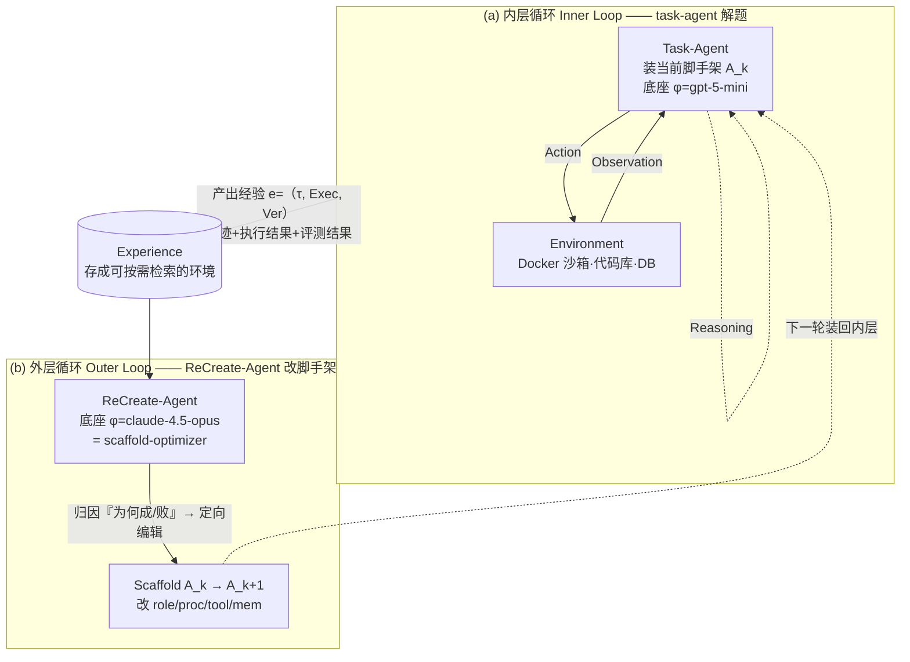

# ReCreate：由经验驱动、自动推理并创建领域 Agent 的脚手架框架

> **本篇定位**：在 agent-harness 库里，`Agent = Model + Harness`（本库写作 `φ + A`）是中心命题。
> Harness-Bench（2605.27922）证明了"**A 一换，分数大摆**"——但它把 A 当**被测的固定项**。
> ReCreate 把同一个 A 反过来当成**待优化、可自动生成**的对象：它问的是"**既然 A 这么重要，能不能让 agent 自己把 A 造出来、并越用越好？**"
> 这就是为什么本篇标在 A 组（框架/定义，偏自构 scaffold）——它对"让 agent 改进自己的 harness"这一条，给了最完整的一份蓝图。

---

## §1　TL;DR（一页讲清这篇在干嘛）

> 主讲提示：开场先把全库等式 `agent = φ + A` 写在黑板上，再说这篇是"反过来优化 A"的那一篇。

一句话：**ReCreate 是一个"造脚手架的脚手架"**。它把 LLM agent 形式化为 `φ + A`（底座模型 + 脚手架），然后引入一个 **`ReCreate-Agent`（外层优化器）**，去读另一个 **task-agent（内层执行器）** 留下的**交互经验** $e=(\tau,\text{Exec},\text{Ver})$——完整轨迹、执行结果、评测结果——从中**白盒地**推断"这个 agent 为什么成功 / 为什么失败"，再把这份证据翻译成对脚手架的**定向编辑**（加规则 / 造工具 / 改工作流），从而把一个**最小种子脚手架**逐步养成一个**强领域 agent**（§4，Figure 2）。

- **属于 harness 的哪一层（Θ1）**：本篇是**跨层框架**。它把脚手架 $\mathcal{A}$ 显式拆成四件可编辑的模块 $\mathcal{A}=(\mathcal{A}^{\text{role}},\mathcal{A}^{\text{proc}},\mathcal{A}^{\text{tool}},\mathcal{A}^{\text{mem}})$（§2.1），分别对应本库的 **C 层（Role&Object / Context、Memory&Retrieval）、L 层（Process&Strategy / 控制循环）、T 层（Action&Tool）**。它**不碰** E 层（环境）与底座参数（§7 局限明说）。
- **回扣全库论点（Θ2）**：这篇是 `agent = φ + A` 的**生成侧证据**。Harness-Bench 证"换 A 分数摆 23.8 分"；ReCreate 则证"**自动写 A** 也能把 4 个领域的平均分从最强基线 60.62 推到 **66.15**（Table 1），且即便从**最小种子**起跑、成本比同类自动生成法 ADAS **低 36%–82%**（Figure 8）"。换言之：A 不只重要，还**可被自动、廉价地造出来**。
- **够新够权威（Θ4）**：2026-04 预印本（v2），出自浙大 + 腾讯 + 上交，开源代码可得。它在 **automated agent generation** 这条线上，从主流的 **metric-driven 黑盒搜索**（ADAS / AgentSquare）转向 **experience-driven 白盒调试**，是该分支的一个明确"换挡"。

> **读出什么**：把这篇和 Harness-Bench 并读，就拼出一条完整逻辑链——**(度量) A 很重要 →（生成）A 可以自动造 →（启发）那我们自己的 harness 能不能也这样自我改进？** 最后一问正是 §★ 要回答的。

---

## §2　问题与动机：为什么"自动造领域 agent"值得做，且不能只看分数

> 主讲提示：这页用 Why 三连的"问题层"。核心矛盾是——scaffold 决定成败（全库共识），但手工写 scaffold 不可扩展，而现有的自动写法又是"瞎试"。

**Why（问题层）——不解决会卡住什么？**
LLM agent 正在重塑产业，但**绝大多数实战 agent 仍是人手设计的**，因为不同任务差异极大、手工搭建极其费力（§1 摘要原文："most practical agents remain human-designed because tasks differ widely, making them labor-intensive to build"）。于是中心问题被提出来（§1 原文加粗句）：

> **"can we automatically create specialized agents from scratch in real-world environments?"**（能否在真实环境里从零自动创建专用 agent？）作者称之为 **domain agent creation（领域 agent 创建）** 问题。

**Why（问题层续）——已有的自动生成法差在哪？**
已有一条 **automated agent generation** 线（ADAS、AgentSquare 等），用一个 meta-agent 去迭代"提议 → 评估 → 精炼"候选脚手架。但它们**只用最终性能指标**（pass rate 或 LLM 打分）来选优（§2 原文 "driven by performance metrics"），这带来两个硬伤（§2）：

1. **指标不解释"为什么"**：一个标量分数告诉你 agent 考了 60 分，**没告诉你它为什么错、该往哪改**。于是优化退化成**黑盒试错**，既不高效也不靠谱。
2. **拿到这个指标很贵**：每个候选脚手架都要大规模评测才能得到稳定分数。原文给了一个扎心的例子——**ADAS 在 ARC 数据集上、只用 20 个任务样本，生成一个 agent 就要花 \$500 以上**（§2，引 Hu et al., 2024 / Chollet, 2019）。

**Why（这篇的转向）**：作者据此从 **black-box optimization** 转向 **white-box optimization**——把 agent 的 **interaction experience（交互经验）**（执行轨迹、评测日志、环境状态）当作脚手架精炼的**主要证据**。理由一句话：经验里藏着 agent 成败的**语义与具体证据**（为什么成、为什么败），这是标量分数永远给不了的（§3 通篇在举例论证这点）。

> **读出什么**：动机不是"再造一个更强 agent"，而是给"自动造 agent"这件事**换一种信息源**——从"只看考分"换成"看完整的解题过程录像 + 批改记录"。这正对应本库 H 组（Observability）的精神：**没有可观测，就没有可优化**。

---

## §3　核心 intention：把"造脚手架"形式化成一句话

把问题压成一句话 + 一组符号（§2.2 / §4.1）：

**直觉**：很多真实领域**没有**现成的专家 agent，你手里只有三样东西——一个底座模型、一批"能自动判分的任务"、和一点点领域常识。目标是**从这点种子，长出一个能泛化到没见过的任务的领域 agent**。

记号（先定义，后用）：
- $\phi$：**base LLM（底座模型）**，固定不动、参数不更新；
- $\mathcal{D}$：**领域（domain）**，及其上的一个**可验证任务分布**（distribution of verifiable tasks）；
- $\mathcal{I}$：**最小领域信息（minimal domain info）**，如接口、约束（interfaces and constraints）；
- $\mathcal{A}$：**agent scaffold（脚手架）**，即把 $\phi$ 变成"能在环境里干活的 agent"的那层软件。

> **domain agent creation 问题（§2.2 原文）**：给定三元组 $(\phi, \mathcal{D}, \mathcal{I})$，构造一个脚手架 $\mathcal{A}$，使 $\phi$ 在领域 $\mathcal{D}$ 上变成一个**可靠**且**能泛化到未见任务**的 agent。

**读出什么 + 与 prompt tuning 的边界**：作者特意澄清（§2.2）——这**不是** prompt tuning，也**不是** tool learning（那些是"为特定 query 做适配"）；这里的目标是**造一个即插即用的 agent**，它捕获的是**领域级**知识、能泛化。这条边界很重要：它把 ReCreate 和"调一个 prompt 让某道题过"区分开了。

---

## §4　把 agent 拆成 `φ + A`：本篇最该讲透的形式化（§2.1）

> 主讲提示：这是全场地基。先讲"为什么这么拆"，再讲"拆成哪四块"。这一拆，决定了后面优化器到底在编辑什么。

### 4.1　为什么是 `agent = φ + A` 这个拆法

**直觉**：同一个底座模型 $\phi$，套上不同的"外壳"，行为可以天差地别（这正是 Harness-Bench 用 23.8 分极差实证的事）。所以"一个 agent"在数学上不应只等于"一个模型"，而应是**模型 × 外壳**的复合。

记号（先定义，后用）：
- $\phi$：**base model（底座 LLM）**——负责"会推理、会生成"的那部分能力；
- $\mathcal{A}$：**agent scaffold（脚手架）**——原文定义为"the surrounding software layer that makes the base LLM $\phi$ executable in an environment"（§2.1，引 Suzgun & Kalai 2024、Xi et al. 2025）：**让底座模型在某个环境里真正可执行的那层软件**。

形式化（一个 agent 就是这两者的复合 / composition）：

$$\text{LLM agent} \;=\; \phi \;\circ\; \mathcal{A}$$

> **Why（设计层）——为什么非要把这两者分开写？**
> 朴素做法：把 agent 当成一个不可分的整体（"GPT-5-mini agent"），分数贴在模型名上。→ 会**抹掉外壳的贡献**，无法回答"是模型不行还是外壳不行"，更无法**只优化外壳**。本文把 $\phi$ 与 $\mathcal{A}$ 显式拆开，换来一个关键能力：**冻住 $\phi$，只把 $\mathcal{A}$ 设成可学习/可编辑的对象**——这正是后文整套优化的前提。这与 Harness-Bench 的 `Agent = Model + Harness` 是**同一个等式的两面**：一个拿它做"控制变量"，一个拿它做"优化变量"。

### 4.2　脚手架 A 拆成哪四块（§2.1）

作者系统梳理了开源通用脚手架（OpenHands、OpenManus 等），按**功能**把 $\mathcal{A}$ 抽象成**四个互补、且各自可编辑**的模块：

$$\mathcal{A} \;=\; \big(\mathcal{A}^{\text{role}},\; \mathcal{A}^{\text{proc}},\; \mathcal{A}^{\text{tool}},\; \mathcal{A}^{\text{mem}}\big)$$

逐块定义（这就是"可被优化器编辑的四个旋钮"）：

| 模块 | 原文名 | 是什么 | 对应本库层 |
|---|---|---|---|
| $\mathcal{A}^{\text{role}}$ | **Role & Object** | 系统指令：定义 agent 身份、领域先验、高层目标 | C 层（Context/Role） |
| $\mathcal{A}^{\text{proc}}$ | **Process & Strategy** | 流程：指导逐步推理、中间检查、终止判据 | L 层（控制循环/策略） |
| $\mathcal{A}^{\text{tool}}$ | **Action & Tool** | 动作空间：可复用的脚本与工具（含记忆工具、搜索工具…） | T 层（工具/ACI） |
| $\mathcal{A}^{\text{mem}}$ | **Memory & Retrieval** | 机制：控制 agent 如何存/取记忆 | C 层（记忆/检索） |

> **读出什么**：(1) 这四块**几乎就是本库 C/L/T 三层的并集**——所以"编辑 $\mathcal{A}$"= "工程化地改我们 harness 的角色提示 / 控制流 / 工具集 / 记忆策略"。(2) 作者**显式排除**了 action–observation 格式、error 格式等（§2.1 原文："ignored as they are non-essential to practical performance"）——这是一个**可批判的简化**（见 §13）。(3) 注意 $\mathcal{A}$ 里**没有** Environment——环境 $E$ 是给定的、不被编辑（这正是 §7 局限"不做 infrastructure adaptation"的根）。

---

## §5　Motivation 实例：经验到底能"读出"什么脚手架改动（§3）

> 主讲提示：这页是全篇说服力的来源。别讲抽象，直接念这三个"经验 → 改动"的小案例，它们就是 white-box 的证据。

作者用三类**可迁移的模式**，论证"交互经验里确实藏着该怎么改脚手架的线索"（§3）：

- **经验提示『加规则』（Adding Rules）**：在 DA-Code 上，经验显示 agent 常**只用训练集精度评估模型、不做 train/val 划分**。底座模型其实**会**做交叉验证，但脚手架不强调它就**不可靠地**去做。→ 改动：加一条规则"任何模型评估都必须构造 train/val 划分、在验证集上报告"。
- **经验提示『造工具』（Creating Tools）**：重复或易错的步骤可以换成专用工具。经验显示 agent 常需检查"解是否非空、可执行、结构良好"。→ 改动：造一个**一键跑这些检查的工具**，既简化流程又**保证每次都校验**。
- **经验提示『改工作流』（Modifying Workflows）**：失败常源于**动作顺序错**而非能力不足。原文给了一个**量化**例子——在 **SWE-bench** 上，agent 常**在 commit 改动前就提交**，导致评测拿到**空 patch**；只需加一步"提交前先 `git diff --cached` 校验"的预提交检查，**仅此一改，pass-rate 提升超过 2%**（§3 原文："improve the pass-rate by over 2%"）。

> **读出什么（Θ2 呼应）**：这三例正是 `φ + A` 拆法的"用法演示"——**底座 $\phi$ 没变、能力没变，只动 $\mathcal{A}$（加规则/造工具/改流程）就能涨分**。SWE-bench 那个"+2% 仅靠一步预提交校验"的数字，和 Harness-Bench 里 Vercel"砍工具 80%→100%"是同一类铁证：**A 的微调撬动大结果**。它也直接启发了我们（见 §★ a）。

---

## §6　方法总览：内外双层 + agent-as-optimizer（§4.2–4.3）

> 主讲提示：一张图讲清"两个 agent、两个循环"。内层在解题，外层在改解题人的工具箱。

**直觉**：像人类工程师迭代打磨软件系统一样——**内层**让装着当前脚手架 $\mathcal{A}_k$ 的 task-agent 去做任务、留下经验；**外层**让 ReCreate-Agent**当优化器**，读经验、归因成败、把脚手架从 $\mathcal{A}_k$ 改成 $\mathcal{A}_{k+1}$。



**两个 agent、两套底座（§5.1 实现）**：
- **内层 task-agent**：底座 $\phi=$ **gpt-5-mini**（图便宜、推理快）；
- **外层 ReCreate-Agent**：底座 $\phi=$ **claude-4.5-opus**（图它强推理、写出高质量脚手架）。

> **核心哲学（§4.2 原文，值得一念）**："as models cross the critical threshold of reasoning and creativity, the labor-intensive process of agent creation can finally be automated by the agents themselves."（当模型越过推理与创造力的临界点，费力的 agent 创建终于能被 agent 自己自动完成。）这句话就是"用强模型当 ReCreate-Agent 去造脚手架"的信念基础。

---

## §7　方法形式化（一）：内层执行与双层优化目标（§4.1）

> 主讲提示：这页连给四个式子。务必每个先说直觉、再逐符号定义、最后读出结论。

### 7.1　任务与轨迹（Eq.1–Eq.2）

**直觉**：先把"一个任务"和"一次解题过程"写成数学对象。

记号：$t_i$=第 $i$ 个任务；$x_i$=问题上下文（problem context）；$\text{Env}_i$=该领域的可执行环境。

$$t_i \;\triangleq\; (x_i,\ \text{Env}_i) \tag{Eq.1}$$

记号续：$\tau_i$=一条**交互轨迹（interaction trajectory）**，是"推理步 + 工具调用 + 观察"的序列；$P_\phi(\cdot\mid\mathcal{A},t_i)$=底座 $\phi$ 在脚手架 $\mathcal{A}$ 与任务 $t_i$ 条件下产生轨迹的分布。

$$\tau_i \;\sim\; P_\phi(\cdot \mid \mathcal{A},\ t_i) \tag{Eq.2}$$

**读出什么**：轨迹**同时由 $\phi$ 和 $\mathcal{A}$ 决定**——同一个 $\phi$，换 $\mathcal{A}$ 就换一条轨迹分布。这就是"优化 $\mathcal{A}$ 能改变行为"的数学根。

### 7.2　验证与奖励（Eq.3）

**直觉**：轨迹跑完会产出一个 submission（如 patch / 生成代码），需要一个**任务专属验证器**判分。

记号：$\text{Exec}(\tau_i,t_i)$=执行轨迹得到的提交物；$\text{Ver}[\cdot]$=任务专属验证器（task-specific verifier）；$r_i\in\mathcal{R}$=性能指标。

$$r_i \;=\; \text{Ver}\big[\text{Exec}(\tau_i,\ t_i)\big] \;\in\; \mathcal{R} \tag{Eq.3}$$

**读出什么**：$r_i$ 可以是单测的**通过/失败二值**（SWE 等），也可以是评测脚本的**连续分数**（如 DA-Code 给 $[0,1]$ 分，§5.1）。它就是"批改记录"。

### 7.3　双层优化目标（本篇骨架公式）

**直觉**：造 agent = 一个**双层（bi-level）优化**——**外层**挑脚手架 $\mathcal{A}$ 让领域期望表现最大，**内层**在给定 $\mathcal{A}$ 下挑最优轨迹。

记号：$\mathcal{A}$=待优化脚手架（外层变量）；$\tau_i^*(\mathcal{A},t_i)$=在脚手架 $\mathcal{A}$ 下任务 $t_i$ 的最优轨迹（内层解）；$\mathbb{E}_{t_i\sim\mathcal{D}}$=对领域任务分布求期望。

$$\max_{\mathcal{A}}\ \ \mathbb{E}_{t_i\sim\mathcal{D}}\ \text{Ver}\big[\text{Exec}\big(\tau_i^*(\mathcal{A},t_i),\ t_i\big)\big]$$
$$\text{s.t.}\quad \tau_i^*(\mathcal{A},t_i)\ \in\ \arg\max_{\tau_i\sim P_\phi(\cdot\mid\mathcal{A},t_i)}\ \text{Ver}\big[\text{Exec}(\tau_i,t_i)\big] \tag{双层目标}$$

**读出什么**：外层是"**创建脚手架**"，内层是"**用脚手架解题**"。实践中外层用**迭代更新**近似：第 $k$ 轮跑 $\mathcal{A}_k$ → 拿反馈 → 更新到 $\mathcal{A}_{k+1}$，从最小种子 $\mathcal{A}_0$（由 $\mathcal{I}$ 给）起步。

### 7.4　两种更新对比：metric-based vs experience-based（Eq.4 ——本篇命门）

**直觉**：同样是"更新脚手架"，旧法只喂一个标量分数，本文要喂**整段经验**。

旧范式（已有自动生成法，§4.1）——把整个执行过程**压成一个标量** $r$：

$$\mathcal{A}_{k+1} \;=\; \text{Meta-Agent}(\mathcal{A}_k,\ r) \tag{旧·metric-based}$$

本文范式（§4.1 原文 Eq.4）——喂**完整经验** $e$：

记号：$e \triangleq (\tau,\ \text{Exec},\ \text{Ver})$，即"完整轨迹 + 执行结果 + 评测结果"三元组。

$$\boxed{\ \mathcal{A}_{k+1} \;=\; \text{ReCreate-Agent}(\mathcal{A}_k,\ e),\qquad e \triangleq (\tau,\ \text{Exec},\ \text{Ver})\ } \tag{Eq.4}$$

> **Why（设计层）——为什么把 $r$ 换成 $e$ 是关键一步？**
> 朴素做法：`Meta-Agent(A_k, r)`，只看分数。→ 分数**丢掉了过程信息**，optimizer 不知道"错在哪一步、为什么错"，只能盲搜，且每个分数都贵（§2 的 \$500 例）。本文改喂 $e$：optimizer 能看到**完整轨迹 + 哪条单测挂了 + 报错栈**，于是更新从"黑盒试错"变成"**白盒调试**"——像工程师看 stack trace 改 bug，而非随机改代码再跑 CI。代价：$e$ 很大很噪，LLM 直接吞不下（这正是 §8 三大组件要解决的）。

> **读出什么（Θ2）**：Eq.4 就是本篇对全库等式的贡献——它把"优化 $\mathcal{A}$"的**信息源**从标量 $r$ 升级为经验 $e$。一句话记牢：**别给优化器看考分，给它看错题本。**

---

## §8　方法形式化（二）：agent-as-optimizer 的三大组件（§4.3）

> 主讲提示：上页留了三个难题，这页就是三把钥匙，一一对应。每个组件都回答"经验那么大那么噪、怎么用得动"。

把 $e$ 喂给 LLM 有三个非平凡挑战（§4.3 原文）：**(1)** 经验**太大**，LLM 吞不下；**(2)** 把经验**归因成可执行的脚手架改动**很复杂；**(3)** 实例级修复**易过拟合、难泛化**。三大组件正面对应：

### 8.1　组件①：经验存储与检索（Experience Storage & Retrieval）→ 治"太大"

**Why（设计层）**：朴素做法是把整段经验塞进 prompt → 又长又噪、还烧 token。本文把**每个 task-agent episode 存成一个"环境"**（称 **ReCreate-Environment**），里面装着：当前脚手架、完整轨迹、执行/评测结果、环境上下文（代码库、数据库、沙箱状态）。配一个 **evidence retriever（证据检索器）**，给关键事件（报错、失败的测试、文件操作）**建索引并链回其上下文**。于是 ReCreate-Agent 可以**按需检索**（on-demand inspection）——从"最终评测信息"**跳转**到"相关上下文"，像人 debug 时从报错跳到出错代码行，而不是通读全程。

> **读出什么**：这本质是把"经验"做成一个**可交互、可检索的数据库**，而非一坨喂进去的文本。这条对我们极有启发（§★ b）——**trace 必须先结构化、可检索，才能被优化器消费**。

### 8.2　组件②：推理-创建协同（Synergizing Reasoning & Creating）→ 治"难归因"

**Why（设计层）**：朴素做法是让 LLM 看完经验直接"写个新脚手架"→ 容易凭空乱改、不落地。本文把外层拆成**两步耦合**（Figure 3）：
- **左半"Reasoning / Inspection"**：ReCreate-Agent **迭代地推理 + 检索**，定位"agent 为何成 / 为何败"的**关键证据**；
- **右半"Creating"**：引入一个 **creation router（创建路由器）**——一个**路由提示 + 脚手架编辑接口**，它指导 ReCreate-Agent 决定"**该编辑哪个脚手架模块（role/proc/tool/mem）、怎么改**"，且每次改动都**绑定到检索出的具体证据**。

> **读出什么**：creation router 的作用是**把"自由发挥的写 prompt"约束成"基于证据的定向编辑四选一"**——保证"every scaffold update is grounded in specific evidence, rather than blind trial-and-error"（§4.3 原文）。这是 white-box 优化能落地的关键齿轮。

### 8.3　组件③：层级化"局部→领域"更新（Hierarchical Local-to-Domain Updates）→ 治"过拟合"

**Why（设计层）——这是泛化的保险丝**：朴素做法是每看一个任务就立刻改全局脚手架 → 会**过拟合到单个任务**（instance overfitting）、伤害领域泛化（§4.3 挑战 3）。本文用**两级更新**：

- **实例级 $\textsc{Upd}$**：对单条经验，生成一个**候选更新** $\Delta\mathcal{A}$ + 其**理由** $\kappa$（justification），但**先缓存进 buffer $\mathbb{H}$、不立即应用**；
- **领域级 $\textsc{DomUpd}$**：把 buffer 里一批实例级提案**汇总、抽取出领域级模式（domain patterns）**，**过滤掉任务专属噪声**，只把"能泛化的更新"整合进最终脚手架。

> **读出什么**：这就是"**别看一道题就改全局规则；攒一批，提炼出共性再改**"。$\textsc{Upd}$ 管"局部敏锐"，$\textsc{DomUpd}$ 管"全局泛化"——Table 2 的消融证明二者**互补**（见 §11）。

### 8.4　算法骨架（Algorithm 1）

```
Algorithm 1  ReCreate for Domain Agent Creation
Require: 底座 LLM φ, 数据集 D, 领域初始信息 I
Ensure : 最终领域脚手架 A_final
 1: (D_dev, D_test) ← Split(D)                  # 划开发集/测试集
 2: A ← Init(I)                                  # 用最小信息 I 造种子脚手架
 3: for n = 1 to N_max do                        # 外层迭代（论文设 N_max=2）
 4:     H ← ∅;  B ← Sample(D_dev)               # 采一个 batch（论文设 |B|=4）
 5:     for each task t ∈ B do
 6:         (τ, r) ← AgentRun(A, φ, t)          # 内层：当前脚手架跑任务，得轨迹+分数
 7:         (ΔA, κ) ← Upd(τ, σ, ρ, r)           # 实例级候选更新+理由（σ=执行结果, ρ=评测结果）
 8:         H ← H ∪ {(t, ΔA, κ)}                 # 缓存进 buffer，不立即应用
 9:     end for
10:     A ← DomUpd(H, A, I)                       # 领域级聚合：抽共性、过滤噪声、整合
11: end for
12: return A                                      # 在 D_test 上报最终指标
```

> **读出什么**：Line 6–8 是组件①②（跑 + 检索归因 + 路由编辑），Line 9→10 是组件③（buffer → 领域聚合）。整个外层只跑了 **$N_{\max}=2$ 轮、batch=4**（§5.1）——**极少的迭代**就够，因为每轮信息量（整段经验）远大于一个标量分。这也是它便宜的根。

---

## §9　实验设置：13 个 benchmark、四大领域、三类基线（§5.1）

> 主讲提示：先把"在哪测、和谁比、怎么判分"说清，再上结果。

**领域与数据集（4 领域、13 个子基准）**：
| 领域 | 数据集（子集） | 判分信号 |
|---|---|---|
| **SWE 软件工程** | SWE-bench-Verified 的 **Django、SymPy**（两个最大仓） | 二值 0/1（单测） |
| **DS 数据科学** | DA-Code 的 **DW、ML、SA** + DS-1000 的 **NumPy、Pandas、Matplotlib** | DA-Code 为**连续分** $[0,1]$（转百分比）；其余二值 |
| **Math 数学** | MATH 的 **Algebra、NT(数论)、C&P(计数与概率)** | 二值 0/1 |
| **Digital 数字助理** | AppWorld 的 **Normal、Challenge** | 二值 0/1 |

**实现关键超参（§5.1）**：
- 底座：task-agent = **gpt-5-mini**（温度由 API 固定 1.0）；ReCreate-Agent = **claude-4.5-opus**（温度设 **0**）；
- 外层循环：**$N_{\max}=2$**，**batch size = 4**；
- 数据划分：每个领域随机采**约 20 个实例**作 $\mathcal{D}_{\text{dev}}$，其余（**38–417 个**）全留作测试；
- 执行环境：所有任务在 **Docker 沙箱**里跑。

**基线（三类，§5.1）**：
- **Human-designed（人手脚手架 + test-time scaling）**：CoT、SBA（Step-Back Abstraction）、Refine（Self-Refine）；
- **Self-Evolve（自进化，精炼已有 agent）**：LIVE（工具进化）、OPRO（提示优化）、ExpEL（经验积累）；
- **Agent Generation（自动生成，黑盒搜索）**：ADAS、AgentSquare（Square）。

> **读出什么**：三类基线正好卡住 ReCreate 的三个差异点——比 human-designed 多了"自动"，比 self-evolve 多了"从零造（而非只精炼已有）"，比 agent-generation 多了"白盒经验（而非黑盒分数）"。§5 的"Comparing with Existing Methods"明确这三点差异（Scope / Objective / Strategy）。

---

## §10　主结果：从最小种子，平均超最强基线 +5%（Table 1）

> 主讲提示：先报总平均，再点四个领域的领先幅度，最后强调"起点是最小种子"。

**Table 1（pass rate / 测试分，节选 + 平均）**：

| 领域·数据集 | 最优人手 | 最优 Self-Evolve | 最优 Agent-Gen | **ReCreate(Ours)** |
|---|---:|---:|---:|---:|
| SWE·Django | 58.77 | 59.24 | 57.82 | **60.19** |
| SWE·SymPy | 61.82 | 56.36 | 58.18 | **63.64** |
| DS·DW | 42.43 | 47.50 | 45.98 | **51.94** |
| DS·SA | 20.39 | 22.44 | 15.66 | **24.50** |
| DS·Numpy | 64.50 | 71.00 | 67.00 | **77.00** |
| DS·Matplotlib | 81.48 | 82.96 | 82.96 | **85.19** |
| Math·Algebra | 85.48 | 87.10 | 83.87 | **92.74** |
| Math·NT | 90.32 | **100.00**(OPRO) | 93.55 | **100.00** |
| Digital·Normal | 48.81 | 51.79 | 50.00 | **52.98** |
| Digital·Challenge | 36.21 | 34.53 | 36.93 | **40.29** |
| **总平均（13 基准）** | **60.05** | **60.62**(ExpEL) | **58.62** | **66.15** |

**领域级领先幅度（Figure 1，对各域 runner-up 的提升）**：Math **+6.55**、DS **+6.60**、Digital **+4.01**、SWE **+2.63**。

**Why（结果层）——为什么 ReCreate 能赢，且赢得不均匀？**
- **vs human-designed**：人手脚手架依赖"编码进去的先验知识"，**领域知识稀缺时拿不到、也难泛化**（§5.2 原文）。ReCreate 从**交互经验**里**现学**领域知识，故在 DS / Math / Digital 这些"先验稀缺、要靠摸索"的域领先明显。
- **vs agent-generation（ADAS/Square）**：领先 **>7%**（§5.2 原文 "by more than 7%"）。机制：黑盒法只能**从预置组件池里搜/拼** agent；ReCreate **直接从执行经验改脚手架、不需要任何预定义模块**（§5.2）。
- **SWE 领先最小（+2.63）**：SWE 本身有大量成熟人手脚手架先验（先验**不稀缺**），ReCreate 的"现学"边际收益就小——这与 Harness-Bench"任务越偏成熟/语言，harness 增益越小"的 regime 结论**互洽**（见 §13）。

> **读出什么（Θ2）**：60.62 → 66.15 这 5.5 分，是"**自动写 A**"撬出来的，且 A 从**最小种子**起跑（§5.2 原文 "even initialized with a minimal scaffold outperforms..."）。这是 `agent = φ + A` 在**生成侧**的实证：A 不只可换（Harness-Bench），还可**从零自动养成且养得更好**。

---

## §11　消融与分析：哪块经验/哪个组件最关键（§5.3–5.5）

> 主讲提示：这页回答"白盒优化里，到底是哪一味药在起效"。三个层面各一张图/表。

### 11.1　行为画像：检索远多于创建（Figure 4，Statistical Study）

统计 ReCreate-Agent 的动作分布（Django / ML / AppWorld 三个子域）：**inspection（检索/核查）占 ~65%–76%，creation（创建/编辑）只占 ~24%–35%**（§5.3 原文）。且行为**高度依赖上下文**：Django 上大量"Inspect Docker"（查代码库），创建主要是**造记忆**（把 debug 发现固化成规则）；AppWorld 上"Read Traj"（读轨迹）突出，创建则更多"prompt + memory 更新"。

> **读出什么**：这张图**实证了 agent-as-optimizer 的本性**——它把绝大多数算力花在"**先定位证据、再动手改**"，而非瞎改。这与 §8.2 creation router 的设计目标（grounded edits）完全对齐。

### 11.2　Observation-level 消融：哪类经验最关键（Figure 5）

去掉不同经验成分，看 5 个域的测试精度掉多少（全成分 = 最好）：
- **去掉 full trajectory（完整轨迹）→ 掉得最多、最一致**：逐步轨迹是"诊断失败、指导创建"的**关键上下文**；
- **去掉 exec & eval feedback（执行+评测反馈）→ 也明显掉**：结果信号（生成文件、测试结果、验证器反馈）是**锚定更新**所必需；
- **去掉 environment（可运行环境）→ 掉得较小但一致**：可运行执行对"忠实检查与 debug"有价值。

> **读出什么**：经验三件套（轨迹 / 结果反馈 / 环境）**互补**，而**轨迹 > 结果反馈 > 环境**。这把 §7.4 "喂 $e$ 而非 $r$"做成了**可证伪的实验**——正是 $r$ 丢掉的那部分轨迹信息贡献最大。

### 11.3　Action-level 消融：两个创建组件互补（Table 2）

| Method | SWE | DA-Code | DS |
|---|---:|---:|---:|
| **ReCreate（全）** | **60.19** | **39.77** | **77.74** |
| w/o creation router | 58.00 | 37.13 | 75.39 |
| w/o DomUpd | 57.09 | 37.83 | 75.96 |

**读出什么**：去掉 **creation router** → ReCreate-Agent 倾向**只盯 instance prompt**（执行可靠性下降）；去掉 **DomUpd** → 更新**偏向实例细节**（跨任务泛化下降）。二者**互补**：router 管"执行可靠"，DomUpd 管"跨任务泛化"（§5.4 原文）。

### 11.4　Reasoning-level 消融：ReCreate-Agent 必须是强模型（Figure 6）

固定 task-agent = gpt-5-mini，换 ReCreate-Agent 的底座（值按"ReCreate w/ Claude-opus"归一化）。两条结论（§5.4）：
1. **只给初始领域信息（不给经验）→ 多数域表现很差**（Math 除外）：说明**光有初始领域信息远不够**，强脚手架需要来自经验/专家的更丰富领域知识；
2. **ReCreate w/ Claude-opus 持续超过 human-designed**，而 **w/ gpt-5-mini 在多数域反而打不过 human-designed**：说明**ReCreate-Agent 的推理能力越强，越能把经验翻译成有效脚手架更新**。

> **读出什么（Θ5 伏笔）**：组件③再好，也**吃 ReCreate-Agent 的底座强度**——这是一个诚实的 regime 边界：**白盒优化的天花板由"造脚手架那个 agent 有多强"决定**。作者据此乐观推断"frontier LLM 正逼近甚至替代专家设计脚手架的临界点"（§5.4 原文）——这点既是卖点也可批判（§13）。

### 11.5　更新动态与成本（§5.5, §5.7）

- **后更新增益（Figure 7，SWE 单实例设定，$N_{\max}=4$）**：从初始脚手架起，**逐轮迭代**，task-level resolved rate 与 test-case pass rate **稳步上升** → ReCreate 能**修好一部分初始失败的任务**。
- **成本（Figure 8）**：与 ADAS 比，ReCreate 在五域上**成本降低约 36%–82%**（如 SWE：ReCreate \$27.31 vs ADAS \$42.40；Math：\$7.41 vs \$42.17）。机制：经验信号丰富 → **小开发集 + 少迭代就收敛**；ADAS 则要**反复评估每个候选**，故贵。

> **读出什么**：ReCreate **又好又便宜**的根，全在 §7.4 那一步——**用 $e$ 不用 $r$**，单位迭代信息量大，于是迭代次数（$N_{\max}=2$）和评测开销都被压下来了。

---

## §12　相关工作定位：在自动造 agent 谱系里站哪（§5 "Comparing"）

| 维度 | Human-designed (CoT/SBA/Refine) | Self-Evolve (LIVE/OPRO/ExpEL) | Agent-Gen (ADAS/Square) | **ReCreate** |
|---|---|---|---|---|
| **是否自动** | 否（人手 + test-time scaling） | 是 | 是 | **是** |
| **Scope 范围** | 固定脚手架 | **精炼已有** agent | 从组件池**搜/拼** | **从零造**（无需预置模块） |
| **Objective 目标** | — | 多偏**实例级**成功 | 实例/任务级 | **领域级泛化**（层级更新） |
| **Strategy 信息源** | — | 经验（但偏粗） | **标量指标**（黑盒） | **细粒度经验白盒调试** |

> **读出什么**：ReCreate 的三句话差异（§5）——**Scope**：从零造而非只精炼；**Objective**：求领域泛化而非单实例；**Strategy**：白盒查 trace 而非黑盒看分。三者合起来，就是它相对 ADAS/AgentSquare 那一支的"换挡"。

---

## §13　局限与批判（§7 原文 + 我的补充，Θ5 诚实）

**论文自陈的局限（§7，两条）**：
1. **只优化"文本/代码层"的脚手架**（prompt、推理策略、工具实现），**不碰 infrastructure**——即 **harness 与 environment 本身不动**（原文："does not extend to infrastructure adaptations, such as harness and environments"）。这是一个**关键的自我设限**（见下方批判）。
2. **不更新底座参数** $\phi$；把"发现的脚手架模式 + 模型微调"结合是**未来方向**，但算力昂贵。

**我的补充批判（独立于原文）**：

- **"不碰 harness/environment"的措辞要小心解读（与本库术语的张力）**：原文把 $\mathcal{A}$（role/proc/tool/mem）叫 scaffold，把 environment + 底层 runtime 叫 "harness/infrastructure" 并划出优化范围之外。**但在本库术语里，$\mathcal{A}$ 这四块恰恰就是 harness 的核心层（C/L/T）**。所以诚实的表述是：**ReCreate 优化的是 harness 的"软件可编辑层"，不优化 harness 的"基础设施层"（沙箱/工具运行时/环境)**。它**没有**自我改进"控制循环的底层实现"或"环境接口"——这正是 §★ c 里我们的机会。
- **$\mathcal{A}$ 拆四块时排除了 action–observation / error 格式**（§2.1），理由是"non-essential"。但 Harness-Bench 的失败画像里"**契约/格式**"占 36.4%——**格式恰恰常常致命**。这个简化在 SWE 这类"交付格式严苛"的域可能漏掉重要旋钮。
- **ReCreate-Agent 自己也是一个"未被验证的 agent"**：它对"为何成败"的归因是 **claude-4.5-opus 的自由推理**，**没有独立验证器**核查"这个归因对不对、这个脚手架编辑真的由证据支撑吗"。**"谁来验证优化器的归因"原文未给出**——这与本库 G 组（独立验证收口）、auto-research 的红队收口是同一隐忧。
- **强模型依赖 = regime 边界（Θ5）**：Figure 6 显示**换成 gpt-5-mini 当 ReCreate-Agent 就打不过 human-designed**。所以"自动造 A 更优"是**分 regime 的**——**只在 ReCreate-Agent 足够强时成立**。把它和 METR/Scale 一侧并读：当底座/优化器还不够强、或任务先验已很成熟（如 SWE，本文增益最小 +2.63）时，自动白盒优化的边际价值会收窄。
- **外层只跑 $N_{\max}=2$、dev 仅 ~20 例**：极省，但也意味着**领域模式是从很小的样本里抽的**，$\textsc{DomUpd}$ 抽到的"领域共性"有多稳、换一批 dev 任务会不会抖，原文未做敏感性分析（**原文未给出**）。
- **附录证据不在本 PDF**：Appendix C/E/F/K/M（设计讨论、scaffold 难搭的论证、数据细节、案例）在主文中被引用但**本 12 页 PDF 未包含**，故其细节本报告标注 **原文未给出**，不臆测。

---

## ★ 对我们的启发（Inspires Us）

> 组会高潮。本库独门优势再强调一遍（Θ3）：**我们（Claude Code / 本课 m9.* 的 agent）本身就是一个 harness**——
> 有真实的 ReAct 循环、工具预算、上下文压缩、子代理编排。而 ReCreate 的整篇论文，本质就是
> **"让一个 agent 去自动改进另一个 agent 的脚手架"**——这正是"**让我们的 harness 自我改进**"的可运行蓝图。下面每条都打到我们自己身上。

➤ **a. 可直接借用的招（method we can reuse）**：把 ReCreate 的 **"经验 → 脚手架四选一定向编辑"** 这套 creation-router 机制，拆下来做成我们 harness 的**"复盘-改进"小循环**。具体：每跑完一个任务，喂"完整轨迹 + 工具调用 + 报错"给一个 ReCreate-Agent 式的 reviewer，让它**只在四类里选一类**改动——改**角色提示** / 改**控制流策略**（如加一步"提交前校验"）/ **造一个工具** / 改**记忆策略**。§5 那个"SWE 加一步 `git diff --cached` 预提交校验、pass-rate +2%"就是现成模板——**先在我们的 SWE 类任务上复刻这一条**，看能不能复现 +2%。

➤ **b. 可迁移到我们的模块（transfer）**：ReCreate 的 **组件①（把每次 episode 存成可检索的 ReCreate-Environment + evidence retriever）** 直接映射到 auto-research 的 **`m9.6`（评测沙箱）** 和我们的 **可观测层**。迁移前提：**我们的 trace 必须先结构化录制**（model 调用 / 工具调用 / 工作区 diff / 用量 / 报错→上下文 的索引）——这与 Harness-Bench 报告里"补 instrumentation"是同一件待办。**没有可检索的 trace，optimizer 就只能吞一坨文本、退回黑盒。** 这条是我们要先补的地基。

➤ **c. 它暴露的开放问题 = 我们的机会（open problem → opportunity）**：ReCreate **自我设限"不碰 harness/environment/控制循环底层"（§7）**——而**这恰恰是我们最有能力动的地方**。机会有二：(i) 把 ReCreate 的"经验→定向编辑"**从"改 prompt/工具"扩展到"改控制循环本身"**——比如让 reviewer 提议"在 ReAct 循环里插一个 execution-alignment 探针"或"调整 compaction 触发阈值"；(ii) ReCreate 的归因**没有独立验证器**（"谁验证优化器"未解）——我们可以给这个"复盘-改进"循环**配一个只认外部可验证证据的 critic**，要求每条脚手架编辑必须附"它由哪条 trace 证据支撑 + 改完在 hold-out 上是否真涨"，把 §11.3 的 DomUpd 从"LLM 抽共性"升级为"**带 hold-out 验证的抽共性**"。

➤ **d. 与本库其它论文/模块的连接（connect the dots）**：与 **Harness-Bench（2605.27922）正反互补**——后者把 $\mathcal{A}$ 当**固定的被测项**（度量"换 A 摆多少分"），本篇把同一个 $\mathcal{A}$ 当**可优化的变量**（"自动把 A 造出来"）；两篇合起来就是 `agent=φ+A` 的"**度量 + 生成**"闭环。与 **F 组（上下文/记忆，AgentFold 等）** 呼应——ReCreate 的 $\mathcal{A}^{\text{mem}}$ 编辑正是在工程化地改记忆策略。与 auto-research 的 **`m9.8`（独立验证收口）** 共享"谁来验证验证者/优化器"的隐忧（见 c-ii）。

➤ **e. 如果我来做下一步（my next move，第一人称）**：我会先在我们的 harness 上搭一个**最小版 ReCreate 外层**——选 10 个 SWE/DS 任务，跑完后把结构化 trace 喂给一个"reviewer agent"，**限定它只输出四类脚手架编辑之一 + 必附证据**，缓存进 buffer；攒满 10 条后做一次 `DomUpd`（抽共性），把"涨分且在 hold-out 上不掉"的编辑合并进我们的**系统提示 + 工具层**。**首个要验的假设**：复刻"提交前校验"类工作流改动，能否像论文那样把我们的 contract/格式类失败压下去（呼应 Harness-Bench 的 contract 36.4%）。若成立，再把编辑范围从 prompt/工具**扩到控制循环**——这是 ReCreate 没敢动、而我们能动的增量。

---

## §14　版图定位（canon/前沿坐标 + 在本库的位置）

- **时间坐标（Θ4）**：**2026 前沿**，属 **automated agent generation** 谱系的 **white-box / experience-driven** 分支。相对基石它推进了哪一步——ADAS/AgentSquare（2024）把"造 agent"做成**黑盒指标搜索**；ReCreate 把它**换挡为白盒经验调试**（Eq.4：喂 $e$ 不喂 $r$），并补上**层级更新治过拟合 + 成本降 36–82%**。它**站在** Suzgun&Kalai 2024、Xi et al. 2025 的 `agent = φ + scaffold` 形式化肩上，把这个等式从"描述性定义"推进到"**可优化目标**"。
- **E/T/C/L/O/V 归属（Θ1）**：**跨层框架**，可编辑面 = **C（role/mem）+ L（proc/strategy）+ T（tool）**；显式**不碰 E（环境）** 与底座参数（§7）；其方法论引擎落在 **O（可观测：把经验做成可检索环境）** 之上——**没有 O，就喂不出 white-box 的 $e$**。
- **在本库的位置**：**A 组（综述/框架与定义）的"自构 scaffold"代表作**。它是 Harness-Bench 的**对偶**——一个度量 $\mathcal{A}$、一个生成 $\mathcal{A}$。读完它，再回看 C 组（工具/ACI）、D 组（上下文/记忆）的任何一篇，都能多问一句："ReCreate 的 ReCreate-Agent，会不会**自动**把这篇提出的那个组件，作为一次脚手架编辑**加进**某个领域 agent？"——这正是"让 agent 改进自己 harness"这条线的落点。

---

## §15　组会讨论问题（留给大家吵）

1. **术语之辩**：ReCreate 说自己"不碰 harness"，但它编辑的 role/proc/tool/mem 在**本库定义里就是 harness 的 C/L/T 层**。到底什么算"scaffold"、什么算"harness/infrastructure"？这条边界划在哪才合理？
2. Eq.4 把 $r$ 换成 $e$ 是全篇命门。但 $e$ 很大很噪——**如果只喂"失败步附近的局部 trace"而非完整轨迹**，§11.2 里"去掉 full trajectory 掉最多"会不会被部分挽回？怎么设计这个消融？
3. ReCreate-Agent 的"为何成败"归因**没有独立验证**（§13）。给它配一个"只认外部可验证证据"的 critic，要求每条脚手架编辑都过 hold-out 验证——会更稳，还是会因为 dev 仅 ~20 例而**过度保守、改不动**？
4. Figure 6 显示"换弱模型当 ReCreate-Agent 就打不过 human-designed"。那么随着底座普涨，这套"白盒自动造 A"的**边际价值会扩大还是收窄**？在 SWE（先验成熟、本文增益仅 +2.63）这类域，它会不会最先失去意义？
5. §2.1 把 action–observation / error 格式当"non-essential"排除，但 Harness-Bench 说"契约/格式"是头号失败类（36.4%）。这个简化在哪些域会反噬？该不该把"格式"也设成第五个可编辑模块？
6. 把 ReCreate 搬到**我们自己的 harness**上（§★ e），最小可行版要先补什么 instrumentation？"让 agent 改自己的控制循环"——风险（自改崩坏）该怎么兜底？

---

## §16　一页速记

- **命题**：`agent = φ + A`（底座 + 脚手架）；本篇把 Harness-Bench 钉死的那个 **A 反过来当成可自动生成、可优化的变量**。
- **拆法（讲透）**：$\mathcal{A}=(\mathcal{A}^{\text{role}},\mathcal{A}^{\text{proc}},\mathcal{A}^{\text{tool}},\mathcal{A}^{\text{mem}})$ = 角色/流程/工具/记忆，**四个可编辑旋钮**≈本库 C+L+T 层；环境 $E$ 与参数 $\phi$ 不动。
- **命门公式（Eq.4）**：$\mathcal{A}_{k+1}=\text{ReCreate-Agent}(\mathcal{A}_k, e)$，$e=(\tau,\text{Exec},\text{Ver})$——**喂整段经验（错题本），不喂标量分（考分）**。把黑盒搜索换成白盒调试。
- **三组件**：①经验存成可检索环境（治"太大"）｜②creation router 把归因变成"四选一定向编辑"（治"难归因"）｜③Upd→DomUpd 层级更新（治"过拟合"）。
- **结果**：4 领域 13 基准平均 **66.15** > 最强基线 60.62（+5%），比 Agent-Gen **>7%**；从**最小种子**起跑；成本比 ADAS **降 36%–82%**。
- **关键消融**：经验三件套里**轨迹贡献最大**（去掉掉最多）；router 与 DomUpd 互补；**ReCreate-Agent 必须强**（换 gpt-5-mini 就打不过人手）。
- **诚实（Θ5）**：自动造 A 更优**分 regime**——只在优化器够强时成立；SWE（先验成熟）增益最小（+2.63）。归因**无独立验证**、dev 仅 ~20 例、排除格式模块——都是边界。
- **对我们（Θ3）**：这就是"**让 harness 自我改进**"的蓝图。先补**结构化可检索 trace**，再搭一个"复盘 reviewer"做"经验→四类脚手架编辑（必附证据 + hold-out 验证）"；首验"提交前校验"类改动能否压 contract/格式类失败；最后把编辑范围**从 prompt/工具扩到控制循环**——这是 ReCreate 没敢动、我们能动的增量。
