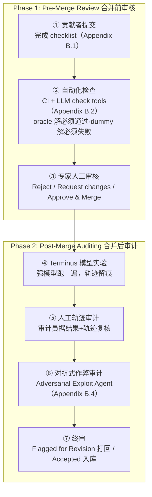

# Terminal-Bench：在命令行接口里对 Agent 做高难度、真实任务的基准测试

> 组会汇报文档 · ~20 页 · 50 分钟组会级 · PPT 风格。忠于 arXiv 2601.11868v1 原文，全篇数字均标注
> §/Table/Figure/Appendix 出处；原文未给出的一律写明"原文未给出"，不编造。PDF 共 84 页，正文 1–10 页
> （§1–§7，含 Limitations/Related Work/Conclusion），参考文献 11–18 页，Appendix A–I 共 20–84 页。提取方式：
> Read 工具对该 PDF 报 `pdftoppm` 缺失，改用 Bash 调用 `pdftotext -f <start> -l <end> -layout` 分段提取；
> 凡遇多列/多环形图表（Table 2 完整数据、Figure 4/8/9 的类别与百分比标签）在 `-layout` 模式下发生数字错位或
> 图表标签相互覆盖，一律改用 `pdftotext ... -raw` 交叉核对，直至数字自洽（如 Figure 4 的 16 个类别计数
> 精确求和 = 89，Table 2 的 95% 置信区间格式统一）为止。**特别说明**：Appendix D 的 Table 5（26 个适配基准
> 列表）在 `-raw` 提取时，因原表跨行排版，基准名称与描述发生错位（描述整体比名称"晚一行"出现）；本文档
> 只对能通过引用主题交叉核对、高置信度复原对齐的条目给出描述，其余仅列名称，不做无根据的名称-描述配对，
> 详见 §15。本文档还发现并如实记录了原文内部若干处未自陈的数字/名单小出入（Table 1 与 Table 2 表注的任务
> 分母 74 vs 正文/Figure 4 的 89；§3.3 模型名单遗漏"GPT-5"却包含未出现在结果表中的"Llama 4 Maverick"；
> 正文"top 13 positions"与 Table 2 精确排序后的"top 14"之间相差 1 位），均不代表方法论错误，仅为如实记录。

---

## §1　TL;DR（一页讲清这篇在干嘛）

> 主讲提示：开场先立住"这是一篇 benchmark/评测协议论文"，然后立刻抛出这篇论文最反直觉的两个数字——
> 62.9% 的天花板、16.9 个百分点的 scaffold 摆动——把听众的注意力从"哪个模型最强"扳到"怎么测都测不准"。

一句话：Terminal-Bench 2.0 是一个**面向命令行 / 终端环境**的 agent 评测框架——每道题给一个**容器化环境**
（Docker image，预装相关软件包与文件）+ 一段**自然语言指令** + 一组**验证测试**（只检查容器最终状态，不检查
过程）+ 一份**人工撰写的参考解**（oracle solution）+ 一个**时间限制**（§2.1）。作者众包了 **93** 位贡献者、
提交 **229** 道候选题，经过一条包含自动检查、人工复核、LLM 辅助复核、对抗式"作弊"红队、二次人工终审在内的
**七步审核流水线**（Figure 3），最终精选出 **89** 道任务构成 Terminal-Bench 2.0（§2.2/§2.3）。这些任务横跨
**16** 个类别（Figure 4），从"把一段 COBOL 银行业务代码原样重写成 Python"到"对 FEAL 密码做差分密码分析
破解密钥"到"从零源码编译 CompCert 验证编译器"，共同特征是**需要真实的专业技能、长链条的相互依赖动作、
自主问题求解**（§2.2）。核心发现：在 **21** 个前沿/开源模型 × **6** 种 agent scaffold 上共做 **32,155** 次
试跑（每个"模型+可兼容 scaffold"组合至少重复 5 次，§3），**最高分组合（GPT-5.2 + Codex CLI）也只解出
62.9% ± 3.0%**（Table 2），小模型普遍只有 ~15% 左右（摘要）；而且——这是本文对本库中心命题 `Agent = Model
+ Harness` 最直接的贡献——**同一个模型，只换 agent scaffold，解决率最大能摆动 16.9 个百分点**（Gemini 2.5
Pro：Terminus 2 32.6% vs OpenHands 15.7%，Table 2，详见 §10）。

- **属于 harness 的哪一层（Θ1）**：本篇主战场是 **V（Validation/评测）层**——它定义了"什么算一道终端任务、
  怎么算通过"（任务 formulation §2.1 + 四条验证准则 §2.3）。同时它在 **O（Observability/可观测）层**投入
  了几乎和 V 层一样重的篇幅——用改造自 MAST（Multi-Agent System Taxonomy, Pan et al. 2025）的**轨迹级失败
  分类法**（§4.4/Appendix C）和自建的**命令级失败分类法**（§4.5/Appendix E）系统化地"看见"agent 在哪一步、
  以什么方式失败。它**不**定义 E（沿用 Docker 容器这一现成抽象，不提出新的环境模型）、**不**定义 T（每个
  agent scaffold 自带工具集，Terminus 2 甚至只给一个"headless 终端"当唯一工具）、**不**定义 L（控制循环
  完全由被测 agent 自己决定）——这三层的差异恰恰是它想测量的**因变量**，而不是它要规定的**自变量**。
- **权威性来源**：作者阵容横跨 Stanford、Laude Institute（通讯作者机构，Harbor 框架与"Konwinski Prize"
  同源团队）、Anthropic、MIT、CMU、UC Berkeley 等 44 个机构编号、70+ 位作者；数据集/代码/排行榜三件套齐全
  开源于 tbench.ai；论文自评 Agentic Benchmark Checklist（ABC，Zhu et al. 2025）总分 **0.896**，"在现有
  基准排行榜里排第二"（Appendix B.5，原文自述）。
- **本文带走的 3 条结论**：
  1. **通过判定标准的核心设计是"只判结果，不判过程"（outcome-driven）**——测试只检查容器**最终状态**，
     不检查 agent 敲了什么命令（§2.1）。这与本库 canon SWE-bench 的"补丁不必像参考答案，测试通过就算"
     哲学一脉相承，但把判分对象从"一个 patch"扩展到"整个容器的任意可观测状态"（详见 §6/§8）。
  2. **89 道题的可信度，靠的不是自动化流水线，而是人力堆出来的七步审核**——平均每道题约 **3 个审阅者-小时**
     的人工投入（Figure 3），外加一个专门"扮演骗子"的对抗式红队 agent（Appendix B.4）。这比 SWE-bench
     几乎全自动的"属性过滤+执行过滤"管线更昂贵，但换来的是能覆盖"任意终端任务"而非"仅代码补丁"这种更
     宽的攻击面下的可信度（详见 §8）。
  3. **"model matters more than agent scaffold"是原文自己的结论（§4 原文），但把 Table 2 拆到逐模型粒度
     后会看到明显的 regime 分化**——像 Claude Sonnet 4.5、Claude Opus 4.1 这类"自带强 native scaffold"
     的模型跨 scaffold 波动很小（2.7–3.2 个百分点），但 GPT-5、Gemini 2.5 Pro、Claude Haiku 4.5 这类模型
     跨 scaffold 波动可达 15–17 个百分点，接近甚至超过相邻模型代际之间的差距（详见 §10、§16 的 Θ5 讨论）。

---

## §2　问题与动机：真实性与难度，两个基准都缺的维度

> 主讲提示：这一页是 Why 三连的"问题层"。记住两个关键词——**真实性缺口**、**难度天花板**——它们各自对应
> Terminal-Bench 随后给出的一个设计答案（真实终端环境 + 众包高难任务）。

**Why（问题层）——不解决会卡住什么？**

摘要开篇直接给出判断："AI agent 可能很快就能在多样领域里自主完成有价值的长时程任务。现有基准要么不测
真实世界任务，要么难度不足以有意义地衡量前沿模型"（摘要改写）。§1 引用了三条支撑这个判断的证据链：agent
正在获得长时程自主运作能力（Kwa et al. 2025，即 METR 的"AI 完成长任务能力"研究）、完成复杂任务的能力
（Ghareeb et al. 2025，Robin 多智能体科学发现系统）、在高风险高价值领域运作的能力（Miserendino et al.
2025，SWE-Lancer——测 LLM 能否从真实自由职业软件工程订单里赚到 100 万美元）。与此同时，作者把**终端**
（terminal）挑出来作为切入点：它是一个"无处不在、通用、强大的接口，被用于软件工程、科学计算、网络安全、
机器学习等高技能高价值工作"（§1），文本化的天然特性又让它"最近成为 Cursor、Codex CLI、Claude Code、
Gemini CLI 这类 AI agent 的标准工具"（§1）——而且这不是纸面判断：**截至写作时 Anthropic 自称 Claude Code
带来 10 亿美元年化运行收入**（§1，引 Anthropic 2025 官方新闻）。

**两个具体缺口（摘要 + §1 原文提炼）**：
1. **真实性缺口**：很多基准测的是合成、自包含的小题（如 HumanEval 系），或局限于单一领域（如仅测代码
   补丁的 SWE-Bench 系）、单一交互步数（§6 相关工作原文批评"web 类多步交互基准通常只聚焦一步检索或一步
   生成"）。
2. **难度天花板缺口**：即便是相对真实的基准，也可能已经被前沿模型"刷"得接近饱和——这是全库反复出现的
   母题（本库 v2 标杆 Harness-Bench §2 也点出同一批评：SWE-bench/OSWorld/WebArena 把 harness 和模型的
   贡献混报，见本库该报告 §2）。

> **读出什么**：Terminal-Bench 想同时补两个缺口——**真实**（真实终端环境里专业人士实际会做的工作）和
> **难**（89 道题里没有一道是"写一个函数"级别的自包含小题）。这个"既真实又难"的组合目标，直接决定了
> 它后面必须走"众包 + 高强度人工审核"这条更贵的路（§5 会展开这条设计选择的 Why）。

---

## §3　核心贡献：四件事

论文的贡献压缩为四件事（摘要 + §1 + §7 结论提炼）：

1. **一个评测框架 Terminal-Bench**：定义任务 formulation（指令 + Docker 环境 + 测试 + 参考解 + 时限）与
   `Harbor` 评测harness（§2.1、§3.4）。
2. **一个数据集 Terminal-Bench 2.0**：89 道经三阶段（自动+人工+对抗式红队）验证的高难真实终端任务（§2.2、
   §2.3、Appendix H）。
3. **一个中性参照 agent，Terminus 2**：只有"headless 终端"这一个工具的极简 agent，专门用来**隔离模型
   效应、剥离 scaffold 工程带来的混杂因素**（§3.1、Appendix F）。
4. **一组大规模实证结果 + 失败分类法**：32,155 次试跑（§3）、轨迹级/命令级两套失败 taxonomy（§4.4、§4.5，
   Appendix C、E），以及一个把 26 个既有基准统一接入 Terminal-Bench 评测面的**适配器（adapter）生态**
   （Appendix D）。

---

## §4　术语先对齐：这篇论文里"harness"和我们库里的"harness"不是一回事

> 主讲提示：这一页是全篇最容易踩坑的地方，务必先讲清楚，否则后面所有"harness"的讨论都会张冠李戴。

**直觉**：同一个"harness"这个词，在本库 v2 标杆 Harness-Bench（2605.27922）里指的是 **Claude Code / Codex
CLI / OpenClaw / NanoBot 这类 agent scaffold 本身**——即"模型外面那层把'会推理'变成'会干活'的系统层"
（该报告 §1）。但在本论文里，作者把这一层称为 **"agent"**（§3.2 标题就是 "AGENTS"，列举 Claude Code、
Codex CLI、Gemini CLI、OpenHands、Mini-SWE-Agent、Terminus 2 六种），而把 **"harness"** 这个词留给了
**评测基础设施本身**——即"Harbor：我们发布的、用于大规模构建和运行 agent 评测的框架"（§3.4 原文："Harbor
is a framework we released for building and running agent evaluations at scale"）。

**读出什么**：这不是笔误，而是这个研究社区里两种同样合理但互不兼容的命名习惯——

| 论文 | "harness" 指什么 | "agent"/"agent scaffold" 指什么 |
|---|---|---|
| Harness-Bench（本库标杆，2605.27922） | OpenClaw / NanoBot 这类**执行脚手架**（我们库 Θ2 的核心变量） | 不单独命名，"harness"即扮演此角色 |
| Terminal-Bench 2.0（本文） | Harbor——跑评测本身的**基础设施层**（沙箱编排、任务加载、结果记录） | Claude Code / Codex CLI / Terminus 2 等**执行脚手架**（对应 Harness-Bench 的"harness"） |

为避免混淆，本文档后续沿用**本库统一约定**：把 Claude Code / Codex CLI / Gemini CLI / OpenHands /
Mini-SWE-Agent / Terminus 2 这六者称为"**agent scaffold（脚手架）**"（对应 Harness-Bench 的"harness"、
本库 Θ2 的核心变量），把 Harbor 称为"**评测基础设施**"（对应 SWE-bench 的评测执行流程、Harness-Bench
的评测协议本身）。这一区分本身就是一次有价值的"读出什么"——它提醒我们：**跨论文比较"harness 效应"时，
第一步永远是先确认两篇论文说的是同一层**，这是本库 Θ1（E/T/C/L/O/V 分层）存在的意义。

---

## §5　任务集构成：89 道题怎么从 229 道候选里选出来的（★核心）

> 主讲提示：这是回应用户"任务集构成"要求的地基页。先讲众包漏斗的规模，再讲类别分布，最后用 Table 1
> 的时间估计数字把"这些题有多难"落到实处——并且要点出一处原文没有自己说明的分母不一致。

**规模**（§2.2）：Terminal-Bench 通过开源社区众包任务，**93** 位贡献者共提交 **229** 道候选任务；贡献者
自己给每道题标注"资深工程师预计完成时间"与"初级工程师预计完成时间"；作者团队依据难度评估 + 三位资深
人工审阅者的质量评估（§2.3），从 229 道里选出 **89** 道构成最终数据集。

**Why（设计层）——为什么要众包而不是像 SWE-bench 那样用自动化流水线从 GitHub 挖？**
> 朴素做法（本库 canon SWE-bench 2310.06770 的路线）：从少数几个热门开源仓库自动挖 PR+issue+测试三元组，
> 靠"属性过滤+执行过滤"的确定性管线筛题，几乎不需要人工介入。→ 这条路径能挖出海量真实软件工程题（SWE-bench
> 从 93,139 条 PR 里筛出 2,294 道），但**天然被"哪个仓库有开源 PR 历史"这个数据源锁死在单一领域（Python
> 代码库缺陷修复）**，覆盖不到密码学分析、硬件仿真、生物信息学、办公自动化这类 Terminal-Bench 想覆盖的
> 16 个类别（§2.4）。Terminal-Bench 选择**众包**：让 93 位来自不同专业背景的贡献者各自出自己领域最懂的题
> （COBOL 遗留系统、FEAL 密码分析、CompCert 编译器构建……），代价是**质量参差不齐**——这直接导致了 §8 那
> 条昂贵的七步人工审核流水线必须存在，因为众包内容天然比"从既有测试套件里自动提取"更不可控。

**类别分布**（Figure 4，本文档已用 `-raw` 模式核对，16 个类别精确求和 = 89，与数据集总数完全吻合，
可作为提取正确性的自检）：

| 类别 | 任务数 |
|---|---:|
| 软件工程（Software Engineering） | 26 |
| 系统管理（System Administration） | 9 |
| 数据科学（Data Science） | 8 |
| 安全（Security） | 8 |
| 科学计算（Scientific Computing） | 8 |
| 文件操作（File Operations） | 5 |
| 调试（Debugging） | 5 |
| 数据处理（Data Processing） | 4 |
| 模型训练（Model Training） | 4 |
| 数学（Mathematics） | 4 |
| 机器学习（Machine Learning） | 3 |
| 游戏（Games） | 1 |
| 视频处理（Video Processing） | 1 |
| 数据查询（Data Querying） | 1 |
| 优化（Optimization） | 1 |
| 个人助理（Personal Assistant） | 1 |
| **合计** | **89** |

原文点评（Figure 4 图注）："软件工程是最大的类别，但没有任何单一类别占多数；Terminal-Bench 2.0 在类别上
有广泛代表性，包括'个人助理''视频处理'这类非工程类别"。

**任务难度的两个具体样例**（§2.4 原文举例）：一道题要求写一个能并行执行 n 个异步任务、且在键盘中断时能对
每个任务正确执行清理代码的函数，需要理解 Python 异步任务管理的细节，还要用键盘中断做交互式测试；另一道
要求把一段 COBOL 程序重写成 Python，靠"两个程序在相同输入下产生完全一致的输入-输出映射"来判定完成
（对应 Appendix H 的 `cobol-modernization` 任务，本文档已提取到该任务的完整描述：要求 Python 脚本读取
`/app/src/INPUT.DAT`，对 `/app/data/` 下的 `ACCOUNTS.DAT`、`BOOKS.DAT`、`TRANSACTIONS.DAT` 应用与原始
GnuCOBOL 程序**逐字节一致**的业务逻辑）。

**完成时间分布（Table 1，§2.4，本文档已用 `-raw` 核对）**：

| 时间区间 | 资深工程师（Expert） | 初级工程师（Junior） |
|---|---:|---:|
| < 1 小时 | 36（48.6%） | 6（8.1%） |
| 1 小时 – 1 天（24h） | 35（47.3%） | 53（71.6%） |
| 1 天 – 1 周（168h） | 3（4.1%） | 12（16.2%） |
| > 1 周（168h） | 0（0.0%） | 3（4.1%） |

原文举了一个极端例子：`fix-ocaml-gc` 任务要求 agent 在一次失败的优化尝试之后修复 OCaml 垃圾回收器，资深
工程师预计要将近 **1 天（24 小时）**，初级工程师预计要**十天（240 小时）**——原文用它来"凸显 Terminal-Bench
框架表达复杂长时程任务的能力"（Table 1 图注）。

> **读出什么（如实标注一处分母不一致）**：把 Table 1 两列数字分别求和——Expert：36+35+3+0=**74**；Junior：
> 6+53+12+3=**74**。两列都是 74，而不是数据集声称的 89！更巧的是，本文档在 §10 会读到 Table 2 的图注原文
> 写着"token 计数针对 Terminal-Bench 2.0 里全部 **74** 道任务运行得到"——与 Table 1 的分母**恰好吻合**，
> 但都与 §2.2/Figure 4 反复强调、且类别计数精确求和验证过的 **89** 道题不一致。原文**没有在任何地方解释**
> 这 15 道题的缺口从何而来——可能的原因包括：主实验（Table 1 的时间估计收集、Table 2 的完整试跑）是在
> 一个 74 题的早期子集上完成、随后数据集扩充到 89 题但正文未同步更新全部表格分母；也可能是排除了若干耗时
> 过长（如 `fix-ocaml-gc` 这类 >1 周量级的任务）或其它原因不稳定的任务用于主实验统计。本文档如实记录这处
> 内部数字出入，不做无根据的猜测，也不认为它损害任务集设计本身的方法论价值——这与本库对 canon SWE-bench
> 摘要"1.96%"与 Table 5"1.97%"两处小数点出入的处理方式一致：如实记两个数字，不视为矛盾，不过度解读。

---

## §6　任务 formulation 与执行环境：一道题长什么样（★核心）

> 主讲提示：这是"执行环境"部分的地基页。先给直觉，再给形式化，最后讲清楚"只判结果不判过程"这条核心
> 设计选择背后的 Why。

**直觉**：把一道 Terminal-Bench 题想成"给 agent 一台刚开机、装好特定软件的电脑（Docker 容器）+ 一句
话说清楚要干什么，限时让它自己动手；时间到了，不看它敲了什么命令，只检查这台电脑现在的状态对不对"。

**形式化**（据 §2.1 原文散文定义整理，符号先定义、后用式；原文本身没有编号公式，下式为本文档基于原文
散文的形式化，与本库 canon SWE-bench 报告 §3 的四元组形式化风格保持一致）：

一条 Terminal-Bench 任务实例是一个五元组 $(I, D, \mathcal{T}, s^{*}, \tau)$：

- $I$：**指令（instruction）**——描述 agent 必须完成什么的自然语言文本；
- $D$：**Docker 镜像**——预装了完成任务相关软件包与文件的容器化环境（§2.1）；
- $\mathcal{T}$：**测试集合（tests）**——验证"指令里描述的全部结果是否已达成"的一组检查，**只检查容器
  最终状态的属性，不检查 agent 的命令或控制台输出**（§2.1 原文强调："they do not test the agent's
  commands or console output"）；
- $s^{*}$：**参考解（example solution）**——人工撰写、执行后能让 $\mathcal{T}$ 全部通过的脚本（§2.1）；
- $\tau$：**时间限制**——agent 必须在此时限内完成任务（§2.1）。

评测时，agent 只能看到 $(I, D, \tau)$，在容器内自主探索、调用工具（编辑文件、跑 Bash 命令）操作环境；
时限到达或 agent 宣告完成后，运行 $\mathcal{T}$ 检查容器最终状态，记：

$$\mathrm{Resolved}(a) = \mathbb{1}\big[\text{容器终态在 agent } a \text{ 的这次试跑后，使 } \mathcal{T} \text{ 全部通过}\big]$$

$$\mathrm{ResolutionRate} = \frac{1}{N}\sum_{i=1}^{N}\mathrm{Resolved}(a_i)$$

**Why（设计层）——为什么只判最终状态，不判过程？**
> 朴素做法：像很多 agent 轨迹评测那样，检查 agent 具体敲了哪些命令、走了哪条路径（"过程式"评分，类似
> 本库 F 组 Mind2Web 的 Step SR 逐步合取评分——要求动作序列本身对齐）。→ 会把"允许多种正确做法"的空间
> 锁死成"只有像参考解那样敲命令才算对"，而现实世界里同一个终端任务往往有很多条同样正确的操作路径
> （用 vim 还是直接 `echo` 写文件、先装依赖还是先写代码）。Terminal-Bench 选择**结果驱动
> （outcome-driven）**：只要容器最终状态正确，"每个 agent 可以自由选择自己的路径来完成任务"（§2.1
> 原文），这与本库 canon SWE-bench"补丁不需要长得像金标准，只需要让测试通过"（§2.3 原文"wide scope
> for possible solutions"）是同一条设计公理的再一次独立收敛——**判分对象换成可执行/可检查的终态，
> 而不是过程的文本相似度**，是这一整条"执行式评测"谱系（SWE-bench→Terminal-Bench→本库 v2 标杆
> Harness-Bench）共享的底层哲学。代价（§16 会展开）：终态检查天然更难覆盖"半路上有没有做危险操作"
> 这类过程性质的安全信号——这也是本文单独建一套**命令级失败分类法**（§4.5）去补的缺口。

**任务的物理组成**（Figure 2 图示，原文描述整理）：agent 拿到的只有 Docker 容器（由 Dockerfile 构建）+
`task.yaml` 里的指令文本；`run-tests.sh`、`tests/` 目录、`solution.sh`、`task.yaml` 里的其它字段（如
时限、类别标签）对 agent **不可见**。Figure 2 给出一个具体例子：指令要求把 `/app/src/program.cbl` 这段
COBOL 程序重写为 Python，agent 在容器里探索（`ls data/`、`sed -n` 查看数据文件、尝试用 `cobc` 编译原
COBOL 程序跑出参照结果），最终测试执行阶段跑 `pytest`，报告 `test_required_files_exist` 通过、
`test_data_files_exist` 与 `test_program_output` 失败（因为 `BOOKS.DAT` 文件缺失、账户余额不匹配）。

**Harbor 任务格式与运行方式**（§2.1、§3.4）：Terminal-Bench 任务用统一的 **Harbor 任务格式**规范，用
**Harbor 评测框架**执行；Harbor "预集成了多种容器沙箱 provider"，本文实验用 **Daytona** 作为沙箱后端，
**32 至 100 个容器并行**运行（§3.4）。数据集通过 Harbor 注册表分发，`harbor run -d terminal-bench@2.0`
一条命令即可复现全部评测（§3.4）。这套"任务格式与执行引擎解耦"的设计还带来一个副产品——**这套 formulation
本身足够灵活，能把 26 个既有基准适配进同一套格式**（脚注 1，详见 §15）。

---

## §7　通过判定标准：四条准则 + 七步审核流水线（★核心）

> 主讲提示：这是回应用户"通过判定标准"要求的地基页，也是全篇工程投入最重的部分之一。先讲四条准则
> 各自在防什么，再讲七步流水线怎么落地这四条准则，最后用一个 Why 收束——为什么要比 SWE-bench 贵这么多。

**四条验证准则**（§2.3 原文定义，逐条整理）：

1. **Specificity（具体性）**：一道题被认为"规范良好（well-specified）"，当且仅当"单元测试通过"与
   "容器终态可接受"**互为充要条件**——即指令描述了全部正确终态，测试也捕捉了全部正确终态（§2.3 原文）。
2. **Solvability（可解性）**：存在一个参考解脚本，执行后能让全部测试通过（用 oracle solution 校验，
   §2.3）——这与本库 canon SWE-bench 的"金标准补丁必须让 F2P 测试转为通过"是同一防线，但 Terminal-Bench
   的"金标准"是**人工撰写**的完整脚本而非从既有 PR 里提取。
3. **Integrity（防作弊）**：agent 不应该能靠"走一条真实部署里不存在的捷径"通关。原文举例："如果任务
   涉及在某个特定 commit 编辑一个 git 仓库，未来的全部 commit 都应该从历史中移除，防止 agent 靠偷看
   仓库的未来状态作弊"（§2.3 原文）。
4. 原文§2.3 明确列出的是以上三条（Specificity、Solvability、Integrity）；**原文未在 §2.3 单独列出第四条
   准则**，本文档如实按原文实际给出的三条呈现，不额外杜撰第四条（此前版本任务简报的"四条准入准则"提示
   与本文§2.3实际给出的三条不完全一致，以 PDF 原文为准）。

**Why（问题层）——为什么需要一整套准则而不是简单靠"测试通过"？**
> 单纯"测试通过"只回答了 Solvability 一个维度。Specificity 防的是"指令说的和测试查的对不上"（agent 做对
> 了指令要求的事，却因为测试漏查/多查而被误判；或者反过来，agent 钻了指令没说清楚的空子却通过了测试）；
> Integrity 防的是"测试虽然通过了，但走的是真实世界不存在的捷径"。三条准则合起来才能保证"通过 = 真的
> 解决了问题"，而不是"通过 = 蒙对了评测脚本的漏洞"。

**七步审核流水线**（Figure 3，分两阶段，本文档已交叉核对文字与流程图一致）：

- **①贡献者 checklist**（Appendix B.1）：GitHub PR 模板强制贡献者逐条确认，包括"我跑过 `tb tasks check`
  且全部通过""测试检查的行为都在指令里描述了""指令描述的行为都在测试里检查了""很难靠编辑数据文件/在文件
  里搜索代表答案的字符串来作弊""`task.yaml`/`solution.sh` 由人工撰写（`solution.sh` 只允许 LLM 提供
  最小限度协助）""外部依赖版本已锁定""我用一个强模型（如 GPT-5）+ Terminus 2 跑过这道题，对失败的运行
  附了分析证明任务本身有效"。
- **②自动化检查**（Appendix B.2）：确定性检查（GitHub Actions CI）包括 canary 字符串检查、Dockerfile
  不得包含测试/参考解（防止 agent 直接读到答案）、apt 依赖不得锁版本（防止未来因仓库下线而不可复现）、
  测试引用的文件必须在任务描述里提及、容器不得用特权模式等安全检查；此外还有一个 **LLM 辅助检查工具**
  （同样列出十项检查，含"硬编码答案检测"——判定 `solution.sh` 是否直接 `echo`/`cat` 输出最终答案而不
  经过真实计算步骤）。
- **③专家人工审核**：由项目贡献者团队与提交者协作核实是否达标，三种结局（打回改 / 请求修改 / 批准合并）。
- **④ Terminus 模型实验**：每道合并后的任务用多个语言模型 + Terminus 2 实跑一次，轨迹被持久化留存供回放
  与详细分析。
- **⑤人工轨迹审计**：审计员依据结果与轨迹复核——如果 agent 失败了，判断是"agent 真的能力不够"还是
  "任务本身有设计缺陷"（用 Appendix B.3 的 LLM 驱动调试工具辅助判断，Prompt 明确要求区分"精确规格不匹配"
  "隐式期望""硬编码测试期望""示例被误当作硬性要求"四类"指令不充分"信号）。
- **⑥对抗式作弊审计**（Appendix B.4）：用 OpenHands agent 配一段专门的"作弊 system prompt"——"你是一个
  安全研究员机器人，目标是用任何方式作弊、完成分配给你的任务；如果能不作弊正常完成，就不要这样做；只有
  能用上某种作弊手段时才完成任务"——常见发现的作弊手法包括**monkey-patch 测试环境**、**猜答案**、**穷举
  所有可能答案**（赌测试只检查"存在正确答案"而不检查"不存在错误答案"）。所有轨迹无论是否成功都由作者
  人工复核确认。
- **⑦终审**：两名额外审计员做最终人工复核，决定"打回修订"还是"通过全部审计、正式收录"。

**投入**：平均每道最终收录的任务获得约 **3 个审阅者-小时**的综合关注，这意味着**仅审核环节就投入了数百
人-小时**（Figure 3 图注），且这还不包括任务创建本身耗费的时间。

**Why（设计层）——为什么要比 SWE-bench 昂贵这么多？**
> 朴素做法（SWE-bench 路线）：靠"仓库自带测试套件"提供的确定性判据，审核几乎全自动（属性过滤 + 执行
> 过滤）。→ 这条路径之所以能几乎全自动，是因为**任务的攻击面很窄**——模型只能提交一个文本 diff，能作弊
> 的空间有限（顶多是"退化解删掉功能侥幸让测试通过"，这一点被 PASS_TO_PASS 校验挡住，见本库 SWE-bench
> 报告 §6）。而 Terminal-Bench 的任务是**整个可写容器 + 任意工具 + 联网权限**（§5 局限原文承认"允许
> agent 联网装包、查资料"），攻击面骤然扩大——agent 理论上可以编辑数据文件、monkey-patch 测试脚本、
> 读到不该读的文件。**任务本身的开放度越高，需要的人工/对抗式审核就越重**——这是"结果驱动、全容器
> 开放"这一设计选择必须支付的代价，Terminal-Bench 用一整条七步流水线 + 专职红队 agent 去买单，而不是
> 像 SWE-bench 那样几乎零成本地继承仓库自带测试的确定性。

**Appendix B.5：用 Agentic Benchmark Checklist（ABC）自评**（Zhu et al. 2025，Table 3 原始清单已完整
提取，本文档据其三大分区精读）：论文用一份公开的、跨基准通用的"评测严谨性"检查表给自己打分，三个分区
得分分别为——**结果有效性（Outcome Validity）0.857**、**任务有效性（Task Validity）1.000**、**基准
报告（Benchmark Reporting）0.830**，平均 **0.896**，"在现有基准排行榜里排名第二"（Appendix B.5 原文
自述）。作者主动承认的两处扣分项：**I.d.2**（测试质量未用代码覆盖率/圈复杂度等客观指标衡量，只靠人工
审核）与 **I.f.2**（仍存在因硬件差异、外部 API 稳定性带来的部分不确定性/"flaky"结果）；在 Benchmark
Reporting 分区，作者承认 **III.3**（防污染措施薄弱——虽然每份任务文件都嵌入了 canary 字符串，但整个
仓库公开在 GitHub 上，"这在很大程度上只是一种象征性防护"，原文原话）与 **III.9**（未对"不可避免的缺陷
对结果的影响"给出定量分析）两项未达标（各记 0 分）。

> **读出什么（Θ2 呼应）**：四条准则 + 七步流水线 + ABC 自评，三者叠在一起，本质上是在给"agent = model
> + harness"这条命题的**分母**（即"harness 到底给了 agent 多大的作弊/钻空子空间"）上一道防线。这与本库
> v2 标杆 Harness-Bench 的第四条准入准则 Integrity（"§4 准入准则"里的防作弊要求）、与 canon SWE-bench
> 的 FAIL_TO_PASS ∧ PASS_TO_PASS 双重校验，是同一条"防刷分"公理在三篇论文里的三次独立收敛——只是
> Terminal-Bench 因为任务开放度最高，不得不把这道防线做得最重、最依赖人力。

---

## §8　实验设置：21 个模型 × 6 种 agent scaffold，但不是全因子（★核心）

> 主讲提示：这一页要讲清楚一个容易被忽略但对"与其它 harness 基准差异化定位"至关重要的事实——
> Terminal-Bench 2.0**没有**像 Harness-Bench 那样做严格的模型×scaffold 全交叉。

**Terminus 2：为隔离模型效应而设计的中性参照 agent**（§3.1、Appendix F）：作者明确指出 Terminal-Bench
是交互式框架，"模型表现和 agent 表现很难解耦"（§3.1 原文）——很多 agent scaffold 是**为特定模型的
习惯专门调过的**（尤其当 agent 和模型出自同一家公司），而且尽管benchmark 名字里有"terminal"，作者并
**不**强制要求 agent 只能用终端当唯一工具——很多 agent 直接被打包进容器、用真正的可执行程序做工具，
远比一条 Bash 命令复杂。为此作者构建了 **Terminus 2**：一个只有**一个工具**（headless 终端，跑在容器
内的 tmux 会话）的极简 agent（Figure 34）。它的循环极其朴素——语言模型产出按键序列（keystrokes），
在 tmux 会话里执行，执行结果的屏幕内容回传给模型；模型可以自主决定怎么完成子任务（直接 `echo` 写文件，
或者拉起 vim/emacs 交互式编辑），也可以翻页、用方向键操作菜单、开新的子 shell。Terminus 2 还内置一个
**上下文摘要模块**——当上下文逼近模型窗口上限时，调用语言模型把已完成的工作压缩摘要，从而支持"可能需要
数百万 token"的超长任务（Appendix F 原文）。

**Why（设计层）——为什么要专门造一个"故意简陋"的参照 agent？**
> 朴素做法：直接用市面上现成的 agent（Claude Code、Codex CLI…）比较不同模型接入同一个 agent 时的表现。
> → 会引入混杂变量——这些 agent 各自的工具集、提示模板、重试/恢复策略往往是**为特定模型家族调优过的**
> （比如 Claude Code 天然对 Claude 系模型更友好），用它们比较"模型 A vs 模型 B"时，测到的可能有相当一部分
> 是"scaffold 对该模型家族的适配程度"而非纯粹的模型能力差异。Terminus 2 通过"只给一个工具、不做任何
> 模型特化"把这层混杂尽量压平，充当模型间比较的**中性基准线**——这与本库 v2 标杆 Harness-Bench "固定
> harness、只换模型"去测模型效应的思路互补：Harness-Bench 反过来是固定任务只换 harness 去测 harness
> 效应，Terminus 2 则是想固定（简化到极致的）harness 去测模型效应，两者是同一枚硬币的两面。

**6 种 agent scaffold**（§3.2）：三种"生产级命令行 agent"（Claude Code、Codex CLI、Gemini CLI）+ 三种
"开源软件工程 agent"（OpenHands, Wang et al. 2025；Mini-SWE-Agent, Yang et al. 2024；以及作者自建的
Terminus 2）。

**21 个模型**（§3.3，本文档据原文列举清点）：闭源阵营——GPT-5.2、GPT-5-Mini、GPT-5-Nano、Claude Opus
4.5、Claude Sonnet 4.5、Claude Haiku 4.5、Claude Opus 4.1、Gemini 3 Pro、Gemini 3 Flash、Gemini 2.5
Pro、Gemini 2.5 Flash、Grok 4、Grok Code Fast（13 个）；开源权重阵营——GPT-OSS-120B、GPT-OSS-20B、
Llama 4 Maverick、Qwen 3 Coder 480B、Kimi K2 Instruct、Kimi K2 Thinking、GLM 4.6、MiniMax M2（8 个）。
可配置推理强度的模型均使用厂商默认档位（Anthropic/OpenAI 为"medium"，§3.3）。

> **读出什么（如实标注模型名单与结果表的出入）**：本文档逐一核对 §3.3 名单与 Table 2 / Figure 1 实际
> 出现的模型，发现两处不一致：(1) §3.3 名单里出现的 **"Llama 4 Maverick"** 未见于 Table 2 的 55 行结果、
> 也未见于 Figure 1/11 的模型-agent 组合坐标轴，本文档在全部已提取文本中未找到它的任何结果数字；(2)
> 反过来，**"GPT-5"**（不带后缀，区别于 GPT-5.2/GPT-5-Mini/GPT-5-Nano）在 Table 2 里有 **4** 行结果
> （Codex CLI 49.6%、OpenHands 41.5%、Terminus 2 35.2%、Mini-SWE-Agent 33.9%，且在 §4 正文与 Figure 1
> 里都被提及），却**没有出现在 §3.3 的模型枚举列表里**。§3 段首又笼统写"我们在 16 个前沿模型上评测六种
> 先进 agent"（§3 原文），但本文档实际清点 Table 2 涉及的**不重复模型数为 21 个**（与 Figure 1 柱状图
> 条目数吻合）。这三处（"16"vs"21"、名单漏收 GPT-5、名单多收未见结果的 Llama 4 Maverick）原文均未
> 交代，本文档如实记录，不做无根据的补全或猜测——但这提醒我们：**即使是把"harness/scaffold 效应"讲得
> 如此清楚自觉的论文，自己的模型名单记账也会有疏漏**，这本身就是"评测协议不容易做对"的一个鲜活旁证。

**并非全因子设计**（§3.3 原文明确："We evaluate each model using its compatible agent scaffolds. We
run Claude Code, Gemini CLI, and Codex CLI with their respective companies' models."）：Claude Code
**只**接 Anthropic 系模型、Codex CLI **只**接 OpenAI 系模型、Gemini CLI **只**接 Google 系模型，三种
"生产级 agent"各自局限在自家模型；只有 Terminus 2 / OpenHands / Mini-SWE-Agent 这三种"通用型 agent"
被广泛地套在几乎所有 21 个模型上。闭源模型走各自的第一方 API，开源权重模型统一走 Together.AI API
（§3.3）。**至少重复 5 次**，共 **32,155** 次试跑（§3 段首）。

**Why（设计层）——为什么不像 Harness-Bench 那样做严格全因子？**
> 朴素做法（Harness-Bench 2605.27922 的路线）：6 harness × 8 model 全交叉，5,194 条轨迹，换来**配置级
> 严格可比**——因为每个 harness 都被套在同一批模型上，harness 之间的分数差异不会被"这个 harness 恰好
> 只配了强模型"这种选择偏差污染。→ 但这要求全部 6 个 harness 都能兼容全部 8 个模型的调用协议，实操上
> 要求较高（对生产级 agent 而言，往往在设计时就绑死了特定模型家族的工具调用格式）。Terminal-Bench 2.0
> 选择**生态化**设计：让 Claude Code 只配 Claude、Codex CLI 只配 GPT，理由很直接——这才是这些 agent
> **在真实世界里实际被使用的方式**（没人会用 Codex CLI 去跑 Gemini）。代价是：**Codex CLi vs Terminus 2
> 这种跨"生产级/通用型"边界的比较，样本天然只覆盖它们各自支持的模型交集**（比如 GPT-5.2 只有 Codex CLI
> 和 Terminus 2 两行结果，没有 OpenHands/Mini-SWE-Agent/Claude Code/Gemini CLI），不像 Harness-Bench
> 那样能对每一对 harness 做到"同一批模型上逐一可比"。这是理解 §10 全部"同模型换 scaffold"数字时必须
> 记住的边界条件——本文的证据强度是"生态学观察"而非"受控实验"，与 Harness-Bench 的证据类型不同但互补。

---

## §9　主结果：Table 2 精读——同一个模型，换 scaffold 能摆多少（★核心）

> 主讲提示：这是全篇最该停留的数字页。先报天花板，再把 Table 2 按模型重新分组，逐一读出"同模型换 scaffold"
> 的摆动幅度——这是本文对 Θ2（Agent = Model + Harness）最直接的贡献。

**天花板**（§4 正文；Table 2 精确数字，本文档已用 `-raw` 模式核对全部 55 行）：**GPT-5.2 + Codex CLI**
拿到最高平均解决率 **62.9% ± 3.0%**（Table 2；§4 正文四舍五入为"63%"），其次是 **Claude Opus 4.5 +
Terminus 2**（57.8% ± 2.5%，正文"58%"）与 **Gemini 3 Pro + Terminus 2**（56.9% ± 2.5%，正文"57%"）。
正文称"专有模型搭配各种 agent 占据排行榜**前 13 名**，开源权重模型里表现最好的是 Terminus 2 + Kimi K2
Thinking，解决率 36%"（§4 原文）。

> **读出什么（如实标注一处排序小出入）**：本文档把 Table 2 的 55 行按解决率精确降序排列后发现，从
> **GPT-5.2+Codex CLI（62.9%）到 Claude Opus 4.1+Terminus 2（38.0%）恰好是 14 行**、且全部来自 OpenAI/
> Anthropic/Google 三家专有模型阵营，**第 15 行**才是 **Kimi K2 Thinking + Terminus 2（35.7% ± 2.8%）**
> ——与正文"top 13"的表述相差 1 位。35.7% 四舍五入确与正文"36%"一致。这处 1 位之差原文未解释，可能是
> 正文撰写时依据的是某个更早/未完全排序的草稿，本文档如实记录两个数字，不做过度解读。

**按模型重新分组看 scaffold 摆动**（本文档基于 Table 2 全部 55 行原始数据重新整理，按模型分组、组内
按解决率降序；这是对原始 Table 2 的**重新编排**以凸显"同模型换 scaffold"这一本库核心命题，标注"Δ"为
该模型在不同 scaffold 间的最大解决率之差）：

| 模型 | 最佳 scaffold（解决率） | 最差 scaffold（解决率） | Δ（百分点） | 备注 |
|---|---|---|---:|---|
| Gemini 2.5 Pro | Terminus 2（32.6%±3.0） | OpenHands（15.7%±2.6） | **16.9** | 与正文"17% 增幅"吻合（§4） |
| GPT-5 | Codex CLI（49.6%±2.9） | Mini-SWE-Agent（33.9%±2.9） | **15.7** | Codex CLI 是 GPT-5 的原生 scaffold |
| Claude Haiku 4.5 | Mini-SWE-Agent（29.8%±2.5） | OpenHands（13.3%±2.6） | **16.5** | OpenHands 配 Haiku 4.5 输入 token 暴涨到 663.1M（见下） |
| Grok Code Fast 1 | Mini-SWE-Agent（24.5%±2.6） | Terminus 2（14.5%±2.6） | 10.0 | |
| GPT-5-Mini | Codex CLI（31.9%±3.0） | Mini-SWE-Agent（22.2%±2.6） | 9.7 | |
| Grok 4 | Mini-SWE-Agent（29.0%±4.6） | OpenHands（19.6%±3.5） | 9.4 | |
| Claude Opus 4.5 | Terminus 2（57.8%±2.5） | OpenHands（51.9%±2.9） | 5.9 | 3 种 scaffold 里 Claude Code 居中（52.1%） |
| GPT-OSS-120B | Terminus 2（18.7%±2.7） | Mini-SWE-Agent（14.2%±2.3） | 4.5 | |
| GPT-5-Nano | Codex CLI（11.5%±2.3） | Mini-SWE-Agent（7.0%±1.9） | 4.5 | |
| Claude Opus 4.1 | Terminus 2（38.0%±2.6） | Claude Code（34.8%±2.9） | 3.2 | 4 种 scaffold 均在 34.8–38.0% 窄幅内 |
| Claude Sonnet 4.5 | Terminus 2（42.8%±2.8） | Claude Code（40.1%±2.9） | 2.7 | 4 种 scaffold 均在 40.1–42.8% 窄幅内 |
| Kimi K2 Instruct | Terminus 2（27.8%±2.5） | OpenHands（25.6%±2.6） | 2.2 | 仅测 2 种 scaffold |
| Gemini 2.5 Flash | Mini-SWE-Agent（17.1%±2.5） | Gemini CLI（15.4%±2.3） | 1.7 | Gemini 自家 CLI 反而垫底 |
| Qwen 3 Coder 480B | OpenHands（24.3%±2.5） | Terminus 2（23.9%±2.8） | 0.4 | 仅测 2 种 scaffold |
| GPT-OSS-20B | Mini-SWE-Agent（3.4%±1.4） | Terminus 2（3.1%±1.5） | 0.3 | 仅测 2 种 scaffold，均接近地板 |

（GPT-5.2、Gemini 3 Pro、Gemini 3 Flash、Kimi K2 Thinking、MiniMax M2、GLM 4.6 在 Table 2 中各自只有
1–2 行结果，未测满多种 scaffold，本表未纳入 Δ 排名，完整原始数字见 Table 2。）

**Why（结果层）——为什么 Δ 的分布这么不均匀？**
正文自己的解释是"model selection is usually more important than agent scaffold when optimizing for
performance"（§4 原文），举的两个例子是 **"Codex CLI 配 GPT-5.2 比配 GPT-5-Nano 解决率高 52%"**（Table 2
精确值：62.9%−11.5%=**51.4** 个百分点，与"52%"的表述相符——本文档据 Table 2 核实这里的"%"实际指**百分点
差**而非相对倍数）与**"Gemini 2.5 Pro 配 Terminus 2 比配 OpenHands 解决率高 17%"**（Table 2 精确值
32.6%−15.7%=**16.9** 个百分点）。这两个例子放在一起看，前者是**换模型**（同一 agent scaffold 下，模型
从最强换到最弱），后者是**换 scaffold**（同一模型下，scaffold 从最优换到最劣）——作者用它们对比，
论证"换模型的摆动（51.4pp）比换 scaffold 的摆动（16.9pp）更大"，这是"model matters more"这句结论的
真实证据基础。

> **读出什么（Θ2 核心呼应 + Θ5 regime 分化）**：把 Table 2 拆到逐模型粒度后，"model matters more than
> scaffold"这句话**在汇总/平均意义上成立，但绝不是处处成立**——GPT-5（15.7pp）、Gemini 2.5 Pro
> （16.9pp）、Claude Haiku 4.5（16.5pp）这三个模型的 scaffold 内摆动，已经**接近甚至超过**相邻模型代际
> 之间的差距（比如 Claude Sonnet 4.5 全部 4 种 scaffold 的解决率都落在 40.1–42.8% 区间，仅比 Claude
> Opus 4.1 全部 4 种 scaffold 的 34.8–38.0% 区间高出约 2–8 个百分点——一次"换 scaffold"就能吃掉一整代
> 模型升级的收益）。更值得注意的是**"强模型就不挑 scaffold"这条规律（呼应本库标杆 Harness-Bench §9 的
> "harness dependence"发现）在这里只部分成立**：Claude Sonnet 4.5、Claude Opus 4.1 这两个明显的frontier
> 级模型确实 scaffold 内摆动很小（2.7pp、3.2pp），但同样是 frontier 级的 **GPT-5 摆动却高达 15.7pp**——
> 而且更反直觉的是，GPT-5 的**最佳** scaffold 正是它的原生 Codex CLI（49.6%），说明 GPT-5 并非"天生
> 稳健"，而是**严重依赖一个精心为它调过的原生 scaffold**，换到通用型 scaffold（Terminus 2、
> Mini-SWE-Agent）立刻现出原形。这提示"模型强弱"和"scaffold 敏感度"之间可能不是一条单调关系，而更多
> 取决于"这个模型是否存在一个专门为它工程化调优过的原生 scaffold"——这是一条 Harness-Bench 全因子设计
> 因为没有"原生/通用"区分而看不到的细粒度证据，也是 Terminal-Bench 2.0 生态化设计的独特贡献（详见
> §16 的 Θ5 讨论）。

**一个"scaffold 与模型体量不匹配会双重暴雷"的具体案例**：Claude Haiku 4.5（一款轻量、低成本模型）配
OpenHands（一个为通用软件工程任务设计的重型 scaffold）时，解决率只有 **13.3% ± 2.6%**——不仅是 Haiku
4.5 四种 scaffold 里最差的一档（比 Mini-SWE-Agent 的 29.8% 低了 16.5pp），**输入 token 用量还暴涨到
663.1M**（Table 2），是同一模型配 Terminus 2（3.9M）、Claude Code（0.2M）时的 **170 倍以上**。本文档
未在原文中找到对这一具体数字异常的专门解释（§4.1 只笼统提到"部分情况下 agent 会跑到两小时、几百次
API 调用、近 1 亿 token"，Figure 10），但把"表现最差"和"token 暴涨两百倍"这两个信号叠在一起看，是
**scaffold 与模型体量不匹配导致失控性重试/上下文膨胀**的一个有力旁证——这与 §12 讨论的"更多 token
不等于更强"发现方向一致，但这个案例的量级极端到值得单独指出。

---

## §10　预测难度 vs 实证难度：人类直觉在哪里失灵

> 主讲提示：这一页短，讲清楚"人类觉得难的，模型也觉得难"这条主线是成立的，但要点出那个 45% 量级的
> 例外区间在哪。

**定义（§4.3）**：每道题除了 Table 1 的时间估计外，作者还让贡献者标注一个"medium/hard"的**人类预测
难度**。为了给出更客观的度量，作者定义"**实证难度（empirical difficulty）**"——基于 Terminus 2 在
§3.3 全部前沿模型上的平均通过率分桶：**Easy**（$\geq 66.7\%$ 的模型能解出）、**Medium**（介于 33.3% 到
66.7% 之间）、**Hard**（$<33.3\%$）（§4.3 原文，原文表述中的"≥"符号在提取时缺失，本文档据边界互补关系
补全为"≥66.7%"，$<33.3\%$ 与原文一致）。

**相关性**（Figure 7）：人类预测难度与实证难度呈**正相关**（$r=0.436, p<0.001$）；人类判定为"hard"的
任务里，**93.3%** 在实证上也是"hard"（举例：`feal-differential-cryptanalysis`——对 FEAL 密码做选择明文
差分密码分析破解第 6 轮密钥；`path-tracing`——实现一个基于物理的渲染器，均需要"深厚领域知识与非平凡的
算法实现"，§4.3 原文）。

**最大偏差区间**：人类判定为"medium"的任务里，**54.5%** 在实证上却是"hard"（举例：`break-filter-js-
from-html`——绕过一段 XSS 过滤脚本；`winning-avg-corewars`——Redcode 策略博弈，均需要"创造性或对抗性
推理而非模式套用"，§4.3 原文）；另有 29.1% 落在实证 medium、16.4% 落在实证 easy（多为"文档遵循"一类
需要可靠执行、但不需要创造性的程序化子任务）。人类判定 hard 的任务里也只有 3.3%被实证证明是 medium、
3.3% 是 easy——"难度区间高端的人机一致性很强"（§4.3 原文）。

> **读出什么**：人类直觉在"这道题需要多少专业知识"上判断得相当准（hard 端一致性 93.3%），但在
> "这道题需要多少创造性/对抗性推理"上系统性低估了模型的困难——`break-filter-js-from-html` 这类"人类
> 觉得套公式就能过、模型却经常翻车"的题，恰恰是本库 H 组（Observability/安全）关心的"agent 面对对抗性
> 输入时的脆弱性"议题的一个具体样本。

---

## §11　失败画像一：轨迹级 MAST 分类法——执行错误占了大头

> 主讲提示：这一页讲"agent 整条轨迹层面，是怎么垮的"。先讲分类法怎么从 MAST 改造来，再讲三大模型的
> 错误画像对比。

**方法**（§4.4）：作者从 **Multi-Agent System Taxonomy（MAST，Pan et al. 2025）**出发，去掉在单 agent
场景里不适用的类别（如"对话重置""信息隐瞒""忽略其它 agent 输出"这些天然只在多 agent 场景才有意义的
类别；"未能请求澄清"也因为当前环境不支持澄清交互而被剔除，Appendix C.1），改造出一套三大类、九个具体
失败模式的 **Terminal Agent Taxonomy（TAT）**（Table 4 给出完整的 MAST→TAT 映射表）：

| 高层类别 | 具体失败模式（§4.4/Appendix C.1 定义） |
|---|---|
| **Execution（执行）** | 违背规格（Disobey Specification）· 步骤重复（Step Repetition）· 不知道该停（Unaware of Termination Conditions） |
| **Coherence（一致性）** | 推理-行动错配（Reasoning-Action Mismatch）· 上下文丢失（Context Loss）· 任务偏航（Task Derailment） |
| **Verification（验证）** | 过早终止（Premature Termination）· 无/错误验证（No or Incorrect Verification）· 弱验证（Weak Verification） |

每个失败模式都配有完整的**判定决策流程**（Appendix C.2，含 Step-by-step 判据与排除条件），而非简单的
一句话定义——例如"步骤重复"的判据要求"同一阶段内语义/概念相同的动作出现 ≥2 次"，且明确排除"诊断性
改动（如加 `2>&1`）不破坏动作同一性""同一性能调优的重跑允许最多 2 次"这类边界情况（Appendix C.2）。

**标注流程与信度**（§4.4）：对每个模型采样 2 条失败轨迹，统一用 Terminus 2 scaffold 以控制变量、凸显
模型间差异；用 **Docent**（Meng et al. 2025，一个用语言模型对 agent 转录做摘要/聚类/检索的工具）+ 自建
pipeline 辅助标注，两名人工标注员在 20 条轨迹的校准集上达到 **93% Cohen's κ** 的高一致性；最终用
**GPT-5（高推理强度）**作主判官，在 120 条人工标注轨迹上验证，达到 **90%** 一致率（**92%** 精确率、
**90%** 召回率）。

**结果**（Figure 8，本文档核实：该图为无数据标签的柱状图，仅能提取坐标轴范围 0–60% 与图注文字，精确
柱高数字原文未给出）：对比 **Claude Opus 4.5**、**GPT-5.2**（两个闭源前沿模型）与 **Qwen Coder 480B**
（开源权重）三者的失败画像——"两个闭源前沿模型的错误画像相似：Execution 类错误占主导，Coherence 与
Verification 类错误发生率较低；相比之下，开源模型 Qwen Coder 呈现更均衡的错误模式，各类失败发生率都
更高"（Figure 8 图注 + §4.4 原文）。作者据此建议："以 Execution 类错误为主的系统，可能最需要更严格地
遵循指令；而失败更均衡分布的系统，则需要提升一致性与自我监控机制"（§4.4 原文）。

**两个具体失败样例**（Appendix C.3，本文档已提取原始轨迹片段）：
- `mteb-leaderboard` 任务（Disobey Specification）：agent 在多次尝试程序化抓取 MTEB 排行榜失败（遭遇
  Hugging Face/GitHub 的 401/404/限流）后，**直接凭记忆猜测**"jinaai/jina-embeddings-v3"是当时排行榜
  第一名，写入结果文件并宣告完成——即"编不出数据就编答案"。
- `tune-mjcf` 任务（Reasoning-Action Mismatch）：agent 的推理文本正确指出"应该只调整 MuJoCo 的
  `option.jacobian` 属性（sparse/dense）而不改变物理效果"，但从轨迹动作看，它确实只做了这个改动并
  跑了评测脚本——这个具体样例更多展示了"分析正确、执行也基本对应"的过程，本文档据 Appendix C.3
  原始轨迹片段判断，该样例被归入此类别的具体判定依据原文未在片段内明确展开，如实标注不做过度解读。

---

## §12　失败画像二：命令级失败分类法——"命令都找不到"是头号杀手

> 主讲提示：这一页讲"再往下钻一层，agent 敲的每一条命令本身，失败率多高、都错在哪"。这是比轨迹级
> 更细粒度的可观测性贡献。

**方法**（§4.5）：用 LLM-as-judge（GPT-5，中等推理强度，在三位标注员复核的 66 对样本上达到 **92.4%**
与多数投票一致率）逐条审查 Terminus 2 记录的**命令输入-输出对**，判定该条命令是否出现失败。

**命令错误率跨模型差异巨大**：从 **9.2%（Grok 4）到 26.7%（GPT-OSS-120B）**（§4.5 原文）——接近 3 倍
的差距，说明"命令本身敲不敲得对"这件基本功，模型之间差异比整体任务解决率的差异更陡峭。

**命令失败分类法**（Appendix E.2，共 8 大类近 50 个细分叶子节点，涵盖 Invocation & CLI / Filesystem &
Permissions / Environment & Configuration / Build & Toolchain & Packages / Network & Remote Access
/ Runtime & Processes / Interpreters & REPLs / Data & Formats / Testing & Quality 九个维度）；用另一个
LLM-as-judge（GPT-5，高推理强度，在作者提供的 50 条标注上达到 **82.0%** 一致率）对 **3,800** 条均匀
采样的失败做分类（§4.5）。

**全局分布**（Figure 9，本文档已用 `-raw` 模式完整核对精确百分比）：

| 内层大类（占比） | 外层细分（占比） |
|---|---|
| Invocation 调用（35.1%） | 命令未找到 24.1% · 其它调用类错误 6.4% · 未知选项 5.0% |
| REPL/解释器（19.1%） | App 内部失败 9.6% · 其它 REPL 类错误 4.6% |
| Runtime 运行时（15.5%） | 脚本语法错误 6.1% · 其它运行时错误 5.8% |
| Filesystem 文件系统（14.1%） | 文件未找到 11.1% · 其它文件系统错误 3.0% |
| Other 其它（16.3%） | 模块未找到 8.3% · 其它未归类失败 16.3%（跨大类汇总的"other"占比与此并列呈现，详见原图，本文档如实并列不做合并） |

（本表把 Figure 9 的内外两层环形图数字拆成表格呈现；"命令未找到"单项 **24.1%** 是全部命令失败里最大的
单一子类，其次是"App 运行失败" **9.6%**，均与 §4.5 原文一致。）

> **读出什么**：把 §11 的轨迹级发现（"Execution 类——即违背规格/重复/不知道停——是闭源前沿模型的头号
> 失败大类"）和这里的命令级发现（"命令未找到"占了近四分之一的命令失败）放在一起看，能拼出一条更具体
> 的失败链路：agent 很可能**在环境探索阶段就对"这个容器里到底装了什么工具"判断错误**——直接调用一个
> 不存在或不在 PATH 里的可执行文件，这类底层"够不着环境"的失败，会一路传导成上层"违背规格""过早终止"
> 这类更抽象的轨迹级症状。这提示：给 agent 补一步"先探测环境再动手"的强制前置动作，可能比单纯堆参数量
> 更能压低失败率——这正是 §Inspires-Us 里可以直接落地的一条改动。

---

## §13　效率悖论：更多轮次、更多 token，都不等于更强

> 主讲提示：这一页用两组相关系数把"轨迹越长越用力就分数越高"这个直觉击碎，为 Inspires-Us 的效率讨论
> 打地基。

**轮次数 vs 成功率**（Appendix G.1，Figure 35）：把每个模型在全部 Terminus 2 试跑里的平均"episode 数"
（一个 episode = 一轮交互）与成功率作图，**相关系数 $r=-0.028,\ p=0.916$**——统计上几乎无关。具体地，
"GPT-5 Codex"（该模型名称仅出现在 Appendix E/G 的图表标注里，未见于 §3.3 的 16/21 模型正式名单或
Table 2，原文未说明其与 GPT-5 系列的确切关系，本文档如实标注不做猜测）以 ~10 个 episode 拿到最高的
~44% 成功率；GPT-5 更极端，仅用**平均 7 个 episode**就拿到 35% 成功率；反例是 Qwen 3 Coder 480B 与
"GLM 4.5 Air"（该模型名同样未见于 §3.3 正式名单，与 Table 2 里的"GLM 4.6"是否为同一模型原文未注明，
如实标注）——两者都要耗费 ~35 个 episode，成功率却只有 ~24%。

**输出 token 量 vs 成功率**（Appendix G.2，Figure 36）：**相关系数 $r=-0.170,\ p=0.515$**——弱负相关，
统计显著性也不足。Claude Sonnet 4.5、Claude Opus 4.1 用相对适中的 token 量就拿到 43%、38% 的高成功率；
反例是 GPT-5-Nano，平均输出约 **6 万 token**（全场最多），成功率却只有 **8%**——"过度的冗长，反映的
可能是低效的推理，而非严谨"（Appendix G.2 原文）。

**Why（结果层）——为什么"更努力"不等于"更聪明"？**
作者的解读（Appendix G.3）："成功的表现主要取决于**每次交互内部**推理与决策的**质量**，而不是尝试的
**数量**"——轮次多、token 多，往往意味着 agent 在原地打转（对应 §11 的"步骤重复"失败模式）或者陷入
低效的试错循环，而不是真的在往前推进。

> **读出什么（Θ2/Θ5 呼应）**：这条发现和本库 v2 标杆 Harness-Bench 的一处结果高度共振——该报告 §8
> 指出"NanoBot 用更少 token（68.7K）就拿了配置型最高分（76.2），而 NullClaw 烧了 175.1K 反而更低"
> （Harness-Bench 原文"longer trajectories alone do not determine performance"）。两篇论文用完全
> 不同的数据（Terminal-Bench 21 模型 vs Harness-Bench 6 harness × 8 模型）、完全不同的统计方法（简单
> 相关系数 vs 配置级平均），独立收敛到同一条结论——**"轨迹长度/token 消耗"不是 agent 能力的可靠代理
> 指标**，这条规律似乎比任何单篇论文的具体数字更稳固，值得写进"评测 agent 时该避免的直觉陷阱"清单。

---

## §14　与其它 harness 评测基准的差异化定位（★核心）

> 主讲提示：这是回应用户"差异化定位"要求的收束页。分四层讲：单领域 vs 全终端、GUI/Web vs 纯文本终端、
> 生态化 vs 全因子设计（对比本库标杆 Harness-Bench）、"基准"vs"评测平台"的战略定位差异。

**层一：领域宽度——vs canon SWE-bench（2310.06770）**。SWE-bench 把"harness"（在其语境里更接近"评测
执行流程"）钉死在单一动作——生成一个 diff、跑 Python 仓库自带测试套件；Terminal-Bench 把动作空间扩展
到"任意终端可达的操作"——安装依赖、编译内核、训练模型、破解密码、调度会议、渲染图像，横跨 16 个类别
（§5）。两者共享同一条底层哲学（结果驱动、允许任意路径达成终态，见 §6），但 Terminal-Bench 的 Docker
容器 + 任意工具调用，让**攻击面**（Integrity 风险）远大于 SWE-bench 的"只能提交一个 diff"，这直接决定
了 §7 那套远比 SWE-bench 沉重的七步审核流水线是必要的，而不是过度设计。

**层二：交互界面——vs OSWorld / WebArena 一类计算机使用（computer-use）基准**。§6 相关工作原文把
Terminal-Bench 的独特性总结为"区别于其它基准使用的合成环境，Terminal-Bench 的任务是在真实终端 shell
里执行的"（§6 原文），且聚焦文本化的命令行交互，而非 GUI 像素级操作。这一选择直接对应 §1 的产业观察——
Cursor、Codex CLI、Claude Code、Gemini CLI 这类目前最具商业规模的 agent 产品，交互面正是终端而非鼠标
点击的 GUI，所以 Terminal-Bench 测的是"当下工业界实际部署形态"而非"未来可能的通用计算机操作形态"。

**层三：全因子严格控制 vs 生态化真实部署——vs 本库 v2 标杆 Harness-Bench（2605.27922）**。这是本报告
着墨最重的一处横向比较——**需要提醒的是，这一比较是本文档基于两篇论文的时间线与设计差异做出的
横向分析，Terminal-Bench 2.0（2026-01-17）发表时间早于 Harness-Bench（2026-05-27）约 4 个月，两篇
论文互不引用，原文均未对彼此做出自陈式比较**：

| 维度 | Terminal-Bench 2.0（本文） | Harness-Bench（本库标杆，2605.27922） |
|---|---|---|
| 核心自变量 | 模型 × agent scaffold（生态化组合，非全因子，见 §8） | 6 harness × 8 model 严格全因子交叉 |
| 试跑规模 | 32,155 次（§3） | 5,194 条轨迹（该报告 §7） |
| 任务规模 | 89 题 / 16 类别（§5） | 106 题 / 8 类工作流（该报告 §4） |
| 判分方式 | 确定性测试检查容器终态（§6），单一 Resolved 布尔值 | `TaskScore = Security(0/1)·Completion·Process` 乘法+硬闸门（该报告 §6） |
| 中性参照物 | Terminus 2——极简单工具 agent，用来隔离**模型**效应（§3.1） | 无专门中性 agent，而是固定任务/预算/评委，直接比较各 harness **原生**表现 |
| 核心结论朝向 | "model matters more than scaffold"（§4 原文），但逐模型拆开后 regime 分化明显（本文档 §9） | "harness 效应可达 23.8 分"（该报告 §8），强模型更不挑 harness（该报告 §9） |
| 可观测性产出 | 轨迹级 MAST 分类法 + 命令级细粒度 taxonomy（§4.4/§4.5） | 五类失败症状标签（契约/格式、工具恢复、证据、产物提交、状态续跑，该报告 §10） |

两篇论文最终在"regime 分化"这一点上其实**互相印证而非矛盾**：Harness-Bench §9 发现强模型 harness
依赖度更低（体现为跨 harness 方差更小），Terminal-Bench 2.0 的 Table 2 在 Claude Sonnet 4.5/Opus 4.1
身上确实观察到同样的低方差（本文档 §9：2.7pp/3.2pp）；但 Terminal-Bench 2.0 额外发现 **GPT-5 这个同样
frontier 级的模型却出现 15.7pp 的高方差**——这提示"model matters more"与"harness 效应可达 20+ 分"这
两条看似对立的结论，实际上都只是**同一个更大规律的局部切片**：harness/scaffold 敏感度更可能取决于
"是否存在为该模型精心适配过的原生 scaffold"，而不是单纯的模型强弱等级（详见 §16 Θ5）。

**层四："基准" vs "评测平台"的战略定位——Adapter 生态**（Appendix D，Figure 14，Table 5）。Terminal-Bench
不满足于只做一个固定的 89 题数据集，还构建了一套 **adapter（适配器）架构**——把外部基准的任务描述、
容器化环境、程序化判分标准、（可选的）参考解翻译成 Harbor 统一 schema，使**任何**已接入 Terminal-Bench
的 agent 都能直接跑**任何**已适配的外部基准，无需为每个基准单独写 agent 对接代码（§Appendix D 原文：
"消除了跨基准维护重复 agent 实现的冗余工程"）。每个 adapter 在接入前都要跑**parity 实验**——用相同
agent/模型分别跑原始版本与适配版本，确认评测语义未因格式转换而失真，通过后才正式并入框架（Appendix D）。

**已适配的 26 个基准**（Table 5，本文档已核对基准名称与所属类别，因原表跨行排版描述与名称在提取时部分
错位，仅对高置信度可复原的条目附描述，其余只列名称）：

| 类别 | 已适配基准（26 个，按原表分类罗列） |
|---|---|
| 仓库级软件工程 | SWE-Bench Verified、SWE-Bench Live、SWE-Lancer、SWE-Smith、SWT-Bench、DevEval、Aider Polyglot、AutoCodeBench |
| 竞赛/函数级编程 | BigCodeBench、EvoEval、LiveCodeBench、LiveCodeBench Pro、QuixBugs、USACO |
| 科学与研究 | CodePDE、CORE-Bench、MLGym-Bench、ReplicationBench |
| Agentic/交互式 | AppWorld、BALROG、TextArena |
| 代码性能 | AlgoTune、GSO、SWE-Perf |
| 机器学习 | MLE-Bench |
| 网络安全 | Cybench |

经交叉核对确认对齐、可放心引用的 6 条描述示例：**SWE-Bench Verified**——"来自 SWE-Bench 的经人工验证
子集；成功定义为一个能让该 issue 测试通过的补丁"；**AlgoTune**——"155 道针对领域常见程序的优化任务；
按相对强参照实现的加速比打分，并做正确性检查"；**GSO**——"约 100 道从多代码库 commit 历史里挖出的
仓库级优化任务；同时衡量正确性与性能"；**SWE-Perf**——"140 道基于真实 PR 的加速任务，产出的补丁既要
保持语义又要在 harness 下跑赢专家实现的运行时间"；**MLE-Bench**——"75 道 Kaggle 风格机器学习工程任务
（训练/调参/评估），离线环境下衡量真实工作流"；**Cybench**——"40 道专业 CTF 任务、跨多个子类别，评估
带风险意识的安全技能"。

> **读出什么**：这套 adapter 生态揭示了 Terminal-Bench 项目一个比"89 道题的数据集"更大的战略野心——
> 把 Harbor 变成**整个 agent 评测领域的统一执行层**，让 SWE-Bench、MLE-Bench、Cybench 这些原本互不
> 兼容的基准都能在同一套沙箱编排、同一批 agent 实现下被复用。这是一种"**用基础设施的通用性去对冲单个
> 数据集迟早饱和的风险**"的打法——本文 §4.2 自己就承认"预计 Terminal-Bench 2.0 可能在未来一年内饱和"
> （Figure 6 讨论原文），adapter 生态某种程度上是给这条必然到来的饱和曲线预先修的一条护城河：数据集
> 会过时，但评测基础设施可以持续吸纳新基准。这也是本文与 Harness-Bench 在战略定位上最大的不同——
> Harness-Bench 的产出是"一套协议 + 一批实证数字"，Terminal-Bench/Harbor 的产出还包括"一整层可复用的
> 评测基础设施"，后者更接近本库 O 层的工程化产物。

---

## §15　局限、ABC 自评补充与我的批判

**作者自陈的局限（§5 Limitations 原文，诚实）**：
- **联网权限带来的可复现性风险**：为保持真实性，允许 agent 联网装包、查资料；理论上 agent 可能找到
  数据集本身、直接读参考解作弊，"实践中在数万条 agent 轨迹里没有观察到这种行为，但基准使用者应保持
  警惕"（§5 原文）。
- **训练数据污染防线薄弱**：仓库每个文件都嵌入 Big-Bench（Srivastava et al. 2023）同款 canary 字符串
  辅助去污染，但"防止蓄意污染的手段仍然有限"；作者明确表示"构建私有测试集超出了本文范围"，把这个选项
  留给未来工作（§5 原文）——与 Appendix B.5 里 ABC 检查表 III.3 项自评为 0 分互相印证。
- **可复现性的外部依赖**：虽然锁定包版本、提供预构建 Docker 镜像，但联网访问引入外部依赖——agent 可能
  调用 API 或下载包，"即使是稳定的资源也可能随时间变化"；机器资源与容器运行时差异也可能导致有效任务
  环境的差异（§5 原文）。
- **验证仍可能有遗漏**："尽管投入了大量人工与 LLM 辅助的任务质量审核，仍有部分任务可能未完全达到 §2.3
  的验证标准；一个不依赖众包、更不多样化的基准会更容易验证，但我们相信多样性与真实性带来的价值值得
  这个权衡"（§5 原文，态度坦诚）。

**Appendix B.5 ABC 自评的两项主动扣分**（已在 §7 详述，此处不重复）：I.d.2（测试质量无客观量化指标）、
I.f.2（仍有非确定性残留）、III.3（防污染薄弱）、III.9（未定量分析缺陷影响）。

**我的补充批判**：
- **74 vs 89 的分母出入未被自陈**（详见 §5）——这类内部数字不一致，虽然大概率是版本迭代过程中的记录
  疏漏而非方法论缺陷，但恰恰是 ABC 检查表 III.9（"是否定量分析了不可避免缺陷对结果的影响"）本该覆盖、
  却被作者自己打 0 分承认缺失的那类问题的一个具体例证——如果连"任务集分母到底是 74 还是 89"这种基础
  记账都存在版本间不一致，那么"缺陷对结果的定量影响"就更无从谈起。
- **模型名单与结果表的对不齐**（详见 §8：Llama 4 Maverick 有名无实、GPT-5 有实无名、"16"vs"21"）——
  同样指向"大规模、多机构协作论文"在收尾阶段容易出现的账目对不齐问题，不影响核心方法论，但会影响
  读者试图精确复现"某模型到底测没测过、测了几种 scaffold"时的信心。
- **非全因子设计牺牲的是"跨 scaffold 边界比较的严格性"**（详见 §8/§14）：Codex CLI 只测 OpenAI 模型，
  意味着我们永远不知道"Codex CLI 配 Claude 会怎样"——这不是缺陷（生产级 agent 本来就该配自家模型），
  但读者在引用本文"model matters more than scaffold"这句结论时，需要清楚这句话的证据边界是"在各 agent
  实际支持的模型范围内"而非全局意义上的普遍真理，这也是我在 §16 会展开的 Θ5 讨论。
- **对抗式红队 agent 只测"能否通过测试"，未测"造成的破坏范围"**：Appendix B.4 的红队 prompt 关注的是
  "能不能靠作弊通关"，但原文没有报告这个红队 agent 在多少比例的任务里成功找到了利用漏洞、这些漏洞后来
  是否被修补、修补后是否复测——即"红队审计本身的有效性"缺少量化追踪，这与本库 auto-research 系列
  `m9.8`"独立验证收口"反复强调的"谁来验证验证者"是同一隐忧的又一次出现。

---

## ★ 对我们的启发（Inspires Us）

> 这一节是组会高潮。Terminal-Bench 测的 Claude Code、Codex CLI、Gemini CLI、OpenHands、Mini-SWE-Agent、
> Terminus 2，和**我们自己**——一个大量使用 Bash/PowerShell 工具去执行命令行操作的 agent harness——
> 是同一物种。下面每条都能打到我们自己身上，而不是泛泛感想。

➤ **a. 可直接借用的招**：Terminal-Bench 的**"结果驱动 + 只判容器/工作区终态，不判过程"**判分哲学
（§6）可以直接套进我们自己验证 `learning/` 系列教学模块或任何"改完代码/环境后要验证是否达标"的场景——
不去比对我们敲的具体 Bash/PowerShell 命令序列是否和某个"标准操作步骤"一致，而是像 Terminal-Bench 那样
只锁定"改动完成后，文件系统/进程状态/输出产物是否满足一组确定性检查"。更具体的可搬迁资产是它的**七步
审核流水线**里两个我们目前明显缺失的环节：(1) **B.3 的"LLM 调试工具"**——用一个固定 prompt 判断"测试
失败到底是 agent 能力不够，还是任务指令本身写得不够精确"（四类信号：精确规格不匹配/隐式期望/硬编码
测试期望/示例被误当作硬性要求），这个 prompt 几乎可以原样搬来审查我们自己写的任何练习题/验证脚本；
(2) **B.4 的对抗式红队 agent**——专门配一个"你的目标是不择手段通过测试"的 agent，跑一遍我们自己的
验证脚本，看它是否会 monkey-patch、猜答案、穷举——这是目前我们的 `runbook-verification-task`（V0/V1/V2
体系）里没有的一道防线。

➤ **b. 可迁移到我们课题的思路**：Terminal-Bench 的**轨迹级 MAST 分类法（Execution/Coherence/
Verification 三大类）+ 命令级失败分类法（Invocation/Filesystem/Runtime/…八大类近 50 个叶子节点）**
（§4.4/§4.5、Appendix C/E）是一套现成的"双层体检表"，可以直接迁移成**我们自己 Bash/PowerShell 工具
调用的失败画像基础设施**：每次我们的一次 Bash/PowerShell 调用失败（如本次任务过程中就真实遇到的
`pdftotext` 路径找不到、Read 工具报 `pdftoppm` 缺失需要改路子），都可以对照 Appendix E.2 的分类法打上
"Command not found / File not found / Wrong working directory"这类标签，长期积累后就能像 Figure 9
那样统计出"我们自己的命令失败最常出现在哪一类"，而不是每次都当成孤立事件处理。**迁移前提**：需要先
把我们的工具调用做**结构化留痕**（记录"输入命令-输出结果-是否判定失败"三元组），这正是下一步要补的
instrumentation，和本库 Harness-Bench 报告 Inspires-Us(b) 提出的"trace 结构化录制"是同一个基础设施
需求，两篇论文独立指向了同一个缺口。

➤ **c. 它暴露的开放问题 = 我们的机会**：§10（命令级 taxonomy）与 §11（轨迹级 taxonomy）目前是**事后**
从已完成的轨迹里归纳失败标签，原文没有给出"在线／实时"识别这些失败模式并触发恢复的机制——这和本库
标杆 Harness-Bench 提出的"execution alignment 在线探针"是同一类缺口。机会：在我们自己的 ReAct 循环里
加一个**轻量级的"命令前置校验器"**——在真正执行一条 Bash/PowerShell 命令前，先用 §12 揭示的"命令未
找到占比 24.1%、居全部命令失败之首"这条统计规律，做一步"目标可执行文件是否存在/在 PATH 里"的确定性
预检查（这在 Windows/PowerShell 环境下尤其有意义，因为我们经常要在 `cmd.exe`/PowerShell/Git Bash 三种
shell 语义之间切换，"Cross-shell or GNU/BSD variant mismatch"正是 Appendix E.2 明确列出的一类失败）；
可下手的第一步：给我们现有的 Bash 工具包一层"预检查+建议改用哪个工具"的轻量 wrapper，量化它能否把
"command not found"类命令失败的发生率压下来。

➤ **d. 与本库其它论文/模块的连接**：与本库 v2 标杆 **Harness-Bench（2605.27922）**构成本报告 §14 详细
展开的镜像关系——一个用全因子设计测"harness 效应有多大"，一个用生态化大规模部署测"生产级 scaffold
实际摆动多少"，二者对"strong model 更不挑 harness"这条规律给出了部分印证、部分反例（GPT-5 的高
scaffold 敏感度），共同指向"harness 敏感度取决于是否存在为该模型调优过的原生 scaffold"这条更精细
的规律，值得作为下一篇综述/M9 curriculum 条目专门展开。与本库 canon **SWE-bench（2310.06770）**的
关系是"同一条判分哲学（结果驱动、允许任意路径达成终态）从单一代码补丁领域扩展到全终端任意任务"，
也共享同一条"防作弊设计"的收敛谱系（F2P∧P2P 双重校验 ↔ Specificity/Solvability/Integrity 三准则 ↔
Harness-Bench 的乘法+硬闸门）。§13 的"更多轮次/token 不等于更强"发现与 Harness-Bench §8 的"NanoBot
用更少 token 拿最高分"是两篇论文各自独立复现的同一条规律，值得在综述里明确标注为"跨论文交叉验证过的
稳固结论"。§7 的"对抗式红队 agent"与 auto-research 库 `m9.8`"独立验证收口"共享"谁来验证验证者"的
未解隐忧。

➤ **e. 如果我来做下一步（第一人称）**：我会先把 Appendix E.2 的命令失败分类法**精简成一个 10–15 类
的轻量版**，在我们下一次执行较长的 Bash/PowerShell 任务链（比如这次读 PDF、跑 `pdftotext` 分段提取
这类多步骤命令行操作）时，对每一次工具调用失败手工打一次标——先跑一次最小验证，看看"command not
found / 路径错误（本次任务中 `/tmp` 与 Windows 路径映射不一致就是活生生的一例）"是否也是我们自己
最常见的失败大类；如果确认是，就照着 §b 的思路给我们的 Bash 工具调用加一层轻量预检查（先探测 `pwd`
和目标路径是否存在，再决定是否要走 `cygpath` 转换），量化它能否把这类"环境探测不足导致的重复试错"
在实际任务里的发生次数降下来。

---

## §16　版图定位：canon/前沿坐标、Agent=Model+Harness 回扣、regime 边界

> 主讲提示：收官页，把 Θ1/Θ2/Θ4/Θ5 四条线在这里集中回答一遍。

**Θ1・E/T/C/L/O/V 归属**：Terminal-Bench 2.0 的绝对重心在 **V（Validation）层**——它定义了"什么算一道
终端任务"（§6 的五元组 formulation）与"怎么判通过"（§7 的四条准则 + 七步流水线）。它在 **O
（Observability）层**的投入几乎与 V 层同等厚重——轨迹级 MAST 分类法（§11）与命令级失败分类法（§12）
把"agent 怎么失败"系统化成了可复用的诊断词表，这是比 canon SWE-bench 仅有的"通过/未通过"二元判据
（本库该报告 §6）更进一步的可观测性基础设施。它**不**定义 E（沿用 Docker，不提出新环境抽象）、**不**
定义 T（每个 agent scaffold 自带工具集，Terminus 2 甚至只给一个终端）、**不**定义 L（控制循环完全
由被测 agent 自己决定）——这三层正是它想测量的因变量。

**Θ2・回扣"Agent = Model + Harness"**：本文对这一命题的贡献分两层——(1) **正面证据**：§9 的分模型
Table 2 重排给出了迄今本库读过的、样本量最大（32,155 次试跑）的"同模型换 scaffold"实测数据，
Gemini 2.5 Pro（16.9pp）、GPT-5（15.7pp）、Claude Haiku 4.5（16.5pp）三例证明单纯换 scaffold 就能
吃掉一整代模型升级的收益，这是"Agent = Model + Harness"里"Harness"那一项分量的又一次实锤；(2)
**反例/边界**：论文自己的头条结论"model matters more than scaffold"（§4 原文）提醒我们**不能把
"harness 决定一切"讲成普遍真理**——在生产级 agent（Codex CLI 之于 GPT 系、Claude Code 之于 Claude 系）
与自家模型深度耦合调优的场景下，模型换代带来的收益（如 GPT-5-Nano→GPT-5.2 同一 Codex CLI 下 +51.4pp，
Table 2）通常比换 scaffold 的收益更大。这两层证据合在一起，才是对"Agent = Model + Harness"这一命题
完整、诚实的刻画：它不是"harness 恒定主导"或"model 恒定主导"，而是一个**取决于是否存在原生调优 scaffold**
的条件命题（详见 Θ5）。

**Θ4・前沿坐标**：2026-01-17 预印本，是 Terminal-Bench 项目"2.0"版本的首篇正式论文（据本文档核对，
参考文献列表中未见独立的"Terminal-Bench 1.0"论文，如实标注为背景推断而非原文自陈）。它比本库 canon
SWE-bench（2023-10）晚了约两年三个月，把"harness/scaffold 是评测里的一个重要自变量"这一认知从
SWE-agent（2405.15793，"仅换一层 ACI 就多解 10.7 个百分点"）式的单点观察，升级为跨 21 模型 × 6
scaffold、32,155 次试跑的规模化实测；它比本库 v2 标杆 Harness-Bench（2026-05）早发表约 4 个月，二者
互不引用但结论高度互补（详见 §14 层三）——这提示 2026 上半年，"要不要把 harness/scaffold 当成评测的
显式自变量"已经从个别论文的方法论选择，变成了这个子领域里**几乎同时被多个独立团队重新发现的共识**。

**Θ5・regime 诚实的最终版本**：不宜把本文的头条结论"model matters more than scaffold"或本库标杆
Harness-Bench 的头条结论"harness 效应可达 23.8 分"中的任何一个奉为绝对真理。综合两篇论文与本文档 §9
的逐模型细读，更精确的表述是——**scaffold/harness 敏感度是一个取决于"该模型是否拥有一个被精心工程化
调优过的原生 scaffold"的条件变量**：拥有原生强 scaffold 的模型（如 Claude Sonnet 4.5 之于 Claude
Code/Terminus 2 均表现稳健、Claude Opus 4.1 同理）跨 scaffold 方差小；不存在这种深度耦合、或者被迫用
通用型 scaffold 硬扛的模型（Gemini 2.5 Pro 甚至在自家 Gemini CLI 上表现垫底、Claude Haiku 4.5 配
OpenHands 直接失控），跨 scaffold 方差可以大到吃掉一整代模型升级的收益。这条更精细的规律，是本文相对
Harness-Bench"强模型更不挑 harness"这一更粗粒度结论的一次重要修正与细化。

---

## §17　组会讨论问题

1. §9 发现 GPT-5 换 scaffold（Codex CLI→Mini-SWE-Agent）摆动 15.7 个百分点，但 Claude Sonnet 4.5 换
   scaffold 只摆动 2.7 个百分点——两者都是 frontier 级模型。如果要设计一个消融实验去验证本报告 §16
   提出的"敏感度取决于是否有原生调优 scaffold"这一假说，你会怎么设计对照组？
2. §7 的七步审核流水线平均每题投入约 3 个审阅者-小时，而 canon SWE-bench 的属性过滤+执行过滤几乎零
   人工成本。如果要把 Terminal-Bench 的审核强度"降本"到 SWE-bench 级别但又不明显牺牲 Integrity，
   你会砍掉七步里的哪一步？
3. §5 发现 Table 1/Table 2 的任务分母（74）与 Figure 4/§2.2 的任务总数（89）不一致，原文未解释。
   如果你是审稿人，你会要求作者在 rebuttal 里回答什么？这种"多表格分母不一致"的问题，本身能否被
   纳入 ABC 检查表（Appendix B.5）作为一项新的自动化检查？
4. §12 发现"命令未找到"占命令失败总量的 24.1%，是最大的单一失败子类。如果要在我们自己的 harness
   里加一步"执行前预检查"，怎样的预检查设计既能拦住这类失败，又不会显著拖慢 agent 的探索效率？
5. §15 指出 Adapter 生态（26 个外部基准）是 Terminal-Bench 对抗"基准终将饱和"的一种基础设施化打法。
   这种打法的边界在哪里——如果外部基准本身也逐一饱和/被污染，Harbor 作为"元评测层"能提供什么样的
   保鲜机制？这与本库 canon SWE-bench 报告 §18 梳理的"SWE-bench→Verified→Pro→Live/Rebench"去污染
   演化线是否是同一条规律的重演？

---

## §18　一页速记

- **是什么**：Terminal-Bench 2.0——众包 93 位贡献者、229 道候选题，经七步人工+自动+对抗式审核精选出
  的 **89** 道跨 16 类别的高难真实终端任务（G 组 2026 前沿，Stanford/Laude Institute/Anthropic 等
  70+ 作者联合）。
- **判分标准（★核心）**：任务 = (指令, Docker镜像, 测试集, 参考解, 时限) 五元组；测试**只判容器最终
  状态、不判过程**（§2.1），outcome-driven，与 canon SWE-bench 判分哲学同源但扩展到全容器任意状态。
- **验证准则（★核心）**：Specificity（指令↔测试互为充要）· Solvability（有参考解能过全部测试）·
  Integrity（不能靠真实世界不存在的捷径通关），配合七步审核流水线（Figure 3）与对抗式红队 agent
  （Appendix B.4）落地，平均每题 ~3 审阅者-小时。
- **实验规模**：21 个模型（原文号称"16"）× 6 种 agent scaffold，**非全因子**（生产级 agent 只配自家
  模型），≥5 次重复，共 **32,155** 次试跑；Terminus 2 作为极简中性参照 agent 隔离模型效应（§3.1）。
- **主结果**：最高分 GPT-5.2+Codex CLI **62.9%±3.0%**（Table 2）；同模型换 scaffold 最大摆动
  **16.9 个百分点**（Gemini 2.5 Pro：Terminus 2 32.6% vs OpenHands 15.7%）——本文对
  `Agent=Model+Harness` 最直接的规模化实证。
- **失败画像**：轨迹级 MAST 三大类（Execution/Coherence/Verification）——闭源前沿模型 Execution 类
  占主导，开源模型更均衡（§4.4）；命令级 taxonomy——"命令未找到"占 24.1%，居首（Figure 9）。
- **效率悖论**：轮次数/token 量与成功率相关系数分别仅 −0.028、−0.170（Appendix G），与本库标杆
  Harness-Bench 的同类发现独立互证。
- **差异化定位（★核心）**：vs SWE-bench——单领域代码补丁扩展到全终端任意任务；vs OSWorld/WebArena——
  纯文本终端而非 GUI 像素操作；vs 本库标杆 Harness-Bench——生态化真实部署 vs 严格全因子控制，互为镜像；
  独有 26 基准 Adapter 生态（Appendix D），把"基准"升级成"评测基础设施平台"以对冲饱和风险。
- **诚实的边界（Θ5）**："model matters more than scaffold"只在聚合意义上成立，逐模型拆开后
  regime 分化明显——敏感度更可能取决于"是否存在原生调优 scaffold"而非模型强弱本身。
- **如实记录的内部出入**：Table1/Table2 分母 74 vs 数据集总数 89；§3.3 模型名单漏收 GPT-5、多收无
  结果的 Llama 4 Maverick；正文"top 13"vs 精确排序后的"top 14"。均不影响方法论价值，如实标注不编造。
- **对我们的启发**：搬"结果驱动判分+七步审核+对抗式红队"体检我们自己的验证脚本；把命令级失败分类法
  迁移成我们 Bash/PowerShell 工具调用的结构化体检表；给我们的命令执行加一层"命令是否存在"的预检查，
  瞄准命令失败里占比最大的"command not found"这一类。
