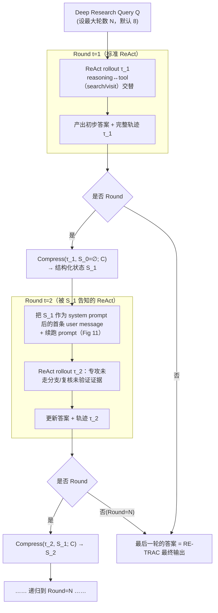

# RE-TRAC：为深度搜索 Agent 设计的「递归跨轨迹压缩」

> **本篇定位**：agent-harness 精读库 · **D 组（上下文/记忆）· C 层**。它回答一个非常具体的 harness 工程问题——
> 当我们让一个 agent **反复多次**去探索同一个难题（Pass@K / 多轨迹）时，这些**分散在多条轨迹里的经验**该怎么被
> 压缩、汇总、并传给下一次尝试？RE-TRAC 给出的答案是「**递归跨轨迹压缩（Recursive Trajectory Compression）**」。
> 本报告严格对齐库内标杆 [`Harness-Bench`](2605.27922-harness-bench-measuring-harness-effects.md) 的密度与诚实度：
> 公式前先给直觉、先定义符号；指标给定义式；每个数字标 §/Table/Eq 出处；区分「论文宣称」与「批判」；
> 并在 `## ★ 对我们的启发` 一节把它**打到我们自己这套 harness 身上**。

---

## §1　TL;DR（一页讲清这篇在干嘛）

> 主讲提示：开场先讲全库中心命题 `Agent = Model + Harness`，再点明——这篇动的是 harness 的 **C 层（上下文/记忆）**，
> 而且是一个此前没被正面攻过的角落：**多条轨迹之间**的经验怎么压缩汇总。

一句话：深度搜索 agent（deep research agent）几乎都建在 **ReAct**（reasoning + acting 交替、把两者都线性追加进上下文）之上（§1）。这种**线性**设计有个结构性毛病——难以回访早期状态、难以分叉到别的搜索方向、长上下文下会丢全局意识，于是陷入**局部最优、重复探索、低效搜索**（Abstract）。RE-TRAC 的做法是：**每跑完一条轨迹 τ_t，就按一份固定的压缩规格 C 把它（连同上一轮的状态）压成一份结构化状态表示 S_t，再把 S_t 作为下一条轨迹的起始上下文**（Eq.(1)）。这样，原本相互隔离的多次尝试（像 Pass@K 那样各跑各的）被改造成一个**逐步被前序经验告知（progressively informed）**的递归过程。

**三条带走的结论：**

- **属于 harness 的哪一层（Θ1）**：本篇打的是 **C（Context/上下文与记忆）** 层——它不是给模型加工具（那是 C 组/T 层），也不是改控制循环的调度（那是 B 组/L 层），而是**重新设计"跨轮/跨轨迹要保留什么、怎么压、怎么再喂回去"**。它对 **L 层（控制循环）**有依赖（外层要有一个"跑 N 轮、每轮末尾触发压缩"的循环，§4.2），对 **V 层（验证）**有轻度耦合（状态里显式记录"哪些证据已验证/未验证"）。
- **回扣全库论点（Θ2）**：`Agent = Model + Harness`。这篇是一个**"同模型、换 harness 的上下文策略，分数大幅摆动"**的干净证据：对 **o3** 这个**固定模型**，把上下文策略从"独立多轮 ReAct"换成"递归跨轨迹压缩"，BrowseComp300 的 RT@8 从 56.7 抬到 69.8（Table 10）；对 **GLM-4.7** 从 37.7 抬到 60.7（Table 13）。模型一个字没改，改的只是 harness 的 C 层。
- **够新够权威（Θ4）**：**2026-02 预印本**，出自 **MSRA**（微软亚洲研究院，通讯作者 Kai Qiu / Zhirong Wu @ Microsoft）联合西电等高校。它相对本库已有的上下文压缩工作（**ReSum** 2509.13313「summarize-and-reset」、**IterResearch** 2511.07327「Markovian 状态重建」、**MemAgent** 2507.02259）推进了一步：那些是**单条轨迹内**的压缩/重建，RE-TRAC 是**跨多条轨迹**的递归压缩（原文 §2.2 明确把自己和 ReSum 区分开："our primary objective is to critique its own trajectory, engage self-reflection and reinforce correct reasoning paths"）。

---

## §2　问题与动机（why）：为什么"多轨迹之间"的压缩值得单独做

> 主讲提示：这页用 Why 三连的"问题层"。核心是把两个被作者量化过的病灶讲清——① 分支探索不完整（Table 1）；② Pass@K 远高于 Pass@1（Fig 2）。不做会怎样，要有数字。

**Why（问题层）——不解决会卡住什么？谁受影响？证据是什么？**

深度搜索 agent 要在开放网页上自主搜索、跨几百个网页收集与分析信息（§1），任务动辄横跨 **128K–256K token** 的超长上下文（§1）。作者对当前最强的几个 deep research agent 做了失败归因分析，得到两个"病灶级"证据：

**病灶 ①：不完整分支探索（Incomplete Branch Exploration）。** 作者收集失败轨迹（最终答案错的）后，用一个分类 prompt（Figure 6 给了原始 prompt）去判定失败模式，发现一个**普遍现象**：**在大多数失败轨迹里，模型"计划要去探索某些分支，却忘了去探索"**。这个比例高得惊人（§3 / Table 1）：

| 模型 | GLM-4.7 | DeepSeek-V3.2 | Tongyi-DeepResearch |
|---|---:|---:|---:|
| 含"未完成分支"的失败轨迹占比 | **93.0%** | 92.7% | 83.4% |

作者把病根归到「**长程任务的本质**与 **ReAct 框架固有的线性**之间的结构性错配」（§3 原文 "fundamental structural mismatch between the long-horizon nature of deep research tasks and the inherent linearity of the ReAct framework"）。深度搜索需要战略性分叉与回溯，但 ReAct 把 agent 钉在一条**顺序执行路径**上；随着轨迹变长，模型出现**灾难性遗忘（catastrophic forgetting）**——早期形成的关键任务目标，被后来堆积的大量工具调用与观察**边缘化（marginalized）**了（§3）。

把这条机制说细一点（§3 原文）：深度研究任务"typically demand extended trajectories, which often spans **hundreds of thousands of tokens**, characterized by a **high density of interdependent tool calls**"。在这种"几十万 token、工具调用高度互相依赖"的长链里，线性 ReAct 会犯两个错：① **早期计划失效（early plans become less actionable）**——第一步定的搜索计划，跑到第几十步时早已被淹没、不再驱动动作（§4.1）；② **决定性线索丢失（loses decisive cues embedded in earlier observations）**——某个早期观察里其实藏着关键线索，但它被埋在长上下文里、后续步骤再也没"回看"到它（§4.1）。这两点叠加，就是 Table 1 那 93%——**不是模型想不到要探哪些分支（它明明"planned to explore"），而是它在长链里把自己列的待办给忘了。**

**病灶 ②：Pass@K 远高于 Pass@1（多轨迹的潜力没被用上）。** 一个朴素的"鼓励探索"办法是多跑几次（multiple stochastic trials）。作者用 **Pass@K** 指标量化"多试几次能到的天花板"（§3 / Figure 2）——先给这个指标的直觉与定义：

> 直觉：我们想知道"如果允许模型独立试 K 次、只要有一次对就算对，它到底能有多强"。这刻画了**探索的上限**——若 Pass@K 远高于 Pass@1，说明模型**不是不会做，而是单次探索不充分**。

记号（先定义后用式）：
- $Q$：一道深度搜索题；
- $K$：允许的独立尝试次数（本文 Figure 2 取 $K=1\dots8$）；
- $y_k$：第 $k$ 次独立 rollout 的最终答案，$\mathrm{correct}(y_k)\in\{0,1\}$ 表示它是否正确（由验证器判定，见 §7）；

$$ \mathrm{Pass@}K(Q) \;=\; \mathbb{E}\Big[\, \mathbb{1}\big(\textstyle\sum_{k=1}^{K}\mathrm{correct}(y_k)\ \ge 1\big)\,\Big] $$

读出什么：$\mathrm{Pass@}K$ 是"K 次里至少中一次"的概率。Figure 2 显示 o3、GLM-4.7、DeepSeek-V3.2、GPT-5-medium、o4-mini 的 Pass@8 都**显著高于** Pass@1（曲线随 K 单调上扬、且和 Pass@1 有巨大 gap）——**这个 gap 就是"当前模型单轨迹够不到、但其实够得着"的性能天花板**（§3 原文 "a significant performance ceiling that current models fail to reach in a single trajectory"）。

**Why（设计层，埋在动机里）——那为什么不直接用 Majority Voting / Best-of-N 就好？**
> **Why（设计层）**：朴素做法是既然 Pass@K 高，就多跑 N 次再投票（Majority Voting）或挑最优（Best-of-N）。→ 会因为**这些尝试彼此独立、没有 inter-trajectory communication** 而失败：每次都从原始 query 从零开始，**重复探索**同一批已经走过的路（浪费算力），而且**无法把分散在多条轨迹里的部分线索合成一个全局最优**（§3 原文 "these attempts remain independent … precludes the possibility of cross-trajectory experience sharing"）。这正是 RE-TRAC 要补的洞：给多轨迹之间**装一条"经验传递"的管道**。

> **读出什么**：这篇的动机不是"再训一个更强的模型"，而是"**把已有模型多次探索的经验，用一层 harness 逻辑攒起来、传下去**"。这是典型的 **C 层（上下文/记忆）**工程——不改模型权重（对前沿模型是纯 prompting），只改"上下文里放什么"。

---

## §3　研究问题 / 核心 intention（形式化成一句话）

> 主讲提示：把整篇压成一句可证伪的假设。

**核心 intention（§4 开篇）**：设计一个**轨迹级（trajectory-level）、递归（recursive）**的 agent 框架，用一份**标准化压缩规格**把"之前所有尝试"提炼成一个**紧凑、结构化的状态**，并把这个状态传播给后续的每一条轨迹；从而把探索从"一堆互不相干的尝试"变成"一个逐步被前序经验告知的搜索过程"。

**可证伪假设**：若在**固定模型**下，把上下文策略从"线性 ReAct / 独立多轮"换成"递归跨轨迹压缩"，则（H1）成功率上升（BrowseComp +15~20%，§5.1）、（H2）资源消耗（token / 工具调用）**随轮次单调下降**而非线性上升（§4.2 / §5.2 / Fig 5），且（H3）小模型经 RE-TRAC-aware 的 SFT 后能追平乃至超过更大模型（§5.1 / Table 2）。

---

## §4　相关工作定位：它站在谁肩上、和谁不同

> 主讲提示：一张对比表。重点讲清它和三条"上下文压缩/记忆"前作的**边界**——单轨迹 vs 跨轨迹。

论文把相关工作分三块（§2）：Deep Research Agents（§2.1）、Agentic Context Management（§2.2）、Test-Time Scaling（§2.3）。与本库最相关、也最该讲清边界的是 **§2.2**：

| 方法（本库 slug） | 压缩/记忆的作用范围 | 核心机制 | 与 RE-TRAC 的关系 |
|---|---|---|---|
| **ReSum**（2509.13313 · Wu et al. 2025） | **单条轨迹内**、周期性 | "summarize-and-reset"：把历史周期性地压成紧凑记忆，然后重置 | RE-TRAC 说自己"自然地把有效上下文延伸到无穷"，但**目标不同**：ReSum 是为续跑压历史；RE-TRAC 的首要目标是**批判自己的轨迹、做自我反思、强化正确推理路径**（§2.2 原文） |
| **IterResearch**（2511.07327 · Chen et al. 2025a） | **单条轨迹内**、每步 | Markovian 状态重建：每一步动态重建工作状态，模拟无限视野 | 同为"状态重建"，但 IterResearch 在**一条**长轨迹内滚动重建；RE-TRAC 在**多条**轨迹之间递归压缩 |
| **MemAgent**（2507.02259 · Yu et al. 2025） | **单条会话/轨迹内** | 动态记忆结构重建状态 | 同上，属单轨迹内记忆 |
| **Self-Consistency / Majority Voting**（Wang et al. 2022） | **多轨迹但零通信** | 采样多条路径→多数投票挑最稳答案 | RE-TRAC 给"多轨迹"这件事**加了一个顺序维度（sequential dimension）**——不是并行投票，而是**串行地让后一条被前面告知**（§2.3 原文 "a sequential dimension to test-time scaling that differs from the parallel nature of voting or debate"） |
| **Multi-Agent Debate**（Du et al. 2023） | **多 agent 并行** | 多个 LLM 互相批评、精炼 | 同为"多视角"，但 debate 是空间并行；RE-TRAC 是时间串行的自我反思 |
| **RE-TRAC（本文）** | **跨多条轨迹、递归** | 每轮末尾按规格 C 把轨迹压成结构化状态 S_t，喂给下一轮 | —— |

**一句话记住区别**：ReSum/IterResearch/MemAgent 都在**一条轨迹内部**把历史压紧（intra-trajectory）；投票/辩论是**多路并行、零通信**；**RE-TRAC 是唯一一个"跨多条轨迹、且串行递归传递结构化经验"**的（§2.2–§2.3）。这正是它在 **D 组（上下文/记忆）· C 层**里占的独特坐标。

---

## §5　方法总览（big picture）：一图看懂"递归跨轨迹压缩"

> 主讲提示：先给一图流与直觉，**先不展开数学**。把"ReAct+Pass@K（并行独立）" vs "RE-TRAC（串行递归）"这张对比讲清（对应原文 Fig 3 / Fig 4）。

**直觉**：把 Pass@K 想成"三个人各自蒙头做同一道题，做完各交各的，谁对算谁"（**并行、零通信**，原文 Fig 3 左 / Fig 4 上）。RE-TRAC 改成"**接力**"：第一个人做完，**不是交卷，而是写一张结构化的交接单**——"目前最可能的答案是 ABC（还没坐实）、这些证据已核对/这些没核对、这些分支我列了但没来得及走"；第二个人**拿着这张单子**继续做，专攻没走的分支、复核没核实的证据；如此递归，直到第 N 轮（原文 Fig 3 右 / Fig 4 下）。

**两个立即能说清的收益（§4.2 原文）**：
1. **提升覆盖（improves coverage）**：第一轮"列了却没走"的分支，被显式写进状态、下一轮直接去走；不像独立 ReAct 那样每轮又从零来一遍。
2. **减少冗余（reduces redundancy）**：已经核实过的事实被状态记住，模型不会重复对同一事实反复调工具、反复核对——这直接带来 token/工具调用的下降（§5.3 / Fig 5）。

---

## §6　符号与术语表（后文都用这套记号）

> 主讲提示：一页把记号钉死，公式页就不用回头解释了。

| 记号 / 术语 | 含义 | 出处 |
|---|---|---|
| $Q$ | 一道 deep research query（深度搜索题） | §4.2 |
| $N$（也写作 $K$） | 最大轮数（round limit），默认 8；SFT 数据构造时用 $K=4$ | §4.2 / §C.3.3 |
| $t$ | 轮次索引（round index），$t=1,\dots,N$ | §4.1 |
| $\tau_t$ | 第 $t$ 轮的**完整轨迹（trajectory）**：一条 ReAct 链（reasoning↔action↔observation 交替） | §4.1 |
| $S_t$ | 第 $t$ 轮末尾得到的**结构化状态表示（Structured State Representation）** | Eq.(1) |
| $S_0$ | 初始状态（空）：第 1 轮就是标准 ReAct，无先验状态 | §4.2 |
| $\mathcal{C}$ | **固定的压缩规格（compression specification）**——规定状态里要有哪些 facet、怎么写（就是 Fig 9/10 那份 prompt） | Eq.(1) / §C.3.1 |
| $\mathrm{Compress}(\cdot)$ | 压缩算子：由**同一个模型**（默认自压，见 §6 Table 6 消融）按 $\mathcal{C}$ 把 $(\tau_t, S_{t-1})$ 提炼成 $S_t$ | Eq.(1) |
| **facet（切面）** | 状态表示里的一个结构化字段（如"证据库""不确定性"）；base 版 5 个 facet，audit 版 +3 个 | §4.1 / §C.3.1 |
| **execution / rollout** | 一次从头到尾的 ReAct 执行（= 一条 $\tau_t$） | §4.2 |
| **RT@N** | RE-TRAC 跑满 N 轮后取**最后一轮**答案（本文主指标） | §5.2 |
| **Pass@N / AP@N** | N 轮里"至少一次对"（理论上限）/ Accuracy Prefix（前 N 轮里至少一次对，答案选择的上限） | §3 / §C.4 |

---

## §7　方法细节 1：轨迹压缩 = 一个结构化状态更新（Eq.1 讲透）

> 主讲提示：这是全篇**最该停留**的公式页。先讲为什么用"结构化状态"而不是"自由摘要"，再给 Eq.(1) 并逐符号定义，最后拆开状态的每个 facet。

**Why（设计层）——为什么压成"结构化状态"，而不是随便写一段摘要？**
> **Why（设计层）**：朴素做法① 是把上一轮的**原始轨迹全文**拼到下一轮前面。→ 会因为**上下文爆炸**（几百个工具调用、几十万 token）而不可行，且低价值的 trace 细节会淹没关键目标（正是 §3 的"灾难性遗忘"）。朴素做法② 是让模型写一段**自由格式的摘要**。→ 会因为**摘要经常坍缩成一条主线**（只记"我现在觉得答案是 X"），**丢掉'还没走的分支'和'没核实的证据'这类分叉信息**，于是探索又收敛成单路径（§4.2 原文 "the state prevents exploration from collapsing into a single path. It explicitly retains multiple unresolved candidates and actionable options"）。**RE-TRAC 用一份固定规格 $\mathcal{C}$ 强制状态包含"未解决候选/未走分支"这类 facet**，因此在"聚焦引导"与"开放分叉"之间取得平衡（§4.2 原文 "balance between focused guidance and open branching"）。

**核心公式（Eq.1，§4.1）。** 先给直觉：我们希望"第 $t$ 轮的状态 = 把第 $t$ 轮**新跑出来的轨迹** $\tau_t$ 与**上一轮已有的状态** $S_{t-1}$ 融合、再按固定规格压紧"。这是一个**带记忆的递归更新**（不是每轮推倒重来，而是在旧状态上"增量消化"新轨迹）。

记号（已在 §6 定义，这里只强调三者角色）：$\tau_t$ = 本轮新轨迹（新信息源）；$S_{t-1}$ = 上一轮结晶出的状态（历史记忆）；$\mathcal{C}$ = 固定压缩规格（写法模板）。

$$ S_t \;\leftarrow\; \mathrm{Compress}\big(\tau_t,\; S_{t-1};\; \mathcal{C}\big) \tag{Eq.1} $$

读出什么：三点。① **递归性**——$S_t$ 依赖 $S_{t-1}$，所以经验是"滚雪球"式累积，而不是每轮独立（这正是它区别于 Pass@K 的关键）。② **压缩性**——输出是**紧凑**的结构化状态，不是轨迹全文，所以能塞进下一轮上下文而不爆。③ **规格化**——$\mathcal{C}$ 固定，保证每轮状态字段一致、可被下一轮稳定解析（对应 Fig 9/10 那份"OUTPUT FORMAT (EXACT)"的强约束 prompt）。

**结构化状态 $S_t$ 里到底装什么？** 对深度搜索任务，作者用**三个互补 facet**定义 base 版状态（§4.1）：

| Facet（base 版，§4.1） | 记录什么 | 为什么需要它（对应堵哪个病灶） |
|---|---|---|
| **Answer & Analytical Conclusions（答案与分析结论）** | 目前**最有支撑的部分答案**，以及从轨迹里得到的关键推断；中间结论作为**可复用锚点**留给后续推理 | 堵"灾难性遗忘"——把早期形成的关键结论**钉住**，不被后续 trace 淹没 |
| **Evidence Base & Source Verification（证据库与来源核验）** | 观察到的证据及其**出处（provenance）**；**哪些来源查过、哪些声明已验证** | 堵"重复探索"——避免对同一事实反复调工具、反复核对（§4.1 原文 "helps avoid redundant tool calls and repeated checking"） |
| **Uncertainties & Exploration Trace（不确定性与探索轨迹）** | 仍**未解决**的部分；**开放假设与候选分支**；**失败尝试与被丢弃的方向** | 堵"不完整分支探索"——把"列了却没走的分支"显式留存，指引**下一轮该往哪聚焦**（§4.1 原文 "helps the model to find unexplored search-space for the next rollout"） |

> **读出什么（关键机制）**：第三个 facet 是 RE-TRAC 的**灵魂**。正是因为状态里**显式保留了"未解决候选 + 未走分支"**，下一轮才不会重复走老路、也不会盲目乱走，而是**精准地补齐上一轮的探索缺口**。这就是标题里"**跨轨迹**"三个字的技术落点——**一条轨迹发现的"待办分支"，通过 $S_t$ 传递给另一条轨迹去执行**，实现了 §3 抱怨的、投票/Best-of-N 做不到的 **cross-trajectory experience sharing**。

**audit 版：给前沿模型多加 3 个 facet（§C.3.1，Fig 10）。** 前沿 LLM 指令遵循强、总结能力好，作者在 base 版 5 字段（Fig 9：Current Answer / Facts&Evidence / Analysis&Conclusions / Source Inventory&Verification / Uncertainties,Limitations,Gaps）之上，**再加 3 个"审计（audit）"字段**，把"探索里被浪费掉的东西"也结构化记下来：

| audit facet（Fig 10，仅前沿版加） | 记录什么 | 它专门堵什么 |
|---|---|---|
| **Failed Attempts（失败尝试）** | 明确写过、却被放弃/未完成/最终零进展的具体计划或目标 | 防下一轮**重犯同样的错**（把"此路不通"钉死） |
| **Uncompleted Proposals（未竟提案）** | 工具输出/推理里冒出过的潜在线索（URL、实体、数据点、关键词），但**因 token 上限/焦点转移/意外遗漏而从没被追**的 | 这正是 Table 1 那 **93%"列了却没走的分支"** 的**结构化落点**——把它们收集成一张"待办清单"，下一轮直接去追 |
| **Discarded Possibilities（被丢弃的可能）** | 基于未验证假设/幻觉/逻辑跳跃而被丢掉的候选答案或关键证据 | 防"**错误地过早排除**"——给下一轮一个"复活可疑弃案"的机会 |

> **读出什么**：base 版偏"记住已知（答案/证据）"，audit 版补上"**记住未知与被浪费的（失败/未追/误弃）**"。三个 audit 字段合起来，等于给 agent 装了一本**"探索欠账簿"**——这与 §3 病灶①（93% 的失败源于"计划了却没探"）是**一一对应的解药**：Uncompleted Proposals 直接对着"forgets to explore"这句话开药。

**把"递归跨轨迹压缩"用一个具体例子走一遍（原文 Fig 4 的 "X = ABC → XYZ" 例）。** 光看公式容易空，这里按原文 Fig 4 的画面走一遍"多轨迹如何递归合并压缩"：

- **Round 1（一条轨迹 $\tau_1$）**：题目问"某校名"。agent 做了几步 search/visit，观察到 clue1、clue2……最后**给了一个初步答案"likely ABC"**（原文 Fig 4 标 "Ans: likely to be ABC / Not Judge"——注意第 1 轮的答案**先不判分**，只用来生成状态）。它其实**列过**"还应查一下 state-follower 那条线"，但**没走完**。
- **Compress（$S_1 \leftarrow \mathrm{Compress}(\tau_1,\varnothing;\mathcal{C})$）**：把 $\tau_1$ 压成结构化状态，原文 Fig 4 的压缩框写着 "Up to now I have many observation: clue1… clue2… **But X is unsolved**"——即 `Answer=ABC(未坐实)`、`Evidence=clue1,clue2(部分已核)`、`Uncertainties=X 仍未解 / state-follower 线未走`。**关键**：这份状态没有把 $\tau_1$ 的几百步 trace 全搬过来，只搬了"结论锚点 + 证据核验表 + 未走分支清单"。
- **Round 2（另一条轨迹 $\tau_2$，被 $S_1$ 告知）**：$S_1$ 作为首条 user message + Fig 11 续跑 prompt 一起进场。agent 读到"state-follower 线未走"，于是**这一轮直接去补那条线**（原文 Fig 4：agent 自语 "I should check states … Search: states with state follower"），把 clue 串起来，**答案从 ABC 修正为 XYZ**（Fig 4 "Ans: XYZ School / Correct Answer"）。
- **递归**：若还没到第 N 轮，再 $S_2 \leftarrow \mathrm{Compress}(\tau_2, S_1;\mathcal{C})$，继续喂 Round 3……直到 Round=N，**取最后一轮答案**。

> **这就是"跨轨迹递归合并压缩"的全部要义**：① **跨轨迹**——$\tau_1$ 里"没走的分支"通过 $S_1$ 交给 $\tau_2$ 去执行，两条**不同**的轨迹之间发生了经验传递（对比 Pass@K：$\tau_1$、$\tau_2$ 各跑各的、互不知道）；② **递归**——$S_t$ 建在 $S_{t-1}$ 之上（Eq.1 的 $S_{t-1}$ 参数），经验是**滚雪球累积**而非每轮重置；③ **压缩**——每次合并的产物是**紧凑结构化状态**（几个 facet），不是轨迹全文，所以能一轮轮喂下去而上下文不爆。三者缺一，都退化：去掉①就是单轨迹压缩（ReSum/IterResearch）；去掉②就是"只压最近一轮"的无记忆摘要；去掉③就是把全轨迹硬拼（上下文爆炸）。

---

## §8　方法细节 2：递归执行——多条轨迹如何"接力"（§4.2 讲透"跨轨迹递归合并")

> 主讲提示：这页把"多轨迹如何递归合并压缩"讲到可复现级别。重点：状态放在**哪**（system prompt 之后的首条 user message）、续跑靠**哪份 prompt**（Fig 11）、以及"状态作为 guided search update"这个抽象。

**执行流程（§4.2 原文，逐步）：**
1. **第 1 轮 = 标准 ReAct**。给定 query $Q$、最大轮数 $N$（默认 8），第一轮就用普通 ReAct 跑出一条完整轨迹 $\tau_1$（它和普通 ReAct 一样，会"忽视早期计划的分支"——作者诚实点明第一轮也逃不掉线性局限）。
2. **压缩**。用一份专门的 prompt（Fig 9 base 版 / Fig 10 audit 版；即规格 $\mathcal{C}$）去**抽取结构化状态** $S_1 = \mathrm{Compress}(\tau_1, \varnothing; \mathcal{C})$。
3. **喂回**。把 $S_1$ 作为**紧接 system prompt 之后的首条 user message**放进第 2 轮（§4.2 原文 "positioned immediately after the system prompt"），再配一份**续跑 prompt**（Fig 11，见下）。
4. **续跑**。模型在"被 $S_1$ 告知"的情况下，跑第 2 轮 ReAct，产出 $\tau_2$ 并更新答案。
5. **递归**。重复 2–4，直到 Round = $N$；**最后一轮的答案就是 RE-TRAC 的最终输出**。

**"状态作为一次有指导的搜索更新（guided search update）"这个抽象（§4.2）**：作者把 $S_t$ 定位成一次"引导性的搜索空间更新"——它做两件看似矛盾但要平衡的事：
- **过滤**掉不必要占上下文的低层 trace 细节（省 context）；
- **保留**多个未解决候选与可执行选项（**防止探索坍缩成单路径**，维持分叉多样性）。
> 这就是"在**聚焦引导**（别乱走）与**开放分叉**（别过早收敛）之间取平衡"（§4.2）。**Consequently, agent progressively expands search space coverage while maintaining efficiency**（§4.2 原文）——覆盖变广、同时效率变高。

**续跑 prompt（Figure 11，跨轨迹知识整合的关键）**——这份 prompt 决定了"下一条轨迹**怎么对待**上一条压出来的状态"，非常值得逐条读（它把"批判性"写死进了 harness）：
- **1. 批判性评估**：明告模型"上面这份摘要是**建议性的（suggested）综合，不是绝对真理**；它可能含幻觉、未验证假设、过早结论；你被鼓励去**质疑**它、甚至在它像死胡同时**完全弃用、另起炉灶**"。
- **2. 扩展搜索空间**：若任务仍未解决，说明当前搜索空间不够；**别掉进摘要的"逻辑循环"**；用状态里的 `[Uncertainties, Limitations, Gaps]` 作跳板，**转向完全不同的关键词簇/工具调用策略**；**交叉复核**被标为"unverified/partial"的事实。
- **3. 自主重规划**：摘要提供 *memory*，但**推理由你自己给（you provide the reasoning）**；基于已有事实+你自己的判断，自定下一步。

> **Why（设计层）——为什么续跑 prompt 要"授权模型怀疑甚至弃用状态"？**
> **Why（设计层）**：朴素做法是让模型**无条件信任**上一轮的状态摘要。→ 会因为**状态本身可能是错的**（压缩时引入幻觉、或上一轮就走进了死胡同）而把 agent**锁死在一条错误主线**上——作者在 §5.3 的消融里**实测到了这个坑**："the model can be over-relied on the summary of previous rounds and get stuck in previous search path, failing to explore other branches"（§5.3）。于是他们加了 **free-use prompt**（明确授权模型判断摘要是否有价值、并"尽量扩展搜索空间"），Table 5 显示带这个 prompt 的每一轮都比不带的更高（见 §11）。**这是一个非常漂亮的"harness 设计层"教训：记忆/状态不能当真理喂，要当"可被推翻的建议"喂。**

---

## §9　方法细节 3：两种落地模式——前沿模型(纯 prompting) vs 小模型(SFT)

> 主讲提示：讲清同一个框架的两条腿。一条是"训练-free 直接给前沿模型加"，一条是"给小模型做 RE-TRAC-aware 的 SFT"。

**模式 A：前沿模型——训练-free 的 prompting 策略（§4.3）。** RE-TRAC 对前沿模型是**纯推理期 prompting**、不需要微调：第 1 轮标准 ReAct → 用 Fig 10（audit 版，因为前沿模型指令遵循强）抽状态 → 作为首条 user message 喂第 2 轮 → 递归到 N。对 o4-mini、o3、GPT-5、DeepSeek-V3.2、GLM-4.7、MiniMax-M2.1 都这么用（§5.2）。

**模式 B：小模型——RE-TRAC-aware 的 SFT（§4.4 + §B）。** 动机：既然 229B–685B 的大模型都能从 RE-TRAC 获益，那能不能让一个**tiny edge model**（4B）也学会"基于结构化跨轨迹状态来 ground 自己的推理/规划/用工具"，而不是只依赖眼前上下文？做法：
- **数据来源**：先按 InfoAgent（Zhang et al. 2025）的**实体树（entity-tree）**法造原始 QA——从 WikiPedia 取大量实体作树根，递归搜相关实体作子节点、长到预设深度；相邻节点的边即两实体关系；沿"根→叶"路径把边转成子问题、拼成一道题；并用 o3 把子问题**加噪（fuzzify）**提难度。共造 **33K QA 对**（§4.4 / §B）。
- **轨迹来源**：用 **GLM-4.7** 在这些题上跑 **4 轮（K=4）**的 RE-TRAC，得到显式"以结构化跨轨迹状态为条件"的解题轨迹。因为每轮上下文相互独立，一道题的解可**摊平成 4 条训练样本**——得 132K 原始样本（§B）。
- **过滤**：丢掉 ①含非法工具调用、②轮数<15、③无合法最终答案 的样本 → 最终 **104K 高质量样本**（§B）。
- **训练**：用这 104K 样本 SFT 出 **RE-TRAC-4B**（基座 Qwen3-4B-Instruct）与 **RE-TRAC-30B-A3B**（基座 Tongyi-DeepResearch-30B-A3B，也是从 GLM-4.7 蒸馏）。超参见 Table 7（学习率 2e-5、batch 512、max length 65536、warmup 0.05、weight decay 0.1、Adam β=(0.9,0.95)、constant LR）。

> **Why（设计层）——为什么造数据要用"实体树 + o3 加噪"，而不是直接拿现成 QA？**
> **Why（设计层）**：朴素做法① 是直接拿 BrowseComp 等现成难题当训练题。→ 会**数据量不够**（这些 benchmark 是评测集、题量小）且**污染评测**（训到测试分布上）。朴素做法② 是随机生成简单 QA。→ 会**太容易**，模型一轮 ReAct 就答完，**根本触发不了"需要多轮跨轨迹补探索"的场景**，学不到 RE-TRAC 该学的东西。作者的**实体树**法妙在：沿"根实体→叶实体"的**多跳路径**把关系链转成子问题，天然生成**需要多步检索、多跳推理**的难题；再用 o3 对子问题**加噪（fuzzify）**——把清晰的子问题模糊化，逼 agent 去搜索消歧，**进一步拉高探索深度**（§4.4 / §B）。这样造出的 33K 题，才"配得上"用 4 轮 RE-TRAC 去解、并从中蒸出"会补探索"的行为。

> **读出什么（Θ2 呼应）**：模式 A 是"**同模型换 harness**"的干净证据（模型不变、只加压缩逻辑）；模式 B 则更进一步——**把 harness 的行为"蒸进"了模型权重**，让小模型天生就会用跨轨迹状态。这两条腿合起来，正是 `Agent = Model + Harness` 的两种兑现方式：harness 既能"外挂"（prompting），也能"内化"（SFT）。**注意一个训练细节的巧思**：因为 RE-TRAC 每轮上下文相互独立（$S_{t-1}$ 已经把历史压好、$\tau_t$ 不直接看 $\tau_{t-1}$ 的原始 trace），所以一道 4 轮题的解可**摊平成 4 条独立训练样本**（§B）——这既扩了数据量（33K 题→132K 样本），也让 SFT 能**逐轮**学"给定一个状态 $S_{t-1}$、如何跑出好的下一轮 $\tau_t$"，而不必把 4 轮塞进一个超长序列。

---

## §10　实验设置：数据集、指标定义式、baseline、算力

> 主讲提示：这页务必把**指标定义式**给全（RT@N / MV@N / WV@N / Best@N / AP@N），这是 benchmark 型讨论的重点。

**评测基准（§5.1）**：五个搜索导向 benchmark——
- **BrowseComp**（Wei et al. 2025）与 **BrowseComp-ZH**（Zhou et al. 2025，中文）：难的开放网页浏览题；
- **GAIA**（Mialon et al. 2023）：通用 AI 助手任务；
- **XBench**（Chen et al. 2025b）：职业对齐的真实评测；
- **HLE**（Humanity's Last Exam，Phan et al. 2025）。
- 为省消融成本，另从 BrowseComp 随机抽 300 题作 **BrowseComp300**（作者称其表现与全集很接近，§5.2）。

**工具（§C.1）**：两个——**search**（接 Google Search Web API，每 query 返回 5 条含标题/URL/snippet 的结果）与 **visit**（接收 URL 列表 + 一个 goal 字符串，抓网页正文——HTML 用 Trafilatura 抽取、PDF 逐页抽——再用 GPT-4o-mini 按 Fig 7 的 prompt 生成结构化摘要）。作者为每个模型适配了其原生 function-calling 约定（参数名/输入类型/输出格式，§C.1）。

**验证器（§C.2）**：沿用 BrowseComp 的评测法——对每题，用 **OpenAI o4-mini** 按 Fig 8 的 prompt，只依据 [correct_answer] 判定模型最终答案对错（输出 correctness + confidence）。

**测试期缩放（TTS）指标定义（§5.2）**——这是本页核心，逐个给定义：

> 直觉：RE-TRAC 是一种"多跑几轮"的 test-time scaling。要公平地说"它比别的多轮法好"，得和同样"多跑 N 次"的经典法（投票/加权/挑最优）在**同样 N 下**比。下面五个指标都是"给定 N 次尝试，如何得到一个最终答案"的不同规则。

记号：$n$ = 尝试/轮数；对第 $j$ 次尝试，$a_j$ 为其答案、$c_j\in[0,100]$ 为模型自报的**置信度**（confidence，由 prompt 让模型给，§5.2）。

- **RT@n（Re-TRAC @ n，本文主指标）**：跑满 $n$ **轮 RE-TRAC**（每轮被前一轮状态告知），取**最后一轮**的答案。
  $$ \mathrm{RT@}n = \mathrm{correct}\big(a^{(\text{round }n)}\big) $$
  —— 注意这**不是**从 n 个里挑，而是"递归改进到第 n 轮的那一个"。
- **MV@n（Majority Voting）**：跑 $n$ 条**独立**轨迹，取**出现最频繁**的答案。$\ \hat a = \arg\max_{a}\sum_{j=1}^{n}\mathbb{1}(a_j=a)$。
- **WV@n（Weighted Voting）**：同样 $n$ 条独立轨迹，但按**置信度加权**投票。$\ \hat a = \arg\max_{a}\sum_{j=1}^{n} c_j\cdot \mathbb{1}(a_j=a)$。
- **Best@n（Best-of-N）**：$n$ 条独立轨迹里，选**自报置信度最高**的那条的答案。$\ \hat a = a_{\arg\max_j c_j}$。
- **AP@n（Accuracy Prefix，仅用于分析，§C.4）**：前 $n$ 轮里**是否至少出现过一次正确答案**——是 RE-TRAC 的**上界**（衡量"答案选择策略还有多少提升空间"）。$\ \mathrm{AP@}n = \mathbb{1}\big(\exists\, t\le n:\ \mathrm{correct}(a^{(t)})\big)$。

读出什么：**RT@n vs (MV/WV/Best)@n 的对比，本质是"串行递归被告知" vs "并行独立再选"的对比**——若 RT@n 稳定高于后三者，就证明"**让后一次被前一次告知**"这件事本身带来了增益，而不仅是"多试几次"。

**模型级推理超参（Table 8）**：o4-mini/o3 上下文 200k、GPT-5 400k、DeepSeek-V3.2/GLM-4.7/RE-TRAC-* 128k；温度：DeepSeek/GLM=1.0、RE-TRAC-*=0.7；默认最大轮数 $K=8$（§C.3.3）。

---

## §11　主要结果：BrowseComp +15~20%，小模型追平大模型

> 主讲提示：先报 Table 2 的"同尺寸碾压 + 跨尺寸越级"，再报 Table 3 的"对各模型普适"，最后报 Fig 5 的"更省资源"。每个数字标出处。

**结果 1：同尺寸内建立新 SOTA、并越级超更大模型（Table 2）。** Accuracy(%)，粗体为**同尺寸组内最优**：

| 模型（分组） | BrowseComp | BrowseComp-zh | GAIA | XBench | HLE |
|---|---:|---:|---:|---:|---:|
| **闭源** Claude-4.5-Sonnet | 24.1 | 42.4 | 71.2 | 66.0 | 32 |
| **闭源** o3 | 49.7 | 58.1 | 70.5 | 66.7 | 24.9 |
| **闭源** GPT-5-high | 54.9 | 63.0 | 76.7 | 77.9 | 42 |
| **闭源** Gemini-3-pro | 37.8 | 51.6 | 74.8 | – | 38.3 |
| **>70B 开源** Kimi-K2-Thinking-1T | 60.2 | 62.3 | – | – | 51.0 |
| **>70B 开源** DeepSeek-V3.2-Thinking-685B | 67.6 | 65.0 | – | – | 40.8 |
| **>70B 开源** MiniMax-M2-229B | 44.0 | 48.5 | 75.7 | 72.0 | 31.8 |
| **15–70B** Tongyi-DeepResearch-30B-A3B（RE-TRAC 的基座） | 43.4 | 46.7 | 70.9 | 75.0 | **32.9** |
| **15–70B** IterResearch-30B-A3B | 37.3 | 45.2 | 72.8 | – | 28.8 |
| **15–70B** WebSailor-V2-30B-A3B (RL) | 35.3 | 44.1 | 74.1 | 73.7 | 30.6 |
| **15–70B ★ RE-TRAC-30B-A3B（本文）** | **53.0** | **57.3** | **78.2** | **83.0** | 31.5 |
| **<15B** AgentCPM-Explore-4B | 25.0 | 29.0 | 63.9 | 70.0 | 19.1 |
| **<15B** NestBrowse-4B | 22.4 | 28.4 | 68.9 | 74.0 | – |
| **<15B ★ RE-TRAC-4B（本文）** | **30.0** | **36.1** | **70.4** | **76.6** | 22.2 |

**Why（结果层）——为什么会得到这些数？**
- **同尺寸碾压**：RE-TRAC-30B-A3B 相对它自己的基座 Tongyi-DeepResearch-30B-A3B，在 BrowseComp/BC-ZH/GAIA/XBench 上**普涨 8%~10%**（§5.1 原文 "consistently achieves 8%~10% improvement"）——**基座一样、只是学会了用跨轨迹状态**，涨幅就来自"把多轨迹经验攒起来用"。
- **越级超大模型**：30B 版在 BrowseComp 拿 **53.0**，**超过 GLM-4.7-358B 的 52.0**（§5.1 原文点名）；在 **GAIA 上打败所有闭源 baseline**、在 BrowseComp/BC-ZH 上是第二强。作者的机制解释很直白（§5.1）——RE-TRAC 用"**手动扩展搜索空间**"来**补偿模型智能的不足**（"compensate for the lack of model intelligence by manually expanding its search space"）。**这句是全篇的题眼**：harness（C 层的跨轨迹压缩）在**替模型补探索**。
- **前沿模型 +15~20%**：Abstract 与 §5.1 均称"Re-TRAC consistently outperforms ReAct by 15–20% on BrowseComp with frontier LLMs"。对照 Table 10（o3：RT@8=69.8 vs Round-1 Acc=56.7，绝对 +13.1；vs 独立 Pass@1 的 56.7）、Table 13（GLM-4.7：RT@8=60.7 vs Round-1=37.7，绝对 **+23.0**），这个区间是可核对的。

**结果 2：对各主流模型都吃这套（Table 3，BrowseComp300，8 轮）。** Pass@1 是"单次"基线；后四列是四种 8 轮 TTS：

| 模型 | Pass@1 | RT@8 | MV@8 | WV@8 | Best@8 |
|---|---:|---:|---:|---:|---:|
| o4-mini | 25.7 | **46.8** | 34.0 | 46.7 | 43.3 |
| o3 | 54.9 | **69.8** | 64.3 | 69.0 | 68.0 |
| GPT-5-medium | 48.3 | **66.6** | 61.7 | 64.7 | 54.0 |
| DeepSeek-V3.2 | 45.3 | **60.8** | 55.7 | 57 | 55 |
| GLM-4.7 | 37.7 | **60.7** | 41.7 | 48 | 42.3 |

**Why（结果层）**：**RT@8 在每一行都是最高**（§5.2 原文 "Re-TRAC achieves the best or competitive performance among all the models"）。尤其 **GLM-4.7**：MV@8 只有 41.7、Best@8 只有 42.3，但 RT@8 到 60.7——说明 GLM-4.7**自评能力弱**（投票/挑最优这类"靠自己判断哪条对"的法子几乎不涨），而 RE-TRAC**不依赖自评**、靠"递归补探索"照样大涨。作者据此下了一个很强的结论（§5.2）：**RE-TRAC 是一种"对模型智能要求更宽松（looser requirements）"的 TTS 方法**——连自评差的模型都能获益。

**把"为什么 RT 能赢过投票"讲透（这是本篇最该抓的 Θ2 机制）**：MV/WV/Best 三种法子有一个**共同的隐含前提**——"$n$ 条独立轨迹里**至少有一条是对的**，我只要能把它挑出来"。所以它们的天花板是 **Pass@n / AP@n**（前 $n$ 条里存在正确答案的概率），且**挑得准不准全看模型自评**（WV/Best 直接用 confidence，MV 赌"对的答案更容易被多次采到"）。这在两种情况下会崩：① **没有任何一条独立轨迹是对的**（单轨迹探索都不充分，Pass@n 本身就不够高）——那投票再准也没用；② **模型自评不可靠**（如 GLM-4.7）——那即使 $n$ 条里有对的也挑不出来。**RE-TRAC 绕开了这两个前提**：它不是"挑一条已有的对的"，而是"**让第 n 轮在前 n−1 轮的经验基础上、探索出一条原本不存在的、更对的轨迹**"——把 Pass@n 的天花板本身**顶高**（因为搜索空间被逐轮扩展），同时**不需要自评**（靠状态里的"未走分支"引导，而非靠 confidence 排序）。这就是为什么 RT@8 能同时超过"上限受 Pass@n 限制、且吃自评"的 MV/WV/Best@8。**一句话：投票是"在固定的 n 条里选最好"，RE-TRAC 是"让第 n 条比前面所有条都好"。**

**结果 3：更省资源（Fig 5，BrowseComp300）。** 传统 TTS（投票/Best-of-N）因轨迹独立，**资源随 N 线性增长**；RE-TRAC 因为**继承前轮状态、搜索空间收敛**，冗余工具调用与探索被大量削减 → **在相同预算下用约 50% 资源就拿到更好表现**（§5.2 原文 "consume only 50% resources to achieve better performance"）。这印证了 Abstract 的"**tool calls 与 token usage 跨轮单调下降**"——是"越来越精准的定向探索"而非"重复搜索"（Abstract）。

---

## §12　消融与分析：SFT、free-use prompt、summarizer 质量

> 主讲提示：三个消融各回答一个"到底是哪部分在起作用"。

**消融 1：SFT 的作用（Table 4，Qwen3-4B，8 轮）。** 4B 基座没在深度搜索上大规模预训练，初始极弱；SFT 后学会"搜索 + 用状态表示"，能力才被 RE-TRAC 撑起来：

| | BrowseComp300 | BC-ZH | GAIA | XBench | HLE |
|---|---:|---:|---:|---:|---:|
| Qwen3-4B-Instruct (RT@8) | 2.7 | 6.9 | 24.4 | 45.0 | 7.0 |
| **RE-TRAC-4B** | **30.0** | **36.1** | **70.4** | **76.6** | **23.5** |

> **读出什么**：从 2.7 → 30.0（BrowseComp300）——**简单 SFT 就能造出强搜索 agent**，追平乃至超过用大规模 RL 训练的 InfoAgent/WebExplorer（Table 2）。这暗示"**会用跨轨迹状态**"这件能力，**可以被便宜地蒸馏**，不一定要 RL。

**消融 2：free-use prompt（Table 5，o3，BrowseComp300，逐轮）。** 前文（§8）说过，模型会**过度依赖上一轮摘要、卡在旧路径**；于是加一句"明确让模型判断摘要是否有价值、并尽量扩展搜索空间"：

| Round | 不带 free-use | 带 free-use |
|---:|---:|---:|
| 1 | 56.1 | 56.1 |
| 2 | 61.2 (+5.1) | 63 (+7.0) |
| 4 | 66.4 (+2.4) | 67.0 (+1.3) |
| 8 | 68.9 (+0.4) | **71.7** (+0.7) |

> **读出什么（与 §8 的设计层 why 闭环）**：带 free-use 的每一轮都不低于不带的，第 8 轮 71.7 vs 68.9。这**实证**了那条 harness 设计教训——**状态要当"可被推翻的建议"喂，而不是真理**（§5.3）。这也是本篇最值得我们抄的一条 prompt-level 招（见 Inspires-Us）。

**消融 3：summarizer 质量（Table 6，BrowseComp300，8 轮）。** 默认 RE-TRAC 是**自压**（模型自己当 summarizer）；换成更强的 GLM-4.7 当 summarizer 会怎样？

| 模型 / Summarizer | Self（自压） | GLM-4.7 压 |
|---|---:|---:|
| RE-TRAC-4B | 30.0 | **38.5** |
| RE-TRAC-30B-A3B | 53.0 | 52.4 |

> **读出什么**：**4B 换强 summarizer 大涨（30.0→38.5）**，说明 **4B 的"压缩/总结能力本身偏弱"是瓶颈**（§5.3 原文 "its search abilities have not been fully stimulated"）；而 30B 换强 summarizer**基本无变化**（53.0→52.4），说明它自压已够好。作者坦承"**如何训练一个总结能力更强的 search agent，留作 future work**"（§5.3）——这正是一个现成的开放问题（见 Inspires-Us c）。

**逐轮收敛画像（Table 9–13，附录 C.4）**：五个模型的 round-by-round 都显示 **RT@N 随轮次单调上升**（如 o3：56.7→61.1→65.4→…→69.8；GLM-4.7：37.7→47.7→…→60.7），而单轮 Acc% 基本持平（o3 的 Acc% 在 51–57 间抖动、GLM-4.7 在 36–45 间抖动）——**这个对比是全篇最漂亮的一处证据**：如果涨分来自"模型单轮变强"，Acc% 该上升；但 Acc% 不动、只有累积的 RT@N 上升，**说明增益纯粹来自"跨轮累积的结构化状态"这一 harness 机制**，而非模型本身。同时 **AP@N（Accuracy Prefix，上界）始终高于 RT@N**（如 o3 第 8 轮 AP@8≈71.1 vs RT@8=69.8；DeepSeek-V3.2 AP@8=63.9 vs RT@8=60.8），二者的 **gap（约 1~3 分）就是"答案选择策略"还能榨出的空间**——即"前 N 轮里其实出现过对的答案，但最后一轮没选中它"的比例（§C.4）。这给未来工作指了一条明路：**在递归改进之外，再加一层"从 N 轮历史里挑最优答案"的选择器**，有望把 RT@N 进一步推向 AP@N。

---

## §13　局限与批判（论文自陈 + 我的补充）

> 主讲提示：诚实。区分"论文承认的"和"社区/我该追问的"。

**论文自陈的局限（§5.3 / §6）：**
- **4B 的总结能力是瓶颈**：小模型自压质量不足，换强 summarizer 才补得上（Table 6）；"如何训出更强总结能力的 search agent"留作 future work（§5.3）。
- **未与 RL 结合**：Conclusion 明说"future work will explore integrating Re-TRAC with reinforcement learning"——当前 SFT 只是"模仿 GLM-4.7 的 4 轮轨迹"，压缩规格 $\mathcal{C}$ 与状态 facet 是**人手设计的、固定的**，没有被优化过。

**我的补充批判（原文未展开或未给出）：**
- **压缩器的幻觉没有独立护栏**：Eq.(1) 的 $\mathrm{Compress}$ 默认由**同一个模型自压**。压缩本身是一次生成，**会引入幻觉**（作者在 Fig 11 里其实承认了"summary … may contain hallucinations"）。他们的对策是"续跑 prompt 授权模型怀疑摘要"——但这**把纠错责任又推回给同一个模型**，等于"让模型自己 critic 自己的压缩"，**没有独立验证器**。这与本库 [Harness-Bench](2605.27922-harness-bench-measuring-harness-effects.md) 的"谁来 judge the judge"、以及 auto-research `m9.8` 的红队收口是同一隐忧。**"谁来 verify the compression"——原文未给出独立机制。**
- **递归误差累积（error propagation）没有量化**：$S_t$ 依赖 $S_{t-1}$，若某一轮把一个**错误结论**写进"Answer & Analytical Conclusions"锚点，它会被后续轮次继承、放大。作者靠 free-use prompt 缓解，但**没有报告"错误状态被继承并导致最终错答"的比例**——**原文未给出**这类失效分析（Table 1 的 93% 是针对 ReAct baseline 的，不是针对 RE-TRAC 自身）。
- **+15~20% 的口径需要小心**：Abstract 说"outperforms ReAct by 15–20% on BrowseComp"，但 Table 3 报的是 **BrowseComp300**（抽样 300 题）且用**自建 search/visit 工具**（§5.2 明说"Pass@1 scores can be different with the officially reported scores"）。所以这个增益是"**在作者自己的工具栈与子集上、相对自己的 ReAct 单轮**"的相对提升，**跨工具栈的可比性有限**（这点作者部分承认）。
- **compression 的成本没被计入"省 50% 资源"**：Fig 5 说 RE-TRAC 省约 50% 资源，但**每轮末尾的 Compress 本身也是一次 LLM 调用**（要读完整条轨迹再生成结构化状态，输入很长）。这笔压缩开销**是否已计入 token/tool 统计、如何计**——**原文未明确说明**；若未计入，"省 50%"会偏乐观。
- **外推性依赖固定的 facet 设计**：base 5 facet / audit 8 facet 是针对"深度搜索"手工设计的（§4.1 / §C.3.1）。换到别的任务族（编码、GUI、SRE），**这套 facet 是否还最优**没有验证——**原文未给出**跨任务族的 facet 迁移实验。

---

## ★ 对我们的启发（Inspires Us）

> 这一节是组会高潮，也是本库的"第一人称"优势：**我们（Claude Code / 本课 m9.* 的 agent）本身就是一个 harness**——
> 有真实的 ReAct 循环、上下文压缩/compaction、子代理编排。RE-TRAC 恰好攻的是我们**最常遇到、却最少系统化**的场景：
> **当我们 fan-out 出多个子代理 / 多条探索轨迹后，它们的结果该怎么压缩汇总、并传给下一轮？** 下面每条都落到具体组件。

➤ **a. 可直接借用的招（method/trick we can reuse）**：**三招可拆下来即用**。
   ① **结构化状态规格 $\mathcal{C}$（Fig 9/10）**——一份"OUTPUT FORMAT (EXACT)"的强约束模板，强制状态含 6 个 facet：`Current Answer / Facts&Evidence[附 Source+Verified:yes/no/partial] / Analysis&Conclusions[显式链到证据 ID] / Uncertainties,Gaps / Failed attempts / Uncompleted proposals / Discarded possibilities`。这份模板可**直接**当我们"多子代理结果汇总"的输出契约。
   ② **Fig 11 的"续跑 prompt"三段式**——把"记忆是*建议*不是真理、授权怀疑与弃用、你提供*推理*"写进 prompt。这是一条**极便宜且被 Table 5 实证有效**（8 轮 71.7 vs 68.9）的招，任何"读取上一轮摘要再续跑"的管线都该加。
   ③ **RT@n 这套评测口径**——对比"串行递归被告知(RT)"vs"并行独立再选(MV/WV/Best)"，用来**证明"传递经验"本身有没有增益**，而不只是"多跑几次"。

➤ **b. 可迁移到我们课题的思路（transfer）**：映射到 **`deep-research` skill** 与 **auto-research 的 `m9.6` 沙箱**。我们的 `deep-research` 现在是"fan-out 多路 web 搜索 → 各自 fetch → 汇总成一篇"，这**恰好是 RE-TRAC 抱怨的"并行独立、零 cross-trajectory 通信"**。迁移办法：把 fan-out 的多路结果，先各自压成一份 $S$（6-facet 结构化状态），**再递归喂给"第二波搜索"去专补 `Uncertainties/Gaps` 里列的空洞**——而不是一次并行搜完就收尾。**迁移前提**（什么不再成立）：RE-TRAC 是**串行 N 轮**、我们更想要**"并行 fan-out + 一次递归收口"**的混合体，所以要把 Eq.(1) 的 $\mathrm{Compress}(\tau_t,S_{t-1})$ 推广成 $\mathrm{Compress}(\{\tau^{(1)}_t,\dots,\tau^{(m)}_t\}, S_{t-1})$——**一次消化 m 条并行轨迹**（原文只做了 m=1 的串行版，这步是我们的增量）。

➤ **c. 它暴露的开放问题 = 我们的机会（open problems → our opportunity）**：**两个缺口正对我们胃口**。
   ① **压缩器没有独立护栏**（§13）：Compress 自压会引入幻觉，靠"同模型自我怀疑"纠错。机会：给我们的汇总步加一个**独立 critic**——只认"证据库里 Verified:yes 的条目"，把状态里"未标 verified 却被写进 Analysis&Conclusions"的结论打回。**可下手的第一步**：在 `deep-research` 的汇总模板里，加一条硬规则"任何进入 `Analysis&Conclusions` 的论断必须链到一个 `Verified:yes` 的证据 ID，否则降级为 `Inference` 并标红"，量化它能否降低无据论断。
   ② **递归误差累积未量化**（§13）：机会是做一个**"错误状态继承率"探针**——统计"某轮写错的结论被下一轮继承并导致最终错答"的比例。这是 RE-TRAC 原文缺的失效分析，**做出来就是一个干净的小贡献**。

➤ **d. 与本库其它论文/模块的连接（connect the dots）**：
   - 与 **ReSum（2509.13313）/ IterResearch（2511.07327）/ MemAgent（2507.02259）** 形成**"单轨迹压缩 vs 跨轨迹压缩"的正交轴**——它们压"一条长轨迹内的历史"，RE-TRAC 压"多条轨迹之间的经验"；**两者可叠加**（用 ReSum 在轮内续命 + 用 RE-TRAC 在轮间传经验）。
   - 与 **Harness-Bench（2605.27922）** 呼应：RE-TRAC 恰是"同模型换 C 层策略、分数摆动"的又一实证（o3 的 RT@8 69.8 vs 单轮 56.7），可直接当 Harness-Bench "配置级差异"的一个案例；反过来，Harness-Bench 的"乘法打分 + 五类失败标注"可用来**更严谨地评 RE-TRAC 到底赢在 Robustness 还是 Consistency**（原文只报 Accuracy，没拆过程画像）。
   - 与 **A-MEM（2502.12110）/ Mem0（2504.19413）** 对立又互补：那些是"跨会话的长期外部记忆"，RE-TRAC 是"**同一任务内、跨轨迹的短时工作记忆**"——粒度更细、生命周期更短，但结构化程度更高。

➤ **e. 如果我来做下一步（my next move，第一人称、可执行）**：**我会先把 Fig 11 的"续跑 prompt 三段式" + Fig 10 的"6-facet 结构化状态模板"接进我们 `deep-research` skill 的汇总环节**，做一个最小改造——把现在"一次 fan-out 搜完就写报告"改成"**fan-out → 压成 6-facet 状态 → 第二波只补 `Uncertainties/Gaps` → 再收口**"的两轮递归；在 5~10 个我们自己的难 research 问题上，对比"两轮递归" vs "单轮 fan-out"的答案正确率与总 token，**验证 §11 的两个断言在我们栈上是否复现**：(1) 正确率上升，(2) 第二轮 token 不线性膨胀（因为已验证的证据被状态记住、不重复搜）。若复现，就把"6-facet 状态 + free-use 续跑"固化成 `deep-research` 的默认上下文策略。

---

## §14　版图定位（canon/前沿坐标 + 在本库的位置）

> 主讲提示：把它钉到 E/T/C/L/O/V 分层与全库论点上，并诚实标时间坐标与 regime。

- **E/T/C/L/O/V 归属（Θ1）**：本篇坐 **C（Context/上下文与记忆）** 层——它的全部创新都在"**跨轨迹要保留什么、怎么压成 $S_t$、怎么喂回**"。依赖 **L 层**（外层的"跑 N 轮、每轮末尾触发 Compress"循环，§4.2）；轻度耦合 **V 层**（状态里显式记 Verified 状态、Fig 8 用 o4-mini 当验证器）。它**不碰 T 层**（工具就是标准 search/visit，§C.1）——这正说明 RE-TRAC 的增益**来自上下文工程、而非工具**，是一个干净的 C 层贡献。
- **回扣全库论点（Θ2）——`Agent = Model + Harness`**：这篇为该命题贡献了**两类证据**。(1) **同模型换 harness 的数字摆动**：o3 固定，C 层从"独立多轮"换成"递归压缩"，BrowseComp300 的 RT@8 69.8 vs 单轮 Pass@1 56.7（Table 3/10）；GLM-4.7 更夸张，60.7 vs 37.7（Table 3/13）——模型没动，harness 的 C 层动了。(2) **harness 可"内化进权重"**：模式 B 把跨轨迹状态的用法 SFT 进 4B/30B，等于"把 harness 行为蒸成模型能力"。两者合起来说明——**"会不会用跨轨迹经验"是 harness 决定的能力，既能外挂也能内化**。这与 Harness-Bench 的 23.8 分极差是同一命题的不同侧写。
- **时间坐标（Θ4）——2026 前沿**：它相对本库已有的上下文压缩三件套（ReSum/IterResearch/MemAgent，均 2025）**推进了一步**——把压缩的作用域从**单轨迹内**扩展到**跨多条轨迹**，并给"多轨迹 test-time scaling"**加了一个此前缺失的串行维度**（§2.3）。它也是"**用 harness 补模型智能**"这条路线的清晰样本（30B 越级超 358B，§5.1）。
- **regime 诚实（Θ5）——别把"harness>model"绝对化**：RE-TRAC 的增益**分 regime**，而且它自己的数据就给了坐标。(1) **模型自评越弱、增益越大**：GLM-4.7（自评差，MV@8 才 41.7）靠 RT@8 猛涨到 60.7（+23.0）；而 o3（本就强）从 56.7→69.8（+14.9）涨幅相对温和——**弱模型更吃这套 C 层 harness**，这与 Harness-Bench §9"强模型均值更高、跨 harness 方差更低（更不挑 harness）"是**同一规律的两种测法**：那边测"换 harness 分数抖多少"，这边测"加 harness 涨多少"，结论一致——**模型越强，harness 的边际价值越小**。(2) **模型总结能力是天花板**：Table 6 显示 4B 自压不足、换强 summarizer 才补得上（30.0→38.5）；而 30B 自压已够（53.0 vs 52.4 换强压器几乎不变）——**当模型太弱到连"压缩"都做不好时，这套 harness 的收益会被压缩质量卡住**（下界）；当模型强到自压已优，换更强压器也无用（上界饱和）。所以诚实表述是：**"递归跨轨迹压缩"在"模型够强能把状态压好、但单轨迹探索仍不足"的中段 regime 里收益最大；在"模型强到单轨迹就够探"或"弱到连压缩都做不好"的两端，收益都收窄。**这条正是本库判断力护城河的体现——不把"harness 决定能力"写成放之四海的真理，而是给出**它主导 / 退居其次的量化边界**。

---

## §15　复现与可用性

- **代码/模型**：原文称"Code and models are available at **GitHub link**"（Abstract）——但**正文只写了占位文字 "GitHub link"、未给出可点击 URL**（原文未给出具体地址）。RE-TRAC-4B / RE-TRAC-30B-A3B 的权重是否已放出、放在哪，需查其 GitHub。
- **能不能单卡跑**：前沿模式（A）是**纯 prompting**、不需训练，只要能调 o3/GPT-5/DeepSeek/GLM 等 API + 自建 search/visit 工具即可复现主表——这对我们**最容易照抄**。小模型模式（B）需 SFT（104K 样本、max length 65536、batch 512，Table 7），非单卡小事。
- **坑在哪**：① 工具栈自建（search=Google Web API 每 query 5 条；visit=Trafilatura+GPT-4o-mini 摘要，Fig 7），**换工具栈数字会变**（作者已声明 §5.2）。② 验证器用 o4-mini（Fig 8），**评委口径影响绝对分**。③ **压缩开销**是否计入资源统计不明（见 §13）。④ 续跑必须带 **free-use prompt**（Fig 11），否则模型会卡在旧路径（Table 5 实测）。

---

## §16　组会讨论问题（留给大家吵）

1. RE-TRAC 说"用手动扩展搜索空间**补偿模型智能不足**"（§5.1）。那随着模型变强（能单轨迹就探索充分），这套跨轨迹压缩的**边际价值会不会衰减**？Table 3 里 o3 涨幅（+14.9）已明显小于 GLM-4.7（+23.0）——这是不是衰减的先兆？
2. Compress 由**同模型自压**、靠"续跑 prompt 自我怀疑"纠错（Fig 11）。这条"自己 critic 自己压缩"的闭环，在什么条件下会**失效**（错误结论被写进锚点后一路继承）？该不该上**独立压缩器/独立 critic**？
3. Eq.(1) 是**串行 m=1**。若改成**并行 fan-out m 条轨迹一次性压缩合并**（$\mathrm{Compress}(\{\tau^{(1)},\dots,\tau^{(m)}\},S_{t-1})$），会更好还是更容易冲突（多条轨迹给出矛盾证据时怎么办）？
4. "省 50% 资源"（Fig 5）**有没有把每轮的 Compress 调用成本算进去**？如果算进去，还省吗？该怎么设计一个把"压缩开销"也计入的公平资源口径？
5. base 5-facet / audit 8-facet 是给"深度搜索"手工设计的。换到**编码 agent / GUI agent / SRE**，这套 facet 还最优吗？facet 该不该**学出来**而不是**写死**？
6. 和本库 ReSum/IterResearch（单轨迹内压缩）**叠加**用会怎样——轮内用 ReSum 续命、轮间用 RE-TRAC 传经验？两种压缩会不会互相打架？

---

## §17　一页速记（takeaways）

- **命题**：`Agent = Model + Harness`；本篇动的是 harness 的 **C 层（上下文/记忆）**——**跨多条轨迹**的经验压缩与传递。
- **病灶**：ReAct 线性 → 不完整分支探索（失败轨迹里高达 **93%** 是"列了分支却没走"，Table 1）+ 灾难性遗忘 + Pass@K≫Pass@1（Fig 2）。
- **做法**：每轮末尾 $S_t \leftarrow \mathrm{Compress}(\tau_t, S_{t-1}; \mathcal{C})$（Eq.1），把轨迹压成**结构化状态**（base 3 大 facet：答案&结论 / 证据&核验 / 不确定性&未走分支），作为**首条 user message**喂下一轮，递归到 N 轮。
- **灵魂**：状态里**显式保留"未解决候选 + 未走分支"**，让"一条轨迹的待办分支"传给"另一条轨迹去执行"——这就是"跨轨迹"的技术落点，投票/Best-of-N 做不到。
- **两条腿**：前沿模型=**纯 prompting**（训练-free）；小模型=**RE-TRAC-aware SFT**（33K QA→104K 轨迹样本，蒸 4B/30B）。
- **铁证**：RE-TRAC-30B-A3B BrowseComp **53.0**（超 GLM-4.7-358B 的 52.0）、GAIA **78.2**（打败所有闭源 baseline）（Table 2）；前沿模型 BrowseComp **+15~20%**（§5.1）；RT@8 在 5 个模型上**全面高于** MV/WV/Best@8（Table 3）；资源省 **~50%**、tool/token **逐轮单调降**（Fig 5 / Abstract）。
- **设计层金句**：**记忆/状态要当"可被推翻的建议"喂，不是真理**——free-use 续跑 prompt（Fig 11）被 Table 5 实证（8 轮 71.7 vs 68.9）。
- **诚实**：压缩器幻觉无独立护栏、递归误差累积未量化、+15~20% 是自建工具栈+子集口径、压缩开销是否计入省50%不明、facet 写死未跨任务验证（§13）。**分 regime**：模型自评越弱越吃这套；模型太弱到压不动则收益被压缩质量卡住（Θ5）。
- **对我们**：把 **6-facet 结构化状态模板 + free-use 续跑 prompt** 接进 `deep-research`，改"单轮 fan-out"为"**fan-out→压成状态→第二波补空洞→收口**"的两轮递归，验证"正确率升 + 第二轮 token 不线性膨胀"是否在我们栈上复现。
